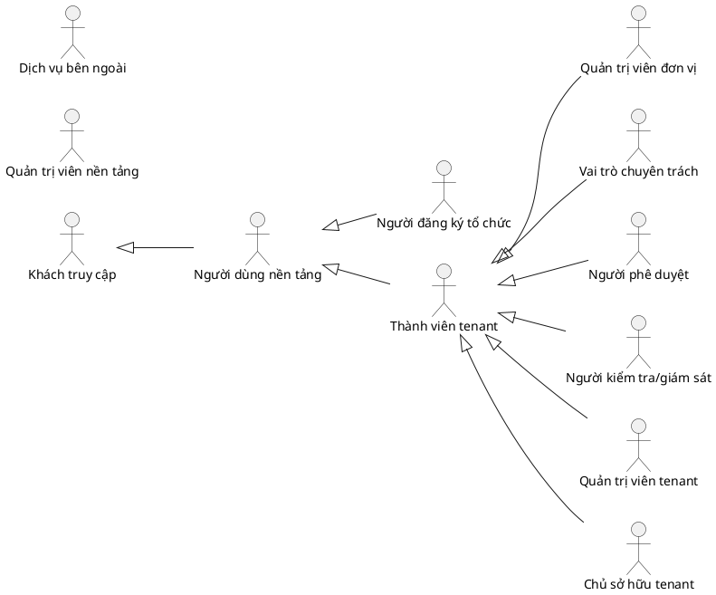

<!-- FILE: 00_README.md -->

# BỘ ĐẶC TẢ 21 NHÓM USE CASE — OPERATIONS HUB

## 1. Mục đích

Bộ tài liệu này mô tả toàn bộ 21 nhóm Use Case của Operations Hub theo định hướng nền tảng SaaS đa tổ chức dành cho tổ chức sinh viên. hệ thống vận hành tham chiếu được sử dụng như trường hợp tham chiếu nghiệp vụ, không phải cấu hình bắt buộc của nền tảng.

## 2. Cấu trúc bộ tài liệu

- `00_README.md`: chỉ mục và quy ước.
- `00_Actors.md`: danh mục actor chính thức.
- `00_Use_Case_Tong_Quat.md`: sơ đồ tổng quát 21 nhóm Use Case.
- `00_Traceability_Matrix.md`: ma trận phụ thuộc và truy vết.
- `00_Sub_UseCase_Catalog.md`: danh mục hợp nhất toàn bộ use case thành phần, không giới hạn 10 use case mỗi nhóm.
- `01_...` đến `21_...`: đặc tả từng nhóm Use Case.
- `Operations_Hub_21UC_Combined.md`: bản hợp nhất để đọc hoặc chuyển đổi định dạng.

## 3. Danh mục 21 nhóm Use Case

| STT | Mã                                           | Tên                                       | Miền                   | Mức ưu tiên phát triển        |
| --: | -------------------------------------------- | ----------------------------------------- | ---------------------- | ----------------------------- |
|   1 | [`UC-TENANT`](./01_UC-TENANT.md)             | Quản trị nền tảng SaaS và tenant          | Nền tảng SaaS          | Nền tảng bắt buộc             |
|   2 | [`UC-AUTH`](./02_UC-AUTH.md)                 | Xác thực và quản lý phiên                 | Danh tính và truy cập  | Nền tảng bắt buộc             |
|   3 | [`UC-USER`](./03_UC-USER.md)                 | Quản lý tài khoản người dùng              | Danh tính và truy cập  | Nền tảng bắt buộc             |
|   4 | [`UC-RBAC`](./04_UC-RBAC.md)                 | Quản lý vai trò và phân quyền             | Danh tính và truy cập  | Nền tảng bắt buộc             |
|   5 | [`UC-ORG`](./05_UC-ORG.md)                   | Quản lý thông tin và cơ cấu tổ chức       | Quản trị tổ chức       | Nền tảng bắt buộc             |
|   6 | [`UC-BRAND`](./06_UC-BRAND.md)               | Quản lý branding và giao diện tổ chức     | Quản trị tổ chức       | Nền tảng bắt buộc             |
|   7 | [`UC-MODULE`](./07_UC-MODULE.md)             | Cấu hình module và quy trình nghiệp vụ    | Quản trị tổ chức       | Nền tảng bắt buộc             |
|   8 | [`UC-SETTING`](./08_UC-SETTING.md)           | Thiết lập cá nhân                         | Trải nghiệm người dùng | Năng lực dùng chung           |
|   9 | [`UC-MEMBER`](./09_UC-MEMBER.md)             | Quản lý thành viên và membership          | Nhân sự tổ chức        | Nền tảng bắt buộc             |
|  10 | [`UC-REQUEST`](./10_UC-REQUEST.md)           | Quản lý đơn từ và yêu cầu nội bộ          | Quy trình nghiệp vụ    | Mô-đun vận hành               |
|  11 | [`UC-DOCUMENT`](./11_UC-DOCUMENT.md)         | Quản lý văn bản, biểu mẫu và mẫu tài liệu | Quản trị nội dung      | Mô-đun vận hành               |
|  12 | [`UC-FINANCE`](./12_UC-FINANCE.md)           | Quản lý tài chính và ngân sách            | Tài chính nội bộ       | Mô-đun vận hành               |
|  13 | [`UC-ASSET`](./13_UC-ASSET.md)               | Quản lý tài sản và hậu cần                | Tài sản và hậu cần     | Mô-đun vận hành               |
|  14 | [`UC-MEETING`](./14_UC-MEETING.md)           | Quản lý cuộc họp, sự kiện và chuyên cần   | Hoạt động tổ chức      | Mô-đun vận hành               |
|  15 | [`UC-DISCIPLINE`](./15_UC-DISCIPLINE.md)     | Quản lý kỷ luật và KPI                    | Quản trị thành viên    | Mô-đun vận hành               |
|  16 | [`UC-EVALUATION`](./16_UC-EVALUATION.md)     | Quản lý đánh giá thành viên               | Quản trị thành viên    | Mô-đun vận hành               |
|  17 | [`UC-COMPETITION`](./17_UC-COMPETITION.md)   | Quản lý cuộc thi, thành tích và ghi nhận  | Hoạt động tổ chức      | Mô-đun vận hành               |
|  18 | [`UC-NOTIFICATION`](./18_UC-NOTIFICATION.md) | Quản lý thông báo và truyền thông nội bộ  | Truyền thông nội bộ    | Năng lực dùng chung           |
|  19 | [`UC-DASHBOARD`](./19_UC-DASHBOARD.md)       | Dashboard, báo cáo và xuất dữ liệu        | Báo cáo và phân tích   | Năng lực dùng chung           |
|  20 | [`UC-AI`](./20_UC-AI.md)                     | Trợ lý AI và AI Gateway                   | Hỗ trợ thông minh      | Năng lực mở rộng có kiểm soát |
|  21 | [`UC-AUDIT`](./21_UC-AUDIT.md)               | Nhật ký hệ thống và truy vết hoạt động    | Quản trị và tuân thủ   | Nền tảng bắt buộc             |

## 4. Nguyên tắc bao phủ use case thành phần

1. Không giới hạn mỗi nhóm Use Case ở 10 use case thành phần.
2. Mỗi nhóm phải liệt kê toàn bộ use case có thể nhận diện hợp lý trong ranh giới sản phẩm, actor và quy tắc nghiệp vụ hiện hành.
3. Danh mục là baseline mở: nghiệp vụ mới được bổ sung mà không xóa hoặc gộp cơ học chỉ để giữ một số lượng cố định.
4. Use case thành phần phải biểu diễn mục tiêu có ý nghĩa đối với actor; endpoint API, nút giao diện và thao tác CRUD kỹ thuật không mặc nhiên là use case độc lập.
5. Các sơ đồ chi tiết được chia cụm khi số lượng use case lớn để bảo đảm khả năng đọc.

## 5. Quy ước mô hình

1. `User` là danh tính đăng nhập toàn cục.
2. `Tenant/Organization` là tổ chức sử dụng Operations Hub.
3. `Membership` là quan hệ giữa User và Tenant.
4. `Role` được gán cho Membership trong tenant, không gán trực tiếp cho User ở phạm vi toàn nền tảng.
5. Mọi nghiệp vụ phải chạy trong tenant context hợp lệ.
6. Dữ liệu nghiệp vụ, tệp, bản xuất, cache, thông báo và audit phải duy trì ranh giới tenant.
7. Platform Admin và Tenant Admin là hai actor độc lập.
8. Branding và module là cấu hình theo tenant; không được làm thay đổi logic phân quyền nền tảng.
9. Mức ưu tiên phát triển chỉ hỗ trợ lập lộ trình; cả 21 nhóm đều thuộc phạm vi sản phẩm tổng thể.

## 6. Quy ước mã

- Nhóm Use Case: `UC-<DOMAIN>`.
- Use Case thành phần: `UC-<DOMAIN>-NN`.
- Actor: `ACT-<ROLE>`.
- Tiêu chí chấp nhận: `AC-<DOMAIN>-NN`.
- Quy tắc nghiệp vụ chi tiết có thể ánh xạ sang `BR-NNN` trong tài liệu quy tắc nghiệp vụ.

## 7. Cách sử dụng

- Dùng `00_Use_Case_Tong_Quat.md` cho sơ đồ tổng quan trong báo cáo.
- Dùng từng file `UC-*.md` để phân rã thành use case nguyên tử, sequence diagram, API và test case.
- Dùng `00_Traceability_Matrix.md` để kiểm tra phụ thuộc, actor và thực thể xuyên module.
- Không trình bày một năng lực là đã hiện thực chỉ vì đã được đặc tả trong bộ tài liệu này; trạng thái triển khai phải được theo dõi riêng.


## 8. Thống kê phiên bản 2.0

- Tổng số nhóm Use Case: **21**.
- Tổng số use case thành phần đã nhận diện: **841**.
- Số use case thành phần theo nhóm: xem `00_Sub_UseCase_Catalog.md` và `00_Traceability_Matrix.md`.


---

<!-- FILE: 00_CHANGELOG_v2.md -->

# CHANGELOG — BỘ 21 NHÓM USE CASE

## Phiên bản 2.0

- Loại bỏ giả định cố định 10 use case thành phần cho mỗi nhóm.
- Mở rộng danh mục thành **841 use case thành phần** trong 21 nhóm.
- Bổ sung `00_Sub_UseCase_Catalog.md`.
- Cập nhật ma trận truy vết với số lượng use case thành phần theo nhóm.
- Chia sơ đồ chi tiết thành các cụm tối đa 10 use case để bảo đảm khả năng đọc; giới hạn này chỉ áp dụng cho một khối sơ đồ, không áp dụng cho phạm vi nghiệp vụ.
- Làm rõ rằng use case là mục tiêu actor, không phải endpoint hoặc thao tác CRUD kỹ thuật.


---

<!-- FILE: 00_Actors.md -->

# CÁC TÁC NHÂN TRONG HỆ THỐNG OPERATIONS HUB

## 1. Nguyên tắc

Actor biểu diễn vai trò tương tác với hệ thống, không đồng nhất với tài khoản, chức danh thực tế hoặc role kỹ thuật. Một User có thể đóng nhiều actor ở các tenant khác nhau; quyền thực tế luôn được tính từ membership, role, permission và scope.

## 2. Danh mục actor chính thức

| STT | Mã actor | Tên actor |
|---:|---|---|
| 1 | `ACT-GUEST` | Khách truy cập |
| 2 | `ACT-PLATFORM-USER` | Người dùng nền tảng |
| 3 | `ACT-ORG-REGISTRANT` | Người đăng ký tổ chức |
| 4 | `ACT-PLATFORM-ADMIN` | Quản trị viên nền tảng |
| 5 | `ACT-TENANT-MEMBER` | Thành viên tenant |
| 6 | `ACT-UNIT-ADMIN` | Quản trị viên đơn vị trực thuộc |
| 7 | `ACT-MODULE-SPECIALIST` | Vai trò chuyên trách theo mô-đun |
| 8 | `ACT-APPROVER` | Người phê duyệt |
| 9 | `ACT-TENANT-ADMIN` | Quản trị viên tenant |
| 10 | `ACT-TENANT-OWNER` | Chủ sở hữu tenant |
| 11 | `ACT-AUDITOR` | Người kiểm tra hoặc giám sát |
| 12 | `ACT-EXTERNAL-SERVICE` | Dịch vụ bên ngoài |

## 3. Phân loại

- **Cấp nền tảng:** `ACT-GUEST`, `ACT-PLATFORM-USER`, `ACT-ORG-REGISTRANT`, `ACT-PLATFORM-ADMIN`.
- **Trong tenant:** `ACT-TENANT-MEMBER`, `ACT-UNIT-ADMIN`, `ACT-MODULE-SPECIALIST`, `ACT-APPROVER`, `ACT-TENANT-ADMIN`, `ACT-TENANT-OWNER`, `ACT-AUDITOR`.
- **Bên ngoài:** `ACT-EXTERNAL-SERVICE` và các biến thể như Identity Service, Storage Service, Notification Service, Payment Service, AI Provider.

## 4. Ma trận actor – Use Case

| Use Case | Actor liên quan |
|---|---|
| `UC-TENANT` | `ACT-GUEST`, `ACT-PLATFORM-USER`, `ACT-ORG-REGISTRANT`, `ACT-TENANT-OWNER`, `ACT-PLATFORM-ADMIN`, `ACT-EXTERNAL-SERVICE` |
| `UC-AUTH` | `ACT-GUEST`, `ACT-PLATFORM-USER`, `ACT-EXTERNAL-SERVICE` |
| `UC-USER` | `ACT-PLATFORM-USER`, `ACT-TENANT-ADMIN`, `ACT-PLATFORM-ADMIN` |
| `UC-RBAC` | `ACT-TENANT-ADMIN`, `ACT-TENANT-OWNER`, `ACT-UNIT-ADMIN`, `ACT-PLATFORM-ADMIN` |
| `UC-ORG` | `ACT-TENANT-ADMIN`, `ACT-TENANT-OWNER`, `ACT-UNIT-ADMIN`, `ACT-ORG-REGISTRANT` |
| `UC-BRAND` | `ACT-TENANT-ADMIN`, `ACT-TENANT-OWNER`, `ACT-EXTERNAL-SERVICE` |
| `UC-MODULE` | `ACT-TENANT-ADMIN`, `ACT-TENANT-OWNER`, `ACT-PLATFORM-ADMIN` |
| `UC-SETTING` | `ACT-PLATFORM-USER`, `ACT-TENANT-MEMBER` |
| `UC-MEMBER` | `ACT-TENANT-MEMBER`, `ACT-UNIT-ADMIN`, `ACT-MODULE-SPECIALIST`, `ACT-TENANT-ADMIN` |
| `UC-REQUEST` | `ACT-TENANT-MEMBER`, `ACT-MODULE-SPECIALIST`, `ACT-APPROVER` |
| `UC-DOCUMENT` | `ACT-TENANT-MEMBER`, `ACT-MODULE-SPECIALIST`, `ACT-APPROVER`, `ACT-AUDITOR`, `ACT-EXTERNAL-SERVICE` |
| `UC-FINANCE` | `ACT-TENANT-MEMBER`, `ACT-MODULE-SPECIALIST`, `ACT-APPROVER`, `ACT-TENANT-ADMIN`, `ACT-AUDITOR`, `ACT-EXTERNAL-SERVICE` |
| `UC-ASSET` | `ACT-TENANT-MEMBER`, `ACT-MODULE-SPECIALIST`, `ACT-UNIT-ADMIN` |
| `UC-MEETING` | `ACT-TENANT-MEMBER`, `ACT-MODULE-SPECIALIST`, `ACT-UNIT-ADMIN` |
| `UC-DISCIPLINE` | `ACT-TENANT-MEMBER`, `ACT-MODULE-SPECIALIST`, `ACT-APPROVER`, `ACT-AUDITOR` |
| `UC-EVALUATION` | `ACT-TENANT-MEMBER`, `ACT-MODULE-SPECIALIST`, `ACT-UNIT-ADMIN`, `ACT-AUDITOR` |
| `UC-COMPETITION` | `ACT-TENANT-MEMBER`, `ACT-MODULE-SPECIALIST`, `ACT-UNIT-ADMIN` |
| `UC-NOTIFICATION` | `ACT-TENANT-MEMBER`, `ACT-MODULE-SPECIALIST`, `ACT-EXTERNAL-SERVICE` |
| `UC-DASHBOARD` | `ACT-TENANT-OWNER`, `ACT-TENANT-ADMIN`, `ACT-UNIT-ADMIN`, `ACT-MODULE-SPECIALIST`, `ACT-PLATFORM-ADMIN`, `ACT-AUDITOR` |
| `UC-AI` | `ACT-PLATFORM-USER`, `ACT-TENANT-ADMIN`, `ACT-PLATFORM-ADMIN`, `ACT-EXTERNAL-SERVICE` |
| `UC-AUDIT` | `ACT-AUDITOR`, `ACT-TENANT-ADMIN`, `ACT-TENANT-OWNER`, `ACT-PLATFORM-ADMIN` |

## 5. Quan hệ khái quát



Quan hệ khái quát trên không phải cơ chế kế thừa permission. Platform Admin không mặc nhiên có quyền nghiệp vụ trong tenant.


---

<!-- FILE: 00_Use_Case_Tong_Quat.md -->

# USE CASE DIAGRAM TỔNG QUÁT — OPERATIONS HUB

## 1. Phạm vi

Sơ đồ bao phủ 21 nhóm Use Case của sản phẩm hoàn chỉnh. Mỗi nhóm tiếp tục được phân rã trong file riêng thành các use case thành phần.

> **Lưu ý phân rã:** 21 phần tử trong sơ đồ này là **nhóm Use Case/miền chức năng**, không phải giới hạn số use case nguyên tử. Phiên bản 2.0 hiện nhận diện 841 use case thành phần và tiếp tục mở rộng khi có nghiệp vụ hợp lệ mới.

## 2. Danh sách nhóm

- `UC-TENANT` — Quản trị nền tảng SaaS và tenant
- `UC-AUTH` — Xác thực và quản lý phiên
- `UC-USER` — Quản lý tài khoản người dùng
- `UC-RBAC` — Quản lý vai trò và phân quyền
- `UC-ORG` — Quản lý thông tin và cơ cấu tổ chức
- `UC-BRAND` — Quản lý branding và giao diện tổ chức
- `UC-MODULE` — Cấu hình module và quy trình nghiệp vụ
- `UC-SETTING` — Thiết lập cá nhân
- `UC-MEMBER` — Quản lý thành viên và membership
- `UC-REQUEST` — Quản lý đơn từ và yêu cầu nội bộ
- `UC-DOCUMENT` — Quản lý văn bản, biểu mẫu và mẫu tài liệu
- `UC-FINANCE` — Quản lý tài chính và ngân sách
- `UC-ASSET` — Quản lý tài sản và hậu cần
- `UC-MEETING` — Quản lý cuộc họp, sự kiện và chuyên cần
- `UC-DISCIPLINE` — Quản lý kỷ luật và KPI
- `UC-EVALUATION` — Quản lý đánh giá thành viên
- `UC-COMPETITION` — Quản lý cuộc thi, thành tích và ghi nhận
- `UC-NOTIFICATION` — Quản lý thông báo và truyền thông nội bộ
- `UC-DASHBOARD` — Dashboard, báo cáo và xuất dữ liệu
- `UC-AI` — Trợ lý AI và AI Gateway
- `UC-AUDIT` — Nhật ký hệ thống và truy vết hoạt động

## 3. PlantUML

```plantuml
@startuml
left to right direction
skinparam packageStyle rectangle
skinparam linetype ortho
actor "Khách truy cập" as Guest
actor "Người dùng nền tảng" as PlatformUser
actor "Người đăng ký tổ chức" as Registrant
actor "Quản trị viên nền tảng" as PlatformAdmin
actor "Thành viên tenant" as TenantMember
actor "Quản trị viên đơn vị" as UnitAdmin
actor "Vai trò chuyên trách" as Specialist
actor "Người phê duyệt" as Approver
actor "Quản trị viên tenant" as TenantAdmin
actor "Chủ sở hữu tenant" as TenantOwner
actor "Người kiểm tra/giám sát" as Auditor
actor "Dịch vụ bên ngoài" as ExternalService

package "Nền tảng SaaS và danh tính" {
  usecase "UC-TENANT\nQuản trị nền tảng SaaS và tenant" as UC_TENANT
  usecase "UC-AUTH\nXác thực và quản lý phiên" as UC_AUTH
  usecase "UC-USER\nQuản lý tài khoản người dùng" as UC_USER
  usecase "UC-RBAC\nQuản lý vai trò và phân quyền" as UC_RBAC
}
package "Quản trị tổ chức" {
  usecase "UC-ORG\nQuản lý thông tin và cơ cấu tổ chức" as UC_ORG
  usecase "UC-BRAND\nQuản lý branding và giao diện tổ chức" as UC_BRAND
  usecase "UC-MODULE\nCấu hình module và quy trình nghiệp vụ" as UC_MODULE
  usecase "UC-SETTING\nThiết lập cá nhân" as UC_SETTING
  usecase "UC-MEMBER\nQuản lý thành viên và membership" as UC_MEMBER
}
package "Mô-đun vận hành" {
  usecase "UC-REQUEST\nQuản lý đơn từ và yêu cầu nội bộ" as UC_REQUEST
  usecase "UC-DOCUMENT\nQuản lý văn bản, biểu mẫu và mẫu tài liệu" as UC_DOCUMENT
  usecase "UC-FINANCE\nQuản lý tài chính và ngân sách" as UC_FINANCE
  usecase "UC-ASSET\nQuản lý tài sản và hậu cần" as UC_ASSET
  usecase "UC-MEETING\nQuản lý cuộc họp, sự kiện và chuyên cần" as UC_MEETING
  usecase "UC-DISCIPLINE\nQuản lý kỷ luật và KPI" as UC_DISCIPLINE
  usecase "UC-EVALUATION\nQuản lý đánh giá thành viên" as UC_EVALUATION
  usecase "UC-COMPETITION\nQuản lý cuộc thi, thành tích và ghi nhận" as UC_COMPETITION
  usecase "UC-NOTIFICATION\nQuản lý thông báo và truyền thông nội bộ" as UC_NOTIFICATION
}
package "Báo cáo, AI và kiểm soát" {
  usecase "UC-DASHBOARD\nDashboard, báo cáo và xuất dữ liệu" as UC_DASHBOARD
  usecase "UC-AI\nTrợ lý AI và AI Gateway" as UC_AI
  usecase "UC-AUDIT\nNhật ký hệ thống và truy vết hoạt động" as UC_AUDIT
}

Guest --> UC_AUTH
Guest --> UC_TENANT
PlatformUser --> UC_AUTH
PlatformUser --> UC_USER
PlatformUser --> UC_SETTING
Registrant --> UC_TENANT
Registrant --> UC_ORG
PlatformAdmin --> UC_TENANT
PlatformAdmin --> UC_USER
PlatformAdmin --> UC_RBAC
PlatformAdmin --> UC_MODULE
PlatformAdmin --> UC_DASHBOARD
PlatformAdmin --> UC_AI
PlatformAdmin --> UC_AUDIT
TenantMember --> UC_MEMBER
TenantMember --> UC_REQUEST
TenantMember --> UC_DOCUMENT
TenantMember --> UC_FINANCE
TenantMember --> UC_ASSET
TenantMember --> UC_MEETING
TenantMember --> UC_DISCIPLINE
TenantMember --> UC_EVALUATION
TenantMember --> UC_COMPETITION
TenantMember --> UC_NOTIFICATION
UnitAdmin --> UC_ORG
UnitAdmin --> UC_MEMBER
UnitAdmin --> UC_MEETING
UnitAdmin --> UC_EVALUATION
UnitAdmin --> UC_DASHBOARD
Specialist --> UC_REQUEST
Specialist --> UC_DOCUMENT
Specialist --> UC_FINANCE
Specialist --> UC_ASSET
Specialist --> UC_MEETING
Specialist --> UC_DISCIPLINE
Specialist --> UC_EVALUATION
Specialist --> UC_COMPETITION
Specialist --> UC_NOTIFICATION
Approver --> UC_REQUEST
Approver --> UC_DOCUMENT
Approver --> UC_FINANCE
Approver --> UC_DISCIPLINE
TenantAdmin --> UC_ORG
TenantAdmin --> UC_BRAND
TenantAdmin --> UC_MODULE
TenantAdmin --> UC_MEMBER
TenantAdmin --> UC_RBAC
TenantAdmin --> UC_DASHBOARD
TenantAdmin --> UC_AUDIT
TenantOwner --> UC_TENANT
TenantOwner --> UC_RBAC
TenantOwner --> UC_ORG
TenantOwner --> UC_BRAND
TenantOwner --> UC_MODULE
TenantOwner --> UC_DASHBOARD
TenantOwner --> UC_AUDIT
Auditor --> UC_DOCUMENT
Auditor --> UC_FINANCE
Auditor --> UC_DISCIPLINE
Auditor --> UC_EVALUATION
Auditor --> UC_DASHBOARD
Auditor --> UC_AUDIT
ExternalService --> UC_AUTH
ExternalService --> UC_TENANT
ExternalService --> UC_DOCUMENT
ExternalService --> UC_FINANCE
ExternalService --> UC_NOTIFICATION
ExternalService --> UC_AI
@enduml
```



## 4. Lưu ý đọc sơ đồ

- Đường liên kết chỉ thể hiện actor có thể tham gia nhóm Use Case, không thay thế ma trận permission.
- `UC-AUDIT` là năng lực xuyên suốt; các module khác phát sinh audit event dù không thể hiện quan hệ `include` để tránh sơ đồ quá dày.
- `UC-NOTIFICATION`, `UC-DOCUMENT` và `UC-DASHBOARD` cũng là năng lực dùng chung được nhiều module gọi.


---

<!-- FILE: 00_Traceability_Matrix.md -->

# MA TRẬN TRUY VẾT 21 NHÓM USE CASE

## 1. Ma trận tổng hợp

| Use Case | Số UC thành phần | Actor | Phụ thuộc/chức năng dùng chung | Thực thể logic chính | Mức ưu tiên |
|---|---:|---|---|---|---|
| `UC-TENANT` | 50 | ACT-GUEST, ACT-PLATFORM-USER, ACT-ORG-REGISTRANT, ACT-TENANT-OWNER, ACT-PLATFORM-ADMIN, ACT-EXTERNAL-SERVICE | UC-AUTH, UC-USER, UC-RBAC, UC-ORG, UC-MODULE, UC-AUDIT | Tenant, TenantRegistration, Membership, Role | Nền tảng bắt buộc |
| `UC-AUTH` | 36 | ACT-GUEST, ACT-PLATFORM-USER, ACT-EXTERNAL-SERVICE | UC-USER, UC-TENANT, UC-AUDIT | User, Credential, Session, RefreshToken | Nền tảng bắt buộc |
| `UC-USER` | 33 | ACT-PLATFORM-USER, ACT-TENANT-ADMIN, ACT-PLATFORM-ADMIN | UC-AUTH, UC-TENANT, UC-MEMBER, UC-AUDIT | User, UserProfile, UserStatusHistory, Membership | Nền tảng bắt buộc |
| `UC-RBAC` | 38 | ACT-TENANT-ADMIN, ACT-TENANT-OWNER, ACT-UNIT-ADMIN, ACT-PLATFORM-ADMIN | UC-TENANT, UC-ORG, UC-MEMBER, UC-MODULE, UC-AUDIT | Role, Permission, RolePermission, MembershipRole | Nền tảng bắt buộc |
| `UC-ORG` | 34 | ACT-TENANT-ADMIN, ACT-TENANT-OWNER, ACT-UNIT-ADMIN, ACT-ORG-REGISTRANT | UC-TENANT, UC-MEMBER, UC-RBAC, UC-AUDIT | OrganizationProfile, OrganizationUnit, Position, UnitMembership | Nền tảng bắt buộc |
| `UC-BRAND` | 35 | ACT-TENANT-ADMIN, ACT-TENANT-OWNER, ACT-EXTERNAL-SERVICE | UC-TENANT, UC-AUDIT, UC-SETTING | BrandingConfiguration, BrandingVersion, BrandingAsset, ThemeToken | Nền tảng bắt buộc |
| `UC-MODULE` | 36 | ACT-TENANT-ADMIN, ACT-TENANT-OWNER, ACT-PLATFORM-ADMIN | UC-TENANT, UC-RBAC, UC-AUDIT | ModuleCatalog, TenantModule, ModuleDependency, ModuleConfiguration | Nền tảng bắt buộc |
| `UC-SETTING` | 28 | ACT-PLATFORM-USER, ACT-TENANT-MEMBER | UC-AUTH, UC-USER, UC-TENANT, UC-NOTIFICATION | UserSetting, TenantUserSetting, NotificationPreference, AccessibilityPreference | Năng lực dùng chung |
| `UC-MEMBER` | 41 | ACT-TENANT-MEMBER, ACT-UNIT-ADMIN, ACT-MODULE-SPECIALIST, ACT-TENANT-ADMIN | UC-USER, UC-TENANT, UC-ORG, UC-RBAC, UC-NOTIFICATION, UC-AUDIT | Membership, MembershipInvitation, MemberProfile, MembershipStatusHistory | Nền tảng bắt buộc |
| `UC-REQUEST` | 43 | ACT-TENANT-MEMBER, ACT-MODULE-SPECIALIST, ACT-APPROVER | UC-MEMBER, UC-RBAC, UC-DOCUMENT, UC-FINANCE, UC-NOTIFICATION, UC-AUDIT | RequestType, Request, RequestFieldValue, ApprovalWorkflow | Mô-đun vận hành |
| `UC-DOCUMENT` | 46 | ACT-TENANT-MEMBER, ACT-MODULE-SPECIALIST, ACT-APPROVER, ACT-AUDITOR, ACT-EXTERNAL-SERVICE | UC-RBAC, UC-REQUEST, UC-NOTIFICATION, UC-AUDIT | DocumentType, DocumentTemplate, Document, DocumentVersion | Mô-đun vận hành |
| `UC-FINANCE` | 52 | ACT-TENANT-MEMBER, ACT-MODULE-SPECIALIST, ACT-APPROVER, ACT-TENANT-ADMIN, ACT-AUDITOR, ACT-EXTERNAL-SERVICE | UC-REQUEST, UC-DOCUMENT, UC-RBAC, UC-DASHBOARD, UC-AUDIT | Fund, FinancialAccount, Budget, BudgetLine | Mô-đun vận hành |
| `UC-ASSET` | 46 | ACT-TENANT-MEMBER, ACT-MODULE-SPECIALIST, ACT-UNIT-ADMIN | UC-MEMBER, UC-ORG, UC-REQUEST, UC-DOCUMENT, UC-AUDIT | AssetCategory, Asset, AssetItem, InventoryBalance | Mô-đun vận hành |
| `UC-MEETING` | 40 | ACT-TENANT-MEMBER, ACT-MODULE-SPECIALIST, ACT-UNIT-ADMIN | UC-MEMBER, UC-ORG, UC-NOTIFICATION, UC-DOCUMENT, UC-DISCIPLINE, UC-AUDIT | Meeting, MeetingParticipant, AttendanceRecord, CheckInToken | Mô-đun vận hành |
| `UC-DISCIPLINE` | 34 | ACT-TENANT-MEMBER, ACT-MODULE-SPECIALIST, ACT-APPROVER, ACT-AUDITOR | UC-MEMBER, UC-MEETING, UC-DOCUMENT, UC-NOTIFICATION, UC-AUDIT | DisciplineCase, ViolationType, Evidence, Explanation | Mô-đun vận hành |
| `UC-EVALUATION` | 43 | ACT-TENANT-MEMBER, ACT-MODULE-SPECIALIST, ACT-UNIT-ADMIN, ACT-AUDITOR | UC-MEMBER, UC-ORG, UC-RBAC, UC-DOCUMENT, UC-NOTIFICATION, UC-AUDIT | EvaluationCycle, EvaluationCriterion, CriterionVersion, EvaluationAssignment | Mô-đun vận hành |
| `UC-COMPETITION` | 40 | ACT-TENANT-MEMBER, ACT-MODULE-SPECIALIST, ACT-UNIT-ADMIN | UC-MEMBER, UC-DOCUMENT, UC-NOTIFICATION, UC-DASHBOARD, UC-AUDIT | Competition, CompetitionRegistration, CompetitionTeam, TeamMember | Mô-đun vận hành |
| `UC-NOTIFICATION` | 42 | ACT-TENANT-MEMBER, ACT-MODULE-SPECIALIST, ACT-EXTERNAL-SERVICE | UC-MEMBER, UC-SETTING, UC-AUDIT | NotificationTemplate, Notification, NotificationAudience, NotificationRecipient | Năng lực dùng chung |
| `UC-DASHBOARD` | 40 | ACT-TENANT-OWNER, ACT-TENANT-ADMIN, ACT-UNIT-ADMIN, ACT-MODULE-SPECIALIST, ACT-PLATFORM-ADMIN, ACT-AUDITOR | UC-RBAC, UC-MODULE, UC-AUDIT, UC-NOTIFICATION | DashboardDefinition, WidgetDefinition, MetricDefinition, ReportDefinition | Năng lực dùng chung |
| `UC-AI` | 44 | ACT-PLATFORM-USER, ACT-TENANT-ADMIN, ACT-PLATFORM-ADMIN, ACT-EXTERNAL-SERVICE | UC-RBAC, UC-MODULE, UC-DASHBOARD, UC-DOCUMENT, UC-NOTIFICATION, UC-AUDIT | AIProviderConfiguration, AIModel, PromptTemplate, AIRequest | Năng lực mở rộng có kiểm soát |
| `UC-AUDIT` | 40 | ACT-AUDITOR, ACT-TENANT-ADMIN, ACT-TENANT-OWNER, ACT-PLATFORM-ADMIN | UC-TENANT, UC-AUTH, UC-RBAC | AuditEvent, SecurityEvent, CorrelationContext, AuditExport | Nền tảng bắt buộc |

**Tổng số use case thành phần đã nhận diện: 841.**

## 2. Năng lực xuyên suốt

| Năng lực | Nhóm Use Case chịu trách nhiệm chính | Nhóm sử dụng |
|---|---|---|
| Xác thực và phiên | `UC-AUTH` | Toàn bộ use case không công khai |
| Tenant context | `UC-TENANT` | Toàn bộ nghiệp vụ tenant |
| Membership | `UC-MEMBER` | RBAC và các module vận hành |
| Phân quyền | `UC-RBAC` | Toàn bộ hành động được bảo vệ |
| Thông báo | `UC-NOTIFICATION` | Request, Document, Finance, Meeting, Discipline, Evaluation, Competition, Dashboard |
| Tệp và văn bản | `UC-DOCUMENT` | Request, Finance, Meeting, Discipline, Evaluation, Competition |
| Báo cáo | `UC-DASHBOARD` | Toàn bộ module có dữ liệu tổng hợp |
| Audit | `UC-AUDIT` | Toàn bộ hành động quản trị và nghiệp vụ quan trọng |
| AI | `UC-AI` | Năng lực tùy chọn, không phải dependency bắt buộc của nghiệp vụ lõi |

## 3. Rủi ro cần kiểm soát khi phân rã

- Ánh xạ một service kỹ thuật cho mỗi nhóm Use Case là giả định sai; ranh giới service phải theo miền nghiệp vụ và dữ liệu nhất quán.
- Dùng `organization_id` đơn lẻ không đủ bảo đảm cô lập tenant; phải kiểm soát truy vấn, tệp, cache, tác vụ nền và bản xuất.
- Gán role trực tiếp cho User làm sai mô hình đa tổ chức; role phải gắn với Membership.
- Đặc tả Use Case không chứng minh chức năng đã được hiện thực; cần ma trận Requirement–Design–Code–Test riêng.


---

<!-- FILE: 00_Sub_UseCase_Catalog.md -->

# DANH MỤC TOÀN BỘ USE CASE THÀNH PHẦN — OPERATIONS HUB

## 1. Nguyên tắc bao phủ

- Không giới hạn mỗi nhóm ở 10 use case thành phần.
- Danh mục này liệt kê toàn bộ use case có thể nhận diện hợp lý trong phạm vi 21 nhóm Use Case và các quy tắc nghiệp vụ hiện hành.
- 'Toàn bộ' được hiểu theo ranh giới sản phẩm đã xác lập, không bao gồm mọi giả thuyết chức năng có thể xuất hiện trong tương lai mà chưa có nhu cầu, actor hoặc quy tắc nghiệp vụ.
- Use case mới được bổ sung theo cơ chế mở; không tái sử dụng mã cũ và không xóa use case chỉ để duy trì số lượng cố định.
- Không tách một use case thành các thao tác kỹ thuật nhỏ nếu các thao tác đó không tạo thành mục tiêu độc lập của actor.

## 2. Thống kê

| Nhóm | Số use case thành phần |
|---|---:|
| `UC-TENANT` | 50 |
| `UC-AUTH` | 36 |
| `UC-USER` | 33 |
| `UC-RBAC` | 38 |
| `UC-ORG` | 34 |
| `UC-BRAND` | 35 |
| `UC-MODULE` | 36 |
| `UC-SETTING` | 28 |
| `UC-MEMBER` | 41 |
| `UC-REQUEST` | 43 |
| `UC-DOCUMENT` | 46 |
| `UC-FINANCE` | 52 |
| `UC-ASSET` | 46 |
| `UC-MEETING` | 40 |
| `UC-DISCIPLINE` | 34 |
| `UC-EVALUATION` | 43 |
| `UC-COMPETITION` | 40 |
| `UC-NOTIFICATION` | 42 |
| `UC-DASHBOARD` | 40 |
| `UC-AI` | 44 |
| `UC-AUDIT` | 40 |
| **Tổng cộng** | **841** |

## 3. Danh mục chi tiết

### UC-TENANT — Quản trị nền tảng SaaS và tenant

| Mã | Use Case thành phần | Mô tả |
|---|---|---|
| `UC-TENANT-01` | Bắt đầu đăng ký tổ chức | Khởi tạo đăng ký tổ chức; phải kiểm tra quyền, trạng thái và phạm vi nền tảng trước khi ghi nhận kết quả. |
| `UC-TENANT-02` | Lưu nháp hồ sơ đăng ký tổ chức | Cho phép lưu nháp hồ sơ đăng ký tổ chức; phải kiểm tra quyền, trạng thái và phạm vi nền tảng trước khi ghi nhận kết quả. |
| `UC-TENANT-03` | Kiểm tra điều kiện đăng ký tổ chức | Kiểm tra điều kiện đăng ký tổ chức; phải kiểm tra quyền, trạng thái và phạm vi nền tảng trước khi ghi nhận kết quả. |
| `UC-TENANT-04` | Chuẩn hóa và kiểm tra tên định danh | Thực hiện nghiệp vụ “Chuẩn hóa và kiểm tra tên định danh” trong đúng phạm vi nền tảng, có kiểm tra dữ liệu, quyền và trạng thái liên quan. |
| `UC-TENANT-05` | Chuẩn hóa và kiểm tra slug | Thực hiện nghiệp vụ “Chuẩn hóa và kiểm tra slug” trong đúng phạm vi nền tảng, có kiểm tra dữ liệu, quyền và trạng thái liên quan. |
| `UC-TENANT-06` | Kiểm tra tên miền hoặc subdomain mong muốn | Kiểm tra tên miền hoặc subdomain mong muốn; phải kiểm tra quyền, trạng thái và phạm vi nền tảng trước khi ghi nhận kết quả. |
| `UC-TENANT-07` | Cung cấp thông tin người đại diện | Thực hiện nghiệp vụ “Cung cấp thông tin người đại diện” trong đúng phạm vi nền tảng, có kiểm tra dữ liệu, quyền và trạng thái liên quan. |
| `UC-TENANT-08` | Tải lên minh chứng đăng ký tổ chức | Cho phép tải lên minh chứng đăng ký tổ chức; phải kiểm tra quyền, trạng thái và phạm vi nền tảng trước khi ghi nhận kết quả. |
| `UC-TENANT-09` | Xác minh email hoặc số điện thoại người đăng ký | Thực hiện nghiệp vụ “Xác minh email hoặc số điện thoại người đăng ký” trong đúng phạm vi nền tảng, có kiểm tra dữ liệu, quyền và trạng thái liên quan. |
| `UC-TENANT-10` | Chấp nhận điều khoản sử dụng nền tảng | Thực hiện nghiệp vụ “Chấp nhận điều khoản sử dụng nền tảng” trong đúng phạm vi nền tảng, có kiểm tra dữ liệu, quyền và trạng thái liên quan. |
| `UC-TENANT-11` | Gửi hồ sơ đăng ký tổ chức | Cho phép gửi hồ sơ đăng ký tổ chức; phải kiểm tra quyền, trạng thái và phạm vi nền tảng trước khi ghi nhận kết quả. |
| `UC-TENANT-12` | Theo dõi trạng thái hồ sơ đăng ký | Cho phép theo dõi trạng thái hồ sơ đăng ký; phải kiểm tra quyền, trạng thái và phạm vi nền tảng trước khi ghi nhận kết quả. |
| `UC-TENANT-13` | Yêu cầu bổ sung hoặc chỉnh sửa hồ sơ đăng ký | Thực hiện nghiệp vụ “Yêu cầu bổ sung hoặc chỉnh sửa hồ sơ đăng ký” trong đúng phạm vi nền tảng, có kiểm tra dữ liệu, quyền và trạng thái liên quan. |
| `UC-TENANT-14` | Bổ sung hồ sơ đăng ký theo yêu cầu | Thực hiện nghiệp vụ “Bổ sung hồ sơ đăng ký theo yêu cầu” trong đúng phạm vi nền tảng, có kiểm tra dữ liệu, quyền và trạng thái liên quan. |
| `UC-TENANT-15` | Rút hồ sơ đăng ký tổ chức | Thực hiện nghiệp vụ “Rút hồ sơ đăng ký tổ chức” trong đúng phạm vi nền tảng, có kiểm tra dữ liệu, quyền và trạng thái liên quan. |
| `UC-TENANT-16` | Tiếp nhận và phân công xử lý hồ sơ đăng ký | Thực hiện nghiệp vụ “Tiếp nhận và phân công xử lý hồ sơ đăng ký” trong đúng phạm vi nền tảng, có kiểm tra dữ liệu, quyền và trạng thái liên quan. |
| `UC-TENANT-17` | Thẩm định hồ sơ đăng ký tổ chức | Thực hiện nghiệp vụ “Thẩm định hồ sơ đăng ký tổ chức” trong đúng phạm vi nền tảng, có kiểm tra dữ liệu, quyền và trạng thái liên quan. |
| `UC-TENANT-18` | Phê duyệt hồ sơ đăng ký tổ chức | Cho phép chủ thể có thẩm quyền phê duyệt hồ sơ đăng ký tổ chức; phải kiểm tra quyền, trạng thái và phạm vi nền tảng trước khi ghi nhận kết quả. |
| `UC-TENANT-19` | Từ chối hồ sơ đăng ký tổ chức | Cho phép chủ thể có thẩm quyền từ chối hồ sơ đăng ký tổ chức; phải kiểm tra quyền, trạng thái và phạm vi nền tảng trước khi ghi nhận kết quả. |
| `UC-TENANT-20` | Khởi tạo tenant | Cho phép khởi tạo tenant; phải kiểm tra quyền, trạng thái và phạm vi nền tảng trước khi ghi nhận kết quả. |
| `UC-TENANT-21` | Khởi tạo cấu hình mặc định cho tenant | Cho phép khởi tạo cấu hình mặc định cho tenant; phải kiểm tra quyền, trạng thái và phạm vi nền tảng trước khi ghi nhận kết quả. |
| `UC-TENANT-22` | Khởi tạo role và permission mặc định | Cho phép khởi tạo role và permission mặc định; phải kiểm tra quyền, trạng thái và phạm vi nền tảng trước khi ghi nhận kết quả. |
| `UC-TENANT-23` | Thiết lập Owner ban đầu | Cho phép thiết lập Owner ban đầu; phải kiểm tra quyền, trạng thái và phạm vi nền tảng trước khi ghi nhận kết quả. |
| `UC-TENANT-24` | Kích hoạt tenant | Cho phép kích hoạt tenant; phải kiểm tra quyền, trạng thái và phạm vi nền tảng trước khi ghi nhận kết quả. |
| `UC-TENANT-25` | Chọn gói dịch vụ hoặc phạm vi sử dụng | Cho phép lựa chọn gói dịch vụ hoặc phạm vi sử dụng; phải kiểm tra quyền, trạng thái và phạm vi nền tảng trước khi ghi nhận kết quả. |
| `UC-TENANT-26` | Cấu hình thông tin thanh toán và liên hệ dịch vụ | Cho phép cấu hình thông tin thanh toán và liên hệ dịch vụ; phải kiểm tra quyền, trạng thái và phạm vi nền tảng trước khi ghi nhận kết quả. |
| `UC-TENANT-27` | Xem danh sách tenant ở cấp nền tảng | Cho phép actor có quyền xem danh sách tenant ở cấp nền tảng; phải kiểm tra quyền, trạng thái và phạm vi nền tảng trước khi ghi nhận kết quả. |
| `UC-TENANT-28` | Tìm kiếm và lọc tenant | Thực hiện nghiệp vụ “Tìm kiếm và lọc tenant” trong đúng phạm vi nền tảng, có kiểm tra dữ liệu, quyền và trạng thái liên quan. |
| `UC-TENANT-29` | Xem chi tiết tenant | Cho phép actor có quyền xem chi tiết tenant; phải kiểm tra quyền, trạng thái và phạm vi nền tảng trước khi ghi nhận kết quả. |
| `UC-TENANT-30` | Cập nhật hồ sơ tenant | Cho phép cập nhật hồ sơ tenant; phải kiểm tra quyền, trạng thái và phạm vi nền tảng trước khi ghi nhận kết quả. |
| `UC-TENANT-31` | Xem lịch sử trạng thái tenant | Cho phép actor có quyền xem lịch sử trạng thái tenant; phải kiểm tra quyền, trạng thái và phạm vi nền tảng trước khi ghi nhận kết quả. |
| `UC-TENANT-32` | Tạm khóa tenant | Thực hiện nghiệp vụ “Tạm khóa tenant” trong đúng phạm vi nền tảng, có kiểm tra dữ liệu, quyền và trạng thái liên quan. |
| `UC-TENANT-33` | Khôi phục tenant bị tạm khóa | Cho phép khôi phục tenant bị tạm khóa; phải kiểm tra quyền, trạng thái và phạm vi nền tảng trước khi ghi nhận kết quả. |
| `UC-TENANT-34` | Lưu trữ tenant | Cho phép lưu trữ tenant; phải kiểm tra quyền, trạng thái và phạm vi nền tảng trước khi ghi nhận kết quả. |
| `UC-TENANT-35` | Khôi phục tenant đã lưu trữ | Cho phép khôi phục tenant đã lưu trữ; phải kiểm tra quyền, trạng thái và phạm vi nền tảng trước khi ghi nhận kết quả. |
| `UC-TENANT-36` | Chuyển quyền sở hữu tenant | Cho phép chuyển quyền sở hữu tenant; phải kiểm tra quyền, trạng thái và phạm vi nền tảng trước khi ghi nhận kết quả. |
| `UC-TENANT-37` | Bổ nhiệm thêm Owner | Thực hiện nghiệp vụ “Bổ nhiệm thêm Owner” trong đúng phạm vi nền tảng, có kiểm tra dữ liệu, quyền và trạng thái liên quan. |
| `UC-TENANT-38` | Thu hồi quyền Owner không phải Owner cuối cùng | Cho phép thu hồi quyền Owner không phải Owner cuối cùng; phải kiểm tra quyền, trạng thái và phạm vi nền tảng trước khi ghi nhận kết quả. |
| `UC-TENANT-39` | Xuất dữ liệu tenant | Cho phép xuất dữ liệu tenant; phải kiểm tra quyền, trạng thái và phạm vi nền tảng trước khi ghi nhận kết quả. |
| `UC-TENANT-40` | Yêu cầu đóng tenant | Thực hiện nghiệp vụ “Yêu cầu đóng tenant” trong đúng phạm vi nền tảng, có kiểm tra dữ liệu, quyền và trạng thái liên quan. |
| `UC-TENANT-41` | Hủy yêu cầu đóng tenant | Cho phép hủy yêu cầu đóng tenant; phải kiểm tra quyền, trạng thái và phạm vi nền tảng trước khi ghi nhận kết quả. |
| `UC-TENANT-42` | Đưa tenant vào thời gian chờ xóa | Thực hiện nghiệp vụ “Đưa tenant vào thời gian chờ xóa” trong đúng phạm vi nền tảng, có kiểm tra dữ liệu, quyền và trạng thái liên quan. |
| `UC-TENANT-43` | Khôi phục tenant trong thời gian chờ xóa | Cho phép khôi phục tenant trong thời gian chờ xóa; phải kiểm tra quyền, trạng thái và phạm vi nền tảng trước khi ghi nhận kết quả. |
| `UC-TENANT-44` | Thực hiện xóa hoặc ẩn danh dữ liệu tenant theo chính sách | Thực hiện xóa hoặc ẩn danh dữ liệu tenant theo chính sách; phải kiểm tra quyền, trạng thái và phạm vi nền tảng trước khi ghi nhận kết quả. |
| `UC-TENANT-45` | Quản lý thời hạn lưu giữ dữ liệu tenant | Cho phép quản lý thời hạn lưu giữ dữ liệu tenant; phải kiểm tra quyền, trạng thái và phạm vi nền tảng trước khi ghi nhận kết quả. |
| `UC-TENANT-46` | Cấu hình subdomain tenant | Cho phép cấu hình subdomain tenant; phải kiểm tra quyền, trạng thái và phạm vi nền tảng trước khi ghi nhận kết quả. |
| `UC-TENANT-47` | Cấu hình tên miền tùy chỉnh | Cho phép cấu hình tên miền tùy chỉnh; phải kiểm tra quyền, trạng thái và phạm vi nền tảng trước khi ghi nhận kết quả. |
| `UC-TENANT-48` | Xác minh tên miền tùy chỉnh | Thực hiện nghiệp vụ “Xác minh tên miền tùy chỉnh” trong đúng phạm vi nền tảng, có kiểm tra dữ liệu, quyền và trạng thái liên quan. |
| `UC-TENANT-49` | Quản lý trạng thái dịch vụ hoặc hạn mức tenant | Cho phép quản lý trạng thái dịch vụ hoặc hạn mức tenant; phải kiểm tra quyền, trạng thái và phạm vi nền tảng trước khi ghi nhận kết quả. |
| `UC-TENANT-50` | Ghi nhận hỗ trợ quản trị có kiểm soát đối với tenant | Ghi nhận hỗ trợ quản trị có kiểm soát đối với tenant; phải kiểm tra quyền, trạng thái và phạm vi nền tảng trước khi ghi nhận kết quả. |

### UC-AUTH — Xác thực và quản lý phiên

| Mã | Use Case thành phần | Mô tả |
|---|---|---|
| `UC-AUTH-01` | Đăng ký tài khoản bằng email | Cho phép đăng ký tài khoản bằng email; phải kiểm tra quyền, trạng thái và phạm vi nền tảng trước khi ghi nhận kết quả. |
| `UC-AUTH-02` | Đăng ký tài khoản bằng định danh được hỗ trợ | Cho phép đăng ký tài khoản bằng định danh được hỗ trợ; phải kiểm tra quyền, trạng thái và phạm vi nền tảng trước khi ghi nhận kết quả. |
| `UC-AUTH-03` | Xác minh địa chỉ email | Thực hiện nghiệp vụ “Xác minh địa chỉ email” trong đúng phạm vi nền tảng, có kiểm tra dữ liệu, quyền và trạng thái liên quan. |
| `UC-AUTH-04` | Gửi lại liên kết xác minh | Cho phép gửi lại liên kết xác minh; phải kiểm tra quyền, trạng thái và phạm vi nền tảng trước khi ghi nhận kết quả. |
| `UC-AUTH-05` | Đăng nhập bằng mật khẩu | Cho phép đăng nhập bằng mật khẩu; phải kiểm tra quyền, trạng thái và phạm vi nền tảng trước khi ghi nhận kết quả. |
| `UC-AUTH-06` | Đăng nhập bằng SSO hoặc OAuth | Cho phép đăng nhập bằng SSO hoặc OAuth; phải kiểm tra quyền, trạng thái và phạm vi nền tảng trước khi ghi nhận kết quả. |
| `UC-AUTH-07` | Đăng nhập không mật khẩu bằng liên kết dùng một lần | Cho phép đăng nhập không mật khẩu bằng liên kết dùng một lần; phải kiểm tra quyền, trạng thái và phạm vi nền tảng trước khi ghi nhận kết quả. |
| `UC-AUTH-08` | Bắt đầu xác thực đa yếu tố | Khởi tạo xác thực đa yếu tố; phải kiểm tra quyền, trạng thái và phạm vi nền tảng trước khi ghi nhận kết quả. |
| `UC-AUTH-09` | Đăng ký phương thức MFA | Cho phép đăng ký phương thức MFA; phải kiểm tra quyền, trạng thái và phạm vi nền tảng trước khi ghi nhận kết quả. |
| `UC-AUTH-10` | Xác minh mã MFA | Thực hiện nghiệp vụ “Xác minh mã MFA” trong đúng phạm vi nền tảng, có kiểm tra dữ liệu, quyền và trạng thái liên quan. |
| `UC-AUTH-11` | Quản lý mã khôi phục MFA | Cho phép quản lý mã khôi phục MFA; phải kiểm tra quyền, trạng thái và phạm vi nền tảng trước khi ghi nhận kết quả. |
| `UC-AUTH-12` | Tắt hoặc thay đổi phương thức MFA | Thực hiện nghiệp vụ “Tắt hoặc thay đổi phương thức MFA” trong đúng phạm vi nền tảng, có kiểm tra dữ liệu, quyền và trạng thái liên quan. |
| `UC-AUTH-13` | Thực hiện xác thực tăng cường cho thao tác nhạy cảm | Thực hiện xác thực tăng cường cho thao tác nhạy cảm; phải kiểm tra quyền, trạng thái và phạm vi nền tảng trước khi ghi nhận kết quả. |
| `UC-AUTH-14` | Đăng xuất phiên hiện tại | Cho phép đăng xuất phiên hiện tại; phải kiểm tra quyền, trạng thái và phạm vi nền tảng trước khi ghi nhận kết quả. |
| `UC-AUTH-15` | Đăng xuất khỏi tất cả thiết bị | Cho phép đăng xuất khỏi tất cả thiết bị; phải kiểm tra quyền, trạng thái và phạm vi nền tảng trước khi ghi nhận kết quả. |
| `UC-AUTH-16` | Làm mới access token hoặc phiên | Thực hiện nghiệp vụ “Làm mới access token hoặc phiên” trong đúng phạm vi nền tảng, có kiểm tra dữ liệu, quyền và trạng thái liên quan. |
| `UC-AUTH-17` | Khôi phục phiên hợp lệ | Cho phép khôi phục phiên hợp lệ; phải kiểm tra quyền, trạng thái và phạm vi nền tảng trước khi ghi nhận kết quả. |
| `UC-AUTH-18` | Yêu cầu quên mật khẩu | Thực hiện nghiệp vụ “Yêu cầu quên mật khẩu” trong đúng phạm vi nền tảng, có kiểm tra dữ liệu, quyền và trạng thái liên quan. |
| `UC-AUTH-19` | Đặt lại mật khẩu | Cho phép đặt lại mật khẩu; phải kiểm tra quyền, trạng thái và phạm vi nền tảng trước khi ghi nhận kết quả. |
| `UC-AUTH-20` | Đổi mật khẩu khi biết mật khẩu hiện tại | Thực hiện nghiệp vụ “Đổi mật khẩu khi biết mật khẩu hiện tại” trong đúng phạm vi nền tảng, có kiểm tra dữ liệu, quyền và trạng thái liên quan. |
| `UC-AUTH-21` | Buộc đổi mật khẩu ở lần đăng nhập tiếp theo | Thực hiện nghiệp vụ “Buộc đổi mật khẩu ở lần đăng nhập tiếp theo” trong đúng phạm vi nền tảng, có kiểm tra dữ liệu, quyền và trạng thái liên quan. |
| `UC-AUTH-22` | Khóa đăng nhập sau nhiều lần thất bại | Thực hiện nghiệp vụ “Khóa đăng nhập sau nhiều lần thất bại” trong đúng phạm vi nền tảng, có kiểm tra dữ liệu, quyền và trạng thái liên quan. |
| `UC-AUTH-23` | Mở khóa đăng nhập theo chính sách | Cho phép mở khóa đăng nhập theo chính sách; phải kiểm tra quyền, trạng thái và phạm vi nền tảng trước khi ghi nhận kết quả. |
| `UC-AUTH-24` | Xác minh CAPTCHA hoặc chống tự động hóa | Thực hiện nghiệp vụ “Xác minh CAPTCHA hoặc chống tự động hóa” trong đúng phạm vi nền tảng, có kiểm tra dữ liệu, quyền và trạng thái liên quan. |
| `UC-AUTH-25` | Xem danh sách phiên đăng nhập | Cho phép actor có quyền xem danh sách phiên đăng nhập; phải kiểm tra quyền, trạng thái và phạm vi nền tảng trước khi ghi nhận kết quả. |
| `UC-AUTH-26` | Thu hồi một phiên đăng nhập | Cho phép thu hồi một phiên đăng nhập; phải kiểm tra quyền, trạng thái và phạm vi nền tảng trước khi ghi nhận kết quả. |
| `UC-AUTH-27` | Đánh dấu thiết bị tin cậy | Thực hiện nghiệp vụ “Đánh dấu thiết bị tin cậy” trong đúng phạm vi nền tảng, có kiểm tra dữ liệu, quyền và trạng thái liên quan. |
| `UC-AUTH-28` | Thu hồi thiết bị tin cậy | Cho phép thu hồi thiết bị tin cậy; phải kiểm tra quyền, trạng thái và phạm vi nền tảng trước khi ghi nhận kết quả. |
| `UC-AUTH-29` | Chấp nhận lời mời tham gia tenant qua liên kết | Thực hiện nghiệp vụ “Chấp nhận lời mời tham gia tenant qua liên kết” trong đúng phạm vi nền tảng, có kiểm tra dữ liệu, quyền và trạng thái liên quan. |
| `UC-AUTH-30` | Từ chối lời mời tham gia tenant | Cho phép chủ thể có thẩm quyền từ chối lời mời tham gia tenant; phải kiểm tra quyền, trạng thái và phạm vi nền tảng trước khi ghi nhận kết quả. |
| `UC-AUTH-31` | Chọn tenant context sau khi đăng nhập | Cho phép lựa chọn tenant context sau khi đăng nhập; phải kiểm tra quyền, trạng thái và phạm vi nền tảng trước khi ghi nhận kết quả. |
| `UC-AUTH-32` | Chuyển tenant context khi đang hoạt động | Cho phép chuyển tenant context khi đang hoạt động; phải kiểm tra quyền, trạng thái và phạm vi nền tảng trước khi ghi nhận kết quả. |
| `UC-AUTH-33` | Xử lý phiên khi tenant hoặc membership bị khóa | Thực hiện nghiệp vụ “Xử lý phiên khi tenant hoặc membership bị khóa” trong đúng phạm vi nền tảng, có kiểm tra dữ liệu, quyền và trạng thái liên quan. |
| `UC-AUTH-34` | Xử lý tài khoản chưa xác minh | Thực hiện nghiệp vụ “Xử lý tài khoản chưa xác minh” trong đúng phạm vi nền tảng, có kiểm tra dữ liệu, quyền và trạng thái liên quan. |
| `UC-AUTH-35` | Xử lý thông tin xác thực hết hạn hoặc không hợp lệ | Thực hiện nghiệp vụ “Xử lý thông tin xác thực hết hạn hoặc không hợp lệ” trong đúng phạm vi nền tảng, có kiểm tra dữ liệu, quyền và trạng thái liên quan. |
| `UC-AUTH-36` | Ghi nhận sự kiện xác thực và cảnh báo bảo mật | Ghi nhận sự kiện xác thực và cảnh báo bảo mật; phải kiểm tra quyền, trạng thái và phạm vi nền tảng trước khi ghi nhận kết quả. |

### UC-USER — Quản lý tài khoản người dùng

| Mã | Use Case thành phần | Mô tả |
|---|---|---|
| `UC-USER-01` | Xem hồ sơ tài khoản cá nhân | Cho phép actor có quyền xem hồ sơ tài khoản cá nhân; phải kiểm tra quyền, trạng thái và phạm vi nền tảng trước khi ghi nhận kết quả. |
| `UC-USER-02` | Cập nhật họ tên và thông tin liên hệ | Cho phép cập nhật họ tên và thông tin liên hệ; phải kiểm tra quyền, trạng thái và phạm vi nền tảng trước khi ghi nhận kết quả. |
| `UC-USER-03` | Cập nhật ảnh đại diện | Cho phép cập nhật ảnh đại diện; phải kiểm tra quyền, trạng thái và phạm vi nền tảng trước khi ghi nhận kết quả. |
| `UC-USER-04` | Thay đổi địa chỉ email đăng nhập | Thực hiện nghiệp vụ “Thay đổi địa chỉ email đăng nhập” trong đúng phạm vi nền tảng, có kiểm tra dữ liệu, quyền và trạng thái liên quan. |
| `UC-USER-05` | Xác minh địa chỉ email mới | Thực hiện nghiệp vụ “Xác minh địa chỉ email mới” trong đúng phạm vi nền tảng, có kiểm tra dữ liệu, quyền và trạng thái liên quan. |
| `UC-USER-06` | Thay đổi tên người dùng khi chính sách cho phép | Thực hiện nghiệp vụ “Thay đổi tên người dùng khi chính sách cho phép” trong đúng phạm vi nền tảng, có kiểm tra dữ liệu, quyền và trạng thái liên quan. |
| `UC-USER-07` | Xem danh sách tenant đang tham gia | Cho phép actor có quyền xem danh sách tenant đang tham gia; phải kiểm tra quyền, trạng thái và phạm vi nền tảng trước khi ghi nhận kết quả. |
| `UC-USER-08` | Xem trạng thái tài khoản toàn cục | Cho phép actor có quyền xem trạng thái tài khoản toàn cục; phải kiểm tra quyền, trạng thái và phạm vi nền tảng trước khi ghi nhận kết quả. |
| `UC-USER-09` | Xem lịch sử hoạt động tài khoản cá nhân | Cho phép actor có quyền xem lịch sử hoạt động tài khoản cá nhân; phải kiểm tra quyền, trạng thái và phạm vi nền tảng trước khi ghi nhận kết quả. |
| `UC-USER-10` | Xuất dữ liệu cá nhân | Cho phép xuất dữ liệu cá nhân; phải kiểm tra quyền, trạng thái và phạm vi nền tảng trước khi ghi nhận kết quả. |
| `UC-USER-11` | Yêu cầu đóng tài khoản | Thực hiện nghiệp vụ “Yêu cầu đóng tài khoản” trong đúng phạm vi nền tảng, có kiểm tra dữ liệu, quyền và trạng thái liên quan. |
| `UC-USER-12` | Hủy yêu cầu đóng tài khoản | Cho phép hủy yêu cầu đóng tài khoản; phải kiểm tra quyền, trạng thái và phạm vi nền tảng trước khi ghi nhận kết quả. |
| `UC-USER-13` | Khôi phục tài khoản trong thời gian chờ đóng | Cho phép khôi phục tài khoản trong thời gian chờ đóng; phải kiểm tra quyền, trạng thái và phạm vi nền tảng trước khi ghi nhận kết quả. |
| `UC-USER-14` | Quản trị viên xem danh sách người dùng nền tảng | Thực hiện nghiệp vụ “Quản trị viên xem danh sách người dùng nền tảng” trong đúng phạm vi nền tảng, có kiểm tra dữ liệu, quyền và trạng thái liên quan. |
| `UC-USER-15` | Tìm kiếm và lọc người dùng | Thực hiện nghiệp vụ “Tìm kiếm và lọc người dùng” trong đúng phạm vi nền tảng, có kiểm tra dữ liệu, quyền và trạng thái liên quan. |
| `UC-USER-16` | Xem chi tiết người dùng | Cho phép actor có quyền xem chi tiết người dùng; phải kiểm tra quyền, trạng thái và phạm vi nền tảng trước khi ghi nhận kết quả. |
| `UC-USER-17` | Tạo tài khoản người dùng bởi quản trị viên | Cho phép tạo tài khoản người dùng bởi quản trị viên; phải kiểm tra quyền, trạng thái và phạm vi nền tảng trước khi ghi nhận kết quả. |
| `UC-USER-18` | Kích hoạt tài khoản người dùng | Cho phép kích hoạt tài khoản người dùng; phải kiểm tra quyền, trạng thái và phạm vi nền tảng trước khi ghi nhận kết quả. |
| `UC-USER-19` | Vô hiệu hóa tài khoản người dùng | Cho phép vô hiệu hóa tài khoản người dùng; phải kiểm tra quyền, trạng thái và phạm vi nền tảng trước khi ghi nhận kết quả. |
| `UC-USER-20` | Khóa tài khoản vì lý do bảo mật | Thực hiện nghiệp vụ “Khóa tài khoản vì lý do bảo mật” trong đúng phạm vi nền tảng, có kiểm tra dữ liệu, quyền và trạng thái liên quan. |
| `UC-USER-21` | Mở khóa tài khoản | Cho phép mở khóa tài khoản; phải kiểm tra quyền, trạng thái và phạm vi nền tảng trước khi ghi nhận kết quả. |
| `UC-USER-22` | Reset mật khẩu bởi quản trị viên có quyền | Thực hiện nghiệp vụ “Reset mật khẩu bởi quản trị viên có quyền” trong đúng phạm vi nền tảng, có kiểm tra dữ liệu, quyền và trạng thái liên quan. |
| `UC-USER-23` | Buộc người dùng đổi mật khẩu | Thực hiện nghiệp vụ “Buộc người dùng đổi mật khẩu” trong đúng phạm vi nền tảng, có kiểm tra dữ liệu, quyền và trạng thái liên quan. |
| `UC-USER-24` | Liên kết tài khoản với danh tính bên ngoài | Cho phép liên kết tài khoản với danh tính bên ngoài; phải kiểm tra quyền, trạng thái và phạm vi nền tảng trước khi ghi nhận kết quả. |
| `UC-USER-25` | Gỡ liên kết danh tính bên ngoài | Thực hiện nghiệp vụ “Gỡ liên kết danh tính bên ngoài” trong đúng phạm vi nền tảng, có kiểm tra dữ liệu, quyền và trạng thái liên quan. |
| `UC-USER-26` | Hợp nhất tài khoản trùng lặp | Thực hiện nghiệp vụ “Hợp nhất tài khoản trùng lặp” trong đúng phạm vi nền tảng, có kiểm tra dữ liệu, quyền và trạng thái liên quan. |
| `UC-USER-27` | Tách tài khoản bị liên kết sai | Thực hiện nghiệp vụ “Tách tài khoản bị liên kết sai” trong đúng phạm vi nền tảng, có kiểm tra dữ liệu, quyền và trạng thái liên quan. |
| `UC-USER-28` | Ẩn danh dữ liệu cá nhân theo chính sách | Thực hiện nghiệp vụ “Ẩn danh dữ liệu cá nhân theo chính sách” trong đúng phạm vi nền tảng, có kiểm tra dữ liệu, quyền và trạng thái liên quan. |
| `UC-USER-29` | Khôi phục tài khoản đã vô hiệu hóa | Cho phép khôi phục tài khoản đã vô hiệu hóa; phải kiểm tra quyền, trạng thái và phạm vi nền tảng trước khi ghi nhận kết quả. |
| `UC-USER-30` | Quản lý trạng thái đồng ý hoặc điều khoản của người dùng | Cho phép quản lý trạng thái đồng ý hoặc điều khoản của người dùng; phải kiểm tra quyền, trạng thái và phạm vi nền tảng trước khi ghi nhận kết quả. |
| `UC-USER-31` | Xử lý người dùng không còn membership nào | Thực hiện nghiệp vụ “Xử lý người dùng không còn membership nào” trong đúng phạm vi nền tảng, có kiểm tra dữ liệu, quyền và trạng thái liên quan. |
| `UC-USER-32` | Xem và quản lý platform role của người dùng cấp nền tảng | Cho phép actor có quyền xem và quản lý platform role của người dùng cấp nền tảng; phải kiểm tra quyền, trạng thái và phạm vi nền tảng trước khi ghi nhận kết quả. |
| `UC-USER-33` | Ghi audit thay đổi tài khoản nhạy cảm | Cho phép ghi audit thay đổi tài khoản nhạy cảm; phải kiểm tra quyền, trạng thái và phạm vi nền tảng trước khi ghi nhận kết quả. |

### UC-RBAC — Quản lý vai trò và phân quyền

| Mã | Use Case thành phần | Mô tả |
|---|---|---|
| `UC-RBAC-01` | Xem danh mục permission của nền tảng | Cho phép actor có quyền xem danh mục permission của nền tảng; phải kiểm tra quyền, trạng thái và phạm vi tenant hoặc nền tảng tương ứng trước khi ghi nhận kết quả. |
| `UC-RBAC-02` | Xem role mặc định của tenant | Cho phép actor có quyền xem role mặc định của tenant; phải kiểm tra quyền, trạng thái và phạm vi tenant hoặc nền tảng tương ứng trước khi ghi nhận kết quả. |
| `UC-RBAC-03` | Xem chi tiết role | Cho phép actor có quyền xem chi tiết role; phải kiểm tra quyền, trạng thái và phạm vi tenant hoặc nền tảng tương ứng trước khi ghi nhận kết quả. |
| `UC-RBAC-04` | Tạo role tùy chỉnh | Cho phép tạo role tùy chỉnh; phải kiểm tra quyền, trạng thái và phạm vi tenant hoặc nền tảng tương ứng trước khi ghi nhận kết quả. |
| `UC-RBAC-05` | Sao chép role | Thực hiện nghiệp vụ “Sao chép role” trong đúng phạm vi tenant hoặc nền tảng tương ứng, có kiểm tra dữ liệu, quyền và trạng thái liên quan. |
| `UC-RBAC-06` | Cập nhật tên và mô tả role | Cho phép cập nhật tên và mô tả role; phải kiểm tra quyền, trạng thái và phạm vi tenant hoặc nền tảng tương ứng trước khi ghi nhận kết quả. |
| `UC-RBAC-07` | Kích hoạt role | Cho phép kích hoạt role; phải kiểm tra quyền, trạng thái và phạm vi tenant hoặc nền tảng tương ứng trước khi ghi nhận kết quả. |
| `UC-RBAC-08` | Vô hiệu hóa role | Cho phép vô hiệu hóa role; phải kiểm tra quyền, trạng thái và phạm vi tenant hoặc nền tảng tương ứng trước khi ghi nhận kết quả. |
| `UC-RBAC-09` | Lưu trữ role | Cho phép lưu trữ role; phải kiểm tra quyền, trạng thái và phạm vi tenant hoặc nền tảng tương ứng trước khi ghi nhận kết quả. |
| `UC-RBAC-10` | Xóa role chưa được sử dụng | Cho phép xóa hoặc xử lý xóa role chưa được sử dụng; phải kiểm tra quyền, trạng thái và phạm vi tenant hoặc nền tảng tương ứng trước khi ghi nhận kết quả. |
| `UC-RBAC-11` | Gán permission cho role | Cho phép gán permission cho role; phải kiểm tra quyền, trạng thái và phạm vi tenant hoặc nền tảng tương ứng trước khi ghi nhận kết quả. |
| `UC-RBAC-12` | Thu hồi permission khỏi role | Cho phép thu hồi permission khỏi role; phải kiểm tra quyền, trạng thái và phạm vi tenant hoặc nền tảng tương ứng trước khi ghi nhận kết quả. |
| `UC-RBAC-13` | Gán nhiều permission theo nhóm | Cho phép gán nhiều permission theo nhóm; phải kiểm tra quyền, trạng thái và phạm vi tenant hoặc nền tảng tương ứng trước khi ghi nhận kết quả. |
| `UC-RBAC-14` | So sánh hai role | Thực hiện nghiệp vụ “So sánh hai role” trong đúng phạm vi tenant hoặc nền tảng tương ứng, có kiểm tra dữ liệu, quyền và trạng thái liên quan. |
| `UC-RBAC-15` | Xuất ma trận role và permission | Cho phép xuất ma trận role và permission; phải kiểm tra quyền, trạng thái và phạm vi tenant hoặc nền tảng tương ứng trước khi ghi nhận kết quả. |
| `UC-RBAC-16` | Nhập ma trận role và permission | Cho phép nhập ma trận role và permission; phải kiểm tra quyền, trạng thái và phạm vi tenant hoặc nền tảng tương ứng trước khi ghi nhận kết quả. |
| `UC-RBAC-17` | Gán role cho membership | Cho phép gán role cho membership; phải kiểm tra quyền, trạng thái và phạm vi tenant hoặc nền tảng tương ứng trước khi ghi nhận kết quả. |
| `UC-RBAC-18` | Thu hồi role khỏi membership | Cho phép thu hồi role khỏi membership; phải kiểm tra quyền, trạng thái và phạm vi tenant hoặc nền tảng tương ứng trước khi ghi nhận kết quả. |
| `UC-RBAC-19` | Gán role hàng loạt | Cho phép gán role hàng loạt; phải kiểm tra quyền, trạng thái và phạm vi tenant hoặc nền tảng tương ứng trước khi ghi nhận kết quả. |
| `UC-RBAC-20` | Gán role có thời hạn | Cho phép gán role có thời hạn; phải kiểm tra quyền, trạng thái và phạm vi tenant hoặc nền tảng tương ứng trước khi ghi nhận kết quả. |
| `UC-RBAC-21` | Gia hạn role có thời hạn | Thực hiện nghiệp vụ “Gia hạn role có thời hạn” trong đúng phạm vi tenant hoặc nền tảng tương ứng, có kiểm tra dữ liệu, quyền và trạng thái liên quan. |
| `UC-RBAC-22` | Gán role theo đơn vị trực thuộc | Cho phép gán role theo đơn vị trực thuộc; phải kiểm tra quyền, trạng thái và phạm vi tenant hoặc nền tảng tương ứng trước khi ghi nhận kết quả. |
| `UC-RBAC-23` | Gán quyền theo phạm vi tài nguyên | Cho phép gán quyền theo phạm vi tài nguyên; phải kiểm tra quyền, trạng thái và phạm vi tenant hoặc nền tảng tương ứng trước khi ghi nhận kết quả. |
| `UC-RBAC-24` | Cấu hình role kế thừa khi chính sách cho phép | Cho phép cấu hình role kế thừa khi chính sách cho phép; phải kiểm tra quyền, trạng thái và phạm vi tenant hoặc nền tảng tương ứng trước khi ghi nhận kết quả. |
| `UC-RBAC-25` | Cấu hình quy tắc từ chối hoặc ngoại lệ quyền | Cho phép cấu hình quy tắc từ chối hoặc ngoại lệ quyền; phải kiểm tra quyền, trạng thái và phạm vi tenant hoặc nền tảng tương ứng trước khi ghi nhận kết quả. |
| `UC-RBAC-26` | Ủy quyền quản trị role trong phạm vi giới hạn | Thực hiện nghiệp vụ “Ủy quyền quản trị role trong phạm vi giới hạn” trong đúng phạm vi tenant hoặc nền tảng tương ứng, có kiểm tra dữ liệu, quyền và trạng thái liên quan. |
| `UC-RBAC-27` | Kiểm tra xung đột phân tách trách nhiệm | Kiểm tra xung đột phân tách trách nhiệm; phải kiểm tra quyền, trạng thái và phạm vi tenant hoặc nền tảng tương ứng trước khi ghi nhận kết quả. |
| `UC-RBAC-28` | Ngăn người dùng tự nâng quyền | Thực hiện nghiệp vụ “Ngăn người dùng tự nâng quyền” trong đúng phạm vi tenant hoặc nền tảng tương ứng, có kiểm tra dữ liệu, quyền và trạng thái liên quan. |
| `UC-RBAC-29` | Mô phỏng quyền của membership | Thực hiện nghiệp vụ “Mô phỏng quyền của membership” trong đúng phạm vi tenant hoặc nền tảng tương ứng, có kiểm tra dữ liệu, quyền và trạng thái liên quan. |
| `UC-RBAC-30` | Giải thích quyền hiệu lực | Thực hiện nghiệp vụ “Giải thích quyền hiệu lực” trong đúng phạm vi tenant hoặc nền tảng tương ứng, có kiểm tra dữ liệu, quyền và trạng thái liên quan. |
| `UC-RBAC-31` | Kiểm tra quyền đối với một hành động cụ thể | Kiểm tra quyền đối với một hành động cụ thể; phải kiểm tra quyền, trạng thái và phạm vi tenant hoặc nền tảng tương ứng trước khi ghi nhận kết quả. |
| `UC-RBAC-32` | Rà soát quyền định kỳ | Thực hiện nghiệp vụ “Rà soát quyền định kỳ” trong đúng phạm vi tenant hoặc nền tảng tương ứng, có kiểm tra dữ liệu, quyền và trạng thái liên quan. |
| `UC-RBAC-33` | Xác nhận lại quyền truy cập | Thực hiện nghiệp vụ “Xác nhận lại quyền truy cập” trong đúng phạm vi tenant hoặc nền tảng tương ứng, có kiểm tra dữ liệu, quyền và trạng thái liên quan. |
| `UC-RBAC-34` | Thu hồi quyền không còn cần thiết | Cho phép thu hồi quyền không còn cần thiết; phải kiểm tra quyền, trạng thái và phạm vi tenant hoặc nền tảng tương ứng trước khi ghi nhận kết quả. |
| `UC-RBAC-35` | Thiết lập quyền khẩn cấp có thời hạn | Cho phép thiết lập quyền khẩn cấp có thời hạn; phải kiểm tra quyền, trạng thái và phạm vi tenant hoặc nền tảng tương ứng trước khi ghi nhận kết quả. |
| `UC-RBAC-36` | Kết thúc quyền khẩn cấp | Thực hiện nghiệp vụ “Kết thúc quyền khẩn cấp” trong đúng phạm vi tenant hoặc nền tảng tương ứng, có kiểm tra dữ liệu, quyền và trạng thái liên quan. |
| `UC-RBAC-37` | Xem lịch sử thay đổi role và permission | Cho phép actor có quyền xem lịch sử thay đổi role và permission; phải kiểm tra quyền, trạng thái và phạm vi tenant hoặc nền tảng tương ứng trước khi ghi nhận kết quả. |
| `UC-RBAC-38` | Quản lý role cấp nền tảng tách biệt role tenant | Cho phép quản lý role cấp nền tảng tách biệt role tenant; phải kiểm tra quyền, trạng thái và phạm vi tenant hoặc nền tảng tương ứng trước khi ghi nhận kết quả. |

### UC-ORG — Quản lý thông tin và cơ cấu tổ chức

| Mã | Use Case thành phần | Mô tả |
|---|---|---|
| `UC-ORG-01` | Xem hồ sơ tổ chức | Cho phép actor có quyền xem hồ sơ tổ chức; phải kiểm tra quyền, trạng thái và phạm vi tenant hiện hành trước khi ghi nhận kết quả. |
| `UC-ORG-02` | Cập nhật tên và mô tả tổ chức | Cho phép cập nhật tên và mô tả tổ chức; phải kiểm tra quyền, trạng thái và phạm vi tenant hiện hành trước khi ghi nhận kết quả. |
| `UC-ORG-03` | Cập nhật thông tin liên hệ tổ chức | Cho phép cập nhật thông tin liên hệ tổ chức; phải kiểm tra quyền, trạng thái và phạm vi tenant hiện hành trước khi ghi nhận kết quả. |
| `UC-ORG-04` | Cập nhật thông tin pháp lý hoặc định danh nội bộ | Cho phép cập nhật thông tin pháp lý hoặc định danh nội bộ; phải kiểm tra quyền, trạng thái và phạm vi tenant hiện hành trước khi ghi nhận kết quả. |
| `UC-ORG-05` | Quản lý trường dữ liệu mở rộng của tổ chức | Cho phép quản lý trường dữ liệu mở rộng của tổ chức; phải kiểm tra quyền, trạng thái và phạm vi tenant hiện hành trước khi ghi nhận kết quả. |
| `UC-ORG-06` | Xem cơ cấu tổ chức hiện tại | Cho phép actor có quyền xem cơ cấu tổ chức hiện tại; phải kiểm tra quyền, trạng thái và phạm vi tenant hiện hành trước khi ghi nhận kết quả. |
| `UC-ORG-07` | Xem cơ cấu tổ chức theo thời điểm lịch sử | Cho phép actor có quyền xem cơ cấu tổ chức theo thời điểm lịch sử; phải kiểm tra quyền, trạng thái và phạm vi tenant hiện hành trước khi ghi nhận kết quả. |
| `UC-ORG-08` | Tạo đơn vị trực thuộc | Cho phép tạo đơn vị trực thuộc; phải kiểm tra quyền, trạng thái và phạm vi tenant hiện hành trước khi ghi nhận kết quả. |
| `UC-ORG-09` | Cập nhật đơn vị trực thuộc | Cho phép cập nhật đơn vị trực thuộc; phải kiểm tra quyền, trạng thái và phạm vi tenant hiện hành trước khi ghi nhận kết quả. |
| `UC-ORG-10` | Sắp xếp thứ tự đơn vị | Thực hiện nghiệp vụ “Sắp xếp thứ tự đơn vị” trong đúng phạm vi tenant hiện hành, có kiểm tra dữ liệu, quyền và trạng thái liên quan. |
| `UC-ORG-11` | Di chuyển đơn vị trong cơ cấu | Thực hiện nghiệp vụ “Di chuyển đơn vị trong cơ cấu” trong đúng phạm vi tenant hiện hành, có kiểm tra dữ liệu, quyền và trạng thái liên quan. |
| `UC-ORG-12` | Thiết lập đơn vị cha hoặc con | Cho phép thiết lập đơn vị cha hoặc con; phải kiểm tra quyền, trạng thái và phạm vi tenant hiện hành trước khi ghi nhận kết quả. |
| `UC-ORG-13` | Kiểm tra và ngăn quan hệ vòng lặp | Kiểm tra và ngăn quan hệ vòng lặp; phải kiểm tra quyền, trạng thái và phạm vi tenant hiện hành trước khi ghi nhận kết quả. |
| `UC-ORG-14` | Vô hiệu hóa đơn vị | Cho phép vô hiệu hóa đơn vị; phải kiểm tra quyền, trạng thái và phạm vi tenant hiện hành trước khi ghi nhận kết quả. |
| `UC-ORG-15` | Kích hoạt lại đơn vị | Cho phép kích hoạt lại đơn vị; phải kiểm tra quyền, trạng thái và phạm vi tenant hiện hành trước khi ghi nhận kết quả. |
| `UC-ORG-16` | Lưu trữ đơn vị | Cho phép lưu trữ đơn vị; phải kiểm tra quyền, trạng thái và phạm vi tenant hiện hành trước khi ghi nhận kết quả. |
| `UC-ORG-17` | Chuyển dữ liệu trước khi đóng đơn vị | Cho phép chuyển dữ liệu trước khi đóng đơn vị; phải kiểm tra quyền, trạng thái và phạm vi tenant hiện hành trước khi ghi nhận kết quả. |
| `UC-ORG-18` | Hợp nhất đơn vị | Thực hiện nghiệp vụ “Hợp nhất đơn vị” trong đúng phạm vi tenant hiện hành, có kiểm tra dữ liệu, quyền và trạng thái liên quan. |
| `UC-ORG-19` | Tách đơn vị | Thực hiện nghiệp vụ “Tách đơn vị” trong đúng phạm vi tenant hiện hành, có kiểm tra dữ liệu, quyền và trạng thái liên quan. |
| `UC-ORG-20` | Tạo loại đơn vị | Cho phép tạo loại đơn vị; phải kiểm tra quyền, trạng thái và phạm vi tenant hiện hành trước khi ghi nhận kết quả. |
| `UC-ORG-21` | Quản lý chức vụ hoặc vị trí | Cho phép quản lý chức vụ hoặc vị trí; phải kiểm tra quyền, trạng thái và phạm vi tenant hiện hành trước khi ghi nhận kết quả. |
| `UC-ORG-22` | Tạo chức vụ | Cho phép tạo chức vụ; phải kiểm tra quyền, trạng thái và phạm vi tenant hiện hành trước khi ghi nhận kết quả. |
| `UC-ORG-23` | Cập nhật chức vụ | Cho phép cập nhật chức vụ; phải kiểm tra quyền, trạng thái và phạm vi tenant hiện hành trước khi ghi nhận kết quả. |
| `UC-ORG-24` | Vô hiệu hóa chức vụ | Cho phép vô hiệu hóa chức vụ; phải kiểm tra quyền, trạng thái và phạm vi tenant hiện hành trước khi ghi nhận kết quả. |
| `UC-ORG-25` | Gán người quản lý đơn vị | Cho phép gán người quản lý đơn vị; phải kiểm tra quyền, trạng thái và phạm vi tenant hiện hành trước khi ghi nhận kết quả. |
| `UC-ORG-26` | Kết thúc nhiệm kỳ người quản lý đơn vị | Thực hiện nghiệp vụ “Kết thúc nhiệm kỳ người quản lý đơn vị” trong đúng phạm vi tenant hiện hành, có kiểm tra dữ liệu, quyền và trạng thái liên quan. |
| `UC-ORG-27` | Quản lý nhiệm kỳ tổ chức | Cho phép quản lý nhiệm kỳ tổ chức; phải kiểm tra quyền, trạng thái và phạm vi tenant hiện hành trước khi ghi nhận kết quả. |
| `UC-ORG-28` | Quản lý năm học hoặc kỳ hoạt động | Cho phép quản lý năm học hoặc kỳ hoạt động; phải kiểm tra quyền, trạng thái và phạm vi tenant hiện hành trước khi ghi nhận kết quả. |
| `UC-ORG-29` | Nhập cơ cấu tổ chức | Cho phép nhập cơ cấu tổ chức; phải kiểm tra quyền, trạng thái và phạm vi tenant hiện hành trước khi ghi nhận kết quả. |
| `UC-ORG-30` | Xuất cơ cấu tổ chức | Cho phép xuất cơ cấu tổ chức; phải kiểm tra quyền, trạng thái và phạm vi tenant hiện hành trước khi ghi nhận kết quả. |
| `UC-ORG-31` | Sao chép cấu trúc từ mẫu nền tảng | Thực hiện nghiệp vụ “Sao chép cấu trúc từ mẫu nền tảng” trong đúng phạm vi tenant hiện hành, có kiểm tra dữ liệu, quyền và trạng thái liên quan. |
| `UC-ORG-32` | Cấu hình quy tắc đặt mã đơn vị | Cho phép cấu hình quy tắc đặt mã đơn vị; phải kiểm tra quyền, trạng thái và phạm vi tenant hiện hành trước khi ghi nhận kết quả. |
| `UC-ORG-33` | Xem lịch sử thay đổi cơ cấu | Cho phép actor có quyền xem lịch sử thay đổi cơ cấu; phải kiểm tra quyền, trạng thái và phạm vi tenant hiện hành trước khi ghi nhận kết quả. |
| `UC-ORG-34` | Kiểm tra tính toàn vẹn cơ cấu tổ chức | Kiểm tra tính toàn vẹn cơ cấu tổ chức; phải kiểm tra quyền, trạng thái và phạm vi tenant hiện hành trước khi ghi nhận kết quả. |

### UC-BRAND — Quản lý branding và giao diện tổ chức

| Mã | Use Case thành phần | Mô tả |
|---|---|---|
| `UC-BRAND-01` | Xem cấu hình branding hiện hành | Cho phép actor có quyền xem cấu hình branding hiện hành; phải kiểm tra quyền, trạng thái và phạm vi tenant hiện hành trước khi ghi nhận kết quả. |
| `UC-BRAND-02` | Tạo bản nháp branding | Cho phép tạo bản nháp branding; phải kiểm tra quyền, trạng thái và phạm vi tenant hiện hành trước khi ghi nhận kết quả. |
| `UC-BRAND-03` | Cập nhật tên hiển thị tổ chức | Cho phép cập nhật tên hiển thị tổ chức; phải kiểm tra quyền, trạng thái và phạm vi tenant hiện hành trước khi ghi nhận kết quả. |
| `UC-BRAND-04` | Tải lên logo chính | Cho phép tải lên logo chính; phải kiểm tra quyền, trạng thái và phạm vi tenant hiện hành trước khi ghi nhận kết quả. |
| `UC-BRAND-05` | Tải lên logo rút gọn | Cho phép tải lên logo rút gọn; phải kiểm tra quyền, trạng thái và phạm vi tenant hiện hành trước khi ghi nhận kết quả. |
| `UC-BRAND-06` | Tải lên favicon hoặc biểu tượng ứng dụng | Cho phép tải lên favicon hoặc biểu tượng ứng dụng; phải kiểm tra quyền, trạng thái và phạm vi tenant hiện hành trước khi ghi nhận kết quả. |
| `UC-BRAND-07` | Cấu hình màu chủ đạo | Cho phép cấu hình màu chủ đạo; phải kiểm tra quyền, trạng thái và phạm vi tenant hiện hành trước khi ghi nhận kết quả. |
| `UC-BRAND-08` | Cấu hình bảng màu phụ | Cho phép cấu hình bảng màu phụ; phải kiểm tra quyền, trạng thái và phạm vi tenant hiện hành trước khi ghi nhận kết quả. |
| `UC-BRAND-09` | Cấu hình kiểu chữ được hỗ trợ | Cho phép cấu hình kiểu chữ được hỗ trợ; phải kiểm tra quyền, trạng thái và phạm vi tenant hiện hành trước khi ghi nhận kết quả. |
| `UC-BRAND-10` | Cấu hình chế độ sáng và tối | Cho phép cấu hình chế độ sáng và tối; phải kiểm tra quyền, trạng thái và phạm vi tenant hiện hành trước khi ghi nhận kết quả. |
| `UC-BRAND-11` | Cấu hình ảnh nền hoặc ảnh đăng nhập | Cho phép cấu hình ảnh nền hoặc ảnh đăng nhập; phải kiểm tra quyền, trạng thái và phạm vi tenant hiện hành trước khi ghi nhận kết quả. |
| `UC-BRAND-12` | Cấu hình trang đăng nhập theo tenant | Cho phép cấu hình trang đăng nhập theo tenant; phải kiểm tra quyền, trạng thái và phạm vi tenant hiện hành trước khi ghi nhận kết quả. |
| `UC-BRAND-13` | Cấu hình nội dung chân trang và thông tin liên hệ | Cho phép cấu hình nội dung chân trang và thông tin liên hệ; phải kiểm tra quyền, trạng thái và phạm vi tenant hiện hành trước khi ghi nhận kết quả. |
| `UC-BRAND-14` | Cấu hình thuật ngữ hiển thị theo tổ chức | Cho phép cấu hình thuật ngữ hiển thị theo tổ chức; phải kiểm tra quyền, trạng thái và phạm vi tenant hiện hành trước khi ghi nhận kết quả. |
| `UC-BRAND-15` | Cấu hình nhãn menu và tên mô-đun | Cho phép cấu hình nhãn menu và tên mô-đun; phải kiểm tra quyền, trạng thái và phạm vi tenant hiện hành trước khi ghi nhận kết quả. |
| `UC-BRAND-16` | Cấu hình branding email | Cho phép cấu hình branding email; phải kiểm tra quyền, trạng thái và phạm vi tenant hiện hành trước khi ghi nhận kết quả. |
| `UC-BRAND-17` | Cấu hình branding thông báo | Cho phép cấu hình branding thông báo; phải kiểm tra quyền, trạng thái và phạm vi tenant hiện hành trước khi ghi nhận kết quả. |
| `UC-BRAND-18` | Cấu hình branding tài liệu và bản xuất | Cho phép cấu hình branding tài liệu và bản xuất; phải kiểm tra quyền, trạng thái và phạm vi tenant hiện hành trước khi ghi nhận kết quả. |
| `UC-BRAND-19` | Quản lý thư viện tài sản thương hiệu | Cho phép quản lý thư viện tài sản thương hiệu; phải kiểm tra quyền, trạng thái và phạm vi tenant hiện hành trước khi ghi nhận kết quả. |
| `UC-BRAND-20` | Tải lên tài sản thương hiệu | Cho phép tải lên tài sản thương hiệu; phải kiểm tra quyền, trạng thái và phạm vi tenant hiện hành trước khi ghi nhận kết quả. |
| `UC-BRAND-21` | Thay thế tài sản thương hiệu | Thực hiện nghiệp vụ “Thay thế tài sản thương hiệu” trong đúng phạm vi tenant hiện hành, có kiểm tra dữ liệu, quyền và trạng thái liên quan. |
| `UC-BRAND-22` | Lưu trữ tài sản thương hiệu | Cho phép lưu trữ tài sản thương hiệu; phải kiểm tra quyền, trạng thái và phạm vi tenant hiện hành trước khi ghi nhận kết quả. |
| `UC-BRAND-23` | Kiểm tra loại và kích thước tệp branding | Kiểm tra loại và kích thước tệp branding; phải kiểm tra quyền, trạng thái và phạm vi tenant hiện hành trước khi ghi nhận kết quả. |
| `UC-BRAND-24` | Kiểm tra độ tương phản và khả năng đọc | Kiểm tra độ tương phản và khả năng đọc; phải kiểm tra quyền, trạng thái và phạm vi tenant hiện hành trước khi ghi nhận kết quả. |
| `UC-BRAND-25` | Xem trước branding | Cho phép actor có quyền xem trước branding; phải kiểm tra quyền, trạng thái và phạm vi tenant hiện hành trước khi ghi nhận kết quả. |
| `UC-BRAND-26` | Xuất bản branding | Cho phép xuất bản branding; phải kiểm tra quyền, trạng thái và phạm vi tenant hiện hành trước khi ghi nhận kết quả. |
| `UC-BRAND-27` | Lên lịch xuất bản branding | Thực hiện nghiệp vụ “Lên lịch xuất bản branding” trong đúng phạm vi tenant hiện hành, có kiểm tra dữ liệu, quyền và trạng thái liên quan. |
| `UC-BRAND-28` | Khôi phục phiên bản branding trước | Cho phép khôi phục phiên bản branding trước; phải kiểm tra quyền, trạng thái và phạm vi tenant hiện hành trước khi ghi nhận kết quả. |
| `UC-BRAND-29` | Xem lịch sử phiên bản branding | Cho phép actor có quyền xem lịch sử phiên bản branding; phải kiểm tra quyền, trạng thái và phạm vi tenant hiện hành trước khi ghi nhận kết quả. |
| `UC-BRAND-30` | Sao chép branding từ mẫu nền tảng | Thực hiện nghiệp vụ “Sao chép branding từ mẫu nền tảng” trong đúng phạm vi tenant hiện hành, có kiểm tra dữ liệu, quyền và trạng thái liên quan. |
| `UC-BRAND-31` | Đặt lại branding về mặc định nền tảng | Cho phép đặt lại branding về mặc định nền tảng; phải kiểm tra quyền, trạng thái và phạm vi tenant hiện hành trước khi ghi nhận kết quả. |
| `UC-BRAND-32` | Cấu hình subdomain hiển thị thương hiệu | Cho phép cấu hình subdomain hiển thị thương hiệu; phải kiểm tra quyền, trạng thái và phạm vi tenant hiện hành trước khi ghi nhận kết quả. |
| `UC-BRAND-33` | Cấu hình tên miền thương hiệu tùy chỉnh | Cho phép cấu hình tên miền thương hiệu tùy chỉnh; phải kiểm tra quyền, trạng thái và phạm vi tenant hiện hành trước khi ghi nhận kết quả. |
| `UC-BRAND-34` | Xác minh tên miền thương hiệu | Thực hiện nghiệp vụ “Xác minh tên miền thương hiệu” trong đúng phạm vi tenant hiện hành, có kiểm tra dữ liệu, quyền và trạng thái liên quan. |
| `UC-BRAND-35` | Kiểm tra branding khi chuyển tenant context | Kiểm tra branding khi chuyển tenant context; phải kiểm tra quyền, trạng thái và phạm vi tenant hiện hành trước khi ghi nhận kết quả. |

### UC-MODULE — Cấu hình module và quy trình nghiệp vụ

| Mã | Use Case thành phần | Mô tả |
|---|---|---|
| `UC-MODULE-01` | Xem danh mục mô-đun nền tảng | Cho phép actor có quyền xem danh mục mô-đun nền tảng; phải kiểm tra quyền, trạng thái và phạm vi tenant hoặc nền tảng tương ứng trước khi ghi nhận kết quả. |
| `UC-MODULE-02` | Xem chi tiết mô-đun | Cho phép actor có quyền xem chi tiết mô-đun; phải kiểm tra quyền, trạng thái và phạm vi tenant hoặc nền tảng tương ứng trước khi ghi nhận kết quả. |
| `UC-MODULE-03` | Xem điều kiện gói dịch vụ của mô-đun | Cho phép actor có quyền xem điều kiện gói dịch vụ của mô-đun; phải kiểm tra quyền, trạng thái và phạm vi tenant hoặc nền tảng tương ứng trước khi ghi nhận kết quả. |
| `UC-MODULE-04` | Xem phụ thuộc giữa các mô-đun | Cho phép actor có quyền xem phụ thuộc giữa các mô-đun; phải kiểm tra quyền, trạng thái và phạm vi tenant hoặc nền tảng tương ứng trước khi ghi nhận kết quả. |
| `UC-MODULE-05` | Yêu cầu kích hoạt mô-đun | Thực hiện nghiệp vụ “Yêu cầu kích hoạt mô-đun” trong đúng phạm vi tenant hoặc nền tảng tương ứng, có kiểm tra dữ liệu, quyền và trạng thái liên quan. |
| `UC-MODULE-06` | Phê duyệt yêu cầu kích hoạt mô-đun | Cho phép chủ thể có thẩm quyền phê duyệt yêu cầu kích hoạt mô-đun; phải kiểm tra quyền, trạng thái và phạm vi tenant hoặc nền tảng tương ứng trước khi ghi nhận kết quả. |
| `UC-MODULE-07` | Kích hoạt mô-đun cho tenant | Cho phép kích hoạt mô-đun cho tenant; phải kiểm tra quyền, trạng thái và phạm vi tenant hoặc nền tảng tương ứng trước khi ghi nhận kết quả. |
| `UC-MODULE-08` | Kích hoạt mô-đun dùng thử | Cho phép kích hoạt mô-đun dùng thử; phải kiểm tra quyền, trạng thái và phạm vi tenant hoặc nền tảng tương ứng trước khi ghi nhận kết quả. |
| `UC-MODULE-09` | Kết thúc thời gian dùng thử mô-đun | Thực hiện nghiệp vụ “Kết thúc thời gian dùng thử mô-đun” trong đúng phạm vi tenant hoặc nền tảng tương ứng, có kiểm tra dữ liệu, quyền và trạng thái liên quan. |
| `UC-MODULE-10` | Vô hiệu hóa mô-đun | Cho phép vô hiệu hóa mô-đun; phải kiểm tra quyền, trạng thái và phạm vi tenant hoặc nền tảng tương ứng trước khi ghi nhận kết quả. |
| `UC-MODULE-11` | Lên lịch kích hoạt mô-đun | Thực hiện nghiệp vụ “Lên lịch kích hoạt mô-đun” trong đúng phạm vi tenant hoặc nền tảng tương ứng, có kiểm tra dữ liệu, quyền và trạng thái liên quan. |
| `UC-MODULE-12` | Lên lịch vô hiệu hóa mô-đun | Thực hiện nghiệp vụ “Lên lịch vô hiệu hóa mô-đun” trong đúng phạm vi tenant hoặc nền tảng tương ứng, có kiểm tra dữ liệu, quyền và trạng thái liên quan. |
| `UC-MODULE-13` | Kích hoạt lại mô-đun | Cho phép kích hoạt lại mô-đun; phải kiểm tra quyền, trạng thái và phạm vi tenant hoặc nền tảng tương ứng trước khi ghi nhận kết quả. |
| `UC-MODULE-14` | Kiểm tra điều kiện trước khi kích hoạt | Kiểm tra điều kiện trước khi kích hoạt; phải kiểm tra quyền, trạng thái và phạm vi tenant hoặc nền tảng tương ứng trước khi ghi nhận kết quả. |
| `UC-MODULE-15` | Kiểm tra phụ thuộc trước khi vô hiệu hóa | Kiểm tra phụ thuộc trước khi vô hiệu hóa; phải kiểm tra quyền, trạng thái và phạm vi tenant hoặc nền tảng tương ứng trước khi ghi nhận kết quả. |
| `UC-MODULE-16` | Thực hiện bước khởi tạo dữ liệu mô-đun | Thực hiện bước khởi tạo dữ liệu mô-đun; phải kiểm tra quyền, trạng thái và phạm vi tenant hoặc nền tảng tương ứng trước khi ghi nhận kết quả. |
| `UC-MODULE-17` | Thực hiện migration cấu hình mô-đun | Thực hiện migration cấu hình mô-đun; phải kiểm tra quyền, trạng thái và phạm vi tenant hoặc nền tảng tương ứng trước khi ghi nhận kết quả. |
| `UC-MODULE-18` | Hoàn tác cấu hình khi kích hoạt thất bại | Thực hiện nghiệp vụ “Hoàn tác cấu hình khi kích hoạt thất bại” trong đúng phạm vi tenant hoặc nền tảng tương ứng, có kiểm tra dữ liệu, quyền và trạng thái liên quan. |
| `UC-MODULE-19` | Cấu hình tham số mô-đun theo tenant | Cho phép cấu hình tham số mô-đun theo tenant; phải kiểm tra quyền, trạng thái và phạm vi tenant hoặc nền tảng tương ứng trước khi ghi nhận kết quả. |
| `UC-MODULE-20` | Cấu hình mô-đun theo đơn vị | Cho phép cấu hình mô-đun theo đơn vị; phải kiểm tra quyền, trạng thái và phạm vi tenant hoặc nền tảng tương ứng trước khi ghi nhận kết quả. |
| `UC-MODULE-21` | Giới hạn mô-đun theo role hoặc permission | Thực hiện nghiệp vụ “Giới hạn mô-đun theo role hoặc permission” trong đúng phạm vi tenant hoặc nền tảng tương ứng, có kiểm tra dữ liệu, quyền và trạng thái liên quan. |
| `UC-MODULE-22` | Quản lý feature flag theo tenant | Cho phép quản lý feature flag theo tenant; phải kiểm tra quyền, trạng thái và phạm vi tenant hoặc nền tảng tương ứng trước khi ghi nhận kết quả. |
| `UC-MODULE-23` | Áp dụng mẫu cấu hình mô-đun | Thực hiện nghiệp vụ “Áp dụng mẫu cấu hình mô-đun” trong đúng phạm vi tenant hoặc nền tảng tương ứng, có kiểm tra dữ liệu, quyền và trạng thái liên quan. |
| `UC-MODULE-24` | Sao chép cấu hình mô-đun có kiểm soát | Thực hiện nghiệp vụ “Sao chép cấu hình mô-đun có kiểm soát” trong đúng phạm vi tenant hoặc nền tảng tương ứng, có kiểm tra dữ liệu, quyền và trạng thái liên quan. |
| `UC-MODULE-25` | Nhập cấu hình mô-đun | Cho phép nhập cấu hình mô-đun; phải kiểm tra quyền, trạng thái và phạm vi tenant hoặc nền tảng tương ứng trước khi ghi nhận kết quả. |
| `UC-MODULE-26` | Xuất cấu hình mô-đun | Cho phép xuất cấu hình mô-đun; phải kiểm tra quyền, trạng thái và phạm vi tenant hoặc nền tảng tương ứng trước khi ghi nhận kết quả. |
| `UC-MODULE-27` | Quản lý phiên bản mô-đun | Cho phép quản lý phiên bản mô-đun; phải kiểm tra quyền, trạng thái và phạm vi tenant hoặc nền tảng tương ứng trước khi ghi nhận kết quả. |
| `UC-MODULE-28` | Nâng cấp phiên bản mô-đun | Thực hiện nghiệp vụ “Nâng cấp phiên bản mô-đun” trong đúng phạm vi tenant hoặc nền tảng tương ứng, có kiểm tra dữ liệu, quyền và trạng thái liên quan. |
| `UC-MODULE-29` | Ghim phiên bản mô-đun khi được hỗ trợ | Thực hiện nghiệp vụ “Ghim phiên bản mô-đun khi được hỗ trợ” trong đúng phạm vi tenant hoặc nền tảng tương ứng, có kiểm tra dữ liệu, quyền và trạng thái liên quan. |
| `UC-MODULE-30` | Xem tình trạng hoạt động của mô-đun | Cho phép actor có quyền xem tình trạng hoạt động của mô-đun; phải kiểm tra quyền, trạng thái và phạm vi tenant hoặc nền tảng tương ứng trước khi ghi nhận kết quả. |
| `UC-MODULE-31` | Theo dõi mức sử dụng và hạn mức mô-đun | Cho phép theo dõi mức sử dụng và hạn mức mô-đun; phải kiểm tra quyền, trạng thái và phạm vi tenant hoặc nền tảng tương ứng trước khi ghi nhận kết quả. |
| `UC-MODULE-32` | Cảnh báo vượt hạn mức mô-đun | Thực hiện nghiệp vụ “Cảnh báo vượt hạn mức mô-đun” trong đúng phạm vi tenant hoặc nền tảng tương ứng, có kiểm tra dữ liệu, quyền và trạng thái liên quan. |
| `UC-MODULE-33` | Quản lý dữ liệu khi mô-đun bị tắt | Cho phép quản lý dữ liệu khi mô-đun bị tắt; phải kiểm tra quyền, trạng thái và phạm vi tenant hoặc nền tảng tương ứng trước khi ghi nhận kết quả. |
| `UC-MODULE-34` | Khôi phục truy cập dữ liệu khi bật lại mô-đun | Cho phép khôi phục truy cập dữ liệu khi bật lại mô-đun; phải kiểm tra quyền, trạng thái và phạm vi tenant hoặc nền tảng tương ứng trước khi ghi nhận kết quả. |
| `UC-MODULE-35` | Ngừng cung cấp mô-đun đã lỗi thời | Thực hiện nghiệp vụ “Ngừng cung cấp mô-đun đã lỗi thời” trong đúng phạm vi tenant hoặc nền tảng tương ứng, có kiểm tra dữ liệu, quyền và trạng thái liên quan. |
| `UC-MODULE-36` | Xem lịch sử thay đổi cấu hình mô-đun | Cho phép actor có quyền xem lịch sử thay đổi cấu hình mô-đun; phải kiểm tra quyền, trạng thái và phạm vi tenant hoặc nền tảng tương ứng trước khi ghi nhận kết quả. |

### UC-SETTING — Thiết lập cá nhân

| Mã | Use Case thành phần | Mô tả |
|---|---|---|
| `UC-SETTING-01` | Xem thiết lập cá nhân | Cho phép actor có quyền xem thiết lập cá nhân; phải kiểm tra quyền, trạng thái và phạm vi tenant hiện hành trước khi ghi nhận kết quả. |
| `UC-SETTING-02` | Cấu hình ngôn ngữ giao diện | Cho phép cấu hình ngôn ngữ giao diện; phải kiểm tra quyền, trạng thái và phạm vi tenant hiện hành trước khi ghi nhận kết quả. |
| `UC-SETTING-03` | Cấu hình múi giờ | Cho phép cấu hình múi giờ; phải kiểm tra quyền, trạng thái và phạm vi tenant hiện hành trước khi ghi nhận kết quả. |
| `UC-SETTING-04` | Cấu hình định dạng ngày giờ | Cho phép cấu hình định dạng ngày giờ; phải kiểm tra quyền, trạng thái và phạm vi tenant hiện hành trước khi ghi nhận kết quả. |
| `UC-SETTING-05` | Cấu hình định dạng số và tiền tệ | Cho phép cấu hình định dạng số và tiền tệ; phải kiểm tra quyền, trạng thái và phạm vi tenant hiện hành trước khi ghi nhận kết quả. |
| `UC-SETTING-06` | Chọn giao diện sáng hoặc tối | Cho phép lựa chọn giao diện sáng hoặc tối; phải kiểm tra quyền, trạng thái và phạm vi tenant hiện hành trước khi ghi nhận kết quả. |
| `UC-SETTING-07` | Cấu hình mật độ hiển thị | Cho phép cấu hình mật độ hiển thị; phải kiểm tra quyền, trạng thái và phạm vi tenant hiện hành trước khi ghi nhận kết quả. |
| `UC-SETTING-08` | Cấu hình kích thước chữ | Cho phép cấu hình kích thước chữ; phải kiểm tra quyền, trạng thái và phạm vi tenant hiện hành trước khi ghi nhận kết quả. |
| `UC-SETTING-09` | Cấu hình tùy chọn trợ năng | Cho phép cấu hình tùy chọn trợ năng; phải kiểm tra quyền, trạng thái và phạm vi tenant hiện hành trước khi ghi nhận kết quả. |
| `UC-SETTING-10` | Cấu hình độ tương phản cá nhân | Cho phép cấu hình độ tương phản cá nhân; phải kiểm tra quyền, trạng thái và phạm vi tenant hiện hành trước khi ghi nhận kết quả. |
| `UC-SETTING-11` | Cấu hình phím tắt | Cho phép cấu hình phím tắt; phải kiểm tra quyền, trạng thái và phạm vi tenant hiện hành trước khi ghi nhận kết quả. |
| `UC-SETTING-12` | Cấu hình trang bắt đầu mặc định | Cho phép cấu hình trang bắt đầu mặc định; phải kiểm tra quyền, trạng thái và phạm vi tenant hiện hành trước khi ghi nhận kết quả. |
| `UC-SETTING-13` | Chọn tenant mặc định | Cho phép lựa chọn tenant mặc định; phải kiểm tra quyền, trạng thái và phạm vi tenant hiện hành trước khi ghi nhận kết quả. |
| `UC-SETTING-14` | Chọn dashboard mặc định | Cho phép lựa chọn dashboard mặc định; phải kiểm tra quyền, trạng thái và phạm vi tenant hiện hành trước khi ghi nhận kết quả. |
| `UC-SETTING-15` | Lưu bộ lọc thường dùng | Cho phép lưu bộ lọc thường dùng; phải kiểm tra quyền, trạng thái và phạm vi tenant hiện hành trước khi ghi nhận kết quả. |
| `UC-SETTING-16` | Quản lý cột hiển thị của bảng | Cho phép quản lý cột hiển thị của bảng; phải kiểm tra quyền, trạng thái và phạm vi tenant hiện hành trước khi ghi nhận kết quả. |
| `UC-SETTING-17` | Lưu chế độ sắp xếp và phân trang | Cho phép lưu chế độ sắp xếp và phân trang; phải kiểm tra quyền, trạng thái và phạm vi tenant hiện hành trước khi ghi nhận kết quả. |
| `UC-SETTING-18` | Cấu hình kênh nhận thông báo | Cho phép cấu hình kênh nhận thông báo; phải kiểm tra quyền, trạng thái và phạm vi tenant hiện hành trước khi ghi nhận kết quả. |
| `UC-SETTING-19` | Cấu hình loại thông báo được nhận | Cho phép cấu hình loại thông báo được nhận; phải kiểm tra quyền, trạng thái và phạm vi tenant hiện hành trước khi ghi nhận kết quả. |
| `UC-SETTING-20` | Cấu hình giờ yên lặng | Cho phép cấu hình giờ yên lặng; phải kiểm tra quyền, trạng thái và phạm vi tenant hiện hành trước khi ghi nhận kết quả. |
| `UC-SETTING-21` | Cấu hình bản tin tổng hợp | Cho phép cấu hình bản tin tổng hợp; phải kiểm tra quyền, trạng thái và phạm vi tenant hiện hành trước khi ghi nhận kết quả. |
| `UC-SETTING-22` | Cấu hình nhắc việc cá nhân | Cho phép cấu hình nhắc việc cá nhân; phải kiểm tra quyền, trạng thái và phạm vi tenant hiện hành trước khi ghi nhận kết quả. |
| `UC-SETTING-23` | Cấu hình quyền hiển thị thông tin cá nhân | Cho phép cấu hình quyền hiển thị thông tin cá nhân; phải kiểm tra quyền, trạng thái và phạm vi tenant hiện hành trước khi ghi nhận kết quả. |
| `UC-SETTING-24` | Quản lý tài khoản hoặc lịch tích hợp | Cho phép quản lý tài khoản hoặc lịch tích hợp; phải kiểm tra quyền, trạng thái và phạm vi tenant hiện hành trước khi ghi nhận kết quả. |
| `UC-SETTING-25` | Đồng bộ thiết lập trên nhiều thiết bị | Thực hiện nghiệp vụ “Đồng bộ thiết lập trên nhiều thiết bị” trong đúng phạm vi tenant hiện hành, có kiểm tra dữ liệu, quyền và trạng thái liên quan. |
| `UC-SETTING-26` | Đặt lại thiết lập cá nhân | Cho phép đặt lại thiết lập cá nhân; phải kiểm tra quyền, trạng thái và phạm vi tenant hiện hành trước khi ghi nhận kết quả. |
| `UC-SETTING-27` | Xuất thiết lập cá nhân | Cho phép xuất thiết lập cá nhân; phải kiểm tra quyền, trạng thái và phạm vi tenant hiện hành trước khi ghi nhận kết quả. |
| `UC-SETTING-28` | Khôi phục thiết lập từ bản sao | Cho phép khôi phục thiết lập từ bản sao; phải kiểm tra quyền, trạng thái và phạm vi tenant hiện hành trước khi ghi nhận kết quả. |

### UC-MEMBER — Quản lý thành viên và membership

| Mã | Use Case thành phần | Mô tả |
|---|---|---|
| `UC-MEMBER-01` | Xem danh sách thành viên | Cho phép actor có quyền xem danh sách thành viên; phải kiểm tra quyền, trạng thái và phạm vi tenant hiện hành trước khi ghi nhận kết quả. |
| `UC-MEMBER-02` | Tìm kiếm và lọc thành viên | Thực hiện nghiệp vụ “Tìm kiếm và lọc thành viên” trong đúng phạm vi tenant hiện hành, có kiểm tra dữ liệu, quyền và trạng thái liên quan. |
| `UC-MEMBER-03` | Xem chi tiết hồ sơ thành viên | Cho phép actor có quyền xem chi tiết hồ sơ thành viên; phải kiểm tra quyền, trạng thái và phạm vi tenant hiện hành trước khi ghi nhận kết quả. |
| `UC-MEMBER-04` | Mời người dùng vào tổ chức | Thực hiện nghiệp vụ “Mời người dùng vào tổ chức” trong đúng phạm vi tenant hiện hành, có kiểm tra dữ liệu, quyền và trạng thái liên quan. |
| `UC-MEMBER-05` | Gửi lại lời mời thành viên | Cho phép gửi lại lời mời thành viên; phải kiểm tra quyền, trạng thái và phạm vi tenant hiện hành trước khi ghi nhận kết quả. |
| `UC-MEMBER-06` | Hủy lời mời thành viên | Cho phép hủy lời mời thành viên; phải kiểm tra quyền, trạng thái và phạm vi tenant hiện hành trước khi ghi nhận kết quả. |
| `UC-MEMBER-07` | Chấp nhận lời mời thành viên | Thực hiện nghiệp vụ “Chấp nhận lời mời thành viên” trong đúng phạm vi tenant hiện hành, có kiểm tra dữ liệu, quyền và trạng thái liên quan. |
| `UC-MEMBER-08` | Từ chối lời mời thành viên | Cho phép chủ thể có thẩm quyền từ chối lời mời thành viên; phải kiểm tra quyền, trạng thái và phạm vi tenant hiện hành trước khi ghi nhận kết quả. |
| `UC-MEMBER-09` | Thêm người dùng hiện có vào tổ chức | Thực hiện nghiệp vụ “Thêm người dùng hiện có vào tổ chức” trong đúng phạm vi tenant hiện hành, có kiểm tra dữ liệu, quyền và trạng thái liên quan. |
| `UC-MEMBER-10` | Tạo hồ sơ thành viên tạm chưa liên kết User | Cho phép tạo hồ sơ thành viên tạm chưa liên kết User; phải kiểm tra quyền, trạng thái và phạm vi tenant hiện hành trước khi ghi nhận kết quả. |
| `UC-MEMBER-11` | Liên kết User với hồ sơ thành viên | Cho phép liên kết User với hồ sơ thành viên; phải kiểm tra quyền, trạng thái và phạm vi tenant hiện hành trước khi ghi nhận kết quả. |
| `UC-MEMBER-12` | Gỡ liên kết User bị sai | Thực hiện nghiệp vụ “Gỡ liên kết User bị sai” trong đúng phạm vi tenant hiện hành, có kiểm tra dữ liệu, quyền và trạng thái liên quan. |
| `UC-MEMBER-13` | Nhập danh sách thành viên hàng loạt | Cho phép nhập danh sách thành viên hàng loạt; phải kiểm tra quyền, trạng thái và phạm vi tenant hiện hành trước khi ghi nhận kết quả. |
| `UC-MEMBER-14` | Kiểm tra và xử lý bản ghi trùng lặp | Kiểm tra và xử lý bản ghi trùng lặp; phải kiểm tra quyền, trạng thái và phạm vi tenant hiện hành trước khi ghi nhận kết quả. |
| `UC-MEMBER-15` | Cập nhật hồ sơ thành viên | Cho phép cập nhật hồ sơ thành viên; phải kiểm tra quyền, trạng thái và phạm vi tenant hiện hành trước khi ghi nhận kết quả. |
| `UC-MEMBER-16` | Thành viên tự cập nhật hồ sơ được phép | Thực hiện nghiệp vụ “Thành viên tự cập nhật hồ sơ được phép” trong đúng phạm vi tenant hiện hành, có kiểm tra dữ liệu, quyền và trạng thái liên quan. |
| `UC-MEMBER-17` | Phê duyệt thay đổi hồ sơ thành viên | Cho phép chủ thể có thẩm quyền phê duyệt thay đổi hồ sơ thành viên; phải kiểm tra quyền, trạng thái và phạm vi tenant hiện hành trước khi ghi nhận kết quả. |
| `UC-MEMBER-18` | Gán thành viên vào đơn vị | Cho phép gán thành viên vào đơn vị; phải kiểm tra quyền, trạng thái và phạm vi tenant hiện hành trước khi ghi nhận kết quả. |
| `UC-MEMBER-19` | Chuyển thành viên giữa các đơn vị | Cho phép chuyển thành viên giữa các đơn vị; phải kiểm tra quyền, trạng thái và phạm vi tenant hiện hành trước khi ghi nhận kết quả. |
| `UC-MEMBER-20` | Gán chức vụ cho thành viên | Cho phép gán chức vụ cho thành viên; phải kiểm tra quyền, trạng thái và phạm vi tenant hiện hành trước khi ghi nhận kết quả. |
| `UC-MEMBER-21` | Kết thúc chức vụ của thành viên | Thực hiện nghiệp vụ “Kết thúc chức vụ của thành viên” trong đúng phạm vi tenant hiện hành, có kiểm tra dữ liệu, quyền và trạng thái liên quan. |
| `UC-MEMBER-22` | Gán vai trò nghiệp vụ cho membership | Cho phép gán vai trò nghiệp vụ cho membership; phải kiểm tra quyền, trạng thái và phạm vi tenant hiện hành trước khi ghi nhận kết quả. |
| `UC-MEMBER-23` | Gắn nhãn hoặc nhóm thành viên | Thực hiện nghiệp vụ “Gắn nhãn hoặc nhóm thành viên” trong đúng phạm vi tenant hiện hành, có kiểm tra dữ liệu, quyền và trạng thái liên quan. |
| `UC-MEMBER-24` | Quản lý kỹ năng thành viên | Cho phép quản lý kỹ năng thành viên; phải kiểm tra quyền, trạng thái và phạm vi tenant hiện hành trước khi ghi nhận kết quả. |
| `UC-MEMBER-25` | Quản lý kinh nghiệm và định hướng | Cho phép quản lý kinh nghiệm và định hướng; phải kiểm tra quyền, trạng thái và phạm vi tenant hiện hành trước khi ghi nhận kết quả. |
| `UC-MEMBER-26` | Quản lý tài liệu hồ sơ thành viên | Cho phép quản lý tài liệu hồ sơ thành viên; phải kiểm tra quyền, trạng thái và phạm vi tenant hiện hành trước khi ghi nhận kết quả. |
| `UC-MEMBER-27` | Kích hoạt membership | Cho phép kích hoạt membership; phải kiểm tra quyền, trạng thái và phạm vi tenant hiện hành trước khi ghi nhận kết quả. |
| `UC-MEMBER-28` | Tạm ngưng membership | Thực hiện nghiệp vụ “Tạm ngưng membership” trong đúng phạm vi tenant hiện hành, có kiểm tra dữ liệu, quyền và trạng thái liên quan. |
| `UC-MEMBER-29` | Khôi phục membership bị tạm ngưng | Cho phép khôi phục membership bị tạm ngưng; phải kiểm tra quyền, trạng thái và phạm vi tenant hiện hành trước khi ghi nhận kết quả. |
| `UC-MEMBER-30` | Kết thúc membership | Thực hiện nghiệp vụ “Kết thúc membership” trong đúng phạm vi tenant hiện hành, có kiểm tra dữ liệu, quyền và trạng thái liên quan. |
| `UC-MEMBER-31` | Tái gia nhập tổ chức | Thực hiện nghiệp vụ “Tái gia nhập tổ chức” trong đúng phạm vi tenant hiện hành, có kiểm tra dữ liệu, quyền và trạng thái liên quan. |
| `UC-MEMBER-32` | Chuyển trạng thái thành viên sang cựu thành viên | Cho phép chuyển trạng thái thành viên sang cựu thành viên; phải kiểm tra quyền, trạng thái và phạm vi tenant hiện hành trước khi ghi nhận kết quả. |
| `UC-MEMBER-33` | Bổ nhiệm Owner hoặc quản trị viên hợp lệ | Thực hiện nghiệp vụ “Bổ nhiệm Owner hoặc quản trị viên hợp lệ” trong đúng phạm vi tenant hiện hành, có kiểm tra dữ liệu, quyền và trạng thái liên quan. |
| `UC-MEMBER-34` | Ngăn loại bỏ Owner cuối cùng | Thực hiện nghiệp vụ “Ngăn loại bỏ Owner cuối cùng” trong đúng phạm vi tenant hiện hành, có kiểm tra dữ liệu, quyền và trạng thái liên quan. |
| `UC-MEMBER-35` | Xem lịch sử membership | Cho phép actor có quyền xem lịch sử membership; phải kiểm tra quyền, trạng thái và phạm vi tenant hiện hành trước khi ghi nhận kết quả. |
| `UC-MEMBER-36` | Xem lịch sử đơn vị và chức vụ | Cho phép actor có quyền xem lịch sử đơn vị và chức vụ; phải kiểm tra quyền, trạng thái và phạm vi tenant hiện hành trước khi ghi nhận kết quả. |
| `UC-MEMBER-37` | Xuất danh sách thành viên | Cho phép xuất danh sách thành viên; phải kiểm tra quyền, trạng thái và phạm vi tenant hiện hành trước khi ghi nhận kết quả. |
| `UC-MEMBER-38` | Cập nhật thành viên hàng loạt | Cho phép cập nhật thành viên hàng loạt; phải kiểm tra quyền, trạng thái và phạm vi tenant hiện hành trước khi ghi nhận kết quả. |
| `UC-MEMBER-39` | Ẩn danh dữ liệu thành viên theo chính sách | Thực hiện nghiệp vụ “Ẩn danh dữ liệu thành viên theo chính sách” trong đúng phạm vi tenant hiện hành, có kiểm tra dữ liệu, quyền và trạng thái liên quan. |
| `UC-MEMBER-40` | Lưu trữ hồ sơ thành viên | Cho phép lưu trữ hồ sơ thành viên; phải kiểm tra quyền, trạng thái và phạm vi tenant hiện hành trước khi ghi nhận kết quả. |
| `UC-MEMBER-41` | Khôi phục hồ sơ thành viên đã lưu trữ | Cho phép khôi phục hồ sơ thành viên đã lưu trữ; phải kiểm tra quyền, trạng thái và phạm vi tenant hiện hành trước khi ghi nhận kết quả. |

### UC-REQUEST — Quản lý đơn từ và yêu cầu nội bộ

| Mã | Use Case thành phần | Mô tả |
|---|---|---|
| `UC-REQUEST-01` | Xem danh mục loại yêu cầu | Cho phép actor có quyền xem danh mục loại yêu cầu; phải kiểm tra quyền, trạng thái và phạm vi tenant hiện hành trước khi ghi nhận kết quả. |
| `UC-REQUEST-02` | Tạo loại yêu cầu | Cho phép tạo loại yêu cầu; phải kiểm tra quyền, trạng thái và phạm vi tenant hiện hành trước khi ghi nhận kết quả. |
| `UC-REQUEST-03` | Cập nhật loại yêu cầu | Cho phép cập nhật loại yêu cầu; phải kiểm tra quyền, trạng thái và phạm vi tenant hiện hành trước khi ghi nhận kết quả. |
| `UC-REQUEST-04` | Vô hiệu hóa loại yêu cầu | Cho phép vô hiệu hóa loại yêu cầu; phải kiểm tra quyền, trạng thái và phạm vi tenant hiện hành trước khi ghi nhận kết quả. |
| `UC-REQUEST-05` | Cấu hình biểu mẫu yêu cầu | Cho phép cấu hình biểu mẫu yêu cầu; phải kiểm tra quyền, trạng thái và phạm vi tenant hiện hành trước khi ghi nhận kết quả. |
| `UC-REQUEST-06` | Cấu hình quy trình phê duyệt yêu cầu | Cho phép cấu hình quy trình phê duyệt yêu cầu; phải kiểm tra quyền, trạng thái và phạm vi tenant hiện hành trước khi ghi nhận kết quả. |
| `UC-REQUEST-07` | Tạo bản nháp yêu cầu | Cho phép tạo bản nháp yêu cầu; phải kiểm tra quyền, trạng thái và phạm vi tenant hiện hành trước khi ghi nhận kết quả. |
| `UC-REQUEST-08` | Cập nhật bản nháp yêu cầu | Cho phép cập nhật bản nháp yêu cầu; phải kiểm tra quyền, trạng thái và phạm vi tenant hiện hành trước khi ghi nhận kết quả. |
| `UC-REQUEST-09` | Đính kèm tệp vào yêu cầu | Thực hiện nghiệp vụ “Đính kèm tệp vào yêu cầu” trong đúng phạm vi tenant hiện hành, có kiểm tra dữ liệu, quyền và trạng thái liên quan. |
| `UC-REQUEST-10` | Kiểm tra dữ liệu yêu cầu | Kiểm tra dữ liệu yêu cầu; phải kiểm tra quyền, trạng thái và phạm vi tenant hiện hành trước khi ghi nhận kết quả. |
| `UC-REQUEST-11` | Gửi yêu cầu | Cho phép gửi yêu cầu; phải kiểm tra quyền, trạng thái và phạm vi tenant hiện hành trước khi ghi nhận kết quả. |
| `UC-REQUEST-12` | Xem yêu cầu của cá nhân | Cho phép actor có quyền xem yêu cầu của cá nhân; phải kiểm tra quyền, trạng thái và phạm vi tenant hiện hành trước khi ghi nhận kết quả. |
| `UC-REQUEST-13` | Xem chi tiết yêu cầu | Cho phép actor có quyền xem chi tiết yêu cầu; phải kiểm tra quyền, trạng thái và phạm vi tenant hiện hành trước khi ghi nhận kết quả. |
| `UC-REQUEST-14` | Tìm kiếm và lọc yêu cầu | Thực hiện nghiệp vụ “Tìm kiếm và lọc yêu cầu” trong đúng phạm vi tenant hiện hành, có kiểm tra dữ liệu, quyền và trạng thái liên quan. |
| `UC-REQUEST-15` | Rút yêu cầu đang chờ xử lý | Thực hiện nghiệp vụ “Rút yêu cầu đang chờ xử lý” trong đúng phạm vi tenant hiện hành, có kiểm tra dữ liệu, quyền và trạng thái liên quan. |
| `UC-REQUEST-16` | Hủy yêu cầu theo quyền | Cho phép hủy yêu cầu theo quyền; phải kiểm tra quyền, trạng thái và phạm vi tenant hiện hành trước khi ghi nhận kết quả. |
| `UC-REQUEST-17` | Sao chép yêu cầu | Thực hiện nghiệp vụ “Sao chép yêu cầu” trong đúng phạm vi tenant hiện hành, có kiểm tra dữ liệu, quyền và trạng thái liên quan. |
| `UC-REQUEST-18` | Chuyển loại yêu cầu | Cho phép chuyển loại yêu cầu; phải kiểm tra quyền, trạng thái và phạm vi tenant hiện hành trước khi ghi nhận kết quả. |
| `UC-REQUEST-19` | Yêu cầu người gửi bổ sung thông tin | Thực hiện nghiệp vụ “Yêu cầu người gửi bổ sung thông tin” trong đúng phạm vi tenant hiện hành, có kiểm tra dữ liệu, quyền và trạng thái liên quan. |
| `UC-REQUEST-20` | Bổ sung và gửi lại yêu cầu | Thực hiện nghiệp vụ “Bổ sung và gửi lại yêu cầu” trong đúng phạm vi tenant hiện hành, có kiểm tra dữ liệu, quyền và trạng thái liên quan. |
| `UC-REQUEST-21` | Phân công người xử lý | Thực hiện nghiệp vụ “Phân công người xử lý” trong đúng phạm vi tenant hiện hành, có kiểm tra dữ liệu, quyền và trạng thái liên quan. |
| `UC-REQUEST-22` | Chuyển người xử lý | Cho phép chuyển người xử lý; phải kiểm tra quyền, trạng thái và phạm vi tenant hiện hành trước khi ghi nhận kết quả. |
| `UC-REQUEST-23` | Ủy quyền phê duyệt yêu cầu | Thực hiện nghiệp vụ “Ủy quyền phê duyệt yêu cầu” trong đúng phạm vi tenant hiện hành, có kiểm tra dữ liệu, quyền và trạng thái liên quan. |
| `UC-REQUEST-24` | Thực hiện bước phê duyệt | Thực hiện bước phê duyệt; phải kiểm tra quyền, trạng thái và phạm vi tenant hiện hành trước khi ghi nhận kết quả. |
| `UC-REQUEST-25` | Phê duyệt yêu cầu | Cho phép chủ thể có thẩm quyền phê duyệt yêu cầu; phải kiểm tra quyền, trạng thái và phạm vi tenant hiện hành trước khi ghi nhận kết quả. |
| `UC-REQUEST-26` | Từ chối yêu cầu | Cho phép chủ thể có thẩm quyền từ chối yêu cầu; phải kiểm tra quyền, trạng thái và phạm vi tenant hiện hành trước khi ghi nhận kết quả. |
| `UC-REQUEST-27` | Trả yêu cầu để chỉnh sửa | Thực hiện nghiệp vụ “Trả yêu cầu để chỉnh sửa” trong đúng phạm vi tenant hiện hành, có kiểm tra dữ liệu, quyền và trạng thái liên quan. |
| `UC-REQUEST-28` | Thực hiện phê duyệt nhiều cấp | Thực hiện phê duyệt nhiều cấp; phải kiểm tra quyền, trạng thái và phạm vi tenant hiện hành trước khi ghi nhận kết quả. |
| `UC-REQUEST-29` | Kiểm tra nguyên tắc không tự phê duyệt | Kiểm tra nguyên tắc không tự phê duyệt; phải kiểm tra quyền, trạng thái và phạm vi tenant hiện hành trước khi ghi nhận kết quả. |
| `UC-REQUEST-30` | Theo dõi thời hạn xử lý | Cho phép theo dõi thời hạn xử lý; phải kiểm tra quyền, trạng thái và phạm vi tenant hiện hành trước khi ghi nhận kết quả. |
| `UC-REQUEST-31` | Gửi nhắc việc hoặc cảnh báo quá hạn | Cho phép gửi nhắc việc hoặc cảnh báo quá hạn; phải kiểm tra quyền, trạng thái và phạm vi tenant hiện hành trước khi ghi nhận kết quả. |
| `UC-REQUEST-32` | Thêm bình luận trao đổi | Thực hiện nghiệp vụ “Thêm bình luận trao đổi” trong đúng phạm vi tenant hiện hành, có kiểm tra dữ liệu, quyền và trạng thái liên quan. |
| `UC-REQUEST-33` | Thêm ghi chú nội bộ | Thực hiện nghiệp vụ “Thêm ghi chú nội bộ” trong đúng phạm vi tenant hiện hành, có kiểm tra dữ liệu, quyền và trạng thái liên quan. |
| `UC-REQUEST-34` | Xem lịch sử trạng thái yêu cầu | Cho phép actor có quyền xem lịch sử trạng thái yêu cầu; phải kiểm tra quyền, trạng thái và phạm vi tenant hiện hành trước khi ghi nhận kết quả. |
| `UC-REQUEST-35` | Liên kết yêu cầu với hồ sơ nghiệp vụ khác | Cho phép liên kết yêu cầu với hồ sơ nghiệp vụ khác; phải kiểm tra quyền, trạng thái và phạm vi tenant hiện hành trước khi ghi nhận kết quả. |
| `UC-REQUEST-36` | Sinh văn bản từ yêu cầu | Cho phép sinh văn bản từ yêu cầu; phải kiểm tra quyền, trạng thái và phạm vi tenant hiện hành trước khi ghi nhận kết quả. |
| `UC-REQUEST-37` | Tạo giao dịch tài chính từ yêu cầu được duyệt | Cho phép tạo giao dịch tài chính từ yêu cầu được duyệt; phải kiểm tra quyền, trạng thái và phạm vi tenant hiện hành trước khi ghi nhận kết quả. |
| `UC-REQUEST-38` | Tạo tác vụ hoặc sự kiện từ yêu cầu được duyệt | Cho phép tạo tác vụ hoặc sự kiện từ yêu cầu được duyệt; phải kiểm tra quyền, trạng thái và phạm vi tenant hiện hành trước khi ghi nhận kết quả. |
| `UC-REQUEST-39` | Mở lại yêu cầu đã đóng theo quyền | Cho phép mở lại yêu cầu đã đóng theo quyền; phải kiểm tra quyền, trạng thái và phạm vi tenant hiện hành trước khi ghi nhận kết quả. |
| `UC-REQUEST-40` | Đóng yêu cầu | Cho phép đóng yêu cầu; phải kiểm tra quyền, trạng thái và phạm vi tenant hiện hành trước khi ghi nhận kết quả. |
| `UC-REQUEST-41` | Lưu trữ yêu cầu | Cho phép lưu trữ yêu cầu; phải kiểm tra quyền, trạng thái và phạm vi tenant hiện hành trước khi ghi nhận kết quả. |
| `UC-REQUEST-42` | Xuất danh sách hoặc báo cáo yêu cầu | Cho phép xuất danh sách hoặc báo cáo yêu cầu; phải kiểm tra quyền, trạng thái và phạm vi tenant hiện hành trước khi ghi nhận kết quả. |
| `UC-REQUEST-43` | Xử lý hàng loạt yêu cầu | Thực hiện nghiệp vụ “Xử lý hàng loạt yêu cầu” trong đúng phạm vi tenant hiện hành, có kiểm tra dữ liệu, quyền và trạng thái liên quan. |

### UC-DOCUMENT — Quản lý văn bản, biểu mẫu và mẫu tài liệu

| Mã | Use Case thành phần | Mô tả |
|---|---|---|
| `UC-DOCUMENT-01` | Xem danh mục loại văn bản | Cho phép actor có quyền xem danh mục loại văn bản; phải kiểm tra quyền, trạng thái và phạm vi tenant hiện hành trước khi ghi nhận kết quả. |
| `UC-DOCUMENT-02` | Tạo loại văn bản | Cho phép tạo loại văn bản; phải kiểm tra quyền, trạng thái và phạm vi tenant hiện hành trước khi ghi nhận kết quả. |
| `UC-DOCUMENT-03` | Cập nhật loại văn bản | Cho phép cập nhật loại văn bản; phải kiểm tra quyền, trạng thái và phạm vi tenant hiện hành trước khi ghi nhận kết quả. |
| `UC-DOCUMENT-04` | Quản lý mẫu tài liệu | Cho phép quản lý mẫu tài liệu; phải kiểm tra quyền, trạng thái và phạm vi tenant hiện hành trước khi ghi nhận kết quả. |
| `UC-DOCUMENT-05` | Tạo mẫu tài liệu | Cho phép tạo mẫu tài liệu; phải kiểm tra quyền, trạng thái và phạm vi tenant hiện hành trước khi ghi nhận kết quả. |
| `UC-DOCUMENT-06` | Cập nhật mẫu tài liệu | Cho phép cập nhật mẫu tài liệu; phải kiểm tra quyền, trạng thái và phạm vi tenant hiện hành trước khi ghi nhận kết quả. |
| `UC-DOCUMENT-07` | Quản lý biến dữ liệu trong mẫu | Cho phép quản lý biến dữ liệu trong mẫu; phải kiểm tra quyền, trạng thái và phạm vi tenant hiện hành trước khi ghi nhận kết quả. |
| `UC-DOCUMENT-08` | Xem trước mẫu tài liệu | Cho phép actor có quyền xem trước mẫu tài liệu; phải kiểm tra quyền, trạng thái và phạm vi tenant hiện hành trước khi ghi nhận kết quả. |
| `UC-DOCUMENT-09` | Tạo văn bản nháp | Cho phép tạo văn bản nháp; phải kiểm tra quyền, trạng thái và phạm vi tenant hiện hành trước khi ghi nhận kết quả. |
| `UC-DOCUMENT-10` | Tải lên văn bản | Cho phép tải lên văn bản; phải kiểm tra quyền, trạng thái và phạm vi tenant hiện hành trước khi ghi nhận kết quả. |
| `UC-DOCUMENT-11` | Sinh văn bản từ mẫu | Cho phép sinh văn bản từ mẫu; phải kiểm tra quyền, trạng thái và phạm vi tenant hiện hành trước khi ghi nhận kết quả. |
| `UC-DOCUMENT-12` | Sinh hàng loạt văn bản từ dữ liệu | Cho phép sinh hàng loạt văn bản từ dữ liệu; phải kiểm tra quyền, trạng thái và phạm vi tenant hiện hành trước khi ghi nhận kết quả. |
| `UC-DOCUMENT-13` | Cập nhật metadata văn bản | Cho phép cập nhật metadata văn bản; phải kiểm tra quyền, trạng thái và phạm vi tenant hiện hành trước khi ghi nhận kết quả. |
| `UC-DOCUMENT-14` | Chỉnh sửa nội dung văn bản | Thực hiện nghiệp vụ “Chỉnh sửa nội dung văn bản” trong đúng phạm vi tenant hiện hành, có kiểm tra dữ liệu, quyền và trạng thái liên quan. |
| `UC-DOCUMENT-15` | Quản lý phiên bản văn bản | Cho phép quản lý phiên bản văn bản; phải kiểm tra quyền, trạng thái và phạm vi tenant hiện hành trước khi ghi nhận kết quả. |
| `UC-DOCUMENT-16` | So sánh hai phiên bản | Thực hiện nghiệp vụ “So sánh hai phiên bản” trong đúng phạm vi tenant hiện hành, có kiểm tra dữ liệu, quyền và trạng thái liên quan. |
| `UC-DOCUMENT-17` | Khôi phục phiên bản trước | Cho phép khôi phục phiên bản trước; phải kiểm tra quyền, trạng thái và phạm vi tenant hiện hành trước khi ghi nhận kết quả. |
| `UC-DOCUMENT-18` | Gắn chủ sở hữu hoặc đơn vị phụ trách | Thực hiện nghiệp vụ “Gắn chủ sở hữu hoặc đơn vị phụ trách” trong đúng phạm vi tenant hiện hành, có kiểm tra dữ liệu, quyền và trạng thái liên quan. |
| `UC-DOCUMENT-19` | Phân quyền truy cập văn bản | Thực hiện nghiệp vụ “Phân quyền truy cập văn bản” trong đúng phạm vi tenant hiện hành, có kiểm tra dữ liệu, quyền và trạng thái liên quan. |
| `UC-DOCUMENT-20` | Chia sẻ văn bản nội bộ | Thực hiện nghiệp vụ “Chia sẻ văn bản nội bộ” trong đúng phạm vi tenant hiện hành, có kiểm tra dữ liệu, quyền và trạng thái liên quan. |
| `UC-DOCUMENT-21` | Gửi văn bản để rà soát | Cho phép gửi văn bản để rà soát; phải kiểm tra quyền, trạng thái và phạm vi tenant hiện hành trước khi ghi nhận kết quả. |
| `UC-DOCUMENT-22` | Bình luận hoặc góp ý văn bản | Thực hiện nghiệp vụ “Bình luận hoặc góp ý văn bản” trong đúng phạm vi tenant hiện hành, có kiểm tra dữ liệu, quyền và trạng thái liên quan. |
| `UC-DOCUMENT-23` | Phân công người rà soát | Thực hiện nghiệp vụ “Phân công người rà soát” trong đúng phạm vi tenant hiện hành, có kiểm tra dữ liệu, quyền và trạng thái liên quan. |
| `UC-DOCUMENT-24` | Phê duyệt văn bản | Cho phép chủ thể có thẩm quyền phê duyệt văn bản; phải kiểm tra quyền, trạng thái và phạm vi tenant hiện hành trước khi ghi nhận kết quả. |
| `UC-DOCUMENT-25` | Từ chối hoặc yêu cầu sửa văn bản | Cho phép chủ thể có thẩm quyền từ chối hoặc yêu cầu sửa văn bản; phải kiểm tra quyền, trạng thái và phạm vi tenant hiện hành trước khi ghi nhận kết quả. |
| `UC-DOCUMENT-26` | Đánh số văn bản | Thực hiện nghiệp vụ “Đánh số văn bản” trong đúng phạm vi tenant hiện hành, có kiểm tra dữ liệu, quyền và trạng thái liên quan. |
| `UC-DOCUMENT-27` | Ký số hoặc xác nhận ký khi tích hợp | Thực hiện nghiệp vụ “Ký số hoặc xác nhận ký khi tích hợp” trong đúng phạm vi tenant hiện hành, có kiểm tra dữ liệu, quyền và trạng thái liên quan. |
| `UC-DOCUMENT-28` | Ban hành văn bản | Thực hiện nghiệp vụ “Ban hành văn bản” trong đúng phạm vi tenant hiện hành, có kiểm tra dữ liệu, quyền và trạng thái liên quan. |
| `UC-DOCUMENT-29` | Công bố văn bản | Thực hiện nghiệp vụ “Công bố văn bản” trong đúng phạm vi tenant hiện hành, có kiểm tra dữ liệu, quyền và trạng thái liên quan. |
| `UC-DOCUMENT-30` | Phân phối văn bản đến đối tượng nhận | Thực hiện nghiệp vụ “Phân phối văn bản đến đối tượng nhận” trong đúng phạm vi tenant hiện hành, có kiểm tra dữ liệu, quyền và trạng thái liên quan. |
| `UC-DOCUMENT-31` | Xác nhận đã đọc văn bản | Thực hiện nghiệp vụ “Xác nhận đã đọc văn bản” trong đúng phạm vi tenant hiện hành, có kiểm tra dữ liệu, quyền và trạng thái liên quan. |
| `UC-DOCUMENT-32` | Liên kết văn bản với yêu cầu hoặc nghiệp vụ khác | Cho phép liên kết văn bản với yêu cầu hoặc nghiệp vụ khác; phải kiểm tra quyền, trạng thái và phạm vi tenant hiện hành trước khi ghi nhận kết quả. |
| `UC-DOCUMENT-33` | Quản lý tệp đính kèm văn bản | Cho phép quản lý tệp đính kèm văn bản; phải kiểm tra quyền, trạng thái và phạm vi tenant hiện hành trước khi ghi nhận kết quả. |
| `UC-DOCUMENT-34` | Tải xuống hoặc xuất văn bản | Thực hiện nghiệp vụ “Tải xuống hoặc xuất văn bản” trong đúng phạm vi tenant hiện hành, có kiểm tra dữ liệu, quyền và trạng thái liên quan. |
| `UC-DOCUMENT-35` | Đóng dấu hoặc watermark bản xuất | Cho phép đóng dấu hoặc watermark bản xuất; phải kiểm tra quyền, trạng thái và phạm vi tenant hiện hành trước khi ghi nhận kết quả. |
| `UC-DOCUMENT-36` | Tìm kiếm metadata văn bản | Thực hiện nghiệp vụ “Tìm kiếm metadata văn bản” trong đúng phạm vi tenant hiện hành, có kiểm tra dữ liệu, quyền và trạng thái liên quan. |
| `UC-DOCUMENT-37` | Tìm kiếm toàn văn khi được hỗ trợ | Thực hiện nghiệp vụ “Tìm kiếm toàn văn khi được hỗ trợ” trong đúng phạm vi tenant hiện hành, có kiểm tra dữ liệu, quyền và trạng thái liên quan. |
| `UC-DOCUMENT-38` | Theo dõi hiệu lực và ngày hết hạn văn bản | Cho phép theo dõi hiệu lực và ngày hết hạn văn bản; phải kiểm tra quyền, trạng thái và phạm vi tenant hiện hành trước khi ghi nhận kết quả. |
| `UC-DOCUMENT-39` | Gửi nhắc văn bản sắp hết hiệu lực | Cho phép gửi nhắc văn bản sắp hết hiệu lực; phải kiểm tra quyền, trạng thái và phạm vi tenant hiện hành trước khi ghi nhận kết quả. |
| `UC-DOCUMENT-40` | Lưu trữ văn bản | Cho phép lưu trữ văn bản; phải kiểm tra quyền, trạng thái và phạm vi tenant hiện hành trước khi ghi nhận kết quả. |
| `UC-DOCUMENT-41` | Khôi phục văn bản lưu trữ | Cho phép khôi phục văn bản lưu trữ; phải kiểm tra quyền, trạng thái và phạm vi tenant hiện hành trước khi ghi nhận kết quả. |
| `UC-DOCUMENT-42` | Đặt thời hạn lưu giữ văn bản | Cho phép đặt thời hạn lưu giữ văn bản; phải kiểm tra quyền, trạng thái và phạm vi tenant hiện hành trước khi ghi nhận kết quả. |
| `UC-DOCUMENT-43` | Đặt legal hold hoặc khóa xóa | Cho phép đặt legal hold hoặc khóa xóa; phải kiểm tra quyền, trạng thái và phạm vi tenant hiện hành trước khi ghi nhận kết quả. |
| `UC-DOCUMENT-44` | Yêu cầu xóa văn bản | Thực hiện nghiệp vụ “Yêu cầu xóa văn bản” trong đúng phạm vi tenant hiện hành, có kiểm tra dữ liệu, quyền và trạng thái liên quan. |
| `UC-DOCUMENT-45` | Xóa hoặc ẩn danh văn bản theo chính sách | Cho phép xóa hoặc xử lý xóa hoặc ẩn danh văn bản theo chính sách; phải kiểm tra quyền, trạng thái và phạm vi tenant hiện hành trước khi ghi nhận kết quả. |
| `UC-DOCUMENT-46` | Xem lịch sử truy cập và thay đổi văn bản | Cho phép actor có quyền xem lịch sử truy cập và thay đổi văn bản; phải kiểm tra quyền, trạng thái và phạm vi tenant hiện hành trước khi ghi nhận kết quả. |

### UC-FINANCE — Quản lý tài chính và ngân sách

| Mã | Use Case thành phần | Mô tả |
|---|---|---|
| `UC-FINANCE-01` | Quản lý danh mục thu chi | Cho phép quản lý danh mục thu chi; phải kiểm tra quyền, trạng thái và phạm vi tenant hiện hành trước khi ghi nhận kết quả. |
| `UC-FINANCE-02` | Quản lý tài khoản hoặc nguồn tiền | Cho phép quản lý tài khoản hoặc nguồn tiền; phải kiểm tra quyền, trạng thái và phạm vi tenant hiện hành trước khi ghi nhận kết quả. |
| `UC-FINANCE-03` | Quản lý quỹ | Cho phép quản lý quỹ; phải kiểm tra quyền, trạng thái và phạm vi tenant hiện hành trước khi ghi nhận kết quả. |
| `UC-FINANCE-04` | Thiết lập số dư đầu kỳ | Cho phép thiết lập số dư đầu kỳ; phải kiểm tra quyền, trạng thái và phạm vi tenant hiện hành trước khi ghi nhận kết quả. |
| `UC-FINANCE-05` | Tạo kế hoạch ngân sách | Cho phép tạo kế hoạch ngân sách; phải kiểm tra quyền, trạng thái và phạm vi tenant hiện hành trước khi ghi nhận kết quả. |
| `UC-FINANCE-06` | Tạo dòng ngân sách | Cho phép tạo dòng ngân sách; phải kiểm tra quyền, trạng thái và phạm vi tenant hiện hành trước khi ghi nhận kết quả. |
| `UC-FINANCE-07` | Phân bổ ngân sách theo đơn vị hoặc hoạt động | Thực hiện nghiệp vụ “Phân bổ ngân sách theo đơn vị hoặc hoạt động” trong đúng phạm vi tenant hiện hành, có kiểm tra dữ liệu, quyền và trạng thái liên quan. |
| `UC-FINANCE-08` | Điều chỉnh ngân sách | Thực hiện nghiệp vụ “Điều chỉnh ngân sách” trong đúng phạm vi tenant hiện hành, có kiểm tra dữ liệu, quyền và trạng thái liên quan. |
| `UC-FINANCE-09` | Phê duyệt ngân sách | Cho phép chủ thể có thẩm quyền phê duyệt ngân sách; phải kiểm tra quyền, trạng thái và phạm vi tenant hiện hành trước khi ghi nhận kết quả. |
| `UC-FINANCE-10` | Khóa ngân sách theo kỳ | Thực hiện nghiệp vụ “Khóa ngân sách theo kỳ” trong đúng phạm vi tenant hiện hành, có kiểm tra dữ liệu, quyền và trạng thái liên quan. |
| `UC-FINANCE-11` | Tạo khoản thu | Cho phép tạo khoản thu; phải kiểm tra quyền, trạng thái và phạm vi tenant hiện hành trước khi ghi nhận kết quả. |
| `UC-FINANCE-12` | Xác nhận đã thu tiền | Thực hiện nghiệp vụ “Xác nhận đã thu tiền” trong đúng phạm vi tenant hiện hành, có kiểm tra dữ liệu, quyền và trạng thái liên quan. |
| `UC-FINANCE-13` | Tạo đề nghị chi | Cho phép tạo đề nghị chi; phải kiểm tra quyền, trạng thái và phạm vi tenant hiện hành trước khi ghi nhận kết quả. |
| `UC-FINANCE-14` | Tạo yêu cầu tạm ứng | Cho phép tạo yêu cầu tạm ứng; phải kiểm tra quyền, trạng thái và phạm vi tenant hiện hành trước khi ghi nhận kết quả. |
| `UC-FINANCE-15` | Duyệt yêu cầu tạm ứng | Thực hiện nghiệp vụ “Duyệt yêu cầu tạm ứng” trong đúng phạm vi tenant hiện hành, có kiểm tra dữ liệu, quyền và trạng thái liên quan. |
| `UC-FINANCE-16` | Ghi nhận giải ngân tạm ứng | Ghi nhận giải ngân tạm ứng; phải kiểm tra quyền, trạng thái và phạm vi tenant hiện hành trước khi ghi nhận kết quả. |
| `UC-FINANCE-17` | Quyết toán tạm ứng | Thực hiện nghiệp vụ “Quyết toán tạm ứng” trong đúng phạm vi tenant hiện hành, có kiểm tra dữ liệu, quyền và trạng thái liên quan. |
| `UC-FINANCE-18` | Tạo yêu cầu hoàn ứng hoặc hoàn tiền | Cho phép tạo yêu cầu hoàn ứng hoặc hoàn tiền; phải kiểm tra quyền, trạng thái và phạm vi tenant hiện hành trước khi ghi nhận kết quả. |
| `UC-FINANCE-19` | Tạo giao dịch chi | Cho phép tạo giao dịch chi; phải kiểm tra quyền, trạng thái và phạm vi tenant hiện hành trước khi ghi nhận kết quả. |
| `UC-FINANCE-20` | Đính kèm hóa đơn hoặc chứng từ | Thực hiện nghiệp vụ “Đính kèm hóa đơn hoặc chứng từ” trong đúng phạm vi tenant hiện hành, có kiểm tra dữ liệu, quyền và trạng thái liên quan. |
| `UC-FINANCE-21` | Gửi giao dịch để phê duyệt | Cho phép gửi giao dịch để phê duyệt; phải kiểm tra quyền, trạng thái và phạm vi tenant hiện hành trước khi ghi nhận kết quả. |
| `UC-FINANCE-22` | Phân công người duyệt giao dịch | Thực hiện nghiệp vụ “Phân công người duyệt giao dịch” trong đúng phạm vi tenant hiện hành, có kiểm tra dữ liệu, quyền và trạng thái liên quan. |
| `UC-FINANCE-23` | Phê duyệt giao dịch tài chính | Cho phép chủ thể có thẩm quyền phê duyệt giao dịch tài chính; phải kiểm tra quyền, trạng thái và phạm vi tenant hiện hành trước khi ghi nhận kết quả. |
| `UC-FINANCE-24` | Từ chối hoặc trả giao dịch để bổ sung | Cho phép chủ thể có thẩm quyền từ chối hoặc trả giao dịch để bổ sung; phải kiểm tra quyền, trạng thái và phạm vi tenant hiện hành trước khi ghi nhận kết quả. |
| `UC-FINANCE-25` | Thực hiện phê duyệt nhiều cấp | Thực hiện phê duyệt nhiều cấp; phải kiểm tra quyền, trạng thái và phạm vi tenant hiện hành trước khi ghi nhận kết quả. |
| `UC-FINANCE-26` | Kiểm tra hạn mức phê duyệt | Kiểm tra hạn mức phê duyệt; phải kiểm tra quyền, trạng thái và phạm vi tenant hiện hành trước khi ghi nhận kết quả. |
| `UC-FINANCE-27` | Ghi nhận thanh toán hoặc nhận tiền thực tế | Ghi nhận thanh toán hoặc nhận tiền thực tế; phải kiểm tra quyền, trạng thái và phạm vi tenant hiện hành trước khi ghi nhận kết quả. |
| `UC-FINANCE-28` | Chuyển tiền giữa các quỹ hoặc tài khoản | Cho phép chuyển tiền giữa các quỹ hoặc tài khoản; phải kiểm tra quyền, trạng thái và phạm vi tenant hiện hành trước khi ghi nhận kết quả. |
| `UC-FINANCE-29` | Tách một giao dịch thành nhiều khoản | Thực hiện nghiệp vụ “Tách một giao dịch thành nhiều khoản” trong đúng phạm vi tenant hiện hành, có kiểm tra dữ liệu, quyền và trạng thái liên quan. |
| `UC-FINANCE-30` | Gộp các khoản liên quan khi được phép | Thực hiện nghiệp vụ “Gộp các khoản liên quan khi được phép” trong đúng phạm vi tenant hiện hành, có kiểm tra dữ liệu, quyền và trạng thái liên quan. |
| `UC-FINANCE-31` | Liên kết giao dịch với yêu cầu, sự kiện hoặc tài sản | Cho phép liên kết giao dịch với yêu cầu, sự kiện hoặc tài sản; phải kiểm tra quyền, trạng thái và phạm vi tenant hiện hành trước khi ghi nhận kết quả. |
| `UC-FINANCE-32` | Cập nhật giao dịch đang chờ xử lý | Cho phép cập nhật giao dịch đang chờ xử lý; phải kiểm tra quyền, trạng thái và phạm vi tenant hiện hành trước khi ghi nhận kết quả. |
| `UC-FINANCE-33` | Hủy giao dịch chưa hoàn tất | Cho phép hủy giao dịch chưa hoàn tất; phải kiểm tra quyền, trạng thái và phạm vi tenant hiện hành trước khi ghi nhận kết quả. |
| `UC-FINANCE-34` | Đảo hoặc điều chỉnh giao dịch đã ghi nhận | Thực hiện nghiệp vụ “Đảo hoặc điều chỉnh giao dịch đã ghi nhận” trong đúng phạm vi tenant hiện hành, có kiểm tra dữ liệu, quyền và trạng thái liên quan. |
| `UC-FINANCE-35` | Xóa mềm giao dịch | Cho phép xóa hoặc xử lý xóa mềm giao dịch; phải kiểm tra quyền, trạng thái và phạm vi tenant hiện hành trước khi ghi nhận kết quả. |
| `UC-FINANCE-36` | Khôi phục giao dịch bị xóa mềm | Cho phép khôi phục giao dịch bị xóa mềm; phải kiểm tra quyền, trạng thái và phạm vi tenant hiện hành trước khi ghi nhận kết quả. |
| `UC-FINANCE-37` | Nhập sao kê hoặc dữ liệu giao dịch | Cho phép nhập sao kê hoặc dữ liệu giao dịch; phải kiểm tra quyền, trạng thái và phạm vi tenant hiện hành trước khi ghi nhận kết quả. |
| `UC-FINANCE-38` | Đối soát giao dịch | Thực hiện nghiệp vụ “Đối soát giao dịch” trong đúng phạm vi tenant hiện hành, có kiểm tra dữ liệu, quyền và trạng thái liên quan. |
| `UC-FINANCE-39` | Ghép giao dịch với sao kê | Thực hiện nghiệp vụ “Ghép giao dịch với sao kê” trong đúng phạm vi tenant hiện hành, có kiểm tra dữ liệu, quyền và trạng thái liên quan. |
| `UC-FINANCE-40` | Xử lý chênh lệch đối soát | Thực hiện nghiệp vụ “Xử lý chênh lệch đối soát” trong đúng phạm vi tenant hiện hành, có kiểm tra dữ liệu, quyền và trạng thái liên quan. |
| `UC-FINANCE-41` | Quản lý khoản phải thu | Cho phép quản lý khoản phải thu; phải kiểm tra quyền, trạng thái và phạm vi tenant hiện hành trước khi ghi nhận kết quả. |
| `UC-FINANCE-42` | Quản lý khoản phải trả | Cho phép quản lý khoản phải trả; phải kiểm tra quyền, trạng thái và phạm vi tenant hiện hành trước khi ghi nhận kết quả. |
| `UC-FINANCE-43` | Tạo giao dịch định kỳ | Cho phép tạo giao dịch định kỳ; phải kiểm tra quyền, trạng thái và phạm vi tenant hiện hành trước khi ghi nhận kết quả. |
| `UC-FINANCE-44` | Theo dõi thực hiện ngân sách | Cho phép theo dõi thực hiện ngân sách; phải kiểm tra quyền, trạng thái và phạm vi tenant hiện hành trước khi ghi nhận kết quả. |
| `UC-FINANCE-45` | Cảnh báo vượt ngân sách hoặc ngưỡng chi | Thực hiện nghiệp vụ “Cảnh báo vượt ngân sách hoặc ngưỡng chi” trong đúng phạm vi tenant hiện hành, có kiểm tra dữ liệu, quyền và trạng thái liên quan. |
| `UC-FINANCE-46` | Đóng kỳ tài chính | Cho phép đóng kỳ tài chính; phải kiểm tra quyền, trạng thái và phạm vi tenant hiện hành trước khi ghi nhận kết quả. |
| `UC-FINANCE-47` | Mở lại kỳ tài chính theo quyền | Cho phép mở lại kỳ tài chính theo quyền; phải kiểm tra quyền, trạng thái và phạm vi tenant hiện hành trước khi ghi nhận kết quả. |
| `UC-FINANCE-48` | Sinh phiếu thu hoặc phiếu chi | Cho phép sinh phiếu thu hoặc phiếu chi; phải kiểm tra quyền, trạng thái và phạm vi tenant hiện hành trước khi ghi nhận kết quả. |
| `UC-FINANCE-49` | Xem sổ quỹ và biến động số dư | Cho phép actor có quyền xem sổ quỹ và biến động số dư; phải kiểm tra quyền, trạng thái và phạm vi tenant hiện hành trước khi ghi nhận kết quả. |
| `UC-FINANCE-50` | Xem báo cáo thu chi | Cho phép actor có quyền xem báo cáo thu chi; phải kiểm tra quyền, trạng thái và phạm vi tenant hiện hành trước khi ghi nhận kết quả. |
| `UC-FINANCE-51` | Xuất báo cáo tài chính nội bộ | Cho phép xuất báo cáo tài chính nội bộ; phải kiểm tra quyền, trạng thái và phạm vi tenant hiện hành trước khi ghi nhận kết quả. |
| `UC-FINANCE-52` | Xem lịch sử phê duyệt và audit tài chính | Cho phép actor có quyền xem lịch sử phê duyệt và audit tài chính; phải kiểm tra quyền, trạng thái và phạm vi tenant hiện hành trước khi ghi nhận kết quả. |

### UC-ASSET — Quản lý tài sản và hậu cần

| Mã | Use Case thành phần | Mô tả |
|---|---|---|
| `UC-ASSET-01` | Quản lý danh mục tài sản | Cho phép quản lý danh mục tài sản; phải kiểm tra quyền, trạng thái và phạm vi tenant hiện hành trước khi ghi nhận kết quả. |
| `UC-ASSET-02` | Quản lý loại tài sản | Cho phép quản lý loại tài sản; phải kiểm tra quyền, trạng thái và phạm vi tenant hiện hành trước khi ghi nhận kết quả. |
| `UC-ASSET-03` | Quản lý địa điểm lưu trữ | Cho phép quản lý địa điểm lưu trữ; phải kiểm tra quyền, trạng thái và phạm vi tenant hiện hành trước khi ghi nhận kết quả. |
| `UC-ASSET-04` | Quản lý nhà cung cấp tài sản | Cho phép quản lý nhà cung cấp tài sản; phải kiểm tra quyền, trạng thái và phạm vi tenant hiện hành trước khi ghi nhận kết quả. |
| `UC-ASSET-05` | Tạo hồ sơ tài sản | Cho phép tạo hồ sơ tài sản; phải kiểm tra quyền, trạng thái và phạm vi tenant hiện hành trước khi ghi nhận kết quả. |
| `UC-ASSET-06` | Nhập tài sản hàng loạt | Cho phép nhập tài sản hàng loạt; phải kiểm tra quyền, trạng thái và phạm vi tenant hiện hành trước khi ghi nhận kết quả. |
| `UC-ASSET-07` | Gắn mã tài sản hoặc mã QR | Thực hiện nghiệp vụ “Gắn mã tài sản hoặc mã QR” trong đúng phạm vi tenant hiện hành, có kiểm tra dữ liệu, quyền và trạng thái liên quan. |
| `UC-ASSET-08` | Cập nhật thông tin tài sản | Cho phép cập nhật thông tin tài sản; phải kiểm tra quyền, trạng thái và phạm vi tenant hiện hành trước khi ghi nhận kết quả. |
| `UC-ASSET-09` | Xem chi tiết và lịch sử tài sản | Cho phép actor có quyền xem chi tiết và lịch sử tài sản; phải kiểm tra quyền, trạng thái và phạm vi tenant hiện hành trước khi ghi nhận kết quả. |
| `UC-ASSET-10` | Thực hiện kiểm kê tài sản | Thực hiện kiểm kê tài sản; phải kiểm tra quyền, trạng thái và phạm vi tenant hiện hành trước khi ghi nhận kết quả. |
| `UC-ASSET-11` | Lập kế hoạch kiểm kê | Thực hiện nghiệp vụ “Lập kế hoạch kiểm kê” trong đúng phạm vi tenant hiện hành, có kiểm tra dữ liệu, quyền và trạng thái liên quan. |
| `UC-ASSET-12` | Ghi nhận kết quả kiểm kê | Ghi nhận kết quả kiểm kê; phải kiểm tra quyền, trạng thái và phạm vi tenant hiện hành trước khi ghi nhận kết quả. |
| `UC-ASSET-13` | Xử lý chênh lệch kiểm kê | Thực hiện nghiệp vụ “Xử lý chênh lệch kiểm kê” trong đúng phạm vi tenant hiện hành, có kiểm tra dữ liệu, quyền và trạng thái liên quan. |
| `UC-ASSET-14` | Yêu cầu mượn tài sản | Thực hiện nghiệp vụ “Yêu cầu mượn tài sản” trong đúng phạm vi tenant hiện hành, có kiểm tra dữ liệu, quyền và trạng thái liên quan. |
| `UC-ASSET-15` | Phê duyệt yêu cầu mượn | Cho phép chủ thể có thẩm quyền phê duyệt yêu cầu mượn; phải kiểm tra quyền, trạng thái và phạm vi tenant hiện hành trước khi ghi nhận kết quả. |
| `UC-ASSET-16` | Đặt trước tài sản | Cho phép đặt trước tài sản; phải kiểm tra quyền, trạng thái và phạm vi tenant hiện hành trước khi ghi nhận kết quả. |
| `UC-ASSET-17` | Kiểm tra xung đột đặt trước | Kiểm tra xung đột đặt trước; phải kiểm tra quyền, trạng thái và phạm vi tenant hiện hành trước khi ghi nhận kết quả. |
| `UC-ASSET-18` | Bàn giao tài sản | Thực hiện nghiệp vụ “Bàn giao tài sản” trong đúng phạm vi tenant hiện hành, có kiểm tra dữ liệu, quyền và trạng thái liên quan. |
| `UC-ASSET-19` | Ghi nhận tài sản đang được giữ | Ghi nhận tài sản đang được giữ; phải kiểm tra quyền, trạng thái và phạm vi tenant hiện hành trước khi ghi nhận kết quả. |
| `UC-ASSET-20` | Gia hạn thời gian mượn | Thực hiện nghiệp vụ “Gia hạn thời gian mượn” trong đúng phạm vi tenant hiện hành, có kiểm tra dữ liệu, quyền và trạng thái liên quan. |
| `UC-ASSET-21` | Trả tài sản | Thực hiện nghiệp vụ “Trả tài sản” trong đúng phạm vi tenant hiện hành, có kiểm tra dữ liệu, quyền và trạng thái liên quan. |
| `UC-ASSET-22` | Ghi nhận trả trễ | Ghi nhận trả trễ; phải kiểm tra quyền, trạng thái và phạm vi tenant hiện hành trước khi ghi nhận kết quả. |
| `UC-ASSET-23` | Gửi nhắc trả tài sản | Cho phép gửi nhắc trả tài sản; phải kiểm tra quyền, trạng thái và phạm vi tenant hiện hành trước khi ghi nhận kết quả. |
| `UC-ASSET-24` | Chuyển tài sản giữa địa điểm | Cho phép chuyển tài sản giữa địa điểm; phải kiểm tra quyền, trạng thái và phạm vi tenant hiện hành trước khi ghi nhận kết quả. |
| `UC-ASSET-25` | Chuyển người quản lý hoặc người giữ tài sản | Cho phép chuyển người quản lý hoặc người giữ tài sản; phải kiểm tra quyền, trạng thái và phạm vi tenant hiện hành trước khi ghi nhận kết quả. |
| `UC-ASSET-26` | Cập nhật tình trạng tài sản | Cho phép cập nhật tình trạng tài sản; phải kiểm tra quyền, trạng thái và phạm vi tenant hiện hành trước khi ghi nhận kết quả. |
| `UC-ASSET-27` | Báo hỏng hoặc mất tài sản | Thực hiện nghiệp vụ “Báo hỏng hoặc mất tài sản” trong đúng phạm vi tenant hiện hành, có kiểm tra dữ liệu, quyền và trạng thái liên quan. |
| `UC-ASSET-28` | Ghi nhận sự cố tài sản | Ghi nhận sự cố tài sản; phải kiểm tra quyền, trạng thái và phạm vi tenant hiện hành trước khi ghi nhận kết quả. |
| `UC-ASSET-29` | Xử lý trách nhiệm bồi thường | Thực hiện nghiệp vụ “Xử lý trách nhiệm bồi thường” trong đúng phạm vi tenant hiện hành, có kiểm tra dữ liệu, quyền và trạng thái liên quan. |
| `UC-ASSET-30` | Tạo yêu cầu bảo trì | Cho phép tạo yêu cầu bảo trì; phải kiểm tra quyền, trạng thái và phạm vi tenant hiện hành trước khi ghi nhận kết quả. |
| `UC-ASSET-31` | Phê duyệt bảo trì | Cho phép chủ thể có thẩm quyền phê duyệt bảo trì; phải kiểm tra quyền, trạng thái và phạm vi tenant hiện hành trước khi ghi nhận kết quả. |
| `UC-ASSET-32` | Lập lịch bảo trì | Thực hiện nghiệp vụ “Lập lịch bảo trì” trong đúng phạm vi tenant hiện hành, có kiểm tra dữ liệu, quyền và trạng thái liên quan. |
| `UC-ASSET-33` | Ghi nhận kết quả bảo trì | Ghi nhận kết quả bảo trì; phải kiểm tra quyền, trạng thái và phạm vi tenant hiện hành trước khi ghi nhận kết quả. |
| `UC-ASSET-34` | Quản lý bảo hành | Cho phép quản lý bảo hành; phải kiểm tra quyền, trạng thái và phạm vi tenant hiện hành trước khi ghi nhận kết quả. |
| `UC-ASSET-35` | Quản lý vật tư tiêu hao | Cho phép quản lý vật tư tiêu hao; phải kiểm tra quyền, trạng thái và phạm vi tenant hiện hành trước khi ghi nhận kết quả. |
| `UC-ASSET-36` | Nhập kho vật tư | Cho phép nhập kho vật tư; phải kiểm tra quyền, trạng thái và phạm vi tenant hiện hành trước khi ghi nhận kết quả. |
| `UC-ASSET-37` | Xuất vật tư | Cho phép xuất vật tư; phải kiểm tra quyền, trạng thái và phạm vi tenant hiện hành trước khi ghi nhận kết quả. |
| `UC-ASSET-38` | Hoàn trả vật tư | Thực hiện nghiệp vụ “Hoàn trả vật tư” trong đúng phạm vi tenant hiện hành, có kiểm tra dữ liệu, quyền và trạng thái liên quan. |
| `UC-ASSET-39` | Cảnh báo tồn kho thấp | Thực hiện nghiệp vụ “Cảnh báo tồn kho thấp” trong đúng phạm vi tenant hiện hành, có kiểm tra dữ liệu, quyền và trạng thái liên quan. |
| `UC-ASSET-40` | Theo dõi khấu hao hoặc giá trị còn lại khi áp dụng | Cho phép theo dõi khấu hao hoặc giá trị còn lại khi áp dụng; phải kiểm tra quyền, trạng thái và phạm vi tenant hiện hành trước khi ghi nhận kết quả. |
| `UC-ASSET-41` | Đề nghị thanh lý tài sản | Thực hiện nghiệp vụ “Đề nghị thanh lý tài sản” trong đúng phạm vi tenant hiện hành, có kiểm tra dữ liệu, quyền và trạng thái liên quan. |
| `UC-ASSET-42` | Phê duyệt thanh lý | Cho phép chủ thể có thẩm quyền phê duyệt thanh lý; phải kiểm tra quyền, trạng thái và phạm vi tenant hiện hành trước khi ghi nhận kết quả. |
| `UC-ASSET-43` | Thực hiện thanh lý hoặc ngừng sử dụng | Thực hiện thanh lý hoặc ngừng sử dụng; phải kiểm tra quyền, trạng thái và phạm vi tenant hiện hành trước khi ghi nhận kết quả. |
| `UC-ASSET-44` | Lưu trữ hồ sơ tài sản | Cho phép lưu trữ hồ sơ tài sản; phải kiểm tra quyền, trạng thái và phạm vi tenant hiện hành trước khi ghi nhận kết quả. |
| `UC-ASSET-45` | Khôi phục hồ sơ tài sản | Cho phép khôi phục hồ sơ tài sản; phải kiểm tra quyền, trạng thái và phạm vi tenant hiện hành trước khi ghi nhận kết quả. |
| `UC-ASSET-46` | Xuất danh sách và báo cáo tài sản | Cho phép xuất danh sách và báo cáo tài sản; phải kiểm tra quyền, trạng thái và phạm vi tenant hiện hành trước khi ghi nhận kết quả. |

### UC-MEETING — Quản lý cuộc họp, sự kiện và chuyên cần

| Mã | Use Case thành phần | Mô tả |
|---|---|---|
| `UC-MEETING-01` | Quản lý loại cuộc họp hoặc sự kiện | Cho phép quản lý loại cuộc họp hoặc sự kiện; phải kiểm tra quyền, trạng thái và phạm vi tenant hiện hành trước khi ghi nhận kết quả. |
| `UC-MEETING-02` | Tạo cuộc họp nháp | Cho phép tạo cuộc họp nháp; phải kiểm tra quyền, trạng thái và phạm vi tenant hiện hành trước khi ghi nhận kết quả. |
| `UC-MEETING-03` | Lên lịch cuộc họp | Thực hiện nghiệp vụ “Lên lịch cuộc họp” trong đúng phạm vi tenant hiện hành, có kiểm tra dữ liệu, quyền và trạng thái liên quan. |
| `UC-MEETING-04` | Tạo chuỗi cuộc họp định kỳ | Cho phép tạo chuỗi cuộc họp định kỳ; phải kiểm tra quyền, trạng thái và phạm vi tenant hiện hành trước khi ghi nhận kết quả. |
| `UC-MEETING-05` | Chỉnh sửa một lần trong chuỗi định kỳ | Thực hiện nghiệp vụ “Chỉnh sửa một lần trong chuỗi định kỳ” trong đúng phạm vi tenant hiện hành, có kiểm tra dữ liệu, quyền và trạng thái liên quan. |
| `UC-MEETING-06` | Mời người tham dự | Thực hiện nghiệp vụ “Mời người tham dự” trong đúng phạm vi tenant hiện hành, có kiểm tra dữ liệu, quyền và trạng thái liên quan. |
| `UC-MEETING-07` | Mời đơn vị hoặc nhóm tham dự | Thực hiện nghiệp vụ “Mời đơn vị hoặc nhóm tham dự” trong đúng phạm vi tenant hiện hành, có kiểm tra dữ liệu, quyền và trạng thái liên quan. |
| `UC-MEETING-08` | Phản hồi tham dự | Thực hiện nghiệp vụ “Phản hồi tham dự” trong đúng phạm vi tenant hiện hành, có kiểm tra dữ liệu, quyền và trạng thái liên quan. |
| `UC-MEETING-09` | Quản lý danh sách khách mời | Cho phép quản lý danh sách khách mời; phải kiểm tra quyền, trạng thái và phạm vi tenant hiện hành trước khi ghi nhận kết quả. |
| `UC-MEETING-10` | Tạo chương trình nghị sự | Cho phép tạo chương trình nghị sự; phải kiểm tra quyền, trạng thái và phạm vi tenant hiện hành trước khi ghi nhận kết quả. |
| `UC-MEETING-11` | Đính kèm tài liệu cuộc họp | Thực hiện nghiệp vụ “Đính kèm tài liệu cuộc họp” trong đúng phạm vi tenant hiện hành, có kiểm tra dữ liệu, quyền và trạng thái liên quan. |
| `UC-MEETING-12` | Đặt phòng hoặc tài nguyên | Cho phép đặt phòng hoặc tài nguyên; phải kiểm tra quyền, trạng thái và phạm vi tenant hiện hành trước khi ghi nhận kết quả. |
| `UC-MEETING-13` | Kiểm tra xung đột lịch | Kiểm tra xung đột lịch; phải kiểm tra quyền, trạng thái và phạm vi tenant hiện hành trước khi ghi nhận kết quả. |
| `UC-MEETING-14` | Tạo liên kết họp trực tuyến | Cho phép tạo liên kết họp trực tuyến; phải kiểm tra quyền, trạng thái và phạm vi tenant hiện hành trước khi ghi nhận kết quả. |
| `UC-MEETING-15` | Gửi thông báo và nhắc lịch | Cho phép gửi thông báo và nhắc lịch; phải kiểm tra quyền, trạng thái và phạm vi tenant hiện hành trước khi ghi nhận kết quả. |
| `UC-MEETING-16` | Đổi lịch cuộc họp | Thực hiện nghiệp vụ “Đổi lịch cuộc họp” trong đúng phạm vi tenant hiện hành, có kiểm tra dữ liệu, quyền và trạng thái liên quan. |
| `UC-MEETING-17` | Hủy cuộc họp | Cho phép hủy cuộc họp; phải kiểm tra quyền, trạng thái và phạm vi tenant hiện hành trước khi ghi nhận kết quả. |
| `UC-MEETING-18` | Mở phiên điểm danh | Cho phép mở phiên điểm danh; phải kiểm tra quyền, trạng thái và phạm vi tenant hiện hành trước khi ghi nhận kết quả. |
| `UC-MEETING-19` | Điểm danh thủ công | Thực hiện nghiệp vụ “Điểm danh thủ công” trong đúng phạm vi tenant hiện hành, có kiểm tra dữ liệu, quyền và trạng thái liên quan. |
| `UC-MEETING-20` | Điểm danh bằng QR hoặc mã check-in | Thực hiện nghiệp vụ “Điểm danh bằng QR hoặc mã check-in” trong đúng phạm vi tenant hiện hành, có kiểm tra dữ liệu, quyền và trạng thái liên quan. |
| `UC-MEETING-21` | Ghi nhận đi trễ hoặc về sớm | Ghi nhận đi trễ hoặc về sớm; phải kiểm tra quyền, trạng thái và phạm vi tenant hiện hành trước khi ghi nhận kết quả. |
| `UC-MEETING-22` | Ghi nhận lý do vắng | Ghi nhận lý do vắng; phải kiểm tra quyền, trạng thái và phạm vi tenant hiện hành trước khi ghi nhận kết quả. |
| `UC-MEETING-23` | Yêu cầu xác nhận vắng có phép | Thực hiện nghiệp vụ “Yêu cầu xác nhận vắng có phép” trong đúng phạm vi tenant hiện hành, có kiểm tra dữ liệu, quyền và trạng thái liên quan. |
| `UC-MEETING-24` | Phê duyệt vắng có phép | Cho phép chủ thể có thẩm quyền phê duyệt vắng có phép; phải kiểm tra quyền, trạng thái và phạm vi tenant hiện hành trước khi ghi nhận kết quả. |
| `UC-MEETING-25` | Khóa kết quả chuyên cần | Thực hiện nghiệp vụ “Khóa kết quả chuyên cần” trong đúng phạm vi tenant hiện hành, có kiểm tra dữ liệu, quyền và trạng thái liên quan. |
| `UC-MEETING-26` | Lập biên bản cuộc họp | Thực hiện nghiệp vụ “Lập biên bản cuộc họp” trong đúng phạm vi tenant hiện hành, có kiểm tra dữ liệu, quyền và trạng thái liên quan. |
| `UC-MEETING-27` | Ghi nhận quyết định cuộc họp | Ghi nhận quyết định cuộc họp; phải kiểm tra quyền, trạng thái và phạm vi tenant hiện hành trước khi ghi nhận kết quả. |
| `UC-MEETING-28` | Tạo nhiệm vụ sau cuộc họp | Cho phép tạo nhiệm vụ sau cuộc họp; phải kiểm tra quyền, trạng thái và phạm vi tenant hiện hành trước khi ghi nhận kết quả. |
| `UC-MEETING-29` | Theo dõi nhiệm vụ sau cuộc họp | Cho phép theo dõi nhiệm vụ sau cuộc họp; phải kiểm tra quyền, trạng thái và phạm vi tenant hiện hành trước khi ghi nhận kết quả. |
| `UC-MEETING-30` | Tổ chức biểu quyết hoặc thăm dò | Thực hiện nghiệp vụ “Tổ chức biểu quyết hoặc thăm dò” trong đúng phạm vi tenant hiện hành, có kiểm tra dữ liệu, quyền và trạng thái liên quan. |
| `UC-MEETING-31` | Công bố biên bản và kết quả | Thực hiện nghiệp vụ “Công bố biên bản và kết quả” trong đúng phạm vi tenant hiện hành, có kiểm tra dữ liệu, quyền và trạng thái liên quan. |
| `UC-MEETING-32` | Xác nhận đã đọc biên bản | Thực hiện nghiệp vụ “Xác nhận đã đọc biên bản” trong đúng phạm vi tenant hiện hành, có kiểm tra dữ liệu, quyền và trạng thái liên quan. |
| `UC-MEETING-33` | Thu thập phản hồi sau sự kiện | Thực hiện nghiệp vụ “Thu thập phản hồi sau sự kiện” trong đúng phạm vi tenant hiện hành, có kiểm tra dữ liệu, quyền và trạng thái liên quan. |
| `UC-MEETING-34` | Đồng bộ lịch cá nhân | Thực hiện nghiệp vụ “Đồng bộ lịch cá nhân” trong đúng phạm vi tenant hiện hành, có kiểm tra dữ liệu, quyền và trạng thái liên quan. |
| `UC-MEETING-35` | Liên kết cuộc họp với yêu cầu hoặc văn bản | Cho phép liên kết cuộc họp với yêu cầu hoặc văn bản; phải kiểm tra quyền, trạng thái và phạm vi tenant hiện hành trước khi ghi nhận kết quả. |
| `UC-MEETING-36` | Tổng hợp chuyên cần theo thành viên | Thực hiện nghiệp vụ “Tổng hợp chuyên cần theo thành viên” trong đúng phạm vi tenant hiện hành, có kiểm tra dữ liệu, quyền và trạng thái liên quan. |
| `UC-MEETING-37` | Tổng hợp chuyên cần theo đơn vị | Thực hiện nghiệp vụ “Tổng hợp chuyên cần theo đơn vị” trong đúng phạm vi tenant hiện hành, có kiểm tra dữ liệu, quyền và trạng thái liên quan. |
| `UC-MEETING-38` | Xuất danh sách và báo cáo cuộc họp | Cho phép xuất danh sách và báo cáo cuộc họp; phải kiểm tra quyền, trạng thái và phạm vi tenant hiện hành trước khi ghi nhận kết quả. |
| `UC-MEETING-39` | Lưu trữ cuộc họp | Cho phép lưu trữ cuộc họp; phải kiểm tra quyền, trạng thái và phạm vi tenant hiện hành trước khi ghi nhận kết quả. |
| `UC-MEETING-40` | Khôi phục cuộc họp đã lưu trữ | Cho phép khôi phục cuộc họp đã lưu trữ; phải kiểm tra quyền, trạng thái và phạm vi tenant hiện hành trước khi ghi nhận kết quả. |

### UC-DISCIPLINE — Quản lý kỷ luật và KPI

| Mã | Use Case thành phần | Mô tả |
|---|---|---|
| `UC-DISCIPLINE-01` | Quản lý danh mục hành vi vi phạm | Cho phép quản lý danh mục hành vi vi phạm; phải kiểm tra quyền, trạng thái và phạm vi tenant hiện hành trước khi ghi nhận kết quả. |
| `UC-DISCIPLINE-02` | Quản lý mức xử lý kỷ luật | Cho phép quản lý mức xử lý kỷ luật; phải kiểm tra quyền, trạng thái và phạm vi tenant hiện hành trước khi ghi nhận kết quả. |
| `UC-DISCIPLINE-03` | Cấu hình ngưỡng cảnh báo KPI hoặc chuyên cần | Cho phép cấu hình ngưỡng cảnh báo KPI hoặc chuyên cần; phải kiểm tra quyền, trạng thái và phạm vi tenant hiện hành trước khi ghi nhận kết quả. |
| `UC-DISCIPLINE-04` | Phát hiện vi phạm từ dữ liệu chuyên cần | Thực hiện nghiệp vụ “Phát hiện vi phạm từ dữ liệu chuyên cần” trong đúng phạm vi tenant hiện hành, có kiểm tra dữ liệu, quyền và trạng thái liên quan. |
| `UC-DISCIPLINE-05` | Phát hiện vi phạm từ dữ liệu KPI | Thực hiện nghiệp vụ “Phát hiện vi phạm từ dữ liệu KPI” trong đúng phạm vi tenant hiện hành, có kiểm tra dữ liệu, quyền và trạng thái liên quan. |
| `UC-DISCIPLINE-06` | Tạo vụ việc kỷ luật thủ công | Cho phép tạo vụ việc kỷ luật thủ công; phải kiểm tra quyền, trạng thái và phạm vi tenant hiện hành trước khi ghi nhận kết quả. |
| `UC-DISCIPLINE-07` | Gắn thành viên liên quan | Thực hiện nghiệp vụ “Gắn thành viên liên quan” trong đúng phạm vi tenant hiện hành, có kiểm tra dữ liệu, quyền và trạng thái liên quan. |
| `UC-DISCIPLINE-08` | Thu thập và tải lên minh chứng | Thực hiện nghiệp vụ “Thu thập và tải lên minh chứng” trong đúng phạm vi tenant hiện hành, có kiểm tra dữ liệu, quyền và trạng thái liên quan. |
| `UC-DISCIPLINE-09` | Phân công người xử lý vụ việc | Thực hiện nghiệp vụ “Phân công người xử lý vụ việc” trong đúng phạm vi tenant hiện hành, có kiểm tra dữ liệu, quyền và trạng thái liên quan. |
| `UC-DISCIPLINE-10` | Thông báo thành viên về vụ việc | Thực hiện nghiệp vụ “Thông báo thành viên về vụ việc” trong đúng phạm vi tenant hiện hành, có kiểm tra dữ liệu, quyền và trạng thái liên quan. |
| `UC-DISCIPLINE-11` | Yêu cầu thành viên giải trình | Thực hiện nghiệp vụ “Yêu cầu thành viên giải trình” trong đúng phạm vi tenant hiện hành, có kiểm tra dữ liệu, quyền và trạng thái liên quan. |
| `UC-DISCIPLINE-12` | Nộp giải trình | Thực hiện nghiệp vụ “Nộp giải trình” trong đúng phạm vi tenant hiện hành, có kiểm tra dữ liệu, quyền và trạng thái liên quan. |
| `UC-DISCIPLINE-13` | Ghi nhận phỏng vấn hoặc phiên làm việc | Ghi nhận phỏng vấn hoặc phiên làm việc; phải kiểm tra quyền, trạng thái và phạm vi tenant hiện hành trước khi ghi nhận kết quả. |
| `UC-DISCIPLINE-14` | Xác minh minh chứng | Thực hiện nghiệp vụ “Xác minh minh chứng” trong đúng phạm vi tenant hiện hành, có kiểm tra dữ liệu, quyền và trạng thái liên quan. |
| `UC-DISCIPLINE-15` | Đề xuất kết luận vụ việc | Thực hiện nghiệp vụ “Đề xuất kết luận vụ việc” trong đúng phạm vi tenant hiện hành, có kiểm tra dữ liệu, quyền và trạng thái liên quan. |
| `UC-DISCIPLINE-16` | Đề xuất hình thức xử lý | Thực hiện nghiệp vụ “Đề xuất hình thức xử lý” trong đúng phạm vi tenant hiện hành, có kiểm tra dữ liệu, quyền và trạng thái liên quan. |
| `UC-DISCIPLINE-17` | Thực hiện phê duyệt kỷ luật | Thực hiện phê duyệt kỷ luật; phải kiểm tra quyền, trạng thái và phạm vi tenant hiện hành trước khi ghi nhận kết quả. |
| `UC-DISCIPLINE-18` | Từ chối hoặc yêu cầu điều tra bổ sung | Cho phép chủ thể có thẩm quyền từ chối hoặc yêu cầu điều tra bổ sung; phải kiểm tra quyền, trạng thái và phạm vi tenant hiện hành trước khi ghi nhận kết quả. |
| `UC-DISCIPLINE-19` | Ban hành quyết định kỷ luật | Thực hiện nghiệp vụ “Ban hành quyết định kỷ luật” trong đúng phạm vi tenant hiện hành, có kiểm tra dữ liệu, quyền và trạng thái liên quan. |
| `UC-DISCIPLINE-20` | Ghi nhận điểm trừ hoặc điều chỉnh KPI | Ghi nhận điểm trừ hoặc điều chỉnh KPI; phải kiểm tra quyền, trạng thái và phạm vi tenant hiện hành trước khi ghi nhận kết quả. |
| `UC-DISCIPLINE-21` | Thiết lập kế hoạch khắc phục | Cho phép thiết lập kế hoạch khắc phục; phải kiểm tra quyền, trạng thái và phạm vi tenant hiện hành trước khi ghi nhận kết quả. |
| `UC-DISCIPLINE-22` | Theo dõi việc thực hiện kế hoạch khắc phục | Cho phép theo dõi việc thực hiện kế hoạch khắc phục; phải kiểm tra quyền, trạng thái và phạm vi tenant hiện hành trước khi ghi nhận kết quả. |
| `UC-DISCIPLINE-23` | Gửi cảnh báo hoặc nhắc việc | Cho phép gửi cảnh báo hoặc nhắc việc; phải kiểm tra quyền, trạng thái và phạm vi tenant hiện hành trước khi ghi nhận kết quả. |
| `UC-DISCIPLINE-24` | Khiếu nại quyết định kỷ luật | Thực hiện nghiệp vụ “Khiếu nại quyết định kỷ luật” trong đúng phạm vi tenant hiện hành, có kiểm tra dữ liệu, quyền và trạng thái liên quan. |
| `UC-DISCIPLINE-25` | Tiếp nhận khiếu nại | Thực hiện nghiệp vụ “Tiếp nhận khiếu nại” trong đúng phạm vi tenant hiện hành, có kiểm tra dữ liệu, quyền và trạng thái liên quan. |
| `UC-DISCIPLINE-26` | Xem xét và giải quyết khiếu nại | Cho phép actor có quyền xem xét và giải quyết khiếu nại; phải kiểm tra quyền, trạng thái và phạm vi tenant hiện hành trước khi ghi nhận kết quả. |
| `UC-DISCIPLINE-27` | Sửa đổi hoặc hủy quyết định kỷ luật | Thực hiện nghiệp vụ “Sửa đổi hoặc hủy quyết định kỷ luật” trong đúng phạm vi tenant hiện hành, có kiểm tra dữ liệu, quyền và trạng thái liên quan. |
| `UC-DISCIPLINE-28` | Tạm đình chỉ hiệu lực quyết định khi xem xét | Thực hiện nghiệp vụ “Tạm đình chỉ hiệu lực quyết định khi xem xét” trong đúng phạm vi tenant hiện hành, có kiểm tra dữ liệu, quyền và trạng thái liên quan. |
| `UC-DISCIPLINE-29` | Đóng vụ việc | Cho phép đóng vụ việc; phải kiểm tra quyền, trạng thái và phạm vi tenant hiện hành trước khi ghi nhận kết quả. |
| `UC-DISCIPLINE-30` | Mở lại vụ việc theo quyền | Cho phép mở lại vụ việc theo quyền; phải kiểm tra quyền, trạng thái và phạm vi tenant hiện hành trước khi ghi nhận kết quả. |
| `UC-DISCIPLINE-31` | Hết hiệu lực hoặc xóa ghi nhận theo chính sách phục hồi | Thực hiện nghiệp vụ “Hết hiệu lực hoặc xóa ghi nhận theo chính sách phục hồi” trong đúng phạm vi tenant hiện hành, có kiểm tra dữ liệu, quyền và trạng thái liên quan. |
| `UC-DISCIPLINE-32` | Giới hạn truy cập hồ sơ nhạy cảm | Thực hiện nghiệp vụ “Giới hạn truy cập hồ sơ nhạy cảm” trong đúng phạm vi tenant hiện hành, có kiểm tra dữ liệu, quyền và trạng thái liên quan. |
| `UC-DISCIPLINE-33` | Xuất báo cáo kỷ luật và KPI | Cho phép xuất báo cáo kỷ luật và KPI; phải kiểm tra quyền, trạng thái và phạm vi tenant hiện hành trước khi ghi nhận kết quả. |
| `UC-DISCIPLINE-34` | Xem lịch sử xử lý và audit vụ việc | Cho phép actor có quyền xem lịch sử xử lý và audit vụ việc; phải kiểm tra quyền, trạng thái và phạm vi tenant hiện hành trước khi ghi nhận kết quả. |

### UC-EVALUATION — Quản lý đánh giá thành viên

| Mã | Use Case thành phần | Mô tả |
|---|---|---|
| `UC-EVALUATION-01` | Tạo chu kỳ đánh giá | Cho phép tạo chu kỳ đánh giá; phải kiểm tra quyền, trạng thái và phạm vi tenant hiện hành trước khi ghi nhận kết quả. |
| `UC-EVALUATION-02` | Cập nhật chu kỳ đánh giá | Cho phép cập nhật chu kỳ đánh giá; phải kiểm tra quyền, trạng thái và phạm vi tenant hiện hành trước khi ghi nhận kết quả. |
| `UC-EVALUATION-03` | Kích hoạt chu kỳ đánh giá | Cho phép kích hoạt chu kỳ đánh giá; phải kiểm tra quyền, trạng thái và phạm vi tenant hiện hành trước khi ghi nhận kết quả. |
| `UC-EVALUATION-04` | Khóa chu kỳ đánh giá | Thực hiện nghiệp vụ “Khóa chu kỳ đánh giá” trong đúng phạm vi tenant hiện hành, có kiểm tra dữ liệu, quyền và trạng thái liên quan. |
| `UC-EVALUATION-05` | Mở lại chu kỳ đánh giá theo quyền | Cho phép mở lại chu kỳ đánh giá theo quyền; phải kiểm tra quyền, trạng thái và phạm vi tenant hiện hành trước khi ghi nhận kết quả. |
| `UC-EVALUATION-06` | Quản lý bộ tiêu chí đánh giá | Cho phép quản lý bộ tiêu chí đánh giá; phải kiểm tra quyền, trạng thái và phạm vi tenant hiện hành trước khi ghi nhận kết quả. |
| `UC-EVALUATION-07` | Tạo tiêu chí đánh giá | Cho phép tạo tiêu chí đánh giá; phải kiểm tra quyền, trạng thái và phạm vi tenant hiện hành trước khi ghi nhận kết quả. |
| `UC-EVALUATION-08` | Cập nhật tiêu chí đánh giá | Cho phép cập nhật tiêu chí đánh giá; phải kiểm tra quyền, trạng thái và phạm vi tenant hiện hành trước khi ghi nhận kết quả. |
| `UC-EVALUATION-09` | Phiên bản hóa tiêu chí | Thực hiện nghiệp vụ “Phiên bản hóa tiêu chí” trong đúng phạm vi tenant hiện hành, có kiểm tra dữ liệu, quyền và trạng thái liên quan. |
| `UC-EVALUATION-10` | Cấu hình trọng số và điểm tối đa | Cho phép cấu hình trọng số và điểm tối đa; phải kiểm tra quyền, trạng thái và phạm vi tenant hiện hành trước khi ghi nhận kết quả. |
| `UC-EVALUATION-11` | Cấu hình thang điểm | Cho phép cấu hình thang điểm; phải kiểm tra quyền, trạng thái và phạm vi tenant hiện hành trước khi ghi nhận kết quả. |
| `UC-EVALUATION-12` | Cấu hình tiêu chí theo đơn vị hoặc vai trò | Cho phép cấu hình tiêu chí theo đơn vị hoặc vai trò; phải kiểm tra quyền, trạng thái và phạm vi tenant hiện hành trước khi ghi nhận kết quả. |
| `UC-EVALUATION-13` | Phân công người đánh giá | Thực hiện nghiệp vụ “Phân công người đánh giá” trong đúng phạm vi tenant hiện hành, có kiểm tra dữ liệu, quyền và trạng thái liên quan. |
| `UC-EVALUATION-14` | Phân công người được đánh giá | Thực hiện nghiệp vụ “Phân công người được đánh giá” trong đúng phạm vi tenant hiện hành, có kiểm tra dữ liệu, quyền và trạng thái liên quan. |
| `UC-EVALUATION-15` | Kiểm tra xung đột lợi ích người đánh giá | Kiểm tra xung đột lợi ích người đánh giá; phải kiểm tra quyền, trạng thái và phạm vi tenant hiện hành trước khi ghi nhận kết quả. |
| `UC-EVALUATION-16` | Thực hiện tự đánh giá | Thực hiện tự đánh giá; phải kiểm tra quyền, trạng thái và phạm vi tenant hiện hành trước khi ghi nhận kết quả. |
| `UC-EVALUATION-17` | Thực hiện đánh giá đồng cấp | Thực hiện đánh giá đồng cấp; phải kiểm tra quyền, trạng thái và phạm vi tenant hiện hành trước khi ghi nhận kết quả. |
| `UC-EVALUATION-18` | Thực hiện đánh giá của quản lý | Thực hiện đánh giá của quản lý; phải kiểm tra quyền, trạng thái và phạm vi tenant hiện hành trước khi ghi nhận kết quả. |
| `UC-EVALUATION-19` | Lưu bản nháp đánh giá | Cho phép lưu bản nháp đánh giá; phải kiểm tra quyền, trạng thái và phạm vi tenant hiện hành trước khi ghi nhận kết quả. |
| `UC-EVALUATION-20` | Đính kèm minh chứng đánh giá | Thực hiện nghiệp vụ “Đính kèm minh chứng đánh giá” trong đúng phạm vi tenant hiện hành, có kiểm tra dữ liệu, quyền và trạng thái liên quan. |
| `UC-EVALUATION-21` | Gửi phiếu đánh giá | Cho phép gửi phiếu đánh giá; phải kiểm tra quyền, trạng thái và phạm vi tenant hiện hành trước khi ghi nhận kết quả. |
| `UC-EVALUATION-22` | Kiểm tra tính đầy đủ của phiếu | Kiểm tra tính đầy đủ của phiếu; phải kiểm tra quyền, trạng thái và phạm vi tenant hiện hành trước khi ghi nhận kết quả. |
| `UC-EVALUATION-23` | Nhắc người chưa hoàn tất đánh giá | Thực hiện nghiệp vụ “Nhắc người chưa hoàn tất đánh giá” trong đúng phạm vi tenant hiện hành, có kiểm tra dữ liệu, quyền và trạng thái liên quan. |
| `UC-EVALUATION-24` | Khóa phiếu đánh giá sau khi nộp | Thực hiện nghiệp vụ “Khóa phiếu đánh giá sau khi nộp” trong đúng phạm vi tenant hiện hành, có kiểm tra dữ liệu, quyền và trạng thái liên quan. |
| `UC-EVALUATION-25` | Rà soát và xác minh điểm | Thực hiện nghiệp vụ “Rà soát và xác minh điểm” trong đúng phạm vi tenant hiện hành, có kiểm tra dữ liệu, quyền và trạng thái liên quan. |
| `UC-EVALUATION-26` | Hiệu chỉnh hoặc moderation điểm | Thực hiện nghiệp vụ “Hiệu chỉnh hoặc moderation điểm” trong đúng phạm vi tenant hiện hành, có kiểm tra dữ liệu, quyền và trạng thái liên quan. |
| `UC-EVALUATION-27` | Tổ chức phiên calibration | Thực hiện nghiệp vụ “Tổ chức phiên calibration” trong đúng phạm vi tenant hiện hành, có kiểm tra dữ liệu, quyền và trạng thái liên quan. |
| `UC-EVALUATION-28` | Điều chỉnh điểm có lý do | Thực hiện nghiệp vụ “Điều chỉnh điểm có lý do” trong đúng phạm vi tenant hiện hành, có kiểm tra dữ liệu, quyền và trạng thái liên quan. |
| `UC-EVALUATION-29` | Phê duyệt kết quả đánh giá | Cho phép chủ thể có thẩm quyền phê duyệt kết quả đánh giá; phải kiểm tra quyền, trạng thái và phạm vi tenant hiện hành trước khi ghi nhận kết quả. |
| `UC-EVALUATION-30` | Công bố kết quả đánh giá | Thực hiện nghiệp vụ “Công bố kết quả đánh giá” trong đúng phạm vi tenant hiện hành, có kiểm tra dữ liệu, quyền và trạng thái liên quan. |
| `UC-EVALUATION-31` | Thành viên xem kết quả | Thực hiện nghiệp vụ “Thành viên xem kết quả” trong đúng phạm vi tenant hiện hành, có kiểm tra dữ liệu, quyền và trạng thái liên quan. |
| `UC-EVALUATION-32` | Xác nhận đã nhận kết quả | Thực hiện nghiệp vụ “Xác nhận đã nhận kết quả” trong đúng phạm vi tenant hiện hành, có kiểm tra dữ liệu, quyền và trạng thái liên quan. |
| `UC-EVALUATION-33` | Gửi khiếu nại kết quả | Cho phép gửi khiếu nại kết quả; phải kiểm tra quyền, trạng thái và phạm vi tenant hiện hành trước khi ghi nhận kết quả. |
| `UC-EVALUATION-34` | Tiếp nhận và phân công xử lý khiếu nại | Thực hiện nghiệp vụ “Tiếp nhận và phân công xử lý khiếu nại” trong đúng phạm vi tenant hiện hành, có kiểm tra dữ liệu, quyền và trạng thái liên quan. |
| `UC-EVALUATION-35` | Giải quyết khiếu nại | Thực hiện nghiệp vụ “Giải quyết khiếu nại” trong đúng phạm vi tenant hiện hành, có kiểm tra dữ liệu, quyền và trạng thái liên quan. |
| `UC-EVALUATION-36` | Cập nhật kết quả sau khiếu nại | Cho phép cập nhật kết quả sau khiếu nại; phải kiểm tra quyền, trạng thái và phạm vi tenant hiện hành trước khi ghi nhận kết quả. |
| `UC-EVALUATION-37` | Chốt kết quả cuối cùng | Thực hiện nghiệp vụ “Chốt kết quả cuối cùng” trong đúng phạm vi tenant hiện hành, có kiểm tra dữ liệu, quyền và trạng thái liên quan. |
| `UC-EVALUATION-38` | Nhập điểm đánh giá hàng loạt | Cho phép nhập điểm đánh giá hàng loạt; phải kiểm tra quyền, trạng thái và phạm vi tenant hiện hành trước khi ghi nhận kết quả. |
| `UC-EVALUATION-39` | Xuất kết quả đánh giá | Cho phép xuất kết quả đánh giá; phải kiểm tra quyền, trạng thái và phạm vi tenant hiện hành trước khi ghi nhận kết quả. |
| `UC-EVALUATION-40` | Tổng hợp xếp loại theo đơn vị | Thực hiện nghiệp vụ “Tổng hợp xếp loại theo đơn vị” trong đúng phạm vi tenant hiện hành, có kiểm tra dữ liệu, quyền và trạng thái liên quan. |
| `UC-EVALUATION-41` | Tạo báo cáo phân tích đánh giá | Cho phép tạo báo cáo phân tích đánh giá; phải kiểm tra quyền, trạng thái và phạm vi tenant hiện hành trước khi ghi nhận kết quả. |
| `UC-EVALUATION-42` | Ẩn danh người đánh giá khi chính sách yêu cầu | Thực hiện nghiệp vụ “Ẩn danh người đánh giá khi chính sách yêu cầu” trong đúng phạm vi tenant hiện hành, có kiểm tra dữ liệu, quyền và trạng thái liên quan. |
| `UC-EVALUATION-43` | Xem lịch sử và audit thay đổi điểm | Cho phép actor có quyền xem lịch sử và audit thay đổi điểm; phải kiểm tra quyền, trạng thái và phạm vi tenant hiện hành trước khi ghi nhận kết quả. |

### UC-COMPETITION — Quản lý cuộc thi, thành tích và ghi nhận

| Mã | Use Case thành phần | Mô tả |
|---|---|---|
| `UC-COMPETITION-01` | Quản lý loại cuộc thi hoặc hoạt động ghi nhận | Cho phép quản lý loại cuộc thi hoặc hoạt động ghi nhận; phải kiểm tra quyền, trạng thái và phạm vi tenant hiện hành trước khi ghi nhận kết quả. |
| `UC-COMPETITION-02` | Tạo cuộc thi | Cho phép tạo cuộc thi; phải kiểm tra quyền, trạng thái và phạm vi tenant hiện hành trước khi ghi nhận kết quả. |
| `UC-COMPETITION-03` | Cập nhật thông tin cuộc thi | Cho phép cập nhật thông tin cuộc thi; phải kiểm tra quyền, trạng thái và phạm vi tenant hiện hành trước khi ghi nhận kết quả. |
| `UC-COMPETITION-04` | Cấu hình vòng thi | Cho phép cấu hình vòng thi; phải kiểm tra quyền, trạng thái và phạm vi tenant hiện hành trước khi ghi nhận kết quả. |
| `UC-COMPETITION-05` | Cấu hình tiêu chí chấm | Cho phép cấu hình tiêu chí chấm; phải kiểm tra quyền, trạng thái và phạm vi tenant hiện hành trước khi ghi nhận kết quả. |
| `UC-COMPETITION-06` | Cấu hình điều kiện tham gia | Cho phép cấu hình điều kiện tham gia; phải kiểm tra quyền, trạng thái và phạm vi tenant hiện hành trước khi ghi nhận kết quả. |
| `UC-COMPETITION-07` | Mở đăng ký cuộc thi | Cho phép mở đăng ký cuộc thi; phải kiểm tra quyền, trạng thái và phạm vi tenant hiện hành trước khi ghi nhận kết quả. |
| `UC-COMPETITION-08` | Đóng đăng ký cuộc thi | Cho phép đóng đăng ký cuộc thi; phải kiểm tra quyền, trạng thái và phạm vi tenant hiện hành trước khi ghi nhận kết quả. |
| `UC-COMPETITION-09` | Đăng ký cá nhân tham gia | Cho phép đăng ký cá nhân tham gia; phải kiểm tra quyền, trạng thái và phạm vi tenant hiện hành trước khi ghi nhận kết quả. |
| `UC-COMPETITION-10` | Tạo đội thi | Cho phép tạo đội thi; phải kiểm tra quyền, trạng thái và phạm vi tenant hiện hành trước khi ghi nhận kết quả. |
| `UC-COMPETITION-11` | Mời thành viên vào đội thi | Thực hiện nghiệp vụ “Mời thành viên vào đội thi” trong đúng phạm vi tenant hiện hành, có kiểm tra dữ liệu, quyền và trạng thái liên quan. |
| `UC-COMPETITION-12` | Chấp nhận hoặc từ chối lời mời đội thi | Thực hiện nghiệp vụ “Chấp nhận hoặc từ chối lời mời đội thi” trong đúng phạm vi tenant hiện hành, có kiểm tra dữ liệu, quyền và trạng thái liên quan. |
| `UC-COMPETITION-13` | Kiểm tra tính hợp lệ của thành viên hoặc đội | Kiểm tra tính hợp lệ của thành viên hoặc đội; phải kiểm tra quyền, trạng thái và phạm vi tenant hiện hành trước khi ghi nhận kết quả. |
| `UC-COMPETITION-14` | Nộp bài dự thi | Thực hiện nghiệp vụ “Nộp bài dự thi” trong đúng phạm vi tenant hiện hành, có kiểm tra dữ liệu, quyền và trạng thái liên quan. |
| `UC-COMPETITION-15` | Cập nhật bài dự thi trước hạn | Cho phép cập nhật bài dự thi trước hạn; phải kiểm tra quyền, trạng thái và phạm vi tenant hiện hành trước khi ghi nhận kết quả. |
| `UC-COMPETITION-16` | Tải lên minh chứng hoặc sản phẩm | Cho phép tải lên minh chứng hoặc sản phẩm; phải kiểm tra quyền, trạng thái và phạm vi tenant hiện hành trước khi ghi nhận kết quả. |
| `UC-COMPETITION-17` | Rút bài dự thi | Thực hiện nghiệp vụ “Rút bài dự thi” trong đúng phạm vi tenant hiện hành, có kiểm tra dữ liệu, quyền và trạng thái liên quan. |
| `UC-COMPETITION-18` | Kiểm tra tính đầy đủ của bài dự thi | Kiểm tra tính đầy đủ của bài dự thi; phải kiểm tra quyền, trạng thái và phạm vi tenant hiện hành trước khi ghi nhận kết quả. |
| `UC-COMPETITION-19` | Phân công giám khảo | Thực hiện nghiệp vụ “Phân công giám khảo” trong đúng phạm vi tenant hiện hành, có kiểm tra dữ liệu, quyền và trạng thái liên quan. |
| `UC-COMPETITION-20` | Ghi điểm bài dự thi | Cho phép ghi điểm bài dự thi; phải kiểm tra quyền, trạng thái và phạm vi tenant hiện hành trước khi ghi nhận kết quả. |
| `UC-COMPETITION-21` | Ghi nhận nhận xét giám khảo | Ghi nhận nhận xét giám khảo; phải kiểm tra quyền, trạng thái và phạm vi tenant hiện hành trước khi ghi nhận kết quả. |
| `UC-COMPETITION-22` | Hiệu chỉnh hoặc moderation điểm | Thực hiện nghiệp vụ “Hiệu chỉnh hoặc moderation điểm” trong đúng phạm vi tenant hiện hành, có kiểm tra dữ liệu, quyền và trạng thái liên quan. |
| `UC-COMPETITION-23` | Xếp hạng thí sinh hoặc đội thi | Thực hiện nghiệp vụ “Xếp hạng thí sinh hoặc đội thi” trong đúng phạm vi tenant hiện hành, có kiểm tra dữ liệu, quyền và trạng thái liên quan. |
| `UC-COMPETITION-24` | Chọn danh sách vào vòng tiếp theo | Cho phép lựa chọn danh sách vào vòng tiếp theo; phải kiểm tra quyền, trạng thái và phạm vi tenant hiện hành trước khi ghi nhận kết quả. |
| `UC-COMPETITION-25` | Công bố kết quả vòng thi | Thực hiện nghiệp vụ “Công bố kết quả vòng thi” trong đúng phạm vi tenant hiện hành, có kiểm tra dữ liệu, quyền và trạng thái liên quan. |
| `UC-COMPETITION-26` | Công bố kết quả chung cuộc | Thực hiện nghiệp vụ “Công bố kết quả chung cuộc” trong đúng phạm vi tenant hiện hành, có kiểm tra dữ liệu, quyền và trạng thái liên quan. |
| `UC-COMPETITION-27` | Gửi khiếu nại kết quả | Cho phép gửi khiếu nại kết quả; phải kiểm tra quyền, trạng thái và phạm vi tenant hiện hành trước khi ghi nhận kết quả. |
| `UC-COMPETITION-28` | Xử lý khiếu nại kết quả | Thực hiện nghiệp vụ “Xử lý khiếu nại kết quả” trong đúng phạm vi tenant hiện hành, có kiểm tra dữ liệu, quyền và trạng thái liên quan. |
| `UC-COMPETITION-29` | Ghi nhận giải thưởng | Ghi nhận giải thưởng; phải kiểm tra quyền, trạng thái và phạm vi tenant hiện hành trước khi ghi nhận kết quả. |
| `UC-COMPETITION-30` | Sinh giấy chứng nhận hoặc quyết định khen thưởng | Cho phép sinh giấy chứng nhận hoặc quyết định khen thưởng; phải kiểm tra quyền, trạng thái và phạm vi tenant hiện hành trước khi ghi nhận kết quả. |
| `UC-COMPETITION-31` | Ghi nhận thành tích cá nhân | Ghi nhận thành tích cá nhân; phải kiểm tra quyền, trạng thái và phạm vi tenant hiện hành trước khi ghi nhận kết quả. |
| `UC-COMPETITION-32` | Ghi nhận thành tích đơn vị | Ghi nhận thành tích đơn vị; phải kiểm tra quyền, trạng thái và phạm vi tenant hiện hành trước khi ghi nhận kết quả. |
| `UC-COMPETITION-33` | Đề cử thành viên tham gia cuộc thi bên ngoài | Thực hiện nghiệp vụ “Đề cử thành viên tham gia cuộc thi bên ngoài” trong đúng phạm vi tenant hiện hành, có kiểm tra dữ liệu, quyền và trạng thái liên quan. |
| `UC-COMPETITION-34` | Theo dõi trạng thái cuộc thi bên ngoài | Cho phép theo dõi trạng thái cuộc thi bên ngoài; phải kiểm tra quyền, trạng thái và phạm vi tenant hiện hành trước khi ghi nhận kết quả. |
| `UC-COMPETITION-35` | Liên kết chi phí hoặc tài trợ với tài chính | Cho phép liên kết chi phí hoặc tài trợ với tài chính; phải kiểm tra quyền, trạng thái và phạm vi tenant hiện hành trước khi ghi nhận kết quả. |
| `UC-COMPETITION-36` | Liên kết tài liệu và minh chứng | Cho phép liên kết tài liệu và minh chứng; phải kiểm tra quyền, trạng thái và phạm vi tenant hiện hành trước khi ghi nhận kết quả. |
| `UC-COMPETITION-37` | Xuất danh sách và báo cáo cuộc thi | Cho phép xuất danh sách và báo cáo cuộc thi; phải kiểm tra quyền, trạng thái và phạm vi tenant hiện hành trước khi ghi nhận kết quả. |
| `UC-COMPETITION-38` | Lưu trữ cuộc thi | Cho phép lưu trữ cuộc thi; phải kiểm tra quyền, trạng thái và phạm vi tenant hiện hành trước khi ghi nhận kết quả. |
| `UC-COMPETITION-39` | Sao chép cấu hình cuộc thi | Thực hiện nghiệp vụ “Sao chép cấu hình cuộc thi” trong đúng phạm vi tenant hiện hành, có kiểm tra dữ liệu, quyền và trạng thái liên quan. |
| `UC-COMPETITION-40` | Quản lý quyền công bố thông tin và hình ảnh | Cho phép quản lý quyền công bố thông tin và hình ảnh; phải kiểm tra quyền, trạng thái và phạm vi tenant hiện hành trước khi ghi nhận kết quả. |

### UC-NOTIFICATION — Quản lý thông báo và truyền thông nội bộ

| Mã | Use Case thành phần | Mô tả |
|---|---|---|
| `UC-NOTIFICATION-01` | Quản lý mẫu thông báo | Cho phép quản lý mẫu thông báo; phải kiểm tra quyền, trạng thái và phạm vi tenant hiện hành trước khi ghi nhận kết quả. |
| `UC-NOTIFICATION-02` | Tạo mẫu thông báo | Cho phép tạo mẫu thông báo; phải kiểm tra quyền, trạng thái và phạm vi tenant hiện hành trước khi ghi nhận kết quả. |
| `UC-NOTIFICATION-03` | Cập nhật mẫu thông báo | Cho phép cập nhật mẫu thông báo; phải kiểm tra quyền, trạng thái và phạm vi tenant hiện hành trước khi ghi nhận kết quả. |
| `UC-NOTIFICATION-04` | Phiên bản hóa mẫu thông báo | Thực hiện nghiệp vụ “Phiên bản hóa mẫu thông báo” trong đúng phạm vi tenant hiện hành, có kiểm tra dữ liệu, quyền và trạng thái liên quan. |
| `UC-NOTIFICATION-05` | Cấu hình biến dữ liệu trong mẫu | Cho phép cấu hình biến dữ liệu trong mẫu; phải kiểm tra quyền, trạng thái và phạm vi tenant hiện hành trước khi ghi nhận kết quả. |
| `UC-NOTIFICATION-06` | Xem trước nội dung thông báo | Cho phép actor có quyền xem trước nội dung thông báo; phải kiểm tra quyền, trạng thái và phạm vi tenant hiện hành trước khi ghi nhận kết quả. |
| `UC-NOTIFICATION-07` | Tạo thông báo nháp | Cho phép tạo thông báo nháp; phải kiểm tra quyền, trạng thái và phạm vi tenant hiện hành trước khi ghi nhận kết quả. |
| `UC-NOTIFICATION-08` | Chọn kênh gửi thông báo | Cho phép lựa chọn kênh gửi thông báo; phải kiểm tra quyền, trạng thái và phạm vi tenant hiện hành trước khi ghi nhận kết quả. |
| `UC-NOTIFICATION-09` | Chọn đối tượng nhận theo tenant | Cho phép lựa chọn đối tượng nhận theo tenant; phải kiểm tra quyền, trạng thái và phạm vi tenant hiện hành trước khi ghi nhận kết quả. |
| `UC-NOTIFICATION-10` | Chọn đối tượng nhận theo đơn vị | Cho phép lựa chọn đối tượng nhận theo đơn vị; phải kiểm tra quyền, trạng thái và phạm vi tenant hiện hành trước khi ghi nhận kết quả. |
| `UC-NOTIFICATION-11` | Chọn đối tượng nhận theo role hoặc nhóm | Cho phép lựa chọn đối tượng nhận theo role hoặc nhóm; phải kiểm tra quyền, trạng thái và phạm vi tenant hiện hành trước khi ghi nhận kết quả. |
| `UC-NOTIFICATION-12` | Chọn người nhận cụ thể | Cho phép lựa chọn người nhận cụ thể; phải kiểm tra quyền, trạng thái và phạm vi tenant hiện hành trước khi ghi nhận kết quả. |
| `UC-NOTIFICATION-13` | Kiểm tra phạm vi người nhận | Kiểm tra phạm vi người nhận; phải kiểm tra quyền, trạng thái và phạm vi tenant hiện hành trước khi ghi nhận kết quả. |
| `UC-NOTIFICATION-14` | Gửi thông báo ngay | Cho phép gửi thông báo ngay; phải kiểm tra quyền, trạng thái và phạm vi tenant hiện hành trước khi ghi nhận kết quả. |
| `UC-NOTIFICATION-15` | Lên lịch gửi thông báo | Thực hiện nghiệp vụ “Lên lịch gửi thông báo” trong đúng phạm vi tenant hiện hành, có kiểm tra dữ liệu, quyền và trạng thái liên quan. |
| `UC-NOTIFICATION-16` | Sửa lịch gửi thông báo | Thực hiện nghiệp vụ “Sửa lịch gửi thông báo” trong đúng phạm vi tenant hiện hành, có kiểm tra dữ liệu, quyền và trạng thái liên quan. |
| `UC-NOTIFICATION-17` | Hủy thông báo đã lên lịch | Cho phép hủy thông báo đã lên lịch; phải kiểm tra quyền, trạng thái và phạm vi tenant hiện hành trước khi ghi nhận kết quả. |
| `UC-NOTIFICATION-18` | Yêu cầu phê duyệt thông báo | Thực hiện nghiệp vụ “Yêu cầu phê duyệt thông báo” trong đúng phạm vi tenant hiện hành, có kiểm tra dữ liệu, quyền và trạng thái liên quan. |
| `UC-NOTIFICATION-19` | Phê duyệt thông báo | Cho phép chủ thể có thẩm quyền phê duyệt thông báo; phải kiểm tra quyền, trạng thái và phạm vi tenant hiện hành trước khi ghi nhận kết quả. |
| `UC-NOTIFICATION-20` | Từ chối hoặc yêu cầu sửa thông báo | Cho phép chủ thể có thẩm quyền từ chối hoặc yêu cầu sửa thông báo; phải kiểm tra quyền, trạng thái và phạm vi tenant hiện hành trước khi ghi nhận kết quả. |
| `UC-NOTIFICATION-21` | Gửi thông báo trong ứng dụng | Cho phép gửi thông báo trong ứng dụng; phải kiểm tra quyền, trạng thái và phạm vi tenant hiện hành trước khi ghi nhận kết quả. |
| `UC-NOTIFICATION-22` | Gửi email | Cho phép gửi email; phải kiểm tra quyền, trạng thái và phạm vi tenant hiện hành trước khi ghi nhận kết quả. |
| `UC-NOTIFICATION-23` | Gửi SMS khi được tích hợp | Cho phép gửi SMS khi được tích hợp; phải kiểm tra quyền, trạng thái và phạm vi tenant hiện hành trước khi ghi nhận kết quả. |
| `UC-NOTIFICATION-24` | Gửi push notification | Cho phép gửi push notification; phải kiểm tra quyền, trạng thái và phạm vi tenant hiện hành trước khi ghi nhận kết quả. |
| `UC-NOTIFICATION-25` | Gửi webhook đến hệ thống ngoài | Cho phép gửi webhook đến hệ thống ngoài; phải kiểm tra quyền, trạng thái và phạm vi tenant hiện hành trước khi ghi nhận kết quả. |
| `UC-NOTIFICATION-26` | Tạo thông báo từ sự kiện hệ thống | Cho phép tạo thông báo từ sự kiện hệ thống; phải kiểm tra quyền, trạng thái và phạm vi tenant hiện hành trước khi ghi nhận kết quả. |
| `UC-NOTIFICATION-27` | Tạo nhắc việc tự động | Cho phép tạo nhắc việc tự động; phải kiểm tra quyền, trạng thái và phạm vi tenant hiện hành trước khi ghi nhận kết quả. |
| `UC-NOTIFICATION-28` | Tạo thông báo leo thang | Cho phép tạo thông báo leo thang; phải kiểm tra quyền, trạng thái và phạm vi tenant hiện hành trước khi ghi nhận kết quả. |
| `UC-NOTIFICATION-29` | Tạo bản tin tổng hợp định kỳ | Cho phép tạo bản tin tổng hợp định kỳ; phải kiểm tra quyền, trạng thái và phạm vi tenant hiện hành trước khi ghi nhận kết quả. |
| `UC-NOTIFICATION-30` | Tôn trọng giờ yên lặng và tùy chọn người dùng | Thực hiện nghiệp vụ “Tôn trọng giờ yên lặng và tùy chọn người dùng” trong đúng phạm vi tenant hiện hành, có kiểm tra dữ liệu, quyền và trạng thái liên quan. |
| `UC-NOTIFICATION-31` | Gửi thông báo khẩn cấp theo quyền | Cho phép gửi thông báo khẩn cấp theo quyền; phải kiểm tra quyền, trạng thái và phạm vi tenant hiện hành trước khi ghi nhận kết quả. |
| `UC-NOTIFICATION-32` | Theo dõi trạng thái gửi | Cho phép theo dõi trạng thái gửi; phải kiểm tra quyền, trạng thái và phạm vi tenant hiện hành trước khi ghi nhận kết quả. |
| `UC-NOTIFICATION-33` | Xử lý gửi thất bại và retry | Thực hiện nghiệp vụ “Xử lý gửi thất bại và retry” trong đúng phạm vi tenant hiện hành, có kiểm tra dữ liệu, quyền và trạng thái liên quan. |
| `UC-NOTIFICATION-34` | Xử lý email bounce hoặc địa chỉ không hợp lệ | Thực hiện nghiệp vụ “Xử lý email bounce hoặc địa chỉ không hợp lệ” trong đúng phạm vi tenant hiện hành, có kiểm tra dữ liệu, quyền và trạng thái liên quan. |
| `UC-NOTIFICATION-35` | Đánh dấu thông báo đã đọc | Thực hiện nghiệp vụ “Đánh dấu thông báo đã đọc” trong đúng phạm vi tenant hiện hành, có kiểm tra dữ liệu, quyền và trạng thái liên quan. |
| `UC-NOTIFICATION-36` | Đánh dấu tất cả đã đọc | Thực hiện nghiệp vụ “Đánh dấu tất cả đã đọc” trong đúng phạm vi tenant hiện hành, có kiểm tra dữ liệu, quyền và trạng thái liên quan. |
| `UC-NOTIFICATION-37` | Xác nhận đã nhận hoặc đã hiểu thông báo | Thực hiện nghiệp vụ “Xác nhận đã nhận hoặc đã hiểu thông báo” trong đúng phạm vi tenant hiện hành, có kiểm tra dữ liệu, quyền và trạng thái liên quan. |
| `UC-NOTIFICATION-38` | Tìm kiếm và lọc thông báo | Thực hiện nghiệp vụ “Tìm kiếm và lọc thông báo” trong đúng phạm vi tenant hiện hành, có kiểm tra dữ liệu, quyền và trạng thái liên quan. |
| `UC-NOTIFICATION-39` | Lưu trữ hoặc xóa thông báo cá nhân | Cho phép lưu trữ hoặc xóa thông báo cá nhân; phải kiểm tra quyền, trạng thái và phạm vi tenant hiện hành trước khi ghi nhận kết quả. |
| `UC-NOTIFICATION-40` | Quản lý bản dịch nội dung thông báo | Cho phép quản lý bản dịch nội dung thông báo; phải kiểm tra quyền, trạng thái và phạm vi tenant hiện hành trước khi ghi nhận kết quả. |
| `UC-NOTIFICATION-41` | Kiểm soát tần suất và chống spam | Thực hiện nghiệp vụ “Kiểm soát tần suất và chống spam” trong đúng phạm vi tenant hiện hành, có kiểm tra dữ liệu, quyền và trạng thái liên quan. |
| `UC-NOTIFICATION-42` | Xuất báo cáo hiệu quả gửi thông báo | Cho phép xuất báo cáo hiệu quả gửi thông báo; phải kiểm tra quyền, trạng thái và phạm vi tenant hiện hành trước khi ghi nhận kết quả. |

### UC-DASHBOARD — Dashboard, báo cáo và xuất dữ liệu

| Mã | Use Case thành phần | Mô tả |
|---|---|---|
| `UC-DASHBOARD-01` | Xem dashboard cá nhân | Cho phép actor có quyền xem dashboard cá nhân; phải kiểm tra quyền, trạng thái và phạm vi tenant hoặc nền tảng tương ứng trước khi ghi nhận kết quả. |
| `UC-DASHBOARD-02` | Xem dashboard tenant | Cho phép actor có quyền xem dashboard tenant; phải kiểm tra quyền, trạng thái và phạm vi tenant hoặc nền tảng tương ứng trước khi ghi nhận kết quả. |
| `UC-DASHBOARD-03` | Xem dashboard đơn vị | Cho phép actor có quyền xem dashboard đơn vị; phải kiểm tra quyền, trạng thái và phạm vi tenant hoặc nền tảng tương ứng trước khi ghi nhận kết quả. |
| `UC-DASHBOARD-04` | Xem dashboard quản trị nền tảng | Cho phép actor có quyền xem dashboard quản trị nền tảng; phải kiểm tra quyền, trạng thái và phạm vi tenant hoặc nền tảng tương ứng trước khi ghi nhận kết quả. |
| `UC-DASHBOARD-05` | Chọn khoảng thời gian báo cáo | Cho phép lựa chọn khoảng thời gian báo cáo; phải kiểm tra quyền, trạng thái và phạm vi tenant hoặc nền tảng tương ứng trước khi ghi nhận kết quả. |
| `UC-DASHBOARD-06` | Lọc dashboard theo đơn vị | Thực hiện nghiệp vụ “Lọc dashboard theo đơn vị” trong đúng phạm vi tenant hoặc nền tảng tương ứng, có kiểm tra dữ liệu, quyền và trạng thái liên quan. |
| `UC-DASHBOARD-07` | Lọc dashboard theo mô-đun | Thực hiện nghiệp vụ “Lọc dashboard theo mô-đun” trong đúng phạm vi tenant hoặc nền tảng tương ứng, có kiểm tra dữ liệu, quyền và trạng thái liên quan. |
| `UC-DASHBOARD-08` | Lọc dashboard theo trạng thái nghiệp vụ | Thực hiện nghiệp vụ “Lọc dashboard theo trạng thái nghiệp vụ” trong đúng phạm vi tenant hoặc nền tảng tương ứng, có kiểm tra dữ liệu, quyền và trạng thái liên quan. |
| `UC-DASHBOARD-09` | Xem chỉ số tổng hợp | Cho phép actor có quyền xem chỉ số tổng hợp; phải kiểm tra quyền, trạng thái và phạm vi tenant hoặc nền tảng tương ứng trước khi ghi nhận kết quả. |
| `UC-DASHBOARD-10` | Xem biểu đồ xu hướng | Cho phép actor có quyền xem biểu đồ xu hướng; phải kiểm tra quyền, trạng thái và phạm vi tenant hoặc nền tảng tương ứng trước khi ghi nhận kết quả. |
| `UC-DASHBOARD-11` | Xem danh sách cảnh báo và công việc cần xử lý | Cho phép actor có quyền xem danh sách cảnh báo và công việc cần xử lý; phải kiểm tra quyền, trạng thái và phạm vi tenant hoặc nền tảng tương ứng trước khi ghi nhận kết quả. |
| `UC-DASHBOARD-12` | Đi sâu từ chỉ số đến dữ liệu chi tiết | Thực hiện nghiệp vụ “Đi sâu từ chỉ số đến dữ liệu chi tiết” trong đúng phạm vi tenant hoặc nền tảng tương ứng, có kiểm tra dữ liệu, quyền và trạng thái liên quan. |
| `UC-DASHBOARD-13` | So sánh hai kỳ báo cáo | Thực hiện nghiệp vụ “So sánh hai kỳ báo cáo” trong đúng phạm vi tenant hoặc nền tảng tương ứng, có kiểm tra dữ liệu, quyền và trạng thái liên quan. |
| `UC-DASHBOARD-14` | So sánh các đơn vị trong cùng tenant | Thực hiện nghiệp vụ “So sánh các đơn vị trong cùng tenant” trong đúng phạm vi tenant hoặc nền tảng tương ứng, có kiểm tra dữ liệu, quyền và trạng thái liên quan. |
| `UC-DASHBOARD-15` | Xem độ mới và nguồn của dữ liệu | Cho phép actor có quyền xem độ mới và nguồn của dữ liệu; phải kiểm tra quyền, trạng thái và phạm vi tenant hoặc nền tảng tương ứng trước khi ghi nhận kết quả. |
| `UC-DASHBOARD-16` | Làm mới dữ liệu dashboard | Thực hiện nghiệp vụ “Làm mới dữ liệu dashboard” trong đúng phạm vi tenant hoặc nền tảng tương ứng, có kiểm tra dữ liệu, quyền và trạng thái liên quan. |
| `UC-DASHBOARD-17` | Thêm widget vào dashboard | Thực hiện nghiệp vụ “Thêm widget vào dashboard” trong đúng phạm vi tenant hoặc nền tảng tương ứng, có kiểm tra dữ liệu, quyền và trạng thái liên quan. |
| `UC-DASHBOARD-18` | Xóa widget khỏi dashboard | Cho phép xóa hoặc xử lý xóa widget khỏi dashboard; phải kiểm tra quyền, trạng thái và phạm vi tenant hoặc nền tảng tương ứng trước khi ghi nhận kết quả. |
| `UC-DASHBOARD-19` | Sắp xếp lại widget | Thực hiện nghiệp vụ “Sắp xếp lại widget” trong đúng phạm vi tenant hoặc nền tảng tương ứng, có kiểm tra dữ liệu, quyền và trạng thái liên quan. |
| `UC-DASHBOARD-20` | Thay đổi kích thước widget | Thực hiện nghiệp vụ “Thay đổi kích thước widget” trong đúng phạm vi tenant hoặc nền tảng tương ứng, có kiểm tra dữ liệu, quyền và trạng thái liên quan. |
| `UC-DASHBOARD-21` | Cấu hình tham số widget | Cho phép cấu hình tham số widget; phải kiểm tra quyền, trạng thái và phạm vi tenant hoặc nền tảng tương ứng trước khi ghi nhận kết quả. |
| `UC-DASHBOARD-22` | Lưu chế độ xem dashboard | Cho phép lưu chế độ xem dashboard; phải kiểm tra quyền, trạng thái và phạm vi tenant hoặc nền tảng tương ứng trước khi ghi nhận kết quả. |
| `UC-DASHBOARD-23` | Chia sẻ chế độ xem trong phạm vi được phép | Thực hiện nghiệp vụ “Chia sẻ chế độ xem trong phạm vi được phép” trong đúng phạm vi tenant hoặc nền tảng tương ứng, có kiểm tra dữ liệu, quyền và trạng thái liên quan. |
| `UC-DASHBOARD-24` | Sao chép dashboard từ mẫu | Thực hiện nghiệp vụ “Sao chép dashboard từ mẫu” trong đúng phạm vi tenant hoặc nền tảng tương ứng, có kiểm tra dữ liệu, quyền và trạng thái liên quan. |
| `UC-DASHBOARD-25` | Tạo dashboard tùy chỉnh | Cho phép tạo dashboard tùy chỉnh; phải kiểm tra quyền, trạng thái và phạm vi tenant hoặc nền tảng tương ứng trước khi ghi nhận kết quả. |
| `UC-DASHBOARD-26` | Quản lý danh mục metric | Cho phép quản lý danh mục metric; phải kiểm tra quyền, trạng thái và phạm vi tenant hoặc nền tảng tương ứng trước khi ghi nhận kết quả. |
| `UC-DASHBOARD-27` | Cấu hình mục tiêu KPI | Cho phép cấu hình mục tiêu KPI; phải kiểm tra quyền, trạng thái và phạm vi tenant hoặc nền tảng tương ứng trước khi ghi nhận kết quả. |
| `UC-DASHBOARD-28` | Cấu hình ngưỡng cảnh báo | Cho phép cấu hình ngưỡng cảnh báo; phải kiểm tra quyền, trạng thái và phạm vi tenant hoặc nền tảng tương ứng trước khi ghi nhận kết quả. |
| `UC-DASHBOARD-29` | Nhận cảnh báo khi vượt ngưỡng | Thực hiện nghiệp vụ “Nhận cảnh báo khi vượt ngưỡng” trong đúng phạm vi tenant hoặc nền tảng tương ứng, có kiểm tra dữ liệu, quyền và trạng thái liên quan. |
| `UC-DASHBOARD-30` | Xuất dữ liệu widget | Cho phép xuất dữ liệu widget; phải kiểm tra quyền, trạng thái và phạm vi tenant hoặc nền tảng tương ứng trước khi ghi nhận kết quả. |
| `UC-DASHBOARD-31` | Xuất dashboard sang PDF hoặc hình ảnh | Cho phép xuất dashboard sang PDF hoặc hình ảnh; phải kiểm tra quyền, trạng thái và phạm vi tenant hoặc nền tảng tương ứng trước khi ghi nhận kết quả. |
| `UC-DASHBOARD-32` | Xuất báo cáo CSV hoặc bảng tính | Cho phép xuất báo cáo CSV hoặc bảng tính; phải kiểm tra quyền, trạng thái và phạm vi tenant hoặc nền tảng tương ứng trước khi ghi nhận kết quả. |
| `UC-DASHBOARD-33` | Lên lịch gửi báo cáo định kỳ | Thực hiện nghiệp vụ “Lên lịch gửi báo cáo định kỳ” trong đúng phạm vi tenant hoặc nền tảng tương ứng, có kiểm tra dữ liệu, quyền và trạng thái liên quan. |
| `UC-DASHBOARD-34` | Tạo báo cáo liên mô-đun | Cho phép tạo báo cáo liên mô-đun; phải kiểm tra quyền, trạng thái và phạm vi tenant hoặc nền tảng tương ứng trước khi ghi nhận kết quả. |
| `UC-DASHBOARD-35` | Xem phân tích bất thường | Cho phép actor có quyền xem phân tích bất thường; phải kiểm tra quyền, trạng thái và phạm vi tenant hoặc nền tảng tương ứng trước khi ghi nhận kết quả. |
| `UC-DASHBOARD-36` | Xem AI insight khi được bật | Cho phép actor có quyền xem AI insight khi được bật; phải kiểm tra quyền, trạng thái và phạm vi tenant hoặc nền tảng tương ứng trước khi ghi nhận kết quả. |
| `UC-DASHBOARD-37` | Ghi nhận phản hồi về insight | Ghi nhận phản hồi về insight; phải kiểm tra quyền, trạng thái và phạm vi tenant hoặc nền tảng tương ứng trước khi ghi nhận kết quả. |
| `UC-DASHBOARD-38` | Xem lỗi hoặc dữ liệu thiếu của dashboard | Cho phép actor có quyền xem lỗi hoặc dữ liệu thiếu của dashboard; phải kiểm tra quyền, trạng thái và phạm vi tenant hoặc nền tảng tương ứng trước khi ghi nhận kết quả. |
| `UC-DASHBOARD-39` | Kiểm tra quyền dữ liệu trên dashboard | Kiểm tra quyền dữ liệu trên dashboard; phải kiểm tra quyền, trạng thái và phạm vi tenant hoặc nền tảng tương ứng trước khi ghi nhận kết quả. |
| `UC-DASHBOARD-40` | Lưu lịch sử phiên bản dashboard | Cho phép lưu lịch sử phiên bản dashboard; phải kiểm tra quyền, trạng thái và phạm vi tenant hoặc nền tảng tương ứng trước khi ghi nhận kết quả. |

### UC-AI — Trợ lý AI và AI Gateway

| Mã | Use Case thành phần | Mô tả |
|---|---|---|
| `UC-AI-01` | Xem danh sách nhà cung cấp AI | Cho phép actor có quyền xem danh sách nhà cung cấp AI; phải kiểm tra quyền, trạng thái và phạm vi tenant hoặc nền tảng tương ứng trước khi ghi nhận kết quả. |
| `UC-AI-02` | Cấu hình nhà cung cấp AI | Cho phép cấu hình nhà cung cấp AI; phải kiểm tra quyền, trạng thái và phạm vi tenant hoặc nền tảng tương ứng trước khi ghi nhận kết quả. |
| `UC-AI-03` | Cập nhật thông tin kết nối AI | Cho phép cập nhật thông tin kết nối AI; phải kiểm tra quyền, trạng thái và phạm vi tenant hoặc nền tảng tương ứng trước khi ghi nhận kết quả. |
| `UC-AI-04` | Kiểm tra kết nối nhà cung cấp AI | Kiểm tra kết nối nhà cung cấp AI; phải kiểm tra quyền, trạng thái và phạm vi tenant hoặc nền tảng tương ứng trước khi ghi nhận kết quả. |
| `UC-AI-05` | Chọn mô hình AI mặc định | Cho phép lựa chọn mô hình AI mặc định; phải kiểm tra quyền, trạng thái và phạm vi tenant hoặc nền tảng tương ứng trước khi ghi nhận kết quả. |
| `UC-AI-06` | Cấu hình mô hình theo use case | Cho phép cấu hình mô hình theo use case; phải kiểm tra quyền, trạng thái và phạm vi tenant hoặc nền tảng tương ứng trước khi ghi nhận kết quả. |
| `UC-AI-07` | Cấu hình fallback nhà cung cấp | Cho phép cấu hình fallback nhà cung cấp; phải kiểm tra quyền, trạng thái và phạm vi tenant hoặc nền tảng tương ứng trước khi ghi nhận kết quả. |
| `UC-AI-08` | Quản lý khóa hoặc secret AI an toàn | Cho phép quản lý khóa hoặc secret AI an toàn; phải kiểm tra quyền, trạng thái và phạm vi tenant hoặc nền tảng tương ứng trước khi ghi nhận kết quả. |
| `UC-AI-09` | Quản lý prompt template | Cho phép quản lý prompt template; phải kiểm tra quyền, trạng thái và phạm vi tenant hoặc nền tảng tương ứng trước khi ghi nhận kết quả. |
| `UC-AI-10` | Tạo prompt template | Cho phép tạo prompt template; phải kiểm tra quyền, trạng thái và phạm vi tenant hoặc nền tảng tương ứng trước khi ghi nhận kết quả. |
| `UC-AI-11` | Cập nhật và phiên bản hóa prompt | Cho phép cập nhật và phiên bản hóa prompt; phải kiểm tra quyền, trạng thái và phạm vi tenant hoặc nền tảng tương ứng trước khi ghi nhận kết quả. |
| `UC-AI-12` | Kiểm thử prompt trên dữ liệu mẫu | Thực hiện nghiệp vụ “Kiểm thử prompt trên dữ liệu mẫu” trong đúng phạm vi tenant hoặc nền tảng tương ứng, có kiểm tra dữ liệu, quyền và trạng thái liên quan. |
| `UC-AI-13` | Sinh bản nháp nội dung | Cho phép sinh bản nháp nội dung; phải kiểm tra quyền, trạng thái và phạm vi tenant hoặc nền tảng tương ứng trước khi ghi nhận kết quả. |
| `UC-AI-14` | Tóm tắt văn bản hoặc cuộc họp | Thực hiện nghiệp vụ “Tóm tắt văn bản hoặc cuộc họp” trong đúng phạm vi tenant hoặc nền tảng tương ứng, có kiểm tra dữ liệu, quyền và trạng thái liên quan. |
| `UC-AI-15` | Trích xuất dữ liệu có cấu trúc từ tài liệu | Thực hiện nghiệp vụ “Trích xuất dữ liệu có cấu trúc từ tài liệu” trong đúng phạm vi tenant hoặc nền tảng tương ứng, có kiểm tra dữ liệu, quyền và trạng thái liên quan. |
| `UC-AI-16` | Phân loại yêu cầu hoặc văn bản | Thực hiện nghiệp vụ “Phân loại yêu cầu hoặc văn bản” trong đúng phạm vi tenant hoặc nền tảng tương ứng, có kiểm tra dữ liệu, quyền và trạng thái liên quan. |
| `UC-AI-17` | Gợi ý hành động tiếp theo | Thực hiện nghiệp vụ “Gợi ý hành động tiếp theo” trong đúng phạm vi tenant hoặc nền tảng tương ứng, có kiểm tra dữ liệu, quyền và trạng thái liên quan. |
| `UC-AI-18` | Dịch nội dung | Thực hiện nghiệp vụ “Dịch nội dung” trong đúng phạm vi tenant hoặc nền tảng tương ứng, có kiểm tra dữ liệu, quyền và trạng thái liên quan. |
| `UC-AI-19` | Viết lại nội dung theo giọng điệu | Thực hiện nghiệp vụ “Viết lại nội dung theo giọng điệu” trong đúng phạm vi tenant hoặc nền tảng tương ứng, có kiểm tra dữ liệu, quyền và trạng thái liên quan. |
| `UC-AI-20` | Tìm kiếm ngữ nghĩa trong dữ liệu được phép | Thực hiện nghiệp vụ “Tìm kiếm ngữ nghĩa trong dữ liệu được phép” trong đúng phạm vi tenant hoặc nền tảng tương ứng, có kiểm tra dữ liệu, quyền và trạng thái liên quan. |
| `UC-AI-21` | Hỏi đáp trên kho tri thức tổ chức | Thực hiện nghiệp vụ “Hỏi đáp trên kho tri thức tổ chức” trong đúng phạm vi tenant hoặc nền tảng tương ứng, có kiểm tra dữ liệu, quyền và trạng thái liên quan. |
| `UC-AI-22` | Phân tích xu hướng vận hành | Thực hiện nghiệp vụ “Phân tích xu hướng vận hành” trong đúng phạm vi tenant hoặc nền tảng tương ứng, có kiểm tra dữ liệu, quyền và trạng thái liên quan. |
| `UC-AI-23` | Sinh insight báo cáo | Cho phép sinh insight báo cáo; phải kiểm tra quyền, trạng thái và phạm vi tenant hoặc nền tảng tương ứng trước khi ghi nhận kết quả. |
| `UC-AI-24` | Phát hiện rủi ro hoặc bất thường | Thực hiện nghiệp vụ “Phát hiện rủi ro hoặc bất thường” trong đúng phạm vi tenant hoặc nền tảng tương ứng, có kiểm tra dữ liệu, quyền và trạng thái liên quan. |
| `UC-AI-25` | Gợi ý tiêu chí hoặc mẫu biểu | Thực hiện nghiệp vụ “Gợi ý tiêu chí hoặc mẫu biểu” trong đúng phạm vi tenant hoặc nền tảng tương ứng, có kiểm tra dữ liệu, quyền và trạng thái liên quan. |
| `UC-AI-26` | Kiểm duyệt nội dung đầu vào hoặc đầu ra | Thực hiện nghiệp vụ “Kiểm duyệt nội dung đầu vào hoặc đầu ra” trong đúng phạm vi tenant hoặc nền tảng tương ứng, có kiểm tra dữ liệu, quyền và trạng thái liên quan. |
| `UC-AI-27` | Yêu cầu người dùng xác nhận trước khi áp dụng kết quả AI | Thực hiện nghiệp vụ “Yêu cầu người dùng xác nhận trước khi áp dụng kết quả AI” trong đúng phạm vi tenant hoặc nền tảng tương ứng, có kiểm tra dữ liệu, quyền và trạng thái liên quan. |
| `UC-AI-28` | Chỉnh sửa và chấp nhận kết quả AI | Thực hiện nghiệp vụ “Chỉnh sửa và chấp nhận kết quả AI” trong đúng phạm vi tenant hoặc nền tảng tương ứng, có kiểm tra dữ liệu, quyền và trạng thái liên quan. |
| `UC-AI-29` | Từ chối kết quả AI | Cho phép chủ thể có thẩm quyền từ chối kết quả AI; phải kiểm tra quyền, trạng thái và phạm vi tenant hoặc nền tảng tương ứng trước khi ghi nhận kết quả. |
| `UC-AI-30` | Gửi phản hồi chất lượng kết quả AI | Cho phép gửi phản hồi chất lượng kết quả AI; phải kiểm tra quyền, trạng thái và phạm vi tenant hoặc nền tảng tương ứng trước khi ghi nhận kết quả. |
| `UC-AI-31` | Ẩn hoặc loại bỏ dữ liệu nhạy cảm trước khi gửi AI | Thực hiện nghiệp vụ “Ẩn hoặc loại bỏ dữ liệu nhạy cảm trước khi gửi AI” trong đúng phạm vi tenant hoặc nền tảng tương ứng, có kiểm tra dữ liệu, quyền và trạng thái liên quan. |
| `UC-AI-32` | Kiểm tra chính sách dữ liệu đối với yêu cầu AI | Kiểm tra chính sách dữ liệu đối với yêu cầu AI; phải kiểm tra quyền, trạng thái và phạm vi tenant hoặc nền tảng tương ứng trước khi ghi nhận kết quả. |
| `UC-AI-33` | Chặn gửi dữ liệu không được phép | Thực hiện nghiệp vụ “Chặn gửi dữ liệu không được phép” trong đúng phạm vi tenant hoặc nền tảng tương ứng, có kiểm tra dữ liệu, quyền và trạng thái liên quan. |
| `UC-AI-34` | Cấu hình opt-in hoặc opt-out AI theo tenant | Cho phép cấu hình opt-in hoặc opt-out AI theo tenant; phải kiểm tra quyền, trạng thái và phạm vi tenant hoặc nền tảng tương ứng trước khi ghi nhận kết quả. |
| `UC-AI-35` | Giới hạn AI theo role hoặc mô-đun | Thực hiện nghiệp vụ “Giới hạn AI theo role hoặc mô-đun” trong đúng phạm vi tenant hoặc nền tảng tương ứng, có kiểm tra dữ liệu, quyền và trạng thái liên quan. |
| `UC-AI-36` | Cấu hình hạn mức sử dụng AI | Cho phép cấu hình hạn mức sử dụng AI; phải kiểm tra quyền, trạng thái và phạm vi tenant hoặc nền tảng tương ứng trước khi ghi nhận kết quả. |
| `UC-AI-37` | Theo dõi chi phí và số lượt sử dụng | Cho phép theo dõi chi phí và số lượt sử dụng; phải kiểm tra quyền, trạng thái và phạm vi tenant hoặc nền tảng tương ứng trước khi ghi nhận kết quả. |
| `UC-AI-38` | Xem lịch sử yêu cầu AI | Cho phép actor có quyền xem lịch sử yêu cầu AI; phải kiểm tra quyền, trạng thái và phạm vi tenant hoặc nền tảng tương ứng trước khi ghi nhận kết quả. |
| `UC-AI-39` | Ghi audit metadata yêu cầu AI | Cho phép ghi audit metadata yêu cầu AI; phải kiểm tra quyền, trạng thái và phạm vi tenant hoặc nền tảng tương ứng trước khi ghi nhận kết quả. |
| `UC-AI-40` | Xóa dữ liệu AI theo chính sách lưu giữ | Cho phép xóa hoặc xử lý xóa dữ liệu AI theo chính sách lưu giữ; phải kiểm tra quyền, trạng thái và phạm vi tenant hoặc nền tảng tương ứng trước khi ghi nhận kết quả. |
| `UC-AI-41` | Xử lý lỗi hoặc timeout nhà cung cấp | Thực hiện nghiệp vụ “Xử lý lỗi hoặc timeout nhà cung cấp” trong đúng phạm vi tenant hoặc nền tảng tương ứng, có kiểm tra dữ liệu, quyền và trạng thái liên quan. |
| `UC-AI-42` | Chuyển sang nhà cung cấp dự phòng | Cho phép chuyển sang nhà cung cấp dự phòng; phải kiểm tra quyền, trạng thái và phạm vi tenant hoặc nền tảng tương ứng trước khi ghi nhận kết quả. |
| `UC-AI-43` | Đánh giá chất lượng mô hình định kỳ | Thực hiện nghiệp vụ “Đánh giá chất lượng mô hình định kỳ” trong đúng phạm vi tenant hoặc nền tảng tương ứng, có kiểm tra dữ liệu, quyền và trạng thái liên quan. |
| `UC-AI-44` | So sánh kết quả giữa các mô hình | Thực hiện nghiệp vụ “So sánh kết quả giữa các mô hình” trong đúng phạm vi tenant hoặc nền tảng tương ứng, có kiểm tra dữ liệu, quyền và trạng thái liên quan. |

### UC-AUDIT — Nhật ký hệ thống và truy vết hoạt động

| Mã | Use Case thành phần | Mô tả |
|---|---|---|
| `UC-AUDIT-01` | Ghi audit cho sự kiện xác thực | Cho phép ghi audit cho sự kiện xác thực; phải kiểm tra quyền, trạng thái và phạm vi tenant hoặc nền tảng tương ứng trước khi ghi nhận kết quả. |
| `UC-AUDIT-02` | Ghi audit cho thay đổi tenant | Cho phép ghi audit cho thay đổi tenant; phải kiểm tra quyền, trạng thái và phạm vi tenant hoặc nền tảng tương ứng trước khi ghi nhận kết quả. |
| `UC-AUDIT-03` | Ghi audit cho thay đổi membership | Cho phép ghi audit cho thay đổi membership; phải kiểm tra quyền, trạng thái và phạm vi tenant hoặc nền tảng tương ứng trước khi ghi nhận kết quả. |
| `UC-AUDIT-04` | Ghi audit cho thay đổi role và permission | Cho phép ghi audit cho thay đổi role và permission; phải kiểm tra quyền, trạng thái và phạm vi tenant hoặc nền tảng tương ứng trước khi ghi nhận kết quả. |
| `UC-AUDIT-05` | Ghi audit cho thay đổi module và branding | Cho phép ghi audit cho thay đổi module và branding; phải kiểm tra quyền, trạng thái và phạm vi tenant hoặc nền tảng tương ứng trước khi ghi nhận kết quả. |
| `UC-AUDIT-06` | Ghi audit cho nghiệp vụ phê duyệt | Cho phép ghi audit cho nghiệp vụ phê duyệt; phải kiểm tra quyền, trạng thái và phạm vi tenant hoặc nền tảng tương ứng trước khi ghi nhận kết quả. |
| `UC-AUDIT-07` | Ghi audit cho giao dịch tài chính | Cho phép ghi audit cho giao dịch tài chính; phải kiểm tra quyền, trạng thái và phạm vi tenant hoặc nền tảng tương ứng trước khi ghi nhận kết quả. |
| `UC-AUDIT-08` | Ghi audit cho truy cập dữ liệu nhạy cảm | Cho phép ghi audit cho truy cập dữ liệu nhạy cảm; phải kiểm tra quyền, trạng thái và phạm vi tenant hoặc nền tảng tương ứng trước khi ghi nhận kết quả. |
| `UC-AUDIT-09` | Ghi security event | Cho phép ghi security event; phải kiểm tra quyền, trạng thái và phạm vi tenant hoặc nền tảng tương ứng trước khi ghi nhận kết quả. |
| `UC-AUDIT-10` | Ghi platform administration event | Cho phép ghi platform administration event; phải kiểm tra quyền, trạng thái và phạm vi tenant hoặc nền tảng tương ứng trước khi ghi nhận kết quả. |
| `UC-AUDIT-11` | Chuẩn hóa schema audit event | Thực hiện nghiệp vụ “Chuẩn hóa schema audit event” trong đúng phạm vi tenant hoặc nền tảng tương ứng, có kiểm tra dữ liệu, quyền và trạng thái liên quan. |
| `UC-AUDIT-12` | Gắn correlation ID cho chuỗi hành động | Thực hiện nghiệp vụ “Gắn correlation ID cho chuỗi hành động” trong đúng phạm vi tenant hoặc nền tảng tương ứng, có kiểm tra dữ liệu, quyền và trạng thái liên quan. |
| `UC-AUDIT-13` | Ghi dữ liệu trước và sau thay đổi khi được phép | Cho phép ghi dữ liệu trước và sau thay đổi khi được phép; phải kiểm tra quyền, trạng thái và phạm vi tenant hoặc nền tảng tương ứng trước khi ghi nhận kết quả. |
| `UC-AUDIT-14` | Ẩn dữ liệu nhạy cảm trong audit | Thực hiện nghiệp vụ “Ẩn dữ liệu nhạy cảm trong audit” trong đúng phạm vi tenant hoặc nền tảng tương ứng, có kiểm tra dữ liệu, quyền và trạng thái liên quan. |
| `UC-AUDIT-15` | Xem danh sách audit event | Cho phép actor có quyền xem danh sách audit event; phải kiểm tra quyền, trạng thái và phạm vi tenant hoặc nền tảng tương ứng trước khi ghi nhận kết quả. |
| `UC-AUDIT-16` | Tìm kiếm và lọc audit event | Thực hiện nghiệp vụ “Tìm kiếm và lọc audit event” trong đúng phạm vi tenant hoặc nền tảng tương ứng, có kiểm tra dữ liệu, quyền và trạng thái liên quan. |
| `UC-AUDIT-17` | Xem chi tiết audit event | Cho phép actor có quyền xem chi tiết audit event; phải kiểm tra quyền, trạng thái và phạm vi tenant hoặc nền tảng tương ứng trước khi ghi nhận kết quả. |
| `UC-AUDIT-18` | Xem lịch sử thay đổi của một thực thể | Cho phép actor có quyền xem lịch sử thay đổi của một thực thể; phải kiểm tra quyền, trạng thái và phạm vi tenant hoặc nền tảng tương ứng trước khi ghi nhận kết quả. |
| `UC-AUDIT-19` | Xem hoạt động của một người dùng | Cho phép actor có quyền xem hoạt động của một người dùng; phải kiểm tra quyền, trạng thái và phạm vi tenant hoặc nền tảng tương ứng trước khi ghi nhận kết quả. |
| `UC-AUDIT-20` | Xem hoạt động trong một tenant | Cho phép actor có quyền xem hoạt động trong một tenant; phải kiểm tra quyền, trạng thái và phạm vi tenant hoặc nền tảng tương ứng trước khi ghi nhận kết quả. |
| `UC-AUDIT-21` | Xem log cấp nền tảng theo quyền | Cho phép actor có quyền xem log cấp nền tảng theo quyền; phải kiểm tra quyền, trạng thái và phạm vi tenant hoặc nền tảng tương ứng trước khi ghi nhận kết quả. |
| `UC-AUDIT-22` | Truy vết một quy trình bằng correlation ID | Thực hiện nghiệp vụ “Truy vết một quy trình bằng correlation ID” trong đúng phạm vi tenant hoặc nền tảng tương ứng, có kiểm tra dữ liệu, quyền và trạng thái liên quan. |
| `UC-AUDIT-23` | Xuất audit log | Cho phép xuất audit log; phải kiểm tra quyền, trạng thái và phạm vi tenant hoặc nền tảng tương ứng trước khi ghi nhận kết quả. |
| `UC-AUDIT-24` | Lên lịch báo cáo audit | Thực hiện nghiệp vụ “Lên lịch báo cáo audit” trong đúng phạm vi tenant hoặc nền tảng tương ứng, có kiểm tra dữ liệu, quyền và trạng thái liên quan. |
| `UC-AUDIT-25` | Tạo cảnh báo từ quy tắc audit | Cho phép tạo cảnh báo từ quy tắc audit; phải kiểm tra quyền, trạng thái và phạm vi tenant hoặc nền tảng tương ứng trước khi ghi nhận kết quả. |
| `UC-AUDIT-26` | Cấu hình quy tắc phát hiện hành vi bất thường | Cho phép cấu hình quy tắc phát hiện hành vi bất thường; phải kiểm tra quyền, trạng thái và phạm vi tenant hoặc nền tảng tương ứng trước khi ghi nhận kết quả. |
| `UC-AUDIT-27` | Gửi audit event đến SIEM hoặc hệ thống ngoài | Cho phép gửi audit event đến SIEM hoặc hệ thống ngoài; phải kiểm tra quyền, trạng thái và phạm vi tenant hoặc nền tảng tương ứng trước khi ghi nhận kết quả. |
| `UC-AUDIT-28` | Điều tra sự cố từ audit trail | Thực hiện nghiệp vụ “Điều tra sự cố từ audit trail” trong đúng phạm vi tenant hoặc nền tảng tương ứng, có kiểm tra dữ liệu, quyền và trạng thái liên quan. |
| `UC-AUDIT-29` | Gắn nhãn hoặc ghi chú điều tra | Thực hiện nghiệp vụ “Gắn nhãn hoặc ghi chú điều tra” trong đúng phạm vi tenant hoặc nền tảng tương ứng, có kiểm tra dữ liệu, quyền và trạng thái liên quan. |
| `UC-AUDIT-30` | Quản lý chain of custody cho bằng chứng | Cho phép quản lý chain of custody cho bằng chứng; phải kiểm tra quyền, trạng thái và phạm vi tenant hoặc nền tảng tương ứng trước khi ghi nhận kết quả. |
| `UC-AUDIT-31` | Kiểm chứng tính toàn vẹn log | Thực hiện nghiệp vụ “Kiểm chứng tính toàn vẹn log” trong đúng phạm vi tenant hoặc nền tảng tương ứng, có kiểm tra dữ liệu, quyền và trạng thái liên quan. |
| `UC-AUDIT-32` | Cảnh báo khi phát hiện sửa đổi trái phép | Thực hiện nghiệp vụ “Cảnh báo khi phát hiện sửa đổi trái phép” trong đúng phạm vi tenant hoặc nền tảng tương ứng, có kiểm tra dữ liệu, quyền và trạng thái liên quan. |
| `UC-AUDIT-33` | Đặt thời hạn lưu giữ audit | Cho phép đặt thời hạn lưu giữ audit; phải kiểm tra quyền, trạng thái và phạm vi tenant hoặc nền tảng tương ứng trước khi ghi nhận kết quả. |
| `UC-AUDIT-34` | Lưu trữ audit log lâu dài | Cho phép lưu trữ audit log lâu dài; phải kiểm tra quyền, trạng thái và phạm vi tenant hoặc nền tảng tương ứng trước khi ghi nhận kết quả. |
| `UC-AUDIT-35` | Áp dụng legal hold cho audit | Thực hiện nghiệp vụ “Áp dụng legal hold cho audit” trong đúng phạm vi tenant hoặc nền tảng tương ứng, có kiểm tra dữ liệu, quyền và trạng thái liên quan. |
| `UC-AUDIT-36` | Xóa audit log hết hạn theo chính sách | Cho phép xóa hoặc xử lý xóa audit log hết hạn theo chính sách; phải kiểm tra quyền, trạng thái và phạm vi tenant hoặc nền tảng tương ứng trước khi ghi nhận kết quả. |
| `UC-AUDIT-37` | Giới hạn quyền xem audit | Thực hiện nghiệp vụ “Giới hạn quyền xem audit” trong đúng phạm vi tenant hoặc nền tảng tương ứng, có kiểm tra dữ liệu, quyền và trạng thái liên quan. |
| `UC-AUDIT-38` | Ghi audit cho việc xem hoặc xuất audit nhạy cảm | Cho phép ghi audit cho việc xem hoặc xuất audit nhạy cảm; phải kiểm tra quyền, trạng thái và phạm vi tenant hoặc nền tảng tương ứng trước khi ghi nhận kết quả. |
| `UC-AUDIT-39` | Xem dashboard tuân thủ và audit | Cho phép actor có quyền xem dashboard tuân thủ và audit; phải kiểm tra quyền, trạng thái và phạm vi tenant hoặc nền tảng tương ứng trước khi ghi nhận kết quả. |
| `UC-AUDIT-40` | Kiểm tra độ đầy đủ của audit theo loại sự kiện | Kiểm tra độ đầy đủ của audit theo loại sự kiện; phải kiểm tra quyền, trạng thái và phạm vi tenant hoặc nền tảng tương ứng trước khi ghi nhận kết quả. |


---

<!-- FILE: 01_UC-TENANT.md -->

# UC-TENANT — Quản trị nền tảng SaaS và tenant

## 1. Thông tin tài liệu

| Thuộc tính | Nội dung |
|---|---|
| Mã nhóm Use Case | `UC-TENANT` |
| Tên | Quản trị nền tảng SaaS và tenant |
| Miền nghiệp vụ | Nền tảng SaaS |
| Mức ưu tiên phát triển | Nền tảng bắt buộc |
| Phạm vi | Toàn bộ sản phẩm Operations Hub |
| Mô hình | SaaS đa tổ chức, dữ liệu và cấu hình theo tenant |
| Trạng thái đặc tả | Baseline phân tích mở; đã liệt kê toàn bộ use case nhận diện được trong phạm vi hiện tại |

> **Nguyên tắc phạm vi:** tài liệu mô tả năng lực của phiên bản sản phẩm hoàn chỉnh. Mức ưu tiên phát triển không đồng nghĩa với loại bỏ khỏi phạm vi sản phẩm.

## 2. Mục tiêu

Cho phép đăng ký, khởi tạo, quản trị vòng đời và bảo đảm ranh giới sở hữu của từng tổ chức sử dụng Operations Hub.

## 3. Actor

| Mã actor | Actor | Phạm vi |
|---|---|---|
| `ACT-GUEST` | Khách truy cập | Cấp nền tảng |
| `ACT-PLATFORM-USER` | Người dùng nền tảng | Cấp nền tảng |
| `ACT-ORG-REGISTRANT` | Người đăng ký tổ chức | Cấp nền tảng |
| `ACT-TENANT-OWNER` | Chủ sở hữu tenant | Tenant hoặc tích hợp |
| `ACT-PLATFORM-ADMIN` | Quản trị viên nền tảng | Cấp nền tảng |
| `ACT-EXTERNAL-SERVICE` | Dịch vụ bên ngoài | Tenant hoặc tích hợp |

Actor trong sơ đồ chỉ thể hiện vai trò tương tác. Quyền thực tế phải được kiểm tra tại backend dựa trên tenant context, membership, role, permission, organization unit, trạng thái module và trạng thái tenant.

## 4. Điều kiện trước

- Người đăng ký có tài khoản hợp lệ đối với các bước yêu cầu xác thực.
- Nền tảng đã có chính sách tạo tenant, trạng thái tenant và role mặc định.

## 5. Điều kiện sau

- Tenant có định danh duy nhất, trạng thái hợp lệ và cấu hình nền tảng ban đầu.
- Người đăng ký hợp lệ có membership hoạt động và vai trò Owner ban đầu.
- Mọi thay đổi vòng đời tenant được ghi audit.

## 6. Danh sách use case thành phần

> **Nguyên tắc bao phủ:** không áp dụng giới hạn 10 use case thành phần. Danh sách dưới đây bao gồm toàn bộ use case có thể nhận diện hợp lý trong ranh giới sản phẩm và quy tắc nghiệp vụ hiện hành. Khi xuất hiện nghiệp vụ mới, use case mới được bổ sung mà không cắt bỏ use case đã có chỉ để giữ một số lượng cố định.

> Use case thành phần biểu diễn **mục tiêu có ý nghĩa đối với actor**, không đồng nhất với endpoint API, nút giao diện hoặc từng thao tác CRUD kỹ thuật.

| Mã | Use Case thành phần | Mô tả |
|---|---|---|
| `UC-TENANT-01` | Bắt đầu đăng ký tổ chức | Khởi tạo đăng ký tổ chức; phải kiểm tra quyền, trạng thái và phạm vi nền tảng trước khi ghi nhận kết quả. |
| `UC-TENANT-02` | Lưu nháp hồ sơ đăng ký tổ chức | Cho phép lưu nháp hồ sơ đăng ký tổ chức; phải kiểm tra quyền, trạng thái và phạm vi nền tảng trước khi ghi nhận kết quả. |
| `UC-TENANT-03` | Kiểm tra điều kiện đăng ký tổ chức | Kiểm tra điều kiện đăng ký tổ chức; phải kiểm tra quyền, trạng thái và phạm vi nền tảng trước khi ghi nhận kết quả. |
| `UC-TENANT-04` | Chuẩn hóa và kiểm tra tên định danh | Thực hiện nghiệp vụ “Chuẩn hóa và kiểm tra tên định danh” trong đúng phạm vi nền tảng, có kiểm tra dữ liệu, quyền và trạng thái liên quan. |
| `UC-TENANT-05` | Chuẩn hóa và kiểm tra slug | Thực hiện nghiệp vụ “Chuẩn hóa và kiểm tra slug” trong đúng phạm vi nền tảng, có kiểm tra dữ liệu, quyền và trạng thái liên quan. |
| `UC-TENANT-06` | Kiểm tra tên miền hoặc subdomain mong muốn | Kiểm tra tên miền hoặc subdomain mong muốn; phải kiểm tra quyền, trạng thái và phạm vi nền tảng trước khi ghi nhận kết quả. |
| `UC-TENANT-07` | Cung cấp thông tin người đại diện | Thực hiện nghiệp vụ “Cung cấp thông tin người đại diện” trong đúng phạm vi nền tảng, có kiểm tra dữ liệu, quyền và trạng thái liên quan. |
| `UC-TENANT-08` | Tải lên minh chứng đăng ký tổ chức | Cho phép tải lên minh chứng đăng ký tổ chức; phải kiểm tra quyền, trạng thái và phạm vi nền tảng trước khi ghi nhận kết quả. |
| `UC-TENANT-09` | Xác minh email hoặc số điện thoại người đăng ký | Thực hiện nghiệp vụ “Xác minh email hoặc số điện thoại người đăng ký” trong đúng phạm vi nền tảng, có kiểm tra dữ liệu, quyền và trạng thái liên quan. |
| `UC-TENANT-10` | Chấp nhận điều khoản sử dụng nền tảng | Thực hiện nghiệp vụ “Chấp nhận điều khoản sử dụng nền tảng” trong đúng phạm vi nền tảng, có kiểm tra dữ liệu, quyền và trạng thái liên quan. |
| `UC-TENANT-11` | Gửi hồ sơ đăng ký tổ chức | Cho phép gửi hồ sơ đăng ký tổ chức; phải kiểm tra quyền, trạng thái và phạm vi nền tảng trước khi ghi nhận kết quả. |
| `UC-TENANT-12` | Theo dõi trạng thái hồ sơ đăng ký | Cho phép theo dõi trạng thái hồ sơ đăng ký; phải kiểm tra quyền, trạng thái và phạm vi nền tảng trước khi ghi nhận kết quả. |
| `UC-TENANT-13` | Yêu cầu bổ sung hoặc chỉnh sửa hồ sơ đăng ký | Thực hiện nghiệp vụ “Yêu cầu bổ sung hoặc chỉnh sửa hồ sơ đăng ký” trong đúng phạm vi nền tảng, có kiểm tra dữ liệu, quyền và trạng thái liên quan. |
| `UC-TENANT-14` | Bổ sung hồ sơ đăng ký theo yêu cầu | Thực hiện nghiệp vụ “Bổ sung hồ sơ đăng ký theo yêu cầu” trong đúng phạm vi nền tảng, có kiểm tra dữ liệu, quyền và trạng thái liên quan. |
| `UC-TENANT-15` | Rút hồ sơ đăng ký tổ chức | Thực hiện nghiệp vụ “Rút hồ sơ đăng ký tổ chức” trong đúng phạm vi nền tảng, có kiểm tra dữ liệu, quyền và trạng thái liên quan. |
| `UC-TENANT-16` | Tiếp nhận và phân công xử lý hồ sơ đăng ký | Thực hiện nghiệp vụ “Tiếp nhận và phân công xử lý hồ sơ đăng ký” trong đúng phạm vi nền tảng, có kiểm tra dữ liệu, quyền và trạng thái liên quan. |
| `UC-TENANT-17` | Thẩm định hồ sơ đăng ký tổ chức | Thực hiện nghiệp vụ “Thẩm định hồ sơ đăng ký tổ chức” trong đúng phạm vi nền tảng, có kiểm tra dữ liệu, quyền và trạng thái liên quan. |
| `UC-TENANT-18` | Phê duyệt hồ sơ đăng ký tổ chức | Cho phép chủ thể có thẩm quyền phê duyệt hồ sơ đăng ký tổ chức; phải kiểm tra quyền, trạng thái và phạm vi nền tảng trước khi ghi nhận kết quả. |
| `UC-TENANT-19` | Từ chối hồ sơ đăng ký tổ chức | Cho phép chủ thể có thẩm quyền từ chối hồ sơ đăng ký tổ chức; phải kiểm tra quyền, trạng thái và phạm vi nền tảng trước khi ghi nhận kết quả. |
| `UC-TENANT-20` | Khởi tạo tenant | Cho phép khởi tạo tenant; phải kiểm tra quyền, trạng thái và phạm vi nền tảng trước khi ghi nhận kết quả. |
| `UC-TENANT-21` | Khởi tạo cấu hình mặc định cho tenant | Cho phép khởi tạo cấu hình mặc định cho tenant; phải kiểm tra quyền, trạng thái và phạm vi nền tảng trước khi ghi nhận kết quả. |
| `UC-TENANT-22` | Khởi tạo role và permission mặc định | Cho phép khởi tạo role và permission mặc định; phải kiểm tra quyền, trạng thái và phạm vi nền tảng trước khi ghi nhận kết quả. |
| `UC-TENANT-23` | Thiết lập Owner ban đầu | Cho phép thiết lập Owner ban đầu; phải kiểm tra quyền, trạng thái và phạm vi nền tảng trước khi ghi nhận kết quả. |
| `UC-TENANT-24` | Kích hoạt tenant | Cho phép kích hoạt tenant; phải kiểm tra quyền, trạng thái và phạm vi nền tảng trước khi ghi nhận kết quả. |
| `UC-TENANT-25` | Chọn gói dịch vụ hoặc phạm vi sử dụng | Cho phép lựa chọn gói dịch vụ hoặc phạm vi sử dụng; phải kiểm tra quyền, trạng thái và phạm vi nền tảng trước khi ghi nhận kết quả. |
| `UC-TENANT-26` | Cấu hình thông tin thanh toán và liên hệ dịch vụ | Cho phép cấu hình thông tin thanh toán và liên hệ dịch vụ; phải kiểm tra quyền, trạng thái và phạm vi nền tảng trước khi ghi nhận kết quả. |
| `UC-TENANT-27` | Xem danh sách tenant ở cấp nền tảng | Cho phép actor có quyền xem danh sách tenant ở cấp nền tảng; phải kiểm tra quyền, trạng thái và phạm vi nền tảng trước khi ghi nhận kết quả. |
| `UC-TENANT-28` | Tìm kiếm và lọc tenant | Thực hiện nghiệp vụ “Tìm kiếm và lọc tenant” trong đúng phạm vi nền tảng, có kiểm tra dữ liệu, quyền và trạng thái liên quan. |
| `UC-TENANT-29` | Xem chi tiết tenant | Cho phép actor có quyền xem chi tiết tenant; phải kiểm tra quyền, trạng thái và phạm vi nền tảng trước khi ghi nhận kết quả. |
| `UC-TENANT-30` | Cập nhật hồ sơ tenant | Cho phép cập nhật hồ sơ tenant; phải kiểm tra quyền, trạng thái và phạm vi nền tảng trước khi ghi nhận kết quả. |
| `UC-TENANT-31` | Xem lịch sử trạng thái tenant | Cho phép actor có quyền xem lịch sử trạng thái tenant; phải kiểm tra quyền, trạng thái và phạm vi nền tảng trước khi ghi nhận kết quả. |
| `UC-TENANT-32` | Tạm khóa tenant | Thực hiện nghiệp vụ “Tạm khóa tenant” trong đúng phạm vi nền tảng, có kiểm tra dữ liệu, quyền và trạng thái liên quan. |
| `UC-TENANT-33` | Khôi phục tenant bị tạm khóa | Cho phép khôi phục tenant bị tạm khóa; phải kiểm tra quyền, trạng thái và phạm vi nền tảng trước khi ghi nhận kết quả. |
| `UC-TENANT-34` | Lưu trữ tenant | Cho phép lưu trữ tenant; phải kiểm tra quyền, trạng thái và phạm vi nền tảng trước khi ghi nhận kết quả. |
| `UC-TENANT-35` | Khôi phục tenant đã lưu trữ | Cho phép khôi phục tenant đã lưu trữ; phải kiểm tra quyền, trạng thái và phạm vi nền tảng trước khi ghi nhận kết quả. |
| `UC-TENANT-36` | Chuyển quyền sở hữu tenant | Cho phép chuyển quyền sở hữu tenant; phải kiểm tra quyền, trạng thái và phạm vi nền tảng trước khi ghi nhận kết quả. |
| `UC-TENANT-37` | Bổ nhiệm thêm Owner | Thực hiện nghiệp vụ “Bổ nhiệm thêm Owner” trong đúng phạm vi nền tảng, có kiểm tra dữ liệu, quyền và trạng thái liên quan. |
| `UC-TENANT-38` | Thu hồi quyền Owner không phải Owner cuối cùng | Cho phép thu hồi quyền Owner không phải Owner cuối cùng; phải kiểm tra quyền, trạng thái và phạm vi nền tảng trước khi ghi nhận kết quả. |
| `UC-TENANT-39` | Xuất dữ liệu tenant | Cho phép xuất dữ liệu tenant; phải kiểm tra quyền, trạng thái và phạm vi nền tảng trước khi ghi nhận kết quả. |
| `UC-TENANT-40` | Yêu cầu đóng tenant | Thực hiện nghiệp vụ “Yêu cầu đóng tenant” trong đúng phạm vi nền tảng, có kiểm tra dữ liệu, quyền và trạng thái liên quan. |
| `UC-TENANT-41` | Hủy yêu cầu đóng tenant | Cho phép hủy yêu cầu đóng tenant; phải kiểm tra quyền, trạng thái và phạm vi nền tảng trước khi ghi nhận kết quả. |
| `UC-TENANT-42` | Đưa tenant vào thời gian chờ xóa | Thực hiện nghiệp vụ “Đưa tenant vào thời gian chờ xóa” trong đúng phạm vi nền tảng, có kiểm tra dữ liệu, quyền và trạng thái liên quan. |
| `UC-TENANT-43` | Khôi phục tenant trong thời gian chờ xóa | Cho phép khôi phục tenant trong thời gian chờ xóa; phải kiểm tra quyền, trạng thái và phạm vi nền tảng trước khi ghi nhận kết quả. |
| `UC-TENANT-44` | Thực hiện xóa hoặc ẩn danh dữ liệu tenant theo chính sách | Thực hiện xóa hoặc ẩn danh dữ liệu tenant theo chính sách; phải kiểm tra quyền, trạng thái và phạm vi nền tảng trước khi ghi nhận kết quả. |
| `UC-TENANT-45` | Quản lý thời hạn lưu giữ dữ liệu tenant | Cho phép quản lý thời hạn lưu giữ dữ liệu tenant; phải kiểm tra quyền, trạng thái và phạm vi nền tảng trước khi ghi nhận kết quả. |
| `UC-TENANT-46` | Cấu hình subdomain tenant | Cho phép cấu hình subdomain tenant; phải kiểm tra quyền, trạng thái và phạm vi nền tảng trước khi ghi nhận kết quả. |
| `UC-TENANT-47` | Cấu hình tên miền tùy chỉnh | Cho phép cấu hình tên miền tùy chỉnh; phải kiểm tra quyền, trạng thái và phạm vi nền tảng trước khi ghi nhận kết quả. |
| `UC-TENANT-48` | Xác minh tên miền tùy chỉnh | Thực hiện nghiệp vụ “Xác minh tên miền tùy chỉnh” trong đúng phạm vi nền tảng, có kiểm tra dữ liệu, quyền và trạng thái liên quan. |
| `UC-TENANT-49` | Quản lý trạng thái dịch vụ hoặc hạn mức tenant | Cho phép quản lý trạng thái dịch vụ hoặc hạn mức tenant; phải kiểm tra quyền, trạng thái và phạm vi nền tảng trước khi ghi nhận kết quả. |
| `UC-TENANT-50` | Ghi nhận hỗ trợ quản trị có kiểm soát đối với tenant | Ghi nhận hỗ trợ quản trị có kiểm soát đối với tenant; phải kiểm tra quyền, trạng thái và phạm vi nền tảng trước khi ghi nhận kết quả. |

## 7. Luồng nghiệp vụ chính

1. Người đăng ký cung cấp thông tin tổ chức và định danh mong muốn.
2. Hệ thống chuẩn hóa dữ liệu, kiểm tra trùng lặp và điều kiện đăng ký.
3. Hệ thống ghi nhận hồ sơ ở trạng thái chờ xử lý hoặc tự động chấp nhận theo chính sách.
4. Khi được chấp nhận, hệ thống tạo tenant và cấu hình mặc định.
5. Hệ thống tạo membership cho người đăng ký và gán vai trò Owner.
6. Hệ thống phát hành ngữ cảnh tenant, ghi audit và chuyển người dùng sang bước onboarding tổ chức.

## 8. Luồng thay thế và ngoại lệ

- Slug hoặc định danh đã tồn tại: yêu cầu người dùng chọn giá trị khác.
- Khởi tạo role hoặc membership thất bại: hoàn tác tenant mới, không để dữ liệu dở dang.
- Tenant bị tạm khóa: từ chối thao tác thay đổi dữ liệu nhưng vẫn bảo toàn dữ liệu.
- Yêu cầu làm mất Owner cuối cùng: từ chối cho đến khi có Owner thay thế.

## 9. Quy tắc nghiệp vụ cốt lõi

- Slug phải được chuẩn hóa và duy nhất trong toàn nền tảng.
- Tạo tenant, membership và Owner ban đầu là một giao dịch nghiệp vụ thống nhất; thất bại một bước phải hoàn tác toàn bộ.
- Mỗi tenant đang hoạt động phải có ít nhất một Owner đang hoạt động.
- Tạm khóa hoặc lưu trữ tenant không đồng nghĩa với xóa dữ liệu.
- Platform Admin không mặc nhiên có quyền thao tác dữ liệu nghiệp vụ nội bộ của tenant.

## 10. Mô hình dữ liệu logic liên quan

| Thực thể | Vai trò |
|---|---|
| `Tenant` | Thực thể logic phục vụ UC-TENANT; thiết kế vật lý được xác định ở giai đoạn thiết kế dữ liệu. |
| `TenantRegistration` | Thực thể logic phục vụ UC-TENANT; thiết kế vật lý được xác định ở giai đoạn thiết kế dữ liệu. |
| `Membership` | Thực thể logic phục vụ UC-TENANT; thiết kế vật lý được xác định ở giai đoạn thiết kế dữ liệu. |
| `Role` | Thực thể logic phục vụ UC-TENANT; thiết kế vật lý được xác định ở giai đoạn thiết kế dữ liệu. |
| `TenantStatusHistory` | Thực thể logic phục vụ UC-TENANT; thiết kế vật lý được xác định ở giai đoạn thiết kế dữ liệu. |
| `TenantConfiguration` | Thực thể logic phục vụ UC-TENANT; thiết kế vật lý được xác định ở giai đoạn thiết kế dữ liệu. |
| `AuditLog` | Thực thể logic phục vụ UC-TENANT; thiết kế vật lý được xác định ở giai đoạn thiết kế dữ liệu. |

Mọi thực thể nghiệp vụ phải xác định được tenant sở hữu, trừ thực thể được công bố rõ là dữ liệu cấp nền tảng. Quan hệ tham chiếu chéo tenant bị cấm nếu không có cơ chế liên tenant được đặc tả riêng.

## 11. Kiểm soát truy cập

Quyền hiệu lực được xác định theo công thức khái quát:

```text
Quyền hiệu lực
= Permission từ các Role đang hoạt động
∩ Tenant context hợp lệ
∩ Membership đang hoạt động
∩ Phạm vi Organization Unit
∩ Phạm vi tài nguyên
∩ Trạng thái Module
∩ Trạng thái Tenant
```

Các kiểm tra bắt buộc:

- Xác thực User trước khi truy cập chức năng không công khai.
- Đối chiếu tenant context với membership.
- Kiểm tra permission tại backend, không dựa vào trạng thái hiển thị của frontend.
- Giới hạn truy vấn, tệp, bản xuất, cache và tác vụ nền theo tenant.
- Ghi audit cho hành động quản trị hoặc thay đổi nghiệp vụ quan trọng.

## 12. Tiêu chí chấp nhận

| Mã | Tiêu chí | Phương pháp kiểm chứng |
|---|---|---|
| `AC-TENANT-01` | Không thể tạo hai tenant có cùng slug sau chuẩn hóa. | Functional / Integration / Security Test tùy nội dung |
| `AC-TENANT-02` | Tenant mới có Owner, role mặc định và tenant context hợp lệ. | Functional / Integration / Security Test tùy nội dung |
| `AC-TENANT-03` | Thay đổi trạng thái tenant chỉ xảy ra theo chuyển trạng thái cho phép. | Functional / Integration / Security Test tùy nội dung |
| `AC-TENANT-04` | Dữ liệu tenant vẫn còn sau khi tạm khóa và truy cập được sau khi khôi phục hợp lệ. | Functional / Integration / Security Test tùy nội dung |

## 13. Quan hệ với nhóm Use Case khác

[`UC-AUTH`](./02_UC-AUTH.md), [`UC-USER`](./03_UC-USER.md), [`UC-RBAC`](./04_UC-RBAC.md), [`UC-ORG`](./05_UC-ORG.md), [`UC-MODULE`](./07_UC-MODULE.md), [`UC-AUDIT`](./21_UC-AUDIT.md)

## 14. Use Case Diagram

Do số lượng use case thành phần không bị giới hạn ở 10, sơ đồ được chia thành các cụm để bảo đảm khả năng đọc. Quan hệ `<<contains>>` trong sơ đồ chỉ biểu thị quan hệ phân nhóm tài liệu, không phải quan hệ UML `<<include>>`. Quan hệ actor–use case nguyên tử phải được xác nhận khi đặc tả chi tiết từng use case; không suy luận rằng mọi actor liệt kê đều được thực hiện mọi use case trong cụm.

### 14.1. Cụm use case 01–10

```plantuml
@startuml
left to right direction
skinparam packageStyle rectangle
actor "Khách truy cập" as A1
actor "Người dùng nền tảng" as A2
actor "Người đăng ký tổ chức" as A3
actor "Chủ sở hữu tenant" as A4
actor "Quản trị viên nền tảng" as A5
actor "Dịch vụ bên ngoài" as A6
usecase "Nhóm TENANT — cụm 1" as PKG1
rectangle "Quản trị nền tảng SaaS và tenant — Cụm 1/5" {
  usecase "UC-TENANT-01
Bắt đầu đăng ký tổ chức" as U1
  usecase "UC-TENANT-02
Lưu nháp hồ sơ đăng ký tổ chức" as U2
  usecase "UC-TENANT-03
Kiểm tra điều kiện đăng ký tổ chức" as U3
  usecase "UC-TENANT-04
Chuẩn hóa và kiểm tra tên định danh" as U4
  usecase "UC-TENANT-05
Chuẩn hóa và kiểm tra slug" as U5
  usecase "UC-TENANT-06
Kiểm tra tên miền hoặc subdomain mong muốn" as U6
  usecase "UC-TENANT-07
Cung cấp thông tin người đại diện" as U7
  usecase "UC-TENANT-08
Tải lên minh chứng đăng ký tổ chức" as U8
  usecase "UC-TENANT-09
Xác minh email hoặc số điện thoại người đăng ký" as U9
  usecase "UC-TENANT-10
Chấp nhận điều khoản sử dụng nền tảng" as U10
}
A1 --> PKG1
A2 --> PKG1
A3 --> PKG1
A4 --> PKG1
A5 --> PKG1
A6 --> PKG1
PKG1 ..> U1 : <<contains>>
PKG1 ..> U2 : <<contains>>
PKG1 ..> U3 : <<contains>>
PKG1 ..> U4 : <<contains>>
PKG1 ..> U5 : <<contains>>
PKG1 ..> U6 : <<contains>>
PKG1 ..> U7 : <<contains>>
PKG1 ..> U8 : <<contains>>
PKG1 ..> U9 : <<contains>>
PKG1 ..> U10 : <<contains>>
@enduml
```

### 14.2. Cụm use case 11–20

```plantuml
@startuml
left to right direction
skinparam packageStyle rectangle
actor "Khách truy cập" as A1
actor "Người dùng nền tảng" as A2
actor "Người đăng ký tổ chức" as A3
actor "Chủ sở hữu tenant" as A4
actor "Quản trị viên nền tảng" as A5
actor "Dịch vụ bên ngoài" as A6
usecase "Nhóm TENANT — cụm 2" as PKG2
rectangle "Quản trị nền tảng SaaS và tenant — Cụm 2/5" {
  usecase "UC-TENANT-11
Gửi hồ sơ đăng ký tổ chức" as U11
  usecase "UC-TENANT-12
Theo dõi trạng thái hồ sơ đăng ký" as U12
  usecase "UC-TENANT-13
Yêu cầu bổ sung hoặc chỉnh sửa hồ sơ đăng ký" as U13
  usecase "UC-TENANT-14
Bổ sung hồ sơ đăng ký theo yêu cầu" as U14
  usecase "UC-TENANT-15
Rút hồ sơ đăng ký tổ chức" as U15
  usecase "UC-TENANT-16
Tiếp nhận và phân công xử lý hồ sơ đăng ký" as U16
  usecase "UC-TENANT-17
Thẩm định hồ sơ đăng ký tổ chức" as U17
  usecase "UC-TENANT-18
Phê duyệt hồ sơ đăng ký tổ chức" as U18
  usecase "UC-TENANT-19
Từ chối hồ sơ đăng ký tổ chức" as U19
  usecase "UC-TENANT-20
Khởi tạo tenant" as U20
}
A1 --> PKG2
A2 --> PKG2
A3 --> PKG2
A4 --> PKG2
A5 --> PKG2
A6 --> PKG2
PKG2 ..> U11 : <<contains>>
PKG2 ..> U12 : <<contains>>
PKG2 ..> U13 : <<contains>>
PKG2 ..> U14 : <<contains>>
PKG2 ..> U15 : <<contains>>
PKG2 ..> U16 : <<contains>>
PKG2 ..> U17 : <<contains>>
PKG2 ..> U18 : <<contains>>
PKG2 ..> U19 : <<contains>>
PKG2 ..> U20 : <<contains>>
@enduml
```

### 14.3. Cụm use case 21–30

```plantuml
@startuml
left to right direction
skinparam packageStyle rectangle
actor "Khách truy cập" as A1
actor "Người dùng nền tảng" as A2
actor "Người đăng ký tổ chức" as A3
actor "Chủ sở hữu tenant" as A4
actor "Quản trị viên nền tảng" as A5
actor "Dịch vụ bên ngoài" as A6
usecase "Nhóm TENANT — cụm 3" as PKG3
rectangle "Quản trị nền tảng SaaS và tenant — Cụm 3/5" {
  usecase "UC-TENANT-21
Khởi tạo cấu hình mặc định cho tenant" as U21
  usecase "UC-TENANT-22
Khởi tạo role và permission mặc định" as U22
  usecase "UC-TENANT-23
Thiết lập Owner ban đầu" as U23
  usecase "UC-TENANT-24
Kích hoạt tenant" as U24
  usecase "UC-TENANT-25
Chọn gói dịch vụ hoặc phạm vi sử dụng" as U25
  usecase "UC-TENANT-26
Cấu hình thông tin thanh toán và liên hệ dịch vụ" as U26
  usecase "UC-TENANT-27
Xem danh sách tenant ở cấp nền tảng" as U27
  usecase "UC-TENANT-28
Tìm kiếm và lọc tenant" as U28
  usecase "UC-TENANT-29
Xem chi tiết tenant" as U29
  usecase "UC-TENANT-30
Cập nhật hồ sơ tenant" as U30
}
A1 --> PKG3
A2 --> PKG3
A3 --> PKG3
A4 --> PKG3
A5 --> PKG3
A6 --> PKG3
PKG3 ..> U21 : <<contains>>
PKG3 ..> U22 : <<contains>>
PKG3 ..> U23 : <<contains>>
PKG3 ..> U24 : <<contains>>
PKG3 ..> U25 : <<contains>>
PKG3 ..> U26 : <<contains>>
PKG3 ..> U27 : <<contains>>
PKG3 ..> U28 : <<contains>>
PKG3 ..> U29 : <<contains>>
PKG3 ..> U30 : <<contains>>
@enduml
```

### 14.4. Cụm use case 31–40

```plantuml
@startuml
left to right direction
skinparam packageStyle rectangle
actor "Khách truy cập" as A1
actor "Người dùng nền tảng" as A2
actor "Người đăng ký tổ chức" as A3
actor "Chủ sở hữu tenant" as A4
actor "Quản trị viên nền tảng" as A5
actor "Dịch vụ bên ngoài" as A6
usecase "Nhóm TENANT — cụm 4" as PKG4
rectangle "Quản trị nền tảng SaaS và tenant — Cụm 4/5" {
  usecase "UC-TENANT-31
Xem lịch sử trạng thái tenant" as U31
  usecase "UC-TENANT-32
Tạm khóa tenant" as U32
  usecase "UC-TENANT-33
Khôi phục tenant bị tạm khóa" as U33
  usecase "UC-TENANT-34
Lưu trữ tenant" as U34
  usecase "UC-TENANT-35
Khôi phục tenant đã lưu trữ" as U35
  usecase "UC-TENANT-36
Chuyển quyền sở hữu tenant" as U36
  usecase "UC-TENANT-37
Bổ nhiệm thêm Owner" as U37
  usecase "UC-TENANT-38
Thu hồi quyền Owner không phải Owner cuối cùng" as U38
  usecase "UC-TENANT-39
Xuất dữ liệu tenant" as U39
  usecase "UC-TENANT-40
Yêu cầu đóng tenant" as U40
}
A1 --> PKG4
A2 --> PKG4
A3 --> PKG4
A4 --> PKG4
A5 --> PKG4
A6 --> PKG4
PKG4 ..> U31 : <<contains>>
PKG4 ..> U32 : <<contains>>
PKG4 ..> U33 : <<contains>>
PKG4 ..> U34 : <<contains>>
PKG4 ..> U35 : <<contains>>
PKG4 ..> U36 : <<contains>>
PKG4 ..> U37 : <<contains>>
PKG4 ..> U38 : <<contains>>
PKG4 ..> U39 : <<contains>>
PKG4 ..> U40 : <<contains>>
@enduml
```

### 14.5. Cụm use case 41–50

```plantuml
@startuml
left to right direction
skinparam packageStyle rectangle
actor "Khách truy cập" as A1
actor "Người dùng nền tảng" as A2
actor "Người đăng ký tổ chức" as A3
actor "Chủ sở hữu tenant" as A4
actor "Quản trị viên nền tảng" as A5
actor "Dịch vụ bên ngoài" as A6
usecase "Nhóm TENANT — cụm 5" as PKG5
rectangle "Quản trị nền tảng SaaS và tenant — Cụm 5/5" {
  usecase "UC-TENANT-41
Hủy yêu cầu đóng tenant" as U41
  usecase "UC-TENANT-42
Đưa tenant vào thời gian chờ xóa" as U42
  usecase "UC-TENANT-43
Khôi phục tenant trong thời gian chờ xóa" as U43
  usecase "UC-TENANT-44
Thực hiện xóa hoặc ẩn danh dữ liệu tenant theo chính sách" as U44
  usecase "UC-TENANT-45
Quản lý thời hạn lưu giữ dữ liệu tenant" as U45
  usecase "UC-TENANT-46
Cấu hình subdomain tenant" as U46
  usecase "UC-TENANT-47
Cấu hình tên miền tùy chỉnh" as U47
  usecase "UC-TENANT-48
Xác minh tên miền tùy chỉnh" as U48
  usecase "UC-TENANT-49
Quản lý trạng thái dịch vụ hoặc hạn mức tenant" as U49
  usecase "UC-TENANT-50
Ghi nhận hỗ trợ quản trị có kiểm soát đối với tenant" as U50
}
A1 --> PKG5
A2 --> PKG5
A3 --> PKG5
A4 --> PKG5
A5 --> PKG5
A6 --> PKG5
PKG5 ..> U41 : <<contains>>
PKG5 ..> U42 : <<contains>>
PKG5 ..> U43 : <<contains>>
PKG5 ..> U44 : <<contains>>
PKG5 ..> U45 : <<contains>>
PKG5 ..> U46 : <<contains>>
PKG5 ..> U47 : <<contains>>
PKG5 ..> U48 : <<contains>>
PKG5 ..> U49 : <<contains>>
PKG5 ..> U50 : <<contains>>
@enduml
```

## 15. Điểm mở cần chi tiết hóa

- Trường dữ liệu chi tiết, trạng thái và ma trận chuyển trạng thái của từng use case thành phần.
- Ma trận permission ở cấp hành động và scope.
- Quy tắc retention, masking và phân loại dữ liệu nhạy cảm.
- Hợp đồng API, mã lỗi và yêu cầu idempotency.
- Test case chi tiết và dữ liệu kiểm thử theo tenant.


---

<!-- FILE: 02_UC-AUTH.md -->

# UC-AUTH — Xác thực và quản lý phiên

## 1. Thông tin tài liệu

| Thuộc tính | Nội dung |
|---|---|
| Mã nhóm Use Case | `UC-AUTH` |
| Tên | Xác thực và quản lý phiên |
| Miền nghiệp vụ | Danh tính và truy cập |
| Mức ưu tiên phát triển | Nền tảng bắt buộc |
| Phạm vi | Toàn bộ sản phẩm Operations Hub |
| Mô hình | SaaS đa tổ chức, dữ liệu và cấu hình theo tenant |
| Trạng thái đặc tả | Baseline phân tích mở; đã liệt kê toàn bộ use case nhận diện được trong phạm vi hiện tại |

> **Nguyên tắc phạm vi:** tài liệu mô tả năng lực của phiên bản sản phẩm hoàn chỉnh. Mức ưu tiên phát triển không đồng nghĩa với loại bỏ khỏi phạm vi sản phẩm.

## 2. Mục tiêu

Xác minh danh tính, quản lý vòng đời phiên và thiết lập ngữ cảnh truy cập an toàn cho người dùng trên toàn nền tảng.

## 3. Actor

| Mã actor | Actor | Phạm vi |
|---|---|---|
| `ACT-GUEST` | Khách truy cập | Cấp nền tảng |
| `ACT-PLATFORM-USER` | Người dùng nền tảng | Cấp nền tảng |
| `ACT-EXTERNAL-SERVICE` | Dịch vụ bên ngoài | Tenant hoặc tích hợp |

Actor trong sơ đồ chỉ thể hiện vai trò tương tác. Quyền thực tế phải được kiểm tra tại backend dựa trên tenant context, membership, role, permission, organization unit, trạng thái module và trạng thái tenant.

## 4. Điều kiện trước

- Người dùng có thể chưa xác thực hoặc đã có tài khoản.
- Dịch vụ xác thực ngoài chỉ được dùng khi đã cấu hình và được cho phép.

## 5. Điều kiện sau

- Phiên hợp lệ gắn với User đã xác thực.
- Phiên bị thu hồi hoặc hết hạn không còn sử dụng được.
- Sự kiện xác thực quan trọng được ghi log bảo mật.

## 6. Danh sách use case thành phần

> **Nguyên tắc bao phủ:** không áp dụng giới hạn 10 use case thành phần. Danh sách dưới đây bao gồm toàn bộ use case có thể nhận diện hợp lý trong ranh giới sản phẩm và quy tắc nghiệp vụ hiện hành. Khi xuất hiện nghiệp vụ mới, use case mới được bổ sung mà không cắt bỏ use case đã có chỉ để giữ một số lượng cố định.

> Use case thành phần biểu diễn **mục tiêu có ý nghĩa đối với actor**, không đồng nhất với endpoint API, nút giao diện hoặc từng thao tác CRUD kỹ thuật.

| Mã | Use Case thành phần | Mô tả |
|---|---|---|
| `UC-AUTH-01` | Đăng ký tài khoản bằng email | Cho phép đăng ký tài khoản bằng email; phải kiểm tra quyền, trạng thái và phạm vi nền tảng trước khi ghi nhận kết quả. |
| `UC-AUTH-02` | Đăng ký tài khoản bằng định danh được hỗ trợ | Cho phép đăng ký tài khoản bằng định danh được hỗ trợ; phải kiểm tra quyền, trạng thái và phạm vi nền tảng trước khi ghi nhận kết quả. |
| `UC-AUTH-03` | Xác minh địa chỉ email | Thực hiện nghiệp vụ “Xác minh địa chỉ email” trong đúng phạm vi nền tảng, có kiểm tra dữ liệu, quyền và trạng thái liên quan. |
| `UC-AUTH-04` | Gửi lại liên kết xác minh | Cho phép gửi lại liên kết xác minh; phải kiểm tra quyền, trạng thái và phạm vi nền tảng trước khi ghi nhận kết quả. |
| `UC-AUTH-05` | Đăng nhập bằng mật khẩu | Cho phép đăng nhập bằng mật khẩu; phải kiểm tra quyền, trạng thái và phạm vi nền tảng trước khi ghi nhận kết quả. |
| `UC-AUTH-06` | Đăng nhập bằng SSO hoặc OAuth | Cho phép đăng nhập bằng SSO hoặc OAuth; phải kiểm tra quyền, trạng thái và phạm vi nền tảng trước khi ghi nhận kết quả. |
| `UC-AUTH-07` | Đăng nhập không mật khẩu bằng liên kết dùng một lần | Cho phép đăng nhập không mật khẩu bằng liên kết dùng một lần; phải kiểm tra quyền, trạng thái và phạm vi nền tảng trước khi ghi nhận kết quả. |
| `UC-AUTH-08` | Bắt đầu xác thực đa yếu tố | Khởi tạo xác thực đa yếu tố; phải kiểm tra quyền, trạng thái và phạm vi nền tảng trước khi ghi nhận kết quả. |
| `UC-AUTH-09` | Đăng ký phương thức MFA | Cho phép đăng ký phương thức MFA; phải kiểm tra quyền, trạng thái và phạm vi nền tảng trước khi ghi nhận kết quả. |
| `UC-AUTH-10` | Xác minh mã MFA | Thực hiện nghiệp vụ “Xác minh mã MFA” trong đúng phạm vi nền tảng, có kiểm tra dữ liệu, quyền và trạng thái liên quan. |
| `UC-AUTH-11` | Quản lý mã khôi phục MFA | Cho phép quản lý mã khôi phục MFA; phải kiểm tra quyền, trạng thái và phạm vi nền tảng trước khi ghi nhận kết quả. |
| `UC-AUTH-12` | Tắt hoặc thay đổi phương thức MFA | Thực hiện nghiệp vụ “Tắt hoặc thay đổi phương thức MFA” trong đúng phạm vi nền tảng, có kiểm tra dữ liệu, quyền và trạng thái liên quan. |
| `UC-AUTH-13` | Thực hiện xác thực tăng cường cho thao tác nhạy cảm | Thực hiện xác thực tăng cường cho thao tác nhạy cảm; phải kiểm tra quyền, trạng thái và phạm vi nền tảng trước khi ghi nhận kết quả. |
| `UC-AUTH-14` | Đăng xuất phiên hiện tại | Cho phép đăng xuất phiên hiện tại; phải kiểm tra quyền, trạng thái và phạm vi nền tảng trước khi ghi nhận kết quả. |
| `UC-AUTH-15` | Đăng xuất khỏi tất cả thiết bị | Cho phép đăng xuất khỏi tất cả thiết bị; phải kiểm tra quyền, trạng thái và phạm vi nền tảng trước khi ghi nhận kết quả. |
| `UC-AUTH-16` | Làm mới access token hoặc phiên | Thực hiện nghiệp vụ “Làm mới access token hoặc phiên” trong đúng phạm vi nền tảng, có kiểm tra dữ liệu, quyền và trạng thái liên quan. |
| `UC-AUTH-17` | Khôi phục phiên hợp lệ | Cho phép khôi phục phiên hợp lệ; phải kiểm tra quyền, trạng thái và phạm vi nền tảng trước khi ghi nhận kết quả. |
| `UC-AUTH-18` | Yêu cầu quên mật khẩu | Thực hiện nghiệp vụ “Yêu cầu quên mật khẩu” trong đúng phạm vi nền tảng, có kiểm tra dữ liệu, quyền và trạng thái liên quan. |
| `UC-AUTH-19` | Đặt lại mật khẩu | Cho phép đặt lại mật khẩu; phải kiểm tra quyền, trạng thái và phạm vi nền tảng trước khi ghi nhận kết quả. |
| `UC-AUTH-20` | Đổi mật khẩu khi biết mật khẩu hiện tại | Thực hiện nghiệp vụ “Đổi mật khẩu khi biết mật khẩu hiện tại” trong đúng phạm vi nền tảng, có kiểm tra dữ liệu, quyền và trạng thái liên quan. |
| `UC-AUTH-21` | Buộc đổi mật khẩu ở lần đăng nhập tiếp theo | Thực hiện nghiệp vụ “Buộc đổi mật khẩu ở lần đăng nhập tiếp theo” trong đúng phạm vi nền tảng, có kiểm tra dữ liệu, quyền và trạng thái liên quan. |
| `UC-AUTH-22` | Khóa đăng nhập sau nhiều lần thất bại | Thực hiện nghiệp vụ “Khóa đăng nhập sau nhiều lần thất bại” trong đúng phạm vi nền tảng, có kiểm tra dữ liệu, quyền và trạng thái liên quan. |
| `UC-AUTH-23` | Mở khóa đăng nhập theo chính sách | Cho phép mở khóa đăng nhập theo chính sách; phải kiểm tra quyền, trạng thái và phạm vi nền tảng trước khi ghi nhận kết quả. |
| `UC-AUTH-24` | Xác minh CAPTCHA hoặc chống tự động hóa | Thực hiện nghiệp vụ “Xác minh CAPTCHA hoặc chống tự động hóa” trong đúng phạm vi nền tảng, có kiểm tra dữ liệu, quyền và trạng thái liên quan. |
| `UC-AUTH-25` | Xem danh sách phiên đăng nhập | Cho phép actor có quyền xem danh sách phiên đăng nhập; phải kiểm tra quyền, trạng thái và phạm vi nền tảng trước khi ghi nhận kết quả. |
| `UC-AUTH-26` | Thu hồi một phiên đăng nhập | Cho phép thu hồi một phiên đăng nhập; phải kiểm tra quyền, trạng thái và phạm vi nền tảng trước khi ghi nhận kết quả. |
| `UC-AUTH-27` | Đánh dấu thiết bị tin cậy | Thực hiện nghiệp vụ “Đánh dấu thiết bị tin cậy” trong đúng phạm vi nền tảng, có kiểm tra dữ liệu, quyền và trạng thái liên quan. |
| `UC-AUTH-28` | Thu hồi thiết bị tin cậy | Cho phép thu hồi thiết bị tin cậy; phải kiểm tra quyền, trạng thái và phạm vi nền tảng trước khi ghi nhận kết quả. |
| `UC-AUTH-29` | Chấp nhận lời mời tham gia tenant qua liên kết | Thực hiện nghiệp vụ “Chấp nhận lời mời tham gia tenant qua liên kết” trong đúng phạm vi nền tảng, có kiểm tra dữ liệu, quyền và trạng thái liên quan. |
| `UC-AUTH-30` | Từ chối lời mời tham gia tenant | Cho phép chủ thể có thẩm quyền từ chối lời mời tham gia tenant; phải kiểm tra quyền, trạng thái và phạm vi nền tảng trước khi ghi nhận kết quả. |
| `UC-AUTH-31` | Chọn tenant context sau khi đăng nhập | Cho phép lựa chọn tenant context sau khi đăng nhập; phải kiểm tra quyền, trạng thái và phạm vi nền tảng trước khi ghi nhận kết quả. |
| `UC-AUTH-32` | Chuyển tenant context khi đang hoạt động | Cho phép chuyển tenant context khi đang hoạt động; phải kiểm tra quyền, trạng thái và phạm vi nền tảng trước khi ghi nhận kết quả. |
| `UC-AUTH-33` | Xử lý phiên khi tenant hoặc membership bị khóa | Thực hiện nghiệp vụ “Xử lý phiên khi tenant hoặc membership bị khóa” trong đúng phạm vi nền tảng, có kiểm tra dữ liệu, quyền và trạng thái liên quan. |
| `UC-AUTH-34` | Xử lý tài khoản chưa xác minh | Thực hiện nghiệp vụ “Xử lý tài khoản chưa xác minh” trong đúng phạm vi nền tảng, có kiểm tra dữ liệu, quyền và trạng thái liên quan. |
| `UC-AUTH-35` | Xử lý thông tin xác thực hết hạn hoặc không hợp lệ | Thực hiện nghiệp vụ “Xử lý thông tin xác thực hết hạn hoặc không hợp lệ” trong đúng phạm vi nền tảng, có kiểm tra dữ liệu, quyền và trạng thái liên quan. |
| `UC-AUTH-36` | Ghi nhận sự kiện xác thực và cảnh báo bảo mật | Ghi nhận sự kiện xác thực và cảnh báo bảo mật; phải kiểm tra quyền, trạng thái và phạm vi nền tảng trước khi ghi nhận kết quả. |

## 7. Luồng nghiệp vụ chính

1. Người dùng gửi thông tin xác thực.
2. Hệ thống kiểm tra định dạng, trạng thái User và chính sách bảo mật.
3. Hệ thống xác minh thông tin xác thực hoặc chuyển qua dịch vụ nhận dạng ngoài.
4. Hệ thống phát hành phiên và trả thông tin User tối thiểu.
5. Nếu User thuộc nhiều tenant, hệ thống yêu cầu chọn tenant hoặc dùng tenant mặc định hợp lệ.
6. Mọi API nghiệp vụ tiếp theo kiểm tra phiên, tenant context và quyền.

## 8. Luồng thay thế và ngoại lệ

- Thông tin sai: trả lỗi chuẩn hóa, không tiết lộ tài khoản có tồn tại hay không khi chính sách yêu cầu.
- Phiên hết hạn hoặc bị thu hồi: yêu cầu đăng nhập lại hoặc làm mới hợp lệ.
- Tenant đã chọn không có membership hoạt động: từ chối thiết lập context.
- Dịch vụ xác thực ngoài lỗi: không làm mất khả năng dùng cơ chế đăng nhập nội bộ nếu được cấu hình.

## 9. Quy tắc nghiệp vụ cốt lõi

- User đã đăng nhập không mặc nhiên có quyền trong tenant nếu chưa có membership hợp lệ.
- Mật khẩu không được lưu hoặc trả về ở dạng rõ.
- Đăng nhập thất bại liên tiếp phải chịu giới hạn tốc độ hoặc kiểm soát rủi ro.
- Tenant context do client yêu cầu phải được đối chiếu với membership của User.
- Khi User bị vô hiệu hóa ở cấp nền tảng, mọi phiên trên các tenant phải bị từ chối.

## 10. Mô hình dữ liệu logic liên quan

| Thực thể | Vai trò |
|---|---|
| `User` | Thực thể logic phục vụ UC-AUTH; thiết kế vật lý được xác định ở giai đoạn thiết kế dữ liệu. |
| `Credential` | Thực thể logic phục vụ UC-AUTH; thiết kế vật lý được xác định ở giai đoạn thiết kế dữ liệu. |
| `Session` | Thực thể logic phục vụ UC-AUTH; thiết kế vật lý được xác định ở giai đoạn thiết kế dữ liệu. |
| `RefreshToken` | Thực thể logic phục vụ UC-AUTH; thiết kế vật lý được xác định ở giai đoạn thiết kế dữ liệu. |
| `VerificationToken` | Thực thể logic phục vụ UC-AUTH; thiết kế vật lý được xác định ở giai đoạn thiết kế dữ liệu. |
| `AuthenticationEvent` | Thực thể logic phục vụ UC-AUTH; thiết kế vật lý được xác định ở giai đoạn thiết kế dữ liệu. |
| `Membership` | Thực thể logic phục vụ UC-AUTH; thiết kế vật lý được xác định ở giai đoạn thiết kế dữ liệu. |

Mọi thực thể nghiệp vụ phải xác định được tenant sở hữu, trừ thực thể được công bố rõ là dữ liệu cấp nền tảng. Quan hệ tham chiếu chéo tenant bị cấm nếu không có cơ chế liên tenant được đặc tả riêng.

## 11. Kiểm soát truy cập

Quyền hiệu lực được xác định theo công thức khái quát:

```text
Quyền hiệu lực
= Permission từ các Role đang hoạt động
∩ Tenant context hợp lệ
∩ Membership đang hoạt động
∩ Phạm vi Organization Unit
∩ Phạm vi tài nguyên
∩ Trạng thái Module
∩ Trạng thái Tenant
```

Các kiểm tra bắt buộc:

- Xác thực User trước khi truy cập chức năng không công khai.
- Đối chiếu tenant context với membership.
- Kiểm tra permission tại backend, không dựa vào trạng thái hiển thị của frontend.
- Giới hạn truy vấn, tệp, bản xuất, cache và tác vụ nền theo tenant.
- Ghi audit cho hành động quản trị hoặc thay đổi nghiệp vụ quan trọng.

## 12. Tiêu chí chấp nhận

| Mã | Tiêu chí | Phương pháp kiểm chứng |
|---|---|---|
| `AC-AUTH-01` | Đăng nhập hợp lệ tạo phiên; đăng nhập sai không tạo phiên. | Functional / Integration / Security Test tùy nội dung |
| `AC-AUTH-02` | Sau đăng xuất hoặc thu hồi, phiên không thể gọi API được bảo vệ. | Functional / Integration / Security Test tùy nội dung |
| `AC-AUTH-03` | Không có mật khẩu rõ trong database, log hoặc response. | Functional / Integration / Security Test tùy nội dung |
| `AC-AUTH-04` | Người dùng không thể tự đổi tenant context sang tổ chức không thuộc quyền truy cập. | Functional / Integration / Security Test tùy nội dung |

## 13. Quan hệ với nhóm Use Case khác

[`UC-USER`](./03_UC-USER.md), [`UC-TENANT`](./01_UC-TENANT.md), [`UC-AUDIT`](./21_UC-AUDIT.md)

## 14. Use Case Diagram

Do số lượng use case thành phần không bị giới hạn ở 10, sơ đồ được chia thành các cụm để bảo đảm khả năng đọc. Quan hệ `<<contains>>` trong sơ đồ chỉ biểu thị quan hệ phân nhóm tài liệu, không phải quan hệ UML `<<include>>`. Quan hệ actor–use case nguyên tử phải được xác nhận khi đặc tả chi tiết từng use case; không suy luận rằng mọi actor liệt kê đều được thực hiện mọi use case trong cụm.

### 14.1. Cụm use case 01–10

```plantuml
@startuml
left to right direction
skinparam packageStyle rectangle
actor "Khách truy cập" as A1
actor "Người dùng nền tảng" as A2
actor "Dịch vụ bên ngoài" as A3
usecase "Nhóm AUTH — cụm 1" as PKG1
rectangle "Xác thực và quản lý phiên — Cụm 1/4" {
  usecase "UC-AUTH-01
Đăng ký tài khoản bằng email" as U1
  usecase "UC-AUTH-02
Đăng ký tài khoản bằng định danh được hỗ trợ" as U2
  usecase "UC-AUTH-03
Xác minh địa chỉ email" as U3
  usecase "UC-AUTH-04
Gửi lại liên kết xác minh" as U4
  usecase "UC-AUTH-05
Đăng nhập bằng mật khẩu" as U5
  usecase "UC-AUTH-06
Đăng nhập bằng SSO hoặc OAuth" as U6
  usecase "UC-AUTH-07
Đăng nhập không mật khẩu bằng liên kết dùng một lần" as U7
  usecase "UC-AUTH-08
Bắt đầu xác thực đa yếu tố" as U8
  usecase "UC-AUTH-09
Đăng ký phương thức MFA" as U9
  usecase "UC-AUTH-10
Xác minh mã MFA" as U10
}
A1 --> PKG1
A2 --> PKG1
A3 --> PKG1
PKG1 ..> U1 : <<contains>>
PKG1 ..> U2 : <<contains>>
PKG1 ..> U3 : <<contains>>
PKG1 ..> U4 : <<contains>>
PKG1 ..> U5 : <<contains>>
PKG1 ..> U6 : <<contains>>
PKG1 ..> U7 : <<contains>>
PKG1 ..> U8 : <<contains>>
PKG1 ..> U9 : <<contains>>
PKG1 ..> U10 : <<contains>>
@enduml
```

### 14.2. Cụm use case 11–20

```plantuml
@startuml
left to right direction
skinparam packageStyle rectangle
actor "Khách truy cập" as A1
actor "Người dùng nền tảng" as A2
actor "Dịch vụ bên ngoài" as A3
usecase "Nhóm AUTH — cụm 2" as PKG2
rectangle "Xác thực và quản lý phiên — Cụm 2/4" {
  usecase "UC-AUTH-11
Quản lý mã khôi phục MFA" as U11
  usecase "UC-AUTH-12
Tắt hoặc thay đổi phương thức MFA" as U12
  usecase "UC-AUTH-13
Thực hiện xác thực tăng cường cho thao tác nhạy cảm" as U13
  usecase "UC-AUTH-14
Đăng xuất phiên hiện tại" as U14
  usecase "UC-AUTH-15
Đăng xuất khỏi tất cả thiết bị" as U15
  usecase "UC-AUTH-16
Làm mới access token hoặc phiên" as U16
  usecase "UC-AUTH-17
Khôi phục phiên hợp lệ" as U17
  usecase "UC-AUTH-18
Yêu cầu quên mật khẩu" as U18
  usecase "UC-AUTH-19
Đặt lại mật khẩu" as U19
  usecase "UC-AUTH-20
Đổi mật khẩu khi biết mật khẩu hiện tại" as U20
}
A1 --> PKG2
A2 --> PKG2
A3 --> PKG2
PKG2 ..> U11 : <<contains>>
PKG2 ..> U12 : <<contains>>
PKG2 ..> U13 : <<contains>>
PKG2 ..> U14 : <<contains>>
PKG2 ..> U15 : <<contains>>
PKG2 ..> U16 : <<contains>>
PKG2 ..> U17 : <<contains>>
PKG2 ..> U18 : <<contains>>
PKG2 ..> U19 : <<contains>>
PKG2 ..> U20 : <<contains>>
@enduml
```

### 14.3. Cụm use case 21–30

```plantuml
@startuml
left to right direction
skinparam packageStyle rectangle
actor "Khách truy cập" as A1
actor "Người dùng nền tảng" as A2
actor "Dịch vụ bên ngoài" as A3
usecase "Nhóm AUTH — cụm 3" as PKG3
rectangle "Xác thực và quản lý phiên — Cụm 3/4" {
  usecase "UC-AUTH-21
Buộc đổi mật khẩu ở lần đăng nhập tiếp theo" as U21
  usecase "UC-AUTH-22
Khóa đăng nhập sau nhiều lần thất bại" as U22
  usecase "UC-AUTH-23
Mở khóa đăng nhập theo chính sách" as U23
  usecase "UC-AUTH-24
Xác minh CAPTCHA hoặc chống tự động hóa" as U24
  usecase "UC-AUTH-25
Xem danh sách phiên đăng nhập" as U25
  usecase "UC-AUTH-26
Thu hồi một phiên đăng nhập" as U26
  usecase "UC-AUTH-27
Đánh dấu thiết bị tin cậy" as U27
  usecase "UC-AUTH-28
Thu hồi thiết bị tin cậy" as U28
  usecase "UC-AUTH-29
Chấp nhận lời mời tham gia tenant qua liên kết" as U29
  usecase "UC-AUTH-30
Từ chối lời mời tham gia tenant" as U30
}
A1 --> PKG3
A2 --> PKG3
A3 --> PKG3
PKG3 ..> U21 : <<contains>>
PKG3 ..> U22 : <<contains>>
PKG3 ..> U23 : <<contains>>
PKG3 ..> U24 : <<contains>>
PKG3 ..> U25 : <<contains>>
PKG3 ..> U26 : <<contains>>
PKG3 ..> U27 : <<contains>>
PKG3 ..> U28 : <<contains>>
PKG3 ..> U29 : <<contains>>
PKG3 ..> U30 : <<contains>>
@enduml
```

### 14.4. Cụm use case 31–36

```plantuml
@startuml
left to right direction
skinparam packageStyle rectangle
actor "Khách truy cập" as A1
actor "Người dùng nền tảng" as A2
actor "Dịch vụ bên ngoài" as A3
usecase "Nhóm AUTH — cụm 4" as PKG4
rectangle "Xác thực và quản lý phiên — Cụm 4/4" {
  usecase "UC-AUTH-31
Chọn tenant context sau khi đăng nhập" as U31
  usecase "UC-AUTH-32
Chuyển tenant context khi đang hoạt động" as U32
  usecase "UC-AUTH-33
Xử lý phiên khi tenant hoặc membership bị khóa" as U33
  usecase "UC-AUTH-34
Xử lý tài khoản chưa xác minh" as U34
  usecase "UC-AUTH-35
Xử lý thông tin xác thực hết hạn hoặc không hợp lệ" as U35
  usecase "UC-AUTH-36
Ghi nhận sự kiện xác thực và cảnh báo bảo mật" as U36
}
A1 --> PKG4
A2 --> PKG4
A3 --> PKG4
PKG4 ..> U31 : <<contains>>
PKG4 ..> U32 : <<contains>>
PKG4 ..> U33 : <<contains>>
PKG4 ..> U34 : <<contains>>
PKG4 ..> U35 : <<contains>>
PKG4 ..> U36 : <<contains>>
@enduml
```

## 15. Điểm mở cần chi tiết hóa

- Trường dữ liệu chi tiết, trạng thái và ma trận chuyển trạng thái của từng use case thành phần.
- Ma trận permission ở cấp hành động và scope.
- Quy tắc retention, masking và phân loại dữ liệu nhạy cảm.
- Hợp đồng API, mã lỗi và yêu cầu idempotency.
- Test case chi tiết và dữ liệu kiểm thử theo tenant.


---

<!-- FILE: 03_UC-USER.md -->

# UC-USER — Quản lý tài khoản người dùng

## 1. Thông tin tài liệu

| Thuộc tính | Nội dung |
|---|---|
| Mã nhóm Use Case | `UC-USER` |
| Tên | Quản lý tài khoản người dùng |
| Miền nghiệp vụ | Danh tính và truy cập |
| Mức ưu tiên phát triển | Nền tảng bắt buộc |
| Phạm vi | Toàn bộ sản phẩm Operations Hub |
| Mô hình | SaaS đa tổ chức, dữ liệu và cấu hình theo tenant |
| Trạng thái đặc tả | Baseline phân tích mở; đã liệt kê toàn bộ use case nhận diện được trong phạm vi hiện tại |

> **Nguyên tắc phạm vi:** tài liệu mô tả năng lực của phiên bản sản phẩm hoàn chỉnh. Mức ưu tiên phát triển không đồng nghĩa với loại bỏ khỏi phạm vi sản phẩm.

## 2. Mục tiêu

Quản lý danh tính toàn cục của người dùng mà không nhầm lẫn với membership và vai trò trong từng tenant.

## 3. Actor

| Mã actor | Actor | Phạm vi |
|---|---|---|
| `ACT-PLATFORM-USER` | Người dùng nền tảng | Cấp nền tảng |
| `ACT-TENANT-ADMIN` | Quản trị viên tenant | Tenant hoặc tích hợp |
| `ACT-PLATFORM-ADMIN` | Quản trị viên nền tảng | Cấp nền tảng |

Actor trong sơ đồ chỉ thể hiện vai trò tương tác. Quyền thực tế phải được kiểm tra tại backend dựa trên tenant context, membership, role, permission, organization unit, trạng thái module và trạng thái tenant.

## 4. Điều kiện trước

- Người thao tác đã xác thực.
- Các thao tác quản trị yêu cầu permission cấp nền tảng hoặc phạm vi tenant tương ứng.

## 5. Điều kiện sau

- Thông tin User được cập nhật có kiểm soát.
- Thay đổi trạng thái User toàn cục có hiệu lực trên toàn nền tảng.
- Các thay đổi nhạy cảm được ghi audit.

## 6. Danh sách use case thành phần

> **Nguyên tắc bao phủ:** không áp dụng giới hạn 10 use case thành phần. Danh sách dưới đây bao gồm toàn bộ use case có thể nhận diện hợp lý trong ranh giới sản phẩm và quy tắc nghiệp vụ hiện hành. Khi xuất hiện nghiệp vụ mới, use case mới được bổ sung mà không cắt bỏ use case đã có chỉ để giữ một số lượng cố định.

> Use case thành phần biểu diễn **mục tiêu có ý nghĩa đối với actor**, không đồng nhất với endpoint API, nút giao diện hoặc từng thao tác CRUD kỹ thuật.

| Mã | Use Case thành phần | Mô tả |
|---|---|---|
| `UC-USER-01` | Xem hồ sơ tài khoản cá nhân | Cho phép actor có quyền xem hồ sơ tài khoản cá nhân; phải kiểm tra quyền, trạng thái và phạm vi nền tảng trước khi ghi nhận kết quả. |
| `UC-USER-02` | Cập nhật họ tên và thông tin liên hệ | Cho phép cập nhật họ tên và thông tin liên hệ; phải kiểm tra quyền, trạng thái và phạm vi nền tảng trước khi ghi nhận kết quả. |
| `UC-USER-03` | Cập nhật ảnh đại diện | Cho phép cập nhật ảnh đại diện; phải kiểm tra quyền, trạng thái và phạm vi nền tảng trước khi ghi nhận kết quả. |
| `UC-USER-04` | Thay đổi địa chỉ email đăng nhập | Thực hiện nghiệp vụ “Thay đổi địa chỉ email đăng nhập” trong đúng phạm vi nền tảng, có kiểm tra dữ liệu, quyền và trạng thái liên quan. |
| `UC-USER-05` | Xác minh địa chỉ email mới | Thực hiện nghiệp vụ “Xác minh địa chỉ email mới” trong đúng phạm vi nền tảng, có kiểm tra dữ liệu, quyền và trạng thái liên quan. |
| `UC-USER-06` | Thay đổi tên người dùng khi chính sách cho phép | Thực hiện nghiệp vụ “Thay đổi tên người dùng khi chính sách cho phép” trong đúng phạm vi nền tảng, có kiểm tra dữ liệu, quyền và trạng thái liên quan. |
| `UC-USER-07` | Xem danh sách tenant đang tham gia | Cho phép actor có quyền xem danh sách tenant đang tham gia; phải kiểm tra quyền, trạng thái và phạm vi nền tảng trước khi ghi nhận kết quả. |
| `UC-USER-08` | Xem trạng thái tài khoản toàn cục | Cho phép actor có quyền xem trạng thái tài khoản toàn cục; phải kiểm tra quyền, trạng thái và phạm vi nền tảng trước khi ghi nhận kết quả. |
| `UC-USER-09` | Xem lịch sử hoạt động tài khoản cá nhân | Cho phép actor có quyền xem lịch sử hoạt động tài khoản cá nhân; phải kiểm tra quyền, trạng thái và phạm vi nền tảng trước khi ghi nhận kết quả. |
| `UC-USER-10` | Xuất dữ liệu cá nhân | Cho phép xuất dữ liệu cá nhân; phải kiểm tra quyền, trạng thái và phạm vi nền tảng trước khi ghi nhận kết quả. |
| `UC-USER-11` | Yêu cầu đóng tài khoản | Thực hiện nghiệp vụ “Yêu cầu đóng tài khoản” trong đúng phạm vi nền tảng, có kiểm tra dữ liệu, quyền và trạng thái liên quan. |
| `UC-USER-12` | Hủy yêu cầu đóng tài khoản | Cho phép hủy yêu cầu đóng tài khoản; phải kiểm tra quyền, trạng thái và phạm vi nền tảng trước khi ghi nhận kết quả. |
| `UC-USER-13` | Khôi phục tài khoản trong thời gian chờ đóng | Cho phép khôi phục tài khoản trong thời gian chờ đóng; phải kiểm tra quyền, trạng thái và phạm vi nền tảng trước khi ghi nhận kết quả. |
| `UC-USER-14` | Quản trị viên xem danh sách người dùng nền tảng | Thực hiện nghiệp vụ “Quản trị viên xem danh sách người dùng nền tảng” trong đúng phạm vi nền tảng, có kiểm tra dữ liệu, quyền và trạng thái liên quan. |
| `UC-USER-15` | Tìm kiếm và lọc người dùng | Thực hiện nghiệp vụ “Tìm kiếm và lọc người dùng” trong đúng phạm vi nền tảng, có kiểm tra dữ liệu, quyền và trạng thái liên quan. |
| `UC-USER-16` | Xem chi tiết người dùng | Cho phép actor có quyền xem chi tiết người dùng; phải kiểm tra quyền, trạng thái và phạm vi nền tảng trước khi ghi nhận kết quả. |
| `UC-USER-17` | Tạo tài khoản người dùng bởi quản trị viên | Cho phép tạo tài khoản người dùng bởi quản trị viên; phải kiểm tra quyền, trạng thái và phạm vi nền tảng trước khi ghi nhận kết quả. |
| `UC-USER-18` | Kích hoạt tài khoản người dùng | Cho phép kích hoạt tài khoản người dùng; phải kiểm tra quyền, trạng thái và phạm vi nền tảng trước khi ghi nhận kết quả. |
| `UC-USER-19` | Vô hiệu hóa tài khoản người dùng | Cho phép vô hiệu hóa tài khoản người dùng; phải kiểm tra quyền, trạng thái và phạm vi nền tảng trước khi ghi nhận kết quả. |
| `UC-USER-20` | Khóa tài khoản vì lý do bảo mật | Thực hiện nghiệp vụ “Khóa tài khoản vì lý do bảo mật” trong đúng phạm vi nền tảng, có kiểm tra dữ liệu, quyền và trạng thái liên quan. |
| `UC-USER-21` | Mở khóa tài khoản | Cho phép mở khóa tài khoản; phải kiểm tra quyền, trạng thái và phạm vi nền tảng trước khi ghi nhận kết quả. |
| `UC-USER-22` | Reset mật khẩu bởi quản trị viên có quyền | Thực hiện nghiệp vụ “Reset mật khẩu bởi quản trị viên có quyền” trong đúng phạm vi nền tảng, có kiểm tra dữ liệu, quyền và trạng thái liên quan. |
| `UC-USER-23` | Buộc người dùng đổi mật khẩu | Thực hiện nghiệp vụ “Buộc người dùng đổi mật khẩu” trong đúng phạm vi nền tảng, có kiểm tra dữ liệu, quyền và trạng thái liên quan. |
| `UC-USER-24` | Liên kết tài khoản với danh tính bên ngoài | Cho phép liên kết tài khoản với danh tính bên ngoài; phải kiểm tra quyền, trạng thái và phạm vi nền tảng trước khi ghi nhận kết quả. |
| `UC-USER-25` | Gỡ liên kết danh tính bên ngoài | Thực hiện nghiệp vụ “Gỡ liên kết danh tính bên ngoài” trong đúng phạm vi nền tảng, có kiểm tra dữ liệu, quyền và trạng thái liên quan. |
| `UC-USER-26` | Hợp nhất tài khoản trùng lặp | Thực hiện nghiệp vụ “Hợp nhất tài khoản trùng lặp” trong đúng phạm vi nền tảng, có kiểm tra dữ liệu, quyền và trạng thái liên quan. |
| `UC-USER-27` | Tách tài khoản bị liên kết sai | Thực hiện nghiệp vụ “Tách tài khoản bị liên kết sai” trong đúng phạm vi nền tảng, có kiểm tra dữ liệu, quyền và trạng thái liên quan. |
| `UC-USER-28` | Ẩn danh dữ liệu cá nhân theo chính sách | Thực hiện nghiệp vụ “Ẩn danh dữ liệu cá nhân theo chính sách” trong đúng phạm vi nền tảng, có kiểm tra dữ liệu, quyền và trạng thái liên quan. |
| `UC-USER-29` | Khôi phục tài khoản đã vô hiệu hóa | Cho phép khôi phục tài khoản đã vô hiệu hóa; phải kiểm tra quyền, trạng thái và phạm vi nền tảng trước khi ghi nhận kết quả. |
| `UC-USER-30` | Quản lý trạng thái đồng ý hoặc điều khoản của người dùng | Cho phép quản lý trạng thái đồng ý hoặc điều khoản của người dùng; phải kiểm tra quyền, trạng thái và phạm vi nền tảng trước khi ghi nhận kết quả. |
| `UC-USER-31` | Xử lý người dùng không còn membership nào | Thực hiện nghiệp vụ “Xử lý người dùng không còn membership nào” trong đúng phạm vi nền tảng, có kiểm tra dữ liệu, quyền và trạng thái liên quan. |
| `UC-USER-32` | Xem và quản lý platform role của người dùng cấp nền tảng | Cho phép actor có quyền xem và quản lý platform role của người dùng cấp nền tảng; phải kiểm tra quyền, trạng thái và phạm vi nền tảng trước khi ghi nhận kết quả. |
| `UC-USER-33` | Ghi audit thay đổi tài khoản nhạy cảm | Cho phép ghi audit thay đổi tài khoản nhạy cảm; phải kiểm tra quyền, trạng thái và phạm vi nền tảng trước khi ghi nhận kết quả. |

## 7. Luồng nghiệp vụ chính

1. Người dùng mở hồ sơ cá nhân.
2. Hệ thống tải dữ liệu User và phân loại trường có thể sửa.
3. Người dùng cập nhật thông tin và gửi yêu cầu.
4. Hệ thống kiểm tra định dạng, tính duy nhất và yêu cầu xác minh nếu cần.
5. Hệ thống lưu thay đổi, ghi lịch sử và cập nhật các phiên theo chính sách.

## 8. Luồng thay thế và ngoại lệ

- Email hoặc định danh trùng: từ chối cập nhật.
- Người quản trị tenant cố sửa thuộc tính cấp nền tảng ngoài phạm vi: từ chối.
- User đang là Owner cuối cùng ở tenant: quy trình đóng tài khoản yêu cầu chuyển quyền trước.

## 9. Quy tắc nghiệp vụ cốt lõi

- User là danh tính cấp nền tảng; role nội bộ không được gán trực tiếp cho User.
- Tenant Admin chỉ được xem hoặc quản lý thông tin người dùng cần thiết trong quan hệ membership của tenant mình.
- Vô hiệu hóa User toàn cục làm mất quyền sử dụng mọi membership đang có.
- Đóng User không được xóa vật lý các bản ghi nghiệp vụ cần truy vết.
- Thông tin nhạy cảm chỉ hiển thị theo nguyên tắc tối thiểu cần thiết.

## 10. Mô hình dữ liệu logic liên quan

| Thực thể | Vai trò |
|---|---|
| `User` | Thực thể logic phục vụ UC-USER; thiết kế vật lý được xác định ở giai đoạn thiết kế dữ liệu. |
| `UserProfile` | Thực thể logic phục vụ UC-USER; thiết kế vật lý được xác định ở giai đoạn thiết kế dữ liệu. |
| `UserStatusHistory` | Thực thể logic phục vụ UC-USER; thiết kế vật lý được xác định ở giai đoạn thiết kế dữ liệu. |
| `Membership` | Thực thể logic phục vụ UC-USER; thiết kế vật lý được xác định ở giai đoạn thiết kế dữ liệu. |
| `PersonalDataRequest` | Thực thể logic phục vụ UC-USER; thiết kế vật lý được xác định ở giai đoạn thiết kế dữ liệu. |
| `AuditLog` | Thực thể logic phục vụ UC-USER; thiết kế vật lý được xác định ở giai đoạn thiết kế dữ liệu. |

Mọi thực thể nghiệp vụ phải xác định được tenant sở hữu, trừ thực thể được công bố rõ là dữ liệu cấp nền tảng. Quan hệ tham chiếu chéo tenant bị cấm nếu không có cơ chế liên tenant được đặc tả riêng.

## 11. Kiểm soát truy cập

Quyền hiệu lực được xác định theo công thức khái quát:

```text
Quyền hiệu lực
= Permission từ các Role đang hoạt động
∩ Tenant context hợp lệ
∩ Membership đang hoạt động
∩ Phạm vi Organization Unit
∩ Phạm vi tài nguyên
∩ Trạng thái Module
∩ Trạng thái Tenant
```

Các kiểm tra bắt buộc:

- Xác thực User trước khi truy cập chức năng không công khai.
- Đối chiếu tenant context với membership.
- Kiểm tra permission tại backend, không dựa vào trạng thái hiển thị của frontend.
- Giới hạn truy vấn, tệp, bản xuất, cache và tác vụ nền theo tenant.
- Ghi audit cho hành động quản trị hoặc thay đổi nghiệp vụ quan trọng.

## 12. Tiêu chí chấp nhận

| Mã | Tiêu chí | Phương pháp kiểm chứng |
|---|---|---|
| `AC-USER-01` | Role của tenant không tồn tại trực tiếp trên bản ghi User. | Functional / Integration / Security Test tùy nội dung |
| `AC-USER-02` | Tenant Admin không xem được User ngoài phạm vi tenant nếu không có quyền cấp nền tảng. | Functional / Integration / Security Test tùy nội dung |
| `AC-USER-03` | Vô hiệu hóa User làm các phiên hiện tại bị từ chối. | Functional / Integration / Security Test tùy nội dung |
| `AC-USER-04` | Cập nhật thuộc tính nhạy cảm tạo bản ghi audit hoặc verification tương ứng. | Functional / Integration / Security Test tùy nội dung |

## 13. Quan hệ với nhóm Use Case khác

[`UC-AUTH`](./02_UC-AUTH.md), [`UC-TENANT`](./01_UC-TENANT.md), [`UC-MEMBER`](./09_UC-MEMBER.md), [`UC-AUDIT`](./21_UC-AUDIT.md)

## 14. Use Case Diagram

Do số lượng use case thành phần không bị giới hạn ở 10, sơ đồ được chia thành các cụm để bảo đảm khả năng đọc. Quan hệ `<<contains>>` trong sơ đồ chỉ biểu thị quan hệ phân nhóm tài liệu, không phải quan hệ UML `<<include>>`. Quan hệ actor–use case nguyên tử phải được xác nhận khi đặc tả chi tiết từng use case; không suy luận rằng mọi actor liệt kê đều được thực hiện mọi use case trong cụm.

### 14.1. Cụm use case 01–10

```plantuml
@startuml
left to right direction
skinparam packageStyle rectangle
actor "Người dùng nền tảng" as A1
actor "Quản trị viên tenant" as A2
actor "Quản trị viên nền tảng" as A3
usecase "Nhóm USER — cụm 1" as PKG1
rectangle "Quản lý tài khoản người dùng — Cụm 1/4" {
  usecase "UC-USER-01
Xem hồ sơ tài khoản cá nhân" as U1
  usecase "UC-USER-02
Cập nhật họ tên và thông tin liên hệ" as U2
  usecase "UC-USER-03
Cập nhật ảnh đại diện" as U3
  usecase "UC-USER-04
Thay đổi địa chỉ email đăng nhập" as U4
  usecase "UC-USER-05
Xác minh địa chỉ email mới" as U5
  usecase "UC-USER-06
Thay đổi tên người dùng khi chính sách cho phép" as U6
  usecase "UC-USER-07
Xem danh sách tenant đang tham gia" as U7
  usecase "UC-USER-08
Xem trạng thái tài khoản toàn cục" as U8
  usecase "UC-USER-09
Xem lịch sử hoạt động tài khoản cá nhân" as U9
  usecase "UC-USER-10
Xuất dữ liệu cá nhân" as U10
}
A1 --> PKG1
A2 --> PKG1
A3 --> PKG1
PKG1 ..> U1 : <<contains>>
PKG1 ..> U2 : <<contains>>
PKG1 ..> U3 : <<contains>>
PKG1 ..> U4 : <<contains>>
PKG1 ..> U5 : <<contains>>
PKG1 ..> U6 : <<contains>>
PKG1 ..> U7 : <<contains>>
PKG1 ..> U8 : <<contains>>
PKG1 ..> U9 : <<contains>>
PKG1 ..> U10 : <<contains>>
@enduml
```

### 14.2. Cụm use case 11–20

```plantuml
@startuml
left to right direction
skinparam packageStyle rectangle
actor "Người dùng nền tảng" as A1
actor "Quản trị viên tenant" as A2
actor "Quản trị viên nền tảng" as A3
usecase "Nhóm USER — cụm 2" as PKG2
rectangle "Quản lý tài khoản người dùng — Cụm 2/4" {
  usecase "UC-USER-11
Yêu cầu đóng tài khoản" as U11
  usecase "UC-USER-12
Hủy yêu cầu đóng tài khoản" as U12
  usecase "UC-USER-13
Khôi phục tài khoản trong thời gian chờ đóng" as U13
  usecase "UC-USER-14
Quản trị viên xem danh sách người dùng nền tảng" as U14
  usecase "UC-USER-15
Tìm kiếm và lọc người dùng" as U15
  usecase "UC-USER-16
Xem chi tiết người dùng" as U16
  usecase "UC-USER-17
Tạo tài khoản người dùng bởi quản trị viên" as U17
  usecase "UC-USER-18
Kích hoạt tài khoản người dùng" as U18
  usecase "UC-USER-19
Vô hiệu hóa tài khoản người dùng" as U19
  usecase "UC-USER-20
Khóa tài khoản vì lý do bảo mật" as U20
}
A1 --> PKG2
A2 --> PKG2
A3 --> PKG2
PKG2 ..> U11 : <<contains>>
PKG2 ..> U12 : <<contains>>
PKG2 ..> U13 : <<contains>>
PKG2 ..> U14 : <<contains>>
PKG2 ..> U15 : <<contains>>
PKG2 ..> U16 : <<contains>>
PKG2 ..> U17 : <<contains>>
PKG2 ..> U18 : <<contains>>
PKG2 ..> U19 : <<contains>>
PKG2 ..> U20 : <<contains>>
@enduml
```

### 14.3. Cụm use case 21–30

```plantuml
@startuml
left to right direction
skinparam packageStyle rectangle
actor "Người dùng nền tảng" as A1
actor "Quản trị viên tenant" as A2
actor "Quản trị viên nền tảng" as A3
usecase "Nhóm USER — cụm 3" as PKG3
rectangle "Quản lý tài khoản người dùng — Cụm 3/4" {
  usecase "UC-USER-21
Mở khóa tài khoản" as U21
  usecase "UC-USER-22
Reset mật khẩu bởi quản trị viên có quyền" as U22
  usecase "UC-USER-23
Buộc người dùng đổi mật khẩu" as U23
  usecase "UC-USER-24
Liên kết tài khoản với danh tính bên ngoài" as U24
  usecase "UC-USER-25
Gỡ liên kết danh tính bên ngoài" as U25
  usecase "UC-USER-26
Hợp nhất tài khoản trùng lặp" as U26
  usecase "UC-USER-27
Tách tài khoản bị liên kết sai" as U27
  usecase "UC-USER-28
Ẩn danh dữ liệu cá nhân theo chính sách" as U28
  usecase "UC-USER-29
Khôi phục tài khoản đã vô hiệu hóa" as U29
  usecase "UC-USER-30
Quản lý trạng thái đồng ý hoặc điều khoản của người dùng" as U30
}
A1 --> PKG3
A2 --> PKG3
A3 --> PKG3
PKG3 ..> U21 : <<contains>>
PKG3 ..> U22 : <<contains>>
PKG3 ..> U23 : <<contains>>
PKG3 ..> U24 : <<contains>>
PKG3 ..> U25 : <<contains>>
PKG3 ..> U26 : <<contains>>
PKG3 ..> U27 : <<contains>>
PKG3 ..> U28 : <<contains>>
PKG3 ..> U29 : <<contains>>
PKG3 ..> U30 : <<contains>>
@enduml
```

### 14.4. Cụm use case 31–33

```plantuml
@startuml
left to right direction
skinparam packageStyle rectangle
actor "Người dùng nền tảng" as A1
actor "Quản trị viên tenant" as A2
actor "Quản trị viên nền tảng" as A3
usecase "Nhóm USER — cụm 4" as PKG4
rectangle "Quản lý tài khoản người dùng — Cụm 4/4" {
  usecase "UC-USER-31
Xử lý người dùng không còn membership nào" as U31
  usecase "UC-USER-32
Xem và quản lý platform role của người dùng cấp nền tảng" as U32
  usecase "UC-USER-33
Ghi audit thay đổi tài khoản nhạy cảm" as U33
}
A1 --> PKG4
A2 --> PKG4
A3 --> PKG4
PKG4 ..> U31 : <<contains>>
PKG4 ..> U32 : <<contains>>
PKG4 ..> U33 : <<contains>>
@enduml
```

## 15. Điểm mở cần chi tiết hóa

- Trường dữ liệu chi tiết, trạng thái và ma trận chuyển trạng thái của từng use case thành phần.
- Ma trận permission ở cấp hành động và scope.
- Quy tắc retention, masking và phân loại dữ liệu nhạy cảm.
- Hợp đồng API, mã lỗi và yêu cầu idempotency.
- Test case chi tiết và dữ liệu kiểm thử theo tenant.


---

<!-- FILE: 04_UC-RBAC.md -->

# UC-RBAC — Quản lý vai trò và phân quyền

## 1. Thông tin tài liệu

| Thuộc tính | Nội dung |
|---|---|
| Mã nhóm Use Case | `UC-RBAC` |
| Tên | Quản lý vai trò và phân quyền |
| Miền nghiệp vụ | Danh tính và truy cập |
| Mức ưu tiên phát triển | Nền tảng bắt buộc |
| Phạm vi | Toàn bộ sản phẩm Operations Hub |
| Mô hình | SaaS đa tổ chức, dữ liệu và cấu hình theo tenant |
| Trạng thái đặc tả | Baseline phân tích mở; đã liệt kê toàn bộ use case nhận diện được trong phạm vi hiện tại |

> **Nguyên tắc phạm vi:** tài liệu mô tả năng lực của phiên bản sản phẩm hoàn chỉnh. Mức ưu tiên phát triển không đồng nghĩa với loại bỏ khỏi phạm vi sản phẩm.

## 2. Mục tiêu

Cấu hình role, permission và phạm vi quyền theo tenant, membership, đơn vị và tài nguyên.

## 3. Actor

| Mã actor | Actor | Phạm vi |
|---|---|---|
| `ACT-TENANT-ADMIN` | Quản trị viên tenant | Tenant hoặc tích hợp |
| `ACT-TENANT-OWNER` | Chủ sở hữu tenant | Tenant hoặc tích hợp |
| `ACT-UNIT-ADMIN` | Quản trị viên đơn vị trực thuộc | Tenant hoặc tích hợp |
| `ACT-PLATFORM-ADMIN` | Quản trị viên nền tảng | Cấp nền tảng |

Actor trong sơ đồ chỉ thể hiện vai trò tương tác. Quyền thực tế phải được kiểm tra tại backend dựa trên tenant context, membership, role, permission, organization unit, trạng thái module và trạng thái tenant.

## 4. Điều kiện trước

- Tenant đang ở trạng thái cho phép quản trị.
- Người thao tác có quyền quản trị role hoặc permission trong phạm vi được ủy quyền.

## 5. Điều kiện sau

- Quyền hiệu lực được tính từ membership và các role đang hoạt động.
- Thay đổi role/permission được ghi audit và không vượt ranh giới tenant.

## 6. Danh sách use case thành phần

> **Nguyên tắc bao phủ:** không áp dụng giới hạn 10 use case thành phần. Danh sách dưới đây bao gồm toàn bộ use case có thể nhận diện hợp lý trong ranh giới sản phẩm và quy tắc nghiệp vụ hiện hành. Khi xuất hiện nghiệp vụ mới, use case mới được bổ sung mà không cắt bỏ use case đã có chỉ để giữ một số lượng cố định.

> Use case thành phần biểu diễn **mục tiêu có ý nghĩa đối với actor**, không đồng nhất với endpoint API, nút giao diện hoặc từng thao tác CRUD kỹ thuật.

| Mã | Use Case thành phần | Mô tả |
|---|---|---|
| `UC-RBAC-01` | Xem danh mục permission của nền tảng | Cho phép actor có quyền xem danh mục permission của nền tảng; phải kiểm tra quyền, trạng thái và phạm vi tenant hoặc nền tảng tương ứng trước khi ghi nhận kết quả. |
| `UC-RBAC-02` | Xem role mặc định của tenant | Cho phép actor có quyền xem role mặc định của tenant; phải kiểm tra quyền, trạng thái và phạm vi tenant hoặc nền tảng tương ứng trước khi ghi nhận kết quả. |
| `UC-RBAC-03` | Xem chi tiết role | Cho phép actor có quyền xem chi tiết role; phải kiểm tra quyền, trạng thái và phạm vi tenant hoặc nền tảng tương ứng trước khi ghi nhận kết quả. |
| `UC-RBAC-04` | Tạo role tùy chỉnh | Cho phép tạo role tùy chỉnh; phải kiểm tra quyền, trạng thái và phạm vi tenant hoặc nền tảng tương ứng trước khi ghi nhận kết quả. |
| `UC-RBAC-05` | Sao chép role | Thực hiện nghiệp vụ “Sao chép role” trong đúng phạm vi tenant hoặc nền tảng tương ứng, có kiểm tra dữ liệu, quyền và trạng thái liên quan. |
| `UC-RBAC-06` | Cập nhật tên và mô tả role | Cho phép cập nhật tên và mô tả role; phải kiểm tra quyền, trạng thái và phạm vi tenant hoặc nền tảng tương ứng trước khi ghi nhận kết quả. |
| `UC-RBAC-07` | Kích hoạt role | Cho phép kích hoạt role; phải kiểm tra quyền, trạng thái và phạm vi tenant hoặc nền tảng tương ứng trước khi ghi nhận kết quả. |
| `UC-RBAC-08` | Vô hiệu hóa role | Cho phép vô hiệu hóa role; phải kiểm tra quyền, trạng thái và phạm vi tenant hoặc nền tảng tương ứng trước khi ghi nhận kết quả. |
| `UC-RBAC-09` | Lưu trữ role | Cho phép lưu trữ role; phải kiểm tra quyền, trạng thái và phạm vi tenant hoặc nền tảng tương ứng trước khi ghi nhận kết quả. |
| `UC-RBAC-10` | Xóa role chưa được sử dụng | Cho phép xóa hoặc xử lý xóa role chưa được sử dụng; phải kiểm tra quyền, trạng thái và phạm vi tenant hoặc nền tảng tương ứng trước khi ghi nhận kết quả. |
| `UC-RBAC-11` | Gán permission cho role | Cho phép gán permission cho role; phải kiểm tra quyền, trạng thái và phạm vi tenant hoặc nền tảng tương ứng trước khi ghi nhận kết quả. |
| `UC-RBAC-12` | Thu hồi permission khỏi role | Cho phép thu hồi permission khỏi role; phải kiểm tra quyền, trạng thái và phạm vi tenant hoặc nền tảng tương ứng trước khi ghi nhận kết quả. |
| `UC-RBAC-13` | Gán nhiều permission theo nhóm | Cho phép gán nhiều permission theo nhóm; phải kiểm tra quyền, trạng thái và phạm vi tenant hoặc nền tảng tương ứng trước khi ghi nhận kết quả. |
| `UC-RBAC-14` | So sánh hai role | Thực hiện nghiệp vụ “So sánh hai role” trong đúng phạm vi tenant hoặc nền tảng tương ứng, có kiểm tra dữ liệu, quyền và trạng thái liên quan. |
| `UC-RBAC-15` | Xuất ma trận role và permission | Cho phép xuất ma trận role và permission; phải kiểm tra quyền, trạng thái và phạm vi tenant hoặc nền tảng tương ứng trước khi ghi nhận kết quả. |
| `UC-RBAC-16` | Nhập ma trận role và permission | Cho phép nhập ma trận role và permission; phải kiểm tra quyền, trạng thái và phạm vi tenant hoặc nền tảng tương ứng trước khi ghi nhận kết quả. |
| `UC-RBAC-17` | Gán role cho membership | Cho phép gán role cho membership; phải kiểm tra quyền, trạng thái và phạm vi tenant hoặc nền tảng tương ứng trước khi ghi nhận kết quả. |
| `UC-RBAC-18` | Thu hồi role khỏi membership | Cho phép thu hồi role khỏi membership; phải kiểm tra quyền, trạng thái và phạm vi tenant hoặc nền tảng tương ứng trước khi ghi nhận kết quả. |
| `UC-RBAC-19` | Gán role hàng loạt | Cho phép gán role hàng loạt; phải kiểm tra quyền, trạng thái và phạm vi tenant hoặc nền tảng tương ứng trước khi ghi nhận kết quả. |
| `UC-RBAC-20` | Gán role có thời hạn | Cho phép gán role có thời hạn; phải kiểm tra quyền, trạng thái và phạm vi tenant hoặc nền tảng tương ứng trước khi ghi nhận kết quả. |
| `UC-RBAC-21` | Gia hạn role có thời hạn | Thực hiện nghiệp vụ “Gia hạn role có thời hạn” trong đúng phạm vi tenant hoặc nền tảng tương ứng, có kiểm tra dữ liệu, quyền và trạng thái liên quan. |
| `UC-RBAC-22` | Gán role theo đơn vị trực thuộc | Cho phép gán role theo đơn vị trực thuộc; phải kiểm tra quyền, trạng thái và phạm vi tenant hoặc nền tảng tương ứng trước khi ghi nhận kết quả. |
| `UC-RBAC-23` | Gán quyền theo phạm vi tài nguyên | Cho phép gán quyền theo phạm vi tài nguyên; phải kiểm tra quyền, trạng thái và phạm vi tenant hoặc nền tảng tương ứng trước khi ghi nhận kết quả. |
| `UC-RBAC-24` | Cấu hình role kế thừa khi chính sách cho phép | Cho phép cấu hình role kế thừa khi chính sách cho phép; phải kiểm tra quyền, trạng thái và phạm vi tenant hoặc nền tảng tương ứng trước khi ghi nhận kết quả. |
| `UC-RBAC-25` | Cấu hình quy tắc từ chối hoặc ngoại lệ quyền | Cho phép cấu hình quy tắc từ chối hoặc ngoại lệ quyền; phải kiểm tra quyền, trạng thái và phạm vi tenant hoặc nền tảng tương ứng trước khi ghi nhận kết quả. |
| `UC-RBAC-26` | Ủy quyền quản trị role trong phạm vi giới hạn | Thực hiện nghiệp vụ “Ủy quyền quản trị role trong phạm vi giới hạn” trong đúng phạm vi tenant hoặc nền tảng tương ứng, có kiểm tra dữ liệu, quyền và trạng thái liên quan. |
| `UC-RBAC-27` | Kiểm tra xung đột phân tách trách nhiệm | Kiểm tra xung đột phân tách trách nhiệm; phải kiểm tra quyền, trạng thái và phạm vi tenant hoặc nền tảng tương ứng trước khi ghi nhận kết quả. |
| `UC-RBAC-28` | Ngăn người dùng tự nâng quyền | Thực hiện nghiệp vụ “Ngăn người dùng tự nâng quyền” trong đúng phạm vi tenant hoặc nền tảng tương ứng, có kiểm tra dữ liệu, quyền và trạng thái liên quan. |
| `UC-RBAC-29` | Mô phỏng quyền của membership | Thực hiện nghiệp vụ “Mô phỏng quyền của membership” trong đúng phạm vi tenant hoặc nền tảng tương ứng, có kiểm tra dữ liệu, quyền và trạng thái liên quan. |
| `UC-RBAC-30` | Giải thích quyền hiệu lực | Thực hiện nghiệp vụ “Giải thích quyền hiệu lực” trong đúng phạm vi tenant hoặc nền tảng tương ứng, có kiểm tra dữ liệu, quyền và trạng thái liên quan. |
| `UC-RBAC-31` | Kiểm tra quyền đối với một hành động cụ thể | Kiểm tra quyền đối với một hành động cụ thể; phải kiểm tra quyền, trạng thái và phạm vi tenant hoặc nền tảng tương ứng trước khi ghi nhận kết quả. |
| `UC-RBAC-32` | Rà soát quyền định kỳ | Thực hiện nghiệp vụ “Rà soát quyền định kỳ” trong đúng phạm vi tenant hoặc nền tảng tương ứng, có kiểm tra dữ liệu, quyền và trạng thái liên quan. |
| `UC-RBAC-33` | Xác nhận lại quyền truy cập | Thực hiện nghiệp vụ “Xác nhận lại quyền truy cập” trong đúng phạm vi tenant hoặc nền tảng tương ứng, có kiểm tra dữ liệu, quyền và trạng thái liên quan. |
| `UC-RBAC-34` | Thu hồi quyền không còn cần thiết | Cho phép thu hồi quyền không còn cần thiết; phải kiểm tra quyền, trạng thái và phạm vi tenant hoặc nền tảng tương ứng trước khi ghi nhận kết quả. |
| `UC-RBAC-35` | Thiết lập quyền khẩn cấp có thời hạn | Cho phép thiết lập quyền khẩn cấp có thời hạn; phải kiểm tra quyền, trạng thái và phạm vi tenant hoặc nền tảng tương ứng trước khi ghi nhận kết quả. |
| `UC-RBAC-36` | Kết thúc quyền khẩn cấp | Thực hiện nghiệp vụ “Kết thúc quyền khẩn cấp” trong đúng phạm vi tenant hoặc nền tảng tương ứng, có kiểm tra dữ liệu, quyền và trạng thái liên quan. |
| `UC-RBAC-37` | Xem lịch sử thay đổi role và permission | Cho phép actor có quyền xem lịch sử thay đổi role và permission; phải kiểm tra quyền, trạng thái và phạm vi tenant hoặc nền tảng tương ứng trước khi ghi nhận kết quả. |
| `UC-RBAC-38` | Quản lý role cấp nền tảng tách biệt role tenant | Cho phép quản lý role cấp nền tảng tách biệt role tenant; phải kiểm tra quyền, trạng thái và phạm vi tenant hoặc nền tảng tương ứng trước khi ghi nhận kết quả. |

## 7. Luồng nghiệp vụ chính

1. Tenant Admin tạo role tùy chỉnh.
2. Hệ thống kiểm tra mã role duy nhất trong tenant.
3. Tenant Admin chọn permission và phạm vi đơn vị/tài nguyên.
4. Hệ thống kiểm tra người thao tác có quyền ủy quyền các permission đã chọn.
5. Role được lưu và gán cho membership.
6. Khi thực hiện nghiệp vụ, hệ thống tính quyền hiệu lực theo tenant, membership, role, scope, module và trạng thái đối tượng.

## 8. Luồng thay thế và ngoại lệ

- Gán role của tenant A cho membership tenant B: từ chối.
- Thao tác làm mất Owner cuối cùng: từ chối.
- Người quản trị đơn vị gán role cấp Owner: từ chối.
- Role đang được dùng: chỉ cho vô hiệu hóa hoặc yêu cầu chuyển gán trước khi xóa.

## 9. Quy tắc nghiệp vụ cốt lõi

- Role tùy chỉnh chỉ thuộc một tenant và chỉ gán cho membership của tenant đó.
- Platform role không thay thế role nội bộ của tenant.
- Người dùng không được tự nâng quyền hoặc ủy quyền vượt quá phạm vi mình quản lý.
- Quyền xem, tạo, cập nhật, xóa, phê duyệt, xuất và quản trị là các permission độc lập.
- Ẩn nút trên frontend không thay thế kiểm tra permission tại backend.

## 10. Mô hình dữ liệu logic liên quan

| Thực thể | Vai trò |
|---|---|
| `Role` | Thực thể logic phục vụ UC-RBAC; thiết kế vật lý được xác định ở giai đoạn thiết kế dữ liệu. |
| `Permission` | Thực thể logic phục vụ UC-RBAC; thiết kế vật lý được xác định ở giai đoạn thiết kế dữ liệu. |
| `RolePermission` | Thực thể logic phục vụ UC-RBAC; thiết kế vật lý được xác định ở giai đoạn thiết kế dữ liệu. |
| `MembershipRole` | Thực thể logic phục vụ UC-RBAC; thiết kế vật lý được xác định ở giai đoạn thiết kế dữ liệu. |
| `AuthorizationScope` | Thực thể logic phục vụ UC-RBAC; thiết kế vật lý được xác định ở giai đoạn thiết kế dữ liệu. |
| `Delegation` | Thực thể logic phục vụ UC-RBAC; thiết kế vật lý được xác định ở giai đoạn thiết kế dữ liệu. |
| `AuditLog` | Thực thể logic phục vụ UC-RBAC; thiết kế vật lý được xác định ở giai đoạn thiết kế dữ liệu. |

Mọi thực thể nghiệp vụ phải xác định được tenant sở hữu, trừ thực thể được công bố rõ là dữ liệu cấp nền tảng. Quan hệ tham chiếu chéo tenant bị cấm nếu không có cơ chế liên tenant được đặc tả riêng.

## 11. Kiểm soát truy cập

Quyền hiệu lực được xác định theo công thức khái quát:

```text
Quyền hiệu lực
= Permission từ các Role đang hoạt động
∩ Tenant context hợp lệ
∩ Membership đang hoạt động
∩ Phạm vi Organization Unit
∩ Phạm vi tài nguyên
∩ Trạng thái Module
∩ Trạng thái Tenant
```

Các kiểm tra bắt buộc:

- Xác thực User trước khi truy cập chức năng không công khai.
- Đối chiếu tenant context với membership.
- Kiểm tra permission tại backend, không dựa vào trạng thái hiển thị của frontend.
- Giới hạn truy vấn, tệp, bản xuất, cache và tác vụ nền theo tenant.
- Ghi audit cho hành động quản trị hoặc thay đổi nghiệp vụ quan trọng.

## 12. Tiêu chí chấp nhận

| Mã | Tiêu chí | Phương pháp kiểm chứng |
|---|---|---|
| `AC-RBAC-01` | Không thể gán role khác tenant. | Functional / Integration / Security Test tùy nội dung |
| `AC-RBAC-02` | Gọi API trực tiếp ngoài quyền bị từ chối dù UI đã ẩn chức năng. | Functional / Integration / Security Test tùy nội dung |
| `AC-RBAC-03` | Quyền hợp nhất từ nhiều role vẫn bị giới hạn bởi tenant và scope. | Functional / Integration / Security Test tùy nội dung |
| `AC-RBAC-04` | Mọi thay đổi role/permission quan trọng có audit. | Functional / Integration / Security Test tùy nội dung |

## 13. Quan hệ với nhóm Use Case khác

[`UC-TENANT`](./01_UC-TENANT.md), [`UC-ORG`](./05_UC-ORG.md), [`UC-MEMBER`](./09_UC-MEMBER.md), [`UC-MODULE`](./07_UC-MODULE.md), [`UC-AUDIT`](./21_UC-AUDIT.md)

## 14. Use Case Diagram

Do số lượng use case thành phần không bị giới hạn ở 10, sơ đồ được chia thành các cụm để bảo đảm khả năng đọc. Quan hệ `<<contains>>` trong sơ đồ chỉ biểu thị quan hệ phân nhóm tài liệu, không phải quan hệ UML `<<include>>`. Quan hệ actor–use case nguyên tử phải được xác nhận khi đặc tả chi tiết từng use case; không suy luận rằng mọi actor liệt kê đều được thực hiện mọi use case trong cụm.

### 14.1. Cụm use case 01–10

```plantuml
@startuml
left to right direction
skinparam packageStyle rectangle
actor "Quản trị viên tenant" as A1
actor "Chủ sở hữu tenant" as A2
actor "Quản trị viên đơn vị trực thuộc" as A3
actor "Quản trị viên nền tảng" as A4
usecase "Nhóm RBAC — cụm 1" as PKG1
rectangle "Quản lý vai trò và phân quyền — Cụm 1/4" {
  usecase "UC-RBAC-01
Xem danh mục permission của nền tảng" as U1
  usecase "UC-RBAC-02
Xem role mặc định của tenant" as U2
  usecase "UC-RBAC-03
Xem chi tiết role" as U3
  usecase "UC-RBAC-04
Tạo role tùy chỉnh" as U4
  usecase "UC-RBAC-05
Sao chép role" as U5
  usecase "UC-RBAC-06
Cập nhật tên và mô tả role" as U6
  usecase "UC-RBAC-07
Kích hoạt role" as U7
  usecase "UC-RBAC-08
Vô hiệu hóa role" as U8
  usecase "UC-RBAC-09
Lưu trữ role" as U9
  usecase "UC-RBAC-10
Xóa role chưa được sử dụng" as U10
}
A1 --> PKG1
A2 --> PKG1
A3 --> PKG1
A4 --> PKG1
PKG1 ..> U1 : <<contains>>
PKG1 ..> U2 : <<contains>>
PKG1 ..> U3 : <<contains>>
PKG1 ..> U4 : <<contains>>
PKG1 ..> U5 : <<contains>>
PKG1 ..> U6 : <<contains>>
PKG1 ..> U7 : <<contains>>
PKG1 ..> U8 : <<contains>>
PKG1 ..> U9 : <<contains>>
PKG1 ..> U10 : <<contains>>
@enduml
```

### 14.2. Cụm use case 11–20

```plantuml
@startuml
left to right direction
skinparam packageStyle rectangle
actor "Quản trị viên tenant" as A1
actor "Chủ sở hữu tenant" as A2
actor "Quản trị viên đơn vị trực thuộc" as A3
actor "Quản trị viên nền tảng" as A4
usecase "Nhóm RBAC — cụm 2" as PKG2
rectangle "Quản lý vai trò và phân quyền — Cụm 2/4" {
  usecase "UC-RBAC-11
Gán permission cho role" as U11
  usecase "UC-RBAC-12
Thu hồi permission khỏi role" as U12
  usecase "UC-RBAC-13
Gán nhiều permission theo nhóm" as U13
  usecase "UC-RBAC-14
So sánh hai role" as U14
  usecase "UC-RBAC-15
Xuất ma trận role và permission" as U15
  usecase "UC-RBAC-16
Nhập ma trận role và permission" as U16
  usecase "UC-RBAC-17
Gán role cho membership" as U17
  usecase "UC-RBAC-18
Thu hồi role khỏi membership" as U18
  usecase "UC-RBAC-19
Gán role hàng loạt" as U19
  usecase "UC-RBAC-20
Gán role có thời hạn" as U20
}
A1 --> PKG2
A2 --> PKG2
A3 --> PKG2
A4 --> PKG2
PKG2 ..> U11 : <<contains>>
PKG2 ..> U12 : <<contains>>
PKG2 ..> U13 : <<contains>>
PKG2 ..> U14 : <<contains>>
PKG2 ..> U15 : <<contains>>
PKG2 ..> U16 : <<contains>>
PKG2 ..> U17 : <<contains>>
PKG2 ..> U18 : <<contains>>
PKG2 ..> U19 : <<contains>>
PKG2 ..> U20 : <<contains>>
@enduml
```

### 14.3. Cụm use case 21–30

```plantuml
@startuml
left to right direction
skinparam packageStyle rectangle
actor "Quản trị viên tenant" as A1
actor "Chủ sở hữu tenant" as A2
actor "Quản trị viên đơn vị trực thuộc" as A3
actor "Quản trị viên nền tảng" as A4
usecase "Nhóm RBAC — cụm 3" as PKG3
rectangle "Quản lý vai trò và phân quyền — Cụm 3/4" {
  usecase "UC-RBAC-21
Gia hạn role có thời hạn" as U21
  usecase "UC-RBAC-22
Gán role theo đơn vị trực thuộc" as U22
  usecase "UC-RBAC-23
Gán quyền theo phạm vi tài nguyên" as U23
  usecase "UC-RBAC-24
Cấu hình role kế thừa khi chính sách cho phép" as U24
  usecase "UC-RBAC-25
Cấu hình quy tắc từ chối hoặc ngoại lệ quyền" as U25
  usecase "UC-RBAC-26
Ủy quyền quản trị role trong phạm vi giới hạn" as U26
  usecase "UC-RBAC-27
Kiểm tra xung đột phân tách trách nhiệm" as U27
  usecase "UC-RBAC-28
Ngăn người dùng tự nâng quyền" as U28
  usecase "UC-RBAC-29
Mô phỏng quyền của membership" as U29
  usecase "UC-RBAC-30
Giải thích quyền hiệu lực" as U30
}
A1 --> PKG3
A2 --> PKG3
A3 --> PKG3
A4 --> PKG3
PKG3 ..> U21 : <<contains>>
PKG3 ..> U22 : <<contains>>
PKG3 ..> U23 : <<contains>>
PKG3 ..> U24 : <<contains>>
PKG3 ..> U25 : <<contains>>
PKG3 ..> U26 : <<contains>>
PKG3 ..> U27 : <<contains>>
PKG3 ..> U28 : <<contains>>
PKG3 ..> U29 : <<contains>>
PKG3 ..> U30 : <<contains>>
@enduml
```

### 14.4. Cụm use case 31–38

```plantuml
@startuml
left to right direction
skinparam packageStyle rectangle
actor "Quản trị viên tenant" as A1
actor "Chủ sở hữu tenant" as A2
actor "Quản trị viên đơn vị trực thuộc" as A3
actor "Quản trị viên nền tảng" as A4
usecase "Nhóm RBAC — cụm 4" as PKG4
rectangle "Quản lý vai trò và phân quyền — Cụm 4/4" {
  usecase "UC-RBAC-31
Kiểm tra quyền đối với một hành động cụ thể" as U31
  usecase "UC-RBAC-32
Rà soát quyền định kỳ" as U32
  usecase "UC-RBAC-33
Xác nhận lại quyền truy cập" as U33
  usecase "UC-RBAC-34
Thu hồi quyền không còn cần thiết" as U34
  usecase "UC-RBAC-35
Thiết lập quyền khẩn cấp có thời hạn" as U35
  usecase "UC-RBAC-36
Kết thúc quyền khẩn cấp" as U36
  usecase "UC-RBAC-37
Xem lịch sử thay đổi role và permission" as U37
  usecase "UC-RBAC-38
Quản lý role cấp nền tảng tách biệt role tenant" as U38
}
A1 --> PKG4
A2 --> PKG4
A3 --> PKG4
A4 --> PKG4
PKG4 ..> U31 : <<contains>>
PKG4 ..> U32 : <<contains>>
PKG4 ..> U33 : <<contains>>
PKG4 ..> U34 : <<contains>>
PKG4 ..> U35 : <<contains>>
PKG4 ..> U36 : <<contains>>
PKG4 ..> U37 : <<contains>>
PKG4 ..> U38 : <<contains>>
@enduml
```

## 15. Điểm mở cần chi tiết hóa

- Trường dữ liệu chi tiết, trạng thái và ma trận chuyển trạng thái của từng use case thành phần.
- Ma trận permission ở cấp hành động và scope.
- Quy tắc retention, masking và phân loại dữ liệu nhạy cảm.
- Hợp đồng API, mã lỗi và yêu cầu idempotency.
- Test case chi tiết và dữ liệu kiểm thử theo tenant.


---

<!-- FILE: 05_UC-ORG.md -->

# UC-ORG — Quản lý thông tin và cơ cấu tổ chức

## 1. Thông tin tài liệu

| Thuộc tính | Nội dung |
|---|---|
| Mã nhóm Use Case | `UC-ORG` |
| Tên | Quản lý thông tin và cơ cấu tổ chức |
| Miền nghiệp vụ | Quản trị tổ chức |
| Mức ưu tiên phát triển | Nền tảng bắt buộc |
| Phạm vi | Toàn bộ sản phẩm Operations Hub |
| Mô hình | SaaS đa tổ chức, dữ liệu và cấu hình theo tenant |
| Trạng thái đặc tả | Baseline phân tích mở; đã liệt kê toàn bộ use case nhận diện được trong phạm vi hiện tại |

> **Nguyên tắc phạm vi:** tài liệu mô tả năng lực của phiên bản sản phẩm hoàn chỉnh. Mức ưu tiên phát triển không đồng nghĩa với loại bỏ khỏi phạm vi sản phẩm.

## 2. Mục tiêu

Quản lý hồ sơ tổ chức, đơn vị trực thuộc, chức danh và quan hệ phân cấp trong tenant.

## 3. Actor

| Mã actor | Actor | Phạm vi |
|---|---|---|
| `ACT-TENANT-ADMIN` | Quản trị viên tenant | Tenant hoặc tích hợp |
| `ACT-TENANT-OWNER` | Chủ sở hữu tenant | Tenant hoặc tích hợp |
| `ACT-UNIT-ADMIN` | Quản trị viên đơn vị trực thuộc | Tenant hoặc tích hợp |
| `ACT-ORG-REGISTRANT` | Người đăng ký tổ chức | Cấp nền tảng |

Actor trong sơ đồ chỉ thể hiện vai trò tương tác. Quyền thực tế phải được kiểm tra tại backend dựa trên tenant context, membership, role, permission, organization unit, trạng thái module và trạng thái tenant.

## 4. Điều kiện trước

- Tenant đã được khởi tạo.
- Người thao tác có permission quản trị hồ sơ hoặc cơ cấu tổ chức.

## 5. Điều kiện sau

- Cơ cấu tổ chức hợp lệ, không vòng lặp và không chứa quan hệ chéo tenant.
- Lịch sử thay đổi cơ cấu được duy trì.

## 6. Danh sách use case thành phần

> **Nguyên tắc bao phủ:** không áp dụng giới hạn 10 use case thành phần. Danh sách dưới đây bao gồm toàn bộ use case có thể nhận diện hợp lý trong ranh giới sản phẩm và quy tắc nghiệp vụ hiện hành. Khi xuất hiện nghiệp vụ mới, use case mới được bổ sung mà không cắt bỏ use case đã có chỉ để giữ một số lượng cố định.

> Use case thành phần biểu diễn **mục tiêu có ý nghĩa đối với actor**, không đồng nhất với endpoint API, nút giao diện hoặc từng thao tác CRUD kỹ thuật.

| Mã | Use Case thành phần | Mô tả |
|---|---|---|
| `UC-ORG-01` | Xem hồ sơ tổ chức | Cho phép actor có quyền xem hồ sơ tổ chức; phải kiểm tra quyền, trạng thái và phạm vi tenant hiện hành trước khi ghi nhận kết quả. |
| `UC-ORG-02` | Cập nhật tên và mô tả tổ chức | Cho phép cập nhật tên và mô tả tổ chức; phải kiểm tra quyền, trạng thái và phạm vi tenant hiện hành trước khi ghi nhận kết quả. |
| `UC-ORG-03` | Cập nhật thông tin liên hệ tổ chức | Cho phép cập nhật thông tin liên hệ tổ chức; phải kiểm tra quyền, trạng thái và phạm vi tenant hiện hành trước khi ghi nhận kết quả. |
| `UC-ORG-04` | Cập nhật thông tin pháp lý hoặc định danh nội bộ | Cho phép cập nhật thông tin pháp lý hoặc định danh nội bộ; phải kiểm tra quyền, trạng thái và phạm vi tenant hiện hành trước khi ghi nhận kết quả. |
| `UC-ORG-05` | Quản lý trường dữ liệu mở rộng của tổ chức | Cho phép quản lý trường dữ liệu mở rộng của tổ chức; phải kiểm tra quyền, trạng thái và phạm vi tenant hiện hành trước khi ghi nhận kết quả. |
| `UC-ORG-06` | Xem cơ cấu tổ chức hiện tại | Cho phép actor có quyền xem cơ cấu tổ chức hiện tại; phải kiểm tra quyền, trạng thái và phạm vi tenant hiện hành trước khi ghi nhận kết quả. |
| `UC-ORG-07` | Xem cơ cấu tổ chức theo thời điểm lịch sử | Cho phép actor có quyền xem cơ cấu tổ chức theo thời điểm lịch sử; phải kiểm tra quyền, trạng thái và phạm vi tenant hiện hành trước khi ghi nhận kết quả. |
| `UC-ORG-08` | Tạo đơn vị trực thuộc | Cho phép tạo đơn vị trực thuộc; phải kiểm tra quyền, trạng thái và phạm vi tenant hiện hành trước khi ghi nhận kết quả. |
| `UC-ORG-09` | Cập nhật đơn vị trực thuộc | Cho phép cập nhật đơn vị trực thuộc; phải kiểm tra quyền, trạng thái và phạm vi tenant hiện hành trước khi ghi nhận kết quả. |
| `UC-ORG-10` | Sắp xếp thứ tự đơn vị | Thực hiện nghiệp vụ “Sắp xếp thứ tự đơn vị” trong đúng phạm vi tenant hiện hành, có kiểm tra dữ liệu, quyền và trạng thái liên quan. |
| `UC-ORG-11` | Di chuyển đơn vị trong cơ cấu | Thực hiện nghiệp vụ “Di chuyển đơn vị trong cơ cấu” trong đúng phạm vi tenant hiện hành, có kiểm tra dữ liệu, quyền và trạng thái liên quan. |
| `UC-ORG-12` | Thiết lập đơn vị cha hoặc con | Cho phép thiết lập đơn vị cha hoặc con; phải kiểm tra quyền, trạng thái và phạm vi tenant hiện hành trước khi ghi nhận kết quả. |
| `UC-ORG-13` | Kiểm tra và ngăn quan hệ vòng lặp | Kiểm tra và ngăn quan hệ vòng lặp; phải kiểm tra quyền, trạng thái và phạm vi tenant hiện hành trước khi ghi nhận kết quả. |
| `UC-ORG-14` | Vô hiệu hóa đơn vị | Cho phép vô hiệu hóa đơn vị; phải kiểm tra quyền, trạng thái và phạm vi tenant hiện hành trước khi ghi nhận kết quả. |
| `UC-ORG-15` | Kích hoạt lại đơn vị | Cho phép kích hoạt lại đơn vị; phải kiểm tra quyền, trạng thái và phạm vi tenant hiện hành trước khi ghi nhận kết quả. |
| `UC-ORG-16` | Lưu trữ đơn vị | Cho phép lưu trữ đơn vị; phải kiểm tra quyền, trạng thái và phạm vi tenant hiện hành trước khi ghi nhận kết quả. |
| `UC-ORG-17` | Chuyển dữ liệu trước khi đóng đơn vị | Cho phép chuyển dữ liệu trước khi đóng đơn vị; phải kiểm tra quyền, trạng thái và phạm vi tenant hiện hành trước khi ghi nhận kết quả. |
| `UC-ORG-18` | Hợp nhất đơn vị | Thực hiện nghiệp vụ “Hợp nhất đơn vị” trong đúng phạm vi tenant hiện hành, có kiểm tra dữ liệu, quyền và trạng thái liên quan. |
| `UC-ORG-19` | Tách đơn vị | Thực hiện nghiệp vụ “Tách đơn vị” trong đúng phạm vi tenant hiện hành, có kiểm tra dữ liệu, quyền và trạng thái liên quan. |
| `UC-ORG-20` | Tạo loại đơn vị | Cho phép tạo loại đơn vị; phải kiểm tra quyền, trạng thái và phạm vi tenant hiện hành trước khi ghi nhận kết quả. |
| `UC-ORG-21` | Quản lý chức vụ hoặc vị trí | Cho phép quản lý chức vụ hoặc vị trí; phải kiểm tra quyền, trạng thái và phạm vi tenant hiện hành trước khi ghi nhận kết quả. |
| `UC-ORG-22` | Tạo chức vụ | Cho phép tạo chức vụ; phải kiểm tra quyền, trạng thái và phạm vi tenant hiện hành trước khi ghi nhận kết quả. |
| `UC-ORG-23` | Cập nhật chức vụ | Cho phép cập nhật chức vụ; phải kiểm tra quyền, trạng thái và phạm vi tenant hiện hành trước khi ghi nhận kết quả. |
| `UC-ORG-24` | Vô hiệu hóa chức vụ | Cho phép vô hiệu hóa chức vụ; phải kiểm tra quyền, trạng thái và phạm vi tenant hiện hành trước khi ghi nhận kết quả. |
| `UC-ORG-25` | Gán người quản lý đơn vị | Cho phép gán người quản lý đơn vị; phải kiểm tra quyền, trạng thái và phạm vi tenant hiện hành trước khi ghi nhận kết quả. |
| `UC-ORG-26` | Kết thúc nhiệm kỳ người quản lý đơn vị | Thực hiện nghiệp vụ “Kết thúc nhiệm kỳ người quản lý đơn vị” trong đúng phạm vi tenant hiện hành, có kiểm tra dữ liệu, quyền và trạng thái liên quan. |
| `UC-ORG-27` | Quản lý nhiệm kỳ tổ chức | Cho phép quản lý nhiệm kỳ tổ chức; phải kiểm tra quyền, trạng thái và phạm vi tenant hiện hành trước khi ghi nhận kết quả. |
| `UC-ORG-28` | Quản lý năm học hoặc kỳ hoạt động | Cho phép quản lý năm học hoặc kỳ hoạt động; phải kiểm tra quyền, trạng thái và phạm vi tenant hiện hành trước khi ghi nhận kết quả. |
| `UC-ORG-29` | Nhập cơ cấu tổ chức | Cho phép nhập cơ cấu tổ chức; phải kiểm tra quyền, trạng thái và phạm vi tenant hiện hành trước khi ghi nhận kết quả. |
| `UC-ORG-30` | Xuất cơ cấu tổ chức | Cho phép xuất cơ cấu tổ chức; phải kiểm tra quyền, trạng thái và phạm vi tenant hiện hành trước khi ghi nhận kết quả. |
| `UC-ORG-31` | Sao chép cấu trúc từ mẫu nền tảng | Thực hiện nghiệp vụ “Sao chép cấu trúc từ mẫu nền tảng” trong đúng phạm vi tenant hiện hành, có kiểm tra dữ liệu, quyền và trạng thái liên quan. |
| `UC-ORG-32` | Cấu hình quy tắc đặt mã đơn vị | Cho phép cấu hình quy tắc đặt mã đơn vị; phải kiểm tra quyền, trạng thái và phạm vi tenant hiện hành trước khi ghi nhận kết quả. |
| `UC-ORG-33` | Xem lịch sử thay đổi cơ cấu | Cho phép actor có quyền xem lịch sử thay đổi cơ cấu; phải kiểm tra quyền, trạng thái và phạm vi tenant hiện hành trước khi ghi nhận kết quả. |
| `UC-ORG-34` | Kiểm tra tính toàn vẹn cơ cấu tổ chức | Kiểm tra tính toàn vẹn cơ cấu tổ chức; phải kiểm tra quyền, trạng thái và phạm vi tenant hiện hành trước khi ghi nhận kết quả. |

## 7. Luồng nghiệp vụ chính

1. Tenant Admin tạo đơn vị mới trong tenant.
2. Hệ thống kiểm tra mã đơn vị duy nhất theo tenant và đơn vị cha hợp lệ.
3. Hệ thống kiểm tra quan hệ không gây vòng lặp.
4. Đơn vị được lưu và xuất hiện trong cây cơ cấu.
5. Tenant Admin gán membership hoặc người phụ trách theo quyền.
6. Mọi thay đổi được ghi lịch sử và audit.

## 8. Luồng thay thế và ngoại lệ

- Đơn vị cha thuộc tenant khác: từ chối.
- Quan hệ mới tạo vòng lặp: từ chối.
- Vô hiệu hóa đơn vị còn dữ liệu hoạt động: yêu cầu chuyển hoặc kết thúc quan hệ.

## 9. Quy tắc nghiệp vụ cốt lõi

- Mỗi đơn vị thuộc duy nhất một tenant.
- Đơn vị cha và con phải thuộc cùng tenant.
- Cơ cấu không được tạo vòng lặp.
- Đơn vị có dữ liệu liên quan không được xóa vật lý trực tiếp.
- Tên ban và chức danh riêng của tổ chức tham chiếu không được mã hóa thành bắt buộc của nền tảng.

## 10. Mô hình dữ liệu logic liên quan

| Thực thể | Vai trò |
|---|---|
| `OrganizationProfile` | Thực thể logic phục vụ UC-ORG; thiết kế vật lý được xác định ở giai đoạn thiết kế dữ liệu. |
| `OrganizationUnit` | Thực thể logic phục vụ UC-ORG; thiết kế vật lý được xác định ở giai đoạn thiết kế dữ liệu. |
| `Position` | Thực thể logic phục vụ UC-ORG; thiết kế vật lý được xác định ở giai đoạn thiết kế dữ liệu. |
| `UnitMembership` | Thực thể logic phục vụ UC-ORG; thiết kế vật lý được xác định ở giai đoạn thiết kế dữ liệu. |
| `UnitManager` | Thực thể logic phục vụ UC-ORG; thiết kế vật lý được xác định ở giai đoạn thiết kế dữ liệu. |
| `OrganizationHistory` | Thực thể logic phục vụ UC-ORG; thiết kế vật lý được xác định ở giai đoạn thiết kế dữ liệu. |
| `AuditLog` | Thực thể logic phục vụ UC-ORG; thiết kế vật lý được xác định ở giai đoạn thiết kế dữ liệu. |

Mọi thực thể nghiệp vụ phải xác định được tenant sở hữu, trừ thực thể được công bố rõ là dữ liệu cấp nền tảng. Quan hệ tham chiếu chéo tenant bị cấm nếu không có cơ chế liên tenant được đặc tả riêng.

## 11. Kiểm soát truy cập

Quyền hiệu lực được xác định theo công thức khái quát:

```text
Quyền hiệu lực
= Permission từ các Role đang hoạt động
∩ Tenant context hợp lệ
∩ Membership đang hoạt động
∩ Phạm vi Organization Unit
∩ Phạm vi tài nguyên
∩ Trạng thái Module
∩ Trạng thái Tenant
```

Các kiểm tra bắt buộc:

- Xác thực User trước khi truy cập chức năng không công khai.
- Đối chiếu tenant context với membership.
- Kiểm tra permission tại backend, không dựa vào trạng thái hiển thị của frontend.
- Giới hạn truy vấn, tệp, bản xuất, cache và tác vụ nền theo tenant.
- Ghi audit cho hành động quản trị hoặc thay đổi nghiệp vụ quan trọng.

## 12. Tiêu chí chấp nhận

| Mã | Tiêu chí | Phương pháp kiểm chứng |
|---|---|---|
| `AC-ORG-01` | Không tạo được vòng lặp trong cây tổ chức. | Functional / Integration / Security Test tùy nội dung |
| `AC-ORG-02` | Không thể liên kết đơn vị hoặc membership khác tenant. | Functional / Integration / Security Test tùy nội dung |
| `AC-ORG-03` | Vô hiệu hóa đơn vị không làm mất lịch sử nghiệp vụ. | Functional / Integration / Security Test tùy nội dung |
| `AC-ORG-04` | Tenant mới có thể cấu hình cơ cấu mà không phụ thuộc tên gọi của tổ chức tham chiếu. | Functional / Integration / Security Test tùy nội dung |

## 13. Quan hệ với nhóm Use Case khác

[`UC-TENANT`](./01_UC-TENANT.md), [`UC-MEMBER`](./09_UC-MEMBER.md), [`UC-RBAC`](./04_UC-RBAC.md), [`UC-AUDIT`](./21_UC-AUDIT.md)

## 14. Use Case Diagram

Do số lượng use case thành phần không bị giới hạn ở 10, sơ đồ được chia thành các cụm để bảo đảm khả năng đọc. Quan hệ `<<contains>>` trong sơ đồ chỉ biểu thị quan hệ phân nhóm tài liệu, không phải quan hệ UML `<<include>>`. Quan hệ actor–use case nguyên tử phải được xác nhận khi đặc tả chi tiết từng use case; không suy luận rằng mọi actor liệt kê đều được thực hiện mọi use case trong cụm.

### 14.1. Cụm use case 01–10

```plantuml
@startuml
left to right direction
skinparam packageStyle rectangle
actor "Quản trị viên tenant" as A1
actor "Chủ sở hữu tenant" as A2
actor "Quản trị viên đơn vị trực thuộc" as A3
actor "Người đăng ký tổ chức" as A4
usecase "Nhóm ORG — cụm 1" as PKG1
rectangle "Quản lý thông tin và cơ cấu tổ chức — Cụm 1/4" {
  usecase "UC-ORG-01
Xem hồ sơ tổ chức" as U1
  usecase "UC-ORG-02
Cập nhật tên và mô tả tổ chức" as U2
  usecase "UC-ORG-03
Cập nhật thông tin liên hệ tổ chức" as U3
  usecase "UC-ORG-04
Cập nhật thông tin pháp lý hoặc định danh nội bộ" as U4
  usecase "UC-ORG-05
Quản lý trường dữ liệu mở rộng của tổ chức" as U5
  usecase "UC-ORG-06
Xem cơ cấu tổ chức hiện tại" as U6
  usecase "UC-ORG-07
Xem cơ cấu tổ chức theo thời điểm lịch sử" as U7
  usecase "UC-ORG-08
Tạo đơn vị trực thuộc" as U8
  usecase "UC-ORG-09
Cập nhật đơn vị trực thuộc" as U9
  usecase "UC-ORG-10
Sắp xếp thứ tự đơn vị" as U10
}
A1 --> PKG1
A2 --> PKG1
A3 --> PKG1
A4 --> PKG1
PKG1 ..> U1 : <<contains>>
PKG1 ..> U2 : <<contains>>
PKG1 ..> U3 : <<contains>>
PKG1 ..> U4 : <<contains>>
PKG1 ..> U5 : <<contains>>
PKG1 ..> U6 : <<contains>>
PKG1 ..> U7 : <<contains>>
PKG1 ..> U8 : <<contains>>
PKG1 ..> U9 : <<contains>>
PKG1 ..> U10 : <<contains>>
@enduml
```

### 14.2. Cụm use case 11–20

```plantuml
@startuml
left to right direction
skinparam packageStyle rectangle
actor "Quản trị viên tenant" as A1
actor "Chủ sở hữu tenant" as A2
actor "Quản trị viên đơn vị trực thuộc" as A3
actor "Người đăng ký tổ chức" as A4
usecase "Nhóm ORG — cụm 2" as PKG2
rectangle "Quản lý thông tin và cơ cấu tổ chức — Cụm 2/4" {
  usecase "UC-ORG-11
Di chuyển đơn vị trong cơ cấu" as U11
  usecase "UC-ORG-12
Thiết lập đơn vị cha hoặc con" as U12
  usecase "UC-ORG-13
Kiểm tra và ngăn quan hệ vòng lặp" as U13
  usecase "UC-ORG-14
Vô hiệu hóa đơn vị" as U14
  usecase "UC-ORG-15
Kích hoạt lại đơn vị" as U15
  usecase "UC-ORG-16
Lưu trữ đơn vị" as U16
  usecase "UC-ORG-17
Chuyển dữ liệu trước khi đóng đơn vị" as U17
  usecase "UC-ORG-18
Hợp nhất đơn vị" as U18
  usecase "UC-ORG-19
Tách đơn vị" as U19
  usecase "UC-ORG-20
Tạo loại đơn vị" as U20
}
A1 --> PKG2
A2 --> PKG2
A3 --> PKG2
A4 --> PKG2
PKG2 ..> U11 : <<contains>>
PKG2 ..> U12 : <<contains>>
PKG2 ..> U13 : <<contains>>
PKG2 ..> U14 : <<contains>>
PKG2 ..> U15 : <<contains>>
PKG2 ..> U16 : <<contains>>
PKG2 ..> U17 : <<contains>>
PKG2 ..> U18 : <<contains>>
PKG2 ..> U19 : <<contains>>
PKG2 ..> U20 : <<contains>>
@enduml
```

### 14.3. Cụm use case 21–30

```plantuml
@startuml
left to right direction
skinparam packageStyle rectangle
actor "Quản trị viên tenant" as A1
actor "Chủ sở hữu tenant" as A2
actor "Quản trị viên đơn vị trực thuộc" as A3
actor "Người đăng ký tổ chức" as A4
usecase "Nhóm ORG — cụm 3" as PKG3
rectangle "Quản lý thông tin và cơ cấu tổ chức — Cụm 3/4" {
  usecase "UC-ORG-21
Quản lý chức vụ hoặc vị trí" as U21
  usecase "UC-ORG-22
Tạo chức vụ" as U22
  usecase "UC-ORG-23
Cập nhật chức vụ" as U23
  usecase "UC-ORG-24
Vô hiệu hóa chức vụ" as U24
  usecase "UC-ORG-25
Gán người quản lý đơn vị" as U25
  usecase "UC-ORG-26
Kết thúc nhiệm kỳ người quản lý đơn vị" as U26
  usecase "UC-ORG-27
Quản lý nhiệm kỳ tổ chức" as U27
  usecase "UC-ORG-28
Quản lý năm học hoặc kỳ hoạt động" as U28
  usecase "UC-ORG-29
Nhập cơ cấu tổ chức" as U29
  usecase "UC-ORG-30
Xuất cơ cấu tổ chức" as U30
}
A1 --> PKG3
A2 --> PKG3
A3 --> PKG3
A4 --> PKG3
PKG3 ..> U21 : <<contains>>
PKG3 ..> U22 : <<contains>>
PKG3 ..> U23 : <<contains>>
PKG3 ..> U24 : <<contains>>
PKG3 ..> U25 : <<contains>>
PKG3 ..> U26 : <<contains>>
PKG3 ..> U27 : <<contains>>
PKG3 ..> U28 : <<contains>>
PKG3 ..> U29 : <<contains>>
PKG3 ..> U30 : <<contains>>
@enduml
```

### 14.4. Cụm use case 31–34

```plantuml
@startuml
left to right direction
skinparam packageStyle rectangle
actor "Quản trị viên tenant" as A1
actor "Chủ sở hữu tenant" as A2
actor "Quản trị viên đơn vị trực thuộc" as A3
actor "Người đăng ký tổ chức" as A4
usecase "Nhóm ORG — cụm 4" as PKG4
rectangle "Quản lý thông tin và cơ cấu tổ chức — Cụm 4/4" {
  usecase "UC-ORG-31
Sao chép cấu trúc từ mẫu nền tảng" as U31
  usecase "UC-ORG-32
Cấu hình quy tắc đặt mã đơn vị" as U32
  usecase "UC-ORG-33
Xem lịch sử thay đổi cơ cấu" as U33
  usecase "UC-ORG-34
Kiểm tra tính toàn vẹn cơ cấu tổ chức" as U34
}
A1 --> PKG4
A2 --> PKG4
A3 --> PKG4
A4 --> PKG4
PKG4 ..> U31 : <<contains>>
PKG4 ..> U32 : <<contains>>
PKG4 ..> U33 : <<contains>>
PKG4 ..> U34 : <<contains>>
@enduml
```

## 15. Điểm mở cần chi tiết hóa

- Trường dữ liệu chi tiết, trạng thái và ma trận chuyển trạng thái của từng use case thành phần.
- Ma trận permission ở cấp hành động và scope.
- Quy tắc retention, masking và phân loại dữ liệu nhạy cảm.
- Hợp đồng API, mã lỗi và yêu cầu idempotency.
- Test case chi tiết và dữ liệu kiểm thử theo tenant.


---

<!-- FILE: 06_UC-BRAND.md -->

# UC-BRAND — Quản lý branding và giao diện tổ chức

## 1. Thông tin tài liệu

| Thuộc tính | Nội dung |
|---|---|
| Mã nhóm Use Case | `UC-BRAND` |
| Tên | Quản lý branding và giao diện tổ chức |
| Miền nghiệp vụ | Quản trị tổ chức |
| Mức ưu tiên phát triển | Nền tảng bắt buộc |
| Phạm vi | Toàn bộ sản phẩm Operations Hub |
| Mô hình | SaaS đa tổ chức, dữ liệu và cấu hình theo tenant |
| Trạng thái đặc tả | Baseline phân tích mở; đã liệt kê toàn bộ use case nhận diện được trong phạm vi hiện tại |

> **Nguyên tắc phạm vi:** tài liệu mô tả năng lực của phiên bản sản phẩm hoàn chỉnh. Mức ưu tiên phát triển không đồng nghĩa với loại bỏ khỏi phạm vi sản phẩm.

## 2. Mục tiêu

Cho phép mỗi tenant cấu hình nhận diện riêng mà không làm thay đổi quyền, logic nghiệp vụ hoặc khả năng sử dụng của nền tảng.

## 3. Actor

| Mã actor | Actor | Phạm vi |
|---|---|---|
| `ACT-TENANT-ADMIN` | Quản trị viên tenant | Tenant hoặc tích hợp |
| `ACT-TENANT-OWNER` | Chủ sở hữu tenant | Tenant hoặc tích hợp |
| `ACT-EXTERNAL-SERVICE` | Dịch vụ bên ngoài | Tenant hoặc tích hợp |

Actor trong sơ đồ chỉ thể hiện vai trò tương tác. Quyền thực tế phải được kiểm tra tại backend dựa trên tenant context, membership, role, permission, organization unit, trạng thái module và trạng thái tenant.

## 4. Điều kiện trước

- Tenant hợp lệ và đang cho phép quản trị.
- Người thao tác có permission quản lý branding.

## 5. Điều kiện sau

- Branding được áp dụng đúng tenant context.
- Tệp branding hợp lệ được lưu trữ và có thể truy vết phiên bản.

## 6. Danh sách use case thành phần

> **Nguyên tắc bao phủ:** không áp dụng giới hạn 10 use case thành phần. Danh sách dưới đây bao gồm toàn bộ use case có thể nhận diện hợp lý trong ranh giới sản phẩm và quy tắc nghiệp vụ hiện hành. Khi xuất hiện nghiệp vụ mới, use case mới được bổ sung mà không cắt bỏ use case đã có chỉ để giữ một số lượng cố định.

> Use case thành phần biểu diễn **mục tiêu có ý nghĩa đối với actor**, không đồng nhất với endpoint API, nút giao diện hoặc từng thao tác CRUD kỹ thuật.

| Mã | Use Case thành phần | Mô tả |
|---|---|---|
| `UC-BRAND-01` | Xem cấu hình branding hiện hành | Cho phép actor có quyền xem cấu hình branding hiện hành; phải kiểm tra quyền, trạng thái và phạm vi tenant hiện hành trước khi ghi nhận kết quả. |
| `UC-BRAND-02` | Tạo bản nháp branding | Cho phép tạo bản nháp branding; phải kiểm tra quyền, trạng thái và phạm vi tenant hiện hành trước khi ghi nhận kết quả. |
| `UC-BRAND-03` | Cập nhật tên hiển thị tổ chức | Cho phép cập nhật tên hiển thị tổ chức; phải kiểm tra quyền, trạng thái và phạm vi tenant hiện hành trước khi ghi nhận kết quả. |
| `UC-BRAND-04` | Tải lên logo chính | Cho phép tải lên logo chính; phải kiểm tra quyền, trạng thái và phạm vi tenant hiện hành trước khi ghi nhận kết quả. |
| `UC-BRAND-05` | Tải lên logo rút gọn | Cho phép tải lên logo rút gọn; phải kiểm tra quyền, trạng thái và phạm vi tenant hiện hành trước khi ghi nhận kết quả. |
| `UC-BRAND-06` | Tải lên favicon hoặc biểu tượng ứng dụng | Cho phép tải lên favicon hoặc biểu tượng ứng dụng; phải kiểm tra quyền, trạng thái và phạm vi tenant hiện hành trước khi ghi nhận kết quả. |
| `UC-BRAND-07` | Cấu hình màu chủ đạo | Cho phép cấu hình màu chủ đạo; phải kiểm tra quyền, trạng thái và phạm vi tenant hiện hành trước khi ghi nhận kết quả. |
| `UC-BRAND-08` | Cấu hình bảng màu phụ | Cho phép cấu hình bảng màu phụ; phải kiểm tra quyền, trạng thái và phạm vi tenant hiện hành trước khi ghi nhận kết quả. |
| `UC-BRAND-09` | Cấu hình kiểu chữ được hỗ trợ | Cho phép cấu hình kiểu chữ được hỗ trợ; phải kiểm tra quyền, trạng thái và phạm vi tenant hiện hành trước khi ghi nhận kết quả. |
| `UC-BRAND-10` | Cấu hình chế độ sáng và tối | Cho phép cấu hình chế độ sáng và tối; phải kiểm tra quyền, trạng thái và phạm vi tenant hiện hành trước khi ghi nhận kết quả. |
| `UC-BRAND-11` | Cấu hình ảnh nền hoặc ảnh đăng nhập | Cho phép cấu hình ảnh nền hoặc ảnh đăng nhập; phải kiểm tra quyền, trạng thái và phạm vi tenant hiện hành trước khi ghi nhận kết quả. |
| `UC-BRAND-12` | Cấu hình trang đăng nhập theo tenant | Cho phép cấu hình trang đăng nhập theo tenant; phải kiểm tra quyền, trạng thái và phạm vi tenant hiện hành trước khi ghi nhận kết quả. |
| `UC-BRAND-13` | Cấu hình nội dung chân trang và thông tin liên hệ | Cho phép cấu hình nội dung chân trang và thông tin liên hệ; phải kiểm tra quyền, trạng thái và phạm vi tenant hiện hành trước khi ghi nhận kết quả. |
| `UC-BRAND-14` | Cấu hình thuật ngữ hiển thị theo tổ chức | Cho phép cấu hình thuật ngữ hiển thị theo tổ chức; phải kiểm tra quyền, trạng thái và phạm vi tenant hiện hành trước khi ghi nhận kết quả. |
| `UC-BRAND-15` | Cấu hình nhãn menu và tên mô-đun | Cho phép cấu hình nhãn menu và tên mô-đun; phải kiểm tra quyền, trạng thái và phạm vi tenant hiện hành trước khi ghi nhận kết quả. |
| `UC-BRAND-16` | Cấu hình branding email | Cho phép cấu hình branding email; phải kiểm tra quyền, trạng thái và phạm vi tenant hiện hành trước khi ghi nhận kết quả. |
| `UC-BRAND-17` | Cấu hình branding thông báo | Cho phép cấu hình branding thông báo; phải kiểm tra quyền, trạng thái và phạm vi tenant hiện hành trước khi ghi nhận kết quả. |
| `UC-BRAND-18` | Cấu hình branding tài liệu và bản xuất | Cho phép cấu hình branding tài liệu và bản xuất; phải kiểm tra quyền, trạng thái và phạm vi tenant hiện hành trước khi ghi nhận kết quả. |
| `UC-BRAND-19` | Quản lý thư viện tài sản thương hiệu | Cho phép quản lý thư viện tài sản thương hiệu; phải kiểm tra quyền, trạng thái và phạm vi tenant hiện hành trước khi ghi nhận kết quả. |
| `UC-BRAND-20` | Tải lên tài sản thương hiệu | Cho phép tải lên tài sản thương hiệu; phải kiểm tra quyền, trạng thái và phạm vi tenant hiện hành trước khi ghi nhận kết quả. |
| `UC-BRAND-21` | Thay thế tài sản thương hiệu | Thực hiện nghiệp vụ “Thay thế tài sản thương hiệu” trong đúng phạm vi tenant hiện hành, có kiểm tra dữ liệu, quyền và trạng thái liên quan. |
| `UC-BRAND-22` | Lưu trữ tài sản thương hiệu | Cho phép lưu trữ tài sản thương hiệu; phải kiểm tra quyền, trạng thái và phạm vi tenant hiện hành trước khi ghi nhận kết quả. |
| `UC-BRAND-23` | Kiểm tra loại và kích thước tệp branding | Kiểm tra loại và kích thước tệp branding; phải kiểm tra quyền, trạng thái và phạm vi tenant hiện hành trước khi ghi nhận kết quả. |
| `UC-BRAND-24` | Kiểm tra độ tương phản và khả năng đọc | Kiểm tra độ tương phản và khả năng đọc; phải kiểm tra quyền, trạng thái và phạm vi tenant hiện hành trước khi ghi nhận kết quả. |
| `UC-BRAND-25` | Xem trước branding | Cho phép actor có quyền xem trước branding; phải kiểm tra quyền, trạng thái và phạm vi tenant hiện hành trước khi ghi nhận kết quả. |
| `UC-BRAND-26` | Xuất bản branding | Cho phép xuất bản branding; phải kiểm tra quyền, trạng thái và phạm vi tenant hiện hành trước khi ghi nhận kết quả. |
| `UC-BRAND-27` | Lên lịch xuất bản branding | Thực hiện nghiệp vụ “Lên lịch xuất bản branding” trong đúng phạm vi tenant hiện hành, có kiểm tra dữ liệu, quyền và trạng thái liên quan. |
| `UC-BRAND-28` | Khôi phục phiên bản branding trước | Cho phép khôi phục phiên bản branding trước; phải kiểm tra quyền, trạng thái và phạm vi tenant hiện hành trước khi ghi nhận kết quả. |
| `UC-BRAND-29` | Xem lịch sử phiên bản branding | Cho phép actor có quyền xem lịch sử phiên bản branding; phải kiểm tra quyền, trạng thái và phạm vi tenant hiện hành trước khi ghi nhận kết quả. |
| `UC-BRAND-30` | Sao chép branding từ mẫu nền tảng | Thực hiện nghiệp vụ “Sao chép branding từ mẫu nền tảng” trong đúng phạm vi tenant hiện hành, có kiểm tra dữ liệu, quyền và trạng thái liên quan. |
| `UC-BRAND-31` | Đặt lại branding về mặc định nền tảng | Cho phép đặt lại branding về mặc định nền tảng; phải kiểm tra quyền, trạng thái và phạm vi tenant hiện hành trước khi ghi nhận kết quả. |
| `UC-BRAND-32` | Cấu hình subdomain hiển thị thương hiệu | Cho phép cấu hình subdomain hiển thị thương hiệu; phải kiểm tra quyền, trạng thái và phạm vi tenant hiện hành trước khi ghi nhận kết quả. |
| `UC-BRAND-33` | Cấu hình tên miền thương hiệu tùy chỉnh | Cho phép cấu hình tên miền thương hiệu tùy chỉnh; phải kiểm tra quyền, trạng thái và phạm vi tenant hiện hành trước khi ghi nhận kết quả. |
| `UC-BRAND-34` | Xác minh tên miền thương hiệu | Thực hiện nghiệp vụ “Xác minh tên miền thương hiệu” trong đúng phạm vi tenant hiện hành, có kiểm tra dữ liệu, quyền và trạng thái liên quan. |
| `UC-BRAND-35` | Kiểm tra branding khi chuyển tenant context | Kiểm tra branding khi chuyển tenant context; phải kiểm tra quyền, trạng thái và phạm vi tenant hiện hành trước khi ghi nhận kết quả. |

## 7. Luồng nghiệp vụ chính

1. Tenant Admin mở trang branding và tải cấu hình đang hiệu lực.
2. Người dùng chỉnh tên hiển thị, màu và tài sản hình ảnh.
3. Hệ thống kiểm tra định dạng, kích thước, tương phản và phạm vi giá trị.
4. Hệ thống tạo phiên bản nháp và cho phép xem trước.
5. Tenant Admin công bố phiên bản.
6. Các phiên giao diện tải branding theo tenant context; cache được làm mới có kiểm soát.

## 8. Luồng thay thế và ngoại lệ

- Tệp không hợp lệ hoặc có khả năng thực thi mã: từ chối.
- Màu không đạt ngưỡng khả năng đọc: cảnh báo hoặc từ chối theo chính sách.
- Tenant khác yêu cầu asset bằng định danh đoán được: từ chối.

## 9. Quy tắc nghiệp vụ cốt lõi

- Branding chỉ có hiệu lực trong tenant sở hữu cấu hình.
- Tenant chưa cấu hình riêng phải dùng mặc định nền tảng.
- Branding không được thay đổi permission, trạng thái hoặc logic nghiệp vụ.
- Màu và hình ảnh không được che khuất cảnh báo bắt buộc hoặc làm nội dung mất khả năng đọc.
- Tệp tải lên phải kiểm tra loại, kích thước và nội dung nguy hiểm.

## 10. Mô hình dữ liệu logic liên quan

| Thực thể | Vai trò |
|---|---|
| `BrandingConfiguration` | Thực thể logic phục vụ UC-BRAND; thiết kế vật lý được xác định ở giai đoạn thiết kế dữ liệu. |
| `BrandingVersion` | Thực thể logic phục vụ UC-BRAND; thiết kế vật lý được xác định ở giai đoạn thiết kế dữ liệu. |
| `BrandingAsset` | Thực thể logic phục vụ UC-BRAND; thiết kế vật lý được xác định ở giai đoạn thiết kế dữ liệu. |
| `ThemeToken` | Thực thể logic phục vụ UC-BRAND; thiết kế vật lý được xác định ở giai đoạn thiết kế dữ liệu. |
| `TenantConfiguration` | Thực thể logic phục vụ UC-BRAND; thiết kế vật lý được xác định ở giai đoạn thiết kế dữ liệu. |
| `AuditLog` | Thực thể logic phục vụ UC-BRAND; thiết kế vật lý được xác định ở giai đoạn thiết kế dữ liệu. |

Mọi thực thể nghiệp vụ phải xác định được tenant sở hữu, trừ thực thể được công bố rõ là dữ liệu cấp nền tảng. Quan hệ tham chiếu chéo tenant bị cấm nếu không có cơ chế liên tenant được đặc tả riêng.

## 11. Kiểm soát truy cập

Quyền hiệu lực được xác định theo công thức khái quát:

```text
Quyền hiệu lực
= Permission từ các Role đang hoạt động
∩ Tenant context hợp lệ
∩ Membership đang hoạt động
∩ Phạm vi Organization Unit
∩ Phạm vi tài nguyên
∩ Trạng thái Module
∩ Trạng thái Tenant
```

Các kiểm tra bắt buộc:

- Xác thực User trước khi truy cập chức năng không công khai.
- Đối chiếu tenant context với membership.
- Kiểm tra permission tại backend, không dựa vào trạng thái hiển thị của frontend.
- Giới hạn truy vấn, tệp, bản xuất, cache và tác vụ nền theo tenant.
- Ghi audit cho hành động quản trị hoặc thay đổi nghiệp vụ quan trọng.

## 12. Tiêu chí chấp nhận

| Mã | Tiêu chí | Phương pháp kiểm chứng |
|---|---|---|
| `AC-BRAND-01` | Chuyển tenant làm logo, màu và tên hiển thị thay đổi đúng. | Functional / Integration / Security Test tùy nội dung |
| `AC-BRAND-02` | Tenant chưa branding vẫn có giao diện sử dụng được. | Functional / Integration / Security Test tùy nội dung |
| `AC-BRAND-03` | Không thể truy cập asset riêng của tenant khác. | Functional / Integration / Security Test tùy nội dung |
| `AC-BRAND-04` | Thay branding không tạo thêm quyền nghiệp vụ. | Functional / Integration / Security Test tùy nội dung |

## 13. Quan hệ với nhóm Use Case khác

[`UC-TENANT`](./01_UC-TENANT.md), [`UC-AUDIT`](./21_UC-AUDIT.md), [`UC-SETTING`](./08_UC-SETTING.md)

## 14. Use Case Diagram

Do số lượng use case thành phần không bị giới hạn ở 10, sơ đồ được chia thành các cụm để bảo đảm khả năng đọc. Quan hệ `<<contains>>` trong sơ đồ chỉ biểu thị quan hệ phân nhóm tài liệu, không phải quan hệ UML `<<include>>`. Quan hệ actor–use case nguyên tử phải được xác nhận khi đặc tả chi tiết từng use case; không suy luận rằng mọi actor liệt kê đều được thực hiện mọi use case trong cụm.

### 14.1. Cụm use case 01–10

```plantuml
@startuml
left to right direction
skinparam packageStyle rectangle
actor "Quản trị viên tenant" as A1
actor "Chủ sở hữu tenant" as A2
actor "Dịch vụ bên ngoài" as A3
usecase "Nhóm BRAND — cụm 1" as PKG1
rectangle "Quản lý branding và giao diện tổ chức — Cụm 1/4" {
  usecase "UC-BRAND-01
Xem cấu hình branding hiện hành" as U1
  usecase "UC-BRAND-02
Tạo bản nháp branding" as U2
  usecase "UC-BRAND-03
Cập nhật tên hiển thị tổ chức" as U3
  usecase "UC-BRAND-04
Tải lên logo chính" as U4
  usecase "UC-BRAND-05
Tải lên logo rút gọn" as U5
  usecase "UC-BRAND-06
Tải lên favicon hoặc biểu tượng ứng dụng" as U6
  usecase "UC-BRAND-07
Cấu hình màu chủ đạo" as U7
  usecase "UC-BRAND-08
Cấu hình bảng màu phụ" as U8
  usecase "UC-BRAND-09
Cấu hình kiểu chữ được hỗ trợ" as U9
  usecase "UC-BRAND-10
Cấu hình chế độ sáng và tối" as U10
}
A1 --> PKG1
A2 --> PKG1
A3 --> PKG1
PKG1 ..> U1 : <<contains>>
PKG1 ..> U2 : <<contains>>
PKG1 ..> U3 : <<contains>>
PKG1 ..> U4 : <<contains>>
PKG1 ..> U5 : <<contains>>
PKG1 ..> U6 : <<contains>>
PKG1 ..> U7 : <<contains>>
PKG1 ..> U8 : <<contains>>
PKG1 ..> U9 : <<contains>>
PKG1 ..> U10 : <<contains>>
@enduml
```

### 14.2. Cụm use case 11–20

```plantuml
@startuml
left to right direction
skinparam packageStyle rectangle
actor "Quản trị viên tenant" as A1
actor "Chủ sở hữu tenant" as A2
actor "Dịch vụ bên ngoài" as A3
usecase "Nhóm BRAND — cụm 2" as PKG2
rectangle "Quản lý branding và giao diện tổ chức — Cụm 2/4" {
  usecase "UC-BRAND-11
Cấu hình ảnh nền hoặc ảnh đăng nhập" as U11
  usecase "UC-BRAND-12
Cấu hình trang đăng nhập theo tenant" as U12
  usecase "UC-BRAND-13
Cấu hình nội dung chân trang và thông tin liên hệ" as U13
  usecase "UC-BRAND-14
Cấu hình thuật ngữ hiển thị theo tổ chức" as U14
  usecase "UC-BRAND-15
Cấu hình nhãn menu và tên mô-đun" as U15
  usecase "UC-BRAND-16
Cấu hình branding email" as U16
  usecase "UC-BRAND-17
Cấu hình branding thông báo" as U17
  usecase "UC-BRAND-18
Cấu hình branding tài liệu và bản xuất" as U18
  usecase "UC-BRAND-19
Quản lý thư viện tài sản thương hiệu" as U19
  usecase "UC-BRAND-20
Tải lên tài sản thương hiệu" as U20
}
A1 --> PKG2
A2 --> PKG2
A3 --> PKG2
PKG2 ..> U11 : <<contains>>
PKG2 ..> U12 : <<contains>>
PKG2 ..> U13 : <<contains>>
PKG2 ..> U14 : <<contains>>
PKG2 ..> U15 : <<contains>>
PKG2 ..> U16 : <<contains>>
PKG2 ..> U17 : <<contains>>
PKG2 ..> U18 : <<contains>>
PKG2 ..> U19 : <<contains>>
PKG2 ..> U20 : <<contains>>
@enduml
```

### 14.3. Cụm use case 21–30

```plantuml
@startuml
left to right direction
skinparam packageStyle rectangle
actor "Quản trị viên tenant" as A1
actor "Chủ sở hữu tenant" as A2
actor "Dịch vụ bên ngoài" as A3
usecase "Nhóm BRAND — cụm 3" as PKG3
rectangle "Quản lý branding và giao diện tổ chức — Cụm 3/4" {
  usecase "UC-BRAND-21
Thay thế tài sản thương hiệu" as U21
  usecase "UC-BRAND-22
Lưu trữ tài sản thương hiệu" as U22
  usecase "UC-BRAND-23
Kiểm tra loại và kích thước tệp branding" as U23
  usecase "UC-BRAND-24
Kiểm tra độ tương phản và khả năng đọc" as U24
  usecase "UC-BRAND-25
Xem trước branding" as U25
  usecase "UC-BRAND-26
Xuất bản branding" as U26
  usecase "UC-BRAND-27
Lên lịch xuất bản branding" as U27
  usecase "UC-BRAND-28
Khôi phục phiên bản branding trước" as U28
  usecase "UC-BRAND-29
Xem lịch sử phiên bản branding" as U29
  usecase "UC-BRAND-30
Sao chép branding từ mẫu nền tảng" as U30
}
A1 --> PKG3
A2 --> PKG3
A3 --> PKG3
PKG3 ..> U21 : <<contains>>
PKG3 ..> U22 : <<contains>>
PKG3 ..> U23 : <<contains>>
PKG3 ..> U24 : <<contains>>
PKG3 ..> U25 : <<contains>>
PKG3 ..> U26 : <<contains>>
PKG3 ..> U27 : <<contains>>
PKG3 ..> U28 : <<contains>>
PKG3 ..> U29 : <<contains>>
PKG3 ..> U30 : <<contains>>
@enduml
```

### 14.4. Cụm use case 31–35

```plantuml
@startuml
left to right direction
skinparam packageStyle rectangle
actor "Quản trị viên tenant" as A1
actor "Chủ sở hữu tenant" as A2
actor "Dịch vụ bên ngoài" as A3
usecase "Nhóm BRAND — cụm 4" as PKG4
rectangle "Quản lý branding và giao diện tổ chức — Cụm 4/4" {
  usecase "UC-BRAND-31
Đặt lại branding về mặc định nền tảng" as U31
  usecase "UC-BRAND-32
Cấu hình subdomain hiển thị thương hiệu" as U32
  usecase "UC-BRAND-33
Cấu hình tên miền thương hiệu tùy chỉnh" as U33
  usecase "UC-BRAND-34
Xác minh tên miền thương hiệu" as U34
  usecase "UC-BRAND-35
Kiểm tra branding khi chuyển tenant context" as U35
}
A1 --> PKG4
A2 --> PKG4
A3 --> PKG4
PKG4 ..> U31 : <<contains>>
PKG4 ..> U32 : <<contains>>
PKG4 ..> U33 : <<contains>>
PKG4 ..> U34 : <<contains>>
PKG4 ..> U35 : <<contains>>
@enduml
```

## 15. Điểm mở cần chi tiết hóa

- Trường dữ liệu chi tiết, trạng thái và ma trận chuyển trạng thái của từng use case thành phần.
- Ma trận permission ở cấp hành động và scope.
- Quy tắc retention, masking và phân loại dữ liệu nhạy cảm.
- Hợp đồng API, mã lỗi và yêu cầu idempotency.
- Test case chi tiết và dữ liệu kiểm thử theo tenant.


---

<!-- FILE: 07_UC-MODULE.md -->

# UC-MODULE — Cấu hình module và quy trình nghiệp vụ

## 1. Thông tin tài liệu

| Thuộc tính | Nội dung |
|---|---|
| Mã nhóm Use Case | `UC-MODULE` |
| Tên | Cấu hình module và quy trình nghiệp vụ |
| Miền nghiệp vụ | Quản trị tổ chức |
| Mức ưu tiên phát triển | Nền tảng bắt buộc |
| Phạm vi | Toàn bộ sản phẩm Operations Hub |
| Mô hình | SaaS đa tổ chức, dữ liệu và cấu hình theo tenant |
| Trạng thái đặc tả | Baseline phân tích mở; đã liệt kê toàn bộ use case nhận diện được trong phạm vi hiện tại |

> **Nguyên tắc phạm vi:** tài liệu mô tả năng lực của phiên bản sản phẩm hoàn chỉnh. Mức ưu tiên phát triển không đồng nghĩa với loại bỏ khỏi phạm vi sản phẩm.

## 2. Mục tiêu

Quản lý danh mục module, trạng thái kích hoạt và cấu hình phụ thuộc theo từng tenant.

## 3. Actor

| Mã actor | Actor | Phạm vi |
|---|---|---|
| `ACT-TENANT-ADMIN` | Quản trị viên tenant | Tenant hoặc tích hợp |
| `ACT-TENANT-OWNER` | Chủ sở hữu tenant | Tenant hoặc tích hợp |
| `ACT-PLATFORM-ADMIN` | Quản trị viên nền tảng | Cấp nền tảng |

Actor trong sơ đồ chỉ thể hiện vai trò tương tác. Quyền thực tế phải được kiểm tra tại backend dựa trên tenant context, membership, role, permission, organization unit, trạng thái module và trạng thái tenant.

## 4. Điều kiện trước

- Nền tảng đã công bố catalog module và metadata phụ thuộc.
- Người thao tác có permission quản trị module ở cấp phù hợp.

## 5. Điều kiện sau

- Trạng thái module được áp dụng riêng theo tenant.
- Dữ liệu module không bị xóa khi module bị tắt.

## 6. Danh sách use case thành phần

> **Nguyên tắc bao phủ:** không áp dụng giới hạn 10 use case thành phần. Danh sách dưới đây bao gồm toàn bộ use case có thể nhận diện hợp lý trong ranh giới sản phẩm và quy tắc nghiệp vụ hiện hành. Khi xuất hiện nghiệp vụ mới, use case mới được bổ sung mà không cắt bỏ use case đã có chỉ để giữ một số lượng cố định.

> Use case thành phần biểu diễn **mục tiêu có ý nghĩa đối với actor**, không đồng nhất với endpoint API, nút giao diện hoặc từng thao tác CRUD kỹ thuật.

| Mã | Use Case thành phần | Mô tả |
|---|---|---|
| `UC-MODULE-01` | Xem danh mục mô-đun nền tảng | Cho phép actor có quyền xem danh mục mô-đun nền tảng; phải kiểm tra quyền, trạng thái và phạm vi tenant hoặc nền tảng tương ứng trước khi ghi nhận kết quả. |
| `UC-MODULE-02` | Xem chi tiết mô-đun | Cho phép actor có quyền xem chi tiết mô-đun; phải kiểm tra quyền, trạng thái và phạm vi tenant hoặc nền tảng tương ứng trước khi ghi nhận kết quả. |
| `UC-MODULE-03` | Xem điều kiện gói dịch vụ của mô-đun | Cho phép actor có quyền xem điều kiện gói dịch vụ của mô-đun; phải kiểm tra quyền, trạng thái và phạm vi tenant hoặc nền tảng tương ứng trước khi ghi nhận kết quả. |
| `UC-MODULE-04` | Xem phụ thuộc giữa các mô-đun | Cho phép actor có quyền xem phụ thuộc giữa các mô-đun; phải kiểm tra quyền, trạng thái và phạm vi tenant hoặc nền tảng tương ứng trước khi ghi nhận kết quả. |
| `UC-MODULE-05` | Yêu cầu kích hoạt mô-đun | Thực hiện nghiệp vụ “Yêu cầu kích hoạt mô-đun” trong đúng phạm vi tenant hoặc nền tảng tương ứng, có kiểm tra dữ liệu, quyền và trạng thái liên quan. |
| `UC-MODULE-06` | Phê duyệt yêu cầu kích hoạt mô-đun | Cho phép chủ thể có thẩm quyền phê duyệt yêu cầu kích hoạt mô-đun; phải kiểm tra quyền, trạng thái và phạm vi tenant hoặc nền tảng tương ứng trước khi ghi nhận kết quả. |
| `UC-MODULE-07` | Kích hoạt mô-đun cho tenant | Cho phép kích hoạt mô-đun cho tenant; phải kiểm tra quyền, trạng thái và phạm vi tenant hoặc nền tảng tương ứng trước khi ghi nhận kết quả. |
| `UC-MODULE-08` | Kích hoạt mô-đun dùng thử | Cho phép kích hoạt mô-đun dùng thử; phải kiểm tra quyền, trạng thái và phạm vi tenant hoặc nền tảng tương ứng trước khi ghi nhận kết quả. |
| `UC-MODULE-09` | Kết thúc thời gian dùng thử mô-đun | Thực hiện nghiệp vụ “Kết thúc thời gian dùng thử mô-đun” trong đúng phạm vi tenant hoặc nền tảng tương ứng, có kiểm tra dữ liệu, quyền và trạng thái liên quan. |
| `UC-MODULE-10` | Vô hiệu hóa mô-đun | Cho phép vô hiệu hóa mô-đun; phải kiểm tra quyền, trạng thái và phạm vi tenant hoặc nền tảng tương ứng trước khi ghi nhận kết quả. |
| `UC-MODULE-11` | Lên lịch kích hoạt mô-đun | Thực hiện nghiệp vụ “Lên lịch kích hoạt mô-đun” trong đúng phạm vi tenant hoặc nền tảng tương ứng, có kiểm tra dữ liệu, quyền và trạng thái liên quan. |
| `UC-MODULE-12` | Lên lịch vô hiệu hóa mô-đun | Thực hiện nghiệp vụ “Lên lịch vô hiệu hóa mô-đun” trong đúng phạm vi tenant hoặc nền tảng tương ứng, có kiểm tra dữ liệu, quyền và trạng thái liên quan. |
| `UC-MODULE-13` | Kích hoạt lại mô-đun | Cho phép kích hoạt lại mô-đun; phải kiểm tra quyền, trạng thái và phạm vi tenant hoặc nền tảng tương ứng trước khi ghi nhận kết quả. |
| `UC-MODULE-14` | Kiểm tra điều kiện trước khi kích hoạt | Kiểm tra điều kiện trước khi kích hoạt; phải kiểm tra quyền, trạng thái và phạm vi tenant hoặc nền tảng tương ứng trước khi ghi nhận kết quả. |
| `UC-MODULE-15` | Kiểm tra phụ thuộc trước khi vô hiệu hóa | Kiểm tra phụ thuộc trước khi vô hiệu hóa; phải kiểm tra quyền, trạng thái và phạm vi tenant hoặc nền tảng tương ứng trước khi ghi nhận kết quả. |
| `UC-MODULE-16` | Thực hiện bước khởi tạo dữ liệu mô-đun | Thực hiện bước khởi tạo dữ liệu mô-đun; phải kiểm tra quyền, trạng thái và phạm vi tenant hoặc nền tảng tương ứng trước khi ghi nhận kết quả. |
| `UC-MODULE-17` | Thực hiện migration cấu hình mô-đun | Thực hiện migration cấu hình mô-đun; phải kiểm tra quyền, trạng thái và phạm vi tenant hoặc nền tảng tương ứng trước khi ghi nhận kết quả. |
| `UC-MODULE-18` | Hoàn tác cấu hình khi kích hoạt thất bại | Thực hiện nghiệp vụ “Hoàn tác cấu hình khi kích hoạt thất bại” trong đúng phạm vi tenant hoặc nền tảng tương ứng, có kiểm tra dữ liệu, quyền và trạng thái liên quan. |
| `UC-MODULE-19` | Cấu hình tham số mô-đun theo tenant | Cho phép cấu hình tham số mô-đun theo tenant; phải kiểm tra quyền, trạng thái và phạm vi tenant hoặc nền tảng tương ứng trước khi ghi nhận kết quả. |
| `UC-MODULE-20` | Cấu hình mô-đun theo đơn vị | Cho phép cấu hình mô-đun theo đơn vị; phải kiểm tra quyền, trạng thái và phạm vi tenant hoặc nền tảng tương ứng trước khi ghi nhận kết quả. |
| `UC-MODULE-21` | Giới hạn mô-đun theo role hoặc permission | Thực hiện nghiệp vụ “Giới hạn mô-đun theo role hoặc permission” trong đúng phạm vi tenant hoặc nền tảng tương ứng, có kiểm tra dữ liệu, quyền và trạng thái liên quan. |
| `UC-MODULE-22` | Quản lý feature flag theo tenant | Cho phép quản lý feature flag theo tenant; phải kiểm tra quyền, trạng thái và phạm vi tenant hoặc nền tảng tương ứng trước khi ghi nhận kết quả. |
| `UC-MODULE-23` | Áp dụng mẫu cấu hình mô-đun | Thực hiện nghiệp vụ “Áp dụng mẫu cấu hình mô-đun” trong đúng phạm vi tenant hoặc nền tảng tương ứng, có kiểm tra dữ liệu, quyền và trạng thái liên quan. |
| `UC-MODULE-24` | Sao chép cấu hình mô-đun có kiểm soát | Thực hiện nghiệp vụ “Sao chép cấu hình mô-đun có kiểm soát” trong đúng phạm vi tenant hoặc nền tảng tương ứng, có kiểm tra dữ liệu, quyền và trạng thái liên quan. |
| `UC-MODULE-25` | Nhập cấu hình mô-đun | Cho phép nhập cấu hình mô-đun; phải kiểm tra quyền, trạng thái và phạm vi tenant hoặc nền tảng tương ứng trước khi ghi nhận kết quả. |
| `UC-MODULE-26` | Xuất cấu hình mô-đun | Cho phép xuất cấu hình mô-đun; phải kiểm tra quyền, trạng thái và phạm vi tenant hoặc nền tảng tương ứng trước khi ghi nhận kết quả. |
| `UC-MODULE-27` | Quản lý phiên bản mô-đun | Cho phép quản lý phiên bản mô-đun; phải kiểm tra quyền, trạng thái và phạm vi tenant hoặc nền tảng tương ứng trước khi ghi nhận kết quả. |
| `UC-MODULE-28` | Nâng cấp phiên bản mô-đun | Thực hiện nghiệp vụ “Nâng cấp phiên bản mô-đun” trong đúng phạm vi tenant hoặc nền tảng tương ứng, có kiểm tra dữ liệu, quyền và trạng thái liên quan. |
| `UC-MODULE-29` | Ghim phiên bản mô-đun khi được hỗ trợ | Thực hiện nghiệp vụ “Ghim phiên bản mô-đun khi được hỗ trợ” trong đúng phạm vi tenant hoặc nền tảng tương ứng, có kiểm tra dữ liệu, quyền và trạng thái liên quan. |
| `UC-MODULE-30` | Xem tình trạng hoạt động của mô-đun | Cho phép actor có quyền xem tình trạng hoạt động của mô-đun; phải kiểm tra quyền, trạng thái và phạm vi tenant hoặc nền tảng tương ứng trước khi ghi nhận kết quả. |
| `UC-MODULE-31` | Theo dõi mức sử dụng và hạn mức mô-đun | Cho phép theo dõi mức sử dụng và hạn mức mô-đun; phải kiểm tra quyền, trạng thái và phạm vi tenant hoặc nền tảng tương ứng trước khi ghi nhận kết quả. |
| `UC-MODULE-32` | Cảnh báo vượt hạn mức mô-đun | Thực hiện nghiệp vụ “Cảnh báo vượt hạn mức mô-đun” trong đúng phạm vi tenant hoặc nền tảng tương ứng, có kiểm tra dữ liệu, quyền và trạng thái liên quan. |
| `UC-MODULE-33` | Quản lý dữ liệu khi mô-đun bị tắt | Cho phép quản lý dữ liệu khi mô-đun bị tắt; phải kiểm tra quyền, trạng thái và phạm vi tenant hoặc nền tảng tương ứng trước khi ghi nhận kết quả. |
| `UC-MODULE-34` | Khôi phục truy cập dữ liệu khi bật lại mô-đun | Cho phép khôi phục truy cập dữ liệu khi bật lại mô-đun; phải kiểm tra quyền, trạng thái và phạm vi tenant hoặc nền tảng tương ứng trước khi ghi nhận kết quả. |
| `UC-MODULE-35` | Ngừng cung cấp mô-đun đã lỗi thời | Thực hiện nghiệp vụ “Ngừng cung cấp mô-đun đã lỗi thời” trong đúng phạm vi tenant hoặc nền tảng tương ứng, có kiểm tra dữ liệu, quyền và trạng thái liên quan. |
| `UC-MODULE-36` | Xem lịch sử thay đổi cấu hình mô-đun | Cho phép actor có quyền xem lịch sử thay đổi cấu hình mô-đun; phải kiểm tra quyền, trạng thái và phạm vi tenant hoặc nền tảng tương ứng trước khi ghi nhận kết quả. |

## 7. Luồng nghiệp vụ chính

1. Tenant Admin chọn module từ catalog.
2. Hệ thống kiểm tra gói dịch vụ, phụ thuộc và điều kiện dữ liệu.
3. Người dùng xác nhận kích hoạt và cấu hình bắt buộc.
4. Hệ thống lưu TenantModule và version cấu hình.
5. Menu và endpoint được mở theo trạng thái module kết hợp với permission.
6. Thay đổi được ghi audit.

## 8. Luồng thay thế và ngoại lệ

- Thiếu module phụ thuộc: yêu cầu bật phụ thuộc trước.
- Tắt module đang là phụ thuộc: từ chối hoặc yêu cầu quy trình vô hiệu hóa theo chuỗi.
- Cấu hình không hợp lệ: giữ nguyên phiên bản đang hiệu lực.

## 9. Quy tắc nghiệp vụ cốt lõi

- Bật hoặc tắt module tại tenant A không ảnh hưởng tenant B.
- Module bị tắt không xuất hiện trên menu và backend phải từ chối endpoint nghiệp vụ tương ứng.
- Vô hiệu hóa module không tự động xóa dữ liệu.
- Không được tắt module nền khi module phụ thuộc còn hoạt động nếu chưa xử lý phụ thuộc.
- Template nền tảng phải phân biệt với cấu hình riêng của tenant.

## 10. Mô hình dữ liệu logic liên quan

| Thực thể | Vai trò |
|---|---|
| `ModuleCatalog` | Thực thể logic phục vụ UC-MODULE; thiết kế vật lý được xác định ở giai đoạn thiết kế dữ liệu. |
| `TenantModule` | Thực thể logic phục vụ UC-MODULE; thiết kế vật lý được xác định ở giai đoạn thiết kế dữ liệu. |
| `ModuleDependency` | Thực thể logic phục vụ UC-MODULE; thiết kế vật lý được xác định ở giai đoạn thiết kế dữ liệu. |
| `ModuleConfiguration` | Thực thể logic phục vụ UC-MODULE; thiết kế vật lý được xác định ở giai đoạn thiết kế dữ liệu. |
| `WorkflowConfiguration` | Thực thể logic phục vụ UC-MODULE; thiết kế vật lý được xác định ở giai đoạn thiết kế dữ liệu. |
| `ConfigurationVersion` | Thực thể logic phục vụ UC-MODULE; thiết kế vật lý được xác định ở giai đoạn thiết kế dữ liệu. |
| `AuditLog` | Thực thể logic phục vụ UC-MODULE; thiết kế vật lý được xác định ở giai đoạn thiết kế dữ liệu. |

Mọi thực thể nghiệp vụ phải xác định được tenant sở hữu, trừ thực thể được công bố rõ là dữ liệu cấp nền tảng. Quan hệ tham chiếu chéo tenant bị cấm nếu không có cơ chế liên tenant được đặc tả riêng.

## 11. Kiểm soát truy cập

Quyền hiệu lực được xác định theo công thức khái quát:

```text
Quyền hiệu lực
= Permission từ các Role đang hoạt động
∩ Tenant context hợp lệ
∩ Membership đang hoạt động
∩ Phạm vi Organization Unit
∩ Phạm vi tài nguyên
∩ Trạng thái Module
∩ Trạng thái Tenant
```

Các kiểm tra bắt buộc:

- Xác thực User trước khi truy cập chức năng không công khai.
- Đối chiếu tenant context với membership.
- Kiểm tra permission tại backend, không dựa vào trạng thái hiển thị của frontend.
- Giới hạn truy vấn, tệp, bản xuất, cache và tác vụ nền theo tenant.
- Ghi audit cho hành động quản trị hoặc thay đổi nghiệp vụ quan trọng.

## 12. Tiêu chí chấp nhận

| Mã | Tiêu chí | Phương pháp kiểm chứng |
|---|---|---|
| `AC-MODULE-01` | Module bị tắt không truy cập được qua UI hoặc API. | Functional / Integration / Security Test tùy nội dung |
| `AC-MODULE-02` | Tắt rồi bật lại module vẫn truy cập dữ liệu cũ theo quyền. | Functional / Integration / Security Test tùy nội dung |
| `AC-MODULE-03` | Phụ thuộc được kiểm tra trước khi thay đổi trạng thái. | Functional / Integration / Security Test tùy nội dung |
| `AC-MODULE-04` | Cấu hình tenant không bị dùng nhầm cho tenant khác. | Functional / Integration / Security Test tùy nội dung |

## 13. Quan hệ với nhóm Use Case khác

[`UC-TENANT`](./01_UC-TENANT.md), [`UC-RBAC`](./04_UC-RBAC.md), [`UC-AUDIT`](./21_UC-AUDIT.md)

## 14. Use Case Diagram

Do số lượng use case thành phần không bị giới hạn ở 10, sơ đồ được chia thành các cụm để bảo đảm khả năng đọc. Quan hệ `<<contains>>` trong sơ đồ chỉ biểu thị quan hệ phân nhóm tài liệu, không phải quan hệ UML `<<include>>`. Quan hệ actor–use case nguyên tử phải được xác nhận khi đặc tả chi tiết từng use case; không suy luận rằng mọi actor liệt kê đều được thực hiện mọi use case trong cụm.

### 14.1. Cụm use case 01–10

```plantuml
@startuml
left to right direction
skinparam packageStyle rectangle
actor "Quản trị viên tenant" as A1
actor "Chủ sở hữu tenant" as A2
actor "Quản trị viên nền tảng" as A3
usecase "Nhóm MODULE — cụm 1" as PKG1
rectangle "Cấu hình module và quy trình nghiệp vụ — Cụm 1/4" {
  usecase "UC-MODULE-01
Xem danh mục mô-đun nền tảng" as U1
  usecase "UC-MODULE-02
Xem chi tiết mô-đun" as U2
  usecase "UC-MODULE-03
Xem điều kiện gói dịch vụ của mô-đun" as U3
  usecase "UC-MODULE-04
Xem phụ thuộc giữa các mô-đun" as U4
  usecase "UC-MODULE-05
Yêu cầu kích hoạt mô-đun" as U5
  usecase "UC-MODULE-06
Phê duyệt yêu cầu kích hoạt mô-đun" as U6
  usecase "UC-MODULE-07
Kích hoạt mô-đun cho tenant" as U7
  usecase "UC-MODULE-08
Kích hoạt mô-đun dùng thử" as U8
  usecase "UC-MODULE-09
Kết thúc thời gian dùng thử mô-đun" as U9
  usecase "UC-MODULE-10
Vô hiệu hóa mô-đun" as U10
}
A1 --> PKG1
A2 --> PKG1
A3 --> PKG1
PKG1 ..> U1 : <<contains>>
PKG1 ..> U2 : <<contains>>
PKG1 ..> U3 : <<contains>>
PKG1 ..> U4 : <<contains>>
PKG1 ..> U5 : <<contains>>
PKG1 ..> U6 : <<contains>>
PKG1 ..> U7 : <<contains>>
PKG1 ..> U8 : <<contains>>
PKG1 ..> U9 : <<contains>>
PKG1 ..> U10 : <<contains>>
@enduml
```

### 14.2. Cụm use case 11–20

```plantuml
@startuml
left to right direction
skinparam packageStyle rectangle
actor "Quản trị viên tenant" as A1
actor "Chủ sở hữu tenant" as A2
actor "Quản trị viên nền tảng" as A3
usecase "Nhóm MODULE — cụm 2" as PKG2
rectangle "Cấu hình module và quy trình nghiệp vụ — Cụm 2/4" {
  usecase "UC-MODULE-11
Lên lịch kích hoạt mô-đun" as U11
  usecase "UC-MODULE-12
Lên lịch vô hiệu hóa mô-đun" as U12
  usecase "UC-MODULE-13
Kích hoạt lại mô-đun" as U13
  usecase "UC-MODULE-14
Kiểm tra điều kiện trước khi kích hoạt" as U14
  usecase "UC-MODULE-15
Kiểm tra phụ thuộc trước khi vô hiệu hóa" as U15
  usecase "UC-MODULE-16
Thực hiện bước khởi tạo dữ liệu mô-đun" as U16
  usecase "UC-MODULE-17
Thực hiện migration cấu hình mô-đun" as U17
  usecase "UC-MODULE-18
Hoàn tác cấu hình khi kích hoạt thất bại" as U18
  usecase "UC-MODULE-19
Cấu hình tham số mô-đun theo tenant" as U19
  usecase "UC-MODULE-20
Cấu hình mô-đun theo đơn vị" as U20
}
A1 --> PKG2
A2 --> PKG2
A3 --> PKG2
PKG2 ..> U11 : <<contains>>
PKG2 ..> U12 : <<contains>>
PKG2 ..> U13 : <<contains>>
PKG2 ..> U14 : <<contains>>
PKG2 ..> U15 : <<contains>>
PKG2 ..> U16 : <<contains>>
PKG2 ..> U17 : <<contains>>
PKG2 ..> U18 : <<contains>>
PKG2 ..> U19 : <<contains>>
PKG2 ..> U20 : <<contains>>
@enduml
```

### 14.3. Cụm use case 21–30

```plantuml
@startuml
left to right direction
skinparam packageStyle rectangle
actor "Quản trị viên tenant" as A1
actor "Chủ sở hữu tenant" as A2
actor "Quản trị viên nền tảng" as A3
usecase "Nhóm MODULE — cụm 3" as PKG3
rectangle "Cấu hình module và quy trình nghiệp vụ — Cụm 3/4" {
  usecase "UC-MODULE-21
Giới hạn mô-đun theo role hoặc permission" as U21
  usecase "UC-MODULE-22
Quản lý feature flag theo tenant" as U22
  usecase "UC-MODULE-23
Áp dụng mẫu cấu hình mô-đun" as U23
  usecase "UC-MODULE-24
Sao chép cấu hình mô-đun có kiểm soát" as U24
  usecase "UC-MODULE-25
Nhập cấu hình mô-đun" as U25
  usecase "UC-MODULE-26
Xuất cấu hình mô-đun" as U26
  usecase "UC-MODULE-27
Quản lý phiên bản mô-đun" as U27
  usecase "UC-MODULE-28
Nâng cấp phiên bản mô-đun" as U28
  usecase "UC-MODULE-29
Ghim phiên bản mô-đun khi được hỗ trợ" as U29
  usecase "UC-MODULE-30
Xem tình trạng hoạt động của mô-đun" as U30
}
A1 --> PKG3
A2 --> PKG3
A3 --> PKG3
PKG3 ..> U21 : <<contains>>
PKG3 ..> U22 : <<contains>>
PKG3 ..> U23 : <<contains>>
PKG3 ..> U24 : <<contains>>
PKG3 ..> U25 : <<contains>>
PKG3 ..> U26 : <<contains>>
PKG3 ..> U27 : <<contains>>
PKG3 ..> U28 : <<contains>>
PKG3 ..> U29 : <<contains>>
PKG3 ..> U30 : <<contains>>
@enduml
```

### 14.4. Cụm use case 31–36

```plantuml
@startuml
left to right direction
skinparam packageStyle rectangle
actor "Quản trị viên tenant" as A1
actor "Chủ sở hữu tenant" as A2
actor "Quản trị viên nền tảng" as A3
usecase "Nhóm MODULE — cụm 4" as PKG4
rectangle "Cấu hình module và quy trình nghiệp vụ — Cụm 4/4" {
  usecase "UC-MODULE-31
Theo dõi mức sử dụng và hạn mức mô-đun" as U31
  usecase "UC-MODULE-32
Cảnh báo vượt hạn mức mô-đun" as U32
  usecase "UC-MODULE-33
Quản lý dữ liệu khi mô-đun bị tắt" as U33
  usecase "UC-MODULE-34
Khôi phục truy cập dữ liệu khi bật lại mô-đun" as U34
  usecase "UC-MODULE-35
Ngừng cung cấp mô-đun đã lỗi thời" as U35
  usecase "UC-MODULE-36
Xem lịch sử thay đổi cấu hình mô-đun" as U36
}
A1 --> PKG4
A2 --> PKG4
A3 --> PKG4
PKG4 ..> U31 : <<contains>>
PKG4 ..> U32 : <<contains>>
PKG4 ..> U33 : <<contains>>
PKG4 ..> U34 : <<contains>>
PKG4 ..> U35 : <<contains>>
PKG4 ..> U36 : <<contains>>
@enduml
```

## 15. Điểm mở cần chi tiết hóa

- Trường dữ liệu chi tiết, trạng thái và ma trận chuyển trạng thái của từng use case thành phần.
- Ma trận permission ở cấp hành động và scope.
- Quy tắc retention, masking và phân loại dữ liệu nhạy cảm.
- Hợp đồng API, mã lỗi và yêu cầu idempotency.
- Test case chi tiết và dữ liệu kiểm thử theo tenant.


---

<!-- FILE: 08_UC-SETTING.md -->

# UC-SETTING — Thiết lập cá nhân

## 1. Thông tin tài liệu

| Thuộc tính | Nội dung |
|---|---|
| Mã nhóm Use Case | `UC-SETTING` |
| Tên | Thiết lập cá nhân |
| Miền nghiệp vụ | Trải nghiệm người dùng |
| Mức ưu tiên phát triển | Năng lực dùng chung |
| Phạm vi | Toàn bộ sản phẩm Operations Hub |
| Mô hình | SaaS đa tổ chức, dữ liệu và cấu hình theo tenant |
| Trạng thái đặc tả | Baseline phân tích mở; đã liệt kê toàn bộ use case nhận diện được trong phạm vi hiện tại |

> **Nguyên tắc phạm vi:** tài liệu mô tả năng lực của phiên bản sản phẩm hoàn chỉnh. Mức ưu tiên phát triển không đồng nghĩa với loại bỏ khỏi phạm vi sản phẩm.

## 2. Mục tiêu

Cho phép người dùng quản lý các tùy chọn cá nhân toàn cục và theo tenant mà không ảnh hưởng cấu hình tổ chức.

## 3. Actor

| Mã actor | Actor | Phạm vi |
|---|---|---|
| `ACT-PLATFORM-USER` | Người dùng nền tảng | Cấp nền tảng |
| `ACT-TENANT-MEMBER` | Thành viên tenant | Tenant hoặc tích hợp |

Actor trong sơ đồ chỉ thể hiện vai trò tương tác. Quyền thực tế phải được kiểm tra tại backend dựa trên tenant context, membership, role, permission, organization unit, trạng thái module và trạng thái tenant.

## 4. Điều kiện trước

- Người dùng đã xác thực.

## 5. Điều kiện sau

- Thiết lập được lưu đúng phạm vi toàn cục hoặc tenant.
- Các thay đổi có hiệu lực trên giao diện và thông báo theo chính sách.

## 6. Danh sách use case thành phần

> **Nguyên tắc bao phủ:** không áp dụng giới hạn 10 use case thành phần. Danh sách dưới đây bao gồm toàn bộ use case có thể nhận diện hợp lý trong ranh giới sản phẩm và quy tắc nghiệp vụ hiện hành. Khi xuất hiện nghiệp vụ mới, use case mới được bổ sung mà không cắt bỏ use case đã có chỉ để giữ một số lượng cố định.

> Use case thành phần biểu diễn **mục tiêu có ý nghĩa đối với actor**, không đồng nhất với endpoint API, nút giao diện hoặc từng thao tác CRUD kỹ thuật.

| Mã | Use Case thành phần | Mô tả |
|---|---|---|
| `UC-SETTING-01` | Xem thiết lập cá nhân | Cho phép actor có quyền xem thiết lập cá nhân; phải kiểm tra quyền, trạng thái và phạm vi tenant hiện hành trước khi ghi nhận kết quả. |
| `UC-SETTING-02` | Cấu hình ngôn ngữ giao diện | Cho phép cấu hình ngôn ngữ giao diện; phải kiểm tra quyền, trạng thái và phạm vi tenant hiện hành trước khi ghi nhận kết quả. |
| `UC-SETTING-03` | Cấu hình múi giờ | Cho phép cấu hình múi giờ; phải kiểm tra quyền, trạng thái và phạm vi tenant hiện hành trước khi ghi nhận kết quả. |
| `UC-SETTING-04` | Cấu hình định dạng ngày giờ | Cho phép cấu hình định dạng ngày giờ; phải kiểm tra quyền, trạng thái và phạm vi tenant hiện hành trước khi ghi nhận kết quả. |
| `UC-SETTING-05` | Cấu hình định dạng số và tiền tệ | Cho phép cấu hình định dạng số và tiền tệ; phải kiểm tra quyền, trạng thái và phạm vi tenant hiện hành trước khi ghi nhận kết quả. |
| `UC-SETTING-06` | Chọn giao diện sáng hoặc tối | Cho phép lựa chọn giao diện sáng hoặc tối; phải kiểm tra quyền, trạng thái và phạm vi tenant hiện hành trước khi ghi nhận kết quả. |
| `UC-SETTING-07` | Cấu hình mật độ hiển thị | Cho phép cấu hình mật độ hiển thị; phải kiểm tra quyền, trạng thái và phạm vi tenant hiện hành trước khi ghi nhận kết quả. |
| `UC-SETTING-08` | Cấu hình kích thước chữ | Cho phép cấu hình kích thước chữ; phải kiểm tra quyền, trạng thái và phạm vi tenant hiện hành trước khi ghi nhận kết quả. |
| `UC-SETTING-09` | Cấu hình tùy chọn trợ năng | Cho phép cấu hình tùy chọn trợ năng; phải kiểm tra quyền, trạng thái và phạm vi tenant hiện hành trước khi ghi nhận kết quả. |
| `UC-SETTING-10` | Cấu hình độ tương phản cá nhân | Cho phép cấu hình độ tương phản cá nhân; phải kiểm tra quyền, trạng thái và phạm vi tenant hiện hành trước khi ghi nhận kết quả. |
| `UC-SETTING-11` | Cấu hình phím tắt | Cho phép cấu hình phím tắt; phải kiểm tra quyền, trạng thái và phạm vi tenant hiện hành trước khi ghi nhận kết quả. |
| `UC-SETTING-12` | Cấu hình trang bắt đầu mặc định | Cho phép cấu hình trang bắt đầu mặc định; phải kiểm tra quyền, trạng thái và phạm vi tenant hiện hành trước khi ghi nhận kết quả. |
| `UC-SETTING-13` | Chọn tenant mặc định | Cho phép lựa chọn tenant mặc định; phải kiểm tra quyền, trạng thái và phạm vi tenant hiện hành trước khi ghi nhận kết quả. |
| `UC-SETTING-14` | Chọn dashboard mặc định | Cho phép lựa chọn dashboard mặc định; phải kiểm tra quyền, trạng thái và phạm vi tenant hiện hành trước khi ghi nhận kết quả. |
| `UC-SETTING-15` | Lưu bộ lọc thường dùng | Cho phép lưu bộ lọc thường dùng; phải kiểm tra quyền, trạng thái và phạm vi tenant hiện hành trước khi ghi nhận kết quả. |
| `UC-SETTING-16` | Quản lý cột hiển thị của bảng | Cho phép quản lý cột hiển thị của bảng; phải kiểm tra quyền, trạng thái và phạm vi tenant hiện hành trước khi ghi nhận kết quả. |
| `UC-SETTING-17` | Lưu chế độ sắp xếp và phân trang | Cho phép lưu chế độ sắp xếp và phân trang; phải kiểm tra quyền, trạng thái và phạm vi tenant hiện hành trước khi ghi nhận kết quả. |
| `UC-SETTING-18` | Cấu hình kênh nhận thông báo | Cho phép cấu hình kênh nhận thông báo; phải kiểm tra quyền, trạng thái và phạm vi tenant hiện hành trước khi ghi nhận kết quả. |
| `UC-SETTING-19` | Cấu hình loại thông báo được nhận | Cho phép cấu hình loại thông báo được nhận; phải kiểm tra quyền, trạng thái và phạm vi tenant hiện hành trước khi ghi nhận kết quả. |
| `UC-SETTING-20` | Cấu hình giờ yên lặng | Cho phép cấu hình giờ yên lặng; phải kiểm tra quyền, trạng thái và phạm vi tenant hiện hành trước khi ghi nhận kết quả. |
| `UC-SETTING-21` | Cấu hình bản tin tổng hợp | Cho phép cấu hình bản tin tổng hợp; phải kiểm tra quyền, trạng thái và phạm vi tenant hiện hành trước khi ghi nhận kết quả. |
| `UC-SETTING-22` | Cấu hình nhắc việc cá nhân | Cho phép cấu hình nhắc việc cá nhân; phải kiểm tra quyền, trạng thái và phạm vi tenant hiện hành trước khi ghi nhận kết quả. |
| `UC-SETTING-23` | Cấu hình quyền hiển thị thông tin cá nhân | Cho phép cấu hình quyền hiển thị thông tin cá nhân; phải kiểm tra quyền, trạng thái và phạm vi tenant hiện hành trước khi ghi nhận kết quả. |
| `UC-SETTING-24` | Quản lý tài khoản hoặc lịch tích hợp | Cho phép quản lý tài khoản hoặc lịch tích hợp; phải kiểm tra quyền, trạng thái và phạm vi tenant hiện hành trước khi ghi nhận kết quả. |
| `UC-SETTING-25` | Đồng bộ thiết lập trên nhiều thiết bị | Thực hiện nghiệp vụ “Đồng bộ thiết lập trên nhiều thiết bị” trong đúng phạm vi tenant hiện hành, có kiểm tra dữ liệu, quyền và trạng thái liên quan. |
| `UC-SETTING-26` | Đặt lại thiết lập cá nhân | Cho phép đặt lại thiết lập cá nhân; phải kiểm tra quyền, trạng thái và phạm vi tenant hiện hành trước khi ghi nhận kết quả. |
| `UC-SETTING-27` | Xuất thiết lập cá nhân | Cho phép xuất thiết lập cá nhân; phải kiểm tra quyền, trạng thái và phạm vi tenant hiện hành trước khi ghi nhận kết quả. |
| `UC-SETTING-28` | Khôi phục thiết lập từ bản sao | Cho phép khôi phục thiết lập từ bản sao; phải kiểm tra quyền, trạng thái và phạm vi tenant hiện hành trước khi ghi nhận kết quả. |

## 7. Luồng nghiệp vụ chính

1. Người dùng mở trang thiết lập.
2. Hệ thống tải giá trị toàn cục và giá trị ghi đè theo tenant.
3. Người dùng thay đổi tùy chọn và lưu.
4. Hệ thống kiểm tra giá trị, phạm vi và chính sách bắt buộc.
5. Giao diện áp dụng thiết lập mới và đồng bộ phiên.

## 8. Luồng thay thế và ngoại lệ

- Tenant mặc định đã bị khóa hoặc membership kết thúc: hệ thống yêu cầu chọn lại.
- Người dùng tắt thông báo bắt buộc: từ chối và giải thích chính sách.
- Giá trị không còn được hỗ trợ: fallback về mặc định.

## 9. Quy tắc nghiệp vụ cốt lõi

- Thiết lập cá nhân không được thay đổi branding hoặc chính sách của tenant.
- Tenant mặc định phải là tenant có membership đang hoạt động.
- Thông báo bắt buộc về bảo mật hoặc quản trị có thể không cho phép tắt.
- Thiết lập theo tenant phải tách biệt giữa các tenant.

## 10. Mô hình dữ liệu logic liên quan

| Thực thể | Vai trò |
|---|---|
| `UserSetting` | Thực thể logic phục vụ UC-SETTING; thiết kế vật lý được xác định ở giai đoạn thiết kế dữ liệu. |
| `TenantUserSetting` | Thực thể logic phục vụ UC-SETTING; thiết kế vật lý được xác định ở giai đoạn thiết kế dữ liệu. |
| `NotificationPreference` | Thực thể logic phục vụ UC-SETTING; thiết kế vật lý được xác định ở giai đoạn thiết kế dữ liệu. |
| `AccessibilityPreference` | Thực thể logic phục vụ UC-SETTING; thiết kế vật lý được xác định ở giai đoạn thiết kế dữ liệu. |
| `Session` | Thực thể logic phục vụ UC-SETTING; thiết kế vật lý được xác định ở giai đoạn thiết kế dữ liệu. |

Mọi thực thể nghiệp vụ phải xác định được tenant sở hữu, trừ thực thể được công bố rõ là dữ liệu cấp nền tảng. Quan hệ tham chiếu chéo tenant bị cấm nếu không có cơ chế liên tenant được đặc tả riêng.

## 11. Kiểm soát truy cập

Quyền hiệu lực được xác định theo công thức khái quát:

```text
Quyền hiệu lực
= Permission từ các Role đang hoạt động
∩ Tenant context hợp lệ
∩ Membership đang hoạt động
∩ Phạm vi Organization Unit
∩ Phạm vi tài nguyên
∩ Trạng thái Module
∩ Trạng thái Tenant
```

Các kiểm tra bắt buộc:

- Xác thực User trước khi truy cập chức năng không công khai.
- Đối chiếu tenant context với membership.
- Kiểm tra permission tại backend, không dựa vào trạng thái hiển thị của frontend.
- Giới hạn truy vấn, tệp, bản xuất, cache và tác vụ nền theo tenant.
- Ghi audit cho hành động quản trị hoặc thay đổi nghiệp vụ quan trọng.

## 12. Tiêu chí chấp nhận

| Mã | Tiêu chí | Phương pháp kiểm chứng |
|---|---|---|
| `AC-SETTING-01` | Thiết lập tenant A không làm thay đổi thiết lập riêng của tenant B. | Functional / Integration / Security Test tùy nội dung |
| `AC-SETTING-02` | Giá trị không hợp lệ được từ chối hoặc fallback an toàn. | Functional / Integration / Security Test tùy nội dung |
| `AC-SETTING-03` | Khôi phục mặc định xóa đúng lớp ghi đè. | Functional / Integration / Security Test tùy nội dung |
| `AC-SETTING-04` | Người dùng không thể dùng thiết lập cá nhân để vượt quyền hoặc tắt cảnh báo bắt buộc. | Functional / Integration / Security Test tùy nội dung |

## 13. Quan hệ với nhóm Use Case khác

[`UC-AUTH`](./02_UC-AUTH.md), [`UC-USER`](./03_UC-USER.md), [`UC-TENANT`](./01_UC-TENANT.md), [`UC-NOTIFICATION`](./18_UC-NOTIFICATION.md)

## 14. Use Case Diagram

Do số lượng use case thành phần không bị giới hạn ở 10, sơ đồ được chia thành các cụm để bảo đảm khả năng đọc. Quan hệ `<<contains>>` trong sơ đồ chỉ biểu thị quan hệ phân nhóm tài liệu, không phải quan hệ UML `<<include>>`. Quan hệ actor–use case nguyên tử phải được xác nhận khi đặc tả chi tiết từng use case; không suy luận rằng mọi actor liệt kê đều được thực hiện mọi use case trong cụm.

### 14.1. Cụm use case 01–10

```plantuml
@startuml
left to right direction
skinparam packageStyle rectangle
actor "Người dùng nền tảng" as A1
actor "Thành viên tenant" as A2
usecase "Nhóm SETTING — cụm 1" as PKG1
rectangle "Thiết lập cá nhân — Cụm 1/3" {
  usecase "UC-SETTING-01
Xem thiết lập cá nhân" as U1
  usecase "UC-SETTING-02
Cấu hình ngôn ngữ giao diện" as U2
  usecase "UC-SETTING-03
Cấu hình múi giờ" as U3
  usecase "UC-SETTING-04
Cấu hình định dạng ngày giờ" as U4
  usecase "UC-SETTING-05
Cấu hình định dạng số và tiền tệ" as U5
  usecase "UC-SETTING-06
Chọn giao diện sáng hoặc tối" as U6
  usecase "UC-SETTING-07
Cấu hình mật độ hiển thị" as U7
  usecase "UC-SETTING-08
Cấu hình kích thước chữ" as U8
  usecase "UC-SETTING-09
Cấu hình tùy chọn trợ năng" as U9
  usecase "UC-SETTING-10
Cấu hình độ tương phản cá nhân" as U10
}
A1 --> PKG1
A2 --> PKG1
PKG1 ..> U1 : <<contains>>
PKG1 ..> U2 : <<contains>>
PKG1 ..> U3 : <<contains>>
PKG1 ..> U4 : <<contains>>
PKG1 ..> U5 : <<contains>>
PKG1 ..> U6 : <<contains>>
PKG1 ..> U7 : <<contains>>
PKG1 ..> U8 : <<contains>>
PKG1 ..> U9 : <<contains>>
PKG1 ..> U10 : <<contains>>
@enduml
```

### 14.2. Cụm use case 11–20

```plantuml
@startuml
left to right direction
skinparam packageStyle rectangle
actor "Người dùng nền tảng" as A1
actor "Thành viên tenant" as A2
usecase "Nhóm SETTING — cụm 2" as PKG2
rectangle "Thiết lập cá nhân — Cụm 2/3" {
  usecase "UC-SETTING-11
Cấu hình phím tắt" as U11
  usecase "UC-SETTING-12
Cấu hình trang bắt đầu mặc định" as U12
  usecase "UC-SETTING-13
Chọn tenant mặc định" as U13
  usecase "UC-SETTING-14
Chọn dashboard mặc định" as U14
  usecase "UC-SETTING-15
Lưu bộ lọc thường dùng" as U15
  usecase "UC-SETTING-16
Quản lý cột hiển thị của bảng" as U16
  usecase "UC-SETTING-17
Lưu chế độ sắp xếp và phân trang" as U17
  usecase "UC-SETTING-18
Cấu hình kênh nhận thông báo" as U18
  usecase "UC-SETTING-19
Cấu hình loại thông báo được nhận" as U19
  usecase "UC-SETTING-20
Cấu hình giờ yên lặng" as U20
}
A1 --> PKG2
A2 --> PKG2
PKG2 ..> U11 : <<contains>>
PKG2 ..> U12 : <<contains>>
PKG2 ..> U13 : <<contains>>
PKG2 ..> U14 : <<contains>>
PKG2 ..> U15 : <<contains>>
PKG2 ..> U16 : <<contains>>
PKG2 ..> U17 : <<contains>>
PKG2 ..> U18 : <<contains>>
PKG2 ..> U19 : <<contains>>
PKG2 ..> U20 : <<contains>>
@enduml
```

### 14.3. Cụm use case 21–28

```plantuml
@startuml
left to right direction
skinparam packageStyle rectangle
actor "Người dùng nền tảng" as A1
actor "Thành viên tenant" as A2
usecase "Nhóm SETTING — cụm 3" as PKG3
rectangle "Thiết lập cá nhân — Cụm 3/3" {
  usecase "UC-SETTING-21
Cấu hình bản tin tổng hợp" as U21
  usecase "UC-SETTING-22
Cấu hình nhắc việc cá nhân" as U22
  usecase "UC-SETTING-23
Cấu hình quyền hiển thị thông tin cá nhân" as U23
  usecase "UC-SETTING-24
Quản lý tài khoản hoặc lịch tích hợp" as U24
  usecase "UC-SETTING-25
Đồng bộ thiết lập trên nhiều thiết bị" as U25
  usecase "UC-SETTING-26
Đặt lại thiết lập cá nhân" as U26
  usecase "UC-SETTING-27
Xuất thiết lập cá nhân" as U27
  usecase "UC-SETTING-28
Khôi phục thiết lập từ bản sao" as U28
}
A1 --> PKG3
A2 --> PKG3
PKG3 ..> U21 : <<contains>>
PKG3 ..> U22 : <<contains>>
PKG3 ..> U23 : <<contains>>
PKG3 ..> U24 : <<contains>>
PKG3 ..> U25 : <<contains>>
PKG3 ..> U26 : <<contains>>
PKG3 ..> U27 : <<contains>>
PKG3 ..> U28 : <<contains>>
@enduml
```

## 15. Điểm mở cần chi tiết hóa

- Trường dữ liệu chi tiết, trạng thái và ma trận chuyển trạng thái của từng use case thành phần.
- Ma trận permission ở cấp hành động và scope.
- Quy tắc retention, masking và phân loại dữ liệu nhạy cảm.
- Hợp đồng API, mã lỗi và yêu cầu idempotency.
- Test case chi tiết và dữ liệu kiểm thử theo tenant.


---

<!-- FILE: 09_UC-MEMBER.md -->

# UC-MEMBER — Quản lý thành viên và membership

## 1. Thông tin tài liệu

| Thuộc tính | Nội dung |
|---|---|
| Mã nhóm Use Case | `UC-MEMBER` |
| Tên | Quản lý thành viên và membership |
| Miền nghiệp vụ | Nhân sự tổ chức |
| Mức ưu tiên phát triển | Nền tảng bắt buộc |
| Phạm vi | Toàn bộ sản phẩm Operations Hub |
| Mô hình | SaaS đa tổ chức, dữ liệu và cấu hình theo tenant |
| Trạng thái đặc tả | Baseline phân tích mở; đã liệt kê toàn bộ use case nhận diện được trong phạm vi hiện tại |

> **Nguyên tắc phạm vi:** tài liệu mô tả năng lực của phiên bản sản phẩm hoàn chỉnh. Mức ưu tiên phát triển không đồng nghĩa với loại bỏ khỏi phạm vi sản phẩm.

## 2. Mục tiêu

Quản lý quan hệ giữa User và tenant, hồ sơ thành viên, đơn vị tham gia và vòng đời membership.

## 3. Actor

| Mã actor | Actor | Phạm vi |
|---|---|---|
| `ACT-TENANT-MEMBER` | Thành viên tenant | Tenant hoặc tích hợp |
| `ACT-UNIT-ADMIN` | Quản trị viên đơn vị trực thuộc | Tenant hoặc tích hợp |
| `ACT-MODULE-SPECIALIST` | Vai trò chuyên trách theo mô-đun | Tenant hoặc tích hợp |
| `ACT-TENANT-ADMIN` | Quản trị viên tenant | Tenant hoặc tích hợp |

Actor trong sơ đồ chỉ thể hiện vai trò tương tác. Quyền thực tế phải được kiểm tra tại backend dựa trên tenant context, membership, role, permission, organization unit, trạng thái module và trạng thái tenant.

## 4. Điều kiện trước

- Tenant tồn tại và module thành viên được kích hoạt.
- Người thao tác có permission quản lý membership trong phạm vi tương ứng.

## 5. Điều kiện sau

- Membership hợp lệ, không trùng và thuộc đúng tenant.
- Lịch sử vai trò, đơn vị và trạng thái được bảo toàn.

## 6. Danh sách use case thành phần

> **Nguyên tắc bao phủ:** không áp dụng giới hạn 10 use case thành phần. Danh sách dưới đây bao gồm toàn bộ use case có thể nhận diện hợp lý trong ranh giới sản phẩm và quy tắc nghiệp vụ hiện hành. Khi xuất hiện nghiệp vụ mới, use case mới được bổ sung mà không cắt bỏ use case đã có chỉ để giữ một số lượng cố định.

> Use case thành phần biểu diễn **mục tiêu có ý nghĩa đối với actor**, không đồng nhất với endpoint API, nút giao diện hoặc từng thao tác CRUD kỹ thuật.

| Mã | Use Case thành phần | Mô tả |
|---|---|---|
| `UC-MEMBER-01` | Xem danh sách thành viên | Cho phép actor có quyền xem danh sách thành viên; phải kiểm tra quyền, trạng thái và phạm vi tenant hiện hành trước khi ghi nhận kết quả. |
| `UC-MEMBER-02` | Tìm kiếm và lọc thành viên | Thực hiện nghiệp vụ “Tìm kiếm và lọc thành viên” trong đúng phạm vi tenant hiện hành, có kiểm tra dữ liệu, quyền và trạng thái liên quan. |
| `UC-MEMBER-03` | Xem chi tiết hồ sơ thành viên | Cho phép actor có quyền xem chi tiết hồ sơ thành viên; phải kiểm tra quyền, trạng thái và phạm vi tenant hiện hành trước khi ghi nhận kết quả. |
| `UC-MEMBER-04` | Mời người dùng vào tổ chức | Thực hiện nghiệp vụ “Mời người dùng vào tổ chức” trong đúng phạm vi tenant hiện hành, có kiểm tra dữ liệu, quyền và trạng thái liên quan. |
| `UC-MEMBER-05` | Gửi lại lời mời thành viên | Cho phép gửi lại lời mời thành viên; phải kiểm tra quyền, trạng thái và phạm vi tenant hiện hành trước khi ghi nhận kết quả. |
| `UC-MEMBER-06` | Hủy lời mời thành viên | Cho phép hủy lời mời thành viên; phải kiểm tra quyền, trạng thái và phạm vi tenant hiện hành trước khi ghi nhận kết quả. |
| `UC-MEMBER-07` | Chấp nhận lời mời thành viên | Thực hiện nghiệp vụ “Chấp nhận lời mời thành viên” trong đúng phạm vi tenant hiện hành, có kiểm tra dữ liệu, quyền và trạng thái liên quan. |
| `UC-MEMBER-08` | Từ chối lời mời thành viên | Cho phép chủ thể có thẩm quyền từ chối lời mời thành viên; phải kiểm tra quyền, trạng thái và phạm vi tenant hiện hành trước khi ghi nhận kết quả. |
| `UC-MEMBER-09` | Thêm người dùng hiện có vào tổ chức | Thực hiện nghiệp vụ “Thêm người dùng hiện có vào tổ chức” trong đúng phạm vi tenant hiện hành, có kiểm tra dữ liệu, quyền và trạng thái liên quan. |
| `UC-MEMBER-10` | Tạo hồ sơ thành viên tạm chưa liên kết User | Cho phép tạo hồ sơ thành viên tạm chưa liên kết User; phải kiểm tra quyền, trạng thái và phạm vi tenant hiện hành trước khi ghi nhận kết quả. |
| `UC-MEMBER-11` | Liên kết User với hồ sơ thành viên | Cho phép liên kết User với hồ sơ thành viên; phải kiểm tra quyền, trạng thái và phạm vi tenant hiện hành trước khi ghi nhận kết quả. |
| `UC-MEMBER-12` | Gỡ liên kết User bị sai | Thực hiện nghiệp vụ “Gỡ liên kết User bị sai” trong đúng phạm vi tenant hiện hành, có kiểm tra dữ liệu, quyền và trạng thái liên quan. |
| `UC-MEMBER-13` | Nhập danh sách thành viên hàng loạt | Cho phép nhập danh sách thành viên hàng loạt; phải kiểm tra quyền, trạng thái và phạm vi tenant hiện hành trước khi ghi nhận kết quả. |
| `UC-MEMBER-14` | Kiểm tra và xử lý bản ghi trùng lặp | Kiểm tra và xử lý bản ghi trùng lặp; phải kiểm tra quyền, trạng thái và phạm vi tenant hiện hành trước khi ghi nhận kết quả. |
| `UC-MEMBER-15` | Cập nhật hồ sơ thành viên | Cho phép cập nhật hồ sơ thành viên; phải kiểm tra quyền, trạng thái và phạm vi tenant hiện hành trước khi ghi nhận kết quả. |
| `UC-MEMBER-16` | Thành viên tự cập nhật hồ sơ được phép | Thực hiện nghiệp vụ “Thành viên tự cập nhật hồ sơ được phép” trong đúng phạm vi tenant hiện hành, có kiểm tra dữ liệu, quyền và trạng thái liên quan. |
| `UC-MEMBER-17` | Phê duyệt thay đổi hồ sơ thành viên | Cho phép chủ thể có thẩm quyền phê duyệt thay đổi hồ sơ thành viên; phải kiểm tra quyền, trạng thái và phạm vi tenant hiện hành trước khi ghi nhận kết quả. |
| `UC-MEMBER-18` | Gán thành viên vào đơn vị | Cho phép gán thành viên vào đơn vị; phải kiểm tra quyền, trạng thái và phạm vi tenant hiện hành trước khi ghi nhận kết quả. |
| `UC-MEMBER-19` | Chuyển thành viên giữa các đơn vị | Cho phép chuyển thành viên giữa các đơn vị; phải kiểm tra quyền, trạng thái và phạm vi tenant hiện hành trước khi ghi nhận kết quả. |
| `UC-MEMBER-20` | Gán chức vụ cho thành viên | Cho phép gán chức vụ cho thành viên; phải kiểm tra quyền, trạng thái và phạm vi tenant hiện hành trước khi ghi nhận kết quả. |
| `UC-MEMBER-21` | Kết thúc chức vụ của thành viên | Thực hiện nghiệp vụ “Kết thúc chức vụ của thành viên” trong đúng phạm vi tenant hiện hành, có kiểm tra dữ liệu, quyền và trạng thái liên quan. |
| `UC-MEMBER-22` | Gán vai trò nghiệp vụ cho membership | Cho phép gán vai trò nghiệp vụ cho membership; phải kiểm tra quyền, trạng thái và phạm vi tenant hiện hành trước khi ghi nhận kết quả. |
| `UC-MEMBER-23` | Gắn nhãn hoặc nhóm thành viên | Thực hiện nghiệp vụ “Gắn nhãn hoặc nhóm thành viên” trong đúng phạm vi tenant hiện hành, có kiểm tra dữ liệu, quyền và trạng thái liên quan. |
| `UC-MEMBER-24` | Quản lý kỹ năng thành viên | Cho phép quản lý kỹ năng thành viên; phải kiểm tra quyền, trạng thái và phạm vi tenant hiện hành trước khi ghi nhận kết quả. |
| `UC-MEMBER-25` | Quản lý kinh nghiệm và định hướng | Cho phép quản lý kinh nghiệm và định hướng; phải kiểm tra quyền, trạng thái và phạm vi tenant hiện hành trước khi ghi nhận kết quả. |
| `UC-MEMBER-26` | Quản lý tài liệu hồ sơ thành viên | Cho phép quản lý tài liệu hồ sơ thành viên; phải kiểm tra quyền, trạng thái và phạm vi tenant hiện hành trước khi ghi nhận kết quả. |
| `UC-MEMBER-27` | Kích hoạt membership | Cho phép kích hoạt membership; phải kiểm tra quyền, trạng thái và phạm vi tenant hiện hành trước khi ghi nhận kết quả. |
| `UC-MEMBER-28` | Tạm ngưng membership | Thực hiện nghiệp vụ “Tạm ngưng membership” trong đúng phạm vi tenant hiện hành, có kiểm tra dữ liệu, quyền và trạng thái liên quan. |
| `UC-MEMBER-29` | Khôi phục membership bị tạm ngưng | Cho phép khôi phục membership bị tạm ngưng; phải kiểm tra quyền, trạng thái và phạm vi tenant hiện hành trước khi ghi nhận kết quả. |
| `UC-MEMBER-30` | Kết thúc membership | Thực hiện nghiệp vụ “Kết thúc membership” trong đúng phạm vi tenant hiện hành, có kiểm tra dữ liệu, quyền và trạng thái liên quan. |
| `UC-MEMBER-31` | Tái gia nhập tổ chức | Thực hiện nghiệp vụ “Tái gia nhập tổ chức” trong đúng phạm vi tenant hiện hành, có kiểm tra dữ liệu, quyền và trạng thái liên quan. |
| `UC-MEMBER-32` | Chuyển trạng thái thành viên sang cựu thành viên | Cho phép chuyển trạng thái thành viên sang cựu thành viên; phải kiểm tra quyền, trạng thái và phạm vi tenant hiện hành trước khi ghi nhận kết quả. |
| `UC-MEMBER-33` | Bổ nhiệm Owner hoặc quản trị viên hợp lệ | Thực hiện nghiệp vụ “Bổ nhiệm Owner hoặc quản trị viên hợp lệ” trong đúng phạm vi tenant hiện hành, có kiểm tra dữ liệu, quyền và trạng thái liên quan. |
| `UC-MEMBER-34` | Ngăn loại bỏ Owner cuối cùng | Thực hiện nghiệp vụ “Ngăn loại bỏ Owner cuối cùng” trong đúng phạm vi tenant hiện hành, có kiểm tra dữ liệu, quyền và trạng thái liên quan. |
| `UC-MEMBER-35` | Xem lịch sử membership | Cho phép actor có quyền xem lịch sử membership; phải kiểm tra quyền, trạng thái và phạm vi tenant hiện hành trước khi ghi nhận kết quả. |
| `UC-MEMBER-36` | Xem lịch sử đơn vị và chức vụ | Cho phép actor có quyền xem lịch sử đơn vị và chức vụ; phải kiểm tra quyền, trạng thái và phạm vi tenant hiện hành trước khi ghi nhận kết quả. |
| `UC-MEMBER-37` | Xuất danh sách thành viên | Cho phép xuất danh sách thành viên; phải kiểm tra quyền, trạng thái và phạm vi tenant hiện hành trước khi ghi nhận kết quả. |
| `UC-MEMBER-38` | Cập nhật thành viên hàng loạt | Cho phép cập nhật thành viên hàng loạt; phải kiểm tra quyền, trạng thái và phạm vi tenant hiện hành trước khi ghi nhận kết quả. |
| `UC-MEMBER-39` | Ẩn danh dữ liệu thành viên theo chính sách | Thực hiện nghiệp vụ “Ẩn danh dữ liệu thành viên theo chính sách” trong đúng phạm vi tenant hiện hành, có kiểm tra dữ liệu, quyền và trạng thái liên quan. |
| `UC-MEMBER-40` | Lưu trữ hồ sơ thành viên | Cho phép lưu trữ hồ sơ thành viên; phải kiểm tra quyền, trạng thái và phạm vi tenant hiện hành trước khi ghi nhận kết quả. |
| `UC-MEMBER-41` | Khôi phục hồ sơ thành viên đã lưu trữ | Cho phép khôi phục hồ sơ thành viên đã lưu trữ; phải kiểm tra quyền, trạng thái và phạm vi tenant hiện hành trước khi ghi nhận kết quả. |

## 7. Luồng nghiệp vụ chính

1. Tenant Admin mời User vào tổ chức.
2. Hệ thống kiểm tra User, tenant và membership trùng.
3. Hệ thống tạo lời mời hoặc membership Pending.
4. Người được mời xác nhận; hệ thống chuyển membership sang Active.
5. Quản trị viên gán đơn vị, chức danh và role theo quyền.
6. Mọi thay đổi trạng thái và role được ghi lịch sử.

## 8. Luồng thay thế và ngoại lệ

- Membership đã tồn tại: không tạo trùng; đề xuất tái kích hoạt nếu phù hợp.
- Đơn vị thuộc tenant khác: từ chối.
- Thao tác với Owner cuối cùng: từ chối và yêu cầu chuyển quyền.
- Import có dòng lỗi: báo cáo từng dòng, không âm thầm bỏ qua.

## 9. Quy tắc nghiệp vụ cốt lõi

- Mỗi cặp User–Tenant chỉ có một membership hiện hành đại diện cho quan hệ tham gia.
- Chỉ membership Active mới được thực hiện nghiệp vụ trong tenant.
- Membership chỉ gán vào đơn vị thuộc cùng tenant.
- Kết thúc membership không xóa vật lý dữ liệu nghiệp vụ đã phát sinh.
- Không được đình chỉ hoặc kết thúc Owner cuối cùng khi chưa có người thay thế.

## 10. Mô hình dữ liệu logic liên quan

| Thực thể | Vai trò |
|---|---|
| `Membership` | Thực thể logic phục vụ UC-MEMBER; thiết kế vật lý được xác định ở giai đoạn thiết kế dữ liệu. |
| `MembershipInvitation` | Thực thể logic phục vụ UC-MEMBER; thiết kế vật lý được xác định ở giai đoạn thiết kế dữ liệu. |
| `MemberProfile` | Thực thể logic phục vụ UC-MEMBER; thiết kế vật lý được xác định ở giai đoạn thiết kế dữ liệu. |
| `MembershipStatusHistory` | Thực thể logic phục vụ UC-MEMBER; thiết kế vật lý được xác định ở giai đoạn thiết kế dữ liệu. |
| `UnitMembership` | Thực thể logic phục vụ UC-MEMBER; thiết kế vật lý được xác định ở giai đoạn thiết kế dữ liệu. |
| `PositionAssignment` | Thực thể logic phục vụ UC-MEMBER; thiết kế vật lý được xác định ở giai đoạn thiết kế dữ liệu. |
| `MembershipRole` | Thực thể logic phục vụ UC-MEMBER; thiết kế vật lý được xác định ở giai đoạn thiết kế dữ liệu. |
| `AuditLog` | Thực thể logic phục vụ UC-MEMBER; thiết kế vật lý được xác định ở giai đoạn thiết kế dữ liệu. |

Mọi thực thể nghiệp vụ phải xác định được tenant sở hữu, trừ thực thể được công bố rõ là dữ liệu cấp nền tảng. Quan hệ tham chiếu chéo tenant bị cấm nếu không có cơ chế liên tenant được đặc tả riêng.

## 11. Kiểm soát truy cập

Quyền hiệu lực được xác định theo công thức khái quát:

```text
Quyền hiệu lực
= Permission từ các Role đang hoạt động
∩ Tenant context hợp lệ
∩ Membership đang hoạt động
∩ Phạm vi Organization Unit
∩ Phạm vi tài nguyên
∩ Trạng thái Module
∩ Trạng thái Tenant
```

Các kiểm tra bắt buộc:

- Xác thực User trước khi truy cập chức năng không công khai.
- Đối chiếu tenant context với membership.
- Kiểm tra permission tại backend, không dựa vào trạng thái hiển thị của frontend.
- Giới hạn truy vấn, tệp, bản xuất, cache và tác vụ nền theo tenant.
- Ghi audit cho hành động quản trị hoặc thay đổi nghiệp vụ quan trọng.

## 12. Tiêu chí chấp nhận

| Mã | Tiêu chí | Phương pháp kiểm chứng |
|---|---|---|
| `AC-MEMBER-01` | Một User có thể thuộc nhiều tenant nhưng dữ liệu và quyền tách biệt. | Functional / Integration / Security Test tùy nội dung |
| `AC-MEMBER-02` | Không tạo hai membership hoạt động cho cùng User trong cùng tenant. | Functional / Integration / Security Test tùy nội dung |
| `AC-MEMBER-03` | Suspended hoặc Ended membership không thực hiện được nghiệp vụ. | Functional / Integration / Security Test tùy nội dung |
| `AC-MEMBER-04` | Kết thúc membership vẫn truy vết được các hành động lịch sử. | Functional / Integration / Security Test tùy nội dung |

## 13. Quan hệ với nhóm Use Case khác

[`UC-USER`](./03_UC-USER.md), [`UC-TENANT`](./01_UC-TENANT.md), [`UC-ORG`](./05_UC-ORG.md), [`UC-RBAC`](./04_UC-RBAC.md), [`UC-NOTIFICATION`](./18_UC-NOTIFICATION.md), [`UC-AUDIT`](./21_UC-AUDIT.md)

## 14. Use Case Diagram

Do số lượng use case thành phần không bị giới hạn ở 10, sơ đồ được chia thành các cụm để bảo đảm khả năng đọc. Quan hệ `<<contains>>` trong sơ đồ chỉ biểu thị quan hệ phân nhóm tài liệu, không phải quan hệ UML `<<include>>`. Quan hệ actor–use case nguyên tử phải được xác nhận khi đặc tả chi tiết từng use case; không suy luận rằng mọi actor liệt kê đều được thực hiện mọi use case trong cụm.

### 14.1. Cụm use case 01–10

```plantuml
@startuml
left to right direction
skinparam packageStyle rectangle
actor "Thành viên tenant" as A1
actor "Quản trị viên đơn vị trực thuộc" as A2
actor "Vai trò chuyên trách theo mô-đun" as A3
actor "Quản trị viên tenant" as A4
usecase "Nhóm MEMBER — cụm 1" as PKG1
rectangle "Quản lý thành viên và membership — Cụm 1/5" {
  usecase "UC-MEMBER-01
Xem danh sách thành viên" as U1
  usecase "UC-MEMBER-02
Tìm kiếm và lọc thành viên" as U2
  usecase "UC-MEMBER-03
Xem chi tiết hồ sơ thành viên" as U3
  usecase "UC-MEMBER-04
Mời người dùng vào tổ chức" as U4
  usecase "UC-MEMBER-05
Gửi lại lời mời thành viên" as U5
  usecase "UC-MEMBER-06
Hủy lời mời thành viên" as U6
  usecase "UC-MEMBER-07
Chấp nhận lời mời thành viên" as U7
  usecase "UC-MEMBER-08
Từ chối lời mời thành viên" as U8
  usecase "UC-MEMBER-09
Thêm người dùng hiện có vào tổ chức" as U9
  usecase "UC-MEMBER-10
Tạo hồ sơ thành viên tạm chưa liên kết User" as U10
}
A1 --> PKG1
A2 --> PKG1
A3 --> PKG1
A4 --> PKG1
PKG1 ..> U1 : <<contains>>
PKG1 ..> U2 : <<contains>>
PKG1 ..> U3 : <<contains>>
PKG1 ..> U4 : <<contains>>
PKG1 ..> U5 : <<contains>>
PKG1 ..> U6 : <<contains>>
PKG1 ..> U7 : <<contains>>
PKG1 ..> U8 : <<contains>>
PKG1 ..> U9 : <<contains>>
PKG1 ..> U10 : <<contains>>
@enduml
```

### 14.2. Cụm use case 11–20

```plantuml
@startuml
left to right direction
skinparam packageStyle rectangle
actor "Thành viên tenant" as A1
actor "Quản trị viên đơn vị trực thuộc" as A2
actor "Vai trò chuyên trách theo mô-đun" as A3
actor "Quản trị viên tenant" as A4
usecase "Nhóm MEMBER — cụm 2" as PKG2
rectangle "Quản lý thành viên và membership — Cụm 2/5" {
  usecase "UC-MEMBER-11
Liên kết User với hồ sơ thành viên" as U11
  usecase "UC-MEMBER-12
Gỡ liên kết User bị sai" as U12
  usecase "UC-MEMBER-13
Nhập danh sách thành viên hàng loạt" as U13
  usecase "UC-MEMBER-14
Kiểm tra và xử lý bản ghi trùng lặp" as U14
  usecase "UC-MEMBER-15
Cập nhật hồ sơ thành viên" as U15
  usecase "UC-MEMBER-16
Thành viên tự cập nhật hồ sơ được phép" as U16
  usecase "UC-MEMBER-17
Phê duyệt thay đổi hồ sơ thành viên" as U17
  usecase "UC-MEMBER-18
Gán thành viên vào đơn vị" as U18
  usecase "UC-MEMBER-19
Chuyển thành viên giữa các đơn vị" as U19
  usecase "UC-MEMBER-20
Gán chức vụ cho thành viên" as U20
}
A1 --> PKG2
A2 --> PKG2
A3 --> PKG2
A4 --> PKG2
PKG2 ..> U11 : <<contains>>
PKG2 ..> U12 : <<contains>>
PKG2 ..> U13 : <<contains>>
PKG2 ..> U14 : <<contains>>
PKG2 ..> U15 : <<contains>>
PKG2 ..> U16 : <<contains>>
PKG2 ..> U17 : <<contains>>
PKG2 ..> U18 : <<contains>>
PKG2 ..> U19 : <<contains>>
PKG2 ..> U20 : <<contains>>
@enduml
```

### 14.3. Cụm use case 21–30

```plantuml
@startuml
left to right direction
skinparam packageStyle rectangle
actor "Thành viên tenant" as A1
actor "Quản trị viên đơn vị trực thuộc" as A2
actor "Vai trò chuyên trách theo mô-đun" as A3
actor "Quản trị viên tenant" as A4
usecase "Nhóm MEMBER — cụm 3" as PKG3
rectangle "Quản lý thành viên và membership — Cụm 3/5" {
  usecase "UC-MEMBER-21
Kết thúc chức vụ của thành viên" as U21
  usecase "UC-MEMBER-22
Gán vai trò nghiệp vụ cho membership" as U22
  usecase "UC-MEMBER-23
Gắn nhãn hoặc nhóm thành viên" as U23
  usecase "UC-MEMBER-24
Quản lý kỹ năng thành viên" as U24
  usecase "UC-MEMBER-25
Quản lý kinh nghiệm và định hướng" as U25
  usecase "UC-MEMBER-26
Quản lý tài liệu hồ sơ thành viên" as U26
  usecase "UC-MEMBER-27
Kích hoạt membership" as U27
  usecase "UC-MEMBER-28
Tạm ngưng membership" as U28
  usecase "UC-MEMBER-29
Khôi phục membership bị tạm ngưng" as U29
  usecase "UC-MEMBER-30
Kết thúc membership" as U30
}
A1 --> PKG3
A2 --> PKG3
A3 --> PKG3
A4 --> PKG3
PKG3 ..> U21 : <<contains>>
PKG3 ..> U22 : <<contains>>
PKG3 ..> U23 : <<contains>>
PKG3 ..> U24 : <<contains>>
PKG3 ..> U25 : <<contains>>
PKG3 ..> U26 : <<contains>>
PKG3 ..> U27 : <<contains>>
PKG3 ..> U28 : <<contains>>
PKG3 ..> U29 : <<contains>>
PKG3 ..> U30 : <<contains>>
@enduml
```

### 14.4. Cụm use case 31–40

```plantuml
@startuml
left to right direction
skinparam packageStyle rectangle
actor "Thành viên tenant" as A1
actor "Quản trị viên đơn vị trực thuộc" as A2
actor "Vai trò chuyên trách theo mô-đun" as A3
actor "Quản trị viên tenant" as A4
usecase "Nhóm MEMBER — cụm 4" as PKG4
rectangle "Quản lý thành viên và membership — Cụm 4/5" {
  usecase "UC-MEMBER-31
Tái gia nhập tổ chức" as U31
  usecase "UC-MEMBER-32
Chuyển trạng thái thành viên sang cựu thành viên" as U32
  usecase "UC-MEMBER-33
Bổ nhiệm Owner hoặc quản trị viên hợp lệ" as U33
  usecase "UC-MEMBER-34
Ngăn loại bỏ Owner cuối cùng" as U34
  usecase "UC-MEMBER-35
Xem lịch sử membership" as U35
  usecase "UC-MEMBER-36
Xem lịch sử đơn vị và chức vụ" as U36
  usecase "UC-MEMBER-37
Xuất danh sách thành viên" as U37
  usecase "UC-MEMBER-38
Cập nhật thành viên hàng loạt" as U38
  usecase "UC-MEMBER-39
Ẩn danh dữ liệu thành viên theo chính sách" as U39
  usecase "UC-MEMBER-40
Lưu trữ hồ sơ thành viên" as U40
}
A1 --> PKG4
A2 --> PKG4
A3 --> PKG4
A4 --> PKG4
PKG4 ..> U31 : <<contains>>
PKG4 ..> U32 : <<contains>>
PKG4 ..> U33 : <<contains>>
PKG4 ..> U34 : <<contains>>
PKG4 ..> U35 : <<contains>>
PKG4 ..> U36 : <<contains>>
PKG4 ..> U37 : <<contains>>
PKG4 ..> U38 : <<contains>>
PKG4 ..> U39 : <<contains>>
PKG4 ..> U40 : <<contains>>
@enduml
```

### 14.5. Cụm use case 41–41

```plantuml
@startuml
left to right direction
skinparam packageStyle rectangle
actor "Thành viên tenant" as A1
actor "Quản trị viên đơn vị trực thuộc" as A2
actor "Vai trò chuyên trách theo mô-đun" as A3
actor "Quản trị viên tenant" as A4
usecase "Nhóm MEMBER — cụm 5" as PKG5
rectangle "Quản lý thành viên và membership — Cụm 5/5" {
  usecase "UC-MEMBER-41
Khôi phục hồ sơ thành viên đã lưu trữ" as U41
}
A1 --> PKG5
A2 --> PKG5
A3 --> PKG5
A4 --> PKG5
PKG5 ..> U41 : <<contains>>
@enduml
```

## 15. Điểm mở cần chi tiết hóa

- Trường dữ liệu chi tiết, trạng thái và ma trận chuyển trạng thái của từng use case thành phần.
- Ma trận permission ở cấp hành động và scope.
- Quy tắc retention, masking và phân loại dữ liệu nhạy cảm.
- Hợp đồng API, mã lỗi và yêu cầu idempotency.
- Test case chi tiết và dữ liệu kiểm thử theo tenant.


---

<!-- FILE: 10_UC-REQUEST.md -->

# UC-REQUEST — Quản lý đơn từ và yêu cầu nội bộ

## 1. Thông tin tài liệu

| Thuộc tính | Nội dung |
|---|---|
| Mã nhóm Use Case | `UC-REQUEST` |
| Tên | Quản lý đơn từ và yêu cầu nội bộ |
| Miền nghiệp vụ | Quy trình nghiệp vụ |
| Mức ưu tiên phát triển | Mô-đun vận hành |
| Phạm vi | Toàn bộ sản phẩm Operations Hub |
| Mô hình | SaaS đa tổ chức, dữ liệu và cấu hình theo tenant |
| Trạng thái đặc tả | Baseline phân tích mở; đã liệt kê toàn bộ use case nhận diện được trong phạm vi hiện tại |

> **Nguyên tắc phạm vi:** tài liệu mô tả năng lực của phiên bản sản phẩm hoàn chỉnh. Mức ưu tiên phát triển không đồng nghĩa với loại bỏ khỏi phạm vi sản phẩm.

## 2. Mục tiêu

Số hóa vòng đời đơn từ và yêu cầu nội bộ từ khởi tạo, nộp, phê duyệt đến liên kết kết quả nghiệp vụ.

## 3. Actor

| Mã actor | Actor | Phạm vi |
|---|---|---|
| `ACT-TENANT-MEMBER` | Thành viên tenant | Tenant hoặc tích hợp |
| `ACT-MODULE-SPECIALIST` | Vai trò chuyên trách theo mô-đun | Tenant hoặc tích hợp |
| `ACT-APPROVER` | Người phê duyệt | Tenant hoặc tích hợp |

Actor trong sơ đồ chỉ thể hiện vai trò tương tác. Quyền thực tế phải được kiểm tra tại backend dựa trên tenant context, membership, role, permission, organization unit, trạng thái module và trạng thái tenant.

## 4. Điều kiện trước

- Module yêu cầu đã kích hoạt.
- Tenant đã cấu hình loại yêu cầu và workflow tương ứng.

## 5. Điều kiện sau

- Yêu cầu có trạng thái, lịch sử và quyết định phê duyệt rõ ràng.
- Kết quả có thể liên kết tài chính, văn bản hoặc nghiệp vụ khác.

## 6. Danh sách use case thành phần

> **Nguyên tắc bao phủ:** không áp dụng giới hạn 10 use case thành phần. Danh sách dưới đây bao gồm toàn bộ use case có thể nhận diện hợp lý trong ranh giới sản phẩm và quy tắc nghiệp vụ hiện hành. Khi xuất hiện nghiệp vụ mới, use case mới được bổ sung mà không cắt bỏ use case đã có chỉ để giữ một số lượng cố định.

> Use case thành phần biểu diễn **mục tiêu có ý nghĩa đối với actor**, không đồng nhất với endpoint API, nút giao diện hoặc từng thao tác CRUD kỹ thuật.

| Mã | Use Case thành phần | Mô tả |
|---|---|---|
| `UC-REQUEST-01` | Xem danh mục loại yêu cầu | Cho phép actor có quyền xem danh mục loại yêu cầu; phải kiểm tra quyền, trạng thái và phạm vi tenant hiện hành trước khi ghi nhận kết quả. |
| `UC-REQUEST-02` | Tạo loại yêu cầu | Cho phép tạo loại yêu cầu; phải kiểm tra quyền, trạng thái và phạm vi tenant hiện hành trước khi ghi nhận kết quả. |
| `UC-REQUEST-03` | Cập nhật loại yêu cầu | Cho phép cập nhật loại yêu cầu; phải kiểm tra quyền, trạng thái và phạm vi tenant hiện hành trước khi ghi nhận kết quả. |
| `UC-REQUEST-04` | Vô hiệu hóa loại yêu cầu | Cho phép vô hiệu hóa loại yêu cầu; phải kiểm tra quyền, trạng thái và phạm vi tenant hiện hành trước khi ghi nhận kết quả. |
| `UC-REQUEST-05` | Cấu hình biểu mẫu yêu cầu | Cho phép cấu hình biểu mẫu yêu cầu; phải kiểm tra quyền, trạng thái và phạm vi tenant hiện hành trước khi ghi nhận kết quả. |
| `UC-REQUEST-06` | Cấu hình quy trình phê duyệt yêu cầu | Cho phép cấu hình quy trình phê duyệt yêu cầu; phải kiểm tra quyền, trạng thái và phạm vi tenant hiện hành trước khi ghi nhận kết quả. |
| `UC-REQUEST-07` | Tạo bản nháp yêu cầu | Cho phép tạo bản nháp yêu cầu; phải kiểm tra quyền, trạng thái và phạm vi tenant hiện hành trước khi ghi nhận kết quả. |
| `UC-REQUEST-08` | Cập nhật bản nháp yêu cầu | Cho phép cập nhật bản nháp yêu cầu; phải kiểm tra quyền, trạng thái và phạm vi tenant hiện hành trước khi ghi nhận kết quả. |
| `UC-REQUEST-09` | Đính kèm tệp vào yêu cầu | Thực hiện nghiệp vụ “Đính kèm tệp vào yêu cầu” trong đúng phạm vi tenant hiện hành, có kiểm tra dữ liệu, quyền và trạng thái liên quan. |
| `UC-REQUEST-10` | Kiểm tra dữ liệu yêu cầu | Kiểm tra dữ liệu yêu cầu; phải kiểm tra quyền, trạng thái và phạm vi tenant hiện hành trước khi ghi nhận kết quả. |
| `UC-REQUEST-11` | Gửi yêu cầu | Cho phép gửi yêu cầu; phải kiểm tra quyền, trạng thái và phạm vi tenant hiện hành trước khi ghi nhận kết quả. |
| `UC-REQUEST-12` | Xem yêu cầu của cá nhân | Cho phép actor có quyền xem yêu cầu của cá nhân; phải kiểm tra quyền, trạng thái và phạm vi tenant hiện hành trước khi ghi nhận kết quả. |
| `UC-REQUEST-13` | Xem chi tiết yêu cầu | Cho phép actor có quyền xem chi tiết yêu cầu; phải kiểm tra quyền, trạng thái và phạm vi tenant hiện hành trước khi ghi nhận kết quả. |
| `UC-REQUEST-14` | Tìm kiếm và lọc yêu cầu | Thực hiện nghiệp vụ “Tìm kiếm và lọc yêu cầu” trong đúng phạm vi tenant hiện hành, có kiểm tra dữ liệu, quyền và trạng thái liên quan. |
| `UC-REQUEST-15` | Rút yêu cầu đang chờ xử lý | Thực hiện nghiệp vụ “Rút yêu cầu đang chờ xử lý” trong đúng phạm vi tenant hiện hành, có kiểm tra dữ liệu, quyền và trạng thái liên quan. |
| `UC-REQUEST-16` | Hủy yêu cầu theo quyền | Cho phép hủy yêu cầu theo quyền; phải kiểm tra quyền, trạng thái và phạm vi tenant hiện hành trước khi ghi nhận kết quả. |
| `UC-REQUEST-17` | Sao chép yêu cầu | Thực hiện nghiệp vụ “Sao chép yêu cầu” trong đúng phạm vi tenant hiện hành, có kiểm tra dữ liệu, quyền và trạng thái liên quan. |
| `UC-REQUEST-18` | Chuyển loại yêu cầu | Cho phép chuyển loại yêu cầu; phải kiểm tra quyền, trạng thái và phạm vi tenant hiện hành trước khi ghi nhận kết quả. |
| `UC-REQUEST-19` | Yêu cầu người gửi bổ sung thông tin | Thực hiện nghiệp vụ “Yêu cầu người gửi bổ sung thông tin” trong đúng phạm vi tenant hiện hành, có kiểm tra dữ liệu, quyền và trạng thái liên quan. |
| `UC-REQUEST-20` | Bổ sung và gửi lại yêu cầu | Thực hiện nghiệp vụ “Bổ sung và gửi lại yêu cầu” trong đúng phạm vi tenant hiện hành, có kiểm tra dữ liệu, quyền và trạng thái liên quan. |
| `UC-REQUEST-21` | Phân công người xử lý | Thực hiện nghiệp vụ “Phân công người xử lý” trong đúng phạm vi tenant hiện hành, có kiểm tra dữ liệu, quyền và trạng thái liên quan. |
| `UC-REQUEST-22` | Chuyển người xử lý | Cho phép chuyển người xử lý; phải kiểm tra quyền, trạng thái và phạm vi tenant hiện hành trước khi ghi nhận kết quả. |
| `UC-REQUEST-23` | Ủy quyền phê duyệt yêu cầu | Thực hiện nghiệp vụ “Ủy quyền phê duyệt yêu cầu” trong đúng phạm vi tenant hiện hành, có kiểm tra dữ liệu, quyền và trạng thái liên quan. |
| `UC-REQUEST-24` | Thực hiện bước phê duyệt | Thực hiện bước phê duyệt; phải kiểm tra quyền, trạng thái và phạm vi tenant hiện hành trước khi ghi nhận kết quả. |
| `UC-REQUEST-25` | Phê duyệt yêu cầu | Cho phép chủ thể có thẩm quyền phê duyệt yêu cầu; phải kiểm tra quyền, trạng thái và phạm vi tenant hiện hành trước khi ghi nhận kết quả. |
| `UC-REQUEST-26` | Từ chối yêu cầu | Cho phép chủ thể có thẩm quyền từ chối yêu cầu; phải kiểm tra quyền, trạng thái và phạm vi tenant hiện hành trước khi ghi nhận kết quả. |
| `UC-REQUEST-27` | Trả yêu cầu để chỉnh sửa | Thực hiện nghiệp vụ “Trả yêu cầu để chỉnh sửa” trong đúng phạm vi tenant hiện hành, có kiểm tra dữ liệu, quyền và trạng thái liên quan. |
| `UC-REQUEST-28` | Thực hiện phê duyệt nhiều cấp | Thực hiện phê duyệt nhiều cấp; phải kiểm tra quyền, trạng thái và phạm vi tenant hiện hành trước khi ghi nhận kết quả. |
| `UC-REQUEST-29` | Kiểm tra nguyên tắc không tự phê duyệt | Kiểm tra nguyên tắc không tự phê duyệt; phải kiểm tra quyền, trạng thái và phạm vi tenant hiện hành trước khi ghi nhận kết quả. |
| `UC-REQUEST-30` | Theo dõi thời hạn xử lý | Cho phép theo dõi thời hạn xử lý; phải kiểm tra quyền, trạng thái và phạm vi tenant hiện hành trước khi ghi nhận kết quả. |
| `UC-REQUEST-31` | Gửi nhắc việc hoặc cảnh báo quá hạn | Cho phép gửi nhắc việc hoặc cảnh báo quá hạn; phải kiểm tra quyền, trạng thái và phạm vi tenant hiện hành trước khi ghi nhận kết quả. |
| `UC-REQUEST-32` | Thêm bình luận trao đổi | Thực hiện nghiệp vụ “Thêm bình luận trao đổi” trong đúng phạm vi tenant hiện hành, có kiểm tra dữ liệu, quyền và trạng thái liên quan. |
| `UC-REQUEST-33` | Thêm ghi chú nội bộ | Thực hiện nghiệp vụ “Thêm ghi chú nội bộ” trong đúng phạm vi tenant hiện hành, có kiểm tra dữ liệu, quyền và trạng thái liên quan. |
| `UC-REQUEST-34` | Xem lịch sử trạng thái yêu cầu | Cho phép actor có quyền xem lịch sử trạng thái yêu cầu; phải kiểm tra quyền, trạng thái và phạm vi tenant hiện hành trước khi ghi nhận kết quả. |
| `UC-REQUEST-35` | Liên kết yêu cầu với hồ sơ nghiệp vụ khác | Cho phép liên kết yêu cầu với hồ sơ nghiệp vụ khác; phải kiểm tra quyền, trạng thái và phạm vi tenant hiện hành trước khi ghi nhận kết quả. |
| `UC-REQUEST-36` | Sinh văn bản từ yêu cầu | Cho phép sinh văn bản từ yêu cầu; phải kiểm tra quyền, trạng thái và phạm vi tenant hiện hành trước khi ghi nhận kết quả. |
| `UC-REQUEST-37` | Tạo giao dịch tài chính từ yêu cầu được duyệt | Cho phép tạo giao dịch tài chính từ yêu cầu được duyệt; phải kiểm tra quyền, trạng thái và phạm vi tenant hiện hành trước khi ghi nhận kết quả. |
| `UC-REQUEST-38` | Tạo tác vụ hoặc sự kiện từ yêu cầu được duyệt | Cho phép tạo tác vụ hoặc sự kiện từ yêu cầu được duyệt; phải kiểm tra quyền, trạng thái và phạm vi tenant hiện hành trước khi ghi nhận kết quả. |
| `UC-REQUEST-39` | Mở lại yêu cầu đã đóng theo quyền | Cho phép mở lại yêu cầu đã đóng theo quyền; phải kiểm tra quyền, trạng thái và phạm vi tenant hiện hành trước khi ghi nhận kết quả. |
| `UC-REQUEST-40` | Đóng yêu cầu | Cho phép đóng yêu cầu; phải kiểm tra quyền, trạng thái và phạm vi tenant hiện hành trước khi ghi nhận kết quả. |
| `UC-REQUEST-41` | Lưu trữ yêu cầu | Cho phép lưu trữ yêu cầu; phải kiểm tra quyền, trạng thái và phạm vi tenant hiện hành trước khi ghi nhận kết quả. |
| `UC-REQUEST-42` | Xuất danh sách hoặc báo cáo yêu cầu | Cho phép xuất danh sách hoặc báo cáo yêu cầu; phải kiểm tra quyền, trạng thái và phạm vi tenant hiện hành trước khi ghi nhận kết quả. |
| `UC-REQUEST-43` | Xử lý hàng loạt yêu cầu | Thực hiện nghiệp vụ “Xử lý hàng loạt yêu cầu” trong đúng phạm vi tenant hiện hành, có kiểm tra dữ liệu, quyền và trạng thái liên quan. |

## 7. Luồng nghiệp vụ chính

1. Thành viên chọn loại yêu cầu và tạo bản nháp.
2. Hệ thống tải biểu mẫu theo tenant và kiểm tra trường bắt buộc.
3. Thành viên nộp yêu cầu; hệ thống xác định workflow và người xử lý.
4. Approver xem nội dung, minh chứng và lịch sử.
5. Approver phê duyệt hoặc yêu cầu bổ sung.
6. Khi phê duyệt cuối, hệ thống cập nhật trạng thái và tạo nghiệp vụ liên kết nếu được cấu hình.

## 8. Luồng thay thế và ngoại lệ

- Thiếu dữ liệu bắt buộc: không cho nộp.
- Approver ngoài phạm vi: từ chối.
- Yêu cầu đã được xử lý bởi người khác: trả xung đột trạng thái.
- Tạo nghiệp vụ liên kết thất bại: ghi trạng thái lỗi có thể xử lý lại, không lặp giao dịch.

## 9. Quy tắc nghiệp vụ cốt lõi

- Yêu cầu chỉ được xử lý trong tenant sở hữu.
- Không được duyệt lại yêu cầu đã hoàn tất nếu không có quy trình mở lại.
- Khi bật phân tách trách nhiệm, người tạo không được tự phê duyệt.
- Thay đổi workflow không được làm mất ý nghĩa của yêu cầu đang chạy.
- Quyết định phê duyệt phải lưu người thực hiện, thời điểm và ghi chú khi bắt buộc.

## 10. Mô hình dữ liệu logic liên quan

| Thực thể | Vai trò |
|---|---|
| `RequestType` | Thực thể logic phục vụ UC-REQUEST; thiết kế vật lý được xác định ở giai đoạn thiết kế dữ liệu. |
| `Request` | Thực thể logic phục vụ UC-REQUEST; thiết kế vật lý được xác định ở giai đoạn thiết kế dữ liệu. |
| `RequestFieldValue` | Thực thể logic phục vụ UC-REQUEST; thiết kế vật lý được xác định ở giai đoạn thiết kế dữ liệu. |
| `ApprovalWorkflow` | Thực thể logic phục vụ UC-REQUEST; thiết kế vật lý được xác định ở giai đoạn thiết kế dữ liệu. |
| `ApprovalStep` | Thực thể logic phục vụ UC-REQUEST; thiết kế vật lý được xác định ở giai đoạn thiết kế dữ liệu. |
| `ApprovalDecision` | Thực thể logic phục vụ UC-REQUEST; thiết kế vật lý được xác định ở giai đoạn thiết kế dữ liệu. |
| `Attachment` | Thực thể logic phục vụ UC-REQUEST; thiết kế vật lý được xác định ở giai đoạn thiết kế dữ liệu. |
| `LinkedBusinessObject` | Thực thể logic phục vụ UC-REQUEST; thiết kế vật lý được xác định ở giai đoạn thiết kế dữ liệu. |
| `AuditLog` | Thực thể logic phục vụ UC-REQUEST; thiết kế vật lý được xác định ở giai đoạn thiết kế dữ liệu. |

Mọi thực thể nghiệp vụ phải xác định được tenant sở hữu, trừ thực thể được công bố rõ là dữ liệu cấp nền tảng. Quan hệ tham chiếu chéo tenant bị cấm nếu không có cơ chế liên tenant được đặc tả riêng.

## 11. Kiểm soát truy cập

Quyền hiệu lực được xác định theo công thức khái quát:

```text
Quyền hiệu lực
= Permission từ các Role đang hoạt động
∩ Tenant context hợp lệ
∩ Membership đang hoạt động
∩ Phạm vi Organization Unit
∩ Phạm vi tài nguyên
∩ Trạng thái Module
∩ Trạng thái Tenant
```

Các kiểm tra bắt buộc:

- Xác thực User trước khi truy cập chức năng không công khai.
- Đối chiếu tenant context với membership.
- Kiểm tra permission tại backend, không dựa vào trạng thái hiển thị của frontend.
- Giới hạn truy vấn, tệp, bản xuất, cache và tác vụ nền theo tenant.
- Ghi audit cho hành động quản trị hoặc thay đổi nghiệp vụ quan trọng.

## 12. Tiêu chí chấp nhận

| Mã | Tiêu chí | Phương pháp kiểm chứng |
|---|---|---|
| `AC-REQUEST-01` | Yêu cầu mới ở trạng thái hợp lệ và có lịch sử. | Functional / Integration / Security Test tùy nội dung |
| `AC-REQUEST-02` | Người không có quyền không xem hoặc duyệt yêu cầu ngoài phạm vi. | Functional / Integration / Security Test tùy nội dung |
| `AC-REQUEST-03` | Không thể phê duyệt hai lần cùng một bước. | Functional / Integration / Security Test tùy nội dung |
| `AC-REQUEST-04` | Nghiệp vụ liên kết có khóa chống tạo trùng. | Functional / Integration / Security Test tùy nội dung |

## 13. Quan hệ với nhóm Use Case khác

[`UC-MEMBER`](./09_UC-MEMBER.md), [`UC-RBAC`](./04_UC-RBAC.md), [`UC-DOCUMENT`](./11_UC-DOCUMENT.md), [`UC-FINANCE`](./12_UC-FINANCE.md), [`UC-NOTIFICATION`](./18_UC-NOTIFICATION.md), [`UC-AUDIT`](./21_UC-AUDIT.md)

## 14. Use Case Diagram

Do số lượng use case thành phần không bị giới hạn ở 10, sơ đồ được chia thành các cụm để bảo đảm khả năng đọc. Quan hệ `<<contains>>` trong sơ đồ chỉ biểu thị quan hệ phân nhóm tài liệu, không phải quan hệ UML `<<include>>`. Quan hệ actor–use case nguyên tử phải được xác nhận khi đặc tả chi tiết từng use case; không suy luận rằng mọi actor liệt kê đều được thực hiện mọi use case trong cụm.

### 14.1. Cụm use case 01–10

```plantuml
@startuml
left to right direction
skinparam packageStyle rectangle
actor "Thành viên tenant" as A1
actor "Vai trò chuyên trách theo mô-đun" as A2
actor "Người phê duyệt" as A3
usecase "Nhóm REQUEST — cụm 1" as PKG1
rectangle "Quản lý đơn từ và yêu cầu nội bộ — Cụm 1/5" {
  usecase "UC-REQUEST-01
Xem danh mục loại yêu cầu" as U1
  usecase "UC-REQUEST-02
Tạo loại yêu cầu" as U2
  usecase "UC-REQUEST-03
Cập nhật loại yêu cầu" as U3
  usecase "UC-REQUEST-04
Vô hiệu hóa loại yêu cầu" as U4
  usecase "UC-REQUEST-05
Cấu hình biểu mẫu yêu cầu" as U5
  usecase "UC-REQUEST-06
Cấu hình quy trình phê duyệt yêu cầu" as U6
  usecase "UC-REQUEST-07
Tạo bản nháp yêu cầu" as U7
  usecase "UC-REQUEST-08
Cập nhật bản nháp yêu cầu" as U8
  usecase "UC-REQUEST-09
Đính kèm tệp vào yêu cầu" as U9
  usecase "UC-REQUEST-10
Kiểm tra dữ liệu yêu cầu" as U10
}
A1 --> PKG1
A2 --> PKG1
A3 --> PKG1
PKG1 ..> U1 : <<contains>>
PKG1 ..> U2 : <<contains>>
PKG1 ..> U3 : <<contains>>
PKG1 ..> U4 : <<contains>>
PKG1 ..> U5 : <<contains>>
PKG1 ..> U6 : <<contains>>
PKG1 ..> U7 : <<contains>>
PKG1 ..> U8 : <<contains>>
PKG1 ..> U9 : <<contains>>
PKG1 ..> U10 : <<contains>>
@enduml
```

### 14.2. Cụm use case 11–20

```plantuml
@startuml
left to right direction
skinparam packageStyle rectangle
actor "Thành viên tenant" as A1
actor "Vai trò chuyên trách theo mô-đun" as A2
actor "Người phê duyệt" as A3
usecase "Nhóm REQUEST — cụm 2" as PKG2
rectangle "Quản lý đơn từ và yêu cầu nội bộ — Cụm 2/5" {
  usecase "UC-REQUEST-11
Gửi yêu cầu" as U11
  usecase "UC-REQUEST-12
Xem yêu cầu của cá nhân" as U12
  usecase "UC-REQUEST-13
Xem chi tiết yêu cầu" as U13
  usecase "UC-REQUEST-14
Tìm kiếm và lọc yêu cầu" as U14
  usecase "UC-REQUEST-15
Rút yêu cầu đang chờ xử lý" as U15
  usecase "UC-REQUEST-16
Hủy yêu cầu theo quyền" as U16
  usecase "UC-REQUEST-17
Sao chép yêu cầu" as U17
  usecase "UC-REQUEST-18
Chuyển loại yêu cầu" as U18
  usecase "UC-REQUEST-19
Yêu cầu người gửi bổ sung thông tin" as U19
  usecase "UC-REQUEST-20
Bổ sung và gửi lại yêu cầu" as U20
}
A1 --> PKG2
A2 --> PKG2
A3 --> PKG2
PKG2 ..> U11 : <<contains>>
PKG2 ..> U12 : <<contains>>
PKG2 ..> U13 : <<contains>>
PKG2 ..> U14 : <<contains>>
PKG2 ..> U15 : <<contains>>
PKG2 ..> U16 : <<contains>>
PKG2 ..> U17 : <<contains>>
PKG2 ..> U18 : <<contains>>
PKG2 ..> U19 : <<contains>>
PKG2 ..> U20 : <<contains>>
@enduml
```

### 14.3. Cụm use case 21–30

```plantuml
@startuml
left to right direction
skinparam packageStyle rectangle
actor "Thành viên tenant" as A1
actor "Vai trò chuyên trách theo mô-đun" as A2
actor "Người phê duyệt" as A3
usecase "Nhóm REQUEST — cụm 3" as PKG3
rectangle "Quản lý đơn từ và yêu cầu nội bộ — Cụm 3/5" {
  usecase "UC-REQUEST-21
Phân công người xử lý" as U21
  usecase "UC-REQUEST-22
Chuyển người xử lý" as U22
  usecase "UC-REQUEST-23
Ủy quyền phê duyệt yêu cầu" as U23
  usecase "UC-REQUEST-24
Thực hiện bước phê duyệt" as U24
  usecase "UC-REQUEST-25
Phê duyệt yêu cầu" as U25
  usecase "UC-REQUEST-26
Từ chối yêu cầu" as U26
  usecase "UC-REQUEST-27
Trả yêu cầu để chỉnh sửa" as U27
  usecase "UC-REQUEST-28
Thực hiện phê duyệt nhiều cấp" as U28
  usecase "UC-REQUEST-29
Kiểm tra nguyên tắc không tự phê duyệt" as U29
  usecase "UC-REQUEST-30
Theo dõi thời hạn xử lý" as U30
}
A1 --> PKG3
A2 --> PKG3
A3 --> PKG3
PKG3 ..> U21 : <<contains>>
PKG3 ..> U22 : <<contains>>
PKG3 ..> U23 : <<contains>>
PKG3 ..> U24 : <<contains>>
PKG3 ..> U25 : <<contains>>
PKG3 ..> U26 : <<contains>>
PKG3 ..> U27 : <<contains>>
PKG3 ..> U28 : <<contains>>
PKG3 ..> U29 : <<contains>>
PKG3 ..> U30 : <<contains>>
@enduml
```

### 14.4. Cụm use case 31–40

```plantuml
@startuml
left to right direction
skinparam packageStyle rectangle
actor "Thành viên tenant" as A1
actor "Vai trò chuyên trách theo mô-đun" as A2
actor "Người phê duyệt" as A3
usecase "Nhóm REQUEST — cụm 4" as PKG4
rectangle "Quản lý đơn từ và yêu cầu nội bộ — Cụm 4/5" {
  usecase "UC-REQUEST-31
Gửi nhắc việc hoặc cảnh báo quá hạn" as U31
  usecase "UC-REQUEST-32
Thêm bình luận trao đổi" as U32
  usecase "UC-REQUEST-33
Thêm ghi chú nội bộ" as U33
  usecase "UC-REQUEST-34
Xem lịch sử trạng thái yêu cầu" as U34
  usecase "UC-REQUEST-35
Liên kết yêu cầu với hồ sơ nghiệp vụ khác" as U35
  usecase "UC-REQUEST-36
Sinh văn bản từ yêu cầu" as U36
  usecase "UC-REQUEST-37
Tạo giao dịch tài chính từ yêu cầu được duyệt" as U37
  usecase "UC-REQUEST-38
Tạo tác vụ hoặc sự kiện từ yêu cầu được duyệt" as U38
  usecase "UC-REQUEST-39
Mở lại yêu cầu đã đóng theo quyền" as U39
  usecase "UC-REQUEST-40
Đóng yêu cầu" as U40
}
A1 --> PKG4
A2 --> PKG4
A3 --> PKG4
PKG4 ..> U31 : <<contains>>
PKG4 ..> U32 : <<contains>>
PKG4 ..> U33 : <<contains>>
PKG4 ..> U34 : <<contains>>
PKG4 ..> U35 : <<contains>>
PKG4 ..> U36 : <<contains>>
PKG4 ..> U37 : <<contains>>
PKG4 ..> U38 : <<contains>>
PKG4 ..> U39 : <<contains>>
PKG4 ..> U40 : <<contains>>
@enduml
```

### 14.5. Cụm use case 41–43

```plantuml
@startuml
left to right direction
skinparam packageStyle rectangle
actor "Thành viên tenant" as A1
actor "Vai trò chuyên trách theo mô-đun" as A2
actor "Người phê duyệt" as A3
usecase "Nhóm REQUEST — cụm 5" as PKG5
rectangle "Quản lý đơn từ và yêu cầu nội bộ — Cụm 5/5" {
  usecase "UC-REQUEST-41
Lưu trữ yêu cầu" as U41
  usecase "UC-REQUEST-42
Xuất danh sách hoặc báo cáo yêu cầu" as U42
  usecase "UC-REQUEST-43
Xử lý hàng loạt yêu cầu" as U43
}
A1 --> PKG5
A2 --> PKG5
A3 --> PKG5
PKG5 ..> U41 : <<contains>>
PKG5 ..> U42 : <<contains>>
PKG5 ..> U43 : <<contains>>
@enduml
```

## 15. Điểm mở cần chi tiết hóa

- Trường dữ liệu chi tiết, trạng thái và ma trận chuyển trạng thái của từng use case thành phần.
- Ma trận permission ở cấp hành động và scope.
- Quy tắc retention, masking và phân loại dữ liệu nhạy cảm.
- Hợp đồng API, mã lỗi và yêu cầu idempotency.
- Test case chi tiết và dữ liệu kiểm thử theo tenant.


---

<!-- FILE: 11_UC-DOCUMENT.md -->

# UC-DOCUMENT — Quản lý văn bản, biểu mẫu và mẫu tài liệu

## 1. Thông tin tài liệu

| Thuộc tính | Nội dung |
|---|---|
| Mã nhóm Use Case | `UC-DOCUMENT` |
| Tên | Quản lý văn bản, biểu mẫu và mẫu tài liệu |
| Miền nghiệp vụ | Quản trị nội dung |
| Mức ưu tiên phát triển | Mô-đun vận hành |
| Phạm vi | Toàn bộ sản phẩm Operations Hub |
| Mô hình | SaaS đa tổ chức, dữ liệu và cấu hình theo tenant |
| Trạng thái đặc tả | Baseline phân tích mở; đã liệt kê toàn bộ use case nhận diện được trong phạm vi hiện tại |

> **Nguyên tắc phạm vi:** tài liệu mô tả năng lực của phiên bản sản phẩm hoàn chỉnh. Mức ưu tiên phát triển không đồng nghĩa với loại bỏ khỏi phạm vi sản phẩm.

## 2. Mục tiêu

Quản lý vòng đời văn bản và biểu mẫu có phiên bản, số hiệu, quyền truy cập và bằng chứng phê duyệt.

## 3. Actor

| Mã actor | Actor | Phạm vi |
|---|---|---|
| `ACT-TENANT-MEMBER` | Thành viên tenant | Tenant hoặc tích hợp |
| `ACT-MODULE-SPECIALIST` | Vai trò chuyên trách theo mô-đun | Tenant hoặc tích hợp |
| `ACT-APPROVER` | Người phê duyệt | Tenant hoặc tích hợp |
| `ACT-AUDITOR` | Người kiểm tra hoặc giám sát | Tenant hoặc tích hợp |
| `ACT-EXTERNAL-SERVICE` | Dịch vụ bên ngoài | Tenant hoặc tích hợp |

Actor trong sơ đồ chỉ thể hiện vai trò tương tác. Quyền thực tế phải được kiểm tra tại backend dựa trên tenant context, membership, role, permission, organization unit, trạng thái module và trạng thái tenant.

## 4. Điều kiện trước

- Module văn bản đã kích hoạt.
- Kho lưu trữ tệp và chính sách dung lượng được cấu hình.

## 5. Điều kiện sau

- Văn bản có phiên bản chính thức xác định và lịch sử thay đổi.
- Tệp và metadata được cô lập theo tenant.

## 6. Danh sách use case thành phần

> **Nguyên tắc bao phủ:** không áp dụng giới hạn 10 use case thành phần. Danh sách dưới đây bao gồm toàn bộ use case có thể nhận diện hợp lý trong ranh giới sản phẩm và quy tắc nghiệp vụ hiện hành. Khi xuất hiện nghiệp vụ mới, use case mới được bổ sung mà không cắt bỏ use case đã có chỉ để giữ một số lượng cố định.

> Use case thành phần biểu diễn **mục tiêu có ý nghĩa đối với actor**, không đồng nhất với endpoint API, nút giao diện hoặc từng thao tác CRUD kỹ thuật.

| Mã | Use Case thành phần | Mô tả |
|---|---|---|
| `UC-DOCUMENT-01` | Xem danh mục loại văn bản | Cho phép actor có quyền xem danh mục loại văn bản; phải kiểm tra quyền, trạng thái và phạm vi tenant hiện hành trước khi ghi nhận kết quả. |
| `UC-DOCUMENT-02` | Tạo loại văn bản | Cho phép tạo loại văn bản; phải kiểm tra quyền, trạng thái và phạm vi tenant hiện hành trước khi ghi nhận kết quả. |
| `UC-DOCUMENT-03` | Cập nhật loại văn bản | Cho phép cập nhật loại văn bản; phải kiểm tra quyền, trạng thái và phạm vi tenant hiện hành trước khi ghi nhận kết quả. |
| `UC-DOCUMENT-04` | Quản lý mẫu tài liệu | Cho phép quản lý mẫu tài liệu; phải kiểm tra quyền, trạng thái và phạm vi tenant hiện hành trước khi ghi nhận kết quả. |
| `UC-DOCUMENT-05` | Tạo mẫu tài liệu | Cho phép tạo mẫu tài liệu; phải kiểm tra quyền, trạng thái và phạm vi tenant hiện hành trước khi ghi nhận kết quả. |
| `UC-DOCUMENT-06` | Cập nhật mẫu tài liệu | Cho phép cập nhật mẫu tài liệu; phải kiểm tra quyền, trạng thái và phạm vi tenant hiện hành trước khi ghi nhận kết quả. |
| `UC-DOCUMENT-07` | Quản lý biến dữ liệu trong mẫu | Cho phép quản lý biến dữ liệu trong mẫu; phải kiểm tra quyền, trạng thái và phạm vi tenant hiện hành trước khi ghi nhận kết quả. |
| `UC-DOCUMENT-08` | Xem trước mẫu tài liệu | Cho phép actor có quyền xem trước mẫu tài liệu; phải kiểm tra quyền, trạng thái và phạm vi tenant hiện hành trước khi ghi nhận kết quả. |
| `UC-DOCUMENT-09` | Tạo văn bản nháp | Cho phép tạo văn bản nháp; phải kiểm tra quyền, trạng thái và phạm vi tenant hiện hành trước khi ghi nhận kết quả. |
| `UC-DOCUMENT-10` | Tải lên văn bản | Cho phép tải lên văn bản; phải kiểm tra quyền, trạng thái và phạm vi tenant hiện hành trước khi ghi nhận kết quả. |
| `UC-DOCUMENT-11` | Sinh văn bản từ mẫu | Cho phép sinh văn bản từ mẫu; phải kiểm tra quyền, trạng thái và phạm vi tenant hiện hành trước khi ghi nhận kết quả. |
| `UC-DOCUMENT-12` | Sinh hàng loạt văn bản từ dữ liệu | Cho phép sinh hàng loạt văn bản từ dữ liệu; phải kiểm tra quyền, trạng thái và phạm vi tenant hiện hành trước khi ghi nhận kết quả. |
| `UC-DOCUMENT-13` | Cập nhật metadata văn bản | Cho phép cập nhật metadata văn bản; phải kiểm tra quyền, trạng thái và phạm vi tenant hiện hành trước khi ghi nhận kết quả. |
| `UC-DOCUMENT-14` | Chỉnh sửa nội dung văn bản | Thực hiện nghiệp vụ “Chỉnh sửa nội dung văn bản” trong đúng phạm vi tenant hiện hành, có kiểm tra dữ liệu, quyền và trạng thái liên quan. |
| `UC-DOCUMENT-15` | Quản lý phiên bản văn bản | Cho phép quản lý phiên bản văn bản; phải kiểm tra quyền, trạng thái và phạm vi tenant hiện hành trước khi ghi nhận kết quả. |
| `UC-DOCUMENT-16` | So sánh hai phiên bản | Thực hiện nghiệp vụ “So sánh hai phiên bản” trong đúng phạm vi tenant hiện hành, có kiểm tra dữ liệu, quyền và trạng thái liên quan. |
| `UC-DOCUMENT-17` | Khôi phục phiên bản trước | Cho phép khôi phục phiên bản trước; phải kiểm tra quyền, trạng thái và phạm vi tenant hiện hành trước khi ghi nhận kết quả. |
| `UC-DOCUMENT-18` | Gắn chủ sở hữu hoặc đơn vị phụ trách | Thực hiện nghiệp vụ “Gắn chủ sở hữu hoặc đơn vị phụ trách” trong đúng phạm vi tenant hiện hành, có kiểm tra dữ liệu, quyền và trạng thái liên quan. |
| `UC-DOCUMENT-19` | Phân quyền truy cập văn bản | Thực hiện nghiệp vụ “Phân quyền truy cập văn bản” trong đúng phạm vi tenant hiện hành, có kiểm tra dữ liệu, quyền và trạng thái liên quan. |
| `UC-DOCUMENT-20` | Chia sẻ văn bản nội bộ | Thực hiện nghiệp vụ “Chia sẻ văn bản nội bộ” trong đúng phạm vi tenant hiện hành, có kiểm tra dữ liệu, quyền và trạng thái liên quan. |
| `UC-DOCUMENT-21` | Gửi văn bản để rà soát | Cho phép gửi văn bản để rà soát; phải kiểm tra quyền, trạng thái và phạm vi tenant hiện hành trước khi ghi nhận kết quả. |
| `UC-DOCUMENT-22` | Bình luận hoặc góp ý văn bản | Thực hiện nghiệp vụ “Bình luận hoặc góp ý văn bản” trong đúng phạm vi tenant hiện hành, có kiểm tra dữ liệu, quyền và trạng thái liên quan. |
| `UC-DOCUMENT-23` | Phân công người rà soát | Thực hiện nghiệp vụ “Phân công người rà soát” trong đúng phạm vi tenant hiện hành, có kiểm tra dữ liệu, quyền và trạng thái liên quan. |
| `UC-DOCUMENT-24` | Phê duyệt văn bản | Cho phép chủ thể có thẩm quyền phê duyệt văn bản; phải kiểm tra quyền, trạng thái và phạm vi tenant hiện hành trước khi ghi nhận kết quả. |
| `UC-DOCUMENT-25` | Từ chối hoặc yêu cầu sửa văn bản | Cho phép chủ thể có thẩm quyền từ chối hoặc yêu cầu sửa văn bản; phải kiểm tra quyền, trạng thái và phạm vi tenant hiện hành trước khi ghi nhận kết quả. |
| `UC-DOCUMENT-26` | Đánh số văn bản | Thực hiện nghiệp vụ “Đánh số văn bản” trong đúng phạm vi tenant hiện hành, có kiểm tra dữ liệu, quyền và trạng thái liên quan. |
| `UC-DOCUMENT-27` | Ký số hoặc xác nhận ký khi tích hợp | Thực hiện nghiệp vụ “Ký số hoặc xác nhận ký khi tích hợp” trong đúng phạm vi tenant hiện hành, có kiểm tra dữ liệu, quyền và trạng thái liên quan. |
| `UC-DOCUMENT-28` | Ban hành văn bản | Thực hiện nghiệp vụ “Ban hành văn bản” trong đúng phạm vi tenant hiện hành, có kiểm tra dữ liệu, quyền và trạng thái liên quan. |
| `UC-DOCUMENT-29` | Công bố văn bản | Thực hiện nghiệp vụ “Công bố văn bản” trong đúng phạm vi tenant hiện hành, có kiểm tra dữ liệu, quyền và trạng thái liên quan. |
| `UC-DOCUMENT-30` | Phân phối văn bản đến đối tượng nhận | Thực hiện nghiệp vụ “Phân phối văn bản đến đối tượng nhận” trong đúng phạm vi tenant hiện hành, có kiểm tra dữ liệu, quyền và trạng thái liên quan. |
| `UC-DOCUMENT-31` | Xác nhận đã đọc văn bản | Thực hiện nghiệp vụ “Xác nhận đã đọc văn bản” trong đúng phạm vi tenant hiện hành, có kiểm tra dữ liệu, quyền và trạng thái liên quan. |
| `UC-DOCUMENT-32` | Liên kết văn bản với yêu cầu hoặc nghiệp vụ khác | Cho phép liên kết văn bản với yêu cầu hoặc nghiệp vụ khác; phải kiểm tra quyền, trạng thái và phạm vi tenant hiện hành trước khi ghi nhận kết quả. |
| `UC-DOCUMENT-33` | Quản lý tệp đính kèm văn bản | Cho phép quản lý tệp đính kèm văn bản; phải kiểm tra quyền, trạng thái và phạm vi tenant hiện hành trước khi ghi nhận kết quả. |
| `UC-DOCUMENT-34` | Tải xuống hoặc xuất văn bản | Thực hiện nghiệp vụ “Tải xuống hoặc xuất văn bản” trong đúng phạm vi tenant hiện hành, có kiểm tra dữ liệu, quyền và trạng thái liên quan. |
| `UC-DOCUMENT-35` | Đóng dấu hoặc watermark bản xuất | Cho phép đóng dấu hoặc watermark bản xuất; phải kiểm tra quyền, trạng thái và phạm vi tenant hiện hành trước khi ghi nhận kết quả. |
| `UC-DOCUMENT-36` | Tìm kiếm metadata văn bản | Thực hiện nghiệp vụ “Tìm kiếm metadata văn bản” trong đúng phạm vi tenant hiện hành, có kiểm tra dữ liệu, quyền và trạng thái liên quan. |
| `UC-DOCUMENT-37` | Tìm kiếm toàn văn khi được hỗ trợ | Thực hiện nghiệp vụ “Tìm kiếm toàn văn khi được hỗ trợ” trong đúng phạm vi tenant hiện hành, có kiểm tra dữ liệu, quyền và trạng thái liên quan. |
| `UC-DOCUMENT-38` | Theo dõi hiệu lực và ngày hết hạn văn bản | Cho phép theo dõi hiệu lực và ngày hết hạn văn bản; phải kiểm tra quyền, trạng thái và phạm vi tenant hiện hành trước khi ghi nhận kết quả. |
| `UC-DOCUMENT-39` | Gửi nhắc văn bản sắp hết hiệu lực | Cho phép gửi nhắc văn bản sắp hết hiệu lực; phải kiểm tra quyền, trạng thái và phạm vi tenant hiện hành trước khi ghi nhận kết quả. |
| `UC-DOCUMENT-40` | Lưu trữ văn bản | Cho phép lưu trữ văn bản; phải kiểm tra quyền, trạng thái và phạm vi tenant hiện hành trước khi ghi nhận kết quả. |
| `UC-DOCUMENT-41` | Khôi phục văn bản lưu trữ | Cho phép khôi phục văn bản lưu trữ; phải kiểm tra quyền, trạng thái và phạm vi tenant hiện hành trước khi ghi nhận kết quả. |
| `UC-DOCUMENT-42` | Đặt thời hạn lưu giữ văn bản | Cho phép đặt thời hạn lưu giữ văn bản; phải kiểm tra quyền, trạng thái và phạm vi tenant hiện hành trước khi ghi nhận kết quả. |
| `UC-DOCUMENT-43` | Đặt legal hold hoặc khóa xóa | Cho phép đặt legal hold hoặc khóa xóa; phải kiểm tra quyền, trạng thái và phạm vi tenant hiện hành trước khi ghi nhận kết quả. |
| `UC-DOCUMENT-44` | Yêu cầu xóa văn bản | Thực hiện nghiệp vụ “Yêu cầu xóa văn bản” trong đúng phạm vi tenant hiện hành, có kiểm tra dữ liệu, quyền và trạng thái liên quan. |
| `UC-DOCUMENT-45` | Xóa hoặc ẩn danh văn bản theo chính sách | Cho phép xóa hoặc xử lý xóa hoặc ẩn danh văn bản theo chính sách; phải kiểm tra quyền, trạng thái và phạm vi tenant hiện hành trước khi ghi nhận kết quả. |
| `UC-DOCUMENT-46` | Xem lịch sử truy cập và thay đổi văn bản | Cho phép actor có quyền xem lịch sử truy cập và thay đổi văn bản; phải kiểm tra quyền, trạng thái và phạm vi tenant hiện hành trước khi ghi nhận kết quả. |

## 7. Luồng nghiệp vụ chính

1. Document Officer chọn mẫu hoặc tải tệp nguồn.
2. Hệ thống tạo bản nháp và metadata trong tenant.
3. Người dùng chỉnh sửa, tạo phiên bản và gửi duyệt.
4. Approver xem bản cụ thể và ra quyết định.
5. Hệ thống cấp số, khóa phiên bản ban hành và ghi ngày hiệu lực.
6. Văn bản được phân phối theo đối tượng; lịch sử và xác nhận được ghi nhận.

## 8. Luồng thay thế và ngoại lệ

- Số văn bản trùng: tạo lại theo cơ chế khóa hoặc từ chối.
- Tệp không an toàn: cách ly hoặc từ chối.
- Approver duyệt phiên bản cũ: từ chối và yêu cầu tải bản hiện hành.
- Kho lưu trữ lỗi: giữ metadata ở trạng thái chưa hoàn tất, không công bố văn bản rỗng.

## 9. Quy tắc nghiệp vụ cốt lõi

- Mỗi văn bản thuộc đúng một tenant.
- Văn bản chính thức phải chỉ rõ phiên bản đang hiệu lực.
- Số văn bản phải tuân theo phạm vi duy nhất đã cấu hình.
- Thu hồi hoặc lưu trữ không xóa lịch sử và bằng chứng phê duyệt.
- Tệp phải được kiểm tra loại, kích thước, mã độc và quyền truy cập.

## 10. Mô hình dữ liệu logic liên quan

| Thực thể | Vai trò |
|---|---|
| `DocumentType` | Thực thể logic phục vụ UC-DOCUMENT; thiết kế vật lý được xác định ở giai đoạn thiết kế dữ liệu. |
| `DocumentTemplate` | Thực thể logic phục vụ UC-DOCUMENT; thiết kế vật lý được xác định ở giai đoạn thiết kế dữ liệu. |
| `Document` | Thực thể logic phục vụ UC-DOCUMENT; thiết kế vật lý được xác định ở giai đoạn thiết kế dữ liệu. |
| `DocumentVersion` | Thực thể logic phục vụ UC-DOCUMENT; thiết kế vật lý được xác định ở giai đoạn thiết kế dữ liệu. |
| `DocumentNumberSequence` | Thực thể logic phục vụ UC-DOCUMENT; thiết kế vật lý được xác định ở giai đoạn thiết kế dữ liệu. |
| `ApprovalDecision` | Thực thể logic phục vụ UC-DOCUMENT; thiết kế vật lý được xác định ở giai đoạn thiết kế dữ liệu. |
| `DocumentRecipient` | Thực thể logic phục vụ UC-DOCUMENT; thiết kế vật lý được xác định ở giai đoạn thiết kế dữ liệu. |
| `ReadReceipt` | Thực thể logic phục vụ UC-DOCUMENT; thiết kế vật lý được xác định ở giai đoạn thiết kế dữ liệu. |
| `Attachment` | Thực thể logic phục vụ UC-DOCUMENT; thiết kế vật lý được xác định ở giai đoạn thiết kế dữ liệu. |
| `AuditLog` | Thực thể logic phục vụ UC-DOCUMENT; thiết kế vật lý được xác định ở giai đoạn thiết kế dữ liệu. |

Mọi thực thể nghiệp vụ phải xác định được tenant sở hữu, trừ thực thể được công bố rõ là dữ liệu cấp nền tảng. Quan hệ tham chiếu chéo tenant bị cấm nếu không có cơ chế liên tenant được đặc tả riêng.

## 11. Kiểm soát truy cập

Quyền hiệu lực được xác định theo công thức khái quát:

```text
Quyền hiệu lực
= Permission từ các Role đang hoạt động
∩ Tenant context hợp lệ
∩ Membership đang hoạt động
∩ Phạm vi Organization Unit
∩ Phạm vi tài nguyên
∩ Trạng thái Module
∩ Trạng thái Tenant
```

Các kiểm tra bắt buộc:

- Xác thực User trước khi truy cập chức năng không công khai.
- Đối chiếu tenant context với membership.
- Kiểm tra permission tại backend, không dựa vào trạng thái hiển thị của frontend.
- Giới hạn truy vấn, tệp, bản xuất, cache và tác vụ nền theo tenant.
- Ghi audit cho hành động quản trị hoặc thay đổi nghiệp vụ quan trọng.

## 12. Tiêu chí chấp nhận

| Mã | Tiêu chí | Phương pháp kiểm chứng |
|---|---|---|
| `AC-DOCUMENT-01` | Một văn bản ban hành luôn tham chiếu đúng phiên bản đã duyệt. | Functional / Integration / Security Test tùy nội dung |
| `AC-DOCUMENT-02` | Không tải được tệp của tenant khác bằng cách thay ID. | Functional / Integration / Security Test tùy nội dung |
| `AC-DOCUMENT-03` | Cấp số đồng thời không tạo trùng. | Functional / Integration / Security Test tùy nội dung |
| `AC-DOCUMENT-04` | Thu hồi văn bản không xóa lịch sử phát hành. | Functional / Integration / Security Test tùy nội dung |

## 13. Quan hệ với nhóm Use Case khác

[`UC-RBAC`](./04_UC-RBAC.md), [`UC-REQUEST`](./10_UC-REQUEST.md), [`UC-NOTIFICATION`](./18_UC-NOTIFICATION.md), [`UC-AUDIT`](./21_UC-AUDIT.md)

## 14. Use Case Diagram

Do số lượng use case thành phần không bị giới hạn ở 10, sơ đồ được chia thành các cụm để bảo đảm khả năng đọc. Quan hệ `<<contains>>` trong sơ đồ chỉ biểu thị quan hệ phân nhóm tài liệu, không phải quan hệ UML `<<include>>`. Quan hệ actor–use case nguyên tử phải được xác nhận khi đặc tả chi tiết từng use case; không suy luận rằng mọi actor liệt kê đều được thực hiện mọi use case trong cụm.

### 14.1. Cụm use case 01–10

```plantuml
@startuml
left to right direction
skinparam packageStyle rectangle
actor "Thành viên tenant" as A1
actor "Vai trò chuyên trách theo mô-đun" as A2
actor "Người phê duyệt" as A3
actor "Người kiểm tra hoặc giám sát" as A4
actor "Dịch vụ bên ngoài" as A5
usecase "Nhóm DOCUMENT — cụm 1" as PKG1
rectangle "Quản lý văn bản, biểu mẫu và mẫu tài liệu — Cụm 1/5" {
  usecase "UC-DOCUMENT-01
Xem danh mục loại văn bản" as U1
  usecase "UC-DOCUMENT-02
Tạo loại văn bản" as U2
  usecase "UC-DOCUMENT-03
Cập nhật loại văn bản" as U3
  usecase "UC-DOCUMENT-04
Quản lý mẫu tài liệu" as U4
  usecase "UC-DOCUMENT-05
Tạo mẫu tài liệu" as U5
  usecase "UC-DOCUMENT-06
Cập nhật mẫu tài liệu" as U6
  usecase "UC-DOCUMENT-07
Quản lý biến dữ liệu trong mẫu" as U7
  usecase "UC-DOCUMENT-08
Xem trước mẫu tài liệu" as U8
  usecase "UC-DOCUMENT-09
Tạo văn bản nháp" as U9
  usecase "UC-DOCUMENT-10
Tải lên văn bản" as U10
}
A1 --> PKG1
A2 --> PKG1
A3 --> PKG1
A4 --> PKG1
A5 --> PKG1
PKG1 ..> U1 : <<contains>>
PKG1 ..> U2 : <<contains>>
PKG1 ..> U3 : <<contains>>
PKG1 ..> U4 : <<contains>>
PKG1 ..> U5 : <<contains>>
PKG1 ..> U6 : <<contains>>
PKG1 ..> U7 : <<contains>>
PKG1 ..> U8 : <<contains>>
PKG1 ..> U9 : <<contains>>
PKG1 ..> U10 : <<contains>>
@enduml
```

### 14.2. Cụm use case 11–20

```plantuml
@startuml
left to right direction
skinparam packageStyle rectangle
actor "Thành viên tenant" as A1
actor "Vai trò chuyên trách theo mô-đun" as A2
actor "Người phê duyệt" as A3
actor "Người kiểm tra hoặc giám sát" as A4
actor "Dịch vụ bên ngoài" as A5
usecase "Nhóm DOCUMENT — cụm 2" as PKG2
rectangle "Quản lý văn bản, biểu mẫu và mẫu tài liệu — Cụm 2/5" {
  usecase "UC-DOCUMENT-11
Sinh văn bản từ mẫu" as U11
  usecase "UC-DOCUMENT-12
Sinh hàng loạt văn bản từ dữ liệu" as U12
  usecase "UC-DOCUMENT-13
Cập nhật metadata văn bản" as U13
  usecase "UC-DOCUMENT-14
Chỉnh sửa nội dung văn bản" as U14
  usecase "UC-DOCUMENT-15
Quản lý phiên bản văn bản" as U15
  usecase "UC-DOCUMENT-16
So sánh hai phiên bản" as U16
  usecase "UC-DOCUMENT-17
Khôi phục phiên bản trước" as U17
  usecase "UC-DOCUMENT-18
Gắn chủ sở hữu hoặc đơn vị phụ trách" as U18
  usecase "UC-DOCUMENT-19
Phân quyền truy cập văn bản" as U19
  usecase "UC-DOCUMENT-20
Chia sẻ văn bản nội bộ" as U20
}
A1 --> PKG2
A2 --> PKG2
A3 --> PKG2
A4 --> PKG2
A5 --> PKG2
PKG2 ..> U11 : <<contains>>
PKG2 ..> U12 : <<contains>>
PKG2 ..> U13 : <<contains>>
PKG2 ..> U14 : <<contains>>
PKG2 ..> U15 : <<contains>>
PKG2 ..> U16 : <<contains>>
PKG2 ..> U17 : <<contains>>
PKG2 ..> U18 : <<contains>>
PKG2 ..> U19 : <<contains>>
PKG2 ..> U20 : <<contains>>
@enduml
```

### 14.3. Cụm use case 21–30

```plantuml
@startuml
left to right direction
skinparam packageStyle rectangle
actor "Thành viên tenant" as A1
actor "Vai trò chuyên trách theo mô-đun" as A2
actor "Người phê duyệt" as A3
actor "Người kiểm tra hoặc giám sát" as A4
actor "Dịch vụ bên ngoài" as A5
usecase "Nhóm DOCUMENT — cụm 3" as PKG3
rectangle "Quản lý văn bản, biểu mẫu và mẫu tài liệu — Cụm 3/5" {
  usecase "UC-DOCUMENT-21
Gửi văn bản để rà soát" as U21
  usecase "UC-DOCUMENT-22
Bình luận hoặc góp ý văn bản" as U22
  usecase "UC-DOCUMENT-23
Phân công người rà soát" as U23
  usecase "UC-DOCUMENT-24
Phê duyệt văn bản" as U24
  usecase "UC-DOCUMENT-25
Từ chối hoặc yêu cầu sửa văn bản" as U25
  usecase "UC-DOCUMENT-26
Đánh số văn bản" as U26
  usecase "UC-DOCUMENT-27
Ký số hoặc xác nhận ký khi tích hợp" as U27
  usecase "UC-DOCUMENT-28
Ban hành văn bản" as U28
  usecase "UC-DOCUMENT-29
Công bố văn bản" as U29
  usecase "UC-DOCUMENT-30
Phân phối văn bản đến đối tượng nhận" as U30
}
A1 --> PKG3
A2 --> PKG3
A3 --> PKG3
A4 --> PKG3
A5 --> PKG3
PKG3 ..> U21 : <<contains>>
PKG3 ..> U22 : <<contains>>
PKG3 ..> U23 : <<contains>>
PKG3 ..> U24 : <<contains>>
PKG3 ..> U25 : <<contains>>
PKG3 ..> U26 : <<contains>>
PKG3 ..> U27 : <<contains>>
PKG3 ..> U28 : <<contains>>
PKG3 ..> U29 : <<contains>>
PKG3 ..> U30 : <<contains>>
@enduml
```

### 14.4. Cụm use case 31–40

```plantuml
@startuml
left to right direction
skinparam packageStyle rectangle
actor "Thành viên tenant" as A1
actor "Vai trò chuyên trách theo mô-đun" as A2
actor "Người phê duyệt" as A3
actor "Người kiểm tra hoặc giám sát" as A4
actor "Dịch vụ bên ngoài" as A5
usecase "Nhóm DOCUMENT — cụm 4" as PKG4
rectangle "Quản lý văn bản, biểu mẫu và mẫu tài liệu — Cụm 4/5" {
  usecase "UC-DOCUMENT-31
Xác nhận đã đọc văn bản" as U31
  usecase "UC-DOCUMENT-32
Liên kết văn bản với yêu cầu hoặc nghiệp vụ khác" as U32
  usecase "UC-DOCUMENT-33
Quản lý tệp đính kèm văn bản" as U33
  usecase "UC-DOCUMENT-34
Tải xuống hoặc xuất văn bản" as U34
  usecase "UC-DOCUMENT-35
Đóng dấu hoặc watermark bản xuất" as U35
  usecase "UC-DOCUMENT-36
Tìm kiếm metadata văn bản" as U36
  usecase "UC-DOCUMENT-37
Tìm kiếm toàn văn khi được hỗ trợ" as U37
  usecase "UC-DOCUMENT-38
Theo dõi hiệu lực và ngày hết hạn văn bản" as U38
  usecase "UC-DOCUMENT-39
Gửi nhắc văn bản sắp hết hiệu lực" as U39
  usecase "UC-DOCUMENT-40
Lưu trữ văn bản" as U40
}
A1 --> PKG4
A2 --> PKG4
A3 --> PKG4
A4 --> PKG4
A5 --> PKG4
PKG4 ..> U31 : <<contains>>
PKG4 ..> U32 : <<contains>>
PKG4 ..> U33 : <<contains>>
PKG4 ..> U34 : <<contains>>
PKG4 ..> U35 : <<contains>>
PKG4 ..> U36 : <<contains>>
PKG4 ..> U37 : <<contains>>
PKG4 ..> U38 : <<contains>>
PKG4 ..> U39 : <<contains>>
PKG4 ..> U40 : <<contains>>
@enduml
```

### 14.5. Cụm use case 41–46

```plantuml
@startuml
left to right direction
skinparam packageStyle rectangle
actor "Thành viên tenant" as A1
actor "Vai trò chuyên trách theo mô-đun" as A2
actor "Người phê duyệt" as A3
actor "Người kiểm tra hoặc giám sát" as A4
actor "Dịch vụ bên ngoài" as A5
usecase "Nhóm DOCUMENT — cụm 5" as PKG5
rectangle "Quản lý văn bản, biểu mẫu và mẫu tài liệu — Cụm 5/5" {
  usecase "UC-DOCUMENT-41
Khôi phục văn bản lưu trữ" as U41
  usecase "UC-DOCUMENT-42
Đặt thời hạn lưu giữ văn bản" as U42
  usecase "UC-DOCUMENT-43
Đặt legal hold hoặc khóa xóa" as U43
  usecase "UC-DOCUMENT-44
Yêu cầu xóa văn bản" as U44
  usecase "UC-DOCUMENT-45
Xóa hoặc ẩn danh văn bản theo chính sách" as U45
  usecase "UC-DOCUMENT-46
Xem lịch sử truy cập và thay đổi văn bản" as U46
}
A1 --> PKG5
A2 --> PKG5
A3 --> PKG5
A4 --> PKG5
A5 --> PKG5
PKG5 ..> U41 : <<contains>>
PKG5 ..> U42 : <<contains>>
PKG5 ..> U43 : <<contains>>
PKG5 ..> U44 : <<contains>>
PKG5 ..> U45 : <<contains>>
PKG5 ..> U46 : <<contains>>
@enduml
```

## 15. Điểm mở cần chi tiết hóa

- Trường dữ liệu chi tiết, trạng thái và ma trận chuyển trạng thái của từng use case thành phần.
- Ma trận permission ở cấp hành động và scope.
- Quy tắc retention, masking và phân loại dữ liệu nhạy cảm.
- Hợp đồng API, mã lỗi và yêu cầu idempotency.
- Test case chi tiết và dữ liệu kiểm thử theo tenant.


---

<!-- FILE: 12_UC-FINANCE.md -->

# UC-FINANCE — Quản lý tài chính và ngân sách

## 1. Thông tin tài liệu

| Thuộc tính | Nội dung |
|---|---|
| Mã nhóm Use Case | `UC-FINANCE` |
| Tên | Quản lý tài chính và ngân sách |
| Miền nghiệp vụ | Tài chính nội bộ |
| Mức ưu tiên phát triển | Mô-đun vận hành |
| Phạm vi | Toàn bộ sản phẩm Operations Hub |
| Mô hình | SaaS đa tổ chức, dữ liệu và cấu hình theo tenant |
| Trạng thái đặc tả | Baseline phân tích mở; đã liệt kê toàn bộ use case nhận diện được trong phạm vi hiện tại |

> **Nguyên tắc phạm vi:** tài liệu mô tả năng lực của phiên bản sản phẩm hoàn chỉnh. Mức ưu tiên phát triển không đồng nghĩa với loại bỏ khỏi phạm vi sản phẩm.

## 2. Mục tiêu

Quản lý quỹ, ngân sách, giao dịch thu chi, phê duyệt, chứng từ và báo cáo tài chính nội bộ theo tenant.

## 3. Actor

| Mã actor | Actor | Phạm vi |
|---|---|---|
| `ACT-TENANT-MEMBER` | Thành viên tenant | Tenant hoặc tích hợp |
| `ACT-MODULE-SPECIALIST` | Vai trò chuyên trách theo mô-đun | Tenant hoặc tích hợp |
| `ACT-APPROVER` | Người phê duyệt | Tenant hoặc tích hợp |
| `ACT-TENANT-ADMIN` | Quản trị viên tenant | Tenant hoặc tích hợp |
| `ACT-AUDITOR` | Người kiểm tra hoặc giám sát | Tenant hoặc tích hợp |
| `ACT-EXTERNAL-SERVICE` | Dịch vụ bên ngoài | Tenant hoặc tích hợp |

Actor trong sơ đồ chỉ thể hiện vai trò tương tác. Quyền thực tế phải được kiểm tra tại backend dựa trên tenant context, membership, role, permission, organization unit, trạng thái module và trạng thái tenant.

## 4. Điều kiện trước

- Module tài chính đã kích hoạt.
- Danh mục quỹ, tài khoản, loại giao dịch và quyền phê duyệt đã cấu hình.

## 5. Điều kiện sau

- Giao dịch có trạng thái, chứng từ và lịch sử phê duyệt rõ ràng.
- Số liệu tổng hợp truy ngược được về giao dịch nguồn.

## 6. Danh sách use case thành phần

> **Nguyên tắc bao phủ:** không áp dụng giới hạn 10 use case thành phần. Danh sách dưới đây bao gồm toàn bộ use case có thể nhận diện hợp lý trong ranh giới sản phẩm và quy tắc nghiệp vụ hiện hành. Khi xuất hiện nghiệp vụ mới, use case mới được bổ sung mà không cắt bỏ use case đã có chỉ để giữ một số lượng cố định.

> Use case thành phần biểu diễn **mục tiêu có ý nghĩa đối với actor**, không đồng nhất với endpoint API, nút giao diện hoặc từng thao tác CRUD kỹ thuật.

| Mã | Use Case thành phần | Mô tả |
|---|---|---|
| `UC-FINANCE-01` | Quản lý danh mục thu chi | Cho phép quản lý danh mục thu chi; phải kiểm tra quyền, trạng thái và phạm vi tenant hiện hành trước khi ghi nhận kết quả. |
| `UC-FINANCE-02` | Quản lý tài khoản hoặc nguồn tiền | Cho phép quản lý tài khoản hoặc nguồn tiền; phải kiểm tra quyền, trạng thái và phạm vi tenant hiện hành trước khi ghi nhận kết quả. |
| `UC-FINANCE-03` | Quản lý quỹ | Cho phép quản lý quỹ; phải kiểm tra quyền, trạng thái và phạm vi tenant hiện hành trước khi ghi nhận kết quả. |
| `UC-FINANCE-04` | Thiết lập số dư đầu kỳ | Cho phép thiết lập số dư đầu kỳ; phải kiểm tra quyền, trạng thái và phạm vi tenant hiện hành trước khi ghi nhận kết quả. |
| `UC-FINANCE-05` | Tạo kế hoạch ngân sách | Cho phép tạo kế hoạch ngân sách; phải kiểm tra quyền, trạng thái và phạm vi tenant hiện hành trước khi ghi nhận kết quả. |
| `UC-FINANCE-06` | Tạo dòng ngân sách | Cho phép tạo dòng ngân sách; phải kiểm tra quyền, trạng thái và phạm vi tenant hiện hành trước khi ghi nhận kết quả. |
| `UC-FINANCE-07` | Phân bổ ngân sách theo đơn vị hoặc hoạt động | Thực hiện nghiệp vụ “Phân bổ ngân sách theo đơn vị hoặc hoạt động” trong đúng phạm vi tenant hiện hành, có kiểm tra dữ liệu, quyền và trạng thái liên quan. |
| `UC-FINANCE-08` | Điều chỉnh ngân sách | Thực hiện nghiệp vụ “Điều chỉnh ngân sách” trong đúng phạm vi tenant hiện hành, có kiểm tra dữ liệu, quyền và trạng thái liên quan. |
| `UC-FINANCE-09` | Phê duyệt ngân sách | Cho phép chủ thể có thẩm quyền phê duyệt ngân sách; phải kiểm tra quyền, trạng thái và phạm vi tenant hiện hành trước khi ghi nhận kết quả. |
| `UC-FINANCE-10` | Khóa ngân sách theo kỳ | Thực hiện nghiệp vụ “Khóa ngân sách theo kỳ” trong đúng phạm vi tenant hiện hành, có kiểm tra dữ liệu, quyền và trạng thái liên quan. |
| `UC-FINANCE-11` | Tạo khoản thu | Cho phép tạo khoản thu; phải kiểm tra quyền, trạng thái và phạm vi tenant hiện hành trước khi ghi nhận kết quả. |
| `UC-FINANCE-12` | Xác nhận đã thu tiền | Thực hiện nghiệp vụ “Xác nhận đã thu tiền” trong đúng phạm vi tenant hiện hành, có kiểm tra dữ liệu, quyền và trạng thái liên quan. |
| `UC-FINANCE-13` | Tạo đề nghị chi | Cho phép tạo đề nghị chi; phải kiểm tra quyền, trạng thái và phạm vi tenant hiện hành trước khi ghi nhận kết quả. |
| `UC-FINANCE-14` | Tạo yêu cầu tạm ứng | Cho phép tạo yêu cầu tạm ứng; phải kiểm tra quyền, trạng thái và phạm vi tenant hiện hành trước khi ghi nhận kết quả. |
| `UC-FINANCE-15` | Duyệt yêu cầu tạm ứng | Thực hiện nghiệp vụ “Duyệt yêu cầu tạm ứng” trong đúng phạm vi tenant hiện hành, có kiểm tra dữ liệu, quyền và trạng thái liên quan. |
| `UC-FINANCE-16` | Ghi nhận giải ngân tạm ứng | Ghi nhận giải ngân tạm ứng; phải kiểm tra quyền, trạng thái và phạm vi tenant hiện hành trước khi ghi nhận kết quả. |
| `UC-FINANCE-17` | Quyết toán tạm ứng | Thực hiện nghiệp vụ “Quyết toán tạm ứng” trong đúng phạm vi tenant hiện hành, có kiểm tra dữ liệu, quyền và trạng thái liên quan. |
| `UC-FINANCE-18` | Tạo yêu cầu hoàn ứng hoặc hoàn tiền | Cho phép tạo yêu cầu hoàn ứng hoặc hoàn tiền; phải kiểm tra quyền, trạng thái và phạm vi tenant hiện hành trước khi ghi nhận kết quả. |
| `UC-FINANCE-19` | Tạo giao dịch chi | Cho phép tạo giao dịch chi; phải kiểm tra quyền, trạng thái và phạm vi tenant hiện hành trước khi ghi nhận kết quả. |
| `UC-FINANCE-20` | Đính kèm hóa đơn hoặc chứng từ | Thực hiện nghiệp vụ “Đính kèm hóa đơn hoặc chứng từ” trong đúng phạm vi tenant hiện hành, có kiểm tra dữ liệu, quyền và trạng thái liên quan. |
| `UC-FINANCE-21` | Gửi giao dịch để phê duyệt | Cho phép gửi giao dịch để phê duyệt; phải kiểm tra quyền, trạng thái và phạm vi tenant hiện hành trước khi ghi nhận kết quả. |
| `UC-FINANCE-22` | Phân công người duyệt giao dịch | Thực hiện nghiệp vụ “Phân công người duyệt giao dịch” trong đúng phạm vi tenant hiện hành, có kiểm tra dữ liệu, quyền và trạng thái liên quan. |
| `UC-FINANCE-23` | Phê duyệt giao dịch tài chính | Cho phép chủ thể có thẩm quyền phê duyệt giao dịch tài chính; phải kiểm tra quyền, trạng thái và phạm vi tenant hiện hành trước khi ghi nhận kết quả. |
| `UC-FINANCE-24` | Từ chối hoặc trả giao dịch để bổ sung | Cho phép chủ thể có thẩm quyền từ chối hoặc trả giao dịch để bổ sung; phải kiểm tra quyền, trạng thái và phạm vi tenant hiện hành trước khi ghi nhận kết quả. |
| `UC-FINANCE-25` | Thực hiện phê duyệt nhiều cấp | Thực hiện phê duyệt nhiều cấp; phải kiểm tra quyền, trạng thái và phạm vi tenant hiện hành trước khi ghi nhận kết quả. |
| `UC-FINANCE-26` | Kiểm tra hạn mức phê duyệt | Kiểm tra hạn mức phê duyệt; phải kiểm tra quyền, trạng thái và phạm vi tenant hiện hành trước khi ghi nhận kết quả. |
| `UC-FINANCE-27` | Ghi nhận thanh toán hoặc nhận tiền thực tế | Ghi nhận thanh toán hoặc nhận tiền thực tế; phải kiểm tra quyền, trạng thái và phạm vi tenant hiện hành trước khi ghi nhận kết quả. |
| `UC-FINANCE-28` | Chuyển tiền giữa các quỹ hoặc tài khoản | Cho phép chuyển tiền giữa các quỹ hoặc tài khoản; phải kiểm tra quyền, trạng thái và phạm vi tenant hiện hành trước khi ghi nhận kết quả. |
| `UC-FINANCE-29` | Tách một giao dịch thành nhiều khoản | Thực hiện nghiệp vụ “Tách một giao dịch thành nhiều khoản” trong đúng phạm vi tenant hiện hành, có kiểm tra dữ liệu, quyền và trạng thái liên quan. |
| `UC-FINANCE-30` | Gộp các khoản liên quan khi được phép | Thực hiện nghiệp vụ “Gộp các khoản liên quan khi được phép” trong đúng phạm vi tenant hiện hành, có kiểm tra dữ liệu, quyền và trạng thái liên quan. |
| `UC-FINANCE-31` | Liên kết giao dịch với yêu cầu, sự kiện hoặc tài sản | Cho phép liên kết giao dịch với yêu cầu, sự kiện hoặc tài sản; phải kiểm tra quyền, trạng thái và phạm vi tenant hiện hành trước khi ghi nhận kết quả. |
| `UC-FINANCE-32` | Cập nhật giao dịch đang chờ xử lý | Cho phép cập nhật giao dịch đang chờ xử lý; phải kiểm tra quyền, trạng thái và phạm vi tenant hiện hành trước khi ghi nhận kết quả. |
| `UC-FINANCE-33` | Hủy giao dịch chưa hoàn tất | Cho phép hủy giao dịch chưa hoàn tất; phải kiểm tra quyền, trạng thái và phạm vi tenant hiện hành trước khi ghi nhận kết quả. |
| `UC-FINANCE-34` | Đảo hoặc điều chỉnh giao dịch đã ghi nhận | Thực hiện nghiệp vụ “Đảo hoặc điều chỉnh giao dịch đã ghi nhận” trong đúng phạm vi tenant hiện hành, có kiểm tra dữ liệu, quyền và trạng thái liên quan. |
| `UC-FINANCE-35` | Xóa mềm giao dịch | Cho phép xóa hoặc xử lý xóa mềm giao dịch; phải kiểm tra quyền, trạng thái và phạm vi tenant hiện hành trước khi ghi nhận kết quả. |
| `UC-FINANCE-36` | Khôi phục giao dịch bị xóa mềm | Cho phép khôi phục giao dịch bị xóa mềm; phải kiểm tra quyền, trạng thái và phạm vi tenant hiện hành trước khi ghi nhận kết quả. |
| `UC-FINANCE-37` | Nhập sao kê hoặc dữ liệu giao dịch | Cho phép nhập sao kê hoặc dữ liệu giao dịch; phải kiểm tra quyền, trạng thái và phạm vi tenant hiện hành trước khi ghi nhận kết quả. |
| `UC-FINANCE-38` | Đối soát giao dịch | Thực hiện nghiệp vụ “Đối soát giao dịch” trong đúng phạm vi tenant hiện hành, có kiểm tra dữ liệu, quyền và trạng thái liên quan. |
| `UC-FINANCE-39` | Ghép giao dịch với sao kê | Thực hiện nghiệp vụ “Ghép giao dịch với sao kê” trong đúng phạm vi tenant hiện hành, có kiểm tra dữ liệu, quyền và trạng thái liên quan. |
| `UC-FINANCE-40` | Xử lý chênh lệch đối soát | Thực hiện nghiệp vụ “Xử lý chênh lệch đối soát” trong đúng phạm vi tenant hiện hành, có kiểm tra dữ liệu, quyền và trạng thái liên quan. |
| `UC-FINANCE-41` | Quản lý khoản phải thu | Cho phép quản lý khoản phải thu; phải kiểm tra quyền, trạng thái và phạm vi tenant hiện hành trước khi ghi nhận kết quả. |
| `UC-FINANCE-42` | Quản lý khoản phải trả | Cho phép quản lý khoản phải trả; phải kiểm tra quyền, trạng thái và phạm vi tenant hiện hành trước khi ghi nhận kết quả. |
| `UC-FINANCE-43` | Tạo giao dịch định kỳ | Cho phép tạo giao dịch định kỳ; phải kiểm tra quyền, trạng thái và phạm vi tenant hiện hành trước khi ghi nhận kết quả. |
| `UC-FINANCE-44` | Theo dõi thực hiện ngân sách | Cho phép theo dõi thực hiện ngân sách; phải kiểm tra quyền, trạng thái và phạm vi tenant hiện hành trước khi ghi nhận kết quả. |
| `UC-FINANCE-45` | Cảnh báo vượt ngân sách hoặc ngưỡng chi | Thực hiện nghiệp vụ “Cảnh báo vượt ngân sách hoặc ngưỡng chi” trong đúng phạm vi tenant hiện hành, có kiểm tra dữ liệu, quyền và trạng thái liên quan. |
| `UC-FINANCE-46` | Đóng kỳ tài chính | Cho phép đóng kỳ tài chính; phải kiểm tra quyền, trạng thái và phạm vi tenant hiện hành trước khi ghi nhận kết quả. |
| `UC-FINANCE-47` | Mở lại kỳ tài chính theo quyền | Cho phép mở lại kỳ tài chính theo quyền; phải kiểm tra quyền, trạng thái và phạm vi tenant hiện hành trước khi ghi nhận kết quả. |
| `UC-FINANCE-48` | Sinh phiếu thu hoặc phiếu chi | Cho phép sinh phiếu thu hoặc phiếu chi; phải kiểm tra quyền, trạng thái và phạm vi tenant hiện hành trước khi ghi nhận kết quả. |
| `UC-FINANCE-49` | Xem sổ quỹ và biến động số dư | Cho phép actor có quyền xem sổ quỹ và biến động số dư; phải kiểm tra quyền, trạng thái và phạm vi tenant hiện hành trước khi ghi nhận kết quả. |
| `UC-FINANCE-50` | Xem báo cáo thu chi | Cho phép actor có quyền xem báo cáo thu chi; phải kiểm tra quyền, trạng thái và phạm vi tenant hiện hành trước khi ghi nhận kết quả. |
| `UC-FINANCE-51` | Xuất báo cáo tài chính nội bộ | Cho phép xuất báo cáo tài chính nội bộ; phải kiểm tra quyền, trạng thái và phạm vi tenant hiện hành trước khi ghi nhận kết quả. |
| `UC-FINANCE-52` | Xem lịch sử phê duyệt và audit tài chính | Cho phép actor có quyền xem lịch sử phê duyệt và audit tài chính; phải kiểm tra quyền, trạng thái và phạm vi tenant hiện hành trước khi ghi nhận kết quả. |

## 7. Luồng nghiệp vụ chính

1. Finance Officer tạo đề nghị chi và chọn ngân sách/quỹ.
2. Hệ thống kiểm tra số tiền, hạn mức và dữ liệu bắt buộc.
3. Giao dịch chuyển sang chờ duyệt theo workflow.
4. Approver xem chứng từ và phê duyệt hoặc từ chối.
5. Sau phê duyệt, Finance Officer ghi nhận thanh toán hoặc hoàn tất giao dịch.
6. Dashboard và báo cáo được cập nhật từ dữ liệu giao dịch không bị xóa mềm.

## 8. Luồng thay thế và ngoại lệ

- Số tiền không hợp lệ hoặc vượt hạn mức: từ chối hoặc yêu cầu phê duyệt cấp cao hơn.
- Người tạo tự duyệt khi chính sách cấm: từ chối.
- Giao dịch đã thay đổi phiên bản trước khi duyệt: báo xung đột.
- Thanh toán ngoài lỗi: không đánh dấu hoàn tất nếu chưa có xác nhận idempotent.

## 9. Quy tắc nghiệp vụ cốt lõi

- Số tiền giao dịch phải lớn hơn 0 và dùng đơn vị tiền tệ hợp lệ.
- Khoản chi có thể phải ở trạng thái chờ duyệt theo chính sách tenant.
- Người duyệt phải thỏa required approval role, hạn mức và scope.
- Giao dịch đã duyệt không được sửa trực tiếp; phải hủy hoặc điều chỉnh có lịch sử.
- Báo cáo không được tính giao dịch xóa mềm hoặc bị hủy trừ khi người dùng yêu cầu rõ.

## 10. Mô hình dữ liệu logic liên quan

| Thực thể | Vai trò |
|---|---|
| `Fund` | Thực thể logic phục vụ UC-FINANCE; thiết kế vật lý được xác định ở giai đoạn thiết kế dữ liệu. |
| `FinancialAccount` | Thực thể logic phục vụ UC-FINANCE; thiết kế vật lý được xác định ở giai đoạn thiết kế dữ liệu. |
| `Budget` | Thực thể logic phục vụ UC-FINANCE; thiết kế vật lý được xác định ở giai đoạn thiết kế dữ liệu. |
| `BudgetLine` | Thực thể logic phục vụ UC-FINANCE; thiết kế vật lý được xác định ở giai đoạn thiết kế dữ liệu. |
| `Transaction` | Thực thể logic phục vụ UC-FINANCE; thiết kế vật lý được xác định ở giai đoạn thiết kế dữ liệu. |
| `TransactionApproval` | Thực thể logic phục vụ UC-FINANCE; thiết kế vật lý được xác định ở giai đoạn thiết kế dữ liệu. |
| `FinancialDocument` | Thực thể logic phục vụ UC-FINANCE; thiết kế vật lý được xác định ở giai đoạn thiết kế dữ liệu. |
| `Reconciliation` | Thực thể logic phục vụ UC-FINANCE; thiết kế vật lý được xác định ở giai đoạn thiết kế dữ liệu. |
| `Adjustment` | Thực thể logic phục vụ UC-FINANCE; thiết kế vật lý được xác định ở giai đoạn thiết kế dữ liệu. |
| `AuditLog` | Thực thể logic phục vụ UC-FINANCE; thiết kế vật lý được xác định ở giai đoạn thiết kế dữ liệu. |

Mọi thực thể nghiệp vụ phải xác định được tenant sở hữu, trừ thực thể được công bố rõ là dữ liệu cấp nền tảng. Quan hệ tham chiếu chéo tenant bị cấm nếu không có cơ chế liên tenant được đặc tả riêng.

## 11. Kiểm soát truy cập

Quyền hiệu lực được xác định theo công thức khái quát:

```text
Quyền hiệu lực
= Permission từ các Role đang hoạt động
∩ Tenant context hợp lệ
∩ Membership đang hoạt động
∩ Phạm vi Organization Unit
∩ Phạm vi tài nguyên
∩ Trạng thái Module
∩ Trạng thái Tenant
```

Các kiểm tra bắt buộc:

- Xác thực User trước khi truy cập chức năng không công khai.
- Đối chiếu tenant context với membership.
- Kiểm tra permission tại backend, không dựa vào trạng thái hiển thị của frontend.
- Giới hạn truy vấn, tệp, bản xuất, cache và tác vụ nền theo tenant.
- Ghi audit cho hành động quản trị hoặc thay đổi nghiệp vụ quan trọng.

## 12. Tiêu chí chấp nhận

| Mã | Tiêu chí | Phương pháp kiểm chứng |
|---|---|---|
| `AC-FINANCE-01` | Giao dịch amount <= 0 bị từ chối. | Functional / Integration / Security Test tùy nội dung |
| `AC-FINANCE-02` | Người không đúng role/hạn mức không duyệt được. | Functional / Integration / Security Test tùy nội dung |
| `AC-FINANCE-03` | Tổng thu, tổng chi và tồn quỹ khớp dữ liệu nguồn. | Functional / Integration / Security Test tùy nội dung |
| `AC-FINANCE-04` | Xóa mềm giữ lại deleted_at, deleted_by và audit. | Functional / Integration / Security Test tùy nội dung |

## 13. Quan hệ với nhóm Use Case khác

[`UC-REQUEST`](./10_UC-REQUEST.md), [`UC-DOCUMENT`](./11_UC-DOCUMENT.md), [`UC-RBAC`](./04_UC-RBAC.md), [`UC-DASHBOARD`](./19_UC-DASHBOARD.md), [`UC-AUDIT`](./21_UC-AUDIT.md)

## 14. Use Case Diagram

Do số lượng use case thành phần không bị giới hạn ở 10, sơ đồ được chia thành các cụm để bảo đảm khả năng đọc. Quan hệ `<<contains>>` trong sơ đồ chỉ biểu thị quan hệ phân nhóm tài liệu, không phải quan hệ UML `<<include>>`. Quan hệ actor–use case nguyên tử phải được xác nhận khi đặc tả chi tiết từng use case; không suy luận rằng mọi actor liệt kê đều được thực hiện mọi use case trong cụm.

### 14.1. Cụm use case 01–10

```plantuml
@startuml
left to right direction
skinparam packageStyle rectangle
actor "Thành viên tenant" as A1
actor "Vai trò chuyên trách theo mô-đun" as A2
actor "Người phê duyệt" as A3
actor "Quản trị viên tenant" as A4
actor "Người kiểm tra hoặc giám sát" as A5
actor "Dịch vụ bên ngoài" as A6
usecase "Nhóm FINANCE — cụm 1" as PKG1
rectangle "Quản lý tài chính và ngân sách — Cụm 1/6" {
  usecase "UC-FINANCE-01
Quản lý danh mục thu chi" as U1
  usecase "UC-FINANCE-02
Quản lý tài khoản hoặc nguồn tiền" as U2
  usecase "UC-FINANCE-03
Quản lý quỹ" as U3
  usecase "UC-FINANCE-04
Thiết lập số dư đầu kỳ" as U4
  usecase "UC-FINANCE-05
Tạo kế hoạch ngân sách" as U5
  usecase "UC-FINANCE-06
Tạo dòng ngân sách" as U6
  usecase "UC-FINANCE-07
Phân bổ ngân sách theo đơn vị hoặc hoạt động" as U7
  usecase "UC-FINANCE-08
Điều chỉnh ngân sách" as U8
  usecase "UC-FINANCE-09
Phê duyệt ngân sách" as U9
  usecase "UC-FINANCE-10
Khóa ngân sách theo kỳ" as U10
}
A1 --> PKG1
A2 --> PKG1
A3 --> PKG1
A4 --> PKG1
A5 --> PKG1
A6 --> PKG1
PKG1 ..> U1 : <<contains>>
PKG1 ..> U2 : <<contains>>
PKG1 ..> U3 : <<contains>>
PKG1 ..> U4 : <<contains>>
PKG1 ..> U5 : <<contains>>
PKG1 ..> U6 : <<contains>>
PKG1 ..> U7 : <<contains>>
PKG1 ..> U8 : <<contains>>
PKG1 ..> U9 : <<contains>>
PKG1 ..> U10 : <<contains>>
@enduml
```

### 14.2. Cụm use case 11–20

```plantuml
@startuml
left to right direction
skinparam packageStyle rectangle
actor "Thành viên tenant" as A1
actor "Vai trò chuyên trách theo mô-đun" as A2
actor "Người phê duyệt" as A3
actor "Quản trị viên tenant" as A4
actor "Người kiểm tra hoặc giám sát" as A5
actor "Dịch vụ bên ngoài" as A6
usecase "Nhóm FINANCE — cụm 2" as PKG2
rectangle "Quản lý tài chính và ngân sách — Cụm 2/6" {
  usecase "UC-FINANCE-11
Tạo khoản thu" as U11
  usecase "UC-FINANCE-12
Xác nhận đã thu tiền" as U12
  usecase "UC-FINANCE-13
Tạo đề nghị chi" as U13
  usecase "UC-FINANCE-14
Tạo yêu cầu tạm ứng" as U14
  usecase "UC-FINANCE-15
Duyệt yêu cầu tạm ứng" as U15
  usecase "UC-FINANCE-16
Ghi nhận giải ngân tạm ứng" as U16
  usecase "UC-FINANCE-17
Quyết toán tạm ứng" as U17
  usecase "UC-FINANCE-18
Tạo yêu cầu hoàn ứng hoặc hoàn tiền" as U18
  usecase "UC-FINANCE-19
Tạo giao dịch chi" as U19
  usecase "UC-FINANCE-20
Đính kèm hóa đơn hoặc chứng từ" as U20
}
A1 --> PKG2
A2 --> PKG2
A3 --> PKG2
A4 --> PKG2
A5 --> PKG2
A6 --> PKG2
PKG2 ..> U11 : <<contains>>
PKG2 ..> U12 : <<contains>>
PKG2 ..> U13 : <<contains>>
PKG2 ..> U14 : <<contains>>
PKG2 ..> U15 : <<contains>>
PKG2 ..> U16 : <<contains>>
PKG2 ..> U17 : <<contains>>
PKG2 ..> U18 : <<contains>>
PKG2 ..> U19 : <<contains>>
PKG2 ..> U20 : <<contains>>
@enduml
```

### 14.3. Cụm use case 21–30

```plantuml
@startuml
left to right direction
skinparam packageStyle rectangle
actor "Thành viên tenant" as A1
actor "Vai trò chuyên trách theo mô-đun" as A2
actor "Người phê duyệt" as A3
actor "Quản trị viên tenant" as A4
actor "Người kiểm tra hoặc giám sát" as A5
actor "Dịch vụ bên ngoài" as A6
usecase "Nhóm FINANCE — cụm 3" as PKG3
rectangle "Quản lý tài chính và ngân sách — Cụm 3/6" {
  usecase "UC-FINANCE-21
Gửi giao dịch để phê duyệt" as U21
  usecase "UC-FINANCE-22
Phân công người duyệt giao dịch" as U22
  usecase "UC-FINANCE-23
Phê duyệt giao dịch tài chính" as U23
  usecase "UC-FINANCE-24
Từ chối hoặc trả giao dịch để bổ sung" as U24
  usecase "UC-FINANCE-25
Thực hiện phê duyệt nhiều cấp" as U25
  usecase "UC-FINANCE-26
Kiểm tra hạn mức phê duyệt" as U26
  usecase "UC-FINANCE-27
Ghi nhận thanh toán hoặc nhận tiền thực tế" as U27
  usecase "UC-FINANCE-28
Chuyển tiền giữa các quỹ hoặc tài khoản" as U28
  usecase "UC-FINANCE-29
Tách một giao dịch thành nhiều khoản" as U29
  usecase "UC-FINANCE-30
Gộp các khoản liên quan khi được phép" as U30
}
A1 --> PKG3
A2 --> PKG3
A3 --> PKG3
A4 --> PKG3
A5 --> PKG3
A6 --> PKG3
PKG3 ..> U21 : <<contains>>
PKG3 ..> U22 : <<contains>>
PKG3 ..> U23 : <<contains>>
PKG3 ..> U24 : <<contains>>
PKG3 ..> U25 : <<contains>>
PKG3 ..> U26 : <<contains>>
PKG3 ..> U27 : <<contains>>
PKG3 ..> U28 : <<contains>>
PKG3 ..> U29 : <<contains>>
PKG3 ..> U30 : <<contains>>
@enduml
```

### 14.4. Cụm use case 31–40

```plantuml
@startuml
left to right direction
skinparam packageStyle rectangle
actor "Thành viên tenant" as A1
actor "Vai trò chuyên trách theo mô-đun" as A2
actor "Người phê duyệt" as A3
actor "Quản trị viên tenant" as A4
actor "Người kiểm tra hoặc giám sát" as A5
actor "Dịch vụ bên ngoài" as A6
usecase "Nhóm FINANCE — cụm 4" as PKG4
rectangle "Quản lý tài chính và ngân sách — Cụm 4/6" {
  usecase "UC-FINANCE-31
Liên kết giao dịch với yêu cầu, sự kiện hoặc tài sản" as U31
  usecase "UC-FINANCE-32
Cập nhật giao dịch đang chờ xử lý" as U32
  usecase "UC-FINANCE-33
Hủy giao dịch chưa hoàn tất" as U33
  usecase "UC-FINANCE-34
Đảo hoặc điều chỉnh giao dịch đã ghi nhận" as U34
  usecase "UC-FINANCE-35
Xóa mềm giao dịch" as U35
  usecase "UC-FINANCE-36
Khôi phục giao dịch bị xóa mềm" as U36
  usecase "UC-FINANCE-37
Nhập sao kê hoặc dữ liệu giao dịch" as U37
  usecase "UC-FINANCE-38
Đối soát giao dịch" as U38
  usecase "UC-FINANCE-39
Ghép giao dịch với sao kê" as U39
  usecase "UC-FINANCE-40
Xử lý chênh lệch đối soát" as U40
}
A1 --> PKG4
A2 --> PKG4
A3 --> PKG4
A4 --> PKG4
A5 --> PKG4
A6 --> PKG4
PKG4 ..> U31 : <<contains>>
PKG4 ..> U32 : <<contains>>
PKG4 ..> U33 : <<contains>>
PKG4 ..> U34 : <<contains>>
PKG4 ..> U35 : <<contains>>
PKG4 ..> U36 : <<contains>>
PKG4 ..> U37 : <<contains>>
PKG4 ..> U38 : <<contains>>
PKG4 ..> U39 : <<contains>>
PKG4 ..> U40 : <<contains>>
@enduml
```

### 14.5. Cụm use case 41–50

```plantuml
@startuml
left to right direction
skinparam packageStyle rectangle
actor "Thành viên tenant" as A1
actor "Vai trò chuyên trách theo mô-đun" as A2
actor "Người phê duyệt" as A3
actor "Quản trị viên tenant" as A4
actor "Người kiểm tra hoặc giám sát" as A5
actor "Dịch vụ bên ngoài" as A6
usecase "Nhóm FINANCE — cụm 5" as PKG5
rectangle "Quản lý tài chính và ngân sách — Cụm 5/6" {
  usecase "UC-FINANCE-41
Quản lý khoản phải thu" as U41
  usecase "UC-FINANCE-42
Quản lý khoản phải trả" as U42
  usecase "UC-FINANCE-43
Tạo giao dịch định kỳ" as U43
  usecase "UC-FINANCE-44
Theo dõi thực hiện ngân sách" as U44
  usecase "UC-FINANCE-45
Cảnh báo vượt ngân sách hoặc ngưỡng chi" as U45
  usecase "UC-FINANCE-46
Đóng kỳ tài chính" as U46
  usecase "UC-FINANCE-47
Mở lại kỳ tài chính theo quyền" as U47
  usecase "UC-FINANCE-48
Sinh phiếu thu hoặc phiếu chi" as U48
  usecase "UC-FINANCE-49
Xem sổ quỹ và biến động số dư" as U49
  usecase "UC-FINANCE-50
Xem báo cáo thu chi" as U50
}
A1 --> PKG5
A2 --> PKG5
A3 --> PKG5
A4 --> PKG5
A5 --> PKG5
A6 --> PKG5
PKG5 ..> U41 : <<contains>>
PKG5 ..> U42 : <<contains>>
PKG5 ..> U43 : <<contains>>
PKG5 ..> U44 : <<contains>>
PKG5 ..> U45 : <<contains>>
PKG5 ..> U46 : <<contains>>
PKG5 ..> U47 : <<contains>>
PKG5 ..> U48 : <<contains>>
PKG5 ..> U49 : <<contains>>
PKG5 ..> U50 : <<contains>>
@enduml
```

### 14.6. Cụm use case 51–52

```plantuml
@startuml
left to right direction
skinparam packageStyle rectangle
actor "Thành viên tenant" as A1
actor "Vai trò chuyên trách theo mô-đun" as A2
actor "Người phê duyệt" as A3
actor "Quản trị viên tenant" as A4
actor "Người kiểm tra hoặc giám sát" as A5
actor "Dịch vụ bên ngoài" as A6
usecase "Nhóm FINANCE — cụm 6" as PKG6
rectangle "Quản lý tài chính và ngân sách — Cụm 6/6" {
  usecase "UC-FINANCE-51
Xuất báo cáo tài chính nội bộ" as U51
  usecase "UC-FINANCE-52
Xem lịch sử phê duyệt và audit tài chính" as U52
}
A1 --> PKG6
A2 --> PKG6
A3 --> PKG6
A4 --> PKG6
A5 --> PKG6
A6 --> PKG6
PKG6 ..> U51 : <<contains>>
PKG6 ..> U52 : <<contains>>
@enduml
```

## 15. Điểm mở cần chi tiết hóa

- Trường dữ liệu chi tiết, trạng thái và ma trận chuyển trạng thái của từng use case thành phần.
- Ma trận permission ở cấp hành động và scope.
- Quy tắc retention, masking và phân loại dữ liệu nhạy cảm.
- Hợp đồng API, mã lỗi và yêu cầu idempotency.
- Test case chi tiết và dữ liệu kiểm thử theo tenant.


---

<!-- FILE: 13_UC-ASSET.md -->

# UC-ASSET — Quản lý tài sản và hậu cần

## 1. Thông tin tài liệu

| Thuộc tính | Nội dung |
|---|---|
| Mã nhóm Use Case | `UC-ASSET` |
| Tên | Quản lý tài sản và hậu cần |
| Miền nghiệp vụ | Tài sản và hậu cần |
| Mức ưu tiên phát triển | Mô-đun vận hành |
| Phạm vi | Toàn bộ sản phẩm Operations Hub |
| Mô hình | SaaS đa tổ chức, dữ liệu và cấu hình theo tenant |
| Trạng thái đặc tả | Baseline phân tích mở; đã liệt kê toàn bộ use case nhận diện được trong phạm vi hiện tại |

> **Nguyên tắc phạm vi:** tài liệu mô tả năng lực của phiên bản sản phẩm hoàn chỉnh. Mức ưu tiên phát triển không đồng nghĩa với loại bỏ khỏi phạm vi sản phẩm.

## 2. Mục tiêu

Theo dõi tài sản, vật tư, tình trạng, người giữ, mượn trả, bảo trì và kiểm kê trong tenant.

## 3. Actor

| Mã actor | Actor | Phạm vi |
|---|---|---|
| `ACT-TENANT-MEMBER` | Thành viên tenant | Tenant hoặc tích hợp |
| `ACT-MODULE-SPECIALIST` | Vai trò chuyên trách theo mô-đun | Tenant hoặc tích hợp |
| `ACT-UNIT-ADMIN` | Quản trị viên đơn vị trực thuộc | Tenant hoặc tích hợp |

Actor trong sơ đồ chỉ thể hiện vai trò tương tác. Quyền thực tế phải được kiểm tra tại backend dựa trên tenant context, membership, role, permission, organization unit, trạng thái module và trạng thái tenant.

## 4. Điều kiện trước

- Module tài sản đã kích hoạt.
- Danh mục tài sản và trạng thái được cấu hình.

## 5. Điều kiện sau

- Số lượng, tình trạng và lịch sử sở hữu hoặc sử dụng tài sản nhất quán.

## 6. Danh sách use case thành phần

> **Nguyên tắc bao phủ:** không áp dụng giới hạn 10 use case thành phần. Danh sách dưới đây bao gồm toàn bộ use case có thể nhận diện hợp lý trong ranh giới sản phẩm và quy tắc nghiệp vụ hiện hành. Khi xuất hiện nghiệp vụ mới, use case mới được bổ sung mà không cắt bỏ use case đã có chỉ để giữ một số lượng cố định.

> Use case thành phần biểu diễn **mục tiêu có ý nghĩa đối với actor**, không đồng nhất với endpoint API, nút giao diện hoặc từng thao tác CRUD kỹ thuật.

| Mã | Use Case thành phần | Mô tả |
|---|---|---|
| `UC-ASSET-01` | Quản lý danh mục tài sản | Cho phép quản lý danh mục tài sản; phải kiểm tra quyền, trạng thái và phạm vi tenant hiện hành trước khi ghi nhận kết quả. |
| `UC-ASSET-02` | Quản lý loại tài sản | Cho phép quản lý loại tài sản; phải kiểm tra quyền, trạng thái và phạm vi tenant hiện hành trước khi ghi nhận kết quả. |
| `UC-ASSET-03` | Quản lý địa điểm lưu trữ | Cho phép quản lý địa điểm lưu trữ; phải kiểm tra quyền, trạng thái và phạm vi tenant hiện hành trước khi ghi nhận kết quả. |
| `UC-ASSET-04` | Quản lý nhà cung cấp tài sản | Cho phép quản lý nhà cung cấp tài sản; phải kiểm tra quyền, trạng thái và phạm vi tenant hiện hành trước khi ghi nhận kết quả. |
| `UC-ASSET-05` | Tạo hồ sơ tài sản | Cho phép tạo hồ sơ tài sản; phải kiểm tra quyền, trạng thái và phạm vi tenant hiện hành trước khi ghi nhận kết quả. |
| `UC-ASSET-06` | Nhập tài sản hàng loạt | Cho phép nhập tài sản hàng loạt; phải kiểm tra quyền, trạng thái và phạm vi tenant hiện hành trước khi ghi nhận kết quả. |
| `UC-ASSET-07` | Gắn mã tài sản hoặc mã QR | Thực hiện nghiệp vụ “Gắn mã tài sản hoặc mã QR” trong đúng phạm vi tenant hiện hành, có kiểm tra dữ liệu, quyền và trạng thái liên quan. |
| `UC-ASSET-08` | Cập nhật thông tin tài sản | Cho phép cập nhật thông tin tài sản; phải kiểm tra quyền, trạng thái và phạm vi tenant hiện hành trước khi ghi nhận kết quả. |
| `UC-ASSET-09` | Xem chi tiết và lịch sử tài sản | Cho phép actor có quyền xem chi tiết và lịch sử tài sản; phải kiểm tra quyền, trạng thái và phạm vi tenant hiện hành trước khi ghi nhận kết quả. |
| `UC-ASSET-10` | Thực hiện kiểm kê tài sản | Thực hiện kiểm kê tài sản; phải kiểm tra quyền, trạng thái và phạm vi tenant hiện hành trước khi ghi nhận kết quả. |
| `UC-ASSET-11` | Lập kế hoạch kiểm kê | Thực hiện nghiệp vụ “Lập kế hoạch kiểm kê” trong đúng phạm vi tenant hiện hành, có kiểm tra dữ liệu, quyền và trạng thái liên quan. |
| `UC-ASSET-12` | Ghi nhận kết quả kiểm kê | Ghi nhận kết quả kiểm kê; phải kiểm tra quyền, trạng thái và phạm vi tenant hiện hành trước khi ghi nhận kết quả. |
| `UC-ASSET-13` | Xử lý chênh lệch kiểm kê | Thực hiện nghiệp vụ “Xử lý chênh lệch kiểm kê” trong đúng phạm vi tenant hiện hành, có kiểm tra dữ liệu, quyền và trạng thái liên quan. |
| `UC-ASSET-14` | Yêu cầu mượn tài sản | Thực hiện nghiệp vụ “Yêu cầu mượn tài sản” trong đúng phạm vi tenant hiện hành, có kiểm tra dữ liệu, quyền và trạng thái liên quan. |
| `UC-ASSET-15` | Phê duyệt yêu cầu mượn | Cho phép chủ thể có thẩm quyền phê duyệt yêu cầu mượn; phải kiểm tra quyền, trạng thái và phạm vi tenant hiện hành trước khi ghi nhận kết quả. |
| `UC-ASSET-16` | Đặt trước tài sản | Cho phép đặt trước tài sản; phải kiểm tra quyền, trạng thái và phạm vi tenant hiện hành trước khi ghi nhận kết quả. |
| `UC-ASSET-17` | Kiểm tra xung đột đặt trước | Kiểm tra xung đột đặt trước; phải kiểm tra quyền, trạng thái và phạm vi tenant hiện hành trước khi ghi nhận kết quả. |
| `UC-ASSET-18` | Bàn giao tài sản | Thực hiện nghiệp vụ “Bàn giao tài sản” trong đúng phạm vi tenant hiện hành, có kiểm tra dữ liệu, quyền và trạng thái liên quan. |
| `UC-ASSET-19` | Ghi nhận tài sản đang được giữ | Ghi nhận tài sản đang được giữ; phải kiểm tra quyền, trạng thái và phạm vi tenant hiện hành trước khi ghi nhận kết quả. |
| `UC-ASSET-20` | Gia hạn thời gian mượn | Thực hiện nghiệp vụ “Gia hạn thời gian mượn” trong đúng phạm vi tenant hiện hành, có kiểm tra dữ liệu, quyền và trạng thái liên quan. |
| `UC-ASSET-21` | Trả tài sản | Thực hiện nghiệp vụ “Trả tài sản” trong đúng phạm vi tenant hiện hành, có kiểm tra dữ liệu, quyền và trạng thái liên quan. |
| `UC-ASSET-22` | Ghi nhận trả trễ | Ghi nhận trả trễ; phải kiểm tra quyền, trạng thái và phạm vi tenant hiện hành trước khi ghi nhận kết quả. |
| `UC-ASSET-23` | Gửi nhắc trả tài sản | Cho phép gửi nhắc trả tài sản; phải kiểm tra quyền, trạng thái và phạm vi tenant hiện hành trước khi ghi nhận kết quả. |
| `UC-ASSET-24` | Chuyển tài sản giữa địa điểm | Cho phép chuyển tài sản giữa địa điểm; phải kiểm tra quyền, trạng thái và phạm vi tenant hiện hành trước khi ghi nhận kết quả. |
| `UC-ASSET-25` | Chuyển người quản lý hoặc người giữ tài sản | Cho phép chuyển người quản lý hoặc người giữ tài sản; phải kiểm tra quyền, trạng thái và phạm vi tenant hiện hành trước khi ghi nhận kết quả. |
| `UC-ASSET-26` | Cập nhật tình trạng tài sản | Cho phép cập nhật tình trạng tài sản; phải kiểm tra quyền, trạng thái và phạm vi tenant hiện hành trước khi ghi nhận kết quả. |
| `UC-ASSET-27` | Báo hỏng hoặc mất tài sản | Thực hiện nghiệp vụ “Báo hỏng hoặc mất tài sản” trong đúng phạm vi tenant hiện hành, có kiểm tra dữ liệu, quyền và trạng thái liên quan. |
| `UC-ASSET-28` | Ghi nhận sự cố tài sản | Ghi nhận sự cố tài sản; phải kiểm tra quyền, trạng thái và phạm vi tenant hiện hành trước khi ghi nhận kết quả. |
| `UC-ASSET-29` | Xử lý trách nhiệm bồi thường | Thực hiện nghiệp vụ “Xử lý trách nhiệm bồi thường” trong đúng phạm vi tenant hiện hành, có kiểm tra dữ liệu, quyền và trạng thái liên quan. |
| `UC-ASSET-30` | Tạo yêu cầu bảo trì | Cho phép tạo yêu cầu bảo trì; phải kiểm tra quyền, trạng thái và phạm vi tenant hiện hành trước khi ghi nhận kết quả. |
| `UC-ASSET-31` | Phê duyệt bảo trì | Cho phép chủ thể có thẩm quyền phê duyệt bảo trì; phải kiểm tra quyền, trạng thái và phạm vi tenant hiện hành trước khi ghi nhận kết quả. |
| `UC-ASSET-32` | Lập lịch bảo trì | Thực hiện nghiệp vụ “Lập lịch bảo trì” trong đúng phạm vi tenant hiện hành, có kiểm tra dữ liệu, quyền và trạng thái liên quan. |
| `UC-ASSET-33` | Ghi nhận kết quả bảo trì | Ghi nhận kết quả bảo trì; phải kiểm tra quyền, trạng thái và phạm vi tenant hiện hành trước khi ghi nhận kết quả. |
| `UC-ASSET-34` | Quản lý bảo hành | Cho phép quản lý bảo hành; phải kiểm tra quyền, trạng thái và phạm vi tenant hiện hành trước khi ghi nhận kết quả. |
| `UC-ASSET-35` | Quản lý vật tư tiêu hao | Cho phép quản lý vật tư tiêu hao; phải kiểm tra quyền, trạng thái và phạm vi tenant hiện hành trước khi ghi nhận kết quả. |
| `UC-ASSET-36` | Nhập kho vật tư | Cho phép nhập kho vật tư; phải kiểm tra quyền, trạng thái và phạm vi tenant hiện hành trước khi ghi nhận kết quả. |
| `UC-ASSET-37` | Xuất vật tư | Cho phép xuất vật tư; phải kiểm tra quyền, trạng thái và phạm vi tenant hiện hành trước khi ghi nhận kết quả. |
| `UC-ASSET-38` | Hoàn trả vật tư | Thực hiện nghiệp vụ “Hoàn trả vật tư” trong đúng phạm vi tenant hiện hành, có kiểm tra dữ liệu, quyền và trạng thái liên quan. |
| `UC-ASSET-39` | Cảnh báo tồn kho thấp | Thực hiện nghiệp vụ “Cảnh báo tồn kho thấp” trong đúng phạm vi tenant hiện hành, có kiểm tra dữ liệu, quyền và trạng thái liên quan. |
| `UC-ASSET-40` | Theo dõi khấu hao hoặc giá trị còn lại khi áp dụng | Cho phép theo dõi khấu hao hoặc giá trị còn lại khi áp dụng; phải kiểm tra quyền, trạng thái và phạm vi tenant hiện hành trước khi ghi nhận kết quả. |
| `UC-ASSET-41` | Đề nghị thanh lý tài sản | Thực hiện nghiệp vụ “Đề nghị thanh lý tài sản” trong đúng phạm vi tenant hiện hành, có kiểm tra dữ liệu, quyền và trạng thái liên quan. |
| `UC-ASSET-42` | Phê duyệt thanh lý | Cho phép chủ thể có thẩm quyền phê duyệt thanh lý; phải kiểm tra quyền, trạng thái và phạm vi tenant hiện hành trước khi ghi nhận kết quả. |
| `UC-ASSET-43` | Thực hiện thanh lý hoặc ngừng sử dụng | Thực hiện thanh lý hoặc ngừng sử dụng; phải kiểm tra quyền, trạng thái và phạm vi tenant hiện hành trước khi ghi nhận kết quả. |
| `UC-ASSET-44` | Lưu trữ hồ sơ tài sản | Cho phép lưu trữ hồ sơ tài sản; phải kiểm tra quyền, trạng thái và phạm vi tenant hiện hành trước khi ghi nhận kết quả. |
| `UC-ASSET-45` | Khôi phục hồ sơ tài sản | Cho phép khôi phục hồ sơ tài sản; phải kiểm tra quyền, trạng thái và phạm vi tenant hiện hành trước khi ghi nhận kết quả. |
| `UC-ASSET-46` | Xuất danh sách và báo cáo tài sản | Cho phép xuất danh sách và báo cáo tài sản; phải kiểm tra quyền, trạng thái và phạm vi tenant hiện hành trước khi ghi nhận kết quả. |

## 7. Luồng nghiệp vụ chính

1. Logistics Officer tạo tài sản và số lượng khả dụng.
2. Thành viên gửi yêu cầu mượn.
3. Hệ thống kiểm tra quyền, thời gian và khả dụng.
4. Người phụ trách duyệt và bàn giao; hệ thống cập nhật người giữ/trạng thái.
5. Khi trả, hệ thống ghi tình trạng và cập nhật tồn khả dụng.
6. Nếu hư hỏng, hệ thống tạo yêu cầu bảo trì hoặc xử lý tiếp.

## 8. Luồng thay thế và ngoại lệ

- Không đủ số lượng: từ chối hoặc đưa vào danh sách chờ.
- Tài sản đang bảo trì: không cho mượn.
- Trả thiếu hoặc hư hỏng: yêu cầu biên bản và quy trình xử lý.
- Điều chuyển sang đơn vị khác tenant: từ chối.

## 9. Quy tắc nghiệp vụ cốt lõi

- Tài sản và giao dịch mượn trả phải thuộc cùng tenant.
- Không được bàn giao số lượng vượt khả dụng.
- Một tài sản định danh duy nhất chỉ có một trạng thái giữ chính tại một thời điểm.
- Thanh lý không xóa lịch sử mượn, bảo trì và kiểm kê.
- Chuyển trạng thái phải tuân theo vòng đời tài sản đã cấu hình.

## 10. Mô hình dữ liệu logic liên quan

| Thực thể | Vai trò |
|---|---|
| `AssetCategory` | Thực thể logic phục vụ UC-ASSET; thiết kế vật lý được xác định ở giai đoạn thiết kế dữ liệu. |
| `Asset` | Thực thể logic phục vụ UC-ASSET; thiết kế vật lý được xác định ở giai đoạn thiết kế dữ liệu. |
| `AssetItem` | Thực thể logic phục vụ UC-ASSET; thiết kế vật lý được xác định ở giai đoạn thiết kế dữ liệu. |
| `InventoryBalance` | Thực thể logic phục vụ UC-ASSET; thiết kế vật lý được xác định ở giai đoạn thiết kế dữ liệu. |
| `BorrowRequest` | Thực thể logic phục vụ UC-ASSET; thiết kế vật lý được xác định ở giai đoạn thiết kế dữ liệu. |
| `AssetHandover` | Thực thể logic phục vụ UC-ASSET; thiết kế vật lý được xác định ở giai đoạn thiết kế dữ liệu. |
| `MaintenanceRecord` | Thực thể logic phục vụ UC-ASSET; thiết kế vật lý được xác định ở giai đoạn thiết kế dữ liệu. |
| `Stocktake` | Thực thể logic phục vụ UC-ASSET; thiết kế vật lý được xác định ở giai đoạn thiết kế dữ liệu. |
| `DisposalRecord` | Thực thể logic phục vụ UC-ASSET; thiết kế vật lý được xác định ở giai đoạn thiết kế dữ liệu. |
| `AuditLog` | Thực thể logic phục vụ UC-ASSET; thiết kế vật lý được xác định ở giai đoạn thiết kế dữ liệu. |

Mọi thực thể nghiệp vụ phải xác định được tenant sở hữu, trừ thực thể được công bố rõ là dữ liệu cấp nền tảng. Quan hệ tham chiếu chéo tenant bị cấm nếu không có cơ chế liên tenant được đặc tả riêng.

## 11. Kiểm soát truy cập

Quyền hiệu lực được xác định theo công thức khái quát:

```text
Quyền hiệu lực
= Permission từ các Role đang hoạt động
∩ Tenant context hợp lệ
∩ Membership đang hoạt động
∩ Phạm vi Organization Unit
∩ Phạm vi tài nguyên
∩ Trạng thái Module
∩ Trạng thái Tenant
```

Các kiểm tra bắt buộc:

- Xác thực User trước khi truy cập chức năng không công khai.
- Đối chiếu tenant context với membership.
- Kiểm tra permission tại backend, không dựa vào trạng thái hiển thị của frontend.
- Giới hạn truy vấn, tệp, bản xuất, cache và tác vụ nền theo tenant.
- Ghi audit cho hành động quản trị hoặc thay đổi nghiệp vụ quan trọng.

## 12. Tiêu chí chấp nhận

| Mã | Tiêu chí | Phương pháp kiểm chứng |
|---|---|---|
| `AC-ASSET-01` | Không thể mượn vượt số lượng khả dụng. | Functional / Integration / Security Test tùy nội dung |
| `AC-ASSET-02` | Trạng thái tài sản khớp với bản ghi bàn giao hiện hành. | Functional / Integration / Security Test tùy nội dung |
| `AC-ASSET-03` | Kiểm kê tạo chênh lệch và lịch sử xử lý rõ ràng. | Functional / Integration / Security Test tùy nội dung |
| `AC-ASSET-04` | Tài sản tenant A không xuất hiện trong danh sách tenant B. | Functional / Integration / Security Test tùy nội dung |

## 13. Quan hệ với nhóm Use Case khác

[`UC-MEMBER`](./09_UC-MEMBER.md), [`UC-ORG`](./05_UC-ORG.md), [`UC-REQUEST`](./10_UC-REQUEST.md), [`UC-DOCUMENT`](./11_UC-DOCUMENT.md), [`UC-AUDIT`](./21_UC-AUDIT.md)

## 14. Use Case Diagram

Do số lượng use case thành phần không bị giới hạn ở 10, sơ đồ được chia thành các cụm để bảo đảm khả năng đọc. Quan hệ `<<contains>>` trong sơ đồ chỉ biểu thị quan hệ phân nhóm tài liệu, không phải quan hệ UML `<<include>>`. Quan hệ actor–use case nguyên tử phải được xác nhận khi đặc tả chi tiết từng use case; không suy luận rằng mọi actor liệt kê đều được thực hiện mọi use case trong cụm.

### 14.1. Cụm use case 01–10

```plantuml
@startuml
left to right direction
skinparam packageStyle rectangle
actor "Thành viên tenant" as A1
actor "Vai trò chuyên trách theo mô-đun" as A2
actor "Quản trị viên đơn vị trực thuộc" as A3
usecase "Nhóm ASSET — cụm 1" as PKG1
rectangle "Quản lý tài sản và hậu cần — Cụm 1/5" {
  usecase "UC-ASSET-01
Quản lý danh mục tài sản" as U1
  usecase "UC-ASSET-02
Quản lý loại tài sản" as U2
  usecase "UC-ASSET-03
Quản lý địa điểm lưu trữ" as U3
  usecase "UC-ASSET-04
Quản lý nhà cung cấp tài sản" as U4
  usecase "UC-ASSET-05
Tạo hồ sơ tài sản" as U5
  usecase "UC-ASSET-06
Nhập tài sản hàng loạt" as U6
  usecase "UC-ASSET-07
Gắn mã tài sản hoặc mã QR" as U7
  usecase "UC-ASSET-08
Cập nhật thông tin tài sản" as U8
  usecase "UC-ASSET-09
Xem chi tiết và lịch sử tài sản" as U9
  usecase "UC-ASSET-10
Thực hiện kiểm kê tài sản" as U10
}
A1 --> PKG1
A2 --> PKG1
A3 --> PKG1
PKG1 ..> U1 : <<contains>>
PKG1 ..> U2 : <<contains>>
PKG1 ..> U3 : <<contains>>
PKG1 ..> U4 : <<contains>>
PKG1 ..> U5 : <<contains>>
PKG1 ..> U6 : <<contains>>
PKG1 ..> U7 : <<contains>>
PKG1 ..> U8 : <<contains>>
PKG1 ..> U9 : <<contains>>
PKG1 ..> U10 : <<contains>>
@enduml
```

### 14.2. Cụm use case 11–20

```plantuml
@startuml
left to right direction
skinparam packageStyle rectangle
actor "Thành viên tenant" as A1
actor "Vai trò chuyên trách theo mô-đun" as A2
actor "Quản trị viên đơn vị trực thuộc" as A3
usecase "Nhóm ASSET — cụm 2" as PKG2
rectangle "Quản lý tài sản và hậu cần — Cụm 2/5" {
  usecase "UC-ASSET-11
Lập kế hoạch kiểm kê" as U11
  usecase "UC-ASSET-12
Ghi nhận kết quả kiểm kê" as U12
  usecase "UC-ASSET-13
Xử lý chênh lệch kiểm kê" as U13
  usecase "UC-ASSET-14
Yêu cầu mượn tài sản" as U14
  usecase "UC-ASSET-15
Phê duyệt yêu cầu mượn" as U15
  usecase "UC-ASSET-16
Đặt trước tài sản" as U16
  usecase "UC-ASSET-17
Kiểm tra xung đột đặt trước" as U17
  usecase "UC-ASSET-18
Bàn giao tài sản" as U18
  usecase "UC-ASSET-19
Ghi nhận tài sản đang được giữ" as U19
  usecase "UC-ASSET-20
Gia hạn thời gian mượn" as U20
}
A1 --> PKG2
A2 --> PKG2
A3 --> PKG2
PKG2 ..> U11 : <<contains>>
PKG2 ..> U12 : <<contains>>
PKG2 ..> U13 : <<contains>>
PKG2 ..> U14 : <<contains>>
PKG2 ..> U15 : <<contains>>
PKG2 ..> U16 : <<contains>>
PKG2 ..> U17 : <<contains>>
PKG2 ..> U18 : <<contains>>
PKG2 ..> U19 : <<contains>>
PKG2 ..> U20 : <<contains>>
@enduml
```

### 14.3. Cụm use case 21–30

```plantuml
@startuml
left to right direction
skinparam packageStyle rectangle
actor "Thành viên tenant" as A1
actor "Vai trò chuyên trách theo mô-đun" as A2
actor "Quản trị viên đơn vị trực thuộc" as A3
usecase "Nhóm ASSET — cụm 3" as PKG3
rectangle "Quản lý tài sản và hậu cần — Cụm 3/5" {
  usecase "UC-ASSET-21
Trả tài sản" as U21
  usecase "UC-ASSET-22
Ghi nhận trả trễ" as U22
  usecase "UC-ASSET-23
Gửi nhắc trả tài sản" as U23
  usecase "UC-ASSET-24
Chuyển tài sản giữa địa điểm" as U24
  usecase "UC-ASSET-25
Chuyển người quản lý hoặc người giữ tài sản" as U25
  usecase "UC-ASSET-26
Cập nhật tình trạng tài sản" as U26
  usecase "UC-ASSET-27
Báo hỏng hoặc mất tài sản" as U27
  usecase "UC-ASSET-28
Ghi nhận sự cố tài sản" as U28
  usecase "UC-ASSET-29
Xử lý trách nhiệm bồi thường" as U29
  usecase "UC-ASSET-30
Tạo yêu cầu bảo trì" as U30
}
A1 --> PKG3
A2 --> PKG3
A3 --> PKG3
PKG3 ..> U21 : <<contains>>
PKG3 ..> U22 : <<contains>>
PKG3 ..> U23 : <<contains>>
PKG3 ..> U24 : <<contains>>
PKG3 ..> U25 : <<contains>>
PKG3 ..> U26 : <<contains>>
PKG3 ..> U27 : <<contains>>
PKG3 ..> U28 : <<contains>>
PKG3 ..> U29 : <<contains>>
PKG3 ..> U30 : <<contains>>
@enduml
```

### 14.4. Cụm use case 31–40

```plantuml
@startuml
left to right direction
skinparam packageStyle rectangle
actor "Thành viên tenant" as A1
actor "Vai trò chuyên trách theo mô-đun" as A2
actor "Quản trị viên đơn vị trực thuộc" as A3
usecase "Nhóm ASSET — cụm 4" as PKG4
rectangle "Quản lý tài sản và hậu cần — Cụm 4/5" {
  usecase "UC-ASSET-31
Phê duyệt bảo trì" as U31
  usecase "UC-ASSET-32
Lập lịch bảo trì" as U32
  usecase "UC-ASSET-33
Ghi nhận kết quả bảo trì" as U33
  usecase "UC-ASSET-34
Quản lý bảo hành" as U34
  usecase "UC-ASSET-35
Quản lý vật tư tiêu hao" as U35
  usecase "UC-ASSET-36
Nhập kho vật tư" as U36
  usecase "UC-ASSET-37
Xuất vật tư" as U37
  usecase "UC-ASSET-38
Hoàn trả vật tư" as U38
  usecase "UC-ASSET-39
Cảnh báo tồn kho thấp" as U39
  usecase "UC-ASSET-40
Theo dõi khấu hao hoặc giá trị còn lại khi áp dụng" as U40
}
A1 --> PKG4
A2 --> PKG4
A3 --> PKG4
PKG4 ..> U31 : <<contains>>
PKG4 ..> U32 : <<contains>>
PKG4 ..> U33 : <<contains>>
PKG4 ..> U34 : <<contains>>
PKG4 ..> U35 : <<contains>>
PKG4 ..> U36 : <<contains>>
PKG4 ..> U37 : <<contains>>
PKG4 ..> U38 : <<contains>>
PKG4 ..> U39 : <<contains>>
PKG4 ..> U40 : <<contains>>
@enduml
```

### 14.5. Cụm use case 41–46

```plantuml
@startuml
left to right direction
skinparam packageStyle rectangle
actor "Thành viên tenant" as A1
actor "Vai trò chuyên trách theo mô-đun" as A2
actor "Quản trị viên đơn vị trực thuộc" as A3
usecase "Nhóm ASSET — cụm 5" as PKG5
rectangle "Quản lý tài sản và hậu cần — Cụm 5/5" {
  usecase "UC-ASSET-41
Đề nghị thanh lý tài sản" as U41
  usecase "UC-ASSET-42
Phê duyệt thanh lý" as U42
  usecase "UC-ASSET-43
Thực hiện thanh lý hoặc ngừng sử dụng" as U43
  usecase "UC-ASSET-44
Lưu trữ hồ sơ tài sản" as U44
  usecase "UC-ASSET-45
Khôi phục hồ sơ tài sản" as U45
  usecase "UC-ASSET-46
Xuất danh sách và báo cáo tài sản" as U46
}
A1 --> PKG5
A2 --> PKG5
A3 --> PKG5
PKG5 ..> U41 : <<contains>>
PKG5 ..> U42 : <<contains>>
PKG5 ..> U43 : <<contains>>
PKG5 ..> U44 : <<contains>>
PKG5 ..> U45 : <<contains>>
PKG5 ..> U46 : <<contains>>
@enduml
```

## 15. Điểm mở cần chi tiết hóa

- Trường dữ liệu chi tiết, trạng thái và ma trận chuyển trạng thái của từng use case thành phần.
- Ma trận permission ở cấp hành động và scope.
- Quy tắc retention, masking và phân loại dữ liệu nhạy cảm.
- Hợp đồng API, mã lỗi và yêu cầu idempotency.
- Test case chi tiết và dữ liệu kiểm thử theo tenant.


---

<!-- FILE: 14_UC-MEETING.md -->

# UC-MEETING — Quản lý cuộc họp, sự kiện và chuyên cần

## 1. Thông tin tài liệu

| Thuộc tính | Nội dung |
|---|---|
| Mã nhóm Use Case | `UC-MEETING` |
| Tên | Quản lý cuộc họp, sự kiện và chuyên cần |
| Miền nghiệp vụ | Hoạt động tổ chức |
| Mức ưu tiên phát triển | Mô-đun vận hành |
| Phạm vi | Toàn bộ sản phẩm Operations Hub |
| Mô hình | SaaS đa tổ chức, dữ liệu và cấu hình theo tenant |
| Trạng thái đặc tả | Baseline phân tích mở; đã liệt kê toàn bộ use case nhận diện được trong phạm vi hiện tại |

> **Nguyên tắc phạm vi:** tài liệu mô tả năng lực của phiên bản sản phẩm hoàn chỉnh. Mức ưu tiên phát triển không đồng nghĩa với loại bỏ khỏi phạm vi sản phẩm.

## 2. Mục tiêu

Quản lý lịch họp hoặc sự kiện, người tham gia, chuyên cần, biên bản, quyết định và đầu việc phát sinh.

## 3. Actor

| Mã actor | Actor | Phạm vi |
|---|---|---|
| `ACT-TENANT-MEMBER` | Thành viên tenant | Tenant hoặc tích hợp |
| `ACT-MODULE-SPECIALIST` | Vai trò chuyên trách theo mô-đun | Tenant hoặc tích hợp |
| `ACT-UNIT-ADMIN` | Quản trị viên đơn vị trực thuộc | Tenant hoặc tích hợp |

Actor trong sơ đồ chỉ thể hiện vai trò tương tác. Quyền thực tế phải được kiểm tra tại backend dựa trên tenant context, membership, role, permission, organization unit, trạng thái module và trạng thái tenant.

## 4. Điều kiện trước

- Module cuộc họp đã kích hoạt.
- Người tạo có quyền với đơn vị hoặc nhóm đối tượng liên quan.

## 5. Điều kiện sau

- Cuộc họp có danh sách tham gia, kết quả chuyên cần và biên bản truy vết được.

## 6. Danh sách use case thành phần

> **Nguyên tắc bao phủ:** không áp dụng giới hạn 10 use case thành phần. Danh sách dưới đây bao gồm toàn bộ use case có thể nhận diện hợp lý trong ranh giới sản phẩm và quy tắc nghiệp vụ hiện hành. Khi xuất hiện nghiệp vụ mới, use case mới được bổ sung mà không cắt bỏ use case đã có chỉ để giữ một số lượng cố định.

> Use case thành phần biểu diễn **mục tiêu có ý nghĩa đối với actor**, không đồng nhất với endpoint API, nút giao diện hoặc từng thao tác CRUD kỹ thuật.

| Mã | Use Case thành phần | Mô tả |
|---|---|---|
| `UC-MEETING-01` | Quản lý loại cuộc họp hoặc sự kiện | Cho phép quản lý loại cuộc họp hoặc sự kiện; phải kiểm tra quyền, trạng thái và phạm vi tenant hiện hành trước khi ghi nhận kết quả. |
| `UC-MEETING-02` | Tạo cuộc họp nháp | Cho phép tạo cuộc họp nháp; phải kiểm tra quyền, trạng thái và phạm vi tenant hiện hành trước khi ghi nhận kết quả. |
| `UC-MEETING-03` | Lên lịch cuộc họp | Thực hiện nghiệp vụ “Lên lịch cuộc họp” trong đúng phạm vi tenant hiện hành, có kiểm tra dữ liệu, quyền và trạng thái liên quan. |
| `UC-MEETING-04` | Tạo chuỗi cuộc họp định kỳ | Cho phép tạo chuỗi cuộc họp định kỳ; phải kiểm tra quyền, trạng thái và phạm vi tenant hiện hành trước khi ghi nhận kết quả. |
| `UC-MEETING-05` | Chỉnh sửa một lần trong chuỗi định kỳ | Thực hiện nghiệp vụ “Chỉnh sửa một lần trong chuỗi định kỳ” trong đúng phạm vi tenant hiện hành, có kiểm tra dữ liệu, quyền và trạng thái liên quan. |
| `UC-MEETING-06` | Mời người tham dự | Thực hiện nghiệp vụ “Mời người tham dự” trong đúng phạm vi tenant hiện hành, có kiểm tra dữ liệu, quyền và trạng thái liên quan. |
| `UC-MEETING-07` | Mời đơn vị hoặc nhóm tham dự | Thực hiện nghiệp vụ “Mời đơn vị hoặc nhóm tham dự” trong đúng phạm vi tenant hiện hành, có kiểm tra dữ liệu, quyền và trạng thái liên quan. |
| `UC-MEETING-08` | Phản hồi tham dự | Thực hiện nghiệp vụ “Phản hồi tham dự” trong đúng phạm vi tenant hiện hành, có kiểm tra dữ liệu, quyền và trạng thái liên quan. |
| `UC-MEETING-09` | Quản lý danh sách khách mời | Cho phép quản lý danh sách khách mời; phải kiểm tra quyền, trạng thái và phạm vi tenant hiện hành trước khi ghi nhận kết quả. |
| `UC-MEETING-10` | Tạo chương trình nghị sự | Cho phép tạo chương trình nghị sự; phải kiểm tra quyền, trạng thái và phạm vi tenant hiện hành trước khi ghi nhận kết quả. |
| `UC-MEETING-11` | Đính kèm tài liệu cuộc họp | Thực hiện nghiệp vụ “Đính kèm tài liệu cuộc họp” trong đúng phạm vi tenant hiện hành, có kiểm tra dữ liệu, quyền và trạng thái liên quan. |
| `UC-MEETING-12` | Đặt phòng hoặc tài nguyên | Cho phép đặt phòng hoặc tài nguyên; phải kiểm tra quyền, trạng thái và phạm vi tenant hiện hành trước khi ghi nhận kết quả. |
| `UC-MEETING-13` | Kiểm tra xung đột lịch | Kiểm tra xung đột lịch; phải kiểm tra quyền, trạng thái và phạm vi tenant hiện hành trước khi ghi nhận kết quả. |
| `UC-MEETING-14` | Tạo liên kết họp trực tuyến | Cho phép tạo liên kết họp trực tuyến; phải kiểm tra quyền, trạng thái và phạm vi tenant hiện hành trước khi ghi nhận kết quả. |
| `UC-MEETING-15` | Gửi thông báo và nhắc lịch | Cho phép gửi thông báo và nhắc lịch; phải kiểm tra quyền, trạng thái và phạm vi tenant hiện hành trước khi ghi nhận kết quả. |
| `UC-MEETING-16` | Đổi lịch cuộc họp | Thực hiện nghiệp vụ “Đổi lịch cuộc họp” trong đúng phạm vi tenant hiện hành, có kiểm tra dữ liệu, quyền và trạng thái liên quan. |
| `UC-MEETING-17` | Hủy cuộc họp | Cho phép hủy cuộc họp; phải kiểm tra quyền, trạng thái và phạm vi tenant hiện hành trước khi ghi nhận kết quả. |
| `UC-MEETING-18` | Mở phiên điểm danh | Cho phép mở phiên điểm danh; phải kiểm tra quyền, trạng thái và phạm vi tenant hiện hành trước khi ghi nhận kết quả. |
| `UC-MEETING-19` | Điểm danh thủ công | Thực hiện nghiệp vụ “Điểm danh thủ công” trong đúng phạm vi tenant hiện hành, có kiểm tra dữ liệu, quyền và trạng thái liên quan. |
| `UC-MEETING-20` | Điểm danh bằng QR hoặc mã check-in | Thực hiện nghiệp vụ “Điểm danh bằng QR hoặc mã check-in” trong đúng phạm vi tenant hiện hành, có kiểm tra dữ liệu, quyền và trạng thái liên quan. |
| `UC-MEETING-21` | Ghi nhận đi trễ hoặc về sớm | Ghi nhận đi trễ hoặc về sớm; phải kiểm tra quyền, trạng thái và phạm vi tenant hiện hành trước khi ghi nhận kết quả. |
| `UC-MEETING-22` | Ghi nhận lý do vắng | Ghi nhận lý do vắng; phải kiểm tra quyền, trạng thái và phạm vi tenant hiện hành trước khi ghi nhận kết quả. |
| `UC-MEETING-23` | Yêu cầu xác nhận vắng có phép | Thực hiện nghiệp vụ “Yêu cầu xác nhận vắng có phép” trong đúng phạm vi tenant hiện hành, có kiểm tra dữ liệu, quyền và trạng thái liên quan. |
| `UC-MEETING-24` | Phê duyệt vắng có phép | Cho phép chủ thể có thẩm quyền phê duyệt vắng có phép; phải kiểm tra quyền, trạng thái và phạm vi tenant hiện hành trước khi ghi nhận kết quả. |
| `UC-MEETING-25` | Khóa kết quả chuyên cần | Thực hiện nghiệp vụ “Khóa kết quả chuyên cần” trong đúng phạm vi tenant hiện hành, có kiểm tra dữ liệu, quyền và trạng thái liên quan. |
| `UC-MEETING-26` | Lập biên bản cuộc họp | Thực hiện nghiệp vụ “Lập biên bản cuộc họp” trong đúng phạm vi tenant hiện hành, có kiểm tra dữ liệu, quyền và trạng thái liên quan. |
| `UC-MEETING-27` | Ghi nhận quyết định cuộc họp | Ghi nhận quyết định cuộc họp; phải kiểm tra quyền, trạng thái và phạm vi tenant hiện hành trước khi ghi nhận kết quả. |
| `UC-MEETING-28` | Tạo nhiệm vụ sau cuộc họp | Cho phép tạo nhiệm vụ sau cuộc họp; phải kiểm tra quyền, trạng thái và phạm vi tenant hiện hành trước khi ghi nhận kết quả. |
| `UC-MEETING-29` | Theo dõi nhiệm vụ sau cuộc họp | Cho phép theo dõi nhiệm vụ sau cuộc họp; phải kiểm tra quyền, trạng thái và phạm vi tenant hiện hành trước khi ghi nhận kết quả. |
| `UC-MEETING-30` | Tổ chức biểu quyết hoặc thăm dò | Thực hiện nghiệp vụ “Tổ chức biểu quyết hoặc thăm dò” trong đúng phạm vi tenant hiện hành, có kiểm tra dữ liệu, quyền và trạng thái liên quan. |
| `UC-MEETING-31` | Công bố biên bản và kết quả | Thực hiện nghiệp vụ “Công bố biên bản và kết quả” trong đúng phạm vi tenant hiện hành, có kiểm tra dữ liệu, quyền và trạng thái liên quan. |
| `UC-MEETING-32` | Xác nhận đã đọc biên bản | Thực hiện nghiệp vụ “Xác nhận đã đọc biên bản” trong đúng phạm vi tenant hiện hành, có kiểm tra dữ liệu, quyền và trạng thái liên quan. |
| `UC-MEETING-33` | Thu thập phản hồi sau sự kiện | Thực hiện nghiệp vụ “Thu thập phản hồi sau sự kiện” trong đúng phạm vi tenant hiện hành, có kiểm tra dữ liệu, quyền và trạng thái liên quan. |
| `UC-MEETING-34` | Đồng bộ lịch cá nhân | Thực hiện nghiệp vụ “Đồng bộ lịch cá nhân” trong đúng phạm vi tenant hiện hành, có kiểm tra dữ liệu, quyền và trạng thái liên quan. |
| `UC-MEETING-35` | Liên kết cuộc họp với yêu cầu hoặc văn bản | Cho phép liên kết cuộc họp với yêu cầu hoặc văn bản; phải kiểm tra quyền, trạng thái và phạm vi tenant hiện hành trước khi ghi nhận kết quả. |
| `UC-MEETING-36` | Tổng hợp chuyên cần theo thành viên | Thực hiện nghiệp vụ “Tổng hợp chuyên cần theo thành viên” trong đúng phạm vi tenant hiện hành, có kiểm tra dữ liệu, quyền và trạng thái liên quan. |
| `UC-MEETING-37` | Tổng hợp chuyên cần theo đơn vị | Thực hiện nghiệp vụ “Tổng hợp chuyên cần theo đơn vị” trong đúng phạm vi tenant hiện hành, có kiểm tra dữ liệu, quyền và trạng thái liên quan. |
| `UC-MEETING-38` | Xuất danh sách và báo cáo cuộc họp | Cho phép xuất danh sách và báo cáo cuộc họp; phải kiểm tra quyền, trạng thái và phạm vi tenant hiện hành trước khi ghi nhận kết quả. |
| `UC-MEETING-39` | Lưu trữ cuộc họp | Cho phép lưu trữ cuộc họp; phải kiểm tra quyền, trạng thái và phạm vi tenant hiện hành trước khi ghi nhận kết quả. |
| `UC-MEETING-40` | Khôi phục cuộc họp đã lưu trữ | Cho phép khôi phục cuộc họp đã lưu trữ; phải kiểm tra quyền, trạng thái và phạm vi tenant hiện hành trước khi ghi nhận kết quả. |

## 7. Luồng nghiệp vụ chính

1. Meeting Coordinator tạo cuộc họp và chọn người tham gia.
2. Hệ thống kiểm tra thời gian, phạm vi và membership.
3. Hệ thống gửi thông báo mời.
4. Tại thời điểm diễn ra, người phụ trách ghi chuyên cần hoặc mở check-in.
5. Sau cuộc họp, biên bản, quyết định và đầu việc được ghi nhận.
6. Hệ thống tổng hợp chuyên cần và đồng bộ sang module liên quan nếu cấu hình.

## 8. Luồng thay thế và ngoại lệ

- Trùng lịch tài nguyên hoặc người chủ trì: cảnh báo theo chính sách.
- Check-in ngoài thời gian hoặc token không hợp lệ: từ chối.
- Membership đã kết thúc: không thêm vào danh sách hoạt động mới.
- Đồng bộ chuyên cần lặp: dùng khóa idempotency để tránh nhân đôi.

## 9. Quy tắc nghiệp vụ cốt lõi

- Thời gian kết thúc phải sau thời gian bắt đầu.
- Mỗi cặp meeting–membership chỉ có một bản ghi chuyên cần hiện hành.
- Người tham gia và đơn vị phải thuộc cùng tenant hoặc được mời theo cơ chế liên tenant công bố rõ.
- Thay đổi lịch sau khi gửi mời phải tạo thông báo.
- Biên bản đã phê duyệt cần phiên bản mới nếu chỉnh sửa.

## 10. Mô hình dữ liệu logic liên quan

| Thực thể | Vai trò |
|---|---|
| `Meeting` | Thực thể logic phục vụ UC-MEETING; thiết kế vật lý được xác định ở giai đoạn thiết kế dữ liệu. |
| `MeetingParticipant` | Thực thể logic phục vụ UC-MEETING; thiết kế vật lý được xác định ở giai đoạn thiết kế dữ liệu. |
| `AttendanceRecord` | Thực thể logic phục vụ UC-MEETING; thiết kế vật lý được xác định ở giai đoạn thiết kế dữ liệu. |
| `CheckInToken` | Thực thể logic phục vụ UC-MEETING; thiết kế vật lý được xác định ở giai đoạn thiết kế dữ liệu. |
| `MeetingMinute` | Thực thể logic phục vụ UC-MEETING; thiết kế vật lý được xác định ở giai đoạn thiết kế dữ liệu. |
| `Decision` | Thực thể logic phục vụ UC-MEETING; thiết kế vật lý được xác định ở giai đoạn thiết kế dữ liệu. |
| `ActionItem` | Thực thể logic phục vụ UC-MEETING; thiết kế vật lý được xác định ở giai đoạn thiết kế dữ liệu. |
| `MeetingResource` | Thực thể logic phục vụ UC-MEETING; thiết kế vật lý được xác định ở giai đoạn thiết kế dữ liệu. |
| `AuditLog` | Thực thể logic phục vụ UC-MEETING; thiết kế vật lý được xác định ở giai đoạn thiết kế dữ liệu. |

Mọi thực thể nghiệp vụ phải xác định được tenant sở hữu, trừ thực thể được công bố rõ là dữ liệu cấp nền tảng. Quan hệ tham chiếu chéo tenant bị cấm nếu không có cơ chế liên tenant được đặc tả riêng.

## 11. Kiểm soát truy cập

Quyền hiệu lực được xác định theo công thức khái quát:

```text
Quyền hiệu lực
= Permission từ các Role đang hoạt động
∩ Tenant context hợp lệ
∩ Membership đang hoạt động
∩ Phạm vi Organization Unit
∩ Phạm vi tài nguyên
∩ Trạng thái Module
∩ Trạng thái Tenant
```

Các kiểm tra bắt buộc:

- Xác thực User trước khi truy cập chức năng không công khai.
- Đối chiếu tenant context với membership.
- Kiểm tra permission tại backend, không dựa vào trạng thái hiển thị của frontend.
- Giới hạn truy vấn, tệp, bản xuất, cache và tác vụ nền theo tenant.
- Ghi audit cho hành động quản trị hoặc thay đổi nghiệp vụ quan trọng.

## 12. Tiêu chí chấp nhận

| Mã | Tiêu chí | Phương pháp kiểm chứng |
|---|---|---|
| `AC-MEETING-01` | Không có hai bản ghi chuyên cần hiện hành cho cùng meeting và member. | Functional / Integration / Security Test tùy nội dung |
| `AC-MEETING-02` | Thay đổi lịch tạo thông báo đến người bị ảnh hưởng. | Functional / Integration / Security Test tùy nội dung |
| `AC-MEETING-03` | Biên bản luôn chỉ rõ phiên bản và người lập. | Functional / Integration / Security Test tùy nội dung |
| `AC-MEETING-04` | Dữ liệu chuyên cần không lẫn tenant. | Functional / Integration / Security Test tùy nội dung |

## 13. Quan hệ với nhóm Use Case khác

[`UC-MEMBER`](./09_UC-MEMBER.md), [`UC-ORG`](./05_UC-ORG.md), [`UC-NOTIFICATION`](./18_UC-NOTIFICATION.md), [`UC-DOCUMENT`](./11_UC-DOCUMENT.md), [`UC-DISCIPLINE`](./15_UC-DISCIPLINE.md), [`UC-AUDIT`](./21_UC-AUDIT.md)

## 14. Use Case Diagram

Do số lượng use case thành phần không bị giới hạn ở 10, sơ đồ được chia thành các cụm để bảo đảm khả năng đọc. Quan hệ `<<contains>>` trong sơ đồ chỉ biểu thị quan hệ phân nhóm tài liệu, không phải quan hệ UML `<<include>>`. Quan hệ actor–use case nguyên tử phải được xác nhận khi đặc tả chi tiết từng use case; không suy luận rằng mọi actor liệt kê đều được thực hiện mọi use case trong cụm.

### 14.1. Cụm use case 01–10

```plantuml
@startuml
left to right direction
skinparam packageStyle rectangle
actor "Thành viên tenant" as A1
actor "Vai trò chuyên trách theo mô-đun" as A2
actor "Quản trị viên đơn vị trực thuộc" as A3
usecase "Nhóm MEETING — cụm 1" as PKG1
rectangle "Quản lý cuộc họp, sự kiện và chuyên cần — Cụm 1/4" {
  usecase "UC-MEETING-01
Quản lý loại cuộc họp hoặc sự kiện" as U1
  usecase "UC-MEETING-02
Tạo cuộc họp nháp" as U2
  usecase "UC-MEETING-03
Lên lịch cuộc họp" as U3
  usecase "UC-MEETING-04
Tạo chuỗi cuộc họp định kỳ" as U4
  usecase "UC-MEETING-05
Chỉnh sửa một lần trong chuỗi định kỳ" as U5
  usecase "UC-MEETING-06
Mời người tham dự" as U6
  usecase "UC-MEETING-07
Mời đơn vị hoặc nhóm tham dự" as U7
  usecase "UC-MEETING-08
Phản hồi tham dự" as U8
  usecase "UC-MEETING-09
Quản lý danh sách khách mời" as U9
  usecase "UC-MEETING-10
Tạo chương trình nghị sự" as U10
}
A1 --> PKG1
A2 --> PKG1
A3 --> PKG1
PKG1 ..> U1 : <<contains>>
PKG1 ..> U2 : <<contains>>
PKG1 ..> U3 : <<contains>>
PKG1 ..> U4 : <<contains>>
PKG1 ..> U5 : <<contains>>
PKG1 ..> U6 : <<contains>>
PKG1 ..> U7 : <<contains>>
PKG1 ..> U8 : <<contains>>
PKG1 ..> U9 : <<contains>>
PKG1 ..> U10 : <<contains>>
@enduml
```

### 14.2. Cụm use case 11–20

```plantuml
@startuml
left to right direction
skinparam packageStyle rectangle
actor "Thành viên tenant" as A1
actor "Vai trò chuyên trách theo mô-đun" as A2
actor "Quản trị viên đơn vị trực thuộc" as A3
usecase "Nhóm MEETING — cụm 2" as PKG2
rectangle "Quản lý cuộc họp, sự kiện và chuyên cần — Cụm 2/4" {
  usecase "UC-MEETING-11
Đính kèm tài liệu cuộc họp" as U11
  usecase "UC-MEETING-12
Đặt phòng hoặc tài nguyên" as U12
  usecase "UC-MEETING-13
Kiểm tra xung đột lịch" as U13
  usecase "UC-MEETING-14
Tạo liên kết họp trực tuyến" as U14
  usecase "UC-MEETING-15
Gửi thông báo và nhắc lịch" as U15
  usecase "UC-MEETING-16
Đổi lịch cuộc họp" as U16
  usecase "UC-MEETING-17
Hủy cuộc họp" as U17
  usecase "UC-MEETING-18
Mở phiên điểm danh" as U18
  usecase "UC-MEETING-19
Điểm danh thủ công" as U19
  usecase "UC-MEETING-20
Điểm danh bằng QR hoặc mã check-in" as U20
}
A1 --> PKG2
A2 --> PKG2
A3 --> PKG2
PKG2 ..> U11 : <<contains>>
PKG2 ..> U12 : <<contains>>
PKG2 ..> U13 : <<contains>>
PKG2 ..> U14 : <<contains>>
PKG2 ..> U15 : <<contains>>
PKG2 ..> U16 : <<contains>>
PKG2 ..> U17 : <<contains>>
PKG2 ..> U18 : <<contains>>
PKG2 ..> U19 : <<contains>>
PKG2 ..> U20 : <<contains>>
@enduml
```

### 14.3. Cụm use case 21–30

```plantuml
@startuml
left to right direction
skinparam packageStyle rectangle
actor "Thành viên tenant" as A1
actor "Vai trò chuyên trách theo mô-đun" as A2
actor "Quản trị viên đơn vị trực thuộc" as A3
usecase "Nhóm MEETING — cụm 3" as PKG3
rectangle "Quản lý cuộc họp, sự kiện và chuyên cần — Cụm 3/4" {
  usecase "UC-MEETING-21
Ghi nhận đi trễ hoặc về sớm" as U21
  usecase "UC-MEETING-22
Ghi nhận lý do vắng" as U22
  usecase "UC-MEETING-23
Yêu cầu xác nhận vắng có phép" as U23
  usecase "UC-MEETING-24
Phê duyệt vắng có phép" as U24
  usecase "UC-MEETING-25
Khóa kết quả chuyên cần" as U25
  usecase "UC-MEETING-26
Lập biên bản cuộc họp" as U26
  usecase "UC-MEETING-27
Ghi nhận quyết định cuộc họp" as U27
  usecase "UC-MEETING-28
Tạo nhiệm vụ sau cuộc họp" as U28
  usecase "UC-MEETING-29
Theo dõi nhiệm vụ sau cuộc họp" as U29
  usecase "UC-MEETING-30
Tổ chức biểu quyết hoặc thăm dò" as U30
}
A1 --> PKG3
A2 --> PKG3
A3 --> PKG3
PKG3 ..> U21 : <<contains>>
PKG3 ..> U22 : <<contains>>
PKG3 ..> U23 : <<contains>>
PKG3 ..> U24 : <<contains>>
PKG3 ..> U25 : <<contains>>
PKG3 ..> U26 : <<contains>>
PKG3 ..> U27 : <<contains>>
PKG3 ..> U28 : <<contains>>
PKG3 ..> U29 : <<contains>>
PKG3 ..> U30 : <<contains>>
@enduml
```

### 14.4. Cụm use case 31–40

```plantuml
@startuml
left to right direction
skinparam packageStyle rectangle
actor "Thành viên tenant" as A1
actor "Vai trò chuyên trách theo mô-đun" as A2
actor "Quản trị viên đơn vị trực thuộc" as A3
usecase "Nhóm MEETING — cụm 4" as PKG4
rectangle "Quản lý cuộc họp, sự kiện và chuyên cần — Cụm 4/4" {
  usecase "UC-MEETING-31
Công bố biên bản và kết quả" as U31
  usecase "UC-MEETING-32
Xác nhận đã đọc biên bản" as U32
  usecase "UC-MEETING-33
Thu thập phản hồi sau sự kiện" as U33
  usecase "UC-MEETING-34
Đồng bộ lịch cá nhân" as U34
  usecase "UC-MEETING-35
Liên kết cuộc họp với yêu cầu hoặc văn bản" as U35
  usecase "UC-MEETING-36
Tổng hợp chuyên cần theo thành viên" as U36
  usecase "UC-MEETING-37
Tổng hợp chuyên cần theo đơn vị" as U37
  usecase "UC-MEETING-38
Xuất danh sách và báo cáo cuộc họp" as U38
  usecase "UC-MEETING-39
Lưu trữ cuộc họp" as U39
  usecase "UC-MEETING-40
Khôi phục cuộc họp đã lưu trữ" as U40
}
A1 --> PKG4
A2 --> PKG4
A3 --> PKG4
PKG4 ..> U31 : <<contains>>
PKG4 ..> U32 : <<contains>>
PKG4 ..> U33 : <<contains>>
PKG4 ..> U34 : <<contains>>
PKG4 ..> U35 : <<contains>>
PKG4 ..> U36 : <<contains>>
PKG4 ..> U37 : <<contains>>
PKG4 ..> U38 : <<contains>>
PKG4 ..> U39 : <<contains>>
PKG4 ..> U40 : <<contains>>
@enduml
```

## 15. Điểm mở cần chi tiết hóa

- Trường dữ liệu chi tiết, trạng thái và ma trận chuyển trạng thái của từng use case thành phần.
- Ma trận permission ở cấp hành động và scope.
- Quy tắc retention, masking và phân loại dữ liệu nhạy cảm.
- Hợp đồng API, mã lỗi và yêu cầu idempotency.
- Test case chi tiết và dữ liệu kiểm thử theo tenant.


---

<!-- FILE: 15_UC-DISCIPLINE.md -->

# UC-DISCIPLINE — Quản lý kỷ luật và KPI

## 1. Thông tin tài liệu

| Thuộc tính | Nội dung |
|---|---|
| Mã nhóm Use Case | `UC-DISCIPLINE` |
| Tên | Quản lý kỷ luật và KPI |
| Miền nghiệp vụ | Quản trị thành viên |
| Mức ưu tiên phát triển | Mô-đun vận hành |
| Phạm vi | Toàn bộ sản phẩm Operations Hub |
| Mô hình | SaaS đa tổ chức, dữ liệu và cấu hình theo tenant |
| Trạng thái đặc tả | Baseline phân tích mở; đã liệt kê toàn bộ use case nhận diện được trong phạm vi hiện tại |

> **Nguyên tắc phạm vi:** tài liệu mô tả năng lực của phiên bản sản phẩm hoàn chỉnh. Mức ưu tiên phát triển không đồng nghĩa với loại bỏ khỏi phạm vi sản phẩm.

## 2. Mục tiêu

Quản lý vụ việc kỷ luật, cảnh báo, KPI liên quan, bằng chứng, quyết định và khiếu nại theo quy trình minh bạch.

## 3. Actor

| Mã actor | Actor | Phạm vi |
|---|---|---|
| `ACT-TENANT-MEMBER` | Thành viên tenant | Tenant hoặc tích hợp |
| `ACT-MODULE-SPECIALIST` | Vai trò chuyên trách theo mô-đun | Tenant hoặc tích hợp |
| `ACT-APPROVER` | Người phê duyệt | Tenant hoặc tích hợp |
| `ACT-AUDITOR` | Người kiểm tra hoặc giám sát | Tenant hoặc tích hợp |

Actor trong sơ đồ chỉ thể hiện vai trò tương tác. Quyền thực tế phải được kiểm tra tại backend dựa trên tenant context, membership, role, permission, organization unit, trạng thái module và trạng thái tenant.

## 4. Điều kiện trước

- Module kỷ luật đã kích hoạt.
- Tenant đã cấu hình loại vi phạm, mức xử lý và chủ thể có thẩm quyền.

## 5. Điều kiện sau

- Vụ việc có hồ sơ, bằng chứng, quyết định và lịch sử trạng thái.
- Quyền xem dữ liệu nhạy cảm được giới hạn.

## 6. Danh sách use case thành phần

> **Nguyên tắc bao phủ:** không áp dụng giới hạn 10 use case thành phần. Danh sách dưới đây bao gồm toàn bộ use case có thể nhận diện hợp lý trong ranh giới sản phẩm và quy tắc nghiệp vụ hiện hành. Khi xuất hiện nghiệp vụ mới, use case mới được bổ sung mà không cắt bỏ use case đã có chỉ để giữ một số lượng cố định.

> Use case thành phần biểu diễn **mục tiêu có ý nghĩa đối với actor**, không đồng nhất với endpoint API, nút giao diện hoặc từng thao tác CRUD kỹ thuật.

| Mã | Use Case thành phần | Mô tả |
|---|---|---|
| `UC-DISCIPLINE-01` | Quản lý danh mục hành vi vi phạm | Cho phép quản lý danh mục hành vi vi phạm; phải kiểm tra quyền, trạng thái và phạm vi tenant hiện hành trước khi ghi nhận kết quả. |
| `UC-DISCIPLINE-02` | Quản lý mức xử lý kỷ luật | Cho phép quản lý mức xử lý kỷ luật; phải kiểm tra quyền, trạng thái và phạm vi tenant hiện hành trước khi ghi nhận kết quả. |
| `UC-DISCIPLINE-03` | Cấu hình ngưỡng cảnh báo KPI hoặc chuyên cần | Cho phép cấu hình ngưỡng cảnh báo KPI hoặc chuyên cần; phải kiểm tra quyền, trạng thái và phạm vi tenant hiện hành trước khi ghi nhận kết quả. |
| `UC-DISCIPLINE-04` | Phát hiện vi phạm từ dữ liệu chuyên cần | Thực hiện nghiệp vụ “Phát hiện vi phạm từ dữ liệu chuyên cần” trong đúng phạm vi tenant hiện hành, có kiểm tra dữ liệu, quyền và trạng thái liên quan. |
| `UC-DISCIPLINE-05` | Phát hiện vi phạm từ dữ liệu KPI | Thực hiện nghiệp vụ “Phát hiện vi phạm từ dữ liệu KPI” trong đúng phạm vi tenant hiện hành, có kiểm tra dữ liệu, quyền và trạng thái liên quan. |
| `UC-DISCIPLINE-06` | Tạo vụ việc kỷ luật thủ công | Cho phép tạo vụ việc kỷ luật thủ công; phải kiểm tra quyền, trạng thái và phạm vi tenant hiện hành trước khi ghi nhận kết quả. |
| `UC-DISCIPLINE-07` | Gắn thành viên liên quan | Thực hiện nghiệp vụ “Gắn thành viên liên quan” trong đúng phạm vi tenant hiện hành, có kiểm tra dữ liệu, quyền và trạng thái liên quan. |
| `UC-DISCIPLINE-08` | Thu thập và tải lên minh chứng | Thực hiện nghiệp vụ “Thu thập và tải lên minh chứng” trong đúng phạm vi tenant hiện hành, có kiểm tra dữ liệu, quyền và trạng thái liên quan. |
| `UC-DISCIPLINE-09` | Phân công người xử lý vụ việc | Thực hiện nghiệp vụ “Phân công người xử lý vụ việc” trong đúng phạm vi tenant hiện hành, có kiểm tra dữ liệu, quyền và trạng thái liên quan. |
| `UC-DISCIPLINE-10` | Thông báo thành viên về vụ việc | Thực hiện nghiệp vụ “Thông báo thành viên về vụ việc” trong đúng phạm vi tenant hiện hành, có kiểm tra dữ liệu, quyền và trạng thái liên quan. |
| `UC-DISCIPLINE-11` | Yêu cầu thành viên giải trình | Thực hiện nghiệp vụ “Yêu cầu thành viên giải trình” trong đúng phạm vi tenant hiện hành, có kiểm tra dữ liệu, quyền và trạng thái liên quan. |
| `UC-DISCIPLINE-12` | Nộp giải trình | Thực hiện nghiệp vụ “Nộp giải trình” trong đúng phạm vi tenant hiện hành, có kiểm tra dữ liệu, quyền và trạng thái liên quan. |
| `UC-DISCIPLINE-13` | Ghi nhận phỏng vấn hoặc phiên làm việc | Ghi nhận phỏng vấn hoặc phiên làm việc; phải kiểm tra quyền, trạng thái và phạm vi tenant hiện hành trước khi ghi nhận kết quả. |
| `UC-DISCIPLINE-14` | Xác minh minh chứng | Thực hiện nghiệp vụ “Xác minh minh chứng” trong đúng phạm vi tenant hiện hành, có kiểm tra dữ liệu, quyền và trạng thái liên quan. |
| `UC-DISCIPLINE-15` | Đề xuất kết luận vụ việc | Thực hiện nghiệp vụ “Đề xuất kết luận vụ việc” trong đúng phạm vi tenant hiện hành, có kiểm tra dữ liệu, quyền và trạng thái liên quan. |
| `UC-DISCIPLINE-16` | Đề xuất hình thức xử lý | Thực hiện nghiệp vụ “Đề xuất hình thức xử lý” trong đúng phạm vi tenant hiện hành, có kiểm tra dữ liệu, quyền và trạng thái liên quan. |
| `UC-DISCIPLINE-17` | Thực hiện phê duyệt kỷ luật | Thực hiện phê duyệt kỷ luật; phải kiểm tra quyền, trạng thái và phạm vi tenant hiện hành trước khi ghi nhận kết quả. |
| `UC-DISCIPLINE-18` | Từ chối hoặc yêu cầu điều tra bổ sung | Cho phép chủ thể có thẩm quyền từ chối hoặc yêu cầu điều tra bổ sung; phải kiểm tra quyền, trạng thái và phạm vi tenant hiện hành trước khi ghi nhận kết quả. |
| `UC-DISCIPLINE-19` | Ban hành quyết định kỷ luật | Thực hiện nghiệp vụ “Ban hành quyết định kỷ luật” trong đúng phạm vi tenant hiện hành, có kiểm tra dữ liệu, quyền và trạng thái liên quan. |
| `UC-DISCIPLINE-20` | Ghi nhận điểm trừ hoặc điều chỉnh KPI | Ghi nhận điểm trừ hoặc điều chỉnh KPI; phải kiểm tra quyền, trạng thái và phạm vi tenant hiện hành trước khi ghi nhận kết quả. |
| `UC-DISCIPLINE-21` | Thiết lập kế hoạch khắc phục | Cho phép thiết lập kế hoạch khắc phục; phải kiểm tra quyền, trạng thái và phạm vi tenant hiện hành trước khi ghi nhận kết quả. |
| `UC-DISCIPLINE-22` | Theo dõi việc thực hiện kế hoạch khắc phục | Cho phép theo dõi việc thực hiện kế hoạch khắc phục; phải kiểm tra quyền, trạng thái và phạm vi tenant hiện hành trước khi ghi nhận kết quả. |
| `UC-DISCIPLINE-23` | Gửi cảnh báo hoặc nhắc việc | Cho phép gửi cảnh báo hoặc nhắc việc; phải kiểm tra quyền, trạng thái và phạm vi tenant hiện hành trước khi ghi nhận kết quả. |
| `UC-DISCIPLINE-24` | Khiếu nại quyết định kỷ luật | Thực hiện nghiệp vụ “Khiếu nại quyết định kỷ luật” trong đúng phạm vi tenant hiện hành, có kiểm tra dữ liệu, quyền và trạng thái liên quan. |
| `UC-DISCIPLINE-25` | Tiếp nhận khiếu nại | Thực hiện nghiệp vụ “Tiếp nhận khiếu nại” trong đúng phạm vi tenant hiện hành, có kiểm tra dữ liệu, quyền và trạng thái liên quan. |
| `UC-DISCIPLINE-26` | Xem xét và giải quyết khiếu nại | Cho phép actor có quyền xem xét và giải quyết khiếu nại; phải kiểm tra quyền, trạng thái và phạm vi tenant hiện hành trước khi ghi nhận kết quả. |
| `UC-DISCIPLINE-27` | Sửa đổi hoặc hủy quyết định kỷ luật | Thực hiện nghiệp vụ “Sửa đổi hoặc hủy quyết định kỷ luật” trong đúng phạm vi tenant hiện hành, có kiểm tra dữ liệu, quyền và trạng thái liên quan. |
| `UC-DISCIPLINE-28` | Tạm đình chỉ hiệu lực quyết định khi xem xét | Thực hiện nghiệp vụ “Tạm đình chỉ hiệu lực quyết định khi xem xét” trong đúng phạm vi tenant hiện hành, có kiểm tra dữ liệu, quyền và trạng thái liên quan. |
| `UC-DISCIPLINE-29` | Đóng vụ việc | Cho phép đóng vụ việc; phải kiểm tra quyền, trạng thái và phạm vi tenant hiện hành trước khi ghi nhận kết quả. |
| `UC-DISCIPLINE-30` | Mở lại vụ việc theo quyền | Cho phép mở lại vụ việc theo quyền; phải kiểm tra quyền, trạng thái và phạm vi tenant hiện hành trước khi ghi nhận kết quả. |
| `UC-DISCIPLINE-31` | Hết hiệu lực hoặc xóa ghi nhận theo chính sách phục hồi | Thực hiện nghiệp vụ “Hết hiệu lực hoặc xóa ghi nhận theo chính sách phục hồi” trong đúng phạm vi tenant hiện hành, có kiểm tra dữ liệu, quyền và trạng thái liên quan. |
| `UC-DISCIPLINE-32` | Giới hạn truy cập hồ sơ nhạy cảm | Thực hiện nghiệp vụ “Giới hạn truy cập hồ sơ nhạy cảm” trong đúng phạm vi tenant hiện hành, có kiểm tra dữ liệu, quyền và trạng thái liên quan. |
| `UC-DISCIPLINE-33` | Xuất báo cáo kỷ luật và KPI | Cho phép xuất báo cáo kỷ luật và KPI; phải kiểm tra quyền, trạng thái và phạm vi tenant hiện hành trước khi ghi nhận kết quả. |
| `UC-DISCIPLINE-34` | Xem lịch sử xử lý và audit vụ việc | Cho phép actor có quyền xem lịch sử xử lý và audit vụ việc; phải kiểm tra quyền, trạng thái và phạm vi tenant hiện hành trước khi ghi nhận kết quả. |

## 7. Luồng nghiệp vụ chính

1. Discipline Officer tạo vụ việc và gắn thành viên.
2. Hệ thống kiểm tra phạm vi, loại vi phạm và dữ liệu nguồn.
3. Người xử lý thu thập minh chứng và yêu cầu giải trình.
4. Người có thẩm quyền xem hồ sơ và phê duyệt mức xử lý.
5. Hệ thống thông báo quyết định, thời hạn khiếu nại và cập nhật trạng thái.
6. Vụ việc được đóng sau khi hết quy trình hoặc hoàn tất xem xét lại.

## 8. Luồng thay thế và ngoại lệ

- Thiếu thẩm quyền: từ chối xem hoặc xử lý.
- Bằng chứng thuộc tenant khác: từ chối liên kết.
- Vụ việc đã đóng: chỉ mở lại qua quy trình có quyền.
- Cấu hình ngưỡng thay đổi: không tự động viết lại kết quả lịch sử đã chốt.

## 9. Quy tắc nghiệp vụ cốt lõi

- Dữ liệu kỷ luật là dữ liệu hạn chế và chỉ hiển thị theo nhu cầu nghiệp vụ.
- Người bị đánh giá không được tự phê duyệt quyết định của mình.
- Mọi quyết định phải dựa trên hồ sơ và bằng chứng liên kết.
- Đồng bộ chuyên cần hoặc KPI phải chống tạo trùng.
- Đóng vụ việc không xóa quyền khiếu nại còn hiệu lực.

## 10. Mô hình dữ liệu logic liên quan

| Thực thể | Vai trò |
|---|---|
| `DisciplineCase` | Thực thể logic phục vụ UC-DISCIPLINE; thiết kế vật lý được xác định ở giai đoạn thiết kế dữ liệu. |
| `ViolationType` | Thực thể logic phục vụ UC-DISCIPLINE; thiết kế vật lý được xác định ở giai đoạn thiết kế dữ liệu. |
| `Evidence` | Thực thể logic phục vụ UC-DISCIPLINE; thiết kế vật lý được xác định ở giai đoạn thiết kế dữ liệu. |
| `Explanation` | Thực thể logic phục vụ UC-DISCIPLINE; thiết kế vật lý được xác định ở giai đoạn thiết kế dữ liệu. |
| `DisciplineDecision` | Thực thể logic phục vụ UC-DISCIPLINE; thiết kế vật lý được xác định ở giai đoạn thiết kế dữ liệu. |
| `KpiRecord` | Thực thể logic phục vụ UC-DISCIPLINE; thiết kế vật lý được xác định ở giai đoạn thiết kế dữ liệu. |
| `Appeal` | Thực thể logic phục vụ UC-DISCIPLINE; thiết kế vật lý được xác định ở giai đoạn thiết kế dữ liệu. |
| `CaseStatusHistory` | Thực thể logic phục vụ UC-DISCIPLINE; thiết kế vật lý được xác định ở giai đoạn thiết kế dữ liệu. |
| `AuditLog` | Thực thể logic phục vụ UC-DISCIPLINE; thiết kế vật lý được xác định ở giai đoạn thiết kế dữ liệu. |

Mọi thực thể nghiệp vụ phải xác định được tenant sở hữu, trừ thực thể được công bố rõ là dữ liệu cấp nền tảng. Quan hệ tham chiếu chéo tenant bị cấm nếu không có cơ chế liên tenant được đặc tả riêng.

## 11. Kiểm soát truy cập

Quyền hiệu lực được xác định theo công thức khái quát:

```text
Quyền hiệu lực
= Permission từ các Role đang hoạt động
∩ Tenant context hợp lệ
∩ Membership đang hoạt động
∩ Phạm vi Organization Unit
∩ Phạm vi tài nguyên
∩ Trạng thái Module
∩ Trạng thái Tenant
```

Các kiểm tra bắt buộc:

- Xác thực User trước khi truy cập chức năng không công khai.
- Đối chiếu tenant context với membership.
- Kiểm tra permission tại backend, không dựa vào trạng thái hiển thị của frontend.
- Giới hạn truy vấn, tệp, bản xuất, cache và tác vụ nền theo tenant.
- Ghi audit cho hành động quản trị hoặc thay đổi nghiệp vụ quan trọng.

## 12. Tiêu chí chấp nhận

| Mã | Tiêu chí | Phương pháp kiểm chứng |
|---|---|---|
| `AC-DISCIPLINE-01` | Người không có quyền không xem được nội dung vụ việc. | Functional / Integration / Security Test tùy nội dung |
| `AC-DISCIPLINE-02` | Quyết định có người duyệt, thời điểm và bằng chứng. | Functional / Integration / Security Test tùy nội dung |
| `AC-DISCIPLINE-03` | Đồng bộ chuyên cần nhiều lần không tạo bản ghi KPI trùng. | Functional / Integration / Security Test tùy nội dung |
| `AC-DISCIPLINE-04` | Khiếu nại được xử lý theo trạng thái và thời hạn. | Functional / Integration / Security Test tùy nội dung |

## 13. Quan hệ với nhóm Use Case khác

[`UC-MEMBER`](./09_UC-MEMBER.md), [`UC-MEETING`](./14_UC-MEETING.md), [`UC-DOCUMENT`](./11_UC-DOCUMENT.md), [`UC-NOTIFICATION`](./18_UC-NOTIFICATION.md), [`UC-AUDIT`](./21_UC-AUDIT.md)

## 14. Use Case Diagram

Do số lượng use case thành phần không bị giới hạn ở 10, sơ đồ được chia thành các cụm để bảo đảm khả năng đọc. Quan hệ `<<contains>>` trong sơ đồ chỉ biểu thị quan hệ phân nhóm tài liệu, không phải quan hệ UML `<<include>>`. Quan hệ actor–use case nguyên tử phải được xác nhận khi đặc tả chi tiết từng use case; không suy luận rằng mọi actor liệt kê đều được thực hiện mọi use case trong cụm.

### 14.1. Cụm use case 01–10

```plantuml
@startuml
left to right direction
skinparam packageStyle rectangle
actor "Thành viên tenant" as A1
actor "Vai trò chuyên trách theo mô-đun" as A2
actor "Người phê duyệt" as A3
actor "Người kiểm tra hoặc giám sát" as A4
usecase "Nhóm DISCIPLINE — cụm 1" as PKG1
rectangle "Quản lý kỷ luật và KPI — Cụm 1/4" {
  usecase "UC-DISCIPLINE-01
Quản lý danh mục hành vi vi phạm" as U1
  usecase "UC-DISCIPLINE-02
Quản lý mức xử lý kỷ luật" as U2
  usecase "UC-DISCIPLINE-03
Cấu hình ngưỡng cảnh báo KPI hoặc chuyên cần" as U3
  usecase "UC-DISCIPLINE-04
Phát hiện vi phạm từ dữ liệu chuyên cần" as U4
  usecase "UC-DISCIPLINE-05
Phát hiện vi phạm từ dữ liệu KPI" as U5
  usecase "UC-DISCIPLINE-06
Tạo vụ việc kỷ luật thủ công" as U6
  usecase "UC-DISCIPLINE-07
Gắn thành viên liên quan" as U7
  usecase "UC-DISCIPLINE-08
Thu thập và tải lên minh chứng" as U8
  usecase "UC-DISCIPLINE-09
Phân công người xử lý vụ việc" as U9
  usecase "UC-DISCIPLINE-10
Thông báo thành viên về vụ việc" as U10
}
A1 --> PKG1
A2 --> PKG1
A3 --> PKG1
A4 --> PKG1
PKG1 ..> U1 : <<contains>>
PKG1 ..> U2 : <<contains>>
PKG1 ..> U3 : <<contains>>
PKG1 ..> U4 : <<contains>>
PKG1 ..> U5 : <<contains>>
PKG1 ..> U6 : <<contains>>
PKG1 ..> U7 : <<contains>>
PKG1 ..> U8 : <<contains>>
PKG1 ..> U9 : <<contains>>
PKG1 ..> U10 : <<contains>>
@enduml
```

### 14.2. Cụm use case 11–20

```plantuml
@startuml
left to right direction
skinparam packageStyle rectangle
actor "Thành viên tenant" as A1
actor "Vai trò chuyên trách theo mô-đun" as A2
actor "Người phê duyệt" as A3
actor "Người kiểm tra hoặc giám sát" as A4
usecase "Nhóm DISCIPLINE — cụm 2" as PKG2
rectangle "Quản lý kỷ luật và KPI — Cụm 2/4" {
  usecase "UC-DISCIPLINE-11
Yêu cầu thành viên giải trình" as U11
  usecase "UC-DISCIPLINE-12
Nộp giải trình" as U12
  usecase "UC-DISCIPLINE-13
Ghi nhận phỏng vấn hoặc phiên làm việc" as U13
  usecase "UC-DISCIPLINE-14
Xác minh minh chứng" as U14
  usecase "UC-DISCIPLINE-15
Đề xuất kết luận vụ việc" as U15
  usecase "UC-DISCIPLINE-16
Đề xuất hình thức xử lý" as U16
  usecase "UC-DISCIPLINE-17
Thực hiện phê duyệt kỷ luật" as U17
  usecase "UC-DISCIPLINE-18
Từ chối hoặc yêu cầu điều tra bổ sung" as U18
  usecase "UC-DISCIPLINE-19
Ban hành quyết định kỷ luật" as U19
  usecase "UC-DISCIPLINE-20
Ghi nhận điểm trừ hoặc điều chỉnh KPI" as U20
}
A1 --> PKG2
A2 --> PKG2
A3 --> PKG2
A4 --> PKG2
PKG2 ..> U11 : <<contains>>
PKG2 ..> U12 : <<contains>>
PKG2 ..> U13 : <<contains>>
PKG2 ..> U14 : <<contains>>
PKG2 ..> U15 : <<contains>>
PKG2 ..> U16 : <<contains>>
PKG2 ..> U17 : <<contains>>
PKG2 ..> U18 : <<contains>>
PKG2 ..> U19 : <<contains>>
PKG2 ..> U20 : <<contains>>
@enduml
```

### 14.3. Cụm use case 21–30

```plantuml
@startuml
left to right direction
skinparam packageStyle rectangle
actor "Thành viên tenant" as A1
actor "Vai trò chuyên trách theo mô-đun" as A2
actor "Người phê duyệt" as A3
actor "Người kiểm tra hoặc giám sát" as A4
usecase "Nhóm DISCIPLINE — cụm 3" as PKG3
rectangle "Quản lý kỷ luật và KPI — Cụm 3/4" {
  usecase "UC-DISCIPLINE-21
Thiết lập kế hoạch khắc phục" as U21
  usecase "UC-DISCIPLINE-22
Theo dõi việc thực hiện kế hoạch khắc phục" as U22
  usecase "UC-DISCIPLINE-23
Gửi cảnh báo hoặc nhắc việc" as U23
  usecase "UC-DISCIPLINE-24
Khiếu nại quyết định kỷ luật" as U24
  usecase "UC-DISCIPLINE-25
Tiếp nhận khiếu nại" as U25
  usecase "UC-DISCIPLINE-26
Xem xét và giải quyết khiếu nại" as U26
  usecase "UC-DISCIPLINE-27
Sửa đổi hoặc hủy quyết định kỷ luật" as U27
  usecase "UC-DISCIPLINE-28
Tạm đình chỉ hiệu lực quyết định khi xem xét" as U28
  usecase "UC-DISCIPLINE-29
Đóng vụ việc" as U29
  usecase "UC-DISCIPLINE-30
Mở lại vụ việc theo quyền" as U30
}
A1 --> PKG3
A2 --> PKG3
A3 --> PKG3
A4 --> PKG3
PKG3 ..> U21 : <<contains>>
PKG3 ..> U22 : <<contains>>
PKG3 ..> U23 : <<contains>>
PKG3 ..> U24 : <<contains>>
PKG3 ..> U25 : <<contains>>
PKG3 ..> U26 : <<contains>>
PKG3 ..> U27 : <<contains>>
PKG3 ..> U28 : <<contains>>
PKG3 ..> U29 : <<contains>>
PKG3 ..> U30 : <<contains>>
@enduml
```

### 14.4. Cụm use case 31–34

```plantuml
@startuml
left to right direction
skinparam packageStyle rectangle
actor "Thành viên tenant" as A1
actor "Vai trò chuyên trách theo mô-đun" as A2
actor "Người phê duyệt" as A3
actor "Người kiểm tra hoặc giám sát" as A4
usecase "Nhóm DISCIPLINE — cụm 4" as PKG4
rectangle "Quản lý kỷ luật và KPI — Cụm 4/4" {
  usecase "UC-DISCIPLINE-31
Hết hiệu lực hoặc xóa ghi nhận theo chính sách phục hồi" as U31
  usecase "UC-DISCIPLINE-32
Giới hạn truy cập hồ sơ nhạy cảm" as U32
  usecase "UC-DISCIPLINE-33
Xuất báo cáo kỷ luật và KPI" as U33
  usecase "UC-DISCIPLINE-34
Xem lịch sử xử lý và audit vụ việc" as U34
}
A1 --> PKG4
A2 --> PKG4
A3 --> PKG4
A4 --> PKG4
PKG4 ..> U31 : <<contains>>
PKG4 ..> U32 : <<contains>>
PKG4 ..> U33 : <<contains>>
PKG4 ..> U34 : <<contains>>
@enduml
```

## 15. Điểm mở cần chi tiết hóa

- Trường dữ liệu chi tiết, trạng thái và ma trận chuyển trạng thái của từng use case thành phần.
- Ma trận permission ở cấp hành động và scope.
- Quy tắc retention, masking và phân loại dữ liệu nhạy cảm.
- Hợp đồng API, mã lỗi và yêu cầu idempotency.
- Test case chi tiết và dữ liệu kiểm thử theo tenant.


---

<!-- FILE: 16_UC-EVALUATION.md -->

# UC-EVALUATION — Quản lý đánh giá thành viên

## 1. Thông tin tài liệu

| Thuộc tính | Nội dung |
|---|---|
| Mã nhóm Use Case | `UC-EVALUATION` |
| Tên | Quản lý đánh giá thành viên |
| Miền nghiệp vụ | Quản trị thành viên |
| Mức ưu tiên phát triển | Mô-đun vận hành |
| Phạm vi | Toàn bộ sản phẩm Operations Hub |
| Mô hình | SaaS đa tổ chức, dữ liệu và cấu hình theo tenant |
| Trạng thái đặc tả | Baseline phân tích mở; đã liệt kê toàn bộ use case nhận diện được trong phạm vi hiện tại |

> **Nguyên tắc phạm vi:** tài liệu mô tả năng lực của phiên bản sản phẩm hoàn chỉnh. Mức ưu tiên phát triển không đồng nghĩa với loại bỏ khỏi phạm vi sản phẩm.

## 2. Mục tiêu

Quản lý chu kỳ, bộ tiêu chí, phân công, điểm, minh chứng, phê duyệt và khóa kết quả đánh giá.

## 3. Actor

| Mã actor | Actor | Phạm vi |
|---|---|---|
| `ACT-TENANT-MEMBER` | Thành viên tenant | Tenant hoặc tích hợp |
| `ACT-MODULE-SPECIALIST` | Vai trò chuyên trách theo mô-đun | Tenant hoặc tích hợp |
| `ACT-UNIT-ADMIN` | Quản trị viên đơn vị trực thuộc | Tenant hoặc tích hợp |
| `ACT-AUDITOR` | Người kiểm tra hoặc giám sát | Tenant hoặc tích hợp |

Actor trong sơ đồ chỉ thể hiện vai trò tương tác. Quyền thực tế phải được kiểm tra tại backend dựa trên tenant context, membership, role, permission, organization unit, trạng thái module và trạng thái tenant.

## 4. Điều kiện trước

- Module đánh giá đã kích hoạt.
- Chu kỳ và tiêu chí đã được cấu hình hoặc chọn từ template hợp lệ.

## 5. Điều kiện sau

- Điểm đánh giá có nguồn, người ghi nhận, thời điểm và bằng chứng khi yêu cầu.
- Kết quả khóa không bị chỉnh sửa trái quy trình.

## 6. Danh sách use case thành phần

> **Nguyên tắc bao phủ:** không áp dụng giới hạn 10 use case thành phần. Danh sách dưới đây bao gồm toàn bộ use case có thể nhận diện hợp lý trong ranh giới sản phẩm và quy tắc nghiệp vụ hiện hành. Khi xuất hiện nghiệp vụ mới, use case mới được bổ sung mà không cắt bỏ use case đã có chỉ để giữ một số lượng cố định.

> Use case thành phần biểu diễn **mục tiêu có ý nghĩa đối với actor**, không đồng nhất với endpoint API, nút giao diện hoặc từng thao tác CRUD kỹ thuật.

| Mã | Use Case thành phần | Mô tả |
|---|---|---|
| `UC-EVALUATION-01` | Tạo chu kỳ đánh giá | Cho phép tạo chu kỳ đánh giá; phải kiểm tra quyền, trạng thái và phạm vi tenant hiện hành trước khi ghi nhận kết quả. |
| `UC-EVALUATION-02` | Cập nhật chu kỳ đánh giá | Cho phép cập nhật chu kỳ đánh giá; phải kiểm tra quyền, trạng thái và phạm vi tenant hiện hành trước khi ghi nhận kết quả. |
| `UC-EVALUATION-03` | Kích hoạt chu kỳ đánh giá | Cho phép kích hoạt chu kỳ đánh giá; phải kiểm tra quyền, trạng thái và phạm vi tenant hiện hành trước khi ghi nhận kết quả. |
| `UC-EVALUATION-04` | Khóa chu kỳ đánh giá | Thực hiện nghiệp vụ “Khóa chu kỳ đánh giá” trong đúng phạm vi tenant hiện hành, có kiểm tra dữ liệu, quyền và trạng thái liên quan. |
| `UC-EVALUATION-05` | Mở lại chu kỳ đánh giá theo quyền | Cho phép mở lại chu kỳ đánh giá theo quyền; phải kiểm tra quyền, trạng thái và phạm vi tenant hiện hành trước khi ghi nhận kết quả. |
| `UC-EVALUATION-06` | Quản lý bộ tiêu chí đánh giá | Cho phép quản lý bộ tiêu chí đánh giá; phải kiểm tra quyền, trạng thái và phạm vi tenant hiện hành trước khi ghi nhận kết quả. |
| `UC-EVALUATION-07` | Tạo tiêu chí đánh giá | Cho phép tạo tiêu chí đánh giá; phải kiểm tra quyền, trạng thái và phạm vi tenant hiện hành trước khi ghi nhận kết quả. |
| `UC-EVALUATION-08` | Cập nhật tiêu chí đánh giá | Cho phép cập nhật tiêu chí đánh giá; phải kiểm tra quyền, trạng thái và phạm vi tenant hiện hành trước khi ghi nhận kết quả. |
| `UC-EVALUATION-09` | Phiên bản hóa tiêu chí | Thực hiện nghiệp vụ “Phiên bản hóa tiêu chí” trong đúng phạm vi tenant hiện hành, có kiểm tra dữ liệu, quyền và trạng thái liên quan. |
| `UC-EVALUATION-10` | Cấu hình trọng số và điểm tối đa | Cho phép cấu hình trọng số và điểm tối đa; phải kiểm tra quyền, trạng thái và phạm vi tenant hiện hành trước khi ghi nhận kết quả. |
| `UC-EVALUATION-11` | Cấu hình thang điểm | Cho phép cấu hình thang điểm; phải kiểm tra quyền, trạng thái và phạm vi tenant hiện hành trước khi ghi nhận kết quả. |
| `UC-EVALUATION-12` | Cấu hình tiêu chí theo đơn vị hoặc vai trò | Cho phép cấu hình tiêu chí theo đơn vị hoặc vai trò; phải kiểm tra quyền, trạng thái và phạm vi tenant hiện hành trước khi ghi nhận kết quả. |
| `UC-EVALUATION-13` | Phân công người đánh giá | Thực hiện nghiệp vụ “Phân công người đánh giá” trong đúng phạm vi tenant hiện hành, có kiểm tra dữ liệu, quyền và trạng thái liên quan. |
| `UC-EVALUATION-14` | Phân công người được đánh giá | Thực hiện nghiệp vụ “Phân công người được đánh giá” trong đúng phạm vi tenant hiện hành, có kiểm tra dữ liệu, quyền và trạng thái liên quan. |
| `UC-EVALUATION-15` | Kiểm tra xung đột lợi ích người đánh giá | Kiểm tra xung đột lợi ích người đánh giá; phải kiểm tra quyền, trạng thái và phạm vi tenant hiện hành trước khi ghi nhận kết quả. |
| `UC-EVALUATION-16` | Thực hiện tự đánh giá | Thực hiện tự đánh giá; phải kiểm tra quyền, trạng thái và phạm vi tenant hiện hành trước khi ghi nhận kết quả. |
| `UC-EVALUATION-17` | Thực hiện đánh giá đồng cấp | Thực hiện đánh giá đồng cấp; phải kiểm tra quyền, trạng thái và phạm vi tenant hiện hành trước khi ghi nhận kết quả. |
| `UC-EVALUATION-18` | Thực hiện đánh giá của quản lý | Thực hiện đánh giá của quản lý; phải kiểm tra quyền, trạng thái và phạm vi tenant hiện hành trước khi ghi nhận kết quả. |
| `UC-EVALUATION-19` | Lưu bản nháp đánh giá | Cho phép lưu bản nháp đánh giá; phải kiểm tra quyền, trạng thái và phạm vi tenant hiện hành trước khi ghi nhận kết quả. |
| `UC-EVALUATION-20` | Đính kèm minh chứng đánh giá | Thực hiện nghiệp vụ “Đính kèm minh chứng đánh giá” trong đúng phạm vi tenant hiện hành, có kiểm tra dữ liệu, quyền và trạng thái liên quan. |
| `UC-EVALUATION-21` | Gửi phiếu đánh giá | Cho phép gửi phiếu đánh giá; phải kiểm tra quyền, trạng thái và phạm vi tenant hiện hành trước khi ghi nhận kết quả. |
| `UC-EVALUATION-22` | Kiểm tra tính đầy đủ của phiếu | Kiểm tra tính đầy đủ của phiếu; phải kiểm tra quyền, trạng thái và phạm vi tenant hiện hành trước khi ghi nhận kết quả. |
| `UC-EVALUATION-23` | Nhắc người chưa hoàn tất đánh giá | Thực hiện nghiệp vụ “Nhắc người chưa hoàn tất đánh giá” trong đúng phạm vi tenant hiện hành, có kiểm tra dữ liệu, quyền và trạng thái liên quan. |
| `UC-EVALUATION-24` | Khóa phiếu đánh giá sau khi nộp | Thực hiện nghiệp vụ “Khóa phiếu đánh giá sau khi nộp” trong đúng phạm vi tenant hiện hành, có kiểm tra dữ liệu, quyền và trạng thái liên quan. |
| `UC-EVALUATION-25` | Rà soát và xác minh điểm | Thực hiện nghiệp vụ “Rà soát và xác minh điểm” trong đúng phạm vi tenant hiện hành, có kiểm tra dữ liệu, quyền và trạng thái liên quan. |
| `UC-EVALUATION-26` | Hiệu chỉnh hoặc moderation điểm | Thực hiện nghiệp vụ “Hiệu chỉnh hoặc moderation điểm” trong đúng phạm vi tenant hiện hành, có kiểm tra dữ liệu, quyền và trạng thái liên quan. |
| `UC-EVALUATION-27` | Tổ chức phiên calibration | Thực hiện nghiệp vụ “Tổ chức phiên calibration” trong đúng phạm vi tenant hiện hành, có kiểm tra dữ liệu, quyền và trạng thái liên quan. |
| `UC-EVALUATION-28` | Điều chỉnh điểm có lý do | Thực hiện nghiệp vụ “Điều chỉnh điểm có lý do” trong đúng phạm vi tenant hiện hành, có kiểm tra dữ liệu, quyền và trạng thái liên quan. |
| `UC-EVALUATION-29` | Phê duyệt kết quả đánh giá | Cho phép chủ thể có thẩm quyền phê duyệt kết quả đánh giá; phải kiểm tra quyền, trạng thái và phạm vi tenant hiện hành trước khi ghi nhận kết quả. |
| `UC-EVALUATION-30` | Công bố kết quả đánh giá | Thực hiện nghiệp vụ “Công bố kết quả đánh giá” trong đúng phạm vi tenant hiện hành, có kiểm tra dữ liệu, quyền và trạng thái liên quan. |
| `UC-EVALUATION-31` | Thành viên xem kết quả | Thực hiện nghiệp vụ “Thành viên xem kết quả” trong đúng phạm vi tenant hiện hành, có kiểm tra dữ liệu, quyền và trạng thái liên quan. |
| `UC-EVALUATION-32` | Xác nhận đã nhận kết quả | Thực hiện nghiệp vụ “Xác nhận đã nhận kết quả” trong đúng phạm vi tenant hiện hành, có kiểm tra dữ liệu, quyền và trạng thái liên quan. |
| `UC-EVALUATION-33` | Gửi khiếu nại kết quả | Cho phép gửi khiếu nại kết quả; phải kiểm tra quyền, trạng thái và phạm vi tenant hiện hành trước khi ghi nhận kết quả. |
| `UC-EVALUATION-34` | Tiếp nhận và phân công xử lý khiếu nại | Thực hiện nghiệp vụ “Tiếp nhận và phân công xử lý khiếu nại” trong đúng phạm vi tenant hiện hành, có kiểm tra dữ liệu, quyền và trạng thái liên quan. |
| `UC-EVALUATION-35` | Giải quyết khiếu nại | Thực hiện nghiệp vụ “Giải quyết khiếu nại” trong đúng phạm vi tenant hiện hành, có kiểm tra dữ liệu, quyền và trạng thái liên quan. |
| `UC-EVALUATION-36` | Cập nhật kết quả sau khiếu nại | Cho phép cập nhật kết quả sau khiếu nại; phải kiểm tra quyền, trạng thái và phạm vi tenant hiện hành trước khi ghi nhận kết quả. |
| `UC-EVALUATION-37` | Chốt kết quả cuối cùng | Thực hiện nghiệp vụ “Chốt kết quả cuối cùng” trong đúng phạm vi tenant hiện hành, có kiểm tra dữ liệu, quyền và trạng thái liên quan. |
| `UC-EVALUATION-38` | Nhập điểm đánh giá hàng loạt | Cho phép nhập điểm đánh giá hàng loạt; phải kiểm tra quyền, trạng thái và phạm vi tenant hiện hành trước khi ghi nhận kết quả. |
| `UC-EVALUATION-39` | Xuất kết quả đánh giá | Cho phép xuất kết quả đánh giá; phải kiểm tra quyền, trạng thái và phạm vi tenant hiện hành trước khi ghi nhận kết quả. |
| `UC-EVALUATION-40` | Tổng hợp xếp loại theo đơn vị | Thực hiện nghiệp vụ “Tổng hợp xếp loại theo đơn vị” trong đúng phạm vi tenant hiện hành, có kiểm tra dữ liệu, quyền và trạng thái liên quan. |
| `UC-EVALUATION-41` | Tạo báo cáo phân tích đánh giá | Cho phép tạo báo cáo phân tích đánh giá; phải kiểm tra quyền, trạng thái và phạm vi tenant hiện hành trước khi ghi nhận kết quả. |
| `UC-EVALUATION-42` | Ẩn danh người đánh giá khi chính sách yêu cầu | Thực hiện nghiệp vụ “Ẩn danh người đánh giá khi chính sách yêu cầu” trong đúng phạm vi tenant hiện hành, có kiểm tra dữ liệu, quyền và trạng thái liên quan. |
| `UC-EVALUATION-43` | Xem lịch sử và audit thay đổi điểm | Cho phép actor có quyền xem lịch sử và audit thay đổi điểm; phải kiểm tra quyền, trạng thái và phạm vi tenant hiện hành trước khi ghi nhận kết quả. |

## 7. Luồng nghiệp vụ chính

1. Evaluation Manager tạo chu kỳ và chọn bộ tiêu chí.
2. Hệ thống snapshot phiên bản tiêu chí áp dụng.
3. Người quản lý phân công evaluator theo đơn vị.
4. Evaluator ghi điểm và đính kèm minh chứng.
5. Người xác minh kiểm tra và yêu cầu điều chỉnh nếu cần.
6. Kết quả được phê duyệt, khóa và công bố theo quyền.

## 8. Luồng thay thế và ngoại lệ

- Điểm vượt giới hạn: từ chối.
- Evaluator ngoài đơn vị: từ chối.
- Chu kỳ đã khóa: không cho sửa bản ghi gốc.
- Tiêu chí bị thay đổi giữa chu kỳ: chu kỳ tiếp tục dùng snapshot đã chốt.

## 9. Quy tắc nghiệp vụ cốt lõi

- Điểm không được vượt điểm tối đa của tiêu chí trừ khi tiêu chí cho phép điểm cộng riêng.
- Tiêu chí đang hiệu lực tại thời điểm ghi điểm phải được lưu tham chiếu phiên bản.
- Người đánh giá chỉ chấm trong đơn vị và phạm vi được giao.
- Chu kỳ đã khóa không chỉnh sửa trực tiếp; điều chỉnh phải tạo sự kiện bổ sung có phê duyệt.
- Minh chứng bắt buộc phải tồn tại trước khi xác minh điểm.

## 10. Mô hình dữ liệu logic liên quan

| Thực thể | Vai trò |
|---|---|
| `EvaluationCycle` | Thực thể logic phục vụ UC-EVALUATION; thiết kế vật lý được xác định ở giai đoạn thiết kế dữ liệu. |
| `EvaluationCriterion` | Thực thể logic phục vụ UC-EVALUATION; thiết kế vật lý được xác định ở giai đoạn thiết kế dữ liệu. |
| `CriterionVersion` | Thực thể logic phục vụ UC-EVALUATION; thiết kế vật lý được xác định ở giai đoạn thiết kế dữ liệu. |
| `EvaluationAssignment` | Thực thể logic phục vụ UC-EVALUATION; thiết kế vật lý được xác định ở giai đoạn thiết kế dữ liệu. |
| `ScoreEvent` | Thực thể logic phục vụ UC-EVALUATION; thiết kế vật lý được xác định ở giai đoạn thiết kế dữ liệu. |
| `EvaluationEvidence` | Thực thể logic phục vụ UC-EVALUATION; thiết kế vật lý được xác định ở giai đoạn thiết kế dữ liệu. |
| `EvaluationResult` | Thực thể logic phục vụ UC-EVALUATION; thiết kế vật lý được xác định ở giai đoạn thiết kế dữ liệu. |
| `EvaluationAppeal` | Thực thể logic phục vụ UC-EVALUATION; thiết kế vật lý được xác định ở giai đoạn thiết kế dữ liệu. |
| `AuditLog` | Thực thể logic phục vụ UC-EVALUATION; thiết kế vật lý được xác định ở giai đoạn thiết kế dữ liệu. |

Mọi thực thể nghiệp vụ phải xác định được tenant sở hữu, trừ thực thể được công bố rõ là dữ liệu cấp nền tảng. Quan hệ tham chiếu chéo tenant bị cấm nếu không có cơ chế liên tenant được đặc tả riêng.

## 11. Kiểm soát truy cập

Quyền hiệu lực được xác định theo công thức khái quát:

```text
Quyền hiệu lực
= Permission từ các Role đang hoạt động
∩ Tenant context hợp lệ
∩ Membership đang hoạt động
∩ Phạm vi Organization Unit
∩ Phạm vi tài nguyên
∩ Trạng thái Module
∩ Trạng thái Tenant
```

Các kiểm tra bắt buộc:

- Xác thực User trước khi truy cập chức năng không công khai.
- Đối chiếu tenant context với membership.
- Kiểm tra permission tại backend, không dựa vào trạng thái hiển thị của frontend.
- Giới hạn truy vấn, tệp, bản xuất, cache và tác vụ nền theo tenant.
- Ghi audit cho hành động quản trị hoặc thay đổi nghiệp vụ quan trọng.

## 12. Tiêu chí chấp nhận

| Mã | Tiêu chí | Phương pháp kiểm chứng |
|---|---|---|
| `AC-EVALUATION-01` | Mỗi điểm truy vết được tiêu chí phiên bản, người ghi và thời điểm. | Functional / Integration / Security Test tùy nội dung |
| `AC-EVALUATION-02` | Chu kỳ khóa không thể sửa trực tiếp. | Functional / Integration / Security Test tùy nội dung |
| `AC-EVALUATION-03` | Quyền chấm điểm bị giới hạn theo đơn vị. | Functional / Integration / Security Test tùy nội dung |
| `AC-EVALUATION-04` | Tổng điểm được tính đúng từ các score event hợp lệ. | Functional / Integration / Security Test tùy nội dung |

## 13. Quan hệ với nhóm Use Case khác

[`UC-MEMBER`](./09_UC-MEMBER.md), [`UC-ORG`](./05_UC-ORG.md), [`UC-RBAC`](./04_UC-RBAC.md), [`UC-DOCUMENT`](./11_UC-DOCUMENT.md), [`UC-NOTIFICATION`](./18_UC-NOTIFICATION.md), [`UC-AUDIT`](./21_UC-AUDIT.md)

## 14. Use Case Diagram

Do số lượng use case thành phần không bị giới hạn ở 10, sơ đồ được chia thành các cụm để bảo đảm khả năng đọc. Quan hệ `<<contains>>` trong sơ đồ chỉ biểu thị quan hệ phân nhóm tài liệu, không phải quan hệ UML `<<include>>`. Quan hệ actor–use case nguyên tử phải được xác nhận khi đặc tả chi tiết từng use case; không suy luận rằng mọi actor liệt kê đều được thực hiện mọi use case trong cụm.

### 14.1. Cụm use case 01–10

```plantuml
@startuml
left to right direction
skinparam packageStyle rectangle
actor "Thành viên tenant" as A1
actor "Vai trò chuyên trách theo mô-đun" as A2
actor "Quản trị viên đơn vị trực thuộc" as A3
actor "Người kiểm tra hoặc giám sát" as A4
usecase "Nhóm EVALUATION — cụm 1" as PKG1
rectangle "Quản lý đánh giá thành viên — Cụm 1/5" {
  usecase "UC-EVALUATION-01
Tạo chu kỳ đánh giá" as U1
  usecase "UC-EVALUATION-02
Cập nhật chu kỳ đánh giá" as U2
  usecase "UC-EVALUATION-03
Kích hoạt chu kỳ đánh giá" as U3
  usecase "UC-EVALUATION-04
Khóa chu kỳ đánh giá" as U4
  usecase "UC-EVALUATION-05
Mở lại chu kỳ đánh giá theo quyền" as U5
  usecase "UC-EVALUATION-06
Quản lý bộ tiêu chí đánh giá" as U6
  usecase "UC-EVALUATION-07
Tạo tiêu chí đánh giá" as U7
  usecase "UC-EVALUATION-08
Cập nhật tiêu chí đánh giá" as U8
  usecase "UC-EVALUATION-09
Phiên bản hóa tiêu chí" as U9
  usecase "UC-EVALUATION-10
Cấu hình trọng số và điểm tối đa" as U10
}
A1 --> PKG1
A2 --> PKG1
A3 --> PKG1
A4 --> PKG1
PKG1 ..> U1 : <<contains>>
PKG1 ..> U2 : <<contains>>
PKG1 ..> U3 : <<contains>>
PKG1 ..> U4 : <<contains>>
PKG1 ..> U5 : <<contains>>
PKG1 ..> U6 : <<contains>>
PKG1 ..> U7 : <<contains>>
PKG1 ..> U8 : <<contains>>
PKG1 ..> U9 : <<contains>>
PKG1 ..> U10 : <<contains>>
@enduml
```

### 14.2. Cụm use case 11–20

```plantuml
@startuml
left to right direction
skinparam packageStyle rectangle
actor "Thành viên tenant" as A1
actor "Vai trò chuyên trách theo mô-đun" as A2
actor "Quản trị viên đơn vị trực thuộc" as A3
actor "Người kiểm tra hoặc giám sát" as A4
usecase "Nhóm EVALUATION — cụm 2" as PKG2
rectangle "Quản lý đánh giá thành viên — Cụm 2/5" {
  usecase "UC-EVALUATION-11
Cấu hình thang điểm" as U11
  usecase "UC-EVALUATION-12
Cấu hình tiêu chí theo đơn vị hoặc vai trò" as U12
  usecase "UC-EVALUATION-13
Phân công người đánh giá" as U13
  usecase "UC-EVALUATION-14
Phân công người được đánh giá" as U14
  usecase "UC-EVALUATION-15
Kiểm tra xung đột lợi ích người đánh giá" as U15
  usecase "UC-EVALUATION-16
Thực hiện tự đánh giá" as U16
  usecase "UC-EVALUATION-17
Thực hiện đánh giá đồng cấp" as U17
  usecase "UC-EVALUATION-18
Thực hiện đánh giá của quản lý" as U18
  usecase "UC-EVALUATION-19
Lưu bản nháp đánh giá" as U19
  usecase "UC-EVALUATION-20
Đính kèm minh chứng đánh giá" as U20
}
A1 --> PKG2
A2 --> PKG2
A3 --> PKG2
A4 --> PKG2
PKG2 ..> U11 : <<contains>>
PKG2 ..> U12 : <<contains>>
PKG2 ..> U13 : <<contains>>
PKG2 ..> U14 : <<contains>>
PKG2 ..> U15 : <<contains>>
PKG2 ..> U16 : <<contains>>
PKG2 ..> U17 : <<contains>>
PKG2 ..> U18 : <<contains>>
PKG2 ..> U19 : <<contains>>
PKG2 ..> U20 : <<contains>>
@enduml
```

### 14.3. Cụm use case 21–30

```plantuml
@startuml
left to right direction
skinparam packageStyle rectangle
actor "Thành viên tenant" as A1
actor "Vai trò chuyên trách theo mô-đun" as A2
actor "Quản trị viên đơn vị trực thuộc" as A3
actor "Người kiểm tra hoặc giám sát" as A4
usecase "Nhóm EVALUATION — cụm 3" as PKG3
rectangle "Quản lý đánh giá thành viên — Cụm 3/5" {
  usecase "UC-EVALUATION-21
Gửi phiếu đánh giá" as U21
  usecase "UC-EVALUATION-22
Kiểm tra tính đầy đủ của phiếu" as U22
  usecase "UC-EVALUATION-23
Nhắc người chưa hoàn tất đánh giá" as U23
  usecase "UC-EVALUATION-24
Khóa phiếu đánh giá sau khi nộp" as U24
  usecase "UC-EVALUATION-25
Rà soát và xác minh điểm" as U25
  usecase "UC-EVALUATION-26
Hiệu chỉnh hoặc moderation điểm" as U26
  usecase "UC-EVALUATION-27
Tổ chức phiên calibration" as U27
  usecase "UC-EVALUATION-28
Điều chỉnh điểm có lý do" as U28
  usecase "UC-EVALUATION-29
Phê duyệt kết quả đánh giá" as U29
  usecase "UC-EVALUATION-30
Công bố kết quả đánh giá" as U30
}
A1 --> PKG3
A2 --> PKG3
A3 --> PKG3
A4 --> PKG3
PKG3 ..> U21 : <<contains>>
PKG3 ..> U22 : <<contains>>
PKG3 ..> U23 : <<contains>>
PKG3 ..> U24 : <<contains>>
PKG3 ..> U25 : <<contains>>
PKG3 ..> U26 : <<contains>>
PKG3 ..> U27 : <<contains>>
PKG3 ..> U28 : <<contains>>
PKG3 ..> U29 : <<contains>>
PKG3 ..> U30 : <<contains>>
@enduml
```

### 14.4. Cụm use case 31–40

```plantuml
@startuml
left to right direction
skinparam packageStyle rectangle
actor "Thành viên tenant" as A1
actor "Vai trò chuyên trách theo mô-đun" as A2
actor "Quản trị viên đơn vị trực thuộc" as A3
actor "Người kiểm tra hoặc giám sát" as A4
usecase "Nhóm EVALUATION — cụm 4" as PKG4
rectangle "Quản lý đánh giá thành viên — Cụm 4/5" {
  usecase "UC-EVALUATION-31
Thành viên xem kết quả" as U31
  usecase "UC-EVALUATION-32
Xác nhận đã nhận kết quả" as U32
  usecase "UC-EVALUATION-33
Gửi khiếu nại kết quả" as U33
  usecase "UC-EVALUATION-34
Tiếp nhận và phân công xử lý khiếu nại" as U34
  usecase "UC-EVALUATION-35
Giải quyết khiếu nại" as U35
  usecase "UC-EVALUATION-36
Cập nhật kết quả sau khiếu nại" as U36
  usecase "UC-EVALUATION-37
Chốt kết quả cuối cùng" as U37
  usecase "UC-EVALUATION-38
Nhập điểm đánh giá hàng loạt" as U38
  usecase "UC-EVALUATION-39
Xuất kết quả đánh giá" as U39
  usecase "UC-EVALUATION-40
Tổng hợp xếp loại theo đơn vị" as U40
}
A1 --> PKG4
A2 --> PKG4
A3 --> PKG4
A4 --> PKG4
PKG4 ..> U31 : <<contains>>
PKG4 ..> U32 : <<contains>>
PKG4 ..> U33 : <<contains>>
PKG4 ..> U34 : <<contains>>
PKG4 ..> U35 : <<contains>>
PKG4 ..> U36 : <<contains>>
PKG4 ..> U37 : <<contains>>
PKG4 ..> U38 : <<contains>>
PKG4 ..> U39 : <<contains>>
PKG4 ..> U40 : <<contains>>
@enduml
```

### 14.5. Cụm use case 41–43

```plantuml
@startuml
left to right direction
skinparam packageStyle rectangle
actor "Thành viên tenant" as A1
actor "Vai trò chuyên trách theo mô-đun" as A2
actor "Quản trị viên đơn vị trực thuộc" as A3
actor "Người kiểm tra hoặc giám sát" as A4
usecase "Nhóm EVALUATION — cụm 5" as PKG5
rectangle "Quản lý đánh giá thành viên — Cụm 5/5" {
  usecase "UC-EVALUATION-41
Tạo báo cáo phân tích đánh giá" as U41
  usecase "UC-EVALUATION-42
Ẩn danh người đánh giá khi chính sách yêu cầu" as U42
  usecase "UC-EVALUATION-43
Xem lịch sử và audit thay đổi điểm" as U43
}
A1 --> PKG5
A2 --> PKG5
A3 --> PKG5
A4 --> PKG5
PKG5 ..> U41 : <<contains>>
PKG5 ..> U42 : <<contains>>
PKG5 ..> U43 : <<contains>>
@enduml
```

## 15. Điểm mở cần chi tiết hóa

- Trường dữ liệu chi tiết, trạng thái và ma trận chuyển trạng thái của từng use case thành phần.
- Ma trận permission ở cấp hành động và scope.
- Quy tắc retention, masking và phân loại dữ liệu nhạy cảm.
- Hợp đồng API, mã lỗi và yêu cầu idempotency.
- Test case chi tiết và dữ liệu kiểm thử theo tenant.


---

<!-- FILE: 17_UC-COMPETITION.md -->

# UC-COMPETITION — Quản lý cuộc thi, thành tích và ghi nhận

## 1. Thông tin tài liệu

| Thuộc tính | Nội dung |
|---|---|
| Mã nhóm Use Case | `UC-COMPETITION` |
| Tên | Quản lý cuộc thi, thành tích và ghi nhận |
| Miền nghiệp vụ | Hoạt động tổ chức |
| Mức ưu tiên phát triển | Mô-đun vận hành |
| Phạm vi | Toàn bộ sản phẩm Operations Hub |
| Mô hình | SaaS đa tổ chức, dữ liệu và cấu hình theo tenant |
| Trạng thái đặc tả | Baseline phân tích mở; đã liệt kê toàn bộ use case nhận diện được trong phạm vi hiện tại |

> **Nguyên tắc phạm vi:** tài liệu mô tả năng lực của phiên bản sản phẩm hoàn chỉnh. Mức ưu tiên phát triển không đồng nghĩa với loại bỏ khỏi phạm vi sản phẩm.

## 2. Mục tiêu

Quản lý cơ hội cuộc thi, đăng ký tham gia, đội thi, hồ sơ dự thi, kết quả, thành tích và minh chứng ghi nhận.

## 3. Actor

| Mã actor | Actor | Phạm vi |
|---|---|---|
| `ACT-TENANT-MEMBER` | Thành viên tenant | Tenant hoặc tích hợp |
| `ACT-MODULE-SPECIALIST` | Vai trò chuyên trách theo mô-đun | Tenant hoặc tích hợp |
| `ACT-UNIT-ADMIN` | Quản trị viên đơn vị trực thuộc | Tenant hoặc tích hợp |

Actor trong sơ đồ chỉ thể hiện vai trò tương tác. Quyền thực tế phải được kiểm tra tại backend dựa trên tenant context, membership, role, permission, organization unit, trạng thái module và trạng thái tenant.

## 4. Điều kiện trước

- Module cuộc thi đã kích hoạt.
- Người thao tác có quyền quản lý hoạt động hoặc thành tích trong tenant.

## 5. Điều kiện sau

- Hoạt động và thành tích có nguồn, người tham gia, kết quả và minh chứng rõ ràng.

## 6. Danh sách use case thành phần

> **Nguyên tắc bao phủ:** không áp dụng giới hạn 10 use case thành phần. Danh sách dưới đây bao gồm toàn bộ use case có thể nhận diện hợp lý trong ranh giới sản phẩm và quy tắc nghiệp vụ hiện hành. Khi xuất hiện nghiệp vụ mới, use case mới được bổ sung mà không cắt bỏ use case đã có chỉ để giữ một số lượng cố định.

> Use case thành phần biểu diễn **mục tiêu có ý nghĩa đối với actor**, không đồng nhất với endpoint API, nút giao diện hoặc từng thao tác CRUD kỹ thuật.

| Mã | Use Case thành phần | Mô tả |
|---|---|---|
| `UC-COMPETITION-01` | Quản lý loại cuộc thi hoặc hoạt động ghi nhận | Cho phép quản lý loại cuộc thi hoặc hoạt động ghi nhận; phải kiểm tra quyền, trạng thái và phạm vi tenant hiện hành trước khi ghi nhận kết quả. |
| `UC-COMPETITION-02` | Tạo cuộc thi | Cho phép tạo cuộc thi; phải kiểm tra quyền, trạng thái và phạm vi tenant hiện hành trước khi ghi nhận kết quả. |
| `UC-COMPETITION-03` | Cập nhật thông tin cuộc thi | Cho phép cập nhật thông tin cuộc thi; phải kiểm tra quyền, trạng thái và phạm vi tenant hiện hành trước khi ghi nhận kết quả. |
| `UC-COMPETITION-04` | Cấu hình vòng thi | Cho phép cấu hình vòng thi; phải kiểm tra quyền, trạng thái và phạm vi tenant hiện hành trước khi ghi nhận kết quả. |
| `UC-COMPETITION-05` | Cấu hình tiêu chí chấm | Cho phép cấu hình tiêu chí chấm; phải kiểm tra quyền, trạng thái và phạm vi tenant hiện hành trước khi ghi nhận kết quả. |
| `UC-COMPETITION-06` | Cấu hình điều kiện tham gia | Cho phép cấu hình điều kiện tham gia; phải kiểm tra quyền, trạng thái và phạm vi tenant hiện hành trước khi ghi nhận kết quả. |
| `UC-COMPETITION-07` | Mở đăng ký cuộc thi | Cho phép mở đăng ký cuộc thi; phải kiểm tra quyền, trạng thái và phạm vi tenant hiện hành trước khi ghi nhận kết quả. |
| `UC-COMPETITION-08` | Đóng đăng ký cuộc thi | Cho phép đóng đăng ký cuộc thi; phải kiểm tra quyền, trạng thái và phạm vi tenant hiện hành trước khi ghi nhận kết quả. |
| `UC-COMPETITION-09` | Đăng ký cá nhân tham gia | Cho phép đăng ký cá nhân tham gia; phải kiểm tra quyền, trạng thái và phạm vi tenant hiện hành trước khi ghi nhận kết quả. |
| `UC-COMPETITION-10` | Tạo đội thi | Cho phép tạo đội thi; phải kiểm tra quyền, trạng thái và phạm vi tenant hiện hành trước khi ghi nhận kết quả. |
| `UC-COMPETITION-11` | Mời thành viên vào đội thi | Thực hiện nghiệp vụ “Mời thành viên vào đội thi” trong đúng phạm vi tenant hiện hành, có kiểm tra dữ liệu, quyền và trạng thái liên quan. |
| `UC-COMPETITION-12` | Chấp nhận hoặc từ chối lời mời đội thi | Thực hiện nghiệp vụ “Chấp nhận hoặc từ chối lời mời đội thi” trong đúng phạm vi tenant hiện hành, có kiểm tra dữ liệu, quyền và trạng thái liên quan. |
| `UC-COMPETITION-13` | Kiểm tra tính hợp lệ của thành viên hoặc đội | Kiểm tra tính hợp lệ của thành viên hoặc đội; phải kiểm tra quyền, trạng thái và phạm vi tenant hiện hành trước khi ghi nhận kết quả. |
| `UC-COMPETITION-14` | Nộp bài dự thi | Thực hiện nghiệp vụ “Nộp bài dự thi” trong đúng phạm vi tenant hiện hành, có kiểm tra dữ liệu, quyền và trạng thái liên quan. |
| `UC-COMPETITION-15` | Cập nhật bài dự thi trước hạn | Cho phép cập nhật bài dự thi trước hạn; phải kiểm tra quyền, trạng thái và phạm vi tenant hiện hành trước khi ghi nhận kết quả. |
| `UC-COMPETITION-16` | Tải lên minh chứng hoặc sản phẩm | Cho phép tải lên minh chứng hoặc sản phẩm; phải kiểm tra quyền, trạng thái và phạm vi tenant hiện hành trước khi ghi nhận kết quả. |
| `UC-COMPETITION-17` | Rút bài dự thi | Thực hiện nghiệp vụ “Rút bài dự thi” trong đúng phạm vi tenant hiện hành, có kiểm tra dữ liệu, quyền và trạng thái liên quan. |
| `UC-COMPETITION-18` | Kiểm tra tính đầy đủ của bài dự thi | Kiểm tra tính đầy đủ của bài dự thi; phải kiểm tra quyền, trạng thái và phạm vi tenant hiện hành trước khi ghi nhận kết quả. |
| `UC-COMPETITION-19` | Phân công giám khảo | Thực hiện nghiệp vụ “Phân công giám khảo” trong đúng phạm vi tenant hiện hành, có kiểm tra dữ liệu, quyền và trạng thái liên quan. |
| `UC-COMPETITION-20` | Ghi điểm bài dự thi | Cho phép ghi điểm bài dự thi; phải kiểm tra quyền, trạng thái và phạm vi tenant hiện hành trước khi ghi nhận kết quả. |
| `UC-COMPETITION-21` | Ghi nhận nhận xét giám khảo | Ghi nhận nhận xét giám khảo; phải kiểm tra quyền, trạng thái và phạm vi tenant hiện hành trước khi ghi nhận kết quả. |
| `UC-COMPETITION-22` | Hiệu chỉnh hoặc moderation điểm | Thực hiện nghiệp vụ “Hiệu chỉnh hoặc moderation điểm” trong đúng phạm vi tenant hiện hành, có kiểm tra dữ liệu, quyền và trạng thái liên quan. |
| `UC-COMPETITION-23` | Xếp hạng thí sinh hoặc đội thi | Thực hiện nghiệp vụ “Xếp hạng thí sinh hoặc đội thi” trong đúng phạm vi tenant hiện hành, có kiểm tra dữ liệu, quyền và trạng thái liên quan. |
| `UC-COMPETITION-24` | Chọn danh sách vào vòng tiếp theo | Cho phép lựa chọn danh sách vào vòng tiếp theo; phải kiểm tra quyền, trạng thái và phạm vi tenant hiện hành trước khi ghi nhận kết quả. |
| `UC-COMPETITION-25` | Công bố kết quả vòng thi | Thực hiện nghiệp vụ “Công bố kết quả vòng thi” trong đúng phạm vi tenant hiện hành, có kiểm tra dữ liệu, quyền và trạng thái liên quan. |
| `UC-COMPETITION-26` | Công bố kết quả chung cuộc | Thực hiện nghiệp vụ “Công bố kết quả chung cuộc” trong đúng phạm vi tenant hiện hành, có kiểm tra dữ liệu, quyền và trạng thái liên quan. |
| `UC-COMPETITION-27` | Gửi khiếu nại kết quả | Cho phép gửi khiếu nại kết quả; phải kiểm tra quyền, trạng thái và phạm vi tenant hiện hành trước khi ghi nhận kết quả. |
| `UC-COMPETITION-28` | Xử lý khiếu nại kết quả | Thực hiện nghiệp vụ “Xử lý khiếu nại kết quả” trong đúng phạm vi tenant hiện hành, có kiểm tra dữ liệu, quyền và trạng thái liên quan. |
| `UC-COMPETITION-29` | Ghi nhận giải thưởng | Ghi nhận giải thưởng; phải kiểm tra quyền, trạng thái và phạm vi tenant hiện hành trước khi ghi nhận kết quả. |
| `UC-COMPETITION-30` | Sinh giấy chứng nhận hoặc quyết định khen thưởng | Cho phép sinh giấy chứng nhận hoặc quyết định khen thưởng; phải kiểm tra quyền, trạng thái và phạm vi tenant hiện hành trước khi ghi nhận kết quả. |
| `UC-COMPETITION-31` | Ghi nhận thành tích cá nhân | Ghi nhận thành tích cá nhân; phải kiểm tra quyền, trạng thái và phạm vi tenant hiện hành trước khi ghi nhận kết quả. |
| `UC-COMPETITION-32` | Ghi nhận thành tích đơn vị | Ghi nhận thành tích đơn vị; phải kiểm tra quyền, trạng thái và phạm vi tenant hiện hành trước khi ghi nhận kết quả. |
| `UC-COMPETITION-33` | Đề cử thành viên tham gia cuộc thi bên ngoài | Thực hiện nghiệp vụ “Đề cử thành viên tham gia cuộc thi bên ngoài” trong đúng phạm vi tenant hiện hành, có kiểm tra dữ liệu, quyền và trạng thái liên quan. |
| `UC-COMPETITION-34` | Theo dõi trạng thái cuộc thi bên ngoài | Cho phép theo dõi trạng thái cuộc thi bên ngoài; phải kiểm tra quyền, trạng thái và phạm vi tenant hiện hành trước khi ghi nhận kết quả. |
| `UC-COMPETITION-35` | Liên kết chi phí hoặc tài trợ với tài chính | Cho phép liên kết chi phí hoặc tài trợ với tài chính; phải kiểm tra quyền, trạng thái và phạm vi tenant hiện hành trước khi ghi nhận kết quả. |
| `UC-COMPETITION-36` | Liên kết tài liệu và minh chứng | Cho phép liên kết tài liệu và minh chứng; phải kiểm tra quyền, trạng thái và phạm vi tenant hiện hành trước khi ghi nhận kết quả. |
| `UC-COMPETITION-37` | Xuất danh sách và báo cáo cuộc thi | Cho phép xuất danh sách và báo cáo cuộc thi; phải kiểm tra quyền, trạng thái và phạm vi tenant hiện hành trước khi ghi nhận kết quả. |
| `UC-COMPETITION-38` | Lưu trữ cuộc thi | Cho phép lưu trữ cuộc thi; phải kiểm tra quyền, trạng thái và phạm vi tenant hiện hành trước khi ghi nhận kết quả. |
| `UC-COMPETITION-39` | Sao chép cấu hình cuộc thi | Thực hiện nghiệp vụ “Sao chép cấu hình cuộc thi” trong đúng phạm vi tenant hiện hành, có kiểm tra dữ liệu, quyền và trạng thái liên quan. |
| `UC-COMPETITION-40` | Quản lý quyền công bố thông tin và hình ảnh | Cho phép quản lý quyền công bố thông tin và hình ảnh; phải kiểm tra quyền, trạng thái và phạm vi tenant hiện hành trước khi ghi nhận kết quả. |

## 7. Luồng nghiệp vụ chính

1. Competition Manager tạo cuộc thi và mở đăng ký.
2. Thành viên tạo đội hoặc đăng ký cá nhân.
3. Người quản lý duyệt điều kiện tham gia.
4. Đội nộp hồ sơ và cập nhật tiến độ.
5. Sau cuộc thi, người quản lý ghi kết quả và minh chứng.
6. Người có thẩm quyền phê duyệt thành tích; hệ thống cập nhật hồ sơ và báo cáo.

## 8. Luồng thay thế và ngoại lệ

- Hết hạn đăng ký hoặc nộp bài: từ chối trừ khi có gia hạn có quyền.
- Thành viên không còn active: cảnh báo hoặc từ chối theo chính sách.
- Kết quả thiếu minh chứng: giữ trạng thái chờ xác minh.
- Thành tích trùng: hợp nhất hoặc từ chối dựa trên khóa nguồn.

## 9. Quy tắc nghiệp vụ cốt lõi

- Thành viên đội phải có membership hợp lệ tại thời điểm đăng ký, trừ khách ngoài được mô hình hóa riêng.
- Một người không được đăng ký trùng vai trò trong cùng đội nếu chính sách không cho phép.
- Kết quả bên ngoài chỉ trở thành thành tích chính thức sau khi được xác minh.
- Tệp hồ sơ và minh chứng phải thuộc tenant.
- Thay đổi kết quả đã phê duyệt phải có audit và lý do.

## 10. Mô hình dữ liệu logic liên quan

| Thực thể | Vai trò |
|---|---|
| `Competition` | Thực thể logic phục vụ UC-COMPETITION; thiết kế vật lý được xác định ở giai đoạn thiết kế dữ liệu. |
| `CompetitionRegistration` | Thực thể logic phục vụ UC-COMPETITION; thiết kế vật lý được xác định ở giai đoạn thiết kế dữ liệu. |
| `CompetitionTeam` | Thực thể logic phục vụ UC-COMPETITION; thiết kế vật lý được xác định ở giai đoạn thiết kế dữ liệu. |
| `TeamMember` | Thực thể logic phục vụ UC-COMPETITION; thiết kế vật lý được xác định ở giai đoạn thiết kế dữ liệu. |
| `Submission` | Thực thể logic phục vụ UC-COMPETITION; thiết kế vật lý được xác định ở giai đoạn thiết kế dữ liệu. |
| `Milestone` | Thực thể logic phục vụ UC-COMPETITION; thiết kế vật lý được xác định ở giai đoạn thiết kế dữ liệu. |
| `CompetitionResult` | Thực thể logic phục vụ UC-COMPETITION; thiết kế vật lý được xác định ở giai đoạn thiết kế dữ liệu. |
| `Achievement` | Thực thể logic phục vụ UC-COMPETITION; thiết kế vật lý được xác định ở giai đoạn thiết kế dữ liệu. |
| `Certificate` | Thực thể logic phục vụ UC-COMPETITION; thiết kế vật lý được xác định ở giai đoạn thiết kế dữ liệu. |
| `AuditLog` | Thực thể logic phục vụ UC-COMPETITION; thiết kế vật lý được xác định ở giai đoạn thiết kế dữ liệu. |

Mọi thực thể nghiệp vụ phải xác định được tenant sở hữu, trừ thực thể được công bố rõ là dữ liệu cấp nền tảng. Quan hệ tham chiếu chéo tenant bị cấm nếu không có cơ chế liên tenant được đặc tả riêng.

## 11. Kiểm soát truy cập

Quyền hiệu lực được xác định theo công thức khái quát:

```text
Quyền hiệu lực
= Permission từ các Role đang hoạt động
∩ Tenant context hợp lệ
∩ Membership đang hoạt động
∩ Phạm vi Organization Unit
∩ Phạm vi tài nguyên
∩ Trạng thái Module
∩ Trạng thái Tenant
```

Các kiểm tra bắt buộc:

- Xác thực User trước khi truy cập chức năng không công khai.
- Đối chiếu tenant context với membership.
- Kiểm tra permission tại backend, không dựa vào trạng thái hiển thị của frontend.
- Giới hạn truy vấn, tệp, bản xuất, cache và tác vụ nền theo tenant.
- Ghi audit cho hành động quản trị hoặc thay đổi nghiệp vụ quan trọng.

## 12. Tiêu chí chấp nhận

| Mã | Tiêu chí | Phương pháp kiểm chứng |
|---|---|---|
| `AC-COMPETITION-01` | Không tạo thành tích chính thức khi chưa xác minh. | Functional / Integration / Security Test tùy nội dung |
| `AC-COMPETITION-02` | Thành viên và đội không bị lẫn tenant. | Functional / Integration / Security Test tùy nội dung |
| `AC-COMPETITION-03` | Hạn đăng ký/nộp được kiểm tra theo múi giờ tenant. | Functional / Integration / Security Test tùy nội dung |
| `AC-COMPETITION-04` | Thay đổi kết quả đã duyệt có audit. | Functional / Integration / Security Test tùy nội dung |

## 13. Quan hệ với nhóm Use Case khác

[`UC-MEMBER`](./09_UC-MEMBER.md), [`UC-DOCUMENT`](./11_UC-DOCUMENT.md), [`UC-NOTIFICATION`](./18_UC-NOTIFICATION.md), [`UC-DASHBOARD`](./19_UC-DASHBOARD.md), [`UC-AUDIT`](./21_UC-AUDIT.md)

## 14. Use Case Diagram

Do số lượng use case thành phần không bị giới hạn ở 10, sơ đồ được chia thành các cụm để bảo đảm khả năng đọc. Quan hệ `<<contains>>` trong sơ đồ chỉ biểu thị quan hệ phân nhóm tài liệu, không phải quan hệ UML `<<include>>`. Quan hệ actor–use case nguyên tử phải được xác nhận khi đặc tả chi tiết từng use case; không suy luận rằng mọi actor liệt kê đều được thực hiện mọi use case trong cụm.

### 14.1. Cụm use case 01–10

```plantuml
@startuml
left to right direction
skinparam packageStyle rectangle
actor "Thành viên tenant" as A1
actor "Vai trò chuyên trách theo mô-đun" as A2
actor "Quản trị viên đơn vị trực thuộc" as A3
usecase "Nhóm COMPETITION — cụm 1" as PKG1
rectangle "Quản lý cuộc thi, thành tích và ghi nhận — Cụm 1/4" {
  usecase "UC-COMPETITION-01
Quản lý loại cuộc thi hoặc hoạt động ghi nhận" as U1
  usecase "UC-COMPETITION-02
Tạo cuộc thi" as U2
  usecase "UC-COMPETITION-03
Cập nhật thông tin cuộc thi" as U3
  usecase "UC-COMPETITION-04
Cấu hình vòng thi" as U4
  usecase "UC-COMPETITION-05
Cấu hình tiêu chí chấm" as U5
  usecase "UC-COMPETITION-06
Cấu hình điều kiện tham gia" as U6
  usecase "UC-COMPETITION-07
Mở đăng ký cuộc thi" as U7
  usecase "UC-COMPETITION-08
Đóng đăng ký cuộc thi" as U8
  usecase "UC-COMPETITION-09
Đăng ký cá nhân tham gia" as U9
  usecase "UC-COMPETITION-10
Tạo đội thi" as U10
}
A1 --> PKG1
A2 --> PKG1
A3 --> PKG1
PKG1 ..> U1 : <<contains>>
PKG1 ..> U2 : <<contains>>
PKG1 ..> U3 : <<contains>>
PKG1 ..> U4 : <<contains>>
PKG1 ..> U5 : <<contains>>
PKG1 ..> U6 : <<contains>>
PKG1 ..> U7 : <<contains>>
PKG1 ..> U8 : <<contains>>
PKG1 ..> U9 : <<contains>>
PKG1 ..> U10 : <<contains>>
@enduml
```

### 14.2. Cụm use case 11–20

```plantuml
@startuml
left to right direction
skinparam packageStyle rectangle
actor "Thành viên tenant" as A1
actor "Vai trò chuyên trách theo mô-đun" as A2
actor "Quản trị viên đơn vị trực thuộc" as A3
usecase "Nhóm COMPETITION — cụm 2" as PKG2
rectangle "Quản lý cuộc thi, thành tích và ghi nhận — Cụm 2/4" {
  usecase "UC-COMPETITION-11
Mời thành viên vào đội thi" as U11
  usecase "UC-COMPETITION-12
Chấp nhận hoặc từ chối lời mời đội thi" as U12
  usecase "UC-COMPETITION-13
Kiểm tra tính hợp lệ của thành viên hoặc đội" as U13
  usecase "UC-COMPETITION-14
Nộp bài dự thi" as U14
  usecase "UC-COMPETITION-15
Cập nhật bài dự thi trước hạn" as U15
  usecase "UC-COMPETITION-16
Tải lên minh chứng hoặc sản phẩm" as U16
  usecase "UC-COMPETITION-17
Rút bài dự thi" as U17
  usecase "UC-COMPETITION-18
Kiểm tra tính đầy đủ của bài dự thi" as U18
  usecase "UC-COMPETITION-19
Phân công giám khảo" as U19
  usecase "UC-COMPETITION-20
Ghi điểm bài dự thi" as U20
}
A1 --> PKG2
A2 --> PKG2
A3 --> PKG2
PKG2 ..> U11 : <<contains>>
PKG2 ..> U12 : <<contains>>
PKG2 ..> U13 : <<contains>>
PKG2 ..> U14 : <<contains>>
PKG2 ..> U15 : <<contains>>
PKG2 ..> U16 : <<contains>>
PKG2 ..> U17 : <<contains>>
PKG2 ..> U18 : <<contains>>
PKG2 ..> U19 : <<contains>>
PKG2 ..> U20 : <<contains>>
@enduml
```

### 14.3. Cụm use case 21–30

```plantuml
@startuml
left to right direction
skinparam packageStyle rectangle
actor "Thành viên tenant" as A1
actor "Vai trò chuyên trách theo mô-đun" as A2
actor "Quản trị viên đơn vị trực thuộc" as A3
usecase "Nhóm COMPETITION — cụm 3" as PKG3
rectangle "Quản lý cuộc thi, thành tích và ghi nhận — Cụm 3/4" {
  usecase "UC-COMPETITION-21
Ghi nhận nhận xét giám khảo" as U21
  usecase "UC-COMPETITION-22
Hiệu chỉnh hoặc moderation điểm" as U22
  usecase "UC-COMPETITION-23
Xếp hạng thí sinh hoặc đội thi" as U23
  usecase "UC-COMPETITION-24
Chọn danh sách vào vòng tiếp theo" as U24
  usecase "UC-COMPETITION-25
Công bố kết quả vòng thi" as U25
  usecase "UC-COMPETITION-26
Công bố kết quả chung cuộc" as U26
  usecase "UC-COMPETITION-27
Gửi khiếu nại kết quả" as U27
  usecase "UC-COMPETITION-28
Xử lý khiếu nại kết quả" as U28
  usecase "UC-COMPETITION-29
Ghi nhận giải thưởng" as U29
  usecase "UC-COMPETITION-30
Sinh giấy chứng nhận hoặc quyết định khen thưởng" as U30
}
A1 --> PKG3
A2 --> PKG3
A3 --> PKG3
PKG3 ..> U21 : <<contains>>
PKG3 ..> U22 : <<contains>>
PKG3 ..> U23 : <<contains>>
PKG3 ..> U24 : <<contains>>
PKG3 ..> U25 : <<contains>>
PKG3 ..> U26 : <<contains>>
PKG3 ..> U27 : <<contains>>
PKG3 ..> U28 : <<contains>>
PKG3 ..> U29 : <<contains>>
PKG3 ..> U30 : <<contains>>
@enduml
```

### 14.4. Cụm use case 31–40

```plantuml
@startuml
left to right direction
skinparam packageStyle rectangle
actor "Thành viên tenant" as A1
actor "Vai trò chuyên trách theo mô-đun" as A2
actor "Quản trị viên đơn vị trực thuộc" as A3
usecase "Nhóm COMPETITION — cụm 4" as PKG4
rectangle "Quản lý cuộc thi, thành tích và ghi nhận — Cụm 4/4" {
  usecase "UC-COMPETITION-31
Ghi nhận thành tích cá nhân" as U31
  usecase "UC-COMPETITION-32
Ghi nhận thành tích đơn vị" as U32
  usecase "UC-COMPETITION-33
Đề cử thành viên tham gia cuộc thi bên ngoài" as U33
  usecase "UC-COMPETITION-34
Theo dõi trạng thái cuộc thi bên ngoài" as U34
  usecase "UC-COMPETITION-35
Liên kết chi phí hoặc tài trợ với tài chính" as U35
  usecase "UC-COMPETITION-36
Liên kết tài liệu và minh chứng" as U36
  usecase "UC-COMPETITION-37
Xuất danh sách và báo cáo cuộc thi" as U37
  usecase "UC-COMPETITION-38
Lưu trữ cuộc thi" as U38
  usecase "UC-COMPETITION-39
Sao chép cấu hình cuộc thi" as U39
  usecase "UC-COMPETITION-40
Quản lý quyền công bố thông tin và hình ảnh" as U40
}
A1 --> PKG4
A2 --> PKG4
A3 --> PKG4
PKG4 ..> U31 : <<contains>>
PKG4 ..> U32 : <<contains>>
PKG4 ..> U33 : <<contains>>
PKG4 ..> U34 : <<contains>>
PKG4 ..> U35 : <<contains>>
PKG4 ..> U36 : <<contains>>
PKG4 ..> U37 : <<contains>>
PKG4 ..> U38 : <<contains>>
PKG4 ..> U39 : <<contains>>
PKG4 ..> U40 : <<contains>>
@enduml
```

## 15. Điểm mở cần chi tiết hóa

- Trường dữ liệu chi tiết, trạng thái và ma trận chuyển trạng thái của từng use case thành phần.
- Ma trận permission ở cấp hành động và scope.
- Quy tắc retention, masking và phân loại dữ liệu nhạy cảm.
- Hợp đồng API, mã lỗi và yêu cầu idempotency.
- Test case chi tiết và dữ liệu kiểm thử theo tenant.


---

<!-- FILE: 18_UC-NOTIFICATION.md -->

# UC-NOTIFICATION — Quản lý thông báo và truyền thông nội bộ

## 1. Thông tin tài liệu

| Thuộc tính | Nội dung |
|---|---|
| Mã nhóm Use Case | `UC-NOTIFICATION` |
| Tên | Quản lý thông báo và truyền thông nội bộ |
| Miền nghiệp vụ | Truyền thông nội bộ |
| Mức ưu tiên phát triển | Năng lực dùng chung |
| Phạm vi | Toàn bộ sản phẩm Operations Hub |
| Mô hình | SaaS đa tổ chức, dữ liệu và cấu hình theo tenant |
| Trạng thái đặc tả | Baseline phân tích mở; đã liệt kê toàn bộ use case nhận diện được trong phạm vi hiện tại |

> **Nguyên tắc phạm vi:** tài liệu mô tả năng lực của phiên bản sản phẩm hoàn chỉnh. Mức ưu tiên phát triển không đồng nghĩa với loại bỏ khỏi phạm vi sản phẩm.

## 2. Mục tiêu

Tạo, phân phối và theo dõi thông báo theo tenant, đối tượng, kênh và mức độ bắt buộc.

## 3. Actor

| Mã actor | Actor | Phạm vi |
|---|---|---|
| `ACT-TENANT-MEMBER` | Thành viên tenant | Tenant hoặc tích hợp |
| `ACT-MODULE-SPECIALIST` | Vai trò chuyên trách theo mô-đun | Tenant hoặc tích hợp |
| `ACT-EXTERNAL-SERVICE` | Dịch vụ bên ngoài | Tenant hoặc tích hợp |

Actor trong sơ đồ chỉ thể hiện vai trò tương tác. Quyền thực tế phải được kiểm tra tại backend dựa trên tenant context, membership, role, permission, organization unit, trạng thái module và trạng thái tenant.

## 4. Điều kiện trước

- Tenant và kênh thông báo đã cấu hình.
- Người gửi có permission với đối tượng nhận.

## 5. Điều kiện sau

- Thông báo được gửi hoặc lên lịch, có trạng thái giao nhận và phạm vi đúng.

## 6. Danh sách use case thành phần

> **Nguyên tắc bao phủ:** không áp dụng giới hạn 10 use case thành phần. Danh sách dưới đây bao gồm toàn bộ use case có thể nhận diện hợp lý trong ranh giới sản phẩm và quy tắc nghiệp vụ hiện hành. Khi xuất hiện nghiệp vụ mới, use case mới được bổ sung mà không cắt bỏ use case đã có chỉ để giữ một số lượng cố định.

> Use case thành phần biểu diễn **mục tiêu có ý nghĩa đối với actor**, không đồng nhất với endpoint API, nút giao diện hoặc từng thao tác CRUD kỹ thuật.

| Mã | Use Case thành phần | Mô tả |
|---|---|---|
| `UC-NOTIFICATION-01` | Quản lý mẫu thông báo | Cho phép quản lý mẫu thông báo; phải kiểm tra quyền, trạng thái và phạm vi tenant hiện hành trước khi ghi nhận kết quả. |
| `UC-NOTIFICATION-02` | Tạo mẫu thông báo | Cho phép tạo mẫu thông báo; phải kiểm tra quyền, trạng thái và phạm vi tenant hiện hành trước khi ghi nhận kết quả. |
| `UC-NOTIFICATION-03` | Cập nhật mẫu thông báo | Cho phép cập nhật mẫu thông báo; phải kiểm tra quyền, trạng thái và phạm vi tenant hiện hành trước khi ghi nhận kết quả. |
| `UC-NOTIFICATION-04` | Phiên bản hóa mẫu thông báo | Thực hiện nghiệp vụ “Phiên bản hóa mẫu thông báo” trong đúng phạm vi tenant hiện hành, có kiểm tra dữ liệu, quyền và trạng thái liên quan. |
| `UC-NOTIFICATION-05` | Cấu hình biến dữ liệu trong mẫu | Cho phép cấu hình biến dữ liệu trong mẫu; phải kiểm tra quyền, trạng thái và phạm vi tenant hiện hành trước khi ghi nhận kết quả. |
| `UC-NOTIFICATION-06` | Xem trước nội dung thông báo | Cho phép actor có quyền xem trước nội dung thông báo; phải kiểm tra quyền, trạng thái và phạm vi tenant hiện hành trước khi ghi nhận kết quả. |
| `UC-NOTIFICATION-07` | Tạo thông báo nháp | Cho phép tạo thông báo nháp; phải kiểm tra quyền, trạng thái và phạm vi tenant hiện hành trước khi ghi nhận kết quả. |
| `UC-NOTIFICATION-08` | Chọn kênh gửi thông báo | Cho phép lựa chọn kênh gửi thông báo; phải kiểm tra quyền, trạng thái và phạm vi tenant hiện hành trước khi ghi nhận kết quả. |
| `UC-NOTIFICATION-09` | Chọn đối tượng nhận theo tenant | Cho phép lựa chọn đối tượng nhận theo tenant; phải kiểm tra quyền, trạng thái và phạm vi tenant hiện hành trước khi ghi nhận kết quả. |
| `UC-NOTIFICATION-10` | Chọn đối tượng nhận theo đơn vị | Cho phép lựa chọn đối tượng nhận theo đơn vị; phải kiểm tra quyền, trạng thái và phạm vi tenant hiện hành trước khi ghi nhận kết quả. |
| `UC-NOTIFICATION-11` | Chọn đối tượng nhận theo role hoặc nhóm | Cho phép lựa chọn đối tượng nhận theo role hoặc nhóm; phải kiểm tra quyền, trạng thái và phạm vi tenant hiện hành trước khi ghi nhận kết quả. |
| `UC-NOTIFICATION-12` | Chọn người nhận cụ thể | Cho phép lựa chọn người nhận cụ thể; phải kiểm tra quyền, trạng thái và phạm vi tenant hiện hành trước khi ghi nhận kết quả. |
| `UC-NOTIFICATION-13` | Kiểm tra phạm vi người nhận | Kiểm tra phạm vi người nhận; phải kiểm tra quyền, trạng thái và phạm vi tenant hiện hành trước khi ghi nhận kết quả. |
| `UC-NOTIFICATION-14` | Gửi thông báo ngay | Cho phép gửi thông báo ngay; phải kiểm tra quyền, trạng thái và phạm vi tenant hiện hành trước khi ghi nhận kết quả. |
| `UC-NOTIFICATION-15` | Lên lịch gửi thông báo | Thực hiện nghiệp vụ “Lên lịch gửi thông báo” trong đúng phạm vi tenant hiện hành, có kiểm tra dữ liệu, quyền và trạng thái liên quan. |
| `UC-NOTIFICATION-16` | Sửa lịch gửi thông báo | Thực hiện nghiệp vụ “Sửa lịch gửi thông báo” trong đúng phạm vi tenant hiện hành, có kiểm tra dữ liệu, quyền và trạng thái liên quan. |
| `UC-NOTIFICATION-17` | Hủy thông báo đã lên lịch | Cho phép hủy thông báo đã lên lịch; phải kiểm tra quyền, trạng thái và phạm vi tenant hiện hành trước khi ghi nhận kết quả. |
| `UC-NOTIFICATION-18` | Yêu cầu phê duyệt thông báo | Thực hiện nghiệp vụ “Yêu cầu phê duyệt thông báo” trong đúng phạm vi tenant hiện hành, có kiểm tra dữ liệu, quyền và trạng thái liên quan. |
| `UC-NOTIFICATION-19` | Phê duyệt thông báo | Cho phép chủ thể có thẩm quyền phê duyệt thông báo; phải kiểm tra quyền, trạng thái và phạm vi tenant hiện hành trước khi ghi nhận kết quả. |
| `UC-NOTIFICATION-20` | Từ chối hoặc yêu cầu sửa thông báo | Cho phép chủ thể có thẩm quyền từ chối hoặc yêu cầu sửa thông báo; phải kiểm tra quyền, trạng thái và phạm vi tenant hiện hành trước khi ghi nhận kết quả. |
| `UC-NOTIFICATION-21` | Gửi thông báo trong ứng dụng | Cho phép gửi thông báo trong ứng dụng; phải kiểm tra quyền, trạng thái và phạm vi tenant hiện hành trước khi ghi nhận kết quả. |
| `UC-NOTIFICATION-22` | Gửi email | Cho phép gửi email; phải kiểm tra quyền, trạng thái và phạm vi tenant hiện hành trước khi ghi nhận kết quả. |
| `UC-NOTIFICATION-23` | Gửi SMS khi được tích hợp | Cho phép gửi SMS khi được tích hợp; phải kiểm tra quyền, trạng thái và phạm vi tenant hiện hành trước khi ghi nhận kết quả. |
| `UC-NOTIFICATION-24` | Gửi push notification | Cho phép gửi push notification; phải kiểm tra quyền, trạng thái và phạm vi tenant hiện hành trước khi ghi nhận kết quả. |
| `UC-NOTIFICATION-25` | Gửi webhook đến hệ thống ngoài | Cho phép gửi webhook đến hệ thống ngoài; phải kiểm tra quyền, trạng thái và phạm vi tenant hiện hành trước khi ghi nhận kết quả. |
| `UC-NOTIFICATION-26` | Tạo thông báo từ sự kiện hệ thống | Cho phép tạo thông báo từ sự kiện hệ thống; phải kiểm tra quyền, trạng thái và phạm vi tenant hiện hành trước khi ghi nhận kết quả. |
| `UC-NOTIFICATION-27` | Tạo nhắc việc tự động | Cho phép tạo nhắc việc tự động; phải kiểm tra quyền, trạng thái và phạm vi tenant hiện hành trước khi ghi nhận kết quả. |
| `UC-NOTIFICATION-28` | Tạo thông báo leo thang | Cho phép tạo thông báo leo thang; phải kiểm tra quyền, trạng thái và phạm vi tenant hiện hành trước khi ghi nhận kết quả. |
| `UC-NOTIFICATION-29` | Tạo bản tin tổng hợp định kỳ | Cho phép tạo bản tin tổng hợp định kỳ; phải kiểm tra quyền, trạng thái và phạm vi tenant hiện hành trước khi ghi nhận kết quả. |
| `UC-NOTIFICATION-30` | Tôn trọng giờ yên lặng và tùy chọn người dùng | Thực hiện nghiệp vụ “Tôn trọng giờ yên lặng và tùy chọn người dùng” trong đúng phạm vi tenant hiện hành, có kiểm tra dữ liệu, quyền và trạng thái liên quan. |
| `UC-NOTIFICATION-31` | Gửi thông báo khẩn cấp theo quyền | Cho phép gửi thông báo khẩn cấp theo quyền; phải kiểm tra quyền, trạng thái và phạm vi tenant hiện hành trước khi ghi nhận kết quả. |
| `UC-NOTIFICATION-32` | Theo dõi trạng thái gửi | Cho phép theo dõi trạng thái gửi; phải kiểm tra quyền, trạng thái và phạm vi tenant hiện hành trước khi ghi nhận kết quả. |
| `UC-NOTIFICATION-33` | Xử lý gửi thất bại và retry | Thực hiện nghiệp vụ “Xử lý gửi thất bại và retry” trong đúng phạm vi tenant hiện hành, có kiểm tra dữ liệu, quyền và trạng thái liên quan. |
| `UC-NOTIFICATION-34` | Xử lý email bounce hoặc địa chỉ không hợp lệ | Thực hiện nghiệp vụ “Xử lý email bounce hoặc địa chỉ không hợp lệ” trong đúng phạm vi tenant hiện hành, có kiểm tra dữ liệu, quyền và trạng thái liên quan. |
| `UC-NOTIFICATION-35` | Đánh dấu thông báo đã đọc | Thực hiện nghiệp vụ “Đánh dấu thông báo đã đọc” trong đúng phạm vi tenant hiện hành, có kiểm tra dữ liệu, quyền và trạng thái liên quan. |
| `UC-NOTIFICATION-36` | Đánh dấu tất cả đã đọc | Thực hiện nghiệp vụ “Đánh dấu tất cả đã đọc” trong đúng phạm vi tenant hiện hành, có kiểm tra dữ liệu, quyền và trạng thái liên quan. |
| `UC-NOTIFICATION-37` | Xác nhận đã nhận hoặc đã hiểu thông báo | Thực hiện nghiệp vụ “Xác nhận đã nhận hoặc đã hiểu thông báo” trong đúng phạm vi tenant hiện hành, có kiểm tra dữ liệu, quyền và trạng thái liên quan. |
| `UC-NOTIFICATION-38` | Tìm kiếm và lọc thông báo | Thực hiện nghiệp vụ “Tìm kiếm và lọc thông báo” trong đúng phạm vi tenant hiện hành, có kiểm tra dữ liệu, quyền và trạng thái liên quan. |
| `UC-NOTIFICATION-39` | Lưu trữ hoặc xóa thông báo cá nhân | Cho phép lưu trữ hoặc xóa thông báo cá nhân; phải kiểm tra quyền, trạng thái và phạm vi tenant hiện hành trước khi ghi nhận kết quả. |
| `UC-NOTIFICATION-40` | Quản lý bản dịch nội dung thông báo | Cho phép quản lý bản dịch nội dung thông báo; phải kiểm tra quyền, trạng thái và phạm vi tenant hiện hành trước khi ghi nhận kết quả. |
| `UC-NOTIFICATION-41` | Kiểm soát tần suất và chống spam | Thực hiện nghiệp vụ “Kiểm soát tần suất và chống spam” trong đúng phạm vi tenant hiện hành, có kiểm tra dữ liệu, quyền và trạng thái liên quan. |
| `UC-NOTIFICATION-42` | Xuất báo cáo hiệu quả gửi thông báo | Cho phép xuất báo cáo hiệu quả gửi thông báo; phải kiểm tra quyền, trạng thái và phạm vi tenant hiện hành trước khi ghi nhận kết quả. |

## 7. Luồng nghiệp vụ chính

1. Người phụ trách chọn mẫu và soạn nội dung.
2. Hệ thống xác định đối tượng nhận trong tenant.
3. Người gửi chọn kênh và thời điểm.
4. Hệ thống kiểm tra permission, preference và nội dung bắt buộc.
5. Thông báo được tạo, đưa vào hàng đợi và gửi qua kênh tương ứng.
6. Hệ thống cập nhật trạng thái giao nhận và xác nhận đã đọc.

## 8. Luồng thay thế và ngoại lệ

- Dịch vụ ngoài lỗi: retry theo chính sách và không đánh dấu đã gửi giả.
- Người nhận đã kết thúc membership trước thời điểm gửi: loại khỏi nhóm nếu thông báo không còn áp dụng.
- Template thiếu biến: từ chối gửi.
- Đối tượng nhận vượt phạm vi người gửi: từ chối.

## 9. Quy tắc nghiệp vụ cốt lõi

- Thông báo chỉ gửi đến người thuộc phạm vi mà người gửi được phép quản lý.
- Thông báo bảo mật, quản trị hoặc nghĩa vụ bắt buộc có thể không chịu preference tắt nhận.
- Danh sách người nhận phải được snapshot hoặc truy vết quy tắc chọn đối tượng.
- Không đưa dữ liệu nhạy cảm vượt mức cần thiết vào kênh ngoài.
- Gửi lại phải có khóa chống trùng hoặc trạng thái giao nhận.

## 10. Mô hình dữ liệu logic liên quan

| Thực thể | Vai trò |
|---|---|
| `NotificationTemplate` | Thực thể logic phục vụ UC-NOTIFICATION; thiết kế vật lý được xác định ở giai đoạn thiết kế dữ liệu. |
| `Notification` | Thực thể logic phục vụ UC-NOTIFICATION; thiết kế vật lý được xác định ở giai đoạn thiết kế dữ liệu. |
| `NotificationAudience` | Thực thể logic phục vụ UC-NOTIFICATION; thiết kế vật lý được xác định ở giai đoạn thiết kế dữ liệu. |
| `NotificationRecipient` | Thực thể logic phục vụ UC-NOTIFICATION; thiết kế vật lý được xác định ở giai đoạn thiết kế dữ liệu. |
| `DeliveryAttempt` | Thực thể logic phục vụ UC-NOTIFICATION; thiết kế vật lý được xác định ở giai đoạn thiết kế dữ liệu. |
| `ReadReceipt` | Thực thể logic phục vụ UC-NOTIFICATION; thiết kế vật lý được xác định ở giai đoạn thiết kế dữ liệu. |
| `NotificationPreference` | Thực thể logic phục vụ UC-NOTIFICATION; thiết kế vật lý được xác định ở giai đoạn thiết kế dữ liệu. |
| `AuditLog` | Thực thể logic phục vụ UC-NOTIFICATION; thiết kế vật lý được xác định ở giai đoạn thiết kế dữ liệu. |

Mọi thực thể nghiệp vụ phải xác định được tenant sở hữu, trừ thực thể được công bố rõ là dữ liệu cấp nền tảng. Quan hệ tham chiếu chéo tenant bị cấm nếu không có cơ chế liên tenant được đặc tả riêng.

## 11. Kiểm soát truy cập

Quyền hiệu lực được xác định theo công thức khái quát:

```text
Quyền hiệu lực
= Permission từ các Role đang hoạt động
∩ Tenant context hợp lệ
∩ Membership đang hoạt động
∩ Phạm vi Organization Unit
∩ Phạm vi tài nguyên
∩ Trạng thái Module
∩ Trạng thái Tenant
```

Các kiểm tra bắt buộc:

- Xác thực User trước khi truy cập chức năng không công khai.
- Đối chiếu tenant context với membership.
- Kiểm tra permission tại backend, không dựa vào trạng thái hiển thị của frontend.
- Giới hạn truy vấn, tệp, bản xuất, cache và tác vụ nền theo tenant.
- Ghi audit cho hành động quản trị hoặc thay đổi nghiệp vụ quan trọng.

## 12. Tiêu chí chấp nhận

| Mã | Tiêu chí | Phương pháp kiểm chứng |
|---|---|---|
| `AC-NOTIFICATION-01` | Không gửi thông báo tenant A cho người chỉ thuộc tenant B. | Functional / Integration / Security Test tùy nội dung |
| `AC-NOTIFICATION-02` | Trạng thái gửi phản ánh kết quả thực tế của từng kênh. | Functional / Integration / Security Test tùy nội dung |
| `AC-NOTIFICATION-03` | Thông báo bắt buộc có thể yêu cầu xác nhận đã đọc. | Functional / Integration / Security Test tùy nội dung |
| `AC-NOTIFICATION-04` | Retry không tạo nhiều thông báo logic trùng nhau. | Functional / Integration / Security Test tùy nội dung |

## 13. Quan hệ với nhóm Use Case khác

[`UC-MEMBER`](./09_UC-MEMBER.md), [`UC-SETTING`](./08_UC-SETTING.md), [`UC-AUDIT`](./21_UC-AUDIT.md)

## 14. Use Case Diagram

Do số lượng use case thành phần không bị giới hạn ở 10, sơ đồ được chia thành các cụm để bảo đảm khả năng đọc. Quan hệ `<<contains>>` trong sơ đồ chỉ biểu thị quan hệ phân nhóm tài liệu, không phải quan hệ UML `<<include>>`. Quan hệ actor–use case nguyên tử phải được xác nhận khi đặc tả chi tiết từng use case; không suy luận rằng mọi actor liệt kê đều được thực hiện mọi use case trong cụm.

### 14.1. Cụm use case 01–10

```plantuml
@startuml
left to right direction
skinparam packageStyle rectangle
actor "Thành viên tenant" as A1
actor "Vai trò chuyên trách theo mô-đun" as A2
actor "Dịch vụ bên ngoài" as A3
usecase "Nhóm NOTIFICATION — cụm 1" as PKG1
rectangle "Quản lý thông báo và truyền thông nội bộ — Cụm 1/5" {
  usecase "UC-NOTIFICATION-01
Quản lý mẫu thông báo" as U1
  usecase "UC-NOTIFICATION-02
Tạo mẫu thông báo" as U2
  usecase "UC-NOTIFICATION-03
Cập nhật mẫu thông báo" as U3
  usecase "UC-NOTIFICATION-04
Phiên bản hóa mẫu thông báo" as U4
  usecase "UC-NOTIFICATION-05
Cấu hình biến dữ liệu trong mẫu" as U5
  usecase "UC-NOTIFICATION-06
Xem trước nội dung thông báo" as U6
  usecase "UC-NOTIFICATION-07
Tạo thông báo nháp" as U7
  usecase "UC-NOTIFICATION-08
Chọn kênh gửi thông báo" as U8
  usecase "UC-NOTIFICATION-09
Chọn đối tượng nhận theo tenant" as U9
  usecase "UC-NOTIFICATION-10
Chọn đối tượng nhận theo đơn vị" as U10
}
A1 --> PKG1
A2 --> PKG1
A3 --> PKG1
PKG1 ..> U1 : <<contains>>
PKG1 ..> U2 : <<contains>>
PKG1 ..> U3 : <<contains>>
PKG1 ..> U4 : <<contains>>
PKG1 ..> U5 : <<contains>>
PKG1 ..> U6 : <<contains>>
PKG1 ..> U7 : <<contains>>
PKG1 ..> U8 : <<contains>>
PKG1 ..> U9 : <<contains>>
PKG1 ..> U10 : <<contains>>
@enduml
```

### 14.2. Cụm use case 11–20

```plantuml
@startuml
left to right direction
skinparam packageStyle rectangle
actor "Thành viên tenant" as A1
actor "Vai trò chuyên trách theo mô-đun" as A2
actor "Dịch vụ bên ngoài" as A3
usecase "Nhóm NOTIFICATION — cụm 2" as PKG2
rectangle "Quản lý thông báo và truyền thông nội bộ — Cụm 2/5" {
  usecase "UC-NOTIFICATION-11
Chọn đối tượng nhận theo role hoặc nhóm" as U11
  usecase "UC-NOTIFICATION-12
Chọn người nhận cụ thể" as U12
  usecase "UC-NOTIFICATION-13
Kiểm tra phạm vi người nhận" as U13
  usecase "UC-NOTIFICATION-14
Gửi thông báo ngay" as U14
  usecase "UC-NOTIFICATION-15
Lên lịch gửi thông báo" as U15
  usecase "UC-NOTIFICATION-16
Sửa lịch gửi thông báo" as U16
  usecase "UC-NOTIFICATION-17
Hủy thông báo đã lên lịch" as U17
  usecase "UC-NOTIFICATION-18
Yêu cầu phê duyệt thông báo" as U18
  usecase "UC-NOTIFICATION-19
Phê duyệt thông báo" as U19
  usecase "UC-NOTIFICATION-20
Từ chối hoặc yêu cầu sửa thông báo" as U20
}
A1 --> PKG2
A2 --> PKG2
A3 --> PKG2
PKG2 ..> U11 : <<contains>>
PKG2 ..> U12 : <<contains>>
PKG2 ..> U13 : <<contains>>
PKG2 ..> U14 : <<contains>>
PKG2 ..> U15 : <<contains>>
PKG2 ..> U16 : <<contains>>
PKG2 ..> U17 : <<contains>>
PKG2 ..> U18 : <<contains>>
PKG2 ..> U19 : <<contains>>
PKG2 ..> U20 : <<contains>>
@enduml
```

### 14.3. Cụm use case 21–30

```plantuml
@startuml
left to right direction
skinparam packageStyle rectangle
actor "Thành viên tenant" as A1
actor "Vai trò chuyên trách theo mô-đun" as A2
actor "Dịch vụ bên ngoài" as A3
usecase "Nhóm NOTIFICATION — cụm 3" as PKG3
rectangle "Quản lý thông báo và truyền thông nội bộ — Cụm 3/5" {
  usecase "UC-NOTIFICATION-21
Gửi thông báo trong ứng dụng" as U21
  usecase "UC-NOTIFICATION-22
Gửi email" as U22
  usecase "UC-NOTIFICATION-23
Gửi SMS khi được tích hợp" as U23
  usecase "UC-NOTIFICATION-24
Gửi push notification" as U24
  usecase "UC-NOTIFICATION-25
Gửi webhook đến hệ thống ngoài" as U25
  usecase "UC-NOTIFICATION-26
Tạo thông báo từ sự kiện hệ thống" as U26
  usecase "UC-NOTIFICATION-27
Tạo nhắc việc tự động" as U27
  usecase "UC-NOTIFICATION-28
Tạo thông báo leo thang" as U28
  usecase "UC-NOTIFICATION-29
Tạo bản tin tổng hợp định kỳ" as U29
  usecase "UC-NOTIFICATION-30
Tôn trọng giờ yên lặng và tùy chọn người dùng" as U30
}
A1 --> PKG3
A2 --> PKG3
A3 --> PKG3
PKG3 ..> U21 : <<contains>>
PKG3 ..> U22 : <<contains>>
PKG3 ..> U23 : <<contains>>
PKG3 ..> U24 : <<contains>>
PKG3 ..> U25 : <<contains>>
PKG3 ..> U26 : <<contains>>
PKG3 ..> U27 : <<contains>>
PKG3 ..> U28 : <<contains>>
PKG3 ..> U29 : <<contains>>
PKG3 ..> U30 : <<contains>>
@enduml
```

### 14.4. Cụm use case 31–40

```plantuml
@startuml
left to right direction
skinparam packageStyle rectangle
actor "Thành viên tenant" as A1
actor "Vai trò chuyên trách theo mô-đun" as A2
actor "Dịch vụ bên ngoài" as A3
usecase "Nhóm NOTIFICATION — cụm 4" as PKG4
rectangle "Quản lý thông báo và truyền thông nội bộ — Cụm 4/5" {
  usecase "UC-NOTIFICATION-31
Gửi thông báo khẩn cấp theo quyền" as U31
  usecase "UC-NOTIFICATION-32
Theo dõi trạng thái gửi" as U32
  usecase "UC-NOTIFICATION-33
Xử lý gửi thất bại và retry" as U33
  usecase "UC-NOTIFICATION-34
Xử lý email bounce hoặc địa chỉ không hợp lệ" as U34
  usecase "UC-NOTIFICATION-35
Đánh dấu thông báo đã đọc" as U35
  usecase "UC-NOTIFICATION-36
Đánh dấu tất cả đã đọc" as U36
  usecase "UC-NOTIFICATION-37
Xác nhận đã nhận hoặc đã hiểu thông báo" as U37
  usecase "UC-NOTIFICATION-38
Tìm kiếm và lọc thông báo" as U38
  usecase "UC-NOTIFICATION-39
Lưu trữ hoặc xóa thông báo cá nhân" as U39
  usecase "UC-NOTIFICATION-40
Quản lý bản dịch nội dung thông báo" as U40
}
A1 --> PKG4
A2 --> PKG4
A3 --> PKG4
PKG4 ..> U31 : <<contains>>
PKG4 ..> U32 : <<contains>>
PKG4 ..> U33 : <<contains>>
PKG4 ..> U34 : <<contains>>
PKG4 ..> U35 : <<contains>>
PKG4 ..> U36 : <<contains>>
PKG4 ..> U37 : <<contains>>
PKG4 ..> U38 : <<contains>>
PKG4 ..> U39 : <<contains>>
PKG4 ..> U40 : <<contains>>
@enduml
```

### 14.5. Cụm use case 41–42

```plantuml
@startuml
left to right direction
skinparam packageStyle rectangle
actor "Thành viên tenant" as A1
actor "Vai trò chuyên trách theo mô-đun" as A2
actor "Dịch vụ bên ngoài" as A3
usecase "Nhóm NOTIFICATION — cụm 5" as PKG5
rectangle "Quản lý thông báo và truyền thông nội bộ — Cụm 5/5" {
  usecase "UC-NOTIFICATION-41
Kiểm soát tần suất và chống spam" as U41
  usecase "UC-NOTIFICATION-42
Xuất báo cáo hiệu quả gửi thông báo" as U42
}
A1 --> PKG5
A2 --> PKG5
A3 --> PKG5
PKG5 ..> U41 : <<contains>>
PKG5 ..> U42 : <<contains>>
@enduml
```

## 15. Điểm mở cần chi tiết hóa

- Trường dữ liệu chi tiết, trạng thái và ma trận chuyển trạng thái của từng use case thành phần.
- Ma trận permission ở cấp hành động và scope.
- Quy tắc retention, masking và phân loại dữ liệu nhạy cảm.
- Hợp đồng API, mã lỗi và yêu cầu idempotency.
- Test case chi tiết và dữ liệu kiểm thử theo tenant.


---

<!-- FILE: 19_UC-DASHBOARD.md -->

# UC-DASHBOARD — Dashboard, báo cáo và xuất dữ liệu

## 1. Thông tin tài liệu

| Thuộc tính | Nội dung |
|---|---|
| Mã nhóm Use Case | `UC-DASHBOARD` |
| Tên | Dashboard, báo cáo và xuất dữ liệu |
| Miền nghiệp vụ | Báo cáo và phân tích |
| Mức ưu tiên phát triển | Năng lực dùng chung |
| Phạm vi | Toàn bộ sản phẩm Operations Hub |
| Mô hình | SaaS đa tổ chức, dữ liệu và cấu hình theo tenant |
| Trạng thái đặc tả | Baseline phân tích mở; đã liệt kê toàn bộ use case nhận diện được trong phạm vi hiện tại |

> **Nguyên tắc phạm vi:** tài liệu mô tả năng lực của phiên bản sản phẩm hoàn chỉnh. Mức ưu tiên phát triển không đồng nghĩa với loại bỏ khỏi phạm vi sản phẩm.

## 2. Mục tiêu

Cung cấp chỉ số, báo cáo và bản xuất theo quyền, tenant, đơn vị, thời gian và nguồn dữ liệu có thể truy vết.

## 3. Actor

| Mã actor | Actor | Phạm vi |
|---|---|---|
| `ACT-TENANT-OWNER` | Chủ sở hữu tenant | Tenant hoặc tích hợp |
| `ACT-TENANT-ADMIN` | Quản trị viên tenant | Tenant hoặc tích hợp |
| `ACT-UNIT-ADMIN` | Quản trị viên đơn vị trực thuộc | Tenant hoặc tích hợp |
| `ACT-MODULE-SPECIALIST` | Vai trò chuyên trách theo mô-đun | Tenant hoặc tích hợp |
| `ACT-PLATFORM-ADMIN` | Quản trị viên nền tảng | Cấp nền tảng |
| `ACT-AUDITOR` | Người kiểm tra hoặc giám sát | Tenant hoặc tích hợp |

Actor trong sơ đồ chỉ thể hiện vai trò tương tác. Quyền thực tế phải được kiểm tra tại backend dựa trên tenant context, membership, role, permission, organization unit, trạng thái module và trạng thái tenant.

## 4. Điều kiện trước

- Nguồn dữ liệu liên quan tồn tại và người dùng có permission xem báo cáo.

## 5. Điều kiện sau

- Chỉ số hiển thị đúng phạm vi và có thể truy ngược dữ liệu nguồn.
- Bản xuất được kiểm soát và ghi lịch sử khi chứa dữ liệu nhạy cảm.

## 6. Danh sách use case thành phần

> **Nguyên tắc bao phủ:** không áp dụng giới hạn 10 use case thành phần. Danh sách dưới đây bao gồm toàn bộ use case có thể nhận diện hợp lý trong ranh giới sản phẩm và quy tắc nghiệp vụ hiện hành. Khi xuất hiện nghiệp vụ mới, use case mới được bổ sung mà không cắt bỏ use case đã có chỉ để giữ một số lượng cố định.

> Use case thành phần biểu diễn **mục tiêu có ý nghĩa đối với actor**, không đồng nhất với endpoint API, nút giao diện hoặc từng thao tác CRUD kỹ thuật.

| Mã | Use Case thành phần | Mô tả |
|---|---|---|
| `UC-DASHBOARD-01` | Xem dashboard cá nhân | Cho phép actor có quyền xem dashboard cá nhân; phải kiểm tra quyền, trạng thái và phạm vi tenant hoặc nền tảng tương ứng trước khi ghi nhận kết quả. |
| `UC-DASHBOARD-02` | Xem dashboard tenant | Cho phép actor có quyền xem dashboard tenant; phải kiểm tra quyền, trạng thái và phạm vi tenant hoặc nền tảng tương ứng trước khi ghi nhận kết quả. |
| `UC-DASHBOARD-03` | Xem dashboard đơn vị | Cho phép actor có quyền xem dashboard đơn vị; phải kiểm tra quyền, trạng thái và phạm vi tenant hoặc nền tảng tương ứng trước khi ghi nhận kết quả. |
| `UC-DASHBOARD-04` | Xem dashboard quản trị nền tảng | Cho phép actor có quyền xem dashboard quản trị nền tảng; phải kiểm tra quyền, trạng thái và phạm vi tenant hoặc nền tảng tương ứng trước khi ghi nhận kết quả. |
| `UC-DASHBOARD-05` | Chọn khoảng thời gian báo cáo | Cho phép lựa chọn khoảng thời gian báo cáo; phải kiểm tra quyền, trạng thái và phạm vi tenant hoặc nền tảng tương ứng trước khi ghi nhận kết quả. |
| `UC-DASHBOARD-06` | Lọc dashboard theo đơn vị | Thực hiện nghiệp vụ “Lọc dashboard theo đơn vị” trong đúng phạm vi tenant hoặc nền tảng tương ứng, có kiểm tra dữ liệu, quyền và trạng thái liên quan. |
| `UC-DASHBOARD-07` | Lọc dashboard theo mô-đun | Thực hiện nghiệp vụ “Lọc dashboard theo mô-đun” trong đúng phạm vi tenant hoặc nền tảng tương ứng, có kiểm tra dữ liệu, quyền và trạng thái liên quan. |
| `UC-DASHBOARD-08` | Lọc dashboard theo trạng thái nghiệp vụ | Thực hiện nghiệp vụ “Lọc dashboard theo trạng thái nghiệp vụ” trong đúng phạm vi tenant hoặc nền tảng tương ứng, có kiểm tra dữ liệu, quyền và trạng thái liên quan. |
| `UC-DASHBOARD-09` | Xem chỉ số tổng hợp | Cho phép actor có quyền xem chỉ số tổng hợp; phải kiểm tra quyền, trạng thái và phạm vi tenant hoặc nền tảng tương ứng trước khi ghi nhận kết quả. |
| `UC-DASHBOARD-10` | Xem biểu đồ xu hướng | Cho phép actor có quyền xem biểu đồ xu hướng; phải kiểm tra quyền, trạng thái và phạm vi tenant hoặc nền tảng tương ứng trước khi ghi nhận kết quả. |
| `UC-DASHBOARD-11` | Xem danh sách cảnh báo và công việc cần xử lý | Cho phép actor có quyền xem danh sách cảnh báo và công việc cần xử lý; phải kiểm tra quyền, trạng thái và phạm vi tenant hoặc nền tảng tương ứng trước khi ghi nhận kết quả. |
| `UC-DASHBOARD-12` | Đi sâu từ chỉ số đến dữ liệu chi tiết | Thực hiện nghiệp vụ “Đi sâu từ chỉ số đến dữ liệu chi tiết” trong đúng phạm vi tenant hoặc nền tảng tương ứng, có kiểm tra dữ liệu, quyền và trạng thái liên quan. |
| `UC-DASHBOARD-13` | So sánh hai kỳ báo cáo | Thực hiện nghiệp vụ “So sánh hai kỳ báo cáo” trong đúng phạm vi tenant hoặc nền tảng tương ứng, có kiểm tra dữ liệu, quyền và trạng thái liên quan. |
| `UC-DASHBOARD-14` | So sánh các đơn vị trong cùng tenant | Thực hiện nghiệp vụ “So sánh các đơn vị trong cùng tenant” trong đúng phạm vi tenant hoặc nền tảng tương ứng, có kiểm tra dữ liệu, quyền và trạng thái liên quan. |
| `UC-DASHBOARD-15` | Xem độ mới và nguồn của dữ liệu | Cho phép actor có quyền xem độ mới và nguồn của dữ liệu; phải kiểm tra quyền, trạng thái và phạm vi tenant hoặc nền tảng tương ứng trước khi ghi nhận kết quả. |
| `UC-DASHBOARD-16` | Làm mới dữ liệu dashboard | Thực hiện nghiệp vụ “Làm mới dữ liệu dashboard” trong đúng phạm vi tenant hoặc nền tảng tương ứng, có kiểm tra dữ liệu, quyền và trạng thái liên quan. |
| `UC-DASHBOARD-17` | Thêm widget vào dashboard | Thực hiện nghiệp vụ “Thêm widget vào dashboard” trong đúng phạm vi tenant hoặc nền tảng tương ứng, có kiểm tra dữ liệu, quyền và trạng thái liên quan. |
| `UC-DASHBOARD-18` | Xóa widget khỏi dashboard | Cho phép xóa hoặc xử lý xóa widget khỏi dashboard; phải kiểm tra quyền, trạng thái và phạm vi tenant hoặc nền tảng tương ứng trước khi ghi nhận kết quả. |
| `UC-DASHBOARD-19` | Sắp xếp lại widget | Thực hiện nghiệp vụ “Sắp xếp lại widget” trong đúng phạm vi tenant hoặc nền tảng tương ứng, có kiểm tra dữ liệu, quyền và trạng thái liên quan. |
| `UC-DASHBOARD-20` | Thay đổi kích thước widget | Thực hiện nghiệp vụ “Thay đổi kích thước widget” trong đúng phạm vi tenant hoặc nền tảng tương ứng, có kiểm tra dữ liệu, quyền và trạng thái liên quan. |
| `UC-DASHBOARD-21` | Cấu hình tham số widget | Cho phép cấu hình tham số widget; phải kiểm tra quyền, trạng thái và phạm vi tenant hoặc nền tảng tương ứng trước khi ghi nhận kết quả. |
| `UC-DASHBOARD-22` | Lưu chế độ xem dashboard | Cho phép lưu chế độ xem dashboard; phải kiểm tra quyền, trạng thái và phạm vi tenant hoặc nền tảng tương ứng trước khi ghi nhận kết quả. |
| `UC-DASHBOARD-23` | Chia sẻ chế độ xem trong phạm vi được phép | Thực hiện nghiệp vụ “Chia sẻ chế độ xem trong phạm vi được phép” trong đúng phạm vi tenant hoặc nền tảng tương ứng, có kiểm tra dữ liệu, quyền và trạng thái liên quan. |
| `UC-DASHBOARD-24` | Sao chép dashboard từ mẫu | Thực hiện nghiệp vụ “Sao chép dashboard từ mẫu” trong đúng phạm vi tenant hoặc nền tảng tương ứng, có kiểm tra dữ liệu, quyền và trạng thái liên quan. |
| `UC-DASHBOARD-25` | Tạo dashboard tùy chỉnh | Cho phép tạo dashboard tùy chỉnh; phải kiểm tra quyền, trạng thái và phạm vi tenant hoặc nền tảng tương ứng trước khi ghi nhận kết quả. |
| `UC-DASHBOARD-26` | Quản lý danh mục metric | Cho phép quản lý danh mục metric; phải kiểm tra quyền, trạng thái và phạm vi tenant hoặc nền tảng tương ứng trước khi ghi nhận kết quả. |
| `UC-DASHBOARD-27` | Cấu hình mục tiêu KPI | Cho phép cấu hình mục tiêu KPI; phải kiểm tra quyền, trạng thái và phạm vi tenant hoặc nền tảng tương ứng trước khi ghi nhận kết quả. |
| `UC-DASHBOARD-28` | Cấu hình ngưỡng cảnh báo | Cho phép cấu hình ngưỡng cảnh báo; phải kiểm tra quyền, trạng thái và phạm vi tenant hoặc nền tảng tương ứng trước khi ghi nhận kết quả. |
| `UC-DASHBOARD-29` | Nhận cảnh báo khi vượt ngưỡng | Thực hiện nghiệp vụ “Nhận cảnh báo khi vượt ngưỡng” trong đúng phạm vi tenant hoặc nền tảng tương ứng, có kiểm tra dữ liệu, quyền và trạng thái liên quan. |
| `UC-DASHBOARD-30` | Xuất dữ liệu widget | Cho phép xuất dữ liệu widget; phải kiểm tra quyền, trạng thái và phạm vi tenant hoặc nền tảng tương ứng trước khi ghi nhận kết quả. |
| `UC-DASHBOARD-31` | Xuất dashboard sang PDF hoặc hình ảnh | Cho phép xuất dashboard sang PDF hoặc hình ảnh; phải kiểm tra quyền, trạng thái và phạm vi tenant hoặc nền tảng tương ứng trước khi ghi nhận kết quả. |
| `UC-DASHBOARD-32` | Xuất báo cáo CSV hoặc bảng tính | Cho phép xuất báo cáo CSV hoặc bảng tính; phải kiểm tra quyền, trạng thái và phạm vi tenant hoặc nền tảng tương ứng trước khi ghi nhận kết quả. |
| `UC-DASHBOARD-33` | Lên lịch gửi báo cáo định kỳ | Thực hiện nghiệp vụ “Lên lịch gửi báo cáo định kỳ” trong đúng phạm vi tenant hoặc nền tảng tương ứng, có kiểm tra dữ liệu, quyền và trạng thái liên quan. |
| `UC-DASHBOARD-34` | Tạo báo cáo liên mô-đun | Cho phép tạo báo cáo liên mô-đun; phải kiểm tra quyền, trạng thái và phạm vi tenant hoặc nền tảng tương ứng trước khi ghi nhận kết quả. |
| `UC-DASHBOARD-35` | Xem phân tích bất thường | Cho phép actor có quyền xem phân tích bất thường; phải kiểm tra quyền, trạng thái và phạm vi tenant hoặc nền tảng tương ứng trước khi ghi nhận kết quả. |
| `UC-DASHBOARD-36` | Xem AI insight khi được bật | Cho phép actor có quyền xem AI insight khi được bật; phải kiểm tra quyền, trạng thái và phạm vi tenant hoặc nền tảng tương ứng trước khi ghi nhận kết quả. |
| `UC-DASHBOARD-37` | Ghi nhận phản hồi về insight | Ghi nhận phản hồi về insight; phải kiểm tra quyền, trạng thái và phạm vi tenant hoặc nền tảng tương ứng trước khi ghi nhận kết quả. |
| `UC-DASHBOARD-38` | Xem lỗi hoặc dữ liệu thiếu của dashboard | Cho phép actor có quyền xem lỗi hoặc dữ liệu thiếu của dashboard; phải kiểm tra quyền, trạng thái và phạm vi tenant hoặc nền tảng tương ứng trước khi ghi nhận kết quả. |
| `UC-DASHBOARD-39` | Kiểm tra quyền dữ liệu trên dashboard | Kiểm tra quyền dữ liệu trên dashboard; phải kiểm tra quyền, trạng thái và phạm vi tenant hoặc nền tảng tương ứng trước khi ghi nhận kết quả. |
| `UC-DASHBOARD-40` | Lưu lịch sử phiên bản dashboard | Cho phép lưu lịch sử phiên bản dashboard; phải kiểm tra quyền, trạng thái và phạm vi tenant hoặc nền tảng tương ứng trước khi ghi nhận kết quả. |

## 7. Luồng nghiệp vụ chính

1. Người dùng mở dashboard trong tenant context.
2. Hệ thống xác định role, scope, module đang bật và bộ chỉ số được phép.
3. Hệ thống truy vấn dữ liệu đã lọc theo tenant và thời gian.
4. Người dùng chọn metric để drill-down.
5. Hệ thống kiểm tra lại permission ở cấp bản ghi.
6. Người dùng xuất báo cáo; hệ thống tạo file, lưu metadata và ghi audit nếu cần.

## 8. Luồng thay thế và ngoại lệ

- Nguồn dữ liệu chậm hoặc lỗi: hiển thị thời điểm cập nhật cuối và trạng thái không đầy đủ.
- Người dùng cố drill-down ngoài scope: từ chối.
- Bản xuất quá lớn: chuyển sang xử lý nền và thông báo khi hoàn tất.
- Widget tham chiếu module bị tắt: ẩn hoặc hiển thị trạng thái không khả dụng.

## 9. Quy tắc nghiệp vụ cốt lõi

- Mọi truy vấn báo cáo phải tự động giới hạn theo tenant và scope.
- Platform Admin chỉ xem dữ liệu tenant ở mức được phép; không mặc nhiên drill-down vào dữ liệu nội bộ.
- Bản xuất phải áp dụng cùng permission và masking như giao diện.
- Metric phải có định nghĩa, nguồn và thời điểm cập nhật rõ ràng.
- Dữ liệu đã xóa mềm hoặc bị hủy phải được xử lý nhất quán theo định nghĩa chỉ số.

## 10. Mô hình dữ liệu logic liên quan

| Thực thể | Vai trò |
|---|---|
| `DashboardDefinition` | Thực thể logic phục vụ UC-DASHBOARD; thiết kế vật lý được xác định ở giai đoạn thiết kế dữ liệu. |
| `WidgetDefinition` | Thực thể logic phục vụ UC-DASHBOARD; thiết kế vật lý được xác định ở giai đoạn thiết kế dữ liệu. |
| `MetricDefinition` | Thực thể logic phục vụ UC-DASHBOARD; thiết kế vật lý được xác định ở giai đoạn thiết kế dữ liệu. |
| `ReportDefinition` | Thực thể logic phục vụ UC-DASHBOARD; thiết kế vật lý được xác định ở giai đoạn thiết kế dữ liệu. |
| `ReportRun` | Thực thể logic phục vụ UC-DASHBOARD; thiết kế vật lý được xác định ở giai đoạn thiết kế dữ liệu. |
| `ExportFile` | Thực thể logic phục vụ UC-DASHBOARD; thiết kế vật lý được xác định ở giai đoạn thiết kế dữ liệu. |
| `DataSnapshot` | Thực thể logic phục vụ UC-DASHBOARD; thiết kế vật lý được xác định ở giai đoạn thiết kế dữ liệu. |
| `AuditLog` | Thực thể logic phục vụ UC-DASHBOARD; thiết kế vật lý được xác định ở giai đoạn thiết kế dữ liệu. |

Mọi thực thể nghiệp vụ phải xác định được tenant sở hữu, trừ thực thể được công bố rõ là dữ liệu cấp nền tảng. Quan hệ tham chiếu chéo tenant bị cấm nếu không có cơ chế liên tenant được đặc tả riêng.

## 11. Kiểm soát truy cập

Quyền hiệu lực được xác định theo công thức khái quát:

```text
Quyền hiệu lực
= Permission từ các Role đang hoạt động
∩ Tenant context hợp lệ
∩ Membership đang hoạt động
∩ Phạm vi Organization Unit
∩ Phạm vi tài nguyên
∩ Trạng thái Module
∩ Trạng thái Tenant
```

Các kiểm tra bắt buộc:

- Xác thực User trước khi truy cập chức năng không công khai.
- Đối chiếu tenant context với membership.
- Kiểm tra permission tại backend, không dựa vào trạng thái hiển thị của frontend.
- Giới hạn truy vấn, tệp, bản xuất, cache và tác vụ nền theo tenant.
- Ghi audit cho hành động quản trị hoặc thay đổi nghiệp vụ quan trọng.

## 12. Tiêu chí chấp nhận

| Mã | Tiêu chí | Phương pháp kiểm chứng |
|---|---|---|
| `AC-DASHBOARD-01` | Không có bản ghi tenant khác trong dashboard hoặc bản xuất. | Functional / Integration / Security Test tùy nội dung |
| `AC-DASHBOARD-02` | Drill-down áp dụng lại permission, không chỉ dựa vào tổng hợp ban đầu. | Functional / Integration / Security Test tùy nội dung |
| `AC-DASHBOARD-03` | Mỗi metric hiển thị thời điểm cập nhật hoặc nguồn. | Functional / Integration / Security Test tùy nội dung |
| `AC-DASHBOARD-04` | Xuất dữ liệu nhạy cảm có audit và thời hạn tải phù hợp. | Functional / Integration / Security Test tùy nội dung |

## 13. Quan hệ với nhóm Use Case khác

[`UC-RBAC`](./04_UC-RBAC.md), [`UC-MODULE`](./07_UC-MODULE.md), [`UC-AUDIT`](./21_UC-AUDIT.md), [`UC-NOTIFICATION`](./18_UC-NOTIFICATION.md)

## 14. Use Case Diagram

Do số lượng use case thành phần không bị giới hạn ở 10, sơ đồ được chia thành các cụm để bảo đảm khả năng đọc. Quan hệ `<<contains>>` trong sơ đồ chỉ biểu thị quan hệ phân nhóm tài liệu, không phải quan hệ UML `<<include>>`. Quan hệ actor–use case nguyên tử phải được xác nhận khi đặc tả chi tiết từng use case; không suy luận rằng mọi actor liệt kê đều được thực hiện mọi use case trong cụm.

### 14.1. Cụm use case 01–10

```plantuml
@startuml
left to right direction
skinparam packageStyle rectangle
actor "Chủ sở hữu tenant" as A1
actor "Quản trị viên tenant" as A2
actor "Quản trị viên đơn vị trực thuộc" as A3
actor "Vai trò chuyên trách theo mô-đun" as A4
actor "Quản trị viên nền tảng" as A5
actor "Người kiểm tra hoặc giám sát" as A6
usecase "Nhóm DASHBOARD — cụm 1" as PKG1
rectangle "Dashboard, báo cáo và xuất dữ liệu — Cụm 1/4" {
  usecase "UC-DASHBOARD-01
Xem dashboard cá nhân" as U1
  usecase "UC-DASHBOARD-02
Xem dashboard tenant" as U2
  usecase "UC-DASHBOARD-03
Xem dashboard đơn vị" as U3
  usecase "UC-DASHBOARD-04
Xem dashboard quản trị nền tảng" as U4
  usecase "UC-DASHBOARD-05
Chọn khoảng thời gian báo cáo" as U5
  usecase "UC-DASHBOARD-06
Lọc dashboard theo đơn vị" as U6
  usecase "UC-DASHBOARD-07
Lọc dashboard theo mô-đun" as U7
  usecase "UC-DASHBOARD-08
Lọc dashboard theo trạng thái nghiệp vụ" as U8
  usecase "UC-DASHBOARD-09
Xem chỉ số tổng hợp" as U9
  usecase "UC-DASHBOARD-10
Xem biểu đồ xu hướng" as U10
}
A1 --> PKG1
A2 --> PKG1
A3 --> PKG1
A4 --> PKG1
A5 --> PKG1
A6 --> PKG1
PKG1 ..> U1 : <<contains>>
PKG1 ..> U2 : <<contains>>
PKG1 ..> U3 : <<contains>>
PKG1 ..> U4 : <<contains>>
PKG1 ..> U5 : <<contains>>
PKG1 ..> U6 : <<contains>>
PKG1 ..> U7 : <<contains>>
PKG1 ..> U8 : <<contains>>
PKG1 ..> U9 : <<contains>>
PKG1 ..> U10 : <<contains>>
@enduml
```

### 14.2. Cụm use case 11–20

```plantuml
@startuml
left to right direction
skinparam packageStyle rectangle
actor "Chủ sở hữu tenant" as A1
actor "Quản trị viên tenant" as A2
actor "Quản trị viên đơn vị trực thuộc" as A3
actor "Vai trò chuyên trách theo mô-đun" as A4
actor "Quản trị viên nền tảng" as A5
actor "Người kiểm tra hoặc giám sát" as A6
usecase "Nhóm DASHBOARD — cụm 2" as PKG2
rectangle "Dashboard, báo cáo và xuất dữ liệu — Cụm 2/4" {
  usecase "UC-DASHBOARD-11
Xem danh sách cảnh báo và công việc cần xử lý" as U11
  usecase "UC-DASHBOARD-12
Đi sâu từ chỉ số đến dữ liệu chi tiết" as U12
  usecase "UC-DASHBOARD-13
So sánh hai kỳ báo cáo" as U13
  usecase "UC-DASHBOARD-14
So sánh các đơn vị trong cùng tenant" as U14
  usecase "UC-DASHBOARD-15
Xem độ mới và nguồn của dữ liệu" as U15
  usecase "UC-DASHBOARD-16
Làm mới dữ liệu dashboard" as U16
  usecase "UC-DASHBOARD-17
Thêm widget vào dashboard" as U17
  usecase "UC-DASHBOARD-18
Xóa widget khỏi dashboard" as U18
  usecase "UC-DASHBOARD-19
Sắp xếp lại widget" as U19
  usecase "UC-DASHBOARD-20
Thay đổi kích thước widget" as U20
}
A1 --> PKG2
A2 --> PKG2
A3 --> PKG2
A4 --> PKG2
A5 --> PKG2
A6 --> PKG2
PKG2 ..> U11 : <<contains>>
PKG2 ..> U12 : <<contains>>
PKG2 ..> U13 : <<contains>>
PKG2 ..> U14 : <<contains>>
PKG2 ..> U15 : <<contains>>
PKG2 ..> U16 : <<contains>>
PKG2 ..> U17 : <<contains>>
PKG2 ..> U18 : <<contains>>
PKG2 ..> U19 : <<contains>>
PKG2 ..> U20 : <<contains>>
@enduml
```

### 14.3. Cụm use case 21–30

```plantuml
@startuml
left to right direction
skinparam packageStyle rectangle
actor "Chủ sở hữu tenant" as A1
actor "Quản trị viên tenant" as A2
actor "Quản trị viên đơn vị trực thuộc" as A3
actor "Vai trò chuyên trách theo mô-đun" as A4
actor "Quản trị viên nền tảng" as A5
actor "Người kiểm tra hoặc giám sát" as A6
usecase "Nhóm DASHBOARD — cụm 3" as PKG3
rectangle "Dashboard, báo cáo và xuất dữ liệu — Cụm 3/4" {
  usecase "UC-DASHBOARD-21
Cấu hình tham số widget" as U21
  usecase "UC-DASHBOARD-22
Lưu chế độ xem dashboard" as U22
  usecase "UC-DASHBOARD-23
Chia sẻ chế độ xem trong phạm vi được phép" as U23
  usecase "UC-DASHBOARD-24
Sao chép dashboard từ mẫu" as U24
  usecase "UC-DASHBOARD-25
Tạo dashboard tùy chỉnh" as U25
  usecase "UC-DASHBOARD-26
Quản lý danh mục metric" as U26
  usecase "UC-DASHBOARD-27
Cấu hình mục tiêu KPI" as U27
  usecase "UC-DASHBOARD-28
Cấu hình ngưỡng cảnh báo" as U28
  usecase "UC-DASHBOARD-29
Nhận cảnh báo khi vượt ngưỡng" as U29
  usecase "UC-DASHBOARD-30
Xuất dữ liệu widget" as U30
}
A1 --> PKG3
A2 --> PKG3
A3 --> PKG3
A4 --> PKG3
A5 --> PKG3
A6 --> PKG3
PKG3 ..> U21 : <<contains>>
PKG3 ..> U22 : <<contains>>
PKG3 ..> U23 : <<contains>>
PKG3 ..> U24 : <<contains>>
PKG3 ..> U25 : <<contains>>
PKG3 ..> U26 : <<contains>>
PKG3 ..> U27 : <<contains>>
PKG3 ..> U28 : <<contains>>
PKG3 ..> U29 : <<contains>>
PKG3 ..> U30 : <<contains>>
@enduml
```

### 14.4. Cụm use case 31–40

```plantuml
@startuml
left to right direction
skinparam packageStyle rectangle
actor "Chủ sở hữu tenant" as A1
actor "Quản trị viên tenant" as A2
actor "Quản trị viên đơn vị trực thuộc" as A3
actor "Vai trò chuyên trách theo mô-đun" as A4
actor "Quản trị viên nền tảng" as A5
actor "Người kiểm tra hoặc giám sát" as A6
usecase "Nhóm DASHBOARD — cụm 4" as PKG4
rectangle "Dashboard, báo cáo và xuất dữ liệu — Cụm 4/4" {
  usecase "UC-DASHBOARD-31
Xuất dashboard sang PDF hoặc hình ảnh" as U31
  usecase "UC-DASHBOARD-32
Xuất báo cáo CSV hoặc bảng tính" as U32
  usecase "UC-DASHBOARD-33
Lên lịch gửi báo cáo định kỳ" as U33
  usecase "UC-DASHBOARD-34
Tạo báo cáo liên mô-đun" as U34
  usecase "UC-DASHBOARD-35
Xem phân tích bất thường" as U35
  usecase "UC-DASHBOARD-36
Xem AI insight khi được bật" as U36
  usecase "UC-DASHBOARD-37
Ghi nhận phản hồi về insight" as U37
  usecase "UC-DASHBOARD-38
Xem lỗi hoặc dữ liệu thiếu của dashboard" as U38
  usecase "UC-DASHBOARD-39
Kiểm tra quyền dữ liệu trên dashboard" as U39
  usecase "UC-DASHBOARD-40
Lưu lịch sử phiên bản dashboard" as U40
}
A1 --> PKG4
A2 --> PKG4
A3 --> PKG4
A4 --> PKG4
A5 --> PKG4
A6 --> PKG4
PKG4 ..> U31 : <<contains>>
PKG4 ..> U32 : <<contains>>
PKG4 ..> U33 : <<contains>>
PKG4 ..> U34 : <<contains>>
PKG4 ..> U35 : <<contains>>
PKG4 ..> U36 : <<contains>>
PKG4 ..> U37 : <<contains>>
PKG4 ..> U38 : <<contains>>
PKG4 ..> U39 : <<contains>>
PKG4 ..> U40 : <<contains>>
@enduml
```

## 15. Điểm mở cần chi tiết hóa

- Trường dữ liệu chi tiết, trạng thái và ma trận chuyển trạng thái của từng use case thành phần.
- Ma trận permission ở cấp hành động và scope.
- Quy tắc retention, masking và phân loại dữ liệu nhạy cảm.
- Hợp đồng API, mã lỗi và yêu cầu idempotency.
- Test case chi tiết và dữ liệu kiểm thử theo tenant.


---

<!-- FILE: 20_UC-AI.md -->

# UC-AI — Trợ lý AI và AI Gateway

## 1. Thông tin tài liệu

| Thuộc tính | Nội dung |
|---|---|
| Mã nhóm Use Case | `UC-AI` |
| Tên | Trợ lý AI và AI Gateway |
| Miền nghiệp vụ | Hỗ trợ thông minh |
| Mức ưu tiên phát triển | Năng lực mở rộng có kiểm soát |
| Phạm vi | Toàn bộ sản phẩm Operations Hub |
| Mô hình | SaaS đa tổ chức, dữ liệu và cấu hình theo tenant |
| Trạng thái đặc tả | Baseline phân tích mở; đã liệt kê toàn bộ use case nhận diện được trong phạm vi hiện tại |

> **Nguyên tắc phạm vi:** tài liệu mô tả năng lực của phiên bản sản phẩm hoàn chỉnh. Mức ưu tiên phát triển không đồng nghĩa với loại bỏ khỏi phạm vi sản phẩm.

## 2. Mục tiêu

Cung cấp lớp tích hợp AI có kiểm soát để sinh bản nháp, tóm tắt, gợi ý hoặc insight mà không trở thành phụ thuộc bắt buộc của nghiệp vụ lõi.

## 3. Actor

| Mã actor | Actor | Phạm vi |
|---|---|---|
| `ACT-PLATFORM-USER` | Người dùng nền tảng | Cấp nền tảng |
| `ACT-TENANT-ADMIN` | Quản trị viên tenant | Tenant hoặc tích hợp |
| `ACT-PLATFORM-ADMIN` | Quản trị viên nền tảng | Cấp nền tảng |
| `ACT-EXTERNAL-SERVICE` | Dịch vụ bên ngoài | Tenant hoặc tích hợp |

Actor trong sơ đồ chỉ thể hiện vai trò tương tác. Quyền thực tế phải được kiểm tra tại backend dựa trên tenant context, membership, role, permission, organization unit, trạng thái module và trạng thái tenant.

## 4. Điều kiện trước

- AI Gateway hoặc provider được cấu hình.
- Người dùng có permission sử dụng năng lực AI và dữ liệu đầu vào hợp lệ.

## 5. Điều kiện sau

- Kết quả AI được trả về cùng metadata cần thiết và không tự động thực thi hành động đặc quyền.
- Lỗi provider không làm hỏng luồng nghiệp vụ lõi.

## 6. Danh sách use case thành phần

> **Nguyên tắc bao phủ:** không áp dụng giới hạn 10 use case thành phần. Danh sách dưới đây bao gồm toàn bộ use case có thể nhận diện hợp lý trong ranh giới sản phẩm và quy tắc nghiệp vụ hiện hành. Khi xuất hiện nghiệp vụ mới, use case mới được bổ sung mà không cắt bỏ use case đã có chỉ để giữ một số lượng cố định.

> Use case thành phần biểu diễn **mục tiêu có ý nghĩa đối với actor**, không đồng nhất với endpoint API, nút giao diện hoặc từng thao tác CRUD kỹ thuật.

| Mã | Use Case thành phần | Mô tả |
|---|---|---|
| `UC-AI-01` | Xem danh sách nhà cung cấp AI | Cho phép actor có quyền xem danh sách nhà cung cấp AI; phải kiểm tra quyền, trạng thái và phạm vi tenant hoặc nền tảng tương ứng trước khi ghi nhận kết quả. |
| `UC-AI-02` | Cấu hình nhà cung cấp AI | Cho phép cấu hình nhà cung cấp AI; phải kiểm tra quyền, trạng thái và phạm vi tenant hoặc nền tảng tương ứng trước khi ghi nhận kết quả. |
| `UC-AI-03` | Cập nhật thông tin kết nối AI | Cho phép cập nhật thông tin kết nối AI; phải kiểm tra quyền, trạng thái và phạm vi tenant hoặc nền tảng tương ứng trước khi ghi nhận kết quả. |
| `UC-AI-04` | Kiểm tra kết nối nhà cung cấp AI | Kiểm tra kết nối nhà cung cấp AI; phải kiểm tra quyền, trạng thái và phạm vi tenant hoặc nền tảng tương ứng trước khi ghi nhận kết quả. |
| `UC-AI-05` | Chọn mô hình AI mặc định | Cho phép lựa chọn mô hình AI mặc định; phải kiểm tra quyền, trạng thái và phạm vi tenant hoặc nền tảng tương ứng trước khi ghi nhận kết quả. |
| `UC-AI-06` | Cấu hình mô hình theo use case | Cho phép cấu hình mô hình theo use case; phải kiểm tra quyền, trạng thái và phạm vi tenant hoặc nền tảng tương ứng trước khi ghi nhận kết quả. |
| `UC-AI-07` | Cấu hình fallback nhà cung cấp | Cho phép cấu hình fallback nhà cung cấp; phải kiểm tra quyền, trạng thái và phạm vi tenant hoặc nền tảng tương ứng trước khi ghi nhận kết quả. |
| `UC-AI-08` | Quản lý khóa hoặc secret AI an toàn | Cho phép quản lý khóa hoặc secret AI an toàn; phải kiểm tra quyền, trạng thái và phạm vi tenant hoặc nền tảng tương ứng trước khi ghi nhận kết quả. |
| `UC-AI-09` | Quản lý prompt template | Cho phép quản lý prompt template; phải kiểm tra quyền, trạng thái và phạm vi tenant hoặc nền tảng tương ứng trước khi ghi nhận kết quả. |
| `UC-AI-10` | Tạo prompt template | Cho phép tạo prompt template; phải kiểm tra quyền, trạng thái và phạm vi tenant hoặc nền tảng tương ứng trước khi ghi nhận kết quả. |
| `UC-AI-11` | Cập nhật và phiên bản hóa prompt | Cho phép cập nhật và phiên bản hóa prompt; phải kiểm tra quyền, trạng thái và phạm vi tenant hoặc nền tảng tương ứng trước khi ghi nhận kết quả. |
| `UC-AI-12` | Kiểm thử prompt trên dữ liệu mẫu | Thực hiện nghiệp vụ “Kiểm thử prompt trên dữ liệu mẫu” trong đúng phạm vi tenant hoặc nền tảng tương ứng, có kiểm tra dữ liệu, quyền và trạng thái liên quan. |
| `UC-AI-13` | Sinh bản nháp nội dung | Cho phép sinh bản nháp nội dung; phải kiểm tra quyền, trạng thái và phạm vi tenant hoặc nền tảng tương ứng trước khi ghi nhận kết quả. |
| `UC-AI-14` | Tóm tắt văn bản hoặc cuộc họp | Thực hiện nghiệp vụ “Tóm tắt văn bản hoặc cuộc họp” trong đúng phạm vi tenant hoặc nền tảng tương ứng, có kiểm tra dữ liệu, quyền và trạng thái liên quan. |
| `UC-AI-15` | Trích xuất dữ liệu có cấu trúc từ tài liệu | Thực hiện nghiệp vụ “Trích xuất dữ liệu có cấu trúc từ tài liệu” trong đúng phạm vi tenant hoặc nền tảng tương ứng, có kiểm tra dữ liệu, quyền và trạng thái liên quan. |
| `UC-AI-16` | Phân loại yêu cầu hoặc văn bản | Thực hiện nghiệp vụ “Phân loại yêu cầu hoặc văn bản” trong đúng phạm vi tenant hoặc nền tảng tương ứng, có kiểm tra dữ liệu, quyền và trạng thái liên quan. |
| `UC-AI-17` | Gợi ý hành động tiếp theo | Thực hiện nghiệp vụ “Gợi ý hành động tiếp theo” trong đúng phạm vi tenant hoặc nền tảng tương ứng, có kiểm tra dữ liệu, quyền và trạng thái liên quan. |
| `UC-AI-18` | Dịch nội dung | Thực hiện nghiệp vụ “Dịch nội dung” trong đúng phạm vi tenant hoặc nền tảng tương ứng, có kiểm tra dữ liệu, quyền và trạng thái liên quan. |
| `UC-AI-19` | Viết lại nội dung theo giọng điệu | Thực hiện nghiệp vụ “Viết lại nội dung theo giọng điệu” trong đúng phạm vi tenant hoặc nền tảng tương ứng, có kiểm tra dữ liệu, quyền và trạng thái liên quan. |
| `UC-AI-20` | Tìm kiếm ngữ nghĩa trong dữ liệu được phép | Thực hiện nghiệp vụ “Tìm kiếm ngữ nghĩa trong dữ liệu được phép” trong đúng phạm vi tenant hoặc nền tảng tương ứng, có kiểm tra dữ liệu, quyền và trạng thái liên quan. |
| `UC-AI-21` | Hỏi đáp trên kho tri thức tổ chức | Thực hiện nghiệp vụ “Hỏi đáp trên kho tri thức tổ chức” trong đúng phạm vi tenant hoặc nền tảng tương ứng, có kiểm tra dữ liệu, quyền và trạng thái liên quan. |
| `UC-AI-22` | Phân tích xu hướng vận hành | Thực hiện nghiệp vụ “Phân tích xu hướng vận hành” trong đúng phạm vi tenant hoặc nền tảng tương ứng, có kiểm tra dữ liệu, quyền và trạng thái liên quan. |
| `UC-AI-23` | Sinh insight báo cáo | Cho phép sinh insight báo cáo; phải kiểm tra quyền, trạng thái và phạm vi tenant hoặc nền tảng tương ứng trước khi ghi nhận kết quả. |
| `UC-AI-24` | Phát hiện rủi ro hoặc bất thường | Thực hiện nghiệp vụ “Phát hiện rủi ro hoặc bất thường” trong đúng phạm vi tenant hoặc nền tảng tương ứng, có kiểm tra dữ liệu, quyền và trạng thái liên quan. |
| `UC-AI-25` | Gợi ý tiêu chí hoặc mẫu biểu | Thực hiện nghiệp vụ “Gợi ý tiêu chí hoặc mẫu biểu” trong đúng phạm vi tenant hoặc nền tảng tương ứng, có kiểm tra dữ liệu, quyền và trạng thái liên quan. |
| `UC-AI-26` | Kiểm duyệt nội dung đầu vào hoặc đầu ra | Thực hiện nghiệp vụ “Kiểm duyệt nội dung đầu vào hoặc đầu ra” trong đúng phạm vi tenant hoặc nền tảng tương ứng, có kiểm tra dữ liệu, quyền và trạng thái liên quan. |
| `UC-AI-27` | Yêu cầu người dùng xác nhận trước khi áp dụng kết quả AI | Thực hiện nghiệp vụ “Yêu cầu người dùng xác nhận trước khi áp dụng kết quả AI” trong đúng phạm vi tenant hoặc nền tảng tương ứng, có kiểm tra dữ liệu, quyền và trạng thái liên quan. |
| `UC-AI-28` | Chỉnh sửa và chấp nhận kết quả AI | Thực hiện nghiệp vụ “Chỉnh sửa và chấp nhận kết quả AI” trong đúng phạm vi tenant hoặc nền tảng tương ứng, có kiểm tra dữ liệu, quyền và trạng thái liên quan. |
| `UC-AI-29` | Từ chối kết quả AI | Cho phép chủ thể có thẩm quyền từ chối kết quả AI; phải kiểm tra quyền, trạng thái và phạm vi tenant hoặc nền tảng tương ứng trước khi ghi nhận kết quả. |
| `UC-AI-30` | Gửi phản hồi chất lượng kết quả AI | Cho phép gửi phản hồi chất lượng kết quả AI; phải kiểm tra quyền, trạng thái và phạm vi tenant hoặc nền tảng tương ứng trước khi ghi nhận kết quả. |
| `UC-AI-31` | Ẩn hoặc loại bỏ dữ liệu nhạy cảm trước khi gửi AI | Thực hiện nghiệp vụ “Ẩn hoặc loại bỏ dữ liệu nhạy cảm trước khi gửi AI” trong đúng phạm vi tenant hoặc nền tảng tương ứng, có kiểm tra dữ liệu, quyền và trạng thái liên quan. |
| `UC-AI-32` | Kiểm tra chính sách dữ liệu đối với yêu cầu AI | Kiểm tra chính sách dữ liệu đối với yêu cầu AI; phải kiểm tra quyền, trạng thái và phạm vi tenant hoặc nền tảng tương ứng trước khi ghi nhận kết quả. |
| `UC-AI-33` | Chặn gửi dữ liệu không được phép | Thực hiện nghiệp vụ “Chặn gửi dữ liệu không được phép” trong đúng phạm vi tenant hoặc nền tảng tương ứng, có kiểm tra dữ liệu, quyền và trạng thái liên quan. |
| `UC-AI-34` | Cấu hình opt-in hoặc opt-out AI theo tenant | Cho phép cấu hình opt-in hoặc opt-out AI theo tenant; phải kiểm tra quyền, trạng thái và phạm vi tenant hoặc nền tảng tương ứng trước khi ghi nhận kết quả. |
| `UC-AI-35` | Giới hạn AI theo role hoặc mô-đun | Thực hiện nghiệp vụ “Giới hạn AI theo role hoặc mô-đun” trong đúng phạm vi tenant hoặc nền tảng tương ứng, có kiểm tra dữ liệu, quyền và trạng thái liên quan. |
| `UC-AI-36` | Cấu hình hạn mức sử dụng AI | Cho phép cấu hình hạn mức sử dụng AI; phải kiểm tra quyền, trạng thái và phạm vi tenant hoặc nền tảng tương ứng trước khi ghi nhận kết quả. |
| `UC-AI-37` | Theo dõi chi phí và số lượt sử dụng | Cho phép theo dõi chi phí và số lượt sử dụng; phải kiểm tra quyền, trạng thái và phạm vi tenant hoặc nền tảng tương ứng trước khi ghi nhận kết quả. |
| `UC-AI-38` | Xem lịch sử yêu cầu AI | Cho phép actor có quyền xem lịch sử yêu cầu AI; phải kiểm tra quyền, trạng thái và phạm vi tenant hoặc nền tảng tương ứng trước khi ghi nhận kết quả. |
| `UC-AI-39` | Ghi audit metadata yêu cầu AI | Cho phép ghi audit metadata yêu cầu AI; phải kiểm tra quyền, trạng thái và phạm vi tenant hoặc nền tảng tương ứng trước khi ghi nhận kết quả. |
| `UC-AI-40` | Xóa dữ liệu AI theo chính sách lưu giữ | Cho phép xóa hoặc xử lý xóa dữ liệu AI theo chính sách lưu giữ; phải kiểm tra quyền, trạng thái và phạm vi tenant hoặc nền tảng tương ứng trước khi ghi nhận kết quả. |
| `UC-AI-41` | Xử lý lỗi hoặc timeout nhà cung cấp | Thực hiện nghiệp vụ “Xử lý lỗi hoặc timeout nhà cung cấp” trong đúng phạm vi tenant hoặc nền tảng tương ứng, có kiểm tra dữ liệu, quyền và trạng thái liên quan. |
| `UC-AI-42` | Chuyển sang nhà cung cấp dự phòng | Cho phép chuyển sang nhà cung cấp dự phòng; phải kiểm tra quyền, trạng thái và phạm vi tenant hoặc nền tảng tương ứng trước khi ghi nhận kết quả. |
| `UC-AI-43` | Đánh giá chất lượng mô hình định kỳ | Thực hiện nghiệp vụ “Đánh giá chất lượng mô hình định kỳ” trong đúng phạm vi tenant hoặc nền tảng tương ứng, có kiểm tra dữ liệu, quyền và trạng thái liên quan. |
| `UC-AI-44` | So sánh kết quả giữa các mô hình | Thực hiện nghiệp vụ “So sánh kết quả giữa các mô hình” trong đúng phạm vi tenant hoặc nền tảng tương ứng, có kiểm tra dữ liệu, quyền và trạng thái liên quan. |

## 7. Luồng nghiệp vụ chính

1. Người dùng chọn chức năng AI trong một module.
2. Hệ thống kiểm tra permission, quota và tenant policy.
3. Hệ thống xây dựng prompt từ template, chỉ lấy dữ liệu trong scope.
4. AI Gateway loại bỏ hoặc che dữ liệu không được phép và gọi provider.
5. Kết quả được chuẩn hóa, gắn metadata và trả về dưới dạng bản nháp.
6. Người dùng chỉnh sửa, chấp nhận hoặc bỏ kết quả; phản hồi được ghi nhận.

## 8. Luồng thay thế và ngoại lệ

- Provider lỗi hoặc timeout: trả lỗi kiểm soát và cho phép tiếp tục quy trình thủ công.
- Quota hết: từ chối có thông báo rõ.
- Dữ liệu đầu vào chứa trường bị cấm: loại bỏ hoặc từ chối.
- Kết quả không phù hợp: người dùng báo cáo, hệ thống lưu metadata để đánh giá.

## 9. Quy tắc nghiệp vụ cốt lõi

- AI là năng lực hỗ trợ; lỗi AI không được chặn quy trình lõi.
- Đầu ra AI phải được xem là bản nháp hoặc gợi ý cho đến khi con người xác nhận.
- AI không được tự gửi thông báo, duyệt giao dịch, đổi quyền hoặc thực thi hành động đặc quyền.
- Dữ liệu tenant chỉ được gửi đến provider theo chính sách, permission và cấu hình bảo vệ dữ liệu.
- Secret và khóa API không được xuất hiện trong prompt, log hoặc response người dùng.

## 10. Mô hình dữ liệu logic liên quan

| Thực thể | Vai trò |
|---|---|
| `AIProviderConfiguration` | Thực thể logic phục vụ UC-AI; thiết kế vật lý được xác định ở giai đoạn thiết kế dữ liệu. |
| `AIModel` | Thực thể logic phục vụ UC-AI; thiết kế vật lý được xác định ở giai đoạn thiết kế dữ liệu. |
| `PromptTemplate` | Thực thể logic phục vụ UC-AI; thiết kế vật lý được xác định ở giai đoạn thiết kế dữ liệu. |
| `AIRequest` | Thực thể logic phục vụ UC-AI; thiết kế vật lý được xác định ở giai đoạn thiết kế dữ liệu. |
| `AIResponse` | Thực thể logic phục vụ UC-AI; thiết kế vật lý được xác định ở giai đoạn thiết kế dữ liệu. |
| `AIUsage` | Thực thể logic phục vụ UC-AI; thiết kế vật lý được xác định ở giai đoạn thiết kế dữ liệu. |
| `AIFeedback` | Thực thể logic phục vụ UC-AI; thiết kế vật lý được xác định ở giai đoạn thiết kế dữ liệu. |
| `TenantAISetting` | Thực thể logic phục vụ UC-AI; thiết kế vật lý được xác định ở giai đoạn thiết kế dữ liệu. |
| `AuditLog` | Thực thể logic phục vụ UC-AI; thiết kế vật lý được xác định ở giai đoạn thiết kế dữ liệu. |

Mọi thực thể nghiệp vụ phải xác định được tenant sở hữu, trừ thực thể được công bố rõ là dữ liệu cấp nền tảng. Quan hệ tham chiếu chéo tenant bị cấm nếu không có cơ chế liên tenant được đặc tả riêng.

## 11. Kiểm soát truy cập

Quyền hiệu lực được xác định theo công thức khái quát:

```text
Quyền hiệu lực
= Permission từ các Role đang hoạt động
∩ Tenant context hợp lệ
∩ Membership đang hoạt động
∩ Phạm vi Organization Unit
∩ Phạm vi tài nguyên
∩ Trạng thái Module
∩ Trạng thái Tenant
```

Các kiểm tra bắt buộc:

- Xác thực User trước khi truy cập chức năng không công khai.
- Đối chiếu tenant context với membership.
- Kiểm tra permission tại backend, không dựa vào trạng thái hiển thị của frontend.
- Giới hạn truy vấn, tệp, bản xuất, cache và tác vụ nền theo tenant.
- Ghi audit cho hành động quản trị hoặc thay đổi nghiệp vụ quan trọng.

## 12. Tiêu chí chấp nhận

| Mã | Tiêu chí | Phương pháp kiểm chứng |
|---|---|---|
| `AC-AI-01` | Tắt AI hoặc provider lỗi không làm hỏng module lõi. | Functional / Integration / Security Test tùy nội dung |
| `AC-AI-02` | Không có hành động đặc quyền tự động từ đầu ra AI. | Functional / Integration / Security Test tùy nội dung |
| `AC-AI-03` | AI request chỉ chứa dữ liệu trong tenant và scope được phép. | Functional / Integration / Security Test tùy nội dung |
| `AC-AI-04` | Mỗi lần gọi có usage, provider/model và correlation ID phù hợp. | Functional / Integration / Security Test tùy nội dung |

## 13. Quan hệ với nhóm Use Case khác

[`UC-RBAC`](./04_UC-RBAC.md), [`UC-MODULE`](./07_UC-MODULE.md), [`UC-DASHBOARD`](./19_UC-DASHBOARD.md), [`UC-DOCUMENT`](./11_UC-DOCUMENT.md), [`UC-NOTIFICATION`](./18_UC-NOTIFICATION.md), [`UC-AUDIT`](./21_UC-AUDIT.md)

## 14. Use Case Diagram

Do số lượng use case thành phần không bị giới hạn ở 10, sơ đồ được chia thành các cụm để bảo đảm khả năng đọc. Quan hệ `<<contains>>` trong sơ đồ chỉ biểu thị quan hệ phân nhóm tài liệu, không phải quan hệ UML `<<include>>`. Quan hệ actor–use case nguyên tử phải được xác nhận khi đặc tả chi tiết từng use case; không suy luận rằng mọi actor liệt kê đều được thực hiện mọi use case trong cụm.

### 14.1. Cụm use case 01–10

```plantuml
@startuml
left to right direction
skinparam packageStyle rectangle
actor "Người dùng nền tảng" as A1
actor "Quản trị viên tenant" as A2
actor "Quản trị viên nền tảng" as A3
actor "Dịch vụ bên ngoài" as A4
usecase "Nhóm AI — cụm 1" as PKG1
rectangle "Trợ lý AI và AI Gateway — Cụm 1/5" {
  usecase "UC-AI-01
Xem danh sách nhà cung cấp AI" as U1
  usecase "UC-AI-02
Cấu hình nhà cung cấp AI" as U2
  usecase "UC-AI-03
Cập nhật thông tin kết nối AI" as U3
  usecase "UC-AI-04
Kiểm tra kết nối nhà cung cấp AI" as U4
  usecase "UC-AI-05
Chọn mô hình AI mặc định" as U5
  usecase "UC-AI-06
Cấu hình mô hình theo use case" as U6
  usecase "UC-AI-07
Cấu hình fallback nhà cung cấp" as U7
  usecase "UC-AI-08
Quản lý khóa hoặc secret AI an toàn" as U8
  usecase "UC-AI-09
Quản lý prompt template" as U9
  usecase "UC-AI-10
Tạo prompt template" as U10
}
A1 --> PKG1
A2 --> PKG1
A3 --> PKG1
A4 --> PKG1
PKG1 ..> U1 : <<contains>>
PKG1 ..> U2 : <<contains>>
PKG1 ..> U3 : <<contains>>
PKG1 ..> U4 : <<contains>>
PKG1 ..> U5 : <<contains>>
PKG1 ..> U6 : <<contains>>
PKG1 ..> U7 : <<contains>>
PKG1 ..> U8 : <<contains>>
PKG1 ..> U9 : <<contains>>
PKG1 ..> U10 : <<contains>>
@enduml
```

### 14.2. Cụm use case 11–20

```plantuml
@startuml
left to right direction
skinparam packageStyle rectangle
actor "Người dùng nền tảng" as A1
actor "Quản trị viên tenant" as A2
actor "Quản trị viên nền tảng" as A3
actor "Dịch vụ bên ngoài" as A4
usecase "Nhóm AI — cụm 2" as PKG2
rectangle "Trợ lý AI và AI Gateway — Cụm 2/5" {
  usecase "UC-AI-11
Cập nhật và phiên bản hóa prompt" as U11
  usecase "UC-AI-12
Kiểm thử prompt trên dữ liệu mẫu" as U12
  usecase "UC-AI-13
Sinh bản nháp nội dung" as U13
  usecase "UC-AI-14
Tóm tắt văn bản hoặc cuộc họp" as U14
  usecase "UC-AI-15
Trích xuất dữ liệu có cấu trúc từ tài liệu" as U15
  usecase "UC-AI-16
Phân loại yêu cầu hoặc văn bản" as U16
  usecase "UC-AI-17
Gợi ý hành động tiếp theo" as U17
  usecase "UC-AI-18
Dịch nội dung" as U18
  usecase "UC-AI-19
Viết lại nội dung theo giọng điệu" as U19
  usecase "UC-AI-20
Tìm kiếm ngữ nghĩa trong dữ liệu được phép" as U20
}
A1 --> PKG2
A2 --> PKG2
A3 --> PKG2
A4 --> PKG2
PKG2 ..> U11 : <<contains>>
PKG2 ..> U12 : <<contains>>
PKG2 ..> U13 : <<contains>>
PKG2 ..> U14 : <<contains>>
PKG2 ..> U15 : <<contains>>
PKG2 ..> U16 : <<contains>>
PKG2 ..> U17 : <<contains>>
PKG2 ..> U18 : <<contains>>
PKG2 ..> U19 : <<contains>>
PKG2 ..> U20 : <<contains>>
@enduml
```

### 14.3. Cụm use case 21–30

```plantuml
@startuml
left to right direction
skinparam packageStyle rectangle
actor "Người dùng nền tảng" as A1
actor "Quản trị viên tenant" as A2
actor "Quản trị viên nền tảng" as A3
actor "Dịch vụ bên ngoài" as A4
usecase "Nhóm AI — cụm 3" as PKG3
rectangle "Trợ lý AI và AI Gateway — Cụm 3/5" {
  usecase "UC-AI-21
Hỏi đáp trên kho tri thức tổ chức" as U21
  usecase "UC-AI-22
Phân tích xu hướng vận hành" as U22
  usecase "UC-AI-23
Sinh insight báo cáo" as U23
  usecase "UC-AI-24
Phát hiện rủi ro hoặc bất thường" as U24
  usecase "UC-AI-25
Gợi ý tiêu chí hoặc mẫu biểu" as U25
  usecase "UC-AI-26
Kiểm duyệt nội dung đầu vào hoặc đầu ra" as U26
  usecase "UC-AI-27
Yêu cầu người dùng xác nhận trước khi áp dụng kết quả AI" as U27
  usecase "UC-AI-28
Chỉnh sửa và chấp nhận kết quả AI" as U28
  usecase "UC-AI-29
Từ chối kết quả AI" as U29
  usecase "UC-AI-30
Gửi phản hồi chất lượng kết quả AI" as U30
}
A1 --> PKG3
A2 --> PKG3
A3 --> PKG3
A4 --> PKG3
PKG3 ..> U21 : <<contains>>
PKG3 ..> U22 : <<contains>>
PKG3 ..> U23 : <<contains>>
PKG3 ..> U24 : <<contains>>
PKG3 ..> U25 : <<contains>>
PKG3 ..> U26 : <<contains>>
PKG3 ..> U27 : <<contains>>
PKG3 ..> U28 : <<contains>>
PKG3 ..> U29 : <<contains>>
PKG3 ..> U30 : <<contains>>
@enduml
```

### 14.4. Cụm use case 31–40

```plantuml
@startuml
left to right direction
skinparam packageStyle rectangle
actor "Người dùng nền tảng" as A1
actor "Quản trị viên tenant" as A2
actor "Quản trị viên nền tảng" as A3
actor "Dịch vụ bên ngoài" as A4
usecase "Nhóm AI — cụm 4" as PKG4
rectangle "Trợ lý AI và AI Gateway — Cụm 4/5" {
  usecase "UC-AI-31
Ẩn hoặc loại bỏ dữ liệu nhạy cảm trước khi gửi AI" as U31
  usecase "UC-AI-32
Kiểm tra chính sách dữ liệu đối với yêu cầu AI" as U32
  usecase "UC-AI-33
Chặn gửi dữ liệu không được phép" as U33
  usecase "UC-AI-34
Cấu hình opt-in hoặc opt-out AI theo tenant" as U34
  usecase "UC-AI-35
Giới hạn AI theo role hoặc mô-đun" as U35
  usecase "UC-AI-36
Cấu hình hạn mức sử dụng AI" as U36
  usecase "UC-AI-37
Theo dõi chi phí và số lượt sử dụng" as U37
  usecase "UC-AI-38
Xem lịch sử yêu cầu AI" as U38
  usecase "UC-AI-39
Ghi audit metadata yêu cầu AI" as U39
  usecase "UC-AI-40
Xóa dữ liệu AI theo chính sách lưu giữ" as U40
}
A1 --> PKG4
A2 --> PKG4
A3 --> PKG4
A4 --> PKG4
PKG4 ..> U31 : <<contains>>
PKG4 ..> U32 : <<contains>>
PKG4 ..> U33 : <<contains>>
PKG4 ..> U34 : <<contains>>
PKG4 ..> U35 : <<contains>>
PKG4 ..> U36 : <<contains>>
PKG4 ..> U37 : <<contains>>
PKG4 ..> U38 : <<contains>>
PKG4 ..> U39 : <<contains>>
PKG4 ..> U40 : <<contains>>
@enduml
```

### 14.5. Cụm use case 41–44

```plantuml
@startuml
left to right direction
skinparam packageStyle rectangle
actor "Người dùng nền tảng" as A1
actor "Quản trị viên tenant" as A2
actor "Quản trị viên nền tảng" as A3
actor "Dịch vụ bên ngoài" as A4
usecase "Nhóm AI — cụm 5" as PKG5
rectangle "Trợ lý AI và AI Gateway — Cụm 5/5" {
  usecase "UC-AI-41
Xử lý lỗi hoặc timeout nhà cung cấp" as U41
  usecase "UC-AI-42
Chuyển sang nhà cung cấp dự phòng" as U42
  usecase "UC-AI-43
Đánh giá chất lượng mô hình định kỳ" as U43
  usecase "UC-AI-44
So sánh kết quả giữa các mô hình" as U44
}
A1 --> PKG5
A2 --> PKG5
A3 --> PKG5
A4 --> PKG5
PKG5 ..> U41 : <<contains>>
PKG5 ..> U42 : <<contains>>
PKG5 ..> U43 : <<contains>>
PKG5 ..> U44 : <<contains>>
@enduml
```

## 15. Điểm mở cần chi tiết hóa

- Trường dữ liệu chi tiết, trạng thái và ma trận chuyển trạng thái của từng use case thành phần.
- Ma trận permission ở cấp hành động và scope.
- Quy tắc retention, masking và phân loại dữ liệu nhạy cảm.
- Hợp đồng API, mã lỗi và yêu cầu idempotency.
- Test case chi tiết và dữ liệu kiểm thử theo tenant.


---

<!-- FILE: 21_UC-AUDIT.md -->

# UC-AUDIT — Nhật ký hệ thống và truy vết hoạt động

## 1. Thông tin tài liệu

| Thuộc tính | Nội dung |
|---|---|
| Mã nhóm Use Case | `UC-AUDIT` |
| Tên | Nhật ký hệ thống và truy vết hoạt động |
| Miền nghiệp vụ | Quản trị và tuân thủ |
| Mức ưu tiên phát triển | Nền tảng bắt buộc |
| Phạm vi | Toàn bộ sản phẩm Operations Hub |
| Mô hình | SaaS đa tổ chức, dữ liệu và cấu hình theo tenant |
| Trạng thái đặc tả | Baseline phân tích mở; đã liệt kê toàn bộ use case nhận diện được trong phạm vi hiện tại |

> **Nguyên tắc phạm vi:** tài liệu mô tả năng lực của phiên bản sản phẩm hoàn chỉnh. Mức ưu tiên phát triển không đồng nghĩa với loại bỏ khỏi phạm vi sản phẩm.

## 2. Mục tiêu

Ghi nhận, tìm kiếm và bảo toàn nhật ký của các hành động quản trị, bảo mật và nghiệp vụ quan trọng.

## 3. Actor

| Mã actor | Actor | Phạm vi |
|---|---|---|
| `ACT-AUDITOR` | Người kiểm tra hoặc giám sát | Tenant hoặc tích hợp |
| `ACT-TENANT-ADMIN` | Quản trị viên tenant | Tenant hoặc tích hợp |
| `ACT-TENANT-OWNER` | Chủ sở hữu tenant | Tenant hoặc tích hợp |
| `ACT-PLATFORM-ADMIN` | Quản trị viên nền tảng | Cấp nền tảng |

Actor trong sơ đồ chỉ thể hiện vai trò tương tác. Quyền thực tế phải được kiểm tra tại backend dựa trên tenant context, membership, role, permission, organization unit, trạng thái module và trạng thái tenant.

## 4. Điều kiện trước

- Cơ chế audit được bật cho các sự kiện bắt buộc.
- Người xem log có permission và scope phù hợp.

## 5. Điều kiện sau

- Sự kiện audit có actor, tenant, hành động, đối tượng, thời điểm, kết quả và correlation ID khi cần.
- Người dùng thông thường không thể sửa hoặc xóa log.

## 6. Danh sách use case thành phần

> **Nguyên tắc bao phủ:** không áp dụng giới hạn 10 use case thành phần. Danh sách dưới đây bao gồm toàn bộ use case có thể nhận diện hợp lý trong ranh giới sản phẩm và quy tắc nghiệp vụ hiện hành. Khi xuất hiện nghiệp vụ mới, use case mới được bổ sung mà không cắt bỏ use case đã có chỉ để giữ một số lượng cố định.

> Use case thành phần biểu diễn **mục tiêu có ý nghĩa đối với actor**, không đồng nhất với endpoint API, nút giao diện hoặc từng thao tác CRUD kỹ thuật.

| Mã | Use Case thành phần | Mô tả |
|---|---|---|
| `UC-AUDIT-01` | Ghi audit cho sự kiện xác thực | Cho phép ghi audit cho sự kiện xác thực; phải kiểm tra quyền, trạng thái và phạm vi tenant hoặc nền tảng tương ứng trước khi ghi nhận kết quả. |
| `UC-AUDIT-02` | Ghi audit cho thay đổi tenant | Cho phép ghi audit cho thay đổi tenant; phải kiểm tra quyền, trạng thái và phạm vi tenant hoặc nền tảng tương ứng trước khi ghi nhận kết quả. |
| `UC-AUDIT-03` | Ghi audit cho thay đổi membership | Cho phép ghi audit cho thay đổi membership; phải kiểm tra quyền, trạng thái và phạm vi tenant hoặc nền tảng tương ứng trước khi ghi nhận kết quả. |
| `UC-AUDIT-04` | Ghi audit cho thay đổi role và permission | Cho phép ghi audit cho thay đổi role và permission; phải kiểm tra quyền, trạng thái và phạm vi tenant hoặc nền tảng tương ứng trước khi ghi nhận kết quả. |
| `UC-AUDIT-05` | Ghi audit cho thay đổi module và branding | Cho phép ghi audit cho thay đổi module và branding; phải kiểm tra quyền, trạng thái và phạm vi tenant hoặc nền tảng tương ứng trước khi ghi nhận kết quả. |
| `UC-AUDIT-06` | Ghi audit cho nghiệp vụ phê duyệt | Cho phép ghi audit cho nghiệp vụ phê duyệt; phải kiểm tra quyền, trạng thái và phạm vi tenant hoặc nền tảng tương ứng trước khi ghi nhận kết quả. |
| `UC-AUDIT-07` | Ghi audit cho giao dịch tài chính | Cho phép ghi audit cho giao dịch tài chính; phải kiểm tra quyền, trạng thái và phạm vi tenant hoặc nền tảng tương ứng trước khi ghi nhận kết quả. |
| `UC-AUDIT-08` | Ghi audit cho truy cập dữ liệu nhạy cảm | Cho phép ghi audit cho truy cập dữ liệu nhạy cảm; phải kiểm tra quyền, trạng thái và phạm vi tenant hoặc nền tảng tương ứng trước khi ghi nhận kết quả. |
| `UC-AUDIT-09` | Ghi security event | Cho phép ghi security event; phải kiểm tra quyền, trạng thái và phạm vi tenant hoặc nền tảng tương ứng trước khi ghi nhận kết quả. |
| `UC-AUDIT-10` | Ghi platform administration event | Cho phép ghi platform administration event; phải kiểm tra quyền, trạng thái và phạm vi tenant hoặc nền tảng tương ứng trước khi ghi nhận kết quả. |
| `UC-AUDIT-11` | Chuẩn hóa schema audit event | Thực hiện nghiệp vụ “Chuẩn hóa schema audit event” trong đúng phạm vi tenant hoặc nền tảng tương ứng, có kiểm tra dữ liệu, quyền và trạng thái liên quan. |
| `UC-AUDIT-12` | Gắn correlation ID cho chuỗi hành động | Thực hiện nghiệp vụ “Gắn correlation ID cho chuỗi hành động” trong đúng phạm vi tenant hoặc nền tảng tương ứng, có kiểm tra dữ liệu, quyền và trạng thái liên quan. |
| `UC-AUDIT-13` | Ghi dữ liệu trước và sau thay đổi khi được phép | Cho phép ghi dữ liệu trước và sau thay đổi khi được phép; phải kiểm tra quyền, trạng thái và phạm vi tenant hoặc nền tảng tương ứng trước khi ghi nhận kết quả. |
| `UC-AUDIT-14` | Ẩn dữ liệu nhạy cảm trong audit | Thực hiện nghiệp vụ “Ẩn dữ liệu nhạy cảm trong audit” trong đúng phạm vi tenant hoặc nền tảng tương ứng, có kiểm tra dữ liệu, quyền và trạng thái liên quan. |
| `UC-AUDIT-15` | Xem danh sách audit event | Cho phép actor có quyền xem danh sách audit event; phải kiểm tra quyền, trạng thái và phạm vi tenant hoặc nền tảng tương ứng trước khi ghi nhận kết quả. |
| `UC-AUDIT-16` | Tìm kiếm và lọc audit event | Thực hiện nghiệp vụ “Tìm kiếm và lọc audit event” trong đúng phạm vi tenant hoặc nền tảng tương ứng, có kiểm tra dữ liệu, quyền và trạng thái liên quan. |
| `UC-AUDIT-17` | Xem chi tiết audit event | Cho phép actor có quyền xem chi tiết audit event; phải kiểm tra quyền, trạng thái và phạm vi tenant hoặc nền tảng tương ứng trước khi ghi nhận kết quả. |
| `UC-AUDIT-18` | Xem lịch sử thay đổi của một thực thể | Cho phép actor có quyền xem lịch sử thay đổi của một thực thể; phải kiểm tra quyền, trạng thái và phạm vi tenant hoặc nền tảng tương ứng trước khi ghi nhận kết quả. |
| `UC-AUDIT-19` | Xem hoạt động của một người dùng | Cho phép actor có quyền xem hoạt động của một người dùng; phải kiểm tra quyền, trạng thái và phạm vi tenant hoặc nền tảng tương ứng trước khi ghi nhận kết quả. |
| `UC-AUDIT-20` | Xem hoạt động trong một tenant | Cho phép actor có quyền xem hoạt động trong một tenant; phải kiểm tra quyền, trạng thái và phạm vi tenant hoặc nền tảng tương ứng trước khi ghi nhận kết quả. |
| `UC-AUDIT-21` | Xem log cấp nền tảng theo quyền | Cho phép actor có quyền xem log cấp nền tảng theo quyền; phải kiểm tra quyền, trạng thái và phạm vi tenant hoặc nền tảng tương ứng trước khi ghi nhận kết quả. |
| `UC-AUDIT-22` | Truy vết một quy trình bằng correlation ID | Thực hiện nghiệp vụ “Truy vết một quy trình bằng correlation ID” trong đúng phạm vi tenant hoặc nền tảng tương ứng, có kiểm tra dữ liệu, quyền và trạng thái liên quan. |
| `UC-AUDIT-23` | Xuất audit log | Cho phép xuất audit log; phải kiểm tra quyền, trạng thái và phạm vi tenant hoặc nền tảng tương ứng trước khi ghi nhận kết quả. |
| `UC-AUDIT-24` | Lên lịch báo cáo audit | Thực hiện nghiệp vụ “Lên lịch báo cáo audit” trong đúng phạm vi tenant hoặc nền tảng tương ứng, có kiểm tra dữ liệu, quyền và trạng thái liên quan. |
| `UC-AUDIT-25` | Tạo cảnh báo từ quy tắc audit | Cho phép tạo cảnh báo từ quy tắc audit; phải kiểm tra quyền, trạng thái và phạm vi tenant hoặc nền tảng tương ứng trước khi ghi nhận kết quả. |
| `UC-AUDIT-26` | Cấu hình quy tắc phát hiện hành vi bất thường | Cho phép cấu hình quy tắc phát hiện hành vi bất thường; phải kiểm tra quyền, trạng thái và phạm vi tenant hoặc nền tảng tương ứng trước khi ghi nhận kết quả. |
| `UC-AUDIT-27` | Gửi audit event đến SIEM hoặc hệ thống ngoài | Cho phép gửi audit event đến SIEM hoặc hệ thống ngoài; phải kiểm tra quyền, trạng thái và phạm vi tenant hoặc nền tảng tương ứng trước khi ghi nhận kết quả. |
| `UC-AUDIT-28` | Điều tra sự cố từ audit trail | Thực hiện nghiệp vụ “Điều tra sự cố từ audit trail” trong đúng phạm vi tenant hoặc nền tảng tương ứng, có kiểm tra dữ liệu, quyền và trạng thái liên quan. |
| `UC-AUDIT-29` | Gắn nhãn hoặc ghi chú điều tra | Thực hiện nghiệp vụ “Gắn nhãn hoặc ghi chú điều tra” trong đúng phạm vi tenant hoặc nền tảng tương ứng, có kiểm tra dữ liệu, quyền và trạng thái liên quan. |
| `UC-AUDIT-30` | Quản lý chain of custody cho bằng chứng | Cho phép quản lý chain of custody cho bằng chứng; phải kiểm tra quyền, trạng thái và phạm vi tenant hoặc nền tảng tương ứng trước khi ghi nhận kết quả. |
| `UC-AUDIT-31` | Kiểm chứng tính toàn vẹn log | Thực hiện nghiệp vụ “Kiểm chứng tính toàn vẹn log” trong đúng phạm vi tenant hoặc nền tảng tương ứng, có kiểm tra dữ liệu, quyền và trạng thái liên quan. |
| `UC-AUDIT-32` | Cảnh báo khi phát hiện sửa đổi trái phép | Thực hiện nghiệp vụ “Cảnh báo khi phát hiện sửa đổi trái phép” trong đúng phạm vi tenant hoặc nền tảng tương ứng, có kiểm tra dữ liệu, quyền và trạng thái liên quan. |
| `UC-AUDIT-33` | Đặt thời hạn lưu giữ audit | Cho phép đặt thời hạn lưu giữ audit; phải kiểm tra quyền, trạng thái và phạm vi tenant hoặc nền tảng tương ứng trước khi ghi nhận kết quả. |
| `UC-AUDIT-34` | Lưu trữ audit log lâu dài | Cho phép lưu trữ audit log lâu dài; phải kiểm tra quyền, trạng thái và phạm vi tenant hoặc nền tảng tương ứng trước khi ghi nhận kết quả. |
| `UC-AUDIT-35` | Áp dụng legal hold cho audit | Thực hiện nghiệp vụ “Áp dụng legal hold cho audit” trong đúng phạm vi tenant hoặc nền tảng tương ứng, có kiểm tra dữ liệu, quyền và trạng thái liên quan. |
| `UC-AUDIT-36` | Xóa audit log hết hạn theo chính sách | Cho phép xóa hoặc xử lý xóa audit log hết hạn theo chính sách; phải kiểm tra quyền, trạng thái và phạm vi tenant hoặc nền tảng tương ứng trước khi ghi nhận kết quả. |
| `UC-AUDIT-37` | Giới hạn quyền xem audit | Thực hiện nghiệp vụ “Giới hạn quyền xem audit” trong đúng phạm vi tenant hoặc nền tảng tương ứng, có kiểm tra dữ liệu, quyền và trạng thái liên quan. |
| `UC-AUDIT-38` | Ghi audit cho việc xem hoặc xuất audit nhạy cảm | Cho phép ghi audit cho việc xem hoặc xuất audit nhạy cảm; phải kiểm tra quyền, trạng thái và phạm vi tenant hoặc nền tảng tương ứng trước khi ghi nhận kết quả. |
| `UC-AUDIT-39` | Xem dashboard tuân thủ và audit | Cho phép actor có quyền xem dashboard tuân thủ và audit; phải kiểm tra quyền, trạng thái và phạm vi tenant hoặc nền tảng tương ứng trước khi ghi nhận kết quả. |
| `UC-AUDIT-40` | Kiểm tra độ đầy đủ của audit theo loại sự kiện | Kiểm tra độ đầy đủ của audit theo loại sự kiện; phải kiểm tra quyền, trạng thái và phạm vi tenant hoặc nền tảng tương ứng trước khi ghi nhận kết quả. |

## 7. Luồng nghiệp vụ chính

1. Một nghiệp vụ quan trọng bắt đầu và tạo correlation ID.
2. Hệ thống ghi actor, tenant context, action, target và trạng thái trước/sau ở mức cần thiết.
3. Nghiệp vụ hoàn tất hoặc thất bại; kết quả được cập nhật vào audit event.
4. Auditor tìm kiếm log theo thời gian và đối tượng.
5. Hệ thống áp dụng tenant/scope, masking và trả kết quả.
6. Khi xuất, hệ thống tạo file có thời hạn và ghi lại chính hành động xuất log.

## 8. Luồng thay thế và ngoại lệ

- Audit sink tạm thời lỗi: nghiệp vụ nhạy cảm có thể bị chặn hoặc ghi hàng đợi bền vững theo chính sách.
- Payload chứa secret: phải loại bỏ hoặc masking trước khi lưu.
- Người dùng yêu cầu log ngoài scope: từ chối.
- Retention hết hạn: archive hoặc xóa theo job có audit cấp hệ thống.

## 9. Quy tắc nghiệp vụ cốt lõi

- Audit log phải chứa tối thiểu tenant, actor, action, entity, timestamp và result khi áp dụng.
- Người dùng thông thường không được cập nhật hoặc xóa log.
- Log tenant A không được hiển thị cho tenant B.
- Platform Admin không mặc nhiên xem payload nghiệp vụ nhạy cảm; dữ liệu log phải được masking.
- Xóa hoặc lưu trữ log phải tuân theo retention và thẩm quyền riêng.

## 10. Mô hình dữ liệu logic liên quan

| Thực thể | Vai trò |
|---|---|
| `AuditEvent` | Thực thể logic phục vụ UC-AUDIT; thiết kế vật lý được xác định ở giai đoạn thiết kế dữ liệu. |
| `SecurityEvent` | Thực thể logic phục vụ UC-AUDIT; thiết kế vật lý được xác định ở giai đoạn thiết kế dữ liệu. |
| `CorrelationContext` | Thực thể logic phục vụ UC-AUDIT; thiết kế vật lý được xác định ở giai đoạn thiết kế dữ liệu. |
| `AuditExport` | Thực thể logic phục vụ UC-AUDIT; thiết kế vật lý được xác định ở giai đoạn thiết kế dữ liệu. |
| `RetentionPolicy` | Thực thể logic phục vụ UC-AUDIT; thiết kế vật lý được xác định ở giai đoạn thiết kế dữ liệu. |
| `AuditAlert` | Thực thể logic phục vụ UC-AUDIT; thiết kế vật lý được xác định ở giai đoạn thiết kế dữ liệu. |
| `AuditArchive` | Thực thể logic phục vụ UC-AUDIT; thiết kế vật lý được xác định ở giai đoạn thiết kế dữ liệu. |

Mọi thực thể nghiệp vụ phải xác định được tenant sở hữu, trừ thực thể được công bố rõ là dữ liệu cấp nền tảng. Quan hệ tham chiếu chéo tenant bị cấm nếu không có cơ chế liên tenant được đặc tả riêng.

## 11. Kiểm soát truy cập

Quyền hiệu lực được xác định theo công thức khái quát:

```text
Quyền hiệu lực
= Permission từ các Role đang hoạt động
∩ Tenant context hợp lệ
∩ Membership đang hoạt động
∩ Phạm vi Organization Unit
∩ Phạm vi tài nguyên
∩ Trạng thái Module
∩ Trạng thái Tenant
```

Các kiểm tra bắt buộc:

- Xác thực User trước khi truy cập chức năng không công khai.
- Đối chiếu tenant context với membership.
- Kiểm tra permission tại backend, không dựa vào trạng thái hiển thị của frontend.
- Giới hạn truy vấn, tệp, bản xuất, cache và tác vụ nền theo tenant.
- Ghi audit cho hành động quản trị hoặc thay đổi nghiệp vụ quan trọng.

## 12. Tiêu chí chấp nhận

| Mã | Tiêu chí | Phương pháp kiểm chứng |
|---|---|---|
| `AC-AUDIT-01` | Thay đổi tenant, membership, role, permission, module và branding đều tạo audit. | Functional / Integration / Security Test tùy nội dung |
| `AC-AUDIT-02` | Không có API sửa/xóa log cho người dùng thông thường. | Functional / Integration / Security Test tùy nội dung |
| `AC-AUDIT-03` | Tìm kiếm log không trả dữ liệu tenant khác. | Functional / Integration / Security Test tùy nội dung |
| `AC-AUDIT-04` | Bản xuất audit có người tạo, thời điểm, bộ lọc và thời hạn truy cập. | Functional / Integration / Security Test tùy nội dung |

## 13. Quan hệ với nhóm Use Case khác

[`UC-TENANT`](./01_UC-TENANT.md), [`UC-AUTH`](./02_UC-AUTH.md), [`UC-RBAC`](./04_UC-RBAC.md)

## 14. Use Case Diagram

Do số lượng use case thành phần không bị giới hạn ở 10, sơ đồ được chia thành các cụm để bảo đảm khả năng đọc. Quan hệ `<<contains>>` trong sơ đồ chỉ biểu thị quan hệ phân nhóm tài liệu, không phải quan hệ UML `<<include>>`. Quan hệ actor–use case nguyên tử phải được xác nhận khi đặc tả chi tiết từng use case; không suy luận rằng mọi actor liệt kê đều được thực hiện mọi use case trong cụm.

### 14.1. Cụm use case 01–10

```plantuml
@startuml
left to right direction
skinparam packageStyle rectangle
actor "Người kiểm tra hoặc giám sát" as A1
actor "Quản trị viên tenant" as A2
actor "Chủ sở hữu tenant" as A3
actor "Quản trị viên nền tảng" as A4
usecase "Nhóm AUDIT — cụm 1" as PKG1
rectangle "Nhật ký hệ thống và truy vết hoạt động — Cụm 1/4" {
  usecase "UC-AUDIT-01
Ghi audit cho sự kiện xác thực" as U1
  usecase "UC-AUDIT-02
Ghi audit cho thay đổi tenant" as U2
  usecase "UC-AUDIT-03
Ghi audit cho thay đổi membership" as U3
  usecase "UC-AUDIT-04
Ghi audit cho thay đổi role và permission" as U4
  usecase "UC-AUDIT-05
Ghi audit cho thay đổi module và branding" as U5
  usecase "UC-AUDIT-06
Ghi audit cho nghiệp vụ phê duyệt" as U6
  usecase "UC-AUDIT-07
Ghi audit cho giao dịch tài chính" as U7
  usecase "UC-AUDIT-08
Ghi audit cho truy cập dữ liệu nhạy cảm" as U8
  usecase "UC-AUDIT-09
Ghi security event" as U9
  usecase "UC-AUDIT-10
Ghi platform administration event" as U10
}
A1 --> PKG1
A2 --> PKG1
A3 --> PKG1
A4 --> PKG1
PKG1 ..> U1 : <<contains>>
PKG1 ..> U2 : <<contains>>
PKG1 ..> U3 : <<contains>>
PKG1 ..> U4 : <<contains>>
PKG1 ..> U5 : <<contains>>
PKG1 ..> U6 : <<contains>>
PKG1 ..> U7 : <<contains>>
PKG1 ..> U8 : <<contains>>
PKG1 ..> U9 : <<contains>>
PKG1 ..> U10 : <<contains>>
@enduml
```

### 14.2. Cụm use case 11–20

```plantuml
@startuml
left to right direction
skinparam packageStyle rectangle
actor "Người kiểm tra hoặc giám sát" as A1
actor "Quản trị viên tenant" as A2
actor "Chủ sở hữu tenant" as A3
actor "Quản trị viên nền tảng" as A4
usecase "Nhóm AUDIT — cụm 2" as PKG2
rectangle "Nhật ký hệ thống và truy vết hoạt động — Cụm 2/4" {
  usecase "UC-AUDIT-11
Chuẩn hóa schema audit event" as U11
  usecase "UC-AUDIT-12
Gắn correlation ID cho chuỗi hành động" as U12
  usecase "UC-AUDIT-13
Ghi dữ liệu trước và sau thay đổi khi được phép" as U13
  usecase "UC-AUDIT-14
Ẩn dữ liệu nhạy cảm trong audit" as U14
  usecase "UC-AUDIT-15
Xem danh sách audit event" as U15
  usecase "UC-AUDIT-16
Tìm kiếm và lọc audit event" as U16
  usecase "UC-AUDIT-17
Xem chi tiết audit event" as U17
  usecase "UC-AUDIT-18
Xem lịch sử thay đổi của một thực thể" as U18
  usecase "UC-AUDIT-19
Xem hoạt động của một người dùng" as U19
  usecase "UC-AUDIT-20
Xem hoạt động trong một tenant" as U20
}
A1 --> PKG2
A2 --> PKG2
A3 --> PKG2
A4 --> PKG2
PKG2 ..> U11 : <<contains>>
PKG2 ..> U12 : <<contains>>
PKG2 ..> U13 : <<contains>>
PKG2 ..> U14 : <<contains>>
PKG2 ..> U15 : <<contains>>
PKG2 ..> U16 : <<contains>>
PKG2 ..> U17 : <<contains>>
PKG2 ..> U18 : <<contains>>
PKG2 ..> U19 : <<contains>>
PKG2 ..> U20 : <<contains>>
@enduml
```

### 14.3. Cụm use case 21–30

```plantuml
@startuml
left to right direction
skinparam packageStyle rectangle
actor "Người kiểm tra hoặc giám sát" as A1
actor "Quản trị viên tenant" as A2
actor "Chủ sở hữu tenant" as A3
actor "Quản trị viên nền tảng" as A4
usecase "Nhóm AUDIT — cụm 3" as PKG3
rectangle "Nhật ký hệ thống và truy vết hoạt động — Cụm 3/4" {
  usecase "UC-AUDIT-21
Xem log cấp nền tảng theo quyền" as U21
  usecase "UC-AUDIT-22
Truy vết một quy trình bằng correlation ID" as U22
  usecase "UC-AUDIT-23
Xuất audit log" as U23
  usecase "UC-AUDIT-24
Lên lịch báo cáo audit" as U24
  usecase "UC-AUDIT-25
Tạo cảnh báo từ quy tắc audit" as U25
  usecase "UC-AUDIT-26
Cấu hình quy tắc phát hiện hành vi bất thường" as U26
  usecase "UC-AUDIT-27
Gửi audit event đến SIEM hoặc hệ thống ngoài" as U27
  usecase "UC-AUDIT-28
Điều tra sự cố từ audit trail" as U28
  usecase "UC-AUDIT-29
Gắn nhãn hoặc ghi chú điều tra" as U29
  usecase "UC-AUDIT-30
Quản lý chain of custody cho bằng chứng" as U30
}
A1 --> PKG3
A2 --> PKG3
A3 --> PKG3
A4 --> PKG3
PKG3 ..> U21 : <<contains>>
PKG3 ..> U22 : <<contains>>
PKG3 ..> U23 : <<contains>>
PKG3 ..> U24 : <<contains>>
PKG3 ..> U25 : <<contains>>
PKG3 ..> U26 : <<contains>>
PKG3 ..> U27 : <<contains>>
PKG3 ..> U28 : <<contains>>
PKG3 ..> U29 : <<contains>>
PKG3 ..> U30 : <<contains>>
@enduml
```

### 14.4. Cụm use case 31–40

```plantuml
@startuml
left to right direction
skinparam packageStyle rectangle
actor "Người kiểm tra hoặc giám sát" as A1
actor "Quản trị viên tenant" as A2
actor "Chủ sở hữu tenant" as A3
actor "Quản trị viên nền tảng" as A4
usecase "Nhóm AUDIT — cụm 4" as PKG4
rectangle "Nhật ký hệ thống và truy vết hoạt động — Cụm 4/4" {
  usecase "UC-AUDIT-31
Kiểm chứng tính toàn vẹn log" as U31
  usecase "UC-AUDIT-32
Cảnh báo khi phát hiện sửa đổi trái phép" as U32
  usecase "UC-AUDIT-33
Đặt thời hạn lưu giữ audit" as U33
  usecase "UC-AUDIT-34
Lưu trữ audit log lâu dài" as U34
  usecase "UC-AUDIT-35
Áp dụng legal hold cho audit" as U35
  usecase "UC-AUDIT-36
Xóa audit log hết hạn theo chính sách" as U36
  usecase "UC-AUDIT-37
Giới hạn quyền xem audit" as U37
  usecase "UC-AUDIT-38
Ghi audit cho việc xem hoặc xuất audit nhạy cảm" as U38
  usecase "UC-AUDIT-39
Xem dashboard tuân thủ và audit" as U39
  usecase "UC-AUDIT-40
Kiểm tra độ đầy đủ của audit theo loại sự kiện" as U40
}
A1 --> PKG4
A2 --> PKG4
A3 --> PKG4
A4 --> PKG4
PKG4 ..> U31 : <<contains>>
PKG4 ..> U32 : <<contains>>
PKG4 ..> U33 : <<contains>>
PKG4 ..> U34 : <<contains>>
PKG4 ..> U35 : <<contains>>
PKG4 ..> U36 : <<contains>>
PKG4 ..> U37 : <<contains>>
PKG4 ..> U38 : <<contains>>
PKG4 ..> U39 : <<contains>>
PKG4 ..> U40 : <<contains>>
@enduml
```

## 15. Điểm mở cần chi tiết hóa

- Trường dữ liệu chi tiết, trạng thái và ma trận chuyển trạng thái của từng use case thành phần.
- Ma trận permission ở cấp hành động và scope.
- Quy tắc retention, masking và phân loại dữ liệu nhạy cảm.
- Hợp đồng API, mã lỗi và yêu cầu idempotency.
- Test case chi tiết và dữ liệu kiểm thử theo tenant.
