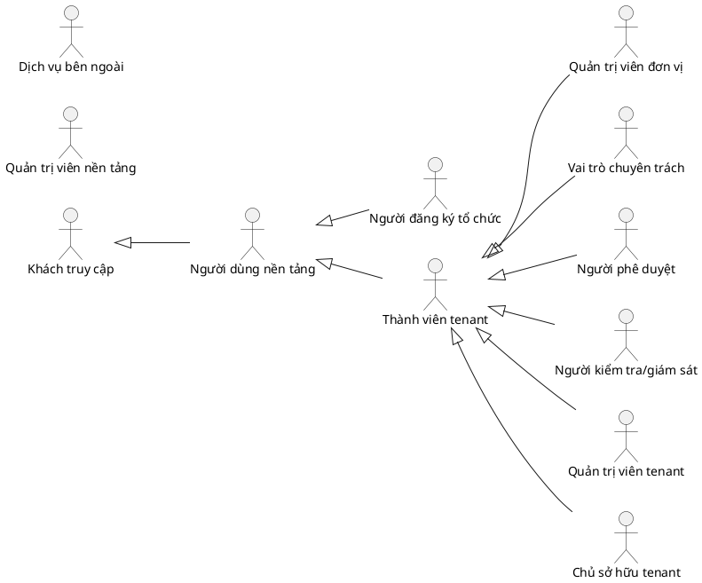

# CÁC TÁC NHÂN TRONG HỆ THỐNG OPERATIONS HUB

## 1. Nguyên tắc

Actor biểu diễn vai trò tương tác với hệ thống, không đồng nhất với tài khoản, chức danh thực tế hoặc role kỹ thuật. Một User có thể đóng nhiều actor ở các tenant khác nhau; quyền thực tế luôn được tính từ membership, role, permission và scope.

## 2. Danh mục actor chính thức

| STT | Mã actor | Tên actor |
|---:|---|---|
| 1 | `ACT-GUEST` | Khách truy cập |
| 2 | `ACT-PLATFORM-USER` | Người dùng nền tảng |
| 3 | `ACT-ORG-REGISTRANT` | Người đăng ký tổ chức |
| 4 | `ACT-PLATFORM-ADMIN` | Quản trị viên nền tảng |
| 5 | `ACT-TENANT-MEMBER` | Thành viên tenant |
| 6 | `ACT-UNIT-ADMIN` | Quản trị viên đơn vị trực thuộc |
| 7 | `ACT-MODULE-SPECIALIST` | Vai trò chuyên trách theo mô-đun |
| 8 | `ACT-APPROVER` | Người phê duyệt |
| 9 | `ACT-TENANT-ADMIN` | Quản trị viên tenant |
| 10 | `ACT-TENANT-OWNER` | Chủ sở hữu tenant |
| 11 | `ACT-AUDITOR` | Người kiểm tra hoặc giám sát |
| 12 | `ACT-EXTERNAL-SERVICE` | Dịch vụ bên ngoài |

## 3. Phân loại

- **Cấp nền tảng:** `ACT-GUEST`, `ACT-PLATFORM-USER`, `ACT-ORG-REGISTRANT`, `ACT-PLATFORM-ADMIN`.
- **Trong tenant:** `ACT-TENANT-MEMBER`, `ACT-UNIT-ADMIN`, `ACT-MODULE-SPECIALIST`, `ACT-APPROVER`, `ACT-TENANT-ADMIN`, `ACT-TENANT-OWNER`, `ACT-AUDITOR`.
- **Bên ngoài:** `ACT-EXTERNAL-SERVICE` và các biến thể như Identity Service, Storage Service, Notification Service, Payment Service, AI Provider.

## 4. Ma trận actor – Use Case

| Use Case | Actor liên quan |
|---|---|
| `UC-TENANT` | `ACT-GUEST`, `ACT-PLATFORM-USER`, `ACT-ORG-REGISTRANT`, `ACT-TENANT-OWNER`, `ACT-PLATFORM-ADMIN`, `ACT-EXTERNAL-SERVICE` |
| `UC-AUTH` | `ACT-GUEST`, `ACT-PLATFORM-USER`, `ACT-EXTERNAL-SERVICE` |
| `UC-USER` | `ACT-PLATFORM-USER`, `ACT-TENANT-ADMIN`, `ACT-PLATFORM-ADMIN` |
| `UC-RBAC` | `ACT-TENANT-ADMIN`, `ACT-TENANT-OWNER`, `ACT-UNIT-ADMIN`, `ACT-PLATFORM-ADMIN` |
| `UC-ORG` | `ACT-TENANT-ADMIN`, `ACT-TENANT-OWNER`, `ACT-UNIT-ADMIN`, `ACT-ORG-REGISTRANT` |
| `UC-BRAND` | `ACT-TENANT-ADMIN`, `ACT-TENANT-OWNER`, `ACT-EXTERNAL-SERVICE` |
| `UC-MODULE` | `ACT-TENANT-ADMIN`, `ACT-TENANT-OWNER`, `ACT-PLATFORM-ADMIN` |
| `UC-SETTING` | `ACT-PLATFORM-USER`, `ACT-TENANT-MEMBER` |
| `UC-MEMBER` | `ACT-TENANT-MEMBER`, `ACT-UNIT-ADMIN`, `ACT-MODULE-SPECIALIST`, `ACT-TENANT-ADMIN` |
| `UC-REQUEST` | `ACT-TENANT-MEMBER`, `ACT-MODULE-SPECIALIST`, `ACT-APPROVER` |
| `UC-DOCUMENT` | `ACT-TENANT-MEMBER`, `ACT-MODULE-SPECIALIST`, `ACT-APPROVER`, `ACT-AUDITOR`, `ACT-EXTERNAL-SERVICE` |
| `UC-FINANCE` | `ACT-TENANT-MEMBER`, `ACT-MODULE-SPECIALIST`, `ACT-APPROVER`, `ACT-TENANT-ADMIN`, `ACT-AUDITOR`, `ACT-EXTERNAL-SERVICE` |
| `UC-ASSET` | `ACT-TENANT-MEMBER`, `ACT-MODULE-SPECIALIST`, `ACT-UNIT-ADMIN` |
| `UC-MEETING` | `ACT-TENANT-MEMBER`, `ACT-MODULE-SPECIALIST`, `ACT-UNIT-ADMIN` |
| `UC-DISCIPLINE` | `ACT-TENANT-MEMBER`, `ACT-MODULE-SPECIALIST`, `ACT-APPROVER`, `ACT-AUDITOR` |
| `UC-EVALUATION` | `ACT-TENANT-MEMBER`, `ACT-MODULE-SPECIALIST`, `ACT-UNIT-ADMIN`, `ACT-AUDITOR` |
| `UC-COMPETITION` | `ACT-TENANT-MEMBER`, `ACT-MODULE-SPECIALIST`, `ACT-UNIT-ADMIN` |
| `UC-NOTIFICATION` | `ACT-TENANT-MEMBER`, `ACT-MODULE-SPECIALIST`, `ACT-EXTERNAL-SERVICE` |
| `UC-DASHBOARD` | `ACT-TENANT-OWNER`, `ACT-TENANT-ADMIN`, `ACT-UNIT-ADMIN`, `ACT-MODULE-SPECIALIST`, `ACT-PLATFORM-ADMIN`, `ACT-AUDITOR` |
| `UC-AI` | `ACT-PLATFORM-USER`, `ACT-TENANT-ADMIN`, `ACT-PLATFORM-ADMIN`, `ACT-EXTERNAL-SERVICE` |
| `UC-AUDIT` | `ACT-AUDITOR`, `ACT-TENANT-ADMIN`, `ACT-TENANT-OWNER`, `ACT-PLATFORM-ADMIN` |

## 5. Quan hệ khái quát

Quan hệ khái quát trên không phải cơ chế kế thừa permission. Platform Admin không mặc nhiên có quyền nghiệp vụ trong tenant.
