# USE CASE DIAGRAM TỔNG QUÁT — OPERATIONS HUB

## 1. Phạm vi

Sơ đồ bao phủ 21 nhóm Use Case của sản phẩm hoàn chỉnh. Mỗi nhóm tiếp tục được phân rã trong file riêng thành các use case thành phần.

> **Lưu ý phân rã:** 21 phần tử trong sơ đồ này là **nhóm Use Case/miền chức năng**, không phải giới hạn số use case nguyên tử. Phiên bản 2.0 hiện nhận diện 841 use case thành phần và tiếp tục mở rộng khi có nghiệp vụ hợp lệ mới.

## 2. Danh sách nhóm

- `UC-TENANT` — Quản trị nền tảng SaaS và tenant
- `UC-AUTH` — Xác thực và quản lý phiên
- `UC-USER` — Quản lý tài khoản người dùng
- `UC-RBAC` — Quản lý vai trò và phân quyền
- `UC-ORG` — Quản lý thông tin và cơ cấu tổ chức
- `UC-BRAND` — Quản lý branding và giao diện tổ chức
- `UC-MODULE` — Cấu hình module và quy trình nghiệp vụ
- `UC-SETTING` — Thiết lập cá nhân
- `UC-MEMBER` — Quản lý thành viên và membership
- `UC-REQUEST` — Quản lý đơn từ và yêu cầu nội bộ
- `UC-DOCUMENT` — Quản lý văn bản, biểu mẫu và mẫu tài liệu
- `UC-FINANCE` — Quản lý tài chính và ngân sách
- `UC-ASSET` — Quản lý tài sản và hậu cần
- `UC-MEETING` — Quản lý cuộc họp, sự kiện và chuyên cần
- `UC-DISCIPLINE` — Quản lý kỷ luật và KPI
- `UC-EVALUATION` — Quản lý đánh giá thành viên
- `UC-COMPETITION` — Quản lý cuộc thi, thành tích và ghi nhận
- `UC-NOTIFICATION` — Quản lý thông báo và truyền thông nội bộ
- `UC-DASHBOARD` — Dashboard, báo cáo và xuất dữ liệu
- `UC-AI` — Trợ lý AI và AI Gateway
- `UC-AUDIT` — Nhật ký hệ thống và truy vết hoạt động

## 3. PlantUML

```plantuml
@startuml
left to right direction
skinparam packageStyle rectangle
skinparam linetype ortho
actor "Khách truy cập" as Guest
actor "Người dùng nền tảng" as PlatformUser
actor "Người đăng ký tổ chức" as Registrant
actor "Quản trị viên nền tảng" as PlatformAdmin
actor "Thành viên tenant" as TenantMember
actor "Quản trị viên đơn vị" as UnitAdmin
actor "Vai trò chuyên trách" as Specialist
actor "Người phê duyệt" as Approver
actor "Quản trị viên tenant" as TenantAdmin
actor "Chủ sở hữu tenant" as TenantOwner
actor "Người kiểm tra/giám sát" as Auditor
actor "Dịch vụ bên ngoài" as ExternalService

package "Nền tảng SaaS và danh tính" {
  usecase "UC-TENANT\nQuản trị nền tảng SaaS và tenant" as UC_TENANT
  usecase "UC-AUTH\nXác thực và quản lý phiên" as UC_AUTH
  usecase "UC-USER\nQuản lý tài khoản người dùng" as UC_USER
  usecase "UC-RBAC\nQuản lý vai trò và phân quyền" as UC_RBAC
}
package "Quản trị tổ chức" {
  usecase "UC-ORG\nQuản lý thông tin và cơ cấu tổ chức" as UC_ORG
  usecase "UC-BRAND\nQuản lý branding và giao diện tổ chức" as UC_BRAND
  usecase "UC-MODULE\nCấu hình module và quy trình nghiệp vụ" as UC_MODULE
  usecase "UC-SETTING\nThiết lập cá nhân" as UC_SETTING
  usecase "UC-MEMBER\nQuản lý thành viên và membership" as UC_MEMBER
}
package "Mô-đun vận hành" {
  usecase "UC-REQUEST\nQuản lý đơn từ và yêu cầu nội bộ" as UC_REQUEST
  usecase "UC-DOCUMENT\nQuản lý văn bản, biểu mẫu và mẫu tài liệu" as UC_DOCUMENT
  usecase "UC-FINANCE\nQuản lý tài chính và ngân sách" as UC_FINANCE
  usecase "UC-ASSET\nQuản lý tài sản và hậu cần" as UC_ASSET
  usecase "UC-MEETING\nQuản lý cuộc họp, sự kiện và chuyên cần" as UC_MEETING
  usecase "UC-DISCIPLINE\nQuản lý kỷ luật và KPI" as UC_DISCIPLINE
  usecase "UC-EVALUATION\nQuản lý đánh giá thành viên" as UC_EVALUATION
  usecase "UC-COMPETITION\nQuản lý cuộc thi, thành tích và ghi nhận" as UC_COMPETITION
  usecase "UC-NOTIFICATION\nQuản lý thông báo và truyền thông nội bộ" as UC_NOTIFICATION
}
package "Báo cáo, AI và kiểm soát" {
  usecase "UC-DASHBOARD\nDashboard, báo cáo và xuất dữ liệu" as UC_DASHBOARD
  usecase "UC-AI\nTrợ lý AI và AI Gateway" as UC_AI
  usecase "UC-AUDIT\nNhật ký hệ thống và truy vết hoạt động" as UC_AUDIT
}

Guest --> UC_AUTH
Guest --> UC_TENANT
PlatformUser --> UC_AUTH
PlatformUser --> UC_USER
PlatformUser --> UC_SETTING
Registrant --> UC_TENANT
Registrant --> UC_ORG
PlatformAdmin --> UC_TENANT
PlatformAdmin --> UC_USER
PlatformAdmin --> UC_RBAC
PlatformAdmin --> UC_MODULE
PlatformAdmin --> UC_DASHBOARD
PlatformAdmin --> UC_AI
PlatformAdmin --> UC_AUDIT
TenantMember --> UC_MEMBER
TenantMember --> UC_REQUEST
TenantMember --> UC_DOCUMENT
TenantMember --> UC_FINANCE
TenantMember --> UC_ASSET
TenantMember --> UC_MEETING
TenantMember --> UC_DISCIPLINE
TenantMember --> UC_EVALUATION
TenantMember --> UC_COMPETITION
TenantMember --> UC_NOTIFICATION
UnitAdmin --> UC_ORG
UnitAdmin --> UC_MEMBER
UnitAdmin --> UC_MEETING
UnitAdmin --> UC_EVALUATION
UnitAdmin --> UC_DASHBOARD
Specialist --> UC_REQUEST
Specialist --> UC_DOCUMENT
Specialist --> UC_FINANCE
Specialist --> UC_ASSET
Specialist --> UC_MEETING
Specialist --> UC_DISCIPLINE
Specialist --> UC_EVALUATION
Specialist --> UC_COMPETITION
Specialist --> UC_NOTIFICATION
Approver --> UC_REQUEST
Approver --> UC_DOCUMENT
Approver --> UC_FINANCE
Approver --> UC_DISCIPLINE
TenantAdmin --> UC_ORG
TenantAdmin --> UC_BRAND
TenantAdmin --> UC_MODULE
TenantAdmin --> UC_MEMBER
TenantAdmin --> UC_RBAC
TenantAdmin --> UC_DASHBOARD
TenantAdmin --> UC_AUDIT
TenantOwner --> UC_TENANT
TenantOwner --> UC_RBAC
TenantOwner --> UC_ORG
TenantOwner --> UC_BRAND
TenantOwner --> UC_MODULE
TenantOwner --> UC_DASHBOARD
TenantOwner --> UC_AUDIT
Auditor --> UC_DOCUMENT
Auditor --> UC_FINANCE
Auditor --> UC_DISCIPLINE
Auditor --> UC_EVALUATION
Auditor --> UC_DASHBOARD
Auditor --> UC_AUDIT
ExternalService --> UC_AUTH
ExternalService --> UC_TENANT
ExternalService --> UC_DOCUMENT
ExternalService --> UC_FINANCE
ExternalService --> UC_NOTIFICATION
ExternalService --> UC_AI
@enduml
```

## 4. Lưu ý đọc sơ đồ

- Đường liên kết chỉ thể hiện actor có thể tham gia nhóm Use Case, không thay thế ma trận permission.
- `UC-AUDIT` là năng lực xuyên suốt; các module khác phát sinh audit event dù không thể hiện quan hệ `include` để tránh sơ đồ quá dày.
- `UC-NOTIFICATION`, `UC-DOCUMENT` và `UC-DASHBOARD` cũng là năng lực dùng chung được nhiều module gọi.
