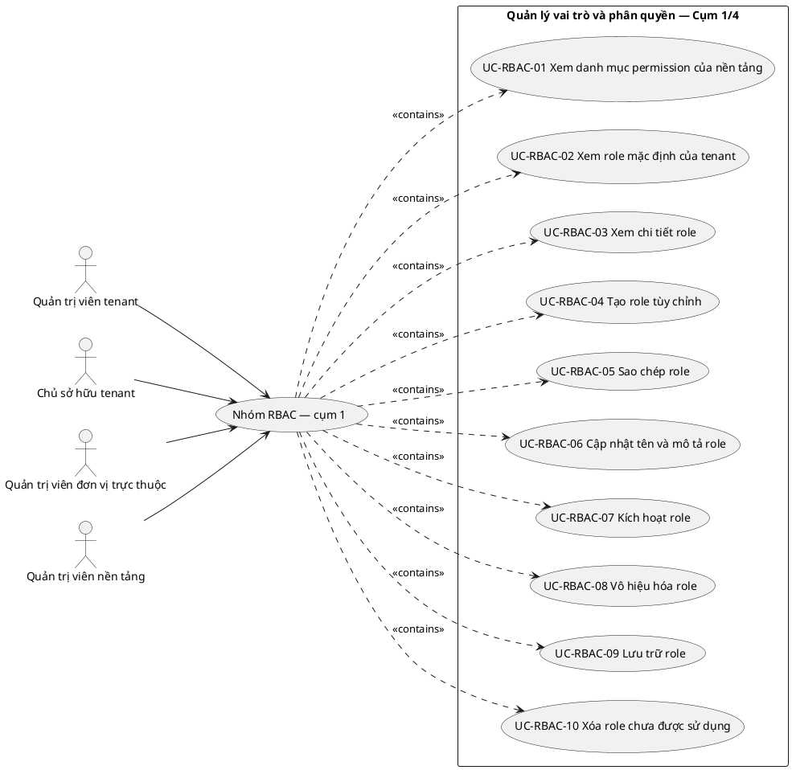

# UC-RBAC — Quản lý vai trò và phân quyền

## 1. Thông tin tài liệu

| Thuộc tính | Nội dung |
|---|---|
| Mã nhóm Use Case | `UC-RBAC` |
| Tên | Quản lý vai trò và phân quyền |
| Miền nghiệp vụ | Danh tính và truy cập |
| Mức ưu tiên phát triển | Nền tảng bắt buộc |
| Phạm vi | Toàn bộ sản phẩm Operations Hub |
| Mô hình | SaaS đa tổ chức, dữ liệu và cấu hình theo tenant |
| Trạng thái đặc tả | Baseline phân tích mở; đã liệt kê toàn bộ use case nhận diện được trong phạm vi hiện tại |

> **Nguyên tắc phạm vi:** tài liệu mô tả năng lực của phiên bản sản phẩm hoàn chỉnh. Mức ưu tiên phát triển không đồng nghĩa với loại bỏ khỏi phạm vi sản phẩm.

## 2. Mục tiêu

Cấu hình role, permission và phạm vi quyền theo tenant, membership, đơn vị và tài nguyên.

## 3. Actor

| Mã actor | Actor | Phạm vi |
|---|---|---|
| `ACT-TENANT-ADMIN` | Quản trị viên tenant | Tenant hoặc tích hợp |
| `ACT-TENANT-OWNER` | Chủ sở hữu tenant | Tenant hoặc tích hợp |
| `ACT-UNIT-ADMIN` | Quản trị viên đơn vị trực thuộc | Tenant hoặc tích hợp |
| `ACT-PLATFORM-ADMIN` | Quản trị viên nền tảng | Cấp nền tảng |

Actor trong sơ đồ chỉ thể hiện vai trò tương tác. Quyền thực tế phải được kiểm tra tại backend dựa trên tenant context, membership, role, permission, organization unit, trạng thái module và trạng thái tenant.

## 4. Điều kiện trước

- Tenant đang ở trạng thái cho phép quản trị.
- Người thao tác có quyền quản trị role hoặc permission trong phạm vi được ủy quyền.

## 5. Điều kiện sau

- Quyền hiệu lực được tính từ membership và các role đang hoạt động.
- Thay đổi role/permission được ghi audit và không vượt ranh giới tenant.

## 6. Danh sách use case thành phần

> **Nguyên tắc bao phủ:** không áp dụng giới hạn 10 use case thành phần. Danh sách dưới đây bao gồm toàn bộ use case có thể nhận diện hợp lý trong ranh giới sản phẩm và quy tắc nghiệp vụ hiện hành. Khi xuất hiện nghiệp vụ mới, use case mới được bổ sung mà không cắt bỏ use case đã có chỉ để giữ một số lượng cố định.

> Use case thành phần biểu diễn **mục tiêu có ý nghĩa đối với actor**, không đồng nhất với endpoint API, nút giao diện hoặc từng thao tác CRUD kỹ thuật.

| Mã | Use Case thành phần | Mô tả |
|---|---|---|
| `UC-RBAC-01` | Xem danh mục permission của nền tảng | Cho phép actor có quyền xem danh mục permission của nền tảng; phải kiểm tra quyền, trạng thái và phạm vi tenant hoặc nền tảng tương ứng trước khi ghi nhận kết quả. |
| `UC-RBAC-02` | Xem role mặc định của tenant | Cho phép actor có quyền xem role mặc định của tenant; phải kiểm tra quyền, trạng thái và phạm vi tenant hoặc nền tảng tương ứng trước khi ghi nhận kết quả. |
| `UC-RBAC-03` | Xem chi tiết role | Cho phép actor có quyền xem chi tiết role; phải kiểm tra quyền, trạng thái và phạm vi tenant hoặc nền tảng tương ứng trước khi ghi nhận kết quả. |
| `UC-RBAC-04` | Tạo role tùy chỉnh | Cho phép tạo role tùy chỉnh; phải kiểm tra quyền, trạng thái và phạm vi tenant hoặc nền tảng tương ứng trước khi ghi nhận kết quả. |
| `UC-RBAC-05` | Sao chép role | Thực hiện nghiệp vụ “Sao chép role” trong đúng phạm vi tenant hoặc nền tảng tương ứng, có kiểm tra dữ liệu, quyền và trạng thái liên quan. |
| `UC-RBAC-06` | Cập nhật tên và mô tả role | Cho phép cập nhật tên và mô tả role; phải kiểm tra quyền, trạng thái và phạm vi tenant hoặc nền tảng tương ứng trước khi ghi nhận kết quả. |
| `UC-RBAC-07` | Kích hoạt role | Cho phép kích hoạt role; phải kiểm tra quyền, trạng thái và phạm vi tenant hoặc nền tảng tương ứng trước khi ghi nhận kết quả. |
| `UC-RBAC-08` | Vô hiệu hóa role | Cho phép vô hiệu hóa role; phải kiểm tra quyền, trạng thái và phạm vi tenant hoặc nền tảng tương ứng trước khi ghi nhận kết quả. |
| `UC-RBAC-09` | Lưu trữ role | Cho phép lưu trữ role; phải kiểm tra quyền, trạng thái và phạm vi tenant hoặc nền tảng tương ứng trước khi ghi nhận kết quả. |
| `UC-RBAC-10` | Xóa role chưa được sử dụng | Cho phép xóa hoặc xử lý xóa role chưa được sử dụng; phải kiểm tra quyền, trạng thái và phạm vi tenant hoặc nền tảng tương ứng trước khi ghi nhận kết quả. |
| `UC-RBAC-11` | Gán permission cho role | Cho phép gán permission cho role; phải kiểm tra quyền, trạng thái và phạm vi tenant hoặc nền tảng tương ứng trước khi ghi nhận kết quả. |
| `UC-RBAC-12` | Thu hồi permission khỏi role | Cho phép thu hồi permission khỏi role; phải kiểm tra quyền, trạng thái và phạm vi tenant hoặc nền tảng tương ứng trước khi ghi nhận kết quả. |
| `UC-RBAC-13` | Gán nhiều permission theo nhóm | Cho phép gán nhiều permission theo nhóm; phải kiểm tra quyền, trạng thái và phạm vi tenant hoặc nền tảng tương ứng trước khi ghi nhận kết quả. |
| `UC-RBAC-14` | So sánh hai role | Thực hiện nghiệp vụ “So sánh hai role” trong đúng phạm vi tenant hoặc nền tảng tương ứng, có kiểm tra dữ liệu, quyền và trạng thái liên quan. |
| `UC-RBAC-15` | Xuất ma trận role và permission | Cho phép xuất ma trận role và permission; phải kiểm tra quyền, trạng thái và phạm vi tenant hoặc nền tảng tương ứng trước khi ghi nhận kết quả. |
| `UC-RBAC-16` | Nhập ma trận role và permission | Cho phép nhập ma trận role và permission; phải kiểm tra quyền, trạng thái và phạm vi tenant hoặc nền tảng tương ứng trước khi ghi nhận kết quả. |
| `UC-RBAC-17` | Gán role cho membership | Cho phép gán role cho membership; phải kiểm tra quyền, trạng thái và phạm vi tenant hoặc nền tảng tương ứng trước khi ghi nhận kết quả. |
| `UC-RBAC-18` | Thu hồi role khỏi membership | Cho phép thu hồi role khỏi membership; phải kiểm tra quyền, trạng thái và phạm vi tenant hoặc nền tảng tương ứng trước khi ghi nhận kết quả. |
| `UC-RBAC-19` | Gán role hàng loạt | Cho phép gán role hàng loạt; phải kiểm tra quyền, trạng thái và phạm vi tenant hoặc nền tảng tương ứng trước khi ghi nhận kết quả. |
| `UC-RBAC-20` | Gán role có thời hạn | Cho phép gán role có thời hạn; phải kiểm tra quyền, trạng thái và phạm vi tenant hoặc nền tảng tương ứng trước khi ghi nhận kết quả. |
| `UC-RBAC-21` | Gia hạn role có thời hạn | Thực hiện nghiệp vụ “Gia hạn role có thời hạn” trong đúng phạm vi tenant hoặc nền tảng tương ứng, có kiểm tra dữ liệu, quyền và trạng thái liên quan. |
| `UC-RBAC-22` | Gán role theo đơn vị trực thuộc | Cho phép gán role theo đơn vị trực thuộc; phải kiểm tra quyền, trạng thái và phạm vi tenant hoặc nền tảng tương ứng trước khi ghi nhận kết quả. |
| `UC-RBAC-23` | Gán quyền theo phạm vi tài nguyên | Cho phép gán quyền theo phạm vi tài nguyên; phải kiểm tra quyền, trạng thái và phạm vi tenant hoặc nền tảng tương ứng trước khi ghi nhận kết quả. |
| `UC-RBAC-24` | Cấu hình role kế thừa khi chính sách cho phép | Cho phép cấu hình role kế thừa khi chính sách cho phép; phải kiểm tra quyền, trạng thái và phạm vi tenant hoặc nền tảng tương ứng trước khi ghi nhận kết quả. |
| `UC-RBAC-25` | Cấu hình quy tắc từ chối hoặc ngoại lệ quyền | Cho phép cấu hình quy tắc từ chối hoặc ngoại lệ quyền; phải kiểm tra quyền, trạng thái và phạm vi tenant hoặc nền tảng tương ứng trước khi ghi nhận kết quả. |
| `UC-RBAC-26` | Ủy quyền quản trị role trong phạm vi giới hạn | Thực hiện nghiệp vụ “Ủy quyền quản trị role trong phạm vi giới hạn” trong đúng phạm vi tenant hoặc nền tảng tương ứng, có kiểm tra dữ liệu, quyền và trạng thái liên quan. |
| `UC-RBAC-27` | Kiểm tra xung đột phân tách trách nhiệm | Kiểm tra xung đột phân tách trách nhiệm; phải kiểm tra quyền, trạng thái và phạm vi tenant hoặc nền tảng tương ứng trước khi ghi nhận kết quả. |
| `UC-RBAC-28` | Ngăn người dùng tự nâng quyền | Thực hiện nghiệp vụ “Ngăn người dùng tự nâng quyền” trong đúng phạm vi tenant hoặc nền tảng tương ứng, có kiểm tra dữ liệu, quyền và trạng thái liên quan. |
| `UC-RBAC-29` | Mô phỏng quyền của membership | Thực hiện nghiệp vụ “Mô phỏng quyền của membership” trong đúng phạm vi tenant hoặc nền tảng tương ứng, có kiểm tra dữ liệu, quyền và trạng thái liên quan. |
| `UC-RBAC-30` | Giải thích quyền hiệu lực | Thực hiện nghiệp vụ “Giải thích quyền hiệu lực” trong đúng phạm vi tenant hoặc nền tảng tương ứng, có kiểm tra dữ liệu, quyền và trạng thái liên quan. |
| `UC-RBAC-31` | Kiểm tra quyền đối với một hành động cụ thể | Kiểm tra quyền đối với một hành động cụ thể; phải kiểm tra quyền, trạng thái và phạm vi tenant hoặc nền tảng tương ứng trước khi ghi nhận kết quả. |
| `UC-RBAC-32` | Rà soát quyền định kỳ | Thực hiện nghiệp vụ “Rà soát quyền định kỳ” trong đúng phạm vi tenant hoặc nền tảng tương ứng, có kiểm tra dữ liệu, quyền và trạng thái liên quan. |
| `UC-RBAC-33` | Xác nhận lại quyền truy cập | Thực hiện nghiệp vụ “Xác nhận lại quyền truy cập” trong đúng phạm vi tenant hoặc nền tảng tương ứng, có kiểm tra dữ liệu, quyền và trạng thái liên quan. |
| `UC-RBAC-34` | Thu hồi quyền không còn cần thiết | Cho phép thu hồi quyền không còn cần thiết; phải kiểm tra quyền, trạng thái và phạm vi tenant hoặc nền tảng tương ứng trước khi ghi nhận kết quả. |
| `UC-RBAC-35` | Thiết lập quyền khẩn cấp có thời hạn | Cho phép thiết lập quyền khẩn cấp có thời hạn; phải kiểm tra quyền, trạng thái và phạm vi tenant hoặc nền tảng tương ứng trước khi ghi nhận kết quả. |
| `UC-RBAC-36` | Kết thúc quyền khẩn cấp | Thực hiện nghiệp vụ “Kết thúc quyền khẩn cấp” trong đúng phạm vi tenant hoặc nền tảng tương ứng, có kiểm tra dữ liệu, quyền và trạng thái liên quan. |
| `UC-RBAC-37` | Xem lịch sử thay đổi role và permission | Cho phép actor có quyền xem lịch sử thay đổi role và permission; phải kiểm tra quyền, trạng thái và phạm vi tenant hoặc nền tảng tương ứng trước khi ghi nhận kết quả. |
| `UC-RBAC-38` | Quản lý role cấp nền tảng tách biệt role tenant | Cho phép quản lý role cấp nền tảng tách biệt role tenant; phải kiểm tra quyền, trạng thái và phạm vi tenant hoặc nền tảng tương ứng trước khi ghi nhận kết quả. |

## 7. Luồng nghiệp vụ chính

1. Tenant Admin tạo role tùy chỉnh.
2. Hệ thống kiểm tra mã role duy nhất trong tenant.
3. Tenant Admin chọn permission và phạm vi đơn vị/tài nguyên.
4. Hệ thống kiểm tra người thao tác có quyền ủy quyền các permission đã chọn.
5. Role được lưu và gán cho membership.
6. Khi thực hiện nghiệp vụ, hệ thống tính quyền hiệu lực theo tenant, membership, role, scope, module và trạng thái đối tượng.

## 8. Luồng thay thế và ngoại lệ

- Gán role của tenant A cho membership tenant B: từ chối.
- Thao tác làm mất Owner cuối cùng: từ chối.
- Người quản trị đơn vị gán role cấp Owner: từ chối.
- Role đang được dùng: chỉ cho vô hiệu hóa hoặc yêu cầu chuyển gán trước khi xóa.

## 9. Quy tắc nghiệp vụ cốt lõi

- Role tùy chỉnh chỉ thuộc một tenant và chỉ gán cho membership của tenant đó.
- Platform role không thay thế role nội bộ của tenant.
- Người dùng không được tự nâng quyền hoặc ủy quyền vượt quá phạm vi mình quản lý.
- Quyền xem, tạo, cập nhật, xóa, phê duyệt, xuất và quản trị là các permission độc lập.
- Ẩn nút trên frontend không thay thế kiểm tra permission tại backend.

## 10. Mô hình dữ liệu logic liên quan

| Thực thể | Vai trò |
|---|---|
| `Role` | Thực thể logic phục vụ UC-RBAC; thiết kế vật lý được xác định ở giai đoạn thiết kế dữ liệu. |
| `Permission` | Thực thể logic phục vụ UC-RBAC; thiết kế vật lý được xác định ở giai đoạn thiết kế dữ liệu. |
| `RolePermission` | Thực thể logic phục vụ UC-RBAC; thiết kế vật lý được xác định ở giai đoạn thiết kế dữ liệu. |
| `MembershipRole` | Thực thể logic phục vụ UC-RBAC; thiết kế vật lý được xác định ở giai đoạn thiết kế dữ liệu. |
| `AuthorizationScope` | Thực thể logic phục vụ UC-RBAC; thiết kế vật lý được xác định ở giai đoạn thiết kế dữ liệu. |
| `Delegation` | Thực thể logic phục vụ UC-RBAC; thiết kế vật lý được xác định ở giai đoạn thiết kế dữ liệu. |
| `AuditLog` | Thực thể logic phục vụ UC-RBAC; thiết kế vật lý được xác định ở giai đoạn thiết kế dữ liệu. |

Mọi thực thể nghiệp vụ phải xác định được tenant sở hữu, trừ thực thể được công bố rõ là dữ liệu cấp nền tảng. Quan hệ tham chiếu chéo tenant bị cấm nếu không có cơ chế liên tenant được đặc tả riêng.

## 11. Kiểm soát truy cập

Quyền hiệu lực được xác định theo công thức khái quát:

```text
Quyền hiệu lực
= Permission từ các Role đang hoạt động
∩ Tenant context hợp lệ
∩ Membership đang hoạt động
∩ Phạm vi Organization Unit
∩ Phạm vi tài nguyên
∩ Trạng thái Module
∩ Trạng thái Tenant
```

Các kiểm tra bắt buộc:

- Xác thực User trước khi truy cập chức năng không công khai.
- Đối chiếu tenant context với membership.
- Kiểm tra permission tại backend, không dựa vào trạng thái hiển thị của frontend.
- Giới hạn truy vấn, tệp, bản xuất, cache và tác vụ nền theo tenant.
- Ghi audit cho hành động quản trị hoặc thay đổi nghiệp vụ quan trọng.

## 12. Tiêu chí chấp nhận

| Mã | Tiêu chí | Phương pháp kiểm chứng |
|---|---|---|
| `AC-RBAC-01` | Không thể gán role khác tenant. | Functional / Integration / Security Test tùy nội dung |
| `AC-RBAC-02` | Gọi API trực tiếp ngoài quyền bị từ chối dù UI đã ẩn chức năng. | Functional / Integration / Security Test tùy nội dung |
| `AC-RBAC-03` | Quyền hợp nhất từ nhiều role vẫn bị giới hạn bởi tenant và scope. | Functional / Integration / Security Test tùy nội dung |
| `AC-RBAC-04` | Mọi thay đổi role/permission quan trọng có audit. | Functional / Integration / Security Test tùy nội dung |

## 13. Quan hệ với nhóm Use Case khác

[`UC-TENANT`](./01_UC-TENANT.md), [`UC-ORG`](./05_UC-ORG.md), [`UC-MEMBER`](./09_UC-MEMBER.md), [`UC-MODULE`](./07_UC-MODULE.md), [`UC-AUDIT`](./21_UC-AUDIT.md)

## 14. Use Case Diagram

Do số lượng use case thành phần không bị giới hạn ở 10, sơ đồ được chia thành các cụm để bảo đảm khả năng đọc. Quan hệ `<<contains>>` trong sơ đồ chỉ biểu thị quan hệ phân nhóm tài liệu, không phải quan hệ UML `<<include>>`. Quan hệ actor–use case nguyên tử phải được xác nhận khi đặc tả chi tiết từng use case; không suy luận rằng mọi actor liệt kê đều được thực hiện mọi use case trong cụm.

### 14.1. Cụm use case 01–10



### 14.2. Cụm use case 11–20

```plantuml
@startuml
left to right direction
skinparam packageStyle rectangle
actor "Quản trị viên tenant" as A1
actor "Chủ sở hữu tenant" as A2
actor "Quản trị viên đơn vị trực thuộc" as A3
actor "Quản trị viên nền tảng" as A4
usecase "Nhóm RBAC — cụm 2" as PKG2
rectangle "Quản lý vai trò và phân quyền — Cụm 2/4" {
  usecase "UC-RBAC-11
Gán permission cho role" as U11
  usecase "UC-RBAC-12
Thu hồi permission khỏi role" as U12
  usecase "UC-RBAC-13
Gán nhiều permission theo nhóm" as U13
  usecase "UC-RBAC-14
So sánh hai role" as U14
  usecase "UC-RBAC-15
Xuất ma trận role và permission" as U15
  usecase "UC-RBAC-16
Nhập ma trận role và permission" as U16
  usecase "UC-RBAC-17
Gán role cho membership" as U17
  usecase "UC-RBAC-18
Thu hồi role khỏi membership" as U18
  usecase "UC-RBAC-19
Gán role hàng loạt" as U19
  usecase "UC-RBAC-20
Gán role có thời hạn" as U20
}
A1 --> PKG2
A2 --> PKG2
A3 --> PKG2
A4 --> PKG2
PKG2 ..> U11 : <<contains>>
PKG2 ..> U12 : <<contains>>
PKG2 ..> U13 : <<contains>>
PKG2 ..> U14 : <<contains>>
PKG2 ..> U15 : <<contains>>
PKG2 ..> U16 : <<contains>>
PKG2 ..> U17 : <<contains>>
PKG2 ..> U18 : <<contains>>
PKG2 ..> U19 : <<contains>>
PKG2 ..> U20 : <<contains>>
@enduml
```

### 14.3. Cụm use case 21–30

```plantuml
@startuml
left to right direction
skinparam packageStyle rectangle
actor "Quản trị viên tenant" as A1
actor "Chủ sở hữu tenant" as A2
actor "Quản trị viên đơn vị trực thuộc" as A3
actor "Quản trị viên nền tảng" as A4
usecase "Nhóm RBAC — cụm 3" as PKG3
rectangle "Quản lý vai trò và phân quyền — Cụm 3/4" {
  usecase "UC-RBAC-21
Gia hạn role có thời hạn" as U21
  usecase "UC-RBAC-22
Gán role theo đơn vị trực thuộc" as U22
  usecase "UC-RBAC-23
Gán quyền theo phạm vi tài nguyên" as U23
  usecase "UC-RBAC-24
Cấu hình role kế thừa khi chính sách cho phép" as U24
  usecase "UC-RBAC-25
Cấu hình quy tắc từ chối hoặc ngoại lệ quyền" as U25
  usecase "UC-RBAC-26
Ủy quyền quản trị role trong phạm vi giới hạn" as U26
  usecase "UC-RBAC-27
Kiểm tra xung đột phân tách trách nhiệm" as U27
  usecase "UC-RBAC-28
Ngăn người dùng tự nâng quyền" as U28
  usecase "UC-RBAC-29
Mô phỏng quyền của membership" as U29
  usecase "UC-RBAC-30
Giải thích quyền hiệu lực" as U30
}
A1 --> PKG3
A2 --> PKG3
A3 --> PKG3
A4 --> PKG3
PKG3 ..> U21 : <<contains>>
PKG3 ..> U22 : <<contains>>
PKG3 ..> U23 : <<contains>>
PKG3 ..> U24 : <<contains>>
PKG3 ..> U25 : <<contains>>
PKG3 ..> U26 : <<contains>>
PKG3 ..> U27 : <<contains>>
PKG3 ..> U28 : <<contains>>
PKG3 ..> U29 : <<contains>>
PKG3 ..> U30 : <<contains>>
@enduml
```

### 14.4. Cụm use case 31–38

```plantuml
@startuml
left to right direction
skinparam packageStyle rectangle
actor "Quản trị viên tenant" as A1
actor "Chủ sở hữu tenant" as A2
actor "Quản trị viên đơn vị trực thuộc" as A3
actor "Quản trị viên nền tảng" as A4
usecase "Nhóm RBAC — cụm 4" as PKG4
rectangle "Quản lý vai trò và phân quyền — Cụm 4/4" {
  usecase "UC-RBAC-31
Kiểm tra quyền đối với một hành động cụ thể" as U31
  usecase "UC-RBAC-32
Rà soát quyền định kỳ" as U32
  usecase "UC-RBAC-33
Xác nhận lại quyền truy cập" as U33
  usecase "UC-RBAC-34
Thu hồi quyền không còn cần thiết" as U34
  usecase "UC-RBAC-35
Thiết lập quyền khẩn cấp có thời hạn" as U35
  usecase "UC-RBAC-36
Kết thúc quyền khẩn cấp" as U36
  usecase "UC-RBAC-37
Xem lịch sử thay đổi role và permission" as U37
  usecase "UC-RBAC-38
Quản lý role cấp nền tảng tách biệt role tenant" as U38
}
A1 --> PKG4
A2 --> PKG4
A3 --> PKG4
A4 --> PKG4
PKG4 ..> U31 : <<contains>>
PKG4 ..> U32 : <<contains>>
PKG4 ..> U33 : <<contains>>
PKG4 ..> U34 : <<contains>>
PKG4 ..> U35 : <<contains>>
PKG4 ..> U36 : <<contains>>
PKG4 ..> U37 : <<contains>>
PKG4 ..> U38 : <<contains>>
@enduml
```

## 15. Điểm mở cần chi tiết hóa

- Trường dữ liệu chi tiết, trạng thái và ma trận chuyển trạng thái của từng use case thành phần.
- Ma trận permission ở cấp hành động và scope.
- Quy tắc retention, masking và phân loại dữ liệu nhạy cảm.
- Hợp đồng API, mã lỗi và yêu cầu idempotency.
- Test case chi tiết và dữ liệu kiểm thử theo tenant.
