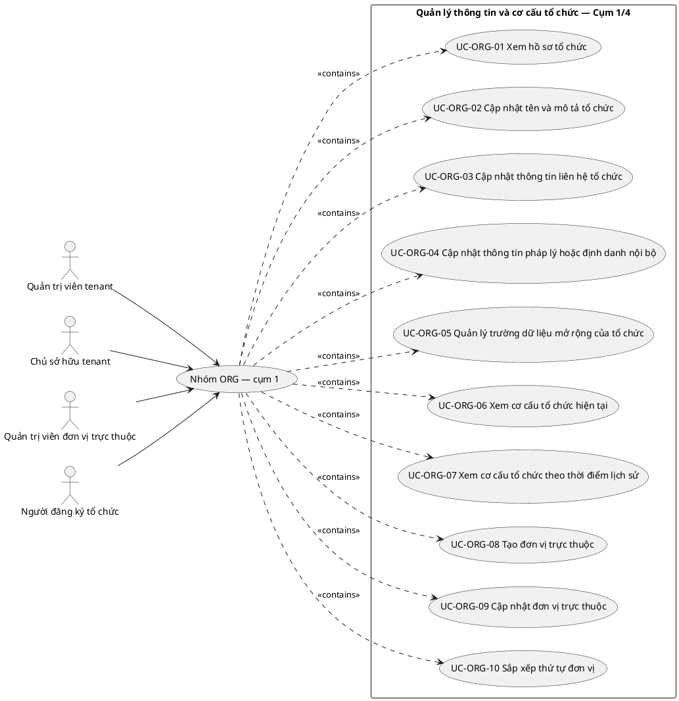
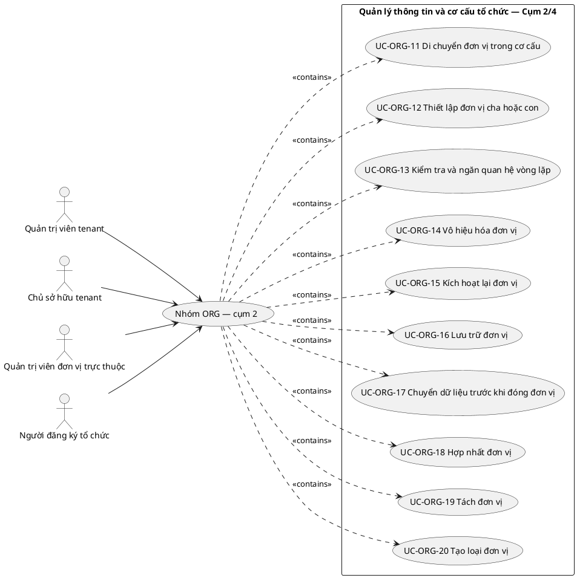
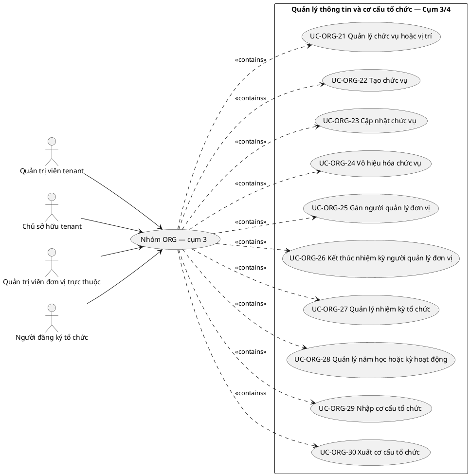
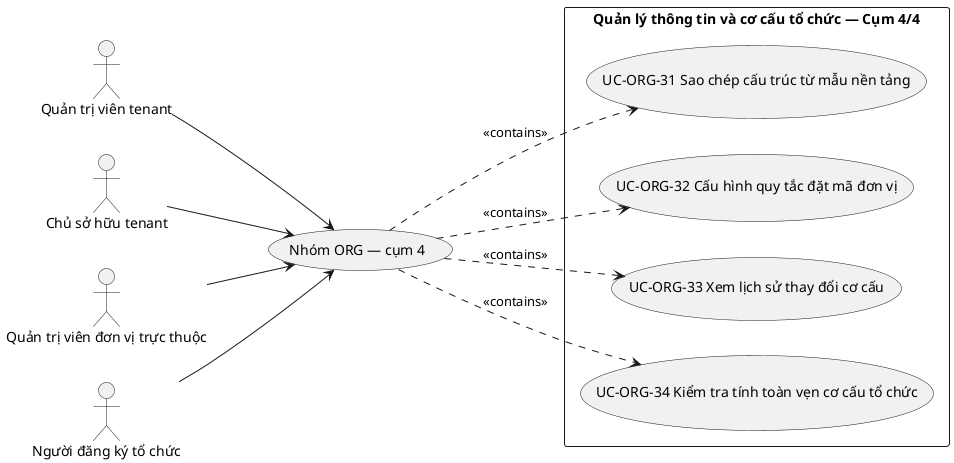

# UC-ORG — Quản lý thông tin và cơ cấu tổ chức

## 1. Thông tin tài liệu

| Thuộc tính | Nội dung |
|---|---|
| Mã nhóm Use Case | `UC-ORG` |
| Tên | Quản lý thông tin và cơ cấu tổ chức |
| Miền nghiệp vụ | Quản trị tổ chức |
| Mức ưu tiên phát triển | Nền tảng bắt buộc |
| Phạm vi | Toàn bộ sản phẩm Operations Hub |
| Mô hình | SaaS đa tổ chức, dữ liệu và cấu hình theo tenant |
| Trạng thái đặc tả | Baseline phân tích mở; đã liệt kê toàn bộ use case nhận diện được trong phạm vi hiện tại |

> **Nguyên tắc phạm vi:** tài liệu mô tả năng lực của phiên bản sản phẩm hoàn chỉnh. Mức ưu tiên phát triển không đồng nghĩa với loại bỏ khỏi phạm vi sản phẩm.

## 2. Mục tiêu

Quản lý hồ sơ tổ chức, đơn vị trực thuộc, chức danh và quan hệ phân cấp trong tenant.

## 3. Actor

| Mã actor | Actor | Phạm vi |
|---|---|---|
| `ACT-TENANT-ADMIN` | Quản trị viên tenant | Tenant hoặc tích hợp |
| `ACT-TENANT-OWNER` | Chủ sở hữu tenant | Tenant hoặc tích hợp |
| `ACT-UNIT-ADMIN` | Quản trị viên đơn vị trực thuộc | Tenant hoặc tích hợp |
| `ACT-ORG-REGISTRANT` | Người đăng ký tổ chức | Cấp nền tảng |

Actor trong sơ đồ chỉ thể hiện vai trò tương tác. Quyền thực tế phải được kiểm tra tại backend dựa trên tenant context, membership, role, permission, organization unit, trạng thái module và trạng thái tenant.

## 4. Điều kiện trước

- Tenant đã được khởi tạo.
- Người thao tác có permission quản trị hồ sơ hoặc cơ cấu tổ chức.

## 5. Điều kiện sau

- Cơ cấu tổ chức hợp lệ, không vòng lặp và không chứa quan hệ chéo tenant.
- Lịch sử thay đổi cơ cấu được duy trì.

## 6. Danh sách use case thành phần

> **Nguyên tắc bao phủ:** không áp dụng giới hạn 10 use case thành phần. Danh sách dưới đây bao gồm toàn bộ use case có thể nhận diện hợp lý trong ranh giới sản phẩm và quy tắc nghiệp vụ hiện hành. Khi xuất hiện nghiệp vụ mới, use case mới được bổ sung mà không cắt bỏ use case đã có chỉ để giữ một số lượng cố định.

> Use case thành phần biểu diễn **mục tiêu có ý nghĩa đối với actor**, không đồng nhất với endpoint API, nút giao diện hoặc từng thao tác CRUD kỹ thuật.

| Mã | Use Case thành phần | Mô tả |
|---|---|---|
| `UC-ORG-01` | Xem hồ sơ tổ chức | Cho phép actor có quyền xem hồ sơ tổ chức; phải kiểm tra quyền, trạng thái và phạm vi tenant hiện hành trước khi ghi nhận kết quả. |
| `UC-ORG-02` | Cập nhật tên và mô tả tổ chức | Cho phép cập nhật tên và mô tả tổ chức; phải kiểm tra quyền, trạng thái và phạm vi tenant hiện hành trước khi ghi nhận kết quả. |
| `UC-ORG-03` | Cập nhật thông tin liên hệ tổ chức | Cho phép cập nhật thông tin liên hệ tổ chức; phải kiểm tra quyền, trạng thái và phạm vi tenant hiện hành trước khi ghi nhận kết quả. |
| `UC-ORG-04` | Cập nhật thông tin pháp lý hoặc định danh nội bộ | Cho phép cập nhật thông tin pháp lý hoặc định danh nội bộ; phải kiểm tra quyền, trạng thái và phạm vi tenant hiện hành trước khi ghi nhận kết quả. |
| `UC-ORG-05` | Quản lý trường dữ liệu mở rộng của tổ chức | Cho phép quản lý trường dữ liệu mở rộng của tổ chức; phải kiểm tra quyền, trạng thái và phạm vi tenant hiện hành trước khi ghi nhận kết quả. |
| `UC-ORG-06` | Xem cơ cấu tổ chức hiện tại | Cho phép actor có quyền xem cơ cấu tổ chức hiện tại; phải kiểm tra quyền, trạng thái và phạm vi tenant hiện hành trước khi ghi nhận kết quả. |
| `UC-ORG-07` | Xem cơ cấu tổ chức theo thời điểm lịch sử | Cho phép actor có quyền xem cơ cấu tổ chức theo thời điểm lịch sử; phải kiểm tra quyền, trạng thái và phạm vi tenant hiện hành trước khi ghi nhận kết quả. |
| `UC-ORG-08` | Tạo đơn vị trực thuộc | Cho phép tạo đơn vị trực thuộc; phải kiểm tra quyền, trạng thái và phạm vi tenant hiện hành trước khi ghi nhận kết quả. |
| `UC-ORG-09` | Cập nhật đơn vị trực thuộc | Cho phép cập nhật đơn vị trực thuộc; phải kiểm tra quyền, trạng thái và phạm vi tenant hiện hành trước khi ghi nhận kết quả. |
| `UC-ORG-10` | Sắp xếp thứ tự đơn vị | Thực hiện nghiệp vụ “Sắp xếp thứ tự đơn vị” trong đúng phạm vi tenant hiện hành, có kiểm tra dữ liệu, quyền và trạng thái liên quan. |
| `UC-ORG-11` | Di chuyển đơn vị trong cơ cấu | Thực hiện nghiệp vụ “Di chuyển đơn vị trong cơ cấu” trong đúng phạm vi tenant hiện hành, có kiểm tra dữ liệu, quyền và trạng thái liên quan. |
| `UC-ORG-12` | Thiết lập đơn vị cha hoặc con | Cho phép thiết lập đơn vị cha hoặc con; phải kiểm tra quyền, trạng thái và phạm vi tenant hiện hành trước khi ghi nhận kết quả. |
| `UC-ORG-13` | Kiểm tra và ngăn quan hệ vòng lặp | Kiểm tra và ngăn quan hệ vòng lặp; phải kiểm tra quyền, trạng thái và phạm vi tenant hiện hành trước khi ghi nhận kết quả. |
| `UC-ORG-14` | Vô hiệu hóa đơn vị | Cho phép vô hiệu hóa đơn vị; phải kiểm tra quyền, trạng thái và phạm vi tenant hiện hành trước khi ghi nhận kết quả. |
| `UC-ORG-15` | Kích hoạt lại đơn vị | Cho phép kích hoạt lại đơn vị; phải kiểm tra quyền, trạng thái và phạm vi tenant hiện hành trước khi ghi nhận kết quả. |
| `UC-ORG-16` | Lưu trữ đơn vị | Cho phép lưu trữ đơn vị; phải kiểm tra quyền, trạng thái và phạm vi tenant hiện hành trước khi ghi nhận kết quả. |
| `UC-ORG-17` | Chuyển dữ liệu trước khi đóng đơn vị | Cho phép chuyển dữ liệu trước khi đóng đơn vị; phải kiểm tra quyền, trạng thái và phạm vi tenant hiện hành trước khi ghi nhận kết quả. |
| `UC-ORG-18` | Hợp nhất đơn vị | Thực hiện nghiệp vụ “Hợp nhất đơn vị” trong đúng phạm vi tenant hiện hành, có kiểm tra dữ liệu, quyền và trạng thái liên quan. |
| `UC-ORG-19` | Tách đơn vị | Thực hiện nghiệp vụ “Tách đơn vị” trong đúng phạm vi tenant hiện hành, có kiểm tra dữ liệu, quyền và trạng thái liên quan. |
| `UC-ORG-20` | Tạo loại đơn vị | Cho phép tạo loại đơn vị; phải kiểm tra quyền, trạng thái và phạm vi tenant hiện hành trước khi ghi nhận kết quả. |
| `UC-ORG-21` | Quản lý chức vụ hoặc vị trí | Cho phép quản lý chức vụ hoặc vị trí; phải kiểm tra quyền, trạng thái và phạm vi tenant hiện hành trước khi ghi nhận kết quả. |
| `UC-ORG-22` | Tạo chức vụ | Cho phép tạo chức vụ; phải kiểm tra quyền, trạng thái và phạm vi tenant hiện hành trước khi ghi nhận kết quả. |
| `UC-ORG-23` | Cập nhật chức vụ | Cho phép cập nhật chức vụ; phải kiểm tra quyền, trạng thái và phạm vi tenant hiện hành trước khi ghi nhận kết quả. |
| `UC-ORG-24` | Vô hiệu hóa chức vụ | Cho phép vô hiệu hóa chức vụ; phải kiểm tra quyền, trạng thái và phạm vi tenant hiện hành trước khi ghi nhận kết quả. |
| `UC-ORG-25` | Gán người quản lý đơn vị | Cho phép gán người quản lý đơn vị; phải kiểm tra quyền, trạng thái và phạm vi tenant hiện hành trước khi ghi nhận kết quả. |
| `UC-ORG-26` | Kết thúc nhiệm kỳ người quản lý đơn vị | Thực hiện nghiệp vụ “Kết thúc nhiệm kỳ người quản lý đơn vị” trong đúng phạm vi tenant hiện hành, có kiểm tra dữ liệu, quyền và trạng thái liên quan. |
| `UC-ORG-27` | Quản lý nhiệm kỳ tổ chức | Cho phép quản lý nhiệm kỳ tổ chức; phải kiểm tra quyền, trạng thái và phạm vi tenant hiện hành trước khi ghi nhận kết quả. |
| `UC-ORG-28` | Quản lý năm học hoặc kỳ hoạt động | Cho phép quản lý năm học hoặc kỳ hoạt động; phải kiểm tra quyền, trạng thái và phạm vi tenant hiện hành trước khi ghi nhận kết quả. |
| `UC-ORG-29` | Nhập cơ cấu tổ chức | Cho phép nhập cơ cấu tổ chức; phải kiểm tra quyền, trạng thái và phạm vi tenant hiện hành trước khi ghi nhận kết quả. |
| `UC-ORG-30` | Xuất cơ cấu tổ chức | Cho phép xuất cơ cấu tổ chức; phải kiểm tra quyền, trạng thái và phạm vi tenant hiện hành trước khi ghi nhận kết quả. |
| `UC-ORG-31` | Sao chép cấu trúc từ mẫu nền tảng | Thực hiện nghiệp vụ “Sao chép cấu trúc từ mẫu nền tảng” trong đúng phạm vi tenant hiện hành, có kiểm tra dữ liệu, quyền và trạng thái liên quan. |
| `UC-ORG-32` | Cấu hình quy tắc đặt mã đơn vị | Cho phép cấu hình quy tắc đặt mã đơn vị; phải kiểm tra quyền, trạng thái và phạm vi tenant hiện hành trước khi ghi nhận kết quả. |
| `UC-ORG-33` | Xem lịch sử thay đổi cơ cấu | Cho phép actor có quyền xem lịch sử thay đổi cơ cấu; phải kiểm tra quyền, trạng thái và phạm vi tenant hiện hành trước khi ghi nhận kết quả. |
| `UC-ORG-34` | Kiểm tra tính toàn vẹn cơ cấu tổ chức | Kiểm tra tính toàn vẹn cơ cấu tổ chức; phải kiểm tra quyền, trạng thái và phạm vi tenant hiện hành trước khi ghi nhận kết quả. |

## 7. Luồng nghiệp vụ chính

1. Tenant Admin tạo đơn vị mới trong tenant.
2. Hệ thống kiểm tra mã đơn vị duy nhất theo tenant và đơn vị cha hợp lệ.
3. Hệ thống kiểm tra quan hệ không gây vòng lặp.
4. Đơn vị được lưu và xuất hiện trong cây cơ cấu.
5. Tenant Admin gán membership hoặc người phụ trách theo quyền.
6. Mọi thay đổi được ghi lịch sử và audit.

## 8. Luồng thay thế và ngoại lệ

- Đơn vị cha thuộc tenant khác: từ chối.
- Quan hệ mới tạo vòng lặp: từ chối.
- Vô hiệu hóa đơn vị còn dữ liệu hoạt động: yêu cầu chuyển hoặc kết thúc quan hệ.

## 9. Quy tắc nghiệp vụ cốt lõi

- Mỗi đơn vị thuộc duy nhất một tenant.
- Đơn vị cha và con phải thuộc cùng tenant.
- Cơ cấu không được tạo vòng lặp.
- Đơn vị có dữ liệu liên quan không được xóa vật lý trực tiếp.
- Tên ban và chức danh riêng của MTEC không được mã hóa thành bắt buộc của nền tảng.

## 10. Mô hình dữ liệu logic liên quan

| Thực thể | Vai trò |
|---|---|
| `OrganizationProfile` | Thực thể logic phục vụ UC-ORG; thiết kế vật lý được xác định ở giai đoạn thiết kế dữ liệu. |
| `OrganizationUnit` | Thực thể logic phục vụ UC-ORG; thiết kế vật lý được xác định ở giai đoạn thiết kế dữ liệu. |
| `Position` | Thực thể logic phục vụ UC-ORG; thiết kế vật lý được xác định ở giai đoạn thiết kế dữ liệu. |
| `UnitMembership` | Thực thể logic phục vụ UC-ORG; thiết kế vật lý được xác định ở giai đoạn thiết kế dữ liệu. |
| `UnitManager` | Thực thể logic phục vụ UC-ORG; thiết kế vật lý được xác định ở giai đoạn thiết kế dữ liệu. |
| `OrganizationHistory` | Thực thể logic phục vụ UC-ORG; thiết kế vật lý được xác định ở giai đoạn thiết kế dữ liệu. |
| `AuditLog` | Thực thể logic phục vụ UC-ORG; thiết kế vật lý được xác định ở giai đoạn thiết kế dữ liệu. |

Mọi thực thể nghiệp vụ phải xác định được tenant sở hữu, trừ thực thể được công bố rõ là dữ liệu cấp nền tảng. Quan hệ tham chiếu chéo tenant bị cấm nếu không có cơ chế liên tenant được đặc tả riêng.

## 11. Kiểm soát truy cập

Quyền hiệu lực được xác định theo công thức khái quát:

```text
Quyền hiệu lực
= Permission từ các Role đang hoạt động
∩ Tenant context hợp lệ
∩ Membership đang hoạt động
∩ Phạm vi Organization Unit
∩ Phạm vi tài nguyên
∩ Trạng thái Module
∩ Trạng thái Tenant
```

Các kiểm tra bắt buộc:

- Xác thực User trước khi truy cập chức năng không công khai.
- Đối chiếu tenant context với membership.
- Kiểm tra permission tại backend, không dựa vào trạng thái hiển thị của frontend.
- Giới hạn truy vấn, tệp, bản xuất, cache và tác vụ nền theo tenant.
- Ghi audit cho hành động quản trị hoặc thay đổi nghiệp vụ quan trọng.

## 12. Tiêu chí chấp nhận

| Mã | Tiêu chí | Phương pháp kiểm chứng |
|---|---|---|
| `AC-ORG-01` | Không tạo được vòng lặp trong cây tổ chức. | Functional / Integration / Security Test tùy nội dung |
| `AC-ORG-02` | Không thể liên kết đơn vị hoặc membership khác tenant. | Functional / Integration / Security Test tùy nội dung |
| `AC-ORG-03` | Vô hiệu hóa đơn vị không làm mất lịch sử nghiệp vụ. | Functional / Integration / Security Test tùy nội dung |
| `AC-ORG-04` | Tenant mới có thể cấu hình cơ cấu mà không phụ thuộc tên gọi của MTEC. | Functional / Integration / Security Test tùy nội dung |

## 13. Quan hệ với nhóm Use Case khác

[`UC-TENANT`](./01_UC-TENANT.md), [`UC-MEMBER`](./09_UC-MEMBER.md), [`UC-RBAC`](./04_UC-RBAC.md), [`UC-AUDIT`](./21_UC-AUDIT.md)

## 14. Use Case Diagram

Do số lượng use case thành phần không bị giới hạn ở 10, sơ đồ được chia thành các cụm để bảo đảm khả năng đọc. Quan hệ `<<contains>>` trong sơ đồ chỉ biểu thị quan hệ phân nhóm tài liệu, không phải quan hệ UML `<<include>>`. Quan hệ actor–use case nguyên tử phải được xác nhận khi đặc tả chi tiết từng use case; không suy luận rằng mọi actor liệt kê đều được thực hiện mọi use case trong cụm.

### 14.1. Cụm use case 01–10



### 14.2. Cụm use case 11–20



### 14.3. Cụm use case 21–30



### 14.4. Cụm use case 31–34



## 15. Điểm mở cần chi tiết hóa

- Trường dữ liệu chi tiết, trạng thái và ma trận chuyển trạng thái của từng use case thành phần.
- Ma trận permission ở cấp hành động và scope.
- Quy tắc retention, masking và phân loại dữ liệu nhạy cảm.
- Hợp đồng API, mã lỗi và yêu cầu idempotency.
- Test case chi tiết và dữ liệu kiểm thử theo tenant.
