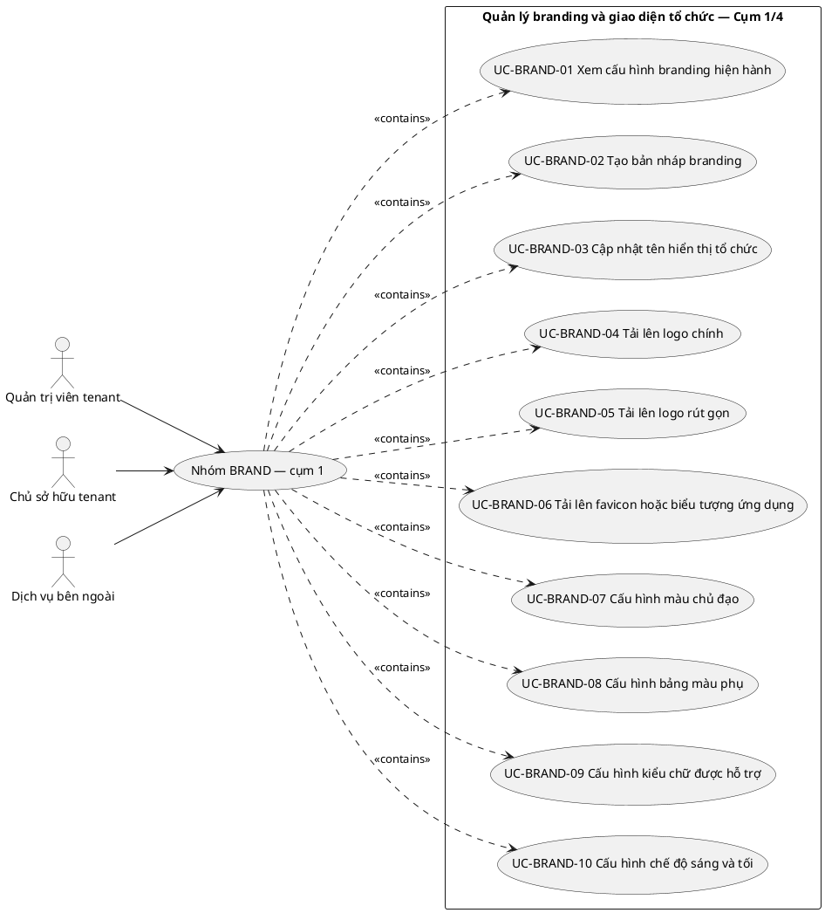
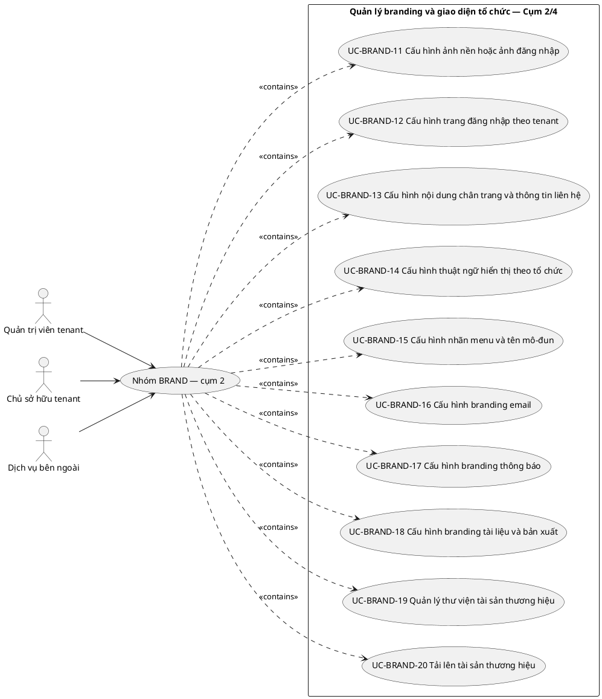
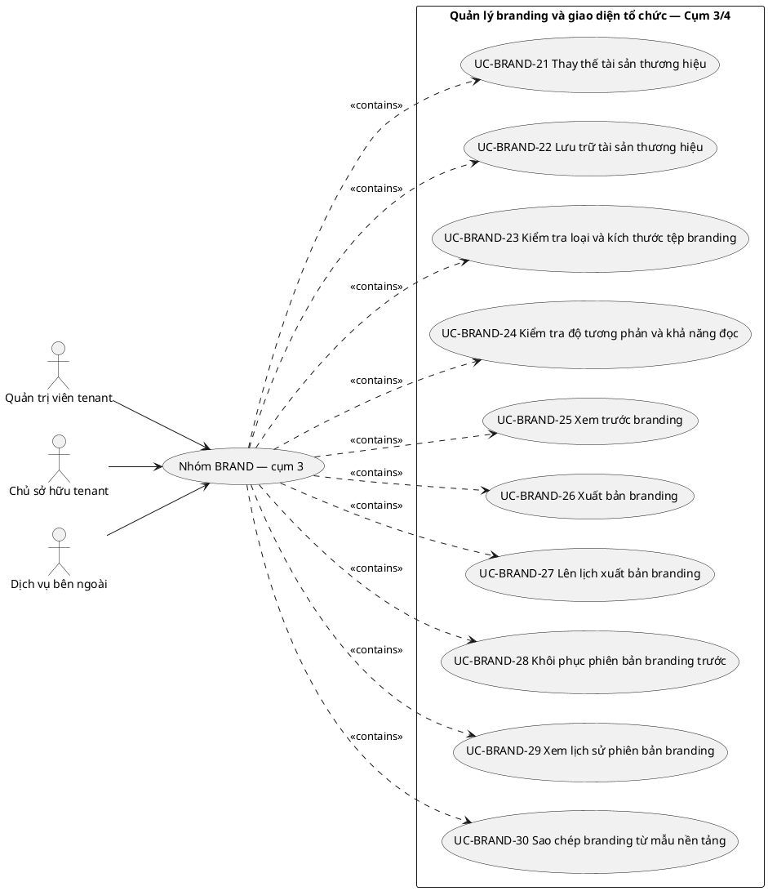
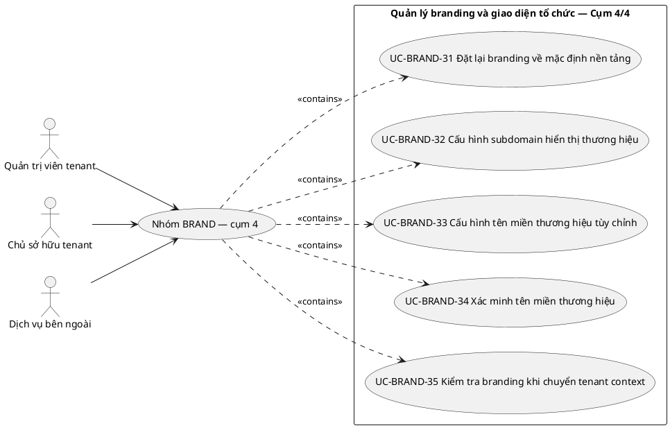

# UC-BRAND — Quản lý branding và giao diện tổ chức

## 1. Thông tin tài liệu

| Thuộc tính | Nội dung |
|---|---|
| Mã nhóm Use Case | `UC-BRAND` |
| Tên | Quản lý branding và giao diện tổ chức |
| Miền nghiệp vụ | Quản trị tổ chức |
| Mức ưu tiên phát triển | Nền tảng bắt buộc |
| Phạm vi | Toàn bộ sản phẩm Operations Hub |
| Mô hình | SaaS đa tổ chức, dữ liệu và cấu hình theo tenant |
| Trạng thái đặc tả | Baseline phân tích mở; đã liệt kê toàn bộ use case nhận diện được trong phạm vi hiện tại |

> **Nguyên tắc phạm vi:** tài liệu mô tả năng lực của phiên bản sản phẩm hoàn chỉnh. Mức ưu tiên phát triển không đồng nghĩa với loại bỏ khỏi phạm vi sản phẩm.

## 2. Mục tiêu

Cho phép mỗi tenant cấu hình nhận diện riêng mà không làm thay đổi quyền, logic nghiệp vụ hoặc khả năng sử dụng của nền tảng.

## 3. Actor

| Mã actor | Actor | Phạm vi |
|---|---|---|
| `ACT-TENANT-ADMIN` | Quản trị viên tenant | Tenant hoặc tích hợp |
| `ACT-TENANT-OWNER` | Chủ sở hữu tenant | Tenant hoặc tích hợp |
| `ACT-EXTERNAL-SERVICE` | Dịch vụ bên ngoài | Tenant hoặc tích hợp |

Actor trong sơ đồ chỉ thể hiện vai trò tương tác. Quyền thực tế phải được kiểm tra tại backend dựa trên tenant context, membership, role, permission, organization unit, trạng thái module và trạng thái tenant.

## 4. Điều kiện trước

- Tenant hợp lệ và đang cho phép quản trị.
- Người thao tác có permission quản lý branding.

## 5. Điều kiện sau

- Branding được áp dụng đúng tenant context.
- Tệp branding hợp lệ được lưu trữ và có thể truy vết phiên bản.

## 6. Danh sách use case thành phần

> **Nguyên tắc bao phủ:** không áp dụng giới hạn 10 use case thành phần. Danh sách dưới đây bao gồm toàn bộ use case có thể nhận diện hợp lý trong ranh giới sản phẩm và quy tắc nghiệp vụ hiện hành. Khi xuất hiện nghiệp vụ mới, use case mới được bổ sung mà không cắt bỏ use case đã có chỉ để giữ một số lượng cố định.

> Use case thành phần biểu diễn **mục tiêu có ý nghĩa đối với actor**, không đồng nhất với endpoint API, nút giao diện hoặc từng thao tác CRUD kỹ thuật.

| Mã | Use Case thành phần | Mô tả |
|---|---|---|
| `UC-BRAND-01` | Xem cấu hình branding hiện hành | Cho phép actor có quyền xem cấu hình branding hiện hành; phải kiểm tra quyền, trạng thái và phạm vi tenant hiện hành trước khi ghi nhận kết quả. |
| `UC-BRAND-02` | Tạo bản nháp branding | Cho phép tạo bản nháp branding; phải kiểm tra quyền, trạng thái và phạm vi tenant hiện hành trước khi ghi nhận kết quả. |
| `UC-BRAND-03` | Cập nhật tên hiển thị tổ chức | Cho phép cập nhật tên hiển thị tổ chức; phải kiểm tra quyền, trạng thái và phạm vi tenant hiện hành trước khi ghi nhận kết quả. |
| `UC-BRAND-04` | Tải lên logo chính | Cho phép tải lên logo chính; phải kiểm tra quyền, trạng thái và phạm vi tenant hiện hành trước khi ghi nhận kết quả. |
| `UC-BRAND-05` | Tải lên logo rút gọn | Cho phép tải lên logo rút gọn; phải kiểm tra quyền, trạng thái và phạm vi tenant hiện hành trước khi ghi nhận kết quả. |
| `UC-BRAND-06` | Tải lên favicon hoặc biểu tượng ứng dụng | Cho phép tải lên favicon hoặc biểu tượng ứng dụng; phải kiểm tra quyền, trạng thái và phạm vi tenant hiện hành trước khi ghi nhận kết quả. |
| `UC-BRAND-07` | Cấu hình màu chủ đạo | Cho phép cấu hình màu chủ đạo; phải kiểm tra quyền, trạng thái và phạm vi tenant hiện hành trước khi ghi nhận kết quả. |
| `UC-BRAND-08` | Cấu hình bảng màu phụ | Cho phép cấu hình bảng màu phụ; phải kiểm tra quyền, trạng thái và phạm vi tenant hiện hành trước khi ghi nhận kết quả. |
| `UC-BRAND-09` | Cấu hình kiểu chữ được hỗ trợ | Cho phép cấu hình kiểu chữ được hỗ trợ; phải kiểm tra quyền, trạng thái và phạm vi tenant hiện hành trước khi ghi nhận kết quả. |
| `UC-BRAND-10` | Cấu hình chế độ sáng và tối | Cho phép cấu hình chế độ sáng và tối; phải kiểm tra quyền, trạng thái và phạm vi tenant hiện hành trước khi ghi nhận kết quả. |
| `UC-BRAND-11` | Cấu hình ảnh nền hoặc ảnh đăng nhập | Cho phép cấu hình ảnh nền hoặc ảnh đăng nhập; phải kiểm tra quyền, trạng thái và phạm vi tenant hiện hành trước khi ghi nhận kết quả. |
| `UC-BRAND-12` | Cấu hình trang đăng nhập theo tenant | Cho phép cấu hình trang đăng nhập theo tenant; phải kiểm tra quyền, trạng thái và phạm vi tenant hiện hành trước khi ghi nhận kết quả. |
| `UC-BRAND-13` | Cấu hình nội dung chân trang và thông tin liên hệ | Cho phép cấu hình nội dung chân trang và thông tin liên hệ; phải kiểm tra quyền, trạng thái và phạm vi tenant hiện hành trước khi ghi nhận kết quả. |
| `UC-BRAND-14` | Cấu hình thuật ngữ hiển thị theo tổ chức | Cho phép cấu hình thuật ngữ hiển thị theo tổ chức; phải kiểm tra quyền, trạng thái và phạm vi tenant hiện hành trước khi ghi nhận kết quả. |
| `UC-BRAND-15` | Cấu hình nhãn menu và tên mô-đun | Cho phép cấu hình nhãn menu và tên mô-đun; phải kiểm tra quyền, trạng thái và phạm vi tenant hiện hành trước khi ghi nhận kết quả. |
| `UC-BRAND-16` | Cấu hình branding email | Cho phép cấu hình branding email; phải kiểm tra quyền, trạng thái và phạm vi tenant hiện hành trước khi ghi nhận kết quả. |
| `UC-BRAND-17` | Cấu hình branding thông báo | Cho phép cấu hình branding thông báo; phải kiểm tra quyền, trạng thái và phạm vi tenant hiện hành trước khi ghi nhận kết quả. |
| `UC-BRAND-18` | Cấu hình branding tài liệu và bản xuất | Cho phép cấu hình branding tài liệu và bản xuất; phải kiểm tra quyền, trạng thái và phạm vi tenant hiện hành trước khi ghi nhận kết quả. |
| `UC-BRAND-19` | Quản lý thư viện tài sản thương hiệu | Cho phép quản lý thư viện tài sản thương hiệu; phải kiểm tra quyền, trạng thái và phạm vi tenant hiện hành trước khi ghi nhận kết quả. |
| `UC-BRAND-20` | Tải lên tài sản thương hiệu | Cho phép tải lên tài sản thương hiệu; phải kiểm tra quyền, trạng thái và phạm vi tenant hiện hành trước khi ghi nhận kết quả. |
| `UC-BRAND-21` | Thay thế tài sản thương hiệu | Thực hiện nghiệp vụ “Thay thế tài sản thương hiệu” trong đúng phạm vi tenant hiện hành, có kiểm tra dữ liệu, quyền và trạng thái liên quan. |
| `UC-BRAND-22` | Lưu trữ tài sản thương hiệu | Cho phép lưu trữ tài sản thương hiệu; phải kiểm tra quyền, trạng thái và phạm vi tenant hiện hành trước khi ghi nhận kết quả. |
| `UC-BRAND-23` | Kiểm tra loại và kích thước tệp branding | Kiểm tra loại và kích thước tệp branding; phải kiểm tra quyền, trạng thái và phạm vi tenant hiện hành trước khi ghi nhận kết quả. |
| `UC-BRAND-24` | Kiểm tra độ tương phản và khả năng đọc | Kiểm tra độ tương phản và khả năng đọc; phải kiểm tra quyền, trạng thái và phạm vi tenant hiện hành trước khi ghi nhận kết quả. |
| `UC-BRAND-25` | Xem trước branding | Cho phép actor có quyền xem trước branding; phải kiểm tra quyền, trạng thái và phạm vi tenant hiện hành trước khi ghi nhận kết quả. |
| `UC-BRAND-26` | Xuất bản branding | Cho phép xuất bản branding; phải kiểm tra quyền, trạng thái và phạm vi tenant hiện hành trước khi ghi nhận kết quả. |
| `UC-BRAND-27` | Lên lịch xuất bản branding | Thực hiện nghiệp vụ “Lên lịch xuất bản branding” trong đúng phạm vi tenant hiện hành, có kiểm tra dữ liệu, quyền và trạng thái liên quan. |
| `UC-BRAND-28` | Khôi phục phiên bản branding trước | Cho phép khôi phục phiên bản branding trước; phải kiểm tra quyền, trạng thái và phạm vi tenant hiện hành trước khi ghi nhận kết quả. |
| `UC-BRAND-29` | Xem lịch sử phiên bản branding | Cho phép actor có quyền xem lịch sử phiên bản branding; phải kiểm tra quyền, trạng thái và phạm vi tenant hiện hành trước khi ghi nhận kết quả. |
| `UC-BRAND-30` | Sao chép branding từ mẫu nền tảng | Thực hiện nghiệp vụ “Sao chép branding từ mẫu nền tảng” trong đúng phạm vi tenant hiện hành, có kiểm tra dữ liệu, quyền và trạng thái liên quan. |
| `UC-BRAND-31` | Đặt lại branding về mặc định nền tảng | Cho phép đặt lại branding về mặc định nền tảng; phải kiểm tra quyền, trạng thái và phạm vi tenant hiện hành trước khi ghi nhận kết quả. |
| `UC-BRAND-32` | Cấu hình subdomain hiển thị thương hiệu | Cho phép cấu hình subdomain hiển thị thương hiệu; phải kiểm tra quyền, trạng thái và phạm vi tenant hiện hành trước khi ghi nhận kết quả. |
| `UC-BRAND-33` | Cấu hình tên miền thương hiệu tùy chỉnh | Cho phép cấu hình tên miền thương hiệu tùy chỉnh; phải kiểm tra quyền, trạng thái và phạm vi tenant hiện hành trước khi ghi nhận kết quả. |
| `UC-BRAND-34` | Xác minh tên miền thương hiệu | Thực hiện nghiệp vụ “Xác minh tên miền thương hiệu” trong đúng phạm vi tenant hiện hành, có kiểm tra dữ liệu, quyền và trạng thái liên quan. |
| `UC-BRAND-35` | Kiểm tra branding khi chuyển tenant context | Kiểm tra branding khi chuyển tenant context; phải kiểm tra quyền, trạng thái và phạm vi tenant hiện hành trước khi ghi nhận kết quả. |

## 7. Luồng nghiệp vụ chính

1. Tenant Admin mở trang branding và tải cấu hình đang hiệu lực.
2. Người dùng chỉnh tên hiển thị, màu và tài sản hình ảnh.
3. Hệ thống kiểm tra định dạng, kích thước, tương phản và phạm vi giá trị.
4. Hệ thống tạo phiên bản nháp và cho phép xem trước.
5. Tenant Admin công bố phiên bản.
6. Các phiên giao diện tải branding theo tenant context; cache được làm mới có kiểm soát.

## 8. Luồng thay thế và ngoại lệ

- Tệp không hợp lệ hoặc có khả năng thực thi mã: từ chối.
- Màu không đạt ngưỡng khả năng đọc: cảnh báo hoặc từ chối theo chính sách.
- Tenant khác yêu cầu asset bằng định danh đoán được: từ chối.

## 9. Quy tắc nghiệp vụ cốt lõi

- Branding chỉ có hiệu lực trong tenant sở hữu cấu hình.
- Tenant chưa cấu hình riêng phải dùng mặc định nền tảng.
- Branding không được thay đổi permission, trạng thái hoặc logic nghiệp vụ.
- Màu và hình ảnh không được che khuất cảnh báo bắt buộc hoặc làm nội dung mất khả năng đọc.
- Tệp tải lên phải kiểm tra loại, kích thước và nội dung nguy hiểm.

## 10. Mô hình dữ liệu logic liên quan

| Thực thể | Vai trò |
|---|---|
| `BrandingConfiguration` | Thực thể logic phục vụ UC-BRAND; thiết kế vật lý được xác định ở giai đoạn thiết kế dữ liệu. |
| `BrandingVersion` | Thực thể logic phục vụ UC-BRAND; thiết kế vật lý được xác định ở giai đoạn thiết kế dữ liệu. |
| `BrandingAsset` | Thực thể logic phục vụ UC-BRAND; thiết kế vật lý được xác định ở giai đoạn thiết kế dữ liệu. |
| `ThemeToken` | Thực thể logic phục vụ UC-BRAND; thiết kế vật lý được xác định ở giai đoạn thiết kế dữ liệu. |
| `TenantConfiguration` | Thực thể logic phục vụ UC-BRAND; thiết kế vật lý được xác định ở giai đoạn thiết kế dữ liệu. |
| `AuditLog` | Thực thể logic phục vụ UC-BRAND; thiết kế vật lý được xác định ở giai đoạn thiết kế dữ liệu. |

Mọi thực thể nghiệp vụ phải xác định được tenant sở hữu, trừ thực thể được công bố rõ là dữ liệu cấp nền tảng. Quan hệ tham chiếu chéo tenant bị cấm nếu không có cơ chế liên tenant được đặc tả riêng.

## 11. Kiểm soát truy cập

Quyền hiệu lực được xác định theo công thức khái quát:

```text
Quyền hiệu lực
= Permission từ các Role đang hoạt động
∩ Tenant context hợp lệ
∩ Membership đang hoạt động
∩ Phạm vi Organization Unit
∩ Phạm vi tài nguyên
∩ Trạng thái Module
∩ Trạng thái Tenant
```

Các kiểm tra bắt buộc:

- Xác thực User trước khi truy cập chức năng không công khai.
- Đối chiếu tenant context với membership.
- Kiểm tra permission tại backend, không dựa vào trạng thái hiển thị của frontend.
- Giới hạn truy vấn, tệp, bản xuất, cache và tác vụ nền theo tenant.
- Ghi audit cho hành động quản trị hoặc thay đổi nghiệp vụ quan trọng.

## 12. Tiêu chí chấp nhận

| Mã | Tiêu chí | Phương pháp kiểm chứng |
|---|---|---|
| `AC-BRAND-01` | Chuyển tenant làm logo, màu và tên hiển thị thay đổi đúng. | Functional / Integration / Security Test tùy nội dung |
| `AC-BRAND-02` | Tenant chưa branding vẫn có giao diện sử dụng được. | Functional / Integration / Security Test tùy nội dung |
| `AC-BRAND-03` | Không thể truy cập asset riêng của tenant khác. | Functional / Integration / Security Test tùy nội dung |
| `AC-BRAND-04` | Thay branding không tạo thêm quyền nghiệp vụ. | Functional / Integration / Security Test tùy nội dung |

## 13. Quan hệ với nhóm Use Case khác

[`UC-TENANT`](./01_UC-TENANT.md), [`UC-AUDIT`](./21_UC-AUDIT.md), [`UC-SETTING`](./08_UC-SETTING.md)

## 14. Use Case Diagram

Do số lượng use case thành phần không bị giới hạn ở 10, sơ đồ được chia thành các cụm để bảo đảm khả năng đọc. Quan hệ `<<contains>>` trong sơ đồ chỉ biểu thị quan hệ phân nhóm tài liệu, không phải quan hệ UML `<<include>>`. Quan hệ actor–use case nguyên tử phải được xác nhận khi đặc tả chi tiết từng use case; không suy luận rằng mọi actor liệt kê đều được thực hiện mọi use case trong cụm.

### 14.1. Cụm use case 01–10



### 14.2. Cụm use case 11–20



### 14.3. Cụm use case 21–30



### 14.4. Cụm use case 31–35



## 15. Điểm mở cần chi tiết hóa

- Trường dữ liệu chi tiết, trạng thái và ma trận chuyển trạng thái của từng use case thành phần.
- Ma trận permission ở cấp hành động và scope.
- Quy tắc retention, masking và phân loại dữ liệu nhạy cảm.
- Hợp đồng API, mã lỗi và yêu cầu idempotency.
- Test case chi tiết và dữ liệu kiểm thử theo tenant.
