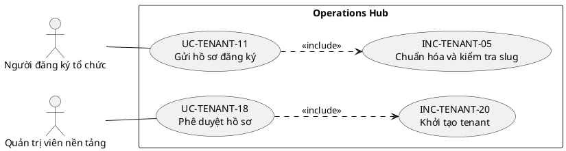

# HƯỚNG DẪN MÔ HÌNH HÓA USE CASE — OPERATIONS HUB V3

## 1. Mục tiêu

V3 sửa lỗi của V2 khi actor được nối tới phần tử trung gian `PKG*` rồi `PKG*` nối đến các Use Case. Cách biểu diễn đó chỉ cho biết actor có liên quan đến một nhóm, nhưng không cho biết actor thực hiện nghiệp vụ nào.

## 2. Bốn loại phần tử

| Tiền tố | Loại | Cách dùng |
|---|---|---|
| `UC-*` | Use Case mục tiêu actor | Actor có mục tiêu quan sát được; actor nối trực tiếp |
| `INC-*` | Hành vi dùng chung | Bắt buộc trong Use Case cha; dùng `<<include>>` |
| `EXT-*` | Luồng điều kiện | Chỉ xảy ra khi có điều kiện; dùng `<<extend>>` |
| `REQ-*` | Quy tắc/yêu cầu hệ thống | Không phải Use Case; ghi trong bảng quy tắc hoặc yêu cầu |

## 3. Quy tắc sơ đồ

1. Rectangle/package chỉ xác định ranh giới hệ thống hoặc miền nghiệp vụ.
2. Không tạo ellipse `PKG1`, `PKG2` hoặc quan hệ tự đặt `<<contains>>`.
3. Actor phải nối trực tiếp đến từng `UC-*` hoặc `EXT-*` có liên quan.
4. Không nối actor vào `INC-*` nếu actor không có mục tiêu độc lập đối với hành vi đó.
5. Không vẽ `REQ-*` như Use Case.
6. Sơ đồ được chia theo vòng đời hoặc luồng nghiệp vụ, không chia cơ học theo mỗi 10 phần tử.

## 4. Ví dụ đúng

## 5. Truy vết từ V2

Mỗi bảng danh mục trong V3 giữ cả **Mã V3** và **Mã V2**. Việc đổi tiền tố không làm mất dấu phần tử cũ; nó chỉ sửa bản chất mô hình hóa của phần tử.
