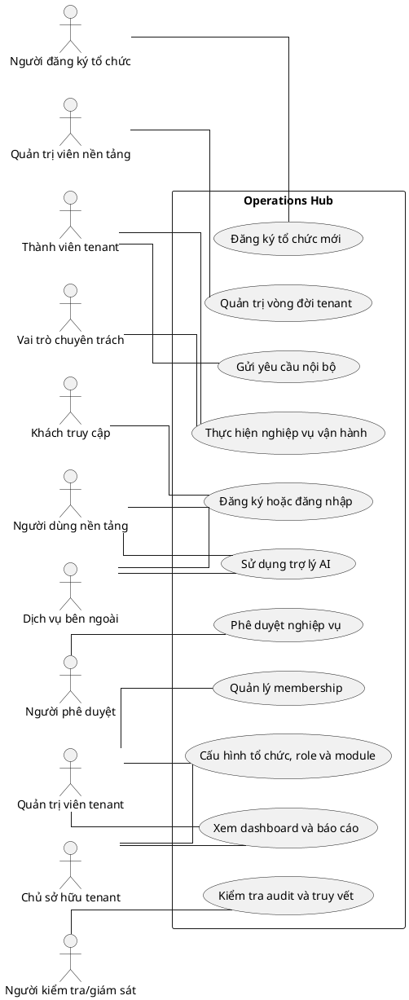

# USE CASE DIAGRAM TỔNG QUÁT — OPERATIONS HUB V3

## 1. Phạm vi

Sơ đồ tổng quát chỉ trình bày các mục tiêu nghiệp vụ đại diện ở cấp hệ thống. Danh sách 21 nhóm được dùng làm chỉ mục phân rã, không được mô hình hóa thành pseudo-use-case trung gian.

## 2. PlantUML

## 3. Phân rã

Chi tiết actor–Use Case trực tiếp nằm trong 21 file `UC-*`. Mỗi file chia sơ đồ theo luồng nghiệp vụ, không chia theo số lượng cố định.
