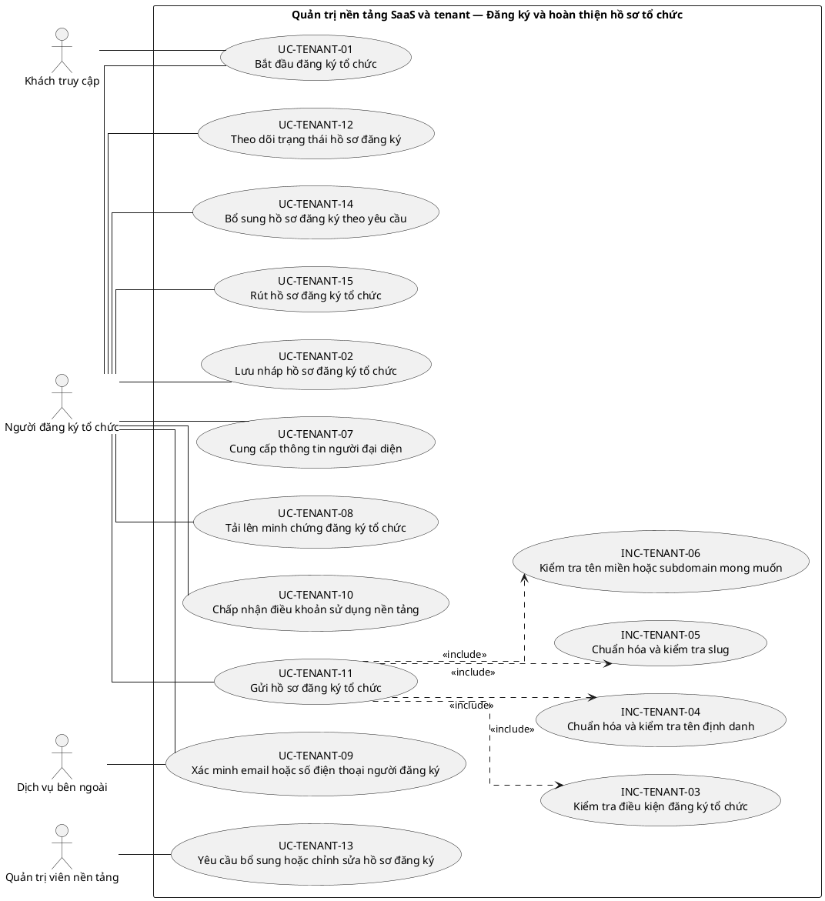
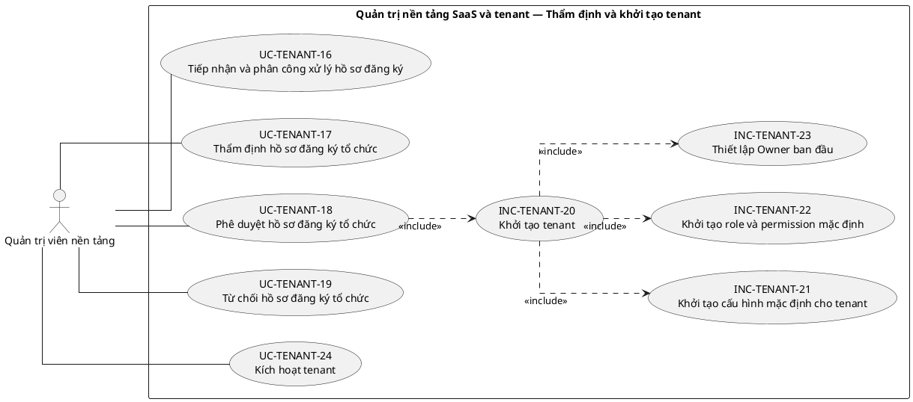
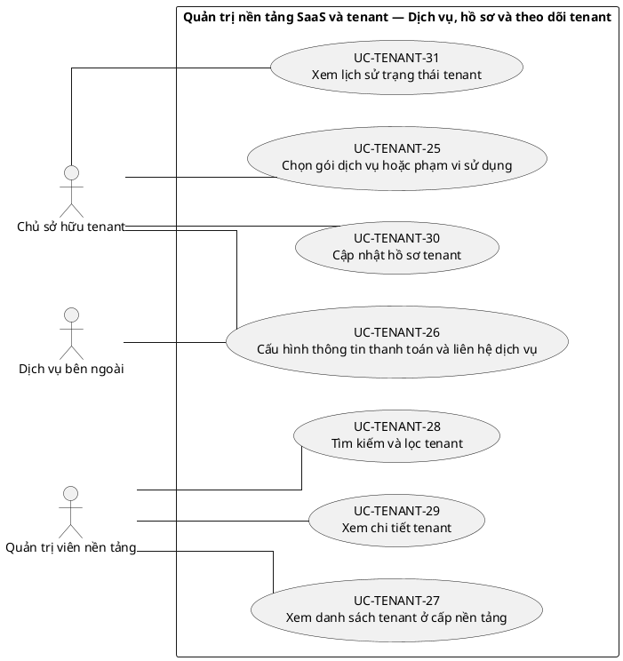
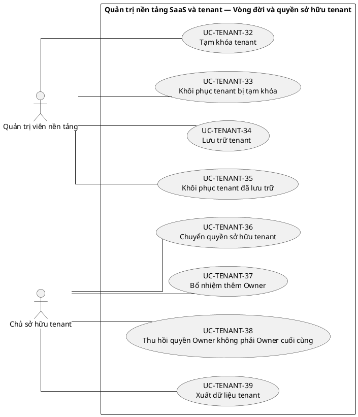
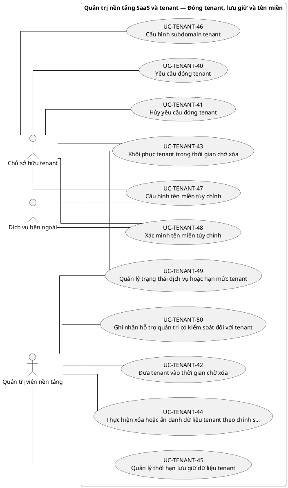

# UC-TENANT — Quản trị nền tảng SaaS và tenant

## 1. Thông tin tài liệu

| Thuộc tính | Nội dung |
|---|---|
| Mã nhóm Use Case | `UC-TENANT` |
| Tên | Quản trị nền tảng SaaS và tenant |
| Miền nghiệp vụ | Nền tảng SaaS |
| Mức ưu tiên phát triển | Nền tảng bắt buộc |
| Phạm vi | Toàn bộ sản phẩm Operations Hub |
| Mô hình | SaaS đa tổ chức, dữ liệu và cấu hình theo tenant |
| Trạng thái đặc tả | Baseline V3; phân biệt Use Case mục tiêu, include, extend và yêu cầu hệ thống |

> **Nguyên tắc phạm vi:** tài liệu mô tả năng lực của phiên bản sản phẩm hoàn chỉnh. Mức ưu tiên phát triển không đồng nghĩa với loại bỏ khỏi phạm vi sản phẩm.

## 2. Mục tiêu

Cho phép đăng ký, khởi tạo, quản trị vòng đời và bảo đảm ranh giới sở hữu của từng tổ chức sử dụng Operations Hub.

## 3. Actor

| Mã actor | Actor | Phạm vi |
|---|---|---|
| `ACT-GUEST` | Khách truy cập | Cấp nền tảng |
| `ACT-PLATFORM-USER` | Người dùng nền tảng | Cấp nền tảng |
| `ACT-ORG-REGISTRANT` | Người đăng ký tổ chức | Cấp nền tảng |
| `ACT-TENANT-OWNER` | Chủ sở hữu tenant | Tenant hoặc tích hợp |
| `ACT-PLATFORM-ADMIN` | Quản trị viên nền tảng | Cấp nền tảng |
| `ACT-EXTERNAL-SERVICE` | Dịch vụ bên ngoài | Tenant hoặc tích hợp |

Actor trong sơ đồ chỉ thể hiện vai trò tương tác. Quyền thực tế phải được kiểm tra tại backend dựa trên tenant context, membership, role, permission, organization unit, trạng thái module và trạng thái tenant.

## 4. Điều kiện trước

- Người đăng ký có tài khoản hợp lệ đối với các bước yêu cầu xác thực.
- Nền tảng đã có chính sách tạo tenant, trạng thái tenant và role mặc định.

## 5. Điều kiện sau

- Tenant có định danh duy nhất, trạng thái hợp lệ và cấu hình nền tảng ban đầu.
- Người đăng ký hợp lệ có membership hoạt động và vai trò Owner ban đầu.
- Mọi thay đổi vòng đời tenant được ghi audit.

## 6. Danh mục phần tử nghiệp vụ và phân loại UML

> **Thay đổi của V3:** Không coi toàn bộ danh mục chức năng là Use Case độc lập. Chỉ phần tử có mục tiêu quan sát được đối với actor được giữ mã `UC-*`. Hành vi bắt buộc dùng chung dùng mã `INC-*`; luồng điều kiện dùng mã `EXT-*`; quy tắc hoặc xử lý xuyên suốt dùng mã `REQ-*`. Mã V2 được giữ để truy vết.

> Actor chỉ nối trực tiếp với `UC-*` hoặc `EXT-*` mà actor thực sự khởi phát/tham gia. `INC-*` được nối bằng `<<include>>`; `REQ-*` không được vẽ như Use Case.

| Mã V3           | Mã V2          | Phần tử nghiệp vụ                                         | Loại mô hình                     | Actor trực tiếp / nguồn kích hoạt                                                          | Quan hệ                                       |
| --------------- | -------------- | --------------------------------------------------------- | -------------------------------- | ------------------------------------------------------------------------------------------ | --------------------------------------------- |
| `UC-TENANT-01`  | `UC-TENANT-01` | Bắt đầu đăng ký tổ chức                                   | Use Case mục tiêu actor          | `ACT-GUEST` — Khách truy cập<br>`ACT-ORG-REGISTRANT` — Người đăng ký tổ chức               | Association trực tiếp với actor               |
| `UC-TENANT-02`  | `UC-TENANT-02` | Lưu nháp hồ sơ đăng ký tổ chức                            | Use Case mục tiêu actor          | `ACT-ORG-REGISTRANT` — Người đăng ký tổ chức                                               | Association trực tiếp với actor               |
| `INC-TENANT-03` | `UC-TENANT-03` | Kiểm tra điều kiện đăng ký tổ chức                        | Hành vi dùng chung `<<include>>` | Hệ thống; được gọi từ Use Case cha                                                         | `UC-TENANT-11` `<<include>>` `INC-TENANT-03`  |
| `INC-TENANT-04` | `UC-TENANT-04` | Chuẩn hóa và kiểm tra tên định danh                       | Hành vi dùng chung `<<include>>` | Hệ thống; được gọi từ Use Case cha                                                         | `UC-TENANT-11` `<<include>>` `INC-TENANT-04`  |
| `INC-TENANT-05` | `UC-TENANT-05` | Chuẩn hóa và kiểm tra slug                                | Hành vi dùng chung `<<include>>` | Hệ thống; được gọi từ Use Case cha                                                         | `UC-TENANT-11` `<<include>>` `INC-TENANT-05`  |
| `INC-TENANT-06` | `UC-TENANT-06` | Kiểm tra tên miền hoặc subdomain mong muốn                | Hành vi dùng chung `<<include>>` | Hệ thống; được gọi từ Use Case cha                                                         | `UC-TENANT-11` `<<include>>` `INC-TENANT-06`  |
| `UC-TENANT-07`  | `UC-TENANT-07` | Cung cấp thông tin người đại diện                         | Use Case mục tiêu actor          | `ACT-ORG-REGISTRANT` — Người đăng ký tổ chức                                               | Association trực tiếp với actor               |
| `UC-TENANT-08`  | `UC-TENANT-08` | Tải lên minh chứng đăng ký tổ chức                        | Use Case mục tiêu actor          | `ACT-ORG-REGISTRANT` — Người đăng ký tổ chức                                               | Association trực tiếp với actor               |
| `UC-TENANT-09`  | `UC-TENANT-09` | Xác minh email hoặc số điện thoại người đăng ký           | Use Case mục tiêu actor          | `ACT-ORG-REGISTRANT` — Người đăng ký tổ chức<br>`ACT-EXTERNAL-SERVICE` — Dịch vụ bên ngoài | Association trực tiếp với actor               |
| `UC-TENANT-10`  | `UC-TENANT-10` | Chấp nhận điều khoản sử dụng nền tảng                     | Use Case mục tiêu actor          | `ACT-ORG-REGISTRANT` — Người đăng ký tổ chức                                               | Association trực tiếp với actor               |
| `UC-TENANT-11`  | `UC-TENANT-11` | Gửi hồ sơ đăng ký tổ chức                                 | Use Case mục tiêu actor          | `ACT-ORG-REGISTRANT` — Người đăng ký tổ chức                                               | Association trực tiếp với actor               |
| `UC-TENANT-12`  | `UC-TENANT-12` | Theo dõi trạng thái hồ sơ đăng ký                         | Use Case mục tiêu actor          | `ACT-ORG-REGISTRANT` — Người đăng ký tổ chức                                               | Association trực tiếp với actor               |
| `UC-TENANT-13`  | `UC-TENANT-13` | Yêu cầu bổ sung hoặc chỉnh sửa hồ sơ đăng ký              | Use Case mục tiêu actor          | `ACT-PLATFORM-ADMIN` — Quản trị viên nền tảng                                              | Association trực tiếp với actor               |
| `UC-TENANT-14`  | `UC-TENANT-14` | Bổ sung hồ sơ đăng ký theo yêu cầu                        | Use Case mục tiêu actor          | `ACT-ORG-REGISTRANT` — Người đăng ký tổ chức                                               | Association trực tiếp với actor               |
| `UC-TENANT-15`  | `UC-TENANT-15` | Rút hồ sơ đăng ký tổ chức                                 | Use Case mục tiêu actor          | `ACT-ORG-REGISTRANT` — Người đăng ký tổ chức                                               | Association trực tiếp với actor               |
| `UC-TENANT-16`  | `UC-TENANT-16` | Tiếp nhận và phân công xử lý hồ sơ đăng ký                | Use Case mục tiêu actor          | `ACT-PLATFORM-ADMIN` — Quản trị viên nền tảng                                              | Association trực tiếp với actor               |
| `UC-TENANT-17`  | `UC-TENANT-17` | Thẩm định hồ sơ đăng ký tổ chức                           | Use Case mục tiêu actor          | `ACT-PLATFORM-ADMIN` — Quản trị viên nền tảng                                              | Association trực tiếp với actor               |
| `UC-TENANT-18`  | `UC-TENANT-18` | Phê duyệt hồ sơ đăng ký tổ chức                           | Use Case mục tiêu actor          | `ACT-PLATFORM-ADMIN` — Quản trị viên nền tảng                                              | Association trực tiếp với actor               |
| `UC-TENANT-19`  | `UC-TENANT-19` | Từ chối hồ sơ đăng ký tổ chức                             | Use Case mục tiêu actor          | `ACT-PLATFORM-ADMIN` — Quản trị viên nền tảng                                              | Association trực tiếp với actor               |
| `INC-TENANT-20` | `UC-TENANT-20` | Khởi tạo tenant                                           | Hành vi dùng chung `<<include>>` | Hệ thống; được gọi từ Use Case cha                                                         | `UC-TENANT-18` `<<include>>` `INC-TENANT-20`  |
| `INC-TENANT-21` | `UC-TENANT-21` | Khởi tạo cấu hình mặc định cho tenant                     | Hành vi dùng chung `<<include>>` | Hệ thống; được gọi từ Use Case cha                                                         | `INC-TENANT-20` `<<include>>` `INC-TENANT-21` |
| `INC-TENANT-22` | `UC-TENANT-22` | Khởi tạo role và permission mặc định                      | Hành vi dùng chung `<<include>>` | Hệ thống; được gọi từ Use Case cha                                                         | `INC-TENANT-20` `<<include>>` `INC-TENANT-22` |
| `INC-TENANT-23` | `UC-TENANT-23` | Thiết lập Owner ban đầu                                   | Hành vi dùng chung `<<include>>` | Hệ thống; được gọi từ Use Case cha                                                         | `INC-TENANT-20` `<<include>>` `INC-TENANT-23` |
| `UC-TENANT-24`  | `UC-TENANT-24` | Kích hoạt tenant                                          | Use Case mục tiêu actor          | `ACT-PLATFORM-ADMIN` — Quản trị viên nền tảng                                              | Association trực tiếp với actor               |
| `UC-TENANT-25`  | `UC-TENANT-25` | Chọn gói dịch vụ hoặc phạm vi sử dụng                     | Use Case mục tiêu actor          | `ACT-TENANT-OWNER` — Chủ sở hữu tenant                                                     | Association trực tiếp với actor               |
| `UC-TENANT-26`  | `UC-TENANT-26` | Cấu hình thông tin thanh toán và liên hệ dịch vụ          | Use Case mục tiêu actor          | `ACT-TENANT-OWNER` — Chủ sở hữu tenant<br>`ACT-EXTERNAL-SERVICE` — Dịch vụ bên ngoài       | Association trực tiếp với actor               |
| `UC-TENANT-27`  | `UC-TENANT-27` | Xem danh sách tenant ở cấp nền tảng                       | Use Case mục tiêu actor          | `ACT-PLATFORM-ADMIN` — Quản trị viên nền tảng                                              | Association trực tiếp với actor               |
| `UC-TENANT-28`  | `UC-TENANT-28` | Tìm kiếm và lọc tenant                                    | Use Case mục tiêu actor          | `ACT-PLATFORM-ADMIN` — Quản trị viên nền tảng                                              | Association trực tiếp với actor               |
| `UC-TENANT-29`  | `UC-TENANT-29` | Xem chi tiết tenant                                       | Use Case mục tiêu actor          | `ACT-PLATFORM-ADMIN` — Quản trị viên nền tảng                                              | Association trực tiếp với actor               |
| `UC-TENANT-30`  | `UC-TENANT-30` | Cập nhật hồ sơ tenant                                     | Use Case mục tiêu actor          | `ACT-TENANT-OWNER` — Chủ sở hữu tenant                                                     | Association trực tiếp với actor               |
| `UC-TENANT-31`  | `UC-TENANT-31` | Xem lịch sử trạng thái tenant                             | Use Case mục tiêu actor          | `ACT-TENANT-OWNER` — Chủ sở hữu tenant                                                     | Association trực tiếp với actor               |
| `UC-TENANT-32`  | `UC-TENANT-32` | Tạm khóa tenant                                           | Use Case mục tiêu actor          | `ACT-PLATFORM-ADMIN` — Quản trị viên nền tảng                                              | Association trực tiếp với actor               |
| `UC-TENANT-33`  | `UC-TENANT-33` | Khôi phục tenant bị tạm khóa                              | Use Case mục tiêu actor          | `ACT-PLATFORM-ADMIN` — Quản trị viên nền tảng                                              | Association trực tiếp với actor               |
| `UC-TENANT-34`  | `UC-TENANT-34` | Lưu trữ tenant                                            | Use Case mục tiêu actor          | `ACT-PLATFORM-ADMIN` — Quản trị viên nền tảng                                              | Association trực tiếp với actor               |
| `UC-TENANT-35`  | `UC-TENANT-35` | Khôi phục tenant đã lưu trữ                               | Use Case mục tiêu actor          | `ACT-PLATFORM-ADMIN` — Quản trị viên nền tảng                                              | Association trực tiếp với actor               |
| `UC-TENANT-36`  | `UC-TENANT-36` | Chuyển quyền sở hữu tenant                                | Use Case mục tiêu actor          | `ACT-TENANT-OWNER` — Chủ sở hữu tenant                                                     | Association trực tiếp với actor               |
| `UC-TENANT-37`  | `UC-TENANT-37` | Bổ nhiệm thêm Owner                                       | Use Case mục tiêu actor          | `ACT-TENANT-OWNER` — Chủ sở hữu tenant                                                     | Association trực tiếp với actor               |
| `UC-TENANT-38`  | `UC-TENANT-38` | Thu hồi quyền Owner không phải Owner cuối cùng            | Use Case mục tiêu actor          | `ACT-TENANT-OWNER` — Chủ sở hữu tenant                                                     | Association trực tiếp với actor               |
| `UC-TENANT-39`  | `UC-TENANT-39` | Xuất dữ liệu tenant                                       | Use Case mục tiêu actor          | `ACT-TENANT-OWNER` — Chủ sở hữu tenant                                                     | Association trực tiếp với actor               |
| `UC-TENANT-40`  | `UC-TENANT-40` | Yêu cầu đóng tenant                                       | Use Case mục tiêu actor          | `ACT-TENANT-OWNER` — Chủ sở hữu tenant                                                     | Association trực tiếp với actor               |
| `UC-TENANT-41`  | `UC-TENANT-41` | Hủy yêu cầu đóng tenant                                   | Use Case mục tiêu actor          | `ACT-TENANT-OWNER` — Chủ sở hữu tenant                                                     | Association trực tiếp với actor               |
| `UC-TENANT-42`  | `UC-TENANT-42` | Đưa tenant vào thời gian chờ xóa                          | Use Case mục tiêu actor          | `ACT-PLATFORM-ADMIN` — Quản trị viên nền tảng                                              | Association trực tiếp với actor               |
| `UC-TENANT-43`  | `UC-TENANT-43` | Khôi phục tenant trong thời gian chờ xóa                  | Use Case mục tiêu actor          | `ACT-TENANT-OWNER` — Chủ sở hữu tenant                                                     | Association trực tiếp với actor               |
| `UC-TENANT-44`  | `UC-TENANT-44` | Thực hiện xóa hoặc ẩn danh dữ liệu tenant theo chính sách | Use Case mục tiêu actor          | `ACT-PLATFORM-ADMIN` — Quản trị viên nền tảng                                              | Association trực tiếp với actor               |
| `UC-TENANT-45`  | `UC-TENANT-45` | Quản lý thời hạn lưu giữ dữ liệu tenant                   | Use Case mục tiêu actor          | `ACT-PLATFORM-ADMIN` — Quản trị viên nền tảng                                              | Association trực tiếp với actor               |
| `UC-TENANT-46`  | `UC-TENANT-46` | Cấu hình subdomain tenant                                 | Use Case mục tiêu actor          | `ACT-TENANT-OWNER` — Chủ sở hữu tenant                                                     | Association trực tiếp với actor               |
| `UC-TENANT-47`  | `UC-TENANT-47` | Cấu hình tên miền tùy chỉnh                               | Use Case mục tiêu actor          | `ACT-TENANT-OWNER` — Chủ sở hữu tenant<br>`ACT-EXTERNAL-SERVICE` — Dịch vụ bên ngoài       | Association trực tiếp với actor               |
| `UC-TENANT-48`  | `UC-TENANT-48` | Xác minh tên miền tùy chỉnh                               | Use Case mục tiêu actor          | `ACT-TENANT-OWNER` — Chủ sở hữu tenant<br>`ACT-EXTERNAL-SERVICE` — Dịch vụ bên ngoài       | Association trực tiếp với actor               |
| `UC-TENANT-49`  | `UC-TENANT-49` | Quản lý trạng thái dịch vụ hoặc hạn mức tenant            | Use Case mục tiêu actor          | `ACT-TENANT-OWNER` — Chủ sở hữu tenant<br>`ACT-PLATFORM-ADMIN` — Quản trị viên nền tảng    | Association trực tiếp với actor               |
| `UC-TENANT-50`  | `UC-TENANT-50` | Ghi nhận hỗ trợ quản trị có kiểm soát đối với tenant      | Use Case mục tiêu actor          | `ACT-PLATFORM-ADMIN` — Quản trị viên nền tảng                                              | Association trực tiếp với actor               |

## 7. Luồng nghiệp vụ chính

1. Người đăng ký cung cấp thông tin tổ chức và định danh mong muốn.
2. Hệ thống chuẩn hóa dữ liệu, kiểm tra trùng lặp và điều kiện đăng ký.
3. Hệ thống ghi nhận hồ sơ ở trạng thái chờ xử lý hoặc tự động chấp nhận theo chính sách.
4. Khi được chấp nhận, hệ thống tạo tenant và cấu hình mặc định.
5. Hệ thống tạo membership cho người đăng ký và gán vai trò Owner.
6. Hệ thống phát hành ngữ cảnh tenant, ghi audit và chuyển người dùng sang bước onboarding tổ chức.

## 8. Luồng thay thế và ngoại lệ

- Slug hoặc định danh đã tồn tại: yêu cầu người dùng chọn giá trị khác.
- Khởi tạo role hoặc membership thất bại: hoàn tác tenant mới, không để dữ liệu dở dang.
- Tenant bị tạm khóa: từ chối thao tác thay đổi dữ liệu nhưng vẫn bảo toàn dữ liệu.
- Yêu cầu làm mất Owner cuối cùng: từ chối cho đến khi có Owner thay thế.

## 9. Quy tắc nghiệp vụ cốt lõi

- Slug phải được chuẩn hóa và duy nhất trong toàn nền tảng.
- Tạo tenant, membership và Owner ban đầu là một giao dịch nghiệp vụ thống nhất; thất bại một bước phải hoàn tác toàn bộ.
- Mỗi tenant đang hoạt động phải có ít nhất một Owner đang hoạt động.
- Tạm khóa hoặc lưu trữ tenant không đồng nghĩa với xóa dữ liệu.
- Platform Admin không mặc nhiên có quyền thao tác dữ liệu nghiệp vụ nội bộ của tenant.

## 10. Mô hình dữ liệu logic liên quan

| Thực thể | Vai trò |
|---|---|
| `Tenant` | Thực thể logic phục vụ UC-TENANT; thiết kế vật lý được xác định ở giai đoạn thiết kế dữ liệu. |
| `TenantRegistration` | Thực thể logic phục vụ UC-TENANT; thiết kế vật lý được xác định ở giai đoạn thiết kế dữ liệu. |
| `Membership` | Thực thể logic phục vụ UC-TENANT; thiết kế vật lý được xác định ở giai đoạn thiết kế dữ liệu. |
| `Role` | Thực thể logic phục vụ UC-TENANT; thiết kế vật lý được xác định ở giai đoạn thiết kế dữ liệu. |
| `TenantStatusHistory` | Thực thể logic phục vụ UC-TENANT; thiết kế vật lý được xác định ở giai đoạn thiết kế dữ liệu. |
| `TenantConfiguration` | Thực thể logic phục vụ UC-TENANT; thiết kế vật lý được xác định ở giai đoạn thiết kế dữ liệu. |
| `AuditLog` | Thực thể logic phục vụ UC-TENANT; thiết kế vật lý được xác định ở giai đoạn thiết kế dữ liệu. |

Mọi thực thể nghiệp vụ phải xác định được tenant sở hữu, trừ thực thể được công bố rõ là dữ liệu cấp nền tảng. Quan hệ tham chiếu chéo tenant bị cấm nếu không có cơ chế liên tenant được đặc tả riêng.

## 11. Kiểm soát truy cập

Quyền hiệu lực được xác định theo công thức khái quát:

```text
Quyền hiệu lực
= Permission từ các Role đang hoạt động
∩ Tenant context hợp lệ
∩ Membership đang hoạt động
∩ Phạm vi Organization Unit
∩ Phạm vi tài nguyên
∩ Trạng thái Module
∩ Trạng thái Tenant
```

Các kiểm tra bắt buộc:

- Xác thực User trước khi truy cập chức năng không công khai.
- Đối chiếu tenant context với membership.
- Kiểm tra permission tại backend, không dựa vào trạng thái hiển thị của frontend.
- Giới hạn truy vấn, tệp, bản xuất, cache và tác vụ nền theo tenant.
- Ghi audit cho hành động quản trị hoặc thay đổi nghiệp vụ quan trọng.

## 12. Tiêu chí chấp nhận

| Mã | Tiêu chí | Phương pháp kiểm chứng |
|---|---|---|
| `AC-TENANT-01` | Không thể tạo hai tenant có cùng slug sau chuẩn hóa. | Functional / Integration / Security Test tùy nội dung |
| `AC-TENANT-02` | Tenant mới có Owner, role mặc định và tenant context hợp lệ. | Functional / Integration / Security Test tùy nội dung |
| `AC-TENANT-03` | Thay đổi trạng thái tenant chỉ xảy ra theo chuyển trạng thái cho phép. | Functional / Integration / Security Test tùy nội dung |
| `AC-TENANT-04` | Dữ liệu tenant vẫn còn sau khi tạm khóa và truy cập được sau khi khôi phục hợp lệ. | Functional / Integration / Security Test tùy nội dung |

## 13. Quan hệ với nhóm Use Case khác

[`UC-AUTH`](./02_UC-AUTH.md), [`UC-USER`](./03_UC-USER.md), [`UC-RBAC`](./04_UC-RBAC.md), [`UC-ORG`](./05_UC-ORG.md), [`UC-MODULE`](./07_UC-MODULE.md), [`UC-AUDIT`](./21_UC-AUDIT.md)

## 14. Use Case Diagram theo luồng nghiệp vụ

Các package/rectangle dưới đây chỉ là **ranh giới hệ thống hoặc miền nghiệp vụ**. Không tồn tại phần tử trung gian `PKG*`; actor liên kết trực tiếp với Use Case có mục tiêu nghiệp vụ. `INC-*` và `EXT-*` chỉ xuất hiện qua quan hệ UML tương ứng; `REQ-*` được trình bày ngoài sơ đồ.

### 14.1. Quy ước đọc sơ đồ

- `Actor -- UC-*`: actor trực tiếp thực hiện hoặc tham gia mục tiêu nghiệp vụ.
- `UC-* ..> INC-* : <<include>>`: hành vi bắt buộc được dùng lại.
- `EXT-* ..> UC-* : <<extend>>`: hành vi chỉ phát sinh trong điều kiện xác định.
- `REQ-*`: quy tắc/yêu cầu hệ thống, không phải Use Case và không nối actor.

### 14.2. Đăng ký và hoàn thiện hồ sơ tổ chức



### 14.3. Thẩm định và khởi tạo tenant



### 14.4. Dịch vụ, hồ sơ và theo dõi tenant



### 14.5. Vòng đời và quyền sở hữu tenant



### 14.6. Đóng tenant, lưu giữ và tên miền


