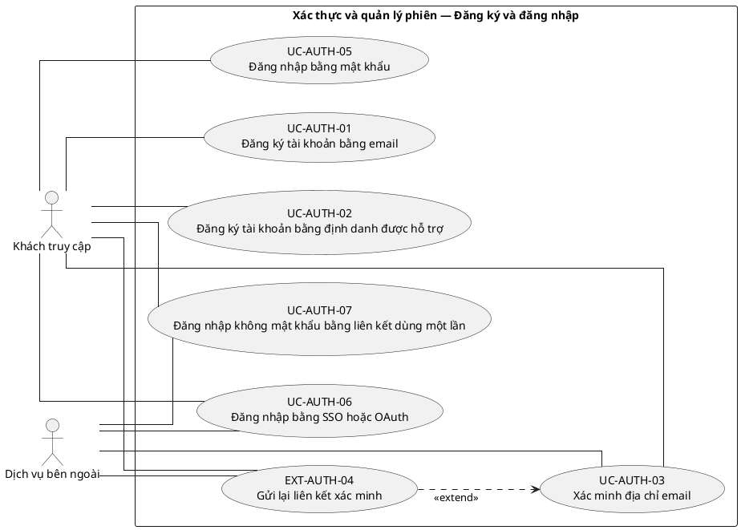
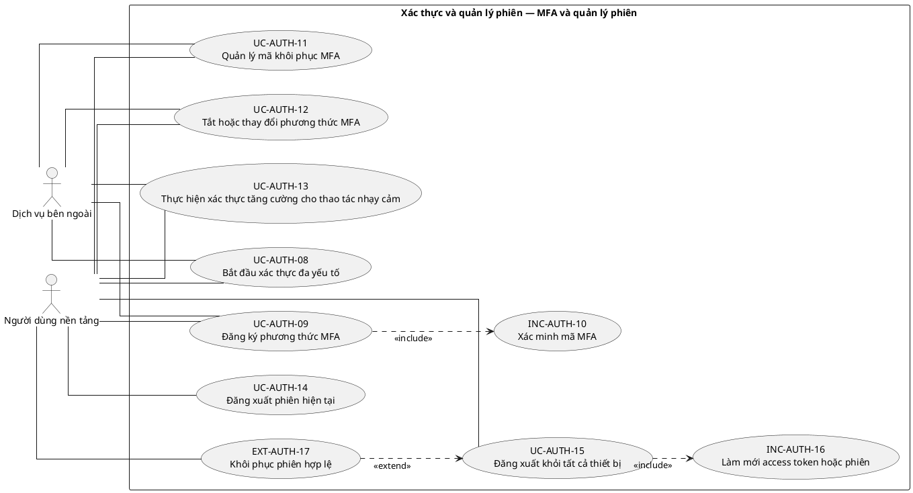
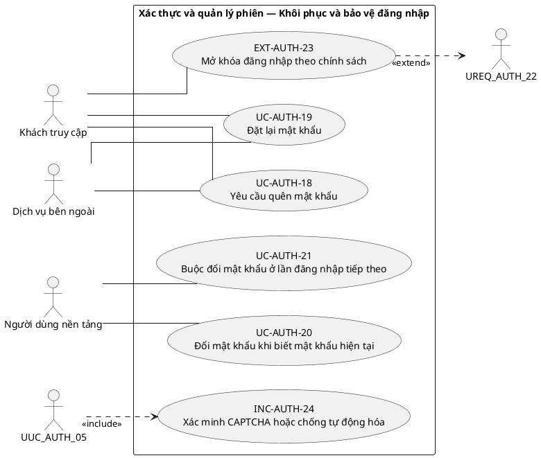
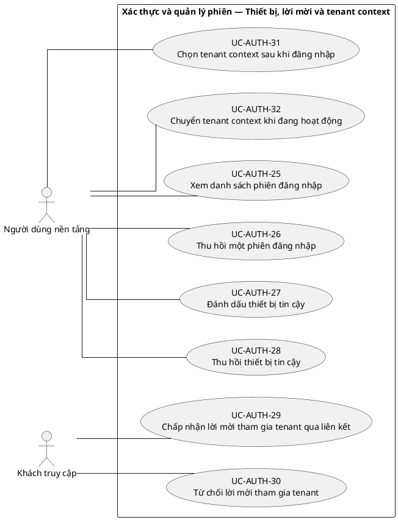

# UC-AUTH — Xác thực và quản lý phiên

## 1. Thông tin tài liệu

| Thuộc tính | Nội dung |
|---|---|
| Mã nhóm Use Case | `UC-AUTH` |
| Tên | Xác thực và quản lý phiên |
| Miền nghiệp vụ | Danh tính và truy cập |
| Mức ưu tiên phát triển | Nền tảng bắt buộc |
| Phạm vi | Toàn bộ sản phẩm Operations Hub |
| Mô hình | SaaS đa tổ chức, dữ liệu và cấu hình theo tenant |
| Trạng thái đặc tả | Baseline V3; phân biệt Use Case mục tiêu, include, extend và yêu cầu hệ thống |

> **Nguyên tắc phạm vi:** tài liệu mô tả năng lực của phiên bản sản phẩm hoàn chỉnh. Mức ưu tiên phát triển không đồng nghĩa với loại bỏ khỏi phạm vi sản phẩm.

## 2. Mục tiêu

Xác minh danh tính, quản lý vòng đời phiên và thiết lập ngữ cảnh truy cập an toàn cho người dùng trên toàn nền tảng.

## 3. Actor

| Mã actor | Actor | Phạm vi |
|---|---|---|
| `ACT-GUEST` | Khách truy cập | Cấp nền tảng |
| `ACT-PLATFORM-USER` | Người dùng nền tảng | Cấp nền tảng |
| `ACT-EXTERNAL-SERVICE` | Dịch vụ bên ngoài | Tenant hoặc tích hợp |

Actor trong sơ đồ chỉ thể hiện vai trò tương tác. Quyền thực tế phải được kiểm tra tại backend dựa trên tenant context, membership, role, permission, organization unit, trạng thái module và trạng thái tenant.

## 4. Điều kiện trước

- Người dùng có thể chưa xác thực hoặc đã có tài khoản.
- Dịch vụ xác thực ngoài chỉ được dùng khi đã cấu hình và được cho phép.

## 5. Điều kiện sau

- Phiên hợp lệ gắn với User đã xác thực.
- Phiên bị thu hồi hoặc hết hạn không còn sử dụng được.
- Sự kiện xác thực quan trọng được ghi log bảo mật.

## 6. Danh mục phần tử nghiệp vụ và phân loại UML

> **Thay đổi của V3:** Không coi toàn bộ danh mục chức năng là Use Case độc lập. Chỉ phần tử có mục tiêu quan sát được đối với actor được giữ mã `UC-*`. Hành vi bắt buộc dùng chung dùng mã `INC-*`; luồng điều kiện dùng mã `EXT-*`; quy tắc hoặc xử lý xuyên suốt dùng mã `REQ-*`. Mã V2 được giữ để truy vết.

> Actor chỉ nối trực tiếp với `UC-*` hoặc `EXT-*` mà actor thực sự khởi phát/tham gia. `INC-*` được nối bằng `<<include>>`; `REQ-*` không được vẽ như Use Case.

| Mã V3 | Mã V2 | Phần tử nghiệp vụ | Loại mô hình | Actor trực tiếp / nguồn kích hoạt | Quan hệ |
|---|---|---|---|---|---|
| `UC-AUTH-01` | `UC-AUTH-01` | Đăng ký tài khoản bằng email | Use Case mục tiêu actor | `ACT-GUEST` — Khách truy cập | Association trực tiếp với actor |
| `UC-AUTH-02` | `UC-AUTH-02` | Đăng ký tài khoản bằng định danh được hỗ trợ | Use Case mục tiêu actor | `ACT-GUEST` — Khách truy cập | Association trực tiếp với actor |
| `UC-AUTH-03` | `UC-AUTH-03` | Xác minh địa chỉ email | Use Case mục tiêu actor | `ACT-GUEST` — Khách truy cập<br>`ACT-EXTERNAL-SERVICE` — Dịch vụ bên ngoài | Association trực tiếp với actor |
| `EXT-AUTH-04` | `UC-AUTH-04` | Gửi lại liên kết xác minh | Luồng điều kiện `<<extend>>` | `ACT-GUEST` — Khách truy cập<br>`ACT-EXTERNAL-SERVICE` — Dịch vụ bên ngoài | `EXT-AUTH-04` `<<extend>>` `UC-AUTH-03` |
| `UC-AUTH-05` | `UC-AUTH-05` | Đăng nhập bằng mật khẩu | Use Case mục tiêu actor | `ACT-GUEST` — Khách truy cập | Association trực tiếp với actor |
| `UC-AUTH-06` | `UC-AUTH-06` | Đăng nhập bằng SSO hoặc OAuth | Use Case mục tiêu actor | `ACT-GUEST` — Khách truy cập<br>`ACT-EXTERNAL-SERVICE` — Dịch vụ bên ngoài | Association trực tiếp với actor |
| `UC-AUTH-07` | `UC-AUTH-07` | Đăng nhập không mật khẩu bằng liên kết dùng một lần | Use Case mục tiêu actor | `ACT-GUEST` — Khách truy cập<br>`ACT-EXTERNAL-SERVICE` — Dịch vụ bên ngoài | Association trực tiếp với actor |
| `UC-AUTH-08` | `UC-AUTH-08` | Bắt đầu xác thực đa yếu tố | Use Case mục tiêu actor | `ACT-PLATFORM-USER` — Người dùng nền tảng<br>`ACT-EXTERNAL-SERVICE` — Dịch vụ bên ngoài | Association trực tiếp với actor |
| `UC-AUTH-09` | `UC-AUTH-09` | Đăng ký phương thức MFA | Use Case mục tiêu actor | `ACT-PLATFORM-USER` — Người dùng nền tảng<br>`ACT-EXTERNAL-SERVICE` — Dịch vụ bên ngoài | Association trực tiếp với actor |
| `INC-AUTH-10` | `UC-AUTH-10` | Xác minh mã MFA | Hành vi dùng chung `<<include>>` | Hệ thống; được gọi từ Use Case cha | `UC-AUTH-09` `<<include>>` `INC-AUTH-10` |
| `UC-AUTH-11` | `UC-AUTH-11` | Quản lý mã khôi phục MFA | Use Case mục tiêu actor | `ACT-PLATFORM-USER` — Người dùng nền tảng<br>`ACT-EXTERNAL-SERVICE` — Dịch vụ bên ngoài | Association trực tiếp với actor |
| `UC-AUTH-12` | `UC-AUTH-12` | Tắt hoặc thay đổi phương thức MFA | Use Case mục tiêu actor | `ACT-PLATFORM-USER` — Người dùng nền tảng<br>`ACT-EXTERNAL-SERVICE` — Dịch vụ bên ngoài | Association trực tiếp với actor |
| `UC-AUTH-13` | `UC-AUTH-13` | Thực hiện xác thực tăng cường cho thao tác nhạy cảm | Use Case mục tiêu actor | `ACT-PLATFORM-USER` — Người dùng nền tảng<br>`ACT-EXTERNAL-SERVICE` — Dịch vụ bên ngoài | Association trực tiếp với actor |
| `UC-AUTH-14` | `UC-AUTH-14` | Đăng xuất phiên hiện tại | Use Case mục tiêu actor | `ACT-PLATFORM-USER` — Người dùng nền tảng | Association trực tiếp với actor |
| `UC-AUTH-15` | `UC-AUTH-15` | Đăng xuất khỏi tất cả thiết bị | Use Case mục tiêu actor | `ACT-PLATFORM-USER` — Người dùng nền tảng | Association trực tiếp với actor |
| `INC-AUTH-16` | `UC-AUTH-16` | Làm mới access token hoặc phiên | Hành vi dùng chung `<<include>>` | Hệ thống; được gọi từ Use Case cha | `UC-AUTH-15` `<<include>>` `INC-AUTH-16` |
| `EXT-AUTH-17` | `UC-AUTH-17` | Khôi phục phiên hợp lệ | Luồng điều kiện `<<extend>>` | `ACT-PLATFORM-USER` — Người dùng nền tảng | `EXT-AUTH-17` `<<extend>>` `UC-AUTH-15` |
| `UC-AUTH-18` | `UC-AUTH-18` | Yêu cầu quên mật khẩu | Use Case mục tiêu actor | `ACT-GUEST` — Khách truy cập<br>`ACT-EXTERNAL-SERVICE` — Dịch vụ bên ngoài | Association trực tiếp với actor |
| `UC-AUTH-19` | `UC-AUTH-19` | Đặt lại mật khẩu | Use Case mục tiêu actor | `ACT-GUEST` — Khách truy cập<br>`ACT-EXTERNAL-SERVICE` — Dịch vụ bên ngoài | Association trực tiếp với actor |
| `UC-AUTH-20` | `UC-AUTH-20` | Đổi mật khẩu khi biết mật khẩu hiện tại | Use Case mục tiêu actor | `ACT-PLATFORM-USER` — Người dùng nền tảng | Association trực tiếp với actor |
| `UC-AUTH-21` | `UC-AUTH-21` | Buộc đổi mật khẩu ở lần đăng nhập tiếp theo | Use Case mục tiêu actor | `ACT-PLATFORM-USER` — Người dùng nền tảng | Association trực tiếp với actor |
| `REQ-AUTH-22` | `UC-AUTH-22` | Khóa đăng nhập sau nhiều lần thất bại | Quy tắc/yêu cầu hệ thống | Hệ thống/chính sách; không có association actor trực tiếp | Áp dụng như quy tắc/yêu cầu xuyên suốt; không nối actor trực tiếp |
| `EXT-AUTH-23` | `UC-AUTH-23` | Mở khóa đăng nhập theo chính sách | Luồng điều kiện `<<extend>>` | `ACT-GUEST` — Khách truy cập | `EXT-AUTH-23` `<<extend>>` `REQ-AUTH-22` |
| `INC-AUTH-24` | `UC-AUTH-24` | Xác minh CAPTCHA hoặc chống tự động hóa | Hành vi dùng chung `<<include>>` | Hệ thống; được gọi từ Use Case cha | `UC-AUTH-05` `<<include>>` `INC-AUTH-24` |
| `UC-AUTH-25` | `UC-AUTH-25` | Xem danh sách phiên đăng nhập | Use Case mục tiêu actor | `ACT-PLATFORM-USER` — Người dùng nền tảng | Association trực tiếp với actor |
| `UC-AUTH-26` | `UC-AUTH-26` | Thu hồi một phiên đăng nhập | Use Case mục tiêu actor | `ACT-PLATFORM-USER` — Người dùng nền tảng | Association trực tiếp với actor |
| `UC-AUTH-27` | `UC-AUTH-27` | Đánh dấu thiết bị tin cậy | Use Case mục tiêu actor | `ACT-PLATFORM-USER` — Người dùng nền tảng | Association trực tiếp với actor |
| `UC-AUTH-28` | `UC-AUTH-28` | Thu hồi thiết bị tin cậy | Use Case mục tiêu actor | `ACT-PLATFORM-USER` — Người dùng nền tảng | Association trực tiếp với actor |
| `UC-AUTH-29` | `UC-AUTH-29` | Chấp nhận lời mời tham gia tenant qua liên kết | Use Case mục tiêu actor | `ACT-GUEST` — Khách truy cập | Association trực tiếp với actor |
| `UC-AUTH-30` | `UC-AUTH-30` | Từ chối lời mời tham gia tenant | Use Case mục tiêu actor | `ACT-GUEST` — Khách truy cập | Association trực tiếp với actor |
| `UC-AUTH-31` | `UC-AUTH-31` | Chọn tenant context sau khi đăng nhập | Use Case mục tiêu actor | `ACT-PLATFORM-USER` — Người dùng nền tảng | Association trực tiếp với actor |
| `UC-AUTH-32` | `UC-AUTH-32` | Chuyển tenant context khi đang hoạt động | Use Case mục tiêu actor | `ACT-PLATFORM-USER` — Người dùng nền tảng | Association trực tiếp với actor |
| `REQ-AUTH-33` | `UC-AUTH-33` | Xử lý phiên khi tenant hoặc membership bị khóa | Quy tắc/yêu cầu hệ thống | Hệ thống/chính sách; không có association actor trực tiếp | Áp dụng như quy tắc/yêu cầu xuyên suốt; không nối actor trực tiếp |
| `REQ-AUTH-34` | `UC-AUTH-34` | Xử lý tài khoản chưa xác minh | Quy tắc/yêu cầu hệ thống | Hệ thống/chính sách; không có association actor trực tiếp | Áp dụng như quy tắc/yêu cầu xuyên suốt; không nối actor trực tiếp |
| `REQ-AUTH-35` | `UC-AUTH-35` | Xử lý thông tin xác thực hết hạn hoặc không hợp lệ | Quy tắc/yêu cầu hệ thống | Hệ thống/chính sách; không có association actor trực tiếp | Áp dụng như quy tắc/yêu cầu xuyên suốt; không nối actor trực tiếp |
| `REQ-AUTH-36` | `UC-AUTH-36` | Ghi nhận sự kiện xác thực và cảnh báo bảo mật | Quy tắc/yêu cầu hệ thống | Hệ thống/chính sách; không có association actor trực tiếp | Áp dụng như quy tắc/yêu cầu xuyên suốt; không nối actor trực tiếp |

## 7. Luồng nghiệp vụ chính

1. Người dùng gửi thông tin xác thực.
2. Hệ thống kiểm tra định dạng, trạng thái User và chính sách bảo mật.
3. Hệ thống xác minh thông tin xác thực hoặc chuyển qua dịch vụ nhận dạng ngoài.
4. Hệ thống phát hành phiên và trả thông tin User tối thiểu.
5. Nếu User thuộc nhiều tenant, hệ thống yêu cầu chọn tenant hoặc dùng tenant mặc định hợp lệ.
6. Mọi API nghiệp vụ tiếp theo kiểm tra phiên, tenant context và quyền.

## 8. Luồng thay thế và ngoại lệ

- Thông tin sai: trả lỗi chuẩn hóa, không tiết lộ tài khoản có tồn tại hay không khi chính sách yêu cầu.
- Phiên hết hạn hoặc bị thu hồi: yêu cầu đăng nhập lại hoặc làm mới hợp lệ.
- Tenant đã chọn không có membership hoạt động: từ chối thiết lập context.
- Dịch vụ xác thực ngoài lỗi: không làm mất khả năng dùng cơ chế đăng nhập nội bộ nếu được cấu hình.

## 9. Quy tắc nghiệp vụ cốt lõi

- User đã đăng nhập không mặc nhiên có quyền trong tenant nếu chưa có membership hợp lệ.
- Mật khẩu không được lưu hoặc trả về ở dạng rõ.
- Đăng nhập thất bại liên tiếp phải chịu giới hạn tốc độ hoặc kiểm soát rủi ro.
- Tenant context do client yêu cầu phải được đối chiếu với membership của User.
- Khi User bị vô hiệu hóa ở cấp nền tảng, mọi phiên trên các tenant phải bị từ chối.

## 10. Mô hình dữ liệu logic liên quan

| Thực thể | Vai trò |
|---|---|
| `User` | Thực thể logic phục vụ UC-AUTH; thiết kế vật lý được xác định ở giai đoạn thiết kế dữ liệu. |
| `Credential` | Thực thể logic phục vụ UC-AUTH; thiết kế vật lý được xác định ở giai đoạn thiết kế dữ liệu. |
| `Session` | Thực thể logic phục vụ UC-AUTH; thiết kế vật lý được xác định ở giai đoạn thiết kế dữ liệu. |
| `RefreshToken` | Thực thể logic phục vụ UC-AUTH; thiết kế vật lý được xác định ở giai đoạn thiết kế dữ liệu. |
| `VerificationToken` | Thực thể logic phục vụ UC-AUTH; thiết kế vật lý được xác định ở giai đoạn thiết kế dữ liệu. |
| `AuthenticationEvent` | Thực thể logic phục vụ UC-AUTH; thiết kế vật lý được xác định ở giai đoạn thiết kế dữ liệu. |
| `Membership` | Thực thể logic phục vụ UC-AUTH; thiết kế vật lý được xác định ở giai đoạn thiết kế dữ liệu. |

Mọi thực thể nghiệp vụ phải xác định được tenant sở hữu, trừ thực thể được công bố rõ là dữ liệu cấp nền tảng. Quan hệ tham chiếu chéo tenant bị cấm nếu không có cơ chế liên tenant được đặc tả riêng.

## 11. Kiểm soát truy cập

Quyền hiệu lực được xác định theo công thức khái quát:

```text
Quyền hiệu lực
= Permission từ các Role đang hoạt động
∩ Tenant context hợp lệ
∩ Membership đang hoạt động
∩ Phạm vi Organization Unit
∩ Phạm vi tài nguyên
∩ Trạng thái Module
∩ Trạng thái Tenant
```

Các kiểm tra bắt buộc:

- Xác thực User trước khi truy cập chức năng không công khai.
- Đối chiếu tenant context với membership.
- Kiểm tra permission tại backend, không dựa vào trạng thái hiển thị của frontend.
- Giới hạn truy vấn, tệp, bản xuất, cache và tác vụ nền theo tenant.
- Ghi audit cho hành động quản trị hoặc thay đổi nghiệp vụ quan trọng.

## 12. Tiêu chí chấp nhận

| Mã | Tiêu chí | Phương pháp kiểm chứng |
|---|---|---|
| `AC-AUTH-01` | Đăng nhập hợp lệ tạo phiên; đăng nhập sai không tạo phiên. | Functional / Integration / Security Test tùy nội dung |
| `AC-AUTH-02` | Sau đăng xuất hoặc thu hồi, phiên không thể gọi API được bảo vệ. | Functional / Integration / Security Test tùy nội dung |
| `AC-AUTH-03` | Không có mật khẩu rõ trong database, log hoặc response. | Functional / Integration / Security Test tùy nội dung |
| `AC-AUTH-04` | Người dùng không thể tự đổi tenant context sang tổ chức không thuộc quyền truy cập. | Functional / Integration / Security Test tùy nội dung |

## 13. Quan hệ với nhóm Use Case khác

[`UC-USER`](./03_UC-USER.md), [`UC-TENANT`](./01_UC-TENANT.md), [`UC-AUDIT`](./21_UC-AUDIT.md)

## 14. Use Case Diagram theo luồng nghiệp vụ

Các package/rectangle dưới đây chỉ là **ranh giới hệ thống hoặc miền nghiệp vụ**. Không tồn tại phần tử trung gian `PKG*`; actor liên kết trực tiếp với Use Case có mục tiêu nghiệp vụ. `INC-*` và `EXT-*` chỉ xuất hiện qua quan hệ UML tương ứng; `REQ-*` được trình bày ngoài sơ đồ.

### 14.1. Quy ước đọc sơ đồ

- `Actor -- UC-*`: actor trực tiếp thực hiện hoặc tham gia mục tiêu nghiệp vụ.
- `UC-* ..> INC-* : <<include>>`: hành vi bắt buộc được dùng lại.
- `EXT-* ..> UC-* : <<extend>>`: hành vi chỉ phát sinh trong điều kiện xác định.
- `REQ-*`: quy tắc/yêu cầu hệ thống, không phải Use Case và không nối actor.

### 14.2. Đăng ký và đăng nhập



### 14.3. MFA và quản lý phiên



### 14.4. Khôi phục và bảo vệ đăng nhập



**Quy tắc/yêu cầu áp dụng cho luồng này:**
- `REQ-AUTH-22` — Khóa đăng nhập sau nhiều lần thất bại

### 14.5. Thiết bị, lời mời và tenant context



**Quy tắc/yêu cầu áp dụng cho luồng này:**
- `REQ-AUTH-33` — Xử lý phiên khi tenant hoặc membership bị khóa
- `REQ-AUTH-34` — Xử lý tài khoản chưa xác minh
- `REQ-AUTH-35` — Xử lý thông tin xác thực hết hạn hoặc không hợp lệ
- `REQ-AUTH-36` — Ghi nhận sự kiện xác thực và cảnh báo bảo mật
