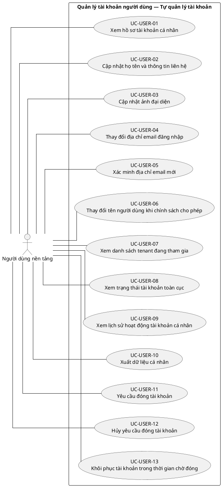
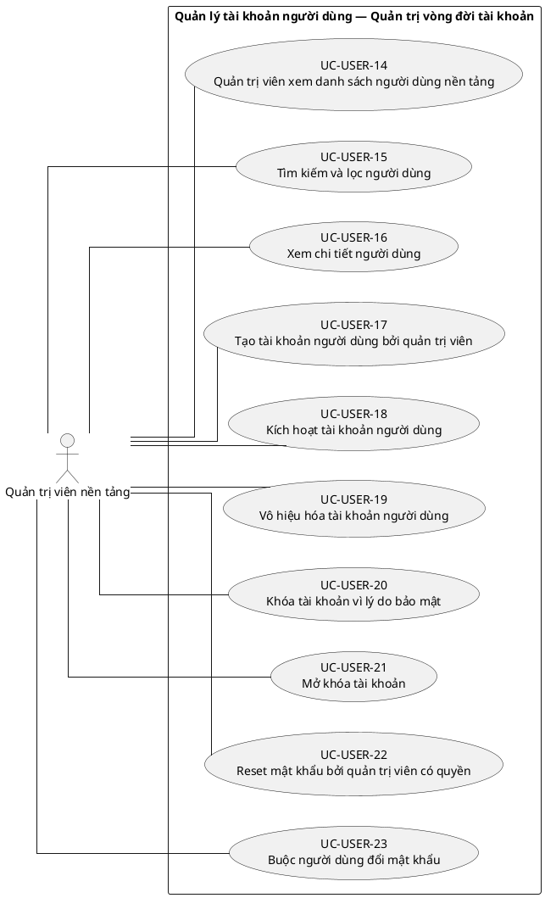
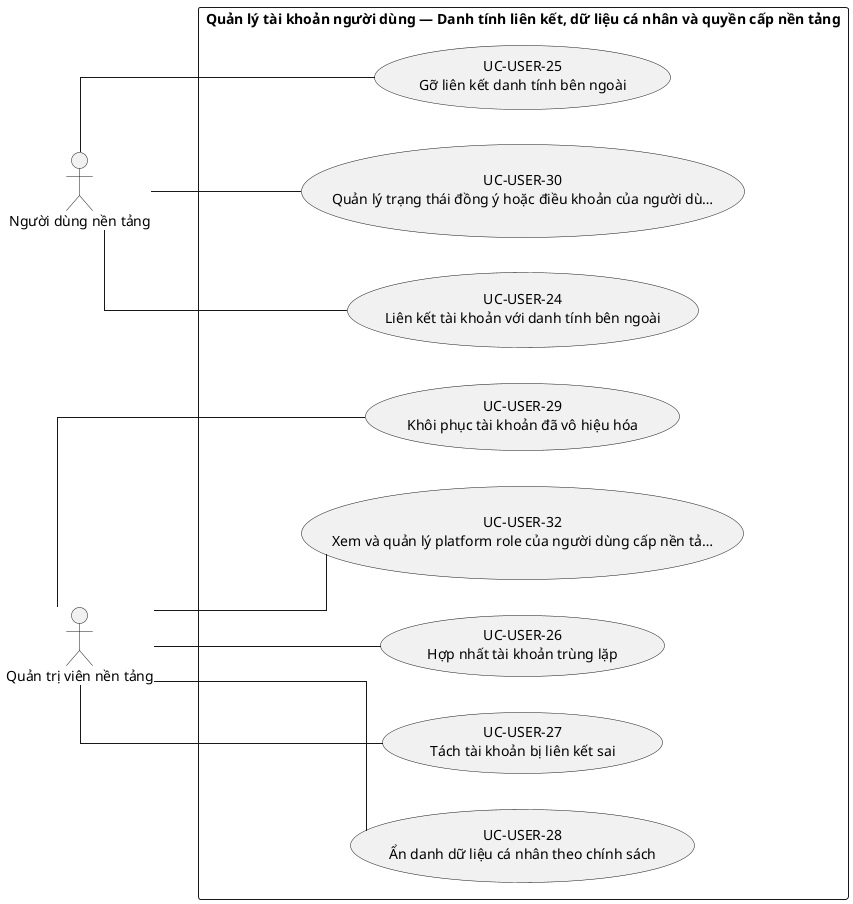

# UC-USER — Quản lý tài khoản người dùng

## 1. Thông tin tài liệu

| Thuộc tính | Nội dung |
|---|---|
| Mã nhóm Use Case | `UC-USER` |
| Tên | Quản lý tài khoản người dùng |
| Miền nghiệp vụ | Danh tính và truy cập |
| Mức ưu tiên phát triển | Nền tảng bắt buộc |
| Phạm vi | Toàn bộ sản phẩm Operations Hub |
| Mô hình | SaaS đa tổ chức, dữ liệu và cấu hình theo tenant |
| Trạng thái đặc tả | Baseline V3; phân biệt Use Case mục tiêu, include, extend và yêu cầu hệ thống |

> **Nguyên tắc phạm vi:** tài liệu mô tả năng lực của phiên bản sản phẩm hoàn chỉnh. Mức ưu tiên phát triển không đồng nghĩa với loại bỏ khỏi phạm vi sản phẩm.

## 2. Mục tiêu

Quản lý danh tính toàn cục của người dùng mà không nhầm lẫn với membership và vai trò trong từng tenant.

## 3. Actor

| Mã actor | Actor | Phạm vi |
|---|---|---|
| `ACT-PLATFORM-USER` | Người dùng nền tảng | Cấp nền tảng |
| `ACT-TENANT-ADMIN` | Quản trị viên tenant | Tenant hoặc tích hợp |
| `ACT-PLATFORM-ADMIN` | Quản trị viên nền tảng | Cấp nền tảng |

Actor trong sơ đồ chỉ thể hiện vai trò tương tác. Quyền thực tế phải được kiểm tra tại backend dựa trên tenant context, membership, role, permission, organization unit, trạng thái module và trạng thái tenant.

## 4. Điều kiện trước

- Người thao tác đã xác thực.
- Các thao tác quản trị yêu cầu permission cấp nền tảng hoặc phạm vi tenant tương ứng.

## 5. Điều kiện sau

- Thông tin User được cập nhật có kiểm soát.
- Thay đổi trạng thái User toàn cục có hiệu lực trên toàn nền tảng.
- Các thay đổi nhạy cảm được ghi audit.

## 6. Danh mục phần tử nghiệp vụ và phân loại UML

> **Thay đổi của V3:** Không coi toàn bộ danh mục chức năng là Use Case độc lập. Chỉ phần tử có mục tiêu quan sát được đối với actor được giữ mã `UC-*`. Hành vi bắt buộc dùng chung dùng mã `INC-*`; luồng điều kiện dùng mã `EXT-*`; quy tắc hoặc xử lý xuyên suốt dùng mã `REQ-*`. Mã V2 được giữ để truy vết.

> Actor chỉ nối trực tiếp với `UC-*` hoặc `EXT-*` mà actor thực sự khởi phát/tham gia. `INC-*` được nối bằng `<<include>>`; `REQ-*` không được vẽ như Use Case.

| Mã V3 | Mã V2 | Phần tử nghiệp vụ | Loại mô hình | Actor trực tiếp / nguồn kích hoạt | Quan hệ |
|---|---|---|---|---|---|
| `UC-USER-01` | `UC-USER-01` | Xem hồ sơ tài khoản cá nhân | Use Case mục tiêu actor | `ACT-PLATFORM-USER` — Người dùng nền tảng | Association trực tiếp với actor |
| `UC-USER-02` | `UC-USER-02` | Cập nhật họ tên và thông tin liên hệ | Use Case mục tiêu actor | `ACT-PLATFORM-USER` — Người dùng nền tảng | Association trực tiếp với actor |
| `UC-USER-03` | `UC-USER-03` | Cập nhật ảnh đại diện | Use Case mục tiêu actor | `ACT-PLATFORM-USER` — Người dùng nền tảng | Association trực tiếp với actor |
| `UC-USER-04` | `UC-USER-04` | Thay đổi địa chỉ email đăng nhập | Use Case mục tiêu actor | `ACT-PLATFORM-USER` — Người dùng nền tảng | Association trực tiếp với actor |
| `UC-USER-05` | `UC-USER-05` | Xác minh địa chỉ email mới | Use Case mục tiêu actor | `ACT-PLATFORM-USER` — Người dùng nền tảng | Association trực tiếp với actor |
| `UC-USER-06` | `UC-USER-06` | Thay đổi tên người dùng khi chính sách cho phép | Use Case mục tiêu actor | `ACT-PLATFORM-USER` — Người dùng nền tảng | Association trực tiếp với actor |
| `UC-USER-07` | `UC-USER-07` | Xem danh sách tenant đang tham gia | Use Case mục tiêu actor | `ACT-PLATFORM-USER` — Người dùng nền tảng | Association trực tiếp với actor |
| `UC-USER-08` | `UC-USER-08` | Xem trạng thái tài khoản toàn cục | Use Case mục tiêu actor | `ACT-PLATFORM-USER` — Người dùng nền tảng | Association trực tiếp với actor |
| `UC-USER-09` | `UC-USER-09` | Xem lịch sử hoạt động tài khoản cá nhân | Use Case mục tiêu actor | `ACT-PLATFORM-USER` — Người dùng nền tảng | Association trực tiếp với actor |
| `UC-USER-10` | `UC-USER-10` | Xuất dữ liệu cá nhân | Use Case mục tiêu actor | `ACT-PLATFORM-USER` — Người dùng nền tảng | Association trực tiếp với actor |
| `UC-USER-11` | `UC-USER-11` | Yêu cầu đóng tài khoản | Use Case mục tiêu actor | `ACT-PLATFORM-USER` — Người dùng nền tảng | Association trực tiếp với actor |
| `UC-USER-12` | `UC-USER-12` | Hủy yêu cầu đóng tài khoản | Use Case mục tiêu actor | `ACT-PLATFORM-USER` — Người dùng nền tảng | Association trực tiếp với actor |
| `UC-USER-13` | `UC-USER-13` | Khôi phục tài khoản trong thời gian chờ đóng | Use Case mục tiêu actor | `ACT-PLATFORM-USER` — Người dùng nền tảng | Association trực tiếp với actor |
| `UC-USER-14` | `UC-USER-14` | Quản trị viên xem danh sách người dùng nền tảng | Use Case mục tiêu actor | `ACT-PLATFORM-ADMIN` — Quản trị viên nền tảng | Association trực tiếp với actor |
| `UC-USER-15` | `UC-USER-15` | Tìm kiếm và lọc người dùng | Use Case mục tiêu actor | `ACT-PLATFORM-ADMIN` — Quản trị viên nền tảng | Association trực tiếp với actor |
| `UC-USER-16` | `UC-USER-16` | Xem chi tiết người dùng | Use Case mục tiêu actor | `ACT-PLATFORM-ADMIN` — Quản trị viên nền tảng | Association trực tiếp với actor |
| `UC-USER-17` | `UC-USER-17` | Tạo tài khoản người dùng bởi quản trị viên | Use Case mục tiêu actor | `ACT-PLATFORM-ADMIN` — Quản trị viên nền tảng | Association trực tiếp với actor |
| `UC-USER-18` | `UC-USER-18` | Kích hoạt tài khoản người dùng | Use Case mục tiêu actor | `ACT-PLATFORM-ADMIN` — Quản trị viên nền tảng | Association trực tiếp với actor |
| `UC-USER-19` | `UC-USER-19` | Vô hiệu hóa tài khoản người dùng | Use Case mục tiêu actor | `ACT-PLATFORM-ADMIN` — Quản trị viên nền tảng | Association trực tiếp với actor |
| `UC-USER-20` | `UC-USER-20` | Khóa tài khoản vì lý do bảo mật | Use Case mục tiêu actor | `ACT-PLATFORM-ADMIN` — Quản trị viên nền tảng | Association trực tiếp với actor |
| `UC-USER-21` | `UC-USER-21` | Mở khóa tài khoản | Use Case mục tiêu actor | `ACT-PLATFORM-ADMIN` — Quản trị viên nền tảng | Association trực tiếp với actor |
| `UC-USER-22` | `UC-USER-22` | Reset mật khẩu bởi quản trị viên có quyền | Use Case mục tiêu actor | `ACT-PLATFORM-ADMIN` — Quản trị viên nền tảng | Association trực tiếp với actor |
| `UC-USER-23` | `UC-USER-23` | Buộc người dùng đổi mật khẩu | Use Case mục tiêu actor | `ACT-PLATFORM-ADMIN` — Quản trị viên nền tảng | Association trực tiếp với actor |
| `UC-USER-24` | `UC-USER-24` | Liên kết tài khoản với danh tính bên ngoài | Use Case mục tiêu actor | `ACT-PLATFORM-USER` — Người dùng nền tảng | Association trực tiếp với actor |
| `UC-USER-25` | `UC-USER-25` | Gỡ liên kết danh tính bên ngoài | Use Case mục tiêu actor | `ACT-PLATFORM-USER` — Người dùng nền tảng | Association trực tiếp với actor |
| `UC-USER-26` | `UC-USER-26` | Hợp nhất tài khoản trùng lặp | Use Case mục tiêu actor | `ACT-PLATFORM-ADMIN` — Quản trị viên nền tảng | Association trực tiếp với actor |
| `UC-USER-27` | `UC-USER-27` | Tách tài khoản bị liên kết sai | Use Case mục tiêu actor | `ACT-PLATFORM-ADMIN` — Quản trị viên nền tảng | Association trực tiếp với actor |
| `UC-USER-28` | `UC-USER-28` | Ẩn danh dữ liệu cá nhân theo chính sách | Use Case mục tiêu actor | `ACT-PLATFORM-ADMIN` — Quản trị viên nền tảng | Association trực tiếp với actor |
| `UC-USER-29` | `UC-USER-29` | Khôi phục tài khoản đã vô hiệu hóa | Use Case mục tiêu actor | `ACT-PLATFORM-ADMIN` — Quản trị viên nền tảng | Association trực tiếp với actor |
| `UC-USER-30` | `UC-USER-30` | Quản lý trạng thái đồng ý hoặc điều khoản của người dùng | Use Case mục tiêu actor | `ACT-PLATFORM-USER` — Người dùng nền tảng | Association trực tiếp với actor |
| `REQ-USER-31` | `UC-USER-31` | Xử lý người dùng không còn membership nào | Quy tắc/yêu cầu hệ thống | Hệ thống/chính sách; không có association actor trực tiếp | Áp dụng như quy tắc/yêu cầu xuyên suốt; không nối actor trực tiếp |
| `UC-USER-32` | `UC-USER-32` | Xem và quản lý platform role của người dùng cấp nền tảng | Use Case mục tiêu actor | `ACT-PLATFORM-ADMIN` — Quản trị viên nền tảng | Association trực tiếp với actor |
| `REQ-USER-33` | `UC-USER-33` | Ghi audit thay đổi tài khoản nhạy cảm | Quy tắc/yêu cầu hệ thống | Hệ thống/chính sách; không có association actor trực tiếp | Áp dụng như quy tắc/yêu cầu xuyên suốt; không nối actor trực tiếp |

## 7. Luồng nghiệp vụ chính

1. Người dùng mở hồ sơ cá nhân.
2. Hệ thống tải dữ liệu User và phân loại trường có thể sửa.
3. Người dùng cập nhật thông tin và gửi yêu cầu.
4. Hệ thống kiểm tra định dạng, tính duy nhất và yêu cầu xác minh nếu cần.
5. Hệ thống lưu thay đổi, ghi lịch sử và cập nhật các phiên theo chính sách.

## 8. Luồng thay thế và ngoại lệ

- Email hoặc định danh trùng: từ chối cập nhật.
- Người quản trị tenant cố sửa thuộc tính cấp nền tảng ngoài phạm vi: từ chối.
- User đang là Owner cuối cùng ở tenant: quy trình đóng tài khoản yêu cầu chuyển quyền trước.

## 9. Quy tắc nghiệp vụ cốt lõi

- User là danh tính cấp nền tảng; role nội bộ không được gán trực tiếp cho User.
- Tenant Admin chỉ được xem hoặc quản lý thông tin người dùng cần thiết trong quan hệ membership của tenant mình.
- Vô hiệu hóa User toàn cục làm mất quyền sử dụng mọi membership đang có.
- Đóng User không được xóa vật lý các bản ghi nghiệp vụ cần truy vết.
- Thông tin nhạy cảm chỉ hiển thị theo nguyên tắc tối thiểu cần thiết.

## 10. Mô hình dữ liệu logic liên quan

| Thực thể | Vai trò |
|---|---|
| `User` | Thực thể logic phục vụ UC-USER; thiết kế vật lý được xác định ở giai đoạn thiết kế dữ liệu. |
| `UserProfile` | Thực thể logic phục vụ UC-USER; thiết kế vật lý được xác định ở giai đoạn thiết kế dữ liệu. |
| `UserStatusHistory` | Thực thể logic phục vụ UC-USER; thiết kế vật lý được xác định ở giai đoạn thiết kế dữ liệu. |
| `Membership` | Thực thể logic phục vụ UC-USER; thiết kế vật lý được xác định ở giai đoạn thiết kế dữ liệu. |
| `PersonalDataRequest` | Thực thể logic phục vụ UC-USER; thiết kế vật lý được xác định ở giai đoạn thiết kế dữ liệu. |
| `AuditLog` | Thực thể logic phục vụ UC-USER; thiết kế vật lý được xác định ở giai đoạn thiết kế dữ liệu. |

Mọi thực thể nghiệp vụ phải xác định được tenant sở hữu, trừ thực thể được công bố rõ là dữ liệu cấp nền tảng. Quan hệ tham chiếu chéo tenant bị cấm nếu không có cơ chế liên tenant được đặc tả riêng.

## 11. Kiểm soát truy cập

Quyền hiệu lực được xác định theo công thức khái quát:

```text
Quyền hiệu lực
= Permission từ các Role đang hoạt động
∩ Tenant context hợp lệ
∩ Membership đang hoạt động
∩ Phạm vi Organization Unit
∩ Phạm vi tài nguyên
∩ Trạng thái Module
∩ Trạng thái Tenant
```

Các kiểm tra bắt buộc:

- Xác thực User trước khi truy cập chức năng không công khai.
- Đối chiếu tenant context với membership.
- Kiểm tra permission tại backend, không dựa vào trạng thái hiển thị của frontend.
- Giới hạn truy vấn, tệp, bản xuất, cache và tác vụ nền theo tenant.
- Ghi audit cho hành động quản trị hoặc thay đổi nghiệp vụ quan trọng.

## 12. Tiêu chí chấp nhận

| Mã | Tiêu chí | Phương pháp kiểm chứng |
|---|---|---|
| `AC-USER-01` | Role của tenant không tồn tại trực tiếp trên bản ghi User. | Functional / Integration / Security Test tùy nội dung |
| `AC-USER-02` | Tenant Admin không xem được User ngoài phạm vi tenant nếu không có quyền cấp nền tảng. | Functional / Integration / Security Test tùy nội dung |
| `AC-USER-03` | Vô hiệu hóa User làm các phiên hiện tại bị từ chối. | Functional / Integration / Security Test tùy nội dung |
| `AC-USER-04` | Cập nhật thuộc tính nhạy cảm tạo bản ghi audit hoặc verification tương ứng. | Functional / Integration / Security Test tùy nội dung |

## 13. Quan hệ với nhóm Use Case khác

[`UC-AUTH`](./02_UC-AUTH.md), [`UC-TENANT`](./01_UC-TENANT.md), [`UC-MEMBER`](./09_UC-MEMBER.md), [`UC-AUDIT`](./21_UC-AUDIT.md)

## 14. Use Case Diagram theo luồng nghiệp vụ

Các package/rectangle dưới đây chỉ là **ranh giới hệ thống hoặc miền nghiệp vụ**. Không tồn tại phần tử trung gian `PKG*`; actor liên kết trực tiếp với Use Case có mục tiêu nghiệp vụ. `INC-*` và `EXT-*` chỉ xuất hiện qua quan hệ UML tương ứng; `REQ-*` được trình bày ngoài sơ đồ.

### 14.1. Quy ước đọc sơ đồ

- `Actor -- UC-*`: actor trực tiếp thực hiện hoặc tham gia mục tiêu nghiệp vụ.
- `UC-* ..> INC-* : <<include>>`: hành vi bắt buộc được dùng lại.
- `EXT-* ..> UC-* : <<extend>>`: hành vi chỉ phát sinh trong điều kiện xác định.
- `REQ-*`: quy tắc/yêu cầu hệ thống, không phải Use Case và không nối actor.

### 14.2. Tự quản lý tài khoản



### 14.3. Quản trị vòng đời tài khoản



### 14.4. Danh tính liên kết, dữ liệu cá nhân và quyền cấp nền tảng



**Quy tắc/yêu cầu áp dụng cho luồng này:**
- `REQ-USER-31` — Xử lý người dùng không còn membership nào
- `REQ-USER-33` — Ghi audit thay đổi tài khoản nhạy cảm
