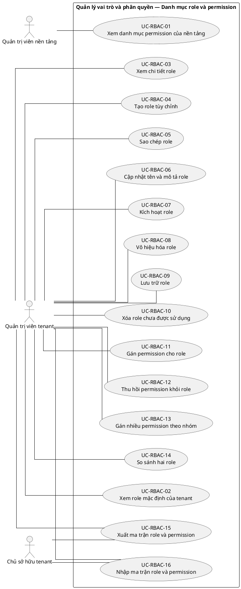
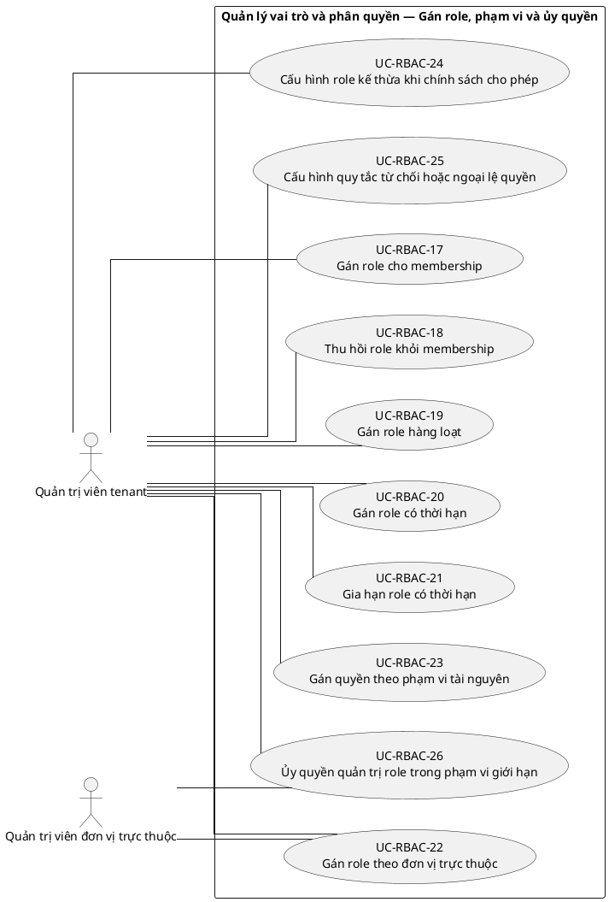
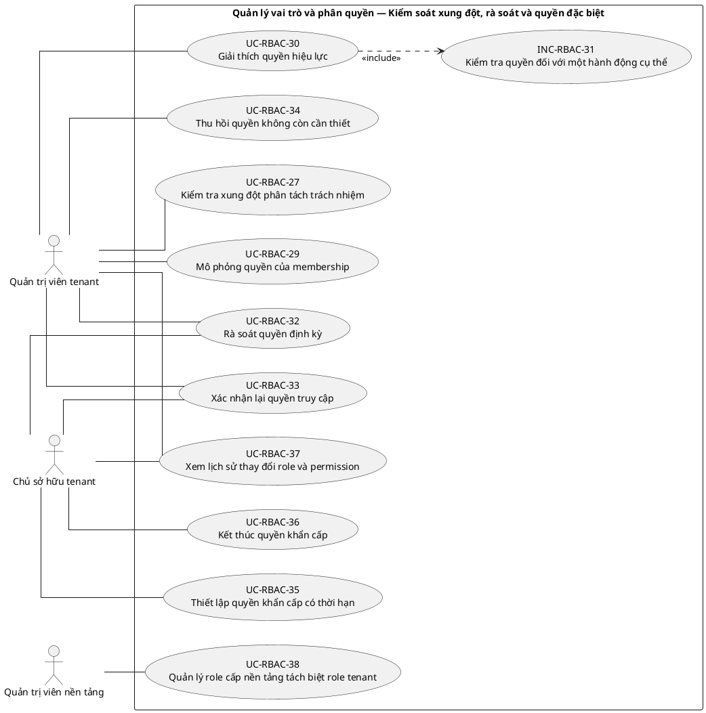

# UC-RBAC — Quản lý vai trò và phân quyền

## 1. Thông tin tài liệu

| Thuộc tính | Nội dung |
|---|---|
| Mã nhóm Use Case | `UC-RBAC` |
| Tên | Quản lý vai trò và phân quyền |
| Miền nghiệp vụ | Danh tính và truy cập |
| Mức ưu tiên phát triển | Nền tảng bắt buộc |
| Phạm vi | Toàn bộ sản phẩm Operations Hub |
| Mô hình | SaaS đa tổ chức, dữ liệu và cấu hình theo tenant |
| Trạng thái đặc tả | Baseline V3; phân biệt Use Case mục tiêu, include, extend và yêu cầu hệ thống |

> **Nguyên tắc phạm vi:** tài liệu mô tả năng lực của phiên bản sản phẩm hoàn chỉnh. Mức ưu tiên phát triển không đồng nghĩa với loại bỏ khỏi phạm vi sản phẩm.

## 2. Mục tiêu

Cấu hình role, permission và phạm vi quyền theo tenant, membership, đơn vị và tài nguyên.

## 3. Actor

| Mã actor | Actor | Phạm vi |
|---|---|---|
| `ACT-TENANT-ADMIN` | Quản trị viên tenant | Tenant hoặc tích hợp |
| `ACT-TENANT-OWNER` | Chủ sở hữu tenant | Tenant hoặc tích hợp |
| `ACT-UNIT-ADMIN` | Quản trị viên đơn vị trực thuộc | Tenant hoặc tích hợp |
| `ACT-PLATFORM-ADMIN` | Quản trị viên nền tảng | Cấp nền tảng |

Actor trong sơ đồ chỉ thể hiện vai trò tương tác. Quyền thực tế phải được kiểm tra tại backend dựa trên tenant context, membership, role, permission, organization unit, trạng thái module và trạng thái tenant.

## 4. Điều kiện trước

- Tenant đang ở trạng thái cho phép quản trị.
- Người thao tác có quyền quản trị role hoặc permission trong phạm vi được ủy quyền.

## 5. Điều kiện sau

- Quyền hiệu lực được tính từ membership và các role đang hoạt động.
- Thay đổi role/permission được ghi audit và không vượt ranh giới tenant.

## 6. Danh mục phần tử nghiệp vụ và phân loại UML

> **Thay đổi của V3:** Không coi toàn bộ danh mục chức năng là Use Case độc lập. Chỉ phần tử có mục tiêu quan sát được đối với actor được giữ mã `UC-*`. Hành vi bắt buộc dùng chung dùng mã `INC-*`; luồng điều kiện dùng mã `EXT-*`; quy tắc hoặc xử lý xuyên suốt dùng mã `REQ-*`. Mã V2 được giữ để truy vết.

> Actor chỉ nối trực tiếp với `UC-*` hoặc `EXT-*` mà actor thực sự khởi phát/tham gia. `INC-*` được nối bằng `<<include>>`; `REQ-*` không được vẽ như Use Case.

| Mã V3 | Mã V2 | Phần tử nghiệp vụ | Loại mô hình | Actor trực tiếp / nguồn kích hoạt | Quan hệ |
|---|---|---|---|---|---|
| `UC-RBAC-01` | `UC-RBAC-01` | Xem danh mục permission của nền tảng | Use Case mục tiêu actor | `ACT-PLATFORM-ADMIN` — Quản trị viên nền tảng | Association trực tiếp với actor |
| `UC-RBAC-02` | `UC-RBAC-02` | Xem role mặc định của tenant | Use Case mục tiêu actor | `ACT-TENANT-ADMIN` — Quản trị viên tenant | Association trực tiếp với actor |
| `UC-RBAC-03` | `UC-RBAC-03` | Xem chi tiết role | Use Case mục tiêu actor | `ACT-TENANT-ADMIN` — Quản trị viên tenant | Association trực tiếp với actor |
| `UC-RBAC-04` | `UC-RBAC-04` | Tạo role tùy chỉnh | Use Case mục tiêu actor | `ACT-TENANT-ADMIN` — Quản trị viên tenant | Association trực tiếp với actor |
| `UC-RBAC-05` | `UC-RBAC-05` | Sao chép role | Use Case mục tiêu actor | `ACT-TENANT-ADMIN` — Quản trị viên tenant | Association trực tiếp với actor |
| `UC-RBAC-06` | `UC-RBAC-06` | Cập nhật tên và mô tả role | Use Case mục tiêu actor | `ACT-TENANT-ADMIN` — Quản trị viên tenant | Association trực tiếp với actor |
| `UC-RBAC-07` | `UC-RBAC-07` | Kích hoạt role | Use Case mục tiêu actor | `ACT-TENANT-ADMIN` — Quản trị viên tenant | Association trực tiếp với actor |
| `UC-RBAC-08` | `UC-RBAC-08` | Vô hiệu hóa role | Use Case mục tiêu actor | `ACT-TENANT-ADMIN` — Quản trị viên tenant | Association trực tiếp với actor |
| `UC-RBAC-09` | `UC-RBAC-09` | Lưu trữ role | Use Case mục tiêu actor | `ACT-TENANT-ADMIN` — Quản trị viên tenant | Association trực tiếp với actor |
| `UC-RBAC-10` | `UC-RBAC-10` | Xóa role chưa được sử dụng | Use Case mục tiêu actor | `ACT-TENANT-ADMIN` — Quản trị viên tenant | Association trực tiếp với actor |
| `UC-RBAC-11` | `UC-RBAC-11` | Gán permission cho role | Use Case mục tiêu actor | `ACT-TENANT-ADMIN` — Quản trị viên tenant | Association trực tiếp với actor |
| `UC-RBAC-12` | `UC-RBAC-12` | Thu hồi permission khỏi role | Use Case mục tiêu actor | `ACT-TENANT-ADMIN` — Quản trị viên tenant | Association trực tiếp với actor |
| `UC-RBAC-13` | `UC-RBAC-13` | Gán nhiều permission theo nhóm | Use Case mục tiêu actor | `ACT-TENANT-ADMIN` — Quản trị viên tenant | Association trực tiếp với actor |
| `UC-RBAC-14` | `UC-RBAC-14` | So sánh hai role | Use Case mục tiêu actor | `ACT-TENANT-ADMIN` — Quản trị viên tenant | Association trực tiếp với actor |
| `UC-RBAC-15` | `UC-RBAC-15` | Xuất ma trận role và permission | Use Case mục tiêu actor | `ACT-TENANT-ADMIN` — Quản trị viên tenant<br>`ACT-TENANT-OWNER` — Chủ sở hữu tenant | Association trực tiếp với actor |
| `UC-RBAC-16` | `UC-RBAC-16` | Nhập ma trận role và permission | Use Case mục tiêu actor | `ACT-TENANT-ADMIN` — Quản trị viên tenant<br>`ACT-TENANT-OWNER` — Chủ sở hữu tenant | Association trực tiếp với actor |
| `UC-RBAC-17` | `UC-RBAC-17` | Gán role cho membership | Use Case mục tiêu actor | `ACT-TENANT-ADMIN` — Quản trị viên tenant | Association trực tiếp với actor |
| `UC-RBAC-18` | `UC-RBAC-18` | Thu hồi role khỏi membership | Use Case mục tiêu actor | `ACT-TENANT-ADMIN` — Quản trị viên tenant | Association trực tiếp với actor |
| `UC-RBAC-19` | `UC-RBAC-19` | Gán role hàng loạt | Use Case mục tiêu actor | `ACT-TENANT-ADMIN` — Quản trị viên tenant | Association trực tiếp với actor |
| `UC-RBAC-20` | `UC-RBAC-20` | Gán role có thời hạn | Use Case mục tiêu actor | `ACT-TENANT-ADMIN` — Quản trị viên tenant | Association trực tiếp với actor |
| `UC-RBAC-21` | `UC-RBAC-21` | Gia hạn role có thời hạn | Use Case mục tiêu actor | `ACT-TENANT-ADMIN` — Quản trị viên tenant | Association trực tiếp với actor |
| `UC-RBAC-22` | `UC-RBAC-22` | Gán role theo đơn vị trực thuộc | Use Case mục tiêu actor | `ACT-UNIT-ADMIN` — Quản trị viên đơn vị trực thuộc<br>`ACT-TENANT-ADMIN` — Quản trị viên tenant | Association trực tiếp với actor |
| `UC-RBAC-23` | `UC-RBAC-23` | Gán quyền theo phạm vi tài nguyên | Use Case mục tiêu actor | `ACT-TENANT-ADMIN` — Quản trị viên tenant | Association trực tiếp với actor |
| `UC-RBAC-24` | `UC-RBAC-24` | Cấu hình role kế thừa khi chính sách cho phép | Use Case mục tiêu actor | `ACT-TENANT-ADMIN` — Quản trị viên tenant | Association trực tiếp với actor |
| `UC-RBAC-25` | `UC-RBAC-25` | Cấu hình quy tắc từ chối hoặc ngoại lệ quyền | Use Case mục tiêu actor | `ACT-TENANT-ADMIN` — Quản trị viên tenant | Association trực tiếp với actor |
| `UC-RBAC-26` | `UC-RBAC-26` | Ủy quyền quản trị role trong phạm vi giới hạn | Use Case mục tiêu actor | `ACT-UNIT-ADMIN` — Quản trị viên đơn vị trực thuộc<br>`ACT-TENANT-ADMIN` — Quản trị viên tenant | Association trực tiếp với actor |
| `UC-RBAC-27` | `UC-RBAC-27` | Kiểm tra xung đột phân tách trách nhiệm | Use Case mục tiêu actor | `ACT-TENANT-ADMIN` — Quản trị viên tenant | Association trực tiếp với actor |
| `REQ-RBAC-28` | `UC-RBAC-28` | Ngăn người dùng tự nâng quyền | Quy tắc/yêu cầu hệ thống | Hệ thống/chính sách; không có association actor trực tiếp | Áp dụng như quy tắc/yêu cầu xuyên suốt; không nối actor trực tiếp |
| `UC-RBAC-29` | `UC-RBAC-29` | Mô phỏng quyền của membership | Use Case mục tiêu actor | `ACT-TENANT-ADMIN` — Quản trị viên tenant | Association trực tiếp với actor |
| `UC-RBAC-30` | `UC-RBAC-30` | Giải thích quyền hiệu lực | Use Case mục tiêu actor | `ACT-TENANT-ADMIN` — Quản trị viên tenant | Association trực tiếp với actor |
| `INC-RBAC-31` | `UC-RBAC-31` | Kiểm tra quyền đối với một hành động cụ thể | Hành vi dùng chung `<<include>>` | Hệ thống; được gọi từ Use Case cha | `UC-RBAC-30` `<<include>>` `INC-RBAC-31` |
| `UC-RBAC-32` | `UC-RBAC-32` | Rà soát quyền định kỳ | Use Case mục tiêu actor | `ACT-TENANT-ADMIN` — Quản trị viên tenant<br>`ACT-TENANT-OWNER` — Chủ sở hữu tenant | Association trực tiếp với actor |
| `UC-RBAC-33` | `UC-RBAC-33` | Xác nhận lại quyền truy cập | Use Case mục tiêu actor | `ACT-TENANT-ADMIN` — Quản trị viên tenant<br>`ACT-TENANT-OWNER` — Chủ sở hữu tenant | Association trực tiếp với actor |
| `UC-RBAC-34` | `UC-RBAC-34` | Thu hồi quyền không còn cần thiết | Use Case mục tiêu actor | `ACT-TENANT-ADMIN` — Quản trị viên tenant | Association trực tiếp với actor |
| `UC-RBAC-35` | `UC-RBAC-35` | Thiết lập quyền khẩn cấp có thời hạn | Use Case mục tiêu actor | `ACT-TENANT-OWNER` — Chủ sở hữu tenant | Association trực tiếp với actor |
| `UC-RBAC-36` | `UC-RBAC-36` | Kết thúc quyền khẩn cấp | Use Case mục tiêu actor | `ACT-TENANT-OWNER` — Chủ sở hữu tenant | Association trực tiếp với actor |
| `UC-RBAC-37` | `UC-RBAC-37` | Xem lịch sử thay đổi role và permission | Use Case mục tiêu actor | `ACT-TENANT-ADMIN` — Quản trị viên tenant<br>`ACT-TENANT-OWNER` — Chủ sở hữu tenant | Association trực tiếp với actor |
| `UC-RBAC-38` | `UC-RBAC-38` | Quản lý role cấp nền tảng tách biệt role tenant | Use Case mục tiêu actor | `ACT-PLATFORM-ADMIN` — Quản trị viên nền tảng | Association trực tiếp với actor |

## 7. Luồng nghiệp vụ chính

1. Tenant Admin tạo role tùy chỉnh.
2. Hệ thống kiểm tra mã role duy nhất trong tenant.
3. Tenant Admin chọn permission và phạm vi đơn vị/tài nguyên.
4. Hệ thống kiểm tra người thao tác có quyền ủy quyền các permission đã chọn.
5. Role được lưu và gán cho membership.
6. Khi thực hiện nghiệp vụ, hệ thống tính quyền hiệu lực theo tenant, membership, role, scope, module và trạng thái đối tượng.

## 8. Luồng thay thế và ngoại lệ

- Gán role của tenant A cho membership tenant B: từ chối.
- Thao tác làm mất Owner cuối cùng: từ chối.
- Người quản trị đơn vị gán role cấp Owner: từ chối.
- Role đang được dùng: chỉ cho vô hiệu hóa hoặc yêu cầu chuyển gán trước khi xóa.

## 9. Quy tắc nghiệp vụ cốt lõi

- Role tùy chỉnh chỉ thuộc một tenant và chỉ gán cho membership của tenant đó.
- Platform role không thay thế role nội bộ của tenant.
- Người dùng không được tự nâng quyền hoặc ủy quyền vượt quá phạm vi mình quản lý.
- Quyền xem, tạo, cập nhật, xóa, phê duyệt, xuất và quản trị là các permission độc lập.
- Ẩn nút trên frontend không thay thế kiểm tra permission tại backend.

## 10. Mô hình dữ liệu logic liên quan

| Thực thể | Vai trò |
|---|---|
| `Role` | Thực thể logic phục vụ UC-RBAC; thiết kế vật lý được xác định ở giai đoạn thiết kế dữ liệu. |
| `Permission` | Thực thể logic phục vụ UC-RBAC; thiết kế vật lý được xác định ở giai đoạn thiết kế dữ liệu. |
| `RolePermission` | Thực thể logic phục vụ UC-RBAC; thiết kế vật lý được xác định ở giai đoạn thiết kế dữ liệu. |
| `MembershipRole` | Thực thể logic phục vụ UC-RBAC; thiết kế vật lý được xác định ở giai đoạn thiết kế dữ liệu. |
| `AuthorizationScope` | Thực thể logic phục vụ UC-RBAC; thiết kế vật lý được xác định ở giai đoạn thiết kế dữ liệu. |
| `Delegation` | Thực thể logic phục vụ UC-RBAC; thiết kế vật lý được xác định ở giai đoạn thiết kế dữ liệu. |
| `AuditLog` | Thực thể logic phục vụ UC-RBAC; thiết kế vật lý được xác định ở giai đoạn thiết kế dữ liệu. |

Mọi thực thể nghiệp vụ phải xác định được tenant sở hữu, trừ thực thể được công bố rõ là dữ liệu cấp nền tảng. Quan hệ tham chiếu chéo tenant bị cấm nếu không có cơ chế liên tenant được đặc tả riêng.

## 11. Kiểm soát truy cập

Quyền hiệu lực được xác định theo công thức khái quát:

```text
Quyền hiệu lực
= Permission từ các Role đang hoạt động
∩ Tenant context hợp lệ
∩ Membership đang hoạt động
∩ Phạm vi Organization Unit
∩ Phạm vi tài nguyên
∩ Trạng thái Module
∩ Trạng thái Tenant
```

Các kiểm tra bắt buộc:

- Xác thực User trước khi truy cập chức năng không công khai.
- Đối chiếu tenant context với membership.
- Kiểm tra permission tại backend, không dựa vào trạng thái hiển thị của frontend.
- Giới hạn truy vấn, tệp, bản xuất, cache và tác vụ nền theo tenant.
- Ghi audit cho hành động quản trị hoặc thay đổi nghiệp vụ quan trọng.

## 12. Tiêu chí chấp nhận

| Mã | Tiêu chí | Phương pháp kiểm chứng |
|---|---|---|
| `AC-RBAC-01` | Không thể gán role khác tenant. | Functional / Integration / Security Test tùy nội dung |
| `AC-RBAC-02` | Gọi API trực tiếp ngoài quyền bị từ chối dù UI đã ẩn chức năng. | Functional / Integration / Security Test tùy nội dung |
| `AC-RBAC-03` | Quyền hợp nhất từ nhiều role vẫn bị giới hạn bởi tenant và scope. | Functional / Integration / Security Test tùy nội dung |
| `AC-RBAC-04` | Mọi thay đổi role/permission quan trọng có audit. | Functional / Integration / Security Test tùy nội dung |

## 13. Quan hệ với nhóm Use Case khác

[`UC-TENANT`](./01_UC-TENANT.md), [`UC-ORG`](./05_UC-ORG.md), [`UC-MEMBER`](./09_UC-MEMBER.md), [`UC-MODULE`](./07_UC-MODULE.md), [`UC-AUDIT`](./21_UC-AUDIT.md)

## 14. Use Case Diagram theo luồng nghiệp vụ

Các package/rectangle dưới đây chỉ là **ranh giới hệ thống hoặc miền nghiệp vụ**. Không tồn tại phần tử trung gian `PKG*`; actor liên kết trực tiếp với Use Case có mục tiêu nghiệp vụ. `INC-*` và `EXT-*` chỉ xuất hiện qua quan hệ UML tương ứng; `REQ-*` được trình bày ngoài sơ đồ.

### 14.1. Quy ước đọc sơ đồ

- `Actor -- UC-*`: actor trực tiếp thực hiện hoặc tham gia mục tiêu nghiệp vụ.
- `UC-* ..> INC-* : <<include>>`: hành vi bắt buộc được dùng lại.
- `EXT-* ..> UC-* : <<extend>>`: hành vi chỉ phát sinh trong điều kiện xác định.
- `REQ-*`: quy tắc/yêu cầu hệ thống, không phải Use Case và không nối actor.

### 14.2. Danh mục role và permission



### 14.3. Gán role, phạm vi và ủy quyền



### 14.4. Kiểm soát xung đột, rà soát và quyền đặc biệt



**Quy tắc/yêu cầu áp dụng cho luồng này:**
- `REQ-RBAC-28` — Ngăn người dùng tự nâng quyền
