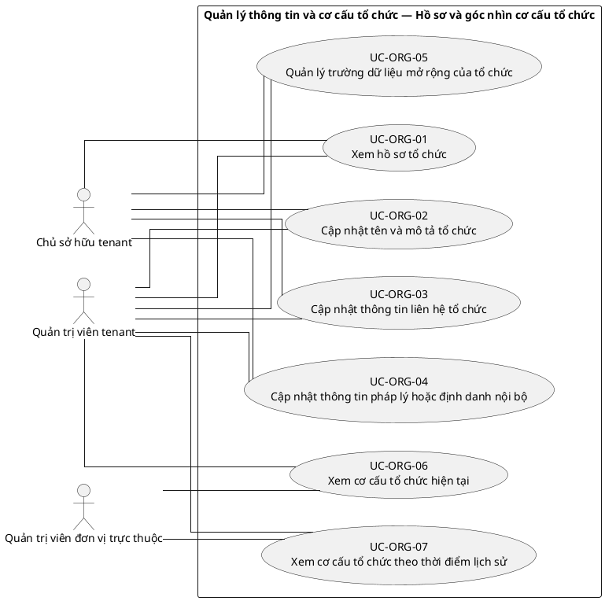
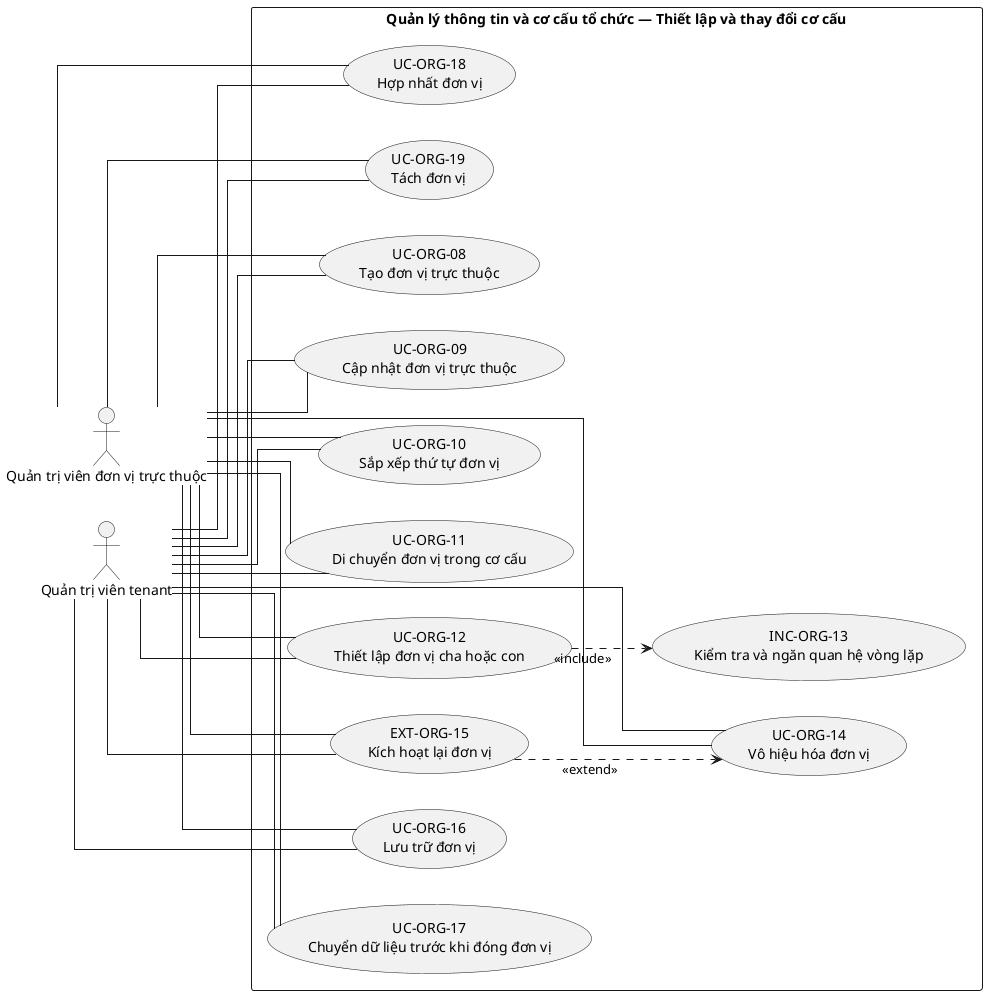
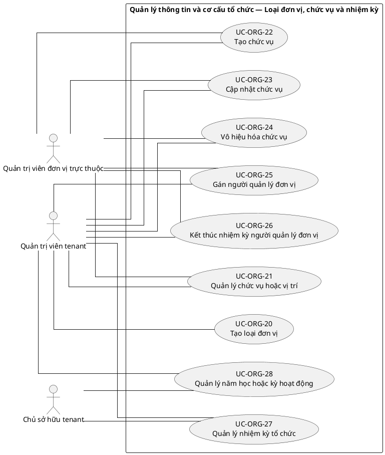
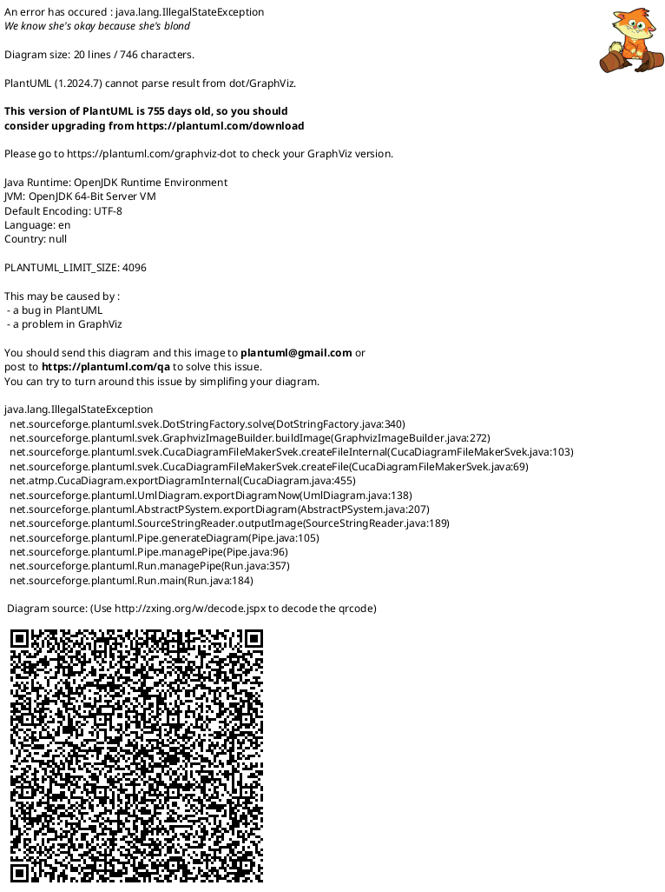

# UC-ORG — Quản lý thông tin và cơ cấu tổ chức

## 1. Thông tin tài liệu

| Thuộc tính | Nội dung |
|---|---|
| Mã nhóm Use Case | `UC-ORG` |
| Tên | Quản lý thông tin và cơ cấu tổ chức |
| Miền nghiệp vụ | Quản trị tổ chức |
| Mức ưu tiên phát triển | Nền tảng bắt buộc |
| Phạm vi | Toàn bộ sản phẩm Operations Hub |
| Mô hình | SaaS đa tổ chức, dữ liệu và cấu hình theo tenant |
| Trạng thái đặc tả | Baseline V3; phân biệt Use Case mục tiêu, include, extend và yêu cầu hệ thống |

> **Nguyên tắc phạm vi:** tài liệu mô tả năng lực của phiên bản sản phẩm hoàn chỉnh. Mức ưu tiên phát triển không đồng nghĩa với loại bỏ khỏi phạm vi sản phẩm.

## 2. Mục tiêu

Quản lý hồ sơ tổ chức, đơn vị trực thuộc, chức danh và quan hệ phân cấp trong tenant.

## 3. Actor

| Mã actor | Actor | Phạm vi |
|---|---|---|
| `ACT-TENANT-ADMIN` | Quản trị viên tenant | Tenant hoặc tích hợp |
| `ACT-TENANT-OWNER` | Chủ sở hữu tenant | Tenant hoặc tích hợp |
| `ACT-UNIT-ADMIN` | Quản trị viên đơn vị trực thuộc | Tenant hoặc tích hợp |
| `ACT-ORG-REGISTRANT` | Người đăng ký tổ chức | Cấp nền tảng |

Actor trong sơ đồ chỉ thể hiện vai trò tương tác. Quyền thực tế phải được kiểm tra tại backend dựa trên tenant context, membership, role, permission, organization unit, trạng thái module và trạng thái tenant.

## 4. Điều kiện trước

- Tenant đã được khởi tạo.
- Người thao tác có permission quản trị hồ sơ hoặc cơ cấu tổ chức.

## 5. Điều kiện sau

- Cơ cấu tổ chức hợp lệ, không vòng lặp và không chứa quan hệ chéo tenant.
- Lịch sử thay đổi cơ cấu được duy trì.

## 6. Danh mục phần tử nghiệp vụ và phân loại UML

> **Thay đổi của V3:** Không coi toàn bộ danh mục chức năng là Use Case độc lập. Chỉ phần tử có mục tiêu quan sát được đối với actor được giữ mã `UC-*`. Hành vi bắt buộc dùng chung dùng mã `INC-*`; luồng điều kiện dùng mã `EXT-*`; quy tắc hoặc xử lý xuyên suốt dùng mã `REQ-*`. Mã V2 được giữ để truy vết.

> Actor chỉ nối trực tiếp với `UC-*` hoặc `EXT-*` mà actor thực sự khởi phát/tham gia. `INC-*` được nối bằng `<<include>>`; `REQ-*` không được vẽ như Use Case.

| Mã V3 | Mã V2 | Phần tử nghiệp vụ | Loại mô hình | Actor trực tiếp / nguồn kích hoạt | Quan hệ |
|---|---|---|---|---|---|
| `UC-ORG-01` | `UC-ORG-01` | Xem hồ sơ tổ chức | Use Case mục tiêu actor | `ACT-TENANT-OWNER` — Chủ sở hữu tenant<br>`ACT-TENANT-ADMIN` — Quản trị viên tenant | Association trực tiếp với actor |
| `UC-ORG-02` | `UC-ORG-02` | Cập nhật tên và mô tả tổ chức | Use Case mục tiêu actor | `ACT-TENANT-OWNER` — Chủ sở hữu tenant<br>`ACT-TENANT-ADMIN` — Quản trị viên tenant | Association trực tiếp với actor |
| `UC-ORG-03` | `UC-ORG-03` | Cập nhật thông tin liên hệ tổ chức | Use Case mục tiêu actor | `ACT-TENANT-OWNER` — Chủ sở hữu tenant<br>`ACT-TENANT-ADMIN` — Quản trị viên tenant | Association trực tiếp với actor |
| `UC-ORG-04` | `UC-ORG-04` | Cập nhật thông tin pháp lý hoặc định danh nội bộ | Use Case mục tiêu actor | `ACT-TENANT-OWNER` — Chủ sở hữu tenant<br>`ACT-TENANT-ADMIN` — Quản trị viên tenant | Association trực tiếp với actor |
| `UC-ORG-05` | `UC-ORG-05` | Quản lý trường dữ liệu mở rộng của tổ chức | Use Case mục tiêu actor | `ACT-TENANT-OWNER` — Chủ sở hữu tenant<br>`ACT-TENANT-ADMIN` — Quản trị viên tenant | Association trực tiếp với actor |
| `UC-ORG-06` | `UC-ORG-06` | Xem cơ cấu tổ chức hiện tại | Use Case mục tiêu actor | `ACT-UNIT-ADMIN` — Quản trị viên đơn vị trực thuộc<br>`ACT-TENANT-ADMIN` — Quản trị viên tenant | Association trực tiếp với actor |
| `UC-ORG-07` | `UC-ORG-07` | Xem cơ cấu tổ chức theo thời điểm lịch sử | Use Case mục tiêu actor | `ACT-UNIT-ADMIN` — Quản trị viên đơn vị trực thuộc<br>`ACT-TENANT-ADMIN` — Quản trị viên tenant | Association trực tiếp với actor |
| `UC-ORG-08` | `UC-ORG-08` | Tạo đơn vị trực thuộc | Use Case mục tiêu actor | `ACT-UNIT-ADMIN` — Quản trị viên đơn vị trực thuộc<br>`ACT-TENANT-ADMIN` — Quản trị viên tenant | Association trực tiếp với actor |
| `UC-ORG-09` | `UC-ORG-09` | Cập nhật đơn vị trực thuộc | Use Case mục tiêu actor | `ACT-UNIT-ADMIN` — Quản trị viên đơn vị trực thuộc<br>`ACT-TENANT-ADMIN` — Quản trị viên tenant | Association trực tiếp với actor |
| `UC-ORG-10` | `UC-ORG-10` | Sắp xếp thứ tự đơn vị | Use Case mục tiêu actor | `ACT-UNIT-ADMIN` — Quản trị viên đơn vị trực thuộc<br>`ACT-TENANT-ADMIN` — Quản trị viên tenant | Association trực tiếp với actor |
| `UC-ORG-11` | `UC-ORG-11` | Di chuyển đơn vị trong cơ cấu | Use Case mục tiêu actor | `ACT-UNIT-ADMIN` — Quản trị viên đơn vị trực thuộc<br>`ACT-TENANT-ADMIN` — Quản trị viên tenant | Association trực tiếp với actor |
| `UC-ORG-12` | `UC-ORG-12` | Thiết lập đơn vị cha hoặc con | Use Case mục tiêu actor | `ACT-UNIT-ADMIN` — Quản trị viên đơn vị trực thuộc<br>`ACT-TENANT-ADMIN` — Quản trị viên tenant | Association trực tiếp với actor |
| `INC-ORG-13` | `UC-ORG-13` | Kiểm tra và ngăn quan hệ vòng lặp | Hành vi dùng chung `<<include>>` | Hệ thống; được gọi từ Use Case cha | `UC-ORG-12` `<<include>>` `INC-ORG-13` |
| `UC-ORG-14` | `UC-ORG-14` | Vô hiệu hóa đơn vị | Use Case mục tiêu actor | `ACT-UNIT-ADMIN` — Quản trị viên đơn vị trực thuộc<br>`ACT-TENANT-ADMIN` — Quản trị viên tenant | Association trực tiếp với actor |
| `EXT-ORG-15` | `UC-ORG-15` | Kích hoạt lại đơn vị | Luồng điều kiện `<<extend>>` | `ACT-UNIT-ADMIN` — Quản trị viên đơn vị trực thuộc<br>`ACT-TENANT-ADMIN` — Quản trị viên tenant | `EXT-ORG-15` `<<extend>>` `UC-ORG-14` |
| `UC-ORG-16` | `UC-ORG-16` | Lưu trữ đơn vị | Use Case mục tiêu actor | `ACT-UNIT-ADMIN` — Quản trị viên đơn vị trực thuộc<br>`ACT-TENANT-ADMIN` — Quản trị viên tenant | Association trực tiếp với actor |
| `UC-ORG-17` | `UC-ORG-17` | Chuyển dữ liệu trước khi đóng đơn vị | Use Case mục tiêu actor | `ACT-UNIT-ADMIN` — Quản trị viên đơn vị trực thuộc<br>`ACT-TENANT-ADMIN` — Quản trị viên tenant | Association trực tiếp với actor |
| `UC-ORG-18` | `UC-ORG-18` | Hợp nhất đơn vị | Use Case mục tiêu actor | `ACT-UNIT-ADMIN` — Quản trị viên đơn vị trực thuộc<br>`ACT-TENANT-ADMIN` — Quản trị viên tenant | Association trực tiếp với actor |
| `UC-ORG-19` | `UC-ORG-19` | Tách đơn vị | Use Case mục tiêu actor | `ACT-UNIT-ADMIN` — Quản trị viên đơn vị trực thuộc<br>`ACT-TENANT-ADMIN` — Quản trị viên tenant | Association trực tiếp với actor |
| `UC-ORG-20` | `UC-ORG-20` | Tạo loại đơn vị | Use Case mục tiêu actor | `ACT-TENANT-ADMIN` — Quản trị viên tenant | Association trực tiếp với actor |
| `UC-ORG-21` | `UC-ORG-21` | Quản lý chức vụ hoặc vị trí | Use Case mục tiêu actor | `ACT-UNIT-ADMIN` — Quản trị viên đơn vị trực thuộc<br>`ACT-TENANT-ADMIN` — Quản trị viên tenant | Association trực tiếp với actor |
| `UC-ORG-22` | `UC-ORG-22` | Tạo chức vụ | Use Case mục tiêu actor | `ACT-UNIT-ADMIN` — Quản trị viên đơn vị trực thuộc<br>`ACT-TENANT-ADMIN` — Quản trị viên tenant | Association trực tiếp với actor |
| `UC-ORG-23` | `UC-ORG-23` | Cập nhật chức vụ | Use Case mục tiêu actor | `ACT-UNIT-ADMIN` — Quản trị viên đơn vị trực thuộc<br>`ACT-TENANT-ADMIN` — Quản trị viên tenant | Association trực tiếp với actor |
| `UC-ORG-24` | `UC-ORG-24` | Vô hiệu hóa chức vụ | Use Case mục tiêu actor | `ACT-UNIT-ADMIN` — Quản trị viên đơn vị trực thuộc<br>`ACT-TENANT-ADMIN` — Quản trị viên tenant | Association trực tiếp với actor |
| `UC-ORG-25` | `UC-ORG-25` | Gán người quản lý đơn vị | Use Case mục tiêu actor | `ACT-UNIT-ADMIN` — Quản trị viên đơn vị trực thuộc<br>`ACT-TENANT-ADMIN` — Quản trị viên tenant | Association trực tiếp với actor |
| `UC-ORG-26` | `UC-ORG-26` | Kết thúc nhiệm kỳ người quản lý đơn vị | Use Case mục tiêu actor | `ACT-UNIT-ADMIN` — Quản trị viên đơn vị trực thuộc<br>`ACT-TENANT-ADMIN` — Quản trị viên tenant | Association trực tiếp với actor |
| `UC-ORG-27` | `UC-ORG-27` | Quản lý nhiệm kỳ tổ chức | Use Case mục tiêu actor | `ACT-TENANT-OWNER` — Chủ sở hữu tenant<br>`ACT-TENANT-ADMIN` — Quản trị viên tenant | Association trực tiếp với actor |
| `UC-ORG-28` | `UC-ORG-28` | Quản lý năm học hoặc kỳ hoạt động | Use Case mục tiêu actor | `ACT-TENANT-OWNER` — Chủ sở hữu tenant<br>`ACT-TENANT-ADMIN` — Quản trị viên tenant | Association trực tiếp với actor |
| `UC-ORG-29` | `UC-ORG-29` | Nhập cơ cấu tổ chức | Use Case mục tiêu actor | `ACT-TENANT-ADMIN` — Quản trị viên tenant | Association trực tiếp với actor |
| `UC-ORG-30` | `UC-ORG-30` | Xuất cơ cấu tổ chức | Use Case mục tiêu actor | `ACT-TENANT-ADMIN` — Quản trị viên tenant | Association trực tiếp với actor |
| `UC-ORG-31` | `UC-ORG-31` | Sao chép cấu trúc từ mẫu nền tảng | Use Case mục tiêu actor | `ACT-TENANT-ADMIN` — Quản trị viên tenant | Association trực tiếp với actor |
| `UC-ORG-32` | `UC-ORG-32` | Cấu hình quy tắc đặt mã đơn vị | Use Case mục tiêu actor | `ACT-TENANT-ADMIN` — Quản trị viên tenant | Association trực tiếp với actor |
| `UC-ORG-33` | `UC-ORG-33` | Xem lịch sử thay đổi cơ cấu | Use Case mục tiêu actor | `ACT-TENANT-ADMIN` — Quản trị viên tenant | Association trực tiếp với actor |
| `INC-ORG-34` | `UC-ORG-34` | Kiểm tra tính toàn vẹn cơ cấu tổ chức | Hành vi dùng chung `<<include>>` | Hệ thống; được gọi từ Use Case cha | `UC-ORG-33` `<<include>>` `INC-ORG-34` |

## 7. Luồng nghiệp vụ chính

1. Tenant Admin tạo đơn vị mới trong tenant.
2. Hệ thống kiểm tra mã đơn vị duy nhất theo tenant và đơn vị cha hợp lệ.
3. Hệ thống kiểm tra quan hệ không gây vòng lặp.
4. Đơn vị được lưu và xuất hiện trong cây cơ cấu.
5. Tenant Admin gán membership hoặc người phụ trách theo quyền.
6. Mọi thay đổi được ghi lịch sử và audit.

## 8. Luồng thay thế và ngoại lệ

- Đơn vị cha thuộc tenant khác: từ chối.
- Quan hệ mới tạo vòng lặp: từ chối.
- Vô hiệu hóa đơn vị còn dữ liệu hoạt động: yêu cầu chuyển hoặc kết thúc quan hệ.

## 9. Quy tắc nghiệp vụ cốt lõi

- Mỗi đơn vị thuộc duy nhất một tenant.
- Đơn vị cha và con phải thuộc cùng tenant.
- Cơ cấu không được tạo vòng lặp.
- Đơn vị có dữ liệu liên quan không được xóa vật lý trực tiếp.
- Tên ban và chức danh riêng của MTEC không được mã hóa thành bắt buộc của nền tảng.

## 10. Mô hình dữ liệu logic liên quan

| Thực thể | Vai trò |
|---|---|
| `OrganizationProfile` | Thực thể logic phục vụ UC-ORG; thiết kế vật lý được xác định ở giai đoạn thiết kế dữ liệu. |
| `OrganizationUnit` | Thực thể logic phục vụ UC-ORG; thiết kế vật lý được xác định ở giai đoạn thiết kế dữ liệu. |
| `Position` | Thực thể logic phục vụ UC-ORG; thiết kế vật lý được xác định ở giai đoạn thiết kế dữ liệu. |
| `UnitMembership` | Thực thể logic phục vụ UC-ORG; thiết kế vật lý được xác định ở giai đoạn thiết kế dữ liệu. |
| `UnitManager` | Thực thể logic phục vụ UC-ORG; thiết kế vật lý được xác định ở giai đoạn thiết kế dữ liệu. |
| `OrganizationHistory` | Thực thể logic phục vụ UC-ORG; thiết kế vật lý được xác định ở giai đoạn thiết kế dữ liệu. |
| `AuditLog` | Thực thể logic phục vụ UC-ORG; thiết kế vật lý được xác định ở giai đoạn thiết kế dữ liệu. |

Mọi thực thể nghiệp vụ phải xác định được tenant sở hữu, trừ thực thể được công bố rõ là dữ liệu cấp nền tảng. Quan hệ tham chiếu chéo tenant bị cấm nếu không có cơ chế liên tenant được đặc tả riêng.

## 11. Kiểm soát truy cập

Quyền hiệu lực được xác định theo công thức khái quát:

```text
Quyền hiệu lực
= Permission từ các Role đang hoạt động
∩ Tenant context hợp lệ
∩ Membership đang hoạt động
∩ Phạm vi Organization Unit
∩ Phạm vi tài nguyên
∩ Trạng thái Module
∩ Trạng thái Tenant
```

Các kiểm tra bắt buộc:

- Xác thực User trước khi truy cập chức năng không công khai.
- Đối chiếu tenant context với membership.
- Kiểm tra permission tại backend, không dựa vào trạng thái hiển thị của frontend.
- Giới hạn truy vấn, tệp, bản xuất, cache và tác vụ nền theo tenant.
- Ghi audit cho hành động quản trị hoặc thay đổi nghiệp vụ quan trọng.

## 12. Tiêu chí chấp nhận

| Mã | Tiêu chí | Phương pháp kiểm chứng |
|---|---|---|
| `AC-ORG-01` | Không tạo được vòng lặp trong cây tổ chức. | Functional / Integration / Security Test tùy nội dung |
| `AC-ORG-02` | Không thể liên kết đơn vị hoặc membership khác tenant. | Functional / Integration / Security Test tùy nội dung |
| `AC-ORG-03` | Vô hiệu hóa đơn vị không làm mất lịch sử nghiệp vụ. | Functional / Integration / Security Test tùy nội dung |
| `AC-ORG-04` | Tenant mới có thể cấu hình cơ cấu mà không phụ thuộc tên gọi của MTEC. | Functional / Integration / Security Test tùy nội dung |

## 13. Quan hệ với nhóm Use Case khác

[`UC-TENANT`](./01_UC-TENANT.md), [`UC-MEMBER`](./09_UC-MEMBER.md), [`UC-RBAC`](./04_UC-RBAC.md), [`UC-AUDIT`](./21_UC-AUDIT.md)

## 14. Use Case Diagram theo luồng nghiệp vụ

Các package/rectangle dưới đây chỉ là **ranh giới hệ thống hoặc miền nghiệp vụ**. Không tồn tại phần tử trung gian `PKG*`; actor liên kết trực tiếp với Use Case có mục tiêu nghiệp vụ. `INC-*` và `EXT-*` chỉ xuất hiện qua quan hệ UML tương ứng; `REQ-*` được trình bày ngoài sơ đồ.

### 14.1. Quy ước đọc sơ đồ

- `Actor -- UC-*`: actor trực tiếp thực hiện hoặc tham gia mục tiêu nghiệp vụ.
- `UC-* ..> INC-* : <<include>>`: hành vi bắt buộc được dùng lại.
- `EXT-* ..> UC-* : <<extend>>`: hành vi chỉ phát sinh trong điều kiện xác định.
- `REQ-*`: quy tắc/yêu cầu hệ thống, không phải Use Case và không nối actor.

### 14.2. Hồ sơ và góc nhìn cơ cấu tổ chức



### 14.3. Thiết lập và thay đổi cơ cấu



### 14.4. Loại đơn vị, chức vụ và nhiệm kỳ



### 14.5. Nhập xuất, mẫu và kiểm tra toàn vẹn


