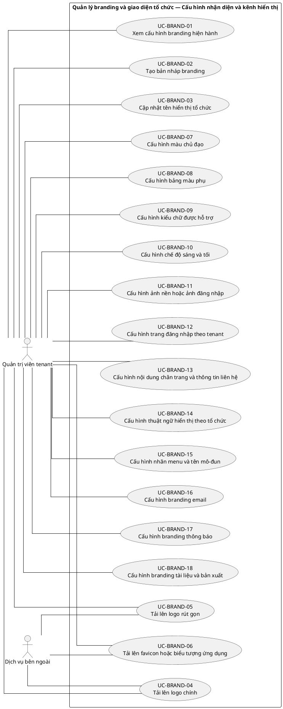
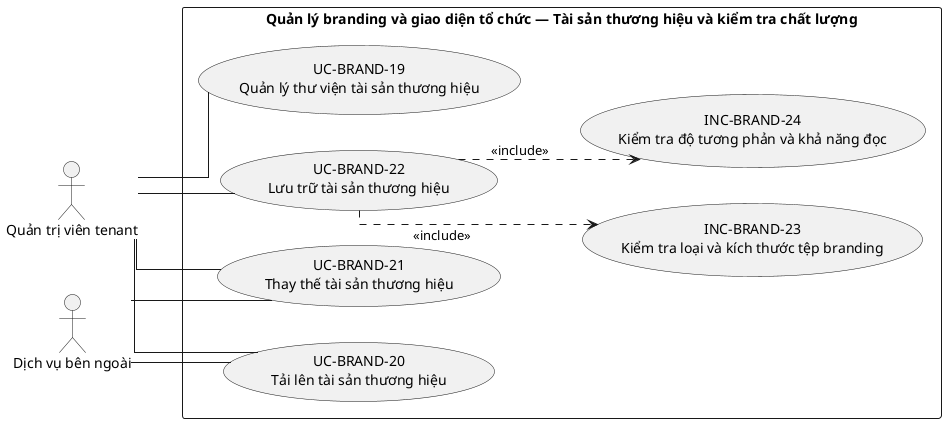
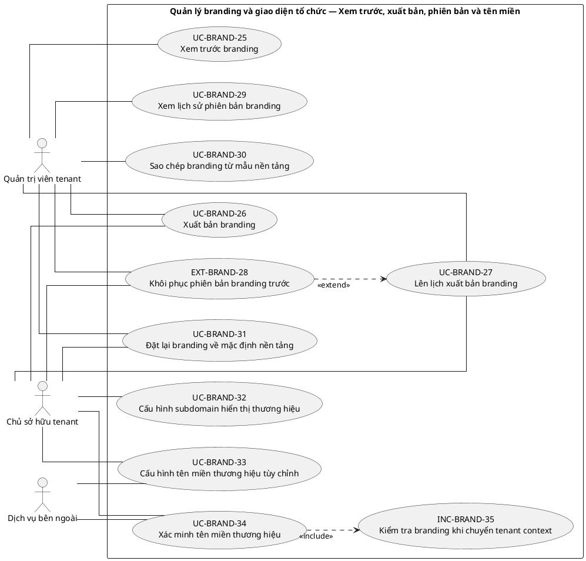

# UC-BRAND — Quản lý branding và giao diện tổ chức

## 1. Thông tin tài liệu

| Thuộc tính | Nội dung |
|---|---|
| Mã nhóm Use Case | `UC-BRAND` |
| Tên | Quản lý branding và giao diện tổ chức |
| Miền nghiệp vụ | Quản trị tổ chức |
| Mức ưu tiên phát triển | Nền tảng bắt buộc |
| Phạm vi | Toàn bộ sản phẩm Operations Hub |
| Mô hình | SaaS đa tổ chức, dữ liệu và cấu hình theo tenant |
| Trạng thái đặc tả | Baseline V3; phân biệt Use Case mục tiêu, include, extend và yêu cầu hệ thống |

> **Nguyên tắc phạm vi:** tài liệu mô tả năng lực của phiên bản sản phẩm hoàn chỉnh. Mức ưu tiên phát triển không đồng nghĩa với loại bỏ khỏi phạm vi sản phẩm.

## 2. Mục tiêu

Cho phép mỗi tenant cấu hình nhận diện riêng mà không làm thay đổi quyền, logic nghiệp vụ hoặc khả năng sử dụng của nền tảng.

## 3. Actor

| Mã actor | Actor | Phạm vi |
|---|---|---|
| `ACT-TENANT-ADMIN` | Quản trị viên tenant | Tenant hoặc tích hợp |
| `ACT-TENANT-OWNER` | Chủ sở hữu tenant | Tenant hoặc tích hợp |
| `ACT-EXTERNAL-SERVICE` | Dịch vụ bên ngoài | Tenant hoặc tích hợp |

Actor trong sơ đồ chỉ thể hiện vai trò tương tác. Quyền thực tế phải được kiểm tra tại backend dựa trên tenant context, membership, role, permission, organization unit, trạng thái module và trạng thái tenant.

## 4. Điều kiện trước

- Tenant hợp lệ và đang cho phép quản trị.
- Người thao tác có permission quản lý branding.

## 5. Điều kiện sau

- Branding được áp dụng đúng tenant context.
- Tệp branding hợp lệ được lưu trữ và có thể truy vết phiên bản.

## 6. Danh mục phần tử nghiệp vụ và phân loại UML

> **Thay đổi của V3:** Không coi toàn bộ danh mục chức năng là Use Case độc lập. Chỉ phần tử có mục tiêu quan sát được đối với actor được giữ mã `UC-*`. Hành vi bắt buộc dùng chung dùng mã `INC-*`; luồng điều kiện dùng mã `EXT-*`; quy tắc hoặc xử lý xuyên suốt dùng mã `REQ-*`. Mã V2 được giữ để truy vết.

> Actor chỉ nối trực tiếp với `UC-*` hoặc `EXT-*` mà actor thực sự khởi phát/tham gia. `INC-*` được nối bằng `<<include>>`; `REQ-*` không được vẽ như Use Case.

| Mã V3 | Mã V2 | Phần tử nghiệp vụ | Loại mô hình | Actor trực tiếp / nguồn kích hoạt | Quan hệ |
|---|---|---|---|---|---|
| `UC-BRAND-01` | `UC-BRAND-01` | Xem cấu hình branding hiện hành | Use Case mục tiêu actor | `ACT-TENANT-ADMIN` — Quản trị viên tenant | Association trực tiếp với actor |
| `UC-BRAND-02` | `UC-BRAND-02` | Tạo bản nháp branding | Use Case mục tiêu actor | `ACT-TENANT-ADMIN` — Quản trị viên tenant | Association trực tiếp với actor |
| `UC-BRAND-03` | `UC-BRAND-03` | Cập nhật tên hiển thị tổ chức | Use Case mục tiêu actor | `ACT-TENANT-ADMIN` — Quản trị viên tenant | Association trực tiếp với actor |
| `UC-BRAND-04` | `UC-BRAND-04` | Tải lên logo chính | Use Case mục tiêu actor | `ACT-TENANT-ADMIN` — Quản trị viên tenant<br>`ACT-EXTERNAL-SERVICE` — Dịch vụ bên ngoài | Association trực tiếp với actor |
| `UC-BRAND-05` | `UC-BRAND-05` | Tải lên logo rút gọn | Use Case mục tiêu actor | `ACT-TENANT-ADMIN` — Quản trị viên tenant<br>`ACT-EXTERNAL-SERVICE` — Dịch vụ bên ngoài | Association trực tiếp với actor |
| `UC-BRAND-06` | `UC-BRAND-06` | Tải lên favicon hoặc biểu tượng ứng dụng | Use Case mục tiêu actor | `ACT-TENANT-ADMIN` — Quản trị viên tenant<br>`ACT-EXTERNAL-SERVICE` — Dịch vụ bên ngoài | Association trực tiếp với actor |
| `UC-BRAND-07` | `UC-BRAND-07` | Cấu hình màu chủ đạo | Use Case mục tiêu actor | `ACT-TENANT-ADMIN` — Quản trị viên tenant | Association trực tiếp với actor |
| `UC-BRAND-08` | `UC-BRAND-08` | Cấu hình bảng màu phụ | Use Case mục tiêu actor | `ACT-TENANT-ADMIN` — Quản trị viên tenant | Association trực tiếp với actor |
| `UC-BRAND-09` | `UC-BRAND-09` | Cấu hình kiểu chữ được hỗ trợ | Use Case mục tiêu actor | `ACT-TENANT-ADMIN` — Quản trị viên tenant | Association trực tiếp với actor |
| `UC-BRAND-10` | `UC-BRAND-10` | Cấu hình chế độ sáng và tối | Use Case mục tiêu actor | `ACT-TENANT-ADMIN` — Quản trị viên tenant | Association trực tiếp với actor |
| `UC-BRAND-11` | `UC-BRAND-11` | Cấu hình ảnh nền hoặc ảnh đăng nhập | Use Case mục tiêu actor | `ACT-TENANT-ADMIN` — Quản trị viên tenant | Association trực tiếp với actor |
| `UC-BRAND-12` | `UC-BRAND-12` | Cấu hình trang đăng nhập theo tenant | Use Case mục tiêu actor | `ACT-TENANT-ADMIN` — Quản trị viên tenant | Association trực tiếp với actor |
| `UC-BRAND-13` | `UC-BRAND-13` | Cấu hình nội dung chân trang và thông tin liên hệ | Use Case mục tiêu actor | `ACT-TENANT-ADMIN` — Quản trị viên tenant | Association trực tiếp với actor |
| `UC-BRAND-14` | `UC-BRAND-14` | Cấu hình thuật ngữ hiển thị theo tổ chức | Use Case mục tiêu actor | `ACT-TENANT-ADMIN` — Quản trị viên tenant | Association trực tiếp với actor |
| `UC-BRAND-15` | `UC-BRAND-15` | Cấu hình nhãn menu và tên mô-đun | Use Case mục tiêu actor | `ACT-TENANT-ADMIN` — Quản trị viên tenant | Association trực tiếp với actor |
| `UC-BRAND-16` | `UC-BRAND-16` | Cấu hình branding email | Use Case mục tiêu actor | `ACT-TENANT-ADMIN` — Quản trị viên tenant | Association trực tiếp với actor |
| `UC-BRAND-17` | `UC-BRAND-17` | Cấu hình branding thông báo | Use Case mục tiêu actor | `ACT-TENANT-ADMIN` — Quản trị viên tenant | Association trực tiếp với actor |
| `UC-BRAND-18` | `UC-BRAND-18` | Cấu hình branding tài liệu và bản xuất | Use Case mục tiêu actor | `ACT-TENANT-ADMIN` — Quản trị viên tenant | Association trực tiếp với actor |
| `UC-BRAND-19` | `UC-BRAND-19` | Quản lý thư viện tài sản thương hiệu | Use Case mục tiêu actor | `ACT-TENANT-ADMIN` — Quản trị viên tenant | Association trực tiếp với actor |
| `UC-BRAND-20` | `UC-BRAND-20` | Tải lên tài sản thương hiệu | Use Case mục tiêu actor | `ACT-TENANT-ADMIN` — Quản trị viên tenant<br>`ACT-EXTERNAL-SERVICE` — Dịch vụ bên ngoài | Association trực tiếp với actor |
| `UC-BRAND-21` | `UC-BRAND-21` | Thay thế tài sản thương hiệu | Use Case mục tiêu actor | `ACT-TENANT-ADMIN` — Quản trị viên tenant<br>`ACT-EXTERNAL-SERVICE` — Dịch vụ bên ngoài | Association trực tiếp với actor |
| `UC-BRAND-22` | `UC-BRAND-22` | Lưu trữ tài sản thương hiệu | Use Case mục tiêu actor | `ACT-TENANT-ADMIN` — Quản trị viên tenant | Association trực tiếp với actor |
| `INC-BRAND-23` | `UC-BRAND-23` | Kiểm tra loại và kích thước tệp branding | Hành vi dùng chung `<<include>>` | Hệ thống; được gọi từ Use Case cha | `UC-BRAND-22` `<<include>>` `INC-BRAND-23` |
| `INC-BRAND-24` | `UC-BRAND-24` | Kiểm tra độ tương phản và khả năng đọc | Hành vi dùng chung `<<include>>` | Hệ thống; được gọi từ Use Case cha | `UC-BRAND-22` `<<include>>` `INC-BRAND-24` |
| `UC-BRAND-25` | `UC-BRAND-25` | Xem trước branding | Use Case mục tiêu actor | `ACT-TENANT-ADMIN` — Quản trị viên tenant | Association trực tiếp với actor |
| `UC-BRAND-26` | `UC-BRAND-26` | Xuất bản branding | Use Case mục tiêu actor | `ACT-TENANT-ADMIN` — Quản trị viên tenant<br>`ACT-TENANT-OWNER` — Chủ sở hữu tenant | Association trực tiếp với actor |
| `UC-BRAND-27` | `UC-BRAND-27` | Lên lịch xuất bản branding | Use Case mục tiêu actor | `ACT-TENANT-ADMIN` — Quản trị viên tenant<br>`ACT-TENANT-OWNER` — Chủ sở hữu tenant | Association trực tiếp với actor |
| `EXT-BRAND-28` | `UC-BRAND-28` | Khôi phục phiên bản branding trước | Luồng điều kiện `<<extend>>` | `ACT-TENANT-ADMIN` — Quản trị viên tenant<br>`ACT-TENANT-OWNER` — Chủ sở hữu tenant | `EXT-BRAND-28` `<<extend>>` `UC-BRAND-27` |
| `UC-BRAND-29` | `UC-BRAND-29` | Xem lịch sử phiên bản branding | Use Case mục tiêu actor | `ACT-TENANT-ADMIN` — Quản trị viên tenant | Association trực tiếp với actor |
| `UC-BRAND-30` | `UC-BRAND-30` | Sao chép branding từ mẫu nền tảng | Use Case mục tiêu actor | `ACT-TENANT-ADMIN` — Quản trị viên tenant | Association trực tiếp với actor |
| `UC-BRAND-31` | `UC-BRAND-31` | Đặt lại branding về mặc định nền tảng | Use Case mục tiêu actor | `ACT-TENANT-ADMIN` — Quản trị viên tenant<br>`ACT-TENANT-OWNER` — Chủ sở hữu tenant | Association trực tiếp với actor |
| `UC-BRAND-32` | `UC-BRAND-32` | Cấu hình subdomain hiển thị thương hiệu | Use Case mục tiêu actor | `ACT-TENANT-OWNER` — Chủ sở hữu tenant | Association trực tiếp với actor |
| `UC-BRAND-33` | `UC-BRAND-33` | Cấu hình tên miền thương hiệu tùy chỉnh | Use Case mục tiêu actor | `ACT-TENANT-OWNER` — Chủ sở hữu tenant<br>`ACT-EXTERNAL-SERVICE` — Dịch vụ bên ngoài | Association trực tiếp với actor |
| `UC-BRAND-34` | `UC-BRAND-34` | Xác minh tên miền thương hiệu | Use Case mục tiêu actor | `ACT-TENANT-OWNER` — Chủ sở hữu tenant<br>`ACT-EXTERNAL-SERVICE` — Dịch vụ bên ngoài | Association trực tiếp với actor |
| `INC-BRAND-35` | `UC-BRAND-35` | Kiểm tra branding khi chuyển tenant context | Hành vi dùng chung `<<include>>` | Hệ thống; được gọi từ Use Case cha | `UC-BRAND-34` `<<include>>` `INC-BRAND-35` |

## 7. Luồng nghiệp vụ chính

1. Tenant Admin mở trang branding và tải cấu hình đang hiệu lực.
2. Người dùng chỉnh tên hiển thị, màu và tài sản hình ảnh.
3. Hệ thống kiểm tra định dạng, kích thước, tương phản và phạm vi giá trị.
4. Hệ thống tạo phiên bản nháp và cho phép xem trước.
5. Tenant Admin công bố phiên bản.
6. Các phiên giao diện tải branding theo tenant context; cache được làm mới có kiểm soát.

## 8. Luồng thay thế và ngoại lệ

- Tệp không hợp lệ hoặc có khả năng thực thi mã: từ chối.
- Màu không đạt ngưỡng khả năng đọc: cảnh báo hoặc từ chối theo chính sách.
- Tenant khác yêu cầu asset bằng định danh đoán được: từ chối.

## 9. Quy tắc nghiệp vụ cốt lõi

- Branding chỉ có hiệu lực trong tenant sở hữu cấu hình.
- Tenant chưa cấu hình riêng phải dùng mặc định nền tảng.
- Branding không được thay đổi permission, trạng thái hoặc logic nghiệp vụ.
- Màu và hình ảnh không được che khuất cảnh báo bắt buộc hoặc làm nội dung mất khả năng đọc.
- Tệp tải lên phải kiểm tra loại, kích thước và nội dung nguy hiểm.

## 10. Mô hình dữ liệu logic liên quan

| Thực thể | Vai trò |
|---|---|
| `BrandingConfiguration` | Thực thể logic phục vụ UC-BRAND; thiết kế vật lý được xác định ở giai đoạn thiết kế dữ liệu. |
| `BrandingVersion` | Thực thể logic phục vụ UC-BRAND; thiết kế vật lý được xác định ở giai đoạn thiết kế dữ liệu. |
| `BrandingAsset` | Thực thể logic phục vụ UC-BRAND; thiết kế vật lý được xác định ở giai đoạn thiết kế dữ liệu. |
| `ThemeToken` | Thực thể logic phục vụ UC-BRAND; thiết kế vật lý được xác định ở giai đoạn thiết kế dữ liệu. |
| `TenantConfiguration` | Thực thể logic phục vụ UC-BRAND; thiết kế vật lý được xác định ở giai đoạn thiết kế dữ liệu. |
| `AuditLog` | Thực thể logic phục vụ UC-BRAND; thiết kế vật lý được xác định ở giai đoạn thiết kế dữ liệu. |

Mọi thực thể nghiệp vụ phải xác định được tenant sở hữu, trừ thực thể được công bố rõ là dữ liệu cấp nền tảng. Quan hệ tham chiếu chéo tenant bị cấm nếu không có cơ chế liên tenant được đặc tả riêng.

## 11. Kiểm soát truy cập

Quyền hiệu lực được xác định theo công thức khái quát:

```text
Quyền hiệu lực
= Permission từ các Role đang hoạt động
∩ Tenant context hợp lệ
∩ Membership đang hoạt động
∩ Phạm vi Organization Unit
∩ Phạm vi tài nguyên
∩ Trạng thái Module
∩ Trạng thái Tenant
```

Các kiểm tra bắt buộc:

- Xác thực User trước khi truy cập chức năng không công khai.
- Đối chiếu tenant context với membership.
- Kiểm tra permission tại backend, không dựa vào trạng thái hiển thị của frontend.
- Giới hạn truy vấn, tệp, bản xuất, cache và tác vụ nền theo tenant.
- Ghi audit cho hành động quản trị hoặc thay đổi nghiệp vụ quan trọng.

## 12. Tiêu chí chấp nhận

| Mã | Tiêu chí | Phương pháp kiểm chứng |
|---|---|---|
| `AC-BRAND-01` | Chuyển tenant làm logo, màu và tên hiển thị thay đổi đúng. | Functional / Integration / Security Test tùy nội dung |
| `AC-BRAND-02` | Tenant chưa branding vẫn có giao diện sử dụng được. | Functional / Integration / Security Test tùy nội dung |
| `AC-BRAND-03` | Không thể truy cập asset riêng của tenant khác. | Functional / Integration / Security Test tùy nội dung |
| `AC-BRAND-04` | Thay branding không tạo thêm quyền nghiệp vụ. | Functional / Integration / Security Test tùy nội dung |

## 13. Quan hệ với nhóm Use Case khác

[`UC-TENANT`](./01_UC-TENANT.md), [`UC-AUDIT`](./21_UC-AUDIT.md), [`UC-SETTING`](./08_UC-SETTING.md)

## 14. Use Case Diagram theo luồng nghiệp vụ

Các package/rectangle dưới đây chỉ là **ranh giới hệ thống hoặc miền nghiệp vụ**. Không tồn tại phần tử trung gian `PKG*`; actor liên kết trực tiếp với Use Case có mục tiêu nghiệp vụ. `INC-*` và `EXT-*` chỉ xuất hiện qua quan hệ UML tương ứng; `REQ-*` được trình bày ngoài sơ đồ.

### 14.1. Quy ước đọc sơ đồ

- `Actor -- UC-*`: actor trực tiếp thực hiện hoặc tham gia mục tiêu nghiệp vụ.
- `UC-* ..> INC-* : <<include>>`: hành vi bắt buộc được dùng lại.
- `EXT-* ..> UC-* : <<extend>>`: hành vi chỉ phát sinh trong điều kiện xác định.
- `REQ-*`: quy tắc/yêu cầu hệ thống, không phải Use Case và không nối actor.

### 14.2. Cấu hình nhận diện và kênh hiển thị



### 14.3. Tài sản thương hiệu và kiểm tra chất lượng



### 14.4. Xem trước, xuất bản, phiên bản và tên miền


