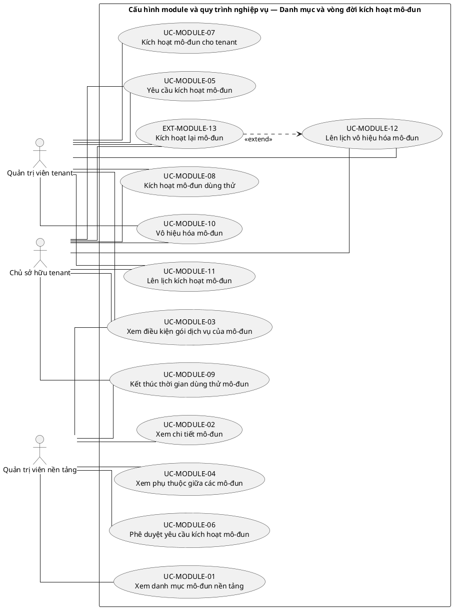
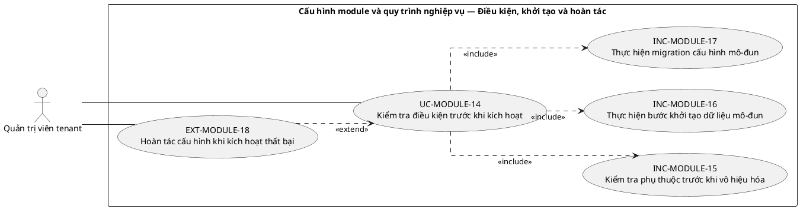
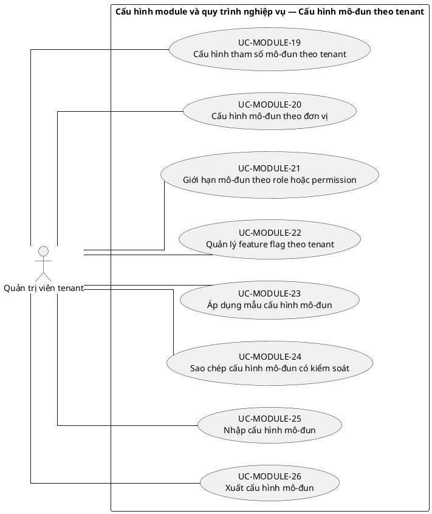
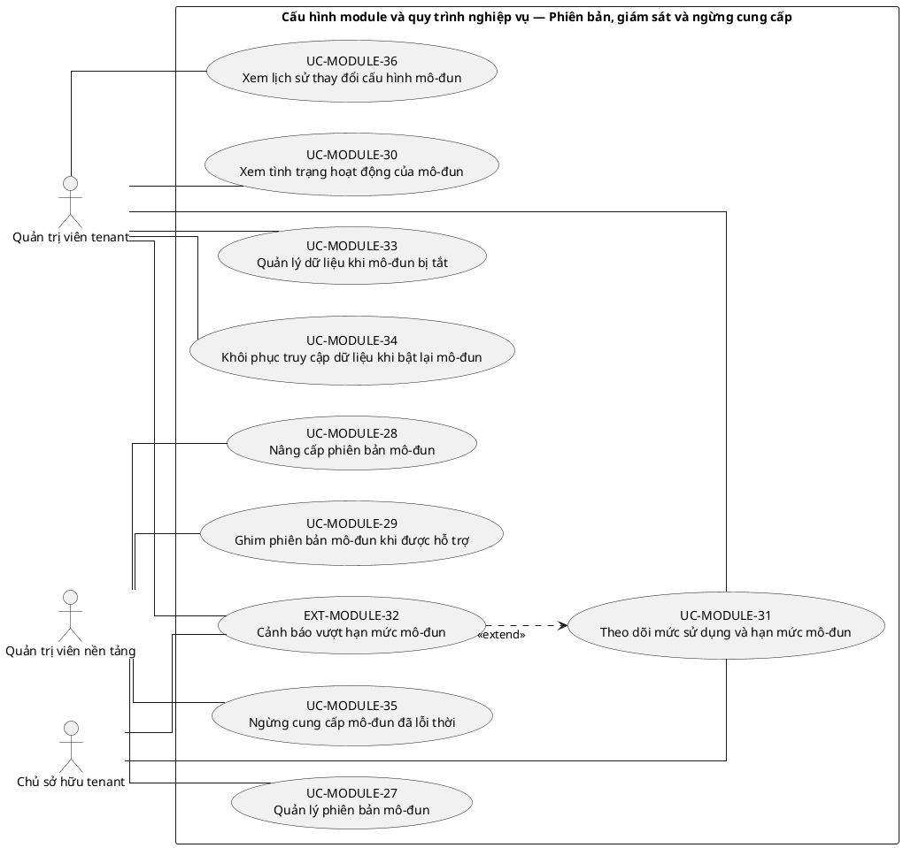

# UC-MODULE — Cấu hình module và quy trình nghiệp vụ

## 1. Thông tin tài liệu

| Thuộc tính | Nội dung |
|---|---|
| Mã nhóm Use Case | `UC-MODULE` |
| Tên | Cấu hình module và quy trình nghiệp vụ |
| Miền nghiệp vụ | Quản trị tổ chức |
| Mức ưu tiên phát triển | Nền tảng bắt buộc |
| Phạm vi | Toàn bộ sản phẩm Operations Hub |
| Mô hình | SaaS đa tổ chức, dữ liệu và cấu hình theo tenant |
| Trạng thái đặc tả | Baseline V3; phân biệt Use Case mục tiêu, include, extend và yêu cầu hệ thống |

> **Nguyên tắc phạm vi:** tài liệu mô tả năng lực của phiên bản sản phẩm hoàn chỉnh. Mức ưu tiên phát triển không đồng nghĩa với loại bỏ khỏi phạm vi sản phẩm.

## 2. Mục tiêu

Quản lý danh mục module, trạng thái kích hoạt và cấu hình phụ thuộc theo từng tenant.

## 3. Actor

| Mã actor | Actor | Phạm vi |
|---|---|---|
| `ACT-TENANT-ADMIN` | Quản trị viên tenant | Tenant hoặc tích hợp |
| `ACT-TENANT-OWNER` | Chủ sở hữu tenant | Tenant hoặc tích hợp |
| `ACT-PLATFORM-ADMIN` | Quản trị viên nền tảng | Cấp nền tảng |

Actor trong sơ đồ chỉ thể hiện vai trò tương tác. Quyền thực tế phải được kiểm tra tại backend dựa trên tenant context, membership, role, permission, organization unit, trạng thái module và trạng thái tenant.

## 4. Điều kiện trước

- Nền tảng đã công bố catalog module và metadata phụ thuộc.
- Người thao tác có permission quản trị module ở cấp phù hợp.

## 5. Điều kiện sau

- Trạng thái module được áp dụng riêng theo tenant.
- Dữ liệu module không bị xóa khi module bị tắt.

## 6. Danh mục phần tử nghiệp vụ và phân loại UML

> **Thay đổi của V3:** Không coi toàn bộ danh mục chức năng là Use Case độc lập. Chỉ phần tử có mục tiêu quan sát được đối với actor được giữ mã `UC-*`. Hành vi bắt buộc dùng chung dùng mã `INC-*`; luồng điều kiện dùng mã `EXT-*`; quy tắc hoặc xử lý xuyên suốt dùng mã `REQ-*`. Mã V2 được giữ để truy vết.

> Actor chỉ nối trực tiếp với `UC-*` hoặc `EXT-*` mà actor thực sự khởi phát/tham gia. `INC-*` được nối bằng `<<include>>`; `REQ-*` không được vẽ như Use Case.

| Mã V3 | Mã V2 | Phần tử nghiệp vụ | Loại mô hình | Actor trực tiếp / nguồn kích hoạt | Quan hệ |
|---|---|---|---|---|---|
| `UC-MODULE-01` | `UC-MODULE-01` | Xem danh mục mô-đun nền tảng | Use Case mục tiêu actor | `ACT-PLATFORM-ADMIN` — Quản trị viên nền tảng | Association trực tiếp với actor |
| `UC-MODULE-02` | `UC-MODULE-02` | Xem chi tiết mô-đun | Use Case mục tiêu actor | `ACT-PLATFORM-ADMIN` — Quản trị viên nền tảng | Association trực tiếp với actor |
| `UC-MODULE-03` | `UC-MODULE-03` | Xem điều kiện gói dịch vụ của mô-đun | Use Case mục tiêu actor | `ACT-PLATFORM-ADMIN` — Quản trị viên nền tảng<br>`ACT-TENANT-ADMIN` — Quản trị viên tenant<br>`ACT-TENANT-OWNER` — Chủ sở hữu tenant | Association trực tiếp với actor |
| `UC-MODULE-04` | `UC-MODULE-04` | Xem phụ thuộc giữa các mô-đun | Use Case mục tiêu actor | `ACT-PLATFORM-ADMIN` — Quản trị viên nền tảng | Association trực tiếp với actor |
| `UC-MODULE-05` | `UC-MODULE-05` | Yêu cầu kích hoạt mô-đun | Use Case mục tiêu actor | `ACT-TENANT-ADMIN` — Quản trị viên tenant<br>`ACT-TENANT-OWNER` — Chủ sở hữu tenant | Association trực tiếp với actor |
| `UC-MODULE-06` | `UC-MODULE-06` | Phê duyệt yêu cầu kích hoạt mô-đun | Use Case mục tiêu actor | `ACT-PLATFORM-ADMIN` — Quản trị viên nền tảng | Association trực tiếp với actor |
| `UC-MODULE-07` | `UC-MODULE-07` | Kích hoạt mô-đun cho tenant | Use Case mục tiêu actor | `ACT-TENANT-ADMIN` — Quản trị viên tenant | Association trực tiếp với actor |
| `UC-MODULE-08` | `UC-MODULE-08` | Kích hoạt mô-đun dùng thử | Use Case mục tiêu actor | `ACT-TENANT-ADMIN` — Quản trị viên tenant<br>`ACT-TENANT-OWNER` — Chủ sở hữu tenant | Association trực tiếp với actor |
| `UC-MODULE-09` | `UC-MODULE-09` | Kết thúc thời gian dùng thử mô-đun | Use Case mục tiêu actor | `ACT-PLATFORM-ADMIN` — Quản trị viên nền tảng<br>`ACT-TENANT-OWNER` — Chủ sở hữu tenant | Association trực tiếp với actor |
| `UC-MODULE-10` | `UC-MODULE-10` | Vô hiệu hóa mô-đun | Use Case mục tiêu actor | `ACT-TENANT-ADMIN` — Quản trị viên tenant<br>`ACT-TENANT-OWNER` — Chủ sở hữu tenant | Association trực tiếp với actor |
| `UC-MODULE-11` | `UC-MODULE-11` | Lên lịch kích hoạt mô-đun | Use Case mục tiêu actor | `ACT-TENANT-ADMIN` — Quản trị viên tenant<br>`ACT-TENANT-OWNER` — Chủ sở hữu tenant | Association trực tiếp với actor |
| `UC-MODULE-12` | `UC-MODULE-12` | Lên lịch vô hiệu hóa mô-đun | Use Case mục tiêu actor | `ACT-TENANT-ADMIN` — Quản trị viên tenant<br>`ACT-TENANT-OWNER` — Chủ sở hữu tenant | Association trực tiếp với actor |
| `EXT-MODULE-13` | `UC-MODULE-13` | Kích hoạt lại mô-đun | Luồng điều kiện `<<extend>>` | `ACT-TENANT-ADMIN` — Quản trị viên tenant<br>`ACT-TENANT-OWNER` — Chủ sở hữu tenant | `EXT-MODULE-13` `<<extend>>` `UC-MODULE-12` |
| `UC-MODULE-14` | `UC-MODULE-14` | Kiểm tra điều kiện trước khi kích hoạt | Use Case mục tiêu actor | `ACT-TENANT-ADMIN` — Quản trị viên tenant | Association trực tiếp với actor |
| `INC-MODULE-15` | `UC-MODULE-15` | Kiểm tra phụ thuộc trước khi vô hiệu hóa | Hành vi dùng chung `<<include>>` | Hệ thống; được gọi từ Use Case cha | `UC-MODULE-14` `<<include>>` `INC-MODULE-15` |
| `INC-MODULE-16` | `UC-MODULE-16` | Thực hiện bước khởi tạo dữ liệu mô-đun | Hành vi dùng chung `<<include>>` | Hệ thống; được gọi từ Use Case cha | `UC-MODULE-14` `<<include>>` `INC-MODULE-16` |
| `INC-MODULE-17` | `UC-MODULE-17` | Thực hiện migration cấu hình mô-đun | Hành vi dùng chung `<<include>>` | Hệ thống; được gọi từ Use Case cha | `UC-MODULE-14` `<<include>>` `INC-MODULE-17` |
| `EXT-MODULE-18` | `UC-MODULE-18` | Hoàn tác cấu hình khi kích hoạt thất bại | Luồng điều kiện `<<extend>>` | `ACT-TENANT-ADMIN` — Quản trị viên tenant | `EXT-MODULE-18` `<<extend>>` `UC-MODULE-14` |
| `UC-MODULE-19` | `UC-MODULE-19` | Cấu hình tham số mô-đun theo tenant | Use Case mục tiêu actor | `ACT-TENANT-ADMIN` — Quản trị viên tenant | Association trực tiếp với actor |
| `UC-MODULE-20` | `UC-MODULE-20` | Cấu hình mô-đun theo đơn vị | Use Case mục tiêu actor | `ACT-TENANT-ADMIN` — Quản trị viên tenant | Association trực tiếp với actor |
| `UC-MODULE-21` | `UC-MODULE-21` | Giới hạn mô-đun theo role hoặc permission | Use Case mục tiêu actor | `ACT-TENANT-ADMIN` — Quản trị viên tenant | Association trực tiếp với actor |
| `UC-MODULE-22` | `UC-MODULE-22` | Quản lý feature flag theo tenant | Use Case mục tiêu actor | `ACT-TENANT-ADMIN` — Quản trị viên tenant | Association trực tiếp với actor |
| `UC-MODULE-23` | `UC-MODULE-23` | Áp dụng mẫu cấu hình mô-đun | Use Case mục tiêu actor | `ACT-TENANT-ADMIN` — Quản trị viên tenant | Association trực tiếp với actor |
| `UC-MODULE-24` | `UC-MODULE-24` | Sao chép cấu hình mô-đun có kiểm soát | Use Case mục tiêu actor | `ACT-TENANT-ADMIN` — Quản trị viên tenant | Association trực tiếp với actor |
| `UC-MODULE-25` | `UC-MODULE-25` | Nhập cấu hình mô-đun | Use Case mục tiêu actor | `ACT-TENANT-ADMIN` — Quản trị viên tenant | Association trực tiếp với actor |
| `UC-MODULE-26` | `UC-MODULE-26` | Xuất cấu hình mô-đun | Use Case mục tiêu actor | `ACT-TENANT-ADMIN` — Quản trị viên tenant | Association trực tiếp với actor |
| `UC-MODULE-27` | `UC-MODULE-27` | Quản lý phiên bản mô-đun | Use Case mục tiêu actor | `ACT-PLATFORM-ADMIN` — Quản trị viên nền tảng | Association trực tiếp với actor |
| `UC-MODULE-28` | `UC-MODULE-28` | Nâng cấp phiên bản mô-đun | Use Case mục tiêu actor | `ACT-PLATFORM-ADMIN` — Quản trị viên nền tảng | Association trực tiếp với actor |
| `UC-MODULE-29` | `UC-MODULE-29` | Ghim phiên bản mô-đun khi được hỗ trợ | Use Case mục tiêu actor | `ACT-PLATFORM-ADMIN` — Quản trị viên nền tảng | Association trực tiếp với actor |
| `UC-MODULE-30` | `UC-MODULE-30` | Xem tình trạng hoạt động của mô-đun | Use Case mục tiêu actor | `ACT-TENANT-ADMIN` — Quản trị viên tenant | Association trực tiếp với actor |
| `UC-MODULE-31` | `UC-MODULE-31` | Theo dõi mức sử dụng và hạn mức mô-đun | Use Case mục tiêu actor | `ACT-TENANT-ADMIN` — Quản trị viên tenant<br>`ACT-TENANT-OWNER` — Chủ sở hữu tenant | Association trực tiếp với actor |
| `EXT-MODULE-32` | `UC-MODULE-32` | Cảnh báo vượt hạn mức mô-đun | Luồng điều kiện `<<extend>>` | `ACT-TENANT-ADMIN` — Quản trị viên tenant<br>`ACT-TENANT-OWNER` — Chủ sở hữu tenant | `EXT-MODULE-32` `<<extend>>` `UC-MODULE-31` |
| `UC-MODULE-33` | `UC-MODULE-33` | Quản lý dữ liệu khi mô-đun bị tắt | Use Case mục tiêu actor | `ACT-TENANT-ADMIN` — Quản trị viên tenant | Association trực tiếp với actor |
| `UC-MODULE-34` | `UC-MODULE-34` | Khôi phục truy cập dữ liệu khi bật lại mô-đun | Use Case mục tiêu actor | `ACT-TENANT-ADMIN` — Quản trị viên tenant | Association trực tiếp với actor |
| `UC-MODULE-35` | `UC-MODULE-35` | Ngừng cung cấp mô-đun đã lỗi thời | Use Case mục tiêu actor | `ACT-PLATFORM-ADMIN` — Quản trị viên nền tảng | Association trực tiếp với actor |
| `UC-MODULE-36` | `UC-MODULE-36` | Xem lịch sử thay đổi cấu hình mô-đun | Use Case mục tiêu actor | `ACT-TENANT-ADMIN` — Quản trị viên tenant | Association trực tiếp với actor |

## 7. Luồng nghiệp vụ chính

1. Tenant Admin chọn module từ catalog.
2. Hệ thống kiểm tra gói dịch vụ, phụ thuộc và điều kiện dữ liệu.
3. Người dùng xác nhận kích hoạt và cấu hình bắt buộc.
4. Hệ thống lưu TenantModule và version cấu hình.
5. Menu và endpoint được mở theo trạng thái module kết hợp với permission.
6. Thay đổi được ghi audit.

## 8. Luồng thay thế và ngoại lệ

- Thiếu module phụ thuộc: yêu cầu bật phụ thuộc trước.
- Tắt module đang là phụ thuộc: từ chối hoặc yêu cầu quy trình vô hiệu hóa theo chuỗi.
- Cấu hình không hợp lệ: giữ nguyên phiên bản đang hiệu lực.

## 9. Quy tắc nghiệp vụ cốt lõi

- Bật hoặc tắt module tại tenant A không ảnh hưởng tenant B.
- Module bị tắt không xuất hiện trên menu và backend phải từ chối endpoint nghiệp vụ tương ứng.
- Vô hiệu hóa module không tự động xóa dữ liệu.
- Không được tắt module nền khi module phụ thuộc còn hoạt động nếu chưa xử lý phụ thuộc.
- Template nền tảng phải phân biệt với cấu hình riêng của tenant.

## 10. Mô hình dữ liệu logic liên quan

| Thực thể | Vai trò |
|---|---|
| `ModuleCatalog` | Thực thể logic phục vụ UC-MODULE; thiết kế vật lý được xác định ở giai đoạn thiết kế dữ liệu. |
| `TenantModule` | Thực thể logic phục vụ UC-MODULE; thiết kế vật lý được xác định ở giai đoạn thiết kế dữ liệu. |
| `ModuleDependency` | Thực thể logic phục vụ UC-MODULE; thiết kế vật lý được xác định ở giai đoạn thiết kế dữ liệu. |
| `ModuleConfiguration` | Thực thể logic phục vụ UC-MODULE; thiết kế vật lý được xác định ở giai đoạn thiết kế dữ liệu. |
| `WorkflowConfiguration` | Thực thể logic phục vụ UC-MODULE; thiết kế vật lý được xác định ở giai đoạn thiết kế dữ liệu. |
| `ConfigurationVersion` | Thực thể logic phục vụ UC-MODULE; thiết kế vật lý được xác định ở giai đoạn thiết kế dữ liệu. |
| `AuditLog` | Thực thể logic phục vụ UC-MODULE; thiết kế vật lý được xác định ở giai đoạn thiết kế dữ liệu. |

Mọi thực thể nghiệp vụ phải xác định được tenant sở hữu, trừ thực thể được công bố rõ là dữ liệu cấp nền tảng. Quan hệ tham chiếu chéo tenant bị cấm nếu không có cơ chế liên tenant được đặc tả riêng.

## 11. Kiểm soát truy cập

Quyền hiệu lực được xác định theo công thức khái quát:

```text
Quyền hiệu lực
= Permission từ các Role đang hoạt động
∩ Tenant context hợp lệ
∩ Membership đang hoạt động
∩ Phạm vi Organization Unit
∩ Phạm vi tài nguyên
∩ Trạng thái Module
∩ Trạng thái Tenant
```

Các kiểm tra bắt buộc:

- Xác thực User trước khi truy cập chức năng không công khai.
- Đối chiếu tenant context với membership.
- Kiểm tra permission tại backend, không dựa vào trạng thái hiển thị của frontend.
- Giới hạn truy vấn, tệp, bản xuất, cache và tác vụ nền theo tenant.
- Ghi audit cho hành động quản trị hoặc thay đổi nghiệp vụ quan trọng.

## 12. Tiêu chí chấp nhận

| Mã | Tiêu chí | Phương pháp kiểm chứng |
|---|---|---|
| `AC-MODULE-01` | Module bị tắt không truy cập được qua UI hoặc API. | Functional / Integration / Security Test tùy nội dung |
| `AC-MODULE-02` | Tắt rồi bật lại module vẫn truy cập dữ liệu cũ theo quyền. | Functional / Integration / Security Test tùy nội dung |
| `AC-MODULE-03` | Phụ thuộc được kiểm tra trước khi thay đổi trạng thái. | Functional / Integration / Security Test tùy nội dung |
| `AC-MODULE-04` | Cấu hình tenant không bị dùng nhầm cho tenant khác. | Functional / Integration / Security Test tùy nội dung |

## 13. Quan hệ với nhóm Use Case khác

[`UC-TENANT`](./01_UC-TENANT.md), [`UC-RBAC`](./04_UC-RBAC.md), [`UC-AUDIT`](./21_UC-AUDIT.md)

## 14. Use Case Diagram theo luồng nghiệp vụ

Các package/rectangle dưới đây chỉ là **ranh giới hệ thống hoặc miền nghiệp vụ**. Không tồn tại phần tử trung gian `PKG*`; actor liên kết trực tiếp với Use Case có mục tiêu nghiệp vụ. `INC-*` và `EXT-*` chỉ xuất hiện qua quan hệ UML tương ứng; `REQ-*` được trình bày ngoài sơ đồ.

### 14.1. Quy ước đọc sơ đồ

- `Actor -- UC-*`: actor trực tiếp thực hiện hoặc tham gia mục tiêu nghiệp vụ.
- `UC-* ..> INC-* : <<include>>`: hành vi bắt buộc được dùng lại.
- `EXT-* ..> UC-* : <<extend>>`: hành vi chỉ phát sinh trong điều kiện xác định.
- `REQ-*`: quy tắc/yêu cầu hệ thống, không phải Use Case và không nối actor.

### 14.2. Danh mục và vòng đời kích hoạt mô-đun



### 14.3. Điều kiện, khởi tạo và hoàn tác



### 14.4. Cấu hình mô-đun theo tenant



### 14.5. Phiên bản, giám sát và ngừng cung cấp


