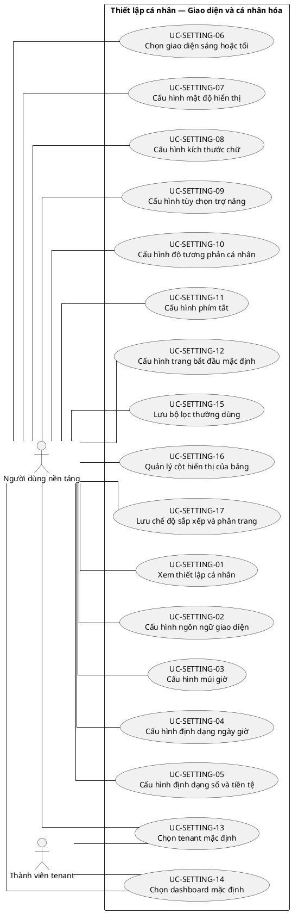
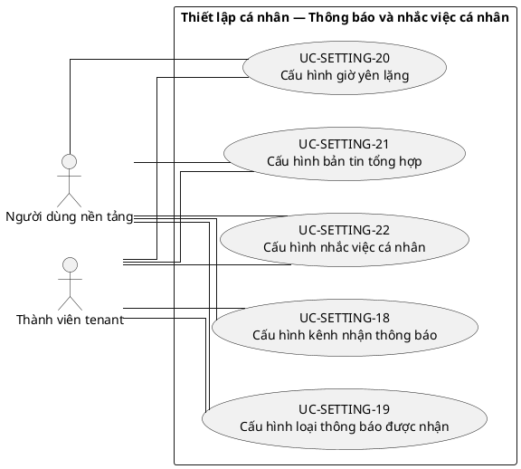
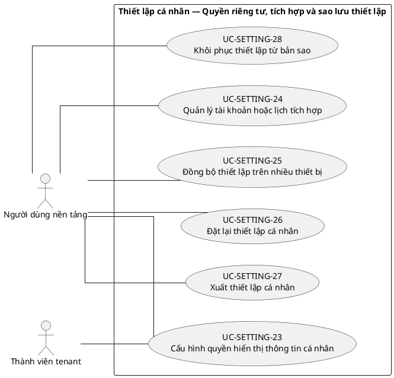

# UC-SETTING — Thiết lập cá nhân

## 1. Thông tin tài liệu

| Thuộc tính | Nội dung |
|---|---|
| Mã nhóm Use Case | `UC-SETTING` |
| Tên | Thiết lập cá nhân |
| Miền nghiệp vụ | Trải nghiệm người dùng |
| Mức ưu tiên phát triển | Năng lực dùng chung |
| Phạm vi | Toàn bộ sản phẩm Operations Hub |
| Mô hình | SaaS đa tổ chức, dữ liệu và cấu hình theo tenant |
| Trạng thái đặc tả | Baseline V3; phân biệt Use Case mục tiêu, include, extend và yêu cầu hệ thống |

> **Nguyên tắc phạm vi:** tài liệu mô tả năng lực của phiên bản sản phẩm hoàn chỉnh. Mức ưu tiên phát triển không đồng nghĩa với loại bỏ khỏi phạm vi sản phẩm.

## 2. Mục tiêu

Cho phép người dùng quản lý các tùy chọn cá nhân toàn cục và theo tenant mà không ảnh hưởng cấu hình tổ chức.

## 3. Actor

| Mã actor | Actor | Phạm vi |
|---|---|---|
| `ACT-PLATFORM-USER` | Người dùng nền tảng | Cấp nền tảng |
| `ACT-TENANT-MEMBER` | Thành viên tenant | Tenant hoặc tích hợp |

Actor trong sơ đồ chỉ thể hiện vai trò tương tác. Quyền thực tế phải được kiểm tra tại backend dựa trên tenant context, membership, role, permission, organization unit, trạng thái module và trạng thái tenant.

## 4. Điều kiện trước

- Người dùng đã xác thực.

## 5. Điều kiện sau

- Thiết lập được lưu đúng phạm vi toàn cục hoặc tenant.
- Các thay đổi có hiệu lực trên giao diện và thông báo theo chính sách.

## 6. Danh mục phần tử nghiệp vụ và phân loại UML

> **Thay đổi của V3:** Không coi toàn bộ danh mục chức năng là Use Case độc lập. Chỉ phần tử có mục tiêu quan sát được đối với actor được giữ mã `UC-*`. Hành vi bắt buộc dùng chung dùng mã `INC-*`; luồng điều kiện dùng mã `EXT-*`; quy tắc hoặc xử lý xuyên suốt dùng mã `REQ-*`. Mã V2 được giữ để truy vết.

> Actor chỉ nối trực tiếp với `UC-*` hoặc `EXT-*` mà actor thực sự khởi phát/tham gia. `INC-*` được nối bằng `<<include>>`; `REQ-*` không được vẽ như Use Case.

| Mã V3 | Mã V2 | Phần tử nghiệp vụ | Loại mô hình | Actor trực tiếp / nguồn kích hoạt | Quan hệ |
|---|---|---|---|---|---|
| `UC-SETTING-01` | `UC-SETTING-01` | Xem thiết lập cá nhân | Use Case mục tiêu actor | `ACT-PLATFORM-USER` — Người dùng nền tảng | Association trực tiếp với actor |
| `UC-SETTING-02` | `UC-SETTING-02` | Cấu hình ngôn ngữ giao diện | Use Case mục tiêu actor | `ACT-PLATFORM-USER` — Người dùng nền tảng | Association trực tiếp với actor |
| `UC-SETTING-03` | `UC-SETTING-03` | Cấu hình múi giờ | Use Case mục tiêu actor | `ACT-PLATFORM-USER` — Người dùng nền tảng | Association trực tiếp với actor |
| `UC-SETTING-04` | `UC-SETTING-04` | Cấu hình định dạng ngày giờ | Use Case mục tiêu actor | `ACT-PLATFORM-USER` — Người dùng nền tảng | Association trực tiếp với actor |
| `UC-SETTING-05` | `UC-SETTING-05` | Cấu hình định dạng số và tiền tệ | Use Case mục tiêu actor | `ACT-PLATFORM-USER` — Người dùng nền tảng | Association trực tiếp với actor |
| `UC-SETTING-06` | `UC-SETTING-06` | Chọn giao diện sáng hoặc tối | Use Case mục tiêu actor | `ACT-PLATFORM-USER` — Người dùng nền tảng | Association trực tiếp với actor |
| `UC-SETTING-07` | `UC-SETTING-07` | Cấu hình mật độ hiển thị | Use Case mục tiêu actor | `ACT-PLATFORM-USER` — Người dùng nền tảng | Association trực tiếp với actor |
| `UC-SETTING-08` | `UC-SETTING-08` | Cấu hình kích thước chữ | Use Case mục tiêu actor | `ACT-PLATFORM-USER` — Người dùng nền tảng | Association trực tiếp với actor |
| `UC-SETTING-09` | `UC-SETTING-09` | Cấu hình tùy chọn trợ năng | Use Case mục tiêu actor | `ACT-PLATFORM-USER` — Người dùng nền tảng | Association trực tiếp với actor |
| `UC-SETTING-10` | `UC-SETTING-10` | Cấu hình độ tương phản cá nhân | Use Case mục tiêu actor | `ACT-PLATFORM-USER` — Người dùng nền tảng | Association trực tiếp với actor |
| `UC-SETTING-11` | `UC-SETTING-11` | Cấu hình phím tắt | Use Case mục tiêu actor | `ACT-PLATFORM-USER` — Người dùng nền tảng | Association trực tiếp với actor |
| `UC-SETTING-12` | `UC-SETTING-12` | Cấu hình trang bắt đầu mặc định | Use Case mục tiêu actor | `ACT-PLATFORM-USER` — Người dùng nền tảng | Association trực tiếp với actor |
| `UC-SETTING-13` | `UC-SETTING-13` | Chọn tenant mặc định | Use Case mục tiêu actor | `ACT-PLATFORM-USER` — Người dùng nền tảng<br>`ACT-TENANT-MEMBER` — Thành viên tenant | Association trực tiếp với actor |
| `UC-SETTING-14` | `UC-SETTING-14` | Chọn dashboard mặc định | Use Case mục tiêu actor | `ACT-PLATFORM-USER` — Người dùng nền tảng<br>`ACT-TENANT-MEMBER` — Thành viên tenant | Association trực tiếp với actor |
| `UC-SETTING-15` | `UC-SETTING-15` | Lưu bộ lọc thường dùng | Use Case mục tiêu actor | `ACT-PLATFORM-USER` — Người dùng nền tảng | Association trực tiếp với actor |
| `UC-SETTING-16` | `UC-SETTING-16` | Quản lý cột hiển thị của bảng | Use Case mục tiêu actor | `ACT-PLATFORM-USER` — Người dùng nền tảng | Association trực tiếp với actor |
| `UC-SETTING-17` | `UC-SETTING-17` | Lưu chế độ sắp xếp và phân trang | Use Case mục tiêu actor | `ACT-PLATFORM-USER` — Người dùng nền tảng | Association trực tiếp với actor |
| `UC-SETTING-18` | `UC-SETTING-18` | Cấu hình kênh nhận thông báo | Use Case mục tiêu actor | `ACT-PLATFORM-USER` — Người dùng nền tảng<br>`ACT-TENANT-MEMBER` — Thành viên tenant | Association trực tiếp với actor |
| `UC-SETTING-19` | `UC-SETTING-19` | Cấu hình loại thông báo được nhận | Use Case mục tiêu actor | `ACT-PLATFORM-USER` — Người dùng nền tảng<br>`ACT-TENANT-MEMBER` — Thành viên tenant | Association trực tiếp với actor |
| `UC-SETTING-20` | `UC-SETTING-20` | Cấu hình giờ yên lặng | Use Case mục tiêu actor | `ACT-PLATFORM-USER` — Người dùng nền tảng<br>`ACT-TENANT-MEMBER` — Thành viên tenant | Association trực tiếp với actor |
| `UC-SETTING-21` | `UC-SETTING-21` | Cấu hình bản tin tổng hợp | Use Case mục tiêu actor | `ACT-PLATFORM-USER` — Người dùng nền tảng<br>`ACT-TENANT-MEMBER` — Thành viên tenant | Association trực tiếp với actor |
| `UC-SETTING-22` | `UC-SETTING-22` | Cấu hình nhắc việc cá nhân | Use Case mục tiêu actor | `ACT-PLATFORM-USER` — Người dùng nền tảng<br>`ACT-TENANT-MEMBER` — Thành viên tenant | Association trực tiếp với actor |
| `UC-SETTING-23` | `UC-SETTING-23` | Cấu hình quyền hiển thị thông tin cá nhân | Use Case mục tiêu actor | `ACT-PLATFORM-USER` — Người dùng nền tảng<br>`ACT-TENANT-MEMBER` — Thành viên tenant | Association trực tiếp với actor |
| `UC-SETTING-24` | `UC-SETTING-24` | Quản lý tài khoản hoặc lịch tích hợp | Use Case mục tiêu actor | `ACT-PLATFORM-USER` — Người dùng nền tảng | Association trực tiếp với actor |
| `UC-SETTING-25` | `UC-SETTING-25` | Đồng bộ thiết lập trên nhiều thiết bị | Use Case mục tiêu actor | `ACT-PLATFORM-USER` — Người dùng nền tảng | Association trực tiếp với actor |
| `UC-SETTING-26` | `UC-SETTING-26` | Đặt lại thiết lập cá nhân | Use Case mục tiêu actor | `ACT-PLATFORM-USER` — Người dùng nền tảng | Association trực tiếp với actor |
| `UC-SETTING-27` | `UC-SETTING-27` | Xuất thiết lập cá nhân | Use Case mục tiêu actor | `ACT-PLATFORM-USER` — Người dùng nền tảng | Association trực tiếp với actor |
| `UC-SETTING-28` | `UC-SETTING-28` | Khôi phục thiết lập từ bản sao | Use Case mục tiêu actor | `ACT-PLATFORM-USER` — Người dùng nền tảng | Association trực tiếp với actor |

## 7. Luồng nghiệp vụ chính

1. Người dùng mở trang thiết lập.
2. Hệ thống tải giá trị toàn cục và giá trị ghi đè theo tenant.
3. Người dùng thay đổi tùy chọn và lưu.
4. Hệ thống kiểm tra giá trị, phạm vi và chính sách bắt buộc.
5. Giao diện áp dụng thiết lập mới và đồng bộ phiên.

## 8. Luồng thay thế và ngoại lệ

- Tenant mặc định đã bị khóa hoặc membership kết thúc: hệ thống yêu cầu chọn lại.
- Người dùng tắt thông báo bắt buộc: từ chối và giải thích chính sách.
- Giá trị không còn được hỗ trợ: fallback về mặc định.

## 9. Quy tắc nghiệp vụ cốt lõi

- Thiết lập cá nhân không được thay đổi branding hoặc chính sách của tenant.
- Tenant mặc định phải là tenant có membership đang hoạt động.
- Thông báo bắt buộc về bảo mật hoặc quản trị có thể không cho phép tắt.
- Thiết lập theo tenant phải tách biệt giữa các tenant.

## 10. Mô hình dữ liệu logic liên quan

| Thực thể | Vai trò |
|---|---|
| `UserSetting` | Thực thể logic phục vụ UC-SETTING; thiết kế vật lý được xác định ở giai đoạn thiết kế dữ liệu. |
| `TenantUserSetting` | Thực thể logic phục vụ UC-SETTING; thiết kế vật lý được xác định ở giai đoạn thiết kế dữ liệu. |
| `NotificationPreference` | Thực thể logic phục vụ UC-SETTING; thiết kế vật lý được xác định ở giai đoạn thiết kế dữ liệu. |
| `AccessibilityPreference` | Thực thể logic phục vụ UC-SETTING; thiết kế vật lý được xác định ở giai đoạn thiết kế dữ liệu. |
| `Session` | Thực thể logic phục vụ UC-SETTING; thiết kế vật lý được xác định ở giai đoạn thiết kế dữ liệu. |

Mọi thực thể nghiệp vụ phải xác định được tenant sở hữu, trừ thực thể được công bố rõ là dữ liệu cấp nền tảng. Quan hệ tham chiếu chéo tenant bị cấm nếu không có cơ chế liên tenant được đặc tả riêng.

## 11. Kiểm soát truy cập

Quyền hiệu lực được xác định theo công thức khái quát:

```text
Quyền hiệu lực
= Permission từ các Role đang hoạt động
∩ Tenant context hợp lệ
∩ Membership đang hoạt động
∩ Phạm vi Organization Unit
∩ Phạm vi tài nguyên
∩ Trạng thái Module
∩ Trạng thái Tenant
```

Các kiểm tra bắt buộc:

- Xác thực User trước khi truy cập chức năng không công khai.
- Đối chiếu tenant context với membership.
- Kiểm tra permission tại backend, không dựa vào trạng thái hiển thị của frontend.
- Giới hạn truy vấn, tệp, bản xuất, cache và tác vụ nền theo tenant.
- Ghi audit cho hành động quản trị hoặc thay đổi nghiệp vụ quan trọng.

## 12. Tiêu chí chấp nhận

| Mã | Tiêu chí | Phương pháp kiểm chứng |
|---|---|---|
| `AC-SETTING-01` | Thiết lập tenant A không làm thay đổi thiết lập riêng của tenant B. | Functional / Integration / Security Test tùy nội dung |
| `AC-SETTING-02` | Giá trị không hợp lệ được từ chối hoặc fallback an toàn. | Functional / Integration / Security Test tùy nội dung |
| `AC-SETTING-03` | Khôi phục mặc định xóa đúng lớp ghi đè. | Functional / Integration / Security Test tùy nội dung |
| `AC-SETTING-04` | Người dùng không thể dùng thiết lập cá nhân để vượt quyền hoặc tắt cảnh báo bắt buộc. | Functional / Integration / Security Test tùy nội dung |

## 13. Quan hệ với nhóm Use Case khác

[`UC-AUTH`](./02_UC-AUTH.md), [`UC-USER`](./03_UC-USER.md), [`UC-TENANT`](./01_UC-TENANT.md), [`UC-NOTIFICATION`](./18_UC-NOTIFICATION.md)

## 14. Use Case Diagram theo luồng nghiệp vụ

Các package/rectangle dưới đây chỉ là **ranh giới hệ thống hoặc miền nghiệp vụ**. Không tồn tại phần tử trung gian `PKG*`; actor liên kết trực tiếp với Use Case có mục tiêu nghiệp vụ. `INC-*` và `EXT-*` chỉ xuất hiện qua quan hệ UML tương ứng; `REQ-*` được trình bày ngoài sơ đồ.

### 14.1. Quy ước đọc sơ đồ

- `Actor -- UC-*`: actor trực tiếp thực hiện hoặc tham gia mục tiêu nghiệp vụ.
- `UC-* ..> INC-* : <<include>>`: hành vi bắt buộc được dùng lại.
- `EXT-* ..> UC-* : <<extend>>`: hành vi chỉ phát sinh trong điều kiện xác định.
- `REQ-*`: quy tắc/yêu cầu hệ thống, không phải Use Case và không nối actor.

### 14.2. Giao diện và cá nhân hóa



### 14.3. Thông báo và nhắc việc cá nhân



### 14.4. Quyền riêng tư, tích hợp và sao lưu thiết lập


