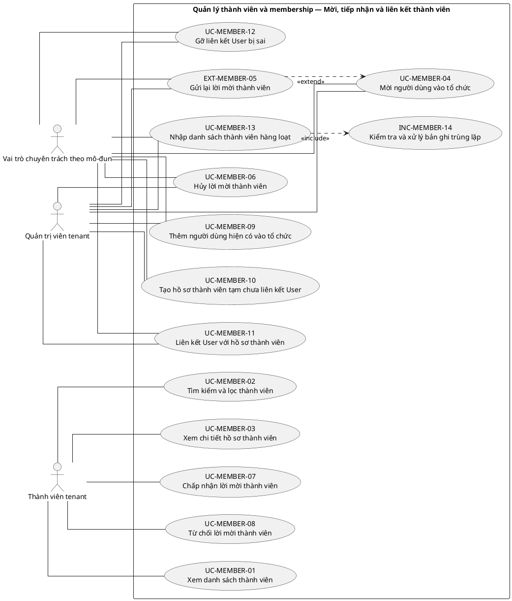
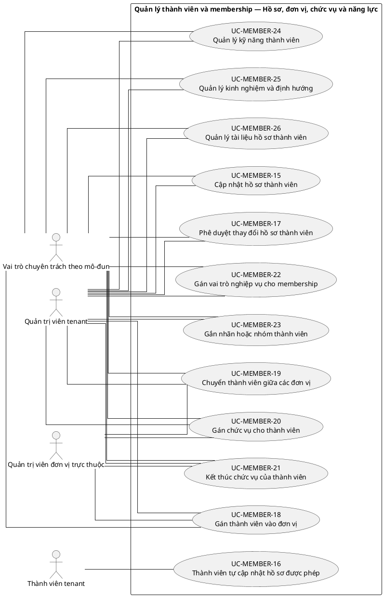
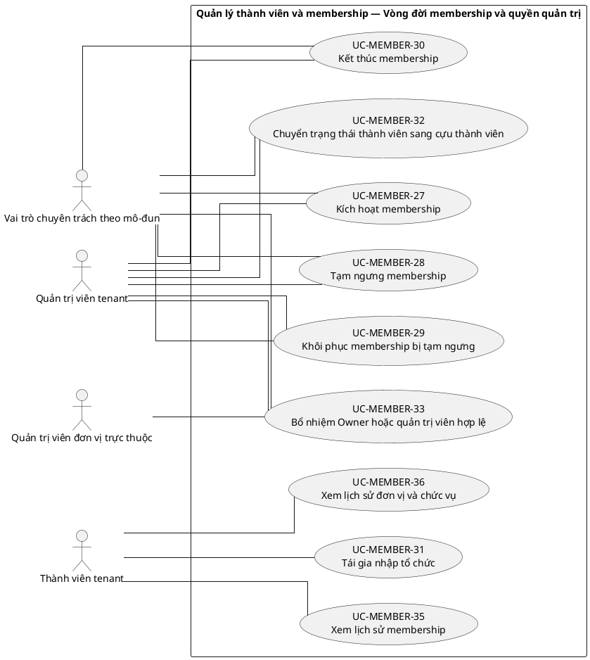
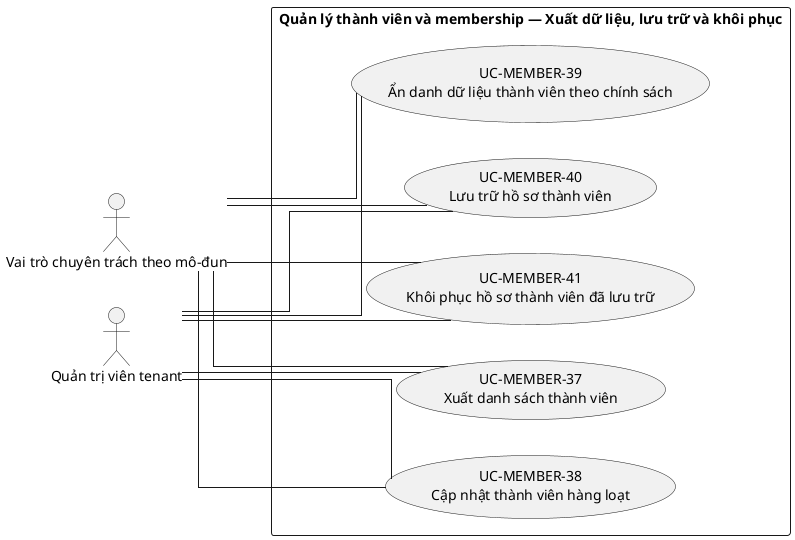

# UC-MEMBER — Quản lý thành viên và membership

## 1. Thông tin tài liệu

| Thuộc tính | Nội dung |
|---|---|
| Mã nhóm Use Case | `UC-MEMBER` |
| Tên | Quản lý thành viên và membership |
| Miền nghiệp vụ | Nhân sự tổ chức |
| Mức ưu tiên phát triển | Nền tảng bắt buộc |
| Phạm vi | Toàn bộ sản phẩm Operations Hub |
| Mô hình | SaaS đa tổ chức, dữ liệu và cấu hình theo tenant |
| Trạng thái đặc tả | Baseline V3; phân biệt Use Case mục tiêu, include, extend và yêu cầu hệ thống |

> **Nguyên tắc phạm vi:** tài liệu mô tả năng lực của phiên bản sản phẩm hoàn chỉnh. Mức ưu tiên phát triển không đồng nghĩa với loại bỏ khỏi phạm vi sản phẩm.

## 2. Mục tiêu

Quản lý quan hệ giữa User và tenant, hồ sơ thành viên, đơn vị tham gia và vòng đời membership.

## 3. Actor

| Mã actor | Actor | Phạm vi |
|---|---|---|
| `ACT-TENANT-MEMBER` | Thành viên tenant | Tenant hoặc tích hợp |
| `ACT-UNIT-ADMIN` | Quản trị viên đơn vị trực thuộc | Tenant hoặc tích hợp |
| `ACT-MODULE-SPECIALIST` | Vai trò chuyên trách theo mô-đun | Tenant hoặc tích hợp |
| `ACT-TENANT-ADMIN` | Quản trị viên tenant | Tenant hoặc tích hợp |

Actor trong sơ đồ chỉ thể hiện vai trò tương tác. Quyền thực tế phải được kiểm tra tại backend dựa trên tenant context, membership, role, permission, organization unit, trạng thái module và trạng thái tenant.

## 4. Điều kiện trước

- Tenant tồn tại và module thành viên được kích hoạt.
- Người thao tác có permission quản lý membership trong phạm vi tương ứng.

## 5. Điều kiện sau

- Membership hợp lệ, không trùng và thuộc đúng tenant.
- Lịch sử vai trò, đơn vị và trạng thái được bảo toàn.

## 6. Danh mục phần tử nghiệp vụ và phân loại UML

> **Thay đổi của V3:** Không coi toàn bộ danh mục chức năng là Use Case độc lập. Chỉ phần tử có mục tiêu quan sát được đối với actor được giữ mã `UC-*`. Hành vi bắt buộc dùng chung dùng mã `INC-*`; luồng điều kiện dùng mã `EXT-*`; quy tắc hoặc xử lý xuyên suốt dùng mã `REQ-*`. Mã V2 được giữ để truy vết.

> Actor chỉ nối trực tiếp với `UC-*` hoặc `EXT-*` mà actor thực sự khởi phát/tham gia. `INC-*` được nối bằng `<<include>>`; `REQ-*` không được vẽ như Use Case.

| Mã V3 | Mã V2 | Phần tử nghiệp vụ | Loại mô hình | Actor trực tiếp / nguồn kích hoạt | Quan hệ |
|---|---|---|---|---|---|
| `UC-MEMBER-01` | `UC-MEMBER-01` | Xem danh sách thành viên | Use Case mục tiêu actor | `ACT-TENANT-MEMBER` — Thành viên tenant | Association trực tiếp với actor |
| `UC-MEMBER-02` | `UC-MEMBER-02` | Tìm kiếm và lọc thành viên | Use Case mục tiêu actor | `ACT-TENANT-MEMBER` — Thành viên tenant | Association trực tiếp với actor |
| `UC-MEMBER-03` | `UC-MEMBER-03` | Xem chi tiết hồ sơ thành viên | Use Case mục tiêu actor | `ACT-TENANT-MEMBER` — Thành viên tenant | Association trực tiếp với actor |
| `UC-MEMBER-04` | `UC-MEMBER-04` | Mời người dùng vào tổ chức | Use Case mục tiêu actor | `ACT-MODULE-SPECIALIST` — Vai trò chuyên trách theo mô-đun<br>`ACT-TENANT-ADMIN` — Quản trị viên tenant | Association trực tiếp với actor |
| `EXT-MEMBER-05` | `UC-MEMBER-05` | Gửi lại lời mời thành viên | Luồng điều kiện `<<extend>>` | `ACT-MODULE-SPECIALIST` — Vai trò chuyên trách theo mô-đun<br>`ACT-TENANT-ADMIN` — Quản trị viên tenant | `EXT-MEMBER-05` `<<extend>>` `UC-MEMBER-04` |
| `UC-MEMBER-06` | `UC-MEMBER-06` | Hủy lời mời thành viên | Use Case mục tiêu actor | `ACT-MODULE-SPECIALIST` — Vai trò chuyên trách theo mô-đun<br>`ACT-TENANT-ADMIN` — Quản trị viên tenant | Association trực tiếp với actor |
| `UC-MEMBER-07` | `UC-MEMBER-07` | Chấp nhận lời mời thành viên | Use Case mục tiêu actor | `ACT-TENANT-MEMBER` — Thành viên tenant | Association trực tiếp với actor |
| `UC-MEMBER-08` | `UC-MEMBER-08` | Từ chối lời mời thành viên | Use Case mục tiêu actor | `ACT-TENANT-MEMBER` — Thành viên tenant | Association trực tiếp với actor |
| `UC-MEMBER-09` | `UC-MEMBER-09` | Thêm người dùng hiện có vào tổ chức | Use Case mục tiêu actor | `ACT-MODULE-SPECIALIST` — Vai trò chuyên trách theo mô-đun<br>`ACT-TENANT-ADMIN` — Quản trị viên tenant | Association trực tiếp với actor |
| `UC-MEMBER-10` | `UC-MEMBER-10` | Tạo hồ sơ thành viên tạm chưa liên kết User | Use Case mục tiêu actor | `ACT-MODULE-SPECIALIST` — Vai trò chuyên trách theo mô-đun<br>`ACT-TENANT-ADMIN` — Quản trị viên tenant | Association trực tiếp với actor |
| `UC-MEMBER-11` | `UC-MEMBER-11` | Liên kết User với hồ sơ thành viên | Use Case mục tiêu actor | `ACT-MODULE-SPECIALIST` — Vai trò chuyên trách theo mô-đun<br>`ACT-TENANT-ADMIN` — Quản trị viên tenant | Association trực tiếp với actor |
| `UC-MEMBER-12` | `UC-MEMBER-12` | Gỡ liên kết User bị sai | Use Case mục tiêu actor | `ACT-MODULE-SPECIALIST` — Vai trò chuyên trách theo mô-đun<br>`ACT-TENANT-ADMIN` — Quản trị viên tenant | Association trực tiếp với actor |
| `UC-MEMBER-13` | `UC-MEMBER-13` | Nhập danh sách thành viên hàng loạt | Use Case mục tiêu actor | `ACT-MODULE-SPECIALIST` — Vai trò chuyên trách theo mô-đun<br>`ACT-TENANT-ADMIN` — Quản trị viên tenant | Association trực tiếp với actor |
| `INC-MEMBER-14` | `UC-MEMBER-14` | Kiểm tra và xử lý bản ghi trùng lặp | Hành vi dùng chung `<<include>>` | Hệ thống; được gọi từ Use Case cha | `UC-MEMBER-13` `<<include>>` `INC-MEMBER-14` |
| `UC-MEMBER-15` | `UC-MEMBER-15` | Cập nhật hồ sơ thành viên | Use Case mục tiêu actor | `ACT-MODULE-SPECIALIST` — Vai trò chuyên trách theo mô-đun<br>`ACT-TENANT-ADMIN` — Quản trị viên tenant | Association trực tiếp với actor |
| `UC-MEMBER-16` | `UC-MEMBER-16` | Thành viên tự cập nhật hồ sơ được phép | Use Case mục tiêu actor | `ACT-TENANT-MEMBER` — Thành viên tenant | Association trực tiếp với actor |
| `UC-MEMBER-17` | `UC-MEMBER-17` | Phê duyệt thay đổi hồ sơ thành viên | Use Case mục tiêu actor | `ACT-MODULE-SPECIALIST` — Vai trò chuyên trách theo mô-đun<br>`ACT-TENANT-ADMIN` — Quản trị viên tenant | Association trực tiếp với actor |
| `UC-MEMBER-18` | `UC-MEMBER-18` | Gán thành viên vào đơn vị | Use Case mục tiêu actor | `ACT-MODULE-SPECIALIST` — Vai trò chuyên trách theo mô-đun<br>`ACT-TENANT-ADMIN` — Quản trị viên tenant<br>`ACT-UNIT-ADMIN` — Quản trị viên đơn vị trực thuộc | Association trực tiếp với actor |
| `UC-MEMBER-19` | `UC-MEMBER-19` | Chuyển thành viên giữa các đơn vị | Use Case mục tiêu actor | `ACT-MODULE-SPECIALIST` — Vai trò chuyên trách theo mô-đun<br>`ACT-TENANT-ADMIN` — Quản trị viên tenant<br>`ACT-UNIT-ADMIN` — Quản trị viên đơn vị trực thuộc | Association trực tiếp với actor |
| `UC-MEMBER-20` | `UC-MEMBER-20` | Gán chức vụ cho thành viên | Use Case mục tiêu actor | `ACT-MODULE-SPECIALIST` — Vai trò chuyên trách theo mô-đun<br>`ACT-TENANT-ADMIN` — Quản trị viên tenant<br>`ACT-UNIT-ADMIN` — Quản trị viên đơn vị trực thuộc | Association trực tiếp với actor |
| `UC-MEMBER-21` | `UC-MEMBER-21` | Kết thúc chức vụ của thành viên | Use Case mục tiêu actor | `ACT-MODULE-SPECIALIST` — Vai trò chuyên trách theo mô-đun<br>`ACT-TENANT-ADMIN` — Quản trị viên tenant<br>`ACT-UNIT-ADMIN` — Quản trị viên đơn vị trực thuộc | Association trực tiếp với actor |
| `UC-MEMBER-22` | `UC-MEMBER-22` | Gán vai trò nghiệp vụ cho membership | Use Case mục tiêu actor | `ACT-MODULE-SPECIALIST` — Vai trò chuyên trách theo mô-đun<br>`ACT-TENANT-ADMIN` — Quản trị viên tenant | Association trực tiếp với actor |
| `UC-MEMBER-23` | `UC-MEMBER-23` | Gắn nhãn hoặc nhóm thành viên | Use Case mục tiêu actor | `ACT-MODULE-SPECIALIST` — Vai trò chuyên trách theo mô-đun<br>`ACT-TENANT-ADMIN` — Quản trị viên tenant | Association trực tiếp với actor |
| `UC-MEMBER-24` | `UC-MEMBER-24` | Quản lý kỹ năng thành viên | Use Case mục tiêu actor | `ACT-MODULE-SPECIALIST` — Vai trò chuyên trách theo mô-đun<br>`ACT-TENANT-ADMIN` — Quản trị viên tenant | Association trực tiếp với actor |
| `UC-MEMBER-25` | `UC-MEMBER-25` | Quản lý kinh nghiệm và định hướng | Use Case mục tiêu actor | `ACT-MODULE-SPECIALIST` — Vai trò chuyên trách theo mô-đun<br>`ACT-TENANT-ADMIN` — Quản trị viên tenant | Association trực tiếp với actor |
| `UC-MEMBER-26` | `UC-MEMBER-26` | Quản lý tài liệu hồ sơ thành viên | Use Case mục tiêu actor | `ACT-MODULE-SPECIALIST` — Vai trò chuyên trách theo mô-đun<br>`ACT-TENANT-ADMIN` — Quản trị viên tenant | Association trực tiếp với actor |
| `UC-MEMBER-27` | `UC-MEMBER-27` | Kích hoạt membership | Use Case mục tiêu actor | `ACT-MODULE-SPECIALIST` — Vai trò chuyên trách theo mô-đun<br>`ACT-TENANT-ADMIN` — Quản trị viên tenant | Association trực tiếp với actor |
| `UC-MEMBER-28` | `UC-MEMBER-28` | Tạm ngưng membership | Use Case mục tiêu actor | `ACT-MODULE-SPECIALIST` — Vai trò chuyên trách theo mô-đun<br>`ACT-TENANT-ADMIN` — Quản trị viên tenant | Association trực tiếp với actor |
| `UC-MEMBER-29` | `UC-MEMBER-29` | Khôi phục membership bị tạm ngưng | Use Case mục tiêu actor | `ACT-MODULE-SPECIALIST` — Vai trò chuyên trách theo mô-đun<br>`ACT-TENANT-ADMIN` — Quản trị viên tenant | Association trực tiếp với actor |
| `UC-MEMBER-30` | `UC-MEMBER-30` | Kết thúc membership | Use Case mục tiêu actor | `ACT-MODULE-SPECIALIST` — Vai trò chuyên trách theo mô-đun<br>`ACT-TENANT-ADMIN` — Quản trị viên tenant | Association trực tiếp với actor |
| `UC-MEMBER-31` | `UC-MEMBER-31` | Tái gia nhập tổ chức | Use Case mục tiêu actor | `ACT-TENANT-MEMBER` — Thành viên tenant | Association trực tiếp với actor |
| `UC-MEMBER-32` | `UC-MEMBER-32` | Chuyển trạng thái thành viên sang cựu thành viên | Use Case mục tiêu actor | `ACT-MODULE-SPECIALIST` — Vai trò chuyên trách theo mô-đun<br>`ACT-TENANT-ADMIN` — Quản trị viên tenant | Association trực tiếp với actor |
| `UC-MEMBER-33` | `UC-MEMBER-33` | Bổ nhiệm Owner hoặc quản trị viên hợp lệ | Use Case mục tiêu actor | `ACT-MODULE-SPECIALIST` — Vai trò chuyên trách theo mô-đun<br>`ACT-TENANT-ADMIN` — Quản trị viên tenant<br>`ACT-UNIT-ADMIN` — Quản trị viên đơn vị trực thuộc | Association trực tiếp với actor |
| `REQ-MEMBER-34` | `UC-MEMBER-34` | Ngăn loại bỏ Owner cuối cùng | Quy tắc/yêu cầu hệ thống | Hệ thống/chính sách; không có association actor trực tiếp | Áp dụng như quy tắc/yêu cầu xuyên suốt; không nối actor trực tiếp |
| `UC-MEMBER-35` | `UC-MEMBER-35` | Xem lịch sử membership | Use Case mục tiêu actor | `ACT-TENANT-MEMBER` — Thành viên tenant | Association trực tiếp với actor |
| `UC-MEMBER-36` | `UC-MEMBER-36` | Xem lịch sử đơn vị và chức vụ | Use Case mục tiêu actor | `ACT-TENANT-MEMBER` — Thành viên tenant | Association trực tiếp với actor |
| `UC-MEMBER-37` | `UC-MEMBER-37` | Xuất danh sách thành viên | Use Case mục tiêu actor | `ACT-MODULE-SPECIALIST` — Vai trò chuyên trách theo mô-đun<br>`ACT-TENANT-ADMIN` — Quản trị viên tenant | Association trực tiếp với actor |
| `UC-MEMBER-38` | `UC-MEMBER-38` | Cập nhật thành viên hàng loạt | Use Case mục tiêu actor | `ACT-MODULE-SPECIALIST` — Vai trò chuyên trách theo mô-đun<br>`ACT-TENANT-ADMIN` — Quản trị viên tenant | Association trực tiếp với actor |
| `UC-MEMBER-39` | `UC-MEMBER-39` | Ẩn danh dữ liệu thành viên theo chính sách | Use Case mục tiêu actor | `ACT-MODULE-SPECIALIST` — Vai trò chuyên trách theo mô-đun<br>`ACT-TENANT-ADMIN` — Quản trị viên tenant | Association trực tiếp với actor |
| `UC-MEMBER-40` | `UC-MEMBER-40` | Lưu trữ hồ sơ thành viên | Use Case mục tiêu actor | `ACT-MODULE-SPECIALIST` — Vai trò chuyên trách theo mô-đun<br>`ACT-TENANT-ADMIN` — Quản trị viên tenant | Association trực tiếp với actor |
| `UC-MEMBER-41` | `UC-MEMBER-41` | Khôi phục hồ sơ thành viên đã lưu trữ | Use Case mục tiêu actor | `ACT-MODULE-SPECIALIST` — Vai trò chuyên trách theo mô-đun<br>`ACT-TENANT-ADMIN` — Quản trị viên tenant | Association trực tiếp với actor |

## 7. Luồng nghiệp vụ chính

1. Tenant Admin mời User vào tổ chức.
2. Hệ thống kiểm tra User, tenant và membership trùng.
3. Hệ thống tạo lời mời hoặc membership Pending.
4. Người được mời xác nhận; hệ thống chuyển membership sang Active.
5. Quản trị viên gán đơn vị, chức danh và role theo quyền.
6. Mọi thay đổi trạng thái và role được ghi lịch sử.

## 8. Luồng thay thế và ngoại lệ

- Membership đã tồn tại: không tạo trùng; đề xuất tái kích hoạt nếu phù hợp.
- Đơn vị thuộc tenant khác: từ chối.
- Thao tác với Owner cuối cùng: từ chối và yêu cầu chuyển quyền.
- Import có dòng lỗi: báo cáo từng dòng, không âm thầm bỏ qua.

## 9. Quy tắc nghiệp vụ cốt lõi

- Mỗi cặp User–Tenant chỉ có một membership hiện hành đại diện cho quan hệ tham gia.
- Chỉ membership Active mới được thực hiện nghiệp vụ trong tenant.
- Membership chỉ gán vào đơn vị thuộc cùng tenant.
- Kết thúc membership không xóa vật lý dữ liệu nghiệp vụ đã phát sinh.
- Không được đình chỉ hoặc kết thúc Owner cuối cùng khi chưa có người thay thế.

## 10. Mô hình dữ liệu logic liên quan

| Thực thể | Vai trò |
|---|---|
| `Membership` | Thực thể logic phục vụ UC-MEMBER; thiết kế vật lý được xác định ở giai đoạn thiết kế dữ liệu. |
| `MembershipInvitation` | Thực thể logic phục vụ UC-MEMBER; thiết kế vật lý được xác định ở giai đoạn thiết kế dữ liệu. |
| `MemberProfile` | Thực thể logic phục vụ UC-MEMBER; thiết kế vật lý được xác định ở giai đoạn thiết kế dữ liệu. |
| `MembershipStatusHistory` | Thực thể logic phục vụ UC-MEMBER; thiết kế vật lý được xác định ở giai đoạn thiết kế dữ liệu. |
| `UnitMembership` | Thực thể logic phục vụ UC-MEMBER; thiết kế vật lý được xác định ở giai đoạn thiết kế dữ liệu. |
| `PositionAssignment` | Thực thể logic phục vụ UC-MEMBER; thiết kế vật lý được xác định ở giai đoạn thiết kế dữ liệu. |
| `MembershipRole` | Thực thể logic phục vụ UC-MEMBER; thiết kế vật lý được xác định ở giai đoạn thiết kế dữ liệu. |
| `AuditLog` | Thực thể logic phục vụ UC-MEMBER; thiết kế vật lý được xác định ở giai đoạn thiết kế dữ liệu. |

Mọi thực thể nghiệp vụ phải xác định được tenant sở hữu, trừ thực thể được công bố rõ là dữ liệu cấp nền tảng. Quan hệ tham chiếu chéo tenant bị cấm nếu không có cơ chế liên tenant được đặc tả riêng.

## 11. Kiểm soát truy cập

Quyền hiệu lực được xác định theo công thức khái quát:

```text
Quyền hiệu lực
= Permission từ các Role đang hoạt động
∩ Tenant context hợp lệ
∩ Membership đang hoạt động
∩ Phạm vi Organization Unit
∩ Phạm vi tài nguyên
∩ Trạng thái Module
∩ Trạng thái Tenant
```

Các kiểm tra bắt buộc:

- Xác thực User trước khi truy cập chức năng không công khai.
- Đối chiếu tenant context với membership.
- Kiểm tra permission tại backend, không dựa vào trạng thái hiển thị của frontend.
- Giới hạn truy vấn, tệp, bản xuất, cache và tác vụ nền theo tenant.
- Ghi audit cho hành động quản trị hoặc thay đổi nghiệp vụ quan trọng.

## 12. Tiêu chí chấp nhận

| Mã | Tiêu chí | Phương pháp kiểm chứng |
|---|---|---|
| `AC-MEMBER-01` | Một User có thể thuộc nhiều tenant nhưng dữ liệu và quyền tách biệt. | Functional / Integration / Security Test tùy nội dung |
| `AC-MEMBER-02` | Không tạo hai membership hoạt động cho cùng User trong cùng tenant. | Functional / Integration / Security Test tùy nội dung |
| `AC-MEMBER-03` | Suspended hoặc Ended membership không thực hiện được nghiệp vụ. | Functional / Integration / Security Test tùy nội dung |
| `AC-MEMBER-04` | Kết thúc membership vẫn truy vết được các hành động lịch sử. | Functional / Integration / Security Test tùy nội dung |

## 13. Quan hệ với nhóm Use Case khác

[`UC-USER`](./03_UC-USER.md), [`UC-TENANT`](./01_UC-TENANT.md), [`UC-ORG`](./05_UC-ORG.md), [`UC-RBAC`](./04_UC-RBAC.md), [`UC-NOTIFICATION`](./18_UC-NOTIFICATION.md), [`UC-AUDIT`](./21_UC-AUDIT.md)

## 14. Use Case Diagram theo luồng nghiệp vụ

Các package/rectangle dưới đây chỉ là **ranh giới hệ thống hoặc miền nghiệp vụ**. Không tồn tại phần tử trung gian `PKG*`; actor liên kết trực tiếp với Use Case có mục tiêu nghiệp vụ. `INC-*` và `EXT-*` chỉ xuất hiện qua quan hệ UML tương ứng; `REQ-*` được trình bày ngoài sơ đồ.

### 14.1. Quy ước đọc sơ đồ

- `Actor -- UC-*`: actor trực tiếp thực hiện hoặc tham gia mục tiêu nghiệp vụ.
- `UC-* ..> INC-* : <<include>>`: hành vi bắt buộc được dùng lại.
- `EXT-* ..> UC-* : <<extend>>`: hành vi chỉ phát sinh trong điều kiện xác định.
- `REQ-*`: quy tắc/yêu cầu hệ thống, không phải Use Case và không nối actor.

### 14.2. Mời, tiếp nhận và liên kết thành viên



### 14.3. Hồ sơ, đơn vị, chức vụ và năng lực



### 14.4. Vòng đời membership và quyền quản trị



**Quy tắc/yêu cầu áp dụng cho luồng này:**
- `REQ-MEMBER-34` — Ngăn loại bỏ Owner cuối cùng

### 14.5. Xuất dữ liệu, lưu trữ và khôi phục


