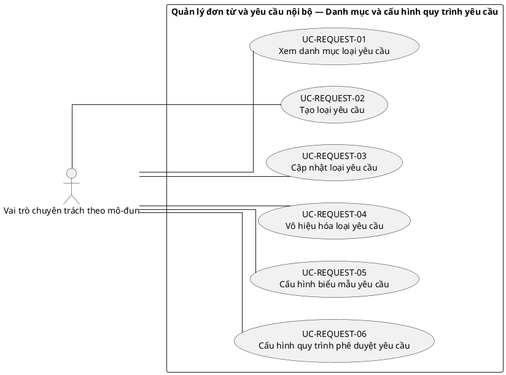
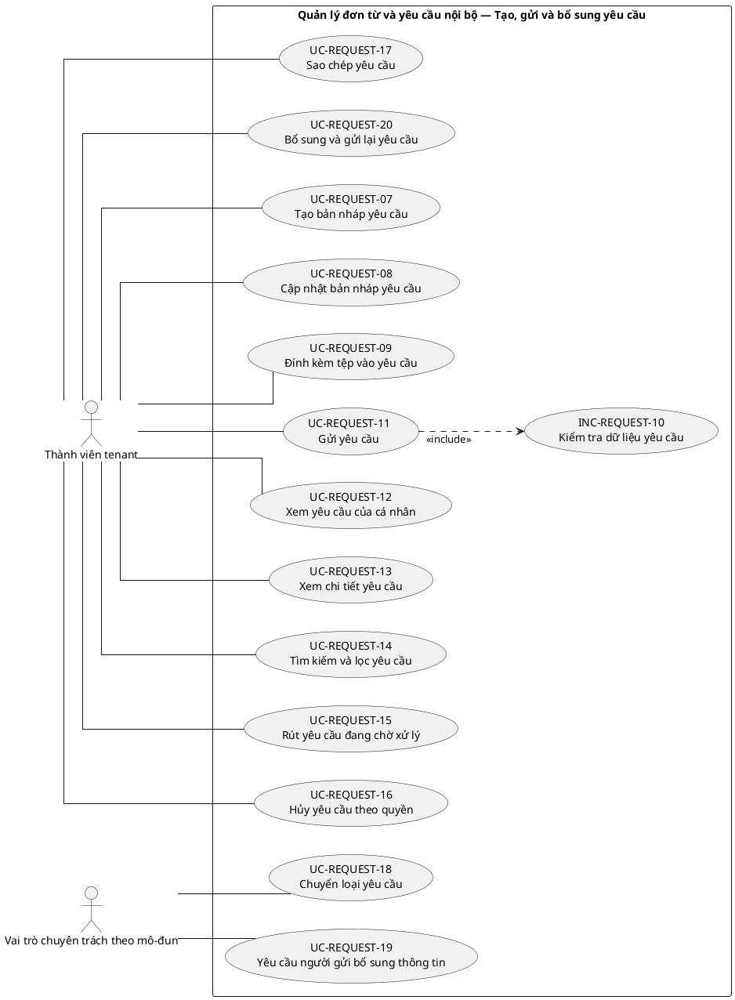
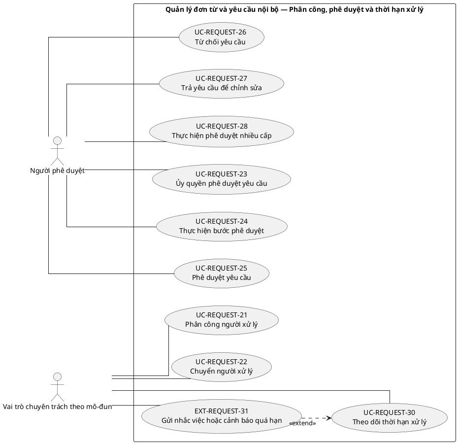
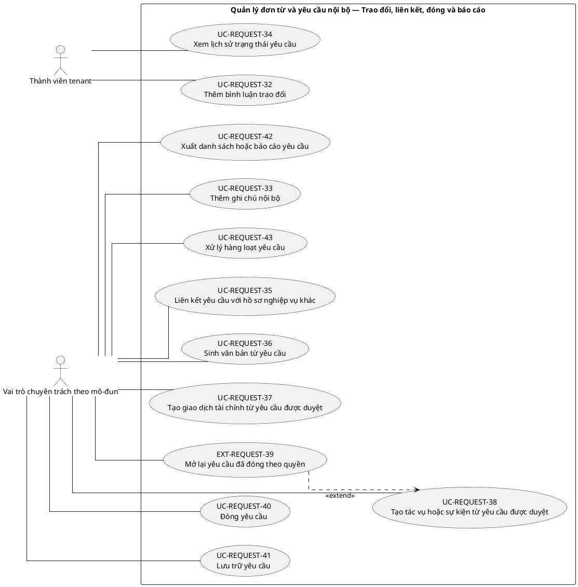

# UC-REQUEST — Quản lý đơn từ và yêu cầu nội bộ

## 1. Thông tin tài liệu

| Thuộc tính | Nội dung |
|---|---|
| Mã nhóm Use Case | `UC-REQUEST` |
| Tên | Quản lý đơn từ và yêu cầu nội bộ |
| Miền nghiệp vụ | Quy trình nghiệp vụ |
| Mức ưu tiên phát triển | Mô-đun vận hành |
| Phạm vi | Toàn bộ sản phẩm Operations Hub |
| Mô hình | SaaS đa tổ chức, dữ liệu và cấu hình theo tenant |
| Trạng thái đặc tả | Baseline V3; phân biệt Use Case mục tiêu, include, extend và yêu cầu hệ thống |

> **Nguyên tắc phạm vi:** tài liệu mô tả năng lực của phiên bản sản phẩm hoàn chỉnh. Mức ưu tiên phát triển không đồng nghĩa với loại bỏ khỏi phạm vi sản phẩm.

## 2. Mục tiêu

Số hóa vòng đời đơn từ và yêu cầu nội bộ từ khởi tạo, nộp, phê duyệt đến liên kết kết quả nghiệp vụ.

## 3. Actor

| Mã actor | Actor | Phạm vi |
|---|---|---|
| `ACT-TENANT-MEMBER` | Thành viên tenant | Tenant hoặc tích hợp |
| `ACT-MODULE-SPECIALIST` | Vai trò chuyên trách theo mô-đun | Tenant hoặc tích hợp |
| `ACT-APPROVER` | Người phê duyệt | Tenant hoặc tích hợp |

Actor trong sơ đồ chỉ thể hiện vai trò tương tác. Quyền thực tế phải được kiểm tra tại backend dựa trên tenant context, membership, role, permission, organization unit, trạng thái module và trạng thái tenant.

## 4. Điều kiện trước

- Module yêu cầu đã kích hoạt.
- Tenant đã cấu hình loại yêu cầu và workflow tương ứng.

## 5. Điều kiện sau

- Yêu cầu có trạng thái, lịch sử và quyết định phê duyệt rõ ràng.
- Kết quả có thể liên kết tài chính, văn bản hoặc nghiệp vụ khác.

## 6. Danh mục phần tử nghiệp vụ và phân loại UML

> **Thay đổi của V3:** Không coi toàn bộ danh mục chức năng là Use Case độc lập. Chỉ phần tử có mục tiêu quan sát được đối với actor được giữ mã `UC-*`. Hành vi bắt buộc dùng chung dùng mã `INC-*`; luồng điều kiện dùng mã `EXT-*`; quy tắc hoặc xử lý xuyên suốt dùng mã `REQ-*`. Mã V2 được giữ để truy vết.

> Actor chỉ nối trực tiếp với `UC-*` hoặc `EXT-*` mà actor thực sự khởi phát/tham gia. `INC-*` được nối bằng `<<include>>`; `REQ-*` không được vẽ như Use Case.

| Mã V3 | Mã V2 | Phần tử nghiệp vụ | Loại mô hình | Actor trực tiếp / nguồn kích hoạt | Quan hệ |
|---|---|---|---|---|---|
| `UC-REQUEST-01` | `UC-REQUEST-01` | Xem danh mục loại yêu cầu | Use Case mục tiêu actor | `ACT-MODULE-SPECIALIST` — Vai trò chuyên trách theo mô-đun | Association trực tiếp với actor |
| `UC-REQUEST-02` | `UC-REQUEST-02` | Tạo loại yêu cầu | Use Case mục tiêu actor | `ACT-MODULE-SPECIALIST` — Vai trò chuyên trách theo mô-đun | Association trực tiếp với actor |
| `UC-REQUEST-03` | `UC-REQUEST-03` | Cập nhật loại yêu cầu | Use Case mục tiêu actor | `ACT-MODULE-SPECIALIST` — Vai trò chuyên trách theo mô-đun | Association trực tiếp với actor |
| `UC-REQUEST-04` | `UC-REQUEST-04` | Vô hiệu hóa loại yêu cầu | Use Case mục tiêu actor | `ACT-MODULE-SPECIALIST` — Vai trò chuyên trách theo mô-đun | Association trực tiếp với actor |
| `UC-REQUEST-05` | `UC-REQUEST-05` | Cấu hình biểu mẫu yêu cầu | Use Case mục tiêu actor | `ACT-MODULE-SPECIALIST` — Vai trò chuyên trách theo mô-đun | Association trực tiếp với actor |
| `UC-REQUEST-06` | `UC-REQUEST-06` | Cấu hình quy trình phê duyệt yêu cầu | Use Case mục tiêu actor | `ACT-MODULE-SPECIALIST` — Vai trò chuyên trách theo mô-đun | Association trực tiếp với actor |
| `UC-REQUEST-07` | `UC-REQUEST-07` | Tạo bản nháp yêu cầu | Use Case mục tiêu actor | `ACT-TENANT-MEMBER` — Thành viên tenant | Association trực tiếp với actor |
| `UC-REQUEST-08` | `UC-REQUEST-08` | Cập nhật bản nháp yêu cầu | Use Case mục tiêu actor | `ACT-TENANT-MEMBER` — Thành viên tenant | Association trực tiếp với actor |
| `UC-REQUEST-09` | `UC-REQUEST-09` | Đính kèm tệp vào yêu cầu | Use Case mục tiêu actor | `ACT-TENANT-MEMBER` — Thành viên tenant | Association trực tiếp với actor |
| `INC-REQUEST-10` | `UC-REQUEST-10` | Kiểm tra dữ liệu yêu cầu | Hành vi dùng chung `<<include>>` | Hệ thống; được gọi từ Use Case cha | `UC-REQUEST-11` `<<include>>` `INC-REQUEST-10` |
| `UC-REQUEST-11` | `UC-REQUEST-11` | Gửi yêu cầu | Use Case mục tiêu actor | `ACT-TENANT-MEMBER` — Thành viên tenant | Association trực tiếp với actor |
| `UC-REQUEST-12` | `UC-REQUEST-12` | Xem yêu cầu của cá nhân | Use Case mục tiêu actor | `ACT-TENANT-MEMBER` — Thành viên tenant | Association trực tiếp với actor |
| `UC-REQUEST-13` | `UC-REQUEST-13` | Xem chi tiết yêu cầu | Use Case mục tiêu actor | `ACT-TENANT-MEMBER` — Thành viên tenant | Association trực tiếp với actor |
| `UC-REQUEST-14` | `UC-REQUEST-14` | Tìm kiếm và lọc yêu cầu | Use Case mục tiêu actor | `ACT-TENANT-MEMBER` — Thành viên tenant | Association trực tiếp với actor |
| `UC-REQUEST-15` | `UC-REQUEST-15` | Rút yêu cầu đang chờ xử lý | Use Case mục tiêu actor | `ACT-TENANT-MEMBER` — Thành viên tenant | Association trực tiếp với actor |
| `UC-REQUEST-16` | `UC-REQUEST-16` | Hủy yêu cầu theo quyền | Use Case mục tiêu actor | `ACT-TENANT-MEMBER` — Thành viên tenant | Association trực tiếp với actor |
| `UC-REQUEST-17` | `UC-REQUEST-17` | Sao chép yêu cầu | Use Case mục tiêu actor | `ACT-TENANT-MEMBER` — Thành viên tenant | Association trực tiếp với actor |
| `UC-REQUEST-18` | `UC-REQUEST-18` | Chuyển loại yêu cầu | Use Case mục tiêu actor | `ACT-MODULE-SPECIALIST` — Vai trò chuyên trách theo mô-đun | Association trực tiếp với actor |
| `UC-REQUEST-19` | `UC-REQUEST-19` | Yêu cầu người gửi bổ sung thông tin | Use Case mục tiêu actor | `ACT-MODULE-SPECIALIST` — Vai trò chuyên trách theo mô-đun | Association trực tiếp với actor |
| `UC-REQUEST-20` | `UC-REQUEST-20` | Bổ sung và gửi lại yêu cầu | Use Case mục tiêu actor | `ACT-TENANT-MEMBER` — Thành viên tenant | Association trực tiếp với actor |
| `UC-REQUEST-21` | `UC-REQUEST-21` | Phân công người xử lý | Use Case mục tiêu actor | `ACT-MODULE-SPECIALIST` — Vai trò chuyên trách theo mô-đun | Association trực tiếp với actor |
| `UC-REQUEST-22` | `UC-REQUEST-22` | Chuyển người xử lý | Use Case mục tiêu actor | `ACT-MODULE-SPECIALIST` — Vai trò chuyên trách theo mô-đun | Association trực tiếp với actor |
| `UC-REQUEST-23` | `UC-REQUEST-23` | Ủy quyền phê duyệt yêu cầu | Use Case mục tiêu actor | `ACT-APPROVER` — Người phê duyệt | Association trực tiếp với actor |
| `UC-REQUEST-24` | `UC-REQUEST-24` | Thực hiện bước phê duyệt | Use Case mục tiêu actor | `ACT-APPROVER` — Người phê duyệt | Association trực tiếp với actor |
| `UC-REQUEST-25` | `UC-REQUEST-25` | Phê duyệt yêu cầu | Use Case mục tiêu actor | `ACT-APPROVER` — Người phê duyệt | Association trực tiếp với actor |
| `UC-REQUEST-26` | `UC-REQUEST-26` | Từ chối yêu cầu | Use Case mục tiêu actor | `ACT-APPROVER` — Người phê duyệt | Association trực tiếp với actor |
| `UC-REQUEST-27` | `UC-REQUEST-27` | Trả yêu cầu để chỉnh sửa | Use Case mục tiêu actor | `ACT-APPROVER` — Người phê duyệt | Association trực tiếp với actor |
| `UC-REQUEST-28` | `UC-REQUEST-28` | Thực hiện phê duyệt nhiều cấp | Use Case mục tiêu actor | `ACT-APPROVER` — Người phê duyệt | Association trực tiếp với actor |
| `REQ-REQUEST-29` | `UC-REQUEST-29` | Kiểm tra nguyên tắc không tự phê duyệt | Quy tắc/yêu cầu hệ thống | Hệ thống/chính sách; không có association actor trực tiếp | Áp dụng như quy tắc/yêu cầu xuyên suốt; không nối actor trực tiếp |
| `UC-REQUEST-30` | `UC-REQUEST-30` | Theo dõi thời hạn xử lý | Use Case mục tiêu actor | `ACT-MODULE-SPECIALIST` — Vai trò chuyên trách theo mô-đun | Association trực tiếp với actor |
| `EXT-REQUEST-31` | `UC-REQUEST-31` | Gửi nhắc việc hoặc cảnh báo quá hạn | Luồng điều kiện `<<extend>>` | `ACT-MODULE-SPECIALIST` — Vai trò chuyên trách theo mô-đun | `EXT-REQUEST-31` `<<extend>>` `UC-REQUEST-30` |
| `UC-REQUEST-32` | `UC-REQUEST-32` | Thêm bình luận trao đổi | Use Case mục tiêu actor | `ACT-TENANT-MEMBER` — Thành viên tenant | Association trực tiếp với actor |
| `UC-REQUEST-33` | `UC-REQUEST-33` | Thêm ghi chú nội bộ | Use Case mục tiêu actor | `ACT-MODULE-SPECIALIST` — Vai trò chuyên trách theo mô-đun | Association trực tiếp với actor |
| `UC-REQUEST-34` | `UC-REQUEST-34` | Xem lịch sử trạng thái yêu cầu | Use Case mục tiêu actor | `ACT-TENANT-MEMBER` — Thành viên tenant | Association trực tiếp với actor |
| `UC-REQUEST-35` | `UC-REQUEST-35` | Liên kết yêu cầu với hồ sơ nghiệp vụ khác | Use Case mục tiêu actor | `ACT-MODULE-SPECIALIST` — Vai trò chuyên trách theo mô-đun | Association trực tiếp với actor |
| `UC-REQUEST-36` | `UC-REQUEST-36` | Sinh văn bản từ yêu cầu | Use Case mục tiêu actor | `ACT-MODULE-SPECIALIST` — Vai trò chuyên trách theo mô-đun | Association trực tiếp với actor |
| `UC-REQUEST-37` | `UC-REQUEST-37` | Tạo giao dịch tài chính từ yêu cầu được duyệt | Use Case mục tiêu actor | `ACT-MODULE-SPECIALIST` — Vai trò chuyên trách theo mô-đun | Association trực tiếp với actor |
| `UC-REQUEST-38` | `UC-REQUEST-38` | Tạo tác vụ hoặc sự kiện từ yêu cầu được duyệt | Use Case mục tiêu actor | `ACT-MODULE-SPECIALIST` — Vai trò chuyên trách theo mô-đun | Association trực tiếp với actor |
| `EXT-REQUEST-39` | `UC-REQUEST-39` | Mở lại yêu cầu đã đóng theo quyền | Luồng điều kiện `<<extend>>` | `ACT-MODULE-SPECIALIST` — Vai trò chuyên trách theo mô-đun | `EXT-REQUEST-39` `<<extend>>` `UC-REQUEST-38` |
| `UC-REQUEST-40` | `UC-REQUEST-40` | Đóng yêu cầu | Use Case mục tiêu actor | `ACT-MODULE-SPECIALIST` — Vai trò chuyên trách theo mô-đun | Association trực tiếp với actor |
| `UC-REQUEST-41` | `UC-REQUEST-41` | Lưu trữ yêu cầu | Use Case mục tiêu actor | `ACT-MODULE-SPECIALIST` — Vai trò chuyên trách theo mô-đun | Association trực tiếp với actor |
| `UC-REQUEST-42` | `UC-REQUEST-42` | Xuất danh sách hoặc báo cáo yêu cầu | Use Case mục tiêu actor | `ACT-MODULE-SPECIALIST` — Vai trò chuyên trách theo mô-đun | Association trực tiếp với actor |
| `UC-REQUEST-43` | `UC-REQUEST-43` | Xử lý hàng loạt yêu cầu | Use Case mục tiêu actor | `ACT-MODULE-SPECIALIST` — Vai trò chuyên trách theo mô-đun | Association trực tiếp với actor |

## 7. Luồng nghiệp vụ chính

1. Thành viên chọn loại yêu cầu và tạo bản nháp.
2. Hệ thống tải biểu mẫu theo tenant và kiểm tra trường bắt buộc.
3. Thành viên nộp yêu cầu; hệ thống xác định workflow và người xử lý.
4. Approver xem nội dung, minh chứng và lịch sử.
5. Approver phê duyệt hoặc yêu cầu bổ sung.
6. Khi phê duyệt cuối, hệ thống cập nhật trạng thái và tạo nghiệp vụ liên kết nếu được cấu hình.

## 8. Luồng thay thế và ngoại lệ

- Thiếu dữ liệu bắt buộc: không cho nộp.
- Approver ngoài phạm vi: từ chối.
- Yêu cầu đã được xử lý bởi người khác: trả xung đột trạng thái.
- Tạo nghiệp vụ liên kết thất bại: ghi trạng thái lỗi có thể xử lý lại, không lặp giao dịch.

## 9. Quy tắc nghiệp vụ cốt lõi

- Yêu cầu chỉ được xử lý trong tenant sở hữu.
- Không được duyệt lại yêu cầu đã hoàn tất nếu không có quy trình mở lại.
- Khi bật phân tách trách nhiệm, người tạo không được tự phê duyệt.
- Thay đổi workflow không được làm mất ý nghĩa của yêu cầu đang chạy.
- Quyết định phê duyệt phải lưu người thực hiện, thời điểm và ghi chú khi bắt buộc.

## 10. Mô hình dữ liệu logic liên quan

| Thực thể | Vai trò |
|---|---|
| `RequestType` | Thực thể logic phục vụ UC-REQUEST; thiết kế vật lý được xác định ở giai đoạn thiết kế dữ liệu. |
| `Request` | Thực thể logic phục vụ UC-REQUEST; thiết kế vật lý được xác định ở giai đoạn thiết kế dữ liệu. |
| `RequestFieldValue` | Thực thể logic phục vụ UC-REQUEST; thiết kế vật lý được xác định ở giai đoạn thiết kế dữ liệu. |
| `ApprovalWorkflow` | Thực thể logic phục vụ UC-REQUEST; thiết kế vật lý được xác định ở giai đoạn thiết kế dữ liệu. |
| `ApprovalStep` | Thực thể logic phục vụ UC-REQUEST; thiết kế vật lý được xác định ở giai đoạn thiết kế dữ liệu. |
| `ApprovalDecision` | Thực thể logic phục vụ UC-REQUEST; thiết kế vật lý được xác định ở giai đoạn thiết kế dữ liệu. |
| `Attachment` | Thực thể logic phục vụ UC-REQUEST; thiết kế vật lý được xác định ở giai đoạn thiết kế dữ liệu. |
| `LinkedBusinessObject` | Thực thể logic phục vụ UC-REQUEST; thiết kế vật lý được xác định ở giai đoạn thiết kế dữ liệu. |
| `AuditLog` | Thực thể logic phục vụ UC-REQUEST; thiết kế vật lý được xác định ở giai đoạn thiết kế dữ liệu. |

Mọi thực thể nghiệp vụ phải xác định được tenant sở hữu, trừ thực thể được công bố rõ là dữ liệu cấp nền tảng. Quan hệ tham chiếu chéo tenant bị cấm nếu không có cơ chế liên tenant được đặc tả riêng.

## 11. Kiểm soát truy cập

Quyền hiệu lực được xác định theo công thức khái quát:

```text
Quyền hiệu lực
= Permission từ các Role đang hoạt động
∩ Tenant context hợp lệ
∩ Membership đang hoạt động
∩ Phạm vi Organization Unit
∩ Phạm vi tài nguyên
∩ Trạng thái Module
∩ Trạng thái Tenant
```

Các kiểm tra bắt buộc:

- Xác thực User trước khi truy cập chức năng không công khai.
- Đối chiếu tenant context với membership.
- Kiểm tra permission tại backend, không dựa vào trạng thái hiển thị của frontend.
- Giới hạn truy vấn, tệp, bản xuất, cache và tác vụ nền theo tenant.
- Ghi audit cho hành động quản trị hoặc thay đổi nghiệp vụ quan trọng.

## 12. Tiêu chí chấp nhận

| Mã | Tiêu chí | Phương pháp kiểm chứng |
|---|---|---|
| `AC-REQUEST-01` | Yêu cầu mới ở trạng thái hợp lệ và có lịch sử. | Functional / Integration / Security Test tùy nội dung |
| `AC-REQUEST-02` | Người không có quyền không xem hoặc duyệt yêu cầu ngoài phạm vi. | Functional / Integration / Security Test tùy nội dung |
| `AC-REQUEST-03` | Không thể phê duyệt hai lần cùng một bước. | Functional / Integration / Security Test tùy nội dung |
| `AC-REQUEST-04` | Nghiệp vụ liên kết có khóa chống tạo trùng. | Functional / Integration / Security Test tùy nội dung |

## 13. Quan hệ với nhóm Use Case khác

[`UC-MEMBER`](./09_UC-MEMBER.md), [`UC-RBAC`](./04_UC-RBAC.md), [`UC-DOCUMENT`](./11_UC-DOCUMENT.md), [`UC-FINANCE`](./12_UC-FINANCE.md), [`UC-NOTIFICATION`](./18_UC-NOTIFICATION.md), [`UC-AUDIT`](./21_UC-AUDIT.md)

## 14. Use Case Diagram theo luồng nghiệp vụ

Các package/rectangle dưới đây chỉ là **ranh giới hệ thống hoặc miền nghiệp vụ**. Không tồn tại phần tử trung gian `PKG*`; actor liên kết trực tiếp với Use Case có mục tiêu nghiệp vụ. `INC-*` và `EXT-*` chỉ xuất hiện qua quan hệ UML tương ứng; `REQ-*` được trình bày ngoài sơ đồ.

### 14.1. Quy ước đọc sơ đồ

- `Actor -- UC-*`: actor trực tiếp thực hiện hoặc tham gia mục tiêu nghiệp vụ.
- `UC-* ..> INC-* : <<include>>`: hành vi bắt buộc được dùng lại.
- `EXT-* ..> UC-* : <<extend>>`: hành vi chỉ phát sinh trong điều kiện xác định.
- `REQ-*`: quy tắc/yêu cầu hệ thống, không phải Use Case và không nối actor.

### 14.2. Danh mục và cấu hình quy trình yêu cầu



### 14.3. Tạo, gửi và bổ sung yêu cầu



### 14.4. Phân công, phê duyệt và thời hạn xử lý



**Quy tắc/yêu cầu áp dụng cho luồng này:**
- `REQ-REQUEST-29` — Kiểm tra nguyên tắc không tự phê duyệt

### 14.5. Trao đổi, liên kết, đóng và báo cáo


