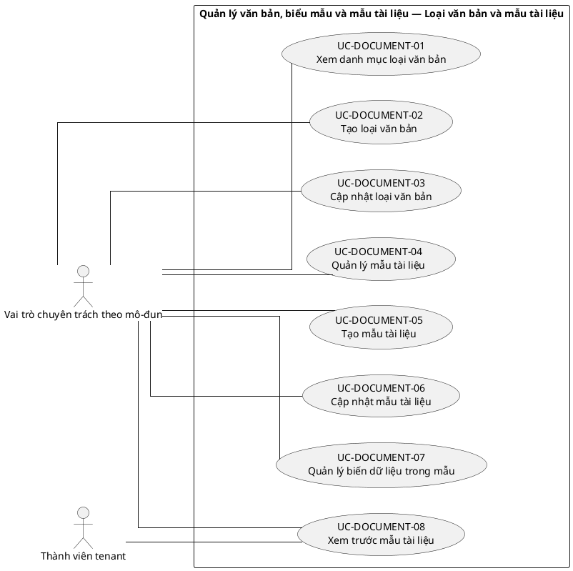
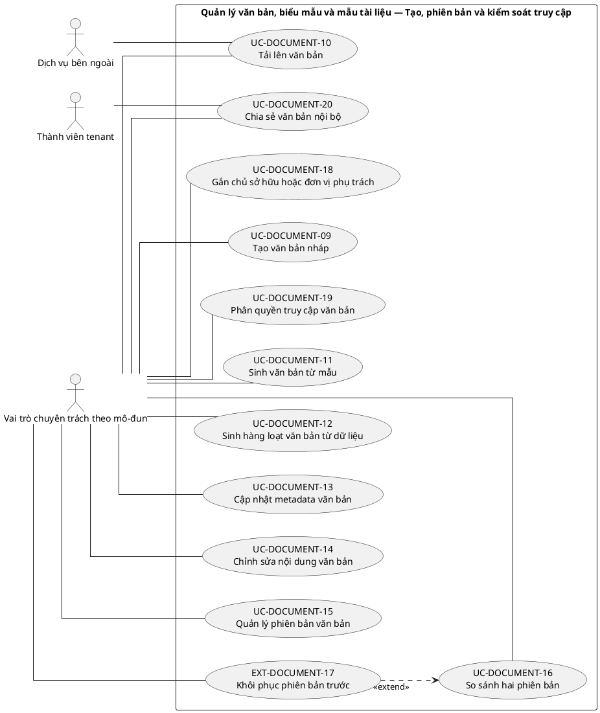
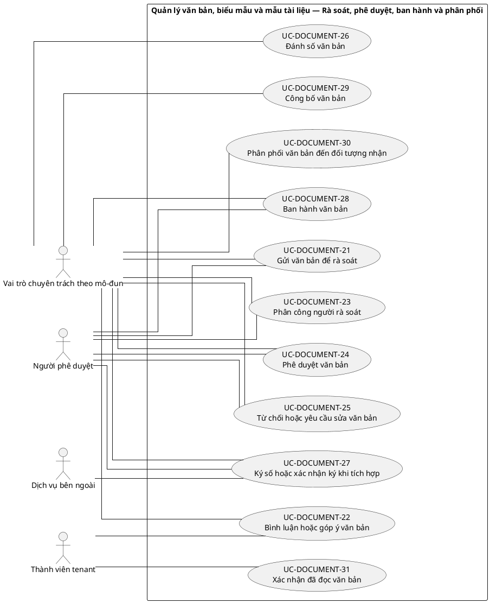
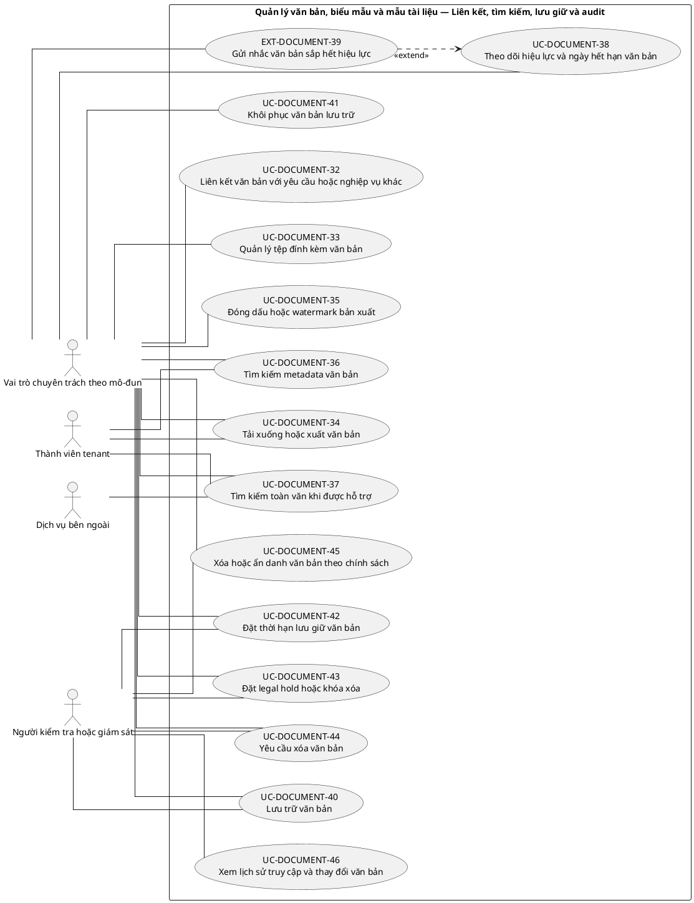

# UC-DOCUMENT — Quản lý văn bản, biểu mẫu và mẫu tài liệu

## 1. Thông tin tài liệu

| Thuộc tính | Nội dung |
|---|---|
| Mã nhóm Use Case | `UC-DOCUMENT` |
| Tên | Quản lý văn bản, biểu mẫu và mẫu tài liệu |
| Miền nghiệp vụ | Quản trị nội dung |
| Mức ưu tiên phát triển | Mô-đun vận hành |
| Phạm vi | Toàn bộ sản phẩm Operations Hub |
| Mô hình | SaaS đa tổ chức, dữ liệu và cấu hình theo tenant |
| Trạng thái đặc tả | Baseline V3; phân biệt Use Case mục tiêu, include, extend và yêu cầu hệ thống |

> **Nguyên tắc phạm vi:** tài liệu mô tả năng lực của phiên bản sản phẩm hoàn chỉnh. Mức ưu tiên phát triển không đồng nghĩa với loại bỏ khỏi phạm vi sản phẩm.

## 2. Mục tiêu

Quản lý vòng đời văn bản và biểu mẫu có phiên bản, số hiệu, quyền truy cập và bằng chứng phê duyệt.

## 3. Actor

| Mã actor | Actor | Phạm vi |
|---|---|---|
| `ACT-TENANT-MEMBER` | Thành viên tenant | Tenant hoặc tích hợp |
| `ACT-MODULE-SPECIALIST` | Vai trò chuyên trách theo mô-đun | Tenant hoặc tích hợp |
| `ACT-APPROVER` | Người phê duyệt | Tenant hoặc tích hợp |
| `ACT-AUDITOR` | Người kiểm tra hoặc giám sát | Tenant hoặc tích hợp |
| `ACT-EXTERNAL-SERVICE` | Dịch vụ bên ngoài | Tenant hoặc tích hợp |

Actor trong sơ đồ chỉ thể hiện vai trò tương tác. Quyền thực tế phải được kiểm tra tại backend dựa trên tenant context, membership, role, permission, organization unit, trạng thái module và trạng thái tenant.

## 4. Điều kiện trước

- Module văn bản đã kích hoạt.
- Kho lưu trữ tệp và chính sách dung lượng được cấu hình.

## 5. Điều kiện sau

- Văn bản có phiên bản chính thức xác định và lịch sử thay đổi.
- Tệp và metadata được cô lập theo tenant.

## 6. Danh mục phần tử nghiệp vụ và phân loại UML

> **Thay đổi của V3:** Không coi toàn bộ danh mục chức năng là Use Case độc lập. Chỉ phần tử có mục tiêu quan sát được đối với actor được giữ mã `UC-*`. Hành vi bắt buộc dùng chung dùng mã `INC-*`; luồng điều kiện dùng mã `EXT-*`; quy tắc hoặc xử lý xuyên suốt dùng mã `REQ-*`. Mã V2 được giữ để truy vết.

> Actor chỉ nối trực tiếp với `UC-*` hoặc `EXT-*` mà actor thực sự khởi phát/tham gia. `INC-*` được nối bằng `<<include>>`; `REQ-*` không được vẽ như Use Case.

| Mã V3 | Mã V2 | Phần tử nghiệp vụ | Loại mô hình | Actor trực tiếp / nguồn kích hoạt | Quan hệ |
|---|---|---|---|---|---|
| `UC-DOCUMENT-01` | `UC-DOCUMENT-01` | Xem danh mục loại văn bản | Use Case mục tiêu actor | `ACT-MODULE-SPECIALIST` — Vai trò chuyên trách theo mô-đun | Association trực tiếp với actor |
| `UC-DOCUMENT-02` | `UC-DOCUMENT-02` | Tạo loại văn bản | Use Case mục tiêu actor | `ACT-MODULE-SPECIALIST` — Vai trò chuyên trách theo mô-đun | Association trực tiếp với actor |
| `UC-DOCUMENT-03` | `UC-DOCUMENT-03` | Cập nhật loại văn bản | Use Case mục tiêu actor | `ACT-MODULE-SPECIALIST` — Vai trò chuyên trách theo mô-đun | Association trực tiếp với actor |
| `UC-DOCUMENT-04` | `UC-DOCUMENT-04` | Quản lý mẫu tài liệu | Use Case mục tiêu actor | `ACT-MODULE-SPECIALIST` — Vai trò chuyên trách theo mô-đun | Association trực tiếp với actor |
| `UC-DOCUMENT-05` | `UC-DOCUMENT-05` | Tạo mẫu tài liệu | Use Case mục tiêu actor | `ACT-MODULE-SPECIALIST` — Vai trò chuyên trách theo mô-đun | Association trực tiếp với actor |
| `UC-DOCUMENT-06` | `UC-DOCUMENT-06` | Cập nhật mẫu tài liệu | Use Case mục tiêu actor | `ACT-MODULE-SPECIALIST` — Vai trò chuyên trách theo mô-đun | Association trực tiếp với actor |
| `UC-DOCUMENT-07` | `UC-DOCUMENT-07` | Quản lý biến dữ liệu trong mẫu | Use Case mục tiêu actor | `ACT-MODULE-SPECIALIST` — Vai trò chuyên trách theo mô-đun | Association trực tiếp với actor |
| `UC-DOCUMENT-08` | `UC-DOCUMENT-08` | Xem trước mẫu tài liệu | Use Case mục tiêu actor | `ACT-MODULE-SPECIALIST` — Vai trò chuyên trách theo mô-đun<br>`ACT-TENANT-MEMBER` — Thành viên tenant | Association trực tiếp với actor |
| `UC-DOCUMENT-09` | `UC-DOCUMENT-09` | Tạo văn bản nháp | Use Case mục tiêu actor | `ACT-MODULE-SPECIALIST` — Vai trò chuyên trách theo mô-đun | Association trực tiếp với actor |
| `UC-DOCUMENT-10` | `UC-DOCUMENT-10` | Tải lên văn bản | Use Case mục tiêu actor | `ACT-MODULE-SPECIALIST` — Vai trò chuyên trách theo mô-đun<br>`ACT-EXTERNAL-SERVICE` — Dịch vụ bên ngoài | Association trực tiếp với actor |
| `UC-DOCUMENT-11` | `UC-DOCUMENT-11` | Sinh văn bản từ mẫu | Use Case mục tiêu actor | `ACT-MODULE-SPECIALIST` — Vai trò chuyên trách theo mô-đun | Association trực tiếp với actor |
| `UC-DOCUMENT-12` | `UC-DOCUMENT-12` | Sinh hàng loạt văn bản từ dữ liệu | Use Case mục tiêu actor | `ACT-MODULE-SPECIALIST` — Vai trò chuyên trách theo mô-đun | Association trực tiếp với actor |
| `UC-DOCUMENT-13` | `UC-DOCUMENT-13` | Cập nhật metadata văn bản | Use Case mục tiêu actor | `ACT-MODULE-SPECIALIST` — Vai trò chuyên trách theo mô-đun | Association trực tiếp với actor |
| `UC-DOCUMENT-14` | `UC-DOCUMENT-14` | Chỉnh sửa nội dung văn bản | Use Case mục tiêu actor | `ACT-MODULE-SPECIALIST` — Vai trò chuyên trách theo mô-đun | Association trực tiếp với actor |
| `UC-DOCUMENT-15` | `UC-DOCUMENT-15` | Quản lý phiên bản văn bản | Use Case mục tiêu actor | `ACT-MODULE-SPECIALIST` — Vai trò chuyên trách theo mô-đun | Association trực tiếp với actor |
| `UC-DOCUMENT-16` | `UC-DOCUMENT-16` | So sánh hai phiên bản | Use Case mục tiêu actor | `ACT-MODULE-SPECIALIST` — Vai trò chuyên trách theo mô-đun | Association trực tiếp với actor |
| `EXT-DOCUMENT-17` | `UC-DOCUMENT-17` | Khôi phục phiên bản trước | Luồng điều kiện `<<extend>>` | `ACT-MODULE-SPECIALIST` — Vai trò chuyên trách theo mô-đun | `EXT-DOCUMENT-17` `<<extend>>` `UC-DOCUMENT-16` |
| `UC-DOCUMENT-18` | `UC-DOCUMENT-18` | Gắn chủ sở hữu hoặc đơn vị phụ trách | Use Case mục tiêu actor | `ACT-MODULE-SPECIALIST` — Vai trò chuyên trách theo mô-đun | Association trực tiếp với actor |
| `UC-DOCUMENT-19` | `UC-DOCUMENT-19` | Phân quyền truy cập văn bản | Use Case mục tiêu actor | `ACT-MODULE-SPECIALIST` — Vai trò chuyên trách theo mô-đun | Association trực tiếp với actor |
| `UC-DOCUMENT-20` | `UC-DOCUMENT-20` | Chia sẻ văn bản nội bộ | Use Case mục tiêu actor | `ACT-MODULE-SPECIALIST` — Vai trò chuyên trách theo mô-đun<br>`ACT-TENANT-MEMBER` — Thành viên tenant | Association trực tiếp với actor |
| `UC-DOCUMENT-21` | `UC-DOCUMENT-21` | Gửi văn bản để rà soát | Use Case mục tiêu actor | `ACT-MODULE-SPECIALIST` — Vai trò chuyên trách theo mô-đun<br>`ACT-APPROVER` — Người phê duyệt | Association trực tiếp với actor |
| `UC-DOCUMENT-22` | `UC-DOCUMENT-22` | Bình luận hoặc góp ý văn bản | Use Case mục tiêu actor | `ACT-MODULE-SPECIALIST` — Vai trò chuyên trách theo mô-đun<br>`ACT-TENANT-MEMBER` — Thành viên tenant | Association trực tiếp với actor |
| `UC-DOCUMENT-23` | `UC-DOCUMENT-23` | Phân công người rà soát | Use Case mục tiêu actor | `ACT-MODULE-SPECIALIST` — Vai trò chuyên trách theo mô-đun<br>`ACT-APPROVER` — Người phê duyệt | Association trực tiếp với actor |
| `UC-DOCUMENT-24` | `UC-DOCUMENT-24` | Phê duyệt văn bản | Use Case mục tiêu actor | `ACT-MODULE-SPECIALIST` — Vai trò chuyên trách theo mô-đun<br>`ACT-APPROVER` — Người phê duyệt | Association trực tiếp với actor |
| `UC-DOCUMENT-25` | `UC-DOCUMENT-25` | Từ chối hoặc yêu cầu sửa văn bản | Use Case mục tiêu actor | `ACT-MODULE-SPECIALIST` — Vai trò chuyên trách theo mô-đun<br>`ACT-APPROVER` — Người phê duyệt | Association trực tiếp với actor |
| `UC-DOCUMENT-26` | `UC-DOCUMENT-26` | Đánh số văn bản | Use Case mục tiêu actor | `ACT-MODULE-SPECIALIST` — Vai trò chuyên trách theo mô-đun | Association trực tiếp với actor |
| `UC-DOCUMENT-27` | `UC-DOCUMENT-27` | Ký số hoặc xác nhận ký khi tích hợp | Use Case mục tiêu actor | `ACT-MODULE-SPECIALIST` — Vai trò chuyên trách theo mô-đun<br>`ACT-APPROVER` — Người phê duyệt<br>`ACT-EXTERNAL-SERVICE` — Dịch vụ bên ngoài | Association trực tiếp với actor |
| `UC-DOCUMENT-28` | `UC-DOCUMENT-28` | Ban hành văn bản | Use Case mục tiêu actor | `ACT-MODULE-SPECIALIST` — Vai trò chuyên trách theo mô-đun<br>`ACT-APPROVER` — Người phê duyệt | Association trực tiếp với actor |
| `UC-DOCUMENT-29` | `UC-DOCUMENT-29` | Công bố văn bản | Use Case mục tiêu actor | `ACT-MODULE-SPECIALIST` — Vai trò chuyên trách theo mô-đun | Association trực tiếp với actor |
| `UC-DOCUMENT-30` | `UC-DOCUMENT-30` | Phân phối văn bản đến đối tượng nhận | Use Case mục tiêu actor | `ACT-MODULE-SPECIALIST` — Vai trò chuyên trách theo mô-đun | Association trực tiếp với actor |
| `UC-DOCUMENT-31` | `UC-DOCUMENT-31` | Xác nhận đã đọc văn bản | Use Case mục tiêu actor | `ACT-TENANT-MEMBER` — Thành viên tenant | Association trực tiếp với actor |
| `UC-DOCUMENT-32` | `UC-DOCUMENT-32` | Liên kết văn bản với yêu cầu hoặc nghiệp vụ khác | Use Case mục tiêu actor | `ACT-MODULE-SPECIALIST` — Vai trò chuyên trách theo mô-đun | Association trực tiếp với actor |
| `UC-DOCUMENT-33` | `UC-DOCUMENT-33` | Quản lý tệp đính kèm văn bản | Use Case mục tiêu actor | `ACT-MODULE-SPECIALIST` — Vai trò chuyên trách theo mô-đun | Association trực tiếp với actor |
| `UC-DOCUMENT-34` | `UC-DOCUMENT-34` | Tải xuống hoặc xuất văn bản | Use Case mục tiêu actor | `ACT-MODULE-SPECIALIST` — Vai trò chuyên trách theo mô-đun<br>`ACT-TENANT-MEMBER` — Thành viên tenant | Association trực tiếp với actor |
| `UC-DOCUMENT-35` | `UC-DOCUMENT-35` | Đóng dấu hoặc watermark bản xuất | Use Case mục tiêu actor | `ACT-MODULE-SPECIALIST` — Vai trò chuyên trách theo mô-đun | Association trực tiếp với actor |
| `UC-DOCUMENT-36` | `UC-DOCUMENT-36` | Tìm kiếm metadata văn bản | Use Case mục tiêu actor | `ACT-MODULE-SPECIALIST` — Vai trò chuyên trách theo mô-đun<br>`ACT-TENANT-MEMBER` — Thành viên tenant | Association trực tiếp với actor |
| `UC-DOCUMENT-37` | `UC-DOCUMENT-37` | Tìm kiếm toàn văn khi được hỗ trợ | Use Case mục tiêu actor | `ACT-MODULE-SPECIALIST` — Vai trò chuyên trách theo mô-đun<br>`ACT-TENANT-MEMBER` — Thành viên tenant<br>`ACT-EXTERNAL-SERVICE` — Dịch vụ bên ngoài | Association trực tiếp với actor |
| `UC-DOCUMENT-38` | `UC-DOCUMENT-38` | Theo dõi hiệu lực và ngày hết hạn văn bản | Use Case mục tiêu actor | `ACT-MODULE-SPECIALIST` — Vai trò chuyên trách theo mô-đun | Association trực tiếp với actor |
| `EXT-DOCUMENT-39` | `UC-DOCUMENT-39` | Gửi nhắc văn bản sắp hết hiệu lực | Luồng điều kiện `<<extend>>` | `ACT-MODULE-SPECIALIST` — Vai trò chuyên trách theo mô-đun | `EXT-DOCUMENT-39` `<<extend>>` `UC-DOCUMENT-38` |
| `UC-DOCUMENT-40` | `UC-DOCUMENT-40` | Lưu trữ văn bản | Use Case mục tiêu actor | `ACT-MODULE-SPECIALIST` — Vai trò chuyên trách theo mô-đun<br>`ACT-AUDITOR` — Người kiểm tra hoặc giám sát | Association trực tiếp với actor |
| `UC-DOCUMENT-41` | `UC-DOCUMENT-41` | Khôi phục văn bản lưu trữ | Use Case mục tiêu actor | `ACT-MODULE-SPECIALIST` — Vai trò chuyên trách theo mô-đun | Association trực tiếp với actor |
| `UC-DOCUMENT-42` | `UC-DOCUMENT-42` | Đặt thời hạn lưu giữ văn bản | Use Case mục tiêu actor | `ACT-MODULE-SPECIALIST` — Vai trò chuyên trách theo mô-đun<br>`ACT-AUDITOR` — Người kiểm tra hoặc giám sát | Association trực tiếp với actor |
| `UC-DOCUMENT-43` | `UC-DOCUMENT-43` | Đặt legal hold hoặc khóa xóa | Use Case mục tiêu actor | `ACT-MODULE-SPECIALIST` — Vai trò chuyên trách theo mô-đun<br>`ACT-AUDITOR` — Người kiểm tra hoặc giám sát | Association trực tiếp với actor |
| `UC-DOCUMENT-44` | `UC-DOCUMENT-44` | Yêu cầu xóa văn bản | Use Case mục tiêu actor | `ACT-MODULE-SPECIALIST` — Vai trò chuyên trách theo mô-đun<br>`ACT-AUDITOR` — Người kiểm tra hoặc giám sát | Association trực tiếp với actor |
| `UC-DOCUMENT-45` | `UC-DOCUMENT-45` | Xóa hoặc ẩn danh văn bản theo chính sách | Use Case mục tiêu actor | `ACT-MODULE-SPECIALIST` — Vai trò chuyên trách theo mô-đun<br>`ACT-AUDITOR` — Người kiểm tra hoặc giám sát | Association trực tiếp với actor |
| `UC-DOCUMENT-46` | `UC-DOCUMENT-46` | Xem lịch sử truy cập và thay đổi văn bản | Use Case mục tiêu actor | `ACT-AUDITOR` — Người kiểm tra hoặc giám sát | Association trực tiếp với actor |

## 7. Luồng nghiệp vụ chính

1. Document Officer chọn mẫu hoặc tải tệp nguồn.
2. Hệ thống tạo bản nháp và metadata trong tenant.
3. Người dùng chỉnh sửa, tạo phiên bản và gửi duyệt.
4. Approver xem bản cụ thể và ra quyết định.
5. Hệ thống cấp số, khóa phiên bản ban hành và ghi ngày hiệu lực.
6. Văn bản được phân phối theo đối tượng; lịch sử và xác nhận được ghi nhận.

## 8. Luồng thay thế và ngoại lệ

- Số văn bản trùng: tạo lại theo cơ chế khóa hoặc từ chối.
- Tệp không an toàn: cách ly hoặc từ chối.
- Approver duyệt phiên bản cũ: từ chối và yêu cầu tải bản hiện hành.
- Kho lưu trữ lỗi: giữ metadata ở trạng thái chưa hoàn tất, không công bố văn bản rỗng.

## 9. Quy tắc nghiệp vụ cốt lõi

- Mỗi văn bản thuộc đúng một tenant.
- Văn bản chính thức phải chỉ rõ phiên bản đang hiệu lực.
- Số văn bản phải tuân theo phạm vi duy nhất đã cấu hình.
- Thu hồi hoặc lưu trữ không xóa lịch sử và bằng chứng phê duyệt.
- Tệp phải được kiểm tra loại, kích thước, mã độc và quyền truy cập.

## 10. Mô hình dữ liệu logic liên quan

| Thực thể | Vai trò |
|---|---|
| `DocumentType` | Thực thể logic phục vụ UC-DOCUMENT; thiết kế vật lý được xác định ở giai đoạn thiết kế dữ liệu. |
| `DocumentTemplate` | Thực thể logic phục vụ UC-DOCUMENT; thiết kế vật lý được xác định ở giai đoạn thiết kế dữ liệu. |
| `Document` | Thực thể logic phục vụ UC-DOCUMENT; thiết kế vật lý được xác định ở giai đoạn thiết kế dữ liệu. |
| `DocumentVersion` | Thực thể logic phục vụ UC-DOCUMENT; thiết kế vật lý được xác định ở giai đoạn thiết kế dữ liệu. |
| `DocumentNumberSequence` | Thực thể logic phục vụ UC-DOCUMENT; thiết kế vật lý được xác định ở giai đoạn thiết kế dữ liệu. |
| `ApprovalDecision` | Thực thể logic phục vụ UC-DOCUMENT; thiết kế vật lý được xác định ở giai đoạn thiết kế dữ liệu. |
| `DocumentRecipient` | Thực thể logic phục vụ UC-DOCUMENT; thiết kế vật lý được xác định ở giai đoạn thiết kế dữ liệu. |
| `ReadReceipt` | Thực thể logic phục vụ UC-DOCUMENT; thiết kế vật lý được xác định ở giai đoạn thiết kế dữ liệu. |
| `Attachment` | Thực thể logic phục vụ UC-DOCUMENT; thiết kế vật lý được xác định ở giai đoạn thiết kế dữ liệu. |
| `AuditLog` | Thực thể logic phục vụ UC-DOCUMENT; thiết kế vật lý được xác định ở giai đoạn thiết kế dữ liệu. |

Mọi thực thể nghiệp vụ phải xác định được tenant sở hữu, trừ thực thể được công bố rõ là dữ liệu cấp nền tảng. Quan hệ tham chiếu chéo tenant bị cấm nếu không có cơ chế liên tenant được đặc tả riêng.

## 11. Kiểm soát truy cập

Quyền hiệu lực được xác định theo công thức khái quát:

```text
Quyền hiệu lực
= Permission từ các Role đang hoạt động
∩ Tenant context hợp lệ
∩ Membership đang hoạt động
∩ Phạm vi Organization Unit
∩ Phạm vi tài nguyên
∩ Trạng thái Module
∩ Trạng thái Tenant
```

Các kiểm tra bắt buộc:

- Xác thực User trước khi truy cập chức năng không công khai.
- Đối chiếu tenant context với membership.
- Kiểm tra permission tại backend, không dựa vào trạng thái hiển thị của frontend.
- Giới hạn truy vấn, tệp, bản xuất, cache và tác vụ nền theo tenant.
- Ghi audit cho hành động quản trị hoặc thay đổi nghiệp vụ quan trọng.

## 12. Tiêu chí chấp nhận

| Mã | Tiêu chí | Phương pháp kiểm chứng |
|---|---|---|
| `AC-DOCUMENT-01` | Một văn bản ban hành luôn tham chiếu đúng phiên bản đã duyệt. | Functional / Integration / Security Test tùy nội dung |
| `AC-DOCUMENT-02` | Không tải được tệp của tenant khác bằng cách thay ID. | Functional / Integration / Security Test tùy nội dung |
| `AC-DOCUMENT-03` | Cấp số đồng thời không tạo trùng. | Functional / Integration / Security Test tùy nội dung |
| `AC-DOCUMENT-04` | Thu hồi văn bản không xóa lịch sử phát hành. | Functional / Integration / Security Test tùy nội dung |

## 13. Quan hệ với nhóm Use Case khác

[`UC-RBAC`](./04_UC-RBAC.md), [`UC-REQUEST`](./10_UC-REQUEST.md), [`UC-NOTIFICATION`](./18_UC-NOTIFICATION.md), [`UC-AUDIT`](./21_UC-AUDIT.md)

## 14. Use Case Diagram theo luồng nghiệp vụ

Các package/rectangle dưới đây chỉ là **ranh giới hệ thống hoặc miền nghiệp vụ**. Không tồn tại phần tử trung gian `PKG*`; actor liên kết trực tiếp với Use Case có mục tiêu nghiệp vụ. `INC-*` và `EXT-*` chỉ xuất hiện qua quan hệ UML tương ứng; `REQ-*` được trình bày ngoài sơ đồ.

### 14.1. Quy ước đọc sơ đồ

- `Actor -- UC-*`: actor trực tiếp thực hiện hoặc tham gia mục tiêu nghiệp vụ.
- `UC-* ..> INC-* : <<include>>`: hành vi bắt buộc được dùng lại.
- `EXT-* ..> UC-* : <<extend>>`: hành vi chỉ phát sinh trong điều kiện xác định.
- `REQ-*`: quy tắc/yêu cầu hệ thống, không phải Use Case và không nối actor.

### 14.2. Loại văn bản và mẫu tài liệu



### 14.3. Tạo, phiên bản và kiểm soát truy cập



### 14.4. Rà soát, phê duyệt, ban hành và phân phối



### 14.5. Liên kết, tìm kiếm, lưu giữ và audit


