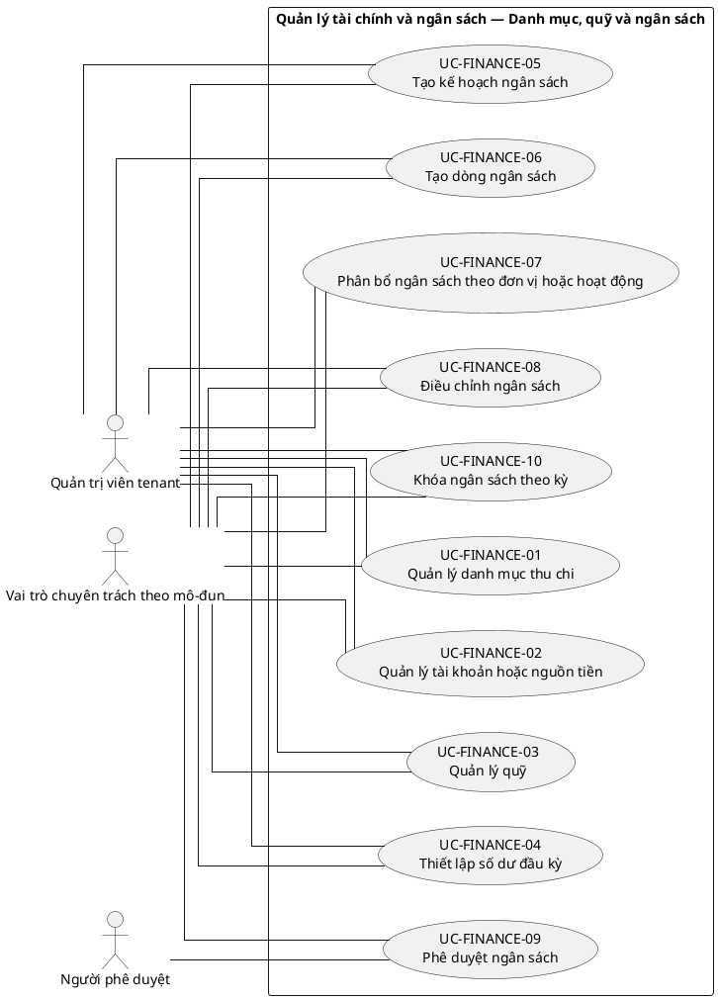
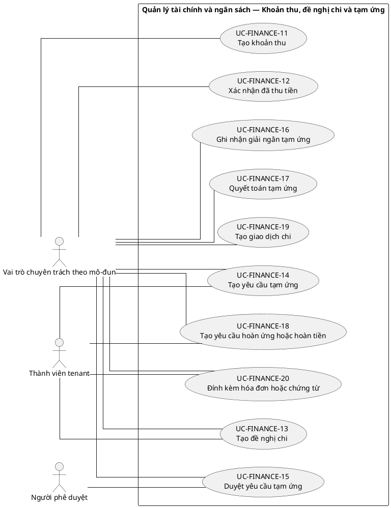
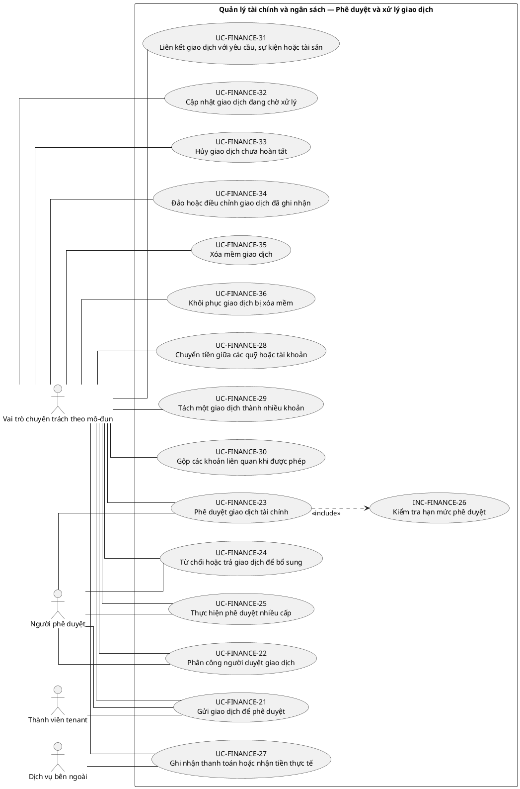
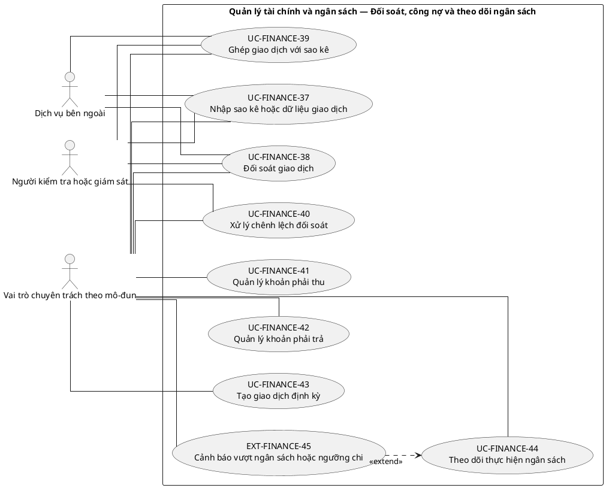
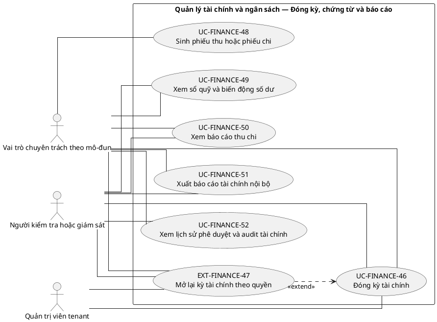

# UC-FINANCE — Quản lý tài chính và ngân sách

## 1. Thông tin tài liệu

| Thuộc tính | Nội dung |
|---|---|
| Mã nhóm Use Case | `UC-FINANCE` |
| Tên | Quản lý tài chính và ngân sách |
| Miền nghiệp vụ | Tài chính nội bộ |
| Mức ưu tiên phát triển | Mô-đun vận hành |
| Phạm vi | Toàn bộ sản phẩm Operations Hub |
| Mô hình | SaaS đa tổ chức, dữ liệu và cấu hình theo tenant |
| Trạng thái đặc tả | Baseline V3; phân biệt Use Case mục tiêu, include, extend và yêu cầu hệ thống |

> **Nguyên tắc phạm vi:** tài liệu mô tả năng lực của phiên bản sản phẩm hoàn chỉnh. Mức ưu tiên phát triển không đồng nghĩa với loại bỏ khỏi phạm vi sản phẩm.

## 2. Mục tiêu

Quản lý quỹ, ngân sách, giao dịch thu chi, phê duyệt, chứng từ và báo cáo tài chính nội bộ theo tenant.

## 3. Actor

| Mã actor | Actor | Phạm vi |
|---|---|---|
| `ACT-TENANT-MEMBER` | Thành viên tenant | Tenant hoặc tích hợp |
| `ACT-MODULE-SPECIALIST` | Vai trò chuyên trách theo mô-đun | Tenant hoặc tích hợp |
| `ACT-APPROVER` | Người phê duyệt | Tenant hoặc tích hợp |
| `ACT-TENANT-ADMIN` | Quản trị viên tenant | Tenant hoặc tích hợp |
| `ACT-AUDITOR` | Người kiểm tra hoặc giám sát | Tenant hoặc tích hợp |
| `ACT-EXTERNAL-SERVICE` | Dịch vụ bên ngoài | Tenant hoặc tích hợp |

Actor trong sơ đồ chỉ thể hiện vai trò tương tác. Quyền thực tế phải được kiểm tra tại backend dựa trên tenant context, membership, role, permission, organization unit, trạng thái module và trạng thái tenant.

## 4. Điều kiện trước

- Module tài chính đã kích hoạt.
- Danh mục quỹ, tài khoản, loại giao dịch và quyền phê duyệt đã cấu hình.

## 5. Điều kiện sau

- Giao dịch có trạng thái, chứng từ và lịch sử phê duyệt rõ ràng.
- Số liệu tổng hợp truy ngược được về giao dịch nguồn.

## 6. Danh mục phần tử nghiệp vụ và phân loại UML

> **Thay đổi của V3:** Không coi toàn bộ danh mục chức năng là Use Case độc lập. Chỉ phần tử có mục tiêu quan sát được đối với actor được giữ mã `UC-*`. Hành vi bắt buộc dùng chung dùng mã `INC-*`; luồng điều kiện dùng mã `EXT-*`; quy tắc hoặc xử lý xuyên suốt dùng mã `REQ-*`. Mã V2 được giữ để truy vết.

> Actor chỉ nối trực tiếp với `UC-*` hoặc `EXT-*` mà actor thực sự khởi phát/tham gia. `INC-*` được nối bằng `<<include>>`; `REQ-*` không được vẽ như Use Case.

| Mã V3 | Mã V2 | Phần tử nghiệp vụ | Loại mô hình | Actor trực tiếp / nguồn kích hoạt | Quan hệ |
|---|---|---|---|---|---|
| `UC-FINANCE-01` | `UC-FINANCE-01` | Quản lý danh mục thu chi | Use Case mục tiêu actor | `ACT-MODULE-SPECIALIST` — Vai trò chuyên trách theo mô-đun<br>`ACT-TENANT-ADMIN` — Quản trị viên tenant | Association trực tiếp với actor |
| `UC-FINANCE-02` | `UC-FINANCE-02` | Quản lý tài khoản hoặc nguồn tiền | Use Case mục tiêu actor | `ACT-MODULE-SPECIALIST` — Vai trò chuyên trách theo mô-đun<br>`ACT-TENANT-ADMIN` — Quản trị viên tenant | Association trực tiếp với actor |
| `UC-FINANCE-03` | `UC-FINANCE-03` | Quản lý quỹ | Use Case mục tiêu actor | `ACT-MODULE-SPECIALIST` — Vai trò chuyên trách theo mô-đun<br>`ACT-TENANT-ADMIN` — Quản trị viên tenant | Association trực tiếp với actor |
| `UC-FINANCE-04` | `UC-FINANCE-04` | Thiết lập số dư đầu kỳ | Use Case mục tiêu actor | `ACT-MODULE-SPECIALIST` — Vai trò chuyên trách theo mô-đun<br>`ACT-TENANT-ADMIN` — Quản trị viên tenant | Association trực tiếp với actor |
| `UC-FINANCE-05` | `UC-FINANCE-05` | Tạo kế hoạch ngân sách | Use Case mục tiêu actor | `ACT-MODULE-SPECIALIST` — Vai trò chuyên trách theo mô-đun<br>`ACT-TENANT-ADMIN` — Quản trị viên tenant | Association trực tiếp với actor |
| `UC-FINANCE-06` | `UC-FINANCE-06` | Tạo dòng ngân sách | Use Case mục tiêu actor | `ACT-MODULE-SPECIALIST` — Vai trò chuyên trách theo mô-đun<br>`ACT-TENANT-ADMIN` — Quản trị viên tenant | Association trực tiếp với actor |
| `UC-FINANCE-07` | `UC-FINANCE-07` | Phân bổ ngân sách theo đơn vị hoặc hoạt động | Use Case mục tiêu actor | `ACT-MODULE-SPECIALIST` — Vai trò chuyên trách theo mô-đun<br>`ACT-TENANT-ADMIN` — Quản trị viên tenant | Association trực tiếp với actor |
| `UC-FINANCE-08` | `UC-FINANCE-08` | Điều chỉnh ngân sách | Use Case mục tiêu actor | `ACT-MODULE-SPECIALIST` — Vai trò chuyên trách theo mô-đun<br>`ACT-TENANT-ADMIN` — Quản trị viên tenant | Association trực tiếp với actor |
| `UC-FINANCE-09` | `UC-FINANCE-09` | Phê duyệt ngân sách | Use Case mục tiêu actor | `ACT-MODULE-SPECIALIST` — Vai trò chuyên trách theo mô-đun<br>`ACT-APPROVER` — Người phê duyệt | Association trực tiếp với actor |
| `UC-FINANCE-10` | `UC-FINANCE-10` | Khóa ngân sách theo kỳ | Use Case mục tiêu actor | `ACT-MODULE-SPECIALIST` — Vai trò chuyên trách theo mô-đun<br>`ACT-TENANT-ADMIN` — Quản trị viên tenant | Association trực tiếp với actor |
| `UC-FINANCE-11` | `UC-FINANCE-11` | Tạo khoản thu | Use Case mục tiêu actor | `ACT-MODULE-SPECIALIST` — Vai trò chuyên trách theo mô-đun | Association trực tiếp với actor |
| `UC-FINANCE-12` | `UC-FINANCE-12` | Xác nhận đã thu tiền | Use Case mục tiêu actor | `ACT-MODULE-SPECIALIST` — Vai trò chuyên trách theo mô-đun | Association trực tiếp với actor |
| `UC-FINANCE-13` | `UC-FINANCE-13` | Tạo đề nghị chi | Use Case mục tiêu actor | `ACT-MODULE-SPECIALIST` — Vai trò chuyên trách theo mô-đun<br>`ACT-TENANT-MEMBER` — Thành viên tenant | Association trực tiếp với actor |
| `UC-FINANCE-14` | `UC-FINANCE-14` | Tạo yêu cầu tạm ứng | Use Case mục tiêu actor | `ACT-MODULE-SPECIALIST` — Vai trò chuyên trách theo mô-đun<br>`ACT-TENANT-MEMBER` — Thành viên tenant | Association trực tiếp với actor |
| `UC-FINANCE-15` | `UC-FINANCE-15` | Duyệt yêu cầu tạm ứng | Use Case mục tiêu actor | `ACT-MODULE-SPECIALIST` — Vai trò chuyên trách theo mô-đun<br>`ACT-APPROVER` — Người phê duyệt | Association trực tiếp với actor |
| `UC-FINANCE-16` | `UC-FINANCE-16` | Ghi nhận giải ngân tạm ứng | Use Case mục tiêu actor | `ACT-MODULE-SPECIALIST` — Vai trò chuyên trách theo mô-đun | Association trực tiếp với actor |
| `UC-FINANCE-17` | `UC-FINANCE-17` | Quyết toán tạm ứng | Use Case mục tiêu actor | `ACT-MODULE-SPECIALIST` — Vai trò chuyên trách theo mô-đun | Association trực tiếp với actor |
| `UC-FINANCE-18` | `UC-FINANCE-18` | Tạo yêu cầu hoàn ứng hoặc hoàn tiền | Use Case mục tiêu actor | `ACT-MODULE-SPECIALIST` — Vai trò chuyên trách theo mô-đun<br>`ACT-TENANT-MEMBER` — Thành viên tenant | Association trực tiếp với actor |
| `UC-FINANCE-19` | `UC-FINANCE-19` | Tạo giao dịch chi | Use Case mục tiêu actor | `ACT-MODULE-SPECIALIST` — Vai trò chuyên trách theo mô-đun | Association trực tiếp với actor |
| `UC-FINANCE-20` | `UC-FINANCE-20` | Đính kèm hóa đơn hoặc chứng từ | Use Case mục tiêu actor | `ACT-MODULE-SPECIALIST` — Vai trò chuyên trách theo mô-đun<br>`ACT-TENANT-MEMBER` — Thành viên tenant | Association trực tiếp với actor |
| `UC-FINANCE-21` | `UC-FINANCE-21` | Gửi giao dịch để phê duyệt | Use Case mục tiêu actor | `ACT-MODULE-SPECIALIST` — Vai trò chuyên trách theo mô-đun<br>`ACT-TENANT-MEMBER` — Thành viên tenant<br>`ACT-APPROVER` — Người phê duyệt | Association trực tiếp với actor |
| `UC-FINANCE-22` | `UC-FINANCE-22` | Phân công người duyệt giao dịch | Use Case mục tiêu actor | `ACT-MODULE-SPECIALIST` — Vai trò chuyên trách theo mô-đun<br>`ACT-APPROVER` — Người phê duyệt | Association trực tiếp với actor |
| `UC-FINANCE-23` | `UC-FINANCE-23` | Phê duyệt giao dịch tài chính | Use Case mục tiêu actor | `ACT-MODULE-SPECIALIST` — Vai trò chuyên trách theo mô-đun<br>`ACT-APPROVER` — Người phê duyệt | Association trực tiếp với actor |
| `UC-FINANCE-24` | `UC-FINANCE-24` | Từ chối hoặc trả giao dịch để bổ sung | Use Case mục tiêu actor | `ACT-MODULE-SPECIALIST` — Vai trò chuyên trách theo mô-đun<br>`ACT-APPROVER` — Người phê duyệt | Association trực tiếp với actor |
| `UC-FINANCE-25` | `UC-FINANCE-25` | Thực hiện phê duyệt nhiều cấp | Use Case mục tiêu actor | `ACT-MODULE-SPECIALIST` — Vai trò chuyên trách theo mô-đun<br>`ACT-APPROVER` — Người phê duyệt | Association trực tiếp với actor |
| `INC-FINANCE-26` | `UC-FINANCE-26` | Kiểm tra hạn mức phê duyệt | Hành vi dùng chung `<<include>>` | Hệ thống; được gọi từ Use Case cha | `UC-FINANCE-23` `<<include>>` `INC-FINANCE-26` |
| `UC-FINANCE-27` | `UC-FINANCE-27` | Ghi nhận thanh toán hoặc nhận tiền thực tế | Use Case mục tiêu actor | `ACT-MODULE-SPECIALIST` — Vai trò chuyên trách theo mô-đun<br>`ACT-EXTERNAL-SERVICE` — Dịch vụ bên ngoài | Association trực tiếp với actor |
| `UC-FINANCE-28` | `UC-FINANCE-28` | Chuyển tiền giữa các quỹ hoặc tài khoản | Use Case mục tiêu actor | `ACT-MODULE-SPECIALIST` — Vai trò chuyên trách theo mô-đun | Association trực tiếp với actor |
| `UC-FINANCE-29` | `UC-FINANCE-29` | Tách một giao dịch thành nhiều khoản | Use Case mục tiêu actor | `ACT-MODULE-SPECIALIST` — Vai trò chuyên trách theo mô-đun | Association trực tiếp với actor |
| `UC-FINANCE-30` | `UC-FINANCE-30` | Gộp các khoản liên quan khi được phép | Use Case mục tiêu actor | `ACT-MODULE-SPECIALIST` — Vai trò chuyên trách theo mô-đun | Association trực tiếp với actor |
| `UC-FINANCE-31` | `UC-FINANCE-31` | Liên kết giao dịch với yêu cầu, sự kiện hoặc tài sản | Use Case mục tiêu actor | `ACT-MODULE-SPECIALIST` — Vai trò chuyên trách theo mô-đun | Association trực tiếp với actor |
| `UC-FINANCE-32` | `UC-FINANCE-32` | Cập nhật giao dịch đang chờ xử lý | Use Case mục tiêu actor | `ACT-MODULE-SPECIALIST` — Vai trò chuyên trách theo mô-đun | Association trực tiếp với actor |
| `UC-FINANCE-33` | `UC-FINANCE-33` | Hủy giao dịch chưa hoàn tất | Use Case mục tiêu actor | `ACT-MODULE-SPECIALIST` — Vai trò chuyên trách theo mô-đun | Association trực tiếp với actor |
| `UC-FINANCE-34` | `UC-FINANCE-34` | Đảo hoặc điều chỉnh giao dịch đã ghi nhận | Use Case mục tiêu actor | `ACT-MODULE-SPECIALIST` — Vai trò chuyên trách theo mô-đun | Association trực tiếp với actor |
| `UC-FINANCE-35` | `UC-FINANCE-35` | Xóa mềm giao dịch | Use Case mục tiêu actor | `ACT-MODULE-SPECIALIST` — Vai trò chuyên trách theo mô-đun | Association trực tiếp với actor |
| `UC-FINANCE-36` | `UC-FINANCE-36` | Khôi phục giao dịch bị xóa mềm | Use Case mục tiêu actor | `ACT-MODULE-SPECIALIST` — Vai trò chuyên trách theo mô-đun | Association trực tiếp với actor |
| `UC-FINANCE-37` | `UC-FINANCE-37` | Nhập sao kê hoặc dữ liệu giao dịch | Use Case mục tiêu actor | `ACT-MODULE-SPECIALIST` — Vai trò chuyên trách theo mô-đun<br>`ACT-AUDITOR` — Người kiểm tra hoặc giám sát<br>`ACT-EXTERNAL-SERVICE` — Dịch vụ bên ngoài | Association trực tiếp với actor |
| `UC-FINANCE-38` | `UC-FINANCE-38` | Đối soát giao dịch | Use Case mục tiêu actor | `ACT-MODULE-SPECIALIST` — Vai trò chuyên trách theo mô-đun<br>`ACT-AUDITOR` — Người kiểm tra hoặc giám sát<br>`ACT-EXTERNAL-SERVICE` — Dịch vụ bên ngoài | Association trực tiếp với actor |
| `UC-FINANCE-39` | `UC-FINANCE-39` | Ghép giao dịch với sao kê | Use Case mục tiêu actor | `ACT-MODULE-SPECIALIST` — Vai trò chuyên trách theo mô-đun<br>`ACT-AUDITOR` — Người kiểm tra hoặc giám sát<br>`ACT-EXTERNAL-SERVICE` — Dịch vụ bên ngoài | Association trực tiếp với actor |
| `UC-FINANCE-40` | `UC-FINANCE-40` | Xử lý chênh lệch đối soát | Use Case mục tiêu actor | `ACT-MODULE-SPECIALIST` — Vai trò chuyên trách theo mô-đun<br>`ACT-AUDITOR` — Người kiểm tra hoặc giám sát | Association trực tiếp với actor |
| `UC-FINANCE-41` | `UC-FINANCE-41` | Quản lý khoản phải thu | Use Case mục tiêu actor | `ACT-MODULE-SPECIALIST` — Vai trò chuyên trách theo mô-đun | Association trực tiếp với actor |
| `UC-FINANCE-42` | `UC-FINANCE-42` | Quản lý khoản phải trả | Use Case mục tiêu actor | `ACT-MODULE-SPECIALIST` — Vai trò chuyên trách theo mô-đun | Association trực tiếp với actor |
| `UC-FINANCE-43` | `UC-FINANCE-43` | Tạo giao dịch định kỳ | Use Case mục tiêu actor | `ACT-MODULE-SPECIALIST` — Vai trò chuyên trách theo mô-đun | Association trực tiếp với actor |
| `UC-FINANCE-44` | `UC-FINANCE-44` | Theo dõi thực hiện ngân sách | Use Case mục tiêu actor | `ACT-MODULE-SPECIALIST` — Vai trò chuyên trách theo mô-đun | Association trực tiếp với actor |
| `EXT-FINANCE-45` | `UC-FINANCE-45` | Cảnh báo vượt ngân sách hoặc ngưỡng chi | Luồng điều kiện `<<extend>>` | `ACT-MODULE-SPECIALIST` — Vai trò chuyên trách theo mô-đun | `EXT-FINANCE-45` `<<extend>>` `UC-FINANCE-44` |
| `UC-FINANCE-46` | `UC-FINANCE-46` | Đóng kỳ tài chính | Use Case mục tiêu actor | `ACT-MODULE-SPECIALIST` — Vai trò chuyên trách theo mô-đun<br>`ACT-TENANT-ADMIN` — Quản trị viên tenant<br>`ACT-AUDITOR` — Người kiểm tra hoặc giám sát | Association trực tiếp với actor |
| `EXT-FINANCE-47` | `UC-FINANCE-47` | Mở lại kỳ tài chính theo quyền | Luồng điều kiện `<<extend>>` | `ACT-MODULE-SPECIALIST` — Vai trò chuyên trách theo mô-đun<br>`ACT-TENANT-ADMIN` — Quản trị viên tenant<br>`ACT-AUDITOR` — Người kiểm tra hoặc giám sát | `EXT-FINANCE-47` `<<extend>>` `UC-FINANCE-46` |
| `UC-FINANCE-48` | `UC-FINANCE-48` | Sinh phiếu thu hoặc phiếu chi | Use Case mục tiêu actor | `ACT-MODULE-SPECIALIST` — Vai trò chuyên trách theo mô-đun | Association trực tiếp với actor |
| `UC-FINANCE-49` | `UC-FINANCE-49` | Xem sổ quỹ và biến động số dư | Use Case mục tiêu actor | `ACT-MODULE-SPECIALIST` — Vai trò chuyên trách theo mô-đun<br>`ACT-AUDITOR` — Người kiểm tra hoặc giám sát | Association trực tiếp với actor |
| `UC-FINANCE-50` | `UC-FINANCE-50` | Xem báo cáo thu chi | Use Case mục tiêu actor | `ACT-MODULE-SPECIALIST` — Vai trò chuyên trách theo mô-đun<br>`ACT-AUDITOR` — Người kiểm tra hoặc giám sát | Association trực tiếp với actor |
| `UC-FINANCE-51` | `UC-FINANCE-51` | Xuất báo cáo tài chính nội bộ | Use Case mục tiêu actor | `ACT-MODULE-SPECIALIST` — Vai trò chuyên trách theo mô-đun<br>`ACT-AUDITOR` — Người kiểm tra hoặc giám sát | Association trực tiếp với actor |
| `UC-FINANCE-52` | `UC-FINANCE-52` | Xem lịch sử phê duyệt và audit tài chính | Use Case mục tiêu actor | `ACT-MODULE-SPECIALIST` — Vai trò chuyên trách theo mô-đun<br>`ACT-AUDITOR` — Người kiểm tra hoặc giám sát | Association trực tiếp với actor |

## 7. Luồng nghiệp vụ chính

1. Finance Officer tạo đề nghị chi và chọn ngân sách/quỹ.
2. Hệ thống kiểm tra số tiền, hạn mức và dữ liệu bắt buộc.
3. Giao dịch chuyển sang chờ duyệt theo workflow.
4. Approver xem chứng từ và phê duyệt hoặc từ chối.
5. Sau phê duyệt, Finance Officer ghi nhận thanh toán hoặc hoàn tất giao dịch.
6. Dashboard và báo cáo được cập nhật từ dữ liệu giao dịch không bị xóa mềm.

## 8. Luồng thay thế và ngoại lệ

- Số tiền không hợp lệ hoặc vượt hạn mức: từ chối hoặc yêu cầu phê duyệt cấp cao hơn.
- Người tạo tự duyệt khi chính sách cấm: từ chối.
- Giao dịch đã thay đổi phiên bản trước khi duyệt: báo xung đột.
- Thanh toán ngoài lỗi: không đánh dấu hoàn tất nếu chưa có xác nhận idempotent.

## 9. Quy tắc nghiệp vụ cốt lõi

- Số tiền giao dịch phải lớn hơn 0 và dùng đơn vị tiền tệ hợp lệ.
- Khoản chi có thể phải ở trạng thái chờ duyệt theo chính sách tenant.
- Người duyệt phải thỏa required approval role, hạn mức và scope.
- Giao dịch đã duyệt không được sửa trực tiếp; phải hủy hoặc điều chỉnh có lịch sử.
- Báo cáo không được tính giao dịch xóa mềm hoặc bị hủy trừ khi người dùng yêu cầu rõ.

## 10. Mô hình dữ liệu logic liên quan

| Thực thể | Vai trò |
|---|---|
| `Fund` | Thực thể logic phục vụ UC-FINANCE; thiết kế vật lý được xác định ở giai đoạn thiết kế dữ liệu. |
| `FinancialAccount` | Thực thể logic phục vụ UC-FINANCE; thiết kế vật lý được xác định ở giai đoạn thiết kế dữ liệu. |
| `Budget` | Thực thể logic phục vụ UC-FINANCE; thiết kế vật lý được xác định ở giai đoạn thiết kế dữ liệu. |
| `BudgetLine` | Thực thể logic phục vụ UC-FINANCE; thiết kế vật lý được xác định ở giai đoạn thiết kế dữ liệu. |
| `Transaction` | Thực thể logic phục vụ UC-FINANCE; thiết kế vật lý được xác định ở giai đoạn thiết kế dữ liệu. |
| `TransactionApproval` | Thực thể logic phục vụ UC-FINANCE; thiết kế vật lý được xác định ở giai đoạn thiết kế dữ liệu. |
| `FinancialDocument` | Thực thể logic phục vụ UC-FINANCE; thiết kế vật lý được xác định ở giai đoạn thiết kế dữ liệu. |
| `Reconciliation` | Thực thể logic phục vụ UC-FINANCE; thiết kế vật lý được xác định ở giai đoạn thiết kế dữ liệu. |
| `Adjustment` | Thực thể logic phục vụ UC-FINANCE; thiết kế vật lý được xác định ở giai đoạn thiết kế dữ liệu. |
| `AuditLog` | Thực thể logic phục vụ UC-FINANCE; thiết kế vật lý được xác định ở giai đoạn thiết kế dữ liệu. |

Mọi thực thể nghiệp vụ phải xác định được tenant sở hữu, trừ thực thể được công bố rõ là dữ liệu cấp nền tảng. Quan hệ tham chiếu chéo tenant bị cấm nếu không có cơ chế liên tenant được đặc tả riêng.

## 11. Kiểm soát truy cập

Quyền hiệu lực được xác định theo công thức khái quát:

```text
Quyền hiệu lực
= Permission từ các Role đang hoạt động
∩ Tenant context hợp lệ
∩ Membership đang hoạt động
∩ Phạm vi Organization Unit
∩ Phạm vi tài nguyên
∩ Trạng thái Module
∩ Trạng thái Tenant
```

Các kiểm tra bắt buộc:

- Xác thực User trước khi truy cập chức năng không công khai.
- Đối chiếu tenant context với membership.
- Kiểm tra permission tại backend, không dựa vào trạng thái hiển thị của frontend.
- Giới hạn truy vấn, tệp, bản xuất, cache và tác vụ nền theo tenant.
- Ghi audit cho hành động quản trị hoặc thay đổi nghiệp vụ quan trọng.

## 12. Tiêu chí chấp nhận

| Mã | Tiêu chí | Phương pháp kiểm chứng |
|---|---|---|
| `AC-FINANCE-01` | Giao dịch amount <= 0 bị từ chối. | Functional / Integration / Security Test tùy nội dung |
| `AC-FINANCE-02` | Người không đúng role/hạn mức không duyệt được. | Functional / Integration / Security Test tùy nội dung |
| `AC-FINANCE-03` | Tổng thu, tổng chi và tồn quỹ khớp dữ liệu nguồn. | Functional / Integration / Security Test tùy nội dung |
| `AC-FINANCE-04` | Xóa mềm giữ lại deleted_at, deleted_by và audit. | Functional / Integration / Security Test tùy nội dung |

## 13. Quan hệ với nhóm Use Case khác

[`UC-REQUEST`](./10_UC-REQUEST.md), [`UC-DOCUMENT`](./11_UC-DOCUMENT.md), [`UC-RBAC`](./04_UC-RBAC.md), [`UC-DASHBOARD`](./19_UC-DASHBOARD.md), [`UC-AUDIT`](./21_UC-AUDIT.md)

## 14. Use Case Diagram theo luồng nghiệp vụ

Các package/rectangle dưới đây chỉ là **ranh giới hệ thống hoặc miền nghiệp vụ**. Không tồn tại phần tử trung gian `PKG*`; actor liên kết trực tiếp với Use Case có mục tiêu nghiệp vụ. `INC-*` và `EXT-*` chỉ xuất hiện qua quan hệ UML tương ứng; `REQ-*` được trình bày ngoài sơ đồ.

### 14.1. Quy ước đọc sơ đồ

- `Actor -- UC-*`: actor trực tiếp thực hiện hoặc tham gia mục tiêu nghiệp vụ.
- `UC-* ..> INC-* : <<include>>`: hành vi bắt buộc được dùng lại.
- `EXT-* ..> UC-* : <<extend>>`: hành vi chỉ phát sinh trong điều kiện xác định.
- `REQ-*`: quy tắc/yêu cầu hệ thống, không phải Use Case và không nối actor.

### 14.2. Danh mục, quỹ và ngân sách



### 14.3. Khoản thu, đề nghị chi và tạm ứng



### 14.4. Phê duyệt và xử lý giao dịch



### 14.5. Đối soát, công nợ và theo dõi ngân sách



### 14.6. Đóng kỳ, chứng từ và báo cáo


