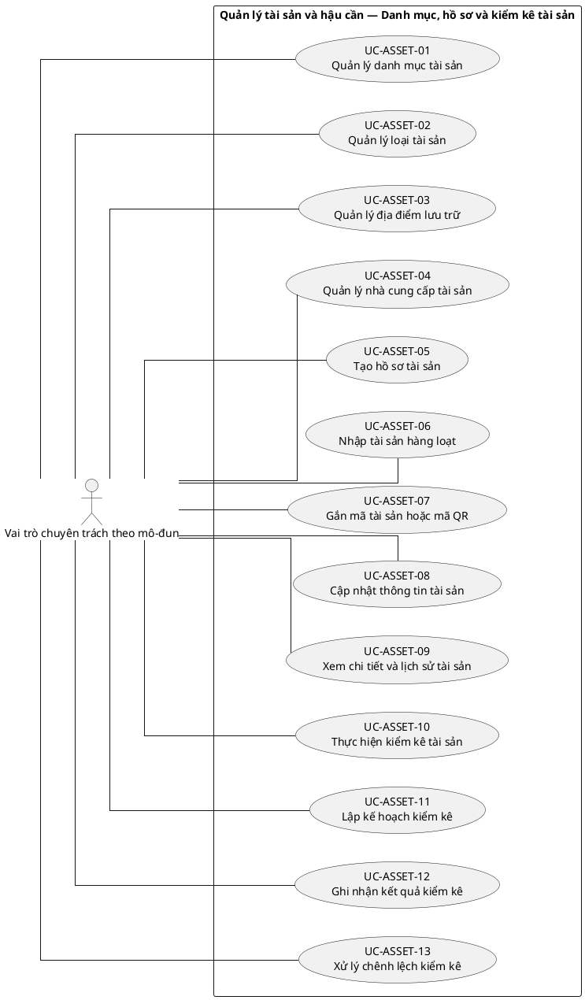
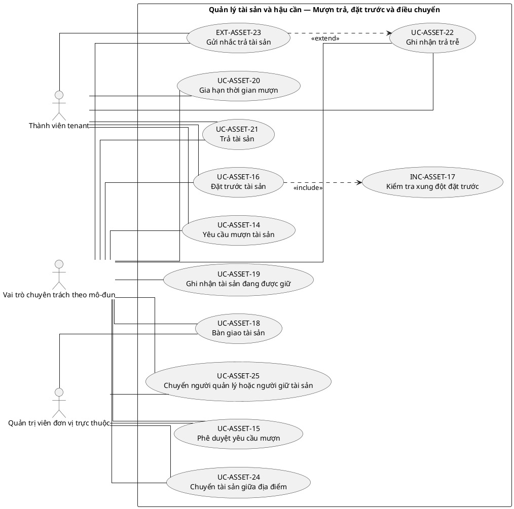
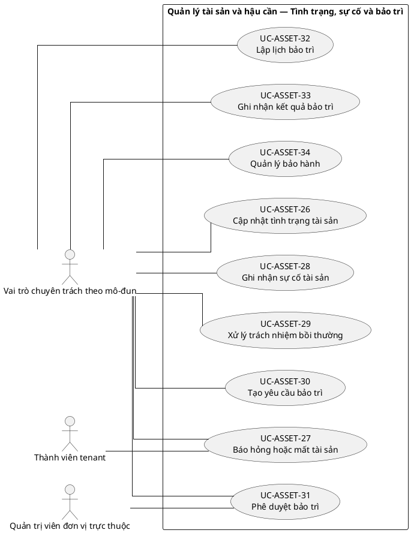
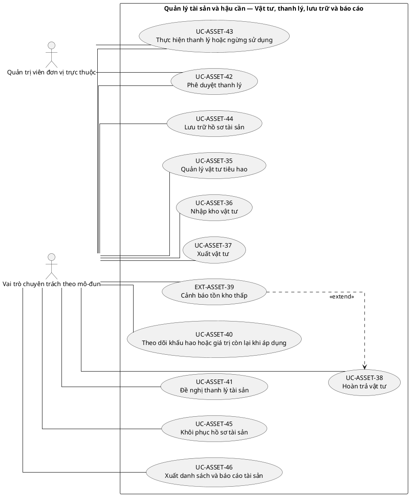

# UC-ASSET — Quản lý tài sản và hậu cần

## 1. Thông tin tài liệu

| Thuộc tính | Nội dung |
|---|---|
| Mã nhóm Use Case | `UC-ASSET` |
| Tên | Quản lý tài sản và hậu cần |
| Miền nghiệp vụ | Tài sản và hậu cần |
| Mức ưu tiên phát triển | Mô-đun vận hành |
| Phạm vi | Toàn bộ sản phẩm Operations Hub |
| Mô hình | SaaS đa tổ chức, dữ liệu và cấu hình theo tenant |
| Trạng thái đặc tả | Baseline V3; phân biệt Use Case mục tiêu, include, extend và yêu cầu hệ thống |

> **Nguyên tắc phạm vi:** tài liệu mô tả năng lực của phiên bản sản phẩm hoàn chỉnh. Mức ưu tiên phát triển không đồng nghĩa với loại bỏ khỏi phạm vi sản phẩm.

## 2. Mục tiêu

Theo dõi tài sản, vật tư, tình trạng, người giữ, mượn trả, bảo trì và kiểm kê trong tenant.

## 3. Actor

| Mã actor | Actor | Phạm vi |
|---|---|---|
| `ACT-TENANT-MEMBER` | Thành viên tenant | Tenant hoặc tích hợp |
| `ACT-MODULE-SPECIALIST` | Vai trò chuyên trách theo mô-đun | Tenant hoặc tích hợp |
| `ACT-UNIT-ADMIN` | Quản trị viên đơn vị trực thuộc | Tenant hoặc tích hợp |

Actor trong sơ đồ chỉ thể hiện vai trò tương tác. Quyền thực tế phải được kiểm tra tại backend dựa trên tenant context, membership, role, permission, organization unit, trạng thái module và trạng thái tenant.

## 4. Điều kiện trước

- Module tài sản đã kích hoạt.
- Danh mục tài sản và trạng thái được cấu hình.

## 5. Điều kiện sau

- Số lượng, tình trạng và lịch sử sở hữu hoặc sử dụng tài sản nhất quán.

## 6. Danh mục phần tử nghiệp vụ và phân loại UML

> **Thay đổi của V3:** Không coi toàn bộ danh mục chức năng là Use Case độc lập. Chỉ phần tử có mục tiêu quan sát được đối với actor được giữ mã `UC-*`. Hành vi bắt buộc dùng chung dùng mã `INC-*`; luồng điều kiện dùng mã `EXT-*`; quy tắc hoặc xử lý xuyên suốt dùng mã `REQ-*`. Mã V2 được giữ để truy vết.

> Actor chỉ nối trực tiếp với `UC-*` hoặc `EXT-*` mà actor thực sự khởi phát/tham gia. `INC-*` được nối bằng `<<include>>`; `REQ-*` không được vẽ như Use Case.

| Mã V3 | Mã V2 | Phần tử nghiệp vụ | Loại mô hình | Actor trực tiếp / nguồn kích hoạt | Quan hệ |
|---|---|---|---|---|---|
| `UC-ASSET-01` | `UC-ASSET-01` | Quản lý danh mục tài sản | Use Case mục tiêu actor | `ACT-MODULE-SPECIALIST` — Vai trò chuyên trách theo mô-đun | Association trực tiếp với actor |
| `UC-ASSET-02` | `UC-ASSET-02` | Quản lý loại tài sản | Use Case mục tiêu actor | `ACT-MODULE-SPECIALIST` — Vai trò chuyên trách theo mô-đun | Association trực tiếp với actor |
| `UC-ASSET-03` | `UC-ASSET-03` | Quản lý địa điểm lưu trữ | Use Case mục tiêu actor | `ACT-MODULE-SPECIALIST` — Vai trò chuyên trách theo mô-đun | Association trực tiếp với actor |
| `UC-ASSET-04` | `UC-ASSET-04` | Quản lý nhà cung cấp tài sản | Use Case mục tiêu actor | `ACT-MODULE-SPECIALIST` — Vai trò chuyên trách theo mô-đun | Association trực tiếp với actor |
| `UC-ASSET-05` | `UC-ASSET-05` | Tạo hồ sơ tài sản | Use Case mục tiêu actor | `ACT-MODULE-SPECIALIST` — Vai trò chuyên trách theo mô-đun | Association trực tiếp với actor |
| `UC-ASSET-06` | `UC-ASSET-06` | Nhập tài sản hàng loạt | Use Case mục tiêu actor | `ACT-MODULE-SPECIALIST` — Vai trò chuyên trách theo mô-đun | Association trực tiếp với actor |
| `UC-ASSET-07` | `UC-ASSET-07` | Gắn mã tài sản hoặc mã QR | Use Case mục tiêu actor | `ACT-MODULE-SPECIALIST` — Vai trò chuyên trách theo mô-đun | Association trực tiếp với actor |
| `UC-ASSET-08` | `UC-ASSET-08` | Cập nhật thông tin tài sản | Use Case mục tiêu actor | `ACT-MODULE-SPECIALIST` — Vai trò chuyên trách theo mô-đun | Association trực tiếp với actor |
| `UC-ASSET-09` | `UC-ASSET-09` | Xem chi tiết và lịch sử tài sản | Use Case mục tiêu actor | `ACT-MODULE-SPECIALIST` — Vai trò chuyên trách theo mô-đun | Association trực tiếp với actor |
| `UC-ASSET-10` | `UC-ASSET-10` | Thực hiện kiểm kê tài sản | Use Case mục tiêu actor | `ACT-MODULE-SPECIALIST` — Vai trò chuyên trách theo mô-đun | Association trực tiếp với actor |
| `UC-ASSET-11` | `UC-ASSET-11` | Lập kế hoạch kiểm kê | Use Case mục tiêu actor | `ACT-MODULE-SPECIALIST` — Vai trò chuyên trách theo mô-đun | Association trực tiếp với actor |
| `UC-ASSET-12` | `UC-ASSET-12` | Ghi nhận kết quả kiểm kê | Use Case mục tiêu actor | `ACT-MODULE-SPECIALIST` — Vai trò chuyên trách theo mô-đun | Association trực tiếp với actor |
| `UC-ASSET-13` | `UC-ASSET-13` | Xử lý chênh lệch kiểm kê | Use Case mục tiêu actor | `ACT-MODULE-SPECIALIST` — Vai trò chuyên trách theo mô-đun | Association trực tiếp với actor |
| `UC-ASSET-14` | `UC-ASSET-14` | Yêu cầu mượn tài sản | Use Case mục tiêu actor | `ACT-TENANT-MEMBER` — Thành viên tenant<br>`ACT-MODULE-SPECIALIST` — Vai trò chuyên trách theo mô-đun | Association trực tiếp với actor |
| `UC-ASSET-15` | `UC-ASSET-15` | Phê duyệt yêu cầu mượn | Use Case mục tiêu actor | `ACT-UNIT-ADMIN` — Quản trị viên đơn vị trực thuộc<br>`ACT-MODULE-SPECIALIST` — Vai trò chuyên trách theo mô-đun | Association trực tiếp với actor |
| `UC-ASSET-16` | `UC-ASSET-16` | Đặt trước tài sản | Use Case mục tiêu actor | `ACT-TENANT-MEMBER` — Thành viên tenant<br>`ACT-MODULE-SPECIALIST` — Vai trò chuyên trách theo mô-đun | Association trực tiếp với actor |
| `INC-ASSET-17` | `UC-ASSET-17` | Kiểm tra xung đột đặt trước | Hành vi dùng chung `<<include>>` | Hệ thống; được gọi từ Use Case cha | `UC-ASSET-16` `<<include>>` `INC-ASSET-17` |
| `UC-ASSET-18` | `UC-ASSET-18` | Bàn giao tài sản | Use Case mục tiêu actor | `ACT-UNIT-ADMIN` — Quản trị viên đơn vị trực thuộc<br>`ACT-MODULE-SPECIALIST` — Vai trò chuyên trách theo mô-đun | Association trực tiếp với actor |
| `UC-ASSET-19` | `UC-ASSET-19` | Ghi nhận tài sản đang được giữ | Use Case mục tiêu actor | `ACT-MODULE-SPECIALIST` — Vai trò chuyên trách theo mô-đun | Association trực tiếp với actor |
| `UC-ASSET-20` | `UC-ASSET-20` | Gia hạn thời gian mượn | Use Case mục tiêu actor | `ACT-TENANT-MEMBER` — Thành viên tenant<br>`ACT-MODULE-SPECIALIST` — Vai trò chuyên trách theo mô-đun | Association trực tiếp với actor |
| `UC-ASSET-21` | `UC-ASSET-21` | Trả tài sản | Use Case mục tiêu actor | `ACT-TENANT-MEMBER` — Thành viên tenant<br>`ACT-MODULE-SPECIALIST` — Vai trò chuyên trách theo mô-đun | Association trực tiếp với actor |
| `UC-ASSET-22` | `UC-ASSET-22` | Ghi nhận trả trễ | Use Case mục tiêu actor | `ACT-TENANT-MEMBER` — Thành viên tenant<br>`ACT-MODULE-SPECIALIST` — Vai trò chuyên trách theo mô-đun | Association trực tiếp với actor |
| `EXT-ASSET-23` | `UC-ASSET-23` | Gửi nhắc trả tài sản | Luồng điều kiện `<<extend>>` | `ACT-TENANT-MEMBER` — Thành viên tenant<br>`ACT-MODULE-SPECIALIST` — Vai trò chuyên trách theo mô-đun | `EXT-ASSET-23` `<<extend>>` `UC-ASSET-22` |
| `UC-ASSET-24` | `UC-ASSET-24` | Chuyển tài sản giữa địa điểm | Use Case mục tiêu actor | `ACT-UNIT-ADMIN` — Quản trị viên đơn vị trực thuộc<br>`ACT-MODULE-SPECIALIST` — Vai trò chuyên trách theo mô-đun | Association trực tiếp với actor |
| `UC-ASSET-25` | `UC-ASSET-25` | Chuyển người quản lý hoặc người giữ tài sản | Use Case mục tiêu actor | `ACT-UNIT-ADMIN` — Quản trị viên đơn vị trực thuộc<br>`ACT-MODULE-SPECIALIST` — Vai trò chuyên trách theo mô-đun | Association trực tiếp với actor |
| `UC-ASSET-26` | `UC-ASSET-26` | Cập nhật tình trạng tài sản | Use Case mục tiêu actor | `ACT-MODULE-SPECIALIST` — Vai trò chuyên trách theo mô-đun | Association trực tiếp với actor |
| `UC-ASSET-27` | `UC-ASSET-27` | Báo hỏng hoặc mất tài sản | Use Case mục tiêu actor | `ACT-TENANT-MEMBER` — Thành viên tenant<br>`ACT-MODULE-SPECIALIST` — Vai trò chuyên trách theo mô-đun | Association trực tiếp với actor |
| `UC-ASSET-28` | `UC-ASSET-28` | Ghi nhận sự cố tài sản | Use Case mục tiêu actor | `ACT-MODULE-SPECIALIST` — Vai trò chuyên trách theo mô-đun | Association trực tiếp với actor |
| `UC-ASSET-29` | `UC-ASSET-29` | Xử lý trách nhiệm bồi thường | Use Case mục tiêu actor | `ACT-MODULE-SPECIALIST` — Vai trò chuyên trách theo mô-đun | Association trực tiếp với actor |
| `UC-ASSET-30` | `UC-ASSET-30` | Tạo yêu cầu bảo trì | Use Case mục tiêu actor | `ACT-MODULE-SPECIALIST` — Vai trò chuyên trách theo mô-đun | Association trực tiếp với actor |
| `UC-ASSET-31` | `UC-ASSET-31` | Phê duyệt bảo trì | Use Case mục tiêu actor | `ACT-UNIT-ADMIN` — Quản trị viên đơn vị trực thuộc<br>`ACT-MODULE-SPECIALIST` — Vai trò chuyên trách theo mô-đun | Association trực tiếp với actor |
| `UC-ASSET-32` | `UC-ASSET-32` | Lập lịch bảo trì | Use Case mục tiêu actor | `ACT-MODULE-SPECIALIST` — Vai trò chuyên trách theo mô-đun | Association trực tiếp với actor |
| `UC-ASSET-33` | `UC-ASSET-33` | Ghi nhận kết quả bảo trì | Use Case mục tiêu actor | `ACT-MODULE-SPECIALIST` — Vai trò chuyên trách theo mô-đun | Association trực tiếp với actor |
| `UC-ASSET-34` | `UC-ASSET-34` | Quản lý bảo hành | Use Case mục tiêu actor | `ACT-MODULE-SPECIALIST` — Vai trò chuyên trách theo mô-đun | Association trực tiếp với actor |
| `UC-ASSET-35` | `UC-ASSET-35` | Quản lý vật tư tiêu hao | Use Case mục tiêu actor | `ACT-MODULE-SPECIALIST` — Vai trò chuyên trách theo mô-đun | Association trực tiếp với actor |
| `UC-ASSET-36` | `UC-ASSET-36` | Nhập kho vật tư | Use Case mục tiêu actor | `ACT-MODULE-SPECIALIST` — Vai trò chuyên trách theo mô-đun | Association trực tiếp với actor |
| `UC-ASSET-37` | `UC-ASSET-37` | Xuất vật tư | Use Case mục tiêu actor | `ACT-MODULE-SPECIALIST` — Vai trò chuyên trách theo mô-đun | Association trực tiếp với actor |
| `UC-ASSET-38` | `UC-ASSET-38` | Hoàn trả vật tư | Use Case mục tiêu actor | `ACT-MODULE-SPECIALIST` — Vai trò chuyên trách theo mô-đun | Association trực tiếp với actor |
| `EXT-ASSET-39` | `UC-ASSET-39` | Cảnh báo tồn kho thấp | Luồng điều kiện `<<extend>>` | `ACT-MODULE-SPECIALIST` — Vai trò chuyên trách theo mô-đun | `EXT-ASSET-39` `<<extend>>` `UC-ASSET-38` |
| `UC-ASSET-40` | `UC-ASSET-40` | Theo dõi khấu hao hoặc giá trị còn lại khi áp dụng | Use Case mục tiêu actor | `ACT-MODULE-SPECIALIST` — Vai trò chuyên trách theo mô-đun | Association trực tiếp với actor |
| `UC-ASSET-41` | `UC-ASSET-41` | Đề nghị thanh lý tài sản | Use Case mục tiêu actor | `ACT-MODULE-SPECIALIST` — Vai trò chuyên trách theo mô-đun | Association trực tiếp với actor |
| `UC-ASSET-42` | `UC-ASSET-42` | Phê duyệt thanh lý | Use Case mục tiêu actor | `ACT-UNIT-ADMIN` — Quản trị viên đơn vị trực thuộc<br>`ACT-MODULE-SPECIALIST` — Vai trò chuyên trách theo mô-đun | Association trực tiếp với actor |
| `UC-ASSET-43` | `UC-ASSET-43` | Thực hiện thanh lý hoặc ngừng sử dụng | Use Case mục tiêu actor | `ACT-UNIT-ADMIN` — Quản trị viên đơn vị trực thuộc<br>`ACT-MODULE-SPECIALIST` — Vai trò chuyên trách theo mô-đun | Association trực tiếp với actor |
| `UC-ASSET-44` | `UC-ASSET-44` | Lưu trữ hồ sơ tài sản | Use Case mục tiêu actor | `ACT-MODULE-SPECIALIST` — Vai trò chuyên trách theo mô-đun | Association trực tiếp với actor |
| `UC-ASSET-45` | `UC-ASSET-45` | Khôi phục hồ sơ tài sản | Use Case mục tiêu actor | `ACT-MODULE-SPECIALIST` — Vai trò chuyên trách theo mô-đun | Association trực tiếp với actor |
| `UC-ASSET-46` | `UC-ASSET-46` | Xuất danh sách và báo cáo tài sản | Use Case mục tiêu actor | `ACT-MODULE-SPECIALIST` — Vai trò chuyên trách theo mô-đun | Association trực tiếp với actor |

## 7. Luồng nghiệp vụ chính

1. Logistics Officer tạo tài sản và số lượng khả dụng.
2. Thành viên gửi yêu cầu mượn.
3. Hệ thống kiểm tra quyền, thời gian và khả dụng.
4. Người phụ trách duyệt và bàn giao; hệ thống cập nhật người giữ/trạng thái.
5. Khi trả, hệ thống ghi tình trạng và cập nhật tồn khả dụng.
6. Nếu hư hỏng, hệ thống tạo yêu cầu bảo trì hoặc xử lý tiếp.

## 8. Luồng thay thế và ngoại lệ

- Không đủ số lượng: từ chối hoặc đưa vào danh sách chờ.
- Tài sản đang bảo trì: không cho mượn.
- Trả thiếu hoặc hư hỏng: yêu cầu biên bản và quy trình xử lý.
- Điều chuyển sang đơn vị khác tenant: từ chối.

## 9. Quy tắc nghiệp vụ cốt lõi

- Tài sản và giao dịch mượn trả phải thuộc cùng tenant.
- Không được bàn giao số lượng vượt khả dụng.
- Một tài sản định danh duy nhất chỉ có một trạng thái giữ chính tại một thời điểm.
- Thanh lý không xóa lịch sử mượn, bảo trì và kiểm kê.
- Chuyển trạng thái phải tuân theo vòng đời tài sản đã cấu hình.

## 10. Mô hình dữ liệu logic liên quan

| Thực thể | Vai trò |
|---|---|
| `AssetCategory` | Thực thể logic phục vụ UC-ASSET; thiết kế vật lý được xác định ở giai đoạn thiết kế dữ liệu. |
| `Asset` | Thực thể logic phục vụ UC-ASSET; thiết kế vật lý được xác định ở giai đoạn thiết kế dữ liệu. |
| `AssetItem` | Thực thể logic phục vụ UC-ASSET; thiết kế vật lý được xác định ở giai đoạn thiết kế dữ liệu. |
| `InventoryBalance` | Thực thể logic phục vụ UC-ASSET; thiết kế vật lý được xác định ở giai đoạn thiết kế dữ liệu. |
| `BorrowRequest` | Thực thể logic phục vụ UC-ASSET; thiết kế vật lý được xác định ở giai đoạn thiết kế dữ liệu. |
| `AssetHandover` | Thực thể logic phục vụ UC-ASSET; thiết kế vật lý được xác định ở giai đoạn thiết kế dữ liệu. |
| `MaintenanceRecord` | Thực thể logic phục vụ UC-ASSET; thiết kế vật lý được xác định ở giai đoạn thiết kế dữ liệu. |
| `Stocktake` | Thực thể logic phục vụ UC-ASSET; thiết kế vật lý được xác định ở giai đoạn thiết kế dữ liệu. |
| `DisposalRecord` | Thực thể logic phục vụ UC-ASSET; thiết kế vật lý được xác định ở giai đoạn thiết kế dữ liệu. |
| `AuditLog` | Thực thể logic phục vụ UC-ASSET; thiết kế vật lý được xác định ở giai đoạn thiết kế dữ liệu. |

Mọi thực thể nghiệp vụ phải xác định được tenant sở hữu, trừ thực thể được công bố rõ là dữ liệu cấp nền tảng. Quan hệ tham chiếu chéo tenant bị cấm nếu không có cơ chế liên tenant được đặc tả riêng.

## 11. Kiểm soát truy cập

Quyền hiệu lực được xác định theo công thức khái quát:

```text
Quyền hiệu lực
= Permission từ các Role đang hoạt động
∩ Tenant context hợp lệ
∩ Membership đang hoạt động
∩ Phạm vi Organization Unit
∩ Phạm vi tài nguyên
∩ Trạng thái Module
∩ Trạng thái Tenant
```

Các kiểm tra bắt buộc:

- Xác thực User trước khi truy cập chức năng không công khai.
- Đối chiếu tenant context với membership.
- Kiểm tra permission tại backend, không dựa vào trạng thái hiển thị của frontend.
- Giới hạn truy vấn, tệp, bản xuất, cache và tác vụ nền theo tenant.
- Ghi audit cho hành động quản trị hoặc thay đổi nghiệp vụ quan trọng.

## 12. Tiêu chí chấp nhận

| Mã | Tiêu chí | Phương pháp kiểm chứng |
|---|---|---|
| `AC-ASSET-01` | Không thể mượn vượt số lượng khả dụng. | Functional / Integration / Security Test tùy nội dung |
| `AC-ASSET-02` | Trạng thái tài sản khớp với bản ghi bàn giao hiện hành. | Functional / Integration / Security Test tùy nội dung |
| `AC-ASSET-03` | Kiểm kê tạo chênh lệch và lịch sử xử lý rõ ràng. | Functional / Integration / Security Test tùy nội dung |
| `AC-ASSET-04` | Tài sản tenant A không xuất hiện trong danh sách tenant B. | Functional / Integration / Security Test tùy nội dung |

## 13. Quan hệ với nhóm Use Case khác

[`UC-MEMBER`](./09_UC-MEMBER.md), [`UC-ORG`](./05_UC-ORG.md), [`UC-REQUEST`](./10_UC-REQUEST.md), [`UC-DOCUMENT`](./11_UC-DOCUMENT.md), [`UC-AUDIT`](./21_UC-AUDIT.md)

## 14. Use Case Diagram theo luồng nghiệp vụ

Các package/rectangle dưới đây chỉ là **ranh giới hệ thống hoặc miền nghiệp vụ**. Không tồn tại phần tử trung gian `PKG*`; actor liên kết trực tiếp với Use Case có mục tiêu nghiệp vụ. `INC-*` và `EXT-*` chỉ xuất hiện qua quan hệ UML tương ứng; `REQ-*` được trình bày ngoài sơ đồ.

### 14.1. Quy ước đọc sơ đồ

- `Actor -- UC-*`: actor trực tiếp thực hiện hoặc tham gia mục tiêu nghiệp vụ.
- `UC-* ..> INC-* : <<include>>`: hành vi bắt buộc được dùng lại.
- `EXT-* ..> UC-* : <<extend>>`: hành vi chỉ phát sinh trong điều kiện xác định.
- `REQ-*`: quy tắc/yêu cầu hệ thống, không phải Use Case và không nối actor.

### 14.2. Danh mục, hồ sơ và kiểm kê tài sản



### 14.3. Mượn trả, đặt trước và điều chuyển



### 14.4. Tình trạng, sự cố và bảo trì



### 14.5. Vật tư, thanh lý, lưu trữ và báo cáo


