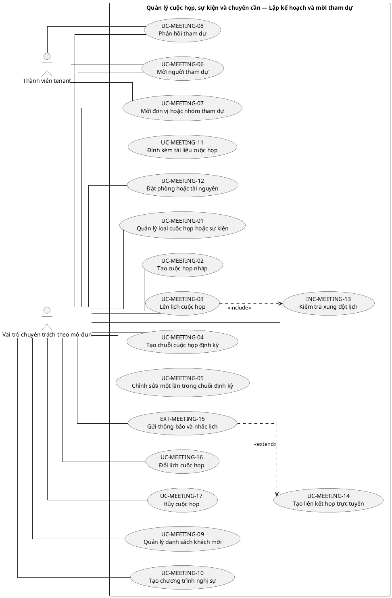
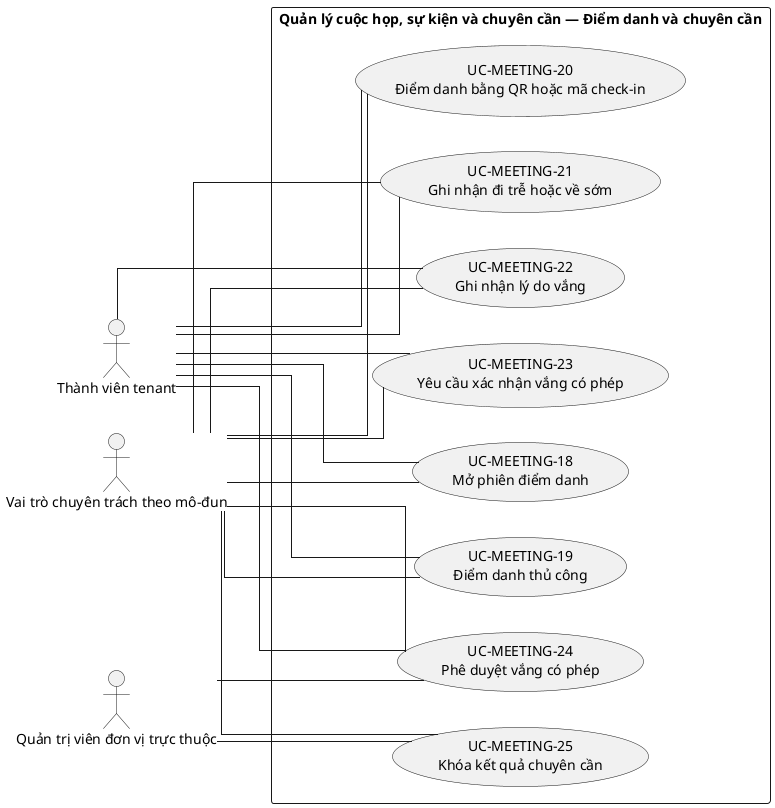
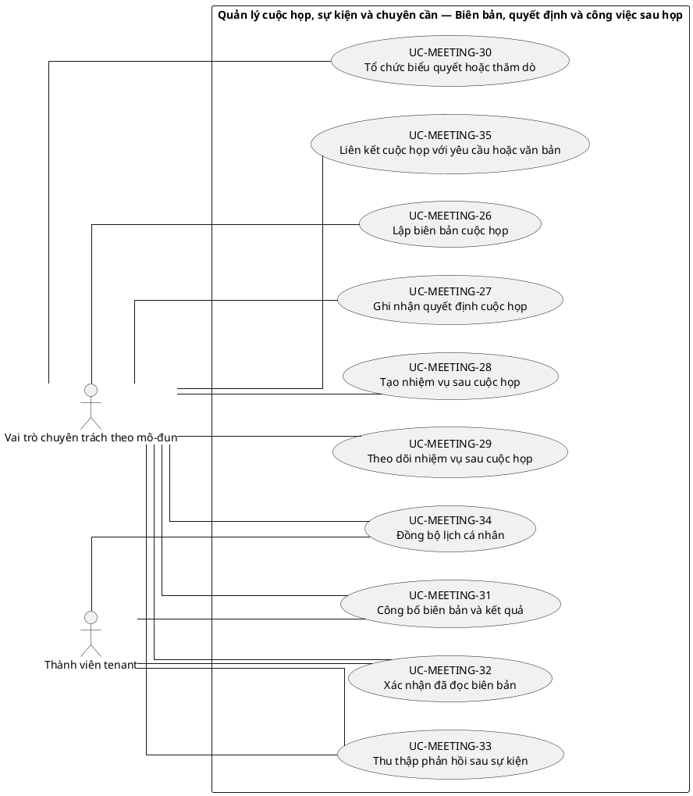
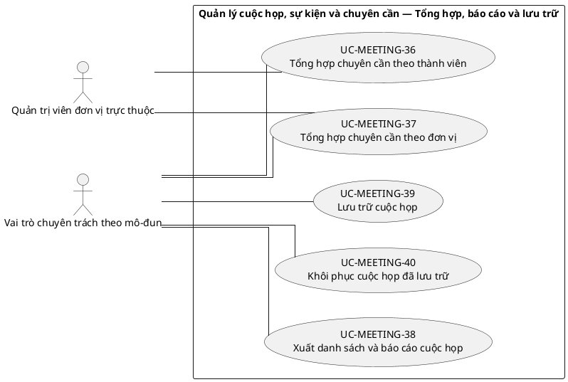

# UC-MEETING — Quản lý cuộc họp, sự kiện và chuyên cần

## 1. Thông tin tài liệu

| Thuộc tính | Nội dung |
|---|---|
| Mã nhóm Use Case | `UC-MEETING` |
| Tên | Quản lý cuộc họp, sự kiện và chuyên cần |
| Miền nghiệp vụ | Hoạt động tổ chức |
| Mức ưu tiên phát triển | Mô-đun vận hành |
| Phạm vi | Toàn bộ sản phẩm Operations Hub |
| Mô hình | SaaS đa tổ chức, dữ liệu và cấu hình theo tenant |
| Trạng thái đặc tả | Baseline V3; phân biệt Use Case mục tiêu, include, extend và yêu cầu hệ thống |

> **Nguyên tắc phạm vi:** tài liệu mô tả năng lực của phiên bản sản phẩm hoàn chỉnh. Mức ưu tiên phát triển không đồng nghĩa với loại bỏ khỏi phạm vi sản phẩm.

## 2. Mục tiêu

Quản lý lịch họp hoặc sự kiện, người tham gia, chuyên cần, biên bản, quyết định và đầu việc phát sinh.

## 3. Actor

| Mã actor | Actor | Phạm vi |
|---|---|---|
| `ACT-TENANT-MEMBER` | Thành viên tenant | Tenant hoặc tích hợp |
| `ACT-MODULE-SPECIALIST` | Vai trò chuyên trách theo mô-đun | Tenant hoặc tích hợp |
| `ACT-UNIT-ADMIN` | Quản trị viên đơn vị trực thuộc | Tenant hoặc tích hợp |

Actor trong sơ đồ chỉ thể hiện vai trò tương tác. Quyền thực tế phải được kiểm tra tại backend dựa trên tenant context, membership, role, permission, organization unit, trạng thái module và trạng thái tenant.

## 4. Điều kiện trước

- Module cuộc họp đã kích hoạt.
- Người tạo có quyền với đơn vị hoặc nhóm đối tượng liên quan.

## 5. Điều kiện sau

- Cuộc họp có danh sách tham gia, kết quả chuyên cần và biên bản truy vết được.

## 6. Danh mục phần tử nghiệp vụ và phân loại UML

> **Thay đổi của V3:** Không coi toàn bộ danh mục chức năng là Use Case độc lập. Chỉ phần tử có mục tiêu quan sát được đối với actor được giữ mã `UC-*`. Hành vi bắt buộc dùng chung dùng mã `INC-*`; luồng điều kiện dùng mã `EXT-*`; quy tắc hoặc xử lý xuyên suốt dùng mã `REQ-*`. Mã V2 được giữ để truy vết.

> Actor chỉ nối trực tiếp với `UC-*` hoặc `EXT-*` mà actor thực sự khởi phát/tham gia. `INC-*` được nối bằng `<<include>>`; `REQ-*` không được vẽ như Use Case.

| Mã V3 | Mã V2 | Phần tử nghiệp vụ | Loại mô hình | Actor trực tiếp / nguồn kích hoạt | Quan hệ |
|---|---|---|---|---|---|
| `UC-MEETING-01` | `UC-MEETING-01` | Quản lý loại cuộc họp hoặc sự kiện | Use Case mục tiêu actor | `ACT-MODULE-SPECIALIST` — Vai trò chuyên trách theo mô-đun | Association trực tiếp với actor |
| `UC-MEETING-02` | `UC-MEETING-02` | Tạo cuộc họp nháp | Use Case mục tiêu actor | `ACT-MODULE-SPECIALIST` — Vai trò chuyên trách theo mô-đun | Association trực tiếp với actor |
| `UC-MEETING-03` | `UC-MEETING-03` | Lên lịch cuộc họp | Use Case mục tiêu actor | `ACT-MODULE-SPECIALIST` — Vai trò chuyên trách theo mô-đun | Association trực tiếp với actor |
| `UC-MEETING-04` | `UC-MEETING-04` | Tạo chuỗi cuộc họp định kỳ | Use Case mục tiêu actor | `ACT-MODULE-SPECIALIST` — Vai trò chuyên trách theo mô-đun | Association trực tiếp với actor |
| `UC-MEETING-05` | `UC-MEETING-05` | Chỉnh sửa một lần trong chuỗi định kỳ | Use Case mục tiêu actor | `ACT-MODULE-SPECIALIST` — Vai trò chuyên trách theo mô-đun | Association trực tiếp với actor |
| `UC-MEETING-06` | `UC-MEETING-06` | Mời người tham dự | Use Case mục tiêu actor | `ACT-TENANT-MEMBER` — Thành viên tenant<br>`ACT-MODULE-SPECIALIST` — Vai trò chuyên trách theo mô-đun | Association trực tiếp với actor |
| `UC-MEETING-07` | `UC-MEETING-07` | Mời đơn vị hoặc nhóm tham dự | Use Case mục tiêu actor | `ACT-TENANT-MEMBER` — Thành viên tenant<br>`ACT-MODULE-SPECIALIST` — Vai trò chuyên trách theo mô-đun | Association trực tiếp với actor |
| `UC-MEETING-08` | `UC-MEETING-08` | Phản hồi tham dự | Use Case mục tiêu actor | `ACT-TENANT-MEMBER` — Thành viên tenant<br>`ACT-MODULE-SPECIALIST` — Vai trò chuyên trách theo mô-đun | Association trực tiếp với actor |
| `UC-MEETING-09` | `UC-MEETING-09` | Quản lý danh sách khách mời | Use Case mục tiêu actor | `ACT-MODULE-SPECIALIST` — Vai trò chuyên trách theo mô-đun | Association trực tiếp với actor |
| `UC-MEETING-10` | `UC-MEETING-10` | Tạo chương trình nghị sự | Use Case mục tiêu actor | `ACT-MODULE-SPECIALIST` — Vai trò chuyên trách theo mô-đun | Association trực tiếp với actor |
| `UC-MEETING-11` | `UC-MEETING-11` | Đính kèm tài liệu cuộc họp | Use Case mục tiêu actor | `ACT-MODULE-SPECIALIST` — Vai trò chuyên trách theo mô-đun | Association trực tiếp với actor |
| `UC-MEETING-12` | `UC-MEETING-12` | Đặt phòng hoặc tài nguyên | Use Case mục tiêu actor | `ACT-MODULE-SPECIALIST` — Vai trò chuyên trách theo mô-đun | Association trực tiếp với actor |
| `INC-MEETING-13` | `UC-MEETING-13` | Kiểm tra xung đột lịch | Hành vi dùng chung `<<include>>` | Hệ thống; được gọi từ Use Case cha | `UC-MEETING-03` `<<include>>` `INC-MEETING-13` |
| `UC-MEETING-14` | `UC-MEETING-14` | Tạo liên kết họp trực tuyến | Use Case mục tiêu actor | `ACT-MODULE-SPECIALIST` — Vai trò chuyên trách theo mô-đun | Association trực tiếp với actor |
| `EXT-MEETING-15` | `UC-MEETING-15` | Gửi thông báo và nhắc lịch | Luồng điều kiện `<<extend>>` | `ACT-MODULE-SPECIALIST` — Vai trò chuyên trách theo mô-đun | `EXT-MEETING-15` `<<extend>>` `UC-MEETING-14` |
| `UC-MEETING-16` | `UC-MEETING-16` | Đổi lịch cuộc họp | Use Case mục tiêu actor | `ACT-MODULE-SPECIALIST` — Vai trò chuyên trách theo mô-đun | Association trực tiếp với actor |
| `UC-MEETING-17` | `UC-MEETING-17` | Hủy cuộc họp | Use Case mục tiêu actor | `ACT-MODULE-SPECIALIST` — Vai trò chuyên trách theo mô-đun | Association trực tiếp với actor |
| `UC-MEETING-18` | `UC-MEETING-18` | Mở phiên điểm danh | Use Case mục tiêu actor | `ACT-TENANT-MEMBER` — Thành viên tenant<br>`ACT-MODULE-SPECIALIST` — Vai trò chuyên trách theo mô-đun | Association trực tiếp với actor |
| `UC-MEETING-19` | `UC-MEETING-19` | Điểm danh thủ công | Use Case mục tiêu actor | `ACT-TENANT-MEMBER` — Thành viên tenant<br>`ACT-MODULE-SPECIALIST` — Vai trò chuyên trách theo mô-đun | Association trực tiếp với actor |
| `UC-MEETING-20` | `UC-MEETING-20` | Điểm danh bằng QR hoặc mã check-in | Use Case mục tiêu actor | `ACT-TENANT-MEMBER` — Thành viên tenant<br>`ACT-MODULE-SPECIALIST` — Vai trò chuyên trách theo mô-đun | Association trực tiếp với actor |
| `UC-MEETING-21` | `UC-MEETING-21` | Ghi nhận đi trễ hoặc về sớm | Use Case mục tiêu actor | `ACT-TENANT-MEMBER` — Thành viên tenant<br>`ACT-MODULE-SPECIALIST` — Vai trò chuyên trách theo mô-đun | Association trực tiếp với actor |
| `UC-MEETING-22` | `UC-MEETING-22` | Ghi nhận lý do vắng | Use Case mục tiêu actor | `ACT-TENANT-MEMBER` — Thành viên tenant<br>`ACT-MODULE-SPECIALIST` — Vai trò chuyên trách theo mô-đun | Association trực tiếp với actor |
| `UC-MEETING-23` | `UC-MEETING-23` | Yêu cầu xác nhận vắng có phép | Use Case mục tiêu actor | `ACT-TENANT-MEMBER` — Thành viên tenant<br>`ACT-MODULE-SPECIALIST` — Vai trò chuyên trách theo mô-đun | Association trực tiếp với actor |
| `UC-MEETING-24` | `UC-MEETING-24` | Phê duyệt vắng có phép | Use Case mục tiêu actor | `ACT-TENANT-MEMBER` — Thành viên tenant<br>`ACT-UNIT-ADMIN` — Quản trị viên đơn vị trực thuộc<br>`ACT-MODULE-SPECIALIST` — Vai trò chuyên trách theo mô-đun | Association trực tiếp với actor |
| `UC-MEETING-25` | `UC-MEETING-25` | Khóa kết quả chuyên cần | Use Case mục tiêu actor | `ACT-UNIT-ADMIN` — Quản trị viên đơn vị trực thuộc<br>`ACT-MODULE-SPECIALIST` — Vai trò chuyên trách theo mô-đun | Association trực tiếp với actor |
| `UC-MEETING-26` | `UC-MEETING-26` | Lập biên bản cuộc họp | Use Case mục tiêu actor | `ACT-MODULE-SPECIALIST` — Vai trò chuyên trách theo mô-đun | Association trực tiếp với actor |
| `UC-MEETING-27` | `UC-MEETING-27` | Ghi nhận quyết định cuộc họp | Use Case mục tiêu actor | `ACT-MODULE-SPECIALIST` — Vai trò chuyên trách theo mô-đun | Association trực tiếp với actor |
| `UC-MEETING-28` | `UC-MEETING-28` | Tạo nhiệm vụ sau cuộc họp | Use Case mục tiêu actor | `ACT-MODULE-SPECIALIST` — Vai trò chuyên trách theo mô-đun | Association trực tiếp với actor |
| `UC-MEETING-29` | `UC-MEETING-29` | Theo dõi nhiệm vụ sau cuộc họp | Use Case mục tiêu actor | `ACT-MODULE-SPECIALIST` — Vai trò chuyên trách theo mô-đun | Association trực tiếp với actor |
| `UC-MEETING-30` | `UC-MEETING-30` | Tổ chức biểu quyết hoặc thăm dò | Use Case mục tiêu actor | `ACT-MODULE-SPECIALIST` — Vai trò chuyên trách theo mô-đun | Association trực tiếp với actor |
| `UC-MEETING-31` | `UC-MEETING-31` | Công bố biên bản và kết quả | Use Case mục tiêu actor | `ACT-TENANT-MEMBER` — Thành viên tenant<br>`ACT-MODULE-SPECIALIST` — Vai trò chuyên trách theo mô-đun | Association trực tiếp với actor |
| `UC-MEETING-32` | `UC-MEETING-32` | Xác nhận đã đọc biên bản | Use Case mục tiêu actor | `ACT-TENANT-MEMBER` — Thành viên tenant<br>`ACT-MODULE-SPECIALIST` — Vai trò chuyên trách theo mô-đun | Association trực tiếp với actor |
| `UC-MEETING-33` | `UC-MEETING-33` | Thu thập phản hồi sau sự kiện | Use Case mục tiêu actor | `ACT-TENANT-MEMBER` — Thành viên tenant<br>`ACT-MODULE-SPECIALIST` — Vai trò chuyên trách theo mô-đun | Association trực tiếp với actor |
| `UC-MEETING-34` | `UC-MEETING-34` | Đồng bộ lịch cá nhân | Use Case mục tiêu actor | `ACT-TENANT-MEMBER` — Thành viên tenant<br>`ACT-MODULE-SPECIALIST` — Vai trò chuyên trách theo mô-đun | Association trực tiếp với actor |
| `UC-MEETING-35` | `UC-MEETING-35` | Liên kết cuộc họp với yêu cầu hoặc văn bản | Use Case mục tiêu actor | `ACT-MODULE-SPECIALIST` — Vai trò chuyên trách theo mô-đun | Association trực tiếp với actor |
| `UC-MEETING-36` | `UC-MEETING-36` | Tổng hợp chuyên cần theo thành viên | Use Case mục tiêu actor | `ACT-UNIT-ADMIN` — Quản trị viên đơn vị trực thuộc<br>`ACT-MODULE-SPECIALIST` — Vai trò chuyên trách theo mô-đun | Association trực tiếp với actor |
| `UC-MEETING-37` | `UC-MEETING-37` | Tổng hợp chuyên cần theo đơn vị | Use Case mục tiêu actor | `ACT-UNIT-ADMIN` — Quản trị viên đơn vị trực thuộc<br>`ACT-MODULE-SPECIALIST` — Vai trò chuyên trách theo mô-đun | Association trực tiếp với actor |
| `UC-MEETING-38` | `UC-MEETING-38` | Xuất danh sách và báo cáo cuộc họp | Use Case mục tiêu actor | `ACT-MODULE-SPECIALIST` — Vai trò chuyên trách theo mô-đun | Association trực tiếp với actor |
| `UC-MEETING-39` | `UC-MEETING-39` | Lưu trữ cuộc họp | Use Case mục tiêu actor | `ACT-MODULE-SPECIALIST` — Vai trò chuyên trách theo mô-đun | Association trực tiếp với actor |
| `UC-MEETING-40` | `UC-MEETING-40` | Khôi phục cuộc họp đã lưu trữ | Use Case mục tiêu actor | `ACT-MODULE-SPECIALIST` — Vai trò chuyên trách theo mô-đun | Association trực tiếp với actor |

## 7. Luồng nghiệp vụ chính

1. Meeting Coordinator tạo cuộc họp và chọn người tham gia.
2. Hệ thống kiểm tra thời gian, phạm vi và membership.
3. Hệ thống gửi thông báo mời.
4. Tại thời điểm diễn ra, người phụ trách ghi chuyên cần hoặc mở check-in.
5. Sau cuộc họp, biên bản, quyết định và đầu việc được ghi nhận.
6. Hệ thống tổng hợp chuyên cần và đồng bộ sang module liên quan nếu cấu hình.

## 8. Luồng thay thế và ngoại lệ

- Trùng lịch tài nguyên hoặc người chủ trì: cảnh báo theo chính sách.
- Check-in ngoài thời gian hoặc token không hợp lệ: từ chối.
- Membership đã kết thúc: không thêm vào danh sách hoạt động mới.
- Đồng bộ chuyên cần lặp: dùng khóa idempotency để tránh nhân đôi.

## 9. Quy tắc nghiệp vụ cốt lõi

- Thời gian kết thúc phải sau thời gian bắt đầu.
- Mỗi cặp meeting–membership chỉ có một bản ghi chuyên cần hiện hành.
- Người tham gia và đơn vị phải thuộc cùng tenant hoặc được mời theo cơ chế liên tenant công bố rõ.
- Thay đổi lịch sau khi gửi mời phải tạo thông báo.
- Biên bản đã phê duyệt cần phiên bản mới nếu chỉnh sửa.

## 10. Mô hình dữ liệu logic liên quan

| Thực thể | Vai trò |
|---|---|
| `Meeting` | Thực thể logic phục vụ UC-MEETING; thiết kế vật lý được xác định ở giai đoạn thiết kế dữ liệu. |
| `MeetingParticipant` | Thực thể logic phục vụ UC-MEETING; thiết kế vật lý được xác định ở giai đoạn thiết kế dữ liệu. |
| `AttendanceRecord` | Thực thể logic phục vụ UC-MEETING; thiết kế vật lý được xác định ở giai đoạn thiết kế dữ liệu. |
| `CheckInToken` | Thực thể logic phục vụ UC-MEETING; thiết kế vật lý được xác định ở giai đoạn thiết kế dữ liệu. |
| `MeetingMinute` | Thực thể logic phục vụ UC-MEETING; thiết kế vật lý được xác định ở giai đoạn thiết kế dữ liệu. |
| `Decision` | Thực thể logic phục vụ UC-MEETING; thiết kế vật lý được xác định ở giai đoạn thiết kế dữ liệu. |
| `ActionItem` | Thực thể logic phục vụ UC-MEETING; thiết kế vật lý được xác định ở giai đoạn thiết kế dữ liệu. |
| `MeetingResource` | Thực thể logic phục vụ UC-MEETING; thiết kế vật lý được xác định ở giai đoạn thiết kế dữ liệu. |
| `AuditLog` | Thực thể logic phục vụ UC-MEETING; thiết kế vật lý được xác định ở giai đoạn thiết kế dữ liệu. |

Mọi thực thể nghiệp vụ phải xác định được tenant sở hữu, trừ thực thể được công bố rõ là dữ liệu cấp nền tảng. Quan hệ tham chiếu chéo tenant bị cấm nếu không có cơ chế liên tenant được đặc tả riêng.

## 11. Kiểm soát truy cập

Quyền hiệu lực được xác định theo công thức khái quát:

```text
Quyền hiệu lực
= Permission từ các Role đang hoạt động
∩ Tenant context hợp lệ
∩ Membership đang hoạt động
∩ Phạm vi Organization Unit
∩ Phạm vi tài nguyên
∩ Trạng thái Module
∩ Trạng thái Tenant
```

Các kiểm tra bắt buộc:

- Xác thực User trước khi truy cập chức năng không công khai.
- Đối chiếu tenant context với membership.
- Kiểm tra permission tại backend, không dựa vào trạng thái hiển thị của frontend.
- Giới hạn truy vấn, tệp, bản xuất, cache và tác vụ nền theo tenant.
- Ghi audit cho hành động quản trị hoặc thay đổi nghiệp vụ quan trọng.

## 12. Tiêu chí chấp nhận

| Mã | Tiêu chí | Phương pháp kiểm chứng |
|---|---|---|
| `AC-MEETING-01` | Không có hai bản ghi chuyên cần hiện hành cho cùng meeting và member. | Functional / Integration / Security Test tùy nội dung |
| `AC-MEETING-02` | Thay đổi lịch tạo thông báo đến người bị ảnh hưởng. | Functional / Integration / Security Test tùy nội dung |
| `AC-MEETING-03` | Biên bản luôn chỉ rõ phiên bản và người lập. | Functional / Integration / Security Test tùy nội dung |
| `AC-MEETING-04` | Dữ liệu chuyên cần không lẫn tenant. | Functional / Integration / Security Test tùy nội dung |

## 13. Quan hệ với nhóm Use Case khác

[`UC-MEMBER`](./09_UC-MEMBER.md), [`UC-ORG`](./05_UC-ORG.md), [`UC-NOTIFICATION`](./18_UC-NOTIFICATION.md), [`UC-DOCUMENT`](./11_UC-DOCUMENT.md), [`UC-DISCIPLINE`](./15_UC-DISCIPLINE.md), [`UC-AUDIT`](./21_UC-AUDIT.md)

## 14. Use Case Diagram theo luồng nghiệp vụ

Các package/rectangle dưới đây chỉ là **ranh giới hệ thống hoặc miền nghiệp vụ**. Không tồn tại phần tử trung gian `PKG*`; actor liên kết trực tiếp với Use Case có mục tiêu nghiệp vụ. `INC-*` và `EXT-*` chỉ xuất hiện qua quan hệ UML tương ứng; `REQ-*` được trình bày ngoài sơ đồ.

### 14.1. Quy ước đọc sơ đồ

- `Actor -- UC-*`: actor trực tiếp thực hiện hoặc tham gia mục tiêu nghiệp vụ.
- `UC-* ..> INC-* : <<include>>`: hành vi bắt buộc được dùng lại.
- `EXT-* ..> UC-* : <<extend>>`: hành vi chỉ phát sinh trong điều kiện xác định.
- `REQ-*`: quy tắc/yêu cầu hệ thống, không phải Use Case và không nối actor.

### 14.2. Lập kế hoạch và mời tham dự



### 14.3. Điểm danh và chuyên cần



### 14.4. Biên bản, quyết định và công việc sau họp



### 14.5. Tổng hợp, báo cáo và lưu trữ


