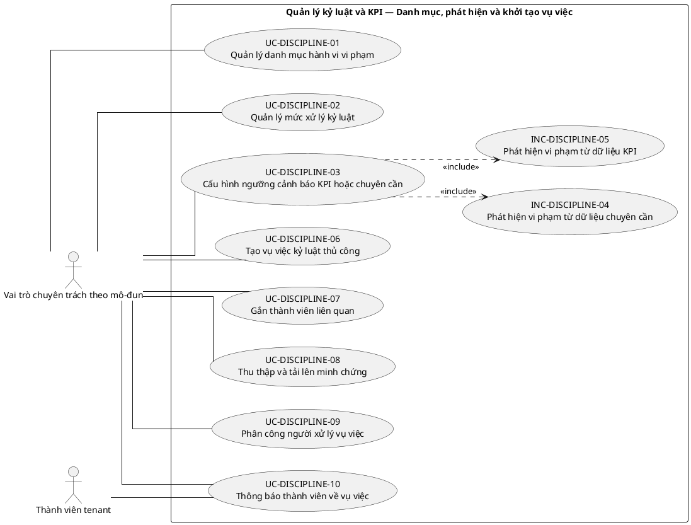
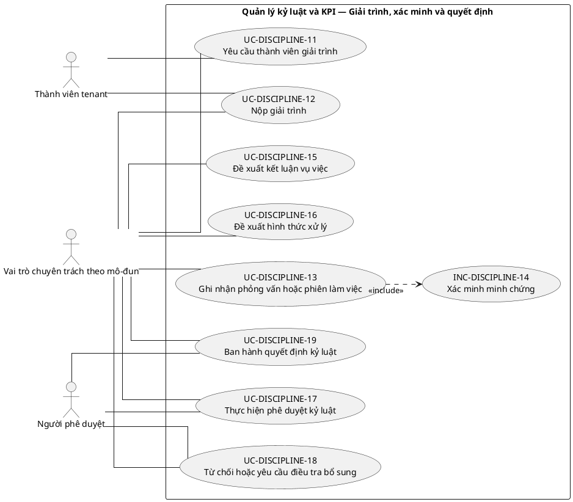
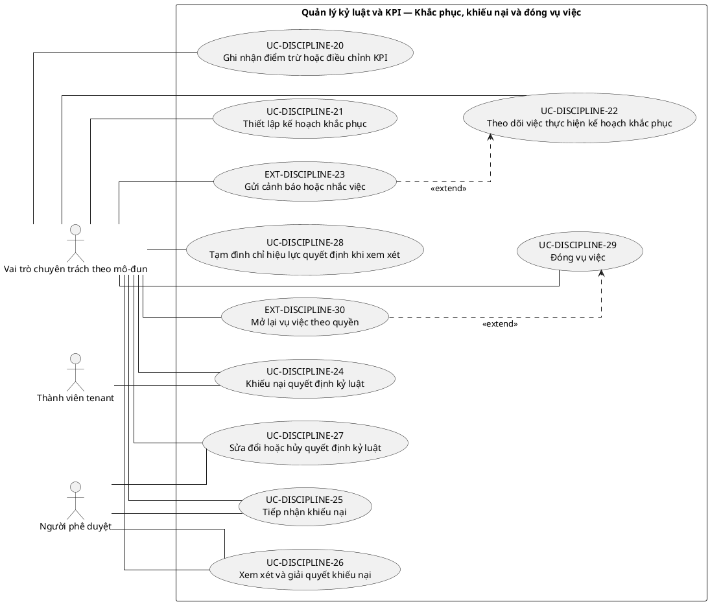
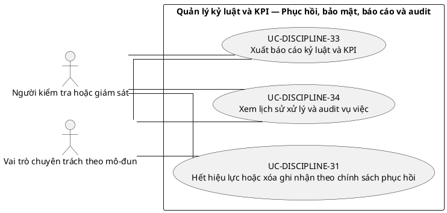

# UC-DISCIPLINE — Quản lý kỷ luật và KPI

## 1. Thông tin tài liệu

| Thuộc tính | Nội dung |
|---|---|
| Mã nhóm Use Case | `UC-DISCIPLINE` |
| Tên | Quản lý kỷ luật và KPI |
| Miền nghiệp vụ | Quản trị thành viên |
| Mức ưu tiên phát triển | Mô-đun vận hành |
| Phạm vi | Toàn bộ sản phẩm Operations Hub |
| Mô hình | SaaS đa tổ chức, dữ liệu và cấu hình theo tenant |
| Trạng thái đặc tả | Baseline V3; phân biệt Use Case mục tiêu, include, extend và yêu cầu hệ thống |

> **Nguyên tắc phạm vi:** tài liệu mô tả năng lực của phiên bản sản phẩm hoàn chỉnh. Mức ưu tiên phát triển không đồng nghĩa với loại bỏ khỏi phạm vi sản phẩm.

## 2. Mục tiêu

Quản lý vụ việc kỷ luật, cảnh báo, KPI liên quan, bằng chứng, quyết định và khiếu nại theo quy trình minh bạch.

## 3. Actor

| Mã actor | Actor | Phạm vi |
|---|---|---|
| `ACT-TENANT-MEMBER` | Thành viên tenant | Tenant hoặc tích hợp |
| `ACT-MODULE-SPECIALIST` | Vai trò chuyên trách theo mô-đun | Tenant hoặc tích hợp |
| `ACT-APPROVER` | Người phê duyệt | Tenant hoặc tích hợp |
| `ACT-AUDITOR` | Người kiểm tra hoặc giám sát | Tenant hoặc tích hợp |

Actor trong sơ đồ chỉ thể hiện vai trò tương tác. Quyền thực tế phải được kiểm tra tại backend dựa trên tenant context, membership, role, permission, organization unit, trạng thái module và trạng thái tenant.

## 4. Điều kiện trước

- Module kỷ luật đã kích hoạt.
- Tenant đã cấu hình loại vi phạm, mức xử lý và chủ thể có thẩm quyền.

## 5. Điều kiện sau

- Vụ việc có hồ sơ, bằng chứng, quyết định và lịch sử trạng thái.
- Quyền xem dữ liệu nhạy cảm được giới hạn.

## 6. Danh mục phần tử nghiệp vụ và phân loại UML

> **Thay đổi của V3:** Không coi toàn bộ danh mục chức năng là Use Case độc lập. Chỉ phần tử có mục tiêu quan sát được đối với actor được giữ mã `UC-*`. Hành vi bắt buộc dùng chung dùng mã `INC-*`; luồng điều kiện dùng mã `EXT-*`; quy tắc hoặc xử lý xuyên suốt dùng mã `REQ-*`. Mã V2 được giữ để truy vết.

> Actor chỉ nối trực tiếp với `UC-*` hoặc `EXT-*` mà actor thực sự khởi phát/tham gia. `INC-*` được nối bằng `<<include>>`; `REQ-*` không được vẽ như Use Case.

| Mã V3 | Mã V2 | Phần tử nghiệp vụ | Loại mô hình | Actor trực tiếp / nguồn kích hoạt | Quan hệ |
|---|---|---|---|---|---|
| `UC-DISCIPLINE-01` | `UC-DISCIPLINE-01` | Quản lý danh mục hành vi vi phạm | Use Case mục tiêu actor | `ACT-MODULE-SPECIALIST` — Vai trò chuyên trách theo mô-đun | Association trực tiếp với actor |
| `UC-DISCIPLINE-02` | `UC-DISCIPLINE-02` | Quản lý mức xử lý kỷ luật | Use Case mục tiêu actor | `ACT-MODULE-SPECIALIST` — Vai trò chuyên trách theo mô-đun | Association trực tiếp với actor |
| `UC-DISCIPLINE-03` | `UC-DISCIPLINE-03` | Cấu hình ngưỡng cảnh báo KPI hoặc chuyên cần | Use Case mục tiêu actor | `ACT-MODULE-SPECIALIST` — Vai trò chuyên trách theo mô-đun | Association trực tiếp với actor |
| `INC-DISCIPLINE-04` | `UC-DISCIPLINE-04` | Phát hiện vi phạm từ dữ liệu chuyên cần | Hành vi dùng chung `<<include>>` | Hệ thống; được gọi từ Use Case cha | `UC-DISCIPLINE-03` `<<include>>` `INC-DISCIPLINE-04` |
| `INC-DISCIPLINE-05` | `UC-DISCIPLINE-05` | Phát hiện vi phạm từ dữ liệu KPI | Hành vi dùng chung `<<include>>` | Hệ thống; được gọi từ Use Case cha | `UC-DISCIPLINE-03` `<<include>>` `INC-DISCIPLINE-05` |
| `UC-DISCIPLINE-06` | `UC-DISCIPLINE-06` | Tạo vụ việc kỷ luật thủ công | Use Case mục tiêu actor | `ACT-MODULE-SPECIALIST` — Vai trò chuyên trách theo mô-đun | Association trực tiếp với actor |
| `UC-DISCIPLINE-07` | `UC-DISCIPLINE-07` | Gắn thành viên liên quan | Use Case mục tiêu actor | `ACT-MODULE-SPECIALIST` — Vai trò chuyên trách theo mô-đun | Association trực tiếp với actor |
| `UC-DISCIPLINE-08` | `UC-DISCIPLINE-08` | Thu thập và tải lên minh chứng | Use Case mục tiêu actor | `ACT-MODULE-SPECIALIST` — Vai trò chuyên trách theo mô-đun | Association trực tiếp với actor |
| `UC-DISCIPLINE-09` | `UC-DISCIPLINE-09` | Phân công người xử lý vụ việc | Use Case mục tiêu actor | `ACT-MODULE-SPECIALIST` — Vai trò chuyên trách theo mô-đun | Association trực tiếp với actor |
| `UC-DISCIPLINE-10` | `UC-DISCIPLINE-10` | Thông báo thành viên về vụ việc | Use Case mục tiêu actor | `ACT-TENANT-MEMBER` — Thành viên tenant<br>`ACT-MODULE-SPECIALIST` — Vai trò chuyên trách theo mô-đun | Association trực tiếp với actor |
| `UC-DISCIPLINE-11` | `UC-DISCIPLINE-11` | Yêu cầu thành viên giải trình | Use Case mục tiêu actor | `ACT-TENANT-MEMBER` — Thành viên tenant<br>`ACT-MODULE-SPECIALIST` — Vai trò chuyên trách theo mô-đun | Association trực tiếp với actor |
| `UC-DISCIPLINE-12` | `UC-DISCIPLINE-12` | Nộp giải trình | Use Case mục tiêu actor | `ACT-TENANT-MEMBER` — Thành viên tenant<br>`ACT-MODULE-SPECIALIST` — Vai trò chuyên trách theo mô-đun | Association trực tiếp với actor |
| `UC-DISCIPLINE-13` | `UC-DISCIPLINE-13` | Ghi nhận phỏng vấn hoặc phiên làm việc | Use Case mục tiêu actor | `ACT-MODULE-SPECIALIST` — Vai trò chuyên trách theo mô-đun | Association trực tiếp với actor |
| `INC-DISCIPLINE-14` | `UC-DISCIPLINE-14` | Xác minh minh chứng | Hành vi dùng chung `<<include>>` | Hệ thống; được gọi từ Use Case cha | `UC-DISCIPLINE-13` `<<include>>` `INC-DISCIPLINE-14` |
| `UC-DISCIPLINE-15` | `UC-DISCIPLINE-15` | Đề xuất kết luận vụ việc | Use Case mục tiêu actor | `ACT-MODULE-SPECIALIST` — Vai trò chuyên trách theo mô-đun | Association trực tiếp với actor |
| `UC-DISCIPLINE-16` | `UC-DISCIPLINE-16` | Đề xuất hình thức xử lý | Use Case mục tiêu actor | `ACT-MODULE-SPECIALIST` — Vai trò chuyên trách theo mô-đun | Association trực tiếp với actor |
| `UC-DISCIPLINE-17` | `UC-DISCIPLINE-17` | Thực hiện phê duyệt kỷ luật | Use Case mục tiêu actor | `ACT-APPROVER` — Người phê duyệt<br>`ACT-MODULE-SPECIALIST` — Vai trò chuyên trách theo mô-đun | Association trực tiếp với actor |
| `UC-DISCIPLINE-18` | `UC-DISCIPLINE-18` | Từ chối hoặc yêu cầu điều tra bổ sung | Use Case mục tiêu actor | `ACT-APPROVER` — Người phê duyệt<br>`ACT-MODULE-SPECIALIST` — Vai trò chuyên trách theo mô-đun | Association trực tiếp với actor |
| `UC-DISCIPLINE-19` | `UC-DISCIPLINE-19` | Ban hành quyết định kỷ luật | Use Case mục tiêu actor | `ACT-APPROVER` — Người phê duyệt<br>`ACT-MODULE-SPECIALIST` — Vai trò chuyên trách theo mô-đun | Association trực tiếp với actor |
| `UC-DISCIPLINE-20` | `UC-DISCIPLINE-20` | Ghi nhận điểm trừ hoặc điều chỉnh KPI | Use Case mục tiêu actor | `ACT-MODULE-SPECIALIST` — Vai trò chuyên trách theo mô-đun | Association trực tiếp với actor |
| `UC-DISCIPLINE-21` | `UC-DISCIPLINE-21` | Thiết lập kế hoạch khắc phục | Use Case mục tiêu actor | `ACT-MODULE-SPECIALIST` — Vai trò chuyên trách theo mô-đun | Association trực tiếp với actor |
| `UC-DISCIPLINE-22` | `UC-DISCIPLINE-22` | Theo dõi việc thực hiện kế hoạch khắc phục | Use Case mục tiêu actor | `ACT-MODULE-SPECIALIST` — Vai trò chuyên trách theo mô-đun | Association trực tiếp với actor |
| `EXT-DISCIPLINE-23` | `UC-DISCIPLINE-23` | Gửi cảnh báo hoặc nhắc việc | Luồng điều kiện `<<extend>>` | `ACT-MODULE-SPECIALIST` — Vai trò chuyên trách theo mô-đun | `EXT-DISCIPLINE-23` `<<extend>>` `UC-DISCIPLINE-22` |
| `UC-DISCIPLINE-24` | `UC-DISCIPLINE-24` | Khiếu nại quyết định kỷ luật | Use Case mục tiêu actor | `ACT-TENANT-MEMBER` — Thành viên tenant<br>`ACT-MODULE-SPECIALIST` — Vai trò chuyên trách theo mô-đun | Association trực tiếp với actor |
| `UC-DISCIPLINE-25` | `UC-DISCIPLINE-25` | Tiếp nhận khiếu nại | Use Case mục tiêu actor | `ACT-APPROVER` — Người phê duyệt<br>`ACT-MODULE-SPECIALIST` — Vai trò chuyên trách theo mô-đun | Association trực tiếp với actor |
| `UC-DISCIPLINE-26` | `UC-DISCIPLINE-26` | Xem xét và giải quyết khiếu nại | Use Case mục tiêu actor | `ACT-APPROVER` — Người phê duyệt<br>`ACT-MODULE-SPECIALIST` — Vai trò chuyên trách theo mô-đun | Association trực tiếp với actor |
| `UC-DISCIPLINE-27` | `UC-DISCIPLINE-27` | Sửa đổi hoặc hủy quyết định kỷ luật | Use Case mục tiêu actor | `ACT-APPROVER` — Người phê duyệt<br>`ACT-MODULE-SPECIALIST` — Vai trò chuyên trách theo mô-đun | Association trực tiếp với actor |
| `UC-DISCIPLINE-28` | `UC-DISCIPLINE-28` | Tạm đình chỉ hiệu lực quyết định khi xem xét | Use Case mục tiêu actor | `ACT-MODULE-SPECIALIST` — Vai trò chuyên trách theo mô-đun | Association trực tiếp với actor |
| `UC-DISCIPLINE-29` | `UC-DISCIPLINE-29` | Đóng vụ việc | Use Case mục tiêu actor | `ACT-MODULE-SPECIALIST` — Vai trò chuyên trách theo mô-đun | Association trực tiếp với actor |
| `EXT-DISCIPLINE-30` | `UC-DISCIPLINE-30` | Mở lại vụ việc theo quyền | Luồng điều kiện `<<extend>>` | `ACT-MODULE-SPECIALIST` — Vai trò chuyên trách theo mô-đun | `EXT-DISCIPLINE-30` `<<extend>>` `UC-DISCIPLINE-29` |
| `UC-DISCIPLINE-31` | `UC-DISCIPLINE-31` | Hết hiệu lực hoặc xóa ghi nhận theo chính sách phục hồi | Use Case mục tiêu actor | `ACT-AUDITOR` — Người kiểm tra hoặc giám sát<br>`ACT-MODULE-SPECIALIST` — Vai trò chuyên trách theo mô-đun | Association trực tiếp với actor |
| `REQ-DISCIPLINE-32` | `UC-DISCIPLINE-32` | Giới hạn truy cập hồ sơ nhạy cảm | Quy tắc/yêu cầu hệ thống | Hệ thống/chính sách; không có association actor trực tiếp | Áp dụng như quy tắc/yêu cầu xuyên suốt; không nối actor trực tiếp |
| `UC-DISCIPLINE-33` | `UC-DISCIPLINE-33` | Xuất báo cáo kỷ luật và KPI | Use Case mục tiêu actor | `ACT-AUDITOR` — Người kiểm tra hoặc giám sát<br>`ACT-MODULE-SPECIALIST` — Vai trò chuyên trách theo mô-đun | Association trực tiếp với actor |
| `UC-DISCIPLINE-34` | `UC-DISCIPLINE-34` | Xem lịch sử xử lý và audit vụ việc | Use Case mục tiêu actor | `ACT-AUDITOR` — Người kiểm tra hoặc giám sát<br>`ACT-MODULE-SPECIALIST` — Vai trò chuyên trách theo mô-đun | Association trực tiếp với actor |

## 7. Luồng nghiệp vụ chính

1. Discipline Officer tạo vụ việc và gắn thành viên.
2. Hệ thống kiểm tra phạm vi, loại vi phạm và dữ liệu nguồn.
3. Người xử lý thu thập minh chứng và yêu cầu giải trình.
4. Người có thẩm quyền xem hồ sơ và phê duyệt mức xử lý.
5. Hệ thống thông báo quyết định, thời hạn khiếu nại và cập nhật trạng thái.
6. Vụ việc được đóng sau khi hết quy trình hoặc hoàn tất xem xét lại.

## 8. Luồng thay thế và ngoại lệ

- Thiếu thẩm quyền: từ chối xem hoặc xử lý.
- Bằng chứng thuộc tenant khác: từ chối liên kết.
- Vụ việc đã đóng: chỉ mở lại qua quy trình có quyền.
- Cấu hình ngưỡng thay đổi: không tự động viết lại kết quả lịch sử đã chốt.

## 9. Quy tắc nghiệp vụ cốt lõi

- Dữ liệu kỷ luật là dữ liệu hạn chế và chỉ hiển thị theo nhu cầu nghiệp vụ.
- Người bị đánh giá không được tự phê duyệt quyết định của mình.
- Mọi quyết định phải dựa trên hồ sơ và bằng chứng liên kết.
- Đồng bộ chuyên cần hoặc KPI phải chống tạo trùng.
- Đóng vụ việc không xóa quyền khiếu nại còn hiệu lực.

## 10. Mô hình dữ liệu logic liên quan

| Thực thể | Vai trò |
|---|---|
| `DisciplineCase` | Thực thể logic phục vụ UC-DISCIPLINE; thiết kế vật lý được xác định ở giai đoạn thiết kế dữ liệu. |
| `ViolationType` | Thực thể logic phục vụ UC-DISCIPLINE; thiết kế vật lý được xác định ở giai đoạn thiết kế dữ liệu. |
| `Evidence` | Thực thể logic phục vụ UC-DISCIPLINE; thiết kế vật lý được xác định ở giai đoạn thiết kế dữ liệu. |
| `Explanation` | Thực thể logic phục vụ UC-DISCIPLINE; thiết kế vật lý được xác định ở giai đoạn thiết kế dữ liệu. |
| `DisciplineDecision` | Thực thể logic phục vụ UC-DISCIPLINE; thiết kế vật lý được xác định ở giai đoạn thiết kế dữ liệu. |
| `KpiRecord` | Thực thể logic phục vụ UC-DISCIPLINE; thiết kế vật lý được xác định ở giai đoạn thiết kế dữ liệu. |
| `Appeal` | Thực thể logic phục vụ UC-DISCIPLINE; thiết kế vật lý được xác định ở giai đoạn thiết kế dữ liệu. |
| `CaseStatusHistory` | Thực thể logic phục vụ UC-DISCIPLINE; thiết kế vật lý được xác định ở giai đoạn thiết kế dữ liệu. |
| `AuditLog` | Thực thể logic phục vụ UC-DISCIPLINE; thiết kế vật lý được xác định ở giai đoạn thiết kế dữ liệu. |

Mọi thực thể nghiệp vụ phải xác định được tenant sở hữu, trừ thực thể được công bố rõ là dữ liệu cấp nền tảng. Quan hệ tham chiếu chéo tenant bị cấm nếu không có cơ chế liên tenant được đặc tả riêng.

## 11. Kiểm soát truy cập

Quyền hiệu lực được xác định theo công thức khái quát:

```text
Quyền hiệu lực
= Permission từ các Role đang hoạt động
∩ Tenant context hợp lệ
∩ Membership đang hoạt động
∩ Phạm vi Organization Unit
∩ Phạm vi tài nguyên
∩ Trạng thái Module
∩ Trạng thái Tenant
```

Các kiểm tra bắt buộc:

- Xác thực User trước khi truy cập chức năng không công khai.
- Đối chiếu tenant context với membership.
- Kiểm tra permission tại backend, không dựa vào trạng thái hiển thị của frontend.
- Giới hạn truy vấn, tệp, bản xuất, cache và tác vụ nền theo tenant.
- Ghi audit cho hành động quản trị hoặc thay đổi nghiệp vụ quan trọng.

## 12. Tiêu chí chấp nhận

| Mã | Tiêu chí | Phương pháp kiểm chứng |
|---|---|---|
| `AC-DISCIPLINE-01` | Người không có quyền không xem được nội dung vụ việc. | Functional / Integration / Security Test tùy nội dung |
| `AC-DISCIPLINE-02` | Quyết định có người duyệt, thời điểm và bằng chứng. | Functional / Integration / Security Test tùy nội dung |
| `AC-DISCIPLINE-03` | Đồng bộ chuyên cần nhiều lần không tạo bản ghi KPI trùng. | Functional / Integration / Security Test tùy nội dung |
| `AC-DISCIPLINE-04` | Khiếu nại được xử lý theo trạng thái và thời hạn. | Functional / Integration / Security Test tùy nội dung |

## 13. Quan hệ với nhóm Use Case khác

[`UC-MEMBER`](./09_UC-MEMBER.md), [`UC-MEETING`](./14_UC-MEETING.md), [`UC-DOCUMENT`](./11_UC-DOCUMENT.md), [`UC-NOTIFICATION`](./18_UC-NOTIFICATION.md), [`UC-AUDIT`](./21_UC-AUDIT.md)

## 14. Use Case Diagram theo luồng nghiệp vụ

Các package/rectangle dưới đây chỉ là **ranh giới hệ thống hoặc miền nghiệp vụ**. Không tồn tại phần tử trung gian `PKG*`; actor liên kết trực tiếp với Use Case có mục tiêu nghiệp vụ. `INC-*` và `EXT-*` chỉ xuất hiện qua quan hệ UML tương ứng; `REQ-*` được trình bày ngoài sơ đồ.

### 14.1. Quy ước đọc sơ đồ

- `Actor -- UC-*`: actor trực tiếp thực hiện hoặc tham gia mục tiêu nghiệp vụ.
- `UC-* ..> INC-* : <<include>>`: hành vi bắt buộc được dùng lại.
- `EXT-* ..> UC-* : <<extend>>`: hành vi chỉ phát sinh trong điều kiện xác định.
- `REQ-*`: quy tắc/yêu cầu hệ thống, không phải Use Case và không nối actor.

### 14.2. Danh mục, phát hiện và khởi tạo vụ việc



### 14.3. Giải trình, xác minh và quyết định



### 14.4. Khắc phục, khiếu nại và đóng vụ việc



### 14.5. Phục hồi, bảo mật, báo cáo và audit



**Quy tắc/yêu cầu áp dụng cho luồng này:**
- `REQ-DISCIPLINE-32` — Giới hạn truy cập hồ sơ nhạy cảm
