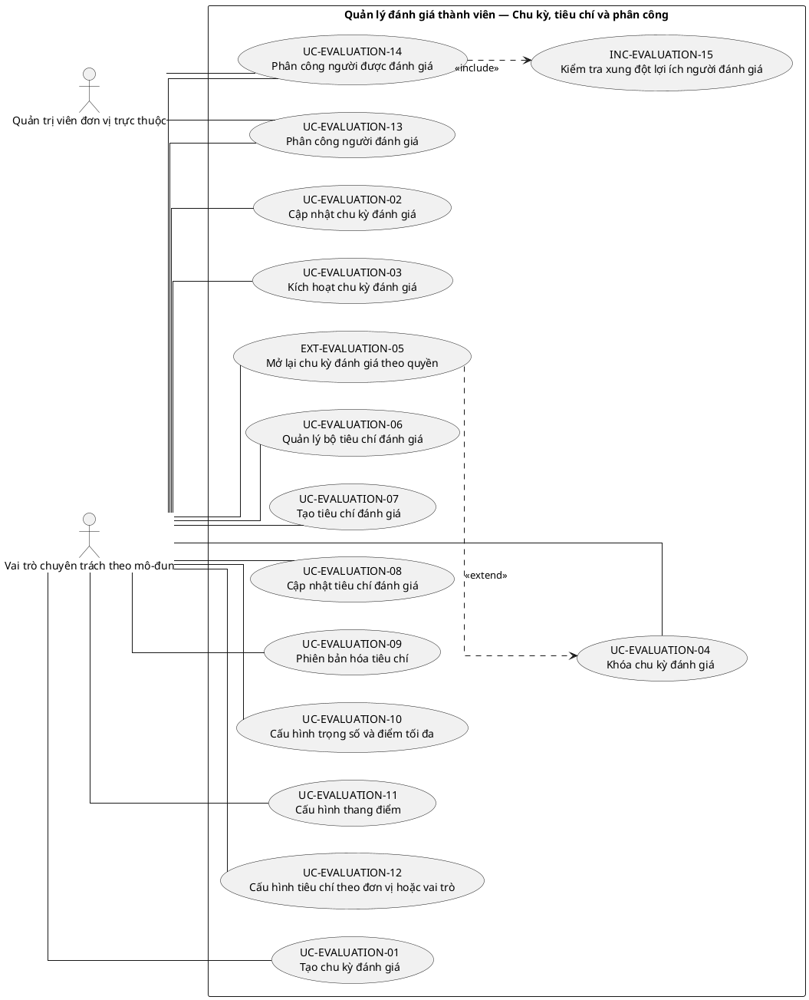
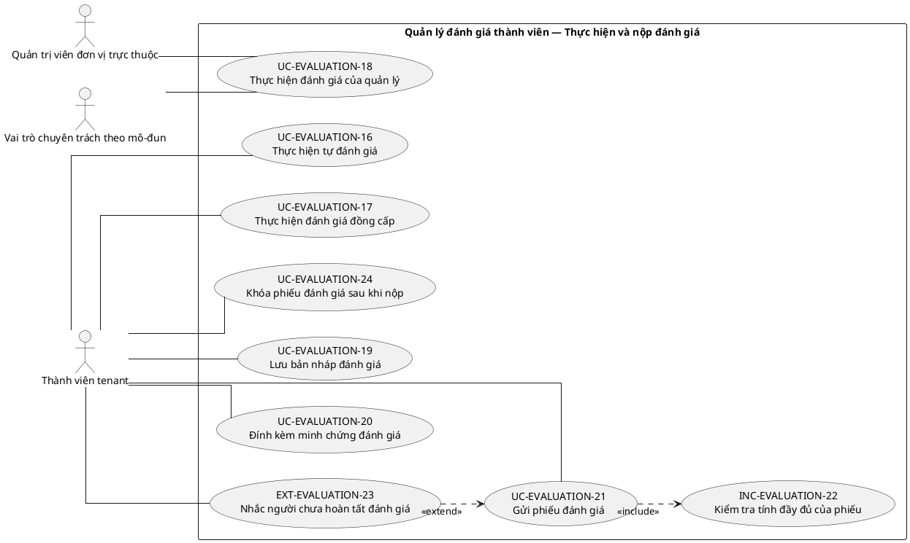
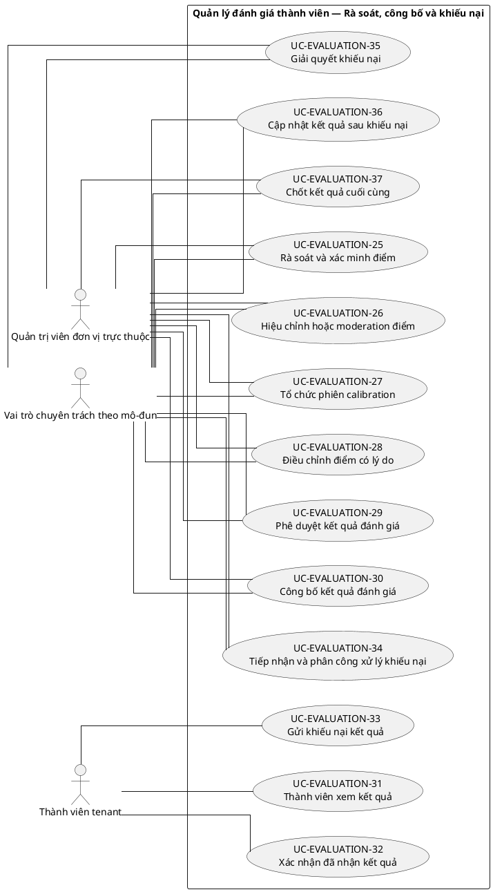
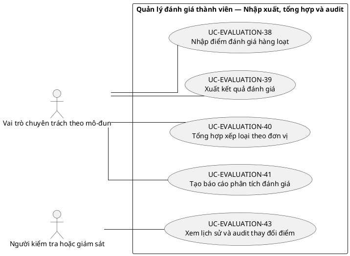

# UC-EVALUATION — Quản lý đánh giá thành viên

## 1. Thông tin tài liệu

| Thuộc tính | Nội dung |
|---|---|
| Mã nhóm Use Case | `UC-EVALUATION` |
| Tên | Quản lý đánh giá thành viên |
| Miền nghiệp vụ | Quản trị thành viên |
| Mức ưu tiên phát triển | Mô-đun vận hành |
| Phạm vi | Toàn bộ sản phẩm Operations Hub |
| Mô hình | SaaS đa tổ chức, dữ liệu và cấu hình theo tenant |
| Trạng thái đặc tả | Baseline V3; phân biệt Use Case mục tiêu, include, extend và yêu cầu hệ thống |

> **Nguyên tắc phạm vi:** tài liệu mô tả năng lực của phiên bản sản phẩm hoàn chỉnh. Mức ưu tiên phát triển không đồng nghĩa với loại bỏ khỏi phạm vi sản phẩm.

## 2. Mục tiêu

Quản lý chu kỳ, bộ tiêu chí, phân công, điểm, minh chứng, phê duyệt và khóa kết quả đánh giá.

## 3. Actor

| Mã actor | Actor | Phạm vi |
|---|---|---|
| `ACT-TENANT-MEMBER` | Thành viên tenant | Tenant hoặc tích hợp |
| `ACT-MODULE-SPECIALIST` | Vai trò chuyên trách theo mô-đun | Tenant hoặc tích hợp |
| `ACT-UNIT-ADMIN` | Quản trị viên đơn vị trực thuộc | Tenant hoặc tích hợp |
| `ACT-AUDITOR` | Người kiểm tra hoặc giám sát | Tenant hoặc tích hợp |

Actor trong sơ đồ chỉ thể hiện vai trò tương tác. Quyền thực tế phải được kiểm tra tại backend dựa trên tenant context, membership, role, permission, organization unit, trạng thái module và trạng thái tenant.

## 4. Điều kiện trước

- Module đánh giá đã kích hoạt.
- Chu kỳ và tiêu chí đã được cấu hình hoặc chọn từ template hợp lệ.

## 5. Điều kiện sau

- Điểm đánh giá có nguồn, người ghi nhận, thời điểm và bằng chứng khi yêu cầu.
- Kết quả khóa không bị chỉnh sửa trái quy trình.

## 6. Danh mục phần tử nghiệp vụ và phân loại UML

> **Thay đổi của V3:** Không coi toàn bộ danh mục chức năng là Use Case độc lập. Chỉ phần tử có mục tiêu quan sát được đối với actor được giữ mã `UC-*`. Hành vi bắt buộc dùng chung dùng mã `INC-*`; luồng điều kiện dùng mã `EXT-*`; quy tắc hoặc xử lý xuyên suốt dùng mã `REQ-*`. Mã V2 được giữ để truy vết.

> Actor chỉ nối trực tiếp với `UC-*` hoặc `EXT-*` mà actor thực sự khởi phát/tham gia. `INC-*` được nối bằng `<<include>>`; `REQ-*` không được vẽ như Use Case.

| Mã V3 | Mã V2 | Phần tử nghiệp vụ | Loại mô hình | Actor trực tiếp / nguồn kích hoạt | Quan hệ |
|---|---|---|---|---|---|
| `UC-EVALUATION-01` | `UC-EVALUATION-01` | Tạo chu kỳ đánh giá | Use Case mục tiêu actor | `ACT-MODULE-SPECIALIST` — Vai trò chuyên trách theo mô-đun | Association trực tiếp với actor |
| `UC-EVALUATION-02` | `UC-EVALUATION-02` | Cập nhật chu kỳ đánh giá | Use Case mục tiêu actor | `ACT-MODULE-SPECIALIST` — Vai trò chuyên trách theo mô-đun | Association trực tiếp với actor |
| `UC-EVALUATION-03` | `UC-EVALUATION-03` | Kích hoạt chu kỳ đánh giá | Use Case mục tiêu actor | `ACT-MODULE-SPECIALIST` — Vai trò chuyên trách theo mô-đun | Association trực tiếp với actor |
| `UC-EVALUATION-04` | `UC-EVALUATION-04` | Khóa chu kỳ đánh giá | Use Case mục tiêu actor | `ACT-MODULE-SPECIALIST` — Vai trò chuyên trách theo mô-đun | Association trực tiếp với actor |
| `EXT-EVALUATION-05` | `UC-EVALUATION-05` | Mở lại chu kỳ đánh giá theo quyền | Luồng điều kiện `<<extend>>` | `ACT-MODULE-SPECIALIST` — Vai trò chuyên trách theo mô-đun | `EXT-EVALUATION-05` `<<extend>>` `UC-EVALUATION-04` |
| `UC-EVALUATION-06` | `UC-EVALUATION-06` | Quản lý bộ tiêu chí đánh giá | Use Case mục tiêu actor | `ACT-MODULE-SPECIALIST` — Vai trò chuyên trách theo mô-đun | Association trực tiếp với actor |
| `UC-EVALUATION-07` | `UC-EVALUATION-07` | Tạo tiêu chí đánh giá | Use Case mục tiêu actor | `ACT-MODULE-SPECIALIST` — Vai trò chuyên trách theo mô-đun | Association trực tiếp với actor |
| `UC-EVALUATION-08` | `UC-EVALUATION-08` | Cập nhật tiêu chí đánh giá | Use Case mục tiêu actor | `ACT-MODULE-SPECIALIST` — Vai trò chuyên trách theo mô-đun | Association trực tiếp với actor |
| `UC-EVALUATION-09` | `UC-EVALUATION-09` | Phiên bản hóa tiêu chí | Use Case mục tiêu actor | `ACT-MODULE-SPECIALIST` — Vai trò chuyên trách theo mô-đun | Association trực tiếp với actor |
| `UC-EVALUATION-10` | `UC-EVALUATION-10` | Cấu hình trọng số và điểm tối đa | Use Case mục tiêu actor | `ACT-MODULE-SPECIALIST` — Vai trò chuyên trách theo mô-đun | Association trực tiếp với actor |
| `UC-EVALUATION-11` | `UC-EVALUATION-11` | Cấu hình thang điểm | Use Case mục tiêu actor | `ACT-MODULE-SPECIALIST` — Vai trò chuyên trách theo mô-đun | Association trực tiếp với actor |
| `UC-EVALUATION-12` | `UC-EVALUATION-12` | Cấu hình tiêu chí theo đơn vị hoặc vai trò | Use Case mục tiêu actor | `ACT-MODULE-SPECIALIST` — Vai trò chuyên trách theo mô-đun | Association trực tiếp với actor |
| `UC-EVALUATION-13` | `UC-EVALUATION-13` | Phân công người đánh giá | Use Case mục tiêu actor | `ACT-UNIT-ADMIN` — Quản trị viên đơn vị trực thuộc<br>`ACT-MODULE-SPECIALIST` — Vai trò chuyên trách theo mô-đun | Association trực tiếp với actor |
| `UC-EVALUATION-14` | `UC-EVALUATION-14` | Phân công người được đánh giá | Use Case mục tiêu actor | `ACT-UNIT-ADMIN` — Quản trị viên đơn vị trực thuộc<br>`ACT-MODULE-SPECIALIST` — Vai trò chuyên trách theo mô-đun | Association trực tiếp với actor |
| `INC-EVALUATION-15` | `UC-EVALUATION-15` | Kiểm tra xung đột lợi ích người đánh giá | Hành vi dùng chung `<<include>>` | Hệ thống; được gọi từ Use Case cha | `UC-EVALUATION-14` `<<include>>` `INC-EVALUATION-15` |
| `UC-EVALUATION-16` | `UC-EVALUATION-16` | Thực hiện tự đánh giá | Use Case mục tiêu actor | `ACT-TENANT-MEMBER` — Thành viên tenant | Association trực tiếp với actor |
| `UC-EVALUATION-17` | `UC-EVALUATION-17` | Thực hiện đánh giá đồng cấp | Use Case mục tiêu actor | `ACT-TENANT-MEMBER` — Thành viên tenant | Association trực tiếp với actor |
| `UC-EVALUATION-18` | `UC-EVALUATION-18` | Thực hiện đánh giá của quản lý | Use Case mục tiêu actor | `ACT-UNIT-ADMIN` — Quản trị viên đơn vị trực thuộc<br>`ACT-MODULE-SPECIALIST` — Vai trò chuyên trách theo mô-đun | Association trực tiếp với actor |
| `UC-EVALUATION-19` | `UC-EVALUATION-19` | Lưu bản nháp đánh giá | Use Case mục tiêu actor | `ACT-TENANT-MEMBER` — Thành viên tenant | Association trực tiếp với actor |
| `UC-EVALUATION-20` | `UC-EVALUATION-20` | Đính kèm minh chứng đánh giá | Use Case mục tiêu actor | `ACT-TENANT-MEMBER` — Thành viên tenant | Association trực tiếp với actor |
| `UC-EVALUATION-21` | `UC-EVALUATION-21` | Gửi phiếu đánh giá | Use Case mục tiêu actor | `ACT-TENANT-MEMBER` — Thành viên tenant | Association trực tiếp với actor |
| `INC-EVALUATION-22` | `UC-EVALUATION-22` | Kiểm tra tính đầy đủ của phiếu | Hành vi dùng chung `<<include>>` | Hệ thống; được gọi từ Use Case cha | `UC-EVALUATION-21` `<<include>>` `INC-EVALUATION-22` |
| `EXT-EVALUATION-23` | `UC-EVALUATION-23` | Nhắc người chưa hoàn tất đánh giá | Luồng điều kiện `<<extend>>` | `ACT-TENANT-MEMBER` — Thành viên tenant | `EXT-EVALUATION-23` `<<extend>>` `UC-EVALUATION-21` |
| `UC-EVALUATION-24` | `UC-EVALUATION-24` | Khóa phiếu đánh giá sau khi nộp | Use Case mục tiêu actor | `ACT-TENANT-MEMBER` — Thành viên tenant | Association trực tiếp với actor |
| `UC-EVALUATION-25` | `UC-EVALUATION-25` | Rà soát và xác minh điểm | Use Case mục tiêu actor | `ACT-UNIT-ADMIN` — Quản trị viên đơn vị trực thuộc<br>`ACT-MODULE-SPECIALIST` — Vai trò chuyên trách theo mô-đun | Association trực tiếp với actor |
| `UC-EVALUATION-26` | `UC-EVALUATION-26` | Hiệu chỉnh hoặc moderation điểm | Use Case mục tiêu actor | `ACT-UNIT-ADMIN` — Quản trị viên đơn vị trực thuộc<br>`ACT-MODULE-SPECIALIST` — Vai trò chuyên trách theo mô-đun | Association trực tiếp với actor |
| `UC-EVALUATION-27` | `UC-EVALUATION-27` | Tổ chức phiên calibration | Use Case mục tiêu actor | `ACT-UNIT-ADMIN` — Quản trị viên đơn vị trực thuộc<br>`ACT-MODULE-SPECIALIST` — Vai trò chuyên trách theo mô-đun | Association trực tiếp với actor |
| `UC-EVALUATION-28` | `UC-EVALUATION-28` | Điều chỉnh điểm có lý do | Use Case mục tiêu actor | `ACT-UNIT-ADMIN` — Quản trị viên đơn vị trực thuộc<br>`ACT-MODULE-SPECIALIST` — Vai trò chuyên trách theo mô-đun | Association trực tiếp với actor |
| `UC-EVALUATION-29` | `UC-EVALUATION-29` | Phê duyệt kết quả đánh giá | Use Case mục tiêu actor | `ACT-UNIT-ADMIN` — Quản trị viên đơn vị trực thuộc<br>`ACT-MODULE-SPECIALIST` — Vai trò chuyên trách theo mô-đun | Association trực tiếp với actor |
| `UC-EVALUATION-30` | `UC-EVALUATION-30` | Công bố kết quả đánh giá | Use Case mục tiêu actor | `ACT-UNIT-ADMIN` — Quản trị viên đơn vị trực thuộc<br>`ACT-MODULE-SPECIALIST` — Vai trò chuyên trách theo mô-đun | Association trực tiếp với actor |
| `UC-EVALUATION-31` | `UC-EVALUATION-31` | Thành viên xem kết quả | Use Case mục tiêu actor | `ACT-TENANT-MEMBER` — Thành viên tenant | Association trực tiếp với actor |
| `UC-EVALUATION-32` | `UC-EVALUATION-32` | Xác nhận đã nhận kết quả | Use Case mục tiêu actor | `ACT-TENANT-MEMBER` — Thành viên tenant | Association trực tiếp với actor |
| `UC-EVALUATION-33` | `UC-EVALUATION-33` | Gửi khiếu nại kết quả | Use Case mục tiêu actor | `ACT-TENANT-MEMBER` — Thành viên tenant | Association trực tiếp với actor |
| `UC-EVALUATION-34` | `UC-EVALUATION-34` | Tiếp nhận và phân công xử lý khiếu nại | Use Case mục tiêu actor | `ACT-UNIT-ADMIN` — Quản trị viên đơn vị trực thuộc<br>`ACT-MODULE-SPECIALIST` — Vai trò chuyên trách theo mô-đun | Association trực tiếp với actor |
| `UC-EVALUATION-35` | `UC-EVALUATION-35` | Giải quyết khiếu nại | Use Case mục tiêu actor | `ACT-UNIT-ADMIN` — Quản trị viên đơn vị trực thuộc<br>`ACT-MODULE-SPECIALIST` — Vai trò chuyên trách theo mô-đun | Association trực tiếp với actor |
| `UC-EVALUATION-36` | `UC-EVALUATION-36` | Cập nhật kết quả sau khiếu nại | Use Case mục tiêu actor | `ACT-UNIT-ADMIN` — Quản trị viên đơn vị trực thuộc<br>`ACT-MODULE-SPECIALIST` — Vai trò chuyên trách theo mô-đun | Association trực tiếp với actor |
| `UC-EVALUATION-37` | `UC-EVALUATION-37` | Chốt kết quả cuối cùng | Use Case mục tiêu actor | `ACT-UNIT-ADMIN` — Quản trị viên đơn vị trực thuộc<br>`ACT-MODULE-SPECIALIST` — Vai trò chuyên trách theo mô-đun | Association trực tiếp với actor |
| `UC-EVALUATION-38` | `UC-EVALUATION-38` | Nhập điểm đánh giá hàng loạt | Use Case mục tiêu actor | `ACT-MODULE-SPECIALIST` — Vai trò chuyên trách theo mô-đun | Association trực tiếp với actor |
| `UC-EVALUATION-39` | `UC-EVALUATION-39` | Xuất kết quả đánh giá | Use Case mục tiêu actor | `ACT-MODULE-SPECIALIST` — Vai trò chuyên trách theo mô-đun | Association trực tiếp với actor |
| `UC-EVALUATION-40` | `UC-EVALUATION-40` | Tổng hợp xếp loại theo đơn vị | Use Case mục tiêu actor | `ACT-MODULE-SPECIALIST` — Vai trò chuyên trách theo mô-đun | Association trực tiếp với actor |
| `UC-EVALUATION-41` | `UC-EVALUATION-41` | Tạo báo cáo phân tích đánh giá | Use Case mục tiêu actor | `ACT-MODULE-SPECIALIST` — Vai trò chuyên trách theo mô-đun | Association trực tiếp với actor |
| `REQ-EVALUATION-42` | `UC-EVALUATION-42` | Ẩn danh người đánh giá khi chính sách yêu cầu | Quy tắc/yêu cầu hệ thống | Hệ thống/chính sách; không có association actor trực tiếp | Áp dụng như quy tắc/yêu cầu xuyên suốt; không nối actor trực tiếp |
| `UC-EVALUATION-43` | `UC-EVALUATION-43` | Xem lịch sử và audit thay đổi điểm | Use Case mục tiêu actor | `ACT-AUDITOR` — Người kiểm tra hoặc giám sát | Association trực tiếp với actor |

## 7. Luồng nghiệp vụ chính

1. Evaluation Manager tạo chu kỳ và chọn bộ tiêu chí.
2. Hệ thống snapshot phiên bản tiêu chí áp dụng.
3. Người quản lý phân công evaluator theo đơn vị.
4. Evaluator ghi điểm và đính kèm minh chứng.
5. Người xác minh kiểm tra và yêu cầu điều chỉnh nếu cần.
6. Kết quả được phê duyệt, khóa và công bố theo quyền.

## 8. Luồng thay thế và ngoại lệ

- Điểm vượt giới hạn: từ chối.
- Evaluator ngoài đơn vị: từ chối.
- Chu kỳ đã khóa: không cho sửa bản ghi gốc.
- Tiêu chí bị thay đổi giữa chu kỳ: chu kỳ tiếp tục dùng snapshot đã chốt.

## 9. Quy tắc nghiệp vụ cốt lõi

- Điểm không được vượt điểm tối đa của tiêu chí trừ khi tiêu chí cho phép điểm cộng riêng.
- Tiêu chí đang hiệu lực tại thời điểm ghi điểm phải được lưu tham chiếu phiên bản.
- Người đánh giá chỉ chấm trong đơn vị và phạm vi được giao.
- Chu kỳ đã khóa không chỉnh sửa trực tiếp; điều chỉnh phải tạo sự kiện bổ sung có phê duyệt.
- Minh chứng bắt buộc phải tồn tại trước khi xác minh điểm.

## 10. Mô hình dữ liệu logic liên quan

| Thực thể | Vai trò |
|---|---|
| `EvaluationCycle` | Thực thể logic phục vụ UC-EVALUATION; thiết kế vật lý được xác định ở giai đoạn thiết kế dữ liệu. |
| `EvaluationCriterion` | Thực thể logic phục vụ UC-EVALUATION; thiết kế vật lý được xác định ở giai đoạn thiết kế dữ liệu. |
| `CriterionVersion` | Thực thể logic phục vụ UC-EVALUATION; thiết kế vật lý được xác định ở giai đoạn thiết kế dữ liệu. |
| `EvaluationAssignment` | Thực thể logic phục vụ UC-EVALUATION; thiết kế vật lý được xác định ở giai đoạn thiết kế dữ liệu. |
| `ScoreEvent` | Thực thể logic phục vụ UC-EVALUATION; thiết kế vật lý được xác định ở giai đoạn thiết kế dữ liệu. |
| `EvaluationEvidence` | Thực thể logic phục vụ UC-EVALUATION; thiết kế vật lý được xác định ở giai đoạn thiết kế dữ liệu. |
| `EvaluationResult` | Thực thể logic phục vụ UC-EVALUATION; thiết kế vật lý được xác định ở giai đoạn thiết kế dữ liệu. |
| `EvaluationAppeal` | Thực thể logic phục vụ UC-EVALUATION; thiết kế vật lý được xác định ở giai đoạn thiết kế dữ liệu. |
| `AuditLog` | Thực thể logic phục vụ UC-EVALUATION; thiết kế vật lý được xác định ở giai đoạn thiết kế dữ liệu. |

Mọi thực thể nghiệp vụ phải xác định được tenant sở hữu, trừ thực thể được công bố rõ là dữ liệu cấp nền tảng. Quan hệ tham chiếu chéo tenant bị cấm nếu không có cơ chế liên tenant được đặc tả riêng.

## 11. Kiểm soát truy cập

Quyền hiệu lực được xác định theo công thức khái quát:

```text
Quyền hiệu lực
= Permission từ các Role đang hoạt động
∩ Tenant context hợp lệ
∩ Membership đang hoạt động
∩ Phạm vi Organization Unit
∩ Phạm vi tài nguyên
∩ Trạng thái Module
∩ Trạng thái Tenant
```

Các kiểm tra bắt buộc:

- Xác thực User trước khi truy cập chức năng không công khai.
- Đối chiếu tenant context với membership.
- Kiểm tra permission tại backend, không dựa vào trạng thái hiển thị của frontend.
- Giới hạn truy vấn, tệp, bản xuất, cache và tác vụ nền theo tenant.
- Ghi audit cho hành động quản trị hoặc thay đổi nghiệp vụ quan trọng.

## 12. Tiêu chí chấp nhận

| Mã | Tiêu chí | Phương pháp kiểm chứng |
|---|---|---|
| `AC-EVALUATION-01` | Mỗi điểm truy vết được tiêu chí phiên bản, người ghi và thời điểm. | Functional / Integration / Security Test tùy nội dung |
| `AC-EVALUATION-02` | Chu kỳ khóa không thể sửa trực tiếp. | Functional / Integration / Security Test tùy nội dung |
| `AC-EVALUATION-03` | Quyền chấm điểm bị giới hạn theo đơn vị. | Functional / Integration / Security Test tùy nội dung |
| `AC-EVALUATION-04` | Tổng điểm được tính đúng từ các score event hợp lệ. | Functional / Integration / Security Test tùy nội dung |

## 13. Quan hệ với nhóm Use Case khác

[`UC-MEMBER`](./09_UC-MEMBER.md), [`UC-ORG`](./05_UC-ORG.md), [`UC-RBAC`](./04_UC-RBAC.md), [`UC-DOCUMENT`](./11_UC-DOCUMENT.md), [`UC-NOTIFICATION`](./18_UC-NOTIFICATION.md), [`UC-AUDIT`](./21_UC-AUDIT.md)

## 14. Use Case Diagram theo luồng nghiệp vụ

Các package/rectangle dưới đây chỉ là **ranh giới hệ thống hoặc miền nghiệp vụ**. Không tồn tại phần tử trung gian `PKG*`; actor liên kết trực tiếp với Use Case có mục tiêu nghiệp vụ. `INC-*` và `EXT-*` chỉ xuất hiện qua quan hệ UML tương ứng; `REQ-*` được trình bày ngoài sơ đồ.

### 14.1. Quy ước đọc sơ đồ

- `Actor -- UC-*`: actor trực tiếp thực hiện hoặc tham gia mục tiêu nghiệp vụ.
- `UC-* ..> INC-* : <<include>>`: hành vi bắt buộc được dùng lại.
- `EXT-* ..> UC-* : <<extend>>`: hành vi chỉ phát sinh trong điều kiện xác định.
- `REQ-*`: quy tắc/yêu cầu hệ thống, không phải Use Case và không nối actor.

### 14.2. Chu kỳ, tiêu chí và phân công



### 14.3. Thực hiện và nộp đánh giá



### 14.4. Rà soát, công bố và khiếu nại



### 14.5. Nhập xuất, tổng hợp và audit



**Quy tắc/yêu cầu áp dụng cho luồng này:**
- `REQ-EVALUATION-42` — Ẩn danh người đánh giá khi chính sách yêu cầu
