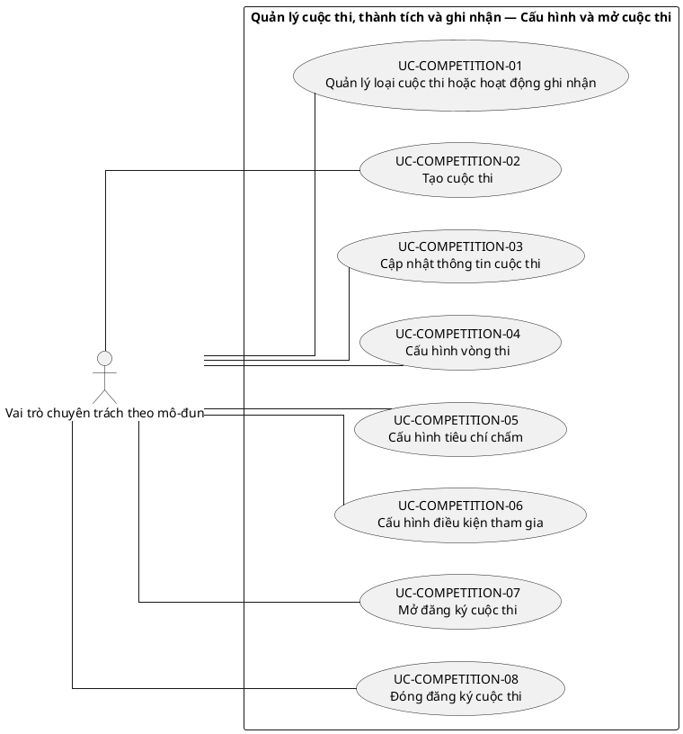
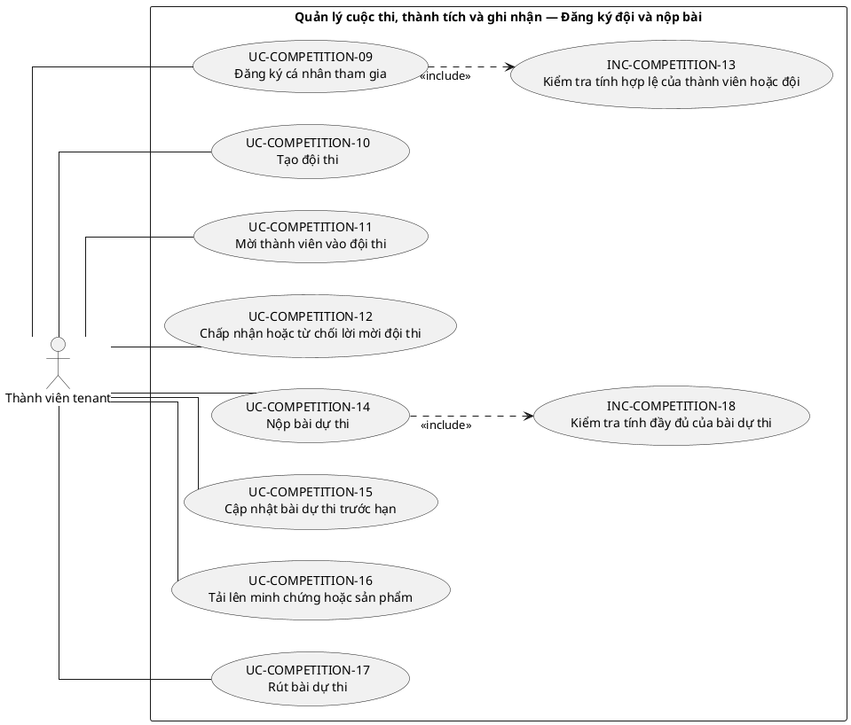
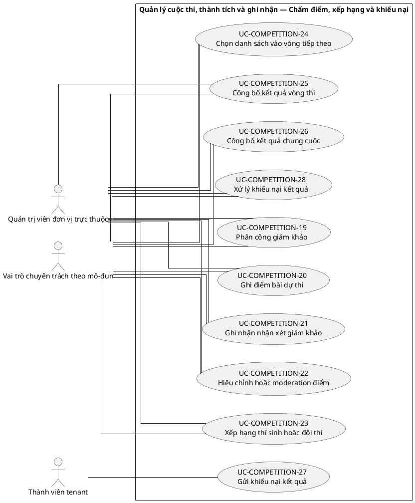
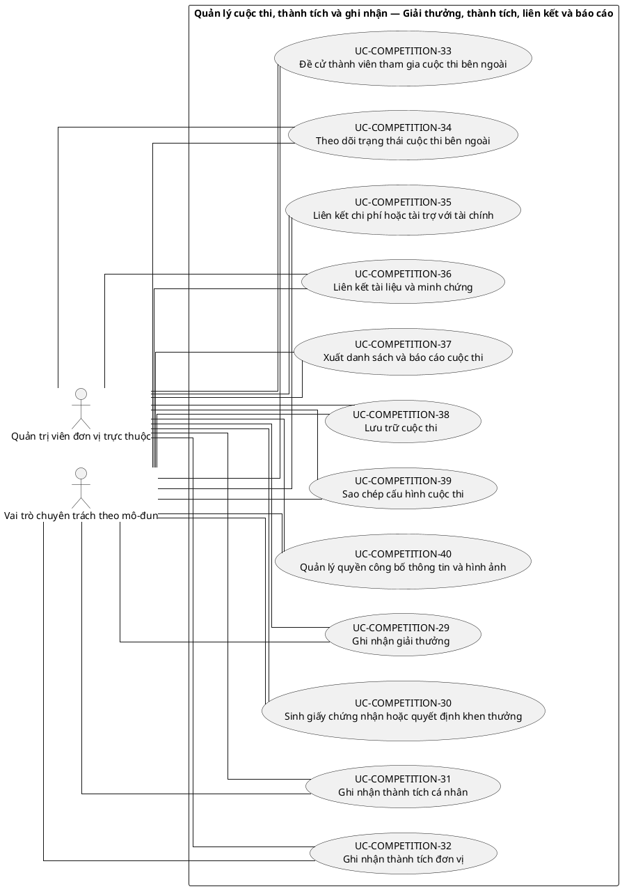

# UC-COMPETITION — Quản lý cuộc thi, thành tích và ghi nhận

## 1. Thông tin tài liệu

| Thuộc tính | Nội dung |
|---|---|
| Mã nhóm Use Case | `UC-COMPETITION` |
| Tên | Quản lý cuộc thi, thành tích và ghi nhận |
| Miền nghiệp vụ | Hoạt động tổ chức |
| Mức ưu tiên phát triển | Mô-đun vận hành |
| Phạm vi | Toàn bộ sản phẩm Operations Hub |
| Mô hình | SaaS đa tổ chức, dữ liệu và cấu hình theo tenant |
| Trạng thái đặc tả | Baseline V3; phân biệt Use Case mục tiêu, include, extend và yêu cầu hệ thống |

> **Nguyên tắc phạm vi:** tài liệu mô tả năng lực của phiên bản sản phẩm hoàn chỉnh. Mức ưu tiên phát triển không đồng nghĩa với loại bỏ khỏi phạm vi sản phẩm.

## 2. Mục tiêu

Quản lý cơ hội cuộc thi, đăng ký tham gia, đội thi, hồ sơ dự thi, kết quả, thành tích và minh chứng ghi nhận.

## 3. Actor

| Mã actor | Actor | Phạm vi |
|---|---|---|
| `ACT-TENANT-MEMBER` | Thành viên tenant | Tenant hoặc tích hợp |
| `ACT-MODULE-SPECIALIST` | Vai trò chuyên trách theo mô-đun | Tenant hoặc tích hợp |
| `ACT-UNIT-ADMIN` | Quản trị viên đơn vị trực thuộc | Tenant hoặc tích hợp |

Actor trong sơ đồ chỉ thể hiện vai trò tương tác. Quyền thực tế phải được kiểm tra tại backend dựa trên tenant context, membership, role, permission, organization unit, trạng thái module và trạng thái tenant.

## 4. Điều kiện trước

- Module cuộc thi đã kích hoạt.
- Người thao tác có quyền quản lý hoạt động hoặc thành tích trong tenant.

## 5. Điều kiện sau

- Hoạt động và thành tích có nguồn, người tham gia, kết quả và minh chứng rõ ràng.

## 6. Danh mục phần tử nghiệp vụ và phân loại UML

> **Thay đổi của V3:** Không coi toàn bộ danh mục chức năng là Use Case độc lập. Chỉ phần tử có mục tiêu quan sát được đối với actor được giữ mã `UC-*`. Hành vi bắt buộc dùng chung dùng mã `INC-*`; luồng điều kiện dùng mã `EXT-*`; quy tắc hoặc xử lý xuyên suốt dùng mã `REQ-*`. Mã V2 được giữ để truy vết.

> Actor chỉ nối trực tiếp với `UC-*` hoặc `EXT-*` mà actor thực sự khởi phát/tham gia. `INC-*` được nối bằng `<<include>>`; `REQ-*` không được vẽ như Use Case.

| Mã V3 | Mã V2 | Phần tử nghiệp vụ | Loại mô hình | Actor trực tiếp / nguồn kích hoạt | Quan hệ |
|---|---|---|---|---|---|
| `UC-COMPETITION-01` | `UC-COMPETITION-01` | Quản lý loại cuộc thi hoặc hoạt động ghi nhận | Use Case mục tiêu actor | `ACT-MODULE-SPECIALIST` — Vai trò chuyên trách theo mô-đun | Association trực tiếp với actor |
| `UC-COMPETITION-02` | `UC-COMPETITION-02` | Tạo cuộc thi | Use Case mục tiêu actor | `ACT-MODULE-SPECIALIST` — Vai trò chuyên trách theo mô-đun | Association trực tiếp với actor |
| `UC-COMPETITION-03` | `UC-COMPETITION-03` | Cập nhật thông tin cuộc thi | Use Case mục tiêu actor | `ACT-MODULE-SPECIALIST` — Vai trò chuyên trách theo mô-đun | Association trực tiếp với actor |
| `UC-COMPETITION-04` | `UC-COMPETITION-04` | Cấu hình vòng thi | Use Case mục tiêu actor | `ACT-MODULE-SPECIALIST` — Vai trò chuyên trách theo mô-đun | Association trực tiếp với actor |
| `UC-COMPETITION-05` | `UC-COMPETITION-05` | Cấu hình tiêu chí chấm | Use Case mục tiêu actor | `ACT-MODULE-SPECIALIST` — Vai trò chuyên trách theo mô-đun | Association trực tiếp với actor |
| `UC-COMPETITION-06` | `UC-COMPETITION-06` | Cấu hình điều kiện tham gia | Use Case mục tiêu actor | `ACT-MODULE-SPECIALIST` — Vai trò chuyên trách theo mô-đun | Association trực tiếp với actor |
| `UC-COMPETITION-07` | `UC-COMPETITION-07` | Mở đăng ký cuộc thi | Use Case mục tiêu actor | `ACT-MODULE-SPECIALIST` — Vai trò chuyên trách theo mô-đun | Association trực tiếp với actor |
| `UC-COMPETITION-08` | `UC-COMPETITION-08` | Đóng đăng ký cuộc thi | Use Case mục tiêu actor | `ACT-MODULE-SPECIALIST` — Vai trò chuyên trách theo mô-đun | Association trực tiếp với actor |
| `UC-COMPETITION-09` | `UC-COMPETITION-09` | Đăng ký cá nhân tham gia | Use Case mục tiêu actor | `ACT-TENANT-MEMBER` — Thành viên tenant | Association trực tiếp với actor |
| `UC-COMPETITION-10` | `UC-COMPETITION-10` | Tạo đội thi | Use Case mục tiêu actor | `ACT-TENANT-MEMBER` — Thành viên tenant | Association trực tiếp với actor |
| `UC-COMPETITION-11` | `UC-COMPETITION-11` | Mời thành viên vào đội thi | Use Case mục tiêu actor | `ACT-TENANT-MEMBER` — Thành viên tenant | Association trực tiếp với actor |
| `UC-COMPETITION-12` | `UC-COMPETITION-12` | Chấp nhận hoặc từ chối lời mời đội thi | Use Case mục tiêu actor | `ACT-TENANT-MEMBER` — Thành viên tenant | Association trực tiếp với actor |
| `INC-COMPETITION-13` | `UC-COMPETITION-13` | Kiểm tra tính hợp lệ của thành viên hoặc đội | Hành vi dùng chung `<<include>>` | Hệ thống; được gọi từ Use Case cha | `UC-COMPETITION-09` `<<include>>` `INC-COMPETITION-13` |
| `UC-COMPETITION-14` | `UC-COMPETITION-14` | Nộp bài dự thi | Use Case mục tiêu actor | `ACT-TENANT-MEMBER` — Thành viên tenant | Association trực tiếp với actor |
| `UC-COMPETITION-15` | `UC-COMPETITION-15` | Cập nhật bài dự thi trước hạn | Use Case mục tiêu actor | `ACT-TENANT-MEMBER` — Thành viên tenant | Association trực tiếp với actor |
| `UC-COMPETITION-16` | `UC-COMPETITION-16` | Tải lên minh chứng hoặc sản phẩm | Use Case mục tiêu actor | `ACT-TENANT-MEMBER` — Thành viên tenant | Association trực tiếp với actor |
| `UC-COMPETITION-17` | `UC-COMPETITION-17` | Rút bài dự thi | Use Case mục tiêu actor | `ACT-TENANT-MEMBER` — Thành viên tenant | Association trực tiếp với actor |
| `INC-COMPETITION-18` | `UC-COMPETITION-18` | Kiểm tra tính đầy đủ của bài dự thi | Hành vi dùng chung `<<include>>` | Hệ thống; được gọi từ Use Case cha | `UC-COMPETITION-14` `<<include>>` `INC-COMPETITION-18` |
| `UC-COMPETITION-19` | `UC-COMPETITION-19` | Phân công giám khảo | Use Case mục tiêu actor | `ACT-UNIT-ADMIN` — Quản trị viên đơn vị trực thuộc<br>`ACT-MODULE-SPECIALIST` — Vai trò chuyên trách theo mô-đun | Association trực tiếp với actor |
| `UC-COMPETITION-20` | `UC-COMPETITION-20` | Ghi điểm bài dự thi | Use Case mục tiêu actor | `ACT-UNIT-ADMIN` — Quản trị viên đơn vị trực thuộc<br>`ACT-MODULE-SPECIALIST` — Vai trò chuyên trách theo mô-đun | Association trực tiếp với actor |
| `UC-COMPETITION-21` | `UC-COMPETITION-21` | Ghi nhận nhận xét giám khảo | Use Case mục tiêu actor | `ACT-UNIT-ADMIN` — Quản trị viên đơn vị trực thuộc<br>`ACT-MODULE-SPECIALIST` — Vai trò chuyên trách theo mô-đun | Association trực tiếp với actor |
| `UC-COMPETITION-22` | `UC-COMPETITION-22` | Hiệu chỉnh hoặc moderation điểm | Use Case mục tiêu actor | `ACT-UNIT-ADMIN` — Quản trị viên đơn vị trực thuộc<br>`ACT-MODULE-SPECIALIST` — Vai trò chuyên trách theo mô-đun | Association trực tiếp với actor |
| `UC-COMPETITION-23` | `UC-COMPETITION-23` | Xếp hạng thí sinh hoặc đội thi | Use Case mục tiêu actor | `ACT-UNIT-ADMIN` — Quản trị viên đơn vị trực thuộc<br>`ACT-MODULE-SPECIALIST` — Vai trò chuyên trách theo mô-đun | Association trực tiếp với actor |
| `UC-COMPETITION-24` | `UC-COMPETITION-24` | Chọn danh sách vào vòng tiếp theo | Use Case mục tiêu actor | `ACT-UNIT-ADMIN` — Quản trị viên đơn vị trực thuộc<br>`ACT-MODULE-SPECIALIST` — Vai trò chuyên trách theo mô-đun | Association trực tiếp với actor |
| `UC-COMPETITION-25` | `UC-COMPETITION-25` | Công bố kết quả vòng thi | Use Case mục tiêu actor | `ACT-UNIT-ADMIN` — Quản trị viên đơn vị trực thuộc<br>`ACT-MODULE-SPECIALIST` — Vai trò chuyên trách theo mô-đun | Association trực tiếp với actor |
| `UC-COMPETITION-26` | `UC-COMPETITION-26` | Công bố kết quả chung cuộc | Use Case mục tiêu actor | `ACT-UNIT-ADMIN` — Quản trị viên đơn vị trực thuộc<br>`ACT-MODULE-SPECIALIST` — Vai trò chuyên trách theo mô-đun | Association trực tiếp với actor |
| `UC-COMPETITION-27` | `UC-COMPETITION-27` | Gửi khiếu nại kết quả | Use Case mục tiêu actor | `ACT-TENANT-MEMBER` — Thành viên tenant | Association trực tiếp với actor |
| `UC-COMPETITION-28` | `UC-COMPETITION-28` | Xử lý khiếu nại kết quả | Use Case mục tiêu actor | `ACT-UNIT-ADMIN` — Quản trị viên đơn vị trực thuộc<br>`ACT-MODULE-SPECIALIST` — Vai trò chuyên trách theo mô-đun | Association trực tiếp với actor |
| `UC-COMPETITION-29` | `UC-COMPETITION-29` | Ghi nhận giải thưởng | Use Case mục tiêu actor | `ACT-UNIT-ADMIN` — Quản trị viên đơn vị trực thuộc<br>`ACT-MODULE-SPECIALIST` — Vai trò chuyên trách theo mô-đun | Association trực tiếp với actor |
| `UC-COMPETITION-30` | `UC-COMPETITION-30` | Sinh giấy chứng nhận hoặc quyết định khen thưởng | Use Case mục tiêu actor | `ACT-UNIT-ADMIN` — Quản trị viên đơn vị trực thuộc<br>`ACT-MODULE-SPECIALIST` — Vai trò chuyên trách theo mô-đun | Association trực tiếp với actor |
| `UC-COMPETITION-31` | `UC-COMPETITION-31` | Ghi nhận thành tích cá nhân | Use Case mục tiêu actor | `ACT-UNIT-ADMIN` — Quản trị viên đơn vị trực thuộc<br>`ACT-MODULE-SPECIALIST` — Vai trò chuyên trách theo mô-đun | Association trực tiếp với actor |
| `UC-COMPETITION-32` | `UC-COMPETITION-32` | Ghi nhận thành tích đơn vị | Use Case mục tiêu actor | `ACT-UNIT-ADMIN` — Quản trị viên đơn vị trực thuộc<br>`ACT-MODULE-SPECIALIST` — Vai trò chuyên trách theo mô-đun | Association trực tiếp với actor |
| `UC-COMPETITION-33` | `UC-COMPETITION-33` | Đề cử thành viên tham gia cuộc thi bên ngoài | Use Case mục tiêu actor | `ACT-UNIT-ADMIN` — Quản trị viên đơn vị trực thuộc<br>`ACT-MODULE-SPECIALIST` — Vai trò chuyên trách theo mô-đun | Association trực tiếp với actor |
| `UC-COMPETITION-34` | `UC-COMPETITION-34` | Theo dõi trạng thái cuộc thi bên ngoài | Use Case mục tiêu actor | `ACT-UNIT-ADMIN` — Quản trị viên đơn vị trực thuộc<br>`ACT-MODULE-SPECIALIST` — Vai trò chuyên trách theo mô-đun | Association trực tiếp với actor |
| `UC-COMPETITION-35` | `UC-COMPETITION-35` | Liên kết chi phí hoặc tài trợ với tài chính | Use Case mục tiêu actor | `ACT-UNIT-ADMIN` — Quản trị viên đơn vị trực thuộc<br>`ACT-MODULE-SPECIALIST` — Vai trò chuyên trách theo mô-đun | Association trực tiếp với actor |
| `UC-COMPETITION-36` | `UC-COMPETITION-36` | Liên kết tài liệu và minh chứng | Use Case mục tiêu actor | `ACT-UNIT-ADMIN` — Quản trị viên đơn vị trực thuộc<br>`ACT-MODULE-SPECIALIST` — Vai trò chuyên trách theo mô-đun | Association trực tiếp với actor |
| `UC-COMPETITION-37` | `UC-COMPETITION-37` | Xuất danh sách và báo cáo cuộc thi | Use Case mục tiêu actor | `ACT-UNIT-ADMIN` — Quản trị viên đơn vị trực thuộc<br>`ACT-MODULE-SPECIALIST` — Vai trò chuyên trách theo mô-đun | Association trực tiếp với actor |
| `UC-COMPETITION-38` | `UC-COMPETITION-38` | Lưu trữ cuộc thi | Use Case mục tiêu actor | `ACT-UNIT-ADMIN` — Quản trị viên đơn vị trực thuộc<br>`ACT-MODULE-SPECIALIST` — Vai trò chuyên trách theo mô-đun | Association trực tiếp với actor |
| `UC-COMPETITION-39` | `UC-COMPETITION-39` | Sao chép cấu hình cuộc thi | Use Case mục tiêu actor | `ACT-UNIT-ADMIN` — Quản trị viên đơn vị trực thuộc<br>`ACT-MODULE-SPECIALIST` — Vai trò chuyên trách theo mô-đun | Association trực tiếp với actor |
| `UC-COMPETITION-40` | `UC-COMPETITION-40` | Quản lý quyền công bố thông tin và hình ảnh | Use Case mục tiêu actor | `ACT-UNIT-ADMIN` — Quản trị viên đơn vị trực thuộc<br>`ACT-MODULE-SPECIALIST` — Vai trò chuyên trách theo mô-đun | Association trực tiếp với actor |

## 7. Luồng nghiệp vụ chính

1. Competition Manager tạo cuộc thi và mở đăng ký.
2. Thành viên tạo đội hoặc đăng ký cá nhân.
3. Người quản lý duyệt điều kiện tham gia.
4. Đội nộp hồ sơ và cập nhật tiến độ.
5. Sau cuộc thi, người quản lý ghi kết quả và minh chứng.
6. Người có thẩm quyền phê duyệt thành tích; hệ thống cập nhật hồ sơ và báo cáo.

## 8. Luồng thay thế và ngoại lệ

- Hết hạn đăng ký hoặc nộp bài: từ chối trừ khi có gia hạn có quyền.
- Thành viên không còn active: cảnh báo hoặc từ chối theo chính sách.
- Kết quả thiếu minh chứng: giữ trạng thái chờ xác minh.
- Thành tích trùng: hợp nhất hoặc từ chối dựa trên khóa nguồn.

## 9. Quy tắc nghiệp vụ cốt lõi

- Thành viên đội phải có membership hợp lệ tại thời điểm đăng ký, trừ khách ngoài được mô hình hóa riêng.
- Một người không được đăng ký trùng vai trò trong cùng đội nếu chính sách không cho phép.
- Kết quả bên ngoài chỉ trở thành thành tích chính thức sau khi được xác minh.
- Tệp hồ sơ và minh chứng phải thuộc tenant.
- Thay đổi kết quả đã phê duyệt phải có audit và lý do.

## 10. Mô hình dữ liệu logic liên quan

| Thực thể | Vai trò |
|---|---|
| `Competition` | Thực thể logic phục vụ UC-COMPETITION; thiết kế vật lý được xác định ở giai đoạn thiết kế dữ liệu. |
| `CompetitionRegistration` | Thực thể logic phục vụ UC-COMPETITION; thiết kế vật lý được xác định ở giai đoạn thiết kế dữ liệu. |
| `CompetitionTeam` | Thực thể logic phục vụ UC-COMPETITION; thiết kế vật lý được xác định ở giai đoạn thiết kế dữ liệu. |
| `TeamMember` | Thực thể logic phục vụ UC-COMPETITION; thiết kế vật lý được xác định ở giai đoạn thiết kế dữ liệu. |
| `Submission` | Thực thể logic phục vụ UC-COMPETITION; thiết kế vật lý được xác định ở giai đoạn thiết kế dữ liệu. |
| `Milestone` | Thực thể logic phục vụ UC-COMPETITION; thiết kế vật lý được xác định ở giai đoạn thiết kế dữ liệu. |
| `CompetitionResult` | Thực thể logic phục vụ UC-COMPETITION; thiết kế vật lý được xác định ở giai đoạn thiết kế dữ liệu. |
| `Achievement` | Thực thể logic phục vụ UC-COMPETITION; thiết kế vật lý được xác định ở giai đoạn thiết kế dữ liệu. |
| `Certificate` | Thực thể logic phục vụ UC-COMPETITION; thiết kế vật lý được xác định ở giai đoạn thiết kế dữ liệu. |
| `AuditLog` | Thực thể logic phục vụ UC-COMPETITION; thiết kế vật lý được xác định ở giai đoạn thiết kế dữ liệu. |

Mọi thực thể nghiệp vụ phải xác định được tenant sở hữu, trừ thực thể được công bố rõ là dữ liệu cấp nền tảng. Quan hệ tham chiếu chéo tenant bị cấm nếu không có cơ chế liên tenant được đặc tả riêng.

## 11. Kiểm soát truy cập

Quyền hiệu lực được xác định theo công thức khái quát:

```text
Quyền hiệu lực
= Permission từ các Role đang hoạt động
∩ Tenant context hợp lệ
∩ Membership đang hoạt động
∩ Phạm vi Organization Unit
∩ Phạm vi tài nguyên
∩ Trạng thái Module
∩ Trạng thái Tenant
```

Các kiểm tra bắt buộc:

- Xác thực User trước khi truy cập chức năng không công khai.
- Đối chiếu tenant context với membership.
- Kiểm tra permission tại backend, không dựa vào trạng thái hiển thị của frontend.
- Giới hạn truy vấn, tệp, bản xuất, cache và tác vụ nền theo tenant.
- Ghi audit cho hành động quản trị hoặc thay đổi nghiệp vụ quan trọng.

## 12. Tiêu chí chấp nhận

| Mã | Tiêu chí | Phương pháp kiểm chứng |
|---|---|---|
| `AC-COMPETITION-01` | Không tạo thành tích chính thức khi chưa xác minh. | Functional / Integration / Security Test tùy nội dung |
| `AC-COMPETITION-02` | Thành viên và đội không bị lẫn tenant. | Functional / Integration / Security Test tùy nội dung |
| `AC-COMPETITION-03` | Hạn đăng ký/nộp được kiểm tra theo múi giờ tenant. | Functional / Integration / Security Test tùy nội dung |
| `AC-COMPETITION-04` | Thay đổi kết quả đã duyệt có audit. | Functional / Integration / Security Test tùy nội dung |

## 13. Quan hệ với nhóm Use Case khác

[`UC-MEMBER`](./09_UC-MEMBER.md), [`UC-DOCUMENT`](./11_UC-DOCUMENT.md), [`UC-NOTIFICATION`](./18_UC-NOTIFICATION.md), [`UC-DASHBOARD`](./19_UC-DASHBOARD.md), [`UC-AUDIT`](./21_UC-AUDIT.md)

## 14. Use Case Diagram theo luồng nghiệp vụ

Các package/rectangle dưới đây chỉ là **ranh giới hệ thống hoặc miền nghiệp vụ**. Không tồn tại phần tử trung gian `PKG*`; actor liên kết trực tiếp với Use Case có mục tiêu nghiệp vụ. `INC-*` và `EXT-*` chỉ xuất hiện qua quan hệ UML tương ứng; `REQ-*` được trình bày ngoài sơ đồ.

### 14.1. Quy ước đọc sơ đồ

- `Actor -- UC-*`: actor trực tiếp thực hiện hoặc tham gia mục tiêu nghiệp vụ.
- `UC-* ..> INC-* : <<include>>`: hành vi bắt buộc được dùng lại.
- `EXT-* ..> UC-* : <<extend>>`: hành vi chỉ phát sinh trong điều kiện xác định.
- `REQ-*`: quy tắc/yêu cầu hệ thống, không phải Use Case và không nối actor.

### 14.2. Cấu hình và mở cuộc thi



### 14.3. Đăng ký đội và nộp bài



### 14.4. Chấm điểm, xếp hạng và khiếu nại



### 14.5. Giải thưởng, thành tích, liên kết và báo cáo


