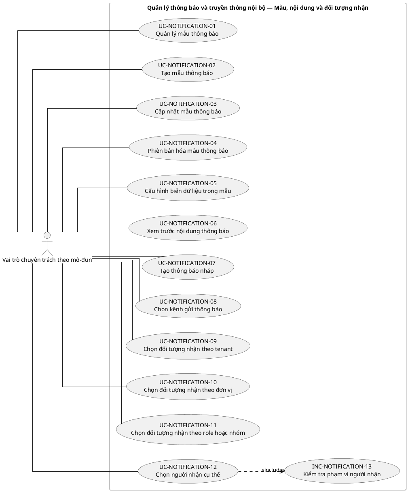
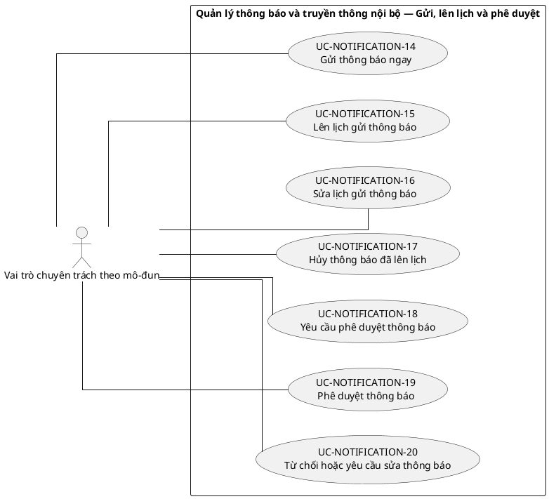
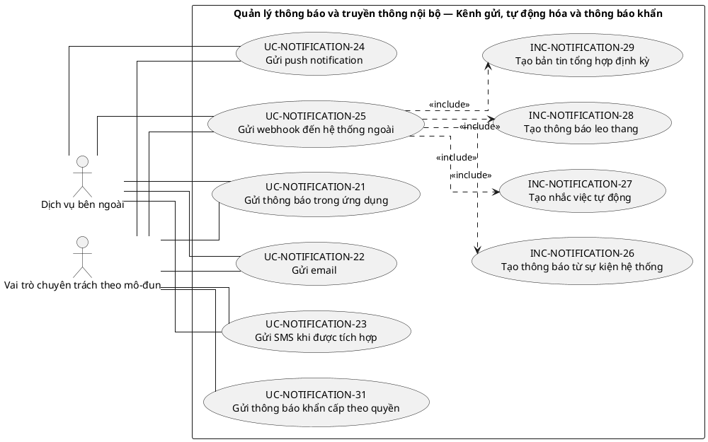
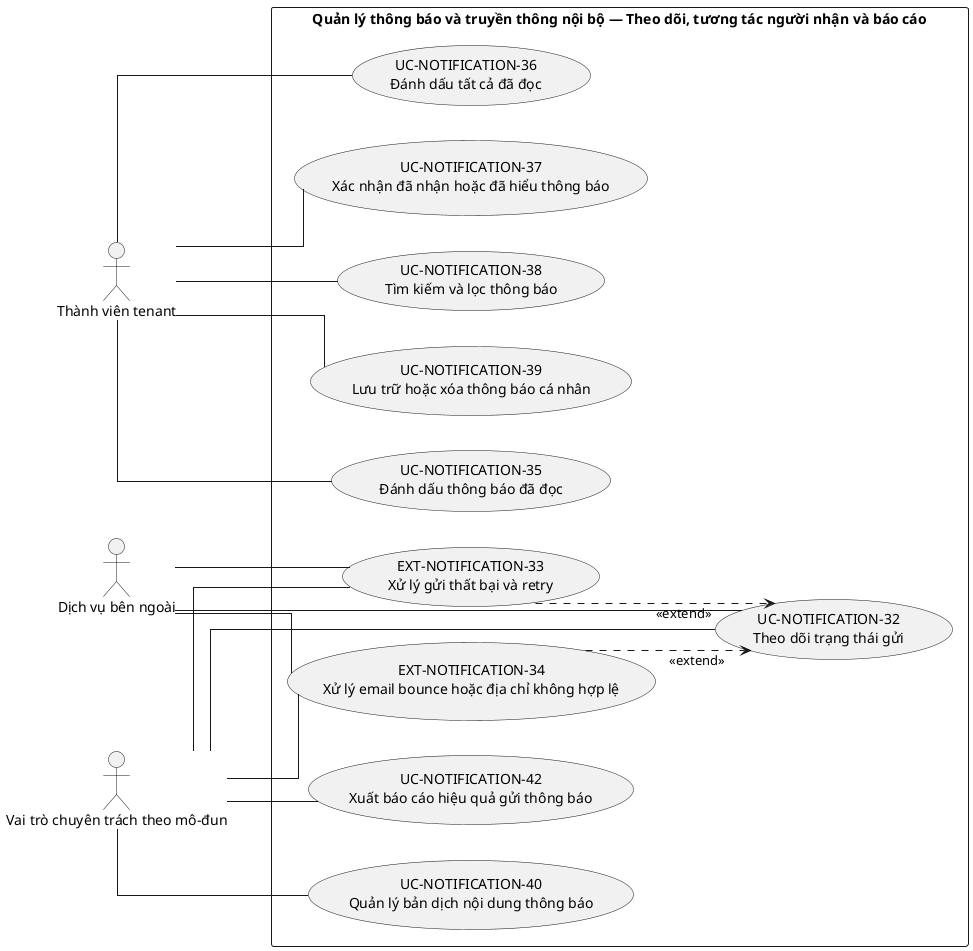

# UC-NOTIFICATION — Quản lý thông báo và truyền thông nội bộ

## 1. Thông tin tài liệu

| Thuộc tính | Nội dung |
|---|---|
| Mã nhóm Use Case | `UC-NOTIFICATION` |
| Tên | Quản lý thông báo và truyền thông nội bộ |
| Miền nghiệp vụ | Truyền thông nội bộ |
| Mức ưu tiên phát triển | Năng lực dùng chung |
| Phạm vi | Toàn bộ sản phẩm Operations Hub |
| Mô hình | SaaS đa tổ chức, dữ liệu và cấu hình theo tenant |
| Trạng thái đặc tả | Baseline V3; phân biệt Use Case mục tiêu, include, extend và yêu cầu hệ thống |

> **Nguyên tắc phạm vi:** tài liệu mô tả năng lực của phiên bản sản phẩm hoàn chỉnh. Mức ưu tiên phát triển không đồng nghĩa với loại bỏ khỏi phạm vi sản phẩm.

## 2. Mục tiêu

Tạo, phân phối và theo dõi thông báo theo tenant, đối tượng, kênh và mức độ bắt buộc.

## 3. Actor

| Mã actor | Actor | Phạm vi |
|---|---|---|
| `ACT-TENANT-MEMBER` | Thành viên tenant | Tenant hoặc tích hợp |
| `ACT-MODULE-SPECIALIST` | Vai trò chuyên trách theo mô-đun | Tenant hoặc tích hợp |
| `ACT-EXTERNAL-SERVICE` | Dịch vụ bên ngoài | Tenant hoặc tích hợp |

Actor trong sơ đồ chỉ thể hiện vai trò tương tác. Quyền thực tế phải được kiểm tra tại backend dựa trên tenant context, membership, role, permission, organization unit, trạng thái module và trạng thái tenant.

## 4. Điều kiện trước

- Tenant và kênh thông báo đã cấu hình.
- Người gửi có permission với đối tượng nhận.

## 5. Điều kiện sau

- Thông báo được gửi hoặc lên lịch, có trạng thái giao nhận và phạm vi đúng.

## 6. Danh mục phần tử nghiệp vụ và phân loại UML

> **Thay đổi của V3:** Không coi toàn bộ danh mục chức năng là Use Case độc lập. Chỉ phần tử có mục tiêu quan sát được đối với actor được giữ mã `UC-*`. Hành vi bắt buộc dùng chung dùng mã `INC-*`; luồng điều kiện dùng mã `EXT-*`; quy tắc hoặc xử lý xuyên suốt dùng mã `REQ-*`. Mã V2 được giữ để truy vết.

> Actor chỉ nối trực tiếp với `UC-*` hoặc `EXT-*` mà actor thực sự khởi phát/tham gia. `INC-*` được nối bằng `<<include>>`; `REQ-*` không được vẽ như Use Case.

| Mã V3 | Mã V2 | Phần tử nghiệp vụ | Loại mô hình | Actor trực tiếp / nguồn kích hoạt | Quan hệ |
|---|---|---|---|---|---|
| `UC-NOTIFICATION-01` | `UC-NOTIFICATION-01` | Quản lý mẫu thông báo | Use Case mục tiêu actor | `ACT-MODULE-SPECIALIST` — Vai trò chuyên trách theo mô-đun | Association trực tiếp với actor |
| `UC-NOTIFICATION-02` | `UC-NOTIFICATION-02` | Tạo mẫu thông báo | Use Case mục tiêu actor | `ACT-MODULE-SPECIALIST` — Vai trò chuyên trách theo mô-đun | Association trực tiếp với actor |
| `UC-NOTIFICATION-03` | `UC-NOTIFICATION-03` | Cập nhật mẫu thông báo | Use Case mục tiêu actor | `ACT-MODULE-SPECIALIST` — Vai trò chuyên trách theo mô-đun | Association trực tiếp với actor |
| `UC-NOTIFICATION-04` | `UC-NOTIFICATION-04` | Phiên bản hóa mẫu thông báo | Use Case mục tiêu actor | `ACT-MODULE-SPECIALIST` — Vai trò chuyên trách theo mô-đun | Association trực tiếp với actor |
| `UC-NOTIFICATION-05` | `UC-NOTIFICATION-05` | Cấu hình biến dữ liệu trong mẫu | Use Case mục tiêu actor | `ACT-MODULE-SPECIALIST` — Vai trò chuyên trách theo mô-đun | Association trực tiếp với actor |
| `UC-NOTIFICATION-06` | `UC-NOTIFICATION-06` | Xem trước nội dung thông báo | Use Case mục tiêu actor | `ACT-MODULE-SPECIALIST` — Vai trò chuyên trách theo mô-đun | Association trực tiếp với actor |
| `UC-NOTIFICATION-07` | `UC-NOTIFICATION-07` | Tạo thông báo nháp | Use Case mục tiêu actor | `ACT-MODULE-SPECIALIST` — Vai trò chuyên trách theo mô-đun | Association trực tiếp với actor |
| `UC-NOTIFICATION-08` | `UC-NOTIFICATION-08` | Chọn kênh gửi thông báo | Use Case mục tiêu actor | `ACT-MODULE-SPECIALIST` — Vai trò chuyên trách theo mô-đun | Association trực tiếp với actor |
| `UC-NOTIFICATION-09` | `UC-NOTIFICATION-09` | Chọn đối tượng nhận theo tenant | Use Case mục tiêu actor | `ACT-MODULE-SPECIALIST` — Vai trò chuyên trách theo mô-đun | Association trực tiếp với actor |
| `UC-NOTIFICATION-10` | `UC-NOTIFICATION-10` | Chọn đối tượng nhận theo đơn vị | Use Case mục tiêu actor | `ACT-MODULE-SPECIALIST` — Vai trò chuyên trách theo mô-đun | Association trực tiếp với actor |
| `UC-NOTIFICATION-11` | `UC-NOTIFICATION-11` | Chọn đối tượng nhận theo role hoặc nhóm | Use Case mục tiêu actor | `ACT-MODULE-SPECIALIST` — Vai trò chuyên trách theo mô-đun | Association trực tiếp với actor |
| `UC-NOTIFICATION-12` | `UC-NOTIFICATION-12` | Chọn người nhận cụ thể | Use Case mục tiêu actor | `ACT-MODULE-SPECIALIST` — Vai trò chuyên trách theo mô-đun | Association trực tiếp với actor |
| `INC-NOTIFICATION-13` | `UC-NOTIFICATION-13` | Kiểm tra phạm vi người nhận | Hành vi dùng chung `<<include>>` | Hệ thống; được gọi từ Use Case cha | `UC-NOTIFICATION-12` `<<include>>` `INC-NOTIFICATION-13` |
| `UC-NOTIFICATION-14` | `UC-NOTIFICATION-14` | Gửi thông báo ngay | Use Case mục tiêu actor | `ACT-MODULE-SPECIALIST` — Vai trò chuyên trách theo mô-đun | Association trực tiếp với actor |
| `UC-NOTIFICATION-15` | `UC-NOTIFICATION-15` | Lên lịch gửi thông báo | Use Case mục tiêu actor | `ACT-MODULE-SPECIALIST` — Vai trò chuyên trách theo mô-đun | Association trực tiếp với actor |
| `UC-NOTIFICATION-16` | `UC-NOTIFICATION-16` | Sửa lịch gửi thông báo | Use Case mục tiêu actor | `ACT-MODULE-SPECIALIST` — Vai trò chuyên trách theo mô-đun | Association trực tiếp với actor |
| `UC-NOTIFICATION-17` | `UC-NOTIFICATION-17` | Hủy thông báo đã lên lịch | Use Case mục tiêu actor | `ACT-MODULE-SPECIALIST` — Vai trò chuyên trách theo mô-đun | Association trực tiếp với actor |
| `UC-NOTIFICATION-18` | `UC-NOTIFICATION-18` | Yêu cầu phê duyệt thông báo | Use Case mục tiêu actor | `ACT-MODULE-SPECIALIST` — Vai trò chuyên trách theo mô-đun | Association trực tiếp với actor |
| `UC-NOTIFICATION-19` | `UC-NOTIFICATION-19` | Phê duyệt thông báo | Use Case mục tiêu actor | `ACT-MODULE-SPECIALIST` — Vai trò chuyên trách theo mô-đun | Association trực tiếp với actor |
| `UC-NOTIFICATION-20` | `UC-NOTIFICATION-20` | Từ chối hoặc yêu cầu sửa thông báo | Use Case mục tiêu actor | `ACT-MODULE-SPECIALIST` — Vai trò chuyên trách theo mô-đun | Association trực tiếp với actor |
| `UC-NOTIFICATION-21` | `UC-NOTIFICATION-21` | Gửi thông báo trong ứng dụng | Use Case mục tiêu actor | `ACT-EXTERNAL-SERVICE` — Dịch vụ bên ngoài<br>`ACT-MODULE-SPECIALIST` — Vai trò chuyên trách theo mô-đun | Association trực tiếp với actor |
| `UC-NOTIFICATION-22` | `UC-NOTIFICATION-22` | Gửi email | Use Case mục tiêu actor | `ACT-EXTERNAL-SERVICE` — Dịch vụ bên ngoài<br>`ACT-MODULE-SPECIALIST` — Vai trò chuyên trách theo mô-đun | Association trực tiếp với actor |
| `UC-NOTIFICATION-23` | `UC-NOTIFICATION-23` | Gửi SMS khi được tích hợp | Use Case mục tiêu actor | `ACT-EXTERNAL-SERVICE` — Dịch vụ bên ngoài<br>`ACT-MODULE-SPECIALIST` — Vai trò chuyên trách theo mô-đun | Association trực tiếp với actor |
| `UC-NOTIFICATION-24` | `UC-NOTIFICATION-24` | Gửi push notification | Use Case mục tiêu actor | `ACT-EXTERNAL-SERVICE` — Dịch vụ bên ngoài<br>`ACT-MODULE-SPECIALIST` — Vai trò chuyên trách theo mô-đun | Association trực tiếp với actor |
| `UC-NOTIFICATION-25` | `UC-NOTIFICATION-25` | Gửi webhook đến hệ thống ngoài | Use Case mục tiêu actor | `ACT-EXTERNAL-SERVICE` — Dịch vụ bên ngoài<br>`ACT-MODULE-SPECIALIST` — Vai trò chuyên trách theo mô-đun | Association trực tiếp với actor |
| `INC-NOTIFICATION-26` | `UC-NOTIFICATION-26` | Tạo thông báo từ sự kiện hệ thống | Hành vi dùng chung `<<include>>` | Hệ thống; được gọi từ Use Case cha | `UC-NOTIFICATION-25` `<<include>>` `INC-NOTIFICATION-26` |
| `INC-NOTIFICATION-27` | `UC-NOTIFICATION-27` | Tạo nhắc việc tự động | Hành vi dùng chung `<<include>>` | Hệ thống; được gọi từ Use Case cha | `UC-NOTIFICATION-25` `<<include>>` `INC-NOTIFICATION-27` |
| `INC-NOTIFICATION-28` | `UC-NOTIFICATION-28` | Tạo thông báo leo thang | Hành vi dùng chung `<<include>>` | Hệ thống; được gọi từ Use Case cha | `UC-NOTIFICATION-25` `<<include>>` `INC-NOTIFICATION-28` |
| `INC-NOTIFICATION-29` | `UC-NOTIFICATION-29` | Tạo bản tin tổng hợp định kỳ | Hành vi dùng chung `<<include>>` | Hệ thống; được gọi từ Use Case cha | `UC-NOTIFICATION-25` `<<include>>` `INC-NOTIFICATION-29` |
| `REQ-NOTIFICATION-30` | `UC-NOTIFICATION-30` | Tôn trọng giờ yên lặng và tùy chọn người dùng | Quy tắc/yêu cầu hệ thống | Hệ thống/chính sách; không có association actor trực tiếp | Áp dụng như quy tắc/yêu cầu xuyên suốt; không nối actor trực tiếp |
| `UC-NOTIFICATION-31` | `UC-NOTIFICATION-31` | Gửi thông báo khẩn cấp theo quyền | Use Case mục tiêu actor | `ACT-MODULE-SPECIALIST` — Vai trò chuyên trách theo mô-đun | Association trực tiếp với actor |
| `UC-NOTIFICATION-32` | `UC-NOTIFICATION-32` | Theo dõi trạng thái gửi | Use Case mục tiêu actor | `ACT-EXTERNAL-SERVICE` — Dịch vụ bên ngoài<br>`ACT-MODULE-SPECIALIST` — Vai trò chuyên trách theo mô-đun | Association trực tiếp với actor |
| `EXT-NOTIFICATION-33` | `UC-NOTIFICATION-33` | Xử lý gửi thất bại và retry | Luồng điều kiện `<<extend>>` | `ACT-EXTERNAL-SERVICE` — Dịch vụ bên ngoài<br>`ACT-MODULE-SPECIALIST` — Vai trò chuyên trách theo mô-đun | `EXT-NOTIFICATION-33` `<<extend>>` `UC-NOTIFICATION-32` |
| `EXT-NOTIFICATION-34` | `UC-NOTIFICATION-34` | Xử lý email bounce hoặc địa chỉ không hợp lệ | Luồng điều kiện `<<extend>>` | `ACT-EXTERNAL-SERVICE` — Dịch vụ bên ngoài<br>`ACT-MODULE-SPECIALIST` — Vai trò chuyên trách theo mô-đun | `EXT-NOTIFICATION-34` `<<extend>>` `UC-NOTIFICATION-32` |
| `UC-NOTIFICATION-35` | `UC-NOTIFICATION-35` | Đánh dấu thông báo đã đọc | Use Case mục tiêu actor | `ACT-TENANT-MEMBER` — Thành viên tenant | Association trực tiếp với actor |
| `UC-NOTIFICATION-36` | `UC-NOTIFICATION-36` | Đánh dấu tất cả đã đọc | Use Case mục tiêu actor | `ACT-TENANT-MEMBER` — Thành viên tenant | Association trực tiếp với actor |
| `UC-NOTIFICATION-37` | `UC-NOTIFICATION-37` | Xác nhận đã nhận hoặc đã hiểu thông báo | Use Case mục tiêu actor | `ACT-TENANT-MEMBER` — Thành viên tenant | Association trực tiếp với actor |
| `UC-NOTIFICATION-38` | `UC-NOTIFICATION-38` | Tìm kiếm và lọc thông báo | Use Case mục tiêu actor | `ACT-TENANT-MEMBER` — Thành viên tenant | Association trực tiếp với actor |
| `UC-NOTIFICATION-39` | `UC-NOTIFICATION-39` | Lưu trữ hoặc xóa thông báo cá nhân | Use Case mục tiêu actor | `ACT-TENANT-MEMBER` — Thành viên tenant | Association trực tiếp với actor |
| `UC-NOTIFICATION-40` | `UC-NOTIFICATION-40` | Quản lý bản dịch nội dung thông báo | Use Case mục tiêu actor | `ACT-MODULE-SPECIALIST` — Vai trò chuyên trách theo mô-đun | Association trực tiếp với actor |
| `REQ-NOTIFICATION-41` | `UC-NOTIFICATION-41` | Kiểm soát tần suất và chống spam | Quy tắc/yêu cầu hệ thống | Hệ thống/chính sách; không có association actor trực tiếp | Áp dụng như quy tắc/yêu cầu xuyên suốt; không nối actor trực tiếp |
| `UC-NOTIFICATION-42` | `UC-NOTIFICATION-42` | Xuất báo cáo hiệu quả gửi thông báo | Use Case mục tiêu actor | `ACT-MODULE-SPECIALIST` — Vai trò chuyên trách theo mô-đun | Association trực tiếp với actor |

## 7. Luồng nghiệp vụ chính

1. Người phụ trách chọn mẫu và soạn nội dung.
2. Hệ thống xác định đối tượng nhận trong tenant.
3. Người gửi chọn kênh và thời điểm.
4. Hệ thống kiểm tra permission, preference và nội dung bắt buộc.
5. Thông báo được tạo, đưa vào hàng đợi và gửi qua kênh tương ứng.
6. Hệ thống cập nhật trạng thái giao nhận và xác nhận đã đọc.

## 8. Luồng thay thế và ngoại lệ

- Dịch vụ ngoài lỗi: retry theo chính sách và không đánh dấu đã gửi giả.
- Người nhận đã kết thúc membership trước thời điểm gửi: loại khỏi nhóm nếu thông báo không còn áp dụng.
- Template thiếu biến: từ chối gửi.
- Đối tượng nhận vượt phạm vi người gửi: từ chối.

## 9. Quy tắc nghiệp vụ cốt lõi

- Thông báo chỉ gửi đến người thuộc phạm vi mà người gửi được phép quản lý.
- Thông báo bảo mật, quản trị hoặc nghĩa vụ bắt buộc có thể không chịu preference tắt nhận.
- Danh sách người nhận phải được snapshot hoặc truy vết quy tắc chọn đối tượng.
- Không đưa dữ liệu nhạy cảm vượt mức cần thiết vào kênh ngoài.
- Gửi lại phải có khóa chống trùng hoặc trạng thái giao nhận.

## 10. Mô hình dữ liệu logic liên quan

| Thực thể | Vai trò |
|---|---|
| `NotificationTemplate` | Thực thể logic phục vụ UC-NOTIFICATION; thiết kế vật lý được xác định ở giai đoạn thiết kế dữ liệu. |
| `Notification` | Thực thể logic phục vụ UC-NOTIFICATION; thiết kế vật lý được xác định ở giai đoạn thiết kế dữ liệu. |
| `NotificationAudience` | Thực thể logic phục vụ UC-NOTIFICATION; thiết kế vật lý được xác định ở giai đoạn thiết kế dữ liệu. |
| `NotificationRecipient` | Thực thể logic phục vụ UC-NOTIFICATION; thiết kế vật lý được xác định ở giai đoạn thiết kế dữ liệu. |
| `DeliveryAttempt` | Thực thể logic phục vụ UC-NOTIFICATION; thiết kế vật lý được xác định ở giai đoạn thiết kế dữ liệu. |
| `ReadReceipt` | Thực thể logic phục vụ UC-NOTIFICATION; thiết kế vật lý được xác định ở giai đoạn thiết kế dữ liệu. |
| `NotificationPreference` | Thực thể logic phục vụ UC-NOTIFICATION; thiết kế vật lý được xác định ở giai đoạn thiết kế dữ liệu. |
| `AuditLog` | Thực thể logic phục vụ UC-NOTIFICATION; thiết kế vật lý được xác định ở giai đoạn thiết kế dữ liệu. |

Mọi thực thể nghiệp vụ phải xác định được tenant sở hữu, trừ thực thể được công bố rõ là dữ liệu cấp nền tảng. Quan hệ tham chiếu chéo tenant bị cấm nếu không có cơ chế liên tenant được đặc tả riêng.

## 11. Kiểm soát truy cập

Quyền hiệu lực được xác định theo công thức khái quát:

```text
Quyền hiệu lực
= Permission từ các Role đang hoạt động
∩ Tenant context hợp lệ
∩ Membership đang hoạt động
∩ Phạm vi Organization Unit
∩ Phạm vi tài nguyên
∩ Trạng thái Module
∩ Trạng thái Tenant
```

Các kiểm tra bắt buộc:

- Xác thực User trước khi truy cập chức năng không công khai.
- Đối chiếu tenant context với membership.
- Kiểm tra permission tại backend, không dựa vào trạng thái hiển thị của frontend.
- Giới hạn truy vấn, tệp, bản xuất, cache và tác vụ nền theo tenant.
- Ghi audit cho hành động quản trị hoặc thay đổi nghiệp vụ quan trọng.

## 12. Tiêu chí chấp nhận

| Mã | Tiêu chí | Phương pháp kiểm chứng |
|---|---|---|
| `AC-NOTIFICATION-01` | Không gửi thông báo tenant A cho người chỉ thuộc tenant B. | Functional / Integration / Security Test tùy nội dung |
| `AC-NOTIFICATION-02` | Trạng thái gửi phản ánh kết quả thực tế của từng kênh. | Functional / Integration / Security Test tùy nội dung |
| `AC-NOTIFICATION-03` | Thông báo bắt buộc có thể yêu cầu xác nhận đã đọc. | Functional / Integration / Security Test tùy nội dung |
| `AC-NOTIFICATION-04` | Retry không tạo nhiều thông báo logic trùng nhau. | Functional / Integration / Security Test tùy nội dung |

## 13. Quan hệ với nhóm Use Case khác

[`UC-MEMBER`](./09_UC-MEMBER.md), [`UC-SETTING`](./08_UC-SETTING.md), [`UC-AUDIT`](./21_UC-AUDIT.md)

## 14. Use Case Diagram theo luồng nghiệp vụ

Các package/rectangle dưới đây chỉ là **ranh giới hệ thống hoặc miền nghiệp vụ**. Không tồn tại phần tử trung gian `PKG*`; actor liên kết trực tiếp với Use Case có mục tiêu nghiệp vụ. `INC-*` và `EXT-*` chỉ xuất hiện qua quan hệ UML tương ứng; `REQ-*` được trình bày ngoài sơ đồ.

### 14.1. Quy ước đọc sơ đồ

- `Actor -- UC-*`: actor trực tiếp thực hiện hoặc tham gia mục tiêu nghiệp vụ.
- `UC-* ..> INC-* : <<include>>`: hành vi bắt buộc được dùng lại.
- `EXT-* ..> UC-* : <<extend>>`: hành vi chỉ phát sinh trong điều kiện xác định.
- `REQ-*`: quy tắc/yêu cầu hệ thống, không phải Use Case và không nối actor.

### 14.2. Mẫu, nội dung và đối tượng nhận



### 14.3. Gửi, lên lịch và phê duyệt



### 14.4. Kênh gửi, tự động hóa và thông báo khẩn



**Quy tắc/yêu cầu áp dụng cho luồng này:**
- `REQ-NOTIFICATION-30` — Tôn trọng giờ yên lặng và tùy chọn người dùng

### 14.5. Theo dõi, tương tác người nhận và báo cáo



**Quy tắc/yêu cầu áp dụng cho luồng này:**
- `REQ-NOTIFICATION-41` — Kiểm soát tần suất và chống spam
