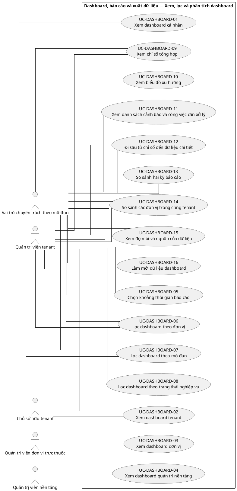
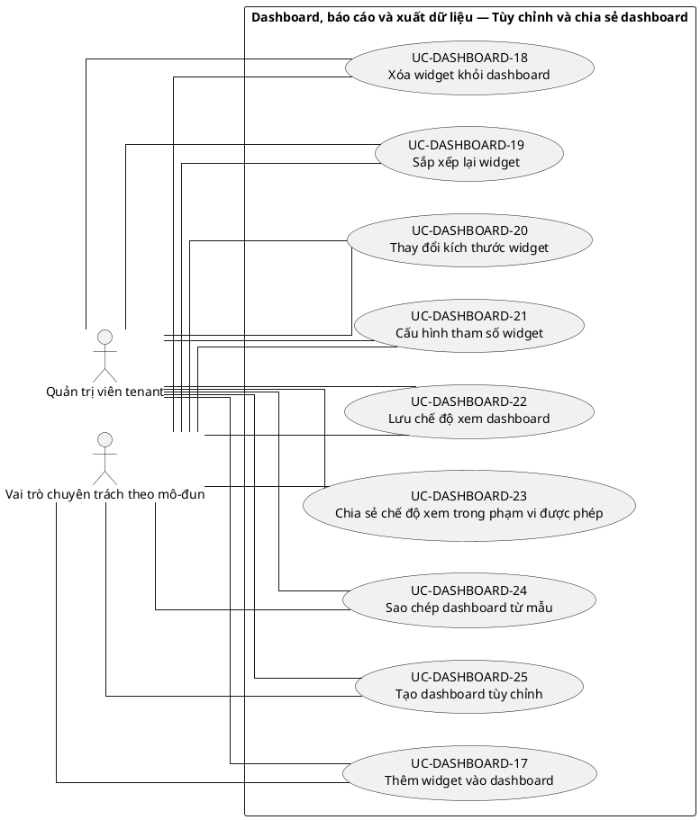
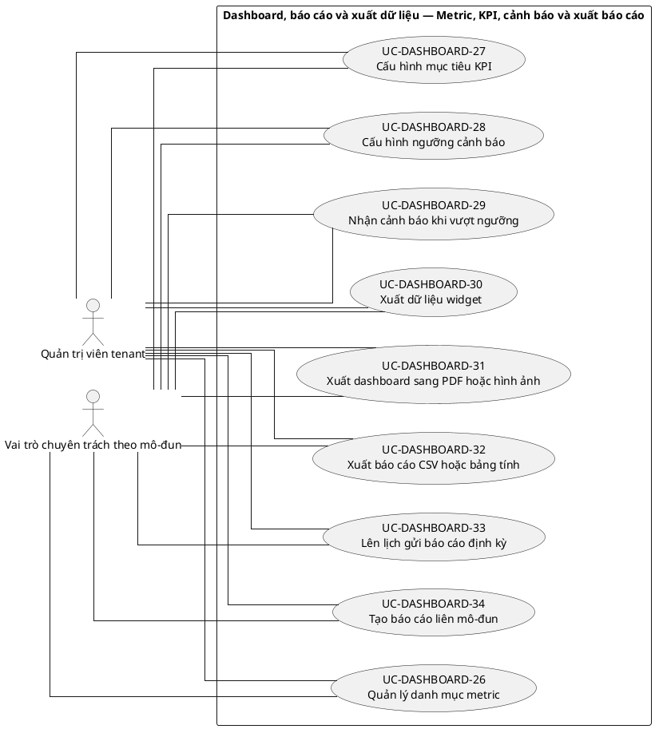
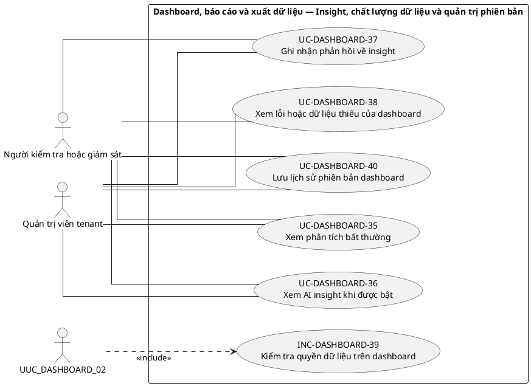

# UC-DASHBOARD — Dashboard, báo cáo và xuất dữ liệu

## 1. Thông tin tài liệu

| Thuộc tính | Nội dung |
|---|---|
| Mã nhóm Use Case | `UC-DASHBOARD` |
| Tên | Dashboard, báo cáo và xuất dữ liệu |
| Miền nghiệp vụ | Báo cáo và phân tích |
| Mức ưu tiên phát triển | Năng lực dùng chung |
| Phạm vi | Toàn bộ sản phẩm Operations Hub |
| Mô hình | SaaS đa tổ chức, dữ liệu và cấu hình theo tenant |
| Trạng thái đặc tả | Baseline V3; phân biệt Use Case mục tiêu, include, extend và yêu cầu hệ thống |

> **Nguyên tắc phạm vi:** tài liệu mô tả năng lực của phiên bản sản phẩm hoàn chỉnh. Mức ưu tiên phát triển không đồng nghĩa với loại bỏ khỏi phạm vi sản phẩm.

## 2. Mục tiêu

Cung cấp chỉ số, báo cáo và bản xuất theo quyền, tenant, đơn vị, thời gian và nguồn dữ liệu có thể truy vết.

## 3. Actor

| Mã actor | Actor | Phạm vi |
|---|---|---|
| `ACT-TENANT-OWNER` | Chủ sở hữu tenant | Tenant hoặc tích hợp |
| `ACT-TENANT-ADMIN` | Quản trị viên tenant | Tenant hoặc tích hợp |
| `ACT-UNIT-ADMIN` | Quản trị viên đơn vị trực thuộc | Tenant hoặc tích hợp |
| `ACT-MODULE-SPECIALIST` | Vai trò chuyên trách theo mô-đun | Tenant hoặc tích hợp |
| `ACT-PLATFORM-ADMIN` | Quản trị viên nền tảng | Cấp nền tảng |
| `ACT-AUDITOR` | Người kiểm tra hoặc giám sát | Tenant hoặc tích hợp |

Actor trong sơ đồ chỉ thể hiện vai trò tương tác. Quyền thực tế phải được kiểm tra tại backend dựa trên tenant context, membership, role, permission, organization unit, trạng thái module và trạng thái tenant.

## 4. Điều kiện trước

- Nguồn dữ liệu liên quan tồn tại và người dùng có permission xem báo cáo.

## 5. Điều kiện sau

- Chỉ số hiển thị đúng phạm vi và có thể truy ngược dữ liệu nguồn.
- Bản xuất được kiểm soát và ghi lịch sử khi chứa dữ liệu nhạy cảm.

## 6. Danh mục phần tử nghiệp vụ và phân loại UML

> **Thay đổi của V3:** Không coi toàn bộ danh mục chức năng là Use Case độc lập. Chỉ phần tử có mục tiêu quan sát được đối với actor được giữ mã `UC-*`. Hành vi bắt buộc dùng chung dùng mã `INC-*`; luồng điều kiện dùng mã `EXT-*`; quy tắc hoặc xử lý xuyên suốt dùng mã `REQ-*`. Mã V2 được giữ để truy vết.

> Actor chỉ nối trực tiếp với `UC-*` hoặc `EXT-*` mà actor thực sự khởi phát/tham gia. `INC-*` được nối bằng `<<include>>`; `REQ-*` không được vẽ như Use Case.

| Mã V3 | Mã V2 | Phần tử nghiệp vụ | Loại mô hình | Actor trực tiếp / nguồn kích hoạt | Quan hệ |
|---|---|---|---|---|---|
| `UC-DASHBOARD-01` | `UC-DASHBOARD-01` | Xem dashboard cá nhân | Use Case mục tiêu actor | `ACT-MODULE-SPECIALIST` — Vai trò chuyên trách theo mô-đun | Association trực tiếp với actor |
| `UC-DASHBOARD-02` | `UC-DASHBOARD-02` | Xem dashboard tenant | Use Case mục tiêu actor | `ACT-TENANT-OWNER` — Chủ sở hữu tenant<br>`ACT-TENANT-ADMIN` — Quản trị viên tenant | Association trực tiếp với actor |
| `UC-DASHBOARD-03` | `UC-DASHBOARD-03` | Xem dashboard đơn vị | Use Case mục tiêu actor | `ACT-UNIT-ADMIN` — Quản trị viên đơn vị trực thuộc | Association trực tiếp với actor |
| `UC-DASHBOARD-04` | `UC-DASHBOARD-04` | Xem dashboard quản trị nền tảng | Use Case mục tiêu actor | `ACT-PLATFORM-ADMIN` — Quản trị viên nền tảng | Association trực tiếp với actor |
| `UC-DASHBOARD-05` | `UC-DASHBOARD-05` | Chọn khoảng thời gian báo cáo | Use Case mục tiêu actor | `ACT-TENANT-ADMIN` — Quản trị viên tenant<br>`ACT-MODULE-SPECIALIST` — Vai trò chuyên trách theo mô-đun | Association trực tiếp với actor |
| `UC-DASHBOARD-06` | `UC-DASHBOARD-06` | Lọc dashboard theo đơn vị | Use Case mục tiêu actor | `ACT-TENANT-ADMIN` — Quản trị viên tenant<br>`ACT-MODULE-SPECIALIST` — Vai trò chuyên trách theo mô-đun | Association trực tiếp với actor |
| `UC-DASHBOARD-07` | `UC-DASHBOARD-07` | Lọc dashboard theo mô-đun | Use Case mục tiêu actor | `ACT-TENANT-ADMIN` — Quản trị viên tenant<br>`ACT-MODULE-SPECIALIST` — Vai trò chuyên trách theo mô-đun | Association trực tiếp với actor |
| `UC-DASHBOARD-08` | `UC-DASHBOARD-08` | Lọc dashboard theo trạng thái nghiệp vụ | Use Case mục tiêu actor | `ACT-TENANT-ADMIN` — Quản trị viên tenant<br>`ACT-MODULE-SPECIALIST` — Vai trò chuyên trách theo mô-đun | Association trực tiếp với actor |
| `UC-DASHBOARD-09` | `UC-DASHBOARD-09` | Xem chỉ số tổng hợp | Use Case mục tiêu actor | `ACT-TENANT-ADMIN` — Quản trị viên tenant<br>`ACT-MODULE-SPECIALIST` — Vai trò chuyên trách theo mô-đun | Association trực tiếp với actor |
| `UC-DASHBOARD-10` | `UC-DASHBOARD-10` | Xem biểu đồ xu hướng | Use Case mục tiêu actor | `ACT-TENANT-ADMIN` — Quản trị viên tenant<br>`ACT-MODULE-SPECIALIST` — Vai trò chuyên trách theo mô-đun | Association trực tiếp với actor |
| `UC-DASHBOARD-11` | `UC-DASHBOARD-11` | Xem danh sách cảnh báo và công việc cần xử lý | Use Case mục tiêu actor | `ACT-TENANT-ADMIN` — Quản trị viên tenant<br>`ACT-MODULE-SPECIALIST` — Vai trò chuyên trách theo mô-đun | Association trực tiếp với actor |
| `UC-DASHBOARD-12` | `UC-DASHBOARD-12` | Đi sâu từ chỉ số đến dữ liệu chi tiết | Use Case mục tiêu actor | `ACT-TENANT-ADMIN` — Quản trị viên tenant<br>`ACT-MODULE-SPECIALIST` — Vai trò chuyên trách theo mô-đun | Association trực tiếp với actor |
| `UC-DASHBOARD-13` | `UC-DASHBOARD-13` | So sánh hai kỳ báo cáo | Use Case mục tiêu actor | `ACT-TENANT-ADMIN` — Quản trị viên tenant<br>`ACT-MODULE-SPECIALIST` — Vai trò chuyên trách theo mô-đun | Association trực tiếp với actor |
| `UC-DASHBOARD-14` | `UC-DASHBOARD-14` | So sánh các đơn vị trong cùng tenant | Use Case mục tiêu actor | `ACT-TENANT-ADMIN` — Quản trị viên tenant<br>`ACT-MODULE-SPECIALIST` — Vai trò chuyên trách theo mô-đun | Association trực tiếp với actor |
| `UC-DASHBOARD-15` | `UC-DASHBOARD-15` | Xem độ mới và nguồn của dữ liệu | Use Case mục tiêu actor | `ACT-TENANT-ADMIN` — Quản trị viên tenant<br>`ACT-MODULE-SPECIALIST` — Vai trò chuyên trách theo mô-đun | Association trực tiếp với actor |
| `UC-DASHBOARD-16` | `UC-DASHBOARD-16` | Làm mới dữ liệu dashboard | Use Case mục tiêu actor | `ACT-TENANT-ADMIN` — Quản trị viên tenant<br>`ACT-MODULE-SPECIALIST` — Vai trò chuyên trách theo mô-đun | Association trực tiếp với actor |
| `UC-DASHBOARD-17` | `UC-DASHBOARD-17` | Thêm widget vào dashboard | Use Case mục tiêu actor | `ACT-TENANT-ADMIN` — Quản trị viên tenant<br>`ACT-MODULE-SPECIALIST` — Vai trò chuyên trách theo mô-đun | Association trực tiếp với actor |
| `UC-DASHBOARD-18` | `UC-DASHBOARD-18` | Xóa widget khỏi dashboard | Use Case mục tiêu actor | `ACT-TENANT-ADMIN` — Quản trị viên tenant<br>`ACT-MODULE-SPECIALIST` — Vai trò chuyên trách theo mô-đun | Association trực tiếp với actor |
| `UC-DASHBOARD-19` | `UC-DASHBOARD-19` | Sắp xếp lại widget | Use Case mục tiêu actor | `ACT-TENANT-ADMIN` — Quản trị viên tenant<br>`ACT-MODULE-SPECIALIST` — Vai trò chuyên trách theo mô-đun | Association trực tiếp với actor |
| `UC-DASHBOARD-20` | `UC-DASHBOARD-20` | Thay đổi kích thước widget | Use Case mục tiêu actor | `ACT-TENANT-ADMIN` — Quản trị viên tenant<br>`ACT-MODULE-SPECIALIST` — Vai trò chuyên trách theo mô-đun | Association trực tiếp với actor |
| `UC-DASHBOARD-21` | `UC-DASHBOARD-21` | Cấu hình tham số widget | Use Case mục tiêu actor | `ACT-TENANT-ADMIN` — Quản trị viên tenant<br>`ACT-MODULE-SPECIALIST` — Vai trò chuyên trách theo mô-đun | Association trực tiếp với actor |
| `UC-DASHBOARD-22` | `UC-DASHBOARD-22` | Lưu chế độ xem dashboard | Use Case mục tiêu actor | `ACT-TENANT-ADMIN` — Quản trị viên tenant<br>`ACT-MODULE-SPECIALIST` — Vai trò chuyên trách theo mô-đun | Association trực tiếp với actor |
| `UC-DASHBOARD-23` | `UC-DASHBOARD-23` | Chia sẻ chế độ xem trong phạm vi được phép | Use Case mục tiêu actor | `ACT-TENANT-ADMIN` — Quản trị viên tenant<br>`ACT-MODULE-SPECIALIST` — Vai trò chuyên trách theo mô-đun | Association trực tiếp với actor |
| `UC-DASHBOARD-24` | `UC-DASHBOARD-24` | Sao chép dashboard từ mẫu | Use Case mục tiêu actor | `ACT-TENANT-ADMIN` — Quản trị viên tenant<br>`ACT-MODULE-SPECIALIST` — Vai trò chuyên trách theo mô-đun | Association trực tiếp với actor |
| `UC-DASHBOARD-25` | `UC-DASHBOARD-25` | Tạo dashboard tùy chỉnh | Use Case mục tiêu actor | `ACT-TENANT-ADMIN` — Quản trị viên tenant<br>`ACT-MODULE-SPECIALIST` — Vai trò chuyên trách theo mô-đun | Association trực tiếp với actor |
| `UC-DASHBOARD-26` | `UC-DASHBOARD-26` | Quản lý danh mục metric | Use Case mục tiêu actor | `ACT-TENANT-ADMIN` — Quản trị viên tenant<br>`ACT-MODULE-SPECIALIST` — Vai trò chuyên trách theo mô-đun | Association trực tiếp với actor |
| `UC-DASHBOARD-27` | `UC-DASHBOARD-27` | Cấu hình mục tiêu KPI | Use Case mục tiêu actor | `ACT-TENANT-ADMIN` — Quản trị viên tenant<br>`ACT-MODULE-SPECIALIST` — Vai trò chuyên trách theo mô-đun | Association trực tiếp với actor |
| `UC-DASHBOARD-28` | `UC-DASHBOARD-28` | Cấu hình ngưỡng cảnh báo | Use Case mục tiêu actor | `ACT-TENANT-ADMIN` — Quản trị viên tenant<br>`ACT-MODULE-SPECIALIST` — Vai trò chuyên trách theo mô-đun | Association trực tiếp với actor |
| `UC-DASHBOARD-29` | `UC-DASHBOARD-29` | Nhận cảnh báo khi vượt ngưỡng | Use Case mục tiêu actor | `ACT-TENANT-ADMIN` — Quản trị viên tenant<br>`ACT-MODULE-SPECIALIST` — Vai trò chuyên trách theo mô-đun | Association trực tiếp với actor |
| `UC-DASHBOARD-30` | `UC-DASHBOARD-30` | Xuất dữ liệu widget | Use Case mục tiêu actor | `ACT-TENANT-ADMIN` — Quản trị viên tenant<br>`ACT-MODULE-SPECIALIST` — Vai trò chuyên trách theo mô-đun | Association trực tiếp với actor |
| `UC-DASHBOARD-31` | `UC-DASHBOARD-31` | Xuất dashboard sang PDF hoặc hình ảnh | Use Case mục tiêu actor | `ACT-TENANT-ADMIN` — Quản trị viên tenant<br>`ACT-MODULE-SPECIALIST` — Vai trò chuyên trách theo mô-đun | Association trực tiếp với actor |
| `UC-DASHBOARD-32` | `UC-DASHBOARD-32` | Xuất báo cáo CSV hoặc bảng tính | Use Case mục tiêu actor | `ACT-TENANT-ADMIN` — Quản trị viên tenant<br>`ACT-MODULE-SPECIALIST` — Vai trò chuyên trách theo mô-đun | Association trực tiếp với actor |
| `UC-DASHBOARD-33` | `UC-DASHBOARD-33` | Lên lịch gửi báo cáo định kỳ | Use Case mục tiêu actor | `ACT-TENANT-ADMIN` — Quản trị viên tenant<br>`ACT-MODULE-SPECIALIST` — Vai trò chuyên trách theo mô-đun | Association trực tiếp với actor |
| `UC-DASHBOARD-34` | `UC-DASHBOARD-34` | Tạo báo cáo liên mô-đun | Use Case mục tiêu actor | `ACT-TENANT-ADMIN` — Quản trị viên tenant<br>`ACT-MODULE-SPECIALIST` — Vai trò chuyên trách theo mô-đun | Association trực tiếp với actor |
| `UC-DASHBOARD-35` | `UC-DASHBOARD-35` | Xem phân tích bất thường | Use Case mục tiêu actor | `ACT-AUDITOR` — Người kiểm tra hoặc giám sát<br>`ACT-TENANT-ADMIN` — Quản trị viên tenant | Association trực tiếp với actor |
| `UC-DASHBOARD-36` | `UC-DASHBOARD-36` | Xem AI insight khi được bật | Use Case mục tiêu actor | `ACT-AUDITOR` — Người kiểm tra hoặc giám sát<br>`ACT-TENANT-ADMIN` — Quản trị viên tenant | Association trực tiếp với actor |
| `UC-DASHBOARD-37` | `UC-DASHBOARD-37` | Ghi nhận phản hồi về insight | Use Case mục tiêu actor | `ACT-AUDITOR` — Người kiểm tra hoặc giám sát<br>`ACT-TENANT-ADMIN` — Quản trị viên tenant | Association trực tiếp với actor |
| `UC-DASHBOARD-38` | `UC-DASHBOARD-38` | Xem lỗi hoặc dữ liệu thiếu của dashboard | Use Case mục tiêu actor | `ACT-AUDITOR` — Người kiểm tra hoặc giám sát<br>`ACT-TENANT-ADMIN` — Quản trị viên tenant | Association trực tiếp với actor |
| `INC-DASHBOARD-39` | `UC-DASHBOARD-39` | Kiểm tra quyền dữ liệu trên dashboard | Hành vi dùng chung `<<include>>` | Hệ thống; được gọi từ Use Case cha | `UC-DASHBOARD-02` `<<include>>` `INC-DASHBOARD-39` |
| `UC-DASHBOARD-40` | `UC-DASHBOARD-40` | Lưu lịch sử phiên bản dashboard | Use Case mục tiêu actor | `ACT-AUDITOR` — Người kiểm tra hoặc giám sát<br>`ACT-TENANT-ADMIN` — Quản trị viên tenant | Association trực tiếp với actor |

## 7. Luồng nghiệp vụ chính

1. Người dùng mở dashboard trong tenant context.
2. Hệ thống xác định role, scope, module đang bật và bộ chỉ số được phép.
3. Hệ thống truy vấn dữ liệu đã lọc theo tenant và thời gian.
4. Người dùng chọn metric để drill-down.
5. Hệ thống kiểm tra lại permission ở cấp bản ghi.
6. Người dùng xuất báo cáo; hệ thống tạo file, lưu metadata và ghi audit nếu cần.

## 8. Luồng thay thế và ngoại lệ

- Nguồn dữ liệu chậm hoặc lỗi: hiển thị thời điểm cập nhật cuối và trạng thái không đầy đủ.
- Người dùng cố drill-down ngoài scope: từ chối.
- Bản xuất quá lớn: chuyển sang xử lý nền và thông báo khi hoàn tất.
- Widget tham chiếu module bị tắt: ẩn hoặc hiển thị trạng thái không khả dụng.

## 9. Quy tắc nghiệp vụ cốt lõi

- Mọi truy vấn báo cáo phải tự động giới hạn theo tenant và scope.
- Platform Admin chỉ xem dữ liệu tenant ở mức được phép; không mặc nhiên drill-down vào dữ liệu nội bộ.
- Bản xuất phải áp dụng cùng permission và masking như giao diện.
- Metric phải có định nghĩa, nguồn và thời điểm cập nhật rõ ràng.
- Dữ liệu đã xóa mềm hoặc bị hủy phải được xử lý nhất quán theo định nghĩa chỉ số.

## 10. Mô hình dữ liệu logic liên quan

| Thực thể | Vai trò |
|---|---|
| `DashboardDefinition` | Thực thể logic phục vụ UC-DASHBOARD; thiết kế vật lý được xác định ở giai đoạn thiết kế dữ liệu. |
| `WidgetDefinition` | Thực thể logic phục vụ UC-DASHBOARD; thiết kế vật lý được xác định ở giai đoạn thiết kế dữ liệu. |
| `MetricDefinition` | Thực thể logic phục vụ UC-DASHBOARD; thiết kế vật lý được xác định ở giai đoạn thiết kế dữ liệu. |
| `ReportDefinition` | Thực thể logic phục vụ UC-DASHBOARD; thiết kế vật lý được xác định ở giai đoạn thiết kế dữ liệu. |
| `ReportRun` | Thực thể logic phục vụ UC-DASHBOARD; thiết kế vật lý được xác định ở giai đoạn thiết kế dữ liệu. |
| `ExportFile` | Thực thể logic phục vụ UC-DASHBOARD; thiết kế vật lý được xác định ở giai đoạn thiết kế dữ liệu. |
| `DataSnapshot` | Thực thể logic phục vụ UC-DASHBOARD; thiết kế vật lý được xác định ở giai đoạn thiết kế dữ liệu. |
| `AuditLog` | Thực thể logic phục vụ UC-DASHBOARD; thiết kế vật lý được xác định ở giai đoạn thiết kế dữ liệu. |

Mọi thực thể nghiệp vụ phải xác định được tenant sở hữu, trừ thực thể được công bố rõ là dữ liệu cấp nền tảng. Quan hệ tham chiếu chéo tenant bị cấm nếu không có cơ chế liên tenant được đặc tả riêng.

## 11. Kiểm soát truy cập

Quyền hiệu lực được xác định theo công thức khái quát:

```text
Quyền hiệu lực
= Permission từ các Role đang hoạt động
∩ Tenant context hợp lệ
∩ Membership đang hoạt động
∩ Phạm vi Organization Unit
∩ Phạm vi tài nguyên
∩ Trạng thái Module
∩ Trạng thái Tenant
```

Các kiểm tra bắt buộc:

- Xác thực User trước khi truy cập chức năng không công khai.
- Đối chiếu tenant context với membership.
- Kiểm tra permission tại backend, không dựa vào trạng thái hiển thị của frontend.
- Giới hạn truy vấn, tệp, bản xuất, cache và tác vụ nền theo tenant.
- Ghi audit cho hành động quản trị hoặc thay đổi nghiệp vụ quan trọng.

## 12. Tiêu chí chấp nhận

| Mã | Tiêu chí | Phương pháp kiểm chứng |
|---|---|---|
| `AC-DASHBOARD-01` | Không có bản ghi tenant khác trong dashboard hoặc bản xuất. | Functional / Integration / Security Test tùy nội dung |
| `AC-DASHBOARD-02` | Drill-down áp dụng lại permission, không chỉ dựa vào tổng hợp ban đầu. | Functional / Integration / Security Test tùy nội dung |
| `AC-DASHBOARD-03` | Mỗi metric hiển thị thời điểm cập nhật hoặc nguồn. | Functional / Integration / Security Test tùy nội dung |
| `AC-DASHBOARD-04` | Xuất dữ liệu nhạy cảm có audit và thời hạn tải phù hợp. | Functional / Integration / Security Test tùy nội dung |

## 13. Quan hệ với nhóm Use Case khác

[`UC-RBAC`](./04_UC-RBAC.md), [`UC-MODULE`](./07_UC-MODULE.md), [`UC-AUDIT`](./21_UC-AUDIT.md), [`UC-NOTIFICATION`](./18_UC-NOTIFICATION.md)

## 14. Use Case Diagram theo luồng nghiệp vụ

Các package/rectangle dưới đây chỉ là **ranh giới hệ thống hoặc miền nghiệp vụ**. Không tồn tại phần tử trung gian `PKG*`; actor liên kết trực tiếp với Use Case có mục tiêu nghiệp vụ. `INC-*` và `EXT-*` chỉ xuất hiện qua quan hệ UML tương ứng; `REQ-*` được trình bày ngoài sơ đồ.

### 14.1. Quy ước đọc sơ đồ

- `Actor -- UC-*`: actor trực tiếp thực hiện hoặc tham gia mục tiêu nghiệp vụ.
- `UC-* ..> INC-* : <<include>>`: hành vi bắt buộc được dùng lại.
- `EXT-* ..> UC-* : <<extend>>`: hành vi chỉ phát sinh trong điều kiện xác định.
- `REQ-*`: quy tắc/yêu cầu hệ thống, không phải Use Case và không nối actor.

### 14.2. Xem, lọc và phân tích dashboard



### 14.3. Tùy chỉnh và chia sẻ dashboard



### 14.4. Metric, KPI, cảnh báo và xuất báo cáo



### 14.5. Insight, chất lượng dữ liệu và quản trị phiên bản


