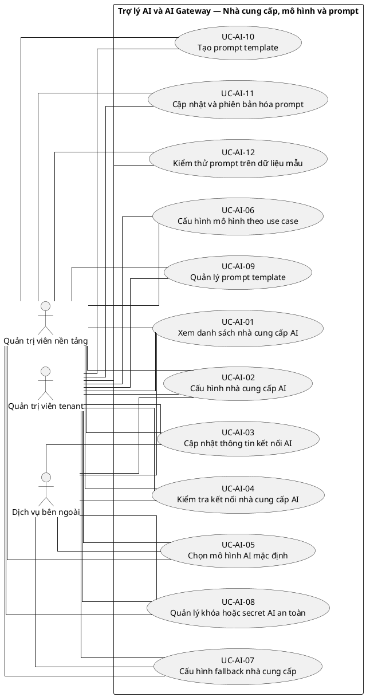
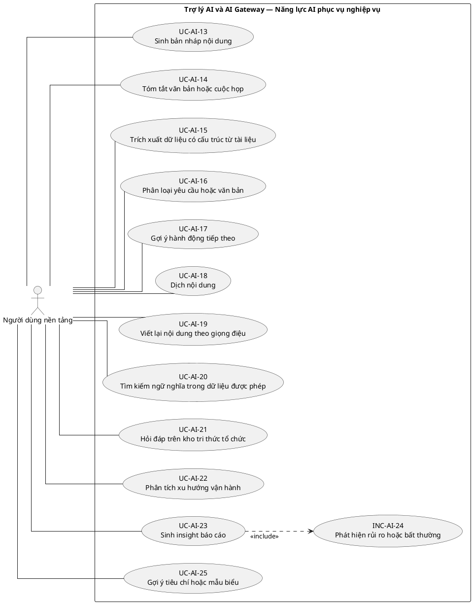
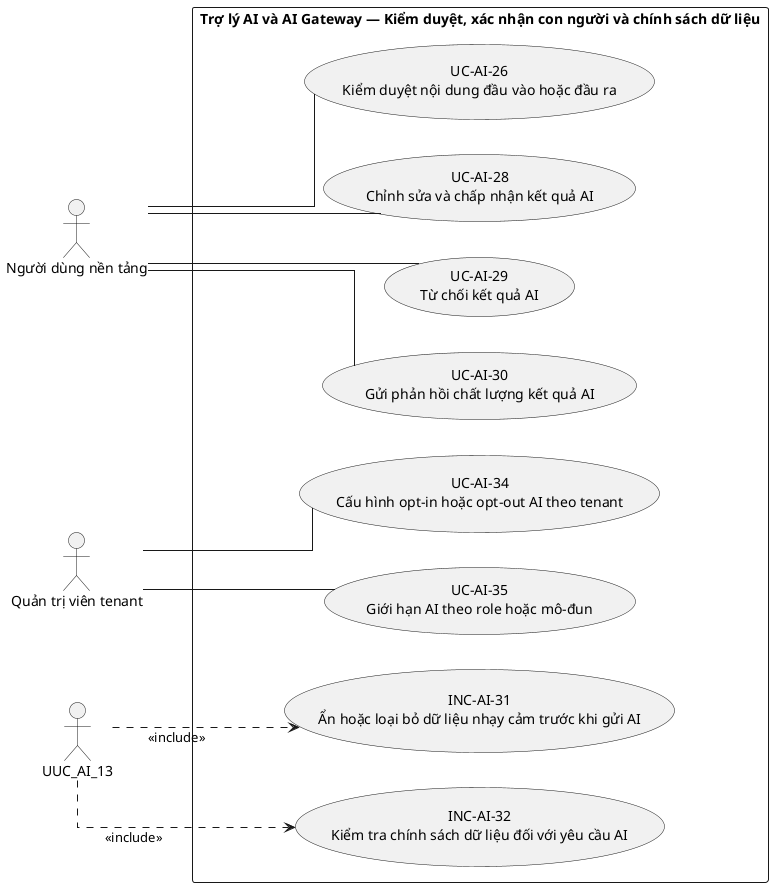
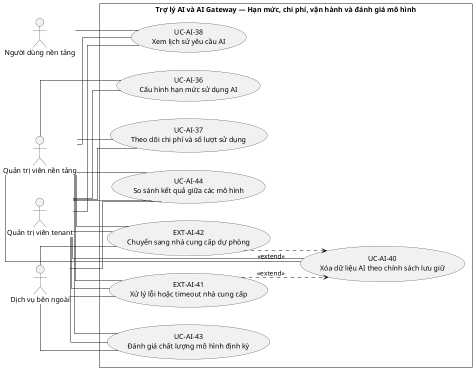

# UC-AI — Trợ lý AI và AI Gateway

## 1. Thông tin tài liệu

| Thuộc tính | Nội dung |
|---|---|
| Mã nhóm Use Case | `UC-AI` |
| Tên | Trợ lý AI và AI Gateway |
| Miền nghiệp vụ | Hỗ trợ thông minh |
| Mức ưu tiên phát triển | Năng lực mở rộng có kiểm soát |
| Phạm vi | Toàn bộ sản phẩm Operations Hub |
| Mô hình | SaaS đa tổ chức, dữ liệu và cấu hình theo tenant |
| Trạng thái đặc tả | Baseline V3; phân biệt Use Case mục tiêu, include, extend và yêu cầu hệ thống |

> **Nguyên tắc phạm vi:** tài liệu mô tả năng lực của phiên bản sản phẩm hoàn chỉnh. Mức ưu tiên phát triển không đồng nghĩa với loại bỏ khỏi phạm vi sản phẩm.

## 2. Mục tiêu

Cung cấp lớp tích hợp AI có kiểm soát để sinh bản nháp, tóm tắt, gợi ý hoặc insight mà không trở thành phụ thuộc bắt buộc của nghiệp vụ lõi.

## 3. Actor

| Mã actor | Actor | Phạm vi |
|---|---|---|
| `ACT-PLATFORM-USER` | Người dùng nền tảng | Cấp nền tảng |
| `ACT-TENANT-ADMIN` | Quản trị viên tenant | Tenant hoặc tích hợp |
| `ACT-PLATFORM-ADMIN` | Quản trị viên nền tảng | Cấp nền tảng |
| `ACT-EXTERNAL-SERVICE` | Dịch vụ bên ngoài | Tenant hoặc tích hợp |

Actor trong sơ đồ chỉ thể hiện vai trò tương tác. Quyền thực tế phải được kiểm tra tại backend dựa trên tenant context, membership, role, permission, organization unit, trạng thái module và trạng thái tenant.

## 4. Điều kiện trước

- AI Gateway hoặc provider được cấu hình.
- Người dùng có permission sử dụng năng lực AI và dữ liệu đầu vào hợp lệ.

## 5. Điều kiện sau

- Kết quả AI được trả về cùng metadata cần thiết và không tự động thực thi hành động đặc quyền.
- Lỗi provider không làm hỏng luồng nghiệp vụ lõi.

## 6. Danh mục phần tử nghiệp vụ và phân loại UML

> **Thay đổi của V3:** Không coi toàn bộ danh mục chức năng là Use Case độc lập. Chỉ phần tử có mục tiêu quan sát được đối với actor được giữ mã `UC-*`. Hành vi bắt buộc dùng chung dùng mã `INC-*`; luồng điều kiện dùng mã `EXT-*`; quy tắc hoặc xử lý xuyên suốt dùng mã `REQ-*`. Mã V2 được giữ để truy vết.

> Actor chỉ nối trực tiếp với `UC-*` hoặc `EXT-*` mà actor thực sự khởi phát/tham gia. `INC-*` được nối bằng `<<include>>`; `REQ-*` không được vẽ như Use Case.

| Mã V3 | Mã V2 | Phần tử nghiệp vụ | Loại mô hình | Actor trực tiếp / nguồn kích hoạt | Quan hệ |
|---|---|---|---|---|---|
| `UC-AI-01` | `UC-AI-01` | Xem danh sách nhà cung cấp AI | Use Case mục tiêu actor | `ACT-PLATFORM-ADMIN` — Quản trị viên nền tảng<br>`ACT-TENANT-ADMIN` — Quản trị viên tenant<br>`ACT-EXTERNAL-SERVICE` — Dịch vụ bên ngoài | Association trực tiếp với actor |
| `UC-AI-02` | `UC-AI-02` | Cấu hình nhà cung cấp AI | Use Case mục tiêu actor | `ACT-PLATFORM-ADMIN` — Quản trị viên nền tảng<br>`ACT-TENANT-ADMIN` — Quản trị viên tenant<br>`ACT-EXTERNAL-SERVICE` — Dịch vụ bên ngoài | Association trực tiếp với actor |
| `UC-AI-03` | `UC-AI-03` | Cập nhật thông tin kết nối AI | Use Case mục tiêu actor | `ACT-PLATFORM-ADMIN` — Quản trị viên nền tảng<br>`ACT-TENANT-ADMIN` — Quản trị viên tenant<br>`ACT-EXTERNAL-SERVICE` — Dịch vụ bên ngoài | Association trực tiếp với actor |
| `UC-AI-04` | `UC-AI-04` | Kiểm tra kết nối nhà cung cấp AI | Use Case mục tiêu actor | `ACT-PLATFORM-ADMIN` — Quản trị viên nền tảng<br>`ACT-TENANT-ADMIN` — Quản trị viên tenant<br>`ACT-EXTERNAL-SERVICE` — Dịch vụ bên ngoài | Association trực tiếp với actor |
| `UC-AI-05` | `UC-AI-05` | Chọn mô hình AI mặc định | Use Case mục tiêu actor | `ACT-PLATFORM-ADMIN` — Quản trị viên nền tảng<br>`ACT-TENANT-ADMIN` — Quản trị viên tenant<br>`ACT-EXTERNAL-SERVICE` — Dịch vụ bên ngoài | Association trực tiếp với actor |
| `UC-AI-06` | `UC-AI-06` | Cấu hình mô hình theo use case | Use Case mục tiêu actor | `ACT-PLATFORM-ADMIN` — Quản trị viên nền tảng<br>`ACT-TENANT-ADMIN` — Quản trị viên tenant | Association trực tiếp với actor |
| `UC-AI-07` | `UC-AI-07` | Cấu hình fallback nhà cung cấp | Use Case mục tiêu actor | `ACT-PLATFORM-ADMIN` — Quản trị viên nền tảng<br>`ACT-TENANT-ADMIN` — Quản trị viên tenant<br>`ACT-EXTERNAL-SERVICE` — Dịch vụ bên ngoài | Association trực tiếp với actor |
| `UC-AI-08` | `UC-AI-08` | Quản lý khóa hoặc secret AI an toàn | Use Case mục tiêu actor | `ACT-PLATFORM-ADMIN` — Quản trị viên nền tảng<br>`ACT-TENANT-ADMIN` — Quản trị viên tenant<br>`ACT-EXTERNAL-SERVICE` — Dịch vụ bên ngoài | Association trực tiếp với actor |
| `UC-AI-09` | `UC-AI-09` | Quản lý prompt template | Use Case mục tiêu actor | `ACT-PLATFORM-ADMIN` — Quản trị viên nền tảng<br>`ACT-TENANT-ADMIN` — Quản trị viên tenant | Association trực tiếp với actor |
| `UC-AI-10` | `UC-AI-10` | Tạo prompt template | Use Case mục tiêu actor | `ACT-PLATFORM-ADMIN` — Quản trị viên nền tảng<br>`ACT-TENANT-ADMIN` — Quản trị viên tenant | Association trực tiếp với actor |
| `UC-AI-11` | `UC-AI-11` | Cập nhật và phiên bản hóa prompt | Use Case mục tiêu actor | `ACT-PLATFORM-ADMIN` — Quản trị viên nền tảng<br>`ACT-TENANT-ADMIN` — Quản trị viên tenant | Association trực tiếp với actor |
| `UC-AI-12` | `UC-AI-12` | Kiểm thử prompt trên dữ liệu mẫu | Use Case mục tiêu actor | `ACT-PLATFORM-ADMIN` — Quản trị viên nền tảng<br>`ACT-TENANT-ADMIN` — Quản trị viên tenant | Association trực tiếp với actor |
| `UC-AI-13` | `UC-AI-13` | Sinh bản nháp nội dung | Use Case mục tiêu actor | `ACT-PLATFORM-USER` — Người dùng nền tảng | Association trực tiếp với actor |
| `UC-AI-14` | `UC-AI-14` | Tóm tắt văn bản hoặc cuộc họp | Use Case mục tiêu actor | `ACT-PLATFORM-USER` — Người dùng nền tảng | Association trực tiếp với actor |
| `UC-AI-15` | `UC-AI-15` | Trích xuất dữ liệu có cấu trúc từ tài liệu | Use Case mục tiêu actor | `ACT-PLATFORM-USER` — Người dùng nền tảng | Association trực tiếp với actor |
| `UC-AI-16` | `UC-AI-16` | Phân loại yêu cầu hoặc văn bản | Use Case mục tiêu actor | `ACT-PLATFORM-USER` — Người dùng nền tảng | Association trực tiếp với actor |
| `UC-AI-17` | `UC-AI-17` | Gợi ý hành động tiếp theo | Use Case mục tiêu actor | `ACT-PLATFORM-USER` — Người dùng nền tảng | Association trực tiếp với actor |
| `UC-AI-18` | `UC-AI-18` | Dịch nội dung | Use Case mục tiêu actor | `ACT-PLATFORM-USER` — Người dùng nền tảng | Association trực tiếp với actor |
| `UC-AI-19` | `UC-AI-19` | Viết lại nội dung theo giọng điệu | Use Case mục tiêu actor | `ACT-PLATFORM-USER` — Người dùng nền tảng | Association trực tiếp với actor |
| `UC-AI-20` | `UC-AI-20` | Tìm kiếm ngữ nghĩa trong dữ liệu được phép | Use Case mục tiêu actor | `ACT-PLATFORM-USER` — Người dùng nền tảng | Association trực tiếp với actor |
| `UC-AI-21` | `UC-AI-21` | Hỏi đáp trên kho tri thức tổ chức | Use Case mục tiêu actor | `ACT-PLATFORM-USER` — Người dùng nền tảng | Association trực tiếp với actor |
| `UC-AI-22` | `UC-AI-22` | Phân tích xu hướng vận hành | Use Case mục tiêu actor | `ACT-PLATFORM-USER` — Người dùng nền tảng | Association trực tiếp với actor |
| `UC-AI-23` | `UC-AI-23` | Sinh insight báo cáo | Use Case mục tiêu actor | `ACT-PLATFORM-USER` — Người dùng nền tảng | Association trực tiếp với actor |
| `INC-AI-24` | `UC-AI-24` | Phát hiện rủi ro hoặc bất thường | Hành vi dùng chung `<<include>>` | Hệ thống; được gọi từ Use Case cha | `UC-AI-23` `<<include>>` `INC-AI-24` |
| `UC-AI-25` | `UC-AI-25` | Gợi ý tiêu chí hoặc mẫu biểu | Use Case mục tiêu actor | `ACT-PLATFORM-USER` — Người dùng nền tảng | Association trực tiếp với actor |
| `UC-AI-26` | `UC-AI-26` | Kiểm duyệt nội dung đầu vào hoặc đầu ra | Use Case mục tiêu actor | `ACT-PLATFORM-USER` — Người dùng nền tảng | Association trực tiếp với actor |
| `REQ-AI-27` | `UC-AI-27` | Yêu cầu người dùng xác nhận trước khi áp dụng kết quả AI | Quy tắc/yêu cầu hệ thống | Hệ thống/chính sách; không có association actor trực tiếp | Áp dụng như quy tắc/yêu cầu xuyên suốt; không nối actor trực tiếp |
| `UC-AI-28` | `UC-AI-28` | Chỉnh sửa và chấp nhận kết quả AI | Use Case mục tiêu actor | `ACT-PLATFORM-USER` — Người dùng nền tảng | Association trực tiếp với actor |
| `UC-AI-29` | `UC-AI-29` | Từ chối kết quả AI | Use Case mục tiêu actor | `ACT-PLATFORM-USER` — Người dùng nền tảng | Association trực tiếp với actor |
| `UC-AI-30` | `UC-AI-30` | Gửi phản hồi chất lượng kết quả AI | Use Case mục tiêu actor | `ACT-PLATFORM-USER` — Người dùng nền tảng | Association trực tiếp với actor |
| `INC-AI-31` | `UC-AI-31` | Ẩn hoặc loại bỏ dữ liệu nhạy cảm trước khi gửi AI | Hành vi dùng chung `<<include>>` | Hệ thống; được gọi từ Use Case cha | `UC-AI-13` `<<include>>` `INC-AI-31` |
| `INC-AI-32` | `UC-AI-32` | Kiểm tra chính sách dữ liệu đối với yêu cầu AI | Hành vi dùng chung `<<include>>` | Hệ thống; được gọi từ Use Case cha | `UC-AI-13` `<<include>>` `INC-AI-32` |
| `REQ-AI-33` | `UC-AI-33` | Chặn gửi dữ liệu không được phép | Quy tắc/yêu cầu hệ thống | Hệ thống/chính sách; không có association actor trực tiếp | Áp dụng như quy tắc/yêu cầu xuyên suốt; không nối actor trực tiếp |
| `UC-AI-34` | `UC-AI-34` | Cấu hình opt-in hoặc opt-out AI theo tenant | Use Case mục tiêu actor | `ACT-TENANT-ADMIN` — Quản trị viên tenant | Association trực tiếp với actor |
| `UC-AI-35` | `UC-AI-35` | Giới hạn AI theo role hoặc mô-đun | Use Case mục tiêu actor | `ACT-TENANT-ADMIN` — Quản trị viên tenant | Association trực tiếp với actor |
| `UC-AI-36` | `UC-AI-36` | Cấu hình hạn mức sử dụng AI | Use Case mục tiêu actor | `ACT-PLATFORM-ADMIN` — Quản trị viên nền tảng<br>`ACT-TENANT-ADMIN` — Quản trị viên tenant | Association trực tiếp với actor |
| `UC-AI-37` | `UC-AI-37` | Theo dõi chi phí và số lượt sử dụng | Use Case mục tiêu actor | `ACT-PLATFORM-ADMIN` — Quản trị viên nền tảng<br>`ACT-TENANT-ADMIN` — Quản trị viên tenant | Association trực tiếp với actor |
| `UC-AI-38` | `UC-AI-38` | Xem lịch sử yêu cầu AI | Use Case mục tiêu actor | `ACT-PLATFORM-ADMIN` — Quản trị viên nền tảng<br>`ACT-TENANT-ADMIN` — Quản trị viên tenant<br>`ACT-PLATFORM-USER` — Người dùng nền tảng | Association trực tiếp với actor |
| `REQ-AI-39` | `UC-AI-39` | Ghi audit metadata yêu cầu AI | Quy tắc/yêu cầu hệ thống | Hệ thống/chính sách; không có association actor trực tiếp | Áp dụng như quy tắc/yêu cầu xuyên suốt; không nối actor trực tiếp |
| `UC-AI-40` | `UC-AI-40` | Xóa dữ liệu AI theo chính sách lưu giữ | Use Case mục tiêu actor | `ACT-PLATFORM-ADMIN` — Quản trị viên nền tảng<br>`ACT-TENANT-ADMIN` — Quản trị viên tenant | Association trực tiếp với actor |
| `EXT-AI-41` | `UC-AI-41` | Xử lý lỗi hoặc timeout nhà cung cấp | Luồng điều kiện `<<extend>>` | `ACT-PLATFORM-ADMIN` — Quản trị viên nền tảng<br>`ACT-TENANT-ADMIN` — Quản trị viên tenant<br>`ACT-EXTERNAL-SERVICE` — Dịch vụ bên ngoài | `EXT-AI-41` `<<extend>>` `UC-AI-40` |
| `EXT-AI-42` | `UC-AI-42` | Chuyển sang nhà cung cấp dự phòng | Luồng điều kiện `<<extend>>` | `ACT-PLATFORM-ADMIN` — Quản trị viên nền tảng<br>`ACT-TENANT-ADMIN` — Quản trị viên tenant<br>`ACT-EXTERNAL-SERVICE` — Dịch vụ bên ngoài | `EXT-AI-42` `<<extend>>` `UC-AI-40` |
| `UC-AI-43` | `UC-AI-43` | Đánh giá chất lượng mô hình định kỳ | Use Case mục tiêu actor | `ACT-PLATFORM-ADMIN` — Quản trị viên nền tảng<br>`ACT-TENANT-ADMIN` — Quản trị viên tenant<br>`ACT-EXTERNAL-SERVICE` — Dịch vụ bên ngoài | Association trực tiếp với actor |
| `UC-AI-44` | `UC-AI-44` | So sánh kết quả giữa các mô hình | Use Case mục tiêu actor | `ACT-PLATFORM-ADMIN` — Quản trị viên nền tảng<br>`ACT-TENANT-ADMIN` — Quản trị viên tenant<br>`ACT-EXTERNAL-SERVICE` — Dịch vụ bên ngoài | Association trực tiếp với actor |

## 7. Luồng nghiệp vụ chính

1. Người dùng chọn chức năng AI trong một module.
2. Hệ thống kiểm tra permission, quota và tenant policy.
3. Hệ thống xây dựng prompt từ template, chỉ lấy dữ liệu trong scope.
4. AI Gateway loại bỏ hoặc che dữ liệu không được phép và gọi provider.
5. Kết quả được chuẩn hóa, gắn metadata và trả về dưới dạng bản nháp.
6. Người dùng chỉnh sửa, chấp nhận hoặc bỏ kết quả; phản hồi được ghi nhận.

## 8. Luồng thay thế và ngoại lệ

- Provider lỗi hoặc timeout: trả lỗi kiểm soát và cho phép tiếp tục quy trình thủ công.
- Quota hết: từ chối có thông báo rõ.
- Dữ liệu đầu vào chứa trường bị cấm: loại bỏ hoặc từ chối.
- Kết quả không phù hợp: người dùng báo cáo, hệ thống lưu metadata để đánh giá.

## 9. Quy tắc nghiệp vụ cốt lõi

- AI là năng lực hỗ trợ; lỗi AI không được chặn quy trình lõi.
- Đầu ra AI phải được xem là bản nháp hoặc gợi ý cho đến khi con người xác nhận.
- AI không được tự gửi thông báo, duyệt giao dịch, đổi quyền hoặc thực thi hành động đặc quyền.
- Dữ liệu tenant chỉ được gửi đến provider theo chính sách, permission và cấu hình bảo vệ dữ liệu.
- Secret và khóa API không được xuất hiện trong prompt, log hoặc response người dùng.

## 10. Mô hình dữ liệu logic liên quan

| Thực thể | Vai trò |
|---|---|
| `AIProviderConfiguration` | Thực thể logic phục vụ UC-AI; thiết kế vật lý được xác định ở giai đoạn thiết kế dữ liệu. |
| `AIModel` | Thực thể logic phục vụ UC-AI; thiết kế vật lý được xác định ở giai đoạn thiết kế dữ liệu. |
| `PromptTemplate` | Thực thể logic phục vụ UC-AI; thiết kế vật lý được xác định ở giai đoạn thiết kế dữ liệu. |
| `AIRequest` | Thực thể logic phục vụ UC-AI; thiết kế vật lý được xác định ở giai đoạn thiết kế dữ liệu. |
| `AIResponse` | Thực thể logic phục vụ UC-AI; thiết kế vật lý được xác định ở giai đoạn thiết kế dữ liệu. |
| `AIUsage` | Thực thể logic phục vụ UC-AI; thiết kế vật lý được xác định ở giai đoạn thiết kế dữ liệu. |
| `AIFeedback` | Thực thể logic phục vụ UC-AI; thiết kế vật lý được xác định ở giai đoạn thiết kế dữ liệu. |
| `TenantAISetting` | Thực thể logic phục vụ UC-AI; thiết kế vật lý được xác định ở giai đoạn thiết kế dữ liệu. |
| `AuditLog` | Thực thể logic phục vụ UC-AI; thiết kế vật lý được xác định ở giai đoạn thiết kế dữ liệu. |

Mọi thực thể nghiệp vụ phải xác định được tenant sở hữu, trừ thực thể được công bố rõ là dữ liệu cấp nền tảng. Quan hệ tham chiếu chéo tenant bị cấm nếu không có cơ chế liên tenant được đặc tả riêng.

## 11. Kiểm soát truy cập

Quyền hiệu lực được xác định theo công thức khái quát:

```text
Quyền hiệu lực
= Permission từ các Role đang hoạt động
∩ Tenant context hợp lệ
∩ Membership đang hoạt động
∩ Phạm vi Organization Unit
∩ Phạm vi tài nguyên
∩ Trạng thái Module
∩ Trạng thái Tenant
```

Các kiểm tra bắt buộc:

- Xác thực User trước khi truy cập chức năng không công khai.
- Đối chiếu tenant context với membership.
- Kiểm tra permission tại backend, không dựa vào trạng thái hiển thị của frontend.
- Giới hạn truy vấn, tệp, bản xuất, cache và tác vụ nền theo tenant.
- Ghi audit cho hành động quản trị hoặc thay đổi nghiệp vụ quan trọng.

## 12. Tiêu chí chấp nhận

| Mã | Tiêu chí | Phương pháp kiểm chứng |
|---|---|---|
| `AC-AI-01` | Tắt AI hoặc provider lỗi không làm hỏng module lõi. | Functional / Integration / Security Test tùy nội dung |
| `AC-AI-02` | Không có hành động đặc quyền tự động từ đầu ra AI. | Functional / Integration / Security Test tùy nội dung |
| `AC-AI-03` | AI request chỉ chứa dữ liệu trong tenant và scope được phép. | Functional / Integration / Security Test tùy nội dung |
| `AC-AI-04` | Mỗi lần gọi có usage, provider/model và correlation ID phù hợp. | Functional / Integration / Security Test tùy nội dung |

## 13. Quan hệ với nhóm Use Case khác

[`UC-RBAC`](./04_UC-RBAC.md), [`UC-MODULE`](./07_UC-MODULE.md), [`UC-DASHBOARD`](./19_UC-DASHBOARD.md), [`UC-DOCUMENT`](./11_UC-DOCUMENT.md), [`UC-NOTIFICATION`](./18_UC-NOTIFICATION.md), [`UC-AUDIT`](./21_UC-AUDIT.md)

## 14. Use Case Diagram theo luồng nghiệp vụ

Các package/rectangle dưới đây chỉ là **ranh giới hệ thống hoặc miền nghiệp vụ**. Không tồn tại phần tử trung gian `PKG*`; actor liên kết trực tiếp với Use Case có mục tiêu nghiệp vụ. `INC-*` và `EXT-*` chỉ xuất hiện qua quan hệ UML tương ứng; `REQ-*` được trình bày ngoài sơ đồ.

### 14.1. Quy ước đọc sơ đồ

- `Actor -- UC-*`: actor trực tiếp thực hiện hoặc tham gia mục tiêu nghiệp vụ.
- `UC-* ..> INC-* : <<include>>`: hành vi bắt buộc được dùng lại.
- `EXT-* ..> UC-* : <<extend>>`: hành vi chỉ phát sinh trong điều kiện xác định.
- `REQ-*`: quy tắc/yêu cầu hệ thống, không phải Use Case và không nối actor.

### 14.2. Nhà cung cấp, mô hình và prompt



### 14.3. Năng lực AI phục vụ nghiệp vụ



### 14.4. Kiểm duyệt, xác nhận con người và chính sách dữ liệu



**Quy tắc/yêu cầu áp dụng cho luồng này:**
- `REQ-AI-27` — Yêu cầu người dùng xác nhận trước khi áp dụng kết quả AI
- `REQ-AI-33` — Chặn gửi dữ liệu không được phép

### 14.5. Hạn mức, chi phí, vận hành và đánh giá mô hình



**Quy tắc/yêu cầu áp dụng cho luồng này:**
- `REQ-AI-39` — Ghi audit metadata yêu cầu AI
