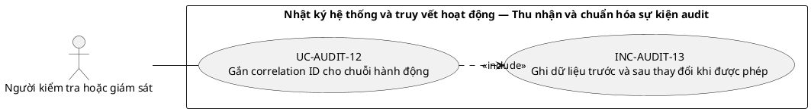
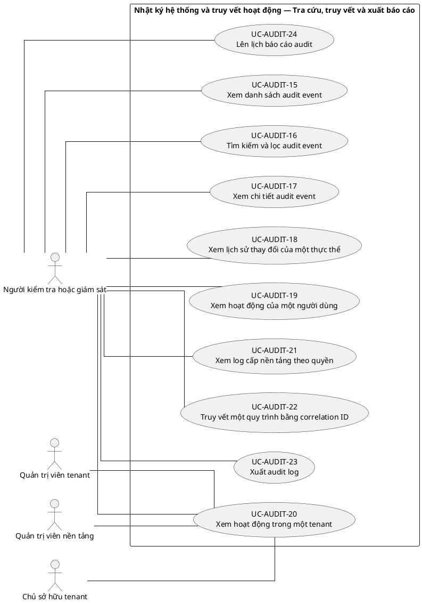
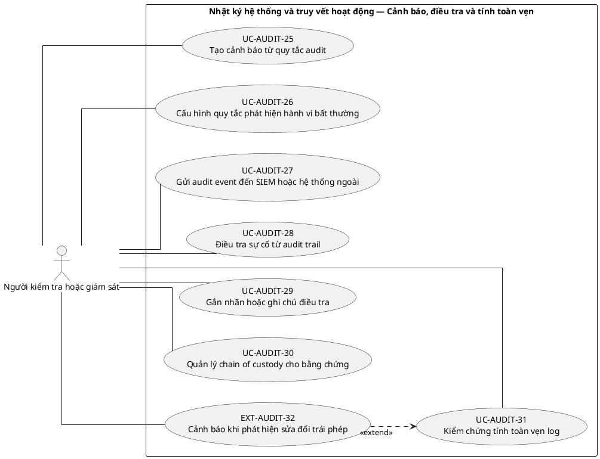
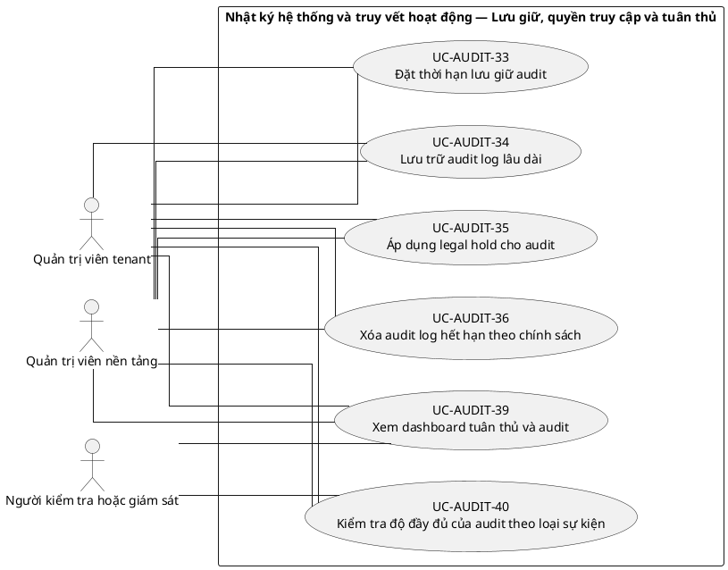

# UC-AUDIT — Nhật ký hệ thống và truy vết hoạt động

## 1. Thông tin tài liệu

| Thuộc tính | Nội dung |
|---|---|
| Mã nhóm Use Case | `UC-AUDIT` |
| Tên | Nhật ký hệ thống và truy vết hoạt động |
| Miền nghiệp vụ | Quản trị và tuân thủ |
| Mức ưu tiên phát triển | Nền tảng bắt buộc |
| Phạm vi | Toàn bộ sản phẩm Operations Hub |
| Mô hình | SaaS đa tổ chức, dữ liệu và cấu hình theo tenant |
| Trạng thái đặc tả | Baseline V3; phân biệt Use Case mục tiêu, include, extend và yêu cầu hệ thống |

> **Nguyên tắc phạm vi:** tài liệu mô tả năng lực của phiên bản sản phẩm hoàn chỉnh. Mức ưu tiên phát triển không đồng nghĩa với loại bỏ khỏi phạm vi sản phẩm.

## 2. Mục tiêu

Ghi nhận, tìm kiếm và bảo toàn nhật ký của các hành động quản trị, bảo mật và nghiệp vụ quan trọng.

## 3. Actor

| Mã actor | Actor | Phạm vi |
|---|---|---|
| `ACT-AUDITOR` | Người kiểm tra hoặc giám sát | Tenant hoặc tích hợp |
| `ACT-TENANT-ADMIN` | Quản trị viên tenant | Tenant hoặc tích hợp |
| `ACT-TENANT-OWNER` | Chủ sở hữu tenant | Tenant hoặc tích hợp |
| `ACT-PLATFORM-ADMIN` | Quản trị viên nền tảng | Cấp nền tảng |

Actor trong sơ đồ chỉ thể hiện vai trò tương tác. Quyền thực tế phải được kiểm tra tại backend dựa trên tenant context, membership, role, permission, organization unit, trạng thái module và trạng thái tenant.

## 4. Điều kiện trước

- Cơ chế audit được bật cho các sự kiện bắt buộc.
- Người xem log có permission và scope phù hợp.

## 5. Điều kiện sau

- Sự kiện audit có actor, tenant, hành động, đối tượng, thời điểm, kết quả và correlation ID khi cần.
- Người dùng thông thường không thể sửa hoặc xóa log.

## 6. Danh mục phần tử nghiệp vụ và phân loại UML

> **Thay đổi của V3:** Không coi toàn bộ danh mục chức năng là Use Case độc lập. Chỉ phần tử có mục tiêu quan sát được đối với actor được giữ mã `UC-*`. Hành vi bắt buộc dùng chung dùng mã `INC-*`; luồng điều kiện dùng mã `EXT-*`; quy tắc hoặc xử lý xuyên suốt dùng mã `REQ-*`. Mã V2 được giữ để truy vết.

> Actor chỉ nối trực tiếp với `UC-*` hoặc `EXT-*` mà actor thực sự khởi phát/tham gia. `INC-*` được nối bằng `<<include>>`; `REQ-*` không được vẽ như Use Case.

| Mã V3 | Mã V2 | Phần tử nghiệp vụ | Loại mô hình | Actor trực tiếp / nguồn kích hoạt | Quan hệ |
|---|---|---|---|---|---|
| `REQ-AUDIT-01` | `UC-AUDIT-01` | Ghi audit cho sự kiện xác thực | Quy tắc/yêu cầu hệ thống | Hệ thống/chính sách; không có association actor trực tiếp | Áp dụng như quy tắc/yêu cầu xuyên suốt; không nối actor trực tiếp |
| `REQ-AUDIT-02` | `UC-AUDIT-02` | Ghi audit cho thay đổi tenant | Quy tắc/yêu cầu hệ thống | Hệ thống/chính sách; không có association actor trực tiếp | Áp dụng như quy tắc/yêu cầu xuyên suốt; không nối actor trực tiếp |
| `REQ-AUDIT-03` | `UC-AUDIT-03` | Ghi audit cho thay đổi membership | Quy tắc/yêu cầu hệ thống | Hệ thống/chính sách; không có association actor trực tiếp | Áp dụng như quy tắc/yêu cầu xuyên suốt; không nối actor trực tiếp |
| `REQ-AUDIT-04` | `UC-AUDIT-04` | Ghi audit cho thay đổi role và permission | Quy tắc/yêu cầu hệ thống | Hệ thống/chính sách; không có association actor trực tiếp | Áp dụng như quy tắc/yêu cầu xuyên suốt; không nối actor trực tiếp |
| `REQ-AUDIT-05` | `UC-AUDIT-05` | Ghi audit cho thay đổi module và branding | Quy tắc/yêu cầu hệ thống | Hệ thống/chính sách; không có association actor trực tiếp | Áp dụng như quy tắc/yêu cầu xuyên suốt; không nối actor trực tiếp |
| `REQ-AUDIT-06` | `UC-AUDIT-06` | Ghi audit cho nghiệp vụ phê duyệt | Quy tắc/yêu cầu hệ thống | Hệ thống/chính sách; không có association actor trực tiếp | Áp dụng như quy tắc/yêu cầu xuyên suốt; không nối actor trực tiếp |
| `REQ-AUDIT-07` | `UC-AUDIT-07` | Ghi audit cho giao dịch tài chính | Quy tắc/yêu cầu hệ thống | Hệ thống/chính sách; không có association actor trực tiếp | Áp dụng như quy tắc/yêu cầu xuyên suốt; không nối actor trực tiếp |
| `REQ-AUDIT-08` | `UC-AUDIT-08` | Ghi audit cho truy cập dữ liệu nhạy cảm | Quy tắc/yêu cầu hệ thống | Hệ thống/chính sách; không có association actor trực tiếp | Áp dụng như quy tắc/yêu cầu xuyên suốt; không nối actor trực tiếp |
| `REQ-AUDIT-09` | `UC-AUDIT-09` | Ghi security event | Quy tắc/yêu cầu hệ thống | Hệ thống/chính sách; không có association actor trực tiếp | Áp dụng như quy tắc/yêu cầu xuyên suốt; không nối actor trực tiếp |
| `REQ-AUDIT-10` | `UC-AUDIT-10` | Ghi platform administration event | Quy tắc/yêu cầu hệ thống | Hệ thống/chính sách; không có association actor trực tiếp | Áp dụng như quy tắc/yêu cầu xuyên suốt; không nối actor trực tiếp |
| `REQ-AUDIT-11` | `UC-AUDIT-11` | Chuẩn hóa schema audit event | Quy tắc/yêu cầu hệ thống | Hệ thống/chính sách; không có association actor trực tiếp | Áp dụng như quy tắc/yêu cầu xuyên suốt; không nối actor trực tiếp |
| `UC-AUDIT-12` | `UC-AUDIT-12` | Gắn correlation ID cho chuỗi hành động | Use Case mục tiêu actor | `ACT-AUDITOR` — Người kiểm tra hoặc giám sát | Association trực tiếp với actor |
| `INC-AUDIT-13` | `UC-AUDIT-13` | Ghi dữ liệu trước và sau thay đổi khi được phép | Hành vi dùng chung `<<include>>` | Hệ thống; được gọi từ Use Case cha | `UC-AUDIT-12` `<<include>>` `INC-AUDIT-13` |
| `REQ-AUDIT-14` | `UC-AUDIT-14` | Ẩn dữ liệu nhạy cảm trong audit | Quy tắc/yêu cầu hệ thống | Hệ thống/chính sách; không có association actor trực tiếp | Áp dụng như quy tắc/yêu cầu xuyên suốt; không nối actor trực tiếp |
| `UC-AUDIT-15` | `UC-AUDIT-15` | Xem danh sách audit event | Use Case mục tiêu actor | `ACT-AUDITOR` — Người kiểm tra hoặc giám sát | Association trực tiếp với actor |
| `UC-AUDIT-16` | `UC-AUDIT-16` | Tìm kiếm và lọc audit event | Use Case mục tiêu actor | `ACT-AUDITOR` — Người kiểm tra hoặc giám sát | Association trực tiếp với actor |
| `UC-AUDIT-17` | `UC-AUDIT-17` | Xem chi tiết audit event | Use Case mục tiêu actor | `ACT-AUDITOR` — Người kiểm tra hoặc giám sát | Association trực tiếp với actor |
| `UC-AUDIT-18` | `UC-AUDIT-18` | Xem lịch sử thay đổi của một thực thể | Use Case mục tiêu actor | `ACT-AUDITOR` — Người kiểm tra hoặc giám sát | Association trực tiếp với actor |
| `UC-AUDIT-19` | `UC-AUDIT-19` | Xem hoạt động của một người dùng | Use Case mục tiêu actor | `ACT-AUDITOR` — Người kiểm tra hoặc giám sát | Association trực tiếp với actor |
| `UC-AUDIT-20` | `UC-AUDIT-20` | Xem hoạt động trong một tenant | Use Case mục tiêu actor | `ACT-AUDITOR` — Người kiểm tra hoặc giám sát<br>`ACT-TENANT-ADMIN` — Quản trị viên tenant<br>`ACT-PLATFORM-ADMIN` — Quản trị viên nền tảng<br>`ACT-TENANT-OWNER` — Chủ sở hữu tenant | Association trực tiếp với actor |
| `UC-AUDIT-21` | `UC-AUDIT-21` | Xem log cấp nền tảng theo quyền | Use Case mục tiêu actor | `ACT-AUDITOR` — Người kiểm tra hoặc giám sát | Association trực tiếp với actor |
| `UC-AUDIT-22` | `UC-AUDIT-22` | Truy vết một quy trình bằng correlation ID | Use Case mục tiêu actor | `ACT-AUDITOR` — Người kiểm tra hoặc giám sát | Association trực tiếp với actor |
| `UC-AUDIT-23` | `UC-AUDIT-23` | Xuất audit log | Use Case mục tiêu actor | `ACT-AUDITOR` — Người kiểm tra hoặc giám sát | Association trực tiếp với actor |
| `UC-AUDIT-24` | `UC-AUDIT-24` | Lên lịch báo cáo audit | Use Case mục tiêu actor | `ACT-AUDITOR` — Người kiểm tra hoặc giám sát | Association trực tiếp với actor |
| `UC-AUDIT-25` | `UC-AUDIT-25` | Tạo cảnh báo từ quy tắc audit | Use Case mục tiêu actor | `ACT-AUDITOR` — Người kiểm tra hoặc giám sát | Association trực tiếp với actor |
| `UC-AUDIT-26` | `UC-AUDIT-26` | Cấu hình quy tắc phát hiện hành vi bất thường | Use Case mục tiêu actor | `ACT-AUDITOR` — Người kiểm tra hoặc giám sát | Association trực tiếp với actor |
| `UC-AUDIT-27` | `UC-AUDIT-27` | Gửi audit event đến SIEM hoặc hệ thống ngoài | Use Case mục tiêu actor | `ACT-AUDITOR` — Người kiểm tra hoặc giám sát | Association trực tiếp với actor |
| `UC-AUDIT-28` | `UC-AUDIT-28` | Điều tra sự cố từ audit trail | Use Case mục tiêu actor | `ACT-AUDITOR` — Người kiểm tra hoặc giám sát | Association trực tiếp với actor |
| `UC-AUDIT-29` | `UC-AUDIT-29` | Gắn nhãn hoặc ghi chú điều tra | Use Case mục tiêu actor | `ACT-AUDITOR` — Người kiểm tra hoặc giám sát | Association trực tiếp với actor |
| `UC-AUDIT-30` | `UC-AUDIT-30` | Quản lý chain of custody cho bằng chứng | Use Case mục tiêu actor | `ACT-AUDITOR` — Người kiểm tra hoặc giám sát | Association trực tiếp với actor |
| `UC-AUDIT-31` | `UC-AUDIT-31` | Kiểm chứng tính toàn vẹn log | Use Case mục tiêu actor | `ACT-AUDITOR` — Người kiểm tra hoặc giám sát | Association trực tiếp với actor |
| `EXT-AUDIT-32` | `UC-AUDIT-32` | Cảnh báo khi phát hiện sửa đổi trái phép | Luồng điều kiện `<<extend>>` | `ACT-AUDITOR` — Người kiểm tra hoặc giám sát | `EXT-AUDIT-32` `<<extend>>` `UC-AUDIT-31` |
| `UC-AUDIT-33` | `UC-AUDIT-33` | Đặt thời hạn lưu giữ audit | Use Case mục tiêu actor | `ACT-TENANT-ADMIN` — Quản trị viên tenant<br>`ACT-PLATFORM-ADMIN` — Quản trị viên nền tảng | Association trực tiếp với actor |
| `UC-AUDIT-34` | `UC-AUDIT-34` | Lưu trữ audit log lâu dài | Use Case mục tiêu actor | `ACT-TENANT-ADMIN` — Quản trị viên tenant<br>`ACT-PLATFORM-ADMIN` — Quản trị viên nền tảng | Association trực tiếp với actor |
| `UC-AUDIT-35` | `UC-AUDIT-35` | Áp dụng legal hold cho audit | Use Case mục tiêu actor | `ACT-TENANT-ADMIN` — Quản trị viên tenant<br>`ACT-PLATFORM-ADMIN` — Quản trị viên nền tảng | Association trực tiếp với actor |
| `UC-AUDIT-36` | `UC-AUDIT-36` | Xóa audit log hết hạn theo chính sách | Use Case mục tiêu actor | `ACT-TENANT-ADMIN` — Quản trị viên tenant<br>`ACT-PLATFORM-ADMIN` — Quản trị viên nền tảng | Association trực tiếp với actor |
| `REQ-AUDIT-37` | `UC-AUDIT-37` | Giới hạn quyền xem audit | Quy tắc/yêu cầu hệ thống | Hệ thống/chính sách; không có association actor trực tiếp | Áp dụng như quy tắc/yêu cầu xuyên suốt; không nối actor trực tiếp |
| `REQ-AUDIT-38` | `UC-AUDIT-38` | Ghi audit cho việc xem hoặc xuất audit nhạy cảm | Quy tắc/yêu cầu hệ thống | Hệ thống/chính sách; không có association actor trực tiếp | Áp dụng như quy tắc/yêu cầu xuyên suốt; không nối actor trực tiếp |
| `UC-AUDIT-39` | `UC-AUDIT-39` | Xem dashboard tuân thủ và audit | Use Case mục tiêu actor | `ACT-AUDITOR` — Người kiểm tra hoặc giám sát<br>`ACT-TENANT-ADMIN` — Quản trị viên tenant<br>`ACT-PLATFORM-ADMIN` — Quản trị viên nền tảng | Association trực tiếp với actor |
| `UC-AUDIT-40` | `UC-AUDIT-40` | Kiểm tra độ đầy đủ của audit theo loại sự kiện | Use Case mục tiêu actor | `ACT-AUDITOR` — Người kiểm tra hoặc giám sát<br>`ACT-TENANT-ADMIN` — Quản trị viên tenant<br>`ACT-PLATFORM-ADMIN` — Quản trị viên nền tảng | Association trực tiếp với actor |

## 7. Luồng nghiệp vụ chính

1. Một nghiệp vụ quan trọng bắt đầu và tạo correlation ID.
2. Hệ thống ghi actor, tenant context, action, target và trạng thái trước/sau ở mức cần thiết.
3. Nghiệp vụ hoàn tất hoặc thất bại; kết quả được cập nhật vào audit event.
4. Auditor tìm kiếm log theo thời gian và đối tượng.
5. Hệ thống áp dụng tenant/scope, masking và trả kết quả.
6. Khi xuất, hệ thống tạo file có thời hạn và ghi lại chính hành động xuất log.

## 8. Luồng thay thế và ngoại lệ

- Audit sink tạm thời lỗi: nghiệp vụ nhạy cảm có thể bị chặn hoặc ghi hàng đợi bền vững theo chính sách.
- Payload chứa secret: phải loại bỏ hoặc masking trước khi lưu.
- Người dùng yêu cầu log ngoài scope: từ chối.
- Retention hết hạn: archive hoặc xóa theo job có audit cấp hệ thống.

## 9. Quy tắc nghiệp vụ cốt lõi

- Audit log phải chứa tối thiểu tenant, actor, action, entity, timestamp và result khi áp dụng.
- Người dùng thông thường không được cập nhật hoặc xóa log.
- Log tenant A không được hiển thị cho tenant B.
- Platform Admin không mặc nhiên xem payload nghiệp vụ nhạy cảm; dữ liệu log phải được masking.
- Xóa hoặc lưu trữ log phải tuân theo retention và thẩm quyền riêng.

## 10. Mô hình dữ liệu logic liên quan

| Thực thể | Vai trò |
|---|---|
| `AuditEvent` | Thực thể logic phục vụ UC-AUDIT; thiết kế vật lý được xác định ở giai đoạn thiết kế dữ liệu. |
| `SecurityEvent` | Thực thể logic phục vụ UC-AUDIT; thiết kế vật lý được xác định ở giai đoạn thiết kế dữ liệu. |
| `CorrelationContext` | Thực thể logic phục vụ UC-AUDIT; thiết kế vật lý được xác định ở giai đoạn thiết kế dữ liệu. |
| `AuditExport` | Thực thể logic phục vụ UC-AUDIT; thiết kế vật lý được xác định ở giai đoạn thiết kế dữ liệu. |
| `RetentionPolicy` | Thực thể logic phục vụ UC-AUDIT; thiết kế vật lý được xác định ở giai đoạn thiết kế dữ liệu. |
| `AuditAlert` | Thực thể logic phục vụ UC-AUDIT; thiết kế vật lý được xác định ở giai đoạn thiết kế dữ liệu. |
| `AuditArchive` | Thực thể logic phục vụ UC-AUDIT; thiết kế vật lý được xác định ở giai đoạn thiết kế dữ liệu. |

Mọi thực thể nghiệp vụ phải xác định được tenant sở hữu, trừ thực thể được công bố rõ là dữ liệu cấp nền tảng. Quan hệ tham chiếu chéo tenant bị cấm nếu không có cơ chế liên tenant được đặc tả riêng.

## 11. Kiểm soát truy cập

Quyền hiệu lực được xác định theo công thức khái quát:

```text
Quyền hiệu lực
= Permission từ các Role đang hoạt động
∩ Tenant context hợp lệ
∩ Membership đang hoạt động
∩ Phạm vi Organization Unit
∩ Phạm vi tài nguyên
∩ Trạng thái Module
∩ Trạng thái Tenant
```

Các kiểm tra bắt buộc:

- Xác thực User trước khi truy cập chức năng không công khai.
- Đối chiếu tenant context với membership.
- Kiểm tra permission tại backend, không dựa vào trạng thái hiển thị của frontend.
- Giới hạn truy vấn, tệp, bản xuất, cache và tác vụ nền theo tenant.
- Ghi audit cho hành động quản trị hoặc thay đổi nghiệp vụ quan trọng.

## 12. Tiêu chí chấp nhận

| Mã | Tiêu chí | Phương pháp kiểm chứng |
|---|---|---|
| `AC-AUDIT-01` | Thay đổi tenant, membership, role, permission, module và branding đều tạo audit. | Functional / Integration / Security Test tùy nội dung |
| `AC-AUDIT-02` | Không có API sửa/xóa log cho người dùng thông thường. | Functional / Integration / Security Test tùy nội dung |
| `AC-AUDIT-03` | Tìm kiếm log không trả dữ liệu tenant khác. | Functional / Integration / Security Test tùy nội dung |
| `AC-AUDIT-04` | Bản xuất audit có người tạo, thời điểm, bộ lọc và thời hạn truy cập. | Functional / Integration / Security Test tùy nội dung |

## 13. Quan hệ với nhóm Use Case khác

[`UC-TENANT`](./01_UC-TENANT.md), [`UC-AUTH`](./02_UC-AUTH.md), [`UC-RBAC`](./04_UC-RBAC.md)

## 14. Use Case Diagram theo luồng nghiệp vụ

Các package/rectangle dưới đây chỉ là **ranh giới hệ thống hoặc miền nghiệp vụ**. Không tồn tại phần tử trung gian `PKG*`; actor liên kết trực tiếp với Use Case có mục tiêu nghiệp vụ. `INC-*` và `EXT-*` chỉ xuất hiện qua quan hệ UML tương ứng; `REQ-*` được trình bày ngoài sơ đồ.

### 14.1. Quy ước đọc sơ đồ

- `Actor -- UC-*`: actor trực tiếp thực hiện hoặc tham gia mục tiêu nghiệp vụ.
- `UC-* ..> INC-* : <<include>>`: hành vi bắt buộc được dùng lại.
- `EXT-* ..> UC-* : <<extend>>`: hành vi chỉ phát sinh trong điều kiện xác định.
- `REQ-*`: quy tắc/yêu cầu hệ thống, không phải Use Case và không nối actor.

### 14.2. Thu nhận và chuẩn hóa sự kiện audit



**Quy tắc/yêu cầu áp dụng cho luồng này:**
- `REQ-AUDIT-01` — Ghi audit cho sự kiện xác thực
- `REQ-AUDIT-02` — Ghi audit cho thay đổi tenant
- `REQ-AUDIT-03` — Ghi audit cho thay đổi membership
- `REQ-AUDIT-04` — Ghi audit cho thay đổi role và permission
- `REQ-AUDIT-05` — Ghi audit cho thay đổi module và branding
- `REQ-AUDIT-06` — Ghi audit cho nghiệp vụ phê duyệt
- `REQ-AUDIT-07` — Ghi audit cho giao dịch tài chính
- `REQ-AUDIT-08` — Ghi audit cho truy cập dữ liệu nhạy cảm
- `REQ-AUDIT-09` — Ghi security event
- `REQ-AUDIT-10` — Ghi platform administration event
- `REQ-AUDIT-11` — Chuẩn hóa schema audit event
- `REQ-AUDIT-14` — Ẩn dữ liệu nhạy cảm trong audit

### 14.3. Tra cứu, truy vết và xuất báo cáo



### 14.4. Cảnh báo, điều tra và tính toàn vẹn



### 14.5. Lưu giữ, quyền truy cập và tuân thủ



**Quy tắc/yêu cầu áp dụng cho luồng này:**
- `REQ-AUDIT-37` — Giới hạn quyền xem audit
- `REQ-AUDIT-38` — Ghi audit cho việc xem hoặc xuất audit nhạy cảm
