# OPERATIONS HUB — 21 NHÓM USE CASE — COMBINED V3


---

# OPERATIONS HUB — BỘ MARKDOWN 21 NHÓM USE CASE V3

## 1. Điểm sửa chính

- Loại bỏ hoàn toàn `PKG*` và quan hệ tự đặt `<<contains>>`.
- Actor nối trực tiếp đến `UC-*`/`EXT-*` cụ thể.
- Chia sơ đồ theo luồng và vòng đời nghiệp vụ, không chia mỗi 10 phần tử.
- Phân loại 841 phần tử của V2 thành `UC`, `INC`, `EXT`, `REQ`; giữ mã V2 để truy vết.
- Bổ sung ma trận actor–Use Case trực tiếp và hướng dẫn mô hình hóa.

## 2. Tệp chỉ mục

- [Hướng dẫn mô hình hóa V3](./00_Modeling_Guide_v3.md)
- [Actor](./00_Actors.md)
- [Use Case Diagram tổng quát](./00_Use_Case_Tong_Quat.md)
- [Danh mục phần tử nghiệp vụ](./00_Functional_Element_Catalog_v3.md)
- [Ma trận actor–Use Case trực tiếp](./00_Actor_UseCase_Matrix_v3.md)
- [Ma trận truy vết](./00_Traceability_Matrix.md)
- [Changelog V3](./00_CHANGELOG_v3.md)

## 3. Danh sách 21 nhóm

- [`UC-TENANT` — Quản trị nền tảng SaaS và tenant](./01_UC-TENANT.md) — 50 phần tử: 42 UC, 8 include, 0 extend, 0 REQ.
- [`UC-AUTH` — Xác thực và quản lý phiên](./02_UC-AUTH.md) — 36 phần tử: 25 UC, 3 include, 3 extend, 5 REQ.
- [`UC-USER` — Quản lý tài khoản người dùng](./03_UC-USER.md) — 33 phần tử: 31 UC, 0 include, 0 extend, 2 REQ.
- [`UC-RBAC` — Quản lý vai trò và phân quyền](./04_UC-RBAC.md) — 38 phần tử: 36 UC, 1 include, 0 extend, 1 REQ.
- [`UC-ORG` — Quản lý thông tin và cơ cấu tổ chức](./05_UC-ORG.md) — 34 phần tử: 31 UC, 2 include, 1 extend, 0 REQ.
- [`UC-BRAND` — Quản lý branding và giao diện tổ chức](./06_UC-BRAND.md) — 35 phần tử: 31 UC, 3 include, 1 extend, 0 REQ.
- [`UC-MODULE` — Cấu hình module và quy trình nghiệp vụ](./07_UC-MODULE.md) — 36 phần tử: 30 UC, 3 include, 3 extend, 0 REQ.
- [`UC-SETTING` — Thiết lập cá nhân](./08_UC-SETTING.md) — 28 phần tử: 28 UC, 0 include, 0 extend, 0 REQ.
- [`UC-MEMBER` — Quản lý thành viên và membership](./09_UC-MEMBER.md) — 41 phần tử: 38 UC, 1 include, 1 extend, 1 REQ.
- [`UC-REQUEST` — Quản lý đơn từ và yêu cầu nội bộ](./10_UC-REQUEST.md) — 43 phần tử: 39 UC, 1 include, 2 extend, 1 REQ.
- [`UC-DOCUMENT` — Quản lý văn bản, biểu mẫu và mẫu tài liệu](./11_UC-DOCUMENT.md) — 46 phần tử: 44 UC, 0 include, 2 extend, 0 REQ.
- [`UC-FINANCE` — Quản lý tài chính và ngân sách](./12_UC-FINANCE.md) — 52 phần tử: 49 UC, 1 include, 2 extend, 0 REQ.
- [`UC-ASSET` — Quản lý tài sản và hậu cần](./13_UC-ASSET.md) — 46 phần tử: 43 UC, 1 include, 2 extend, 0 REQ.
- [`UC-MEETING` — Quản lý cuộc họp, sự kiện và chuyên cần](./14_UC-MEETING.md) — 40 phần tử: 38 UC, 1 include, 1 extend, 0 REQ.
- [`UC-DISCIPLINE` — Quản lý kỷ luật và KPI](./15_UC-DISCIPLINE.md) — 34 phần tử: 28 UC, 3 include, 2 extend, 1 REQ.
- [`UC-EVALUATION` — Quản lý đánh giá thành viên](./16_UC-EVALUATION.md) — 43 phần tử: 38 UC, 2 include, 2 extend, 1 REQ.
- [`UC-COMPETITION` — Quản lý cuộc thi, thành tích và ghi nhận](./17_UC-COMPETITION.md) — 40 phần tử: 38 UC, 2 include, 0 extend, 0 REQ.
- [`UC-NOTIFICATION` — Quản lý thông báo và truyền thông nội bộ](./18_UC-NOTIFICATION.md) — 42 phần tử: 33 UC, 5 include, 2 extend, 2 REQ.
- [`UC-DASHBOARD` — Dashboard, báo cáo và xuất dữ liệu](./19_UC-DASHBOARD.md) — 40 phần tử: 39 UC, 1 include, 0 extend, 0 REQ.
- [`UC-AI` — Trợ lý AI và AI Gateway](./20_UC-AI.md) — 44 phần tử: 36 UC, 3 include, 2 extend, 3 REQ.
- [`UC-AUDIT` — Nhật ký hệ thống và truy vết hoạt động](./21_UC-AUDIT.md) — 40 phần tử: 24 UC, 1 include, 1 extend, 14 REQ.


---

# HƯỚNG DẪN MÔ HÌNH HÓA USE CASE — OPERATIONS HUB V3

## 1. Mục tiêu

V3 sửa lỗi của V2 khi actor được nối tới phần tử trung gian `PKG*` rồi `PKG*` nối đến các Use Case. Cách biểu diễn đó chỉ cho biết actor có liên quan đến một nhóm, nhưng không cho biết actor thực hiện nghiệp vụ nào.

## 2. Bốn loại phần tử

| Tiền tố | Loại | Cách dùng |
|---|---|---|
| `UC-*` | Use Case mục tiêu actor | Actor có mục tiêu quan sát được; actor nối trực tiếp |
| `INC-*` | Hành vi dùng chung | Bắt buộc trong Use Case cha; dùng `<<include>>` |
| `EXT-*` | Luồng điều kiện | Chỉ xảy ra khi có điều kiện; dùng `<<extend>>` |
| `REQ-*` | Quy tắc/yêu cầu hệ thống | Không phải Use Case; ghi trong bảng quy tắc hoặc yêu cầu |

## 3. Quy tắc sơ đồ

1. Rectangle/package chỉ xác định ranh giới hệ thống hoặc miền nghiệp vụ.
2. Không tạo ellipse `PKG1`, `PKG2` hoặc quan hệ tự đặt `<<contains>>`.
3. Actor phải nối trực tiếp đến từng `UC-*` hoặc `EXT-*` có liên quan.
4. Không nối actor vào `INC-*` nếu actor không có mục tiêu độc lập đối với hành vi đó.
5. Không vẽ `REQ-*` như Use Case.
6. Sơ đồ được chia theo vòng đời hoặc luồng nghiệp vụ, không chia cơ học theo mỗi 10 phần tử.

## 4. Ví dụ đúng

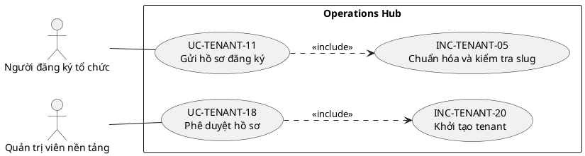
```plantuml
@startuml
left to right direction
actor "Người đăng ký tổ chức" as Registrant
actor "Quản trị viên nền tảng" as Admin
rectangle "Operations Hub" {
  usecase "UC-TENANT-11\nGửi hồ sơ đăng ký" as Submit
  usecase "INC-TENANT-05\nChuẩn hóa và kiểm tra slug" as CheckSlug
  usecase "UC-TENANT-18\nPhê duyệt hồ sơ" as Approve
  usecase "INC-TENANT-20\nKhởi tạo tenant" as Provision
}
Registrant -- Submit
Admin -- Approve
Submit ..> CheckSlug : <<include>>
Approve ..> Provision : <<include>>
@enduml
```

## 5. Truy vết từ V2

Mỗi bảng danh mục trong V3 giữ cả **Mã V3** và **Mã V2**. Việc đổi tiền tố không làm mất dấu phần tử cũ; nó chỉ sửa bản chất mô hình hóa của phần tử.


---

# CÁC TÁC NHÂN TRONG HỆ THỐNG OPERATIONS HUB

## 1. Nguyên tắc

Actor biểu diễn vai trò tương tác với hệ thống, không đồng nhất với tài khoản, chức danh thực tế hoặc role kỹ thuật. Một User có thể đóng nhiều actor ở các tenant khác nhau; quyền thực tế luôn được tính từ membership, role, permission và scope.

## 2. Danh mục actor chính thức

| STT | Mã actor | Tên actor |
|---:|---|---|
| 1 | `ACT-GUEST` | Khách truy cập |
| 2 | `ACT-PLATFORM-USER` | Người dùng nền tảng |
| 3 | `ACT-ORG-REGISTRANT` | Người đăng ký tổ chức |
| 4 | `ACT-PLATFORM-ADMIN` | Quản trị viên nền tảng |
| 5 | `ACT-TENANT-MEMBER` | Thành viên tenant |
| 6 | `ACT-UNIT-ADMIN` | Quản trị viên đơn vị trực thuộc |
| 7 | `ACT-MODULE-SPECIALIST` | Vai trò chuyên trách theo mô-đun |
| 8 | `ACT-APPROVER` | Người phê duyệt |
| 9 | `ACT-TENANT-ADMIN` | Quản trị viên tenant |
| 10 | `ACT-TENANT-OWNER` | Chủ sở hữu tenant |
| 11 | `ACT-AUDITOR` | Người kiểm tra hoặc giám sát |
| 12 | `ACT-EXTERNAL-SERVICE` | Dịch vụ bên ngoài |

## 3. Phân loại

- **Cấp nền tảng:** `ACT-GUEST`, `ACT-PLATFORM-USER`, `ACT-ORG-REGISTRANT`, `ACT-PLATFORM-ADMIN`.
- **Trong tenant:** `ACT-TENANT-MEMBER`, `ACT-UNIT-ADMIN`, `ACT-MODULE-SPECIALIST`, `ACT-APPROVER`, `ACT-TENANT-ADMIN`, `ACT-TENANT-OWNER`, `ACT-AUDITOR`.
- **Bên ngoài:** `ACT-EXTERNAL-SERVICE` và các biến thể như Identity Service, Storage Service, Notification Service, Payment Service, AI Provider.

## 4. Ma trận actor – Use Case

| Use Case | Actor liên quan |
|---|---|
| `UC-TENANT` | `ACT-GUEST`, `ACT-PLATFORM-USER`, `ACT-ORG-REGISTRANT`, `ACT-TENANT-OWNER`, `ACT-PLATFORM-ADMIN`, `ACT-EXTERNAL-SERVICE` |
| `UC-AUTH` | `ACT-GUEST`, `ACT-PLATFORM-USER`, `ACT-EXTERNAL-SERVICE` |
| `UC-USER` | `ACT-PLATFORM-USER`, `ACT-TENANT-ADMIN`, `ACT-PLATFORM-ADMIN` |
| `UC-RBAC` | `ACT-TENANT-ADMIN`, `ACT-TENANT-OWNER`, `ACT-UNIT-ADMIN`, `ACT-PLATFORM-ADMIN` |
| `UC-ORG` | `ACT-TENANT-ADMIN`, `ACT-TENANT-OWNER`, `ACT-UNIT-ADMIN`, `ACT-ORG-REGISTRANT` |
| `UC-BRAND` | `ACT-TENANT-ADMIN`, `ACT-TENANT-OWNER`, `ACT-EXTERNAL-SERVICE` |
| `UC-MODULE` | `ACT-TENANT-ADMIN`, `ACT-TENANT-OWNER`, `ACT-PLATFORM-ADMIN` |
| `UC-SETTING` | `ACT-PLATFORM-USER`, `ACT-TENANT-MEMBER` |
| `UC-MEMBER` | `ACT-TENANT-MEMBER`, `ACT-UNIT-ADMIN`, `ACT-MODULE-SPECIALIST`, `ACT-TENANT-ADMIN` |
| `UC-REQUEST` | `ACT-TENANT-MEMBER`, `ACT-MODULE-SPECIALIST`, `ACT-APPROVER` |
| `UC-DOCUMENT` | `ACT-TENANT-MEMBER`, `ACT-MODULE-SPECIALIST`, `ACT-APPROVER`, `ACT-AUDITOR`, `ACT-EXTERNAL-SERVICE` |
| `UC-FINANCE` | `ACT-TENANT-MEMBER`, `ACT-MODULE-SPECIALIST`, `ACT-APPROVER`, `ACT-TENANT-ADMIN`, `ACT-AUDITOR`, `ACT-EXTERNAL-SERVICE` |
| `UC-ASSET` | `ACT-TENANT-MEMBER`, `ACT-MODULE-SPECIALIST`, `ACT-UNIT-ADMIN` |
| `UC-MEETING` | `ACT-TENANT-MEMBER`, `ACT-MODULE-SPECIALIST`, `ACT-UNIT-ADMIN` |
| `UC-DISCIPLINE` | `ACT-TENANT-MEMBER`, `ACT-MODULE-SPECIALIST`, `ACT-APPROVER`, `ACT-AUDITOR` |
| `UC-EVALUATION` | `ACT-TENANT-MEMBER`, `ACT-MODULE-SPECIALIST`, `ACT-UNIT-ADMIN`, `ACT-AUDITOR` |
| `UC-COMPETITION` | `ACT-TENANT-MEMBER`, `ACT-MODULE-SPECIALIST`, `ACT-UNIT-ADMIN` |
| `UC-NOTIFICATION` | `ACT-TENANT-MEMBER`, `ACT-MODULE-SPECIALIST`, `ACT-EXTERNAL-SERVICE` |
| `UC-DASHBOARD` | `ACT-TENANT-OWNER`, `ACT-TENANT-ADMIN`, `ACT-UNIT-ADMIN`, `ACT-MODULE-SPECIALIST`, `ACT-PLATFORM-ADMIN`, `ACT-AUDITOR` |
| `UC-AI` | `ACT-PLATFORM-USER`, `ACT-TENANT-ADMIN`, `ACT-PLATFORM-ADMIN`, `ACT-EXTERNAL-SERVICE` |
| `UC-AUDIT` | `ACT-AUDITOR`, `ACT-TENANT-ADMIN`, `ACT-TENANT-OWNER`, `ACT-PLATFORM-ADMIN` |

## 5. Quan hệ khái quát

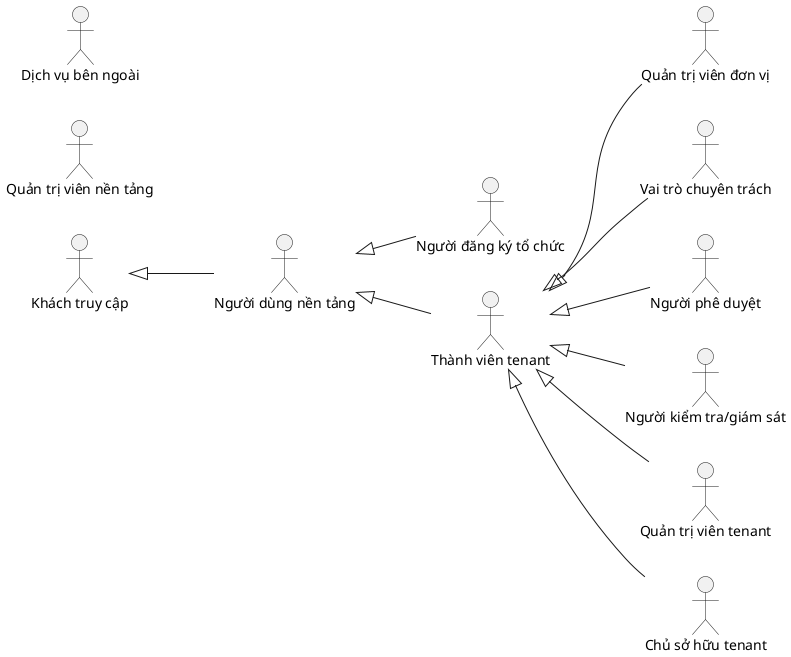
```plantuml
@startuml
left to right direction
actor "Khách truy cập" as Guest
actor "Người dùng nền tảng" as PlatformUser
actor "Người đăng ký tổ chức" as Registrant
actor "Thành viên tenant" as TenantMember
actor "Quản trị viên đơn vị" as UnitAdmin
actor "Vai trò chuyên trách" as Specialist
actor "Người phê duyệt" as Approver
actor "Người kiểm tra/giám sát" as Auditor
actor "Quản trị viên tenant" as TenantAdmin
actor "Chủ sở hữu tenant" as TenantOwner
actor "Quản trị viên nền tảng" as PlatformAdmin
actor "Dịch vụ bên ngoài" as ExternalService

Guest <|-- PlatformUser
PlatformUser <|-- Registrant
PlatformUser <|-- TenantMember
TenantMember <|-- UnitAdmin
TenantMember <|-- Specialist
TenantMember <|-- Approver
TenantMember <|-- Auditor
TenantMember <|-- TenantAdmin
TenantMember <|-- TenantOwner
@enduml
```

Quan hệ khái quát trên không phải cơ chế kế thừa permission. Platform Admin không mặc nhiên có quyền nghiệp vụ trong tenant.


# 9. Quy tắc association actor trong V3

- Actor chỉ được nối trực tiếp với Use Case biểu diễn mục tiêu nghiệp vụ mà actor thực sự thực hiện hoặc tham gia.
- Package/rectangle chỉ là ranh giới nhóm, không phải pseudo-use-case và không được dùng làm điểm nối trung gian.
- Hành vi kiểm tra, chuẩn hóa hoặc khởi tạo bắt buộc được biểu diễn bằng `<<include>>` khi cần.
- Luồng điều kiện được biểu diễn bằng `<<extend>>`.
- Quy tắc phân quyền, tenant isolation, audit bắt buộc và xử lý kỹ thuật không được giả lập thành Use Case chỉ để đưa vào sơ đồ.


---

# USE CASE DIAGRAM TỔNG QUÁT — OPERATIONS HUB V3

## 1. Phạm vi

Sơ đồ tổng quát chỉ trình bày các mục tiêu nghiệp vụ đại diện ở cấp hệ thống. Danh sách 21 nhóm được dùng làm chỉ mục phân rã, không được mô hình hóa thành pseudo-use-case trung gian.

## 2. PlantUML

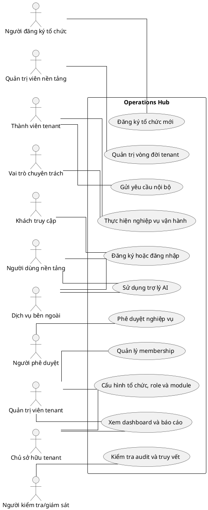
```plantuml
@startuml
left to right direction
skinparam linetype ortho
actor "Khách truy cập" as Guest
actor "Người đăng ký tổ chức" as Registrant
actor "Người dùng nền tảng" as User
actor "Quản trị viên nền tảng" as PlatformAdmin
actor "Thành viên tenant" as Member
actor "Vai trò chuyên trách" as Specialist
actor "Người phê duyệt" as Approver
actor "Quản trị viên tenant" as TenantAdmin
actor "Chủ sở hữu tenant" as Owner
actor "Người kiểm tra/giám sát" as Auditor
actor "Dịch vụ bên ngoài" as External

rectangle "Operations Hub" {
  usecase "Đăng ký hoặc đăng nhập" as Login
  usecase "Đăng ký tổ chức mới" as RegisterOrg
  usecase "Quản trị vòng đời tenant" as ManageTenant
  usecase "Cấu hình tổ chức, role và module" as ConfigureOrg
  usecase "Quản lý membership" as ManageMember
  usecase "Thực hiện nghiệp vụ vận hành" as Operate
  usecase "Gửi yêu cầu nội bộ" as SubmitRequest
  usecase "Phê duyệt nghiệp vụ" as Approve
  usecase "Xem dashboard và báo cáo" as Dashboard
  usecase "Kiểm tra audit và truy vết" as Audit
  usecase "Sử dụng trợ lý AI" as AI
}
Guest -- Login
Registrant -- RegisterOrg
User -- Login
PlatformAdmin -- ManageTenant
Owner -- ConfigureOrg
TenantAdmin -- ConfigureOrg
TenantAdmin -- ManageMember
Member -- SubmitRequest
Member -- Operate
Specialist -- Operate
Approver -- Approve
Owner -- Dashboard
TenantAdmin -- Dashboard
Auditor -- Audit
User -- AI
External -- Login
External -- AI
@enduml
```

## 3. Phân rã

Chi tiết actor–Use Case trực tiếp nằm trong 21 file `UC-*`. Mỗi file chia sơ đồ theo luồng nghiệp vụ, không chia theo số lượng cố định.


---

# MA TRẬN TRUY VẾT 21 NHÓM — OPERATIONS HUB V3

| Nhóm | Tài liệu | Tổng phần tử | UC mục tiêu | Include | Extend | REQ/Rule |
|---|---|---:|---:|---:|---:|---:|
| `UC-TENANT` | [UC-TENANT — Quản trị nền tảng SaaS và tenant](./01_UC-TENANT.md) | 50 | 42 | 8 | 0 | 0 |
| `UC-AUTH` | [UC-AUTH — Xác thực và quản lý phiên](./02_UC-AUTH.md) | 36 | 25 | 3 | 3 | 5 |
| `UC-USER` | [UC-USER — Quản lý tài khoản người dùng](./03_UC-USER.md) | 33 | 31 | 0 | 0 | 2 |
| `UC-RBAC` | [UC-RBAC — Quản lý vai trò và phân quyền](./04_UC-RBAC.md) | 38 | 36 | 1 | 0 | 1 |
| `UC-ORG` | [UC-ORG — Quản lý thông tin và cơ cấu tổ chức](./05_UC-ORG.md) | 34 | 31 | 2 | 1 | 0 |
| `UC-BRAND` | [UC-BRAND — Quản lý branding và giao diện tổ chức](./06_UC-BRAND.md) | 35 | 31 | 3 | 1 | 0 |
| `UC-MODULE` | [UC-MODULE — Cấu hình module và quy trình nghiệp vụ](./07_UC-MODULE.md) | 36 | 30 | 3 | 3 | 0 |
| `UC-SETTING` | [UC-SETTING — Thiết lập cá nhân](./08_UC-SETTING.md) | 28 | 28 | 0 | 0 | 0 |
| `UC-MEMBER` | [UC-MEMBER — Quản lý thành viên và membership](./09_UC-MEMBER.md) | 41 | 38 | 1 | 1 | 1 |
| `UC-REQUEST` | [UC-REQUEST — Quản lý đơn từ và yêu cầu nội bộ](./10_UC-REQUEST.md) | 43 | 39 | 1 | 2 | 1 |
| `UC-DOCUMENT` | [UC-DOCUMENT — Quản lý văn bản, biểu mẫu và mẫu tài liệu](./11_UC-DOCUMENT.md) | 46 | 44 | 0 | 2 | 0 |
| `UC-FINANCE` | [UC-FINANCE — Quản lý tài chính và ngân sách](./12_UC-FINANCE.md) | 52 | 49 | 1 | 2 | 0 |
| `UC-ASSET` | [UC-ASSET — Quản lý tài sản và hậu cần](./13_UC-ASSET.md) | 46 | 43 | 1 | 2 | 0 |
| `UC-MEETING` | [UC-MEETING — Quản lý cuộc họp, sự kiện và chuyên cần](./14_UC-MEETING.md) | 40 | 38 | 1 | 1 | 0 |
| `UC-DISCIPLINE` | [UC-DISCIPLINE — Quản lý kỷ luật và KPI](./15_UC-DISCIPLINE.md) | 34 | 28 | 3 | 2 | 1 |
| `UC-EVALUATION` | [UC-EVALUATION — Quản lý đánh giá thành viên](./16_UC-EVALUATION.md) | 43 | 38 | 2 | 2 | 1 |
| `UC-COMPETITION` | [UC-COMPETITION — Quản lý cuộc thi, thành tích và ghi nhận](./17_UC-COMPETITION.md) | 40 | 38 | 2 | 0 | 0 |
| `UC-NOTIFICATION` | [UC-NOTIFICATION — Quản lý thông báo và truyền thông nội bộ](./18_UC-NOTIFICATION.md) | 42 | 33 | 5 | 2 | 2 |
| `UC-DASHBOARD` | [UC-DASHBOARD — Dashboard, báo cáo và xuất dữ liệu](./19_UC-DASHBOARD.md) | 40 | 39 | 1 | 0 | 0 |
| `UC-AI` | [UC-AI — Trợ lý AI và AI Gateway](./20_UC-AI.md) | 44 | 36 | 3 | 2 | 3 |
| `UC-AUDIT` | [UC-AUDIT — Nhật ký hệ thống và truy vết hoạt động](./21_UC-AUDIT.md) | 40 | 24 | 1 | 1 | 14 |

## Quy tắc truy vết

- Mã V2 được lưu tại từng bảng chi tiết.
- Chỉ `UC-*` được xem là Use Case mục tiêu actor.
- `INC-*`, `EXT-*`, `REQ-*` phải truy vết tới Use Case cha, điều kiện phát sinh hoặc quy tắc áp dụng.


---

# DANH MỤC PHẦN TỬ NGHIỆP VỤ — OPERATIONS HUB V3

Danh mục này thay thế cách gọi toàn bộ 841 phần tử là “Use Case”. V3 phân loại theo bản chất UML và vẫn giữ mã V2 để truy vết.

## 1. Thống kê

| Loại | Số lượng |
|---|---:|
| Use Case mục tiêu actor | 741 |
| Hành vi dùng chung `<<include>>` | 42 |
| Luồng điều kiện `<<extend>>` | 27 |
| Quy tắc/yêu cầu hệ thống | 31 |
| **Tổng phần tử nghiệp vụ** | **841** |

## 2. Danh mục

| Nhóm | Mã V3 | Mã V2 | Tên | Loại | Actor trực tiếp / nguồn kích hoạt |
|---|---|---|---|---|---|
| `UC-TENANT` | `UC-TENANT-01` | `UC-TENANT-01` | Bắt đầu đăng ký tổ chức | Use Case mục tiêu actor | `ACT-GUEST` — Khách truy cập<br>`ACT-ORG-REGISTRANT` — Người đăng ký tổ chức |
| `UC-TENANT` | `UC-TENANT-02` | `UC-TENANT-02` | Lưu nháp hồ sơ đăng ký tổ chức | Use Case mục tiêu actor | `ACT-ORG-REGISTRANT` — Người đăng ký tổ chức |
| `UC-TENANT` | `INC-TENANT-03` | `UC-TENANT-03` | Kiểm tra điều kiện đăng ký tổ chức | Hành vi dùng chung `<<include>>` | Hệ thống; `<<include>>` |
| `UC-TENANT` | `INC-TENANT-04` | `UC-TENANT-04` | Chuẩn hóa và kiểm tra tên định danh | Hành vi dùng chung `<<include>>` | Hệ thống; `<<include>>` |
| `UC-TENANT` | `INC-TENANT-05` | `UC-TENANT-05` | Chuẩn hóa và kiểm tra slug | Hành vi dùng chung `<<include>>` | Hệ thống; `<<include>>` |
| `UC-TENANT` | `INC-TENANT-06` | `UC-TENANT-06` | Kiểm tra tên miền hoặc subdomain mong muốn | Hành vi dùng chung `<<include>>` | Hệ thống; `<<include>>` |
| `UC-TENANT` | `UC-TENANT-07` | `UC-TENANT-07` | Cung cấp thông tin người đại diện | Use Case mục tiêu actor | `ACT-ORG-REGISTRANT` — Người đăng ký tổ chức |
| `UC-TENANT` | `UC-TENANT-08` | `UC-TENANT-08` | Tải lên minh chứng đăng ký tổ chức | Use Case mục tiêu actor | `ACT-ORG-REGISTRANT` — Người đăng ký tổ chức |
| `UC-TENANT` | `UC-TENANT-09` | `UC-TENANT-09` | Xác minh email hoặc số điện thoại người đăng ký | Use Case mục tiêu actor | `ACT-ORG-REGISTRANT` — Người đăng ký tổ chức<br>`ACT-EXTERNAL-SERVICE` — Dịch vụ bên ngoài |
| `UC-TENANT` | `UC-TENANT-10` | `UC-TENANT-10` | Chấp nhận điều khoản sử dụng nền tảng | Use Case mục tiêu actor | `ACT-ORG-REGISTRANT` — Người đăng ký tổ chức |
| `UC-TENANT` | `UC-TENANT-11` | `UC-TENANT-11` | Gửi hồ sơ đăng ký tổ chức | Use Case mục tiêu actor | `ACT-ORG-REGISTRANT` — Người đăng ký tổ chức |
| `UC-TENANT` | `UC-TENANT-12` | `UC-TENANT-12` | Theo dõi trạng thái hồ sơ đăng ký | Use Case mục tiêu actor | `ACT-ORG-REGISTRANT` — Người đăng ký tổ chức |
| `UC-TENANT` | `UC-TENANT-13` | `UC-TENANT-13` | Yêu cầu bổ sung hoặc chỉnh sửa hồ sơ đăng ký | Use Case mục tiêu actor | `ACT-PLATFORM-ADMIN` — Quản trị viên nền tảng |
| `UC-TENANT` | `UC-TENANT-14` | `UC-TENANT-14` | Bổ sung hồ sơ đăng ký theo yêu cầu | Use Case mục tiêu actor | `ACT-ORG-REGISTRANT` — Người đăng ký tổ chức |
| `UC-TENANT` | `UC-TENANT-15` | `UC-TENANT-15` | Rút hồ sơ đăng ký tổ chức | Use Case mục tiêu actor | `ACT-ORG-REGISTRANT` — Người đăng ký tổ chức |
| `UC-TENANT` | `UC-TENANT-16` | `UC-TENANT-16` | Tiếp nhận và phân công xử lý hồ sơ đăng ký | Use Case mục tiêu actor | `ACT-PLATFORM-ADMIN` — Quản trị viên nền tảng |
| `UC-TENANT` | `UC-TENANT-17` | `UC-TENANT-17` | Thẩm định hồ sơ đăng ký tổ chức | Use Case mục tiêu actor | `ACT-PLATFORM-ADMIN` — Quản trị viên nền tảng |
| `UC-TENANT` | `UC-TENANT-18` | `UC-TENANT-18` | Phê duyệt hồ sơ đăng ký tổ chức | Use Case mục tiêu actor | `ACT-PLATFORM-ADMIN` — Quản trị viên nền tảng |
| `UC-TENANT` | `UC-TENANT-19` | `UC-TENANT-19` | Từ chối hồ sơ đăng ký tổ chức | Use Case mục tiêu actor | `ACT-PLATFORM-ADMIN` — Quản trị viên nền tảng |
| `UC-TENANT` | `INC-TENANT-20` | `UC-TENANT-20` | Khởi tạo tenant | Hành vi dùng chung `<<include>>` | Hệ thống; `<<include>>` |
| `UC-TENANT` | `INC-TENANT-21` | `UC-TENANT-21` | Khởi tạo cấu hình mặc định cho tenant | Hành vi dùng chung `<<include>>` | Hệ thống; `<<include>>` |
| `UC-TENANT` | `INC-TENANT-22` | `UC-TENANT-22` | Khởi tạo role và permission mặc định | Hành vi dùng chung `<<include>>` | Hệ thống; `<<include>>` |
| `UC-TENANT` | `INC-TENANT-23` | `UC-TENANT-23` | Thiết lập Owner ban đầu | Hành vi dùng chung `<<include>>` | Hệ thống; `<<include>>` |
| `UC-TENANT` | `UC-TENANT-24` | `UC-TENANT-24` | Kích hoạt tenant | Use Case mục tiêu actor | `ACT-PLATFORM-ADMIN` — Quản trị viên nền tảng |
| `UC-TENANT` | `UC-TENANT-25` | `UC-TENANT-25` | Chọn gói dịch vụ hoặc phạm vi sử dụng | Use Case mục tiêu actor | `ACT-TENANT-OWNER` — Chủ sở hữu tenant |
| `UC-TENANT` | `UC-TENANT-26` | `UC-TENANT-26` | Cấu hình thông tin thanh toán và liên hệ dịch vụ | Use Case mục tiêu actor | `ACT-TENANT-OWNER` — Chủ sở hữu tenant<br>`ACT-EXTERNAL-SERVICE` — Dịch vụ bên ngoài |
| `UC-TENANT` | `UC-TENANT-27` | `UC-TENANT-27` | Xem danh sách tenant ở cấp nền tảng | Use Case mục tiêu actor | `ACT-PLATFORM-ADMIN` — Quản trị viên nền tảng |
| `UC-TENANT` | `UC-TENANT-28` | `UC-TENANT-28` | Tìm kiếm và lọc tenant | Use Case mục tiêu actor | `ACT-PLATFORM-ADMIN` — Quản trị viên nền tảng |
| `UC-TENANT` | `UC-TENANT-29` | `UC-TENANT-29` | Xem chi tiết tenant | Use Case mục tiêu actor | `ACT-PLATFORM-ADMIN` — Quản trị viên nền tảng |
| `UC-TENANT` | `UC-TENANT-30` | `UC-TENANT-30` | Cập nhật hồ sơ tenant | Use Case mục tiêu actor | `ACT-TENANT-OWNER` — Chủ sở hữu tenant |
| `UC-TENANT` | `UC-TENANT-31` | `UC-TENANT-31` | Xem lịch sử trạng thái tenant | Use Case mục tiêu actor | `ACT-TENANT-OWNER` — Chủ sở hữu tenant |
| `UC-TENANT` | `UC-TENANT-32` | `UC-TENANT-32` | Tạm khóa tenant | Use Case mục tiêu actor | `ACT-PLATFORM-ADMIN` — Quản trị viên nền tảng |
| `UC-TENANT` | `UC-TENANT-33` | `UC-TENANT-33` | Khôi phục tenant bị tạm khóa | Use Case mục tiêu actor | `ACT-PLATFORM-ADMIN` — Quản trị viên nền tảng |
| `UC-TENANT` | `UC-TENANT-34` | `UC-TENANT-34` | Lưu trữ tenant | Use Case mục tiêu actor | `ACT-PLATFORM-ADMIN` — Quản trị viên nền tảng |
| `UC-TENANT` | `UC-TENANT-35` | `UC-TENANT-35` | Khôi phục tenant đã lưu trữ | Use Case mục tiêu actor | `ACT-PLATFORM-ADMIN` — Quản trị viên nền tảng |
| `UC-TENANT` | `UC-TENANT-36` | `UC-TENANT-36` | Chuyển quyền sở hữu tenant | Use Case mục tiêu actor | `ACT-TENANT-OWNER` — Chủ sở hữu tenant |
| `UC-TENANT` | `UC-TENANT-37` | `UC-TENANT-37` | Bổ nhiệm thêm Owner | Use Case mục tiêu actor | `ACT-TENANT-OWNER` — Chủ sở hữu tenant |
| `UC-TENANT` | `UC-TENANT-38` | `UC-TENANT-38` | Thu hồi quyền Owner không phải Owner cuối cùng | Use Case mục tiêu actor | `ACT-TENANT-OWNER` — Chủ sở hữu tenant |
| `UC-TENANT` | `UC-TENANT-39` | `UC-TENANT-39` | Xuất dữ liệu tenant | Use Case mục tiêu actor | `ACT-TENANT-OWNER` — Chủ sở hữu tenant |
| `UC-TENANT` | `UC-TENANT-40` | `UC-TENANT-40` | Yêu cầu đóng tenant | Use Case mục tiêu actor | `ACT-TENANT-OWNER` — Chủ sở hữu tenant |
| `UC-TENANT` | `UC-TENANT-41` | `UC-TENANT-41` | Hủy yêu cầu đóng tenant | Use Case mục tiêu actor | `ACT-TENANT-OWNER` — Chủ sở hữu tenant |
| `UC-TENANT` | `UC-TENANT-42` | `UC-TENANT-42` | Đưa tenant vào thời gian chờ xóa | Use Case mục tiêu actor | `ACT-PLATFORM-ADMIN` — Quản trị viên nền tảng |
| `UC-TENANT` | `UC-TENANT-43` | `UC-TENANT-43` | Khôi phục tenant trong thời gian chờ xóa | Use Case mục tiêu actor | `ACT-TENANT-OWNER` — Chủ sở hữu tenant |
| `UC-TENANT` | `UC-TENANT-44` | `UC-TENANT-44` | Thực hiện xóa hoặc ẩn danh dữ liệu tenant theo chính sách | Use Case mục tiêu actor | `ACT-PLATFORM-ADMIN` — Quản trị viên nền tảng |
| `UC-TENANT` | `UC-TENANT-45` | `UC-TENANT-45` | Quản lý thời hạn lưu giữ dữ liệu tenant | Use Case mục tiêu actor | `ACT-PLATFORM-ADMIN` — Quản trị viên nền tảng |
| `UC-TENANT` | `UC-TENANT-46` | `UC-TENANT-46` | Cấu hình subdomain tenant | Use Case mục tiêu actor | `ACT-TENANT-OWNER` — Chủ sở hữu tenant |
| `UC-TENANT` | `UC-TENANT-47` | `UC-TENANT-47` | Cấu hình tên miền tùy chỉnh | Use Case mục tiêu actor | `ACT-TENANT-OWNER` — Chủ sở hữu tenant<br>`ACT-EXTERNAL-SERVICE` — Dịch vụ bên ngoài |
| `UC-TENANT` | `UC-TENANT-48` | `UC-TENANT-48` | Xác minh tên miền tùy chỉnh | Use Case mục tiêu actor | `ACT-TENANT-OWNER` — Chủ sở hữu tenant<br>`ACT-EXTERNAL-SERVICE` — Dịch vụ bên ngoài |
| `UC-TENANT` | `UC-TENANT-49` | `UC-TENANT-49` | Quản lý trạng thái dịch vụ hoặc hạn mức tenant | Use Case mục tiêu actor | `ACT-TENANT-OWNER` — Chủ sở hữu tenant<br>`ACT-PLATFORM-ADMIN` — Quản trị viên nền tảng |
| `UC-TENANT` | `UC-TENANT-50` | `UC-TENANT-50` | Ghi nhận hỗ trợ quản trị có kiểm soát đối với tenant | Use Case mục tiêu actor | `ACT-PLATFORM-ADMIN` — Quản trị viên nền tảng |
| `UC-AUTH` | `UC-AUTH-01` | `UC-AUTH-01` | Đăng ký tài khoản bằng email | Use Case mục tiêu actor | `ACT-GUEST` — Khách truy cập |
| `UC-AUTH` | `UC-AUTH-02` | `UC-AUTH-02` | Đăng ký tài khoản bằng định danh được hỗ trợ | Use Case mục tiêu actor | `ACT-GUEST` — Khách truy cập |
| `UC-AUTH` | `UC-AUTH-03` | `UC-AUTH-03` | Xác minh địa chỉ email | Use Case mục tiêu actor | `ACT-GUEST` — Khách truy cập<br>`ACT-EXTERNAL-SERVICE` — Dịch vụ bên ngoài |
| `UC-AUTH` | `EXT-AUTH-04` | `UC-AUTH-04` | Gửi lại liên kết xác minh | Luồng điều kiện `<<extend>>` | `ACT-GUEST` — Khách truy cập<br>`ACT-EXTERNAL-SERVICE` — Dịch vụ bên ngoài |
| `UC-AUTH` | `UC-AUTH-05` | `UC-AUTH-05` | Đăng nhập bằng mật khẩu | Use Case mục tiêu actor | `ACT-GUEST` — Khách truy cập |
| `UC-AUTH` | `UC-AUTH-06` | `UC-AUTH-06` | Đăng nhập bằng SSO hoặc OAuth | Use Case mục tiêu actor | `ACT-GUEST` — Khách truy cập<br>`ACT-EXTERNAL-SERVICE` — Dịch vụ bên ngoài |
| `UC-AUTH` | `UC-AUTH-07` | `UC-AUTH-07` | Đăng nhập không mật khẩu bằng liên kết dùng một lần | Use Case mục tiêu actor | `ACT-GUEST` — Khách truy cập<br>`ACT-EXTERNAL-SERVICE` — Dịch vụ bên ngoài |
| `UC-AUTH` | `UC-AUTH-08` | `UC-AUTH-08` | Bắt đầu xác thực đa yếu tố | Use Case mục tiêu actor | `ACT-PLATFORM-USER` — Người dùng nền tảng<br>`ACT-EXTERNAL-SERVICE` — Dịch vụ bên ngoài |
| `UC-AUTH` | `UC-AUTH-09` | `UC-AUTH-09` | Đăng ký phương thức MFA | Use Case mục tiêu actor | `ACT-PLATFORM-USER` — Người dùng nền tảng<br>`ACT-EXTERNAL-SERVICE` — Dịch vụ bên ngoài |
| `UC-AUTH` | `INC-AUTH-10` | `UC-AUTH-10` | Xác minh mã MFA | Hành vi dùng chung `<<include>>` | Hệ thống; `<<include>>` |
| `UC-AUTH` | `UC-AUTH-11` | `UC-AUTH-11` | Quản lý mã khôi phục MFA | Use Case mục tiêu actor | `ACT-PLATFORM-USER` — Người dùng nền tảng<br>`ACT-EXTERNAL-SERVICE` — Dịch vụ bên ngoài |
| `UC-AUTH` | `UC-AUTH-12` | `UC-AUTH-12` | Tắt hoặc thay đổi phương thức MFA | Use Case mục tiêu actor | `ACT-PLATFORM-USER` — Người dùng nền tảng<br>`ACT-EXTERNAL-SERVICE` — Dịch vụ bên ngoài |
| `UC-AUTH` | `UC-AUTH-13` | `UC-AUTH-13` | Thực hiện xác thực tăng cường cho thao tác nhạy cảm | Use Case mục tiêu actor | `ACT-PLATFORM-USER` — Người dùng nền tảng<br>`ACT-EXTERNAL-SERVICE` — Dịch vụ bên ngoài |
| `UC-AUTH` | `UC-AUTH-14` | `UC-AUTH-14` | Đăng xuất phiên hiện tại | Use Case mục tiêu actor | `ACT-PLATFORM-USER` — Người dùng nền tảng |
| `UC-AUTH` | `UC-AUTH-15` | `UC-AUTH-15` | Đăng xuất khỏi tất cả thiết bị | Use Case mục tiêu actor | `ACT-PLATFORM-USER` — Người dùng nền tảng |
| `UC-AUTH` | `INC-AUTH-16` | `UC-AUTH-16` | Làm mới access token hoặc phiên | Hành vi dùng chung `<<include>>` | Hệ thống; `<<include>>` |
| `UC-AUTH` | `EXT-AUTH-17` | `UC-AUTH-17` | Khôi phục phiên hợp lệ | Luồng điều kiện `<<extend>>` | `ACT-PLATFORM-USER` — Người dùng nền tảng |
| `UC-AUTH` | `UC-AUTH-18` | `UC-AUTH-18` | Yêu cầu quên mật khẩu | Use Case mục tiêu actor | `ACT-GUEST` — Khách truy cập<br>`ACT-EXTERNAL-SERVICE` — Dịch vụ bên ngoài |
| `UC-AUTH` | `UC-AUTH-19` | `UC-AUTH-19` | Đặt lại mật khẩu | Use Case mục tiêu actor | `ACT-GUEST` — Khách truy cập<br>`ACT-EXTERNAL-SERVICE` — Dịch vụ bên ngoài |
| `UC-AUTH` | `UC-AUTH-20` | `UC-AUTH-20` | Đổi mật khẩu khi biết mật khẩu hiện tại | Use Case mục tiêu actor | `ACT-PLATFORM-USER` — Người dùng nền tảng |
| `UC-AUTH` | `UC-AUTH-21` | `UC-AUTH-21` | Buộc đổi mật khẩu ở lần đăng nhập tiếp theo | Use Case mục tiêu actor | `ACT-PLATFORM-USER` — Người dùng nền tảng |
| `UC-AUTH` | `REQ-AUTH-22` | `UC-AUTH-22` | Khóa đăng nhập sau nhiều lần thất bại | Quy tắc/yêu cầu hệ thống | Hệ thống/chính sách |
| `UC-AUTH` | `EXT-AUTH-23` | `UC-AUTH-23` | Mở khóa đăng nhập theo chính sách | Luồng điều kiện `<<extend>>` | `ACT-GUEST` — Khách truy cập |
| `UC-AUTH` | `INC-AUTH-24` | `UC-AUTH-24` | Xác minh CAPTCHA hoặc chống tự động hóa | Hành vi dùng chung `<<include>>` | Hệ thống; `<<include>>` |
| `UC-AUTH` | `UC-AUTH-25` | `UC-AUTH-25` | Xem danh sách phiên đăng nhập | Use Case mục tiêu actor | `ACT-PLATFORM-USER` — Người dùng nền tảng |
| `UC-AUTH` | `UC-AUTH-26` | `UC-AUTH-26` | Thu hồi một phiên đăng nhập | Use Case mục tiêu actor | `ACT-PLATFORM-USER` — Người dùng nền tảng |
| `UC-AUTH` | `UC-AUTH-27` | `UC-AUTH-27` | Đánh dấu thiết bị tin cậy | Use Case mục tiêu actor | `ACT-PLATFORM-USER` — Người dùng nền tảng |
| `UC-AUTH` | `UC-AUTH-28` | `UC-AUTH-28` | Thu hồi thiết bị tin cậy | Use Case mục tiêu actor | `ACT-PLATFORM-USER` — Người dùng nền tảng |
| `UC-AUTH` | `UC-AUTH-29` | `UC-AUTH-29` | Chấp nhận lời mời tham gia tenant qua liên kết | Use Case mục tiêu actor | `ACT-GUEST` — Khách truy cập |
| `UC-AUTH` | `UC-AUTH-30` | `UC-AUTH-30` | Từ chối lời mời tham gia tenant | Use Case mục tiêu actor | `ACT-GUEST` — Khách truy cập |
| `UC-AUTH` | `UC-AUTH-31` | `UC-AUTH-31` | Chọn tenant context sau khi đăng nhập | Use Case mục tiêu actor | `ACT-PLATFORM-USER` — Người dùng nền tảng |
| `UC-AUTH` | `UC-AUTH-32` | `UC-AUTH-32` | Chuyển tenant context khi đang hoạt động | Use Case mục tiêu actor | `ACT-PLATFORM-USER` — Người dùng nền tảng |
| `UC-AUTH` | `REQ-AUTH-33` | `UC-AUTH-33` | Xử lý phiên khi tenant hoặc membership bị khóa | Quy tắc/yêu cầu hệ thống | Hệ thống/chính sách |
| `UC-AUTH` | `REQ-AUTH-34` | `UC-AUTH-34` | Xử lý tài khoản chưa xác minh | Quy tắc/yêu cầu hệ thống | Hệ thống/chính sách |
| `UC-AUTH` | `REQ-AUTH-35` | `UC-AUTH-35` | Xử lý thông tin xác thực hết hạn hoặc không hợp lệ | Quy tắc/yêu cầu hệ thống | Hệ thống/chính sách |
| `UC-AUTH` | `REQ-AUTH-36` | `UC-AUTH-36` | Ghi nhận sự kiện xác thực và cảnh báo bảo mật | Quy tắc/yêu cầu hệ thống | Hệ thống/chính sách |
| `UC-USER` | `UC-USER-01` | `UC-USER-01` | Xem hồ sơ tài khoản cá nhân | Use Case mục tiêu actor | `ACT-PLATFORM-USER` — Người dùng nền tảng |
| `UC-USER` | `UC-USER-02` | `UC-USER-02` | Cập nhật họ tên và thông tin liên hệ | Use Case mục tiêu actor | `ACT-PLATFORM-USER` — Người dùng nền tảng |
| `UC-USER` | `UC-USER-03` | `UC-USER-03` | Cập nhật ảnh đại diện | Use Case mục tiêu actor | `ACT-PLATFORM-USER` — Người dùng nền tảng |
| `UC-USER` | `UC-USER-04` | `UC-USER-04` | Thay đổi địa chỉ email đăng nhập | Use Case mục tiêu actor | `ACT-PLATFORM-USER` — Người dùng nền tảng |
| `UC-USER` | `UC-USER-05` | `UC-USER-05` | Xác minh địa chỉ email mới | Use Case mục tiêu actor | `ACT-PLATFORM-USER` — Người dùng nền tảng |
| `UC-USER` | `UC-USER-06` | `UC-USER-06` | Thay đổi tên người dùng khi chính sách cho phép | Use Case mục tiêu actor | `ACT-PLATFORM-USER` — Người dùng nền tảng |
| `UC-USER` | `UC-USER-07` | `UC-USER-07` | Xem danh sách tenant đang tham gia | Use Case mục tiêu actor | `ACT-PLATFORM-USER` — Người dùng nền tảng |
| `UC-USER` | `UC-USER-08` | `UC-USER-08` | Xem trạng thái tài khoản toàn cục | Use Case mục tiêu actor | `ACT-PLATFORM-USER` — Người dùng nền tảng |
| `UC-USER` | `UC-USER-09` | `UC-USER-09` | Xem lịch sử hoạt động tài khoản cá nhân | Use Case mục tiêu actor | `ACT-PLATFORM-USER` — Người dùng nền tảng |
| `UC-USER` | `UC-USER-10` | `UC-USER-10` | Xuất dữ liệu cá nhân | Use Case mục tiêu actor | `ACT-PLATFORM-USER` — Người dùng nền tảng |
| `UC-USER` | `UC-USER-11` | `UC-USER-11` | Yêu cầu đóng tài khoản | Use Case mục tiêu actor | `ACT-PLATFORM-USER` — Người dùng nền tảng |
| `UC-USER` | `UC-USER-12` | `UC-USER-12` | Hủy yêu cầu đóng tài khoản | Use Case mục tiêu actor | `ACT-PLATFORM-USER` — Người dùng nền tảng |
| `UC-USER` | `UC-USER-13` | `UC-USER-13` | Khôi phục tài khoản trong thời gian chờ đóng | Use Case mục tiêu actor | `ACT-PLATFORM-USER` — Người dùng nền tảng |
| `UC-USER` | `UC-USER-14` | `UC-USER-14` | Quản trị viên xem danh sách người dùng nền tảng | Use Case mục tiêu actor | `ACT-PLATFORM-ADMIN` — Quản trị viên nền tảng |
| `UC-USER` | `UC-USER-15` | `UC-USER-15` | Tìm kiếm và lọc người dùng | Use Case mục tiêu actor | `ACT-PLATFORM-ADMIN` — Quản trị viên nền tảng |
| `UC-USER` | `UC-USER-16` | `UC-USER-16` | Xem chi tiết người dùng | Use Case mục tiêu actor | `ACT-PLATFORM-ADMIN` — Quản trị viên nền tảng |
| `UC-USER` | `UC-USER-17` | `UC-USER-17` | Tạo tài khoản người dùng bởi quản trị viên | Use Case mục tiêu actor | `ACT-PLATFORM-ADMIN` — Quản trị viên nền tảng |
| `UC-USER` | `UC-USER-18` | `UC-USER-18` | Kích hoạt tài khoản người dùng | Use Case mục tiêu actor | `ACT-PLATFORM-ADMIN` — Quản trị viên nền tảng |
| `UC-USER` | `UC-USER-19` | `UC-USER-19` | Vô hiệu hóa tài khoản người dùng | Use Case mục tiêu actor | `ACT-PLATFORM-ADMIN` — Quản trị viên nền tảng |
| `UC-USER` | `UC-USER-20` | `UC-USER-20` | Khóa tài khoản vì lý do bảo mật | Use Case mục tiêu actor | `ACT-PLATFORM-ADMIN` — Quản trị viên nền tảng |
| `UC-USER` | `UC-USER-21` | `UC-USER-21` | Mở khóa tài khoản | Use Case mục tiêu actor | `ACT-PLATFORM-ADMIN` — Quản trị viên nền tảng |
| `UC-USER` | `UC-USER-22` | `UC-USER-22` | Reset mật khẩu bởi quản trị viên có quyền | Use Case mục tiêu actor | `ACT-PLATFORM-ADMIN` — Quản trị viên nền tảng |
| `UC-USER` | `UC-USER-23` | `UC-USER-23` | Buộc người dùng đổi mật khẩu | Use Case mục tiêu actor | `ACT-PLATFORM-ADMIN` — Quản trị viên nền tảng |
| `UC-USER` | `UC-USER-24` | `UC-USER-24` | Liên kết tài khoản với danh tính bên ngoài | Use Case mục tiêu actor | `ACT-PLATFORM-USER` — Người dùng nền tảng |
| `UC-USER` | `UC-USER-25` | `UC-USER-25` | Gỡ liên kết danh tính bên ngoài | Use Case mục tiêu actor | `ACT-PLATFORM-USER` — Người dùng nền tảng |
| `UC-USER` | `UC-USER-26` | `UC-USER-26` | Hợp nhất tài khoản trùng lặp | Use Case mục tiêu actor | `ACT-PLATFORM-ADMIN` — Quản trị viên nền tảng |
| `UC-USER` | `UC-USER-27` | `UC-USER-27` | Tách tài khoản bị liên kết sai | Use Case mục tiêu actor | `ACT-PLATFORM-ADMIN` — Quản trị viên nền tảng |
| `UC-USER` | `UC-USER-28` | `UC-USER-28` | Ẩn danh dữ liệu cá nhân theo chính sách | Use Case mục tiêu actor | `ACT-PLATFORM-ADMIN` — Quản trị viên nền tảng |
| `UC-USER` | `UC-USER-29` | `UC-USER-29` | Khôi phục tài khoản đã vô hiệu hóa | Use Case mục tiêu actor | `ACT-PLATFORM-ADMIN` — Quản trị viên nền tảng |
| `UC-USER` | `UC-USER-30` | `UC-USER-30` | Quản lý trạng thái đồng ý hoặc điều khoản của người dùng | Use Case mục tiêu actor | `ACT-PLATFORM-USER` — Người dùng nền tảng |
| `UC-USER` | `REQ-USER-31` | `UC-USER-31` | Xử lý người dùng không còn membership nào | Quy tắc/yêu cầu hệ thống | Hệ thống/chính sách |
| `UC-USER` | `UC-USER-32` | `UC-USER-32` | Xem và quản lý platform role của người dùng cấp nền tảng | Use Case mục tiêu actor | `ACT-PLATFORM-ADMIN` — Quản trị viên nền tảng |
| `UC-USER` | `REQ-USER-33` | `UC-USER-33` | Ghi audit thay đổi tài khoản nhạy cảm | Quy tắc/yêu cầu hệ thống | Hệ thống/chính sách |
| `UC-RBAC` | `UC-RBAC-01` | `UC-RBAC-01` | Xem danh mục permission của nền tảng | Use Case mục tiêu actor | `ACT-PLATFORM-ADMIN` — Quản trị viên nền tảng |
| `UC-RBAC` | `UC-RBAC-02` | `UC-RBAC-02` | Xem role mặc định của tenant | Use Case mục tiêu actor | `ACT-TENANT-ADMIN` — Quản trị viên tenant |
| `UC-RBAC` | `UC-RBAC-03` | `UC-RBAC-03` | Xem chi tiết role | Use Case mục tiêu actor | `ACT-TENANT-ADMIN` — Quản trị viên tenant |
| `UC-RBAC` | `UC-RBAC-04` | `UC-RBAC-04` | Tạo role tùy chỉnh | Use Case mục tiêu actor | `ACT-TENANT-ADMIN` — Quản trị viên tenant |
| `UC-RBAC` | `UC-RBAC-05` | `UC-RBAC-05` | Sao chép role | Use Case mục tiêu actor | `ACT-TENANT-ADMIN` — Quản trị viên tenant |
| `UC-RBAC` | `UC-RBAC-06` | `UC-RBAC-06` | Cập nhật tên và mô tả role | Use Case mục tiêu actor | `ACT-TENANT-ADMIN` — Quản trị viên tenant |
| `UC-RBAC` | `UC-RBAC-07` | `UC-RBAC-07` | Kích hoạt role | Use Case mục tiêu actor | `ACT-TENANT-ADMIN` — Quản trị viên tenant |
| `UC-RBAC` | `UC-RBAC-08` | `UC-RBAC-08` | Vô hiệu hóa role | Use Case mục tiêu actor | `ACT-TENANT-ADMIN` — Quản trị viên tenant |
| `UC-RBAC` | `UC-RBAC-09` | `UC-RBAC-09` | Lưu trữ role | Use Case mục tiêu actor | `ACT-TENANT-ADMIN` — Quản trị viên tenant |
| `UC-RBAC` | `UC-RBAC-10` | `UC-RBAC-10` | Xóa role chưa được sử dụng | Use Case mục tiêu actor | `ACT-TENANT-ADMIN` — Quản trị viên tenant |
| `UC-RBAC` | `UC-RBAC-11` | `UC-RBAC-11` | Gán permission cho role | Use Case mục tiêu actor | `ACT-TENANT-ADMIN` — Quản trị viên tenant |
| `UC-RBAC` | `UC-RBAC-12` | `UC-RBAC-12` | Thu hồi permission khỏi role | Use Case mục tiêu actor | `ACT-TENANT-ADMIN` — Quản trị viên tenant |
| `UC-RBAC` | `UC-RBAC-13` | `UC-RBAC-13` | Gán nhiều permission theo nhóm | Use Case mục tiêu actor | `ACT-TENANT-ADMIN` — Quản trị viên tenant |
| `UC-RBAC` | `UC-RBAC-14` | `UC-RBAC-14` | So sánh hai role | Use Case mục tiêu actor | `ACT-TENANT-ADMIN` — Quản trị viên tenant |
| `UC-RBAC` | `UC-RBAC-15` | `UC-RBAC-15` | Xuất ma trận role và permission | Use Case mục tiêu actor | `ACT-TENANT-ADMIN` — Quản trị viên tenant<br>`ACT-TENANT-OWNER` — Chủ sở hữu tenant |
| `UC-RBAC` | `UC-RBAC-16` | `UC-RBAC-16` | Nhập ma trận role và permission | Use Case mục tiêu actor | `ACT-TENANT-ADMIN` — Quản trị viên tenant<br>`ACT-TENANT-OWNER` — Chủ sở hữu tenant |
| `UC-RBAC` | `UC-RBAC-17` | `UC-RBAC-17` | Gán role cho membership | Use Case mục tiêu actor | `ACT-TENANT-ADMIN` — Quản trị viên tenant |
| `UC-RBAC` | `UC-RBAC-18` | `UC-RBAC-18` | Thu hồi role khỏi membership | Use Case mục tiêu actor | `ACT-TENANT-ADMIN` — Quản trị viên tenant |
| `UC-RBAC` | `UC-RBAC-19` | `UC-RBAC-19` | Gán role hàng loạt | Use Case mục tiêu actor | `ACT-TENANT-ADMIN` — Quản trị viên tenant |
| `UC-RBAC` | `UC-RBAC-20` | `UC-RBAC-20` | Gán role có thời hạn | Use Case mục tiêu actor | `ACT-TENANT-ADMIN` — Quản trị viên tenant |
| `UC-RBAC` | `UC-RBAC-21` | `UC-RBAC-21` | Gia hạn role có thời hạn | Use Case mục tiêu actor | `ACT-TENANT-ADMIN` — Quản trị viên tenant |
| `UC-RBAC` | `UC-RBAC-22` | `UC-RBAC-22` | Gán role theo đơn vị trực thuộc | Use Case mục tiêu actor | `ACT-UNIT-ADMIN` — Quản trị viên đơn vị trực thuộc<br>`ACT-TENANT-ADMIN` — Quản trị viên tenant |
| `UC-RBAC` | `UC-RBAC-23` | `UC-RBAC-23` | Gán quyền theo phạm vi tài nguyên | Use Case mục tiêu actor | `ACT-TENANT-ADMIN` — Quản trị viên tenant |
| `UC-RBAC` | `UC-RBAC-24` | `UC-RBAC-24` | Cấu hình role kế thừa khi chính sách cho phép | Use Case mục tiêu actor | `ACT-TENANT-ADMIN` — Quản trị viên tenant |
| `UC-RBAC` | `UC-RBAC-25` | `UC-RBAC-25` | Cấu hình quy tắc từ chối hoặc ngoại lệ quyền | Use Case mục tiêu actor | `ACT-TENANT-ADMIN` — Quản trị viên tenant |
| `UC-RBAC` | `UC-RBAC-26` | `UC-RBAC-26` | Ủy quyền quản trị role trong phạm vi giới hạn | Use Case mục tiêu actor | `ACT-UNIT-ADMIN` — Quản trị viên đơn vị trực thuộc<br>`ACT-TENANT-ADMIN` — Quản trị viên tenant |
| `UC-RBAC` | `UC-RBAC-27` | `UC-RBAC-27` | Kiểm tra xung đột phân tách trách nhiệm | Use Case mục tiêu actor | `ACT-TENANT-ADMIN` — Quản trị viên tenant |
| `UC-RBAC` | `REQ-RBAC-28` | `UC-RBAC-28` | Ngăn người dùng tự nâng quyền | Quy tắc/yêu cầu hệ thống | Hệ thống/chính sách |
| `UC-RBAC` | `UC-RBAC-29` | `UC-RBAC-29` | Mô phỏng quyền của membership | Use Case mục tiêu actor | `ACT-TENANT-ADMIN` — Quản trị viên tenant |
| `UC-RBAC` | `UC-RBAC-30` | `UC-RBAC-30` | Giải thích quyền hiệu lực | Use Case mục tiêu actor | `ACT-TENANT-ADMIN` — Quản trị viên tenant |
| `UC-RBAC` | `INC-RBAC-31` | `UC-RBAC-31` | Kiểm tra quyền đối với một hành động cụ thể | Hành vi dùng chung `<<include>>` | Hệ thống; `<<include>>` |
| `UC-RBAC` | `UC-RBAC-32` | `UC-RBAC-32` | Rà soát quyền định kỳ | Use Case mục tiêu actor | `ACT-TENANT-ADMIN` — Quản trị viên tenant<br>`ACT-TENANT-OWNER` — Chủ sở hữu tenant |
| `UC-RBAC` | `UC-RBAC-33` | `UC-RBAC-33` | Xác nhận lại quyền truy cập | Use Case mục tiêu actor | `ACT-TENANT-ADMIN` — Quản trị viên tenant<br>`ACT-TENANT-OWNER` — Chủ sở hữu tenant |
| `UC-RBAC` | `UC-RBAC-34` | `UC-RBAC-34` | Thu hồi quyền không còn cần thiết | Use Case mục tiêu actor | `ACT-TENANT-ADMIN` — Quản trị viên tenant |
| `UC-RBAC` | `UC-RBAC-35` | `UC-RBAC-35` | Thiết lập quyền khẩn cấp có thời hạn | Use Case mục tiêu actor | `ACT-TENANT-OWNER` — Chủ sở hữu tenant |
| `UC-RBAC` | `UC-RBAC-36` | `UC-RBAC-36` | Kết thúc quyền khẩn cấp | Use Case mục tiêu actor | `ACT-TENANT-OWNER` — Chủ sở hữu tenant |
| `UC-RBAC` | `UC-RBAC-37` | `UC-RBAC-37` | Xem lịch sử thay đổi role và permission | Use Case mục tiêu actor | `ACT-TENANT-ADMIN` — Quản trị viên tenant<br>`ACT-TENANT-OWNER` — Chủ sở hữu tenant |
| `UC-RBAC` | `UC-RBAC-38` | `UC-RBAC-38` | Quản lý role cấp nền tảng tách biệt role tenant | Use Case mục tiêu actor | `ACT-PLATFORM-ADMIN` — Quản trị viên nền tảng |
| `UC-ORG` | `UC-ORG-01` | `UC-ORG-01` | Xem hồ sơ tổ chức | Use Case mục tiêu actor | `ACT-TENANT-OWNER` — Chủ sở hữu tenant<br>`ACT-TENANT-ADMIN` — Quản trị viên tenant |
| `UC-ORG` | `UC-ORG-02` | `UC-ORG-02` | Cập nhật tên và mô tả tổ chức | Use Case mục tiêu actor | `ACT-TENANT-OWNER` — Chủ sở hữu tenant<br>`ACT-TENANT-ADMIN` — Quản trị viên tenant |
| `UC-ORG` | `UC-ORG-03` | `UC-ORG-03` | Cập nhật thông tin liên hệ tổ chức | Use Case mục tiêu actor | `ACT-TENANT-OWNER` — Chủ sở hữu tenant<br>`ACT-TENANT-ADMIN` — Quản trị viên tenant |
| `UC-ORG` | `UC-ORG-04` | `UC-ORG-04` | Cập nhật thông tin pháp lý hoặc định danh nội bộ | Use Case mục tiêu actor | `ACT-TENANT-OWNER` — Chủ sở hữu tenant<br>`ACT-TENANT-ADMIN` — Quản trị viên tenant |
| `UC-ORG` | `UC-ORG-05` | `UC-ORG-05` | Quản lý trường dữ liệu mở rộng của tổ chức | Use Case mục tiêu actor | `ACT-TENANT-OWNER` — Chủ sở hữu tenant<br>`ACT-TENANT-ADMIN` — Quản trị viên tenant |
| `UC-ORG` | `UC-ORG-06` | `UC-ORG-06` | Xem cơ cấu tổ chức hiện tại | Use Case mục tiêu actor | `ACT-UNIT-ADMIN` — Quản trị viên đơn vị trực thuộc<br>`ACT-TENANT-ADMIN` — Quản trị viên tenant |
| `UC-ORG` | `UC-ORG-07` | `UC-ORG-07` | Xem cơ cấu tổ chức theo thời điểm lịch sử | Use Case mục tiêu actor | `ACT-UNIT-ADMIN` — Quản trị viên đơn vị trực thuộc<br>`ACT-TENANT-ADMIN` — Quản trị viên tenant |
| `UC-ORG` | `UC-ORG-08` | `UC-ORG-08` | Tạo đơn vị trực thuộc | Use Case mục tiêu actor | `ACT-UNIT-ADMIN` — Quản trị viên đơn vị trực thuộc<br>`ACT-TENANT-ADMIN` — Quản trị viên tenant |
| `UC-ORG` | `UC-ORG-09` | `UC-ORG-09` | Cập nhật đơn vị trực thuộc | Use Case mục tiêu actor | `ACT-UNIT-ADMIN` — Quản trị viên đơn vị trực thuộc<br>`ACT-TENANT-ADMIN` — Quản trị viên tenant |
| `UC-ORG` | `UC-ORG-10` | `UC-ORG-10` | Sắp xếp thứ tự đơn vị | Use Case mục tiêu actor | `ACT-UNIT-ADMIN` — Quản trị viên đơn vị trực thuộc<br>`ACT-TENANT-ADMIN` — Quản trị viên tenant |
| `UC-ORG` | `UC-ORG-11` | `UC-ORG-11` | Di chuyển đơn vị trong cơ cấu | Use Case mục tiêu actor | `ACT-UNIT-ADMIN` — Quản trị viên đơn vị trực thuộc<br>`ACT-TENANT-ADMIN` — Quản trị viên tenant |
| `UC-ORG` | `UC-ORG-12` | `UC-ORG-12` | Thiết lập đơn vị cha hoặc con | Use Case mục tiêu actor | `ACT-UNIT-ADMIN` — Quản trị viên đơn vị trực thuộc<br>`ACT-TENANT-ADMIN` — Quản trị viên tenant |
| `UC-ORG` | `INC-ORG-13` | `UC-ORG-13` | Kiểm tra và ngăn quan hệ vòng lặp | Hành vi dùng chung `<<include>>` | Hệ thống; `<<include>>` |
| `UC-ORG` | `UC-ORG-14` | `UC-ORG-14` | Vô hiệu hóa đơn vị | Use Case mục tiêu actor | `ACT-UNIT-ADMIN` — Quản trị viên đơn vị trực thuộc<br>`ACT-TENANT-ADMIN` — Quản trị viên tenant |
| `UC-ORG` | `EXT-ORG-15` | `UC-ORG-15` | Kích hoạt lại đơn vị | Luồng điều kiện `<<extend>>` | `ACT-UNIT-ADMIN` — Quản trị viên đơn vị trực thuộc<br>`ACT-TENANT-ADMIN` — Quản trị viên tenant |
| `UC-ORG` | `UC-ORG-16` | `UC-ORG-16` | Lưu trữ đơn vị | Use Case mục tiêu actor | `ACT-UNIT-ADMIN` — Quản trị viên đơn vị trực thuộc<br>`ACT-TENANT-ADMIN` — Quản trị viên tenant |
| `UC-ORG` | `UC-ORG-17` | `UC-ORG-17` | Chuyển dữ liệu trước khi đóng đơn vị | Use Case mục tiêu actor | `ACT-UNIT-ADMIN` — Quản trị viên đơn vị trực thuộc<br>`ACT-TENANT-ADMIN` — Quản trị viên tenant |
| `UC-ORG` | `UC-ORG-18` | `UC-ORG-18` | Hợp nhất đơn vị | Use Case mục tiêu actor | `ACT-UNIT-ADMIN` — Quản trị viên đơn vị trực thuộc<br>`ACT-TENANT-ADMIN` — Quản trị viên tenant |
| `UC-ORG` | `UC-ORG-19` | `UC-ORG-19` | Tách đơn vị | Use Case mục tiêu actor | `ACT-UNIT-ADMIN` — Quản trị viên đơn vị trực thuộc<br>`ACT-TENANT-ADMIN` — Quản trị viên tenant |
| `UC-ORG` | `UC-ORG-20` | `UC-ORG-20` | Tạo loại đơn vị | Use Case mục tiêu actor | `ACT-TENANT-ADMIN` — Quản trị viên tenant |
| `UC-ORG` | `UC-ORG-21` | `UC-ORG-21` | Quản lý chức vụ hoặc vị trí | Use Case mục tiêu actor | `ACT-UNIT-ADMIN` — Quản trị viên đơn vị trực thuộc<br>`ACT-TENANT-ADMIN` — Quản trị viên tenant |
| `UC-ORG` | `UC-ORG-22` | `UC-ORG-22` | Tạo chức vụ | Use Case mục tiêu actor | `ACT-UNIT-ADMIN` — Quản trị viên đơn vị trực thuộc<br>`ACT-TENANT-ADMIN` — Quản trị viên tenant |
| `UC-ORG` | `UC-ORG-23` | `UC-ORG-23` | Cập nhật chức vụ | Use Case mục tiêu actor | `ACT-UNIT-ADMIN` — Quản trị viên đơn vị trực thuộc<br>`ACT-TENANT-ADMIN` — Quản trị viên tenant |
| `UC-ORG` | `UC-ORG-24` | `UC-ORG-24` | Vô hiệu hóa chức vụ | Use Case mục tiêu actor | `ACT-UNIT-ADMIN` — Quản trị viên đơn vị trực thuộc<br>`ACT-TENANT-ADMIN` — Quản trị viên tenant |
| `UC-ORG` | `UC-ORG-25` | `UC-ORG-25` | Gán người quản lý đơn vị | Use Case mục tiêu actor | `ACT-UNIT-ADMIN` — Quản trị viên đơn vị trực thuộc<br>`ACT-TENANT-ADMIN` — Quản trị viên tenant |
| `UC-ORG` | `UC-ORG-26` | `UC-ORG-26` | Kết thúc nhiệm kỳ người quản lý đơn vị | Use Case mục tiêu actor | `ACT-UNIT-ADMIN` — Quản trị viên đơn vị trực thuộc<br>`ACT-TENANT-ADMIN` — Quản trị viên tenant |
| `UC-ORG` | `UC-ORG-27` | `UC-ORG-27` | Quản lý nhiệm kỳ tổ chức | Use Case mục tiêu actor | `ACT-TENANT-OWNER` — Chủ sở hữu tenant<br>`ACT-TENANT-ADMIN` — Quản trị viên tenant |
| `UC-ORG` | `UC-ORG-28` | `UC-ORG-28` | Quản lý năm học hoặc kỳ hoạt động | Use Case mục tiêu actor | `ACT-TENANT-OWNER` — Chủ sở hữu tenant<br>`ACT-TENANT-ADMIN` — Quản trị viên tenant |
| `UC-ORG` | `UC-ORG-29` | `UC-ORG-29` | Nhập cơ cấu tổ chức | Use Case mục tiêu actor | `ACT-TENANT-ADMIN` — Quản trị viên tenant |
| `UC-ORG` | `UC-ORG-30` | `UC-ORG-30` | Xuất cơ cấu tổ chức | Use Case mục tiêu actor | `ACT-TENANT-ADMIN` — Quản trị viên tenant |
| `UC-ORG` | `UC-ORG-31` | `UC-ORG-31` | Sao chép cấu trúc từ mẫu nền tảng | Use Case mục tiêu actor | `ACT-TENANT-ADMIN` — Quản trị viên tenant |
| `UC-ORG` | `UC-ORG-32` | `UC-ORG-32` | Cấu hình quy tắc đặt mã đơn vị | Use Case mục tiêu actor | `ACT-TENANT-ADMIN` — Quản trị viên tenant |
| `UC-ORG` | `UC-ORG-33` | `UC-ORG-33` | Xem lịch sử thay đổi cơ cấu | Use Case mục tiêu actor | `ACT-TENANT-ADMIN` — Quản trị viên tenant |
| `UC-ORG` | `INC-ORG-34` | `UC-ORG-34` | Kiểm tra tính toàn vẹn cơ cấu tổ chức | Hành vi dùng chung `<<include>>` | Hệ thống; `<<include>>` |
| `UC-BRAND` | `UC-BRAND-01` | `UC-BRAND-01` | Xem cấu hình branding hiện hành | Use Case mục tiêu actor | `ACT-TENANT-ADMIN` — Quản trị viên tenant |
| `UC-BRAND` | `UC-BRAND-02` | `UC-BRAND-02` | Tạo bản nháp branding | Use Case mục tiêu actor | `ACT-TENANT-ADMIN` — Quản trị viên tenant |
| `UC-BRAND` | `UC-BRAND-03` | `UC-BRAND-03` | Cập nhật tên hiển thị tổ chức | Use Case mục tiêu actor | `ACT-TENANT-ADMIN` — Quản trị viên tenant |
| `UC-BRAND` | `UC-BRAND-04` | `UC-BRAND-04` | Tải lên logo chính | Use Case mục tiêu actor | `ACT-TENANT-ADMIN` — Quản trị viên tenant<br>`ACT-EXTERNAL-SERVICE` — Dịch vụ bên ngoài |
| `UC-BRAND` | `UC-BRAND-05` | `UC-BRAND-05` | Tải lên logo rút gọn | Use Case mục tiêu actor | `ACT-TENANT-ADMIN` — Quản trị viên tenant<br>`ACT-EXTERNAL-SERVICE` — Dịch vụ bên ngoài |
| `UC-BRAND` | `UC-BRAND-06` | `UC-BRAND-06` | Tải lên favicon hoặc biểu tượng ứng dụng | Use Case mục tiêu actor | `ACT-TENANT-ADMIN` — Quản trị viên tenant<br>`ACT-EXTERNAL-SERVICE` — Dịch vụ bên ngoài |
| `UC-BRAND` | `UC-BRAND-07` | `UC-BRAND-07` | Cấu hình màu chủ đạo | Use Case mục tiêu actor | `ACT-TENANT-ADMIN` — Quản trị viên tenant |
| `UC-BRAND` | `UC-BRAND-08` | `UC-BRAND-08` | Cấu hình bảng màu phụ | Use Case mục tiêu actor | `ACT-TENANT-ADMIN` — Quản trị viên tenant |
| `UC-BRAND` | `UC-BRAND-09` | `UC-BRAND-09` | Cấu hình kiểu chữ được hỗ trợ | Use Case mục tiêu actor | `ACT-TENANT-ADMIN` — Quản trị viên tenant |
| `UC-BRAND` | `UC-BRAND-10` | `UC-BRAND-10` | Cấu hình chế độ sáng và tối | Use Case mục tiêu actor | `ACT-TENANT-ADMIN` — Quản trị viên tenant |
| `UC-BRAND` | `UC-BRAND-11` | `UC-BRAND-11` | Cấu hình ảnh nền hoặc ảnh đăng nhập | Use Case mục tiêu actor | `ACT-TENANT-ADMIN` — Quản trị viên tenant |
| `UC-BRAND` | `UC-BRAND-12` | `UC-BRAND-12` | Cấu hình trang đăng nhập theo tenant | Use Case mục tiêu actor | `ACT-TENANT-ADMIN` — Quản trị viên tenant |
| `UC-BRAND` | `UC-BRAND-13` | `UC-BRAND-13` | Cấu hình nội dung chân trang và thông tin liên hệ | Use Case mục tiêu actor | `ACT-TENANT-ADMIN` — Quản trị viên tenant |
| `UC-BRAND` | `UC-BRAND-14` | `UC-BRAND-14` | Cấu hình thuật ngữ hiển thị theo tổ chức | Use Case mục tiêu actor | `ACT-TENANT-ADMIN` — Quản trị viên tenant |
| `UC-BRAND` | `UC-BRAND-15` | `UC-BRAND-15` | Cấu hình nhãn menu và tên mô-đun | Use Case mục tiêu actor | `ACT-TENANT-ADMIN` — Quản trị viên tenant |
| `UC-BRAND` | `UC-BRAND-16` | `UC-BRAND-16` | Cấu hình branding email | Use Case mục tiêu actor | `ACT-TENANT-ADMIN` — Quản trị viên tenant |
| `UC-BRAND` | `UC-BRAND-17` | `UC-BRAND-17` | Cấu hình branding thông báo | Use Case mục tiêu actor | `ACT-TENANT-ADMIN` — Quản trị viên tenant |
| `UC-BRAND` | `UC-BRAND-18` | `UC-BRAND-18` | Cấu hình branding tài liệu và bản xuất | Use Case mục tiêu actor | `ACT-TENANT-ADMIN` — Quản trị viên tenant |
| `UC-BRAND` | `UC-BRAND-19` | `UC-BRAND-19` | Quản lý thư viện tài sản thương hiệu | Use Case mục tiêu actor | `ACT-TENANT-ADMIN` — Quản trị viên tenant |
| `UC-BRAND` | `UC-BRAND-20` | `UC-BRAND-20` | Tải lên tài sản thương hiệu | Use Case mục tiêu actor | `ACT-TENANT-ADMIN` — Quản trị viên tenant<br>`ACT-EXTERNAL-SERVICE` — Dịch vụ bên ngoài |
| `UC-BRAND` | `UC-BRAND-21` | `UC-BRAND-21` | Thay thế tài sản thương hiệu | Use Case mục tiêu actor | `ACT-TENANT-ADMIN` — Quản trị viên tenant<br>`ACT-EXTERNAL-SERVICE` — Dịch vụ bên ngoài |
| `UC-BRAND` | `UC-BRAND-22` | `UC-BRAND-22` | Lưu trữ tài sản thương hiệu | Use Case mục tiêu actor | `ACT-TENANT-ADMIN` — Quản trị viên tenant |
| `UC-BRAND` | `INC-BRAND-23` | `UC-BRAND-23` | Kiểm tra loại và kích thước tệp branding | Hành vi dùng chung `<<include>>` | Hệ thống; `<<include>>` |
| `UC-BRAND` | `INC-BRAND-24` | `UC-BRAND-24` | Kiểm tra độ tương phản và khả năng đọc | Hành vi dùng chung `<<include>>` | Hệ thống; `<<include>>` |
| `UC-BRAND` | `UC-BRAND-25` | `UC-BRAND-25` | Xem trước branding | Use Case mục tiêu actor | `ACT-TENANT-ADMIN` — Quản trị viên tenant |
| `UC-BRAND` | `UC-BRAND-26` | `UC-BRAND-26` | Xuất bản branding | Use Case mục tiêu actor | `ACT-TENANT-ADMIN` — Quản trị viên tenant<br>`ACT-TENANT-OWNER` — Chủ sở hữu tenant |
| `UC-BRAND` | `UC-BRAND-27` | `UC-BRAND-27` | Lên lịch xuất bản branding | Use Case mục tiêu actor | `ACT-TENANT-ADMIN` — Quản trị viên tenant<br>`ACT-TENANT-OWNER` — Chủ sở hữu tenant |
| `UC-BRAND` | `EXT-BRAND-28` | `UC-BRAND-28` | Khôi phục phiên bản branding trước | Luồng điều kiện `<<extend>>` | `ACT-TENANT-ADMIN` — Quản trị viên tenant<br>`ACT-TENANT-OWNER` — Chủ sở hữu tenant |
| `UC-BRAND` | `UC-BRAND-29` | `UC-BRAND-29` | Xem lịch sử phiên bản branding | Use Case mục tiêu actor | `ACT-TENANT-ADMIN` — Quản trị viên tenant |
| `UC-BRAND` | `UC-BRAND-30` | `UC-BRAND-30` | Sao chép branding từ mẫu nền tảng | Use Case mục tiêu actor | `ACT-TENANT-ADMIN` — Quản trị viên tenant |
| `UC-BRAND` | `UC-BRAND-31` | `UC-BRAND-31` | Đặt lại branding về mặc định nền tảng | Use Case mục tiêu actor | `ACT-TENANT-ADMIN` — Quản trị viên tenant<br>`ACT-TENANT-OWNER` — Chủ sở hữu tenant |
| `UC-BRAND` | `UC-BRAND-32` | `UC-BRAND-32` | Cấu hình subdomain hiển thị thương hiệu | Use Case mục tiêu actor | `ACT-TENANT-OWNER` — Chủ sở hữu tenant |
| `UC-BRAND` | `UC-BRAND-33` | `UC-BRAND-33` | Cấu hình tên miền thương hiệu tùy chỉnh | Use Case mục tiêu actor | `ACT-TENANT-OWNER` — Chủ sở hữu tenant<br>`ACT-EXTERNAL-SERVICE` — Dịch vụ bên ngoài |
| `UC-BRAND` | `UC-BRAND-34` | `UC-BRAND-34` | Xác minh tên miền thương hiệu | Use Case mục tiêu actor | `ACT-TENANT-OWNER` — Chủ sở hữu tenant<br>`ACT-EXTERNAL-SERVICE` — Dịch vụ bên ngoài |
| `UC-BRAND` | `INC-BRAND-35` | `UC-BRAND-35` | Kiểm tra branding khi chuyển tenant context | Hành vi dùng chung `<<include>>` | Hệ thống; `<<include>>` |
| `UC-MODULE` | `UC-MODULE-01` | `UC-MODULE-01` | Xem danh mục mô-đun nền tảng | Use Case mục tiêu actor | `ACT-PLATFORM-ADMIN` — Quản trị viên nền tảng |
| `UC-MODULE` | `UC-MODULE-02` | `UC-MODULE-02` | Xem chi tiết mô-đun | Use Case mục tiêu actor | `ACT-PLATFORM-ADMIN` — Quản trị viên nền tảng |
| `UC-MODULE` | `UC-MODULE-03` | `UC-MODULE-03` | Xem điều kiện gói dịch vụ của mô-đun | Use Case mục tiêu actor | `ACT-PLATFORM-ADMIN` — Quản trị viên nền tảng<br>`ACT-TENANT-ADMIN` — Quản trị viên tenant<br>`ACT-TENANT-OWNER` — Chủ sở hữu tenant |
| `UC-MODULE` | `UC-MODULE-04` | `UC-MODULE-04` | Xem phụ thuộc giữa các mô-đun | Use Case mục tiêu actor | `ACT-PLATFORM-ADMIN` — Quản trị viên nền tảng |
| `UC-MODULE` | `UC-MODULE-05` | `UC-MODULE-05` | Yêu cầu kích hoạt mô-đun | Use Case mục tiêu actor | `ACT-TENANT-ADMIN` — Quản trị viên tenant<br>`ACT-TENANT-OWNER` — Chủ sở hữu tenant |
| `UC-MODULE` | `UC-MODULE-06` | `UC-MODULE-06` | Phê duyệt yêu cầu kích hoạt mô-đun | Use Case mục tiêu actor | `ACT-PLATFORM-ADMIN` — Quản trị viên nền tảng |
| `UC-MODULE` | `UC-MODULE-07` | `UC-MODULE-07` | Kích hoạt mô-đun cho tenant | Use Case mục tiêu actor | `ACT-TENANT-ADMIN` — Quản trị viên tenant |
| `UC-MODULE` | `UC-MODULE-08` | `UC-MODULE-08` | Kích hoạt mô-đun dùng thử | Use Case mục tiêu actor | `ACT-TENANT-ADMIN` — Quản trị viên tenant<br>`ACT-TENANT-OWNER` — Chủ sở hữu tenant |
| `UC-MODULE` | `UC-MODULE-09` | `UC-MODULE-09` | Kết thúc thời gian dùng thử mô-đun | Use Case mục tiêu actor | `ACT-PLATFORM-ADMIN` — Quản trị viên nền tảng<br>`ACT-TENANT-OWNER` — Chủ sở hữu tenant |
| `UC-MODULE` | `UC-MODULE-10` | `UC-MODULE-10` | Vô hiệu hóa mô-đun | Use Case mục tiêu actor | `ACT-TENANT-ADMIN` — Quản trị viên tenant<br>`ACT-TENANT-OWNER` — Chủ sở hữu tenant |
| `UC-MODULE` | `UC-MODULE-11` | `UC-MODULE-11` | Lên lịch kích hoạt mô-đun | Use Case mục tiêu actor | `ACT-TENANT-ADMIN` — Quản trị viên tenant<br>`ACT-TENANT-OWNER` — Chủ sở hữu tenant |
| `UC-MODULE` | `UC-MODULE-12` | `UC-MODULE-12` | Lên lịch vô hiệu hóa mô-đun | Use Case mục tiêu actor | `ACT-TENANT-ADMIN` — Quản trị viên tenant<br>`ACT-TENANT-OWNER` — Chủ sở hữu tenant |
| `UC-MODULE` | `EXT-MODULE-13` | `UC-MODULE-13` | Kích hoạt lại mô-đun | Luồng điều kiện `<<extend>>` | `ACT-TENANT-ADMIN` — Quản trị viên tenant<br>`ACT-TENANT-OWNER` — Chủ sở hữu tenant |
| `UC-MODULE` | `UC-MODULE-14` | `UC-MODULE-14` | Kiểm tra điều kiện trước khi kích hoạt | Use Case mục tiêu actor | `ACT-TENANT-ADMIN` — Quản trị viên tenant |
| `UC-MODULE` | `INC-MODULE-15` | `UC-MODULE-15` | Kiểm tra phụ thuộc trước khi vô hiệu hóa | Hành vi dùng chung `<<include>>` | Hệ thống; `<<include>>` |
| `UC-MODULE` | `INC-MODULE-16` | `UC-MODULE-16` | Thực hiện bước khởi tạo dữ liệu mô-đun | Hành vi dùng chung `<<include>>` | Hệ thống; `<<include>>` |
| `UC-MODULE` | `INC-MODULE-17` | `UC-MODULE-17` | Thực hiện migration cấu hình mô-đun | Hành vi dùng chung `<<include>>` | Hệ thống; `<<include>>` |
| `UC-MODULE` | `EXT-MODULE-18` | `UC-MODULE-18` | Hoàn tác cấu hình khi kích hoạt thất bại | Luồng điều kiện `<<extend>>` | `ACT-TENANT-ADMIN` — Quản trị viên tenant |
| `UC-MODULE` | `UC-MODULE-19` | `UC-MODULE-19` | Cấu hình tham số mô-đun theo tenant | Use Case mục tiêu actor | `ACT-TENANT-ADMIN` — Quản trị viên tenant |
| `UC-MODULE` | `UC-MODULE-20` | `UC-MODULE-20` | Cấu hình mô-đun theo đơn vị | Use Case mục tiêu actor | `ACT-TENANT-ADMIN` — Quản trị viên tenant |
| `UC-MODULE` | `UC-MODULE-21` | `UC-MODULE-21` | Giới hạn mô-đun theo role hoặc permission | Use Case mục tiêu actor | `ACT-TENANT-ADMIN` — Quản trị viên tenant |
| `UC-MODULE` | `UC-MODULE-22` | `UC-MODULE-22` | Quản lý feature flag theo tenant | Use Case mục tiêu actor | `ACT-TENANT-ADMIN` — Quản trị viên tenant |
| `UC-MODULE` | `UC-MODULE-23` | `UC-MODULE-23` | Áp dụng mẫu cấu hình mô-đun | Use Case mục tiêu actor | `ACT-TENANT-ADMIN` — Quản trị viên tenant |
| `UC-MODULE` | `UC-MODULE-24` | `UC-MODULE-24` | Sao chép cấu hình mô-đun có kiểm soát | Use Case mục tiêu actor | `ACT-TENANT-ADMIN` — Quản trị viên tenant |
| `UC-MODULE` | `UC-MODULE-25` | `UC-MODULE-25` | Nhập cấu hình mô-đun | Use Case mục tiêu actor | `ACT-TENANT-ADMIN` — Quản trị viên tenant |
| `UC-MODULE` | `UC-MODULE-26` | `UC-MODULE-26` | Xuất cấu hình mô-đun | Use Case mục tiêu actor | `ACT-TENANT-ADMIN` — Quản trị viên tenant |
| `UC-MODULE` | `UC-MODULE-27` | `UC-MODULE-27` | Quản lý phiên bản mô-đun | Use Case mục tiêu actor | `ACT-PLATFORM-ADMIN` — Quản trị viên nền tảng |
| `UC-MODULE` | `UC-MODULE-28` | `UC-MODULE-28` | Nâng cấp phiên bản mô-đun | Use Case mục tiêu actor | `ACT-PLATFORM-ADMIN` — Quản trị viên nền tảng |
| `UC-MODULE` | `UC-MODULE-29` | `UC-MODULE-29` | Ghim phiên bản mô-đun khi được hỗ trợ | Use Case mục tiêu actor | `ACT-PLATFORM-ADMIN` — Quản trị viên nền tảng |
| `UC-MODULE` | `UC-MODULE-30` | `UC-MODULE-30` | Xem tình trạng hoạt động của mô-đun | Use Case mục tiêu actor | `ACT-TENANT-ADMIN` — Quản trị viên tenant |
| `UC-MODULE` | `UC-MODULE-31` | `UC-MODULE-31` | Theo dõi mức sử dụng và hạn mức mô-đun | Use Case mục tiêu actor | `ACT-TENANT-ADMIN` — Quản trị viên tenant<br>`ACT-TENANT-OWNER` — Chủ sở hữu tenant |
| `UC-MODULE` | `EXT-MODULE-32` | `UC-MODULE-32` | Cảnh báo vượt hạn mức mô-đun | Luồng điều kiện `<<extend>>` | `ACT-TENANT-ADMIN` — Quản trị viên tenant<br>`ACT-TENANT-OWNER` — Chủ sở hữu tenant |
| `UC-MODULE` | `UC-MODULE-33` | `UC-MODULE-33` | Quản lý dữ liệu khi mô-đun bị tắt | Use Case mục tiêu actor | `ACT-TENANT-ADMIN` — Quản trị viên tenant |
| `UC-MODULE` | `UC-MODULE-34` | `UC-MODULE-34` | Khôi phục truy cập dữ liệu khi bật lại mô-đun | Use Case mục tiêu actor | `ACT-TENANT-ADMIN` — Quản trị viên tenant |
| `UC-MODULE` | `UC-MODULE-35` | `UC-MODULE-35` | Ngừng cung cấp mô-đun đã lỗi thời | Use Case mục tiêu actor | `ACT-PLATFORM-ADMIN` — Quản trị viên nền tảng |
| `UC-MODULE` | `UC-MODULE-36` | `UC-MODULE-36` | Xem lịch sử thay đổi cấu hình mô-đun | Use Case mục tiêu actor | `ACT-TENANT-ADMIN` — Quản trị viên tenant |
| `UC-SETTING` | `UC-SETTING-01` | `UC-SETTING-01` | Xem thiết lập cá nhân | Use Case mục tiêu actor | `ACT-PLATFORM-USER` — Người dùng nền tảng |
| `UC-SETTING` | `UC-SETTING-02` | `UC-SETTING-02` | Cấu hình ngôn ngữ giao diện | Use Case mục tiêu actor | `ACT-PLATFORM-USER` — Người dùng nền tảng |
| `UC-SETTING` | `UC-SETTING-03` | `UC-SETTING-03` | Cấu hình múi giờ | Use Case mục tiêu actor | `ACT-PLATFORM-USER` — Người dùng nền tảng |
| `UC-SETTING` | `UC-SETTING-04` | `UC-SETTING-04` | Cấu hình định dạng ngày giờ | Use Case mục tiêu actor | `ACT-PLATFORM-USER` — Người dùng nền tảng |
| `UC-SETTING` | `UC-SETTING-05` | `UC-SETTING-05` | Cấu hình định dạng số và tiền tệ | Use Case mục tiêu actor | `ACT-PLATFORM-USER` — Người dùng nền tảng |
| `UC-SETTING` | `UC-SETTING-06` | `UC-SETTING-06` | Chọn giao diện sáng hoặc tối | Use Case mục tiêu actor | `ACT-PLATFORM-USER` — Người dùng nền tảng |
| `UC-SETTING` | `UC-SETTING-07` | `UC-SETTING-07` | Cấu hình mật độ hiển thị | Use Case mục tiêu actor | `ACT-PLATFORM-USER` — Người dùng nền tảng |
| `UC-SETTING` | `UC-SETTING-08` | `UC-SETTING-08` | Cấu hình kích thước chữ | Use Case mục tiêu actor | `ACT-PLATFORM-USER` — Người dùng nền tảng |
| `UC-SETTING` | `UC-SETTING-09` | `UC-SETTING-09` | Cấu hình tùy chọn trợ năng | Use Case mục tiêu actor | `ACT-PLATFORM-USER` — Người dùng nền tảng |
| `UC-SETTING` | `UC-SETTING-10` | `UC-SETTING-10` | Cấu hình độ tương phản cá nhân | Use Case mục tiêu actor | `ACT-PLATFORM-USER` — Người dùng nền tảng |
| `UC-SETTING` | `UC-SETTING-11` | `UC-SETTING-11` | Cấu hình phím tắt | Use Case mục tiêu actor | `ACT-PLATFORM-USER` — Người dùng nền tảng |
| `UC-SETTING` | `UC-SETTING-12` | `UC-SETTING-12` | Cấu hình trang bắt đầu mặc định | Use Case mục tiêu actor | `ACT-PLATFORM-USER` — Người dùng nền tảng |
| `UC-SETTING` | `UC-SETTING-13` | `UC-SETTING-13` | Chọn tenant mặc định | Use Case mục tiêu actor | `ACT-PLATFORM-USER` — Người dùng nền tảng<br>`ACT-TENANT-MEMBER` — Thành viên tenant |
| `UC-SETTING` | `UC-SETTING-14` | `UC-SETTING-14` | Chọn dashboard mặc định | Use Case mục tiêu actor | `ACT-PLATFORM-USER` — Người dùng nền tảng<br>`ACT-TENANT-MEMBER` — Thành viên tenant |
| `UC-SETTING` | `UC-SETTING-15` | `UC-SETTING-15` | Lưu bộ lọc thường dùng | Use Case mục tiêu actor | `ACT-PLATFORM-USER` — Người dùng nền tảng |
| `UC-SETTING` | `UC-SETTING-16` | `UC-SETTING-16` | Quản lý cột hiển thị của bảng | Use Case mục tiêu actor | `ACT-PLATFORM-USER` — Người dùng nền tảng |
| `UC-SETTING` | `UC-SETTING-17` | `UC-SETTING-17` | Lưu chế độ sắp xếp và phân trang | Use Case mục tiêu actor | `ACT-PLATFORM-USER` — Người dùng nền tảng |
| `UC-SETTING` | `UC-SETTING-18` | `UC-SETTING-18` | Cấu hình kênh nhận thông báo | Use Case mục tiêu actor | `ACT-PLATFORM-USER` — Người dùng nền tảng<br>`ACT-TENANT-MEMBER` — Thành viên tenant |
| `UC-SETTING` | `UC-SETTING-19` | `UC-SETTING-19` | Cấu hình loại thông báo được nhận | Use Case mục tiêu actor | `ACT-PLATFORM-USER` — Người dùng nền tảng<br>`ACT-TENANT-MEMBER` — Thành viên tenant |
| `UC-SETTING` | `UC-SETTING-20` | `UC-SETTING-20` | Cấu hình giờ yên lặng | Use Case mục tiêu actor | `ACT-PLATFORM-USER` — Người dùng nền tảng<br>`ACT-TENANT-MEMBER` — Thành viên tenant |
| `UC-SETTING` | `UC-SETTING-21` | `UC-SETTING-21` | Cấu hình bản tin tổng hợp | Use Case mục tiêu actor | `ACT-PLATFORM-USER` — Người dùng nền tảng<br>`ACT-TENANT-MEMBER` — Thành viên tenant |
| `UC-SETTING` | `UC-SETTING-22` | `UC-SETTING-22` | Cấu hình nhắc việc cá nhân | Use Case mục tiêu actor | `ACT-PLATFORM-USER` — Người dùng nền tảng<br>`ACT-TENANT-MEMBER` — Thành viên tenant |
| `UC-SETTING` | `UC-SETTING-23` | `UC-SETTING-23` | Cấu hình quyền hiển thị thông tin cá nhân | Use Case mục tiêu actor | `ACT-PLATFORM-USER` — Người dùng nền tảng<br>`ACT-TENANT-MEMBER` — Thành viên tenant |
| `UC-SETTING` | `UC-SETTING-24` | `UC-SETTING-24` | Quản lý tài khoản hoặc lịch tích hợp | Use Case mục tiêu actor | `ACT-PLATFORM-USER` — Người dùng nền tảng |
| `UC-SETTING` | `UC-SETTING-25` | `UC-SETTING-25` | Đồng bộ thiết lập trên nhiều thiết bị | Use Case mục tiêu actor | `ACT-PLATFORM-USER` — Người dùng nền tảng |
| `UC-SETTING` | `UC-SETTING-26` | `UC-SETTING-26` | Đặt lại thiết lập cá nhân | Use Case mục tiêu actor | `ACT-PLATFORM-USER` — Người dùng nền tảng |
| `UC-SETTING` | `UC-SETTING-27` | `UC-SETTING-27` | Xuất thiết lập cá nhân | Use Case mục tiêu actor | `ACT-PLATFORM-USER` — Người dùng nền tảng |
| `UC-SETTING` | `UC-SETTING-28` | `UC-SETTING-28` | Khôi phục thiết lập từ bản sao | Use Case mục tiêu actor | `ACT-PLATFORM-USER` — Người dùng nền tảng |
| `UC-MEMBER` | `UC-MEMBER-01` | `UC-MEMBER-01` | Xem danh sách thành viên | Use Case mục tiêu actor | `ACT-TENANT-MEMBER` — Thành viên tenant |
| `UC-MEMBER` | `UC-MEMBER-02` | `UC-MEMBER-02` | Tìm kiếm và lọc thành viên | Use Case mục tiêu actor | `ACT-TENANT-MEMBER` — Thành viên tenant |
| `UC-MEMBER` | `UC-MEMBER-03` | `UC-MEMBER-03` | Xem chi tiết hồ sơ thành viên | Use Case mục tiêu actor | `ACT-TENANT-MEMBER` — Thành viên tenant |
| `UC-MEMBER` | `UC-MEMBER-04` | `UC-MEMBER-04` | Mời người dùng vào tổ chức | Use Case mục tiêu actor | `ACT-MODULE-SPECIALIST` — Vai trò chuyên trách theo mô-đun<br>`ACT-TENANT-ADMIN` — Quản trị viên tenant |
| `UC-MEMBER` | `EXT-MEMBER-05` | `UC-MEMBER-05` | Gửi lại lời mời thành viên | Luồng điều kiện `<<extend>>` | `ACT-MODULE-SPECIALIST` — Vai trò chuyên trách theo mô-đun<br>`ACT-TENANT-ADMIN` — Quản trị viên tenant |
| `UC-MEMBER` | `UC-MEMBER-06` | `UC-MEMBER-06` | Hủy lời mời thành viên | Use Case mục tiêu actor | `ACT-MODULE-SPECIALIST` — Vai trò chuyên trách theo mô-đun<br>`ACT-TENANT-ADMIN` — Quản trị viên tenant |
| `UC-MEMBER` | `UC-MEMBER-07` | `UC-MEMBER-07` | Chấp nhận lời mời thành viên | Use Case mục tiêu actor | `ACT-TENANT-MEMBER` — Thành viên tenant |
| `UC-MEMBER` | `UC-MEMBER-08` | `UC-MEMBER-08` | Từ chối lời mời thành viên | Use Case mục tiêu actor | `ACT-TENANT-MEMBER` — Thành viên tenant |
| `UC-MEMBER` | `UC-MEMBER-09` | `UC-MEMBER-09` | Thêm người dùng hiện có vào tổ chức | Use Case mục tiêu actor | `ACT-MODULE-SPECIALIST` — Vai trò chuyên trách theo mô-đun<br>`ACT-TENANT-ADMIN` — Quản trị viên tenant |
| `UC-MEMBER` | `UC-MEMBER-10` | `UC-MEMBER-10` | Tạo hồ sơ thành viên tạm chưa liên kết User | Use Case mục tiêu actor | `ACT-MODULE-SPECIALIST` — Vai trò chuyên trách theo mô-đun<br>`ACT-TENANT-ADMIN` — Quản trị viên tenant |
| `UC-MEMBER` | `UC-MEMBER-11` | `UC-MEMBER-11` | Liên kết User với hồ sơ thành viên | Use Case mục tiêu actor | `ACT-MODULE-SPECIALIST` — Vai trò chuyên trách theo mô-đun<br>`ACT-TENANT-ADMIN` — Quản trị viên tenant |
| `UC-MEMBER` | `UC-MEMBER-12` | `UC-MEMBER-12` | Gỡ liên kết User bị sai | Use Case mục tiêu actor | `ACT-MODULE-SPECIALIST` — Vai trò chuyên trách theo mô-đun<br>`ACT-TENANT-ADMIN` — Quản trị viên tenant |
| `UC-MEMBER` | `UC-MEMBER-13` | `UC-MEMBER-13` | Nhập danh sách thành viên hàng loạt | Use Case mục tiêu actor | `ACT-MODULE-SPECIALIST` — Vai trò chuyên trách theo mô-đun<br>`ACT-TENANT-ADMIN` — Quản trị viên tenant |
| `UC-MEMBER` | `INC-MEMBER-14` | `UC-MEMBER-14` | Kiểm tra và xử lý bản ghi trùng lặp | Hành vi dùng chung `<<include>>` | Hệ thống; `<<include>>` |
| `UC-MEMBER` | `UC-MEMBER-15` | `UC-MEMBER-15` | Cập nhật hồ sơ thành viên | Use Case mục tiêu actor | `ACT-MODULE-SPECIALIST` — Vai trò chuyên trách theo mô-đun<br>`ACT-TENANT-ADMIN` — Quản trị viên tenant |
| `UC-MEMBER` | `UC-MEMBER-16` | `UC-MEMBER-16` | Thành viên tự cập nhật hồ sơ được phép | Use Case mục tiêu actor | `ACT-TENANT-MEMBER` — Thành viên tenant |
| `UC-MEMBER` | `UC-MEMBER-17` | `UC-MEMBER-17` | Phê duyệt thay đổi hồ sơ thành viên | Use Case mục tiêu actor | `ACT-MODULE-SPECIALIST` — Vai trò chuyên trách theo mô-đun<br>`ACT-TENANT-ADMIN` — Quản trị viên tenant |
| `UC-MEMBER` | `UC-MEMBER-18` | `UC-MEMBER-18` | Gán thành viên vào đơn vị | Use Case mục tiêu actor | `ACT-MODULE-SPECIALIST` — Vai trò chuyên trách theo mô-đun<br>`ACT-TENANT-ADMIN` — Quản trị viên tenant<br>`ACT-UNIT-ADMIN` — Quản trị viên đơn vị trực thuộc |
| `UC-MEMBER` | `UC-MEMBER-19` | `UC-MEMBER-19` | Chuyển thành viên giữa các đơn vị | Use Case mục tiêu actor | `ACT-MODULE-SPECIALIST` — Vai trò chuyên trách theo mô-đun<br>`ACT-TENANT-ADMIN` — Quản trị viên tenant<br>`ACT-UNIT-ADMIN` — Quản trị viên đơn vị trực thuộc |
| `UC-MEMBER` | `UC-MEMBER-20` | `UC-MEMBER-20` | Gán chức vụ cho thành viên | Use Case mục tiêu actor | `ACT-MODULE-SPECIALIST` — Vai trò chuyên trách theo mô-đun<br>`ACT-TENANT-ADMIN` — Quản trị viên tenant<br>`ACT-UNIT-ADMIN` — Quản trị viên đơn vị trực thuộc |
| `UC-MEMBER` | `UC-MEMBER-21` | `UC-MEMBER-21` | Kết thúc chức vụ của thành viên | Use Case mục tiêu actor | `ACT-MODULE-SPECIALIST` — Vai trò chuyên trách theo mô-đun<br>`ACT-TENANT-ADMIN` — Quản trị viên tenant<br>`ACT-UNIT-ADMIN` — Quản trị viên đơn vị trực thuộc |
| `UC-MEMBER` | `UC-MEMBER-22` | `UC-MEMBER-22` | Gán vai trò nghiệp vụ cho membership | Use Case mục tiêu actor | `ACT-MODULE-SPECIALIST` — Vai trò chuyên trách theo mô-đun<br>`ACT-TENANT-ADMIN` — Quản trị viên tenant |
| `UC-MEMBER` | `UC-MEMBER-23` | `UC-MEMBER-23` | Gắn nhãn hoặc nhóm thành viên | Use Case mục tiêu actor | `ACT-MODULE-SPECIALIST` — Vai trò chuyên trách theo mô-đun<br>`ACT-TENANT-ADMIN` — Quản trị viên tenant |
| `UC-MEMBER` | `UC-MEMBER-24` | `UC-MEMBER-24` | Quản lý kỹ năng thành viên | Use Case mục tiêu actor | `ACT-MODULE-SPECIALIST` — Vai trò chuyên trách theo mô-đun<br>`ACT-TENANT-ADMIN` — Quản trị viên tenant |
| `UC-MEMBER` | `UC-MEMBER-25` | `UC-MEMBER-25` | Quản lý kinh nghiệm và định hướng | Use Case mục tiêu actor | `ACT-MODULE-SPECIALIST` — Vai trò chuyên trách theo mô-đun<br>`ACT-TENANT-ADMIN` — Quản trị viên tenant |
| `UC-MEMBER` | `UC-MEMBER-26` | `UC-MEMBER-26` | Quản lý tài liệu hồ sơ thành viên | Use Case mục tiêu actor | `ACT-MODULE-SPECIALIST` — Vai trò chuyên trách theo mô-đun<br>`ACT-TENANT-ADMIN` — Quản trị viên tenant |
| `UC-MEMBER` | `UC-MEMBER-27` | `UC-MEMBER-27` | Kích hoạt membership | Use Case mục tiêu actor | `ACT-MODULE-SPECIALIST` — Vai trò chuyên trách theo mô-đun<br>`ACT-TENANT-ADMIN` — Quản trị viên tenant |
| `UC-MEMBER` | `UC-MEMBER-28` | `UC-MEMBER-28` | Tạm ngưng membership | Use Case mục tiêu actor | `ACT-MODULE-SPECIALIST` — Vai trò chuyên trách theo mô-đun<br>`ACT-TENANT-ADMIN` — Quản trị viên tenant |
| `UC-MEMBER` | `UC-MEMBER-29` | `UC-MEMBER-29` | Khôi phục membership bị tạm ngưng | Use Case mục tiêu actor | `ACT-MODULE-SPECIALIST` — Vai trò chuyên trách theo mô-đun<br>`ACT-TENANT-ADMIN` — Quản trị viên tenant |
| `UC-MEMBER` | `UC-MEMBER-30` | `UC-MEMBER-30` | Kết thúc membership | Use Case mục tiêu actor | `ACT-MODULE-SPECIALIST` — Vai trò chuyên trách theo mô-đun<br>`ACT-TENANT-ADMIN` — Quản trị viên tenant |
| `UC-MEMBER` | `UC-MEMBER-31` | `UC-MEMBER-31` | Tái gia nhập tổ chức | Use Case mục tiêu actor | `ACT-TENANT-MEMBER` — Thành viên tenant |
| `UC-MEMBER` | `UC-MEMBER-32` | `UC-MEMBER-32` | Chuyển trạng thái thành viên sang cựu thành viên | Use Case mục tiêu actor | `ACT-MODULE-SPECIALIST` — Vai trò chuyên trách theo mô-đun<br>`ACT-TENANT-ADMIN` — Quản trị viên tenant |
| `UC-MEMBER` | `UC-MEMBER-33` | `UC-MEMBER-33` | Bổ nhiệm Owner hoặc quản trị viên hợp lệ | Use Case mục tiêu actor | `ACT-MODULE-SPECIALIST` — Vai trò chuyên trách theo mô-đun<br>`ACT-TENANT-ADMIN` — Quản trị viên tenant<br>`ACT-UNIT-ADMIN` — Quản trị viên đơn vị trực thuộc |
| `UC-MEMBER` | `REQ-MEMBER-34` | `UC-MEMBER-34` | Ngăn loại bỏ Owner cuối cùng | Quy tắc/yêu cầu hệ thống | Hệ thống/chính sách |
| `UC-MEMBER` | `UC-MEMBER-35` | `UC-MEMBER-35` | Xem lịch sử membership | Use Case mục tiêu actor | `ACT-TENANT-MEMBER` — Thành viên tenant |
| `UC-MEMBER` | `UC-MEMBER-36` | `UC-MEMBER-36` | Xem lịch sử đơn vị và chức vụ | Use Case mục tiêu actor | `ACT-TENANT-MEMBER` — Thành viên tenant |
| `UC-MEMBER` | `UC-MEMBER-37` | `UC-MEMBER-37` | Xuất danh sách thành viên | Use Case mục tiêu actor | `ACT-MODULE-SPECIALIST` — Vai trò chuyên trách theo mô-đun<br>`ACT-TENANT-ADMIN` — Quản trị viên tenant |
| `UC-MEMBER` | `UC-MEMBER-38` | `UC-MEMBER-38` | Cập nhật thành viên hàng loạt | Use Case mục tiêu actor | `ACT-MODULE-SPECIALIST` — Vai trò chuyên trách theo mô-đun<br>`ACT-TENANT-ADMIN` — Quản trị viên tenant |
| `UC-MEMBER` | `UC-MEMBER-39` | `UC-MEMBER-39` | Ẩn danh dữ liệu thành viên theo chính sách | Use Case mục tiêu actor | `ACT-MODULE-SPECIALIST` — Vai trò chuyên trách theo mô-đun<br>`ACT-TENANT-ADMIN` — Quản trị viên tenant |
| `UC-MEMBER` | `UC-MEMBER-40` | `UC-MEMBER-40` | Lưu trữ hồ sơ thành viên | Use Case mục tiêu actor | `ACT-MODULE-SPECIALIST` — Vai trò chuyên trách theo mô-đun<br>`ACT-TENANT-ADMIN` — Quản trị viên tenant |
| `UC-MEMBER` | `UC-MEMBER-41` | `UC-MEMBER-41` | Khôi phục hồ sơ thành viên đã lưu trữ | Use Case mục tiêu actor | `ACT-MODULE-SPECIALIST` — Vai trò chuyên trách theo mô-đun<br>`ACT-TENANT-ADMIN` — Quản trị viên tenant |
| `UC-REQUEST` | `UC-REQUEST-01` | `UC-REQUEST-01` | Xem danh mục loại yêu cầu | Use Case mục tiêu actor | `ACT-MODULE-SPECIALIST` — Vai trò chuyên trách theo mô-đun |
| `UC-REQUEST` | `UC-REQUEST-02` | `UC-REQUEST-02` | Tạo loại yêu cầu | Use Case mục tiêu actor | `ACT-MODULE-SPECIALIST` — Vai trò chuyên trách theo mô-đun |
| `UC-REQUEST` | `UC-REQUEST-03` | `UC-REQUEST-03` | Cập nhật loại yêu cầu | Use Case mục tiêu actor | `ACT-MODULE-SPECIALIST` — Vai trò chuyên trách theo mô-đun |
| `UC-REQUEST` | `UC-REQUEST-04` | `UC-REQUEST-04` | Vô hiệu hóa loại yêu cầu | Use Case mục tiêu actor | `ACT-MODULE-SPECIALIST` — Vai trò chuyên trách theo mô-đun |
| `UC-REQUEST` | `UC-REQUEST-05` | `UC-REQUEST-05` | Cấu hình biểu mẫu yêu cầu | Use Case mục tiêu actor | `ACT-MODULE-SPECIALIST` — Vai trò chuyên trách theo mô-đun |
| `UC-REQUEST` | `UC-REQUEST-06` | `UC-REQUEST-06` | Cấu hình quy trình phê duyệt yêu cầu | Use Case mục tiêu actor | `ACT-MODULE-SPECIALIST` — Vai trò chuyên trách theo mô-đun |
| `UC-REQUEST` | `UC-REQUEST-07` | `UC-REQUEST-07` | Tạo bản nháp yêu cầu | Use Case mục tiêu actor | `ACT-TENANT-MEMBER` — Thành viên tenant |
| `UC-REQUEST` | `UC-REQUEST-08` | `UC-REQUEST-08` | Cập nhật bản nháp yêu cầu | Use Case mục tiêu actor | `ACT-TENANT-MEMBER` — Thành viên tenant |
| `UC-REQUEST` | `UC-REQUEST-09` | `UC-REQUEST-09` | Đính kèm tệp vào yêu cầu | Use Case mục tiêu actor | `ACT-TENANT-MEMBER` — Thành viên tenant |
| `UC-REQUEST` | `INC-REQUEST-10` | `UC-REQUEST-10` | Kiểm tra dữ liệu yêu cầu | Hành vi dùng chung `<<include>>` | Hệ thống; `<<include>>` |
| `UC-REQUEST` | `UC-REQUEST-11` | `UC-REQUEST-11` | Gửi yêu cầu | Use Case mục tiêu actor | `ACT-TENANT-MEMBER` — Thành viên tenant |
| `UC-REQUEST` | `UC-REQUEST-12` | `UC-REQUEST-12` | Xem yêu cầu của cá nhân | Use Case mục tiêu actor | `ACT-TENANT-MEMBER` — Thành viên tenant |
| `UC-REQUEST` | `UC-REQUEST-13` | `UC-REQUEST-13` | Xem chi tiết yêu cầu | Use Case mục tiêu actor | `ACT-TENANT-MEMBER` — Thành viên tenant |
| `UC-REQUEST` | `UC-REQUEST-14` | `UC-REQUEST-14` | Tìm kiếm và lọc yêu cầu | Use Case mục tiêu actor | `ACT-TENANT-MEMBER` — Thành viên tenant |
| `UC-REQUEST` | `UC-REQUEST-15` | `UC-REQUEST-15` | Rút yêu cầu đang chờ xử lý | Use Case mục tiêu actor | `ACT-TENANT-MEMBER` — Thành viên tenant |
| `UC-REQUEST` | `UC-REQUEST-16` | `UC-REQUEST-16` | Hủy yêu cầu theo quyền | Use Case mục tiêu actor | `ACT-TENANT-MEMBER` — Thành viên tenant |
| `UC-REQUEST` | `UC-REQUEST-17` | `UC-REQUEST-17` | Sao chép yêu cầu | Use Case mục tiêu actor | `ACT-TENANT-MEMBER` — Thành viên tenant |
| `UC-REQUEST` | `UC-REQUEST-18` | `UC-REQUEST-18` | Chuyển loại yêu cầu | Use Case mục tiêu actor | `ACT-MODULE-SPECIALIST` — Vai trò chuyên trách theo mô-đun |
| `UC-REQUEST` | `UC-REQUEST-19` | `UC-REQUEST-19` | Yêu cầu người gửi bổ sung thông tin | Use Case mục tiêu actor | `ACT-MODULE-SPECIALIST` — Vai trò chuyên trách theo mô-đun |
| `UC-REQUEST` | `UC-REQUEST-20` | `UC-REQUEST-20` | Bổ sung và gửi lại yêu cầu | Use Case mục tiêu actor | `ACT-TENANT-MEMBER` — Thành viên tenant |
| `UC-REQUEST` | `UC-REQUEST-21` | `UC-REQUEST-21` | Phân công người xử lý | Use Case mục tiêu actor | `ACT-MODULE-SPECIALIST` — Vai trò chuyên trách theo mô-đun |
| `UC-REQUEST` | `UC-REQUEST-22` | `UC-REQUEST-22` | Chuyển người xử lý | Use Case mục tiêu actor | `ACT-MODULE-SPECIALIST` — Vai trò chuyên trách theo mô-đun |
| `UC-REQUEST` | `UC-REQUEST-23` | `UC-REQUEST-23` | Ủy quyền phê duyệt yêu cầu | Use Case mục tiêu actor | `ACT-APPROVER` — Người phê duyệt |
| `UC-REQUEST` | `UC-REQUEST-24` | `UC-REQUEST-24` | Thực hiện bước phê duyệt | Use Case mục tiêu actor | `ACT-APPROVER` — Người phê duyệt |
| `UC-REQUEST` | `UC-REQUEST-25` | `UC-REQUEST-25` | Phê duyệt yêu cầu | Use Case mục tiêu actor | `ACT-APPROVER` — Người phê duyệt |
| `UC-REQUEST` | `UC-REQUEST-26` | `UC-REQUEST-26` | Từ chối yêu cầu | Use Case mục tiêu actor | `ACT-APPROVER` — Người phê duyệt |
| `UC-REQUEST` | `UC-REQUEST-27` | `UC-REQUEST-27` | Trả yêu cầu để chỉnh sửa | Use Case mục tiêu actor | `ACT-APPROVER` — Người phê duyệt |
| `UC-REQUEST` | `UC-REQUEST-28` | `UC-REQUEST-28` | Thực hiện phê duyệt nhiều cấp | Use Case mục tiêu actor | `ACT-APPROVER` — Người phê duyệt |
| `UC-REQUEST` | `REQ-REQUEST-29` | `UC-REQUEST-29` | Kiểm tra nguyên tắc không tự phê duyệt | Quy tắc/yêu cầu hệ thống | Hệ thống/chính sách |
| `UC-REQUEST` | `UC-REQUEST-30` | `UC-REQUEST-30` | Theo dõi thời hạn xử lý | Use Case mục tiêu actor | `ACT-MODULE-SPECIALIST` — Vai trò chuyên trách theo mô-đun |
| `UC-REQUEST` | `EXT-REQUEST-31` | `UC-REQUEST-31` | Gửi nhắc việc hoặc cảnh báo quá hạn | Luồng điều kiện `<<extend>>` | `ACT-MODULE-SPECIALIST` — Vai trò chuyên trách theo mô-đun |
| `UC-REQUEST` | `UC-REQUEST-32` | `UC-REQUEST-32` | Thêm bình luận trao đổi | Use Case mục tiêu actor | `ACT-TENANT-MEMBER` — Thành viên tenant |
| `UC-REQUEST` | `UC-REQUEST-33` | `UC-REQUEST-33` | Thêm ghi chú nội bộ | Use Case mục tiêu actor | `ACT-MODULE-SPECIALIST` — Vai trò chuyên trách theo mô-đun |
| `UC-REQUEST` | `UC-REQUEST-34` | `UC-REQUEST-34` | Xem lịch sử trạng thái yêu cầu | Use Case mục tiêu actor | `ACT-TENANT-MEMBER` — Thành viên tenant |
| `UC-REQUEST` | `UC-REQUEST-35` | `UC-REQUEST-35` | Liên kết yêu cầu với hồ sơ nghiệp vụ khác | Use Case mục tiêu actor | `ACT-MODULE-SPECIALIST` — Vai trò chuyên trách theo mô-đun |
| `UC-REQUEST` | `UC-REQUEST-36` | `UC-REQUEST-36` | Sinh văn bản từ yêu cầu | Use Case mục tiêu actor | `ACT-MODULE-SPECIALIST` — Vai trò chuyên trách theo mô-đun |
| `UC-REQUEST` | `UC-REQUEST-37` | `UC-REQUEST-37` | Tạo giao dịch tài chính từ yêu cầu được duyệt | Use Case mục tiêu actor | `ACT-MODULE-SPECIALIST` — Vai trò chuyên trách theo mô-đun |
| `UC-REQUEST` | `UC-REQUEST-38` | `UC-REQUEST-38` | Tạo tác vụ hoặc sự kiện từ yêu cầu được duyệt | Use Case mục tiêu actor | `ACT-MODULE-SPECIALIST` — Vai trò chuyên trách theo mô-đun |
| `UC-REQUEST` | `EXT-REQUEST-39` | `UC-REQUEST-39` | Mở lại yêu cầu đã đóng theo quyền | Luồng điều kiện `<<extend>>` | `ACT-MODULE-SPECIALIST` — Vai trò chuyên trách theo mô-đun |
| `UC-REQUEST` | `UC-REQUEST-40` | `UC-REQUEST-40` | Đóng yêu cầu | Use Case mục tiêu actor | `ACT-MODULE-SPECIALIST` — Vai trò chuyên trách theo mô-đun |
| `UC-REQUEST` | `UC-REQUEST-41` | `UC-REQUEST-41` | Lưu trữ yêu cầu | Use Case mục tiêu actor | `ACT-MODULE-SPECIALIST` — Vai trò chuyên trách theo mô-đun |
| `UC-REQUEST` | `UC-REQUEST-42` | `UC-REQUEST-42` | Xuất danh sách hoặc báo cáo yêu cầu | Use Case mục tiêu actor | `ACT-MODULE-SPECIALIST` — Vai trò chuyên trách theo mô-đun |
| `UC-REQUEST` | `UC-REQUEST-43` | `UC-REQUEST-43` | Xử lý hàng loạt yêu cầu | Use Case mục tiêu actor | `ACT-MODULE-SPECIALIST` — Vai trò chuyên trách theo mô-đun |
| `UC-DOCUMENT` | `UC-DOCUMENT-01` | `UC-DOCUMENT-01` | Xem danh mục loại văn bản | Use Case mục tiêu actor | `ACT-MODULE-SPECIALIST` — Vai trò chuyên trách theo mô-đun |
| `UC-DOCUMENT` | `UC-DOCUMENT-02` | `UC-DOCUMENT-02` | Tạo loại văn bản | Use Case mục tiêu actor | `ACT-MODULE-SPECIALIST` — Vai trò chuyên trách theo mô-đun |
| `UC-DOCUMENT` | `UC-DOCUMENT-03` | `UC-DOCUMENT-03` | Cập nhật loại văn bản | Use Case mục tiêu actor | `ACT-MODULE-SPECIALIST` — Vai trò chuyên trách theo mô-đun |
| `UC-DOCUMENT` | `UC-DOCUMENT-04` | `UC-DOCUMENT-04` | Quản lý mẫu tài liệu | Use Case mục tiêu actor | `ACT-MODULE-SPECIALIST` — Vai trò chuyên trách theo mô-đun |
| `UC-DOCUMENT` | `UC-DOCUMENT-05` | `UC-DOCUMENT-05` | Tạo mẫu tài liệu | Use Case mục tiêu actor | `ACT-MODULE-SPECIALIST` — Vai trò chuyên trách theo mô-đun |
| `UC-DOCUMENT` | `UC-DOCUMENT-06` | `UC-DOCUMENT-06` | Cập nhật mẫu tài liệu | Use Case mục tiêu actor | `ACT-MODULE-SPECIALIST` — Vai trò chuyên trách theo mô-đun |
| `UC-DOCUMENT` | `UC-DOCUMENT-07` | `UC-DOCUMENT-07` | Quản lý biến dữ liệu trong mẫu | Use Case mục tiêu actor | `ACT-MODULE-SPECIALIST` — Vai trò chuyên trách theo mô-đun |
| `UC-DOCUMENT` | `UC-DOCUMENT-08` | `UC-DOCUMENT-08` | Xem trước mẫu tài liệu | Use Case mục tiêu actor | `ACT-MODULE-SPECIALIST` — Vai trò chuyên trách theo mô-đun<br>`ACT-TENANT-MEMBER` — Thành viên tenant |
| `UC-DOCUMENT` | `UC-DOCUMENT-09` | `UC-DOCUMENT-09` | Tạo văn bản nháp | Use Case mục tiêu actor | `ACT-MODULE-SPECIALIST` — Vai trò chuyên trách theo mô-đun |
| `UC-DOCUMENT` | `UC-DOCUMENT-10` | `UC-DOCUMENT-10` | Tải lên văn bản | Use Case mục tiêu actor | `ACT-MODULE-SPECIALIST` — Vai trò chuyên trách theo mô-đun<br>`ACT-EXTERNAL-SERVICE` — Dịch vụ bên ngoài |
| `UC-DOCUMENT` | `UC-DOCUMENT-11` | `UC-DOCUMENT-11` | Sinh văn bản từ mẫu | Use Case mục tiêu actor | `ACT-MODULE-SPECIALIST` — Vai trò chuyên trách theo mô-đun |
| `UC-DOCUMENT` | `UC-DOCUMENT-12` | `UC-DOCUMENT-12` | Sinh hàng loạt văn bản từ dữ liệu | Use Case mục tiêu actor | `ACT-MODULE-SPECIALIST` — Vai trò chuyên trách theo mô-đun |
| `UC-DOCUMENT` | `UC-DOCUMENT-13` | `UC-DOCUMENT-13` | Cập nhật metadata văn bản | Use Case mục tiêu actor | `ACT-MODULE-SPECIALIST` — Vai trò chuyên trách theo mô-đun |
| `UC-DOCUMENT` | `UC-DOCUMENT-14` | `UC-DOCUMENT-14` | Chỉnh sửa nội dung văn bản | Use Case mục tiêu actor | `ACT-MODULE-SPECIALIST` — Vai trò chuyên trách theo mô-đun |
| `UC-DOCUMENT` | `UC-DOCUMENT-15` | `UC-DOCUMENT-15` | Quản lý phiên bản văn bản | Use Case mục tiêu actor | `ACT-MODULE-SPECIALIST` — Vai trò chuyên trách theo mô-đun |
| `UC-DOCUMENT` | `UC-DOCUMENT-16` | `UC-DOCUMENT-16` | So sánh hai phiên bản | Use Case mục tiêu actor | `ACT-MODULE-SPECIALIST` — Vai trò chuyên trách theo mô-đun |
| `UC-DOCUMENT` | `EXT-DOCUMENT-17` | `UC-DOCUMENT-17` | Khôi phục phiên bản trước | Luồng điều kiện `<<extend>>` | `ACT-MODULE-SPECIALIST` — Vai trò chuyên trách theo mô-đun |
| `UC-DOCUMENT` | `UC-DOCUMENT-18` | `UC-DOCUMENT-18` | Gắn chủ sở hữu hoặc đơn vị phụ trách | Use Case mục tiêu actor | `ACT-MODULE-SPECIALIST` — Vai trò chuyên trách theo mô-đun |
| `UC-DOCUMENT` | `UC-DOCUMENT-19` | `UC-DOCUMENT-19` | Phân quyền truy cập văn bản | Use Case mục tiêu actor | `ACT-MODULE-SPECIALIST` — Vai trò chuyên trách theo mô-đun |
| `UC-DOCUMENT` | `UC-DOCUMENT-20` | `UC-DOCUMENT-20` | Chia sẻ văn bản nội bộ | Use Case mục tiêu actor | `ACT-MODULE-SPECIALIST` — Vai trò chuyên trách theo mô-đun<br>`ACT-TENANT-MEMBER` — Thành viên tenant |
| `UC-DOCUMENT` | `UC-DOCUMENT-21` | `UC-DOCUMENT-21` | Gửi văn bản để rà soát | Use Case mục tiêu actor | `ACT-MODULE-SPECIALIST` — Vai trò chuyên trách theo mô-đun<br>`ACT-APPROVER` — Người phê duyệt |
| `UC-DOCUMENT` | `UC-DOCUMENT-22` | `UC-DOCUMENT-22` | Bình luận hoặc góp ý văn bản | Use Case mục tiêu actor | `ACT-MODULE-SPECIALIST` — Vai trò chuyên trách theo mô-đun<br>`ACT-TENANT-MEMBER` — Thành viên tenant |
| `UC-DOCUMENT` | `UC-DOCUMENT-23` | `UC-DOCUMENT-23` | Phân công người rà soát | Use Case mục tiêu actor | `ACT-MODULE-SPECIALIST` — Vai trò chuyên trách theo mô-đun<br>`ACT-APPROVER` — Người phê duyệt |
| `UC-DOCUMENT` | `UC-DOCUMENT-24` | `UC-DOCUMENT-24` | Phê duyệt văn bản | Use Case mục tiêu actor | `ACT-MODULE-SPECIALIST` — Vai trò chuyên trách theo mô-đun<br>`ACT-APPROVER` — Người phê duyệt |
| `UC-DOCUMENT` | `UC-DOCUMENT-25` | `UC-DOCUMENT-25` | Từ chối hoặc yêu cầu sửa văn bản | Use Case mục tiêu actor | `ACT-MODULE-SPECIALIST` — Vai trò chuyên trách theo mô-đun<br>`ACT-APPROVER` — Người phê duyệt |
| `UC-DOCUMENT` | `UC-DOCUMENT-26` | `UC-DOCUMENT-26` | Đánh số văn bản | Use Case mục tiêu actor | `ACT-MODULE-SPECIALIST` — Vai trò chuyên trách theo mô-đun |
| `UC-DOCUMENT` | `UC-DOCUMENT-27` | `UC-DOCUMENT-27` | Ký số hoặc xác nhận ký khi tích hợp | Use Case mục tiêu actor | `ACT-MODULE-SPECIALIST` — Vai trò chuyên trách theo mô-đun<br>`ACT-APPROVER` — Người phê duyệt<br>`ACT-EXTERNAL-SERVICE` — Dịch vụ bên ngoài |
| `UC-DOCUMENT` | `UC-DOCUMENT-28` | `UC-DOCUMENT-28` | Ban hành văn bản | Use Case mục tiêu actor | `ACT-MODULE-SPECIALIST` — Vai trò chuyên trách theo mô-đun<br>`ACT-APPROVER` — Người phê duyệt |
| `UC-DOCUMENT` | `UC-DOCUMENT-29` | `UC-DOCUMENT-29` | Công bố văn bản | Use Case mục tiêu actor | `ACT-MODULE-SPECIALIST` — Vai trò chuyên trách theo mô-đun |
| `UC-DOCUMENT` | `UC-DOCUMENT-30` | `UC-DOCUMENT-30` | Phân phối văn bản đến đối tượng nhận | Use Case mục tiêu actor | `ACT-MODULE-SPECIALIST` — Vai trò chuyên trách theo mô-đun |
| `UC-DOCUMENT` | `UC-DOCUMENT-31` | `UC-DOCUMENT-31` | Xác nhận đã đọc văn bản | Use Case mục tiêu actor | `ACT-TENANT-MEMBER` — Thành viên tenant |
| `UC-DOCUMENT` | `UC-DOCUMENT-32` | `UC-DOCUMENT-32` | Liên kết văn bản với yêu cầu hoặc nghiệp vụ khác | Use Case mục tiêu actor | `ACT-MODULE-SPECIALIST` — Vai trò chuyên trách theo mô-đun |
| `UC-DOCUMENT` | `UC-DOCUMENT-33` | `UC-DOCUMENT-33` | Quản lý tệp đính kèm văn bản | Use Case mục tiêu actor | `ACT-MODULE-SPECIALIST` — Vai trò chuyên trách theo mô-đun |
| `UC-DOCUMENT` | `UC-DOCUMENT-34` | `UC-DOCUMENT-34` | Tải xuống hoặc xuất văn bản | Use Case mục tiêu actor | `ACT-MODULE-SPECIALIST` — Vai trò chuyên trách theo mô-đun<br>`ACT-TENANT-MEMBER` — Thành viên tenant |
| `UC-DOCUMENT` | `UC-DOCUMENT-35` | `UC-DOCUMENT-35` | Đóng dấu hoặc watermark bản xuất | Use Case mục tiêu actor | `ACT-MODULE-SPECIALIST` — Vai trò chuyên trách theo mô-đun |
| `UC-DOCUMENT` | `UC-DOCUMENT-36` | `UC-DOCUMENT-36` | Tìm kiếm metadata văn bản | Use Case mục tiêu actor | `ACT-MODULE-SPECIALIST` — Vai trò chuyên trách theo mô-đun<br>`ACT-TENANT-MEMBER` — Thành viên tenant |
| `UC-DOCUMENT` | `UC-DOCUMENT-37` | `UC-DOCUMENT-37` | Tìm kiếm toàn văn khi được hỗ trợ | Use Case mục tiêu actor | `ACT-MODULE-SPECIALIST` — Vai trò chuyên trách theo mô-đun<br>`ACT-TENANT-MEMBER` — Thành viên tenant<br>`ACT-EXTERNAL-SERVICE` — Dịch vụ bên ngoài |
| `UC-DOCUMENT` | `UC-DOCUMENT-38` | `UC-DOCUMENT-38` | Theo dõi hiệu lực và ngày hết hạn văn bản | Use Case mục tiêu actor | `ACT-MODULE-SPECIALIST` — Vai trò chuyên trách theo mô-đun |
| `UC-DOCUMENT` | `EXT-DOCUMENT-39` | `UC-DOCUMENT-39` | Gửi nhắc văn bản sắp hết hiệu lực | Luồng điều kiện `<<extend>>` | `ACT-MODULE-SPECIALIST` — Vai trò chuyên trách theo mô-đun |
| `UC-DOCUMENT` | `UC-DOCUMENT-40` | `UC-DOCUMENT-40` | Lưu trữ văn bản | Use Case mục tiêu actor | `ACT-MODULE-SPECIALIST` — Vai trò chuyên trách theo mô-đun<br>`ACT-AUDITOR` — Người kiểm tra hoặc giám sát |
| `UC-DOCUMENT` | `UC-DOCUMENT-41` | `UC-DOCUMENT-41` | Khôi phục văn bản lưu trữ | Use Case mục tiêu actor | `ACT-MODULE-SPECIALIST` — Vai trò chuyên trách theo mô-đun |
| `UC-DOCUMENT` | `UC-DOCUMENT-42` | `UC-DOCUMENT-42` | Đặt thời hạn lưu giữ văn bản | Use Case mục tiêu actor | `ACT-MODULE-SPECIALIST` — Vai trò chuyên trách theo mô-đun<br>`ACT-AUDITOR` — Người kiểm tra hoặc giám sát |
| `UC-DOCUMENT` | `UC-DOCUMENT-43` | `UC-DOCUMENT-43` | Đặt legal hold hoặc khóa xóa | Use Case mục tiêu actor | `ACT-MODULE-SPECIALIST` — Vai trò chuyên trách theo mô-đun<br>`ACT-AUDITOR` — Người kiểm tra hoặc giám sát |
| `UC-DOCUMENT` | `UC-DOCUMENT-44` | `UC-DOCUMENT-44` | Yêu cầu xóa văn bản | Use Case mục tiêu actor | `ACT-MODULE-SPECIALIST` — Vai trò chuyên trách theo mô-đun<br>`ACT-AUDITOR` — Người kiểm tra hoặc giám sát |
| `UC-DOCUMENT` | `UC-DOCUMENT-45` | `UC-DOCUMENT-45` | Xóa hoặc ẩn danh văn bản theo chính sách | Use Case mục tiêu actor | `ACT-MODULE-SPECIALIST` — Vai trò chuyên trách theo mô-đun<br>`ACT-AUDITOR` — Người kiểm tra hoặc giám sát |
| `UC-DOCUMENT` | `UC-DOCUMENT-46` | `UC-DOCUMENT-46` | Xem lịch sử truy cập và thay đổi văn bản | Use Case mục tiêu actor | `ACT-AUDITOR` — Người kiểm tra hoặc giám sát |
| `UC-FINANCE` | `UC-FINANCE-01` | `UC-FINANCE-01` | Quản lý danh mục thu chi | Use Case mục tiêu actor | `ACT-MODULE-SPECIALIST` — Vai trò chuyên trách theo mô-đun<br>`ACT-TENANT-ADMIN` — Quản trị viên tenant |
| `UC-FINANCE` | `UC-FINANCE-02` | `UC-FINANCE-02` | Quản lý tài khoản hoặc nguồn tiền | Use Case mục tiêu actor | `ACT-MODULE-SPECIALIST` — Vai trò chuyên trách theo mô-đun<br>`ACT-TENANT-ADMIN` — Quản trị viên tenant |
| `UC-FINANCE` | `UC-FINANCE-03` | `UC-FINANCE-03` | Quản lý quỹ | Use Case mục tiêu actor | `ACT-MODULE-SPECIALIST` — Vai trò chuyên trách theo mô-đun<br>`ACT-TENANT-ADMIN` — Quản trị viên tenant |
| `UC-FINANCE` | `UC-FINANCE-04` | `UC-FINANCE-04` | Thiết lập số dư đầu kỳ | Use Case mục tiêu actor | `ACT-MODULE-SPECIALIST` — Vai trò chuyên trách theo mô-đun<br>`ACT-TENANT-ADMIN` — Quản trị viên tenant |
| `UC-FINANCE` | `UC-FINANCE-05` | `UC-FINANCE-05` | Tạo kế hoạch ngân sách | Use Case mục tiêu actor | `ACT-MODULE-SPECIALIST` — Vai trò chuyên trách theo mô-đun<br>`ACT-TENANT-ADMIN` — Quản trị viên tenant |
| `UC-FINANCE` | `UC-FINANCE-06` | `UC-FINANCE-06` | Tạo dòng ngân sách | Use Case mục tiêu actor | `ACT-MODULE-SPECIALIST` — Vai trò chuyên trách theo mô-đun<br>`ACT-TENANT-ADMIN` — Quản trị viên tenant |
| `UC-FINANCE` | `UC-FINANCE-07` | `UC-FINANCE-07` | Phân bổ ngân sách theo đơn vị hoặc hoạt động | Use Case mục tiêu actor | `ACT-MODULE-SPECIALIST` — Vai trò chuyên trách theo mô-đun<br>`ACT-TENANT-ADMIN` — Quản trị viên tenant |
| `UC-FINANCE` | `UC-FINANCE-08` | `UC-FINANCE-08` | Điều chỉnh ngân sách | Use Case mục tiêu actor | `ACT-MODULE-SPECIALIST` — Vai trò chuyên trách theo mô-đun<br>`ACT-TENANT-ADMIN` — Quản trị viên tenant |
| `UC-FINANCE` | `UC-FINANCE-09` | `UC-FINANCE-09` | Phê duyệt ngân sách | Use Case mục tiêu actor | `ACT-MODULE-SPECIALIST` — Vai trò chuyên trách theo mô-đun<br>`ACT-APPROVER` — Người phê duyệt |
| `UC-FINANCE` | `UC-FINANCE-10` | `UC-FINANCE-10` | Khóa ngân sách theo kỳ | Use Case mục tiêu actor | `ACT-MODULE-SPECIALIST` — Vai trò chuyên trách theo mô-đun<br>`ACT-TENANT-ADMIN` — Quản trị viên tenant |
| `UC-FINANCE` | `UC-FINANCE-11` | `UC-FINANCE-11` | Tạo khoản thu | Use Case mục tiêu actor | `ACT-MODULE-SPECIALIST` — Vai trò chuyên trách theo mô-đun |
| `UC-FINANCE` | `UC-FINANCE-12` | `UC-FINANCE-12` | Xác nhận đã thu tiền | Use Case mục tiêu actor | `ACT-MODULE-SPECIALIST` — Vai trò chuyên trách theo mô-đun |
| `UC-FINANCE` | `UC-FINANCE-13` | `UC-FINANCE-13` | Tạo đề nghị chi | Use Case mục tiêu actor | `ACT-MODULE-SPECIALIST` — Vai trò chuyên trách theo mô-đun<br>`ACT-TENANT-MEMBER` — Thành viên tenant |
| `UC-FINANCE` | `UC-FINANCE-14` | `UC-FINANCE-14` | Tạo yêu cầu tạm ứng | Use Case mục tiêu actor | `ACT-MODULE-SPECIALIST` — Vai trò chuyên trách theo mô-đun<br>`ACT-TENANT-MEMBER` — Thành viên tenant |
| `UC-FINANCE` | `UC-FINANCE-15` | `UC-FINANCE-15` | Duyệt yêu cầu tạm ứng | Use Case mục tiêu actor | `ACT-MODULE-SPECIALIST` — Vai trò chuyên trách theo mô-đun<br>`ACT-APPROVER` — Người phê duyệt |
| `UC-FINANCE` | `UC-FINANCE-16` | `UC-FINANCE-16` | Ghi nhận giải ngân tạm ứng | Use Case mục tiêu actor | `ACT-MODULE-SPECIALIST` — Vai trò chuyên trách theo mô-đun |
| `UC-FINANCE` | `UC-FINANCE-17` | `UC-FINANCE-17` | Quyết toán tạm ứng | Use Case mục tiêu actor | `ACT-MODULE-SPECIALIST` — Vai trò chuyên trách theo mô-đun |
| `UC-FINANCE` | `UC-FINANCE-18` | `UC-FINANCE-18` | Tạo yêu cầu hoàn ứng hoặc hoàn tiền | Use Case mục tiêu actor | `ACT-MODULE-SPECIALIST` — Vai trò chuyên trách theo mô-đun<br>`ACT-TENANT-MEMBER` — Thành viên tenant |
| `UC-FINANCE` | `UC-FINANCE-19` | `UC-FINANCE-19` | Tạo giao dịch chi | Use Case mục tiêu actor | `ACT-MODULE-SPECIALIST` — Vai trò chuyên trách theo mô-đun |
| `UC-FINANCE` | `UC-FINANCE-20` | `UC-FINANCE-20` | Đính kèm hóa đơn hoặc chứng từ | Use Case mục tiêu actor | `ACT-MODULE-SPECIALIST` — Vai trò chuyên trách theo mô-đun<br>`ACT-TENANT-MEMBER` — Thành viên tenant |
| `UC-FINANCE` | `UC-FINANCE-21` | `UC-FINANCE-21` | Gửi giao dịch để phê duyệt | Use Case mục tiêu actor | `ACT-MODULE-SPECIALIST` — Vai trò chuyên trách theo mô-đun<br>`ACT-TENANT-MEMBER` — Thành viên tenant<br>`ACT-APPROVER` — Người phê duyệt |
| `UC-FINANCE` | `UC-FINANCE-22` | `UC-FINANCE-22` | Phân công người duyệt giao dịch | Use Case mục tiêu actor | `ACT-MODULE-SPECIALIST` — Vai trò chuyên trách theo mô-đun<br>`ACT-APPROVER` — Người phê duyệt |
| `UC-FINANCE` | `UC-FINANCE-23` | `UC-FINANCE-23` | Phê duyệt giao dịch tài chính | Use Case mục tiêu actor | `ACT-MODULE-SPECIALIST` — Vai trò chuyên trách theo mô-đun<br>`ACT-APPROVER` — Người phê duyệt |
| `UC-FINANCE` | `UC-FINANCE-24` | `UC-FINANCE-24` | Từ chối hoặc trả giao dịch để bổ sung | Use Case mục tiêu actor | `ACT-MODULE-SPECIALIST` — Vai trò chuyên trách theo mô-đun<br>`ACT-APPROVER` — Người phê duyệt |
| `UC-FINANCE` | `UC-FINANCE-25` | `UC-FINANCE-25` | Thực hiện phê duyệt nhiều cấp | Use Case mục tiêu actor | `ACT-MODULE-SPECIALIST` — Vai trò chuyên trách theo mô-đun<br>`ACT-APPROVER` — Người phê duyệt |
| `UC-FINANCE` | `INC-FINANCE-26` | `UC-FINANCE-26` | Kiểm tra hạn mức phê duyệt | Hành vi dùng chung `<<include>>` | Hệ thống; `<<include>>` |
| `UC-FINANCE` | `UC-FINANCE-27` | `UC-FINANCE-27` | Ghi nhận thanh toán hoặc nhận tiền thực tế | Use Case mục tiêu actor | `ACT-MODULE-SPECIALIST` — Vai trò chuyên trách theo mô-đun<br>`ACT-EXTERNAL-SERVICE` — Dịch vụ bên ngoài |
| `UC-FINANCE` | `UC-FINANCE-28` | `UC-FINANCE-28` | Chuyển tiền giữa các quỹ hoặc tài khoản | Use Case mục tiêu actor | `ACT-MODULE-SPECIALIST` — Vai trò chuyên trách theo mô-đun |
| `UC-FINANCE` | `UC-FINANCE-29` | `UC-FINANCE-29` | Tách một giao dịch thành nhiều khoản | Use Case mục tiêu actor | `ACT-MODULE-SPECIALIST` — Vai trò chuyên trách theo mô-đun |
| `UC-FINANCE` | `UC-FINANCE-30` | `UC-FINANCE-30` | Gộp các khoản liên quan khi được phép | Use Case mục tiêu actor | `ACT-MODULE-SPECIALIST` — Vai trò chuyên trách theo mô-đun |
| `UC-FINANCE` | `UC-FINANCE-31` | `UC-FINANCE-31` | Liên kết giao dịch với yêu cầu, sự kiện hoặc tài sản | Use Case mục tiêu actor | `ACT-MODULE-SPECIALIST` — Vai trò chuyên trách theo mô-đun |
| `UC-FINANCE` | `UC-FINANCE-32` | `UC-FINANCE-32` | Cập nhật giao dịch đang chờ xử lý | Use Case mục tiêu actor | `ACT-MODULE-SPECIALIST` — Vai trò chuyên trách theo mô-đun |
| `UC-FINANCE` | `UC-FINANCE-33` | `UC-FINANCE-33` | Hủy giao dịch chưa hoàn tất | Use Case mục tiêu actor | `ACT-MODULE-SPECIALIST` — Vai trò chuyên trách theo mô-đun |
| `UC-FINANCE` | `UC-FINANCE-34` | `UC-FINANCE-34` | Đảo hoặc điều chỉnh giao dịch đã ghi nhận | Use Case mục tiêu actor | `ACT-MODULE-SPECIALIST` — Vai trò chuyên trách theo mô-đun |
| `UC-FINANCE` | `UC-FINANCE-35` | `UC-FINANCE-35` | Xóa mềm giao dịch | Use Case mục tiêu actor | `ACT-MODULE-SPECIALIST` — Vai trò chuyên trách theo mô-đun |
| `UC-FINANCE` | `UC-FINANCE-36` | `UC-FINANCE-36` | Khôi phục giao dịch bị xóa mềm | Use Case mục tiêu actor | `ACT-MODULE-SPECIALIST` — Vai trò chuyên trách theo mô-đun |
| `UC-FINANCE` | `UC-FINANCE-37` | `UC-FINANCE-37` | Nhập sao kê hoặc dữ liệu giao dịch | Use Case mục tiêu actor | `ACT-MODULE-SPECIALIST` — Vai trò chuyên trách theo mô-đun<br>`ACT-AUDITOR` — Người kiểm tra hoặc giám sát<br>`ACT-EXTERNAL-SERVICE` — Dịch vụ bên ngoài |
| `UC-FINANCE` | `UC-FINANCE-38` | `UC-FINANCE-38` | Đối soát giao dịch | Use Case mục tiêu actor | `ACT-MODULE-SPECIALIST` — Vai trò chuyên trách theo mô-đun<br>`ACT-AUDITOR` — Người kiểm tra hoặc giám sát<br>`ACT-EXTERNAL-SERVICE` — Dịch vụ bên ngoài |
| `UC-FINANCE` | `UC-FINANCE-39` | `UC-FINANCE-39` | Ghép giao dịch với sao kê | Use Case mục tiêu actor | `ACT-MODULE-SPECIALIST` — Vai trò chuyên trách theo mô-đun<br>`ACT-AUDITOR` — Người kiểm tra hoặc giám sát<br>`ACT-EXTERNAL-SERVICE` — Dịch vụ bên ngoài |
| `UC-FINANCE` | `UC-FINANCE-40` | `UC-FINANCE-40` | Xử lý chênh lệch đối soát | Use Case mục tiêu actor | `ACT-MODULE-SPECIALIST` — Vai trò chuyên trách theo mô-đun<br>`ACT-AUDITOR` — Người kiểm tra hoặc giám sát |
| `UC-FINANCE` | `UC-FINANCE-41` | `UC-FINANCE-41` | Quản lý khoản phải thu | Use Case mục tiêu actor | `ACT-MODULE-SPECIALIST` — Vai trò chuyên trách theo mô-đun |
| `UC-FINANCE` | `UC-FINANCE-42` | `UC-FINANCE-42` | Quản lý khoản phải trả | Use Case mục tiêu actor | `ACT-MODULE-SPECIALIST` — Vai trò chuyên trách theo mô-đun |
| `UC-FINANCE` | `UC-FINANCE-43` | `UC-FINANCE-43` | Tạo giao dịch định kỳ | Use Case mục tiêu actor | `ACT-MODULE-SPECIALIST` — Vai trò chuyên trách theo mô-đun |
| `UC-FINANCE` | `UC-FINANCE-44` | `UC-FINANCE-44` | Theo dõi thực hiện ngân sách | Use Case mục tiêu actor | `ACT-MODULE-SPECIALIST` — Vai trò chuyên trách theo mô-đun |
| `UC-FINANCE` | `EXT-FINANCE-45` | `UC-FINANCE-45` | Cảnh báo vượt ngân sách hoặc ngưỡng chi | Luồng điều kiện `<<extend>>` | `ACT-MODULE-SPECIALIST` — Vai trò chuyên trách theo mô-đun |
| `UC-FINANCE` | `UC-FINANCE-46` | `UC-FINANCE-46` | Đóng kỳ tài chính | Use Case mục tiêu actor | `ACT-MODULE-SPECIALIST` — Vai trò chuyên trách theo mô-đun<br>`ACT-TENANT-ADMIN` — Quản trị viên tenant<br>`ACT-AUDITOR` — Người kiểm tra hoặc giám sát |
| `UC-FINANCE` | `EXT-FINANCE-47` | `UC-FINANCE-47` | Mở lại kỳ tài chính theo quyền | Luồng điều kiện `<<extend>>` | `ACT-MODULE-SPECIALIST` — Vai trò chuyên trách theo mô-đun<br>`ACT-TENANT-ADMIN` — Quản trị viên tenant<br>`ACT-AUDITOR` — Người kiểm tra hoặc giám sát |
| `UC-FINANCE` | `UC-FINANCE-48` | `UC-FINANCE-48` | Sinh phiếu thu hoặc phiếu chi | Use Case mục tiêu actor | `ACT-MODULE-SPECIALIST` — Vai trò chuyên trách theo mô-đun |
| `UC-FINANCE` | `UC-FINANCE-49` | `UC-FINANCE-49` | Xem sổ quỹ và biến động số dư | Use Case mục tiêu actor | `ACT-MODULE-SPECIALIST` — Vai trò chuyên trách theo mô-đun<br>`ACT-AUDITOR` — Người kiểm tra hoặc giám sát |
| `UC-FINANCE` | `UC-FINANCE-50` | `UC-FINANCE-50` | Xem báo cáo thu chi | Use Case mục tiêu actor | `ACT-MODULE-SPECIALIST` — Vai trò chuyên trách theo mô-đun<br>`ACT-AUDITOR` — Người kiểm tra hoặc giám sát |
| `UC-FINANCE` | `UC-FINANCE-51` | `UC-FINANCE-51` | Xuất báo cáo tài chính nội bộ | Use Case mục tiêu actor | `ACT-MODULE-SPECIALIST` — Vai trò chuyên trách theo mô-đun<br>`ACT-AUDITOR` — Người kiểm tra hoặc giám sát |
| `UC-FINANCE` | `UC-FINANCE-52` | `UC-FINANCE-52` | Xem lịch sử phê duyệt và audit tài chính | Use Case mục tiêu actor | `ACT-MODULE-SPECIALIST` — Vai trò chuyên trách theo mô-đun<br>`ACT-AUDITOR` — Người kiểm tra hoặc giám sát |
| `UC-ASSET` | `UC-ASSET-01` | `UC-ASSET-01` | Quản lý danh mục tài sản | Use Case mục tiêu actor | `ACT-MODULE-SPECIALIST` — Vai trò chuyên trách theo mô-đun |
| `UC-ASSET` | `UC-ASSET-02` | `UC-ASSET-02` | Quản lý loại tài sản | Use Case mục tiêu actor | `ACT-MODULE-SPECIALIST` — Vai trò chuyên trách theo mô-đun |
| `UC-ASSET` | `UC-ASSET-03` | `UC-ASSET-03` | Quản lý địa điểm lưu trữ | Use Case mục tiêu actor | `ACT-MODULE-SPECIALIST` — Vai trò chuyên trách theo mô-đun |
| `UC-ASSET` | `UC-ASSET-04` | `UC-ASSET-04` | Quản lý nhà cung cấp tài sản | Use Case mục tiêu actor | `ACT-MODULE-SPECIALIST` — Vai trò chuyên trách theo mô-đun |
| `UC-ASSET` | `UC-ASSET-05` | `UC-ASSET-05` | Tạo hồ sơ tài sản | Use Case mục tiêu actor | `ACT-MODULE-SPECIALIST` — Vai trò chuyên trách theo mô-đun |
| `UC-ASSET` | `UC-ASSET-06` | `UC-ASSET-06` | Nhập tài sản hàng loạt | Use Case mục tiêu actor | `ACT-MODULE-SPECIALIST` — Vai trò chuyên trách theo mô-đun |
| `UC-ASSET` | `UC-ASSET-07` | `UC-ASSET-07` | Gắn mã tài sản hoặc mã QR | Use Case mục tiêu actor | `ACT-MODULE-SPECIALIST` — Vai trò chuyên trách theo mô-đun |
| `UC-ASSET` | `UC-ASSET-08` | `UC-ASSET-08` | Cập nhật thông tin tài sản | Use Case mục tiêu actor | `ACT-MODULE-SPECIALIST` — Vai trò chuyên trách theo mô-đun |
| `UC-ASSET` | `UC-ASSET-09` | `UC-ASSET-09` | Xem chi tiết và lịch sử tài sản | Use Case mục tiêu actor | `ACT-MODULE-SPECIALIST` — Vai trò chuyên trách theo mô-đun |
| `UC-ASSET` | `UC-ASSET-10` | `UC-ASSET-10` | Thực hiện kiểm kê tài sản | Use Case mục tiêu actor | `ACT-MODULE-SPECIALIST` — Vai trò chuyên trách theo mô-đun |
| `UC-ASSET` | `UC-ASSET-11` | `UC-ASSET-11` | Lập kế hoạch kiểm kê | Use Case mục tiêu actor | `ACT-MODULE-SPECIALIST` — Vai trò chuyên trách theo mô-đun |
| `UC-ASSET` | `UC-ASSET-12` | `UC-ASSET-12` | Ghi nhận kết quả kiểm kê | Use Case mục tiêu actor | `ACT-MODULE-SPECIALIST` — Vai trò chuyên trách theo mô-đun |
| `UC-ASSET` | `UC-ASSET-13` | `UC-ASSET-13` | Xử lý chênh lệch kiểm kê | Use Case mục tiêu actor | `ACT-MODULE-SPECIALIST` — Vai trò chuyên trách theo mô-đun |
| `UC-ASSET` | `UC-ASSET-14` | `UC-ASSET-14` | Yêu cầu mượn tài sản | Use Case mục tiêu actor | `ACT-TENANT-MEMBER` — Thành viên tenant<br>`ACT-MODULE-SPECIALIST` — Vai trò chuyên trách theo mô-đun |
| `UC-ASSET` | `UC-ASSET-15` | `UC-ASSET-15` | Phê duyệt yêu cầu mượn | Use Case mục tiêu actor | `ACT-UNIT-ADMIN` — Quản trị viên đơn vị trực thuộc<br>`ACT-MODULE-SPECIALIST` — Vai trò chuyên trách theo mô-đun |
| `UC-ASSET` | `UC-ASSET-16` | `UC-ASSET-16` | Đặt trước tài sản | Use Case mục tiêu actor | `ACT-TENANT-MEMBER` — Thành viên tenant<br>`ACT-MODULE-SPECIALIST` — Vai trò chuyên trách theo mô-đun |
| `UC-ASSET` | `INC-ASSET-17` | `UC-ASSET-17` | Kiểm tra xung đột đặt trước | Hành vi dùng chung `<<include>>` | Hệ thống; `<<include>>` |
| `UC-ASSET` | `UC-ASSET-18` | `UC-ASSET-18` | Bàn giao tài sản | Use Case mục tiêu actor | `ACT-UNIT-ADMIN` — Quản trị viên đơn vị trực thuộc<br>`ACT-MODULE-SPECIALIST` — Vai trò chuyên trách theo mô-đun |
| `UC-ASSET` | `UC-ASSET-19` | `UC-ASSET-19` | Ghi nhận tài sản đang được giữ | Use Case mục tiêu actor | `ACT-MODULE-SPECIALIST` — Vai trò chuyên trách theo mô-đun |
| `UC-ASSET` | `UC-ASSET-20` | `UC-ASSET-20` | Gia hạn thời gian mượn | Use Case mục tiêu actor | `ACT-TENANT-MEMBER` — Thành viên tenant<br>`ACT-MODULE-SPECIALIST` — Vai trò chuyên trách theo mô-đun |
| `UC-ASSET` | `UC-ASSET-21` | `UC-ASSET-21` | Trả tài sản | Use Case mục tiêu actor | `ACT-TENANT-MEMBER` — Thành viên tenant<br>`ACT-MODULE-SPECIALIST` — Vai trò chuyên trách theo mô-đun |
| `UC-ASSET` | `UC-ASSET-22` | `UC-ASSET-22` | Ghi nhận trả trễ | Use Case mục tiêu actor | `ACT-TENANT-MEMBER` — Thành viên tenant<br>`ACT-MODULE-SPECIALIST` — Vai trò chuyên trách theo mô-đun |
| `UC-ASSET` | `EXT-ASSET-23` | `UC-ASSET-23` | Gửi nhắc trả tài sản | Luồng điều kiện `<<extend>>` | `ACT-TENANT-MEMBER` — Thành viên tenant<br>`ACT-MODULE-SPECIALIST` — Vai trò chuyên trách theo mô-đun |
| `UC-ASSET` | `UC-ASSET-24` | `UC-ASSET-24` | Chuyển tài sản giữa địa điểm | Use Case mục tiêu actor | `ACT-UNIT-ADMIN` — Quản trị viên đơn vị trực thuộc<br>`ACT-MODULE-SPECIALIST` — Vai trò chuyên trách theo mô-đun |
| `UC-ASSET` | `UC-ASSET-25` | `UC-ASSET-25` | Chuyển người quản lý hoặc người giữ tài sản | Use Case mục tiêu actor | `ACT-UNIT-ADMIN` — Quản trị viên đơn vị trực thuộc<br>`ACT-MODULE-SPECIALIST` — Vai trò chuyên trách theo mô-đun |
| `UC-ASSET` | `UC-ASSET-26` | `UC-ASSET-26` | Cập nhật tình trạng tài sản | Use Case mục tiêu actor | `ACT-MODULE-SPECIALIST` — Vai trò chuyên trách theo mô-đun |
| `UC-ASSET` | `UC-ASSET-27` | `UC-ASSET-27` | Báo hỏng hoặc mất tài sản | Use Case mục tiêu actor | `ACT-TENANT-MEMBER` — Thành viên tenant<br>`ACT-MODULE-SPECIALIST` — Vai trò chuyên trách theo mô-đun |
| `UC-ASSET` | `UC-ASSET-28` | `UC-ASSET-28` | Ghi nhận sự cố tài sản | Use Case mục tiêu actor | `ACT-MODULE-SPECIALIST` — Vai trò chuyên trách theo mô-đun |
| `UC-ASSET` | `UC-ASSET-29` | `UC-ASSET-29` | Xử lý trách nhiệm bồi thường | Use Case mục tiêu actor | `ACT-MODULE-SPECIALIST` — Vai trò chuyên trách theo mô-đun |
| `UC-ASSET` | `UC-ASSET-30` | `UC-ASSET-30` | Tạo yêu cầu bảo trì | Use Case mục tiêu actor | `ACT-MODULE-SPECIALIST` — Vai trò chuyên trách theo mô-đun |
| `UC-ASSET` | `UC-ASSET-31` | `UC-ASSET-31` | Phê duyệt bảo trì | Use Case mục tiêu actor | `ACT-UNIT-ADMIN` — Quản trị viên đơn vị trực thuộc<br>`ACT-MODULE-SPECIALIST` — Vai trò chuyên trách theo mô-đun |
| `UC-ASSET` | `UC-ASSET-32` | `UC-ASSET-32` | Lập lịch bảo trì | Use Case mục tiêu actor | `ACT-MODULE-SPECIALIST` — Vai trò chuyên trách theo mô-đun |
| `UC-ASSET` | `UC-ASSET-33` | `UC-ASSET-33` | Ghi nhận kết quả bảo trì | Use Case mục tiêu actor | `ACT-MODULE-SPECIALIST` — Vai trò chuyên trách theo mô-đun |
| `UC-ASSET` | `UC-ASSET-34` | `UC-ASSET-34` | Quản lý bảo hành | Use Case mục tiêu actor | `ACT-MODULE-SPECIALIST` — Vai trò chuyên trách theo mô-đun |
| `UC-ASSET` | `UC-ASSET-35` | `UC-ASSET-35` | Quản lý vật tư tiêu hao | Use Case mục tiêu actor | `ACT-MODULE-SPECIALIST` — Vai trò chuyên trách theo mô-đun |
| `UC-ASSET` | `UC-ASSET-36` | `UC-ASSET-36` | Nhập kho vật tư | Use Case mục tiêu actor | `ACT-MODULE-SPECIALIST` — Vai trò chuyên trách theo mô-đun |
| `UC-ASSET` | `UC-ASSET-37` | `UC-ASSET-37` | Xuất vật tư | Use Case mục tiêu actor | `ACT-MODULE-SPECIALIST` — Vai trò chuyên trách theo mô-đun |
| `UC-ASSET` | `UC-ASSET-38` | `UC-ASSET-38` | Hoàn trả vật tư | Use Case mục tiêu actor | `ACT-MODULE-SPECIALIST` — Vai trò chuyên trách theo mô-đun |
| `UC-ASSET` | `EXT-ASSET-39` | `UC-ASSET-39` | Cảnh báo tồn kho thấp | Luồng điều kiện `<<extend>>` | `ACT-MODULE-SPECIALIST` — Vai trò chuyên trách theo mô-đun |
| `UC-ASSET` | `UC-ASSET-40` | `UC-ASSET-40` | Theo dõi khấu hao hoặc giá trị còn lại khi áp dụng | Use Case mục tiêu actor | `ACT-MODULE-SPECIALIST` — Vai trò chuyên trách theo mô-đun |
| `UC-ASSET` | `UC-ASSET-41` | `UC-ASSET-41` | Đề nghị thanh lý tài sản | Use Case mục tiêu actor | `ACT-MODULE-SPECIALIST` — Vai trò chuyên trách theo mô-đun |
| `UC-ASSET` | `UC-ASSET-42` | `UC-ASSET-42` | Phê duyệt thanh lý | Use Case mục tiêu actor | `ACT-UNIT-ADMIN` — Quản trị viên đơn vị trực thuộc<br>`ACT-MODULE-SPECIALIST` — Vai trò chuyên trách theo mô-đun |
| `UC-ASSET` | `UC-ASSET-43` | `UC-ASSET-43` | Thực hiện thanh lý hoặc ngừng sử dụng | Use Case mục tiêu actor | `ACT-UNIT-ADMIN` — Quản trị viên đơn vị trực thuộc<br>`ACT-MODULE-SPECIALIST` — Vai trò chuyên trách theo mô-đun |
| `UC-ASSET` | `UC-ASSET-44` | `UC-ASSET-44` | Lưu trữ hồ sơ tài sản | Use Case mục tiêu actor | `ACT-MODULE-SPECIALIST` — Vai trò chuyên trách theo mô-đun |
| `UC-ASSET` | `UC-ASSET-45` | `UC-ASSET-45` | Khôi phục hồ sơ tài sản | Use Case mục tiêu actor | `ACT-MODULE-SPECIALIST` — Vai trò chuyên trách theo mô-đun |
| `UC-ASSET` | `UC-ASSET-46` | `UC-ASSET-46` | Xuất danh sách và báo cáo tài sản | Use Case mục tiêu actor | `ACT-MODULE-SPECIALIST` — Vai trò chuyên trách theo mô-đun |
| `UC-MEETING` | `UC-MEETING-01` | `UC-MEETING-01` | Quản lý loại cuộc họp hoặc sự kiện | Use Case mục tiêu actor | `ACT-MODULE-SPECIALIST` — Vai trò chuyên trách theo mô-đun |
| `UC-MEETING` | `UC-MEETING-02` | `UC-MEETING-02` | Tạo cuộc họp nháp | Use Case mục tiêu actor | `ACT-MODULE-SPECIALIST` — Vai trò chuyên trách theo mô-đun |
| `UC-MEETING` | `UC-MEETING-03` | `UC-MEETING-03` | Lên lịch cuộc họp | Use Case mục tiêu actor | `ACT-MODULE-SPECIALIST` — Vai trò chuyên trách theo mô-đun |
| `UC-MEETING` | `UC-MEETING-04` | `UC-MEETING-04` | Tạo chuỗi cuộc họp định kỳ | Use Case mục tiêu actor | `ACT-MODULE-SPECIALIST` — Vai trò chuyên trách theo mô-đun |
| `UC-MEETING` | `UC-MEETING-05` | `UC-MEETING-05` | Chỉnh sửa một lần trong chuỗi định kỳ | Use Case mục tiêu actor | `ACT-MODULE-SPECIALIST` — Vai trò chuyên trách theo mô-đun |
| `UC-MEETING` | `UC-MEETING-06` | `UC-MEETING-06` | Mời người tham dự | Use Case mục tiêu actor | `ACT-TENANT-MEMBER` — Thành viên tenant<br>`ACT-MODULE-SPECIALIST` — Vai trò chuyên trách theo mô-đun |
| `UC-MEETING` | `UC-MEETING-07` | `UC-MEETING-07` | Mời đơn vị hoặc nhóm tham dự | Use Case mục tiêu actor | `ACT-TENANT-MEMBER` — Thành viên tenant<br>`ACT-MODULE-SPECIALIST` — Vai trò chuyên trách theo mô-đun |
| `UC-MEETING` | `UC-MEETING-08` | `UC-MEETING-08` | Phản hồi tham dự | Use Case mục tiêu actor | `ACT-TENANT-MEMBER` — Thành viên tenant<br>`ACT-MODULE-SPECIALIST` — Vai trò chuyên trách theo mô-đun |
| `UC-MEETING` | `UC-MEETING-09` | `UC-MEETING-09` | Quản lý danh sách khách mời | Use Case mục tiêu actor | `ACT-MODULE-SPECIALIST` — Vai trò chuyên trách theo mô-đun |
| `UC-MEETING` | `UC-MEETING-10` | `UC-MEETING-10` | Tạo chương trình nghị sự | Use Case mục tiêu actor | `ACT-MODULE-SPECIALIST` — Vai trò chuyên trách theo mô-đun |
| `UC-MEETING` | `UC-MEETING-11` | `UC-MEETING-11` | Đính kèm tài liệu cuộc họp | Use Case mục tiêu actor | `ACT-MODULE-SPECIALIST` — Vai trò chuyên trách theo mô-đun |
| `UC-MEETING` | `UC-MEETING-12` | `UC-MEETING-12` | Đặt phòng hoặc tài nguyên | Use Case mục tiêu actor | `ACT-MODULE-SPECIALIST` — Vai trò chuyên trách theo mô-đun |
| `UC-MEETING` | `INC-MEETING-13` | `UC-MEETING-13` | Kiểm tra xung đột lịch | Hành vi dùng chung `<<include>>` | Hệ thống; `<<include>>` |
| `UC-MEETING` | `UC-MEETING-14` | `UC-MEETING-14` | Tạo liên kết họp trực tuyến | Use Case mục tiêu actor | `ACT-MODULE-SPECIALIST` — Vai trò chuyên trách theo mô-đun |
| `UC-MEETING` | `EXT-MEETING-15` | `UC-MEETING-15` | Gửi thông báo và nhắc lịch | Luồng điều kiện `<<extend>>` | `ACT-MODULE-SPECIALIST` — Vai trò chuyên trách theo mô-đun |
| `UC-MEETING` | `UC-MEETING-16` | `UC-MEETING-16` | Đổi lịch cuộc họp | Use Case mục tiêu actor | `ACT-MODULE-SPECIALIST` — Vai trò chuyên trách theo mô-đun |
| `UC-MEETING` | `UC-MEETING-17` | `UC-MEETING-17` | Hủy cuộc họp | Use Case mục tiêu actor | `ACT-MODULE-SPECIALIST` — Vai trò chuyên trách theo mô-đun |
| `UC-MEETING` | `UC-MEETING-18` | `UC-MEETING-18` | Mở phiên điểm danh | Use Case mục tiêu actor | `ACT-TENANT-MEMBER` — Thành viên tenant<br>`ACT-MODULE-SPECIALIST` — Vai trò chuyên trách theo mô-đun |
| `UC-MEETING` | `UC-MEETING-19` | `UC-MEETING-19` | Điểm danh thủ công | Use Case mục tiêu actor | `ACT-TENANT-MEMBER` — Thành viên tenant<br>`ACT-MODULE-SPECIALIST` — Vai trò chuyên trách theo mô-đun |
| `UC-MEETING` | `UC-MEETING-20` | `UC-MEETING-20` | Điểm danh bằng QR hoặc mã check-in | Use Case mục tiêu actor | `ACT-TENANT-MEMBER` — Thành viên tenant<br>`ACT-MODULE-SPECIALIST` — Vai trò chuyên trách theo mô-đun |
| `UC-MEETING` | `UC-MEETING-21` | `UC-MEETING-21` | Ghi nhận đi trễ hoặc về sớm | Use Case mục tiêu actor | `ACT-TENANT-MEMBER` — Thành viên tenant<br>`ACT-MODULE-SPECIALIST` — Vai trò chuyên trách theo mô-đun |
| `UC-MEETING` | `UC-MEETING-22` | `UC-MEETING-22` | Ghi nhận lý do vắng | Use Case mục tiêu actor | `ACT-TENANT-MEMBER` — Thành viên tenant<br>`ACT-MODULE-SPECIALIST` — Vai trò chuyên trách theo mô-đun |
| `UC-MEETING` | `UC-MEETING-23` | `UC-MEETING-23` | Yêu cầu xác nhận vắng có phép | Use Case mục tiêu actor | `ACT-TENANT-MEMBER` — Thành viên tenant<br>`ACT-MODULE-SPECIALIST` — Vai trò chuyên trách theo mô-đun |
| `UC-MEETING` | `UC-MEETING-24` | `UC-MEETING-24` | Phê duyệt vắng có phép | Use Case mục tiêu actor | `ACT-TENANT-MEMBER` — Thành viên tenant<br>`ACT-UNIT-ADMIN` — Quản trị viên đơn vị trực thuộc<br>`ACT-MODULE-SPECIALIST` — Vai trò chuyên trách theo mô-đun |
| `UC-MEETING` | `UC-MEETING-25` | `UC-MEETING-25` | Khóa kết quả chuyên cần | Use Case mục tiêu actor | `ACT-UNIT-ADMIN` — Quản trị viên đơn vị trực thuộc<br>`ACT-MODULE-SPECIALIST` — Vai trò chuyên trách theo mô-đun |
| `UC-MEETING` | `UC-MEETING-26` | `UC-MEETING-26` | Lập biên bản cuộc họp | Use Case mục tiêu actor | `ACT-MODULE-SPECIALIST` — Vai trò chuyên trách theo mô-đun |
| `UC-MEETING` | `UC-MEETING-27` | `UC-MEETING-27` | Ghi nhận quyết định cuộc họp | Use Case mục tiêu actor | `ACT-MODULE-SPECIALIST` — Vai trò chuyên trách theo mô-đun |
| `UC-MEETING` | `UC-MEETING-28` | `UC-MEETING-28` | Tạo nhiệm vụ sau cuộc họp | Use Case mục tiêu actor | `ACT-MODULE-SPECIALIST` — Vai trò chuyên trách theo mô-đun |
| `UC-MEETING` | `UC-MEETING-29` | `UC-MEETING-29` | Theo dõi nhiệm vụ sau cuộc họp | Use Case mục tiêu actor | `ACT-MODULE-SPECIALIST` — Vai trò chuyên trách theo mô-đun |
| `UC-MEETING` | `UC-MEETING-30` | `UC-MEETING-30` | Tổ chức biểu quyết hoặc thăm dò | Use Case mục tiêu actor | `ACT-MODULE-SPECIALIST` — Vai trò chuyên trách theo mô-đun |
| `UC-MEETING` | `UC-MEETING-31` | `UC-MEETING-31` | Công bố biên bản và kết quả | Use Case mục tiêu actor | `ACT-TENANT-MEMBER` — Thành viên tenant<br>`ACT-MODULE-SPECIALIST` — Vai trò chuyên trách theo mô-đun |
| `UC-MEETING` | `UC-MEETING-32` | `UC-MEETING-32` | Xác nhận đã đọc biên bản | Use Case mục tiêu actor | `ACT-TENANT-MEMBER` — Thành viên tenant<br>`ACT-MODULE-SPECIALIST` — Vai trò chuyên trách theo mô-đun |
| `UC-MEETING` | `UC-MEETING-33` | `UC-MEETING-33` | Thu thập phản hồi sau sự kiện | Use Case mục tiêu actor | `ACT-TENANT-MEMBER` — Thành viên tenant<br>`ACT-MODULE-SPECIALIST` — Vai trò chuyên trách theo mô-đun |
| `UC-MEETING` | `UC-MEETING-34` | `UC-MEETING-34` | Đồng bộ lịch cá nhân | Use Case mục tiêu actor | `ACT-TENANT-MEMBER` — Thành viên tenant<br>`ACT-MODULE-SPECIALIST` — Vai trò chuyên trách theo mô-đun |
| `UC-MEETING` | `UC-MEETING-35` | `UC-MEETING-35` | Liên kết cuộc họp với yêu cầu hoặc văn bản | Use Case mục tiêu actor | `ACT-MODULE-SPECIALIST` — Vai trò chuyên trách theo mô-đun |
| `UC-MEETING` | `UC-MEETING-36` | `UC-MEETING-36` | Tổng hợp chuyên cần theo thành viên | Use Case mục tiêu actor | `ACT-UNIT-ADMIN` — Quản trị viên đơn vị trực thuộc<br>`ACT-MODULE-SPECIALIST` — Vai trò chuyên trách theo mô-đun |
| `UC-MEETING` | `UC-MEETING-37` | `UC-MEETING-37` | Tổng hợp chuyên cần theo đơn vị | Use Case mục tiêu actor | `ACT-UNIT-ADMIN` — Quản trị viên đơn vị trực thuộc<br>`ACT-MODULE-SPECIALIST` — Vai trò chuyên trách theo mô-đun |
| `UC-MEETING` | `UC-MEETING-38` | `UC-MEETING-38` | Xuất danh sách và báo cáo cuộc họp | Use Case mục tiêu actor | `ACT-MODULE-SPECIALIST` — Vai trò chuyên trách theo mô-đun |
| `UC-MEETING` | `UC-MEETING-39` | `UC-MEETING-39` | Lưu trữ cuộc họp | Use Case mục tiêu actor | `ACT-MODULE-SPECIALIST` — Vai trò chuyên trách theo mô-đun |
| `UC-MEETING` | `UC-MEETING-40` | `UC-MEETING-40` | Khôi phục cuộc họp đã lưu trữ | Use Case mục tiêu actor | `ACT-MODULE-SPECIALIST` — Vai trò chuyên trách theo mô-đun |
| `UC-DISCIPLINE` | `UC-DISCIPLINE-01` | `UC-DISCIPLINE-01` | Quản lý danh mục hành vi vi phạm | Use Case mục tiêu actor | `ACT-MODULE-SPECIALIST` — Vai trò chuyên trách theo mô-đun |
| `UC-DISCIPLINE` | `UC-DISCIPLINE-02` | `UC-DISCIPLINE-02` | Quản lý mức xử lý kỷ luật | Use Case mục tiêu actor | `ACT-MODULE-SPECIALIST` — Vai trò chuyên trách theo mô-đun |
| `UC-DISCIPLINE` | `UC-DISCIPLINE-03` | `UC-DISCIPLINE-03` | Cấu hình ngưỡng cảnh báo KPI hoặc chuyên cần | Use Case mục tiêu actor | `ACT-MODULE-SPECIALIST` — Vai trò chuyên trách theo mô-đun |
| `UC-DISCIPLINE` | `INC-DISCIPLINE-04` | `UC-DISCIPLINE-04` | Phát hiện vi phạm từ dữ liệu chuyên cần | Hành vi dùng chung `<<include>>` | Hệ thống; `<<include>>` |
| `UC-DISCIPLINE` | `INC-DISCIPLINE-05` | `UC-DISCIPLINE-05` | Phát hiện vi phạm từ dữ liệu KPI | Hành vi dùng chung `<<include>>` | Hệ thống; `<<include>>` |
| `UC-DISCIPLINE` | `UC-DISCIPLINE-06` | `UC-DISCIPLINE-06` | Tạo vụ việc kỷ luật thủ công | Use Case mục tiêu actor | `ACT-MODULE-SPECIALIST` — Vai trò chuyên trách theo mô-đun |
| `UC-DISCIPLINE` | `UC-DISCIPLINE-07` | `UC-DISCIPLINE-07` | Gắn thành viên liên quan | Use Case mục tiêu actor | `ACT-MODULE-SPECIALIST` — Vai trò chuyên trách theo mô-đun |
| `UC-DISCIPLINE` | `UC-DISCIPLINE-08` | `UC-DISCIPLINE-08` | Thu thập và tải lên minh chứng | Use Case mục tiêu actor | `ACT-MODULE-SPECIALIST` — Vai trò chuyên trách theo mô-đun |
| `UC-DISCIPLINE` | `UC-DISCIPLINE-09` | `UC-DISCIPLINE-09` | Phân công người xử lý vụ việc | Use Case mục tiêu actor | `ACT-MODULE-SPECIALIST` — Vai trò chuyên trách theo mô-đun |
| `UC-DISCIPLINE` | `UC-DISCIPLINE-10` | `UC-DISCIPLINE-10` | Thông báo thành viên về vụ việc | Use Case mục tiêu actor | `ACT-TENANT-MEMBER` — Thành viên tenant<br>`ACT-MODULE-SPECIALIST` — Vai trò chuyên trách theo mô-đun |
| `UC-DISCIPLINE` | `UC-DISCIPLINE-11` | `UC-DISCIPLINE-11` | Yêu cầu thành viên giải trình | Use Case mục tiêu actor | `ACT-TENANT-MEMBER` — Thành viên tenant<br>`ACT-MODULE-SPECIALIST` — Vai trò chuyên trách theo mô-đun |
| `UC-DISCIPLINE` | `UC-DISCIPLINE-12` | `UC-DISCIPLINE-12` | Nộp giải trình | Use Case mục tiêu actor | `ACT-TENANT-MEMBER` — Thành viên tenant<br>`ACT-MODULE-SPECIALIST` — Vai trò chuyên trách theo mô-đun |
| `UC-DISCIPLINE` | `UC-DISCIPLINE-13` | `UC-DISCIPLINE-13` | Ghi nhận phỏng vấn hoặc phiên làm việc | Use Case mục tiêu actor | `ACT-MODULE-SPECIALIST` — Vai trò chuyên trách theo mô-đun |
| `UC-DISCIPLINE` | `INC-DISCIPLINE-14` | `UC-DISCIPLINE-14` | Xác minh minh chứng | Hành vi dùng chung `<<include>>` | Hệ thống; `<<include>>` |
| `UC-DISCIPLINE` | `UC-DISCIPLINE-15` | `UC-DISCIPLINE-15` | Đề xuất kết luận vụ việc | Use Case mục tiêu actor | `ACT-MODULE-SPECIALIST` — Vai trò chuyên trách theo mô-đun |
| `UC-DISCIPLINE` | `UC-DISCIPLINE-16` | `UC-DISCIPLINE-16` | Đề xuất hình thức xử lý | Use Case mục tiêu actor | `ACT-MODULE-SPECIALIST` — Vai trò chuyên trách theo mô-đun |
| `UC-DISCIPLINE` | `UC-DISCIPLINE-17` | `UC-DISCIPLINE-17` | Thực hiện phê duyệt kỷ luật | Use Case mục tiêu actor | `ACT-APPROVER` — Người phê duyệt<br>`ACT-MODULE-SPECIALIST` — Vai trò chuyên trách theo mô-đun |
| `UC-DISCIPLINE` | `UC-DISCIPLINE-18` | `UC-DISCIPLINE-18` | Từ chối hoặc yêu cầu điều tra bổ sung | Use Case mục tiêu actor | `ACT-APPROVER` — Người phê duyệt<br>`ACT-MODULE-SPECIALIST` — Vai trò chuyên trách theo mô-đun |
| `UC-DISCIPLINE` | `UC-DISCIPLINE-19` | `UC-DISCIPLINE-19` | Ban hành quyết định kỷ luật | Use Case mục tiêu actor | `ACT-APPROVER` — Người phê duyệt<br>`ACT-MODULE-SPECIALIST` — Vai trò chuyên trách theo mô-đun |
| `UC-DISCIPLINE` | `UC-DISCIPLINE-20` | `UC-DISCIPLINE-20` | Ghi nhận điểm trừ hoặc điều chỉnh KPI | Use Case mục tiêu actor | `ACT-MODULE-SPECIALIST` — Vai trò chuyên trách theo mô-đun |
| `UC-DISCIPLINE` | `UC-DISCIPLINE-21` | `UC-DISCIPLINE-21` | Thiết lập kế hoạch khắc phục | Use Case mục tiêu actor | `ACT-MODULE-SPECIALIST` — Vai trò chuyên trách theo mô-đun |
| `UC-DISCIPLINE` | `UC-DISCIPLINE-22` | `UC-DISCIPLINE-22` | Theo dõi việc thực hiện kế hoạch khắc phục | Use Case mục tiêu actor | `ACT-MODULE-SPECIALIST` — Vai trò chuyên trách theo mô-đun |
| `UC-DISCIPLINE` | `EXT-DISCIPLINE-23` | `UC-DISCIPLINE-23` | Gửi cảnh báo hoặc nhắc việc | Luồng điều kiện `<<extend>>` | `ACT-MODULE-SPECIALIST` — Vai trò chuyên trách theo mô-đun |
| `UC-DISCIPLINE` | `UC-DISCIPLINE-24` | `UC-DISCIPLINE-24` | Khiếu nại quyết định kỷ luật | Use Case mục tiêu actor | `ACT-TENANT-MEMBER` — Thành viên tenant<br>`ACT-MODULE-SPECIALIST` — Vai trò chuyên trách theo mô-đun |
| `UC-DISCIPLINE` | `UC-DISCIPLINE-25` | `UC-DISCIPLINE-25` | Tiếp nhận khiếu nại | Use Case mục tiêu actor | `ACT-APPROVER` — Người phê duyệt<br>`ACT-MODULE-SPECIALIST` — Vai trò chuyên trách theo mô-đun |
| `UC-DISCIPLINE` | `UC-DISCIPLINE-26` | `UC-DISCIPLINE-26` | Xem xét và giải quyết khiếu nại | Use Case mục tiêu actor | `ACT-APPROVER` — Người phê duyệt<br>`ACT-MODULE-SPECIALIST` — Vai trò chuyên trách theo mô-đun |
| `UC-DISCIPLINE` | `UC-DISCIPLINE-27` | `UC-DISCIPLINE-27` | Sửa đổi hoặc hủy quyết định kỷ luật | Use Case mục tiêu actor | `ACT-APPROVER` — Người phê duyệt<br>`ACT-MODULE-SPECIALIST` — Vai trò chuyên trách theo mô-đun |
| `UC-DISCIPLINE` | `UC-DISCIPLINE-28` | `UC-DISCIPLINE-28` | Tạm đình chỉ hiệu lực quyết định khi xem xét | Use Case mục tiêu actor | `ACT-MODULE-SPECIALIST` — Vai trò chuyên trách theo mô-đun |
| `UC-DISCIPLINE` | `UC-DISCIPLINE-29` | `UC-DISCIPLINE-29` | Đóng vụ việc | Use Case mục tiêu actor | `ACT-MODULE-SPECIALIST` — Vai trò chuyên trách theo mô-đun |
| `UC-DISCIPLINE` | `EXT-DISCIPLINE-30` | `UC-DISCIPLINE-30` | Mở lại vụ việc theo quyền | Luồng điều kiện `<<extend>>` | `ACT-MODULE-SPECIALIST` — Vai trò chuyên trách theo mô-đun |
| `UC-DISCIPLINE` | `UC-DISCIPLINE-31` | `UC-DISCIPLINE-31` | Hết hiệu lực hoặc xóa ghi nhận theo chính sách phục hồi | Use Case mục tiêu actor | `ACT-AUDITOR` — Người kiểm tra hoặc giám sát<br>`ACT-MODULE-SPECIALIST` — Vai trò chuyên trách theo mô-đun |
| `UC-DISCIPLINE` | `REQ-DISCIPLINE-32` | `UC-DISCIPLINE-32` | Giới hạn truy cập hồ sơ nhạy cảm | Quy tắc/yêu cầu hệ thống | Hệ thống/chính sách |
| `UC-DISCIPLINE` | `UC-DISCIPLINE-33` | `UC-DISCIPLINE-33` | Xuất báo cáo kỷ luật và KPI | Use Case mục tiêu actor | `ACT-AUDITOR` — Người kiểm tra hoặc giám sát<br>`ACT-MODULE-SPECIALIST` — Vai trò chuyên trách theo mô-đun |
| `UC-DISCIPLINE` | `UC-DISCIPLINE-34` | `UC-DISCIPLINE-34` | Xem lịch sử xử lý và audit vụ việc | Use Case mục tiêu actor | `ACT-AUDITOR` — Người kiểm tra hoặc giám sát<br>`ACT-MODULE-SPECIALIST` — Vai trò chuyên trách theo mô-đun |
| `UC-EVALUATION` | `UC-EVALUATION-01` | `UC-EVALUATION-01` | Tạo chu kỳ đánh giá | Use Case mục tiêu actor | `ACT-MODULE-SPECIALIST` — Vai trò chuyên trách theo mô-đun |
| `UC-EVALUATION` | `UC-EVALUATION-02` | `UC-EVALUATION-02` | Cập nhật chu kỳ đánh giá | Use Case mục tiêu actor | `ACT-MODULE-SPECIALIST` — Vai trò chuyên trách theo mô-đun |
| `UC-EVALUATION` | `UC-EVALUATION-03` | `UC-EVALUATION-03` | Kích hoạt chu kỳ đánh giá | Use Case mục tiêu actor | `ACT-MODULE-SPECIALIST` — Vai trò chuyên trách theo mô-đun |
| `UC-EVALUATION` | `UC-EVALUATION-04` | `UC-EVALUATION-04` | Khóa chu kỳ đánh giá | Use Case mục tiêu actor | `ACT-MODULE-SPECIALIST` — Vai trò chuyên trách theo mô-đun |
| `UC-EVALUATION` | `EXT-EVALUATION-05` | `UC-EVALUATION-05` | Mở lại chu kỳ đánh giá theo quyền | Luồng điều kiện `<<extend>>` | `ACT-MODULE-SPECIALIST` — Vai trò chuyên trách theo mô-đun |
| `UC-EVALUATION` | `UC-EVALUATION-06` | `UC-EVALUATION-06` | Quản lý bộ tiêu chí đánh giá | Use Case mục tiêu actor | `ACT-MODULE-SPECIALIST` — Vai trò chuyên trách theo mô-đun |
| `UC-EVALUATION` | `UC-EVALUATION-07` | `UC-EVALUATION-07` | Tạo tiêu chí đánh giá | Use Case mục tiêu actor | `ACT-MODULE-SPECIALIST` — Vai trò chuyên trách theo mô-đun |
| `UC-EVALUATION` | `UC-EVALUATION-08` | `UC-EVALUATION-08` | Cập nhật tiêu chí đánh giá | Use Case mục tiêu actor | `ACT-MODULE-SPECIALIST` — Vai trò chuyên trách theo mô-đun |
| `UC-EVALUATION` | `UC-EVALUATION-09` | `UC-EVALUATION-09` | Phiên bản hóa tiêu chí | Use Case mục tiêu actor | `ACT-MODULE-SPECIALIST` — Vai trò chuyên trách theo mô-đun |
| `UC-EVALUATION` | `UC-EVALUATION-10` | `UC-EVALUATION-10` | Cấu hình trọng số và điểm tối đa | Use Case mục tiêu actor | `ACT-MODULE-SPECIALIST` — Vai trò chuyên trách theo mô-đun |
| `UC-EVALUATION` | `UC-EVALUATION-11` | `UC-EVALUATION-11` | Cấu hình thang điểm | Use Case mục tiêu actor | `ACT-MODULE-SPECIALIST` — Vai trò chuyên trách theo mô-đun |
| `UC-EVALUATION` | `UC-EVALUATION-12` | `UC-EVALUATION-12` | Cấu hình tiêu chí theo đơn vị hoặc vai trò | Use Case mục tiêu actor | `ACT-MODULE-SPECIALIST` — Vai trò chuyên trách theo mô-đun |
| `UC-EVALUATION` | `UC-EVALUATION-13` | `UC-EVALUATION-13` | Phân công người đánh giá | Use Case mục tiêu actor | `ACT-UNIT-ADMIN` — Quản trị viên đơn vị trực thuộc<br>`ACT-MODULE-SPECIALIST` — Vai trò chuyên trách theo mô-đun |
| `UC-EVALUATION` | `UC-EVALUATION-14` | `UC-EVALUATION-14` | Phân công người được đánh giá | Use Case mục tiêu actor | `ACT-UNIT-ADMIN` — Quản trị viên đơn vị trực thuộc<br>`ACT-MODULE-SPECIALIST` — Vai trò chuyên trách theo mô-đun |
| `UC-EVALUATION` | `INC-EVALUATION-15` | `UC-EVALUATION-15` | Kiểm tra xung đột lợi ích người đánh giá | Hành vi dùng chung `<<include>>` | Hệ thống; `<<include>>` |
| `UC-EVALUATION` | `UC-EVALUATION-16` | `UC-EVALUATION-16` | Thực hiện tự đánh giá | Use Case mục tiêu actor | `ACT-TENANT-MEMBER` — Thành viên tenant |
| `UC-EVALUATION` | `UC-EVALUATION-17` | `UC-EVALUATION-17` | Thực hiện đánh giá đồng cấp | Use Case mục tiêu actor | `ACT-TENANT-MEMBER` — Thành viên tenant |
| `UC-EVALUATION` | `UC-EVALUATION-18` | `UC-EVALUATION-18` | Thực hiện đánh giá của quản lý | Use Case mục tiêu actor | `ACT-UNIT-ADMIN` — Quản trị viên đơn vị trực thuộc<br>`ACT-MODULE-SPECIALIST` — Vai trò chuyên trách theo mô-đun |
| `UC-EVALUATION` | `UC-EVALUATION-19` | `UC-EVALUATION-19` | Lưu bản nháp đánh giá | Use Case mục tiêu actor | `ACT-TENANT-MEMBER` — Thành viên tenant |
| `UC-EVALUATION` | `UC-EVALUATION-20` | `UC-EVALUATION-20` | Đính kèm minh chứng đánh giá | Use Case mục tiêu actor | `ACT-TENANT-MEMBER` — Thành viên tenant |
| `UC-EVALUATION` | `UC-EVALUATION-21` | `UC-EVALUATION-21` | Gửi phiếu đánh giá | Use Case mục tiêu actor | `ACT-TENANT-MEMBER` — Thành viên tenant |
| `UC-EVALUATION` | `INC-EVALUATION-22` | `UC-EVALUATION-22` | Kiểm tra tính đầy đủ của phiếu | Hành vi dùng chung `<<include>>` | Hệ thống; `<<include>>` |
| `UC-EVALUATION` | `EXT-EVALUATION-23` | `UC-EVALUATION-23` | Nhắc người chưa hoàn tất đánh giá | Luồng điều kiện `<<extend>>` | `ACT-TENANT-MEMBER` — Thành viên tenant |
| `UC-EVALUATION` | `UC-EVALUATION-24` | `UC-EVALUATION-24` | Khóa phiếu đánh giá sau khi nộp | Use Case mục tiêu actor | `ACT-TENANT-MEMBER` — Thành viên tenant |
| `UC-EVALUATION` | `UC-EVALUATION-25` | `UC-EVALUATION-25` | Rà soát và xác minh điểm | Use Case mục tiêu actor | `ACT-UNIT-ADMIN` — Quản trị viên đơn vị trực thuộc<br>`ACT-MODULE-SPECIALIST` — Vai trò chuyên trách theo mô-đun |
| `UC-EVALUATION` | `UC-EVALUATION-26` | `UC-EVALUATION-26` | Hiệu chỉnh hoặc moderation điểm | Use Case mục tiêu actor | `ACT-UNIT-ADMIN` — Quản trị viên đơn vị trực thuộc<br>`ACT-MODULE-SPECIALIST` — Vai trò chuyên trách theo mô-đun |
| `UC-EVALUATION` | `UC-EVALUATION-27` | `UC-EVALUATION-27` | Tổ chức phiên calibration | Use Case mục tiêu actor | `ACT-UNIT-ADMIN` — Quản trị viên đơn vị trực thuộc<br>`ACT-MODULE-SPECIALIST` — Vai trò chuyên trách theo mô-đun |
| `UC-EVALUATION` | `UC-EVALUATION-28` | `UC-EVALUATION-28` | Điều chỉnh điểm có lý do | Use Case mục tiêu actor | `ACT-UNIT-ADMIN` — Quản trị viên đơn vị trực thuộc<br>`ACT-MODULE-SPECIALIST` — Vai trò chuyên trách theo mô-đun |
| `UC-EVALUATION` | `UC-EVALUATION-29` | `UC-EVALUATION-29` | Phê duyệt kết quả đánh giá | Use Case mục tiêu actor | `ACT-UNIT-ADMIN` — Quản trị viên đơn vị trực thuộc<br>`ACT-MODULE-SPECIALIST` — Vai trò chuyên trách theo mô-đun |
| `UC-EVALUATION` | `UC-EVALUATION-30` | `UC-EVALUATION-30` | Công bố kết quả đánh giá | Use Case mục tiêu actor | `ACT-UNIT-ADMIN` — Quản trị viên đơn vị trực thuộc<br>`ACT-MODULE-SPECIALIST` — Vai trò chuyên trách theo mô-đun |
| `UC-EVALUATION` | `UC-EVALUATION-31` | `UC-EVALUATION-31` | Thành viên xem kết quả | Use Case mục tiêu actor | `ACT-TENANT-MEMBER` — Thành viên tenant |
| `UC-EVALUATION` | `UC-EVALUATION-32` | `UC-EVALUATION-32` | Xác nhận đã nhận kết quả | Use Case mục tiêu actor | `ACT-TENANT-MEMBER` — Thành viên tenant |
| `UC-EVALUATION` | `UC-EVALUATION-33` | `UC-EVALUATION-33` | Gửi khiếu nại kết quả | Use Case mục tiêu actor | `ACT-TENANT-MEMBER` — Thành viên tenant |
| `UC-EVALUATION` | `UC-EVALUATION-34` | `UC-EVALUATION-34` | Tiếp nhận và phân công xử lý khiếu nại | Use Case mục tiêu actor | `ACT-UNIT-ADMIN` — Quản trị viên đơn vị trực thuộc<br>`ACT-MODULE-SPECIALIST` — Vai trò chuyên trách theo mô-đun |
| `UC-EVALUATION` | `UC-EVALUATION-35` | `UC-EVALUATION-35` | Giải quyết khiếu nại | Use Case mục tiêu actor | `ACT-UNIT-ADMIN` — Quản trị viên đơn vị trực thuộc<br>`ACT-MODULE-SPECIALIST` — Vai trò chuyên trách theo mô-đun |
| `UC-EVALUATION` | `UC-EVALUATION-36` | `UC-EVALUATION-36` | Cập nhật kết quả sau khiếu nại | Use Case mục tiêu actor | `ACT-UNIT-ADMIN` — Quản trị viên đơn vị trực thuộc<br>`ACT-MODULE-SPECIALIST` — Vai trò chuyên trách theo mô-đun |
| `UC-EVALUATION` | `UC-EVALUATION-37` | `UC-EVALUATION-37` | Chốt kết quả cuối cùng | Use Case mục tiêu actor | `ACT-UNIT-ADMIN` — Quản trị viên đơn vị trực thuộc<br>`ACT-MODULE-SPECIALIST` — Vai trò chuyên trách theo mô-đun |
| `UC-EVALUATION` | `UC-EVALUATION-38` | `UC-EVALUATION-38` | Nhập điểm đánh giá hàng loạt | Use Case mục tiêu actor | `ACT-MODULE-SPECIALIST` — Vai trò chuyên trách theo mô-đun |
| `UC-EVALUATION` | `UC-EVALUATION-39` | `UC-EVALUATION-39` | Xuất kết quả đánh giá | Use Case mục tiêu actor | `ACT-MODULE-SPECIALIST` — Vai trò chuyên trách theo mô-đun |
| `UC-EVALUATION` | `UC-EVALUATION-40` | `UC-EVALUATION-40` | Tổng hợp xếp loại theo đơn vị | Use Case mục tiêu actor | `ACT-MODULE-SPECIALIST` — Vai trò chuyên trách theo mô-đun |
| `UC-EVALUATION` | `UC-EVALUATION-41` | `UC-EVALUATION-41` | Tạo báo cáo phân tích đánh giá | Use Case mục tiêu actor | `ACT-MODULE-SPECIALIST` — Vai trò chuyên trách theo mô-đun |
| `UC-EVALUATION` | `REQ-EVALUATION-42` | `UC-EVALUATION-42` | Ẩn danh người đánh giá khi chính sách yêu cầu | Quy tắc/yêu cầu hệ thống | Hệ thống/chính sách |
| `UC-EVALUATION` | `UC-EVALUATION-43` | `UC-EVALUATION-43` | Xem lịch sử và audit thay đổi điểm | Use Case mục tiêu actor | `ACT-AUDITOR` — Người kiểm tra hoặc giám sát |
| `UC-COMPETITION` | `UC-COMPETITION-01` | `UC-COMPETITION-01` | Quản lý loại cuộc thi hoặc hoạt động ghi nhận | Use Case mục tiêu actor | `ACT-MODULE-SPECIALIST` — Vai trò chuyên trách theo mô-đun |
| `UC-COMPETITION` | `UC-COMPETITION-02` | `UC-COMPETITION-02` | Tạo cuộc thi | Use Case mục tiêu actor | `ACT-MODULE-SPECIALIST` — Vai trò chuyên trách theo mô-đun |
| `UC-COMPETITION` | `UC-COMPETITION-03` | `UC-COMPETITION-03` | Cập nhật thông tin cuộc thi | Use Case mục tiêu actor | `ACT-MODULE-SPECIALIST` — Vai trò chuyên trách theo mô-đun |
| `UC-COMPETITION` | `UC-COMPETITION-04` | `UC-COMPETITION-04` | Cấu hình vòng thi | Use Case mục tiêu actor | `ACT-MODULE-SPECIALIST` — Vai trò chuyên trách theo mô-đun |
| `UC-COMPETITION` | `UC-COMPETITION-05` | `UC-COMPETITION-05` | Cấu hình tiêu chí chấm | Use Case mục tiêu actor | `ACT-MODULE-SPECIALIST` — Vai trò chuyên trách theo mô-đun |
| `UC-COMPETITION` | `UC-COMPETITION-06` | `UC-COMPETITION-06` | Cấu hình điều kiện tham gia | Use Case mục tiêu actor | `ACT-MODULE-SPECIALIST` — Vai trò chuyên trách theo mô-đun |
| `UC-COMPETITION` | `UC-COMPETITION-07` | `UC-COMPETITION-07` | Mở đăng ký cuộc thi | Use Case mục tiêu actor | `ACT-MODULE-SPECIALIST` — Vai trò chuyên trách theo mô-đun |
| `UC-COMPETITION` | `UC-COMPETITION-08` | `UC-COMPETITION-08` | Đóng đăng ký cuộc thi | Use Case mục tiêu actor | `ACT-MODULE-SPECIALIST` — Vai trò chuyên trách theo mô-đun |
| `UC-COMPETITION` | `UC-COMPETITION-09` | `UC-COMPETITION-09` | Đăng ký cá nhân tham gia | Use Case mục tiêu actor | `ACT-TENANT-MEMBER` — Thành viên tenant |
| `UC-COMPETITION` | `UC-COMPETITION-10` | `UC-COMPETITION-10` | Tạo đội thi | Use Case mục tiêu actor | `ACT-TENANT-MEMBER` — Thành viên tenant |
| `UC-COMPETITION` | `UC-COMPETITION-11` | `UC-COMPETITION-11` | Mời thành viên vào đội thi | Use Case mục tiêu actor | `ACT-TENANT-MEMBER` — Thành viên tenant |
| `UC-COMPETITION` | `UC-COMPETITION-12` | `UC-COMPETITION-12` | Chấp nhận hoặc từ chối lời mời đội thi | Use Case mục tiêu actor | `ACT-TENANT-MEMBER` — Thành viên tenant |
| `UC-COMPETITION` | `INC-COMPETITION-13` | `UC-COMPETITION-13` | Kiểm tra tính hợp lệ của thành viên hoặc đội | Hành vi dùng chung `<<include>>` | Hệ thống; `<<include>>` |
| `UC-COMPETITION` | `UC-COMPETITION-14` | `UC-COMPETITION-14` | Nộp bài dự thi | Use Case mục tiêu actor | `ACT-TENANT-MEMBER` — Thành viên tenant |
| `UC-COMPETITION` | `UC-COMPETITION-15` | `UC-COMPETITION-15` | Cập nhật bài dự thi trước hạn | Use Case mục tiêu actor | `ACT-TENANT-MEMBER` — Thành viên tenant |
| `UC-COMPETITION` | `UC-COMPETITION-16` | `UC-COMPETITION-16` | Tải lên minh chứng hoặc sản phẩm | Use Case mục tiêu actor | `ACT-TENANT-MEMBER` — Thành viên tenant |
| `UC-COMPETITION` | `UC-COMPETITION-17` | `UC-COMPETITION-17` | Rút bài dự thi | Use Case mục tiêu actor | `ACT-TENANT-MEMBER` — Thành viên tenant |
| `UC-COMPETITION` | `INC-COMPETITION-18` | `UC-COMPETITION-18` | Kiểm tra tính đầy đủ của bài dự thi | Hành vi dùng chung `<<include>>` | Hệ thống; `<<include>>` |
| `UC-COMPETITION` | `UC-COMPETITION-19` | `UC-COMPETITION-19` | Phân công giám khảo | Use Case mục tiêu actor | `ACT-UNIT-ADMIN` — Quản trị viên đơn vị trực thuộc<br>`ACT-MODULE-SPECIALIST` — Vai trò chuyên trách theo mô-đun |
| `UC-COMPETITION` | `UC-COMPETITION-20` | `UC-COMPETITION-20` | Ghi điểm bài dự thi | Use Case mục tiêu actor | `ACT-UNIT-ADMIN` — Quản trị viên đơn vị trực thuộc<br>`ACT-MODULE-SPECIALIST` — Vai trò chuyên trách theo mô-đun |
| `UC-COMPETITION` | `UC-COMPETITION-21` | `UC-COMPETITION-21` | Ghi nhận nhận xét giám khảo | Use Case mục tiêu actor | `ACT-UNIT-ADMIN` — Quản trị viên đơn vị trực thuộc<br>`ACT-MODULE-SPECIALIST` — Vai trò chuyên trách theo mô-đun |
| `UC-COMPETITION` | `UC-COMPETITION-22` | `UC-COMPETITION-22` | Hiệu chỉnh hoặc moderation điểm | Use Case mục tiêu actor | `ACT-UNIT-ADMIN` — Quản trị viên đơn vị trực thuộc<br>`ACT-MODULE-SPECIALIST` — Vai trò chuyên trách theo mô-đun |
| `UC-COMPETITION` | `UC-COMPETITION-23` | `UC-COMPETITION-23` | Xếp hạng thí sinh hoặc đội thi | Use Case mục tiêu actor | `ACT-UNIT-ADMIN` — Quản trị viên đơn vị trực thuộc<br>`ACT-MODULE-SPECIALIST` — Vai trò chuyên trách theo mô-đun |
| `UC-COMPETITION` | `UC-COMPETITION-24` | `UC-COMPETITION-24` | Chọn danh sách vào vòng tiếp theo | Use Case mục tiêu actor | `ACT-UNIT-ADMIN` — Quản trị viên đơn vị trực thuộc<br>`ACT-MODULE-SPECIALIST` — Vai trò chuyên trách theo mô-đun |
| `UC-COMPETITION` | `UC-COMPETITION-25` | `UC-COMPETITION-25` | Công bố kết quả vòng thi | Use Case mục tiêu actor | `ACT-UNIT-ADMIN` — Quản trị viên đơn vị trực thuộc<br>`ACT-MODULE-SPECIALIST` — Vai trò chuyên trách theo mô-đun |
| `UC-COMPETITION` | `UC-COMPETITION-26` | `UC-COMPETITION-26` | Công bố kết quả chung cuộc | Use Case mục tiêu actor | `ACT-UNIT-ADMIN` — Quản trị viên đơn vị trực thuộc<br>`ACT-MODULE-SPECIALIST` — Vai trò chuyên trách theo mô-đun |
| `UC-COMPETITION` | `UC-COMPETITION-27` | `UC-COMPETITION-27` | Gửi khiếu nại kết quả | Use Case mục tiêu actor | `ACT-TENANT-MEMBER` — Thành viên tenant |
| `UC-COMPETITION` | `UC-COMPETITION-28` | `UC-COMPETITION-28` | Xử lý khiếu nại kết quả | Use Case mục tiêu actor | `ACT-UNIT-ADMIN` — Quản trị viên đơn vị trực thuộc<br>`ACT-MODULE-SPECIALIST` — Vai trò chuyên trách theo mô-đun |
| `UC-COMPETITION` | `UC-COMPETITION-29` | `UC-COMPETITION-29` | Ghi nhận giải thưởng | Use Case mục tiêu actor | `ACT-UNIT-ADMIN` — Quản trị viên đơn vị trực thuộc<br>`ACT-MODULE-SPECIALIST` — Vai trò chuyên trách theo mô-đun |
| `UC-COMPETITION` | `UC-COMPETITION-30` | `UC-COMPETITION-30` | Sinh giấy chứng nhận hoặc quyết định khen thưởng | Use Case mục tiêu actor | `ACT-UNIT-ADMIN` — Quản trị viên đơn vị trực thuộc<br>`ACT-MODULE-SPECIALIST` — Vai trò chuyên trách theo mô-đun |
| `UC-COMPETITION` | `UC-COMPETITION-31` | `UC-COMPETITION-31` | Ghi nhận thành tích cá nhân | Use Case mục tiêu actor | `ACT-UNIT-ADMIN` — Quản trị viên đơn vị trực thuộc<br>`ACT-MODULE-SPECIALIST` — Vai trò chuyên trách theo mô-đun |
| `UC-COMPETITION` | `UC-COMPETITION-32` | `UC-COMPETITION-32` | Ghi nhận thành tích đơn vị | Use Case mục tiêu actor | `ACT-UNIT-ADMIN` — Quản trị viên đơn vị trực thuộc<br>`ACT-MODULE-SPECIALIST` — Vai trò chuyên trách theo mô-đun |
| `UC-COMPETITION` | `UC-COMPETITION-33` | `UC-COMPETITION-33` | Đề cử thành viên tham gia cuộc thi bên ngoài | Use Case mục tiêu actor | `ACT-UNIT-ADMIN` — Quản trị viên đơn vị trực thuộc<br>`ACT-MODULE-SPECIALIST` — Vai trò chuyên trách theo mô-đun |
| `UC-COMPETITION` | `UC-COMPETITION-34` | `UC-COMPETITION-34` | Theo dõi trạng thái cuộc thi bên ngoài | Use Case mục tiêu actor | `ACT-UNIT-ADMIN` — Quản trị viên đơn vị trực thuộc<br>`ACT-MODULE-SPECIALIST` — Vai trò chuyên trách theo mô-đun |
| `UC-COMPETITION` | `UC-COMPETITION-35` | `UC-COMPETITION-35` | Liên kết chi phí hoặc tài trợ với tài chính | Use Case mục tiêu actor | `ACT-UNIT-ADMIN` — Quản trị viên đơn vị trực thuộc<br>`ACT-MODULE-SPECIALIST` — Vai trò chuyên trách theo mô-đun |
| `UC-COMPETITION` | `UC-COMPETITION-36` | `UC-COMPETITION-36` | Liên kết tài liệu và minh chứng | Use Case mục tiêu actor | `ACT-UNIT-ADMIN` — Quản trị viên đơn vị trực thuộc<br>`ACT-MODULE-SPECIALIST` — Vai trò chuyên trách theo mô-đun |
| `UC-COMPETITION` | `UC-COMPETITION-37` | `UC-COMPETITION-37` | Xuất danh sách và báo cáo cuộc thi | Use Case mục tiêu actor | `ACT-UNIT-ADMIN` — Quản trị viên đơn vị trực thuộc<br>`ACT-MODULE-SPECIALIST` — Vai trò chuyên trách theo mô-đun |
| `UC-COMPETITION` | `UC-COMPETITION-38` | `UC-COMPETITION-38` | Lưu trữ cuộc thi | Use Case mục tiêu actor | `ACT-UNIT-ADMIN` — Quản trị viên đơn vị trực thuộc<br>`ACT-MODULE-SPECIALIST` — Vai trò chuyên trách theo mô-đun |
| `UC-COMPETITION` | `UC-COMPETITION-39` | `UC-COMPETITION-39` | Sao chép cấu hình cuộc thi | Use Case mục tiêu actor | `ACT-UNIT-ADMIN` — Quản trị viên đơn vị trực thuộc<br>`ACT-MODULE-SPECIALIST` — Vai trò chuyên trách theo mô-đun |
| `UC-COMPETITION` | `UC-COMPETITION-40` | `UC-COMPETITION-40` | Quản lý quyền công bố thông tin và hình ảnh | Use Case mục tiêu actor | `ACT-UNIT-ADMIN` — Quản trị viên đơn vị trực thuộc<br>`ACT-MODULE-SPECIALIST` — Vai trò chuyên trách theo mô-đun |
| `UC-NOTIFICATION` | `UC-NOTIFICATION-01` | `UC-NOTIFICATION-01` | Quản lý mẫu thông báo | Use Case mục tiêu actor | `ACT-MODULE-SPECIALIST` — Vai trò chuyên trách theo mô-đun |
| `UC-NOTIFICATION` | `UC-NOTIFICATION-02` | `UC-NOTIFICATION-02` | Tạo mẫu thông báo | Use Case mục tiêu actor | `ACT-MODULE-SPECIALIST` — Vai trò chuyên trách theo mô-đun |
| `UC-NOTIFICATION` | `UC-NOTIFICATION-03` | `UC-NOTIFICATION-03` | Cập nhật mẫu thông báo | Use Case mục tiêu actor | `ACT-MODULE-SPECIALIST` — Vai trò chuyên trách theo mô-đun |
| `UC-NOTIFICATION` | `UC-NOTIFICATION-04` | `UC-NOTIFICATION-04` | Phiên bản hóa mẫu thông báo | Use Case mục tiêu actor | `ACT-MODULE-SPECIALIST` — Vai trò chuyên trách theo mô-đun |
| `UC-NOTIFICATION` | `UC-NOTIFICATION-05` | `UC-NOTIFICATION-05` | Cấu hình biến dữ liệu trong mẫu | Use Case mục tiêu actor | `ACT-MODULE-SPECIALIST` — Vai trò chuyên trách theo mô-đun |
| `UC-NOTIFICATION` | `UC-NOTIFICATION-06` | `UC-NOTIFICATION-06` | Xem trước nội dung thông báo | Use Case mục tiêu actor | `ACT-MODULE-SPECIALIST` — Vai trò chuyên trách theo mô-đun |
| `UC-NOTIFICATION` | `UC-NOTIFICATION-07` | `UC-NOTIFICATION-07` | Tạo thông báo nháp | Use Case mục tiêu actor | `ACT-MODULE-SPECIALIST` — Vai trò chuyên trách theo mô-đun |
| `UC-NOTIFICATION` | `UC-NOTIFICATION-08` | `UC-NOTIFICATION-08` | Chọn kênh gửi thông báo | Use Case mục tiêu actor | `ACT-MODULE-SPECIALIST` — Vai trò chuyên trách theo mô-đun |
| `UC-NOTIFICATION` | `UC-NOTIFICATION-09` | `UC-NOTIFICATION-09` | Chọn đối tượng nhận theo tenant | Use Case mục tiêu actor | `ACT-MODULE-SPECIALIST` — Vai trò chuyên trách theo mô-đun |
| `UC-NOTIFICATION` | `UC-NOTIFICATION-10` | `UC-NOTIFICATION-10` | Chọn đối tượng nhận theo đơn vị | Use Case mục tiêu actor | `ACT-MODULE-SPECIALIST` — Vai trò chuyên trách theo mô-đun |
| `UC-NOTIFICATION` | `UC-NOTIFICATION-11` | `UC-NOTIFICATION-11` | Chọn đối tượng nhận theo role hoặc nhóm | Use Case mục tiêu actor | `ACT-MODULE-SPECIALIST` — Vai trò chuyên trách theo mô-đun |
| `UC-NOTIFICATION` | `UC-NOTIFICATION-12` | `UC-NOTIFICATION-12` | Chọn người nhận cụ thể | Use Case mục tiêu actor | `ACT-MODULE-SPECIALIST` — Vai trò chuyên trách theo mô-đun |
| `UC-NOTIFICATION` | `INC-NOTIFICATION-13` | `UC-NOTIFICATION-13` | Kiểm tra phạm vi người nhận | Hành vi dùng chung `<<include>>` | Hệ thống; `<<include>>` |
| `UC-NOTIFICATION` | `UC-NOTIFICATION-14` | `UC-NOTIFICATION-14` | Gửi thông báo ngay | Use Case mục tiêu actor | `ACT-MODULE-SPECIALIST` — Vai trò chuyên trách theo mô-đun |
| `UC-NOTIFICATION` | `UC-NOTIFICATION-15` | `UC-NOTIFICATION-15` | Lên lịch gửi thông báo | Use Case mục tiêu actor | `ACT-MODULE-SPECIALIST` — Vai trò chuyên trách theo mô-đun |
| `UC-NOTIFICATION` | `UC-NOTIFICATION-16` | `UC-NOTIFICATION-16` | Sửa lịch gửi thông báo | Use Case mục tiêu actor | `ACT-MODULE-SPECIALIST` — Vai trò chuyên trách theo mô-đun |
| `UC-NOTIFICATION` | `UC-NOTIFICATION-17` | `UC-NOTIFICATION-17` | Hủy thông báo đã lên lịch | Use Case mục tiêu actor | `ACT-MODULE-SPECIALIST` — Vai trò chuyên trách theo mô-đun |
| `UC-NOTIFICATION` | `UC-NOTIFICATION-18` | `UC-NOTIFICATION-18` | Yêu cầu phê duyệt thông báo | Use Case mục tiêu actor | `ACT-MODULE-SPECIALIST` — Vai trò chuyên trách theo mô-đun |
| `UC-NOTIFICATION` | `UC-NOTIFICATION-19` | `UC-NOTIFICATION-19` | Phê duyệt thông báo | Use Case mục tiêu actor | `ACT-MODULE-SPECIALIST` — Vai trò chuyên trách theo mô-đun |
| `UC-NOTIFICATION` | `UC-NOTIFICATION-20` | `UC-NOTIFICATION-20` | Từ chối hoặc yêu cầu sửa thông báo | Use Case mục tiêu actor | `ACT-MODULE-SPECIALIST` — Vai trò chuyên trách theo mô-đun |
| `UC-NOTIFICATION` | `UC-NOTIFICATION-21` | `UC-NOTIFICATION-21` | Gửi thông báo trong ứng dụng | Use Case mục tiêu actor | `ACT-EXTERNAL-SERVICE` — Dịch vụ bên ngoài<br>`ACT-MODULE-SPECIALIST` — Vai trò chuyên trách theo mô-đun |
| `UC-NOTIFICATION` | `UC-NOTIFICATION-22` | `UC-NOTIFICATION-22` | Gửi email | Use Case mục tiêu actor | `ACT-EXTERNAL-SERVICE` — Dịch vụ bên ngoài<br>`ACT-MODULE-SPECIALIST` — Vai trò chuyên trách theo mô-đun |
| `UC-NOTIFICATION` | `UC-NOTIFICATION-23` | `UC-NOTIFICATION-23` | Gửi SMS khi được tích hợp | Use Case mục tiêu actor | `ACT-EXTERNAL-SERVICE` — Dịch vụ bên ngoài<br>`ACT-MODULE-SPECIALIST` — Vai trò chuyên trách theo mô-đun |
| `UC-NOTIFICATION` | `UC-NOTIFICATION-24` | `UC-NOTIFICATION-24` | Gửi push notification | Use Case mục tiêu actor | `ACT-EXTERNAL-SERVICE` — Dịch vụ bên ngoài<br>`ACT-MODULE-SPECIALIST` — Vai trò chuyên trách theo mô-đun |
| `UC-NOTIFICATION` | `UC-NOTIFICATION-25` | `UC-NOTIFICATION-25` | Gửi webhook đến hệ thống ngoài | Use Case mục tiêu actor | `ACT-EXTERNAL-SERVICE` — Dịch vụ bên ngoài<br>`ACT-MODULE-SPECIALIST` — Vai trò chuyên trách theo mô-đun |
| `UC-NOTIFICATION` | `INC-NOTIFICATION-26` | `UC-NOTIFICATION-26` | Tạo thông báo từ sự kiện hệ thống | Hành vi dùng chung `<<include>>` | Hệ thống; `<<include>>` |
| `UC-NOTIFICATION` | `INC-NOTIFICATION-27` | `UC-NOTIFICATION-27` | Tạo nhắc việc tự động | Hành vi dùng chung `<<include>>` | Hệ thống; `<<include>>` |
| `UC-NOTIFICATION` | `INC-NOTIFICATION-28` | `UC-NOTIFICATION-28` | Tạo thông báo leo thang | Hành vi dùng chung `<<include>>` | Hệ thống; `<<include>>` |
| `UC-NOTIFICATION` | `INC-NOTIFICATION-29` | `UC-NOTIFICATION-29` | Tạo bản tin tổng hợp định kỳ | Hành vi dùng chung `<<include>>` | Hệ thống; `<<include>>` |
| `UC-NOTIFICATION` | `REQ-NOTIFICATION-30` | `UC-NOTIFICATION-30` | Tôn trọng giờ yên lặng và tùy chọn người dùng | Quy tắc/yêu cầu hệ thống | Hệ thống/chính sách |
| `UC-NOTIFICATION` | `UC-NOTIFICATION-31` | `UC-NOTIFICATION-31` | Gửi thông báo khẩn cấp theo quyền | Use Case mục tiêu actor | `ACT-MODULE-SPECIALIST` — Vai trò chuyên trách theo mô-đun |
| `UC-NOTIFICATION` | `UC-NOTIFICATION-32` | `UC-NOTIFICATION-32` | Theo dõi trạng thái gửi | Use Case mục tiêu actor | `ACT-EXTERNAL-SERVICE` — Dịch vụ bên ngoài<br>`ACT-MODULE-SPECIALIST` — Vai trò chuyên trách theo mô-đun |
| `UC-NOTIFICATION` | `EXT-NOTIFICATION-33` | `UC-NOTIFICATION-33` | Xử lý gửi thất bại và retry | Luồng điều kiện `<<extend>>` | `ACT-EXTERNAL-SERVICE` — Dịch vụ bên ngoài<br>`ACT-MODULE-SPECIALIST` — Vai trò chuyên trách theo mô-đun |
| `UC-NOTIFICATION` | `EXT-NOTIFICATION-34` | `UC-NOTIFICATION-34` | Xử lý email bounce hoặc địa chỉ không hợp lệ | Luồng điều kiện `<<extend>>` | `ACT-EXTERNAL-SERVICE` — Dịch vụ bên ngoài<br>`ACT-MODULE-SPECIALIST` — Vai trò chuyên trách theo mô-đun |
| `UC-NOTIFICATION` | `UC-NOTIFICATION-35` | `UC-NOTIFICATION-35` | Đánh dấu thông báo đã đọc | Use Case mục tiêu actor | `ACT-TENANT-MEMBER` — Thành viên tenant |
| `UC-NOTIFICATION` | `UC-NOTIFICATION-36` | `UC-NOTIFICATION-36` | Đánh dấu tất cả đã đọc | Use Case mục tiêu actor | `ACT-TENANT-MEMBER` — Thành viên tenant |
| `UC-NOTIFICATION` | `UC-NOTIFICATION-37` | `UC-NOTIFICATION-37` | Xác nhận đã nhận hoặc đã hiểu thông báo | Use Case mục tiêu actor | `ACT-TENANT-MEMBER` — Thành viên tenant |
| `UC-NOTIFICATION` | `UC-NOTIFICATION-38` | `UC-NOTIFICATION-38` | Tìm kiếm và lọc thông báo | Use Case mục tiêu actor | `ACT-TENANT-MEMBER` — Thành viên tenant |
| `UC-NOTIFICATION` | `UC-NOTIFICATION-39` | `UC-NOTIFICATION-39` | Lưu trữ hoặc xóa thông báo cá nhân | Use Case mục tiêu actor | `ACT-TENANT-MEMBER` — Thành viên tenant |
| `UC-NOTIFICATION` | `UC-NOTIFICATION-40` | `UC-NOTIFICATION-40` | Quản lý bản dịch nội dung thông báo | Use Case mục tiêu actor | `ACT-MODULE-SPECIALIST` — Vai trò chuyên trách theo mô-đun |
| `UC-NOTIFICATION` | `REQ-NOTIFICATION-41` | `UC-NOTIFICATION-41` | Kiểm soát tần suất và chống spam | Quy tắc/yêu cầu hệ thống | Hệ thống/chính sách |
| `UC-NOTIFICATION` | `UC-NOTIFICATION-42` | `UC-NOTIFICATION-42` | Xuất báo cáo hiệu quả gửi thông báo | Use Case mục tiêu actor | `ACT-MODULE-SPECIALIST` — Vai trò chuyên trách theo mô-đun |
| `UC-DASHBOARD` | `UC-DASHBOARD-01` | `UC-DASHBOARD-01` | Xem dashboard cá nhân | Use Case mục tiêu actor | `ACT-MODULE-SPECIALIST` — Vai trò chuyên trách theo mô-đun |
| `UC-DASHBOARD` | `UC-DASHBOARD-02` | `UC-DASHBOARD-02` | Xem dashboard tenant | Use Case mục tiêu actor | `ACT-TENANT-OWNER` — Chủ sở hữu tenant<br>`ACT-TENANT-ADMIN` — Quản trị viên tenant |
| `UC-DASHBOARD` | `UC-DASHBOARD-03` | `UC-DASHBOARD-03` | Xem dashboard đơn vị | Use Case mục tiêu actor | `ACT-UNIT-ADMIN` — Quản trị viên đơn vị trực thuộc |
| `UC-DASHBOARD` | `UC-DASHBOARD-04` | `UC-DASHBOARD-04` | Xem dashboard quản trị nền tảng | Use Case mục tiêu actor | `ACT-PLATFORM-ADMIN` — Quản trị viên nền tảng |
| `UC-DASHBOARD` | `UC-DASHBOARD-05` | `UC-DASHBOARD-05` | Chọn khoảng thời gian báo cáo | Use Case mục tiêu actor | `ACT-TENANT-ADMIN` — Quản trị viên tenant<br>`ACT-MODULE-SPECIALIST` — Vai trò chuyên trách theo mô-đun |
| `UC-DASHBOARD` | `UC-DASHBOARD-06` | `UC-DASHBOARD-06` | Lọc dashboard theo đơn vị | Use Case mục tiêu actor | `ACT-TENANT-ADMIN` — Quản trị viên tenant<br>`ACT-MODULE-SPECIALIST` — Vai trò chuyên trách theo mô-đun |
| `UC-DASHBOARD` | `UC-DASHBOARD-07` | `UC-DASHBOARD-07` | Lọc dashboard theo mô-đun | Use Case mục tiêu actor | `ACT-TENANT-ADMIN` — Quản trị viên tenant<br>`ACT-MODULE-SPECIALIST` — Vai trò chuyên trách theo mô-đun |
| `UC-DASHBOARD` | `UC-DASHBOARD-08` | `UC-DASHBOARD-08` | Lọc dashboard theo trạng thái nghiệp vụ | Use Case mục tiêu actor | `ACT-TENANT-ADMIN` — Quản trị viên tenant<br>`ACT-MODULE-SPECIALIST` — Vai trò chuyên trách theo mô-đun |
| `UC-DASHBOARD` | `UC-DASHBOARD-09` | `UC-DASHBOARD-09` | Xem chỉ số tổng hợp | Use Case mục tiêu actor | `ACT-TENANT-ADMIN` — Quản trị viên tenant<br>`ACT-MODULE-SPECIALIST` — Vai trò chuyên trách theo mô-đun |
| `UC-DASHBOARD` | `UC-DASHBOARD-10` | `UC-DASHBOARD-10` | Xem biểu đồ xu hướng | Use Case mục tiêu actor | `ACT-TENANT-ADMIN` — Quản trị viên tenant<br>`ACT-MODULE-SPECIALIST` — Vai trò chuyên trách theo mô-đun |
| `UC-DASHBOARD` | `UC-DASHBOARD-11` | `UC-DASHBOARD-11` | Xem danh sách cảnh báo và công việc cần xử lý | Use Case mục tiêu actor | `ACT-TENANT-ADMIN` — Quản trị viên tenant<br>`ACT-MODULE-SPECIALIST` — Vai trò chuyên trách theo mô-đun |
| `UC-DASHBOARD` | `UC-DASHBOARD-12` | `UC-DASHBOARD-12` | Đi sâu từ chỉ số đến dữ liệu chi tiết | Use Case mục tiêu actor | `ACT-TENANT-ADMIN` — Quản trị viên tenant<br>`ACT-MODULE-SPECIALIST` — Vai trò chuyên trách theo mô-đun |
| `UC-DASHBOARD` | `UC-DASHBOARD-13` | `UC-DASHBOARD-13` | So sánh hai kỳ báo cáo | Use Case mục tiêu actor | `ACT-TENANT-ADMIN` — Quản trị viên tenant<br>`ACT-MODULE-SPECIALIST` — Vai trò chuyên trách theo mô-đun |
| `UC-DASHBOARD` | `UC-DASHBOARD-14` | `UC-DASHBOARD-14` | So sánh các đơn vị trong cùng tenant | Use Case mục tiêu actor | `ACT-TENANT-ADMIN` — Quản trị viên tenant<br>`ACT-MODULE-SPECIALIST` — Vai trò chuyên trách theo mô-đun |
| `UC-DASHBOARD` | `UC-DASHBOARD-15` | `UC-DASHBOARD-15` | Xem độ mới và nguồn của dữ liệu | Use Case mục tiêu actor | `ACT-TENANT-ADMIN` — Quản trị viên tenant<br>`ACT-MODULE-SPECIALIST` — Vai trò chuyên trách theo mô-đun |
| `UC-DASHBOARD` | `UC-DASHBOARD-16` | `UC-DASHBOARD-16` | Làm mới dữ liệu dashboard | Use Case mục tiêu actor | `ACT-TENANT-ADMIN` — Quản trị viên tenant<br>`ACT-MODULE-SPECIALIST` — Vai trò chuyên trách theo mô-đun |
| `UC-DASHBOARD` | `UC-DASHBOARD-17` | `UC-DASHBOARD-17` | Thêm widget vào dashboard | Use Case mục tiêu actor | `ACT-TENANT-ADMIN` — Quản trị viên tenant<br>`ACT-MODULE-SPECIALIST` — Vai trò chuyên trách theo mô-đun |
| `UC-DASHBOARD` | `UC-DASHBOARD-18` | `UC-DASHBOARD-18` | Xóa widget khỏi dashboard | Use Case mục tiêu actor | `ACT-TENANT-ADMIN` — Quản trị viên tenant<br>`ACT-MODULE-SPECIALIST` — Vai trò chuyên trách theo mô-đun |
| `UC-DASHBOARD` | `UC-DASHBOARD-19` | `UC-DASHBOARD-19` | Sắp xếp lại widget | Use Case mục tiêu actor | `ACT-TENANT-ADMIN` — Quản trị viên tenant<br>`ACT-MODULE-SPECIALIST` — Vai trò chuyên trách theo mô-đun |
| `UC-DASHBOARD` | `UC-DASHBOARD-20` | `UC-DASHBOARD-20` | Thay đổi kích thước widget | Use Case mục tiêu actor | `ACT-TENANT-ADMIN` — Quản trị viên tenant<br>`ACT-MODULE-SPECIALIST` — Vai trò chuyên trách theo mô-đun |
| `UC-DASHBOARD` | `UC-DASHBOARD-21` | `UC-DASHBOARD-21` | Cấu hình tham số widget | Use Case mục tiêu actor | `ACT-TENANT-ADMIN` — Quản trị viên tenant<br>`ACT-MODULE-SPECIALIST` — Vai trò chuyên trách theo mô-đun |
| `UC-DASHBOARD` | `UC-DASHBOARD-22` | `UC-DASHBOARD-22` | Lưu chế độ xem dashboard | Use Case mục tiêu actor | `ACT-TENANT-ADMIN` — Quản trị viên tenant<br>`ACT-MODULE-SPECIALIST` — Vai trò chuyên trách theo mô-đun |
| `UC-DASHBOARD` | `UC-DASHBOARD-23` | `UC-DASHBOARD-23` | Chia sẻ chế độ xem trong phạm vi được phép | Use Case mục tiêu actor | `ACT-TENANT-ADMIN` — Quản trị viên tenant<br>`ACT-MODULE-SPECIALIST` — Vai trò chuyên trách theo mô-đun |
| `UC-DASHBOARD` | `UC-DASHBOARD-24` | `UC-DASHBOARD-24` | Sao chép dashboard từ mẫu | Use Case mục tiêu actor | `ACT-TENANT-ADMIN` — Quản trị viên tenant<br>`ACT-MODULE-SPECIALIST` — Vai trò chuyên trách theo mô-đun |
| `UC-DASHBOARD` | `UC-DASHBOARD-25` | `UC-DASHBOARD-25` | Tạo dashboard tùy chỉnh | Use Case mục tiêu actor | `ACT-TENANT-ADMIN` — Quản trị viên tenant<br>`ACT-MODULE-SPECIALIST` — Vai trò chuyên trách theo mô-đun |
| `UC-DASHBOARD` | `UC-DASHBOARD-26` | `UC-DASHBOARD-26` | Quản lý danh mục metric | Use Case mục tiêu actor | `ACT-TENANT-ADMIN` — Quản trị viên tenant<br>`ACT-MODULE-SPECIALIST` — Vai trò chuyên trách theo mô-đun |
| `UC-DASHBOARD` | `UC-DASHBOARD-27` | `UC-DASHBOARD-27` | Cấu hình mục tiêu KPI | Use Case mục tiêu actor | `ACT-TENANT-ADMIN` — Quản trị viên tenant<br>`ACT-MODULE-SPECIALIST` — Vai trò chuyên trách theo mô-đun |
| `UC-DASHBOARD` | `UC-DASHBOARD-28` | `UC-DASHBOARD-28` | Cấu hình ngưỡng cảnh báo | Use Case mục tiêu actor | `ACT-TENANT-ADMIN` — Quản trị viên tenant<br>`ACT-MODULE-SPECIALIST` — Vai trò chuyên trách theo mô-đun |
| `UC-DASHBOARD` | `UC-DASHBOARD-29` | `UC-DASHBOARD-29` | Nhận cảnh báo khi vượt ngưỡng | Use Case mục tiêu actor | `ACT-TENANT-ADMIN` — Quản trị viên tenant<br>`ACT-MODULE-SPECIALIST` — Vai trò chuyên trách theo mô-đun |
| `UC-DASHBOARD` | `UC-DASHBOARD-30` | `UC-DASHBOARD-30` | Xuất dữ liệu widget | Use Case mục tiêu actor | `ACT-TENANT-ADMIN` — Quản trị viên tenant<br>`ACT-MODULE-SPECIALIST` — Vai trò chuyên trách theo mô-đun |
| `UC-DASHBOARD` | `UC-DASHBOARD-31` | `UC-DASHBOARD-31` | Xuất dashboard sang PDF hoặc hình ảnh | Use Case mục tiêu actor | `ACT-TENANT-ADMIN` — Quản trị viên tenant<br>`ACT-MODULE-SPECIALIST` — Vai trò chuyên trách theo mô-đun |
| `UC-DASHBOARD` | `UC-DASHBOARD-32` | `UC-DASHBOARD-32` | Xuất báo cáo CSV hoặc bảng tính | Use Case mục tiêu actor | `ACT-TENANT-ADMIN` — Quản trị viên tenant<br>`ACT-MODULE-SPECIALIST` — Vai trò chuyên trách theo mô-đun |
| `UC-DASHBOARD` | `UC-DASHBOARD-33` | `UC-DASHBOARD-33` | Lên lịch gửi báo cáo định kỳ | Use Case mục tiêu actor | `ACT-TENANT-ADMIN` — Quản trị viên tenant<br>`ACT-MODULE-SPECIALIST` — Vai trò chuyên trách theo mô-đun |
| `UC-DASHBOARD` | `UC-DASHBOARD-34` | `UC-DASHBOARD-34` | Tạo báo cáo liên mô-đun | Use Case mục tiêu actor | `ACT-TENANT-ADMIN` — Quản trị viên tenant<br>`ACT-MODULE-SPECIALIST` — Vai trò chuyên trách theo mô-đun |
| `UC-DASHBOARD` | `UC-DASHBOARD-35` | `UC-DASHBOARD-35` | Xem phân tích bất thường | Use Case mục tiêu actor | `ACT-AUDITOR` — Người kiểm tra hoặc giám sát<br>`ACT-TENANT-ADMIN` — Quản trị viên tenant |
| `UC-DASHBOARD` | `UC-DASHBOARD-36` | `UC-DASHBOARD-36` | Xem AI insight khi được bật | Use Case mục tiêu actor | `ACT-AUDITOR` — Người kiểm tra hoặc giám sát<br>`ACT-TENANT-ADMIN` — Quản trị viên tenant |
| `UC-DASHBOARD` | `UC-DASHBOARD-37` | `UC-DASHBOARD-37` | Ghi nhận phản hồi về insight | Use Case mục tiêu actor | `ACT-AUDITOR` — Người kiểm tra hoặc giám sát<br>`ACT-TENANT-ADMIN` — Quản trị viên tenant |
| `UC-DASHBOARD` | `UC-DASHBOARD-38` | `UC-DASHBOARD-38` | Xem lỗi hoặc dữ liệu thiếu của dashboard | Use Case mục tiêu actor | `ACT-AUDITOR` — Người kiểm tra hoặc giám sát<br>`ACT-TENANT-ADMIN` — Quản trị viên tenant |
| `UC-DASHBOARD` | `INC-DASHBOARD-39` | `UC-DASHBOARD-39` | Kiểm tra quyền dữ liệu trên dashboard | Hành vi dùng chung `<<include>>` | Hệ thống; `<<include>>` |
| `UC-DASHBOARD` | `UC-DASHBOARD-40` | `UC-DASHBOARD-40` | Lưu lịch sử phiên bản dashboard | Use Case mục tiêu actor | `ACT-AUDITOR` — Người kiểm tra hoặc giám sát<br>`ACT-TENANT-ADMIN` — Quản trị viên tenant |
| `UC-AI` | `UC-AI-01` | `UC-AI-01` | Xem danh sách nhà cung cấp AI | Use Case mục tiêu actor | `ACT-PLATFORM-ADMIN` — Quản trị viên nền tảng<br>`ACT-TENANT-ADMIN` — Quản trị viên tenant<br>`ACT-EXTERNAL-SERVICE` — Dịch vụ bên ngoài |
| `UC-AI` | `UC-AI-02` | `UC-AI-02` | Cấu hình nhà cung cấp AI | Use Case mục tiêu actor | `ACT-PLATFORM-ADMIN` — Quản trị viên nền tảng<br>`ACT-TENANT-ADMIN` — Quản trị viên tenant<br>`ACT-EXTERNAL-SERVICE` — Dịch vụ bên ngoài |
| `UC-AI` | `UC-AI-03` | `UC-AI-03` | Cập nhật thông tin kết nối AI | Use Case mục tiêu actor | `ACT-PLATFORM-ADMIN` — Quản trị viên nền tảng<br>`ACT-TENANT-ADMIN` — Quản trị viên tenant<br>`ACT-EXTERNAL-SERVICE` — Dịch vụ bên ngoài |
| `UC-AI` | `UC-AI-04` | `UC-AI-04` | Kiểm tra kết nối nhà cung cấp AI | Use Case mục tiêu actor | `ACT-PLATFORM-ADMIN` — Quản trị viên nền tảng<br>`ACT-TENANT-ADMIN` — Quản trị viên tenant<br>`ACT-EXTERNAL-SERVICE` — Dịch vụ bên ngoài |
| `UC-AI` | `UC-AI-05` | `UC-AI-05` | Chọn mô hình AI mặc định | Use Case mục tiêu actor | `ACT-PLATFORM-ADMIN` — Quản trị viên nền tảng<br>`ACT-TENANT-ADMIN` — Quản trị viên tenant<br>`ACT-EXTERNAL-SERVICE` — Dịch vụ bên ngoài |
| `UC-AI` | `UC-AI-06` | `UC-AI-06` | Cấu hình mô hình theo use case | Use Case mục tiêu actor | `ACT-PLATFORM-ADMIN` — Quản trị viên nền tảng<br>`ACT-TENANT-ADMIN` — Quản trị viên tenant |
| `UC-AI` | `UC-AI-07` | `UC-AI-07` | Cấu hình fallback nhà cung cấp | Use Case mục tiêu actor | `ACT-PLATFORM-ADMIN` — Quản trị viên nền tảng<br>`ACT-TENANT-ADMIN` — Quản trị viên tenant<br>`ACT-EXTERNAL-SERVICE` — Dịch vụ bên ngoài |
| `UC-AI` | `UC-AI-08` | `UC-AI-08` | Quản lý khóa hoặc secret AI an toàn | Use Case mục tiêu actor | `ACT-PLATFORM-ADMIN` — Quản trị viên nền tảng<br>`ACT-TENANT-ADMIN` — Quản trị viên tenant<br>`ACT-EXTERNAL-SERVICE` — Dịch vụ bên ngoài |
| `UC-AI` | `UC-AI-09` | `UC-AI-09` | Quản lý prompt template | Use Case mục tiêu actor | `ACT-PLATFORM-ADMIN` — Quản trị viên nền tảng<br>`ACT-TENANT-ADMIN` — Quản trị viên tenant |
| `UC-AI` | `UC-AI-10` | `UC-AI-10` | Tạo prompt template | Use Case mục tiêu actor | `ACT-PLATFORM-ADMIN` — Quản trị viên nền tảng<br>`ACT-TENANT-ADMIN` — Quản trị viên tenant |
| `UC-AI` | `UC-AI-11` | `UC-AI-11` | Cập nhật và phiên bản hóa prompt | Use Case mục tiêu actor | `ACT-PLATFORM-ADMIN` — Quản trị viên nền tảng<br>`ACT-TENANT-ADMIN` — Quản trị viên tenant |
| `UC-AI` | `UC-AI-12` | `UC-AI-12` | Kiểm thử prompt trên dữ liệu mẫu | Use Case mục tiêu actor | `ACT-PLATFORM-ADMIN` — Quản trị viên nền tảng<br>`ACT-TENANT-ADMIN` — Quản trị viên tenant |
| `UC-AI` | `UC-AI-13` | `UC-AI-13` | Sinh bản nháp nội dung | Use Case mục tiêu actor | `ACT-PLATFORM-USER` — Người dùng nền tảng |
| `UC-AI` | `UC-AI-14` | `UC-AI-14` | Tóm tắt văn bản hoặc cuộc họp | Use Case mục tiêu actor | `ACT-PLATFORM-USER` — Người dùng nền tảng |
| `UC-AI` | `UC-AI-15` | `UC-AI-15` | Trích xuất dữ liệu có cấu trúc từ tài liệu | Use Case mục tiêu actor | `ACT-PLATFORM-USER` — Người dùng nền tảng |
| `UC-AI` | `UC-AI-16` | `UC-AI-16` | Phân loại yêu cầu hoặc văn bản | Use Case mục tiêu actor | `ACT-PLATFORM-USER` — Người dùng nền tảng |
| `UC-AI` | `UC-AI-17` | `UC-AI-17` | Gợi ý hành động tiếp theo | Use Case mục tiêu actor | `ACT-PLATFORM-USER` — Người dùng nền tảng |
| `UC-AI` | `UC-AI-18` | `UC-AI-18` | Dịch nội dung | Use Case mục tiêu actor | `ACT-PLATFORM-USER` — Người dùng nền tảng |
| `UC-AI` | `UC-AI-19` | `UC-AI-19` | Viết lại nội dung theo giọng điệu | Use Case mục tiêu actor | `ACT-PLATFORM-USER` — Người dùng nền tảng |
| `UC-AI` | `UC-AI-20` | `UC-AI-20` | Tìm kiếm ngữ nghĩa trong dữ liệu được phép | Use Case mục tiêu actor | `ACT-PLATFORM-USER` — Người dùng nền tảng |
| `UC-AI` | `UC-AI-21` | `UC-AI-21` | Hỏi đáp trên kho tri thức tổ chức | Use Case mục tiêu actor | `ACT-PLATFORM-USER` — Người dùng nền tảng |
| `UC-AI` | `UC-AI-22` | `UC-AI-22` | Phân tích xu hướng vận hành | Use Case mục tiêu actor | `ACT-PLATFORM-USER` — Người dùng nền tảng |
| `UC-AI` | `UC-AI-23` | `UC-AI-23` | Sinh insight báo cáo | Use Case mục tiêu actor | `ACT-PLATFORM-USER` — Người dùng nền tảng |
| `UC-AI` | `INC-AI-24` | `UC-AI-24` | Phát hiện rủi ro hoặc bất thường | Hành vi dùng chung `<<include>>` | Hệ thống; `<<include>>` |
| `UC-AI` | `UC-AI-25` | `UC-AI-25` | Gợi ý tiêu chí hoặc mẫu biểu | Use Case mục tiêu actor | `ACT-PLATFORM-USER` — Người dùng nền tảng |
| `UC-AI` | `UC-AI-26` | `UC-AI-26` | Kiểm duyệt nội dung đầu vào hoặc đầu ra | Use Case mục tiêu actor | `ACT-PLATFORM-USER` — Người dùng nền tảng |
| `UC-AI` | `REQ-AI-27` | `UC-AI-27` | Yêu cầu người dùng xác nhận trước khi áp dụng kết quả AI | Quy tắc/yêu cầu hệ thống | Hệ thống/chính sách |
| `UC-AI` | `UC-AI-28` | `UC-AI-28` | Chỉnh sửa và chấp nhận kết quả AI | Use Case mục tiêu actor | `ACT-PLATFORM-USER` — Người dùng nền tảng |
| `UC-AI` | `UC-AI-29` | `UC-AI-29` | Từ chối kết quả AI | Use Case mục tiêu actor | `ACT-PLATFORM-USER` — Người dùng nền tảng |
| `UC-AI` | `UC-AI-30` | `UC-AI-30` | Gửi phản hồi chất lượng kết quả AI | Use Case mục tiêu actor | `ACT-PLATFORM-USER` — Người dùng nền tảng |
| `UC-AI` | `INC-AI-31` | `UC-AI-31` | Ẩn hoặc loại bỏ dữ liệu nhạy cảm trước khi gửi AI | Hành vi dùng chung `<<include>>` | Hệ thống; `<<include>>` |
| `UC-AI` | `INC-AI-32` | `UC-AI-32` | Kiểm tra chính sách dữ liệu đối với yêu cầu AI | Hành vi dùng chung `<<include>>` | Hệ thống; `<<include>>` |
| `UC-AI` | `REQ-AI-33` | `UC-AI-33` | Chặn gửi dữ liệu không được phép | Quy tắc/yêu cầu hệ thống | Hệ thống/chính sách |
| `UC-AI` | `UC-AI-34` | `UC-AI-34` | Cấu hình opt-in hoặc opt-out AI theo tenant | Use Case mục tiêu actor | `ACT-TENANT-ADMIN` — Quản trị viên tenant |
| `UC-AI` | `UC-AI-35` | `UC-AI-35` | Giới hạn AI theo role hoặc mô-đun | Use Case mục tiêu actor | `ACT-TENANT-ADMIN` — Quản trị viên tenant |
| `UC-AI` | `UC-AI-36` | `UC-AI-36` | Cấu hình hạn mức sử dụng AI | Use Case mục tiêu actor | `ACT-PLATFORM-ADMIN` — Quản trị viên nền tảng<br>`ACT-TENANT-ADMIN` — Quản trị viên tenant |
| `UC-AI` | `UC-AI-37` | `UC-AI-37` | Theo dõi chi phí và số lượt sử dụng | Use Case mục tiêu actor | `ACT-PLATFORM-ADMIN` — Quản trị viên nền tảng<br>`ACT-TENANT-ADMIN` — Quản trị viên tenant |
| `UC-AI` | `UC-AI-38` | `UC-AI-38` | Xem lịch sử yêu cầu AI | Use Case mục tiêu actor | `ACT-PLATFORM-ADMIN` — Quản trị viên nền tảng<br>`ACT-TENANT-ADMIN` — Quản trị viên tenant<br>`ACT-PLATFORM-USER` — Người dùng nền tảng |
| `UC-AI` | `REQ-AI-39` | `UC-AI-39` | Ghi audit metadata yêu cầu AI | Quy tắc/yêu cầu hệ thống | Hệ thống/chính sách |
| `UC-AI` | `UC-AI-40` | `UC-AI-40` | Xóa dữ liệu AI theo chính sách lưu giữ | Use Case mục tiêu actor | `ACT-PLATFORM-ADMIN` — Quản trị viên nền tảng<br>`ACT-TENANT-ADMIN` — Quản trị viên tenant |
| `UC-AI` | `EXT-AI-41` | `UC-AI-41` | Xử lý lỗi hoặc timeout nhà cung cấp | Luồng điều kiện `<<extend>>` | `ACT-PLATFORM-ADMIN` — Quản trị viên nền tảng<br>`ACT-TENANT-ADMIN` — Quản trị viên tenant<br>`ACT-EXTERNAL-SERVICE` — Dịch vụ bên ngoài |
| `UC-AI` | `EXT-AI-42` | `UC-AI-42` | Chuyển sang nhà cung cấp dự phòng | Luồng điều kiện `<<extend>>` | `ACT-PLATFORM-ADMIN` — Quản trị viên nền tảng<br>`ACT-TENANT-ADMIN` — Quản trị viên tenant<br>`ACT-EXTERNAL-SERVICE` — Dịch vụ bên ngoài |
| `UC-AI` | `UC-AI-43` | `UC-AI-43` | Đánh giá chất lượng mô hình định kỳ | Use Case mục tiêu actor | `ACT-PLATFORM-ADMIN` — Quản trị viên nền tảng<br>`ACT-TENANT-ADMIN` — Quản trị viên tenant<br>`ACT-EXTERNAL-SERVICE` — Dịch vụ bên ngoài |
| `UC-AI` | `UC-AI-44` | `UC-AI-44` | So sánh kết quả giữa các mô hình | Use Case mục tiêu actor | `ACT-PLATFORM-ADMIN` — Quản trị viên nền tảng<br>`ACT-TENANT-ADMIN` — Quản trị viên tenant<br>`ACT-EXTERNAL-SERVICE` — Dịch vụ bên ngoài |
| `UC-AUDIT` | `REQ-AUDIT-01` | `UC-AUDIT-01` | Ghi audit cho sự kiện xác thực | Quy tắc/yêu cầu hệ thống | Hệ thống/chính sách |
| `UC-AUDIT` | `REQ-AUDIT-02` | `UC-AUDIT-02` | Ghi audit cho thay đổi tenant | Quy tắc/yêu cầu hệ thống | Hệ thống/chính sách |
| `UC-AUDIT` | `REQ-AUDIT-03` | `UC-AUDIT-03` | Ghi audit cho thay đổi membership | Quy tắc/yêu cầu hệ thống | Hệ thống/chính sách |
| `UC-AUDIT` | `REQ-AUDIT-04` | `UC-AUDIT-04` | Ghi audit cho thay đổi role và permission | Quy tắc/yêu cầu hệ thống | Hệ thống/chính sách |
| `UC-AUDIT` | `REQ-AUDIT-05` | `UC-AUDIT-05` | Ghi audit cho thay đổi module và branding | Quy tắc/yêu cầu hệ thống | Hệ thống/chính sách |
| `UC-AUDIT` | `REQ-AUDIT-06` | `UC-AUDIT-06` | Ghi audit cho nghiệp vụ phê duyệt | Quy tắc/yêu cầu hệ thống | Hệ thống/chính sách |
| `UC-AUDIT` | `REQ-AUDIT-07` | `UC-AUDIT-07` | Ghi audit cho giao dịch tài chính | Quy tắc/yêu cầu hệ thống | Hệ thống/chính sách |
| `UC-AUDIT` | `REQ-AUDIT-08` | `UC-AUDIT-08` | Ghi audit cho truy cập dữ liệu nhạy cảm | Quy tắc/yêu cầu hệ thống | Hệ thống/chính sách |
| `UC-AUDIT` | `REQ-AUDIT-09` | `UC-AUDIT-09` | Ghi security event | Quy tắc/yêu cầu hệ thống | Hệ thống/chính sách |
| `UC-AUDIT` | `REQ-AUDIT-10` | `UC-AUDIT-10` | Ghi platform administration event | Quy tắc/yêu cầu hệ thống | Hệ thống/chính sách |
| `UC-AUDIT` | `REQ-AUDIT-11` | `UC-AUDIT-11` | Chuẩn hóa schema audit event | Quy tắc/yêu cầu hệ thống | Hệ thống/chính sách |
| `UC-AUDIT` | `UC-AUDIT-12` | `UC-AUDIT-12` | Gắn correlation ID cho chuỗi hành động | Use Case mục tiêu actor | `ACT-AUDITOR` — Người kiểm tra hoặc giám sát |
| `UC-AUDIT` | `INC-AUDIT-13` | `UC-AUDIT-13` | Ghi dữ liệu trước và sau thay đổi khi được phép | Hành vi dùng chung `<<include>>` | Hệ thống; `<<include>>` |
| `UC-AUDIT` | `REQ-AUDIT-14` | `UC-AUDIT-14` | Ẩn dữ liệu nhạy cảm trong audit | Quy tắc/yêu cầu hệ thống | Hệ thống/chính sách |
| `UC-AUDIT` | `UC-AUDIT-15` | `UC-AUDIT-15` | Xem danh sách audit event | Use Case mục tiêu actor | `ACT-AUDITOR` — Người kiểm tra hoặc giám sát |
| `UC-AUDIT` | `UC-AUDIT-16` | `UC-AUDIT-16` | Tìm kiếm và lọc audit event | Use Case mục tiêu actor | `ACT-AUDITOR` — Người kiểm tra hoặc giám sát |
| `UC-AUDIT` | `UC-AUDIT-17` | `UC-AUDIT-17` | Xem chi tiết audit event | Use Case mục tiêu actor | `ACT-AUDITOR` — Người kiểm tra hoặc giám sát |
| `UC-AUDIT` | `UC-AUDIT-18` | `UC-AUDIT-18` | Xem lịch sử thay đổi của một thực thể | Use Case mục tiêu actor | `ACT-AUDITOR` — Người kiểm tra hoặc giám sát |
| `UC-AUDIT` | `UC-AUDIT-19` | `UC-AUDIT-19` | Xem hoạt động của một người dùng | Use Case mục tiêu actor | `ACT-AUDITOR` — Người kiểm tra hoặc giám sát |
| `UC-AUDIT` | `UC-AUDIT-20` | `UC-AUDIT-20` | Xem hoạt động trong một tenant | Use Case mục tiêu actor | `ACT-AUDITOR` — Người kiểm tra hoặc giám sát<br>`ACT-TENANT-ADMIN` — Quản trị viên tenant<br>`ACT-PLATFORM-ADMIN` — Quản trị viên nền tảng<br>`ACT-TENANT-OWNER` — Chủ sở hữu tenant |
| `UC-AUDIT` | `UC-AUDIT-21` | `UC-AUDIT-21` | Xem log cấp nền tảng theo quyền | Use Case mục tiêu actor | `ACT-AUDITOR` — Người kiểm tra hoặc giám sát |
| `UC-AUDIT` | `UC-AUDIT-22` | `UC-AUDIT-22` | Truy vết một quy trình bằng correlation ID | Use Case mục tiêu actor | `ACT-AUDITOR` — Người kiểm tra hoặc giám sát |
| `UC-AUDIT` | `UC-AUDIT-23` | `UC-AUDIT-23` | Xuất audit log | Use Case mục tiêu actor | `ACT-AUDITOR` — Người kiểm tra hoặc giám sát |
| `UC-AUDIT` | `UC-AUDIT-24` | `UC-AUDIT-24` | Lên lịch báo cáo audit | Use Case mục tiêu actor | `ACT-AUDITOR` — Người kiểm tra hoặc giám sát |
| `UC-AUDIT` | `UC-AUDIT-25` | `UC-AUDIT-25` | Tạo cảnh báo từ quy tắc audit | Use Case mục tiêu actor | `ACT-AUDITOR` — Người kiểm tra hoặc giám sát |
| `UC-AUDIT` | `UC-AUDIT-26` | `UC-AUDIT-26` | Cấu hình quy tắc phát hiện hành vi bất thường | Use Case mục tiêu actor | `ACT-AUDITOR` — Người kiểm tra hoặc giám sát |
| `UC-AUDIT` | `UC-AUDIT-27` | `UC-AUDIT-27` | Gửi audit event đến SIEM hoặc hệ thống ngoài | Use Case mục tiêu actor | `ACT-AUDITOR` — Người kiểm tra hoặc giám sát |
| `UC-AUDIT` | `UC-AUDIT-28` | `UC-AUDIT-28` | Điều tra sự cố từ audit trail | Use Case mục tiêu actor | `ACT-AUDITOR` — Người kiểm tra hoặc giám sát |
| `UC-AUDIT` | `UC-AUDIT-29` | `UC-AUDIT-29` | Gắn nhãn hoặc ghi chú điều tra | Use Case mục tiêu actor | `ACT-AUDITOR` — Người kiểm tra hoặc giám sát |
| `UC-AUDIT` | `UC-AUDIT-30` | `UC-AUDIT-30` | Quản lý chain of custody cho bằng chứng | Use Case mục tiêu actor | `ACT-AUDITOR` — Người kiểm tra hoặc giám sát |
| `UC-AUDIT` | `UC-AUDIT-31` | `UC-AUDIT-31` | Kiểm chứng tính toàn vẹn log | Use Case mục tiêu actor | `ACT-AUDITOR` — Người kiểm tra hoặc giám sát |
| `UC-AUDIT` | `EXT-AUDIT-32` | `UC-AUDIT-32` | Cảnh báo khi phát hiện sửa đổi trái phép | Luồng điều kiện `<<extend>>` | `ACT-AUDITOR` — Người kiểm tra hoặc giám sát |
| `UC-AUDIT` | `UC-AUDIT-33` | `UC-AUDIT-33` | Đặt thời hạn lưu giữ audit | Use Case mục tiêu actor | `ACT-TENANT-ADMIN` — Quản trị viên tenant<br>`ACT-PLATFORM-ADMIN` — Quản trị viên nền tảng |
| `UC-AUDIT` | `UC-AUDIT-34` | `UC-AUDIT-34` | Lưu trữ audit log lâu dài | Use Case mục tiêu actor | `ACT-TENANT-ADMIN` — Quản trị viên tenant<br>`ACT-PLATFORM-ADMIN` — Quản trị viên nền tảng |
| `UC-AUDIT` | `UC-AUDIT-35` | `UC-AUDIT-35` | Áp dụng legal hold cho audit | Use Case mục tiêu actor | `ACT-TENANT-ADMIN` — Quản trị viên tenant<br>`ACT-PLATFORM-ADMIN` — Quản trị viên nền tảng |
| `UC-AUDIT` | `UC-AUDIT-36` | `UC-AUDIT-36` | Xóa audit log hết hạn theo chính sách | Use Case mục tiêu actor | `ACT-TENANT-ADMIN` — Quản trị viên tenant<br>`ACT-PLATFORM-ADMIN` — Quản trị viên nền tảng |
| `UC-AUDIT` | `REQ-AUDIT-37` | `UC-AUDIT-37` | Giới hạn quyền xem audit | Quy tắc/yêu cầu hệ thống | Hệ thống/chính sách |
| `UC-AUDIT` | `REQ-AUDIT-38` | `UC-AUDIT-38` | Ghi audit cho việc xem hoặc xuất audit nhạy cảm | Quy tắc/yêu cầu hệ thống | Hệ thống/chính sách |
| `UC-AUDIT` | `UC-AUDIT-39` | `UC-AUDIT-39` | Xem dashboard tuân thủ và audit | Use Case mục tiêu actor | `ACT-AUDITOR` — Người kiểm tra hoặc giám sát<br>`ACT-TENANT-ADMIN` — Quản trị viên tenant<br>`ACT-PLATFORM-ADMIN` — Quản trị viên nền tảng |
| `UC-AUDIT` | `UC-AUDIT-40` | `UC-AUDIT-40` | Kiểm tra độ đầy đủ của audit theo loại sự kiện | Use Case mục tiêu actor | `ACT-AUDITOR` — Người kiểm tra hoặc giám sát<br>`ACT-TENANT-ADMIN` — Quản trị viên tenant<br>`ACT-PLATFORM-ADMIN` — Quản trị viên nền tảng |


---

# MA TRẬN ACTOR — USE CASE TRỰC TIẾP V3

Ma trận chỉ liệt kê association trực tiếp. `INC-*` và `REQ-*` không được gán actor trực tiếp.

| Nhóm | Actor | Mã V3 | Use Case / luồng điều kiện |
|---|---|---|---|
| `UC-TENANT` | `ACT-GUEST` — Khách truy cập | `UC-TENANT-01` | Bắt đầu đăng ký tổ chức |
| `UC-TENANT` | `ACT-ORG-REGISTRANT` — Người đăng ký tổ chức | `UC-TENANT-01` | Bắt đầu đăng ký tổ chức |
| `UC-TENANT` | `ACT-ORG-REGISTRANT` — Người đăng ký tổ chức | `UC-TENANT-02` | Lưu nháp hồ sơ đăng ký tổ chức |
| `UC-TENANT` | `ACT-ORG-REGISTRANT` — Người đăng ký tổ chức | `UC-TENANT-07` | Cung cấp thông tin người đại diện |
| `UC-TENANT` | `ACT-ORG-REGISTRANT` — Người đăng ký tổ chức | `UC-TENANT-08` | Tải lên minh chứng đăng ký tổ chức |
| `UC-TENANT` | `ACT-ORG-REGISTRANT` — Người đăng ký tổ chức | `UC-TENANT-09` | Xác minh email hoặc số điện thoại người đăng ký |
| `UC-TENANT` | `ACT-EXTERNAL-SERVICE` — Dịch vụ bên ngoài | `UC-TENANT-09` | Xác minh email hoặc số điện thoại người đăng ký |
| `UC-TENANT` | `ACT-ORG-REGISTRANT` — Người đăng ký tổ chức | `UC-TENANT-10` | Chấp nhận điều khoản sử dụng nền tảng |
| `UC-TENANT` | `ACT-ORG-REGISTRANT` — Người đăng ký tổ chức | `UC-TENANT-11` | Gửi hồ sơ đăng ký tổ chức |
| `UC-TENANT` | `ACT-ORG-REGISTRANT` — Người đăng ký tổ chức | `UC-TENANT-12` | Theo dõi trạng thái hồ sơ đăng ký |
| `UC-TENANT` | `ACT-PLATFORM-ADMIN` — Quản trị viên nền tảng | `UC-TENANT-13` | Yêu cầu bổ sung hoặc chỉnh sửa hồ sơ đăng ký |
| `UC-TENANT` | `ACT-ORG-REGISTRANT` — Người đăng ký tổ chức | `UC-TENANT-14` | Bổ sung hồ sơ đăng ký theo yêu cầu |
| `UC-TENANT` | `ACT-ORG-REGISTRANT` — Người đăng ký tổ chức | `UC-TENANT-15` | Rút hồ sơ đăng ký tổ chức |
| `UC-TENANT` | `ACT-PLATFORM-ADMIN` — Quản trị viên nền tảng | `UC-TENANT-16` | Tiếp nhận và phân công xử lý hồ sơ đăng ký |
| `UC-TENANT` | `ACT-PLATFORM-ADMIN` — Quản trị viên nền tảng | `UC-TENANT-17` | Thẩm định hồ sơ đăng ký tổ chức |
| `UC-TENANT` | `ACT-PLATFORM-ADMIN` — Quản trị viên nền tảng | `UC-TENANT-18` | Phê duyệt hồ sơ đăng ký tổ chức |
| `UC-TENANT` | `ACT-PLATFORM-ADMIN` — Quản trị viên nền tảng | `UC-TENANT-19` | Từ chối hồ sơ đăng ký tổ chức |
| `UC-TENANT` | `ACT-PLATFORM-ADMIN` — Quản trị viên nền tảng | `UC-TENANT-24` | Kích hoạt tenant |
| `UC-TENANT` | `ACT-TENANT-OWNER` — Chủ sở hữu tenant | `UC-TENANT-25` | Chọn gói dịch vụ hoặc phạm vi sử dụng |
| `UC-TENANT` | `ACT-TENANT-OWNER` — Chủ sở hữu tenant | `UC-TENANT-26` | Cấu hình thông tin thanh toán và liên hệ dịch vụ |
| `UC-TENANT` | `ACT-EXTERNAL-SERVICE` — Dịch vụ bên ngoài | `UC-TENANT-26` | Cấu hình thông tin thanh toán và liên hệ dịch vụ |
| `UC-TENANT` | `ACT-PLATFORM-ADMIN` — Quản trị viên nền tảng | `UC-TENANT-27` | Xem danh sách tenant ở cấp nền tảng |
| `UC-TENANT` | `ACT-PLATFORM-ADMIN` — Quản trị viên nền tảng | `UC-TENANT-28` | Tìm kiếm và lọc tenant |
| `UC-TENANT` | `ACT-PLATFORM-ADMIN` — Quản trị viên nền tảng | `UC-TENANT-29` | Xem chi tiết tenant |
| `UC-TENANT` | `ACT-TENANT-OWNER` — Chủ sở hữu tenant | `UC-TENANT-30` | Cập nhật hồ sơ tenant |
| `UC-TENANT` | `ACT-TENANT-OWNER` — Chủ sở hữu tenant | `UC-TENANT-31` | Xem lịch sử trạng thái tenant |
| `UC-TENANT` | `ACT-PLATFORM-ADMIN` — Quản trị viên nền tảng | `UC-TENANT-32` | Tạm khóa tenant |
| `UC-TENANT` | `ACT-PLATFORM-ADMIN` — Quản trị viên nền tảng | `UC-TENANT-33` | Khôi phục tenant bị tạm khóa |
| `UC-TENANT` | `ACT-PLATFORM-ADMIN` — Quản trị viên nền tảng | `UC-TENANT-34` | Lưu trữ tenant |
| `UC-TENANT` | `ACT-PLATFORM-ADMIN` — Quản trị viên nền tảng | `UC-TENANT-35` | Khôi phục tenant đã lưu trữ |
| `UC-TENANT` | `ACT-TENANT-OWNER` — Chủ sở hữu tenant | `UC-TENANT-36` | Chuyển quyền sở hữu tenant |
| `UC-TENANT` | `ACT-TENANT-OWNER` — Chủ sở hữu tenant | `UC-TENANT-37` | Bổ nhiệm thêm Owner |
| `UC-TENANT` | `ACT-TENANT-OWNER` — Chủ sở hữu tenant | `UC-TENANT-38` | Thu hồi quyền Owner không phải Owner cuối cùng |
| `UC-TENANT` | `ACT-TENANT-OWNER` — Chủ sở hữu tenant | `UC-TENANT-39` | Xuất dữ liệu tenant |
| `UC-TENANT` | `ACT-TENANT-OWNER` — Chủ sở hữu tenant | `UC-TENANT-40` | Yêu cầu đóng tenant |
| `UC-TENANT` | `ACT-TENANT-OWNER` — Chủ sở hữu tenant | `UC-TENANT-41` | Hủy yêu cầu đóng tenant |
| `UC-TENANT` | `ACT-PLATFORM-ADMIN` — Quản trị viên nền tảng | `UC-TENANT-42` | Đưa tenant vào thời gian chờ xóa |
| `UC-TENANT` | `ACT-TENANT-OWNER` — Chủ sở hữu tenant | `UC-TENANT-43` | Khôi phục tenant trong thời gian chờ xóa |
| `UC-TENANT` | `ACT-PLATFORM-ADMIN` — Quản trị viên nền tảng | `UC-TENANT-44` | Thực hiện xóa hoặc ẩn danh dữ liệu tenant theo chính sách |
| `UC-TENANT` | `ACT-PLATFORM-ADMIN` — Quản trị viên nền tảng | `UC-TENANT-45` | Quản lý thời hạn lưu giữ dữ liệu tenant |
| `UC-TENANT` | `ACT-TENANT-OWNER` — Chủ sở hữu tenant | `UC-TENANT-46` | Cấu hình subdomain tenant |
| `UC-TENANT` | `ACT-TENANT-OWNER` — Chủ sở hữu tenant | `UC-TENANT-47` | Cấu hình tên miền tùy chỉnh |
| `UC-TENANT` | `ACT-EXTERNAL-SERVICE` — Dịch vụ bên ngoài | `UC-TENANT-47` | Cấu hình tên miền tùy chỉnh |
| `UC-TENANT` | `ACT-TENANT-OWNER` — Chủ sở hữu tenant | `UC-TENANT-48` | Xác minh tên miền tùy chỉnh |
| `UC-TENANT` | `ACT-EXTERNAL-SERVICE` — Dịch vụ bên ngoài | `UC-TENANT-48` | Xác minh tên miền tùy chỉnh |
| `UC-TENANT` | `ACT-TENANT-OWNER` — Chủ sở hữu tenant | `UC-TENANT-49` | Quản lý trạng thái dịch vụ hoặc hạn mức tenant |
| `UC-TENANT` | `ACT-PLATFORM-ADMIN` — Quản trị viên nền tảng | `UC-TENANT-49` | Quản lý trạng thái dịch vụ hoặc hạn mức tenant |
| `UC-TENANT` | `ACT-PLATFORM-ADMIN` — Quản trị viên nền tảng | `UC-TENANT-50` | Ghi nhận hỗ trợ quản trị có kiểm soát đối với tenant |
| `UC-AUTH` | `ACT-GUEST` — Khách truy cập | `UC-AUTH-01` | Đăng ký tài khoản bằng email |
| `UC-AUTH` | `ACT-GUEST` — Khách truy cập | `UC-AUTH-02` | Đăng ký tài khoản bằng định danh được hỗ trợ |
| `UC-AUTH` | `ACT-GUEST` — Khách truy cập | `UC-AUTH-03` | Xác minh địa chỉ email |
| `UC-AUTH` | `ACT-EXTERNAL-SERVICE` — Dịch vụ bên ngoài | `UC-AUTH-03` | Xác minh địa chỉ email |
| `UC-AUTH` | `ACT-GUEST` — Khách truy cập | `EXT-AUTH-04` | Gửi lại liên kết xác minh |
| `UC-AUTH` | `ACT-EXTERNAL-SERVICE` — Dịch vụ bên ngoài | `EXT-AUTH-04` | Gửi lại liên kết xác minh |
| `UC-AUTH` | `ACT-GUEST` — Khách truy cập | `UC-AUTH-05` | Đăng nhập bằng mật khẩu |
| `UC-AUTH` | `ACT-GUEST` — Khách truy cập | `UC-AUTH-06` | Đăng nhập bằng SSO hoặc OAuth |
| `UC-AUTH` | `ACT-EXTERNAL-SERVICE` — Dịch vụ bên ngoài | `UC-AUTH-06` | Đăng nhập bằng SSO hoặc OAuth |
| `UC-AUTH` | `ACT-GUEST` — Khách truy cập | `UC-AUTH-07` | Đăng nhập không mật khẩu bằng liên kết dùng một lần |
| `UC-AUTH` | `ACT-EXTERNAL-SERVICE` — Dịch vụ bên ngoài | `UC-AUTH-07` | Đăng nhập không mật khẩu bằng liên kết dùng một lần |
| `UC-AUTH` | `ACT-PLATFORM-USER` — Người dùng nền tảng | `UC-AUTH-08` | Bắt đầu xác thực đa yếu tố |
| `UC-AUTH` | `ACT-EXTERNAL-SERVICE` — Dịch vụ bên ngoài | `UC-AUTH-08` | Bắt đầu xác thực đa yếu tố |
| `UC-AUTH` | `ACT-PLATFORM-USER` — Người dùng nền tảng | `UC-AUTH-09` | Đăng ký phương thức MFA |
| `UC-AUTH` | `ACT-EXTERNAL-SERVICE` — Dịch vụ bên ngoài | `UC-AUTH-09` | Đăng ký phương thức MFA |
| `UC-AUTH` | `ACT-PLATFORM-USER` — Người dùng nền tảng | `UC-AUTH-11` | Quản lý mã khôi phục MFA |
| `UC-AUTH` | `ACT-EXTERNAL-SERVICE` — Dịch vụ bên ngoài | `UC-AUTH-11` | Quản lý mã khôi phục MFA |
| `UC-AUTH` | `ACT-PLATFORM-USER` — Người dùng nền tảng | `UC-AUTH-12` | Tắt hoặc thay đổi phương thức MFA |
| `UC-AUTH` | `ACT-EXTERNAL-SERVICE` — Dịch vụ bên ngoài | `UC-AUTH-12` | Tắt hoặc thay đổi phương thức MFA |
| `UC-AUTH` | `ACT-PLATFORM-USER` — Người dùng nền tảng | `UC-AUTH-13` | Thực hiện xác thực tăng cường cho thao tác nhạy cảm |
| `UC-AUTH` | `ACT-EXTERNAL-SERVICE` — Dịch vụ bên ngoài | `UC-AUTH-13` | Thực hiện xác thực tăng cường cho thao tác nhạy cảm |
| `UC-AUTH` | `ACT-PLATFORM-USER` — Người dùng nền tảng | `UC-AUTH-14` | Đăng xuất phiên hiện tại |
| `UC-AUTH` | `ACT-PLATFORM-USER` — Người dùng nền tảng | `UC-AUTH-15` | Đăng xuất khỏi tất cả thiết bị |
| `UC-AUTH` | `ACT-PLATFORM-USER` — Người dùng nền tảng | `EXT-AUTH-17` | Khôi phục phiên hợp lệ |
| `UC-AUTH` | `ACT-GUEST` — Khách truy cập | `UC-AUTH-18` | Yêu cầu quên mật khẩu |
| `UC-AUTH` | `ACT-EXTERNAL-SERVICE` — Dịch vụ bên ngoài | `UC-AUTH-18` | Yêu cầu quên mật khẩu |
| `UC-AUTH` | `ACT-GUEST` — Khách truy cập | `UC-AUTH-19` | Đặt lại mật khẩu |
| `UC-AUTH` | `ACT-EXTERNAL-SERVICE` — Dịch vụ bên ngoài | `UC-AUTH-19` | Đặt lại mật khẩu |
| `UC-AUTH` | `ACT-PLATFORM-USER` — Người dùng nền tảng | `UC-AUTH-20` | Đổi mật khẩu khi biết mật khẩu hiện tại |
| `UC-AUTH` | `ACT-PLATFORM-USER` — Người dùng nền tảng | `UC-AUTH-21` | Buộc đổi mật khẩu ở lần đăng nhập tiếp theo |
| `UC-AUTH` | `ACT-GUEST` — Khách truy cập | `EXT-AUTH-23` | Mở khóa đăng nhập theo chính sách |
| `UC-AUTH` | `ACT-PLATFORM-USER` — Người dùng nền tảng | `UC-AUTH-25` | Xem danh sách phiên đăng nhập |
| `UC-AUTH` | `ACT-PLATFORM-USER` — Người dùng nền tảng | `UC-AUTH-26` | Thu hồi một phiên đăng nhập |
| `UC-AUTH` | `ACT-PLATFORM-USER` — Người dùng nền tảng | `UC-AUTH-27` | Đánh dấu thiết bị tin cậy |
| `UC-AUTH` | `ACT-PLATFORM-USER` — Người dùng nền tảng | `UC-AUTH-28` | Thu hồi thiết bị tin cậy |
| `UC-AUTH` | `ACT-GUEST` — Khách truy cập | `UC-AUTH-29` | Chấp nhận lời mời tham gia tenant qua liên kết |
| `UC-AUTH` | `ACT-GUEST` — Khách truy cập | `UC-AUTH-30` | Từ chối lời mời tham gia tenant |
| `UC-AUTH` | `ACT-PLATFORM-USER` — Người dùng nền tảng | `UC-AUTH-31` | Chọn tenant context sau khi đăng nhập |
| `UC-AUTH` | `ACT-PLATFORM-USER` — Người dùng nền tảng | `UC-AUTH-32` | Chuyển tenant context khi đang hoạt động |
| `UC-USER` | `ACT-PLATFORM-USER` — Người dùng nền tảng | `UC-USER-01` | Xem hồ sơ tài khoản cá nhân |
| `UC-USER` | `ACT-PLATFORM-USER` — Người dùng nền tảng | `UC-USER-02` | Cập nhật họ tên và thông tin liên hệ |
| `UC-USER` | `ACT-PLATFORM-USER` — Người dùng nền tảng | `UC-USER-03` | Cập nhật ảnh đại diện |
| `UC-USER` | `ACT-PLATFORM-USER` — Người dùng nền tảng | `UC-USER-04` | Thay đổi địa chỉ email đăng nhập |
| `UC-USER` | `ACT-PLATFORM-USER` — Người dùng nền tảng | `UC-USER-05` | Xác minh địa chỉ email mới |
| `UC-USER` | `ACT-PLATFORM-USER` — Người dùng nền tảng | `UC-USER-06` | Thay đổi tên người dùng khi chính sách cho phép |
| `UC-USER` | `ACT-PLATFORM-USER` — Người dùng nền tảng | `UC-USER-07` | Xem danh sách tenant đang tham gia |
| `UC-USER` | `ACT-PLATFORM-USER` — Người dùng nền tảng | `UC-USER-08` | Xem trạng thái tài khoản toàn cục |
| `UC-USER` | `ACT-PLATFORM-USER` — Người dùng nền tảng | `UC-USER-09` | Xem lịch sử hoạt động tài khoản cá nhân |
| `UC-USER` | `ACT-PLATFORM-USER` — Người dùng nền tảng | `UC-USER-10` | Xuất dữ liệu cá nhân |
| `UC-USER` | `ACT-PLATFORM-USER` — Người dùng nền tảng | `UC-USER-11` | Yêu cầu đóng tài khoản |
| `UC-USER` | `ACT-PLATFORM-USER` — Người dùng nền tảng | `UC-USER-12` | Hủy yêu cầu đóng tài khoản |
| `UC-USER` | `ACT-PLATFORM-USER` — Người dùng nền tảng | `UC-USER-13` | Khôi phục tài khoản trong thời gian chờ đóng |
| `UC-USER` | `ACT-PLATFORM-ADMIN` — Quản trị viên nền tảng | `UC-USER-14` | Quản trị viên xem danh sách người dùng nền tảng |
| `UC-USER` | `ACT-PLATFORM-ADMIN` — Quản trị viên nền tảng | `UC-USER-15` | Tìm kiếm và lọc người dùng |
| `UC-USER` | `ACT-PLATFORM-ADMIN` — Quản trị viên nền tảng | `UC-USER-16` | Xem chi tiết người dùng |
| `UC-USER` | `ACT-PLATFORM-ADMIN` — Quản trị viên nền tảng | `UC-USER-17` | Tạo tài khoản người dùng bởi quản trị viên |
| `UC-USER` | `ACT-PLATFORM-ADMIN` — Quản trị viên nền tảng | `UC-USER-18` | Kích hoạt tài khoản người dùng |
| `UC-USER` | `ACT-PLATFORM-ADMIN` — Quản trị viên nền tảng | `UC-USER-19` | Vô hiệu hóa tài khoản người dùng |
| `UC-USER` | `ACT-PLATFORM-ADMIN` — Quản trị viên nền tảng | `UC-USER-20` | Khóa tài khoản vì lý do bảo mật |
| `UC-USER` | `ACT-PLATFORM-ADMIN` — Quản trị viên nền tảng | `UC-USER-21` | Mở khóa tài khoản |
| `UC-USER` | `ACT-PLATFORM-ADMIN` — Quản trị viên nền tảng | `UC-USER-22` | Reset mật khẩu bởi quản trị viên có quyền |
| `UC-USER` | `ACT-PLATFORM-ADMIN` — Quản trị viên nền tảng | `UC-USER-23` | Buộc người dùng đổi mật khẩu |
| `UC-USER` | `ACT-PLATFORM-USER` — Người dùng nền tảng | `UC-USER-24` | Liên kết tài khoản với danh tính bên ngoài |
| `UC-USER` | `ACT-PLATFORM-USER` — Người dùng nền tảng | `UC-USER-25` | Gỡ liên kết danh tính bên ngoài |
| `UC-USER` | `ACT-PLATFORM-ADMIN` — Quản trị viên nền tảng | `UC-USER-26` | Hợp nhất tài khoản trùng lặp |
| `UC-USER` | `ACT-PLATFORM-ADMIN` — Quản trị viên nền tảng | `UC-USER-27` | Tách tài khoản bị liên kết sai |
| `UC-USER` | `ACT-PLATFORM-ADMIN` — Quản trị viên nền tảng | `UC-USER-28` | Ẩn danh dữ liệu cá nhân theo chính sách |
| `UC-USER` | `ACT-PLATFORM-ADMIN` — Quản trị viên nền tảng | `UC-USER-29` | Khôi phục tài khoản đã vô hiệu hóa |
| `UC-USER` | `ACT-PLATFORM-USER` — Người dùng nền tảng | `UC-USER-30` | Quản lý trạng thái đồng ý hoặc điều khoản của người dùng |
| `UC-USER` | `ACT-PLATFORM-ADMIN` — Quản trị viên nền tảng | `UC-USER-32` | Xem và quản lý platform role của người dùng cấp nền tảng |
| `UC-RBAC` | `ACT-PLATFORM-ADMIN` — Quản trị viên nền tảng | `UC-RBAC-01` | Xem danh mục permission của nền tảng |
| `UC-RBAC` | `ACT-TENANT-ADMIN` — Quản trị viên tenant | `UC-RBAC-02` | Xem role mặc định của tenant |
| `UC-RBAC` | `ACT-TENANT-ADMIN` — Quản trị viên tenant | `UC-RBAC-03` | Xem chi tiết role |
| `UC-RBAC` | `ACT-TENANT-ADMIN` — Quản trị viên tenant | `UC-RBAC-04` | Tạo role tùy chỉnh |
| `UC-RBAC` | `ACT-TENANT-ADMIN` — Quản trị viên tenant | `UC-RBAC-05` | Sao chép role |
| `UC-RBAC` | `ACT-TENANT-ADMIN` — Quản trị viên tenant | `UC-RBAC-06` | Cập nhật tên và mô tả role |
| `UC-RBAC` | `ACT-TENANT-ADMIN` — Quản trị viên tenant | `UC-RBAC-07` | Kích hoạt role |
| `UC-RBAC` | `ACT-TENANT-ADMIN` — Quản trị viên tenant | `UC-RBAC-08` | Vô hiệu hóa role |
| `UC-RBAC` | `ACT-TENANT-ADMIN` — Quản trị viên tenant | `UC-RBAC-09` | Lưu trữ role |
| `UC-RBAC` | `ACT-TENANT-ADMIN` — Quản trị viên tenant | `UC-RBAC-10` | Xóa role chưa được sử dụng |
| `UC-RBAC` | `ACT-TENANT-ADMIN` — Quản trị viên tenant | `UC-RBAC-11` | Gán permission cho role |
| `UC-RBAC` | `ACT-TENANT-ADMIN` — Quản trị viên tenant | `UC-RBAC-12` | Thu hồi permission khỏi role |
| `UC-RBAC` | `ACT-TENANT-ADMIN` — Quản trị viên tenant | `UC-RBAC-13` | Gán nhiều permission theo nhóm |
| `UC-RBAC` | `ACT-TENANT-ADMIN` — Quản trị viên tenant | `UC-RBAC-14` | So sánh hai role |
| `UC-RBAC` | `ACT-TENANT-ADMIN` — Quản trị viên tenant | `UC-RBAC-15` | Xuất ma trận role và permission |
| `UC-RBAC` | `ACT-TENANT-OWNER` — Chủ sở hữu tenant | `UC-RBAC-15` | Xuất ma trận role và permission |
| `UC-RBAC` | `ACT-TENANT-ADMIN` — Quản trị viên tenant | `UC-RBAC-16` | Nhập ma trận role và permission |
| `UC-RBAC` | `ACT-TENANT-OWNER` — Chủ sở hữu tenant | `UC-RBAC-16` | Nhập ma trận role và permission |
| `UC-RBAC` | `ACT-TENANT-ADMIN` — Quản trị viên tenant | `UC-RBAC-17` | Gán role cho membership |
| `UC-RBAC` | `ACT-TENANT-ADMIN` — Quản trị viên tenant | `UC-RBAC-18` | Thu hồi role khỏi membership |
| `UC-RBAC` | `ACT-TENANT-ADMIN` — Quản trị viên tenant | `UC-RBAC-19` | Gán role hàng loạt |
| `UC-RBAC` | `ACT-TENANT-ADMIN` — Quản trị viên tenant | `UC-RBAC-20` | Gán role có thời hạn |
| `UC-RBAC` | `ACT-TENANT-ADMIN` — Quản trị viên tenant | `UC-RBAC-21` | Gia hạn role có thời hạn |
| `UC-RBAC` | `ACT-UNIT-ADMIN` — Quản trị viên đơn vị trực thuộc | `UC-RBAC-22` | Gán role theo đơn vị trực thuộc |
| `UC-RBAC` | `ACT-TENANT-ADMIN` — Quản trị viên tenant | `UC-RBAC-22` | Gán role theo đơn vị trực thuộc |
| `UC-RBAC` | `ACT-TENANT-ADMIN` — Quản trị viên tenant | `UC-RBAC-23` | Gán quyền theo phạm vi tài nguyên |
| `UC-RBAC` | `ACT-TENANT-ADMIN` — Quản trị viên tenant | `UC-RBAC-24` | Cấu hình role kế thừa khi chính sách cho phép |
| `UC-RBAC` | `ACT-TENANT-ADMIN` — Quản trị viên tenant | `UC-RBAC-25` | Cấu hình quy tắc từ chối hoặc ngoại lệ quyền |
| `UC-RBAC` | `ACT-UNIT-ADMIN` — Quản trị viên đơn vị trực thuộc | `UC-RBAC-26` | Ủy quyền quản trị role trong phạm vi giới hạn |
| `UC-RBAC` | `ACT-TENANT-ADMIN` — Quản trị viên tenant | `UC-RBAC-26` | Ủy quyền quản trị role trong phạm vi giới hạn |
| `UC-RBAC` | `ACT-TENANT-ADMIN` — Quản trị viên tenant | `UC-RBAC-27` | Kiểm tra xung đột phân tách trách nhiệm |
| `UC-RBAC` | `ACT-TENANT-ADMIN` — Quản trị viên tenant | `UC-RBAC-29` | Mô phỏng quyền của membership |
| `UC-RBAC` | `ACT-TENANT-ADMIN` — Quản trị viên tenant | `UC-RBAC-30` | Giải thích quyền hiệu lực |
| `UC-RBAC` | `ACT-TENANT-ADMIN` — Quản trị viên tenant | `UC-RBAC-32` | Rà soát quyền định kỳ |
| `UC-RBAC` | `ACT-TENANT-OWNER` — Chủ sở hữu tenant | `UC-RBAC-32` | Rà soát quyền định kỳ |
| `UC-RBAC` | `ACT-TENANT-ADMIN` — Quản trị viên tenant | `UC-RBAC-33` | Xác nhận lại quyền truy cập |
| `UC-RBAC` | `ACT-TENANT-OWNER` — Chủ sở hữu tenant | `UC-RBAC-33` | Xác nhận lại quyền truy cập |
| `UC-RBAC` | `ACT-TENANT-ADMIN` — Quản trị viên tenant | `UC-RBAC-34` | Thu hồi quyền không còn cần thiết |
| `UC-RBAC` | `ACT-TENANT-OWNER` — Chủ sở hữu tenant | `UC-RBAC-35` | Thiết lập quyền khẩn cấp có thời hạn |
| `UC-RBAC` | `ACT-TENANT-OWNER` — Chủ sở hữu tenant | `UC-RBAC-36` | Kết thúc quyền khẩn cấp |
| `UC-RBAC` | `ACT-TENANT-ADMIN` — Quản trị viên tenant | `UC-RBAC-37` | Xem lịch sử thay đổi role và permission |
| `UC-RBAC` | `ACT-TENANT-OWNER` — Chủ sở hữu tenant | `UC-RBAC-37` | Xem lịch sử thay đổi role và permission |
| `UC-RBAC` | `ACT-PLATFORM-ADMIN` — Quản trị viên nền tảng | `UC-RBAC-38` | Quản lý role cấp nền tảng tách biệt role tenant |
| `UC-ORG` | `ACT-TENANT-OWNER` — Chủ sở hữu tenant | `UC-ORG-01` | Xem hồ sơ tổ chức |
| `UC-ORG` | `ACT-TENANT-ADMIN` — Quản trị viên tenant | `UC-ORG-01` | Xem hồ sơ tổ chức |
| `UC-ORG` | `ACT-TENANT-OWNER` — Chủ sở hữu tenant | `UC-ORG-02` | Cập nhật tên và mô tả tổ chức |
| `UC-ORG` | `ACT-TENANT-ADMIN` — Quản trị viên tenant | `UC-ORG-02` | Cập nhật tên và mô tả tổ chức |
| `UC-ORG` | `ACT-TENANT-OWNER` — Chủ sở hữu tenant | `UC-ORG-03` | Cập nhật thông tin liên hệ tổ chức |
| `UC-ORG` | `ACT-TENANT-ADMIN` — Quản trị viên tenant | `UC-ORG-03` | Cập nhật thông tin liên hệ tổ chức |
| `UC-ORG` | `ACT-TENANT-OWNER` — Chủ sở hữu tenant | `UC-ORG-04` | Cập nhật thông tin pháp lý hoặc định danh nội bộ |
| `UC-ORG` | `ACT-TENANT-ADMIN` — Quản trị viên tenant | `UC-ORG-04` | Cập nhật thông tin pháp lý hoặc định danh nội bộ |
| `UC-ORG` | `ACT-TENANT-OWNER` — Chủ sở hữu tenant | `UC-ORG-05` | Quản lý trường dữ liệu mở rộng của tổ chức |
| `UC-ORG` | `ACT-TENANT-ADMIN` — Quản trị viên tenant | `UC-ORG-05` | Quản lý trường dữ liệu mở rộng của tổ chức |
| `UC-ORG` | `ACT-UNIT-ADMIN` — Quản trị viên đơn vị trực thuộc | `UC-ORG-06` | Xem cơ cấu tổ chức hiện tại |
| `UC-ORG` | `ACT-TENANT-ADMIN` — Quản trị viên tenant | `UC-ORG-06` | Xem cơ cấu tổ chức hiện tại |
| `UC-ORG` | `ACT-UNIT-ADMIN` — Quản trị viên đơn vị trực thuộc | `UC-ORG-07` | Xem cơ cấu tổ chức theo thời điểm lịch sử |
| `UC-ORG` | `ACT-TENANT-ADMIN` — Quản trị viên tenant | `UC-ORG-07` | Xem cơ cấu tổ chức theo thời điểm lịch sử |
| `UC-ORG` | `ACT-UNIT-ADMIN` — Quản trị viên đơn vị trực thuộc | `UC-ORG-08` | Tạo đơn vị trực thuộc |
| `UC-ORG` | `ACT-TENANT-ADMIN` — Quản trị viên tenant | `UC-ORG-08` | Tạo đơn vị trực thuộc |
| `UC-ORG` | `ACT-UNIT-ADMIN` — Quản trị viên đơn vị trực thuộc | `UC-ORG-09` | Cập nhật đơn vị trực thuộc |
| `UC-ORG` | `ACT-TENANT-ADMIN` — Quản trị viên tenant | `UC-ORG-09` | Cập nhật đơn vị trực thuộc |
| `UC-ORG` | `ACT-UNIT-ADMIN` — Quản trị viên đơn vị trực thuộc | `UC-ORG-10` | Sắp xếp thứ tự đơn vị |
| `UC-ORG` | `ACT-TENANT-ADMIN` — Quản trị viên tenant | `UC-ORG-10` | Sắp xếp thứ tự đơn vị |
| `UC-ORG` | `ACT-UNIT-ADMIN` — Quản trị viên đơn vị trực thuộc | `UC-ORG-11` | Di chuyển đơn vị trong cơ cấu |
| `UC-ORG` | `ACT-TENANT-ADMIN` — Quản trị viên tenant | `UC-ORG-11` | Di chuyển đơn vị trong cơ cấu |
| `UC-ORG` | `ACT-UNIT-ADMIN` — Quản trị viên đơn vị trực thuộc | `UC-ORG-12` | Thiết lập đơn vị cha hoặc con |
| `UC-ORG` | `ACT-TENANT-ADMIN` — Quản trị viên tenant | `UC-ORG-12` | Thiết lập đơn vị cha hoặc con |
| `UC-ORG` | `ACT-UNIT-ADMIN` — Quản trị viên đơn vị trực thuộc | `UC-ORG-14` | Vô hiệu hóa đơn vị |
| `UC-ORG` | `ACT-TENANT-ADMIN` — Quản trị viên tenant | `UC-ORG-14` | Vô hiệu hóa đơn vị |
| `UC-ORG` | `ACT-UNIT-ADMIN` — Quản trị viên đơn vị trực thuộc | `EXT-ORG-15` | Kích hoạt lại đơn vị |
| `UC-ORG` | `ACT-TENANT-ADMIN` — Quản trị viên tenant | `EXT-ORG-15` | Kích hoạt lại đơn vị |
| `UC-ORG` | `ACT-UNIT-ADMIN` — Quản trị viên đơn vị trực thuộc | `UC-ORG-16` | Lưu trữ đơn vị |
| `UC-ORG` | `ACT-TENANT-ADMIN` — Quản trị viên tenant | `UC-ORG-16` | Lưu trữ đơn vị |
| `UC-ORG` | `ACT-UNIT-ADMIN` — Quản trị viên đơn vị trực thuộc | `UC-ORG-17` | Chuyển dữ liệu trước khi đóng đơn vị |
| `UC-ORG` | `ACT-TENANT-ADMIN` — Quản trị viên tenant | `UC-ORG-17` | Chuyển dữ liệu trước khi đóng đơn vị |
| `UC-ORG` | `ACT-UNIT-ADMIN` — Quản trị viên đơn vị trực thuộc | `UC-ORG-18` | Hợp nhất đơn vị |
| `UC-ORG` | `ACT-TENANT-ADMIN` — Quản trị viên tenant | `UC-ORG-18` | Hợp nhất đơn vị |
| `UC-ORG` | `ACT-UNIT-ADMIN` — Quản trị viên đơn vị trực thuộc | `UC-ORG-19` | Tách đơn vị |
| `UC-ORG` | `ACT-TENANT-ADMIN` — Quản trị viên tenant | `UC-ORG-19` | Tách đơn vị |
| `UC-ORG` | `ACT-TENANT-ADMIN` — Quản trị viên tenant | `UC-ORG-20` | Tạo loại đơn vị |
| `UC-ORG` | `ACT-UNIT-ADMIN` — Quản trị viên đơn vị trực thuộc | `UC-ORG-21` | Quản lý chức vụ hoặc vị trí |
| `UC-ORG` | `ACT-TENANT-ADMIN` — Quản trị viên tenant | `UC-ORG-21` | Quản lý chức vụ hoặc vị trí |
| `UC-ORG` | `ACT-UNIT-ADMIN` — Quản trị viên đơn vị trực thuộc | `UC-ORG-22` | Tạo chức vụ |
| `UC-ORG` | `ACT-TENANT-ADMIN` — Quản trị viên tenant | `UC-ORG-22` | Tạo chức vụ |
| `UC-ORG` | `ACT-UNIT-ADMIN` — Quản trị viên đơn vị trực thuộc | `UC-ORG-23` | Cập nhật chức vụ |
| `UC-ORG` | `ACT-TENANT-ADMIN` — Quản trị viên tenant | `UC-ORG-23` | Cập nhật chức vụ |
| `UC-ORG` | `ACT-UNIT-ADMIN` — Quản trị viên đơn vị trực thuộc | `UC-ORG-24` | Vô hiệu hóa chức vụ |
| `UC-ORG` | `ACT-TENANT-ADMIN` — Quản trị viên tenant | `UC-ORG-24` | Vô hiệu hóa chức vụ |
| `UC-ORG` | `ACT-UNIT-ADMIN` — Quản trị viên đơn vị trực thuộc | `UC-ORG-25` | Gán người quản lý đơn vị |
| `UC-ORG` | `ACT-TENANT-ADMIN` — Quản trị viên tenant | `UC-ORG-25` | Gán người quản lý đơn vị |
| `UC-ORG` | `ACT-UNIT-ADMIN` — Quản trị viên đơn vị trực thuộc | `UC-ORG-26` | Kết thúc nhiệm kỳ người quản lý đơn vị |
| `UC-ORG` | `ACT-TENANT-ADMIN` — Quản trị viên tenant | `UC-ORG-26` | Kết thúc nhiệm kỳ người quản lý đơn vị |
| `UC-ORG` | `ACT-TENANT-OWNER` — Chủ sở hữu tenant | `UC-ORG-27` | Quản lý nhiệm kỳ tổ chức |
| `UC-ORG` | `ACT-TENANT-ADMIN` — Quản trị viên tenant | `UC-ORG-27` | Quản lý nhiệm kỳ tổ chức |
| `UC-ORG` | `ACT-TENANT-OWNER` — Chủ sở hữu tenant | `UC-ORG-28` | Quản lý năm học hoặc kỳ hoạt động |
| `UC-ORG` | `ACT-TENANT-ADMIN` — Quản trị viên tenant | `UC-ORG-28` | Quản lý năm học hoặc kỳ hoạt động |
| `UC-ORG` | `ACT-TENANT-ADMIN` — Quản trị viên tenant | `UC-ORG-29` | Nhập cơ cấu tổ chức |
| `UC-ORG` | `ACT-TENANT-ADMIN` — Quản trị viên tenant | `UC-ORG-30` | Xuất cơ cấu tổ chức |
| `UC-ORG` | `ACT-TENANT-ADMIN` — Quản trị viên tenant | `UC-ORG-31` | Sao chép cấu trúc từ mẫu nền tảng |
| `UC-ORG` | `ACT-TENANT-ADMIN` — Quản trị viên tenant | `UC-ORG-32` | Cấu hình quy tắc đặt mã đơn vị |
| `UC-ORG` | `ACT-TENANT-ADMIN` — Quản trị viên tenant | `UC-ORG-33` | Xem lịch sử thay đổi cơ cấu |
| `UC-BRAND` | `ACT-TENANT-ADMIN` — Quản trị viên tenant | `UC-BRAND-01` | Xem cấu hình branding hiện hành |
| `UC-BRAND` | `ACT-TENANT-ADMIN` — Quản trị viên tenant | `UC-BRAND-02` | Tạo bản nháp branding |
| `UC-BRAND` | `ACT-TENANT-ADMIN` — Quản trị viên tenant | `UC-BRAND-03` | Cập nhật tên hiển thị tổ chức |
| `UC-BRAND` | `ACT-TENANT-ADMIN` — Quản trị viên tenant | `UC-BRAND-04` | Tải lên logo chính |
| `UC-BRAND` | `ACT-EXTERNAL-SERVICE` — Dịch vụ bên ngoài | `UC-BRAND-04` | Tải lên logo chính |
| `UC-BRAND` | `ACT-TENANT-ADMIN` — Quản trị viên tenant | `UC-BRAND-05` | Tải lên logo rút gọn |
| `UC-BRAND` | `ACT-EXTERNAL-SERVICE` — Dịch vụ bên ngoài | `UC-BRAND-05` | Tải lên logo rút gọn |
| `UC-BRAND` | `ACT-TENANT-ADMIN` — Quản trị viên tenant | `UC-BRAND-06` | Tải lên favicon hoặc biểu tượng ứng dụng |
| `UC-BRAND` | `ACT-EXTERNAL-SERVICE` — Dịch vụ bên ngoài | `UC-BRAND-06` | Tải lên favicon hoặc biểu tượng ứng dụng |
| `UC-BRAND` | `ACT-TENANT-ADMIN` — Quản trị viên tenant | `UC-BRAND-07` | Cấu hình màu chủ đạo |
| `UC-BRAND` | `ACT-TENANT-ADMIN` — Quản trị viên tenant | `UC-BRAND-08` | Cấu hình bảng màu phụ |
| `UC-BRAND` | `ACT-TENANT-ADMIN` — Quản trị viên tenant | `UC-BRAND-09` | Cấu hình kiểu chữ được hỗ trợ |
| `UC-BRAND` | `ACT-TENANT-ADMIN` — Quản trị viên tenant | `UC-BRAND-10` | Cấu hình chế độ sáng và tối |
| `UC-BRAND` | `ACT-TENANT-ADMIN` — Quản trị viên tenant | `UC-BRAND-11` | Cấu hình ảnh nền hoặc ảnh đăng nhập |
| `UC-BRAND` | `ACT-TENANT-ADMIN` — Quản trị viên tenant | `UC-BRAND-12` | Cấu hình trang đăng nhập theo tenant |
| `UC-BRAND` | `ACT-TENANT-ADMIN` — Quản trị viên tenant | `UC-BRAND-13` | Cấu hình nội dung chân trang và thông tin liên hệ |
| `UC-BRAND` | `ACT-TENANT-ADMIN` — Quản trị viên tenant | `UC-BRAND-14` | Cấu hình thuật ngữ hiển thị theo tổ chức |
| `UC-BRAND` | `ACT-TENANT-ADMIN` — Quản trị viên tenant | `UC-BRAND-15` | Cấu hình nhãn menu và tên mô-đun |
| `UC-BRAND` | `ACT-TENANT-ADMIN` — Quản trị viên tenant | `UC-BRAND-16` | Cấu hình branding email |
| `UC-BRAND` | `ACT-TENANT-ADMIN` — Quản trị viên tenant | `UC-BRAND-17` | Cấu hình branding thông báo |
| `UC-BRAND` | `ACT-TENANT-ADMIN` — Quản trị viên tenant | `UC-BRAND-18` | Cấu hình branding tài liệu và bản xuất |
| `UC-BRAND` | `ACT-TENANT-ADMIN` — Quản trị viên tenant | `UC-BRAND-19` | Quản lý thư viện tài sản thương hiệu |
| `UC-BRAND` | `ACT-TENANT-ADMIN` — Quản trị viên tenant | `UC-BRAND-20` | Tải lên tài sản thương hiệu |
| `UC-BRAND` | `ACT-EXTERNAL-SERVICE` — Dịch vụ bên ngoài | `UC-BRAND-20` | Tải lên tài sản thương hiệu |
| `UC-BRAND` | `ACT-TENANT-ADMIN` — Quản trị viên tenant | `UC-BRAND-21` | Thay thế tài sản thương hiệu |
| `UC-BRAND` | `ACT-EXTERNAL-SERVICE` — Dịch vụ bên ngoài | `UC-BRAND-21` | Thay thế tài sản thương hiệu |
| `UC-BRAND` | `ACT-TENANT-ADMIN` — Quản trị viên tenant | `UC-BRAND-22` | Lưu trữ tài sản thương hiệu |
| `UC-BRAND` | `ACT-TENANT-ADMIN` — Quản trị viên tenant | `UC-BRAND-25` | Xem trước branding |
| `UC-BRAND` | `ACT-TENANT-ADMIN` — Quản trị viên tenant | `UC-BRAND-26` | Xuất bản branding |
| `UC-BRAND` | `ACT-TENANT-OWNER` — Chủ sở hữu tenant | `UC-BRAND-26` | Xuất bản branding |
| `UC-BRAND` | `ACT-TENANT-ADMIN` — Quản trị viên tenant | `UC-BRAND-27` | Lên lịch xuất bản branding |
| `UC-BRAND` | `ACT-TENANT-OWNER` — Chủ sở hữu tenant | `UC-BRAND-27` | Lên lịch xuất bản branding |
| `UC-BRAND` | `ACT-TENANT-ADMIN` — Quản trị viên tenant | `EXT-BRAND-28` | Khôi phục phiên bản branding trước |
| `UC-BRAND` | `ACT-TENANT-OWNER` — Chủ sở hữu tenant | `EXT-BRAND-28` | Khôi phục phiên bản branding trước |
| `UC-BRAND` | `ACT-TENANT-ADMIN` — Quản trị viên tenant | `UC-BRAND-29` | Xem lịch sử phiên bản branding |
| `UC-BRAND` | `ACT-TENANT-ADMIN` — Quản trị viên tenant | `UC-BRAND-30` | Sao chép branding từ mẫu nền tảng |
| `UC-BRAND` | `ACT-TENANT-ADMIN` — Quản trị viên tenant | `UC-BRAND-31` | Đặt lại branding về mặc định nền tảng |
| `UC-BRAND` | `ACT-TENANT-OWNER` — Chủ sở hữu tenant | `UC-BRAND-31` | Đặt lại branding về mặc định nền tảng |
| `UC-BRAND` | `ACT-TENANT-OWNER` — Chủ sở hữu tenant | `UC-BRAND-32` | Cấu hình subdomain hiển thị thương hiệu |
| `UC-BRAND` | `ACT-TENANT-OWNER` — Chủ sở hữu tenant | `UC-BRAND-33` | Cấu hình tên miền thương hiệu tùy chỉnh |
| `UC-BRAND` | `ACT-EXTERNAL-SERVICE` — Dịch vụ bên ngoài | `UC-BRAND-33` | Cấu hình tên miền thương hiệu tùy chỉnh |
| `UC-BRAND` | `ACT-TENANT-OWNER` — Chủ sở hữu tenant | `UC-BRAND-34` | Xác minh tên miền thương hiệu |
| `UC-BRAND` | `ACT-EXTERNAL-SERVICE` — Dịch vụ bên ngoài | `UC-BRAND-34` | Xác minh tên miền thương hiệu |
| `UC-MODULE` | `ACT-PLATFORM-ADMIN` — Quản trị viên nền tảng | `UC-MODULE-01` | Xem danh mục mô-đun nền tảng |
| `UC-MODULE` | `ACT-PLATFORM-ADMIN` — Quản trị viên nền tảng | `UC-MODULE-02` | Xem chi tiết mô-đun |
| `UC-MODULE` | `ACT-PLATFORM-ADMIN` — Quản trị viên nền tảng | `UC-MODULE-03` | Xem điều kiện gói dịch vụ của mô-đun |
| `UC-MODULE` | `ACT-TENANT-ADMIN` — Quản trị viên tenant | `UC-MODULE-03` | Xem điều kiện gói dịch vụ của mô-đun |
| `UC-MODULE` | `ACT-TENANT-OWNER` — Chủ sở hữu tenant | `UC-MODULE-03` | Xem điều kiện gói dịch vụ của mô-đun |
| `UC-MODULE` | `ACT-PLATFORM-ADMIN` — Quản trị viên nền tảng | `UC-MODULE-04` | Xem phụ thuộc giữa các mô-đun |
| `UC-MODULE` | `ACT-TENANT-ADMIN` — Quản trị viên tenant | `UC-MODULE-05` | Yêu cầu kích hoạt mô-đun |
| `UC-MODULE` | `ACT-TENANT-OWNER` — Chủ sở hữu tenant | `UC-MODULE-05` | Yêu cầu kích hoạt mô-đun |
| `UC-MODULE` | `ACT-PLATFORM-ADMIN` — Quản trị viên nền tảng | `UC-MODULE-06` | Phê duyệt yêu cầu kích hoạt mô-đun |
| `UC-MODULE` | `ACT-TENANT-ADMIN` — Quản trị viên tenant | `UC-MODULE-07` | Kích hoạt mô-đun cho tenant |
| `UC-MODULE` | `ACT-TENANT-ADMIN` — Quản trị viên tenant | `UC-MODULE-08` | Kích hoạt mô-đun dùng thử |
| `UC-MODULE` | `ACT-TENANT-OWNER` — Chủ sở hữu tenant | `UC-MODULE-08` | Kích hoạt mô-đun dùng thử |
| `UC-MODULE` | `ACT-PLATFORM-ADMIN` — Quản trị viên nền tảng | `UC-MODULE-09` | Kết thúc thời gian dùng thử mô-đun |
| `UC-MODULE` | `ACT-TENANT-OWNER` — Chủ sở hữu tenant | `UC-MODULE-09` | Kết thúc thời gian dùng thử mô-đun |
| `UC-MODULE` | `ACT-TENANT-ADMIN` — Quản trị viên tenant | `UC-MODULE-10` | Vô hiệu hóa mô-đun |
| `UC-MODULE` | `ACT-TENANT-OWNER` — Chủ sở hữu tenant | `UC-MODULE-10` | Vô hiệu hóa mô-đun |
| `UC-MODULE` | `ACT-TENANT-ADMIN` — Quản trị viên tenant | `UC-MODULE-11` | Lên lịch kích hoạt mô-đun |
| `UC-MODULE` | `ACT-TENANT-OWNER` — Chủ sở hữu tenant | `UC-MODULE-11` | Lên lịch kích hoạt mô-đun |
| `UC-MODULE` | `ACT-TENANT-ADMIN` — Quản trị viên tenant | `UC-MODULE-12` | Lên lịch vô hiệu hóa mô-đun |
| `UC-MODULE` | `ACT-TENANT-OWNER` — Chủ sở hữu tenant | `UC-MODULE-12` | Lên lịch vô hiệu hóa mô-đun |
| `UC-MODULE` | `ACT-TENANT-ADMIN` — Quản trị viên tenant | `EXT-MODULE-13` | Kích hoạt lại mô-đun |
| `UC-MODULE` | `ACT-TENANT-OWNER` — Chủ sở hữu tenant | `EXT-MODULE-13` | Kích hoạt lại mô-đun |
| `UC-MODULE` | `ACT-TENANT-ADMIN` — Quản trị viên tenant | `UC-MODULE-14` | Kiểm tra điều kiện trước khi kích hoạt |
| `UC-MODULE` | `ACT-TENANT-ADMIN` — Quản trị viên tenant | `EXT-MODULE-18` | Hoàn tác cấu hình khi kích hoạt thất bại |
| `UC-MODULE` | `ACT-TENANT-ADMIN` — Quản trị viên tenant | `UC-MODULE-19` | Cấu hình tham số mô-đun theo tenant |
| `UC-MODULE` | `ACT-TENANT-ADMIN` — Quản trị viên tenant | `UC-MODULE-20` | Cấu hình mô-đun theo đơn vị |
| `UC-MODULE` | `ACT-TENANT-ADMIN` — Quản trị viên tenant | `UC-MODULE-21` | Giới hạn mô-đun theo role hoặc permission |
| `UC-MODULE` | `ACT-TENANT-ADMIN` — Quản trị viên tenant | `UC-MODULE-22` | Quản lý feature flag theo tenant |
| `UC-MODULE` | `ACT-TENANT-ADMIN` — Quản trị viên tenant | `UC-MODULE-23` | Áp dụng mẫu cấu hình mô-đun |
| `UC-MODULE` | `ACT-TENANT-ADMIN` — Quản trị viên tenant | `UC-MODULE-24` | Sao chép cấu hình mô-đun có kiểm soát |
| `UC-MODULE` | `ACT-TENANT-ADMIN` — Quản trị viên tenant | `UC-MODULE-25` | Nhập cấu hình mô-đun |
| `UC-MODULE` | `ACT-TENANT-ADMIN` — Quản trị viên tenant | `UC-MODULE-26` | Xuất cấu hình mô-đun |
| `UC-MODULE` | `ACT-PLATFORM-ADMIN` — Quản trị viên nền tảng | `UC-MODULE-27` | Quản lý phiên bản mô-đun |
| `UC-MODULE` | `ACT-PLATFORM-ADMIN` — Quản trị viên nền tảng | `UC-MODULE-28` | Nâng cấp phiên bản mô-đun |
| `UC-MODULE` | `ACT-PLATFORM-ADMIN` — Quản trị viên nền tảng | `UC-MODULE-29` | Ghim phiên bản mô-đun khi được hỗ trợ |
| `UC-MODULE` | `ACT-TENANT-ADMIN` — Quản trị viên tenant | `UC-MODULE-30` | Xem tình trạng hoạt động của mô-đun |
| `UC-MODULE` | `ACT-TENANT-ADMIN` — Quản trị viên tenant | `UC-MODULE-31` | Theo dõi mức sử dụng và hạn mức mô-đun |
| `UC-MODULE` | `ACT-TENANT-OWNER` — Chủ sở hữu tenant | `UC-MODULE-31` | Theo dõi mức sử dụng và hạn mức mô-đun |
| `UC-MODULE` | `ACT-TENANT-ADMIN` — Quản trị viên tenant | `EXT-MODULE-32` | Cảnh báo vượt hạn mức mô-đun |
| `UC-MODULE` | `ACT-TENANT-OWNER` — Chủ sở hữu tenant | `EXT-MODULE-32` | Cảnh báo vượt hạn mức mô-đun |
| `UC-MODULE` | `ACT-TENANT-ADMIN` — Quản trị viên tenant | `UC-MODULE-33` | Quản lý dữ liệu khi mô-đun bị tắt |
| `UC-MODULE` | `ACT-TENANT-ADMIN` — Quản trị viên tenant | `UC-MODULE-34` | Khôi phục truy cập dữ liệu khi bật lại mô-đun |
| `UC-MODULE` | `ACT-PLATFORM-ADMIN` — Quản trị viên nền tảng | `UC-MODULE-35` | Ngừng cung cấp mô-đun đã lỗi thời |
| `UC-MODULE` | `ACT-TENANT-ADMIN` — Quản trị viên tenant | `UC-MODULE-36` | Xem lịch sử thay đổi cấu hình mô-đun |
| `UC-SETTING` | `ACT-PLATFORM-USER` — Người dùng nền tảng | `UC-SETTING-01` | Xem thiết lập cá nhân |
| `UC-SETTING` | `ACT-PLATFORM-USER` — Người dùng nền tảng | `UC-SETTING-02` | Cấu hình ngôn ngữ giao diện |
| `UC-SETTING` | `ACT-PLATFORM-USER` — Người dùng nền tảng | `UC-SETTING-03` | Cấu hình múi giờ |
| `UC-SETTING` | `ACT-PLATFORM-USER` — Người dùng nền tảng | `UC-SETTING-04` | Cấu hình định dạng ngày giờ |
| `UC-SETTING` | `ACT-PLATFORM-USER` — Người dùng nền tảng | `UC-SETTING-05` | Cấu hình định dạng số và tiền tệ |
| `UC-SETTING` | `ACT-PLATFORM-USER` — Người dùng nền tảng | `UC-SETTING-06` | Chọn giao diện sáng hoặc tối |
| `UC-SETTING` | `ACT-PLATFORM-USER` — Người dùng nền tảng | `UC-SETTING-07` | Cấu hình mật độ hiển thị |
| `UC-SETTING` | `ACT-PLATFORM-USER` — Người dùng nền tảng | `UC-SETTING-08` | Cấu hình kích thước chữ |
| `UC-SETTING` | `ACT-PLATFORM-USER` — Người dùng nền tảng | `UC-SETTING-09` | Cấu hình tùy chọn trợ năng |
| `UC-SETTING` | `ACT-PLATFORM-USER` — Người dùng nền tảng | `UC-SETTING-10` | Cấu hình độ tương phản cá nhân |
| `UC-SETTING` | `ACT-PLATFORM-USER` — Người dùng nền tảng | `UC-SETTING-11` | Cấu hình phím tắt |
| `UC-SETTING` | `ACT-PLATFORM-USER` — Người dùng nền tảng | `UC-SETTING-12` | Cấu hình trang bắt đầu mặc định |
| `UC-SETTING` | `ACT-PLATFORM-USER` — Người dùng nền tảng | `UC-SETTING-13` | Chọn tenant mặc định |
| `UC-SETTING` | `ACT-TENANT-MEMBER` — Thành viên tenant | `UC-SETTING-13` | Chọn tenant mặc định |
| `UC-SETTING` | `ACT-PLATFORM-USER` — Người dùng nền tảng | `UC-SETTING-14` | Chọn dashboard mặc định |
| `UC-SETTING` | `ACT-TENANT-MEMBER` — Thành viên tenant | `UC-SETTING-14` | Chọn dashboard mặc định |
| `UC-SETTING` | `ACT-PLATFORM-USER` — Người dùng nền tảng | `UC-SETTING-15` | Lưu bộ lọc thường dùng |
| `UC-SETTING` | `ACT-PLATFORM-USER` — Người dùng nền tảng | `UC-SETTING-16` | Quản lý cột hiển thị của bảng |
| `UC-SETTING` | `ACT-PLATFORM-USER` — Người dùng nền tảng | `UC-SETTING-17` | Lưu chế độ sắp xếp và phân trang |
| `UC-SETTING` | `ACT-PLATFORM-USER` — Người dùng nền tảng | `UC-SETTING-18` | Cấu hình kênh nhận thông báo |
| `UC-SETTING` | `ACT-TENANT-MEMBER` — Thành viên tenant | `UC-SETTING-18` | Cấu hình kênh nhận thông báo |
| `UC-SETTING` | `ACT-PLATFORM-USER` — Người dùng nền tảng | `UC-SETTING-19` | Cấu hình loại thông báo được nhận |
| `UC-SETTING` | `ACT-TENANT-MEMBER` — Thành viên tenant | `UC-SETTING-19` | Cấu hình loại thông báo được nhận |
| `UC-SETTING` | `ACT-PLATFORM-USER` — Người dùng nền tảng | `UC-SETTING-20` | Cấu hình giờ yên lặng |
| `UC-SETTING` | `ACT-TENANT-MEMBER` — Thành viên tenant | `UC-SETTING-20` | Cấu hình giờ yên lặng |
| `UC-SETTING` | `ACT-PLATFORM-USER` — Người dùng nền tảng | `UC-SETTING-21` | Cấu hình bản tin tổng hợp |
| `UC-SETTING` | `ACT-TENANT-MEMBER` — Thành viên tenant | `UC-SETTING-21` | Cấu hình bản tin tổng hợp |
| `UC-SETTING` | `ACT-PLATFORM-USER` — Người dùng nền tảng | `UC-SETTING-22` | Cấu hình nhắc việc cá nhân |
| `UC-SETTING` | `ACT-TENANT-MEMBER` — Thành viên tenant | `UC-SETTING-22` | Cấu hình nhắc việc cá nhân |
| `UC-SETTING` | `ACT-PLATFORM-USER` — Người dùng nền tảng | `UC-SETTING-23` | Cấu hình quyền hiển thị thông tin cá nhân |
| `UC-SETTING` | `ACT-TENANT-MEMBER` — Thành viên tenant | `UC-SETTING-23` | Cấu hình quyền hiển thị thông tin cá nhân |
| `UC-SETTING` | `ACT-PLATFORM-USER` — Người dùng nền tảng | `UC-SETTING-24` | Quản lý tài khoản hoặc lịch tích hợp |
| `UC-SETTING` | `ACT-PLATFORM-USER` — Người dùng nền tảng | `UC-SETTING-25` | Đồng bộ thiết lập trên nhiều thiết bị |
| `UC-SETTING` | `ACT-PLATFORM-USER` — Người dùng nền tảng | `UC-SETTING-26` | Đặt lại thiết lập cá nhân |
| `UC-SETTING` | `ACT-PLATFORM-USER` — Người dùng nền tảng | `UC-SETTING-27` | Xuất thiết lập cá nhân |
| `UC-SETTING` | `ACT-PLATFORM-USER` — Người dùng nền tảng | `UC-SETTING-28` | Khôi phục thiết lập từ bản sao |
| `UC-MEMBER` | `ACT-TENANT-MEMBER` — Thành viên tenant | `UC-MEMBER-01` | Xem danh sách thành viên |
| `UC-MEMBER` | `ACT-TENANT-MEMBER` — Thành viên tenant | `UC-MEMBER-02` | Tìm kiếm và lọc thành viên |
| `UC-MEMBER` | `ACT-TENANT-MEMBER` — Thành viên tenant | `UC-MEMBER-03` | Xem chi tiết hồ sơ thành viên |
| `UC-MEMBER` | `ACT-MODULE-SPECIALIST` — Vai trò chuyên trách theo mô-đun | `UC-MEMBER-04` | Mời người dùng vào tổ chức |
| `UC-MEMBER` | `ACT-TENANT-ADMIN` — Quản trị viên tenant | `UC-MEMBER-04` | Mời người dùng vào tổ chức |
| `UC-MEMBER` | `ACT-MODULE-SPECIALIST` — Vai trò chuyên trách theo mô-đun | `EXT-MEMBER-05` | Gửi lại lời mời thành viên |
| `UC-MEMBER` | `ACT-TENANT-ADMIN` — Quản trị viên tenant | `EXT-MEMBER-05` | Gửi lại lời mời thành viên |
| `UC-MEMBER` | `ACT-MODULE-SPECIALIST` — Vai trò chuyên trách theo mô-đun | `UC-MEMBER-06` | Hủy lời mời thành viên |
| `UC-MEMBER` | `ACT-TENANT-ADMIN` — Quản trị viên tenant | `UC-MEMBER-06` | Hủy lời mời thành viên |
| `UC-MEMBER` | `ACT-TENANT-MEMBER` — Thành viên tenant | `UC-MEMBER-07` | Chấp nhận lời mời thành viên |
| `UC-MEMBER` | `ACT-TENANT-MEMBER` — Thành viên tenant | `UC-MEMBER-08` | Từ chối lời mời thành viên |
| `UC-MEMBER` | `ACT-MODULE-SPECIALIST` — Vai trò chuyên trách theo mô-đun | `UC-MEMBER-09` | Thêm người dùng hiện có vào tổ chức |
| `UC-MEMBER` | `ACT-TENANT-ADMIN` — Quản trị viên tenant | `UC-MEMBER-09` | Thêm người dùng hiện có vào tổ chức |
| `UC-MEMBER` | `ACT-MODULE-SPECIALIST` — Vai trò chuyên trách theo mô-đun | `UC-MEMBER-10` | Tạo hồ sơ thành viên tạm chưa liên kết User |
| `UC-MEMBER` | `ACT-TENANT-ADMIN` — Quản trị viên tenant | `UC-MEMBER-10` | Tạo hồ sơ thành viên tạm chưa liên kết User |
| `UC-MEMBER` | `ACT-MODULE-SPECIALIST` — Vai trò chuyên trách theo mô-đun | `UC-MEMBER-11` | Liên kết User với hồ sơ thành viên |
| `UC-MEMBER` | `ACT-TENANT-ADMIN` — Quản trị viên tenant | `UC-MEMBER-11` | Liên kết User với hồ sơ thành viên |
| `UC-MEMBER` | `ACT-MODULE-SPECIALIST` — Vai trò chuyên trách theo mô-đun | `UC-MEMBER-12` | Gỡ liên kết User bị sai |
| `UC-MEMBER` | `ACT-TENANT-ADMIN` — Quản trị viên tenant | `UC-MEMBER-12` | Gỡ liên kết User bị sai |
| `UC-MEMBER` | `ACT-MODULE-SPECIALIST` — Vai trò chuyên trách theo mô-đun | `UC-MEMBER-13` | Nhập danh sách thành viên hàng loạt |
| `UC-MEMBER` | `ACT-TENANT-ADMIN` — Quản trị viên tenant | `UC-MEMBER-13` | Nhập danh sách thành viên hàng loạt |
| `UC-MEMBER` | `ACT-MODULE-SPECIALIST` — Vai trò chuyên trách theo mô-đun | `UC-MEMBER-15` | Cập nhật hồ sơ thành viên |
| `UC-MEMBER` | `ACT-TENANT-ADMIN` — Quản trị viên tenant | `UC-MEMBER-15` | Cập nhật hồ sơ thành viên |
| `UC-MEMBER` | `ACT-TENANT-MEMBER` — Thành viên tenant | `UC-MEMBER-16` | Thành viên tự cập nhật hồ sơ được phép |
| `UC-MEMBER` | `ACT-MODULE-SPECIALIST` — Vai trò chuyên trách theo mô-đun | `UC-MEMBER-17` | Phê duyệt thay đổi hồ sơ thành viên |
| `UC-MEMBER` | `ACT-TENANT-ADMIN` — Quản trị viên tenant | `UC-MEMBER-17` | Phê duyệt thay đổi hồ sơ thành viên |
| `UC-MEMBER` | `ACT-MODULE-SPECIALIST` — Vai trò chuyên trách theo mô-đun | `UC-MEMBER-18` | Gán thành viên vào đơn vị |
| `UC-MEMBER` | `ACT-TENANT-ADMIN` — Quản trị viên tenant | `UC-MEMBER-18` | Gán thành viên vào đơn vị |
| `UC-MEMBER` | `ACT-UNIT-ADMIN` — Quản trị viên đơn vị trực thuộc | `UC-MEMBER-18` | Gán thành viên vào đơn vị |
| `UC-MEMBER` | `ACT-MODULE-SPECIALIST` — Vai trò chuyên trách theo mô-đun | `UC-MEMBER-19` | Chuyển thành viên giữa các đơn vị |
| `UC-MEMBER` | `ACT-TENANT-ADMIN` — Quản trị viên tenant | `UC-MEMBER-19` | Chuyển thành viên giữa các đơn vị |
| `UC-MEMBER` | `ACT-UNIT-ADMIN` — Quản trị viên đơn vị trực thuộc | `UC-MEMBER-19` | Chuyển thành viên giữa các đơn vị |
| `UC-MEMBER` | `ACT-MODULE-SPECIALIST` — Vai trò chuyên trách theo mô-đun | `UC-MEMBER-20` | Gán chức vụ cho thành viên |
| `UC-MEMBER` | `ACT-TENANT-ADMIN` — Quản trị viên tenant | `UC-MEMBER-20` | Gán chức vụ cho thành viên |
| `UC-MEMBER` | `ACT-UNIT-ADMIN` — Quản trị viên đơn vị trực thuộc | `UC-MEMBER-20` | Gán chức vụ cho thành viên |
| `UC-MEMBER` | `ACT-MODULE-SPECIALIST` — Vai trò chuyên trách theo mô-đun | `UC-MEMBER-21` | Kết thúc chức vụ của thành viên |
| `UC-MEMBER` | `ACT-TENANT-ADMIN` — Quản trị viên tenant | `UC-MEMBER-21` | Kết thúc chức vụ của thành viên |
| `UC-MEMBER` | `ACT-UNIT-ADMIN` — Quản trị viên đơn vị trực thuộc | `UC-MEMBER-21` | Kết thúc chức vụ của thành viên |
| `UC-MEMBER` | `ACT-MODULE-SPECIALIST` — Vai trò chuyên trách theo mô-đun | `UC-MEMBER-22` | Gán vai trò nghiệp vụ cho membership |
| `UC-MEMBER` | `ACT-TENANT-ADMIN` — Quản trị viên tenant | `UC-MEMBER-22` | Gán vai trò nghiệp vụ cho membership |
| `UC-MEMBER` | `ACT-MODULE-SPECIALIST` — Vai trò chuyên trách theo mô-đun | `UC-MEMBER-23` | Gắn nhãn hoặc nhóm thành viên |
| `UC-MEMBER` | `ACT-TENANT-ADMIN` — Quản trị viên tenant | `UC-MEMBER-23` | Gắn nhãn hoặc nhóm thành viên |
| `UC-MEMBER` | `ACT-MODULE-SPECIALIST` — Vai trò chuyên trách theo mô-đun | `UC-MEMBER-24` | Quản lý kỹ năng thành viên |
| `UC-MEMBER` | `ACT-TENANT-ADMIN` — Quản trị viên tenant | `UC-MEMBER-24` | Quản lý kỹ năng thành viên |
| `UC-MEMBER` | `ACT-MODULE-SPECIALIST` — Vai trò chuyên trách theo mô-đun | `UC-MEMBER-25` | Quản lý kinh nghiệm và định hướng |
| `UC-MEMBER` | `ACT-TENANT-ADMIN` — Quản trị viên tenant | `UC-MEMBER-25` | Quản lý kinh nghiệm và định hướng |
| `UC-MEMBER` | `ACT-MODULE-SPECIALIST` — Vai trò chuyên trách theo mô-đun | `UC-MEMBER-26` | Quản lý tài liệu hồ sơ thành viên |
| `UC-MEMBER` | `ACT-TENANT-ADMIN` — Quản trị viên tenant | `UC-MEMBER-26` | Quản lý tài liệu hồ sơ thành viên |
| `UC-MEMBER` | `ACT-MODULE-SPECIALIST` — Vai trò chuyên trách theo mô-đun | `UC-MEMBER-27` | Kích hoạt membership |
| `UC-MEMBER` | `ACT-TENANT-ADMIN` — Quản trị viên tenant | `UC-MEMBER-27` | Kích hoạt membership |
| `UC-MEMBER` | `ACT-MODULE-SPECIALIST` — Vai trò chuyên trách theo mô-đun | `UC-MEMBER-28` | Tạm ngưng membership |
| `UC-MEMBER` | `ACT-TENANT-ADMIN` — Quản trị viên tenant | `UC-MEMBER-28` | Tạm ngưng membership |
| `UC-MEMBER` | `ACT-MODULE-SPECIALIST` — Vai trò chuyên trách theo mô-đun | `UC-MEMBER-29` | Khôi phục membership bị tạm ngưng |
| `UC-MEMBER` | `ACT-TENANT-ADMIN` — Quản trị viên tenant | `UC-MEMBER-29` | Khôi phục membership bị tạm ngưng |
| `UC-MEMBER` | `ACT-MODULE-SPECIALIST` — Vai trò chuyên trách theo mô-đun | `UC-MEMBER-30` | Kết thúc membership |
| `UC-MEMBER` | `ACT-TENANT-ADMIN` — Quản trị viên tenant | `UC-MEMBER-30` | Kết thúc membership |
| `UC-MEMBER` | `ACT-TENANT-MEMBER` — Thành viên tenant | `UC-MEMBER-31` | Tái gia nhập tổ chức |
| `UC-MEMBER` | `ACT-MODULE-SPECIALIST` — Vai trò chuyên trách theo mô-đun | `UC-MEMBER-32` | Chuyển trạng thái thành viên sang cựu thành viên |
| `UC-MEMBER` | `ACT-TENANT-ADMIN` — Quản trị viên tenant | `UC-MEMBER-32` | Chuyển trạng thái thành viên sang cựu thành viên |
| `UC-MEMBER` | `ACT-MODULE-SPECIALIST` — Vai trò chuyên trách theo mô-đun | `UC-MEMBER-33` | Bổ nhiệm Owner hoặc quản trị viên hợp lệ |
| `UC-MEMBER` | `ACT-TENANT-ADMIN` — Quản trị viên tenant | `UC-MEMBER-33` | Bổ nhiệm Owner hoặc quản trị viên hợp lệ |
| `UC-MEMBER` | `ACT-UNIT-ADMIN` — Quản trị viên đơn vị trực thuộc | `UC-MEMBER-33` | Bổ nhiệm Owner hoặc quản trị viên hợp lệ |
| `UC-MEMBER` | `ACT-TENANT-MEMBER` — Thành viên tenant | `UC-MEMBER-35` | Xem lịch sử membership |
| `UC-MEMBER` | `ACT-TENANT-MEMBER` — Thành viên tenant | `UC-MEMBER-36` | Xem lịch sử đơn vị và chức vụ |
| `UC-MEMBER` | `ACT-MODULE-SPECIALIST` — Vai trò chuyên trách theo mô-đun | `UC-MEMBER-37` | Xuất danh sách thành viên |
| `UC-MEMBER` | `ACT-TENANT-ADMIN` — Quản trị viên tenant | `UC-MEMBER-37` | Xuất danh sách thành viên |
| `UC-MEMBER` | `ACT-MODULE-SPECIALIST` — Vai trò chuyên trách theo mô-đun | `UC-MEMBER-38` | Cập nhật thành viên hàng loạt |
| `UC-MEMBER` | `ACT-TENANT-ADMIN` — Quản trị viên tenant | `UC-MEMBER-38` | Cập nhật thành viên hàng loạt |
| `UC-MEMBER` | `ACT-MODULE-SPECIALIST` — Vai trò chuyên trách theo mô-đun | `UC-MEMBER-39` | Ẩn danh dữ liệu thành viên theo chính sách |
| `UC-MEMBER` | `ACT-TENANT-ADMIN` — Quản trị viên tenant | `UC-MEMBER-39` | Ẩn danh dữ liệu thành viên theo chính sách |
| `UC-MEMBER` | `ACT-MODULE-SPECIALIST` — Vai trò chuyên trách theo mô-đun | `UC-MEMBER-40` | Lưu trữ hồ sơ thành viên |
| `UC-MEMBER` | `ACT-TENANT-ADMIN` — Quản trị viên tenant | `UC-MEMBER-40` | Lưu trữ hồ sơ thành viên |
| `UC-MEMBER` | `ACT-MODULE-SPECIALIST` — Vai trò chuyên trách theo mô-đun | `UC-MEMBER-41` | Khôi phục hồ sơ thành viên đã lưu trữ |
| `UC-MEMBER` | `ACT-TENANT-ADMIN` — Quản trị viên tenant | `UC-MEMBER-41` | Khôi phục hồ sơ thành viên đã lưu trữ |
| `UC-REQUEST` | `ACT-MODULE-SPECIALIST` — Vai trò chuyên trách theo mô-đun | `UC-REQUEST-01` | Xem danh mục loại yêu cầu |
| `UC-REQUEST` | `ACT-MODULE-SPECIALIST` — Vai trò chuyên trách theo mô-đun | `UC-REQUEST-02` | Tạo loại yêu cầu |
| `UC-REQUEST` | `ACT-MODULE-SPECIALIST` — Vai trò chuyên trách theo mô-đun | `UC-REQUEST-03` | Cập nhật loại yêu cầu |
| `UC-REQUEST` | `ACT-MODULE-SPECIALIST` — Vai trò chuyên trách theo mô-đun | `UC-REQUEST-04` | Vô hiệu hóa loại yêu cầu |
| `UC-REQUEST` | `ACT-MODULE-SPECIALIST` — Vai trò chuyên trách theo mô-đun | `UC-REQUEST-05` | Cấu hình biểu mẫu yêu cầu |
| `UC-REQUEST` | `ACT-MODULE-SPECIALIST` — Vai trò chuyên trách theo mô-đun | `UC-REQUEST-06` | Cấu hình quy trình phê duyệt yêu cầu |
| `UC-REQUEST` | `ACT-TENANT-MEMBER` — Thành viên tenant | `UC-REQUEST-07` | Tạo bản nháp yêu cầu |
| `UC-REQUEST` | `ACT-TENANT-MEMBER` — Thành viên tenant | `UC-REQUEST-08` | Cập nhật bản nháp yêu cầu |
| `UC-REQUEST` | `ACT-TENANT-MEMBER` — Thành viên tenant | `UC-REQUEST-09` | Đính kèm tệp vào yêu cầu |
| `UC-REQUEST` | `ACT-TENANT-MEMBER` — Thành viên tenant | `UC-REQUEST-11` | Gửi yêu cầu |
| `UC-REQUEST` | `ACT-TENANT-MEMBER` — Thành viên tenant | `UC-REQUEST-12` | Xem yêu cầu của cá nhân |
| `UC-REQUEST` | `ACT-TENANT-MEMBER` — Thành viên tenant | `UC-REQUEST-13` | Xem chi tiết yêu cầu |
| `UC-REQUEST` | `ACT-TENANT-MEMBER` — Thành viên tenant | `UC-REQUEST-14` | Tìm kiếm và lọc yêu cầu |
| `UC-REQUEST` | `ACT-TENANT-MEMBER` — Thành viên tenant | `UC-REQUEST-15` | Rút yêu cầu đang chờ xử lý |
| `UC-REQUEST` | `ACT-TENANT-MEMBER` — Thành viên tenant | `UC-REQUEST-16` | Hủy yêu cầu theo quyền |
| `UC-REQUEST` | `ACT-TENANT-MEMBER` — Thành viên tenant | `UC-REQUEST-17` | Sao chép yêu cầu |
| `UC-REQUEST` | `ACT-MODULE-SPECIALIST` — Vai trò chuyên trách theo mô-đun | `UC-REQUEST-18` | Chuyển loại yêu cầu |
| `UC-REQUEST` | `ACT-MODULE-SPECIALIST` — Vai trò chuyên trách theo mô-đun | `UC-REQUEST-19` | Yêu cầu người gửi bổ sung thông tin |
| `UC-REQUEST` | `ACT-TENANT-MEMBER` — Thành viên tenant | `UC-REQUEST-20` | Bổ sung và gửi lại yêu cầu |
| `UC-REQUEST` | `ACT-MODULE-SPECIALIST` — Vai trò chuyên trách theo mô-đun | `UC-REQUEST-21` | Phân công người xử lý |
| `UC-REQUEST` | `ACT-MODULE-SPECIALIST` — Vai trò chuyên trách theo mô-đun | `UC-REQUEST-22` | Chuyển người xử lý |
| `UC-REQUEST` | `ACT-APPROVER` — Người phê duyệt | `UC-REQUEST-23` | Ủy quyền phê duyệt yêu cầu |
| `UC-REQUEST` | `ACT-APPROVER` — Người phê duyệt | `UC-REQUEST-24` | Thực hiện bước phê duyệt |
| `UC-REQUEST` | `ACT-APPROVER` — Người phê duyệt | `UC-REQUEST-25` | Phê duyệt yêu cầu |
| `UC-REQUEST` | `ACT-APPROVER` — Người phê duyệt | `UC-REQUEST-26` | Từ chối yêu cầu |
| `UC-REQUEST` | `ACT-APPROVER` — Người phê duyệt | `UC-REQUEST-27` | Trả yêu cầu để chỉnh sửa |
| `UC-REQUEST` | `ACT-APPROVER` — Người phê duyệt | `UC-REQUEST-28` | Thực hiện phê duyệt nhiều cấp |
| `UC-REQUEST` | `ACT-MODULE-SPECIALIST` — Vai trò chuyên trách theo mô-đun | `UC-REQUEST-30` | Theo dõi thời hạn xử lý |
| `UC-REQUEST` | `ACT-MODULE-SPECIALIST` — Vai trò chuyên trách theo mô-đun | `EXT-REQUEST-31` | Gửi nhắc việc hoặc cảnh báo quá hạn |
| `UC-REQUEST` | `ACT-TENANT-MEMBER` — Thành viên tenant | `UC-REQUEST-32` | Thêm bình luận trao đổi |
| `UC-REQUEST` | `ACT-MODULE-SPECIALIST` — Vai trò chuyên trách theo mô-đun | `UC-REQUEST-33` | Thêm ghi chú nội bộ |
| `UC-REQUEST` | `ACT-TENANT-MEMBER` — Thành viên tenant | `UC-REQUEST-34` | Xem lịch sử trạng thái yêu cầu |
| `UC-REQUEST` | `ACT-MODULE-SPECIALIST` — Vai trò chuyên trách theo mô-đun | `UC-REQUEST-35` | Liên kết yêu cầu với hồ sơ nghiệp vụ khác |
| `UC-REQUEST` | `ACT-MODULE-SPECIALIST` — Vai trò chuyên trách theo mô-đun | `UC-REQUEST-36` | Sinh văn bản từ yêu cầu |
| `UC-REQUEST` | `ACT-MODULE-SPECIALIST` — Vai trò chuyên trách theo mô-đun | `UC-REQUEST-37` | Tạo giao dịch tài chính từ yêu cầu được duyệt |
| `UC-REQUEST` | `ACT-MODULE-SPECIALIST` — Vai trò chuyên trách theo mô-đun | `UC-REQUEST-38` | Tạo tác vụ hoặc sự kiện từ yêu cầu được duyệt |
| `UC-REQUEST` | `ACT-MODULE-SPECIALIST` — Vai trò chuyên trách theo mô-đun | `EXT-REQUEST-39` | Mở lại yêu cầu đã đóng theo quyền |
| `UC-REQUEST` | `ACT-MODULE-SPECIALIST` — Vai trò chuyên trách theo mô-đun | `UC-REQUEST-40` | Đóng yêu cầu |
| `UC-REQUEST` | `ACT-MODULE-SPECIALIST` — Vai trò chuyên trách theo mô-đun | `UC-REQUEST-41` | Lưu trữ yêu cầu |
| `UC-REQUEST` | `ACT-MODULE-SPECIALIST` — Vai trò chuyên trách theo mô-đun | `UC-REQUEST-42` | Xuất danh sách hoặc báo cáo yêu cầu |
| `UC-REQUEST` | `ACT-MODULE-SPECIALIST` — Vai trò chuyên trách theo mô-đun | `UC-REQUEST-43` | Xử lý hàng loạt yêu cầu |
| `UC-DOCUMENT` | `ACT-MODULE-SPECIALIST` — Vai trò chuyên trách theo mô-đun | `UC-DOCUMENT-01` | Xem danh mục loại văn bản |
| `UC-DOCUMENT` | `ACT-MODULE-SPECIALIST` — Vai trò chuyên trách theo mô-đun | `UC-DOCUMENT-02` | Tạo loại văn bản |
| `UC-DOCUMENT` | `ACT-MODULE-SPECIALIST` — Vai trò chuyên trách theo mô-đun | `UC-DOCUMENT-03` | Cập nhật loại văn bản |
| `UC-DOCUMENT` | `ACT-MODULE-SPECIALIST` — Vai trò chuyên trách theo mô-đun | `UC-DOCUMENT-04` | Quản lý mẫu tài liệu |
| `UC-DOCUMENT` | `ACT-MODULE-SPECIALIST` — Vai trò chuyên trách theo mô-đun | `UC-DOCUMENT-05` | Tạo mẫu tài liệu |
| `UC-DOCUMENT` | `ACT-MODULE-SPECIALIST` — Vai trò chuyên trách theo mô-đun | `UC-DOCUMENT-06` | Cập nhật mẫu tài liệu |
| `UC-DOCUMENT` | `ACT-MODULE-SPECIALIST` — Vai trò chuyên trách theo mô-đun | `UC-DOCUMENT-07` | Quản lý biến dữ liệu trong mẫu |
| `UC-DOCUMENT` | `ACT-MODULE-SPECIALIST` — Vai trò chuyên trách theo mô-đun | `UC-DOCUMENT-08` | Xem trước mẫu tài liệu |
| `UC-DOCUMENT` | `ACT-TENANT-MEMBER` — Thành viên tenant | `UC-DOCUMENT-08` | Xem trước mẫu tài liệu |
| `UC-DOCUMENT` | `ACT-MODULE-SPECIALIST` — Vai trò chuyên trách theo mô-đun | `UC-DOCUMENT-09` | Tạo văn bản nháp |
| `UC-DOCUMENT` | `ACT-MODULE-SPECIALIST` — Vai trò chuyên trách theo mô-đun | `UC-DOCUMENT-10` | Tải lên văn bản |
| `UC-DOCUMENT` | `ACT-EXTERNAL-SERVICE` — Dịch vụ bên ngoài | `UC-DOCUMENT-10` | Tải lên văn bản |
| `UC-DOCUMENT` | `ACT-MODULE-SPECIALIST` — Vai trò chuyên trách theo mô-đun | `UC-DOCUMENT-11` | Sinh văn bản từ mẫu |
| `UC-DOCUMENT` | `ACT-MODULE-SPECIALIST` — Vai trò chuyên trách theo mô-đun | `UC-DOCUMENT-12` | Sinh hàng loạt văn bản từ dữ liệu |
| `UC-DOCUMENT` | `ACT-MODULE-SPECIALIST` — Vai trò chuyên trách theo mô-đun | `UC-DOCUMENT-13` | Cập nhật metadata văn bản |
| `UC-DOCUMENT` | `ACT-MODULE-SPECIALIST` — Vai trò chuyên trách theo mô-đun | `UC-DOCUMENT-14` | Chỉnh sửa nội dung văn bản |
| `UC-DOCUMENT` | `ACT-MODULE-SPECIALIST` — Vai trò chuyên trách theo mô-đun | `UC-DOCUMENT-15` | Quản lý phiên bản văn bản |
| `UC-DOCUMENT` | `ACT-MODULE-SPECIALIST` — Vai trò chuyên trách theo mô-đun | `UC-DOCUMENT-16` | So sánh hai phiên bản |
| `UC-DOCUMENT` | `ACT-MODULE-SPECIALIST` — Vai trò chuyên trách theo mô-đun | `EXT-DOCUMENT-17` | Khôi phục phiên bản trước |
| `UC-DOCUMENT` | `ACT-MODULE-SPECIALIST` — Vai trò chuyên trách theo mô-đun | `UC-DOCUMENT-18` | Gắn chủ sở hữu hoặc đơn vị phụ trách |
| `UC-DOCUMENT` | `ACT-MODULE-SPECIALIST` — Vai trò chuyên trách theo mô-đun | `UC-DOCUMENT-19` | Phân quyền truy cập văn bản |
| `UC-DOCUMENT` | `ACT-MODULE-SPECIALIST` — Vai trò chuyên trách theo mô-đun | `UC-DOCUMENT-20` | Chia sẻ văn bản nội bộ |
| `UC-DOCUMENT` | `ACT-TENANT-MEMBER` — Thành viên tenant | `UC-DOCUMENT-20` | Chia sẻ văn bản nội bộ |
| `UC-DOCUMENT` | `ACT-MODULE-SPECIALIST` — Vai trò chuyên trách theo mô-đun | `UC-DOCUMENT-21` | Gửi văn bản để rà soát |
| `UC-DOCUMENT` | `ACT-APPROVER` — Người phê duyệt | `UC-DOCUMENT-21` | Gửi văn bản để rà soát |
| `UC-DOCUMENT` | `ACT-MODULE-SPECIALIST` — Vai trò chuyên trách theo mô-đun | `UC-DOCUMENT-22` | Bình luận hoặc góp ý văn bản |
| `UC-DOCUMENT` | `ACT-TENANT-MEMBER` — Thành viên tenant | `UC-DOCUMENT-22` | Bình luận hoặc góp ý văn bản |
| `UC-DOCUMENT` | `ACT-MODULE-SPECIALIST` — Vai trò chuyên trách theo mô-đun | `UC-DOCUMENT-23` | Phân công người rà soát |
| `UC-DOCUMENT` | `ACT-APPROVER` — Người phê duyệt | `UC-DOCUMENT-23` | Phân công người rà soát |
| `UC-DOCUMENT` | `ACT-MODULE-SPECIALIST` — Vai trò chuyên trách theo mô-đun | `UC-DOCUMENT-24` | Phê duyệt văn bản |
| `UC-DOCUMENT` | `ACT-APPROVER` — Người phê duyệt | `UC-DOCUMENT-24` | Phê duyệt văn bản |
| `UC-DOCUMENT` | `ACT-MODULE-SPECIALIST` — Vai trò chuyên trách theo mô-đun | `UC-DOCUMENT-25` | Từ chối hoặc yêu cầu sửa văn bản |
| `UC-DOCUMENT` | `ACT-APPROVER` — Người phê duyệt | `UC-DOCUMENT-25` | Từ chối hoặc yêu cầu sửa văn bản |
| `UC-DOCUMENT` | `ACT-MODULE-SPECIALIST` — Vai trò chuyên trách theo mô-đun | `UC-DOCUMENT-26` | Đánh số văn bản |
| `UC-DOCUMENT` | `ACT-MODULE-SPECIALIST` — Vai trò chuyên trách theo mô-đun | `UC-DOCUMENT-27` | Ký số hoặc xác nhận ký khi tích hợp |
| `UC-DOCUMENT` | `ACT-APPROVER` — Người phê duyệt | `UC-DOCUMENT-27` | Ký số hoặc xác nhận ký khi tích hợp |
| `UC-DOCUMENT` | `ACT-EXTERNAL-SERVICE` — Dịch vụ bên ngoài | `UC-DOCUMENT-27` | Ký số hoặc xác nhận ký khi tích hợp |
| `UC-DOCUMENT` | `ACT-MODULE-SPECIALIST` — Vai trò chuyên trách theo mô-đun | `UC-DOCUMENT-28` | Ban hành văn bản |
| `UC-DOCUMENT` | `ACT-APPROVER` — Người phê duyệt | `UC-DOCUMENT-28` | Ban hành văn bản |
| `UC-DOCUMENT` | `ACT-MODULE-SPECIALIST` — Vai trò chuyên trách theo mô-đun | `UC-DOCUMENT-29` | Công bố văn bản |
| `UC-DOCUMENT` | `ACT-MODULE-SPECIALIST` — Vai trò chuyên trách theo mô-đun | `UC-DOCUMENT-30` | Phân phối văn bản đến đối tượng nhận |
| `UC-DOCUMENT` | `ACT-TENANT-MEMBER` — Thành viên tenant | `UC-DOCUMENT-31` | Xác nhận đã đọc văn bản |
| `UC-DOCUMENT` | `ACT-MODULE-SPECIALIST` — Vai trò chuyên trách theo mô-đun | `UC-DOCUMENT-32` | Liên kết văn bản với yêu cầu hoặc nghiệp vụ khác |
| `UC-DOCUMENT` | `ACT-MODULE-SPECIALIST` — Vai trò chuyên trách theo mô-đun | `UC-DOCUMENT-33` | Quản lý tệp đính kèm văn bản |
| `UC-DOCUMENT` | `ACT-MODULE-SPECIALIST` — Vai trò chuyên trách theo mô-đun | `UC-DOCUMENT-34` | Tải xuống hoặc xuất văn bản |
| `UC-DOCUMENT` | `ACT-TENANT-MEMBER` — Thành viên tenant | `UC-DOCUMENT-34` | Tải xuống hoặc xuất văn bản |
| `UC-DOCUMENT` | `ACT-MODULE-SPECIALIST` — Vai trò chuyên trách theo mô-đun | `UC-DOCUMENT-35` | Đóng dấu hoặc watermark bản xuất |
| `UC-DOCUMENT` | `ACT-MODULE-SPECIALIST` — Vai trò chuyên trách theo mô-đun | `UC-DOCUMENT-36` | Tìm kiếm metadata văn bản |
| `UC-DOCUMENT` | `ACT-TENANT-MEMBER` — Thành viên tenant | `UC-DOCUMENT-36` | Tìm kiếm metadata văn bản |
| `UC-DOCUMENT` | `ACT-MODULE-SPECIALIST` — Vai trò chuyên trách theo mô-đun | `UC-DOCUMENT-37` | Tìm kiếm toàn văn khi được hỗ trợ |
| `UC-DOCUMENT` | `ACT-TENANT-MEMBER` — Thành viên tenant | `UC-DOCUMENT-37` | Tìm kiếm toàn văn khi được hỗ trợ |
| `UC-DOCUMENT` | `ACT-EXTERNAL-SERVICE` — Dịch vụ bên ngoài | `UC-DOCUMENT-37` | Tìm kiếm toàn văn khi được hỗ trợ |
| `UC-DOCUMENT` | `ACT-MODULE-SPECIALIST` — Vai trò chuyên trách theo mô-đun | `UC-DOCUMENT-38` | Theo dõi hiệu lực và ngày hết hạn văn bản |
| `UC-DOCUMENT` | `ACT-MODULE-SPECIALIST` — Vai trò chuyên trách theo mô-đun | `EXT-DOCUMENT-39` | Gửi nhắc văn bản sắp hết hiệu lực |
| `UC-DOCUMENT` | `ACT-MODULE-SPECIALIST` — Vai trò chuyên trách theo mô-đun | `UC-DOCUMENT-40` | Lưu trữ văn bản |
| `UC-DOCUMENT` | `ACT-AUDITOR` — Người kiểm tra hoặc giám sát | `UC-DOCUMENT-40` | Lưu trữ văn bản |
| `UC-DOCUMENT` | `ACT-MODULE-SPECIALIST` — Vai trò chuyên trách theo mô-đun | `UC-DOCUMENT-41` | Khôi phục văn bản lưu trữ |
| `UC-DOCUMENT` | `ACT-MODULE-SPECIALIST` — Vai trò chuyên trách theo mô-đun | `UC-DOCUMENT-42` | Đặt thời hạn lưu giữ văn bản |
| `UC-DOCUMENT` | `ACT-AUDITOR` — Người kiểm tra hoặc giám sát | `UC-DOCUMENT-42` | Đặt thời hạn lưu giữ văn bản |
| `UC-DOCUMENT` | `ACT-MODULE-SPECIALIST` — Vai trò chuyên trách theo mô-đun | `UC-DOCUMENT-43` | Đặt legal hold hoặc khóa xóa |
| `UC-DOCUMENT` | `ACT-AUDITOR` — Người kiểm tra hoặc giám sát | `UC-DOCUMENT-43` | Đặt legal hold hoặc khóa xóa |
| `UC-DOCUMENT` | `ACT-MODULE-SPECIALIST` — Vai trò chuyên trách theo mô-đun | `UC-DOCUMENT-44` | Yêu cầu xóa văn bản |
| `UC-DOCUMENT` | `ACT-AUDITOR` — Người kiểm tra hoặc giám sát | `UC-DOCUMENT-44` | Yêu cầu xóa văn bản |
| `UC-DOCUMENT` | `ACT-MODULE-SPECIALIST` — Vai trò chuyên trách theo mô-đun | `UC-DOCUMENT-45` | Xóa hoặc ẩn danh văn bản theo chính sách |
| `UC-DOCUMENT` | `ACT-AUDITOR` — Người kiểm tra hoặc giám sát | `UC-DOCUMENT-45` | Xóa hoặc ẩn danh văn bản theo chính sách |
| `UC-DOCUMENT` | `ACT-AUDITOR` — Người kiểm tra hoặc giám sát | `UC-DOCUMENT-46` | Xem lịch sử truy cập và thay đổi văn bản |
| `UC-FINANCE` | `ACT-MODULE-SPECIALIST` — Vai trò chuyên trách theo mô-đun | `UC-FINANCE-01` | Quản lý danh mục thu chi |
| `UC-FINANCE` | `ACT-TENANT-ADMIN` — Quản trị viên tenant | `UC-FINANCE-01` | Quản lý danh mục thu chi |
| `UC-FINANCE` | `ACT-MODULE-SPECIALIST` — Vai trò chuyên trách theo mô-đun | `UC-FINANCE-02` | Quản lý tài khoản hoặc nguồn tiền |
| `UC-FINANCE` | `ACT-TENANT-ADMIN` — Quản trị viên tenant | `UC-FINANCE-02` | Quản lý tài khoản hoặc nguồn tiền |
| `UC-FINANCE` | `ACT-MODULE-SPECIALIST` — Vai trò chuyên trách theo mô-đun | `UC-FINANCE-03` | Quản lý quỹ |
| `UC-FINANCE` | `ACT-TENANT-ADMIN` — Quản trị viên tenant | `UC-FINANCE-03` | Quản lý quỹ |
| `UC-FINANCE` | `ACT-MODULE-SPECIALIST` — Vai trò chuyên trách theo mô-đun | `UC-FINANCE-04` | Thiết lập số dư đầu kỳ |
| `UC-FINANCE` | `ACT-TENANT-ADMIN` — Quản trị viên tenant | `UC-FINANCE-04` | Thiết lập số dư đầu kỳ |
| `UC-FINANCE` | `ACT-MODULE-SPECIALIST` — Vai trò chuyên trách theo mô-đun | `UC-FINANCE-05` | Tạo kế hoạch ngân sách |
| `UC-FINANCE` | `ACT-TENANT-ADMIN` — Quản trị viên tenant | `UC-FINANCE-05` | Tạo kế hoạch ngân sách |
| `UC-FINANCE` | `ACT-MODULE-SPECIALIST` — Vai trò chuyên trách theo mô-đun | `UC-FINANCE-06` | Tạo dòng ngân sách |
| `UC-FINANCE` | `ACT-TENANT-ADMIN` — Quản trị viên tenant | `UC-FINANCE-06` | Tạo dòng ngân sách |
| `UC-FINANCE` | `ACT-MODULE-SPECIALIST` — Vai trò chuyên trách theo mô-đun | `UC-FINANCE-07` | Phân bổ ngân sách theo đơn vị hoặc hoạt động |
| `UC-FINANCE` | `ACT-TENANT-ADMIN` — Quản trị viên tenant | `UC-FINANCE-07` | Phân bổ ngân sách theo đơn vị hoặc hoạt động |
| `UC-FINANCE` | `ACT-MODULE-SPECIALIST` — Vai trò chuyên trách theo mô-đun | `UC-FINANCE-08` | Điều chỉnh ngân sách |
| `UC-FINANCE` | `ACT-TENANT-ADMIN` — Quản trị viên tenant | `UC-FINANCE-08` | Điều chỉnh ngân sách |
| `UC-FINANCE` | `ACT-MODULE-SPECIALIST` — Vai trò chuyên trách theo mô-đun | `UC-FINANCE-09` | Phê duyệt ngân sách |
| `UC-FINANCE` | `ACT-APPROVER` — Người phê duyệt | `UC-FINANCE-09` | Phê duyệt ngân sách |
| `UC-FINANCE` | `ACT-MODULE-SPECIALIST` — Vai trò chuyên trách theo mô-đun | `UC-FINANCE-10` | Khóa ngân sách theo kỳ |
| `UC-FINANCE` | `ACT-TENANT-ADMIN` — Quản trị viên tenant | `UC-FINANCE-10` | Khóa ngân sách theo kỳ |
| `UC-FINANCE` | `ACT-MODULE-SPECIALIST` — Vai trò chuyên trách theo mô-đun | `UC-FINANCE-11` | Tạo khoản thu |
| `UC-FINANCE` | `ACT-MODULE-SPECIALIST` — Vai trò chuyên trách theo mô-đun | `UC-FINANCE-12` | Xác nhận đã thu tiền |
| `UC-FINANCE` | `ACT-MODULE-SPECIALIST` — Vai trò chuyên trách theo mô-đun | `UC-FINANCE-13` | Tạo đề nghị chi |
| `UC-FINANCE` | `ACT-TENANT-MEMBER` — Thành viên tenant | `UC-FINANCE-13` | Tạo đề nghị chi |
| `UC-FINANCE` | `ACT-MODULE-SPECIALIST` — Vai trò chuyên trách theo mô-đun | `UC-FINANCE-14` | Tạo yêu cầu tạm ứng |
| `UC-FINANCE` | `ACT-TENANT-MEMBER` — Thành viên tenant | `UC-FINANCE-14` | Tạo yêu cầu tạm ứng |
| `UC-FINANCE` | `ACT-MODULE-SPECIALIST` — Vai trò chuyên trách theo mô-đun | `UC-FINANCE-15` | Duyệt yêu cầu tạm ứng |
| `UC-FINANCE` | `ACT-APPROVER` — Người phê duyệt | `UC-FINANCE-15` | Duyệt yêu cầu tạm ứng |
| `UC-FINANCE` | `ACT-MODULE-SPECIALIST` — Vai trò chuyên trách theo mô-đun | `UC-FINANCE-16` | Ghi nhận giải ngân tạm ứng |
| `UC-FINANCE` | `ACT-MODULE-SPECIALIST` — Vai trò chuyên trách theo mô-đun | `UC-FINANCE-17` | Quyết toán tạm ứng |
| `UC-FINANCE` | `ACT-MODULE-SPECIALIST` — Vai trò chuyên trách theo mô-đun | `UC-FINANCE-18` | Tạo yêu cầu hoàn ứng hoặc hoàn tiền |
| `UC-FINANCE` | `ACT-TENANT-MEMBER` — Thành viên tenant | `UC-FINANCE-18` | Tạo yêu cầu hoàn ứng hoặc hoàn tiền |
| `UC-FINANCE` | `ACT-MODULE-SPECIALIST` — Vai trò chuyên trách theo mô-đun | `UC-FINANCE-19` | Tạo giao dịch chi |
| `UC-FINANCE` | `ACT-MODULE-SPECIALIST` — Vai trò chuyên trách theo mô-đun | `UC-FINANCE-20` | Đính kèm hóa đơn hoặc chứng từ |
| `UC-FINANCE` | `ACT-TENANT-MEMBER` — Thành viên tenant | `UC-FINANCE-20` | Đính kèm hóa đơn hoặc chứng từ |
| `UC-FINANCE` | `ACT-MODULE-SPECIALIST` — Vai trò chuyên trách theo mô-đun | `UC-FINANCE-21` | Gửi giao dịch để phê duyệt |
| `UC-FINANCE` | `ACT-TENANT-MEMBER` — Thành viên tenant | `UC-FINANCE-21` | Gửi giao dịch để phê duyệt |
| `UC-FINANCE` | `ACT-APPROVER` — Người phê duyệt | `UC-FINANCE-21` | Gửi giao dịch để phê duyệt |
| `UC-FINANCE` | `ACT-MODULE-SPECIALIST` — Vai trò chuyên trách theo mô-đun | `UC-FINANCE-22` | Phân công người duyệt giao dịch |
| `UC-FINANCE` | `ACT-APPROVER` — Người phê duyệt | `UC-FINANCE-22` | Phân công người duyệt giao dịch |
| `UC-FINANCE` | `ACT-MODULE-SPECIALIST` — Vai trò chuyên trách theo mô-đun | `UC-FINANCE-23` | Phê duyệt giao dịch tài chính |
| `UC-FINANCE` | `ACT-APPROVER` — Người phê duyệt | `UC-FINANCE-23` | Phê duyệt giao dịch tài chính |
| `UC-FINANCE` | `ACT-MODULE-SPECIALIST` — Vai trò chuyên trách theo mô-đun | `UC-FINANCE-24` | Từ chối hoặc trả giao dịch để bổ sung |
| `UC-FINANCE` | `ACT-APPROVER` — Người phê duyệt | `UC-FINANCE-24` | Từ chối hoặc trả giao dịch để bổ sung |
| `UC-FINANCE` | `ACT-MODULE-SPECIALIST` — Vai trò chuyên trách theo mô-đun | `UC-FINANCE-25` | Thực hiện phê duyệt nhiều cấp |
| `UC-FINANCE` | `ACT-APPROVER` — Người phê duyệt | `UC-FINANCE-25` | Thực hiện phê duyệt nhiều cấp |
| `UC-FINANCE` | `ACT-MODULE-SPECIALIST` — Vai trò chuyên trách theo mô-đun | `UC-FINANCE-27` | Ghi nhận thanh toán hoặc nhận tiền thực tế |
| `UC-FINANCE` | `ACT-EXTERNAL-SERVICE` — Dịch vụ bên ngoài | `UC-FINANCE-27` | Ghi nhận thanh toán hoặc nhận tiền thực tế |
| `UC-FINANCE` | `ACT-MODULE-SPECIALIST` — Vai trò chuyên trách theo mô-đun | `UC-FINANCE-28` | Chuyển tiền giữa các quỹ hoặc tài khoản |
| `UC-FINANCE` | `ACT-MODULE-SPECIALIST` — Vai trò chuyên trách theo mô-đun | `UC-FINANCE-29` | Tách một giao dịch thành nhiều khoản |
| `UC-FINANCE` | `ACT-MODULE-SPECIALIST` — Vai trò chuyên trách theo mô-đun | `UC-FINANCE-30` | Gộp các khoản liên quan khi được phép |
| `UC-FINANCE` | `ACT-MODULE-SPECIALIST` — Vai trò chuyên trách theo mô-đun | `UC-FINANCE-31` | Liên kết giao dịch với yêu cầu, sự kiện hoặc tài sản |
| `UC-FINANCE` | `ACT-MODULE-SPECIALIST` — Vai trò chuyên trách theo mô-đun | `UC-FINANCE-32` | Cập nhật giao dịch đang chờ xử lý |
| `UC-FINANCE` | `ACT-MODULE-SPECIALIST` — Vai trò chuyên trách theo mô-đun | `UC-FINANCE-33` | Hủy giao dịch chưa hoàn tất |
| `UC-FINANCE` | `ACT-MODULE-SPECIALIST` — Vai trò chuyên trách theo mô-đun | `UC-FINANCE-34` | Đảo hoặc điều chỉnh giao dịch đã ghi nhận |
| `UC-FINANCE` | `ACT-MODULE-SPECIALIST` — Vai trò chuyên trách theo mô-đun | `UC-FINANCE-35` | Xóa mềm giao dịch |
| `UC-FINANCE` | `ACT-MODULE-SPECIALIST` — Vai trò chuyên trách theo mô-đun | `UC-FINANCE-36` | Khôi phục giao dịch bị xóa mềm |
| `UC-FINANCE` | `ACT-MODULE-SPECIALIST` — Vai trò chuyên trách theo mô-đun | `UC-FINANCE-37` | Nhập sao kê hoặc dữ liệu giao dịch |
| `UC-FINANCE` | `ACT-AUDITOR` — Người kiểm tra hoặc giám sát | `UC-FINANCE-37` | Nhập sao kê hoặc dữ liệu giao dịch |
| `UC-FINANCE` | `ACT-EXTERNAL-SERVICE` — Dịch vụ bên ngoài | `UC-FINANCE-37` | Nhập sao kê hoặc dữ liệu giao dịch |
| `UC-FINANCE` | `ACT-MODULE-SPECIALIST` — Vai trò chuyên trách theo mô-đun | `UC-FINANCE-38` | Đối soát giao dịch |
| `UC-FINANCE` | `ACT-AUDITOR` — Người kiểm tra hoặc giám sát | `UC-FINANCE-38` | Đối soát giao dịch |
| `UC-FINANCE` | `ACT-EXTERNAL-SERVICE` — Dịch vụ bên ngoài | `UC-FINANCE-38` | Đối soát giao dịch |
| `UC-FINANCE` | `ACT-MODULE-SPECIALIST` — Vai trò chuyên trách theo mô-đun | `UC-FINANCE-39` | Ghép giao dịch với sao kê |
| `UC-FINANCE` | `ACT-AUDITOR` — Người kiểm tra hoặc giám sát | `UC-FINANCE-39` | Ghép giao dịch với sao kê |
| `UC-FINANCE` | `ACT-EXTERNAL-SERVICE` — Dịch vụ bên ngoài | `UC-FINANCE-39` | Ghép giao dịch với sao kê |
| `UC-FINANCE` | `ACT-MODULE-SPECIALIST` — Vai trò chuyên trách theo mô-đun | `UC-FINANCE-40` | Xử lý chênh lệch đối soát |
| `UC-FINANCE` | `ACT-AUDITOR` — Người kiểm tra hoặc giám sát | `UC-FINANCE-40` | Xử lý chênh lệch đối soát |
| `UC-FINANCE` | `ACT-MODULE-SPECIALIST` — Vai trò chuyên trách theo mô-đun | `UC-FINANCE-41` | Quản lý khoản phải thu |
| `UC-FINANCE` | `ACT-MODULE-SPECIALIST` — Vai trò chuyên trách theo mô-đun | `UC-FINANCE-42` | Quản lý khoản phải trả |
| `UC-FINANCE` | `ACT-MODULE-SPECIALIST` — Vai trò chuyên trách theo mô-đun | `UC-FINANCE-43` | Tạo giao dịch định kỳ |
| `UC-FINANCE` | `ACT-MODULE-SPECIALIST` — Vai trò chuyên trách theo mô-đun | `UC-FINANCE-44` | Theo dõi thực hiện ngân sách |
| `UC-FINANCE` | `ACT-MODULE-SPECIALIST` — Vai trò chuyên trách theo mô-đun | `EXT-FINANCE-45` | Cảnh báo vượt ngân sách hoặc ngưỡng chi |
| `UC-FINANCE` | `ACT-MODULE-SPECIALIST` — Vai trò chuyên trách theo mô-đun | `UC-FINANCE-46` | Đóng kỳ tài chính |
| `UC-FINANCE` | `ACT-TENANT-ADMIN` — Quản trị viên tenant | `UC-FINANCE-46` | Đóng kỳ tài chính |
| `UC-FINANCE` | `ACT-AUDITOR` — Người kiểm tra hoặc giám sát | `UC-FINANCE-46` | Đóng kỳ tài chính |
| `UC-FINANCE` | `ACT-MODULE-SPECIALIST` — Vai trò chuyên trách theo mô-đun | `EXT-FINANCE-47` | Mở lại kỳ tài chính theo quyền |
| `UC-FINANCE` | `ACT-TENANT-ADMIN` — Quản trị viên tenant | `EXT-FINANCE-47` | Mở lại kỳ tài chính theo quyền |
| `UC-FINANCE` | `ACT-AUDITOR` — Người kiểm tra hoặc giám sát | `EXT-FINANCE-47` | Mở lại kỳ tài chính theo quyền |
| `UC-FINANCE` | `ACT-MODULE-SPECIALIST` — Vai trò chuyên trách theo mô-đun | `UC-FINANCE-48` | Sinh phiếu thu hoặc phiếu chi |
| `UC-FINANCE` | `ACT-MODULE-SPECIALIST` — Vai trò chuyên trách theo mô-đun | `UC-FINANCE-49` | Xem sổ quỹ và biến động số dư |
| `UC-FINANCE` | `ACT-AUDITOR` — Người kiểm tra hoặc giám sát | `UC-FINANCE-49` | Xem sổ quỹ và biến động số dư |
| `UC-FINANCE` | `ACT-MODULE-SPECIALIST` — Vai trò chuyên trách theo mô-đun | `UC-FINANCE-50` | Xem báo cáo thu chi |
| `UC-FINANCE` | `ACT-AUDITOR` — Người kiểm tra hoặc giám sát | `UC-FINANCE-50` | Xem báo cáo thu chi |
| `UC-FINANCE` | `ACT-MODULE-SPECIALIST` — Vai trò chuyên trách theo mô-đun | `UC-FINANCE-51` | Xuất báo cáo tài chính nội bộ |
| `UC-FINANCE` | `ACT-AUDITOR` — Người kiểm tra hoặc giám sát | `UC-FINANCE-51` | Xuất báo cáo tài chính nội bộ |
| `UC-FINANCE` | `ACT-MODULE-SPECIALIST` — Vai trò chuyên trách theo mô-đun | `UC-FINANCE-52` | Xem lịch sử phê duyệt và audit tài chính |
| `UC-FINANCE` | `ACT-AUDITOR` — Người kiểm tra hoặc giám sát | `UC-FINANCE-52` | Xem lịch sử phê duyệt và audit tài chính |
| `UC-ASSET` | `ACT-MODULE-SPECIALIST` — Vai trò chuyên trách theo mô-đun | `UC-ASSET-01` | Quản lý danh mục tài sản |
| `UC-ASSET` | `ACT-MODULE-SPECIALIST` — Vai trò chuyên trách theo mô-đun | `UC-ASSET-02` | Quản lý loại tài sản |
| `UC-ASSET` | `ACT-MODULE-SPECIALIST` — Vai trò chuyên trách theo mô-đun | `UC-ASSET-03` | Quản lý địa điểm lưu trữ |
| `UC-ASSET` | `ACT-MODULE-SPECIALIST` — Vai trò chuyên trách theo mô-đun | `UC-ASSET-04` | Quản lý nhà cung cấp tài sản |
| `UC-ASSET` | `ACT-MODULE-SPECIALIST` — Vai trò chuyên trách theo mô-đun | `UC-ASSET-05` | Tạo hồ sơ tài sản |
| `UC-ASSET` | `ACT-MODULE-SPECIALIST` — Vai trò chuyên trách theo mô-đun | `UC-ASSET-06` | Nhập tài sản hàng loạt |
| `UC-ASSET` | `ACT-MODULE-SPECIALIST` — Vai trò chuyên trách theo mô-đun | `UC-ASSET-07` | Gắn mã tài sản hoặc mã QR |
| `UC-ASSET` | `ACT-MODULE-SPECIALIST` — Vai trò chuyên trách theo mô-đun | `UC-ASSET-08` | Cập nhật thông tin tài sản |
| `UC-ASSET` | `ACT-MODULE-SPECIALIST` — Vai trò chuyên trách theo mô-đun | `UC-ASSET-09` | Xem chi tiết và lịch sử tài sản |
| `UC-ASSET` | `ACT-MODULE-SPECIALIST` — Vai trò chuyên trách theo mô-đun | `UC-ASSET-10` | Thực hiện kiểm kê tài sản |
| `UC-ASSET` | `ACT-MODULE-SPECIALIST` — Vai trò chuyên trách theo mô-đun | `UC-ASSET-11` | Lập kế hoạch kiểm kê |
| `UC-ASSET` | `ACT-MODULE-SPECIALIST` — Vai trò chuyên trách theo mô-đun | `UC-ASSET-12` | Ghi nhận kết quả kiểm kê |
| `UC-ASSET` | `ACT-MODULE-SPECIALIST` — Vai trò chuyên trách theo mô-đun | `UC-ASSET-13` | Xử lý chênh lệch kiểm kê |
| `UC-ASSET` | `ACT-TENANT-MEMBER` — Thành viên tenant | `UC-ASSET-14` | Yêu cầu mượn tài sản |
| `UC-ASSET` | `ACT-MODULE-SPECIALIST` — Vai trò chuyên trách theo mô-đun | `UC-ASSET-14` | Yêu cầu mượn tài sản |
| `UC-ASSET` | `ACT-UNIT-ADMIN` — Quản trị viên đơn vị trực thuộc | `UC-ASSET-15` | Phê duyệt yêu cầu mượn |
| `UC-ASSET` | `ACT-MODULE-SPECIALIST` — Vai trò chuyên trách theo mô-đun | `UC-ASSET-15` | Phê duyệt yêu cầu mượn |
| `UC-ASSET` | `ACT-TENANT-MEMBER` — Thành viên tenant | `UC-ASSET-16` | Đặt trước tài sản |
| `UC-ASSET` | `ACT-MODULE-SPECIALIST` — Vai trò chuyên trách theo mô-đun | `UC-ASSET-16` | Đặt trước tài sản |
| `UC-ASSET` | `ACT-UNIT-ADMIN` — Quản trị viên đơn vị trực thuộc | `UC-ASSET-18` | Bàn giao tài sản |
| `UC-ASSET` | `ACT-MODULE-SPECIALIST` — Vai trò chuyên trách theo mô-đun | `UC-ASSET-18` | Bàn giao tài sản |
| `UC-ASSET` | `ACT-MODULE-SPECIALIST` — Vai trò chuyên trách theo mô-đun | `UC-ASSET-19` | Ghi nhận tài sản đang được giữ |
| `UC-ASSET` | `ACT-TENANT-MEMBER` — Thành viên tenant | `UC-ASSET-20` | Gia hạn thời gian mượn |
| `UC-ASSET` | `ACT-MODULE-SPECIALIST` — Vai trò chuyên trách theo mô-đun | `UC-ASSET-20` | Gia hạn thời gian mượn |
| `UC-ASSET` | `ACT-TENANT-MEMBER` — Thành viên tenant | `UC-ASSET-21` | Trả tài sản |
| `UC-ASSET` | `ACT-MODULE-SPECIALIST` — Vai trò chuyên trách theo mô-đun | `UC-ASSET-21` | Trả tài sản |
| `UC-ASSET` | `ACT-TENANT-MEMBER` — Thành viên tenant | `UC-ASSET-22` | Ghi nhận trả trễ |
| `UC-ASSET` | `ACT-MODULE-SPECIALIST` — Vai trò chuyên trách theo mô-đun | `UC-ASSET-22` | Ghi nhận trả trễ |
| `UC-ASSET` | `ACT-TENANT-MEMBER` — Thành viên tenant | `EXT-ASSET-23` | Gửi nhắc trả tài sản |
| `UC-ASSET` | `ACT-MODULE-SPECIALIST` — Vai trò chuyên trách theo mô-đun | `EXT-ASSET-23` | Gửi nhắc trả tài sản |
| `UC-ASSET` | `ACT-UNIT-ADMIN` — Quản trị viên đơn vị trực thuộc | `UC-ASSET-24` | Chuyển tài sản giữa địa điểm |
| `UC-ASSET` | `ACT-MODULE-SPECIALIST` — Vai trò chuyên trách theo mô-đun | `UC-ASSET-24` | Chuyển tài sản giữa địa điểm |
| `UC-ASSET` | `ACT-UNIT-ADMIN` — Quản trị viên đơn vị trực thuộc | `UC-ASSET-25` | Chuyển người quản lý hoặc người giữ tài sản |
| `UC-ASSET` | `ACT-MODULE-SPECIALIST` — Vai trò chuyên trách theo mô-đun | `UC-ASSET-25` | Chuyển người quản lý hoặc người giữ tài sản |
| `UC-ASSET` | `ACT-MODULE-SPECIALIST` — Vai trò chuyên trách theo mô-đun | `UC-ASSET-26` | Cập nhật tình trạng tài sản |
| `UC-ASSET` | `ACT-TENANT-MEMBER` — Thành viên tenant | `UC-ASSET-27` | Báo hỏng hoặc mất tài sản |
| `UC-ASSET` | `ACT-MODULE-SPECIALIST` — Vai trò chuyên trách theo mô-đun | `UC-ASSET-27` | Báo hỏng hoặc mất tài sản |
| `UC-ASSET` | `ACT-MODULE-SPECIALIST` — Vai trò chuyên trách theo mô-đun | `UC-ASSET-28` | Ghi nhận sự cố tài sản |
| `UC-ASSET` | `ACT-MODULE-SPECIALIST` — Vai trò chuyên trách theo mô-đun | `UC-ASSET-29` | Xử lý trách nhiệm bồi thường |
| `UC-ASSET` | `ACT-MODULE-SPECIALIST` — Vai trò chuyên trách theo mô-đun | `UC-ASSET-30` | Tạo yêu cầu bảo trì |
| `UC-ASSET` | `ACT-UNIT-ADMIN` — Quản trị viên đơn vị trực thuộc | `UC-ASSET-31` | Phê duyệt bảo trì |
| `UC-ASSET` | `ACT-MODULE-SPECIALIST` — Vai trò chuyên trách theo mô-đun | `UC-ASSET-31` | Phê duyệt bảo trì |
| `UC-ASSET` | `ACT-MODULE-SPECIALIST` — Vai trò chuyên trách theo mô-đun | `UC-ASSET-32` | Lập lịch bảo trì |
| `UC-ASSET` | `ACT-MODULE-SPECIALIST` — Vai trò chuyên trách theo mô-đun | `UC-ASSET-33` | Ghi nhận kết quả bảo trì |
| `UC-ASSET` | `ACT-MODULE-SPECIALIST` — Vai trò chuyên trách theo mô-đun | `UC-ASSET-34` | Quản lý bảo hành |
| `UC-ASSET` | `ACT-MODULE-SPECIALIST` — Vai trò chuyên trách theo mô-đun | `UC-ASSET-35` | Quản lý vật tư tiêu hao |
| `UC-ASSET` | `ACT-MODULE-SPECIALIST` — Vai trò chuyên trách theo mô-đun | `UC-ASSET-36` | Nhập kho vật tư |
| `UC-ASSET` | `ACT-MODULE-SPECIALIST` — Vai trò chuyên trách theo mô-đun | `UC-ASSET-37` | Xuất vật tư |
| `UC-ASSET` | `ACT-MODULE-SPECIALIST` — Vai trò chuyên trách theo mô-đun | `UC-ASSET-38` | Hoàn trả vật tư |
| `UC-ASSET` | `ACT-MODULE-SPECIALIST` — Vai trò chuyên trách theo mô-đun | `EXT-ASSET-39` | Cảnh báo tồn kho thấp |
| `UC-ASSET` | `ACT-MODULE-SPECIALIST` — Vai trò chuyên trách theo mô-đun | `UC-ASSET-40` | Theo dõi khấu hao hoặc giá trị còn lại khi áp dụng |
| `UC-ASSET` | `ACT-MODULE-SPECIALIST` — Vai trò chuyên trách theo mô-đun | `UC-ASSET-41` | Đề nghị thanh lý tài sản |
| `UC-ASSET` | `ACT-UNIT-ADMIN` — Quản trị viên đơn vị trực thuộc | `UC-ASSET-42` | Phê duyệt thanh lý |
| `UC-ASSET` | `ACT-MODULE-SPECIALIST` — Vai trò chuyên trách theo mô-đun | `UC-ASSET-42` | Phê duyệt thanh lý |
| `UC-ASSET` | `ACT-UNIT-ADMIN` — Quản trị viên đơn vị trực thuộc | `UC-ASSET-43` | Thực hiện thanh lý hoặc ngừng sử dụng |
| `UC-ASSET` | `ACT-MODULE-SPECIALIST` — Vai trò chuyên trách theo mô-đun | `UC-ASSET-43` | Thực hiện thanh lý hoặc ngừng sử dụng |
| `UC-ASSET` | `ACT-MODULE-SPECIALIST` — Vai trò chuyên trách theo mô-đun | `UC-ASSET-44` | Lưu trữ hồ sơ tài sản |
| `UC-ASSET` | `ACT-MODULE-SPECIALIST` — Vai trò chuyên trách theo mô-đun | `UC-ASSET-45` | Khôi phục hồ sơ tài sản |
| `UC-ASSET` | `ACT-MODULE-SPECIALIST` — Vai trò chuyên trách theo mô-đun | `UC-ASSET-46` | Xuất danh sách và báo cáo tài sản |
| `UC-MEETING` | `ACT-MODULE-SPECIALIST` — Vai trò chuyên trách theo mô-đun | `UC-MEETING-01` | Quản lý loại cuộc họp hoặc sự kiện |
| `UC-MEETING` | `ACT-MODULE-SPECIALIST` — Vai trò chuyên trách theo mô-đun | `UC-MEETING-02` | Tạo cuộc họp nháp |
| `UC-MEETING` | `ACT-MODULE-SPECIALIST` — Vai trò chuyên trách theo mô-đun | `UC-MEETING-03` | Lên lịch cuộc họp |
| `UC-MEETING` | `ACT-MODULE-SPECIALIST` — Vai trò chuyên trách theo mô-đun | `UC-MEETING-04` | Tạo chuỗi cuộc họp định kỳ |
| `UC-MEETING` | `ACT-MODULE-SPECIALIST` — Vai trò chuyên trách theo mô-đun | `UC-MEETING-05` | Chỉnh sửa một lần trong chuỗi định kỳ |
| `UC-MEETING` | `ACT-TENANT-MEMBER` — Thành viên tenant | `UC-MEETING-06` | Mời người tham dự |
| `UC-MEETING` | `ACT-MODULE-SPECIALIST` — Vai trò chuyên trách theo mô-đun | `UC-MEETING-06` | Mời người tham dự |
| `UC-MEETING` | `ACT-TENANT-MEMBER` — Thành viên tenant | `UC-MEETING-07` | Mời đơn vị hoặc nhóm tham dự |
| `UC-MEETING` | `ACT-MODULE-SPECIALIST` — Vai trò chuyên trách theo mô-đun | `UC-MEETING-07` | Mời đơn vị hoặc nhóm tham dự |
| `UC-MEETING` | `ACT-TENANT-MEMBER` — Thành viên tenant | `UC-MEETING-08` | Phản hồi tham dự |
| `UC-MEETING` | `ACT-MODULE-SPECIALIST` — Vai trò chuyên trách theo mô-đun | `UC-MEETING-08` | Phản hồi tham dự |
| `UC-MEETING` | `ACT-MODULE-SPECIALIST` — Vai trò chuyên trách theo mô-đun | `UC-MEETING-09` | Quản lý danh sách khách mời |
| `UC-MEETING` | `ACT-MODULE-SPECIALIST` — Vai trò chuyên trách theo mô-đun | `UC-MEETING-10` | Tạo chương trình nghị sự |
| `UC-MEETING` | `ACT-MODULE-SPECIALIST` — Vai trò chuyên trách theo mô-đun | `UC-MEETING-11` | Đính kèm tài liệu cuộc họp |
| `UC-MEETING` | `ACT-MODULE-SPECIALIST` — Vai trò chuyên trách theo mô-đun | `UC-MEETING-12` | Đặt phòng hoặc tài nguyên |
| `UC-MEETING` | `ACT-MODULE-SPECIALIST` — Vai trò chuyên trách theo mô-đun | `UC-MEETING-14` | Tạo liên kết họp trực tuyến |
| `UC-MEETING` | `ACT-MODULE-SPECIALIST` — Vai trò chuyên trách theo mô-đun | `EXT-MEETING-15` | Gửi thông báo và nhắc lịch |
| `UC-MEETING` | `ACT-MODULE-SPECIALIST` — Vai trò chuyên trách theo mô-đun | `UC-MEETING-16` | Đổi lịch cuộc họp |
| `UC-MEETING` | `ACT-MODULE-SPECIALIST` — Vai trò chuyên trách theo mô-đun | `UC-MEETING-17` | Hủy cuộc họp |
| `UC-MEETING` | `ACT-TENANT-MEMBER` — Thành viên tenant | `UC-MEETING-18` | Mở phiên điểm danh |
| `UC-MEETING` | `ACT-MODULE-SPECIALIST` — Vai trò chuyên trách theo mô-đun | `UC-MEETING-18` | Mở phiên điểm danh |
| `UC-MEETING` | `ACT-TENANT-MEMBER` — Thành viên tenant | `UC-MEETING-19` | Điểm danh thủ công |
| `UC-MEETING` | `ACT-MODULE-SPECIALIST` — Vai trò chuyên trách theo mô-đun | `UC-MEETING-19` | Điểm danh thủ công |
| `UC-MEETING` | `ACT-TENANT-MEMBER` — Thành viên tenant | `UC-MEETING-20` | Điểm danh bằng QR hoặc mã check-in |
| `UC-MEETING` | `ACT-MODULE-SPECIALIST` — Vai trò chuyên trách theo mô-đun | `UC-MEETING-20` | Điểm danh bằng QR hoặc mã check-in |
| `UC-MEETING` | `ACT-TENANT-MEMBER` — Thành viên tenant | `UC-MEETING-21` | Ghi nhận đi trễ hoặc về sớm |
| `UC-MEETING` | `ACT-MODULE-SPECIALIST` — Vai trò chuyên trách theo mô-đun | `UC-MEETING-21` | Ghi nhận đi trễ hoặc về sớm |
| `UC-MEETING` | `ACT-TENANT-MEMBER` — Thành viên tenant | `UC-MEETING-22` | Ghi nhận lý do vắng |
| `UC-MEETING` | `ACT-MODULE-SPECIALIST` — Vai trò chuyên trách theo mô-đun | `UC-MEETING-22` | Ghi nhận lý do vắng |
| `UC-MEETING` | `ACT-TENANT-MEMBER` — Thành viên tenant | `UC-MEETING-23` | Yêu cầu xác nhận vắng có phép |
| `UC-MEETING` | `ACT-MODULE-SPECIALIST` — Vai trò chuyên trách theo mô-đun | `UC-MEETING-23` | Yêu cầu xác nhận vắng có phép |
| `UC-MEETING` | `ACT-TENANT-MEMBER` — Thành viên tenant | `UC-MEETING-24` | Phê duyệt vắng có phép |
| `UC-MEETING` | `ACT-UNIT-ADMIN` — Quản trị viên đơn vị trực thuộc | `UC-MEETING-24` | Phê duyệt vắng có phép |
| `UC-MEETING` | `ACT-MODULE-SPECIALIST` — Vai trò chuyên trách theo mô-đun | `UC-MEETING-24` | Phê duyệt vắng có phép |
| `UC-MEETING` | `ACT-UNIT-ADMIN` — Quản trị viên đơn vị trực thuộc | `UC-MEETING-25` | Khóa kết quả chuyên cần |
| `UC-MEETING` | `ACT-MODULE-SPECIALIST` — Vai trò chuyên trách theo mô-đun | `UC-MEETING-25` | Khóa kết quả chuyên cần |
| `UC-MEETING` | `ACT-MODULE-SPECIALIST` — Vai trò chuyên trách theo mô-đun | `UC-MEETING-26` | Lập biên bản cuộc họp |
| `UC-MEETING` | `ACT-MODULE-SPECIALIST` — Vai trò chuyên trách theo mô-đun | `UC-MEETING-27` | Ghi nhận quyết định cuộc họp |
| `UC-MEETING` | `ACT-MODULE-SPECIALIST` — Vai trò chuyên trách theo mô-đun | `UC-MEETING-28` | Tạo nhiệm vụ sau cuộc họp |
| `UC-MEETING` | `ACT-MODULE-SPECIALIST` — Vai trò chuyên trách theo mô-đun | `UC-MEETING-29` | Theo dõi nhiệm vụ sau cuộc họp |
| `UC-MEETING` | `ACT-MODULE-SPECIALIST` — Vai trò chuyên trách theo mô-đun | `UC-MEETING-30` | Tổ chức biểu quyết hoặc thăm dò |
| `UC-MEETING` | `ACT-TENANT-MEMBER` — Thành viên tenant | `UC-MEETING-31` | Công bố biên bản và kết quả |
| `UC-MEETING` | `ACT-MODULE-SPECIALIST` — Vai trò chuyên trách theo mô-đun | `UC-MEETING-31` | Công bố biên bản và kết quả |
| `UC-MEETING` | `ACT-TENANT-MEMBER` — Thành viên tenant | `UC-MEETING-32` | Xác nhận đã đọc biên bản |
| `UC-MEETING` | `ACT-MODULE-SPECIALIST` — Vai trò chuyên trách theo mô-đun | `UC-MEETING-32` | Xác nhận đã đọc biên bản |
| `UC-MEETING` | `ACT-TENANT-MEMBER` — Thành viên tenant | `UC-MEETING-33` | Thu thập phản hồi sau sự kiện |
| `UC-MEETING` | `ACT-MODULE-SPECIALIST` — Vai trò chuyên trách theo mô-đun | `UC-MEETING-33` | Thu thập phản hồi sau sự kiện |
| `UC-MEETING` | `ACT-TENANT-MEMBER` — Thành viên tenant | `UC-MEETING-34` | Đồng bộ lịch cá nhân |
| `UC-MEETING` | `ACT-MODULE-SPECIALIST` — Vai trò chuyên trách theo mô-đun | `UC-MEETING-34` | Đồng bộ lịch cá nhân |
| `UC-MEETING` | `ACT-MODULE-SPECIALIST` — Vai trò chuyên trách theo mô-đun | `UC-MEETING-35` | Liên kết cuộc họp với yêu cầu hoặc văn bản |
| `UC-MEETING` | `ACT-UNIT-ADMIN` — Quản trị viên đơn vị trực thuộc | `UC-MEETING-36` | Tổng hợp chuyên cần theo thành viên |
| `UC-MEETING` | `ACT-MODULE-SPECIALIST` — Vai trò chuyên trách theo mô-đun | `UC-MEETING-36` | Tổng hợp chuyên cần theo thành viên |
| `UC-MEETING` | `ACT-UNIT-ADMIN` — Quản trị viên đơn vị trực thuộc | `UC-MEETING-37` | Tổng hợp chuyên cần theo đơn vị |
| `UC-MEETING` | `ACT-MODULE-SPECIALIST` — Vai trò chuyên trách theo mô-đun | `UC-MEETING-37` | Tổng hợp chuyên cần theo đơn vị |
| `UC-MEETING` | `ACT-MODULE-SPECIALIST` — Vai trò chuyên trách theo mô-đun | `UC-MEETING-38` | Xuất danh sách và báo cáo cuộc họp |
| `UC-MEETING` | `ACT-MODULE-SPECIALIST` — Vai trò chuyên trách theo mô-đun | `UC-MEETING-39` | Lưu trữ cuộc họp |
| `UC-MEETING` | `ACT-MODULE-SPECIALIST` — Vai trò chuyên trách theo mô-đun | `UC-MEETING-40` | Khôi phục cuộc họp đã lưu trữ |
| `UC-DISCIPLINE` | `ACT-MODULE-SPECIALIST` — Vai trò chuyên trách theo mô-đun | `UC-DISCIPLINE-01` | Quản lý danh mục hành vi vi phạm |
| `UC-DISCIPLINE` | `ACT-MODULE-SPECIALIST` — Vai trò chuyên trách theo mô-đun | `UC-DISCIPLINE-02` | Quản lý mức xử lý kỷ luật |
| `UC-DISCIPLINE` | `ACT-MODULE-SPECIALIST` — Vai trò chuyên trách theo mô-đun | `UC-DISCIPLINE-03` | Cấu hình ngưỡng cảnh báo KPI hoặc chuyên cần |
| `UC-DISCIPLINE` | `ACT-MODULE-SPECIALIST` — Vai trò chuyên trách theo mô-đun | `UC-DISCIPLINE-06` | Tạo vụ việc kỷ luật thủ công |
| `UC-DISCIPLINE` | `ACT-MODULE-SPECIALIST` — Vai trò chuyên trách theo mô-đun | `UC-DISCIPLINE-07` | Gắn thành viên liên quan |
| `UC-DISCIPLINE` | `ACT-MODULE-SPECIALIST` — Vai trò chuyên trách theo mô-đun | `UC-DISCIPLINE-08` | Thu thập và tải lên minh chứng |
| `UC-DISCIPLINE` | `ACT-MODULE-SPECIALIST` — Vai trò chuyên trách theo mô-đun | `UC-DISCIPLINE-09` | Phân công người xử lý vụ việc |
| `UC-DISCIPLINE` | `ACT-TENANT-MEMBER` — Thành viên tenant | `UC-DISCIPLINE-10` | Thông báo thành viên về vụ việc |
| `UC-DISCIPLINE` | `ACT-MODULE-SPECIALIST` — Vai trò chuyên trách theo mô-đun | `UC-DISCIPLINE-10` | Thông báo thành viên về vụ việc |
| `UC-DISCIPLINE` | `ACT-TENANT-MEMBER` — Thành viên tenant | `UC-DISCIPLINE-11` | Yêu cầu thành viên giải trình |
| `UC-DISCIPLINE` | `ACT-MODULE-SPECIALIST` — Vai trò chuyên trách theo mô-đun | `UC-DISCIPLINE-11` | Yêu cầu thành viên giải trình |
| `UC-DISCIPLINE` | `ACT-TENANT-MEMBER` — Thành viên tenant | `UC-DISCIPLINE-12` | Nộp giải trình |
| `UC-DISCIPLINE` | `ACT-MODULE-SPECIALIST` — Vai trò chuyên trách theo mô-đun | `UC-DISCIPLINE-12` | Nộp giải trình |
| `UC-DISCIPLINE` | `ACT-MODULE-SPECIALIST` — Vai trò chuyên trách theo mô-đun | `UC-DISCIPLINE-13` | Ghi nhận phỏng vấn hoặc phiên làm việc |
| `UC-DISCIPLINE` | `ACT-MODULE-SPECIALIST` — Vai trò chuyên trách theo mô-đun | `UC-DISCIPLINE-15` | Đề xuất kết luận vụ việc |
| `UC-DISCIPLINE` | `ACT-MODULE-SPECIALIST` — Vai trò chuyên trách theo mô-đun | `UC-DISCIPLINE-16` | Đề xuất hình thức xử lý |
| `UC-DISCIPLINE` | `ACT-APPROVER` — Người phê duyệt | `UC-DISCIPLINE-17` | Thực hiện phê duyệt kỷ luật |
| `UC-DISCIPLINE` | `ACT-MODULE-SPECIALIST` — Vai trò chuyên trách theo mô-đun | `UC-DISCIPLINE-17` | Thực hiện phê duyệt kỷ luật |
| `UC-DISCIPLINE` | `ACT-APPROVER` — Người phê duyệt | `UC-DISCIPLINE-18` | Từ chối hoặc yêu cầu điều tra bổ sung |
| `UC-DISCIPLINE` | `ACT-MODULE-SPECIALIST` — Vai trò chuyên trách theo mô-đun | `UC-DISCIPLINE-18` | Từ chối hoặc yêu cầu điều tra bổ sung |
| `UC-DISCIPLINE` | `ACT-APPROVER` — Người phê duyệt | `UC-DISCIPLINE-19` | Ban hành quyết định kỷ luật |
| `UC-DISCIPLINE` | `ACT-MODULE-SPECIALIST` — Vai trò chuyên trách theo mô-đun | `UC-DISCIPLINE-19` | Ban hành quyết định kỷ luật |
| `UC-DISCIPLINE` | `ACT-MODULE-SPECIALIST` — Vai trò chuyên trách theo mô-đun | `UC-DISCIPLINE-20` | Ghi nhận điểm trừ hoặc điều chỉnh KPI |
| `UC-DISCIPLINE` | `ACT-MODULE-SPECIALIST` — Vai trò chuyên trách theo mô-đun | `UC-DISCIPLINE-21` | Thiết lập kế hoạch khắc phục |
| `UC-DISCIPLINE` | `ACT-MODULE-SPECIALIST` — Vai trò chuyên trách theo mô-đun | `UC-DISCIPLINE-22` | Theo dõi việc thực hiện kế hoạch khắc phục |
| `UC-DISCIPLINE` | `ACT-MODULE-SPECIALIST` — Vai trò chuyên trách theo mô-đun | `EXT-DISCIPLINE-23` | Gửi cảnh báo hoặc nhắc việc |
| `UC-DISCIPLINE` | `ACT-TENANT-MEMBER` — Thành viên tenant | `UC-DISCIPLINE-24` | Khiếu nại quyết định kỷ luật |
| `UC-DISCIPLINE` | `ACT-MODULE-SPECIALIST` — Vai trò chuyên trách theo mô-đun | `UC-DISCIPLINE-24` | Khiếu nại quyết định kỷ luật |
| `UC-DISCIPLINE` | `ACT-APPROVER` — Người phê duyệt | `UC-DISCIPLINE-25` | Tiếp nhận khiếu nại |
| `UC-DISCIPLINE` | `ACT-MODULE-SPECIALIST` — Vai trò chuyên trách theo mô-đun | `UC-DISCIPLINE-25` | Tiếp nhận khiếu nại |
| `UC-DISCIPLINE` | `ACT-APPROVER` — Người phê duyệt | `UC-DISCIPLINE-26` | Xem xét và giải quyết khiếu nại |
| `UC-DISCIPLINE` | `ACT-MODULE-SPECIALIST` — Vai trò chuyên trách theo mô-đun | `UC-DISCIPLINE-26` | Xem xét và giải quyết khiếu nại |
| `UC-DISCIPLINE` | `ACT-APPROVER` — Người phê duyệt | `UC-DISCIPLINE-27` | Sửa đổi hoặc hủy quyết định kỷ luật |
| `UC-DISCIPLINE` | `ACT-MODULE-SPECIALIST` — Vai trò chuyên trách theo mô-đun | `UC-DISCIPLINE-27` | Sửa đổi hoặc hủy quyết định kỷ luật |
| `UC-DISCIPLINE` | `ACT-MODULE-SPECIALIST` — Vai trò chuyên trách theo mô-đun | `UC-DISCIPLINE-28` | Tạm đình chỉ hiệu lực quyết định khi xem xét |
| `UC-DISCIPLINE` | `ACT-MODULE-SPECIALIST` — Vai trò chuyên trách theo mô-đun | `UC-DISCIPLINE-29` | Đóng vụ việc |
| `UC-DISCIPLINE` | `ACT-MODULE-SPECIALIST` — Vai trò chuyên trách theo mô-đun | `EXT-DISCIPLINE-30` | Mở lại vụ việc theo quyền |
| `UC-DISCIPLINE` | `ACT-AUDITOR` — Người kiểm tra hoặc giám sát | `UC-DISCIPLINE-31` | Hết hiệu lực hoặc xóa ghi nhận theo chính sách phục hồi |
| `UC-DISCIPLINE` | `ACT-MODULE-SPECIALIST` — Vai trò chuyên trách theo mô-đun | `UC-DISCIPLINE-31` | Hết hiệu lực hoặc xóa ghi nhận theo chính sách phục hồi |
| `UC-DISCIPLINE` | `ACT-AUDITOR` — Người kiểm tra hoặc giám sát | `UC-DISCIPLINE-33` | Xuất báo cáo kỷ luật và KPI |
| `UC-DISCIPLINE` | `ACT-MODULE-SPECIALIST` — Vai trò chuyên trách theo mô-đun | `UC-DISCIPLINE-33` | Xuất báo cáo kỷ luật và KPI |
| `UC-DISCIPLINE` | `ACT-AUDITOR` — Người kiểm tra hoặc giám sát | `UC-DISCIPLINE-34` | Xem lịch sử xử lý và audit vụ việc |
| `UC-DISCIPLINE` | `ACT-MODULE-SPECIALIST` — Vai trò chuyên trách theo mô-đun | `UC-DISCIPLINE-34` | Xem lịch sử xử lý và audit vụ việc |
| `UC-EVALUATION` | `ACT-MODULE-SPECIALIST` — Vai trò chuyên trách theo mô-đun | `UC-EVALUATION-01` | Tạo chu kỳ đánh giá |
| `UC-EVALUATION` | `ACT-MODULE-SPECIALIST` — Vai trò chuyên trách theo mô-đun | `UC-EVALUATION-02` | Cập nhật chu kỳ đánh giá |
| `UC-EVALUATION` | `ACT-MODULE-SPECIALIST` — Vai trò chuyên trách theo mô-đun | `UC-EVALUATION-03` | Kích hoạt chu kỳ đánh giá |
| `UC-EVALUATION` | `ACT-MODULE-SPECIALIST` — Vai trò chuyên trách theo mô-đun | `UC-EVALUATION-04` | Khóa chu kỳ đánh giá |
| `UC-EVALUATION` | `ACT-MODULE-SPECIALIST` — Vai trò chuyên trách theo mô-đun | `EXT-EVALUATION-05` | Mở lại chu kỳ đánh giá theo quyền |
| `UC-EVALUATION` | `ACT-MODULE-SPECIALIST` — Vai trò chuyên trách theo mô-đun | `UC-EVALUATION-06` | Quản lý bộ tiêu chí đánh giá |
| `UC-EVALUATION` | `ACT-MODULE-SPECIALIST` — Vai trò chuyên trách theo mô-đun | `UC-EVALUATION-07` | Tạo tiêu chí đánh giá |
| `UC-EVALUATION` | `ACT-MODULE-SPECIALIST` — Vai trò chuyên trách theo mô-đun | `UC-EVALUATION-08` | Cập nhật tiêu chí đánh giá |
| `UC-EVALUATION` | `ACT-MODULE-SPECIALIST` — Vai trò chuyên trách theo mô-đun | `UC-EVALUATION-09` | Phiên bản hóa tiêu chí |
| `UC-EVALUATION` | `ACT-MODULE-SPECIALIST` — Vai trò chuyên trách theo mô-đun | `UC-EVALUATION-10` | Cấu hình trọng số và điểm tối đa |
| `UC-EVALUATION` | `ACT-MODULE-SPECIALIST` — Vai trò chuyên trách theo mô-đun | `UC-EVALUATION-11` | Cấu hình thang điểm |
| `UC-EVALUATION` | `ACT-MODULE-SPECIALIST` — Vai trò chuyên trách theo mô-đun | `UC-EVALUATION-12` | Cấu hình tiêu chí theo đơn vị hoặc vai trò |
| `UC-EVALUATION` | `ACT-UNIT-ADMIN` — Quản trị viên đơn vị trực thuộc | `UC-EVALUATION-13` | Phân công người đánh giá |
| `UC-EVALUATION` | `ACT-MODULE-SPECIALIST` — Vai trò chuyên trách theo mô-đun | `UC-EVALUATION-13` | Phân công người đánh giá |
| `UC-EVALUATION` | `ACT-UNIT-ADMIN` — Quản trị viên đơn vị trực thuộc | `UC-EVALUATION-14` | Phân công người được đánh giá |
| `UC-EVALUATION` | `ACT-MODULE-SPECIALIST` — Vai trò chuyên trách theo mô-đun | `UC-EVALUATION-14` | Phân công người được đánh giá |
| `UC-EVALUATION` | `ACT-TENANT-MEMBER` — Thành viên tenant | `UC-EVALUATION-16` | Thực hiện tự đánh giá |
| `UC-EVALUATION` | `ACT-TENANT-MEMBER` — Thành viên tenant | `UC-EVALUATION-17` | Thực hiện đánh giá đồng cấp |
| `UC-EVALUATION` | `ACT-UNIT-ADMIN` — Quản trị viên đơn vị trực thuộc | `UC-EVALUATION-18` | Thực hiện đánh giá của quản lý |
| `UC-EVALUATION` | `ACT-MODULE-SPECIALIST` — Vai trò chuyên trách theo mô-đun | `UC-EVALUATION-18` | Thực hiện đánh giá của quản lý |
| `UC-EVALUATION` | `ACT-TENANT-MEMBER` — Thành viên tenant | `UC-EVALUATION-19` | Lưu bản nháp đánh giá |
| `UC-EVALUATION` | `ACT-TENANT-MEMBER` — Thành viên tenant | `UC-EVALUATION-20` | Đính kèm minh chứng đánh giá |
| `UC-EVALUATION` | `ACT-TENANT-MEMBER` — Thành viên tenant | `UC-EVALUATION-21` | Gửi phiếu đánh giá |
| `UC-EVALUATION` | `ACT-TENANT-MEMBER` — Thành viên tenant | `EXT-EVALUATION-23` | Nhắc người chưa hoàn tất đánh giá |
| `UC-EVALUATION` | `ACT-TENANT-MEMBER` — Thành viên tenant | `UC-EVALUATION-24` | Khóa phiếu đánh giá sau khi nộp |
| `UC-EVALUATION` | `ACT-UNIT-ADMIN` — Quản trị viên đơn vị trực thuộc | `UC-EVALUATION-25` | Rà soát và xác minh điểm |
| `UC-EVALUATION` | `ACT-MODULE-SPECIALIST` — Vai trò chuyên trách theo mô-đun | `UC-EVALUATION-25` | Rà soát và xác minh điểm |
| `UC-EVALUATION` | `ACT-UNIT-ADMIN` — Quản trị viên đơn vị trực thuộc | `UC-EVALUATION-26` | Hiệu chỉnh hoặc moderation điểm |
| `UC-EVALUATION` | `ACT-MODULE-SPECIALIST` — Vai trò chuyên trách theo mô-đun | `UC-EVALUATION-26` | Hiệu chỉnh hoặc moderation điểm |
| `UC-EVALUATION` | `ACT-UNIT-ADMIN` — Quản trị viên đơn vị trực thuộc | `UC-EVALUATION-27` | Tổ chức phiên calibration |
| `UC-EVALUATION` | `ACT-MODULE-SPECIALIST` — Vai trò chuyên trách theo mô-đun | `UC-EVALUATION-27` | Tổ chức phiên calibration |
| `UC-EVALUATION` | `ACT-UNIT-ADMIN` — Quản trị viên đơn vị trực thuộc | `UC-EVALUATION-28` | Điều chỉnh điểm có lý do |
| `UC-EVALUATION` | `ACT-MODULE-SPECIALIST` — Vai trò chuyên trách theo mô-đun | `UC-EVALUATION-28` | Điều chỉnh điểm có lý do |
| `UC-EVALUATION` | `ACT-UNIT-ADMIN` — Quản trị viên đơn vị trực thuộc | `UC-EVALUATION-29` | Phê duyệt kết quả đánh giá |
| `UC-EVALUATION` | `ACT-MODULE-SPECIALIST` — Vai trò chuyên trách theo mô-đun | `UC-EVALUATION-29` | Phê duyệt kết quả đánh giá |
| `UC-EVALUATION` | `ACT-UNIT-ADMIN` — Quản trị viên đơn vị trực thuộc | `UC-EVALUATION-30` | Công bố kết quả đánh giá |
| `UC-EVALUATION` | `ACT-MODULE-SPECIALIST` — Vai trò chuyên trách theo mô-đun | `UC-EVALUATION-30` | Công bố kết quả đánh giá |
| `UC-EVALUATION` | `ACT-TENANT-MEMBER` — Thành viên tenant | `UC-EVALUATION-31` | Thành viên xem kết quả |
| `UC-EVALUATION` | `ACT-TENANT-MEMBER` — Thành viên tenant | `UC-EVALUATION-32` | Xác nhận đã nhận kết quả |
| `UC-EVALUATION` | `ACT-TENANT-MEMBER` — Thành viên tenant | `UC-EVALUATION-33` | Gửi khiếu nại kết quả |
| `UC-EVALUATION` | `ACT-UNIT-ADMIN` — Quản trị viên đơn vị trực thuộc | `UC-EVALUATION-34` | Tiếp nhận và phân công xử lý khiếu nại |
| `UC-EVALUATION` | `ACT-MODULE-SPECIALIST` — Vai trò chuyên trách theo mô-đun | `UC-EVALUATION-34` | Tiếp nhận và phân công xử lý khiếu nại |
| `UC-EVALUATION` | `ACT-UNIT-ADMIN` — Quản trị viên đơn vị trực thuộc | `UC-EVALUATION-35` | Giải quyết khiếu nại |
| `UC-EVALUATION` | `ACT-MODULE-SPECIALIST` — Vai trò chuyên trách theo mô-đun | `UC-EVALUATION-35` | Giải quyết khiếu nại |
| `UC-EVALUATION` | `ACT-UNIT-ADMIN` — Quản trị viên đơn vị trực thuộc | `UC-EVALUATION-36` | Cập nhật kết quả sau khiếu nại |
| `UC-EVALUATION` | `ACT-MODULE-SPECIALIST` — Vai trò chuyên trách theo mô-đun | `UC-EVALUATION-36` | Cập nhật kết quả sau khiếu nại |
| `UC-EVALUATION` | `ACT-UNIT-ADMIN` — Quản trị viên đơn vị trực thuộc | `UC-EVALUATION-37` | Chốt kết quả cuối cùng |
| `UC-EVALUATION` | `ACT-MODULE-SPECIALIST` — Vai trò chuyên trách theo mô-đun | `UC-EVALUATION-37` | Chốt kết quả cuối cùng |
| `UC-EVALUATION` | `ACT-MODULE-SPECIALIST` — Vai trò chuyên trách theo mô-đun | `UC-EVALUATION-38` | Nhập điểm đánh giá hàng loạt |
| `UC-EVALUATION` | `ACT-MODULE-SPECIALIST` — Vai trò chuyên trách theo mô-đun | `UC-EVALUATION-39` | Xuất kết quả đánh giá |
| `UC-EVALUATION` | `ACT-MODULE-SPECIALIST` — Vai trò chuyên trách theo mô-đun | `UC-EVALUATION-40` | Tổng hợp xếp loại theo đơn vị |
| `UC-EVALUATION` | `ACT-MODULE-SPECIALIST` — Vai trò chuyên trách theo mô-đun | `UC-EVALUATION-41` | Tạo báo cáo phân tích đánh giá |
| `UC-EVALUATION` | `ACT-AUDITOR` — Người kiểm tra hoặc giám sát | `UC-EVALUATION-43` | Xem lịch sử và audit thay đổi điểm |
| `UC-COMPETITION` | `ACT-MODULE-SPECIALIST` — Vai trò chuyên trách theo mô-đun | `UC-COMPETITION-01` | Quản lý loại cuộc thi hoặc hoạt động ghi nhận |
| `UC-COMPETITION` | `ACT-MODULE-SPECIALIST` — Vai trò chuyên trách theo mô-đun | `UC-COMPETITION-02` | Tạo cuộc thi |
| `UC-COMPETITION` | `ACT-MODULE-SPECIALIST` — Vai trò chuyên trách theo mô-đun | `UC-COMPETITION-03` | Cập nhật thông tin cuộc thi |
| `UC-COMPETITION` | `ACT-MODULE-SPECIALIST` — Vai trò chuyên trách theo mô-đun | `UC-COMPETITION-04` | Cấu hình vòng thi |
| `UC-COMPETITION` | `ACT-MODULE-SPECIALIST` — Vai trò chuyên trách theo mô-đun | `UC-COMPETITION-05` | Cấu hình tiêu chí chấm |
| `UC-COMPETITION` | `ACT-MODULE-SPECIALIST` — Vai trò chuyên trách theo mô-đun | `UC-COMPETITION-06` | Cấu hình điều kiện tham gia |
| `UC-COMPETITION` | `ACT-MODULE-SPECIALIST` — Vai trò chuyên trách theo mô-đun | `UC-COMPETITION-07` | Mở đăng ký cuộc thi |
| `UC-COMPETITION` | `ACT-MODULE-SPECIALIST` — Vai trò chuyên trách theo mô-đun | `UC-COMPETITION-08` | Đóng đăng ký cuộc thi |
| `UC-COMPETITION` | `ACT-TENANT-MEMBER` — Thành viên tenant | `UC-COMPETITION-09` | Đăng ký cá nhân tham gia |
| `UC-COMPETITION` | `ACT-TENANT-MEMBER` — Thành viên tenant | `UC-COMPETITION-10` | Tạo đội thi |
| `UC-COMPETITION` | `ACT-TENANT-MEMBER` — Thành viên tenant | `UC-COMPETITION-11` | Mời thành viên vào đội thi |
| `UC-COMPETITION` | `ACT-TENANT-MEMBER` — Thành viên tenant | `UC-COMPETITION-12` | Chấp nhận hoặc từ chối lời mời đội thi |
| `UC-COMPETITION` | `ACT-TENANT-MEMBER` — Thành viên tenant | `UC-COMPETITION-14` | Nộp bài dự thi |
| `UC-COMPETITION` | `ACT-TENANT-MEMBER` — Thành viên tenant | `UC-COMPETITION-15` | Cập nhật bài dự thi trước hạn |
| `UC-COMPETITION` | `ACT-TENANT-MEMBER` — Thành viên tenant | `UC-COMPETITION-16` | Tải lên minh chứng hoặc sản phẩm |
| `UC-COMPETITION` | `ACT-TENANT-MEMBER` — Thành viên tenant | `UC-COMPETITION-17` | Rút bài dự thi |
| `UC-COMPETITION` | `ACT-UNIT-ADMIN` — Quản trị viên đơn vị trực thuộc | `UC-COMPETITION-19` | Phân công giám khảo |
| `UC-COMPETITION` | `ACT-MODULE-SPECIALIST` — Vai trò chuyên trách theo mô-đun | `UC-COMPETITION-19` | Phân công giám khảo |
| `UC-COMPETITION` | `ACT-UNIT-ADMIN` — Quản trị viên đơn vị trực thuộc | `UC-COMPETITION-20` | Ghi điểm bài dự thi |
| `UC-COMPETITION` | `ACT-MODULE-SPECIALIST` — Vai trò chuyên trách theo mô-đun | `UC-COMPETITION-20` | Ghi điểm bài dự thi |
| `UC-COMPETITION` | `ACT-UNIT-ADMIN` — Quản trị viên đơn vị trực thuộc | `UC-COMPETITION-21` | Ghi nhận nhận xét giám khảo |
| `UC-COMPETITION` | `ACT-MODULE-SPECIALIST` — Vai trò chuyên trách theo mô-đun | `UC-COMPETITION-21` | Ghi nhận nhận xét giám khảo |
| `UC-COMPETITION` | `ACT-UNIT-ADMIN` — Quản trị viên đơn vị trực thuộc | `UC-COMPETITION-22` | Hiệu chỉnh hoặc moderation điểm |
| `UC-COMPETITION` | `ACT-MODULE-SPECIALIST` — Vai trò chuyên trách theo mô-đun | `UC-COMPETITION-22` | Hiệu chỉnh hoặc moderation điểm |
| `UC-COMPETITION` | `ACT-UNIT-ADMIN` — Quản trị viên đơn vị trực thuộc | `UC-COMPETITION-23` | Xếp hạng thí sinh hoặc đội thi |
| `UC-COMPETITION` | `ACT-MODULE-SPECIALIST` — Vai trò chuyên trách theo mô-đun | `UC-COMPETITION-23` | Xếp hạng thí sinh hoặc đội thi |
| `UC-COMPETITION` | `ACT-UNIT-ADMIN` — Quản trị viên đơn vị trực thuộc | `UC-COMPETITION-24` | Chọn danh sách vào vòng tiếp theo |
| `UC-COMPETITION` | `ACT-MODULE-SPECIALIST` — Vai trò chuyên trách theo mô-đun | `UC-COMPETITION-24` | Chọn danh sách vào vòng tiếp theo |
| `UC-COMPETITION` | `ACT-UNIT-ADMIN` — Quản trị viên đơn vị trực thuộc | `UC-COMPETITION-25` | Công bố kết quả vòng thi |
| `UC-COMPETITION` | `ACT-MODULE-SPECIALIST` — Vai trò chuyên trách theo mô-đun | `UC-COMPETITION-25` | Công bố kết quả vòng thi |
| `UC-COMPETITION` | `ACT-UNIT-ADMIN` — Quản trị viên đơn vị trực thuộc | `UC-COMPETITION-26` | Công bố kết quả chung cuộc |
| `UC-COMPETITION` | `ACT-MODULE-SPECIALIST` — Vai trò chuyên trách theo mô-đun | `UC-COMPETITION-26` | Công bố kết quả chung cuộc |
| `UC-COMPETITION` | `ACT-TENANT-MEMBER` — Thành viên tenant | `UC-COMPETITION-27` | Gửi khiếu nại kết quả |
| `UC-COMPETITION` | `ACT-UNIT-ADMIN` — Quản trị viên đơn vị trực thuộc | `UC-COMPETITION-28` | Xử lý khiếu nại kết quả |
| `UC-COMPETITION` | `ACT-MODULE-SPECIALIST` — Vai trò chuyên trách theo mô-đun | `UC-COMPETITION-28` | Xử lý khiếu nại kết quả |
| `UC-COMPETITION` | `ACT-UNIT-ADMIN` — Quản trị viên đơn vị trực thuộc | `UC-COMPETITION-29` | Ghi nhận giải thưởng |
| `UC-COMPETITION` | `ACT-MODULE-SPECIALIST` — Vai trò chuyên trách theo mô-đun | `UC-COMPETITION-29` | Ghi nhận giải thưởng |
| `UC-COMPETITION` | `ACT-UNIT-ADMIN` — Quản trị viên đơn vị trực thuộc | `UC-COMPETITION-30` | Sinh giấy chứng nhận hoặc quyết định khen thưởng |
| `UC-COMPETITION` | `ACT-MODULE-SPECIALIST` — Vai trò chuyên trách theo mô-đun | `UC-COMPETITION-30` | Sinh giấy chứng nhận hoặc quyết định khen thưởng |
| `UC-COMPETITION` | `ACT-UNIT-ADMIN` — Quản trị viên đơn vị trực thuộc | `UC-COMPETITION-31` | Ghi nhận thành tích cá nhân |
| `UC-COMPETITION` | `ACT-MODULE-SPECIALIST` — Vai trò chuyên trách theo mô-đun | `UC-COMPETITION-31` | Ghi nhận thành tích cá nhân |
| `UC-COMPETITION` | `ACT-UNIT-ADMIN` — Quản trị viên đơn vị trực thuộc | `UC-COMPETITION-32` | Ghi nhận thành tích đơn vị |
| `UC-COMPETITION` | `ACT-MODULE-SPECIALIST` — Vai trò chuyên trách theo mô-đun | `UC-COMPETITION-32` | Ghi nhận thành tích đơn vị |
| `UC-COMPETITION` | `ACT-UNIT-ADMIN` — Quản trị viên đơn vị trực thuộc | `UC-COMPETITION-33` | Đề cử thành viên tham gia cuộc thi bên ngoài |
| `UC-COMPETITION` | `ACT-MODULE-SPECIALIST` — Vai trò chuyên trách theo mô-đun | `UC-COMPETITION-33` | Đề cử thành viên tham gia cuộc thi bên ngoài |
| `UC-COMPETITION` | `ACT-UNIT-ADMIN` — Quản trị viên đơn vị trực thuộc | `UC-COMPETITION-34` | Theo dõi trạng thái cuộc thi bên ngoài |
| `UC-COMPETITION` | `ACT-MODULE-SPECIALIST` — Vai trò chuyên trách theo mô-đun | `UC-COMPETITION-34` | Theo dõi trạng thái cuộc thi bên ngoài |
| `UC-COMPETITION` | `ACT-UNIT-ADMIN` — Quản trị viên đơn vị trực thuộc | `UC-COMPETITION-35` | Liên kết chi phí hoặc tài trợ với tài chính |
| `UC-COMPETITION` | `ACT-MODULE-SPECIALIST` — Vai trò chuyên trách theo mô-đun | `UC-COMPETITION-35` | Liên kết chi phí hoặc tài trợ với tài chính |
| `UC-COMPETITION` | `ACT-UNIT-ADMIN` — Quản trị viên đơn vị trực thuộc | `UC-COMPETITION-36` | Liên kết tài liệu và minh chứng |
| `UC-COMPETITION` | `ACT-MODULE-SPECIALIST` — Vai trò chuyên trách theo mô-đun | `UC-COMPETITION-36` | Liên kết tài liệu và minh chứng |
| `UC-COMPETITION` | `ACT-UNIT-ADMIN` — Quản trị viên đơn vị trực thuộc | `UC-COMPETITION-37` | Xuất danh sách và báo cáo cuộc thi |
| `UC-COMPETITION` | `ACT-MODULE-SPECIALIST` — Vai trò chuyên trách theo mô-đun | `UC-COMPETITION-37` | Xuất danh sách và báo cáo cuộc thi |
| `UC-COMPETITION` | `ACT-UNIT-ADMIN` — Quản trị viên đơn vị trực thuộc | `UC-COMPETITION-38` | Lưu trữ cuộc thi |
| `UC-COMPETITION` | `ACT-MODULE-SPECIALIST` — Vai trò chuyên trách theo mô-đun | `UC-COMPETITION-38` | Lưu trữ cuộc thi |
| `UC-COMPETITION` | `ACT-UNIT-ADMIN` — Quản trị viên đơn vị trực thuộc | `UC-COMPETITION-39` | Sao chép cấu hình cuộc thi |
| `UC-COMPETITION` | `ACT-MODULE-SPECIALIST` — Vai trò chuyên trách theo mô-đun | `UC-COMPETITION-39` | Sao chép cấu hình cuộc thi |
| `UC-COMPETITION` | `ACT-UNIT-ADMIN` — Quản trị viên đơn vị trực thuộc | `UC-COMPETITION-40` | Quản lý quyền công bố thông tin và hình ảnh |
| `UC-COMPETITION` | `ACT-MODULE-SPECIALIST` — Vai trò chuyên trách theo mô-đun | `UC-COMPETITION-40` | Quản lý quyền công bố thông tin và hình ảnh |
| `UC-NOTIFICATION` | `ACT-MODULE-SPECIALIST` — Vai trò chuyên trách theo mô-đun | `UC-NOTIFICATION-01` | Quản lý mẫu thông báo |
| `UC-NOTIFICATION` | `ACT-MODULE-SPECIALIST` — Vai trò chuyên trách theo mô-đun | `UC-NOTIFICATION-02` | Tạo mẫu thông báo |
| `UC-NOTIFICATION` | `ACT-MODULE-SPECIALIST` — Vai trò chuyên trách theo mô-đun | `UC-NOTIFICATION-03` | Cập nhật mẫu thông báo |
| `UC-NOTIFICATION` | `ACT-MODULE-SPECIALIST` — Vai trò chuyên trách theo mô-đun | `UC-NOTIFICATION-04` | Phiên bản hóa mẫu thông báo |
| `UC-NOTIFICATION` | `ACT-MODULE-SPECIALIST` — Vai trò chuyên trách theo mô-đun | `UC-NOTIFICATION-05` | Cấu hình biến dữ liệu trong mẫu |
| `UC-NOTIFICATION` | `ACT-MODULE-SPECIALIST` — Vai trò chuyên trách theo mô-đun | `UC-NOTIFICATION-06` | Xem trước nội dung thông báo |
| `UC-NOTIFICATION` | `ACT-MODULE-SPECIALIST` — Vai trò chuyên trách theo mô-đun | `UC-NOTIFICATION-07` | Tạo thông báo nháp |
| `UC-NOTIFICATION` | `ACT-MODULE-SPECIALIST` — Vai trò chuyên trách theo mô-đun | `UC-NOTIFICATION-08` | Chọn kênh gửi thông báo |
| `UC-NOTIFICATION` | `ACT-MODULE-SPECIALIST` — Vai trò chuyên trách theo mô-đun | `UC-NOTIFICATION-09` | Chọn đối tượng nhận theo tenant |
| `UC-NOTIFICATION` | `ACT-MODULE-SPECIALIST` — Vai trò chuyên trách theo mô-đun | `UC-NOTIFICATION-10` | Chọn đối tượng nhận theo đơn vị |
| `UC-NOTIFICATION` | `ACT-MODULE-SPECIALIST` — Vai trò chuyên trách theo mô-đun | `UC-NOTIFICATION-11` | Chọn đối tượng nhận theo role hoặc nhóm |
| `UC-NOTIFICATION` | `ACT-MODULE-SPECIALIST` — Vai trò chuyên trách theo mô-đun | `UC-NOTIFICATION-12` | Chọn người nhận cụ thể |
| `UC-NOTIFICATION` | `ACT-MODULE-SPECIALIST` — Vai trò chuyên trách theo mô-đun | `UC-NOTIFICATION-14` | Gửi thông báo ngay |
| `UC-NOTIFICATION` | `ACT-MODULE-SPECIALIST` — Vai trò chuyên trách theo mô-đun | `UC-NOTIFICATION-15` | Lên lịch gửi thông báo |
| `UC-NOTIFICATION` | `ACT-MODULE-SPECIALIST` — Vai trò chuyên trách theo mô-đun | `UC-NOTIFICATION-16` | Sửa lịch gửi thông báo |
| `UC-NOTIFICATION` | `ACT-MODULE-SPECIALIST` — Vai trò chuyên trách theo mô-đun | `UC-NOTIFICATION-17` | Hủy thông báo đã lên lịch |
| `UC-NOTIFICATION` | `ACT-MODULE-SPECIALIST` — Vai trò chuyên trách theo mô-đun | `UC-NOTIFICATION-18` | Yêu cầu phê duyệt thông báo |
| `UC-NOTIFICATION` | `ACT-MODULE-SPECIALIST` — Vai trò chuyên trách theo mô-đun | `UC-NOTIFICATION-19` | Phê duyệt thông báo |
| `UC-NOTIFICATION` | `ACT-MODULE-SPECIALIST` — Vai trò chuyên trách theo mô-đun | `UC-NOTIFICATION-20` | Từ chối hoặc yêu cầu sửa thông báo |
| `UC-NOTIFICATION` | `ACT-EXTERNAL-SERVICE` — Dịch vụ bên ngoài | `UC-NOTIFICATION-21` | Gửi thông báo trong ứng dụng |
| `UC-NOTIFICATION` | `ACT-MODULE-SPECIALIST` — Vai trò chuyên trách theo mô-đun | `UC-NOTIFICATION-21` | Gửi thông báo trong ứng dụng |
| `UC-NOTIFICATION` | `ACT-EXTERNAL-SERVICE` — Dịch vụ bên ngoài | `UC-NOTIFICATION-22` | Gửi email |
| `UC-NOTIFICATION` | `ACT-MODULE-SPECIALIST` — Vai trò chuyên trách theo mô-đun | `UC-NOTIFICATION-22` | Gửi email |
| `UC-NOTIFICATION` | `ACT-EXTERNAL-SERVICE` — Dịch vụ bên ngoài | `UC-NOTIFICATION-23` | Gửi SMS khi được tích hợp |
| `UC-NOTIFICATION` | `ACT-MODULE-SPECIALIST` — Vai trò chuyên trách theo mô-đun | `UC-NOTIFICATION-23` | Gửi SMS khi được tích hợp |
| `UC-NOTIFICATION` | `ACT-EXTERNAL-SERVICE` — Dịch vụ bên ngoài | `UC-NOTIFICATION-24` | Gửi push notification |
| `UC-NOTIFICATION` | `ACT-MODULE-SPECIALIST` — Vai trò chuyên trách theo mô-đun | `UC-NOTIFICATION-24` | Gửi push notification |
| `UC-NOTIFICATION` | `ACT-EXTERNAL-SERVICE` — Dịch vụ bên ngoài | `UC-NOTIFICATION-25` | Gửi webhook đến hệ thống ngoài |
| `UC-NOTIFICATION` | `ACT-MODULE-SPECIALIST` — Vai trò chuyên trách theo mô-đun | `UC-NOTIFICATION-25` | Gửi webhook đến hệ thống ngoài |
| `UC-NOTIFICATION` | `ACT-MODULE-SPECIALIST` — Vai trò chuyên trách theo mô-đun | `UC-NOTIFICATION-31` | Gửi thông báo khẩn cấp theo quyền |
| `UC-NOTIFICATION` | `ACT-EXTERNAL-SERVICE` — Dịch vụ bên ngoài | `UC-NOTIFICATION-32` | Theo dõi trạng thái gửi |
| `UC-NOTIFICATION` | `ACT-MODULE-SPECIALIST` — Vai trò chuyên trách theo mô-đun | `UC-NOTIFICATION-32` | Theo dõi trạng thái gửi |
| `UC-NOTIFICATION` | `ACT-EXTERNAL-SERVICE` — Dịch vụ bên ngoài | `EXT-NOTIFICATION-33` | Xử lý gửi thất bại và retry |
| `UC-NOTIFICATION` | `ACT-MODULE-SPECIALIST` — Vai trò chuyên trách theo mô-đun | `EXT-NOTIFICATION-33` | Xử lý gửi thất bại và retry |
| `UC-NOTIFICATION` | `ACT-EXTERNAL-SERVICE` — Dịch vụ bên ngoài | `EXT-NOTIFICATION-34` | Xử lý email bounce hoặc địa chỉ không hợp lệ |
| `UC-NOTIFICATION` | `ACT-MODULE-SPECIALIST` — Vai trò chuyên trách theo mô-đun | `EXT-NOTIFICATION-34` | Xử lý email bounce hoặc địa chỉ không hợp lệ |
| `UC-NOTIFICATION` | `ACT-TENANT-MEMBER` — Thành viên tenant | `UC-NOTIFICATION-35` | Đánh dấu thông báo đã đọc |
| `UC-NOTIFICATION` | `ACT-TENANT-MEMBER` — Thành viên tenant | `UC-NOTIFICATION-36` | Đánh dấu tất cả đã đọc |
| `UC-NOTIFICATION` | `ACT-TENANT-MEMBER` — Thành viên tenant | `UC-NOTIFICATION-37` | Xác nhận đã nhận hoặc đã hiểu thông báo |
| `UC-NOTIFICATION` | `ACT-TENANT-MEMBER` — Thành viên tenant | `UC-NOTIFICATION-38` | Tìm kiếm và lọc thông báo |
| `UC-NOTIFICATION` | `ACT-TENANT-MEMBER` — Thành viên tenant | `UC-NOTIFICATION-39` | Lưu trữ hoặc xóa thông báo cá nhân |
| `UC-NOTIFICATION` | `ACT-MODULE-SPECIALIST` — Vai trò chuyên trách theo mô-đun | `UC-NOTIFICATION-40` | Quản lý bản dịch nội dung thông báo |
| `UC-NOTIFICATION` | `ACT-MODULE-SPECIALIST` — Vai trò chuyên trách theo mô-đun | `UC-NOTIFICATION-42` | Xuất báo cáo hiệu quả gửi thông báo |
| `UC-DASHBOARD` | `ACT-MODULE-SPECIALIST` — Vai trò chuyên trách theo mô-đun | `UC-DASHBOARD-01` | Xem dashboard cá nhân |
| `UC-DASHBOARD` | `ACT-TENANT-OWNER` — Chủ sở hữu tenant | `UC-DASHBOARD-02` | Xem dashboard tenant |
| `UC-DASHBOARD` | `ACT-TENANT-ADMIN` — Quản trị viên tenant | `UC-DASHBOARD-02` | Xem dashboard tenant |
| `UC-DASHBOARD` | `ACT-UNIT-ADMIN` — Quản trị viên đơn vị trực thuộc | `UC-DASHBOARD-03` | Xem dashboard đơn vị |
| `UC-DASHBOARD` | `ACT-PLATFORM-ADMIN` — Quản trị viên nền tảng | `UC-DASHBOARD-04` | Xem dashboard quản trị nền tảng |
| `UC-DASHBOARD` | `ACT-TENANT-ADMIN` — Quản trị viên tenant | `UC-DASHBOARD-05` | Chọn khoảng thời gian báo cáo |
| `UC-DASHBOARD` | `ACT-MODULE-SPECIALIST` — Vai trò chuyên trách theo mô-đun | `UC-DASHBOARD-05` | Chọn khoảng thời gian báo cáo |
| `UC-DASHBOARD` | `ACT-TENANT-ADMIN` — Quản trị viên tenant | `UC-DASHBOARD-06` | Lọc dashboard theo đơn vị |
| `UC-DASHBOARD` | `ACT-MODULE-SPECIALIST` — Vai trò chuyên trách theo mô-đun | `UC-DASHBOARD-06` | Lọc dashboard theo đơn vị |
| `UC-DASHBOARD` | `ACT-TENANT-ADMIN` — Quản trị viên tenant | `UC-DASHBOARD-07` | Lọc dashboard theo mô-đun |
| `UC-DASHBOARD` | `ACT-MODULE-SPECIALIST` — Vai trò chuyên trách theo mô-đun | `UC-DASHBOARD-07` | Lọc dashboard theo mô-đun |
| `UC-DASHBOARD` | `ACT-TENANT-ADMIN` — Quản trị viên tenant | `UC-DASHBOARD-08` | Lọc dashboard theo trạng thái nghiệp vụ |
| `UC-DASHBOARD` | `ACT-MODULE-SPECIALIST` — Vai trò chuyên trách theo mô-đun | `UC-DASHBOARD-08` | Lọc dashboard theo trạng thái nghiệp vụ |
| `UC-DASHBOARD` | `ACT-TENANT-ADMIN` — Quản trị viên tenant | `UC-DASHBOARD-09` | Xem chỉ số tổng hợp |
| `UC-DASHBOARD` | `ACT-MODULE-SPECIALIST` — Vai trò chuyên trách theo mô-đun | `UC-DASHBOARD-09` | Xem chỉ số tổng hợp |
| `UC-DASHBOARD` | `ACT-TENANT-ADMIN` — Quản trị viên tenant | `UC-DASHBOARD-10` | Xem biểu đồ xu hướng |
| `UC-DASHBOARD` | `ACT-MODULE-SPECIALIST` — Vai trò chuyên trách theo mô-đun | `UC-DASHBOARD-10` | Xem biểu đồ xu hướng |
| `UC-DASHBOARD` | `ACT-TENANT-ADMIN` — Quản trị viên tenant | `UC-DASHBOARD-11` | Xem danh sách cảnh báo và công việc cần xử lý |
| `UC-DASHBOARD` | `ACT-MODULE-SPECIALIST` — Vai trò chuyên trách theo mô-đun | `UC-DASHBOARD-11` | Xem danh sách cảnh báo và công việc cần xử lý |
| `UC-DASHBOARD` | `ACT-TENANT-ADMIN` — Quản trị viên tenant | `UC-DASHBOARD-12` | Đi sâu từ chỉ số đến dữ liệu chi tiết |
| `UC-DASHBOARD` | `ACT-MODULE-SPECIALIST` — Vai trò chuyên trách theo mô-đun | `UC-DASHBOARD-12` | Đi sâu từ chỉ số đến dữ liệu chi tiết |
| `UC-DASHBOARD` | `ACT-TENANT-ADMIN` — Quản trị viên tenant | `UC-DASHBOARD-13` | So sánh hai kỳ báo cáo |
| `UC-DASHBOARD` | `ACT-MODULE-SPECIALIST` — Vai trò chuyên trách theo mô-đun | `UC-DASHBOARD-13` | So sánh hai kỳ báo cáo |
| `UC-DASHBOARD` | `ACT-TENANT-ADMIN` — Quản trị viên tenant | `UC-DASHBOARD-14` | So sánh các đơn vị trong cùng tenant |
| `UC-DASHBOARD` | `ACT-MODULE-SPECIALIST` — Vai trò chuyên trách theo mô-đun | `UC-DASHBOARD-14` | So sánh các đơn vị trong cùng tenant |
| `UC-DASHBOARD` | `ACT-TENANT-ADMIN` — Quản trị viên tenant | `UC-DASHBOARD-15` | Xem độ mới và nguồn của dữ liệu |
| `UC-DASHBOARD` | `ACT-MODULE-SPECIALIST` — Vai trò chuyên trách theo mô-đun | `UC-DASHBOARD-15` | Xem độ mới và nguồn của dữ liệu |
| `UC-DASHBOARD` | `ACT-TENANT-ADMIN` — Quản trị viên tenant | `UC-DASHBOARD-16` | Làm mới dữ liệu dashboard |
| `UC-DASHBOARD` | `ACT-MODULE-SPECIALIST` — Vai trò chuyên trách theo mô-đun | `UC-DASHBOARD-16` | Làm mới dữ liệu dashboard |
| `UC-DASHBOARD` | `ACT-TENANT-ADMIN` — Quản trị viên tenant | `UC-DASHBOARD-17` | Thêm widget vào dashboard |
| `UC-DASHBOARD` | `ACT-MODULE-SPECIALIST` — Vai trò chuyên trách theo mô-đun | `UC-DASHBOARD-17` | Thêm widget vào dashboard |
| `UC-DASHBOARD` | `ACT-TENANT-ADMIN` — Quản trị viên tenant | `UC-DASHBOARD-18` | Xóa widget khỏi dashboard |
| `UC-DASHBOARD` | `ACT-MODULE-SPECIALIST` — Vai trò chuyên trách theo mô-đun | `UC-DASHBOARD-18` | Xóa widget khỏi dashboard |
| `UC-DASHBOARD` | `ACT-TENANT-ADMIN` — Quản trị viên tenant | `UC-DASHBOARD-19` | Sắp xếp lại widget |
| `UC-DASHBOARD` | `ACT-MODULE-SPECIALIST` — Vai trò chuyên trách theo mô-đun | `UC-DASHBOARD-19` | Sắp xếp lại widget |
| `UC-DASHBOARD` | `ACT-TENANT-ADMIN` — Quản trị viên tenant | `UC-DASHBOARD-20` | Thay đổi kích thước widget |
| `UC-DASHBOARD` | `ACT-MODULE-SPECIALIST` — Vai trò chuyên trách theo mô-đun | `UC-DASHBOARD-20` | Thay đổi kích thước widget |
| `UC-DASHBOARD` | `ACT-TENANT-ADMIN` — Quản trị viên tenant | `UC-DASHBOARD-21` | Cấu hình tham số widget |
| `UC-DASHBOARD` | `ACT-MODULE-SPECIALIST` — Vai trò chuyên trách theo mô-đun | `UC-DASHBOARD-21` | Cấu hình tham số widget |
| `UC-DASHBOARD` | `ACT-TENANT-ADMIN` — Quản trị viên tenant | `UC-DASHBOARD-22` | Lưu chế độ xem dashboard |
| `UC-DASHBOARD` | `ACT-MODULE-SPECIALIST` — Vai trò chuyên trách theo mô-đun | `UC-DASHBOARD-22` | Lưu chế độ xem dashboard |
| `UC-DASHBOARD` | `ACT-TENANT-ADMIN` — Quản trị viên tenant | `UC-DASHBOARD-23` | Chia sẻ chế độ xem trong phạm vi được phép |
| `UC-DASHBOARD` | `ACT-MODULE-SPECIALIST` — Vai trò chuyên trách theo mô-đun | `UC-DASHBOARD-23` | Chia sẻ chế độ xem trong phạm vi được phép |
| `UC-DASHBOARD` | `ACT-TENANT-ADMIN` — Quản trị viên tenant | `UC-DASHBOARD-24` | Sao chép dashboard từ mẫu |
| `UC-DASHBOARD` | `ACT-MODULE-SPECIALIST` — Vai trò chuyên trách theo mô-đun | `UC-DASHBOARD-24` | Sao chép dashboard từ mẫu |
| `UC-DASHBOARD` | `ACT-TENANT-ADMIN` — Quản trị viên tenant | `UC-DASHBOARD-25` | Tạo dashboard tùy chỉnh |
| `UC-DASHBOARD` | `ACT-MODULE-SPECIALIST` — Vai trò chuyên trách theo mô-đun | `UC-DASHBOARD-25` | Tạo dashboard tùy chỉnh |
| `UC-DASHBOARD` | `ACT-TENANT-ADMIN` — Quản trị viên tenant | `UC-DASHBOARD-26` | Quản lý danh mục metric |
| `UC-DASHBOARD` | `ACT-MODULE-SPECIALIST` — Vai trò chuyên trách theo mô-đun | `UC-DASHBOARD-26` | Quản lý danh mục metric |
| `UC-DASHBOARD` | `ACT-TENANT-ADMIN` — Quản trị viên tenant | `UC-DASHBOARD-27` | Cấu hình mục tiêu KPI |
| `UC-DASHBOARD` | `ACT-MODULE-SPECIALIST` — Vai trò chuyên trách theo mô-đun | `UC-DASHBOARD-27` | Cấu hình mục tiêu KPI |
| `UC-DASHBOARD` | `ACT-TENANT-ADMIN` — Quản trị viên tenant | `UC-DASHBOARD-28` | Cấu hình ngưỡng cảnh báo |
| `UC-DASHBOARD` | `ACT-MODULE-SPECIALIST` — Vai trò chuyên trách theo mô-đun | `UC-DASHBOARD-28` | Cấu hình ngưỡng cảnh báo |
| `UC-DASHBOARD` | `ACT-TENANT-ADMIN` — Quản trị viên tenant | `UC-DASHBOARD-29` | Nhận cảnh báo khi vượt ngưỡng |
| `UC-DASHBOARD` | `ACT-MODULE-SPECIALIST` — Vai trò chuyên trách theo mô-đun | `UC-DASHBOARD-29` | Nhận cảnh báo khi vượt ngưỡng |
| `UC-DASHBOARD` | `ACT-TENANT-ADMIN` — Quản trị viên tenant | `UC-DASHBOARD-30` | Xuất dữ liệu widget |
| `UC-DASHBOARD` | `ACT-MODULE-SPECIALIST` — Vai trò chuyên trách theo mô-đun | `UC-DASHBOARD-30` | Xuất dữ liệu widget |
| `UC-DASHBOARD` | `ACT-TENANT-ADMIN` — Quản trị viên tenant | `UC-DASHBOARD-31` | Xuất dashboard sang PDF hoặc hình ảnh |
| `UC-DASHBOARD` | `ACT-MODULE-SPECIALIST` — Vai trò chuyên trách theo mô-đun | `UC-DASHBOARD-31` | Xuất dashboard sang PDF hoặc hình ảnh |
| `UC-DASHBOARD` | `ACT-TENANT-ADMIN` — Quản trị viên tenant | `UC-DASHBOARD-32` | Xuất báo cáo CSV hoặc bảng tính |
| `UC-DASHBOARD` | `ACT-MODULE-SPECIALIST` — Vai trò chuyên trách theo mô-đun | `UC-DASHBOARD-32` | Xuất báo cáo CSV hoặc bảng tính |
| `UC-DASHBOARD` | `ACT-TENANT-ADMIN` — Quản trị viên tenant | `UC-DASHBOARD-33` | Lên lịch gửi báo cáo định kỳ |
| `UC-DASHBOARD` | `ACT-MODULE-SPECIALIST` — Vai trò chuyên trách theo mô-đun | `UC-DASHBOARD-33` | Lên lịch gửi báo cáo định kỳ |
| `UC-DASHBOARD` | `ACT-TENANT-ADMIN` — Quản trị viên tenant | `UC-DASHBOARD-34` | Tạo báo cáo liên mô-đun |
| `UC-DASHBOARD` | `ACT-MODULE-SPECIALIST` — Vai trò chuyên trách theo mô-đun | `UC-DASHBOARD-34` | Tạo báo cáo liên mô-đun |
| `UC-DASHBOARD` | `ACT-AUDITOR` — Người kiểm tra hoặc giám sát | `UC-DASHBOARD-35` | Xem phân tích bất thường |
| `UC-DASHBOARD` | `ACT-TENANT-ADMIN` — Quản trị viên tenant | `UC-DASHBOARD-35` | Xem phân tích bất thường |
| `UC-DASHBOARD` | `ACT-AUDITOR` — Người kiểm tra hoặc giám sát | `UC-DASHBOARD-36` | Xem AI insight khi được bật |
| `UC-DASHBOARD` | `ACT-TENANT-ADMIN` — Quản trị viên tenant | `UC-DASHBOARD-36` | Xem AI insight khi được bật |
| `UC-DASHBOARD` | `ACT-AUDITOR` — Người kiểm tra hoặc giám sát | `UC-DASHBOARD-37` | Ghi nhận phản hồi về insight |
| `UC-DASHBOARD` | `ACT-TENANT-ADMIN` — Quản trị viên tenant | `UC-DASHBOARD-37` | Ghi nhận phản hồi về insight |
| `UC-DASHBOARD` | `ACT-AUDITOR` — Người kiểm tra hoặc giám sát | `UC-DASHBOARD-38` | Xem lỗi hoặc dữ liệu thiếu của dashboard |
| `UC-DASHBOARD` | `ACT-TENANT-ADMIN` — Quản trị viên tenant | `UC-DASHBOARD-38` | Xem lỗi hoặc dữ liệu thiếu của dashboard |
| `UC-DASHBOARD` | `ACT-AUDITOR` — Người kiểm tra hoặc giám sát | `UC-DASHBOARD-40` | Lưu lịch sử phiên bản dashboard |
| `UC-DASHBOARD` | `ACT-TENANT-ADMIN` — Quản trị viên tenant | `UC-DASHBOARD-40` | Lưu lịch sử phiên bản dashboard |
| `UC-AI` | `ACT-PLATFORM-ADMIN` — Quản trị viên nền tảng | `UC-AI-01` | Xem danh sách nhà cung cấp AI |
| `UC-AI` | `ACT-TENANT-ADMIN` — Quản trị viên tenant | `UC-AI-01` | Xem danh sách nhà cung cấp AI |
| `UC-AI` | `ACT-EXTERNAL-SERVICE` — Dịch vụ bên ngoài | `UC-AI-01` | Xem danh sách nhà cung cấp AI |
| `UC-AI` | `ACT-PLATFORM-ADMIN` — Quản trị viên nền tảng | `UC-AI-02` | Cấu hình nhà cung cấp AI |
| `UC-AI` | `ACT-TENANT-ADMIN` — Quản trị viên tenant | `UC-AI-02` | Cấu hình nhà cung cấp AI |
| `UC-AI` | `ACT-EXTERNAL-SERVICE` — Dịch vụ bên ngoài | `UC-AI-02` | Cấu hình nhà cung cấp AI |
| `UC-AI` | `ACT-PLATFORM-ADMIN` — Quản trị viên nền tảng | `UC-AI-03` | Cập nhật thông tin kết nối AI |
| `UC-AI` | `ACT-TENANT-ADMIN` — Quản trị viên tenant | `UC-AI-03` | Cập nhật thông tin kết nối AI |
| `UC-AI` | `ACT-EXTERNAL-SERVICE` — Dịch vụ bên ngoài | `UC-AI-03` | Cập nhật thông tin kết nối AI |
| `UC-AI` | `ACT-PLATFORM-ADMIN` — Quản trị viên nền tảng | `UC-AI-04` | Kiểm tra kết nối nhà cung cấp AI |
| `UC-AI` | `ACT-TENANT-ADMIN` — Quản trị viên tenant | `UC-AI-04` | Kiểm tra kết nối nhà cung cấp AI |
| `UC-AI` | `ACT-EXTERNAL-SERVICE` — Dịch vụ bên ngoài | `UC-AI-04` | Kiểm tra kết nối nhà cung cấp AI |
| `UC-AI` | `ACT-PLATFORM-ADMIN` — Quản trị viên nền tảng | `UC-AI-05` | Chọn mô hình AI mặc định |
| `UC-AI` | `ACT-TENANT-ADMIN` — Quản trị viên tenant | `UC-AI-05` | Chọn mô hình AI mặc định |
| `UC-AI` | `ACT-EXTERNAL-SERVICE` — Dịch vụ bên ngoài | `UC-AI-05` | Chọn mô hình AI mặc định |
| `UC-AI` | `ACT-PLATFORM-ADMIN` — Quản trị viên nền tảng | `UC-AI-06` | Cấu hình mô hình theo use case |
| `UC-AI` | `ACT-TENANT-ADMIN` — Quản trị viên tenant | `UC-AI-06` | Cấu hình mô hình theo use case |
| `UC-AI` | `ACT-PLATFORM-ADMIN` — Quản trị viên nền tảng | `UC-AI-07` | Cấu hình fallback nhà cung cấp |
| `UC-AI` | `ACT-TENANT-ADMIN` — Quản trị viên tenant | `UC-AI-07` | Cấu hình fallback nhà cung cấp |
| `UC-AI` | `ACT-EXTERNAL-SERVICE` — Dịch vụ bên ngoài | `UC-AI-07` | Cấu hình fallback nhà cung cấp |
| `UC-AI` | `ACT-PLATFORM-ADMIN` — Quản trị viên nền tảng | `UC-AI-08` | Quản lý khóa hoặc secret AI an toàn |
| `UC-AI` | `ACT-TENANT-ADMIN` — Quản trị viên tenant | `UC-AI-08` | Quản lý khóa hoặc secret AI an toàn |
| `UC-AI` | `ACT-EXTERNAL-SERVICE` — Dịch vụ bên ngoài | `UC-AI-08` | Quản lý khóa hoặc secret AI an toàn |
| `UC-AI` | `ACT-PLATFORM-ADMIN` — Quản trị viên nền tảng | `UC-AI-09` | Quản lý prompt template |
| `UC-AI` | `ACT-TENANT-ADMIN` — Quản trị viên tenant | `UC-AI-09` | Quản lý prompt template |
| `UC-AI` | `ACT-PLATFORM-ADMIN` — Quản trị viên nền tảng | `UC-AI-10` | Tạo prompt template |
| `UC-AI` | `ACT-TENANT-ADMIN` — Quản trị viên tenant | `UC-AI-10` | Tạo prompt template |
| `UC-AI` | `ACT-PLATFORM-ADMIN` — Quản trị viên nền tảng | `UC-AI-11` | Cập nhật và phiên bản hóa prompt |
| `UC-AI` | `ACT-TENANT-ADMIN` — Quản trị viên tenant | `UC-AI-11` | Cập nhật và phiên bản hóa prompt |
| `UC-AI` | `ACT-PLATFORM-ADMIN` — Quản trị viên nền tảng | `UC-AI-12` | Kiểm thử prompt trên dữ liệu mẫu |
| `UC-AI` | `ACT-TENANT-ADMIN` — Quản trị viên tenant | `UC-AI-12` | Kiểm thử prompt trên dữ liệu mẫu |
| `UC-AI` | `ACT-PLATFORM-USER` — Người dùng nền tảng | `UC-AI-13` | Sinh bản nháp nội dung |
| `UC-AI` | `ACT-PLATFORM-USER` — Người dùng nền tảng | `UC-AI-14` | Tóm tắt văn bản hoặc cuộc họp |
| `UC-AI` | `ACT-PLATFORM-USER` — Người dùng nền tảng | `UC-AI-15` | Trích xuất dữ liệu có cấu trúc từ tài liệu |
| `UC-AI` | `ACT-PLATFORM-USER` — Người dùng nền tảng | `UC-AI-16` | Phân loại yêu cầu hoặc văn bản |
| `UC-AI` | `ACT-PLATFORM-USER` — Người dùng nền tảng | `UC-AI-17` | Gợi ý hành động tiếp theo |
| `UC-AI` | `ACT-PLATFORM-USER` — Người dùng nền tảng | `UC-AI-18` | Dịch nội dung |
| `UC-AI` | `ACT-PLATFORM-USER` — Người dùng nền tảng | `UC-AI-19` | Viết lại nội dung theo giọng điệu |
| `UC-AI` | `ACT-PLATFORM-USER` — Người dùng nền tảng | `UC-AI-20` | Tìm kiếm ngữ nghĩa trong dữ liệu được phép |
| `UC-AI` | `ACT-PLATFORM-USER` — Người dùng nền tảng | `UC-AI-21` | Hỏi đáp trên kho tri thức tổ chức |
| `UC-AI` | `ACT-PLATFORM-USER` — Người dùng nền tảng | `UC-AI-22` | Phân tích xu hướng vận hành |
| `UC-AI` | `ACT-PLATFORM-USER` — Người dùng nền tảng | `UC-AI-23` | Sinh insight báo cáo |
| `UC-AI` | `ACT-PLATFORM-USER` — Người dùng nền tảng | `UC-AI-25` | Gợi ý tiêu chí hoặc mẫu biểu |
| `UC-AI` | `ACT-PLATFORM-USER` — Người dùng nền tảng | `UC-AI-26` | Kiểm duyệt nội dung đầu vào hoặc đầu ra |
| `UC-AI` | `ACT-PLATFORM-USER` — Người dùng nền tảng | `UC-AI-28` | Chỉnh sửa và chấp nhận kết quả AI |
| `UC-AI` | `ACT-PLATFORM-USER` — Người dùng nền tảng | `UC-AI-29` | Từ chối kết quả AI |
| `UC-AI` | `ACT-PLATFORM-USER` — Người dùng nền tảng | `UC-AI-30` | Gửi phản hồi chất lượng kết quả AI |
| `UC-AI` | `ACT-TENANT-ADMIN` — Quản trị viên tenant | `UC-AI-34` | Cấu hình opt-in hoặc opt-out AI theo tenant |
| `UC-AI` | `ACT-TENANT-ADMIN` — Quản trị viên tenant | `UC-AI-35` | Giới hạn AI theo role hoặc mô-đun |
| `UC-AI` | `ACT-PLATFORM-ADMIN` — Quản trị viên nền tảng | `UC-AI-36` | Cấu hình hạn mức sử dụng AI |
| `UC-AI` | `ACT-TENANT-ADMIN` — Quản trị viên tenant | `UC-AI-36` | Cấu hình hạn mức sử dụng AI |
| `UC-AI` | `ACT-PLATFORM-ADMIN` — Quản trị viên nền tảng | `UC-AI-37` | Theo dõi chi phí và số lượt sử dụng |
| `UC-AI` | `ACT-TENANT-ADMIN` — Quản trị viên tenant | `UC-AI-37` | Theo dõi chi phí và số lượt sử dụng |
| `UC-AI` | `ACT-PLATFORM-ADMIN` — Quản trị viên nền tảng | `UC-AI-38` | Xem lịch sử yêu cầu AI |
| `UC-AI` | `ACT-TENANT-ADMIN` — Quản trị viên tenant | `UC-AI-38` | Xem lịch sử yêu cầu AI |
| `UC-AI` | `ACT-PLATFORM-USER` — Người dùng nền tảng | `UC-AI-38` | Xem lịch sử yêu cầu AI |
| `UC-AI` | `ACT-PLATFORM-ADMIN` — Quản trị viên nền tảng | `UC-AI-40` | Xóa dữ liệu AI theo chính sách lưu giữ |
| `UC-AI` | `ACT-TENANT-ADMIN` — Quản trị viên tenant | `UC-AI-40` | Xóa dữ liệu AI theo chính sách lưu giữ |
| `UC-AI` | `ACT-PLATFORM-ADMIN` — Quản trị viên nền tảng | `EXT-AI-41` | Xử lý lỗi hoặc timeout nhà cung cấp |
| `UC-AI` | `ACT-TENANT-ADMIN` — Quản trị viên tenant | `EXT-AI-41` | Xử lý lỗi hoặc timeout nhà cung cấp |
| `UC-AI` | `ACT-EXTERNAL-SERVICE` — Dịch vụ bên ngoài | `EXT-AI-41` | Xử lý lỗi hoặc timeout nhà cung cấp |
| `UC-AI` | `ACT-PLATFORM-ADMIN` — Quản trị viên nền tảng | `EXT-AI-42` | Chuyển sang nhà cung cấp dự phòng |
| `UC-AI` | `ACT-TENANT-ADMIN` — Quản trị viên tenant | `EXT-AI-42` | Chuyển sang nhà cung cấp dự phòng |
| `UC-AI` | `ACT-EXTERNAL-SERVICE` — Dịch vụ bên ngoài | `EXT-AI-42` | Chuyển sang nhà cung cấp dự phòng |
| `UC-AI` | `ACT-PLATFORM-ADMIN` — Quản trị viên nền tảng | `UC-AI-43` | Đánh giá chất lượng mô hình định kỳ |
| `UC-AI` | `ACT-TENANT-ADMIN` — Quản trị viên tenant | `UC-AI-43` | Đánh giá chất lượng mô hình định kỳ |
| `UC-AI` | `ACT-EXTERNAL-SERVICE` — Dịch vụ bên ngoài | `UC-AI-43` | Đánh giá chất lượng mô hình định kỳ |
| `UC-AI` | `ACT-PLATFORM-ADMIN` — Quản trị viên nền tảng | `UC-AI-44` | So sánh kết quả giữa các mô hình |
| `UC-AI` | `ACT-TENANT-ADMIN` — Quản trị viên tenant | `UC-AI-44` | So sánh kết quả giữa các mô hình |
| `UC-AI` | `ACT-EXTERNAL-SERVICE` — Dịch vụ bên ngoài | `UC-AI-44` | So sánh kết quả giữa các mô hình |
| `UC-AUDIT` | `ACT-AUDITOR` — Người kiểm tra hoặc giám sát | `UC-AUDIT-12` | Gắn correlation ID cho chuỗi hành động |
| `UC-AUDIT` | `ACT-AUDITOR` — Người kiểm tra hoặc giám sát | `UC-AUDIT-15` | Xem danh sách audit event |
| `UC-AUDIT` | `ACT-AUDITOR` — Người kiểm tra hoặc giám sát | `UC-AUDIT-16` | Tìm kiếm và lọc audit event |
| `UC-AUDIT` | `ACT-AUDITOR` — Người kiểm tra hoặc giám sát | `UC-AUDIT-17` | Xem chi tiết audit event |
| `UC-AUDIT` | `ACT-AUDITOR` — Người kiểm tra hoặc giám sát | `UC-AUDIT-18` | Xem lịch sử thay đổi của một thực thể |
| `UC-AUDIT` | `ACT-AUDITOR` — Người kiểm tra hoặc giám sát | `UC-AUDIT-19` | Xem hoạt động của một người dùng |
| `UC-AUDIT` | `ACT-AUDITOR` — Người kiểm tra hoặc giám sát | `UC-AUDIT-20` | Xem hoạt động trong một tenant |
| `UC-AUDIT` | `ACT-TENANT-ADMIN` — Quản trị viên tenant | `UC-AUDIT-20` | Xem hoạt động trong một tenant |
| `UC-AUDIT` | `ACT-PLATFORM-ADMIN` — Quản trị viên nền tảng | `UC-AUDIT-20` | Xem hoạt động trong một tenant |
| `UC-AUDIT` | `ACT-TENANT-OWNER` — Chủ sở hữu tenant | `UC-AUDIT-20` | Xem hoạt động trong một tenant |
| `UC-AUDIT` | `ACT-AUDITOR` — Người kiểm tra hoặc giám sát | `UC-AUDIT-21` | Xem log cấp nền tảng theo quyền |
| `UC-AUDIT` | `ACT-AUDITOR` — Người kiểm tra hoặc giám sát | `UC-AUDIT-22` | Truy vết một quy trình bằng correlation ID |
| `UC-AUDIT` | `ACT-AUDITOR` — Người kiểm tra hoặc giám sát | `UC-AUDIT-23` | Xuất audit log |
| `UC-AUDIT` | `ACT-AUDITOR` — Người kiểm tra hoặc giám sát | `UC-AUDIT-24` | Lên lịch báo cáo audit |
| `UC-AUDIT` | `ACT-AUDITOR` — Người kiểm tra hoặc giám sát | `UC-AUDIT-25` | Tạo cảnh báo từ quy tắc audit |
| `UC-AUDIT` | `ACT-AUDITOR` — Người kiểm tra hoặc giám sát | `UC-AUDIT-26` | Cấu hình quy tắc phát hiện hành vi bất thường |
| `UC-AUDIT` | `ACT-AUDITOR` — Người kiểm tra hoặc giám sát | `UC-AUDIT-27` | Gửi audit event đến SIEM hoặc hệ thống ngoài |
| `UC-AUDIT` | `ACT-AUDITOR` — Người kiểm tra hoặc giám sát | `UC-AUDIT-28` | Điều tra sự cố từ audit trail |
| `UC-AUDIT` | `ACT-AUDITOR` — Người kiểm tra hoặc giám sát | `UC-AUDIT-29` | Gắn nhãn hoặc ghi chú điều tra |
| `UC-AUDIT` | `ACT-AUDITOR` — Người kiểm tra hoặc giám sát | `UC-AUDIT-30` | Quản lý chain of custody cho bằng chứng |
| `UC-AUDIT` | `ACT-AUDITOR` — Người kiểm tra hoặc giám sát | `UC-AUDIT-31` | Kiểm chứng tính toàn vẹn log |
| `UC-AUDIT` | `ACT-AUDITOR` — Người kiểm tra hoặc giám sát | `EXT-AUDIT-32` | Cảnh báo khi phát hiện sửa đổi trái phép |
| `UC-AUDIT` | `ACT-TENANT-ADMIN` — Quản trị viên tenant | `UC-AUDIT-33` | Đặt thời hạn lưu giữ audit |
| `UC-AUDIT` | `ACT-PLATFORM-ADMIN` — Quản trị viên nền tảng | `UC-AUDIT-33` | Đặt thời hạn lưu giữ audit |
| `UC-AUDIT` | `ACT-TENANT-ADMIN` — Quản trị viên tenant | `UC-AUDIT-34` | Lưu trữ audit log lâu dài |
| `UC-AUDIT` | `ACT-PLATFORM-ADMIN` — Quản trị viên nền tảng | `UC-AUDIT-34` | Lưu trữ audit log lâu dài |
| `UC-AUDIT` | `ACT-TENANT-ADMIN` — Quản trị viên tenant | `UC-AUDIT-35` | Áp dụng legal hold cho audit |
| `UC-AUDIT` | `ACT-PLATFORM-ADMIN` — Quản trị viên nền tảng | `UC-AUDIT-35` | Áp dụng legal hold cho audit |
| `UC-AUDIT` | `ACT-TENANT-ADMIN` — Quản trị viên tenant | `UC-AUDIT-36` | Xóa audit log hết hạn theo chính sách |
| `UC-AUDIT` | `ACT-PLATFORM-ADMIN` — Quản trị viên nền tảng | `UC-AUDIT-36` | Xóa audit log hết hạn theo chính sách |
| `UC-AUDIT` | `ACT-AUDITOR` — Người kiểm tra hoặc giám sát | `UC-AUDIT-39` | Xem dashboard tuân thủ và audit |
| `UC-AUDIT` | `ACT-TENANT-ADMIN` — Quản trị viên tenant | `UC-AUDIT-39` | Xem dashboard tuân thủ và audit |
| `UC-AUDIT` | `ACT-PLATFORM-ADMIN` — Quản trị viên nền tảng | `UC-AUDIT-39` | Xem dashboard tuân thủ và audit |
| `UC-AUDIT` | `ACT-AUDITOR` — Người kiểm tra hoặc giám sát | `UC-AUDIT-40` | Kiểm tra độ đầy đủ của audit theo loại sự kiện |
| `UC-AUDIT` | `ACT-TENANT-ADMIN` — Quản trị viên tenant | `UC-AUDIT-40` | Kiểm tra độ đầy đủ của audit theo loại sự kiện |
| `UC-AUDIT` | `ACT-PLATFORM-ADMIN` — Quản trị viên nền tảng | `UC-AUDIT-40` | Kiểm tra độ đầy đủ của audit theo loại sự kiện |


---

# UC-TENANT — Quản trị nền tảng SaaS và tenant

## 1. Thông tin tài liệu

| Thuộc tính | Nội dung |
|---|---|
| Mã nhóm Use Case | `UC-TENANT` |
| Tên | Quản trị nền tảng SaaS và tenant |
| Miền nghiệp vụ | Nền tảng SaaS |
| Mức ưu tiên phát triển | Nền tảng bắt buộc |
| Phạm vi | Toàn bộ sản phẩm Operations Hub |
| Mô hình | SaaS đa tổ chức, dữ liệu và cấu hình theo tenant |
| Trạng thái đặc tả | Baseline V3; phân biệt Use Case mục tiêu, include, extend và yêu cầu hệ thống |

> **Nguyên tắc phạm vi:** tài liệu mô tả năng lực của phiên bản sản phẩm hoàn chỉnh. Mức ưu tiên phát triển không đồng nghĩa với loại bỏ khỏi phạm vi sản phẩm.

## 2. Mục tiêu

Cho phép đăng ký, khởi tạo, quản trị vòng đời và bảo đảm ranh giới sở hữu của từng tổ chức sử dụng Operations Hub.

## 3. Actor

| Mã actor | Actor | Phạm vi |
|---|---|---|
| `ACT-GUEST` | Khách truy cập | Cấp nền tảng |
| `ACT-PLATFORM-USER` | Người dùng nền tảng | Cấp nền tảng |
| `ACT-ORG-REGISTRANT` | Người đăng ký tổ chức | Cấp nền tảng |
| `ACT-TENANT-OWNER` | Chủ sở hữu tenant | Tenant hoặc tích hợp |
| `ACT-PLATFORM-ADMIN` | Quản trị viên nền tảng | Cấp nền tảng |
| `ACT-EXTERNAL-SERVICE` | Dịch vụ bên ngoài | Tenant hoặc tích hợp |

Actor trong sơ đồ chỉ thể hiện vai trò tương tác. Quyền thực tế phải được kiểm tra tại backend dựa trên tenant context, membership, role, permission, organization unit, trạng thái module và trạng thái tenant.

## 4. Điều kiện trước

- Người đăng ký có tài khoản hợp lệ đối với các bước yêu cầu xác thực.
- Nền tảng đã có chính sách tạo tenant, trạng thái tenant và role mặc định.

## 5. Điều kiện sau

- Tenant có định danh duy nhất, trạng thái hợp lệ và cấu hình nền tảng ban đầu.
- Người đăng ký hợp lệ có membership hoạt động và vai trò Owner ban đầu.
- Mọi thay đổi vòng đời tenant được ghi audit.

## 6. Danh mục phần tử nghiệp vụ và phân loại UML

> **Thay đổi của V3:** Không coi toàn bộ danh mục chức năng là Use Case độc lập. Chỉ phần tử có mục tiêu quan sát được đối với actor được giữ mã `UC-*`. Hành vi bắt buộc dùng chung dùng mã `INC-*`; luồng điều kiện dùng mã `EXT-*`; quy tắc hoặc xử lý xuyên suốt dùng mã `REQ-*`. Mã V2 được giữ để truy vết.

> Actor chỉ nối trực tiếp với `UC-*` hoặc `EXT-*` mà actor thực sự khởi phát/tham gia. `INC-*` được nối bằng `<<include>>`; `REQ-*` không được vẽ như Use Case.

| Mã V3 | Mã V2 | Phần tử nghiệp vụ | Loại mô hình | Actor trực tiếp / nguồn kích hoạt | Quan hệ |
|---|---|---|---|---|---|
| `UC-TENANT-01` | `UC-TENANT-01` | Bắt đầu đăng ký tổ chức | Use Case mục tiêu actor | `ACT-GUEST` — Khách truy cập<br>`ACT-ORG-REGISTRANT` — Người đăng ký tổ chức | Association trực tiếp với actor |
| `UC-TENANT-02` | `UC-TENANT-02` | Lưu nháp hồ sơ đăng ký tổ chức | Use Case mục tiêu actor | `ACT-ORG-REGISTRANT` — Người đăng ký tổ chức | Association trực tiếp với actor |
| `INC-TENANT-03` | `UC-TENANT-03` | Kiểm tra điều kiện đăng ký tổ chức | Hành vi dùng chung `<<include>>` | Hệ thống; được gọi từ Use Case cha | `UC-TENANT-11` `<<include>>` `INC-TENANT-03` |
| `INC-TENANT-04` | `UC-TENANT-04` | Chuẩn hóa và kiểm tra tên định danh | Hành vi dùng chung `<<include>>` | Hệ thống; được gọi từ Use Case cha | `UC-TENANT-11` `<<include>>` `INC-TENANT-04` |
| `INC-TENANT-05` | `UC-TENANT-05` | Chuẩn hóa và kiểm tra slug | Hành vi dùng chung `<<include>>` | Hệ thống; được gọi từ Use Case cha | `UC-TENANT-11` `<<include>>` `INC-TENANT-05` |
| `INC-TENANT-06` | `UC-TENANT-06` | Kiểm tra tên miền hoặc subdomain mong muốn | Hành vi dùng chung `<<include>>` | Hệ thống; được gọi từ Use Case cha | `UC-TENANT-11` `<<include>>` `INC-TENANT-06` |
| `UC-TENANT-07` | `UC-TENANT-07` | Cung cấp thông tin người đại diện | Use Case mục tiêu actor | `ACT-ORG-REGISTRANT` — Người đăng ký tổ chức | Association trực tiếp với actor |
| `UC-TENANT-08` | `UC-TENANT-08` | Tải lên minh chứng đăng ký tổ chức | Use Case mục tiêu actor | `ACT-ORG-REGISTRANT` — Người đăng ký tổ chức | Association trực tiếp với actor |
| `UC-TENANT-09` | `UC-TENANT-09` | Xác minh email hoặc số điện thoại người đăng ký | Use Case mục tiêu actor | `ACT-ORG-REGISTRANT` — Người đăng ký tổ chức<br>`ACT-EXTERNAL-SERVICE` — Dịch vụ bên ngoài | Association trực tiếp với actor |
| `UC-TENANT-10` | `UC-TENANT-10` | Chấp nhận điều khoản sử dụng nền tảng | Use Case mục tiêu actor | `ACT-ORG-REGISTRANT` — Người đăng ký tổ chức | Association trực tiếp với actor |
| `UC-TENANT-11` | `UC-TENANT-11` | Gửi hồ sơ đăng ký tổ chức | Use Case mục tiêu actor | `ACT-ORG-REGISTRANT` — Người đăng ký tổ chức | Association trực tiếp với actor |
| `UC-TENANT-12` | `UC-TENANT-12` | Theo dõi trạng thái hồ sơ đăng ký | Use Case mục tiêu actor | `ACT-ORG-REGISTRANT` — Người đăng ký tổ chức | Association trực tiếp với actor |
| `UC-TENANT-13` | `UC-TENANT-13` | Yêu cầu bổ sung hoặc chỉnh sửa hồ sơ đăng ký | Use Case mục tiêu actor | `ACT-PLATFORM-ADMIN` — Quản trị viên nền tảng | Association trực tiếp với actor |
| `UC-TENANT-14` | `UC-TENANT-14` | Bổ sung hồ sơ đăng ký theo yêu cầu | Use Case mục tiêu actor | `ACT-ORG-REGISTRANT` — Người đăng ký tổ chức | Association trực tiếp với actor |
| `UC-TENANT-15` | `UC-TENANT-15` | Rút hồ sơ đăng ký tổ chức | Use Case mục tiêu actor | `ACT-ORG-REGISTRANT` — Người đăng ký tổ chức | Association trực tiếp với actor |
| `UC-TENANT-16` | `UC-TENANT-16` | Tiếp nhận và phân công xử lý hồ sơ đăng ký | Use Case mục tiêu actor | `ACT-PLATFORM-ADMIN` — Quản trị viên nền tảng | Association trực tiếp với actor |
| `UC-TENANT-17` | `UC-TENANT-17` | Thẩm định hồ sơ đăng ký tổ chức | Use Case mục tiêu actor | `ACT-PLATFORM-ADMIN` — Quản trị viên nền tảng | Association trực tiếp với actor |
| `UC-TENANT-18` | `UC-TENANT-18` | Phê duyệt hồ sơ đăng ký tổ chức | Use Case mục tiêu actor | `ACT-PLATFORM-ADMIN` — Quản trị viên nền tảng | Association trực tiếp với actor |
| `UC-TENANT-19` | `UC-TENANT-19` | Từ chối hồ sơ đăng ký tổ chức | Use Case mục tiêu actor | `ACT-PLATFORM-ADMIN` — Quản trị viên nền tảng | Association trực tiếp với actor |
| `INC-TENANT-20` | `UC-TENANT-20` | Khởi tạo tenant | Hành vi dùng chung `<<include>>` | Hệ thống; được gọi từ Use Case cha | `UC-TENANT-18` `<<include>>` `INC-TENANT-20` |
| `INC-TENANT-21` | `UC-TENANT-21` | Khởi tạo cấu hình mặc định cho tenant | Hành vi dùng chung `<<include>>` | Hệ thống; được gọi từ Use Case cha | `INC-TENANT-20` `<<include>>` `INC-TENANT-21` |
| `INC-TENANT-22` | `UC-TENANT-22` | Khởi tạo role và permission mặc định | Hành vi dùng chung `<<include>>` | Hệ thống; được gọi từ Use Case cha | `INC-TENANT-20` `<<include>>` `INC-TENANT-22` |
| `INC-TENANT-23` | `UC-TENANT-23` | Thiết lập Owner ban đầu | Hành vi dùng chung `<<include>>` | Hệ thống; được gọi từ Use Case cha | `INC-TENANT-20` `<<include>>` `INC-TENANT-23` |
| `UC-TENANT-24` | `UC-TENANT-24` | Kích hoạt tenant | Use Case mục tiêu actor | `ACT-PLATFORM-ADMIN` — Quản trị viên nền tảng | Association trực tiếp với actor |
| `UC-TENANT-25` | `UC-TENANT-25` | Chọn gói dịch vụ hoặc phạm vi sử dụng | Use Case mục tiêu actor | `ACT-TENANT-OWNER` — Chủ sở hữu tenant | Association trực tiếp với actor |
| `UC-TENANT-26` | `UC-TENANT-26` | Cấu hình thông tin thanh toán và liên hệ dịch vụ | Use Case mục tiêu actor | `ACT-TENANT-OWNER` — Chủ sở hữu tenant<br>`ACT-EXTERNAL-SERVICE` — Dịch vụ bên ngoài | Association trực tiếp với actor |
| `UC-TENANT-27` | `UC-TENANT-27` | Xem danh sách tenant ở cấp nền tảng | Use Case mục tiêu actor | `ACT-PLATFORM-ADMIN` — Quản trị viên nền tảng | Association trực tiếp với actor |
| `UC-TENANT-28` | `UC-TENANT-28` | Tìm kiếm và lọc tenant | Use Case mục tiêu actor | `ACT-PLATFORM-ADMIN` — Quản trị viên nền tảng | Association trực tiếp với actor |
| `UC-TENANT-29` | `UC-TENANT-29` | Xem chi tiết tenant | Use Case mục tiêu actor | `ACT-PLATFORM-ADMIN` — Quản trị viên nền tảng | Association trực tiếp với actor |
| `UC-TENANT-30` | `UC-TENANT-30` | Cập nhật hồ sơ tenant | Use Case mục tiêu actor | `ACT-TENANT-OWNER` — Chủ sở hữu tenant | Association trực tiếp với actor |
| `UC-TENANT-31` | `UC-TENANT-31` | Xem lịch sử trạng thái tenant | Use Case mục tiêu actor | `ACT-TENANT-OWNER` — Chủ sở hữu tenant | Association trực tiếp với actor |
| `UC-TENANT-32` | `UC-TENANT-32` | Tạm khóa tenant | Use Case mục tiêu actor | `ACT-PLATFORM-ADMIN` — Quản trị viên nền tảng | Association trực tiếp với actor |
| `UC-TENANT-33` | `UC-TENANT-33` | Khôi phục tenant bị tạm khóa | Use Case mục tiêu actor | `ACT-PLATFORM-ADMIN` — Quản trị viên nền tảng | Association trực tiếp với actor |
| `UC-TENANT-34` | `UC-TENANT-34` | Lưu trữ tenant | Use Case mục tiêu actor | `ACT-PLATFORM-ADMIN` — Quản trị viên nền tảng | Association trực tiếp với actor |
| `UC-TENANT-35` | `UC-TENANT-35` | Khôi phục tenant đã lưu trữ | Use Case mục tiêu actor | `ACT-PLATFORM-ADMIN` — Quản trị viên nền tảng | Association trực tiếp với actor |
| `UC-TENANT-36` | `UC-TENANT-36` | Chuyển quyền sở hữu tenant | Use Case mục tiêu actor | `ACT-TENANT-OWNER` — Chủ sở hữu tenant | Association trực tiếp với actor |
| `UC-TENANT-37` | `UC-TENANT-37` | Bổ nhiệm thêm Owner | Use Case mục tiêu actor | `ACT-TENANT-OWNER` — Chủ sở hữu tenant | Association trực tiếp với actor |
| `UC-TENANT-38` | `UC-TENANT-38` | Thu hồi quyền Owner không phải Owner cuối cùng | Use Case mục tiêu actor | `ACT-TENANT-OWNER` — Chủ sở hữu tenant | Association trực tiếp với actor |
| `UC-TENANT-39` | `UC-TENANT-39` | Xuất dữ liệu tenant | Use Case mục tiêu actor | `ACT-TENANT-OWNER` — Chủ sở hữu tenant | Association trực tiếp với actor |
| `UC-TENANT-40` | `UC-TENANT-40` | Yêu cầu đóng tenant | Use Case mục tiêu actor | `ACT-TENANT-OWNER` — Chủ sở hữu tenant | Association trực tiếp với actor |
| `UC-TENANT-41` | `UC-TENANT-41` | Hủy yêu cầu đóng tenant | Use Case mục tiêu actor | `ACT-TENANT-OWNER` — Chủ sở hữu tenant | Association trực tiếp với actor |
| `UC-TENANT-42` | `UC-TENANT-42` | Đưa tenant vào thời gian chờ xóa | Use Case mục tiêu actor | `ACT-PLATFORM-ADMIN` — Quản trị viên nền tảng | Association trực tiếp với actor |
| `UC-TENANT-43` | `UC-TENANT-43` | Khôi phục tenant trong thời gian chờ xóa | Use Case mục tiêu actor | `ACT-TENANT-OWNER` — Chủ sở hữu tenant | Association trực tiếp với actor |
| `UC-TENANT-44` | `UC-TENANT-44` | Thực hiện xóa hoặc ẩn danh dữ liệu tenant theo chính sách | Use Case mục tiêu actor | `ACT-PLATFORM-ADMIN` — Quản trị viên nền tảng | Association trực tiếp với actor |
| `UC-TENANT-45` | `UC-TENANT-45` | Quản lý thời hạn lưu giữ dữ liệu tenant | Use Case mục tiêu actor | `ACT-PLATFORM-ADMIN` — Quản trị viên nền tảng | Association trực tiếp với actor |
| `UC-TENANT-46` | `UC-TENANT-46` | Cấu hình subdomain tenant | Use Case mục tiêu actor | `ACT-TENANT-OWNER` — Chủ sở hữu tenant | Association trực tiếp với actor |
| `UC-TENANT-47` | `UC-TENANT-47` | Cấu hình tên miền tùy chỉnh | Use Case mục tiêu actor | `ACT-TENANT-OWNER` — Chủ sở hữu tenant<br>`ACT-EXTERNAL-SERVICE` — Dịch vụ bên ngoài | Association trực tiếp với actor |
| `UC-TENANT-48` | `UC-TENANT-48` | Xác minh tên miền tùy chỉnh | Use Case mục tiêu actor | `ACT-TENANT-OWNER` — Chủ sở hữu tenant<br>`ACT-EXTERNAL-SERVICE` — Dịch vụ bên ngoài | Association trực tiếp với actor |
| `UC-TENANT-49` | `UC-TENANT-49` | Quản lý trạng thái dịch vụ hoặc hạn mức tenant | Use Case mục tiêu actor | `ACT-TENANT-OWNER` — Chủ sở hữu tenant<br>`ACT-PLATFORM-ADMIN` — Quản trị viên nền tảng | Association trực tiếp với actor |
| `UC-TENANT-50` | `UC-TENANT-50` | Ghi nhận hỗ trợ quản trị có kiểm soát đối với tenant | Use Case mục tiêu actor | `ACT-PLATFORM-ADMIN` — Quản trị viên nền tảng | Association trực tiếp với actor |

## 7. Luồng nghiệp vụ chính

1. Người đăng ký cung cấp thông tin tổ chức và định danh mong muốn.
2. Hệ thống chuẩn hóa dữ liệu, kiểm tra trùng lặp và điều kiện đăng ký.
3. Hệ thống ghi nhận hồ sơ ở trạng thái chờ xử lý hoặc tự động chấp nhận theo chính sách.
4. Khi được chấp nhận, hệ thống tạo tenant và cấu hình mặc định.
5. Hệ thống tạo membership cho người đăng ký và gán vai trò Owner.
6. Hệ thống phát hành ngữ cảnh tenant, ghi audit và chuyển người dùng sang bước onboarding tổ chức.

## 8. Luồng thay thế và ngoại lệ

- Slug hoặc định danh đã tồn tại: yêu cầu người dùng chọn giá trị khác.
- Khởi tạo role hoặc membership thất bại: hoàn tác tenant mới, không để dữ liệu dở dang.
- Tenant bị tạm khóa: từ chối thao tác thay đổi dữ liệu nhưng vẫn bảo toàn dữ liệu.
- Yêu cầu làm mất Owner cuối cùng: từ chối cho đến khi có Owner thay thế.

## 9. Quy tắc nghiệp vụ cốt lõi

- Slug phải được chuẩn hóa và duy nhất trong toàn nền tảng.
- Tạo tenant, membership và Owner ban đầu là một giao dịch nghiệp vụ thống nhất; thất bại một bước phải hoàn tác toàn bộ.
- Mỗi tenant đang hoạt động phải có ít nhất một Owner đang hoạt động.
- Tạm khóa hoặc lưu trữ tenant không đồng nghĩa với xóa dữ liệu.
- Platform Admin không mặc nhiên có quyền thao tác dữ liệu nghiệp vụ nội bộ của tenant.

## 10. Mô hình dữ liệu logic liên quan

| Thực thể | Vai trò |
|---|---|
| `Tenant` | Thực thể logic phục vụ UC-TENANT; thiết kế vật lý được xác định ở giai đoạn thiết kế dữ liệu. |
| `TenantRegistration` | Thực thể logic phục vụ UC-TENANT; thiết kế vật lý được xác định ở giai đoạn thiết kế dữ liệu. |
| `Membership` | Thực thể logic phục vụ UC-TENANT; thiết kế vật lý được xác định ở giai đoạn thiết kế dữ liệu. |
| `Role` | Thực thể logic phục vụ UC-TENANT; thiết kế vật lý được xác định ở giai đoạn thiết kế dữ liệu. |
| `TenantStatusHistory` | Thực thể logic phục vụ UC-TENANT; thiết kế vật lý được xác định ở giai đoạn thiết kế dữ liệu. |
| `TenantConfiguration` | Thực thể logic phục vụ UC-TENANT; thiết kế vật lý được xác định ở giai đoạn thiết kế dữ liệu. |
| `AuditLog` | Thực thể logic phục vụ UC-TENANT; thiết kế vật lý được xác định ở giai đoạn thiết kế dữ liệu. |

Mọi thực thể nghiệp vụ phải xác định được tenant sở hữu, trừ thực thể được công bố rõ là dữ liệu cấp nền tảng. Quan hệ tham chiếu chéo tenant bị cấm nếu không có cơ chế liên tenant được đặc tả riêng.

## 11. Kiểm soát truy cập

Quyền hiệu lực được xác định theo công thức khái quát:

```text
Quyền hiệu lực
= Permission từ các Role đang hoạt động
∩ Tenant context hợp lệ
∩ Membership đang hoạt động
∩ Phạm vi Organization Unit
∩ Phạm vi tài nguyên
∩ Trạng thái Module
∩ Trạng thái Tenant
```

Các kiểm tra bắt buộc:

- Xác thực User trước khi truy cập chức năng không công khai.
- Đối chiếu tenant context với membership.
- Kiểm tra permission tại backend, không dựa vào trạng thái hiển thị của frontend.
- Giới hạn truy vấn, tệp, bản xuất, cache và tác vụ nền theo tenant.
- Ghi audit cho hành động quản trị hoặc thay đổi nghiệp vụ quan trọng.

## 12. Tiêu chí chấp nhận

| Mã | Tiêu chí | Phương pháp kiểm chứng |
|---|---|---|
| `AC-TENANT-01` | Không thể tạo hai tenant có cùng slug sau chuẩn hóa. | Functional / Integration / Security Test tùy nội dung |
| `AC-TENANT-02` | Tenant mới có Owner, role mặc định và tenant context hợp lệ. | Functional / Integration / Security Test tùy nội dung |
| `AC-TENANT-03` | Thay đổi trạng thái tenant chỉ xảy ra theo chuyển trạng thái cho phép. | Functional / Integration / Security Test tùy nội dung |
| `AC-TENANT-04` | Dữ liệu tenant vẫn còn sau khi tạm khóa và truy cập được sau khi khôi phục hợp lệ. | Functional / Integration / Security Test tùy nội dung |

## 13. Quan hệ với nhóm Use Case khác

[`UC-AUTH`](./02_UC-AUTH.md), [`UC-USER`](./03_UC-USER.md), [`UC-RBAC`](./04_UC-RBAC.md), [`UC-ORG`](./05_UC-ORG.md), [`UC-MODULE`](./07_UC-MODULE.md), [`UC-AUDIT`](./21_UC-AUDIT.md)

## 14. Use Case Diagram theo luồng nghiệp vụ

Các package/rectangle dưới đây chỉ là **ranh giới hệ thống hoặc miền nghiệp vụ**. Không tồn tại phần tử trung gian `PKG*`; actor liên kết trực tiếp với Use Case có mục tiêu nghiệp vụ. `INC-*` và `EXT-*` chỉ xuất hiện qua quan hệ UML tương ứng; `REQ-*` được trình bày ngoài sơ đồ.

### 14.1. Quy ước đọc sơ đồ

- `Actor -- UC-*`: actor trực tiếp thực hiện hoặc tham gia mục tiêu nghiệp vụ.
- `UC-* ..> INC-* : <<include>>`: hành vi bắt buộc được dùng lại.
- `EXT-* ..> UC-* : <<extend>>`: hành vi chỉ phát sinh trong điều kiện xác định.
- `REQ-*`: quy tắc/yêu cầu hệ thống, không phải Use Case và không nối actor.

### 14.2. Đăng ký và hoàn thiện hồ sơ tổ chức

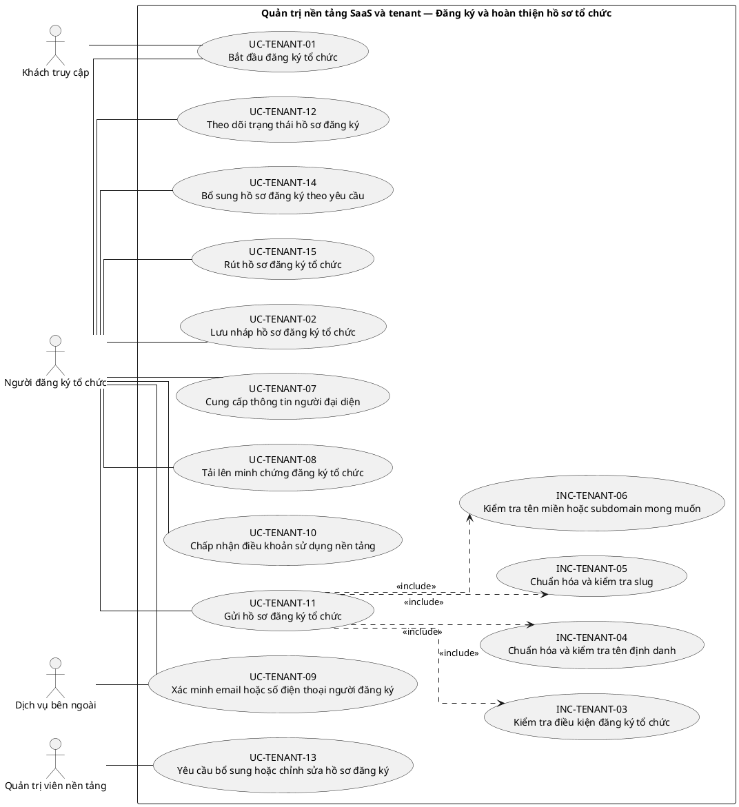
```plantuml
@startuml
left to right direction
skinparam linetype ortho
skinparam packageStyle rectangle
actor "Khách truy cập" as A1
actor "Người đăng ký tổ chức" as A2
actor "Dịch vụ bên ngoài" as A3
actor "Quản trị viên nền tảng" as A4
rectangle "Quản trị nền tảng SaaS và tenant — Đăng ký và hoàn thiện hồ sơ tổ chức" {
  usecase "UC-TENANT-01\nBắt đầu đăng ký tổ chức" as UUC_TENANT_01
  usecase "UC-TENANT-02\nLưu nháp hồ sơ đăng ký tổ chức" as UUC_TENANT_02
  usecase "INC-TENANT-03\nKiểm tra điều kiện đăng ký tổ chức" as UINC_TENANT_03
  usecase "INC-TENANT-04\nChuẩn hóa và kiểm tra tên định danh" as UINC_TENANT_04
  usecase "INC-TENANT-05\nChuẩn hóa và kiểm tra slug" as UINC_TENANT_05
  usecase "INC-TENANT-06\nKiểm tra tên miền hoặc subdomain mong muốn" as UINC_TENANT_06
  usecase "UC-TENANT-07\nCung cấp thông tin người đại diện" as UUC_TENANT_07
  usecase "UC-TENANT-08\nTải lên minh chứng đăng ký tổ chức" as UUC_TENANT_08
  usecase "UC-TENANT-09\nXác minh email hoặc số điện thoại người đăng ký" as UUC_TENANT_09
  usecase "UC-TENANT-10\nChấp nhận điều khoản sử dụng nền tảng" as UUC_TENANT_10
  usecase "UC-TENANT-11\nGửi hồ sơ đăng ký tổ chức" as UUC_TENANT_11
  usecase "UC-TENANT-12\nTheo dõi trạng thái hồ sơ đăng ký" as UUC_TENANT_12
  usecase "UC-TENANT-13\nYêu cầu bổ sung hoặc chỉnh sửa hồ sơ đăng ký" as UUC_TENANT_13
  usecase "UC-TENANT-14\nBổ sung hồ sơ đăng ký theo yêu cầu" as UUC_TENANT_14
  usecase "UC-TENANT-15\nRút hồ sơ đăng ký tổ chức" as UUC_TENANT_15
}
A1 -- UUC_TENANT_01
A2 -- UUC_TENANT_01
A2 -- UUC_TENANT_02
A2 -- UUC_TENANT_07
A2 -- UUC_TENANT_08
A2 -- UUC_TENANT_09
A3 -- UUC_TENANT_09
A2 -- UUC_TENANT_10
A2 -- UUC_TENANT_11
A2 -- UUC_TENANT_12
A4 -- UUC_TENANT_13
A2 -- UUC_TENANT_14
A2 -- UUC_TENANT_15
UUC_TENANT_11 ..> UINC_TENANT_03 : <<include>>
UUC_TENANT_11 ..> UINC_TENANT_04 : <<include>>
UUC_TENANT_11 ..> UINC_TENANT_05 : <<include>>
UUC_TENANT_11 ..> UINC_TENANT_06 : <<include>>
@enduml
```

### 14.3. Thẩm định và khởi tạo tenant

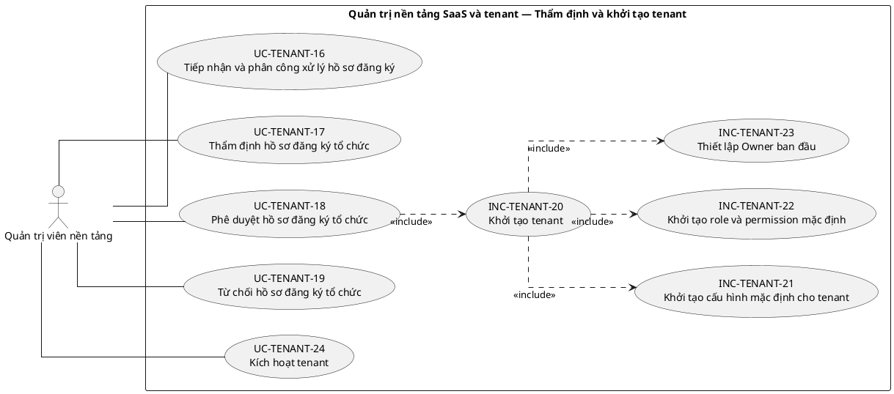
```plantuml
@startuml
left to right direction
skinparam linetype ortho
skinparam packageStyle rectangle
actor "Quản trị viên nền tảng" as A1
rectangle "Quản trị nền tảng SaaS và tenant — Thẩm định và khởi tạo tenant" {
  usecase "UC-TENANT-16\nTiếp nhận và phân công xử lý hồ sơ đăng ký" as UUC_TENANT_16
  usecase "UC-TENANT-17\nThẩm định hồ sơ đăng ký tổ chức" as UUC_TENANT_17
  usecase "UC-TENANT-18\nPhê duyệt hồ sơ đăng ký tổ chức" as UUC_TENANT_18
  usecase "UC-TENANT-19\nTừ chối hồ sơ đăng ký tổ chức" as UUC_TENANT_19
  usecase "INC-TENANT-20\nKhởi tạo tenant" as UINC_TENANT_20
  usecase "INC-TENANT-21\nKhởi tạo cấu hình mặc định cho tenant" as UINC_TENANT_21
  usecase "INC-TENANT-22\nKhởi tạo role và permission mặc định" as UINC_TENANT_22
  usecase "INC-TENANT-23\nThiết lập Owner ban đầu" as UINC_TENANT_23
  usecase "UC-TENANT-24\nKích hoạt tenant" as UUC_TENANT_24
}
A1 -- UUC_TENANT_16
A1 -- UUC_TENANT_17
A1 -- UUC_TENANT_18
A1 -- UUC_TENANT_19
A1 -- UUC_TENANT_24
UUC_TENANT_18 ..> UINC_TENANT_20 : <<include>>
UINC_TENANT_20 ..> UINC_TENANT_21 : <<include>>
UINC_TENANT_20 ..> UINC_TENANT_22 : <<include>>
UINC_TENANT_20 ..> UINC_TENANT_23 : <<include>>
@enduml
```

### 14.4. Dịch vụ, hồ sơ và theo dõi tenant

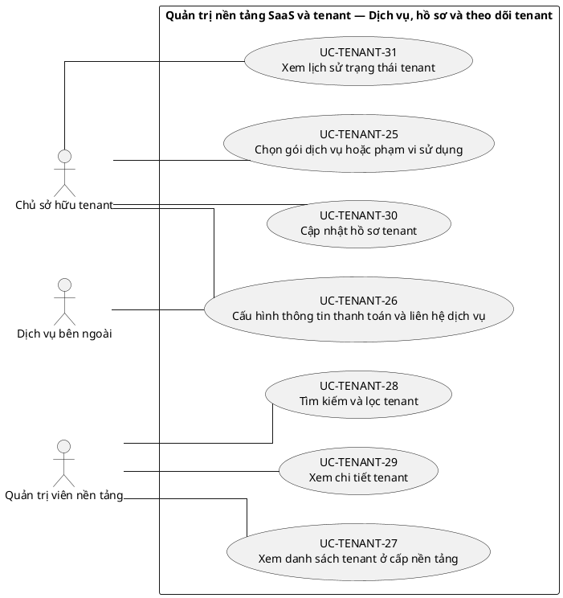
```plantuml
@startuml
left to right direction
skinparam linetype ortho
skinparam packageStyle rectangle
actor "Chủ sở hữu tenant" as A1
actor "Dịch vụ bên ngoài" as A2
actor "Quản trị viên nền tảng" as A3
rectangle "Quản trị nền tảng SaaS và tenant — Dịch vụ, hồ sơ và theo dõi tenant" {
  usecase "UC-TENANT-25\nChọn gói dịch vụ hoặc phạm vi sử dụng" as UUC_TENANT_25
  usecase "UC-TENANT-26\nCấu hình thông tin thanh toán và liên hệ dịch vụ" as UUC_TENANT_26
  usecase "UC-TENANT-27\nXem danh sách tenant ở cấp nền tảng" as UUC_TENANT_27
  usecase "UC-TENANT-28\nTìm kiếm và lọc tenant" as UUC_TENANT_28
  usecase "UC-TENANT-29\nXem chi tiết tenant" as UUC_TENANT_29
  usecase "UC-TENANT-30\nCập nhật hồ sơ tenant" as UUC_TENANT_30
  usecase "UC-TENANT-31\nXem lịch sử trạng thái tenant" as UUC_TENANT_31
}
A1 -- UUC_TENANT_25
A1 -- UUC_TENANT_26
A2 -- UUC_TENANT_26
A3 -- UUC_TENANT_27
A3 -- UUC_TENANT_28
A3 -- UUC_TENANT_29
A1 -- UUC_TENANT_30
A1 -- UUC_TENANT_31
@enduml
```

### 14.5. Vòng đời và quyền sở hữu tenant

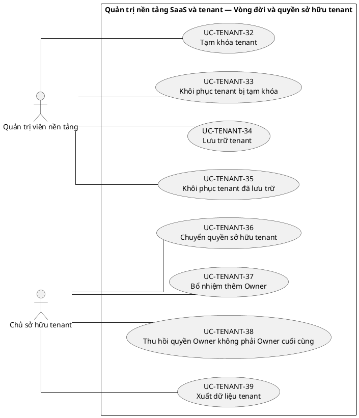
```plantuml
@startuml
left to right direction
skinparam linetype ortho
skinparam packageStyle rectangle
actor "Quản trị viên nền tảng" as A1
actor "Chủ sở hữu tenant" as A2
rectangle "Quản trị nền tảng SaaS và tenant — Vòng đời và quyền sở hữu tenant" {
  usecase "UC-TENANT-32\nTạm khóa tenant" as UUC_TENANT_32
  usecase "UC-TENANT-33\nKhôi phục tenant bị tạm khóa" as UUC_TENANT_33
  usecase "UC-TENANT-34\nLưu trữ tenant" as UUC_TENANT_34
  usecase "UC-TENANT-35\nKhôi phục tenant đã lưu trữ" as UUC_TENANT_35
  usecase "UC-TENANT-36\nChuyển quyền sở hữu tenant" as UUC_TENANT_36
  usecase "UC-TENANT-37\nBổ nhiệm thêm Owner" as UUC_TENANT_37
  usecase "UC-TENANT-38\nThu hồi quyền Owner không phải Owner cuối cùng" as UUC_TENANT_38
  usecase "UC-TENANT-39\nXuất dữ liệu tenant" as UUC_TENANT_39
}
A1 -- UUC_TENANT_32
A1 -- UUC_TENANT_33
A1 -- UUC_TENANT_34
A1 -- UUC_TENANT_35
A2 -- UUC_TENANT_36
A2 -- UUC_TENANT_37
A2 -- UUC_TENANT_38
A2 -- UUC_TENANT_39
@enduml
```

### 14.6. Đóng tenant, lưu giữ và tên miền

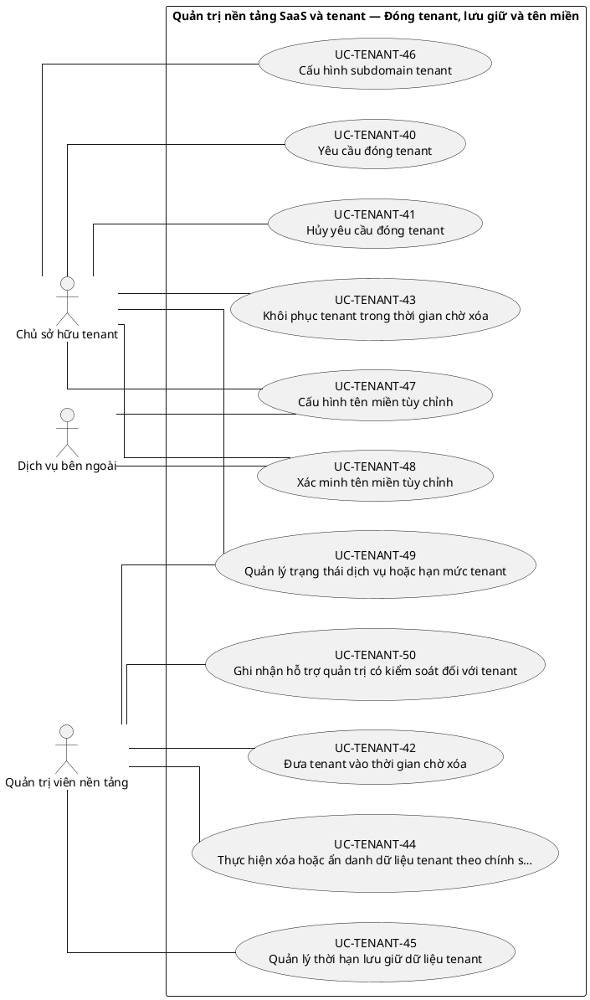
```plantuml
@startuml
left to right direction
skinparam linetype ortho
skinparam packageStyle rectangle
actor "Chủ sở hữu tenant" as A1
actor "Quản trị viên nền tảng" as A2
actor "Dịch vụ bên ngoài" as A3
rectangle "Quản trị nền tảng SaaS và tenant — Đóng tenant, lưu giữ và tên miền" {
  usecase "UC-TENANT-40\nYêu cầu đóng tenant" as UUC_TENANT_40
  usecase "UC-TENANT-41\nHủy yêu cầu đóng tenant" as UUC_TENANT_41
  usecase "UC-TENANT-42\nĐưa tenant vào thời gian chờ xóa" as UUC_TENANT_42
  usecase "UC-TENANT-43\nKhôi phục tenant trong thời gian chờ xóa" as UUC_TENANT_43
  usecase "UC-TENANT-44\nThực hiện xóa hoặc ẩn danh dữ liệu tenant theo chính s…" as UUC_TENANT_44
  usecase "UC-TENANT-45\nQuản lý thời hạn lưu giữ dữ liệu tenant" as UUC_TENANT_45
  usecase "UC-TENANT-46\nCấu hình subdomain tenant" as UUC_TENANT_46
  usecase "UC-TENANT-47\nCấu hình tên miền tùy chỉnh" as UUC_TENANT_47
  usecase "UC-TENANT-48\nXác minh tên miền tùy chỉnh" as UUC_TENANT_48
  usecase "UC-TENANT-49\nQuản lý trạng thái dịch vụ hoặc hạn mức tenant" as UUC_TENANT_49
  usecase "UC-TENANT-50\nGhi nhận hỗ trợ quản trị có kiểm soát đối với tenant" as UUC_TENANT_50
}
A1 -- UUC_TENANT_40
A1 -- UUC_TENANT_41
A2 -- UUC_TENANT_42
A1 -- UUC_TENANT_43
A2 -- UUC_TENANT_44
A2 -- UUC_TENANT_45
A1 -- UUC_TENANT_46
A1 -- UUC_TENANT_47
A3 -- UUC_TENANT_47
A1 -- UUC_TENANT_48
A3 -- UUC_TENANT_48
A1 -- UUC_TENANT_49
A2 -- UUC_TENANT_49
A2 -- UUC_TENANT_50
@enduml
```


---

# UC-AUTH — Xác thực và quản lý phiên

## 1. Thông tin tài liệu

| Thuộc tính | Nội dung |
|---|---|
| Mã nhóm Use Case | `UC-AUTH` |
| Tên | Xác thực và quản lý phiên |
| Miền nghiệp vụ | Danh tính và truy cập |
| Mức ưu tiên phát triển | Nền tảng bắt buộc |
| Phạm vi | Toàn bộ sản phẩm Operations Hub |
| Mô hình | SaaS đa tổ chức, dữ liệu và cấu hình theo tenant |
| Trạng thái đặc tả | Baseline V3; phân biệt Use Case mục tiêu, include, extend và yêu cầu hệ thống |

> **Nguyên tắc phạm vi:** tài liệu mô tả năng lực của phiên bản sản phẩm hoàn chỉnh. Mức ưu tiên phát triển không đồng nghĩa với loại bỏ khỏi phạm vi sản phẩm.

## 2. Mục tiêu

Xác minh danh tính, quản lý vòng đời phiên và thiết lập ngữ cảnh truy cập an toàn cho người dùng trên toàn nền tảng.

## 3. Actor

| Mã actor | Actor | Phạm vi |
|---|---|---|
| `ACT-GUEST` | Khách truy cập | Cấp nền tảng |
| `ACT-PLATFORM-USER` | Người dùng nền tảng | Cấp nền tảng |
| `ACT-EXTERNAL-SERVICE` | Dịch vụ bên ngoài | Tenant hoặc tích hợp |

Actor trong sơ đồ chỉ thể hiện vai trò tương tác. Quyền thực tế phải được kiểm tra tại backend dựa trên tenant context, membership, role, permission, organization unit, trạng thái module và trạng thái tenant.

## 4. Điều kiện trước

- Người dùng có thể chưa xác thực hoặc đã có tài khoản.
- Dịch vụ xác thực ngoài chỉ được dùng khi đã cấu hình và được cho phép.

## 5. Điều kiện sau

- Phiên hợp lệ gắn với User đã xác thực.
- Phiên bị thu hồi hoặc hết hạn không còn sử dụng được.
- Sự kiện xác thực quan trọng được ghi log bảo mật.

## 6. Danh mục phần tử nghiệp vụ và phân loại UML

> **Thay đổi của V3:** Không coi toàn bộ danh mục chức năng là Use Case độc lập. Chỉ phần tử có mục tiêu quan sát được đối với actor được giữ mã `UC-*`. Hành vi bắt buộc dùng chung dùng mã `INC-*`; luồng điều kiện dùng mã `EXT-*`; quy tắc hoặc xử lý xuyên suốt dùng mã `REQ-*`. Mã V2 được giữ để truy vết.

> Actor chỉ nối trực tiếp với `UC-*` hoặc `EXT-*` mà actor thực sự khởi phát/tham gia. `INC-*` được nối bằng `<<include>>`; `REQ-*` không được vẽ như Use Case.

| Mã V3 | Mã V2 | Phần tử nghiệp vụ | Loại mô hình | Actor trực tiếp / nguồn kích hoạt | Quan hệ |
|---|---|---|---|---|---|
| `UC-AUTH-01` | `UC-AUTH-01` | Đăng ký tài khoản bằng email | Use Case mục tiêu actor | `ACT-GUEST` — Khách truy cập | Association trực tiếp với actor |
| `UC-AUTH-02` | `UC-AUTH-02` | Đăng ký tài khoản bằng định danh được hỗ trợ | Use Case mục tiêu actor | `ACT-GUEST` — Khách truy cập | Association trực tiếp với actor |
| `UC-AUTH-03` | `UC-AUTH-03` | Xác minh địa chỉ email | Use Case mục tiêu actor | `ACT-GUEST` — Khách truy cập<br>`ACT-EXTERNAL-SERVICE` — Dịch vụ bên ngoài | Association trực tiếp với actor |
| `EXT-AUTH-04` | `UC-AUTH-04` | Gửi lại liên kết xác minh | Luồng điều kiện `<<extend>>` | `ACT-GUEST` — Khách truy cập<br>`ACT-EXTERNAL-SERVICE` — Dịch vụ bên ngoài | `EXT-AUTH-04` `<<extend>>` `UC-AUTH-03` |
| `UC-AUTH-05` | `UC-AUTH-05` | Đăng nhập bằng mật khẩu | Use Case mục tiêu actor | `ACT-GUEST` — Khách truy cập | Association trực tiếp với actor |
| `UC-AUTH-06` | `UC-AUTH-06` | Đăng nhập bằng SSO hoặc OAuth | Use Case mục tiêu actor | `ACT-GUEST` — Khách truy cập<br>`ACT-EXTERNAL-SERVICE` — Dịch vụ bên ngoài | Association trực tiếp với actor |
| `UC-AUTH-07` | `UC-AUTH-07` | Đăng nhập không mật khẩu bằng liên kết dùng một lần | Use Case mục tiêu actor | `ACT-GUEST` — Khách truy cập<br>`ACT-EXTERNAL-SERVICE` — Dịch vụ bên ngoài | Association trực tiếp với actor |
| `UC-AUTH-08` | `UC-AUTH-08` | Bắt đầu xác thực đa yếu tố | Use Case mục tiêu actor | `ACT-PLATFORM-USER` — Người dùng nền tảng<br>`ACT-EXTERNAL-SERVICE` — Dịch vụ bên ngoài | Association trực tiếp với actor |
| `UC-AUTH-09` | `UC-AUTH-09` | Đăng ký phương thức MFA | Use Case mục tiêu actor | `ACT-PLATFORM-USER` — Người dùng nền tảng<br>`ACT-EXTERNAL-SERVICE` — Dịch vụ bên ngoài | Association trực tiếp với actor |
| `INC-AUTH-10` | `UC-AUTH-10` | Xác minh mã MFA | Hành vi dùng chung `<<include>>` | Hệ thống; được gọi từ Use Case cha | `UC-AUTH-09` `<<include>>` `INC-AUTH-10` |
| `UC-AUTH-11` | `UC-AUTH-11` | Quản lý mã khôi phục MFA | Use Case mục tiêu actor | `ACT-PLATFORM-USER` — Người dùng nền tảng<br>`ACT-EXTERNAL-SERVICE` — Dịch vụ bên ngoài | Association trực tiếp với actor |
| `UC-AUTH-12` | `UC-AUTH-12` | Tắt hoặc thay đổi phương thức MFA | Use Case mục tiêu actor | `ACT-PLATFORM-USER` — Người dùng nền tảng<br>`ACT-EXTERNAL-SERVICE` — Dịch vụ bên ngoài | Association trực tiếp với actor |
| `UC-AUTH-13` | `UC-AUTH-13` | Thực hiện xác thực tăng cường cho thao tác nhạy cảm | Use Case mục tiêu actor | `ACT-PLATFORM-USER` — Người dùng nền tảng<br>`ACT-EXTERNAL-SERVICE` — Dịch vụ bên ngoài | Association trực tiếp với actor |
| `UC-AUTH-14` | `UC-AUTH-14` | Đăng xuất phiên hiện tại | Use Case mục tiêu actor | `ACT-PLATFORM-USER` — Người dùng nền tảng | Association trực tiếp với actor |
| `UC-AUTH-15` | `UC-AUTH-15` | Đăng xuất khỏi tất cả thiết bị | Use Case mục tiêu actor | `ACT-PLATFORM-USER` — Người dùng nền tảng | Association trực tiếp với actor |
| `INC-AUTH-16` | `UC-AUTH-16` | Làm mới access token hoặc phiên | Hành vi dùng chung `<<include>>` | Hệ thống; được gọi từ Use Case cha | `UC-AUTH-15` `<<include>>` `INC-AUTH-16` |
| `EXT-AUTH-17` | `UC-AUTH-17` | Khôi phục phiên hợp lệ | Luồng điều kiện `<<extend>>` | `ACT-PLATFORM-USER` — Người dùng nền tảng | `EXT-AUTH-17` `<<extend>>` `UC-AUTH-15` |
| `UC-AUTH-18` | `UC-AUTH-18` | Yêu cầu quên mật khẩu | Use Case mục tiêu actor | `ACT-GUEST` — Khách truy cập<br>`ACT-EXTERNAL-SERVICE` — Dịch vụ bên ngoài | Association trực tiếp với actor |
| `UC-AUTH-19` | `UC-AUTH-19` | Đặt lại mật khẩu | Use Case mục tiêu actor | `ACT-GUEST` — Khách truy cập<br>`ACT-EXTERNAL-SERVICE` — Dịch vụ bên ngoài | Association trực tiếp với actor |
| `UC-AUTH-20` | `UC-AUTH-20` | Đổi mật khẩu khi biết mật khẩu hiện tại | Use Case mục tiêu actor | `ACT-PLATFORM-USER` — Người dùng nền tảng | Association trực tiếp với actor |
| `UC-AUTH-21` | `UC-AUTH-21` | Buộc đổi mật khẩu ở lần đăng nhập tiếp theo | Use Case mục tiêu actor | `ACT-PLATFORM-USER` — Người dùng nền tảng | Association trực tiếp với actor |
| `REQ-AUTH-22` | `UC-AUTH-22` | Khóa đăng nhập sau nhiều lần thất bại | Quy tắc/yêu cầu hệ thống | Hệ thống/chính sách; không có association actor trực tiếp | Áp dụng như quy tắc/yêu cầu xuyên suốt; không nối actor trực tiếp |
| `EXT-AUTH-23` | `UC-AUTH-23` | Mở khóa đăng nhập theo chính sách | Luồng điều kiện `<<extend>>` | `ACT-GUEST` — Khách truy cập | `EXT-AUTH-23` `<<extend>>` `REQ-AUTH-22` |
| `INC-AUTH-24` | `UC-AUTH-24` | Xác minh CAPTCHA hoặc chống tự động hóa | Hành vi dùng chung `<<include>>` | Hệ thống; được gọi từ Use Case cha | `UC-AUTH-05` `<<include>>` `INC-AUTH-24` |
| `UC-AUTH-25` | `UC-AUTH-25` | Xem danh sách phiên đăng nhập | Use Case mục tiêu actor | `ACT-PLATFORM-USER` — Người dùng nền tảng | Association trực tiếp với actor |
| `UC-AUTH-26` | `UC-AUTH-26` | Thu hồi một phiên đăng nhập | Use Case mục tiêu actor | `ACT-PLATFORM-USER` — Người dùng nền tảng | Association trực tiếp với actor |
| `UC-AUTH-27` | `UC-AUTH-27` | Đánh dấu thiết bị tin cậy | Use Case mục tiêu actor | `ACT-PLATFORM-USER` — Người dùng nền tảng | Association trực tiếp với actor |
| `UC-AUTH-28` | `UC-AUTH-28` | Thu hồi thiết bị tin cậy | Use Case mục tiêu actor | `ACT-PLATFORM-USER` — Người dùng nền tảng | Association trực tiếp với actor |
| `UC-AUTH-29` | `UC-AUTH-29` | Chấp nhận lời mời tham gia tenant qua liên kết | Use Case mục tiêu actor | `ACT-GUEST` — Khách truy cập | Association trực tiếp với actor |
| `UC-AUTH-30` | `UC-AUTH-30` | Từ chối lời mời tham gia tenant | Use Case mục tiêu actor | `ACT-GUEST` — Khách truy cập | Association trực tiếp với actor |
| `UC-AUTH-31` | `UC-AUTH-31` | Chọn tenant context sau khi đăng nhập | Use Case mục tiêu actor | `ACT-PLATFORM-USER` — Người dùng nền tảng | Association trực tiếp với actor |
| `UC-AUTH-32` | `UC-AUTH-32` | Chuyển tenant context khi đang hoạt động | Use Case mục tiêu actor | `ACT-PLATFORM-USER` — Người dùng nền tảng | Association trực tiếp với actor |
| `REQ-AUTH-33` | `UC-AUTH-33` | Xử lý phiên khi tenant hoặc membership bị khóa | Quy tắc/yêu cầu hệ thống | Hệ thống/chính sách; không có association actor trực tiếp | Áp dụng như quy tắc/yêu cầu xuyên suốt; không nối actor trực tiếp |
| `REQ-AUTH-34` | `UC-AUTH-34` | Xử lý tài khoản chưa xác minh | Quy tắc/yêu cầu hệ thống | Hệ thống/chính sách; không có association actor trực tiếp | Áp dụng như quy tắc/yêu cầu xuyên suốt; không nối actor trực tiếp |
| `REQ-AUTH-35` | `UC-AUTH-35` | Xử lý thông tin xác thực hết hạn hoặc không hợp lệ | Quy tắc/yêu cầu hệ thống | Hệ thống/chính sách; không có association actor trực tiếp | Áp dụng như quy tắc/yêu cầu xuyên suốt; không nối actor trực tiếp |
| `REQ-AUTH-36` | `UC-AUTH-36` | Ghi nhận sự kiện xác thực và cảnh báo bảo mật | Quy tắc/yêu cầu hệ thống | Hệ thống/chính sách; không có association actor trực tiếp | Áp dụng như quy tắc/yêu cầu xuyên suốt; không nối actor trực tiếp |

## 7. Luồng nghiệp vụ chính

1. Người dùng gửi thông tin xác thực.
2. Hệ thống kiểm tra định dạng, trạng thái User và chính sách bảo mật.
3. Hệ thống xác minh thông tin xác thực hoặc chuyển qua dịch vụ nhận dạng ngoài.
4. Hệ thống phát hành phiên và trả thông tin User tối thiểu.
5. Nếu User thuộc nhiều tenant, hệ thống yêu cầu chọn tenant hoặc dùng tenant mặc định hợp lệ.
6. Mọi API nghiệp vụ tiếp theo kiểm tra phiên, tenant context và quyền.

## 8. Luồng thay thế và ngoại lệ

- Thông tin sai: trả lỗi chuẩn hóa, không tiết lộ tài khoản có tồn tại hay không khi chính sách yêu cầu.
- Phiên hết hạn hoặc bị thu hồi: yêu cầu đăng nhập lại hoặc làm mới hợp lệ.
- Tenant đã chọn không có membership hoạt động: từ chối thiết lập context.
- Dịch vụ xác thực ngoài lỗi: không làm mất khả năng dùng cơ chế đăng nhập nội bộ nếu được cấu hình.

## 9. Quy tắc nghiệp vụ cốt lõi

- User đã đăng nhập không mặc nhiên có quyền trong tenant nếu chưa có membership hợp lệ.
- Mật khẩu không được lưu hoặc trả về ở dạng rõ.
- Đăng nhập thất bại liên tiếp phải chịu giới hạn tốc độ hoặc kiểm soát rủi ro.
- Tenant context do client yêu cầu phải được đối chiếu với membership của User.
- Khi User bị vô hiệu hóa ở cấp nền tảng, mọi phiên trên các tenant phải bị từ chối.

## 10. Mô hình dữ liệu logic liên quan

| Thực thể | Vai trò |
|---|---|
| `User` | Thực thể logic phục vụ UC-AUTH; thiết kế vật lý được xác định ở giai đoạn thiết kế dữ liệu. |
| `Credential` | Thực thể logic phục vụ UC-AUTH; thiết kế vật lý được xác định ở giai đoạn thiết kế dữ liệu. |
| `Session` | Thực thể logic phục vụ UC-AUTH; thiết kế vật lý được xác định ở giai đoạn thiết kế dữ liệu. |
| `RefreshToken` | Thực thể logic phục vụ UC-AUTH; thiết kế vật lý được xác định ở giai đoạn thiết kế dữ liệu. |
| `VerificationToken` | Thực thể logic phục vụ UC-AUTH; thiết kế vật lý được xác định ở giai đoạn thiết kế dữ liệu. |
| `AuthenticationEvent` | Thực thể logic phục vụ UC-AUTH; thiết kế vật lý được xác định ở giai đoạn thiết kế dữ liệu. |
| `Membership` | Thực thể logic phục vụ UC-AUTH; thiết kế vật lý được xác định ở giai đoạn thiết kế dữ liệu. |

Mọi thực thể nghiệp vụ phải xác định được tenant sở hữu, trừ thực thể được công bố rõ là dữ liệu cấp nền tảng. Quan hệ tham chiếu chéo tenant bị cấm nếu không có cơ chế liên tenant được đặc tả riêng.

## 11. Kiểm soát truy cập

Quyền hiệu lực được xác định theo công thức khái quát:

```text
Quyền hiệu lực
= Permission từ các Role đang hoạt động
∩ Tenant context hợp lệ
∩ Membership đang hoạt động
∩ Phạm vi Organization Unit
∩ Phạm vi tài nguyên
∩ Trạng thái Module
∩ Trạng thái Tenant
```

Các kiểm tra bắt buộc:

- Xác thực User trước khi truy cập chức năng không công khai.
- Đối chiếu tenant context với membership.
- Kiểm tra permission tại backend, không dựa vào trạng thái hiển thị của frontend.
- Giới hạn truy vấn, tệp, bản xuất, cache và tác vụ nền theo tenant.
- Ghi audit cho hành động quản trị hoặc thay đổi nghiệp vụ quan trọng.

## 12. Tiêu chí chấp nhận

| Mã | Tiêu chí | Phương pháp kiểm chứng |
|---|---|---|
| `AC-AUTH-01` | Đăng nhập hợp lệ tạo phiên; đăng nhập sai không tạo phiên. | Functional / Integration / Security Test tùy nội dung |
| `AC-AUTH-02` | Sau đăng xuất hoặc thu hồi, phiên không thể gọi API được bảo vệ. | Functional / Integration / Security Test tùy nội dung |
| `AC-AUTH-03` | Không có mật khẩu rõ trong database, log hoặc response. | Functional / Integration / Security Test tùy nội dung |
| `AC-AUTH-04` | Người dùng không thể tự đổi tenant context sang tổ chức không thuộc quyền truy cập. | Functional / Integration / Security Test tùy nội dung |

## 13. Quan hệ với nhóm Use Case khác

[`UC-USER`](./03_UC-USER.md), [`UC-TENANT`](./01_UC-TENANT.md), [`UC-AUDIT`](./21_UC-AUDIT.md)

## 14. Use Case Diagram theo luồng nghiệp vụ

Các package/rectangle dưới đây chỉ là **ranh giới hệ thống hoặc miền nghiệp vụ**. Không tồn tại phần tử trung gian `PKG*`; actor liên kết trực tiếp với Use Case có mục tiêu nghiệp vụ. `INC-*` và `EXT-*` chỉ xuất hiện qua quan hệ UML tương ứng; `REQ-*` được trình bày ngoài sơ đồ.

### 14.1. Quy ước đọc sơ đồ

- `Actor -- UC-*`: actor trực tiếp thực hiện hoặc tham gia mục tiêu nghiệp vụ.
- `UC-* ..> INC-* : <<include>>`: hành vi bắt buộc được dùng lại.
- `EXT-* ..> UC-* : <<extend>>`: hành vi chỉ phát sinh trong điều kiện xác định.
- `REQ-*`: quy tắc/yêu cầu hệ thống, không phải Use Case và không nối actor.

### 14.2. Đăng ký và đăng nhập

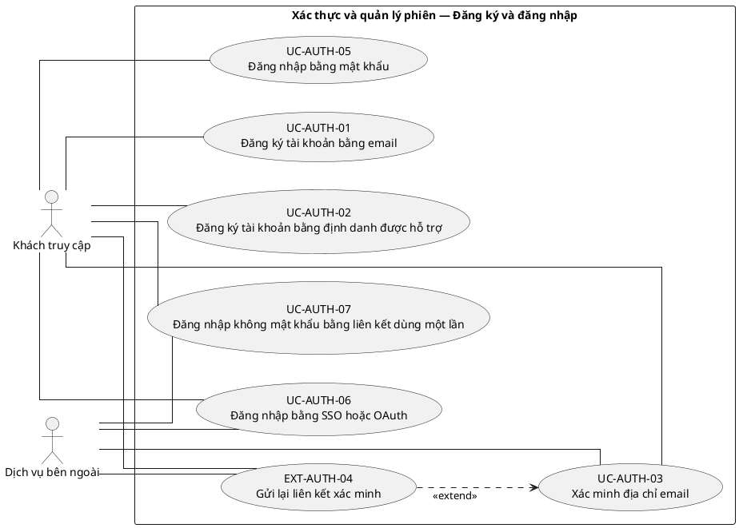
```plantuml
@startuml
left to right direction
skinparam linetype ortho
skinparam packageStyle rectangle
actor "Khách truy cập" as A1
actor "Dịch vụ bên ngoài" as A2
rectangle "Xác thực và quản lý phiên — Đăng ký và đăng nhập" {
  usecase "UC-AUTH-01\nĐăng ký tài khoản bằng email" as UUC_AUTH_01
  usecase "UC-AUTH-02\nĐăng ký tài khoản bằng định danh được hỗ trợ" as UUC_AUTH_02
  usecase "UC-AUTH-03\nXác minh địa chỉ email" as UUC_AUTH_03
  usecase "EXT-AUTH-04\nGửi lại liên kết xác minh" as UEXT_AUTH_04
  usecase "UC-AUTH-05\nĐăng nhập bằng mật khẩu" as UUC_AUTH_05
  usecase "UC-AUTH-06\nĐăng nhập bằng SSO hoặc OAuth" as UUC_AUTH_06
  usecase "UC-AUTH-07\nĐăng nhập không mật khẩu bằng liên kết dùng một lần" as UUC_AUTH_07
}
A1 -- UUC_AUTH_01
A1 -- UUC_AUTH_02
A1 -- UUC_AUTH_03
A2 -- UUC_AUTH_03
A1 -- UEXT_AUTH_04
A2 -- UEXT_AUTH_04
A1 -- UUC_AUTH_05
A1 -- UUC_AUTH_06
A2 -- UUC_AUTH_06
A1 -- UUC_AUTH_07
A2 -- UUC_AUTH_07
UEXT_AUTH_04 ..> UUC_AUTH_03 : <<extend>>
@enduml
```

### 14.3. MFA và quản lý phiên

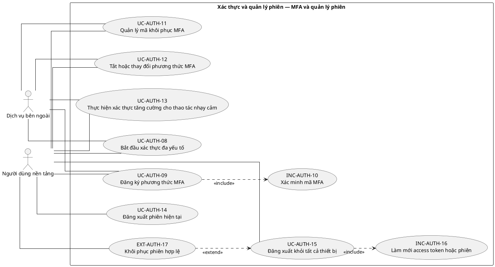
```plantuml
@startuml
left to right direction
skinparam linetype ortho
skinparam packageStyle rectangle
actor "Người dùng nền tảng" as A1
actor "Dịch vụ bên ngoài" as A2
rectangle "Xác thực và quản lý phiên — MFA và quản lý phiên" {
  usecase "UC-AUTH-08\nBắt đầu xác thực đa yếu tố" as UUC_AUTH_08
  usecase "UC-AUTH-09\nĐăng ký phương thức MFA" as UUC_AUTH_09
  usecase "INC-AUTH-10\nXác minh mã MFA" as UINC_AUTH_10
  usecase "UC-AUTH-11\nQuản lý mã khôi phục MFA" as UUC_AUTH_11
  usecase "UC-AUTH-12\nTắt hoặc thay đổi phương thức MFA" as UUC_AUTH_12
  usecase "UC-AUTH-13\nThực hiện xác thực tăng cường cho thao tác nhạy cảm" as UUC_AUTH_13
  usecase "UC-AUTH-14\nĐăng xuất phiên hiện tại" as UUC_AUTH_14
  usecase "UC-AUTH-15\nĐăng xuất khỏi tất cả thiết bị" as UUC_AUTH_15
  usecase "INC-AUTH-16\nLàm mới access token hoặc phiên" as UINC_AUTH_16
  usecase "EXT-AUTH-17\nKhôi phục phiên hợp lệ" as UEXT_AUTH_17
}
A1 -- UUC_AUTH_08
A2 -- UUC_AUTH_08
A1 -- UUC_AUTH_09
A2 -- UUC_AUTH_09
A1 -- UUC_AUTH_11
A2 -- UUC_AUTH_11
A1 -- UUC_AUTH_12
A2 -- UUC_AUTH_12
A1 -- UUC_AUTH_13
A2 -- UUC_AUTH_13
A1 -- UUC_AUTH_14
A1 -- UUC_AUTH_15
A1 -- UEXT_AUTH_17
UUC_AUTH_09 ..> UINC_AUTH_10 : <<include>>
UUC_AUTH_15 ..> UINC_AUTH_16 : <<include>>
UEXT_AUTH_17 ..> UUC_AUTH_15 : <<extend>>
@enduml
```

### 14.4. Khôi phục và bảo vệ đăng nhập

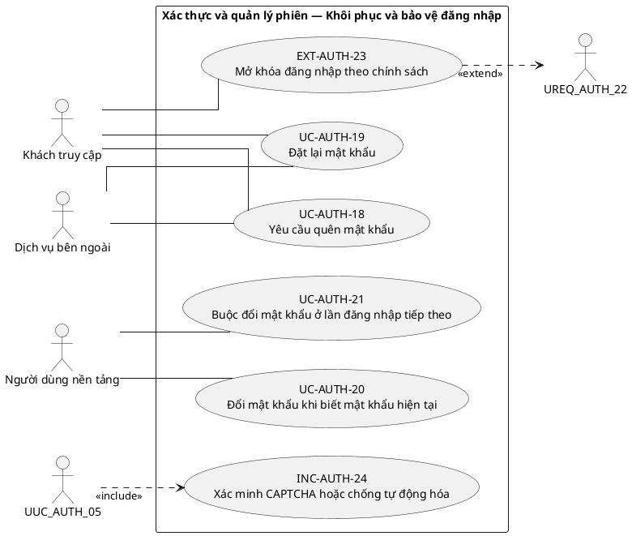
```plantuml
@startuml
left to right direction
skinparam linetype ortho
skinparam packageStyle rectangle
actor "Khách truy cập" as A1
actor "Dịch vụ bên ngoài" as A2
actor "Người dùng nền tảng" as A3
rectangle "Xác thực và quản lý phiên — Khôi phục và bảo vệ đăng nhập" {
  usecase "UC-AUTH-18\nYêu cầu quên mật khẩu" as UUC_AUTH_18
  usecase "UC-AUTH-19\nĐặt lại mật khẩu" as UUC_AUTH_19
  usecase "UC-AUTH-20\nĐổi mật khẩu khi biết mật khẩu hiện tại" as UUC_AUTH_20
  usecase "UC-AUTH-21\nBuộc đổi mật khẩu ở lần đăng nhập tiếp theo" as UUC_AUTH_21
  usecase "EXT-AUTH-23\nMở khóa đăng nhập theo chính sách" as UEXT_AUTH_23
  usecase "INC-AUTH-24\nXác minh CAPTCHA hoặc chống tự động hóa" as UINC_AUTH_24
}
A1 -- UUC_AUTH_18
A2 -- UUC_AUTH_18
A1 -- UUC_AUTH_19
A2 -- UUC_AUTH_19
A3 -- UUC_AUTH_20
A3 -- UUC_AUTH_21
A1 -- UEXT_AUTH_23
UEXT_AUTH_23 ..> UREQ_AUTH_22 : <<extend>>
UUC_AUTH_05 ..> UINC_AUTH_24 : <<include>>
@enduml
```

**Quy tắc/yêu cầu áp dụng cho luồng này:**
- `REQ-AUTH-22` — Khóa đăng nhập sau nhiều lần thất bại

### 14.5. Thiết bị, lời mời và tenant context

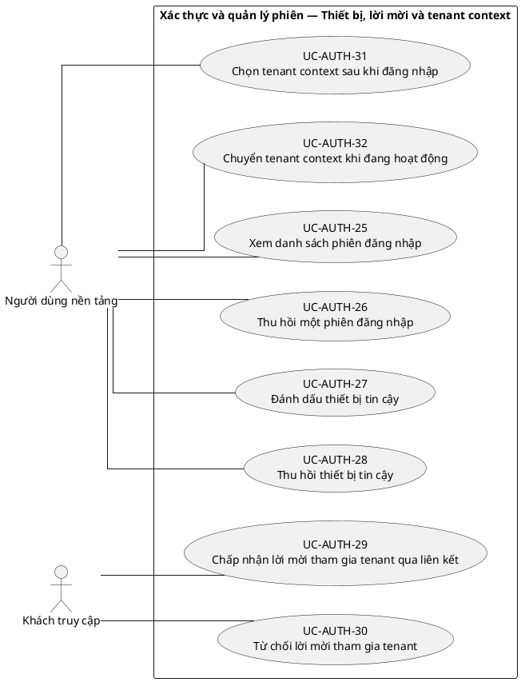
```plantuml
@startuml
left to right direction
skinparam linetype ortho
skinparam packageStyle rectangle
actor "Người dùng nền tảng" as A1
actor "Khách truy cập" as A2
rectangle "Xác thực và quản lý phiên — Thiết bị, lời mời và tenant context" {
  usecase "UC-AUTH-25\nXem danh sách phiên đăng nhập" as UUC_AUTH_25
  usecase "UC-AUTH-26\nThu hồi một phiên đăng nhập" as UUC_AUTH_26
  usecase "UC-AUTH-27\nĐánh dấu thiết bị tin cậy" as UUC_AUTH_27
  usecase "UC-AUTH-28\nThu hồi thiết bị tin cậy" as UUC_AUTH_28
  usecase "UC-AUTH-29\nChấp nhận lời mời tham gia tenant qua liên kết" as UUC_AUTH_29
  usecase "UC-AUTH-30\nTừ chối lời mời tham gia tenant" as UUC_AUTH_30
  usecase "UC-AUTH-31\nChọn tenant context sau khi đăng nhập" as UUC_AUTH_31
  usecase "UC-AUTH-32\nChuyển tenant context khi đang hoạt động" as UUC_AUTH_32
}
A1 -- UUC_AUTH_25
A1 -- UUC_AUTH_26
A1 -- UUC_AUTH_27
A1 -- UUC_AUTH_28
A2 -- UUC_AUTH_29
A2 -- UUC_AUTH_30
A1 -- UUC_AUTH_31
A1 -- UUC_AUTH_32
@enduml
```

**Quy tắc/yêu cầu áp dụng cho luồng này:**
- `REQ-AUTH-33` — Xử lý phiên khi tenant hoặc membership bị khóa
- `REQ-AUTH-34` — Xử lý tài khoản chưa xác minh
- `REQ-AUTH-35` — Xử lý thông tin xác thực hết hạn hoặc không hợp lệ
- `REQ-AUTH-36` — Ghi nhận sự kiện xác thực và cảnh báo bảo mật


---

# UC-USER — Quản lý tài khoản người dùng

## 1. Thông tin tài liệu

| Thuộc tính | Nội dung |
|---|---|
| Mã nhóm Use Case | `UC-USER` |
| Tên | Quản lý tài khoản người dùng |
| Miền nghiệp vụ | Danh tính và truy cập |
| Mức ưu tiên phát triển | Nền tảng bắt buộc |
| Phạm vi | Toàn bộ sản phẩm Operations Hub |
| Mô hình | SaaS đa tổ chức, dữ liệu và cấu hình theo tenant |
| Trạng thái đặc tả | Baseline V3; phân biệt Use Case mục tiêu, include, extend và yêu cầu hệ thống |

> **Nguyên tắc phạm vi:** tài liệu mô tả năng lực của phiên bản sản phẩm hoàn chỉnh. Mức ưu tiên phát triển không đồng nghĩa với loại bỏ khỏi phạm vi sản phẩm.

## 2. Mục tiêu

Quản lý danh tính toàn cục của người dùng mà không nhầm lẫn với membership và vai trò trong từng tenant.

## 3. Actor

| Mã actor | Actor | Phạm vi |
|---|---|---|
| `ACT-PLATFORM-USER` | Người dùng nền tảng | Cấp nền tảng |
| `ACT-TENANT-ADMIN` | Quản trị viên tenant | Tenant hoặc tích hợp |
| `ACT-PLATFORM-ADMIN` | Quản trị viên nền tảng | Cấp nền tảng |

Actor trong sơ đồ chỉ thể hiện vai trò tương tác. Quyền thực tế phải được kiểm tra tại backend dựa trên tenant context, membership, role, permission, organization unit, trạng thái module và trạng thái tenant.

## 4. Điều kiện trước

- Người thao tác đã xác thực.
- Các thao tác quản trị yêu cầu permission cấp nền tảng hoặc phạm vi tenant tương ứng.

## 5. Điều kiện sau

- Thông tin User được cập nhật có kiểm soát.
- Thay đổi trạng thái User toàn cục có hiệu lực trên toàn nền tảng.
- Các thay đổi nhạy cảm được ghi audit.

## 6. Danh mục phần tử nghiệp vụ và phân loại UML

> **Thay đổi của V3:** Không coi toàn bộ danh mục chức năng là Use Case độc lập. Chỉ phần tử có mục tiêu quan sát được đối với actor được giữ mã `UC-*`. Hành vi bắt buộc dùng chung dùng mã `INC-*`; luồng điều kiện dùng mã `EXT-*`; quy tắc hoặc xử lý xuyên suốt dùng mã `REQ-*`. Mã V2 được giữ để truy vết.

> Actor chỉ nối trực tiếp với `UC-*` hoặc `EXT-*` mà actor thực sự khởi phát/tham gia. `INC-*` được nối bằng `<<include>>`; `REQ-*` không được vẽ như Use Case.

| Mã V3 | Mã V2 | Phần tử nghiệp vụ | Loại mô hình | Actor trực tiếp / nguồn kích hoạt | Quan hệ |
|---|---|---|---|---|---|
| `UC-USER-01` | `UC-USER-01` | Xem hồ sơ tài khoản cá nhân | Use Case mục tiêu actor | `ACT-PLATFORM-USER` — Người dùng nền tảng | Association trực tiếp với actor |
| `UC-USER-02` | `UC-USER-02` | Cập nhật họ tên và thông tin liên hệ | Use Case mục tiêu actor | `ACT-PLATFORM-USER` — Người dùng nền tảng | Association trực tiếp với actor |
| `UC-USER-03` | `UC-USER-03` | Cập nhật ảnh đại diện | Use Case mục tiêu actor | `ACT-PLATFORM-USER` — Người dùng nền tảng | Association trực tiếp với actor |
| `UC-USER-04` | `UC-USER-04` | Thay đổi địa chỉ email đăng nhập | Use Case mục tiêu actor | `ACT-PLATFORM-USER` — Người dùng nền tảng | Association trực tiếp với actor |
| `UC-USER-05` | `UC-USER-05` | Xác minh địa chỉ email mới | Use Case mục tiêu actor | `ACT-PLATFORM-USER` — Người dùng nền tảng | Association trực tiếp với actor |
| `UC-USER-06` | `UC-USER-06` | Thay đổi tên người dùng khi chính sách cho phép | Use Case mục tiêu actor | `ACT-PLATFORM-USER` — Người dùng nền tảng | Association trực tiếp với actor |
| `UC-USER-07` | `UC-USER-07` | Xem danh sách tenant đang tham gia | Use Case mục tiêu actor | `ACT-PLATFORM-USER` — Người dùng nền tảng | Association trực tiếp với actor |
| `UC-USER-08` | `UC-USER-08` | Xem trạng thái tài khoản toàn cục | Use Case mục tiêu actor | `ACT-PLATFORM-USER` — Người dùng nền tảng | Association trực tiếp với actor |
| `UC-USER-09` | `UC-USER-09` | Xem lịch sử hoạt động tài khoản cá nhân | Use Case mục tiêu actor | `ACT-PLATFORM-USER` — Người dùng nền tảng | Association trực tiếp với actor |
| `UC-USER-10` | `UC-USER-10` | Xuất dữ liệu cá nhân | Use Case mục tiêu actor | `ACT-PLATFORM-USER` — Người dùng nền tảng | Association trực tiếp với actor |
| `UC-USER-11` | `UC-USER-11` | Yêu cầu đóng tài khoản | Use Case mục tiêu actor | `ACT-PLATFORM-USER` — Người dùng nền tảng | Association trực tiếp với actor |
| `UC-USER-12` | `UC-USER-12` | Hủy yêu cầu đóng tài khoản | Use Case mục tiêu actor | `ACT-PLATFORM-USER` — Người dùng nền tảng | Association trực tiếp với actor |
| `UC-USER-13` | `UC-USER-13` | Khôi phục tài khoản trong thời gian chờ đóng | Use Case mục tiêu actor | `ACT-PLATFORM-USER` — Người dùng nền tảng | Association trực tiếp với actor |
| `UC-USER-14` | `UC-USER-14` | Quản trị viên xem danh sách người dùng nền tảng | Use Case mục tiêu actor | `ACT-PLATFORM-ADMIN` — Quản trị viên nền tảng | Association trực tiếp với actor |
| `UC-USER-15` | `UC-USER-15` | Tìm kiếm và lọc người dùng | Use Case mục tiêu actor | `ACT-PLATFORM-ADMIN` — Quản trị viên nền tảng | Association trực tiếp với actor |
| `UC-USER-16` | `UC-USER-16` | Xem chi tiết người dùng | Use Case mục tiêu actor | `ACT-PLATFORM-ADMIN` — Quản trị viên nền tảng | Association trực tiếp với actor |
| `UC-USER-17` | `UC-USER-17` | Tạo tài khoản người dùng bởi quản trị viên | Use Case mục tiêu actor | `ACT-PLATFORM-ADMIN` — Quản trị viên nền tảng | Association trực tiếp với actor |
| `UC-USER-18` | `UC-USER-18` | Kích hoạt tài khoản người dùng | Use Case mục tiêu actor | `ACT-PLATFORM-ADMIN` — Quản trị viên nền tảng | Association trực tiếp với actor |
| `UC-USER-19` | `UC-USER-19` | Vô hiệu hóa tài khoản người dùng | Use Case mục tiêu actor | `ACT-PLATFORM-ADMIN` — Quản trị viên nền tảng | Association trực tiếp với actor |
| `UC-USER-20` | `UC-USER-20` | Khóa tài khoản vì lý do bảo mật | Use Case mục tiêu actor | `ACT-PLATFORM-ADMIN` — Quản trị viên nền tảng | Association trực tiếp với actor |
| `UC-USER-21` | `UC-USER-21` | Mở khóa tài khoản | Use Case mục tiêu actor | `ACT-PLATFORM-ADMIN` — Quản trị viên nền tảng | Association trực tiếp với actor |
| `UC-USER-22` | `UC-USER-22` | Reset mật khẩu bởi quản trị viên có quyền | Use Case mục tiêu actor | `ACT-PLATFORM-ADMIN` — Quản trị viên nền tảng | Association trực tiếp với actor |
| `UC-USER-23` | `UC-USER-23` | Buộc người dùng đổi mật khẩu | Use Case mục tiêu actor | `ACT-PLATFORM-ADMIN` — Quản trị viên nền tảng | Association trực tiếp với actor |
| `UC-USER-24` | `UC-USER-24` | Liên kết tài khoản với danh tính bên ngoài | Use Case mục tiêu actor | `ACT-PLATFORM-USER` — Người dùng nền tảng | Association trực tiếp với actor |
| `UC-USER-25` | `UC-USER-25` | Gỡ liên kết danh tính bên ngoài | Use Case mục tiêu actor | `ACT-PLATFORM-USER` — Người dùng nền tảng | Association trực tiếp với actor |
| `UC-USER-26` | `UC-USER-26` | Hợp nhất tài khoản trùng lặp | Use Case mục tiêu actor | `ACT-PLATFORM-ADMIN` — Quản trị viên nền tảng | Association trực tiếp với actor |
| `UC-USER-27` | `UC-USER-27` | Tách tài khoản bị liên kết sai | Use Case mục tiêu actor | `ACT-PLATFORM-ADMIN` — Quản trị viên nền tảng | Association trực tiếp với actor |
| `UC-USER-28` | `UC-USER-28` | Ẩn danh dữ liệu cá nhân theo chính sách | Use Case mục tiêu actor | `ACT-PLATFORM-ADMIN` — Quản trị viên nền tảng | Association trực tiếp với actor |
| `UC-USER-29` | `UC-USER-29` | Khôi phục tài khoản đã vô hiệu hóa | Use Case mục tiêu actor | `ACT-PLATFORM-ADMIN` — Quản trị viên nền tảng | Association trực tiếp với actor |
| `UC-USER-30` | `UC-USER-30` | Quản lý trạng thái đồng ý hoặc điều khoản của người dùng | Use Case mục tiêu actor | `ACT-PLATFORM-USER` — Người dùng nền tảng | Association trực tiếp với actor |
| `REQ-USER-31` | `UC-USER-31` | Xử lý người dùng không còn membership nào | Quy tắc/yêu cầu hệ thống | Hệ thống/chính sách; không có association actor trực tiếp | Áp dụng như quy tắc/yêu cầu xuyên suốt; không nối actor trực tiếp |
| `UC-USER-32` | `UC-USER-32` | Xem và quản lý platform role của người dùng cấp nền tảng | Use Case mục tiêu actor | `ACT-PLATFORM-ADMIN` — Quản trị viên nền tảng | Association trực tiếp với actor |
| `REQ-USER-33` | `UC-USER-33` | Ghi audit thay đổi tài khoản nhạy cảm | Quy tắc/yêu cầu hệ thống | Hệ thống/chính sách; không có association actor trực tiếp | Áp dụng như quy tắc/yêu cầu xuyên suốt; không nối actor trực tiếp |

## 7. Luồng nghiệp vụ chính

1. Người dùng mở hồ sơ cá nhân.
2. Hệ thống tải dữ liệu User và phân loại trường có thể sửa.
3. Người dùng cập nhật thông tin và gửi yêu cầu.
4. Hệ thống kiểm tra định dạng, tính duy nhất và yêu cầu xác minh nếu cần.
5. Hệ thống lưu thay đổi, ghi lịch sử và cập nhật các phiên theo chính sách.

## 8. Luồng thay thế và ngoại lệ

- Email hoặc định danh trùng: từ chối cập nhật.
- Người quản trị tenant cố sửa thuộc tính cấp nền tảng ngoài phạm vi: từ chối.
- User đang là Owner cuối cùng ở tenant: quy trình đóng tài khoản yêu cầu chuyển quyền trước.

## 9. Quy tắc nghiệp vụ cốt lõi

- User là danh tính cấp nền tảng; role nội bộ không được gán trực tiếp cho User.
- Tenant Admin chỉ được xem hoặc quản lý thông tin người dùng cần thiết trong quan hệ membership của tenant mình.
- Vô hiệu hóa User toàn cục làm mất quyền sử dụng mọi membership đang có.
- Đóng User không được xóa vật lý các bản ghi nghiệp vụ cần truy vết.
- Thông tin nhạy cảm chỉ hiển thị theo nguyên tắc tối thiểu cần thiết.

## 10. Mô hình dữ liệu logic liên quan

| Thực thể | Vai trò |
|---|---|
| `User` | Thực thể logic phục vụ UC-USER; thiết kế vật lý được xác định ở giai đoạn thiết kế dữ liệu. |
| `UserProfile` | Thực thể logic phục vụ UC-USER; thiết kế vật lý được xác định ở giai đoạn thiết kế dữ liệu. |
| `UserStatusHistory` | Thực thể logic phục vụ UC-USER; thiết kế vật lý được xác định ở giai đoạn thiết kế dữ liệu. |
| `Membership` | Thực thể logic phục vụ UC-USER; thiết kế vật lý được xác định ở giai đoạn thiết kế dữ liệu. |
| `PersonalDataRequest` | Thực thể logic phục vụ UC-USER; thiết kế vật lý được xác định ở giai đoạn thiết kế dữ liệu. |
| `AuditLog` | Thực thể logic phục vụ UC-USER; thiết kế vật lý được xác định ở giai đoạn thiết kế dữ liệu. |

Mọi thực thể nghiệp vụ phải xác định được tenant sở hữu, trừ thực thể được công bố rõ là dữ liệu cấp nền tảng. Quan hệ tham chiếu chéo tenant bị cấm nếu không có cơ chế liên tenant được đặc tả riêng.

## 11. Kiểm soát truy cập

Quyền hiệu lực được xác định theo công thức khái quát:

```text
Quyền hiệu lực
= Permission từ các Role đang hoạt động
∩ Tenant context hợp lệ
∩ Membership đang hoạt động
∩ Phạm vi Organization Unit
∩ Phạm vi tài nguyên
∩ Trạng thái Module
∩ Trạng thái Tenant
```

Các kiểm tra bắt buộc:

- Xác thực User trước khi truy cập chức năng không công khai.
- Đối chiếu tenant context với membership.
- Kiểm tra permission tại backend, không dựa vào trạng thái hiển thị của frontend.
- Giới hạn truy vấn, tệp, bản xuất, cache và tác vụ nền theo tenant.
- Ghi audit cho hành động quản trị hoặc thay đổi nghiệp vụ quan trọng.

## 12. Tiêu chí chấp nhận

| Mã | Tiêu chí | Phương pháp kiểm chứng |
|---|---|---|
| `AC-USER-01` | Role của tenant không tồn tại trực tiếp trên bản ghi User. | Functional / Integration / Security Test tùy nội dung |
| `AC-USER-02` | Tenant Admin không xem được User ngoài phạm vi tenant nếu không có quyền cấp nền tảng. | Functional / Integration / Security Test tùy nội dung |
| `AC-USER-03` | Vô hiệu hóa User làm các phiên hiện tại bị từ chối. | Functional / Integration / Security Test tùy nội dung |
| `AC-USER-04` | Cập nhật thuộc tính nhạy cảm tạo bản ghi audit hoặc verification tương ứng. | Functional / Integration / Security Test tùy nội dung |

## 13. Quan hệ với nhóm Use Case khác

[`UC-AUTH`](./02_UC-AUTH.md), [`UC-TENANT`](./01_UC-TENANT.md), [`UC-MEMBER`](./09_UC-MEMBER.md), [`UC-AUDIT`](./21_UC-AUDIT.md)

## 14. Use Case Diagram theo luồng nghiệp vụ

Các package/rectangle dưới đây chỉ là **ranh giới hệ thống hoặc miền nghiệp vụ**. Không tồn tại phần tử trung gian `PKG*`; actor liên kết trực tiếp với Use Case có mục tiêu nghiệp vụ. `INC-*` và `EXT-*` chỉ xuất hiện qua quan hệ UML tương ứng; `REQ-*` được trình bày ngoài sơ đồ.

### 14.1. Quy ước đọc sơ đồ

- `Actor -- UC-*`: actor trực tiếp thực hiện hoặc tham gia mục tiêu nghiệp vụ.
- `UC-* ..> INC-* : <<include>>`: hành vi bắt buộc được dùng lại.
- `EXT-* ..> UC-* : <<extend>>`: hành vi chỉ phát sinh trong điều kiện xác định.
- `REQ-*`: quy tắc/yêu cầu hệ thống, không phải Use Case và không nối actor.

### 14.2. Tự quản lý tài khoản

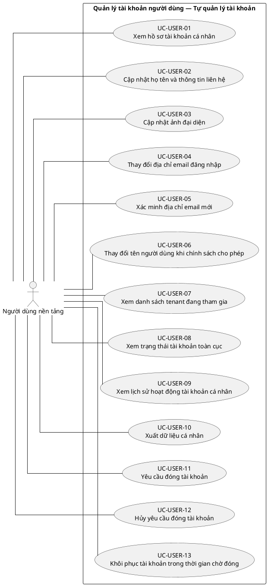
```plantuml
@startuml
left to right direction
skinparam linetype ortho
skinparam packageStyle rectangle
actor "Người dùng nền tảng" as A1
rectangle "Quản lý tài khoản người dùng — Tự quản lý tài khoản" {
  usecase "UC-USER-01\nXem hồ sơ tài khoản cá nhân" as UUC_USER_01
  usecase "UC-USER-02\nCập nhật họ tên và thông tin liên hệ" as UUC_USER_02
  usecase "UC-USER-03\nCập nhật ảnh đại diện" as UUC_USER_03
  usecase "UC-USER-04\nThay đổi địa chỉ email đăng nhập" as UUC_USER_04
  usecase "UC-USER-05\nXác minh địa chỉ email mới" as UUC_USER_05
  usecase "UC-USER-06\nThay đổi tên người dùng khi chính sách cho phép" as UUC_USER_06
  usecase "UC-USER-07\nXem danh sách tenant đang tham gia" as UUC_USER_07
  usecase "UC-USER-08\nXem trạng thái tài khoản toàn cục" as UUC_USER_08
  usecase "UC-USER-09\nXem lịch sử hoạt động tài khoản cá nhân" as UUC_USER_09
  usecase "UC-USER-10\nXuất dữ liệu cá nhân" as UUC_USER_10
  usecase "UC-USER-11\nYêu cầu đóng tài khoản" as UUC_USER_11
  usecase "UC-USER-12\nHủy yêu cầu đóng tài khoản" as UUC_USER_12
  usecase "UC-USER-13\nKhôi phục tài khoản trong thời gian chờ đóng" as UUC_USER_13
}
A1 -- UUC_USER_01
A1 -- UUC_USER_02
A1 -- UUC_USER_03
A1 -- UUC_USER_04
A1 -- UUC_USER_05
A1 -- UUC_USER_06
A1 -- UUC_USER_07
A1 -- UUC_USER_08
A1 -- UUC_USER_09
A1 -- UUC_USER_10
A1 -- UUC_USER_11
A1 -- UUC_USER_12
A1 -- UUC_USER_13
@enduml
```

### 14.3. Quản trị vòng đời tài khoản

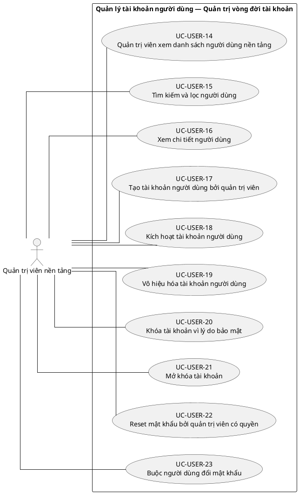
```plantuml
@startuml
left to right direction
skinparam linetype ortho
skinparam packageStyle rectangle
actor "Quản trị viên nền tảng" as A1
rectangle "Quản lý tài khoản người dùng — Quản trị vòng đời tài khoản" {
  usecase "UC-USER-14\nQuản trị viên xem danh sách người dùng nền tảng" as UUC_USER_14
  usecase "UC-USER-15\nTìm kiếm và lọc người dùng" as UUC_USER_15
  usecase "UC-USER-16\nXem chi tiết người dùng" as UUC_USER_16
  usecase "UC-USER-17\nTạo tài khoản người dùng bởi quản trị viên" as UUC_USER_17
  usecase "UC-USER-18\nKích hoạt tài khoản người dùng" as UUC_USER_18
  usecase "UC-USER-19\nVô hiệu hóa tài khoản người dùng" as UUC_USER_19
  usecase "UC-USER-20\nKhóa tài khoản vì lý do bảo mật" as UUC_USER_20
  usecase "UC-USER-21\nMở khóa tài khoản" as UUC_USER_21
  usecase "UC-USER-22\nReset mật khẩu bởi quản trị viên có quyền" as UUC_USER_22
  usecase "UC-USER-23\nBuộc người dùng đổi mật khẩu" as UUC_USER_23
}
A1 -- UUC_USER_14
A1 -- UUC_USER_15
A1 -- UUC_USER_16
A1 -- UUC_USER_17
A1 -- UUC_USER_18
A1 -- UUC_USER_19
A1 -- UUC_USER_20
A1 -- UUC_USER_21
A1 -- UUC_USER_22
A1 -- UUC_USER_23
@enduml
```

### 14.4. Danh tính liên kết, dữ liệu cá nhân và quyền cấp nền tảng

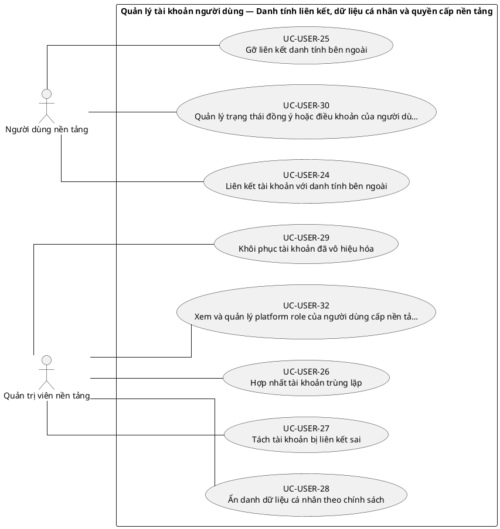
```plantuml
@startuml
left to right direction
skinparam linetype ortho
skinparam packageStyle rectangle
actor "Người dùng nền tảng" as A1
actor "Quản trị viên nền tảng" as A2
rectangle "Quản lý tài khoản người dùng — Danh tính liên kết, dữ liệu cá nhân và quyền cấp nền tảng" {
  usecase "UC-USER-24\nLiên kết tài khoản với danh tính bên ngoài" as UUC_USER_24
  usecase "UC-USER-25\nGỡ liên kết danh tính bên ngoài" as UUC_USER_25
  usecase "UC-USER-26\nHợp nhất tài khoản trùng lặp" as UUC_USER_26
  usecase "UC-USER-27\nTách tài khoản bị liên kết sai" as UUC_USER_27
  usecase "UC-USER-28\nẨn danh dữ liệu cá nhân theo chính sách" as UUC_USER_28
  usecase "UC-USER-29\nKhôi phục tài khoản đã vô hiệu hóa" as UUC_USER_29
  usecase "UC-USER-30\nQuản lý trạng thái đồng ý hoặc điều khoản của người dù…" as UUC_USER_30
  usecase "UC-USER-32\nXem và quản lý platform role của người dùng cấp nền tả…" as UUC_USER_32
}
A1 -- UUC_USER_24
A1 -- UUC_USER_25
A2 -- UUC_USER_26
A2 -- UUC_USER_27
A2 -- UUC_USER_28
A2 -- UUC_USER_29
A1 -- UUC_USER_30
A2 -- UUC_USER_32
@enduml
```

**Quy tắc/yêu cầu áp dụng cho luồng này:**
- `REQ-USER-31` — Xử lý người dùng không còn membership nào
- `REQ-USER-33` — Ghi audit thay đổi tài khoản nhạy cảm


---

# UC-RBAC — Quản lý vai trò và phân quyền

## 1. Thông tin tài liệu

| Thuộc tính | Nội dung |
|---|---|
| Mã nhóm Use Case | `UC-RBAC` |
| Tên | Quản lý vai trò và phân quyền |
| Miền nghiệp vụ | Danh tính và truy cập |
| Mức ưu tiên phát triển | Nền tảng bắt buộc |
| Phạm vi | Toàn bộ sản phẩm Operations Hub |
| Mô hình | SaaS đa tổ chức, dữ liệu và cấu hình theo tenant |
| Trạng thái đặc tả | Baseline V3; phân biệt Use Case mục tiêu, include, extend và yêu cầu hệ thống |

> **Nguyên tắc phạm vi:** tài liệu mô tả năng lực của phiên bản sản phẩm hoàn chỉnh. Mức ưu tiên phát triển không đồng nghĩa với loại bỏ khỏi phạm vi sản phẩm.

## 2. Mục tiêu

Cấu hình role, permission và phạm vi quyền theo tenant, membership, đơn vị và tài nguyên.

## 3. Actor

| Mã actor | Actor | Phạm vi |
|---|---|---|
| `ACT-TENANT-ADMIN` | Quản trị viên tenant | Tenant hoặc tích hợp |
| `ACT-TENANT-OWNER` | Chủ sở hữu tenant | Tenant hoặc tích hợp |
| `ACT-UNIT-ADMIN` | Quản trị viên đơn vị trực thuộc | Tenant hoặc tích hợp |
| `ACT-PLATFORM-ADMIN` | Quản trị viên nền tảng | Cấp nền tảng |

Actor trong sơ đồ chỉ thể hiện vai trò tương tác. Quyền thực tế phải được kiểm tra tại backend dựa trên tenant context, membership, role, permission, organization unit, trạng thái module và trạng thái tenant.

## 4. Điều kiện trước

- Tenant đang ở trạng thái cho phép quản trị.
- Người thao tác có quyền quản trị role hoặc permission trong phạm vi được ủy quyền.

## 5. Điều kiện sau

- Quyền hiệu lực được tính từ membership và các role đang hoạt động.
- Thay đổi role/permission được ghi audit và không vượt ranh giới tenant.

## 6. Danh mục phần tử nghiệp vụ và phân loại UML

> **Thay đổi của V3:** Không coi toàn bộ danh mục chức năng là Use Case độc lập. Chỉ phần tử có mục tiêu quan sát được đối với actor được giữ mã `UC-*`. Hành vi bắt buộc dùng chung dùng mã `INC-*`; luồng điều kiện dùng mã `EXT-*`; quy tắc hoặc xử lý xuyên suốt dùng mã `REQ-*`. Mã V2 được giữ để truy vết.

> Actor chỉ nối trực tiếp với `UC-*` hoặc `EXT-*` mà actor thực sự khởi phát/tham gia. `INC-*` được nối bằng `<<include>>`; `REQ-*` không được vẽ như Use Case.

| Mã V3 | Mã V2 | Phần tử nghiệp vụ | Loại mô hình | Actor trực tiếp / nguồn kích hoạt | Quan hệ |
|---|---|---|---|---|---|
| `UC-RBAC-01` | `UC-RBAC-01` | Xem danh mục permission của nền tảng | Use Case mục tiêu actor | `ACT-PLATFORM-ADMIN` — Quản trị viên nền tảng | Association trực tiếp với actor |
| `UC-RBAC-02` | `UC-RBAC-02` | Xem role mặc định của tenant | Use Case mục tiêu actor | `ACT-TENANT-ADMIN` — Quản trị viên tenant | Association trực tiếp với actor |
| `UC-RBAC-03` | `UC-RBAC-03` | Xem chi tiết role | Use Case mục tiêu actor | `ACT-TENANT-ADMIN` — Quản trị viên tenant | Association trực tiếp với actor |
| `UC-RBAC-04` | `UC-RBAC-04` | Tạo role tùy chỉnh | Use Case mục tiêu actor | `ACT-TENANT-ADMIN` — Quản trị viên tenant | Association trực tiếp với actor |
| `UC-RBAC-05` | `UC-RBAC-05` | Sao chép role | Use Case mục tiêu actor | `ACT-TENANT-ADMIN` — Quản trị viên tenant | Association trực tiếp với actor |
| `UC-RBAC-06` | `UC-RBAC-06` | Cập nhật tên và mô tả role | Use Case mục tiêu actor | `ACT-TENANT-ADMIN` — Quản trị viên tenant | Association trực tiếp với actor |
| `UC-RBAC-07` | `UC-RBAC-07` | Kích hoạt role | Use Case mục tiêu actor | `ACT-TENANT-ADMIN` — Quản trị viên tenant | Association trực tiếp với actor |
| `UC-RBAC-08` | `UC-RBAC-08` | Vô hiệu hóa role | Use Case mục tiêu actor | `ACT-TENANT-ADMIN` — Quản trị viên tenant | Association trực tiếp với actor |
| `UC-RBAC-09` | `UC-RBAC-09` | Lưu trữ role | Use Case mục tiêu actor | `ACT-TENANT-ADMIN` — Quản trị viên tenant | Association trực tiếp với actor |
| `UC-RBAC-10` | `UC-RBAC-10` | Xóa role chưa được sử dụng | Use Case mục tiêu actor | `ACT-TENANT-ADMIN` — Quản trị viên tenant | Association trực tiếp với actor |
| `UC-RBAC-11` | `UC-RBAC-11` | Gán permission cho role | Use Case mục tiêu actor | `ACT-TENANT-ADMIN` — Quản trị viên tenant | Association trực tiếp với actor |
| `UC-RBAC-12` | `UC-RBAC-12` | Thu hồi permission khỏi role | Use Case mục tiêu actor | `ACT-TENANT-ADMIN` — Quản trị viên tenant | Association trực tiếp với actor |
| `UC-RBAC-13` | `UC-RBAC-13` | Gán nhiều permission theo nhóm | Use Case mục tiêu actor | `ACT-TENANT-ADMIN` — Quản trị viên tenant | Association trực tiếp với actor |
| `UC-RBAC-14` | `UC-RBAC-14` | So sánh hai role | Use Case mục tiêu actor | `ACT-TENANT-ADMIN` — Quản trị viên tenant | Association trực tiếp với actor |
| `UC-RBAC-15` | `UC-RBAC-15` | Xuất ma trận role và permission | Use Case mục tiêu actor | `ACT-TENANT-ADMIN` — Quản trị viên tenant<br>`ACT-TENANT-OWNER` — Chủ sở hữu tenant | Association trực tiếp với actor |
| `UC-RBAC-16` | `UC-RBAC-16` | Nhập ma trận role và permission | Use Case mục tiêu actor | `ACT-TENANT-ADMIN` — Quản trị viên tenant<br>`ACT-TENANT-OWNER` — Chủ sở hữu tenant | Association trực tiếp với actor |
| `UC-RBAC-17` | `UC-RBAC-17` | Gán role cho membership | Use Case mục tiêu actor | `ACT-TENANT-ADMIN` — Quản trị viên tenant | Association trực tiếp với actor |
| `UC-RBAC-18` | `UC-RBAC-18` | Thu hồi role khỏi membership | Use Case mục tiêu actor | `ACT-TENANT-ADMIN` — Quản trị viên tenant | Association trực tiếp với actor |
| `UC-RBAC-19` | `UC-RBAC-19` | Gán role hàng loạt | Use Case mục tiêu actor | `ACT-TENANT-ADMIN` — Quản trị viên tenant | Association trực tiếp với actor |
| `UC-RBAC-20` | `UC-RBAC-20` | Gán role có thời hạn | Use Case mục tiêu actor | `ACT-TENANT-ADMIN` — Quản trị viên tenant | Association trực tiếp với actor |
| `UC-RBAC-21` | `UC-RBAC-21` | Gia hạn role có thời hạn | Use Case mục tiêu actor | `ACT-TENANT-ADMIN` — Quản trị viên tenant | Association trực tiếp với actor |
| `UC-RBAC-22` | `UC-RBAC-22` | Gán role theo đơn vị trực thuộc | Use Case mục tiêu actor | `ACT-UNIT-ADMIN` — Quản trị viên đơn vị trực thuộc<br>`ACT-TENANT-ADMIN` — Quản trị viên tenant | Association trực tiếp với actor |
| `UC-RBAC-23` | `UC-RBAC-23` | Gán quyền theo phạm vi tài nguyên | Use Case mục tiêu actor | `ACT-TENANT-ADMIN` — Quản trị viên tenant | Association trực tiếp với actor |
| `UC-RBAC-24` | `UC-RBAC-24` | Cấu hình role kế thừa khi chính sách cho phép | Use Case mục tiêu actor | `ACT-TENANT-ADMIN` — Quản trị viên tenant | Association trực tiếp với actor |
| `UC-RBAC-25` | `UC-RBAC-25` | Cấu hình quy tắc từ chối hoặc ngoại lệ quyền | Use Case mục tiêu actor | `ACT-TENANT-ADMIN` — Quản trị viên tenant | Association trực tiếp với actor |
| `UC-RBAC-26` | `UC-RBAC-26` | Ủy quyền quản trị role trong phạm vi giới hạn | Use Case mục tiêu actor | `ACT-UNIT-ADMIN` — Quản trị viên đơn vị trực thuộc<br>`ACT-TENANT-ADMIN` — Quản trị viên tenant | Association trực tiếp với actor |
| `UC-RBAC-27` | `UC-RBAC-27` | Kiểm tra xung đột phân tách trách nhiệm | Use Case mục tiêu actor | `ACT-TENANT-ADMIN` — Quản trị viên tenant | Association trực tiếp với actor |
| `REQ-RBAC-28` | `UC-RBAC-28` | Ngăn người dùng tự nâng quyền | Quy tắc/yêu cầu hệ thống | Hệ thống/chính sách; không có association actor trực tiếp | Áp dụng như quy tắc/yêu cầu xuyên suốt; không nối actor trực tiếp |
| `UC-RBAC-29` | `UC-RBAC-29` | Mô phỏng quyền của membership | Use Case mục tiêu actor | `ACT-TENANT-ADMIN` — Quản trị viên tenant | Association trực tiếp với actor |
| `UC-RBAC-30` | `UC-RBAC-30` | Giải thích quyền hiệu lực | Use Case mục tiêu actor | `ACT-TENANT-ADMIN` — Quản trị viên tenant | Association trực tiếp với actor |
| `INC-RBAC-31` | `UC-RBAC-31` | Kiểm tra quyền đối với một hành động cụ thể | Hành vi dùng chung `<<include>>` | Hệ thống; được gọi từ Use Case cha | `UC-RBAC-30` `<<include>>` `INC-RBAC-31` |
| `UC-RBAC-32` | `UC-RBAC-32` | Rà soát quyền định kỳ | Use Case mục tiêu actor | `ACT-TENANT-ADMIN` — Quản trị viên tenant<br>`ACT-TENANT-OWNER` — Chủ sở hữu tenant | Association trực tiếp với actor |
| `UC-RBAC-33` | `UC-RBAC-33` | Xác nhận lại quyền truy cập | Use Case mục tiêu actor | `ACT-TENANT-ADMIN` — Quản trị viên tenant<br>`ACT-TENANT-OWNER` — Chủ sở hữu tenant | Association trực tiếp với actor |
| `UC-RBAC-34` | `UC-RBAC-34` | Thu hồi quyền không còn cần thiết | Use Case mục tiêu actor | `ACT-TENANT-ADMIN` — Quản trị viên tenant | Association trực tiếp với actor |
| `UC-RBAC-35` | `UC-RBAC-35` | Thiết lập quyền khẩn cấp có thời hạn | Use Case mục tiêu actor | `ACT-TENANT-OWNER` — Chủ sở hữu tenant | Association trực tiếp với actor |
| `UC-RBAC-36` | `UC-RBAC-36` | Kết thúc quyền khẩn cấp | Use Case mục tiêu actor | `ACT-TENANT-OWNER` — Chủ sở hữu tenant | Association trực tiếp với actor |
| `UC-RBAC-37` | `UC-RBAC-37` | Xem lịch sử thay đổi role và permission | Use Case mục tiêu actor | `ACT-TENANT-ADMIN` — Quản trị viên tenant<br>`ACT-TENANT-OWNER` — Chủ sở hữu tenant | Association trực tiếp với actor |
| `UC-RBAC-38` | `UC-RBAC-38` | Quản lý role cấp nền tảng tách biệt role tenant | Use Case mục tiêu actor | `ACT-PLATFORM-ADMIN` — Quản trị viên nền tảng | Association trực tiếp với actor |

## 7. Luồng nghiệp vụ chính

1. Tenant Admin tạo role tùy chỉnh.
2. Hệ thống kiểm tra mã role duy nhất trong tenant.
3. Tenant Admin chọn permission và phạm vi đơn vị/tài nguyên.
4. Hệ thống kiểm tra người thao tác có quyền ủy quyền các permission đã chọn.
5. Role được lưu và gán cho membership.
6. Khi thực hiện nghiệp vụ, hệ thống tính quyền hiệu lực theo tenant, membership, role, scope, module và trạng thái đối tượng.

## 8. Luồng thay thế và ngoại lệ

- Gán role của tenant A cho membership tenant B: từ chối.
- Thao tác làm mất Owner cuối cùng: từ chối.
- Người quản trị đơn vị gán role cấp Owner: từ chối.
- Role đang được dùng: chỉ cho vô hiệu hóa hoặc yêu cầu chuyển gán trước khi xóa.

## 9. Quy tắc nghiệp vụ cốt lõi

- Role tùy chỉnh chỉ thuộc một tenant và chỉ gán cho membership của tenant đó.
- Platform role không thay thế role nội bộ của tenant.
- Người dùng không được tự nâng quyền hoặc ủy quyền vượt quá phạm vi mình quản lý.
- Quyền xem, tạo, cập nhật, xóa, phê duyệt, xuất và quản trị là các permission độc lập.
- Ẩn nút trên frontend không thay thế kiểm tra permission tại backend.

## 10. Mô hình dữ liệu logic liên quan

| Thực thể | Vai trò |
|---|---|
| `Role` | Thực thể logic phục vụ UC-RBAC; thiết kế vật lý được xác định ở giai đoạn thiết kế dữ liệu. |
| `Permission` | Thực thể logic phục vụ UC-RBAC; thiết kế vật lý được xác định ở giai đoạn thiết kế dữ liệu. |
| `RolePermission` | Thực thể logic phục vụ UC-RBAC; thiết kế vật lý được xác định ở giai đoạn thiết kế dữ liệu. |
| `MembershipRole` | Thực thể logic phục vụ UC-RBAC; thiết kế vật lý được xác định ở giai đoạn thiết kế dữ liệu. |
| `AuthorizationScope` | Thực thể logic phục vụ UC-RBAC; thiết kế vật lý được xác định ở giai đoạn thiết kế dữ liệu. |
| `Delegation` | Thực thể logic phục vụ UC-RBAC; thiết kế vật lý được xác định ở giai đoạn thiết kế dữ liệu. |
| `AuditLog` | Thực thể logic phục vụ UC-RBAC; thiết kế vật lý được xác định ở giai đoạn thiết kế dữ liệu. |

Mọi thực thể nghiệp vụ phải xác định được tenant sở hữu, trừ thực thể được công bố rõ là dữ liệu cấp nền tảng. Quan hệ tham chiếu chéo tenant bị cấm nếu không có cơ chế liên tenant được đặc tả riêng.

## 11. Kiểm soát truy cập

Quyền hiệu lực được xác định theo công thức khái quát:

```text
Quyền hiệu lực
= Permission từ các Role đang hoạt động
∩ Tenant context hợp lệ
∩ Membership đang hoạt động
∩ Phạm vi Organization Unit
∩ Phạm vi tài nguyên
∩ Trạng thái Module
∩ Trạng thái Tenant
```

Các kiểm tra bắt buộc:

- Xác thực User trước khi truy cập chức năng không công khai.
- Đối chiếu tenant context với membership.
- Kiểm tra permission tại backend, không dựa vào trạng thái hiển thị của frontend.
- Giới hạn truy vấn, tệp, bản xuất, cache và tác vụ nền theo tenant.
- Ghi audit cho hành động quản trị hoặc thay đổi nghiệp vụ quan trọng.

## 12. Tiêu chí chấp nhận

| Mã | Tiêu chí | Phương pháp kiểm chứng |
|---|---|---|
| `AC-RBAC-01` | Không thể gán role khác tenant. | Functional / Integration / Security Test tùy nội dung |
| `AC-RBAC-02` | Gọi API trực tiếp ngoài quyền bị từ chối dù UI đã ẩn chức năng. | Functional / Integration / Security Test tùy nội dung |
| `AC-RBAC-03` | Quyền hợp nhất từ nhiều role vẫn bị giới hạn bởi tenant và scope. | Functional / Integration / Security Test tùy nội dung |
| `AC-RBAC-04` | Mọi thay đổi role/permission quan trọng có audit. | Functional / Integration / Security Test tùy nội dung |

## 13. Quan hệ với nhóm Use Case khác

[`UC-TENANT`](./01_UC-TENANT.md), [`UC-ORG`](./05_UC-ORG.md), [`UC-MEMBER`](./09_UC-MEMBER.md), [`UC-MODULE`](./07_UC-MODULE.md), [`UC-AUDIT`](./21_UC-AUDIT.md)

## 14. Use Case Diagram theo luồng nghiệp vụ

Các package/rectangle dưới đây chỉ là **ranh giới hệ thống hoặc miền nghiệp vụ**. Không tồn tại phần tử trung gian `PKG*`; actor liên kết trực tiếp với Use Case có mục tiêu nghiệp vụ. `INC-*` và `EXT-*` chỉ xuất hiện qua quan hệ UML tương ứng; `REQ-*` được trình bày ngoài sơ đồ.

### 14.1. Quy ước đọc sơ đồ

- `Actor -- UC-*`: actor trực tiếp thực hiện hoặc tham gia mục tiêu nghiệp vụ.
- `UC-* ..> INC-* : <<include>>`: hành vi bắt buộc được dùng lại.
- `EXT-* ..> UC-* : <<extend>>`: hành vi chỉ phát sinh trong điều kiện xác định.
- `REQ-*`: quy tắc/yêu cầu hệ thống, không phải Use Case và không nối actor.

### 14.2. Danh mục role và permission

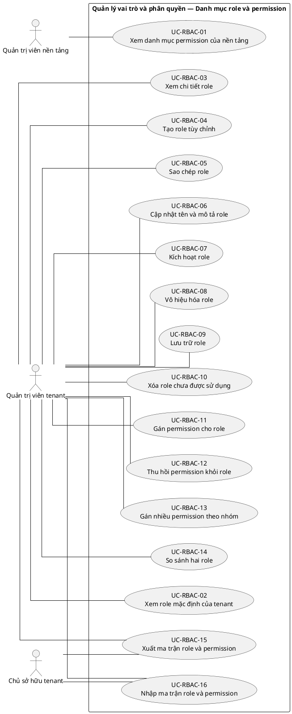
```plantuml
@startuml
left to right direction
skinparam linetype ortho
skinparam packageStyle rectangle
actor "Quản trị viên nền tảng" as A1
actor "Quản trị viên tenant" as A2
actor "Chủ sở hữu tenant" as A3
rectangle "Quản lý vai trò và phân quyền — Danh mục role và permission" {
  usecase "UC-RBAC-01\nXem danh mục permission của nền tảng" as UUC_RBAC_01
  usecase "UC-RBAC-02\nXem role mặc định của tenant" as UUC_RBAC_02
  usecase "UC-RBAC-03\nXem chi tiết role" as UUC_RBAC_03
  usecase "UC-RBAC-04\nTạo role tùy chỉnh" as UUC_RBAC_04
  usecase "UC-RBAC-05\nSao chép role" as UUC_RBAC_05
  usecase "UC-RBAC-06\nCập nhật tên và mô tả role" as UUC_RBAC_06
  usecase "UC-RBAC-07\nKích hoạt role" as UUC_RBAC_07
  usecase "UC-RBAC-08\nVô hiệu hóa role" as UUC_RBAC_08
  usecase "UC-RBAC-09\nLưu trữ role" as UUC_RBAC_09
  usecase "UC-RBAC-10\nXóa role chưa được sử dụng" as UUC_RBAC_10
  usecase "UC-RBAC-11\nGán permission cho role" as UUC_RBAC_11
  usecase "UC-RBAC-12\nThu hồi permission khỏi role" as UUC_RBAC_12
  usecase "UC-RBAC-13\nGán nhiều permission theo nhóm" as UUC_RBAC_13
  usecase "UC-RBAC-14\nSo sánh hai role" as UUC_RBAC_14
  usecase "UC-RBAC-15\nXuất ma trận role và permission" as UUC_RBAC_15
  usecase "UC-RBAC-16\nNhập ma trận role và permission" as UUC_RBAC_16
}
A1 -- UUC_RBAC_01
A2 -- UUC_RBAC_02
A2 -- UUC_RBAC_03
A2 -- UUC_RBAC_04
A2 -- UUC_RBAC_05
A2 -- UUC_RBAC_06
A2 -- UUC_RBAC_07
A2 -- UUC_RBAC_08
A2 -- UUC_RBAC_09
A2 -- UUC_RBAC_10
A2 -- UUC_RBAC_11
A2 -- UUC_RBAC_12
A2 -- UUC_RBAC_13
A2 -- UUC_RBAC_14
A2 -- UUC_RBAC_15
A3 -- UUC_RBAC_15
A2 -- UUC_RBAC_16
A3 -- UUC_RBAC_16
@enduml
```

### 14.3. Gán role, phạm vi và ủy quyền

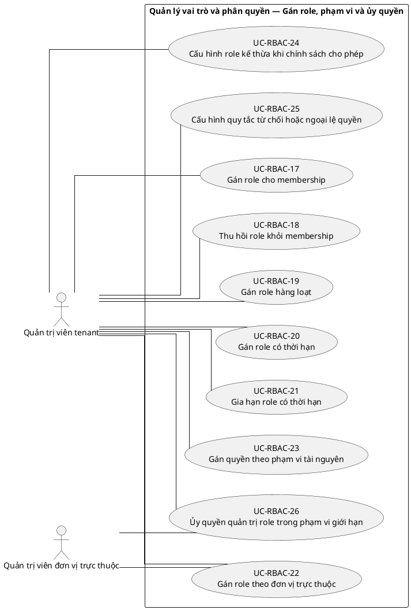
```plantuml
@startuml
left to right direction
skinparam linetype ortho
skinparam packageStyle rectangle
actor "Quản trị viên tenant" as A1
actor "Quản trị viên đơn vị trực thuộc" as A2
rectangle "Quản lý vai trò và phân quyền — Gán role, phạm vi và ủy quyền" {
  usecase "UC-RBAC-17\nGán role cho membership" as UUC_RBAC_17
  usecase "UC-RBAC-18\nThu hồi role khỏi membership" as UUC_RBAC_18
  usecase "UC-RBAC-19\nGán role hàng loạt" as UUC_RBAC_19
  usecase "UC-RBAC-20\nGán role có thời hạn" as UUC_RBAC_20
  usecase "UC-RBAC-21\nGia hạn role có thời hạn" as UUC_RBAC_21
  usecase "UC-RBAC-22\nGán role theo đơn vị trực thuộc" as UUC_RBAC_22
  usecase "UC-RBAC-23\nGán quyền theo phạm vi tài nguyên" as UUC_RBAC_23
  usecase "UC-RBAC-24\nCấu hình role kế thừa khi chính sách cho phép" as UUC_RBAC_24
  usecase "UC-RBAC-25\nCấu hình quy tắc từ chối hoặc ngoại lệ quyền" as UUC_RBAC_25
  usecase "UC-RBAC-26\nỦy quyền quản trị role trong phạm vi giới hạn" as UUC_RBAC_26
}
A1 -- UUC_RBAC_17
A1 -- UUC_RBAC_18
A1 -- UUC_RBAC_19
A1 -- UUC_RBAC_20
A1 -- UUC_RBAC_21
A2 -- UUC_RBAC_22
A1 -- UUC_RBAC_22
A1 -- UUC_RBAC_23
A1 -- UUC_RBAC_24
A1 -- UUC_RBAC_25
A2 -- UUC_RBAC_26
A1 -- UUC_RBAC_26
@enduml
```

### 14.4. Kiểm soát xung đột, rà soát và quyền đặc biệt

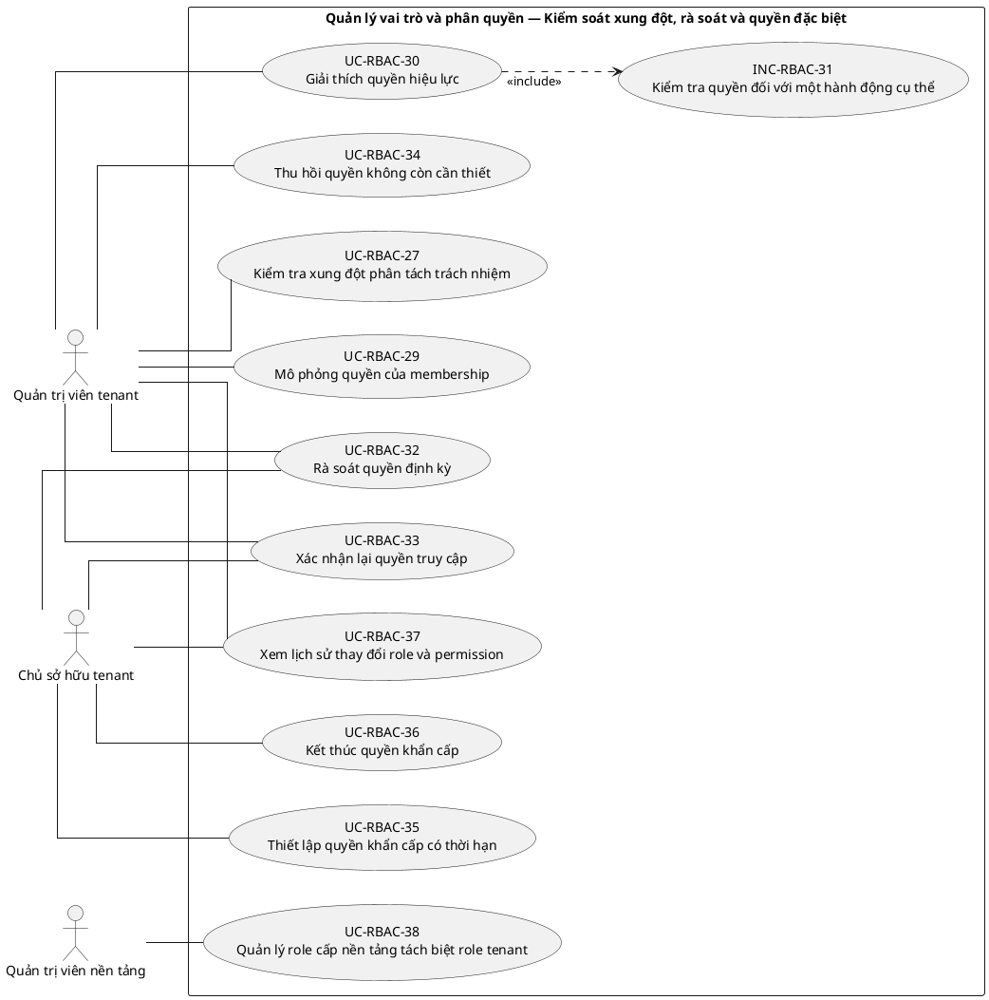
```plantuml
@startuml
left to right direction
skinparam linetype ortho
skinparam packageStyle rectangle
actor "Quản trị viên tenant" as A1
actor "Chủ sở hữu tenant" as A2
actor "Quản trị viên nền tảng" as A3
rectangle "Quản lý vai trò và phân quyền — Kiểm soát xung đột, rà soát và quyền đặc biệt" {
  usecase "UC-RBAC-27\nKiểm tra xung đột phân tách trách nhiệm" as UUC_RBAC_27
  usecase "UC-RBAC-29\nMô phỏng quyền của membership" as UUC_RBAC_29
  usecase "UC-RBAC-30\nGiải thích quyền hiệu lực" as UUC_RBAC_30
  usecase "INC-RBAC-31\nKiểm tra quyền đối với một hành động cụ thể" as UINC_RBAC_31
  usecase "UC-RBAC-32\nRà soát quyền định kỳ" as UUC_RBAC_32
  usecase "UC-RBAC-33\nXác nhận lại quyền truy cập" as UUC_RBAC_33
  usecase "UC-RBAC-34\nThu hồi quyền không còn cần thiết" as UUC_RBAC_34
  usecase "UC-RBAC-35\nThiết lập quyền khẩn cấp có thời hạn" as UUC_RBAC_35
  usecase "UC-RBAC-36\nKết thúc quyền khẩn cấp" as UUC_RBAC_36
  usecase "UC-RBAC-37\nXem lịch sử thay đổi role và permission" as UUC_RBAC_37
  usecase "UC-RBAC-38\nQuản lý role cấp nền tảng tách biệt role tenant" as UUC_RBAC_38
}
A1 -- UUC_RBAC_27
A1 -- UUC_RBAC_29
A1 -- UUC_RBAC_30
A1 -- UUC_RBAC_32
A2 -- UUC_RBAC_32
A1 -- UUC_RBAC_33
A2 -- UUC_RBAC_33
A1 -- UUC_RBAC_34
A2 -- UUC_RBAC_35
A2 -- UUC_RBAC_36
A1 -- UUC_RBAC_37
A2 -- UUC_RBAC_37
A3 -- UUC_RBAC_38
UUC_RBAC_30 ..> UINC_RBAC_31 : <<include>>
@enduml
```

**Quy tắc/yêu cầu áp dụng cho luồng này:**
- `REQ-RBAC-28` — Ngăn người dùng tự nâng quyền


---

# UC-ORG — Quản lý thông tin và cơ cấu tổ chức

## 1. Thông tin tài liệu

| Thuộc tính | Nội dung |
|---|---|
| Mã nhóm Use Case | `UC-ORG` |
| Tên | Quản lý thông tin và cơ cấu tổ chức |
| Miền nghiệp vụ | Quản trị tổ chức |
| Mức ưu tiên phát triển | Nền tảng bắt buộc |
| Phạm vi | Toàn bộ sản phẩm Operations Hub |
| Mô hình | SaaS đa tổ chức, dữ liệu và cấu hình theo tenant |
| Trạng thái đặc tả | Baseline V3; phân biệt Use Case mục tiêu, include, extend và yêu cầu hệ thống |

> **Nguyên tắc phạm vi:** tài liệu mô tả năng lực của phiên bản sản phẩm hoàn chỉnh. Mức ưu tiên phát triển không đồng nghĩa với loại bỏ khỏi phạm vi sản phẩm.

## 2. Mục tiêu

Quản lý hồ sơ tổ chức, đơn vị trực thuộc, chức danh và quan hệ phân cấp trong tenant.

## 3. Actor

| Mã actor | Actor | Phạm vi |
|---|---|---|
| `ACT-TENANT-ADMIN` | Quản trị viên tenant | Tenant hoặc tích hợp |
| `ACT-TENANT-OWNER` | Chủ sở hữu tenant | Tenant hoặc tích hợp |
| `ACT-UNIT-ADMIN` | Quản trị viên đơn vị trực thuộc | Tenant hoặc tích hợp |
| `ACT-ORG-REGISTRANT` | Người đăng ký tổ chức | Cấp nền tảng |

Actor trong sơ đồ chỉ thể hiện vai trò tương tác. Quyền thực tế phải được kiểm tra tại backend dựa trên tenant context, membership, role, permission, organization unit, trạng thái module và trạng thái tenant.

## 4. Điều kiện trước

- Tenant đã được khởi tạo.
- Người thao tác có permission quản trị hồ sơ hoặc cơ cấu tổ chức.

## 5. Điều kiện sau

- Cơ cấu tổ chức hợp lệ, không vòng lặp và không chứa quan hệ chéo tenant.
- Lịch sử thay đổi cơ cấu được duy trì.

## 6. Danh mục phần tử nghiệp vụ và phân loại UML

> **Thay đổi của V3:** Không coi toàn bộ danh mục chức năng là Use Case độc lập. Chỉ phần tử có mục tiêu quan sát được đối với actor được giữ mã `UC-*`. Hành vi bắt buộc dùng chung dùng mã `INC-*`; luồng điều kiện dùng mã `EXT-*`; quy tắc hoặc xử lý xuyên suốt dùng mã `REQ-*`. Mã V2 được giữ để truy vết.

> Actor chỉ nối trực tiếp với `UC-*` hoặc `EXT-*` mà actor thực sự khởi phát/tham gia. `INC-*` được nối bằng `<<include>>`; `REQ-*` không được vẽ như Use Case.

| Mã V3 | Mã V2 | Phần tử nghiệp vụ | Loại mô hình | Actor trực tiếp / nguồn kích hoạt | Quan hệ |
|---|---|---|---|---|---|
| `UC-ORG-01` | `UC-ORG-01` | Xem hồ sơ tổ chức | Use Case mục tiêu actor | `ACT-TENANT-OWNER` — Chủ sở hữu tenant<br>`ACT-TENANT-ADMIN` — Quản trị viên tenant | Association trực tiếp với actor |
| `UC-ORG-02` | `UC-ORG-02` | Cập nhật tên và mô tả tổ chức | Use Case mục tiêu actor | `ACT-TENANT-OWNER` — Chủ sở hữu tenant<br>`ACT-TENANT-ADMIN` — Quản trị viên tenant | Association trực tiếp với actor |
| `UC-ORG-03` | `UC-ORG-03` | Cập nhật thông tin liên hệ tổ chức | Use Case mục tiêu actor | `ACT-TENANT-OWNER` — Chủ sở hữu tenant<br>`ACT-TENANT-ADMIN` — Quản trị viên tenant | Association trực tiếp với actor |
| `UC-ORG-04` | `UC-ORG-04` | Cập nhật thông tin pháp lý hoặc định danh nội bộ | Use Case mục tiêu actor | `ACT-TENANT-OWNER` — Chủ sở hữu tenant<br>`ACT-TENANT-ADMIN` — Quản trị viên tenant | Association trực tiếp với actor |
| `UC-ORG-05` | `UC-ORG-05` | Quản lý trường dữ liệu mở rộng của tổ chức | Use Case mục tiêu actor | `ACT-TENANT-OWNER` — Chủ sở hữu tenant<br>`ACT-TENANT-ADMIN` — Quản trị viên tenant | Association trực tiếp với actor |
| `UC-ORG-06` | `UC-ORG-06` | Xem cơ cấu tổ chức hiện tại | Use Case mục tiêu actor | `ACT-UNIT-ADMIN` — Quản trị viên đơn vị trực thuộc<br>`ACT-TENANT-ADMIN` — Quản trị viên tenant | Association trực tiếp với actor |
| `UC-ORG-07` | `UC-ORG-07` | Xem cơ cấu tổ chức theo thời điểm lịch sử | Use Case mục tiêu actor | `ACT-UNIT-ADMIN` — Quản trị viên đơn vị trực thuộc<br>`ACT-TENANT-ADMIN` — Quản trị viên tenant | Association trực tiếp với actor |
| `UC-ORG-08` | `UC-ORG-08` | Tạo đơn vị trực thuộc | Use Case mục tiêu actor | `ACT-UNIT-ADMIN` — Quản trị viên đơn vị trực thuộc<br>`ACT-TENANT-ADMIN` — Quản trị viên tenant | Association trực tiếp với actor |
| `UC-ORG-09` | `UC-ORG-09` | Cập nhật đơn vị trực thuộc | Use Case mục tiêu actor | `ACT-UNIT-ADMIN` — Quản trị viên đơn vị trực thuộc<br>`ACT-TENANT-ADMIN` — Quản trị viên tenant | Association trực tiếp với actor |
| `UC-ORG-10` | `UC-ORG-10` | Sắp xếp thứ tự đơn vị | Use Case mục tiêu actor | `ACT-UNIT-ADMIN` — Quản trị viên đơn vị trực thuộc<br>`ACT-TENANT-ADMIN` — Quản trị viên tenant | Association trực tiếp với actor |
| `UC-ORG-11` | `UC-ORG-11` | Di chuyển đơn vị trong cơ cấu | Use Case mục tiêu actor | `ACT-UNIT-ADMIN` — Quản trị viên đơn vị trực thuộc<br>`ACT-TENANT-ADMIN` — Quản trị viên tenant | Association trực tiếp với actor |
| `UC-ORG-12` | `UC-ORG-12` | Thiết lập đơn vị cha hoặc con | Use Case mục tiêu actor | `ACT-UNIT-ADMIN` — Quản trị viên đơn vị trực thuộc<br>`ACT-TENANT-ADMIN` — Quản trị viên tenant | Association trực tiếp với actor |
| `INC-ORG-13` | `UC-ORG-13` | Kiểm tra và ngăn quan hệ vòng lặp | Hành vi dùng chung `<<include>>` | Hệ thống; được gọi từ Use Case cha | `UC-ORG-12` `<<include>>` `INC-ORG-13` |
| `UC-ORG-14` | `UC-ORG-14` | Vô hiệu hóa đơn vị | Use Case mục tiêu actor | `ACT-UNIT-ADMIN` — Quản trị viên đơn vị trực thuộc<br>`ACT-TENANT-ADMIN` — Quản trị viên tenant | Association trực tiếp với actor |
| `EXT-ORG-15` | `UC-ORG-15` | Kích hoạt lại đơn vị | Luồng điều kiện `<<extend>>` | `ACT-UNIT-ADMIN` — Quản trị viên đơn vị trực thuộc<br>`ACT-TENANT-ADMIN` — Quản trị viên tenant | `EXT-ORG-15` `<<extend>>` `UC-ORG-14` |
| `UC-ORG-16` | `UC-ORG-16` | Lưu trữ đơn vị | Use Case mục tiêu actor | `ACT-UNIT-ADMIN` — Quản trị viên đơn vị trực thuộc<br>`ACT-TENANT-ADMIN` — Quản trị viên tenant | Association trực tiếp với actor |
| `UC-ORG-17` | `UC-ORG-17` | Chuyển dữ liệu trước khi đóng đơn vị | Use Case mục tiêu actor | `ACT-UNIT-ADMIN` — Quản trị viên đơn vị trực thuộc<br>`ACT-TENANT-ADMIN` — Quản trị viên tenant | Association trực tiếp với actor |
| `UC-ORG-18` | `UC-ORG-18` | Hợp nhất đơn vị | Use Case mục tiêu actor | `ACT-UNIT-ADMIN` — Quản trị viên đơn vị trực thuộc<br>`ACT-TENANT-ADMIN` — Quản trị viên tenant | Association trực tiếp với actor |
| `UC-ORG-19` | `UC-ORG-19` | Tách đơn vị | Use Case mục tiêu actor | `ACT-UNIT-ADMIN` — Quản trị viên đơn vị trực thuộc<br>`ACT-TENANT-ADMIN` — Quản trị viên tenant | Association trực tiếp với actor |
| `UC-ORG-20` | `UC-ORG-20` | Tạo loại đơn vị | Use Case mục tiêu actor | `ACT-TENANT-ADMIN` — Quản trị viên tenant | Association trực tiếp với actor |
| `UC-ORG-21` | `UC-ORG-21` | Quản lý chức vụ hoặc vị trí | Use Case mục tiêu actor | `ACT-UNIT-ADMIN` — Quản trị viên đơn vị trực thuộc<br>`ACT-TENANT-ADMIN` — Quản trị viên tenant | Association trực tiếp với actor |
| `UC-ORG-22` | `UC-ORG-22` | Tạo chức vụ | Use Case mục tiêu actor | `ACT-UNIT-ADMIN` — Quản trị viên đơn vị trực thuộc<br>`ACT-TENANT-ADMIN` — Quản trị viên tenant | Association trực tiếp với actor |
| `UC-ORG-23` | `UC-ORG-23` | Cập nhật chức vụ | Use Case mục tiêu actor | `ACT-UNIT-ADMIN` — Quản trị viên đơn vị trực thuộc<br>`ACT-TENANT-ADMIN` — Quản trị viên tenant | Association trực tiếp với actor |
| `UC-ORG-24` | `UC-ORG-24` | Vô hiệu hóa chức vụ | Use Case mục tiêu actor | `ACT-UNIT-ADMIN` — Quản trị viên đơn vị trực thuộc<br>`ACT-TENANT-ADMIN` — Quản trị viên tenant | Association trực tiếp với actor |
| `UC-ORG-25` | `UC-ORG-25` | Gán người quản lý đơn vị | Use Case mục tiêu actor | `ACT-UNIT-ADMIN` — Quản trị viên đơn vị trực thuộc<br>`ACT-TENANT-ADMIN` — Quản trị viên tenant | Association trực tiếp với actor |
| `UC-ORG-26` | `UC-ORG-26` | Kết thúc nhiệm kỳ người quản lý đơn vị | Use Case mục tiêu actor | `ACT-UNIT-ADMIN` — Quản trị viên đơn vị trực thuộc<br>`ACT-TENANT-ADMIN` — Quản trị viên tenant | Association trực tiếp với actor |
| `UC-ORG-27` | `UC-ORG-27` | Quản lý nhiệm kỳ tổ chức | Use Case mục tiêu actor | `ACT-TENANT-OWNER` — Chủ sở hữu tenant<br>`ACT-TENANT-ADMIN` — Quản trị viên tenant | Association trực tiếp với actor |
| `UC-ORG-28` | `UC-ORG-28` | Quản lý năm học hoặc kỳ hoạt động | Use Case mục tiêu actor | `ACT-TENANT-OWNER` — Chủ sở hữu tenant<br>`ACT-TENANT-ADMIN` — Quản trị viên tenant | Association trực tiếp với actor |
| `UC-ORG-29` | `UC-ORG-29` | Nhập cơ cấu tổ chức | Use Case mục tiêu actor | `ACT-TENANT-ADMIN` — Quản trị viên tenant | Association trực tiếp với actor |
| `UC-ORG-30` | `UC-ORG-30` | Xuất cơ cấu tổ chức | Use Case mục tiêu actor | `ACT-TENANT-ADMIN` — Quản trị viên tenant | Association trực tiếp với actor |
| `UC-ORG-31` | `UC-ORG-31` | Sao chép cấu trúc từ mẫu nền tảng | Use Case mục tiêu actor | `ACT-TENANT-ADMIN` — Quản trị viên tenant | Association trực tiếp với actor |
| `UC-ORG-32` | `UC-ORG-32` | Cấu hình quy tắc đặt mã đơn vị | Use Case mục tiêu actor | `ACT-TENANT-ADMIN` — Quản trị viên tenant | Association trực tiếp với actor |
| `UC-ORG-33` | `UC-ORG-33` | Xem lịch sử thay đổi cơ cấu | Use Case mục tiêu actor | `ACT-TENANT-ADMIN` — Quản trị viên tenant | Association trực tiếp với actor |
| `INC-ORG-34` | `UC-ORG-34` | Kiểm tra tính toàn vẹn cơ cấu tổ chức | Hành vi dùng chung `<<include>>` | Hệ thống; được gọi từ Use Case cha | `UC-ORG-33` `<<include>>` `INC-ORG-34` |

## 7. Luồng nghiệp vụ chính

1. Tenant Admin tạo đơn vị mới trong tenant.
2. Hệ thống kiểm tra mã đơn vị duy nhất theo tenant và đơn vị cha hợp lệ.
3. Hệ thống kiểm tra quan hệ không gây vòng lặp.
4. Đơn vị được lưu và xuất hiện trong cây cơ cấu.
5. Tenant Admin gán membership hoặc người phụ trách theo quyền.
6. Mọi thay đổi được ghi lịch sử và audit.

## 8. Luồng thay thế và ngoại lệ

- Đơn vị cha thuộc tenant khác: từ chối.
- Quan hệ mới tạo vòng lặp: từ chối.
- Vô hiệu hóa đơn vị còn dữ liệu hoạt động: yêu cầu chuyển hoặc kết thúc quan hệ.

## 9. Quy tắc nghiệp vụ cốt lõi

- Mỗi đơn vị thuộc duy nhất một tenant.
- Đơn vị cha và con phải thuộc cùng tenant.
- Cơ cấu không được tạo vòng lặp.
- Đơn vị có dữ liệu liên quan không được xóa vật lý trực tiếp.
- Tên ban và chức danh riêng của MTEC không được mã hóa thành bắt buộc của nền tảng.

## 10. Mô hình dữ liệu logic liên quan

| Thực thể | Vai trò |
|---|---|
| `OrganizationProfile` | Thực thể logic phục vụ UC-ORG; thiết kế vật lý được xác định ở giai đoạn thiết kế dữ liệu. |
| `OrganizationUnit` | Thực thể logic phục vụ UC-ORG; thiết kế vật lý được xác định ở giai đoạn thiết kế dữ liệu. |
| `Position` | Thực thể logic phục vụ UC-ORG; thiết kế vật lý được xác định ở giai đoạn thiết kế dữ liệu. |
| `UnitMembership` | Thực thể logic phục vụ UC-ORG; thiết kế vật lý được xác định ở giai đoạn thiết kế dữ liệu. |
| `UnitManager` | Thực thể logic phục vụ UC-ORG; thiết kế vật lý được xác định ở giai đoạn thiết kế dữ liệu. |
| `OrganizationHistory` | Thực thể logic phục vụ UC-ORG; thiết kế vật lý được xác định ở giai đoạn thiết kế dữ liệu. |
| `AuditLog` | Thực thể logic phục vụ UC-ORG; thiết kế vật lý được xác định ở giai đoạn thiết kế dữ liệu. |

Mọi thực thể nghiệp vụ phải xác định được tenant sở hữu, trừ thực thể được công bố rõ là dữ liệu cấp nền tảng. Quan hệ tham chiếu chéo tenant bị cấm nếu không có cơ chế liên tenant được đặc tả riêng.

## 11. Kiểm soát truy cập

Quyền hiệu lực được xác định theo công thức khái quát:

```text
Quyền hiệu lực
= Permission từ các Role đang hoạt động
∩ Tenant context hợp lệ
∩ Membership đang hoạt động
∩ Phạm vi Organization Unit
∩ Phạm vi tài nguyên
∩ Trạng thái Module
∩ Trạng thái Tenant
```

Các kiểm tra bắt buộc:

- Xác thực User trước khi truy cập chức năng không công khai.
- Đối chiếu tenant context với membership.
- Kiểm tra permission tại backend, không dựa vào trạng thái hiển thị của frontend.
- Giới hạn truy vấn, tệp, bản xuất, cache và tác vụ nền theo tenant.
- Ghi audit cho hành động quản trị hoặc thay đổi nghiệp vụ quan trọng.

## 12. Tiêu chí chấp nhận

| Mã | Tiêu chí | Phương pháp kiểm chứng |
|---|---|---|
| `AC-ORG-01` | Không tạo được vòng lặp trong cây tổ chức. | Functional / Integration / Security Test tùy nội dung |
| `AC-ORG-02` | Không thể liên kết đơn vị hoặc membership khác tenant. | Functional / Integration / Security Test tùy nội dung |
| `AC-ORG-03` | Vô hiệu hóa đơn vị không làm mất lịch sử nghiệp vụ. | Functional / Integration / Security Test tùy nội dung |
| `AC-ORG-04` | Tenant mới có thể cấu hình cơ cấu mà không phụ thuộc tên gọi của MTEC. | Functional / Integration / Security Test tùy nội dung |

## 13. Quan hệ với nhóm Use Case khác

[`UC-TENANT`](./01_UC-TENANT.md), [`UC-MEMBER`](./09_UC-MEMBER.md), [`UC-RBAC`](./04_UC-RBAC.md), [`UC-AUDIT`](./21_UC-AUDIT.md)

## 14. Use Case Diagram theo luồng nghiệp vụ

Các package/rectangle dưới đây chỉ là **ranh giới hệ thống hoặc miền nghiệp vụ**. Không tồn tại phần tử trung gian `PKG*`; actor liên kết trực tiếp với Use Case có mục tiêu nghiệp vụ. `INC-*` và `EXT-*` chỉ xuất hiện qua quan hệ UML tương ứng; `REQ-*` được trình bày ngoài sơ đồ.

### 14.1. Quy ước đọc sơ đồ

- `Actor -- UC-*`: actor trực tiếp thực hiện hoặc tham gia mục tiêu nghiệp vụ.
- `UC-* ..> INC-* : <<include>>`: hành vi bắt buộc được dùng lại.
- `EXT-* ..> UC-* : <<extend>>`: hành vi chỉ phát sinh trong điều kiện xác định.
- `REQ-*`: quy tắc/yêu cầu hệ thống, không phải Use Case và không nối actor.

### 14.2. Hồ sơ và góc nhìn cơ cấu tổ chức

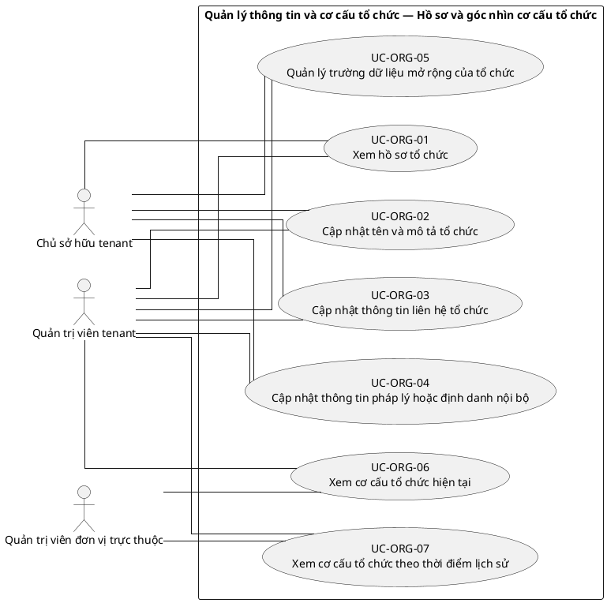
```plantuml
@startuml
left to right direction
skinparam linetype ortho
skinparam packageStyle rectangle
actor "Chủ sở hữu tenant" as A1
actor "Quản trị viên tenant" as A2
actor "Quản trị viên đơn vị trực thuộc" as A3
rectangle "Quản lý thông tin và cơ cấu tổ chức — Hồ sơ và góc nhìn cơ cấu tổ chức" {
  usecase "UC-ORG-01\nXem hồ sơ tổ chức" as UUC_ORG_01
  usecase "UC-ORG-02\nCập nhật tên và mô tả tổ chức" as UUC_ORG_02
  usecase "UC-ORG-03\nCập nhật thông tin liên hệ tổ chức" as UUC_ORG_03
  usecase "UC-ORG-04\nCập nhật thông tin pháp lý hoặc định danh nội bộ" as UUC_ORG_04
  usecase "UC-ORG-05\nQuản lý trường dữ liệu mở rộng của tổ chức" as UUC_ORG_05
  usecase "UC-ORG-06\nXem cơ cấu tổ chức hiện tại" as UUC_ORG_06
  usecase "UC-ORG-07\nXem cơ cấu tổ chức theo thời điểm lịch sử" as UUC_ORG_07
}
A1 -- UUC_ORG_01
A2 -- UUC_ORG_01
A1 -- UUC_ORG_02
A2 -- UUC_ORG_02
A1 -- UUC_ORG_03
A2 -- UUC_ORG_03
A1 -- UUC_ORG_04
A2 -- UUC_ORG_04
A1 -- UUC_ORG_05
A2 -- UUC_ORG_05
A3 -- UUC_ORG_06
A2 -- UUC_ORG_06
A3 -- UUC_ORG_07
A2 -- UUC_ORG_07
@enduml
```

### 14.3. Thiết lập và thay đổi cơ cấu

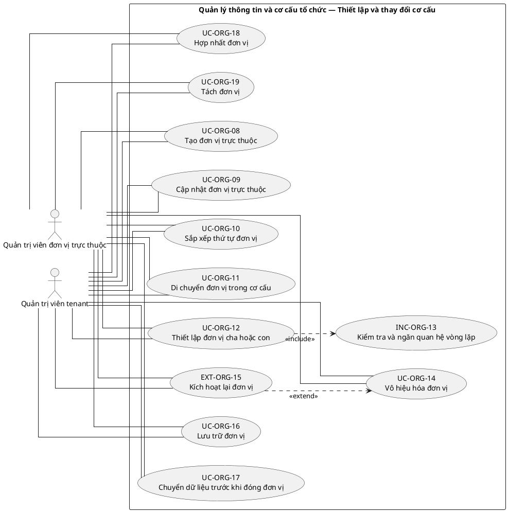
```plantuml
@startuml
left to right direction
skinparam linetype ortho
skinparam packageStyle rectangle
actor "Quản trị viên đơn vị trực thuộc" as A1
actor "Quản trị viên tenant" as A2
rectangle "Quản lý thông tin và cơ cấu tổ chức — Thiết lập và thay đổi cơ cấu" {
  usecase "UC-ORG-08\nTạo đơn vị trực thuộc" as UUC_ORG_08
  usecase "UC-ORG-09\nCập nhật đơn vị trực thuộc" as UUC_ORG_09
  usecase "UC-ORG-10\nSắp xếp thứ tự đơn vị" as UUC_ORG_10
  usecase "UC-ORG-11\nDi chuyển đơn vị trong cơ cấu" as UUC_ORG_11
  usecase "UC-ORG-12\nThiết lập đơn vị cha hoặc con" as UUC_ORG_12
  usecase "INC-ORG-13\nKiểm tra và ngăn quan hệ vòng lặp" as UINC_ORG_13
  usecase "UC-ORG-14\nVô hiệu hóa đơn vị" as UUC_ORG_14
  usecase "EXT-ORG-15\nKích hoạt lại đơn vị" as UEXT_ORG_15
  usecase "UC-ORG-16\nLưu trữ đơn vị" as UUC_ORG_16
  usecase "UC-ORG-17\nChuyển dữ liệu trước khi đóng đơn vị" as UUC_ORG_17
  usecase "UC-ORG-18\nHợp nhất đơn vị" as UUC_ORG_18
  usecase "UC-ORG-19\nTách đơn vị" as UUC_ORG_19
}
A1 -- UUC_ORG_08
A2 -- UUC_ORG_08
A1 -- UUC_ORG_09
A2 -- UUC_ORG_09
A1 -- UUC_ORG_10
A2 -- UUC_ORG_10
A1 -- UUC_ORG_11
A2 -- UUC_ORG_11
A1 -- UUC_ORG_12
A2 -- UUC_ORG_12
A1 -- UUC_ORG_14
A2 -- UUC_ORG_14
A1 -- UEXT_ORG_15
A2 -- UEXT_ORG_15
A1 -- UUC_ORG_16
A2 -- UUC_ORG_16
A1 -- UUC_ORG_17
A2 -- UUC_ORG_17
A1 -- UUC_ORG_18
A2 -- UUC_ORG_18
A1 -- UUC_ORG_19
A2 -- UUC_ORG_19
UUC_ORG_12 ..> UINC_ORG_13 : <<include>>
UEXT_ORG_15 ..> UUC_ORG_14 : <<extend>>
@enduml
```

### 14.4. Loại đơn vị, chức vụ và nhiệm kỳ

```plantuml
@startuml
left to right direction
skinparam linetype ortho
skinparam packageStyle rectangle
actor "Quản trị viên tenant" as A1
actor "Quản trị viên đơn vị trực thuộc" as A2
actor "Chủ sở hữu tenant" as A3
rectangle "Quản lý thông tin và cơ cấu tổ chức — Loại đơn vị, chức vụ và nhiệm kỳ" {
  usecase "UC-ORG-20\nTạo loại đơn vị" as UUC_ORG_20
  usecase "UC-ORG-21\nQuản lý chức vụ hoặc vị trí" as UUC_ORG_21
  usecase "UC-ORG-22\nTạo chức vụ" as UUC_ORG_22
  usecase "UC-ORG-23\nCập nhật chức vụ" as UUC_ORG_23
  usecase "UC-ORG-24\nVô hiệu hóa chức vụ" as UUC_ORG_24
  usecase "UC-ORG-25\nGán người quản lý đơn vị" as UUC_ORG_25
  usecase "UC-ORG-26\nKết thúc nhiệm kỳ người quản lý đơn vị" as UUC_ORG_26
  usecase "UC-ORG-27\nQuản lý nhiệm kỳ tổ chức" as UUC_ORG_27
  usecase "UC-ORG-28\nQuản lý năm học hoặc kỳ hoạt động" as UUC_ORG_28
}
A1 -- UUC_ORG_20
A2 -- UUC_ORG_21
A1 -- UUC_ORG_21
A2 -- UUC_ORG_22
A1 -- UUC_ORG_22
A2 -- UUC_ORG_23
A1 -- UUC_ORG_23
A2 -- UUC_ORG_24
A1 -- UUC_ORG_24
A2 -- UUC_ORG_25
A1 -- UUC_ORG_25
A2 -- UUC_ORG_26
A1 -- UUC_ORG_26
A3 -- UUC_ORG_27
A1 -- UUC_ORG_27
A3 -- UUC_ORG_28
A1 -- UUC_ORG_28
@enduml
```

### 14.5. Nhập xuất, mẫu và kiểm tra toàn vẹn

```plantuml
@startuml
left to right direction
skinparam linetype ortho
skinparam packageStyle rectangle
actor "Quản trị viên tenant" as A1
rectangle "Quản lý thông tin và cơ cấu tổ chức — Nhập xuất, mẫu và kiểm tra toàn vẹn" {
  usecase "UC-ORG-29\nNhập cơ cấu tổ chức" as UUC_ORG_29
  usecase "UC-ORG-30\nXuất cơ cấu tổ chức" as UUC_ORG_30
  usecase "UC-ORG-31\nSao chép cấu trúc từ mẫu nền tảng" as UUC_ORG_31
  usecase "UC-ORG-32\nCấu hình quy tắc đặt mã đơn vị" as UUC_ORG_32
  usecase "UC-ORG-33\nXem lịch sử thay đổi cơ cấu" as UUC_ORG_33
  usecase "INC-ORG-34\nKiểm tra tính toàn vẹn cơ cấu tổ chức" as UINC_ORG_34
}
A1 -- UUC_ORG_29
A1 -- UUC_ORG_30
A1 -- UUC_ORG_31
A1 -- UUC_ORG_32
A1 -- UUC_ORG_33
UUC_ORG_33 ..> UINC_ORG_34 : <<include>>
@enduml
```


---

# UC-BRAND — Quản lý branding và giao diện tổ chức

## 1. Thông tin tài liệu

| Thuộc tính | Nội dung |
|---|---|
| Mã nhóm Use Case | `UC-BRAND` |
| Tên | Quản lý branding và giao diện tổ chức |
| Miền nghiệp vụ | Quản trị tổ chức |
| Mức ưu tiên phát triển | Nền tảng bắt buộc |
| Phạm vi | Toàn bộ sản phẩm Operations Hub |
| Mô hình | SaaS đa tổ chức, dữ liệu và cấu hình theo tenant |
| Trạng thái đặc tả | Baseline V3; phân biệt Use Case mục tiêu, include, extend và yêu cầu hệ thống |

> **Nguyên tắc phạm vi:** tài liệu mô tả năng lực của phiên bản sản phẩm hoàn chỉnh. Mức ưu tiên phát triển không đồng nghĩa với loại bỏ khỏi phạm vi sản phẩm.

## 2. Mục tiêu

Cho phép mỗi tenant cấu hình nhận diện riêng mà không làm thay đổi quyền, logic nghiệp vụ hoặc khả năng sử dụng của nền tảng.

## 3. Actor

| Mã actor | Actor | Phạm vi |
|---|---|---|
| `ACT-TENANT-ADMIN` | Quản trị viên tenant | Tenant hoặc tích hợp |
| `ACT-TENANT-OWNER` | Chủ sở hữu tenant | Tenant hoặc tích hợp |
| `ACT-EXTERNAL-SERVICE` | Dịch vụ bên ngoài | Tenant hoặc tích hợp |

Actor trong sơ đồ chỉ thể hiện vai trò tương tác. Quyền thực tế phải được kiểm tra tại backend dựa trên tenant context, membership, role, permission, organization unit, trạng thái module và trạng thái tenant.

## 4. Điều kiện trước

- Tenant hợp lệ và đang cho phép quản trị.
- Người thao tác có permission quản lý branding.

## 5. Điều kiện sau

- Branding được áp dụng đúng tenant context.
- Tệp branding hợp lệ được lưu trữ và có thể truy vết phiên bản.

## 6. Danh mục phần tử nghiệp vụ và phân loại UML

> **Thay đổi của V3:** Không coi toàn bộ danh mục chức năng là Use Case độc lập. Chỉ phần tử có mục tiêu quan sát được đối với actor được giữ mã `UC-*`. Hành vi bắt buộc dùng chung dùng mã `INC-*`; luồng điều kiện dùng mã `EXT-*`; quy tắc hoặc xử lý xuyên suốt dùng mã `REQ-*`. Mã V2 được giữ để truy vết.

> Actor chỉ nối trực tiếp với `UC-*` hoặc `EXT-*` mà actor thực sự khởi phát/tham gia. `INC-*` được nối bằng `<<include>>`; `REQ-*` không được vẽ như Use Case.

| Mã V3 | Mã V2 | Phần tử nghiệp vụ | Loại mô hình | Actor trực tiếp / nguồn kích hoạt | Quan hệ |
|---|---|---|---|---|---|
| `UC-BRAND-01` | `UC-BRAND-01` | Xem cấu hình branding hiện hành | Use Case mục tiêu actor | `ACT-TENANT-ADMIN` — Quản trị viên tenant | Association trực tiếp với actor |
| `UC-BRAND-02` | `UC-BRAND-02` | Tạo bản nháp branding | Use Case mục tiêu actor | `ACT-TENANT-ADMIN` — Quản trị viên tenant | Association trực tiếp với actor |
| `UC-BRAND-03` | `UC-BRAND-03` | Cập nhật tên hiển thị tổ chức | Use Case mục tiêu actor | `ACT-TENANT-ADMIN` — Quản trị viên tenant | Association trực tiếp với actor |
| `UC-BRAND-04` | `UC-BRAND-04` | Tải lên logo chính | Use Case mục tiêu actor | `ACT-TENANT-ADMIN` — Quản trị viên tenant<br>`ACT-EXTERNAL-SERVICE` — Dịch vụ bên ngoài | Association trực tiếp với actor |
| `UC-BRAND-05` | `UC-BRAND-05` | Tải lên logo rút gọn | Use Case mục tiêu actor | `ACT-TENANT-ADMIN` — Quản trị viên tenant<br>`ACT-EXTERNAL-SERVICE` — Dịch vụ bên ngoài | Association trực tiếp với actor |
| `UC-BRAND-06` | `UC-BRAND-06` | Tải lên favicon hoặc biểu tượng ứng dụng | Use Case mục tiêu actor | `ACT-TENANT-ADMIN` — Quản trị viên tenant<br>`ACT-EXTERNAL-SERVICE` — Dịch vụ bên ngoài | Association trực tiếp với actor |
| `UC-BRAND-07` | `UC-BRAND-07` | Cấu hình màu chủ đạo | Use Case mục tiêu actor | `ACT-TENANT-ADMIN` — Quản trị viên tenant | Association trực tiếp với actor |
| `UC-BRAND-08` | `UC-BRAND-08` | Cấu hình bảng màu phụ | Use Case mục tiêu actor | `ACT-TENANT-ADMIN` — Quản trị viên tenant | Association trực tiếp với actor |
| `UC-BRAND-09` | `UC-BRAND-09` | Cấu hình kiểu chữ được hỗ trợ | Use Case mục tiêu actor | `ACT-TENANT-ADMIN` — Quản trị viên tenant | Association trực tiếp với actor |
| `UC-BRAND-10` | `UC-BRAND-10` | Cấu hình chế độ sáng và tối | Use Case mục tiêu actor | `ACT-TENANT-ADMIN` — Quản trị viên tenant | Association trực tiếp với actor |
| `UC-BRAND-11` | `UC-BRAND-11` | Cấu hình ảnh nền hoặc ảnh đăng nhập | Use Case mục tiêu actor | `ACT-TENANT-ADMIN` — Quản trị viên tenant | Association trực tiếp với actor |
| `UC-BRAND-12` | `UC-BRAND-12` | Cấu hình trang đăng nhập theo tenant | Use Case mục tiêu actor | `ACT-TENANT-ADMIN` — Quản trị viên tenant | Association trực tiếp với actor |
| `UC-BRAND-13` | `UC-BRAND-13` | Cấu hình nội dung chân trang và thông tin liên hệ | Use Case mục tiêu actor | `ACT-TENANT-ADMIN` — Quản trị viên tenant | Association trực tiếp với actor |
| `UC-BRAND-14` | `UC-BRAND-14` | Cấu hình thuật ngữ hiển thị theo tổ chức | Use Case mục tiêu actor | `ACT-TENANT-ADMIN` — Quản trị viên tenant | Association trực tiếp với actor |
| `UC-BRAND-15` | `UC-BRAND-15` | Cấu hình nhãn menu và tên mô-đun | Use Case mục tiêu actor | `ACT-TENANT-ADMIN` — Quản trị viên tenant | Association trực tiếp với actor |
| `UC-BRAND-16` | `UC-BRAND-16` | Cấu hình branding email | Use Case mục tiêu actor | `ACT-TENANT-ADMIN` — Quản trị viên tenant | Association trực tiếp với actor |
| `UC-BRAND-17` | `UC-BRAND-17` | Cấu hình branding thông báo | Use Case mục tiêu actor | `ACT-TENANT-ADMIN` — Quản trị viên tenant | Association trực tiếp với actor |
| `UC-BRAND-18` | `UC-BRAND-18` | Cấu hình branding tài liệu và bản xuất | Use Case mục tiêu actor | `ACT-TENANT-ADMIN` — Quản trị viên tenant | Association trực tiếp với actor |
| `UC-BRAND-19` | `UC-BRAND-19` | Quản lý thư viện tài sản thương hiệu | Use Case mục tiêu actor | `ACT-TENANT-ADMIN` — Quản trị viên tenant | Association trực tiếp với actor |
| `UC-BRAND-20` | `UC-BRAND-20` | Tải lên tài sản thương hiệu | Use Case mục tiêu actor | `ACT-TENANT-ADMIN` — Quản trị viên tenant<br>`ACT-EXTERNAL-SERVICE` — Dịch vụ bên ngoài | Association trực tiếp với actor |
| `UC-BRAND-21` | `UC-BRAND-21` | Thay thế tài sản thương hiệu | Use Case mục tiêu actor | `ACT-TENANT-ADMIN` — Quản trị viên tenant<br>`ACT-EXTERNAL-SERVICE` — Dịch vụ bên ngoài | Association trực tiếp với actor |
| `UC-BRAND-22` | `UC-BRAND-22` | Lưu trữ tài sản thương hiệu | Use Case mục tiêu actor | `ACT-TENANT-ADMIN` — Quản trị viên tenant | Association trực tiếp với actor |
| `INC-BRAND-23` | `UC-BRAND-23` | Kiểm tra loại và kích thước tệp branding | Hành vi dùng chung `<<include>>` | Hệ thống; được gọi từ Use Case cha | `UC-BRAND-22` `<<include>>` `INC-BRAND-23` |
| `INC-BRAND-24` | `UC-BRAND-24` | Kiểm tra độ tương phản và khả năng đọc | Hành vi dùng chung `<<include>>` | Hệ thống; được gọi từ Use Case cha | `UC-BRAND-22` `<<include>>` `INC-BRAND-24` |
| `UC-BRAND-25` | `UC-BRAND-25` | Xem trước branding | Use Case mục tiêu actor | `ACT-TENANT-ADMIN` — Quản trị viên tenant | Association trực tiếp với actor |
| `UC-BRAND-26` | `UC-BRAND-26` | Xuất bản branding | Use Case mục tiêu actor | `ACT-TENANT-ADMIN` — Quản trị viên tenant<br>`ACT-TENANT-OWNER` — Chủ sở hữu tenant | Association trực tiếp với actor |
| `UC-BRAND-27` | `UC-BRAND-27` | Lên lịch xuất bản branding | Use Case mục tiêu actor | `ACT-TENANT-ADMIN` — Quản trị viên tenant<br>`ACT-TENANT-OWNER` — Chủ sở hữu tenant | Association trực tiếp với actor |
| `EXT-BRAND-28` | `UC-BRAND-28` | Khôi phục phiên bản branding trước | Luồng điều kiện `<<extend>>` | `ACT-TENANT-ADMIN` — Quản trị viên tenant<br>`ACT-TENANT-OWNER` — Chủ sở hữu tenant | `EXT-BRAND-28` `<<extend>>` `UC-BRAND-27` |
| `UC-BRAND-29` | `UC-BRAND-29` | Xem lịch sử phiên bản branding | Use Case mục tiêu actor | `ACT-TENANT-ADMIN` — Quản trị viên tenant | Association trực tiếp với actor |
| `UC-BRAND-30` | `UC-BRAND-30` | Sao chép branding từ mẫu nền tảng | Use Case mục tiêu actor | `ACT-TENANT-ADMIN` — Quản trị viên tenant | Association trực tiếp với actor |
| `UC-BRAND-31` | `UC-BRAND-31` | Đặt lại branding về mặc định nền tảng | Use Case mục tiêu actor | `ACT-TENANT-ADMIN` — Quản trị viên tenant<br>`ACT-TENANT-OWNER` — Chủ sở hữu tenant | Association trực tiếp với actor |
| `UC-BRAND-32` | `UC-BRAND-32` | Cấu hình subdomain hiển thị thương hiệu | Use Case mục tiêu actor | `ACT-TENANT-OWNER` — Chủ sở hữu tenant | Association trực tiếp với actor |
| `UC-BRAND-33` | `UC-BRAND-33` | Cấu hình tên miền thương hiệu tùy chỉnh | Use Case mục tiêu actor | `ACT-TENANT-OWNER` — Chủ sở hữu tenant<br>`ACT-EXTERNAL-SERVICE` — Dịch vụ bên ngoài | Association trực tiếp với actor |
| `UC-BRAND-34` | `UC-BRAND-34` | Xác minh tên miền thương hiệu | Use Case mục tiêu actor | `ACT-TENANT-OWNER` — Chủ sở hữu tenant<br>`ACT-EXTERNAL-SERVICE` — Dịch vụ bên ngoài | Association trực tiếp với actor |
| `INC-BRAND-35` | `UC-BRAND-35` | Kiểm tra branding khi chuyển tenant context | Hành vi dùng chung `<<include>>` | Hệ thống; được gọi từ Use Case cha | `UC-BRAND-34` `<<include>>` `INC-BRAND-35` |

## 7. Luồng nghiệp vụ chính

1. Tenant Admin mở trang branding và tải cấu hình đang hiệu lực.
2. Người dùng chỉnh tên hiển thị, màu và tài sản hình ảnh.
3. Hệ thống kiểm tra định dạng, kích thước, tương phản và phạm vi giá trị.
4. Hệ thống tạo phiên bản nháp và cho phép xem trước.
5. Tenant Admin công bố phiên bản.
6. Các phiên giao diện tải branding theo tenant context; cache được làm mới có kiểm soát.

## 8. Luồng thay thế và ngoại lệ

- Tệp không hợp lệ hoặc có khả năng thực thi mã: từ chối.
- Màu không đạt ngưỡng khả năng đọc: cảnh báo hoặc từ chối theo chính sách.
- Tenant khác yêu cầu asset bằng định danh đoán được: từ chối.

## 9. Quy tắc nghiệp vụ cốt lõi

- Branding chỉ có hiệu lực trong tenant sở hữu cấu hình.
- Tenant chưa cấu hình riêng phải dùng mặc định nền tảng.
- Branding không được thay đổi permission, trạng thái hoặc logic nghiệp vụ.
- Màu và hình ảnh không được che khuất cảnh báo bắt buộc hoặc làm nội dung mất khả năng đọc.
- Tệp tải lên phải kiểm tra loại, kích thước và nội dung nguy hiểm.

## 10. Mô hình dữ liệu logic liên quan

| Thực thể | Vai trò |
|---|---|
| `BrandingConfiguration` | Thực thể logic phục vụ UC-BRAND; thiết kế vật lý được xác định ở giai đoạn thiết kế dữ liệu. |
| `BrandingVersion` | Thực thể logic phục vụ UC-BRAND; thiết kế vật lý được xác định ở giai đoạn thiết kế dữ liệu. |
| `BrandingAsset` | Thực thể logic phục vụ UC-BRAND; thiết kế vật lý được xác định ở giai đoạn thiết kế dữ liệu. |
| `ThemeToken` | Thực thể logic phục vụ UC-BRAND; thiết kế vật lý được xác định ở giai đoạn thiết kế dữ liệu. |
| `TenantConfiguration` | Thực thể logic phục vụ UC-BRAND; thiết kế vật lý được xác định ở giai đoạn thiết kế dữ liệu. |
| `AuditLog` | Thực thể logic phục vụ UC-BRAND; thiết kế vật lý được xác định ở giai đoạn thiết kế dữ liệu. |

Mọi thực thể nghiệp vụ phải xác định được tenant sở hữu, trừ thực thể được công bố rõ là dữ liệu cấp nền tảng. Quan hệ tham chiếu chéo tenant bị cấm nếu không có cơ chế liên tenant được đặc tả riêng.

## 11. Kiểm soát truy cập

Quyền hiệu lực được xác định theo công thức khái quát:

```text
Quyền hiệu lực
= Permission từ các Role đang hoạt động
∩ Tenant context hợp lệ
∩ Membership đang hoạt động
∩ Phạm vi Organization Unit
∩ Phạm vi tài nguyên
∩ Trạng thái Module
∩ Trạng thái Tenant
```

Các kiểm tra bắt buộc:

- Xác thực User trước khi truy cập chức năng không công khai.
- Đối chiếu tenant context với membership.
- Kiểm tra permission tại backend, không dựa vào trạng thái hiển thị của frontend.
- Giới hạn truy vấn, tệp, bản xuất, cache và tác vụ nền theo tenant.
- Ghi audit cho hành động quản trị hoặc thay đổi nghiệp vụ quan trọng.

## 12. Tiêu chí chấp nhận

| Mã | Tiêu chí | Phương pháp kiểm chứng |
|---|---|---|
| `AC-BRAND-01` | Chuyển tenant làm logo, màu và tên hiển thị thay đổi đúng. | Functional / Integration / Security Test tùy nội dung |
| `AC-BRAND-02` | Tenant chưa branding vẫn có giao diện sử dụng được. | Functional / Integration / Security Test tùy nội dung |
| `AC-BRAND-03` | Không thể truy cập asset riêng của tenant khác. | Functional / Integration / Security Test tùy nội dung |
| `AC-BRAND-04` | Thay branding không tạo thêm quyền nghiệp vụ. | Functional / Integration / Security Test tùy nội dung |

## 13. Quan hệ với nhóm Use Case khác

[`UC-TENANT`](./01_UC-TENANT.md), [`UC-AUDIT`](./21_UC-AUDIT.md), [`UC-SETTING`](./08_UC-SETTING.md)

## 14. Use Case Diagram theo luồng nghiệp vụ

Các package/rectangle dưới đây chỉ là **ranh giới hệ thống hoặc miền nghiệp vụ**. Không tồn tại phần tử trung gian `PKG*`; actor liên kết trực tiếp với Use Case có mục tiêu nghiệp vụ. `INC-*` và `EXT-*` chỉ xuất hiện qua quan hệ UML tương ứng; `REQ-*` được trình bày ngoài sơ đồ.

### 14.1. Quy ước đọc sơ đồ

- `Actor -- UC-*`: actor trực tiếp thực hiện hoặc tham gia mục tiêu nghiệp vụ.
- `UC-* ..> INC-* : <<include>>`: hành vi bắt buộc được dùng lại.
- `EXT-* ..> UC-* : <<extend>>`: hành vi chỉ phát sinh trong điều kiện xác định.
- `REQ-*`: quy tắc/yêu cầu hệ thống, không phải Use Case và không nối actor.

### 14.2. Cấu hình nhận diện và kênh hiển thị

```plantuml
@startuml
left to right direction
skinparam linetype ortho
skinparam packageStyle rectangle
actor "Quản trị viên tenant" as A1
actor "Dịch vụ bên ngoài" as A2
rectangle "Quản lý branding và giao diện tổ chức — Cấu hình nhận diện và kênh hiển thị" {
  usecase "UC-BRAND-01\nXem cấu hình branding hiện hành" as UUC_BRAND_01
  usecase "UC-BRAND-02\nTạo bản nháp branding" as UUC_BRAND_02
  usecase "UC-BRAND-03\nCập nhật tên hiển thị tổ chức" as UUC_BRAND_03
  usecase "UC-BRAND-04\nTải lên logo chính" as UUC_BRAND_04
  usecase "UC-BRAND-05\nTải lên logo rút gọn" as UUC_BRAND_05
  usecase "UC-BRAND-06\nTải lên favicon hoặc biểu tượng ứng dụng" as UUC_BRAND_06
  usecase "UC-BRAND-07\nCấu hình màu chủ đạo" as UUC_BRAND_07
  usecase "UC-BRAND-08\nCấu hình bảng màu phụ" as UUC_BRAND_08
  usecase "UC-BRAND-09\nCấu hình kiểu chữ được hỗ trợ" as UUC_BRAND_09
  usecase "UC-BRAND-10\nCấu hình chế độ sáng và tối" as UUC_BRAND_10
  usecase "UC-BRAND-11\nCấu hình ảnh nền hoặc ảnh đăng nhập" as UUC_BRAND_11
  usecase "UC-BRAND-12\nCấu hình trang đăng nhập theo tenant" as UUC_BRAND_12
  usecase "UC-BRAND-13\nCấu hình nội dung chân trang và thông tin liên hệ" as UUC_BRAND_13
  usecase "UC-BRAND-14\nCấu hình thuật ngữ hiển thị theo tổ chức" as UUC_BRAND_14
  usecase "UC-BRAND-15\nCấu hình nhãn menu và tên mô-đun" as UUC_BRAND_15
  usecase "UC-BRAND-16\nCấu hình branding email" as UUC_BRAND_16
  usecase "UC-BRAND-17\nCấu hình branding thông báo" as UUC_BRAND_17
  usecase "UC-BRAND-18\nCấu hình branding tài liệu và bản xuất" as UUC_BRAND_18
}
A1 -- UUC_BRAND_01
A1 -- UUC_BRAND_02
A1 -- UUC_BRAND_03
A1 -- UUC_BRAND_04
A2 -- UUC_BRAND_04
A1 -- UUC_BRAND_05
A2 -- UUC_BRAND_05
A1 -- UUC_BRAND_06
A2 -- UUC_BRAND_06
A1 -- UUC_BRAND_07
A1 -- UUC_BRAND_08
A1 -- UUC_BRAND_09
A1 -- UUC_BRAND_10
A1 -- UUC_BRAND_11
A1 -- UUC_BRAND_12
A1 -- UUC_BRAND_13
A1 -- UUC_BRAND_14
A1 -- UUC_BRAND_15
A1 -- UUC_BRAND_16
A1 -- UUC_BRAND_17
A1 -- UUC_BRAND_18
@enduml
```

### 14.3. Tài sản thương hiệu và kiểm tra chất lượng

```plantuml
@startuml
left to right direction
skinparam linetype ortho
skinparam packageStyle rectangle
actor "Quản trị viên tenant" as A1
actor "Dịch vụ bên ngoài" as A2
rectangle "Quản lý branding và giao diện tổ chức — Tài sản thương hiệu và kiểm tra chất lượng" {
  usecase "UC-BRAND-19\nQuản lý thư viện tài sản thương hiệu" as UUC_BRAND_19
  usecase "UC-BRAND-20\nTải lên tài sản thương hiệu" as UUC_BRAND_20
  usecase "UC-BRAND-21\nThay thế tài sản thương hiệu" as UUC_BRAND_21
  usecase "UC-BRAND-22\nLưu trữ tài sản thương hiệu" as UUC_BRAND_22
  usecase "INC-BRAND-23\nKiểm tra loại và kích thước tệp branding" as UINC_BRAND_23
  usecase "INC-BRAND-24\nKiểm tra độ tương phản và khả năng đọc" as UINC_BRAND_24
}
A1 -- UUC_BRAND_19
A1 -- UUC_BRAND_20
A2 -- UUC_BRAND_20
A1 -- UUC_BRAND_21
A2 -- UUC_BRAND_21
A1 -- UUC_BRAND_22
UUC_BRAND_22 ..> UINC_BRAND_23 : <<include>>
UUC_BRAND_22 ..> UINC_BRAND_24 : <<include>>
@enduml
```

### 14.4. Xem trước, xuất bản, phiên bản và tên miền

```plantuml
@startuml
left to right direction
skinparam linetype ortho
skinparam packageStyle rectangle
actor "Quản trị viên tenant" as A1
actor "Chủ sở hữu tenant" as A2
actor "Dịch vụ bên ngoài" as A3
rectangle "Quản lý branding và giao diện tổ chức — Xem trước, xuất bản, phiên bản và tên miền" {
  usecase "UC-BRAND-25\nXem trước branding" as UUC_BRAND_25
  usecase "UC-BRAND-26\nXuất bản branding" as UUC_BRAND_26
  usecase "UC-BRAND-27\nLên lịch xuất bản branding" as UUC_BRAND_27
  usecase "EXT-BRAND-28\nKhôi phục phiên bản branding trước" as UEXT_BRAND_28
  usecase "UC-BRAND-29\nXem lịch sử phiên bản branding" as UUC_BRAND_29
  usecase "UC-BRAND-30\nSao chép branding từ mẫu nền tảng" as UUC_BRAND_30
  usecase "UC-BRAND-31\nĐặt lại branding về mặc định nền tảng" as UUC_BRAND_31
  usecase "UC-BRAND-32\nCấu hình subdomain hiển thị thương hiệu" as UUC_BRAND_32
  usecase "UC-BRAND-33\nCấu hình tên miền thương hiệu tùy chỉnh" as UUC_BRAND_33
  usecase "UC-BRAND-34\nXác minh tên miền thương hiệu" as UUC_BRAND_34
  usecase "INC-BRAND-35\nKiểm tra branding khi chuyển tenant context" as UINC_BRAND_35
}
A1 -- UUC_BRAND_25
A1 -- UUC_BRAND_26
A2 -- UUC_BRAND_26
A1 -- UUC_BRAND_27
A2 -- UUC_BRAND_27
A1 -- UEXT_BRAND_28
A2 -- UEXT_BRAND_28
A1 -- UUC_BRAND_29
A1 -- UUC_BRAND_30
A1 -- UUC_BRAND_31
A2 -- UUC_BRAND_31
A2 -- UUC_BRAND_32
A2 -- UUC_BRAND_33
A3 -- UUC_BRAND_33
A2 -- UUC_BRAND_34
A3 -- UUC_BRAND_34
UEXT_BRAND_28 ..> UUC_BRAND_27 : <<extend>>
UUC_BRAND_34 ..> UINC_BRAND_35 : <<include>>
@enduml
```


---

# UC-MODULE — Cấu hình module và quy trình nghiệp vụ

## 1. Thông tin tài liệu

| Thuộc tính | Nội dung |
|---|---|
| Mã nhóm Use Case | `UC-MODULE` |
| Tên | Cấu hình module và quy trình nghiệp vụ |
| Miền nghiệp vụ | Quản trị tổ chức |
| Mức ưu tiên phát triển | Nền tảng bắt buộc |
| Phạm vi | Toàn bộ sản phẩm Operations Hub |
| Mô hình | SaaS đa tổ chức, dữ liệu và cấu hình theo tenant |
| Trạng thái đặc tả | Baseline V3; phân biệt Use Case mục tiêu, include, extend và yêu cầu hệ thống |

> **Nguyên tắc phạm vi:** tài liệu mô tả năng lực của phiên bản sản phẩm hoàn chỉnh. Mức ưu tiên phát triển không đồng nghĩa với loại bỏ khỏi phạm vi sản phẩm.

## 2. Mục tiêu

Quản lý danh mục module, trạng thái kích hoạt và cấu hình phụ thuộc theo từng tenant.

## 3. Actor

| Mã actor | Actor | Phạm vi |
|---|---|---|
| `ACT-TENANT-ADMIN` | Quản trị viên tenant | Tenant hoặc tích hợp |
| `ACT-TENANT-OWNER` | Chủ sở hữu tenant | Tenant hoặc tích hợp |
| `ACT-PLATFORM-ADMIN` | Quản trị viên nền tảng | Cấp nền tảng |

Actor trong sơ đồ chỉ thể hiện vai trò tương tác. Quyền thực tế phải được kiểm tra tại backend dựa trên tenant context, membership, role, permission, organization unit, trạng thái module và trạng thái tenant.

## 4. Điều kiện trước

- Nền tảng đã công bố catalog module và metadata phụ thuộc.
- Người thao tác có permission quản trị module ở cấp phù hợp.

## 5. Điều kiện sau

- Trạng thái module được áp dụng riêng theo tenant.
- Dữ liệu module không bị xóa khi module bị tắt.

## 6. Danh mục phần tử nghiệp vụ và phân loại UML

> **Thay đổi của V3:** Không coi toàn bộ danh mục chức năng là Use Case độc lập. Chỉ phần tử có mục tiêu quan sát được đối với actor được giữ mã `UC-*`. Hành vi bắt buộc dùng chung dùng mã `INC-*`; luồng điều kiện dùng mã `EXT-*`; quy tắc hoặc xử lý xuyên suốt dùng mã `REQ-*`. Mã V2 được giữ để truy vết.

> Actor chỉ nối trực tiếp với `UC-*` hoặc `EXT-*` mà actor thực sự khởi phát/tham gia. `INC-*` được nối bằng `<<include>>`; `REQ-*` không được vẽ như Use Case.

| Mã V3 | Mã V2 | Phần tử nghiệp vụ | Loại mô hình | Actor trực tiếp / nguồn kích hoạt | Quan hệ |
|---|---|---|---|---|---|
| `UC-MODULE-01` | `UC-MODULE-01` | Xem danh mục mô-đun nền tảng | Use Case mục tiêu actor | `ACT-PLATFORM-ADMIN` — Quản trị viên nền tảng | Association trực tiếp với actor |
| `UC-MODULE-02` | `UC-MODULE-02` | Xem chi tiết mô-đun | Use Case mục tiêu actor | `ACT-PLATFORM-ADMIN` — Quản trị viên nền tảng | Association trực tiếp với actor |
| `UC-MODULE-03` | `UC-MODULE-03` | Xem điều kiện gói dịch vụ của mô-đun | Use Case mục tiêu actor | `ACT-PLATFORM-ADMIN` — Quản trị viên nền tảng<br>`ACT-TENANT-ADMIN` — Quản trị viên tenant<br>`ACT-TENANT-OWNER` — Chủ sở hữu tenant | Association trực tiếp với actor |
| `UC-MODULE-04` | `UC-MODULE-04` | Xem phụ thuộc giữa các mô-đun | Use Case mục tiêu actor | `ACT-PLATFORM-ADMIN` — Quản trị viên nền tảng | Association trực tiếp với actor |
| `UC-MODULE-05` | `UC-MODULE-05` | Yêu cầu kích hoạt mô-đun | Use Case mục tiêu actor | `ACT-TENANT-ADMIN` — Quản trị viên tenant<br>`ACT-TENANT-OWNER` — Chủ sở hữu tenant | Association trực tiếp với actor |
| `UC-MODULE-06` | `UC-MODULE-06` | Phê duyệt yêu cầu kích hoạt mô-đun | Use Case mục tiêu actor | `ACT-PLATFORM-ADMIN` — Quản trị viên nền tảng | Association trực tiếp với actor |
| `UC-MODULE-07` | `UC-MODULE-07` | Kích hoạt mô-đun cho tenant | Use Case mục tiêu actor | `ACT-TENANT-ADMIN` — Quản trị viên tenant | Association trực tiếp với actor |
| `UC-MODULE-08` | `UC-MODULE-08` | Kích hoạt mô-đun dùng thử | Use Case mục tiêu actor | `ACT-TENANT-ADMIN` — Quản trị viên tenant<br>`ACT-TENANT-OWNER` — Chủ sở hữu tenant | Association trực tiếp với actor |
| `UC-MODULE-09` | `UC-MODULE-09` | Kết thúc thời gian dùng thử mô-đun | Use Case mục tiêu actor | `ACT-PLATFORM-ADMIN` — Quản trị viên nền tảng<br>`ACT-TENANT-OWNER` — Chủ sở hữu tenant | Association trực tiếp với actor |
| `UC-MODULE-10` | `UC-MODULE-10` | Vô hiệu hóa mô-đun | Use Case mục tiêu actor | `ACT-TENANT-ADMIN` — Quản trị viên tenant<br>`ACT-TENANT-OWNER` — Chủ sở hữu tenant | Association trực tiếp với actor |
| `UC-MODULE-11` | `UC-MODULE-11` | Lên lịch kích hoạt mô-đun | Use Case mục tiêu actor | `ACT-TENANT-ADMIN` — Quản trị viên tenant<br>`ACT-TENANT-OWNER` — Chủ sở hữu tenant | Association trực tiếp với actor |
| `UC-MODULE-12` | `UC-MODULE-12` | Lên lịch vô hiệu hóa mô-đun | Use Case mục tiêu actor | `ACT-TENANT-ADMIN` — Quản trị viên tenant<br>`ACT-TENANT-OWNER` — Chủ sở hữu tenant | Association trực tiếp với actor |
| `EXT-MODULE-13` | `UC-MODULE-13` | Kích hoạt lại mô-đun | Luồng điều kiện `<<extend>>` | `ACT-TENANT-ADMIN` — Quản trị viên tenant<br>`ACT-TENANT-OWNER` — Chủ sở hữu tenant | `EXT-MODULE-13` `<<extend>>` `UC-MODULE-12` |
| `UC-MODULE-14` | `UC-MODULE-14` | Kiểm tra điều kiện trước khi kích hoạt | Use Case mục tiêu actor | `ACT-TENANT-ADMIN` — Quản trị viên tenant | Association trực tiếp với actor |
| `INC-MODULE-15` | `UC-MODULE-15` | Kiểm tra phụ thuộc trước khi vô hiệu hóa | Hành vi dùng chung `<<include>>` | Hệ thống; được gọi từ Use Case cha | `UC-MODULE-14` `<<include>>` `INC-MODULE-15` |
| `INC-MODULE-16` | `UC-MODULE-16` | Thực hiện bước khởi tạo dữ liệu mô-đun | Hành vi dùng chung `<<include>>` | Hệ thống; được gọi từ Use Case cha | `UC-MODULE-14` `<<include>>` `INC-MODULE-16` |
| `INC-MODULE-17` | `UC-MODULE-17` | Thực hiện migration cấu hình mô-đun | Hành vi dùng chung `<<include>>` | Hệ thống; được gọi từ Use Case cha | `UC-MODULE-14` `<<include>>` `INC-MODULE-17` |
| `EXT-MODULE-18` | `UC-MODULE-18` | Hoàn tác cấu hình khi kích hoạt thất bại | Luồng điều kiện `<<extend>>` | `ACT-TENANT-ADMIN` — Quản trị viên tenant | `EXT-MODULE-18` `<<extend>>` `UC-MODULE-14` |
| `UC-MODULE-19` | `UC-MODULE-19` | Cấu hình tham số mô-đun theo tenant | Use Case mục tiêu actor | `ACT-TENANT-ADMIN` — Quản trị viên tenant | Association trực tiếp với actor |
| `UC-MODULE-20` | `UC-MODULE-20` | Cấu hình mô-đun theo đơn vị | Use Case mục tiêu actor | `ACT-TENANT-ADMIN` — Quản trị viên tenant | Association trực tiếp với actor |
| `UC-MODULE-21` | `UC-MODULE-21` | Giới hạn mô-đun theo role hoặc permission | Use Case mục tiêu actor | `ACT-TENANT-ADMIN` — Quản trị viên tenant | Association trực tiếp với actor |
| `UC-MODULE-22` | `UC-MODULE-22` | Quản lý feature flag theo tenant | Use Case mục tiêu actor | `ACT-TENANT-ADMIN` — Quản trị viên tenant | Association trực tiếp với actor |
| `UC-MODULE-23` | `UC-MODULE-23` | Áp dụng mẫu cấu hình mô-đun | Use Case mục tiêu actor | `ACT-TENANT-ADMIN` — Quản trị viên tenant | Association trực tiếp với actor |
| `UC-MODULE-24` | `UC-MODULE-24` | Sao chép cấu hình mô-đun có kiểm soát | Use Case mục tiêu actor | `ACT-TENANT-ADMIN` — Quản trị viên tenant | Association trực tiếp với actor |
| `UC-MODULE-25` | `UC-MODULE-25` | Nhập cấu hình mô-đun | Use Case mục tiêu actor | `ACT-TENANT-ADMIN` — Quản trị viên tenant | Association trực tiếp với actor |
| `UC-MODULE-26` | `UC-MODULE-26` | Xuất cấu hình mô-đun | Use Case mục tiêu actor | `ACT-TENANT-ADMIN` — Quản trị viên tenant | Association trực tiếp với actor |
| `UC-MODULE-27` | `UC-MODULE-27` | Quản lý phiên bản mô-đun | Use Case mục tiêu actor | `ACT-PLATFORM-ADMIN` — Quản trị viên nền tảng | Association trực tiếp với actor |
| `UC-MODULE-28` | `UC-MODULE-28` | Nâng cấp phiên bản mô-đun | Use Case mục tiêu actor | `ACT-PLATFORM-ADMIN` — Quản trị viên nền tảng | Association trực tiếp với actor |
| `UC-MODULE-29` | `UC-MODULE-29` | Ghim phiên bản mô-đun khi được hỗ trợ | Use Case mục tiêu actor | `ACT-PLATFORM-ADMIN` — Quản trị viên nền tảng | Association trực tiếp với actor |
| `UC-MODULE-30` | `UC-MODULE-30` | Xem tình trạng hoạt động của mô-đun | Use Case mục tiêu actor | `ACT-TENANT-ADMIN` — Quản trị viên tenant | Association trực tiếp với actor |
| `UC-MODULE-31` | `UC-MODULE-31` | Theo dõi mức sử dụng và hạn mức mô-đun | Use Case mục tiêu actor | `ACT-TENANT-ADMIN` — Quản trị viên tenant<br>`ACT-TENANT-OWNER` — Chủ sở hữu tenant | Association trực tiếp với actor |
| `EXT-MODULE-32` | `UC-MODULE-32` | Cảnh báo vượt hạn mức mô-đun | Luồng điều kiện `<<extend>>` | `ACT-TENANT-ADMIN` — Quản trị viên tenant<br>`ACT-TENANT-OWNER` — Chủ sở hữu tenant | `EXT-MODULE-32` `<<extend>>` `UC-MODULE-31` |
| `UC-MODULE-33` | `UC-MODULE-33` | Quản lý dữ liệu khi mô-đun bị tắt | Use Case mục tiêu actor | `ACT-TENANT-ADMIN` — Quản trị viên tenant | Association trực tiếp với actor |
| `UC-MODULE-34` | `UC-MODULE-34` | Khôi phục truy cập dữ liệu khi bật lại mô-đun | Use Case mục tiêu actor | `ACT-TENANT-ADMIN` — Quản trị viên tenant | Association trực tiếp với actor |
| `UC-MODULE-35` | `UC-MODULE-35` | Ngừng cung cấp mô-đun đã lỗi thời | Use Case mục tiêu actor | `ACT-PLATFORM-ADMIN` — Quản trị viên nền tảng | Association trực tiếp với actor |
| `UC-MODULE-36` | `UC-MODULE-36` | Xem lịch sử thay đổi cấu hình mô-đun | Use Case mục tiêu actor | `ACT-TENANT-ADMIN` — Quản trị viên tenant | Association trực tiếp với actor |

## 7. Luồng nghiệp vụ chính

1. Tenant Admin chọn module từ catalog.
2. Hệ thống kiểm tra gói dịch vụ, phụ thuộc và điều kiện dữ liệu.
3. Người dùng xác nhận kích hoạt và cấu hình bắt buộc.
4. Hệ thống lưu TenantModule và version cấu hình.
5. Menu và endpoint được mở theo trạng thái module kết hợp với permission.
6. Thay đổi được ghi audit.

## 8. Luồng thay thế và ngoại lệ

- Thiếu module phụ thuộc: yêu cầu bật phụ thuộc trước.
- Tắt module đang là phụ thuộc: từ chối hoặc yêu cầu quy trình vô hiệu hóa theo chuỗi.
- Cấu hình không hợp lệ: giữ nguyên phiên bản đang hiệu lực.

## 9. Quy tắc nghiệp vụ cốt lõi

- Bật hoặc tắt module tại tenant A không ảnh hưởng tenant B.
- Module bị tắt không xuất hiện trên menu và backend phải từ chối endpoint nghiệp vụ tương ứng.
- Vô hiệu hóa module không tự động xóa dữ liệu.
- Không được tắt module nền khi module phụ thuộc còn hoạt động nếu chưa xử lý phụ thuộc.
- Template nền tảng phải phân biệt với cấu hình riêng của tenant.

## 10. Mô hình dữ liệu logic liên quan

| Thực thể | Vai trò |
|---|---|
| `ModuleCatalog` | Thực thể logic phục vụ UC-MODULE; thiết kế vật lý được xác định ở giai đoạn thiết kế dữ liệu. |
| `TenantModule` | Thực thể logic phục vụ UC-MODULE; thiết kế vật lý được xác định ở giai đoạn thiết kế dữ liệu. |
| `ModuleDependency` | Thực thể logic phục vụ UC-MODULE; thiết kế vật lý được xác định ở giai đoạn thiết kế dữ liệu. |
| `ModuleConfiguration` | Thực thể logic phục vụ UC-MODULE; thiết kế vật lý được xác định ở giai đoạn thiết kế dữ liệu. |
| `WorkflowConfiguration` | Thực thể logic phục vụ UC-MODULE; thiết kế vật lý được xác định ở giai đoạn thiết kế dữ liệu. |
| `ConfigurationVersion` | Thực thể logic phục vụ UC-MODULE; thiết kế vật lý được xác định ở giai đoạn thiết kế dữ liệu. |
| `AuditLog` | Thực thể logic phục vụ UC-MODULE; thiết kế vật lý được xác định ở giai đoạn thiết kế dữ liệu. |

Mọi thực thể nghiệp vụ phải xác định được tenant sở hữu, trừ thực thể được công bố rõ là dữ liệu cấp nền tảng. Quan hệ tham chiếu chéo tenant bị cấm nếu không có cơ chế liên tenant được đặc tả riêng.

## 11. Kiểm soát truy cập

Quyền hiệu lực được xác định theo công thức khái quát:

```text
Quyền hiệu lực
= Permission từ các Role đang hoạt động
∩ Tenant context hợp lệ
∩ Membership đang hoạt động
∩ Phạm vi Organization Unit
∩ Phạm vi tài nguyên
∩ Trạng thái Module
∩ Trạng thái Tenant
```

Các kiểm tra bắt buộc:

- Xác thực User trước khi truy cập chức năng không công khai.
- Đối chiếu tenant context với membership.
- Kiểm tra permission tại backend, không dựa vào trạng thái hiển thị của frontend.
- Giới hạn truy vấn, tệp, bản xuất, cache và tác vụ nền theo tenant.
- Ghi audit cho hành động quản trị hoặc thay đổi nghiệp vụ quan trọng.

## 12. Tiêu chí chấp nhận

| Mã | Tiêu chí | Phương pháp kiểm chứng |
|---|---|---|
| `AC-MODULE-01` | Module bị tắt không truy cập được qua UI hoặc API. | Functional / Integration / Security Test tùy nội dung |
| `AC-MODULE-02` | Tắt rồi bật lại module vẫn truy cập dữ liệu cũ theo quyền. | Functional / Integration / Security Test tùy nội dung |
| `AC-MODULE-03` | Phụ thuộc được kiểm tra trước khi thay đổi trạng thái. | Functional / Integration / Security Test tùy nội dung |
| `AC-MODULE-04` | Cấu hình tenant không bị dùng nhầm cho tenant khác. | Functional / Integration / Security Test tùy nội dung |

## 13. Quan hệ với nhóm Use Case khác

[`UC-TENANT`](./01_UC-TENANT.md), [`UC-RBAC`](./04_UC-RBAC.md), [`UC-AUDIT`](./21_UC-AUDIT.md)

## 14. Use Case Diagram theo luồng nghiệp vụ

Các package/rectangle dưới đây chỉ là **ranh giới hệ thống hoặc miền nghiệp vụ**. Không tồn tại phần tử trung gian `PKG*`; actor liên kết trực tiếp với Use Case có mục tiêu nghiệp vụ. `INC-*` và `EXT-*` chỉ xuất hiện qua quan hệ UML tương ứng; `REQ-*` được trình bày ngoài sơ đồ.

### 14.1. Quy ước đọc sơ đồ

- `Actor -- UC-*`: actor trực tiếp thực hiện hoặc tham gia mục tiêu nghiệp vụ.
- `UC-* ..> INC-* : <<include>>`: hành vi bắt buộc được dùng lại.
- `EXT-* ..> UC-* : <<extend>>`: hành vi chỉ phát sinh trong điều kiện xác định.
- `REQ-*`: quy tắc/yêu cầu hệ thống, không phải Use Case và không nối actor.

### 14.2. Danh mục và vòng đời kích hoạt mô-đun

```plantuml
@startuml
left to right direction
skinparam linetype ortho
skinparam packageStyle rectangle
actor "Quản trị viên nền tảng" as A1
actor "Quản trị viên tenant" as A2
actor "Chủ sở hữu tenant" as A3
rectangle "Cấu hình module và quy trình nghiệp vụ — Danh mục và vòng đời kích hoạt mô-đun" {
  usecase "UC-MODULE-01\nXem danh mục mô-đun nền tảng" as UUC_MODULE_01
  usecase "UC-MODULE-02\nXem chi tiết mô-đun" as UUC_MODULE_02
  usecase "UC-MODULE-03\nXem điều kiện gói dịch vụ của mô-đun" as UUC_MODULE_03
  usecase "UC-MODULE-04\nXem phụ thuộc giữa các mô-đun" as UUC_MODULE_04
  usecase "UC-MODULE-05\nYêu cầu kích hoạt mô-đun" as UUC_MODULE_05
  usecase "UC-MODULE-06\nPhê duyệt yêu cầu kích hoạt mô-đun" as UUC_MODULE_06
  usecase "UC-MODULE-07\nKích hoạt mô-đun cho tenant" as UUC_MODULE_07
  usecase "UC-MODULE-08\nKích hoạt mô-đun dùng thử" as UUC_MODULE_08
  usecase "UC-MODULE-09\nKết thúc thời gian dùng thử mô-đun" as UUC_MODULE_09
  usecase "UC-MODULE-10\nVô hiệu hóa mô-đun" as UUC_MODULE_10
  usecase "UC-MODULE-11\nLên lịch kích hoạt mô-đun" as UUC_MODULE_11
  usecase "UC-MODULE-12\nLên lịch vô hiệu hóa mô-đun" as UUC_MODULE_12
  usecase "EXT-MODULE-13\nKích hoạt lại mô-đun" as UEXT_MODULE_13
}
A1 -- UUC_MODULE_01
A1 -- UUC_MODULE_02
A1 -- UUC_MODULE_03
A2 -- UUC_MODULE_03
A3 -- UUC_MODULE_03
A1 -- UUC_MODULE_04
A2 -- UUC_MODULE_05
A3 -- UUC_MODULE_05
A1 -- UUC_MODULE_06
A2 -- UUC_MODULE_07
A2 -- UUC_MODULE_08
A3 -- UUC_MODULE_08
A1 -- UUC_MODULE_09
A3 -- UUC_MODULE_09
A2 -- UUC_MODULE_10
A3 -- UUC_MODULE_10
A2 -- UUC_MODULE_11
A3 -- UUC_MODULE_11
A2 -- UUC_MODULE_12
A3 -- UUC_MODULE_12
A2 -- UEXT_MODULE_13
A3 -- UEXT_MODULE_13
UEXT_MODULE_13 ..> UUC_MODULE_12 : <<extend>>
@enduml
```

### 14.3. Điều kiện, khởi tạo và hoàn tác

```plantuml
@startuml
left to right direction
skinparam linetype ortho
skinparam packageStyle rectangle
actor "Quản trị viên tenant" as A1
rectangle "Cấu hình module và quy trình nghiệp vụ — Điều kiện, khởi tạo và hoàn tác" {
  usecase "UC-MODULE-14\nKiểm tra điều kiện trước khi kích hoạt" as UUC_MODULE_14
  usecase "INC-MODULE-15\nKiểm tra phụ thuộc trước khi vô hiệu hóa" as UINC_MODULE_15
  usecase "INC-MODULE-16\nThực hiện bước khởi tạo dữ liệu mô-đun" as UINC_MODULE_16
  usecase "INC-MODULE-17\nThực hiện migration cấu hình mô-đun" as UINC_MODULE_17
  usecase "EXT-MODULE-18\nHoàn tác cấu hình khi kích hoạt thất bại" as UEXT_MODULE_18
}
A1 -- UUC_MODULE_14
A1 -- UEXT_MODULE_18
UUC_MODULE_14 ..> UINC_MODULE_15 : <<include>>
UUC_MODULE_14 ..> UINC_MODULE_16 : <<include>>
UUC_MODULE_14 ..> UINC_MODULE_17 : <<include>>
UEXT_MODULE_18 ..> UUC_MODULE_14 : <<extend>>
@enduml
```

### 14.4. Cấu hình mô-đun theo tenant

```plantuml
@startuml
left to right direction
skinparam linetype ortho
skinparam packageStyle rectangle
actor "Quản trị viên tenant" as A1
rectangle "Cấu hình module và quy trình nghiệp vụ — Cấu hình mô-đun theo tenant" {
  usecase "UC-MODULE-19\nCấu hình tham số mô-đun theo tenant" as UUC_MODULE_19
  usecase "UC-MODULE-20\nCấu hình mô-đun theo đơn vị" as UUC_MODULE_20
  usecase "UC-MODULE-21\nGiới hạn mô-đun theo role hoặc permission" as UUC_MODULE_21
  usecase "UC-MODULE-22\nQuản lý feature flag theo tenant" as UUC_MODULE_22
  usecase "UC-MODULE-23\nÁp dụng mẫu cấu hình mô-đun" as UUC_MODULE_23
  usecase "UC-MODULE-24\nSao chép cấu hình mô-đun có kiểm soát" as UUC_MODULE_24
  usecase "UC-MODULE-25\nNhập cấu hình mô-đun" as UUC_MODULE_25
  usecase "UC-MODULE-26\nXuất cấu hình mô-đun" as UUC_MODULE_26
}
A1 -- UUC_MODULE_19
A1 -- UUC_MODULE_20
A1 -- UUC_MODULE_21
A1 -- UUC_MODULE_22
A1 -- UUC_MODULE_23
A1 -- UUC_MODULE_24
A1 -- UUC_MODULE_25
A1 -- UUC_MODULE_26
@enduml
```

### 14.5. Phiên bản, giám sát và ngừng cung cấp

```plantuml
@startuml
left to right direction
skinparam linetype ortho
skinparam packageStyle rectangle
actor "Quản trị viên nền tảng" as A1
actor "Quản trị viên tenant" as A2
actor "Chủ sở hữu tenant" as A3
rectangle "Cấu hình module và quy trình nghiệp vụ — Phiên bản, giám sát và ngừng cung cấp" {
  usecase "UC-MODULE-27\nQuản lý phiên bản mô-đun" as UUC_MODULE_27
  usecase "UC-MODULE-28\nNâng cấp phiên bản mô-đun" as UUC_MODULE_28
  usecase "UC-MODULE-29\nGhim phiên bản mô-đun khi được hỗ trợ" as UUC_MODULE_29
  usecase "UC-MODULE-30\nXem tình trạng hoạt động của mô-đun" as UUC_MODULE_30
  usecase "UC-MODULE-31\nTheo dõi mức sử dụng và hạn mức mô-đun" as UUC_MODULE_31
  usecase "EXT-MODULE-32\nCảnh báo vượt hạn mức mô-đun" as UEXT_MODULE_32
  usecase "UC-MODULE-33\nQuản lý dữ liệu khi mô-đun bị tắt" as UUC_MODULE_33
  usecase "UC-MODULE-34\nKhôi phục truy cập dữ liệu khi bật lại mô-đun" as UUC_MODULE_34
  usecase "UC-MODULE-35\nNgừng cung cấp mô-đun đã lỗi thời" as UUC_MODULE_35
  usecase "UC-MODULE-36\nXem lịch sử thay đổi cấu hình mô-đun" as UUC_MODULE_36
}
A1 -- UUC_MODULE_27
A1 -- UUC_MODULE_28
A1 -- UUC_MODULE_29
A2 -- UUC_MODULE_30
A2 -- UUC_MODULE_31
A3 -- UUC_MODULE_31
A2 -- UEXT_MODULE_32
A3 -- UEXT_MODULE_32
A2 -- UUC_MODULE_33
A2 -- UUC_MODULE_34
A1 -- UUC_MODULE_35
A2 -- UUC_MODULE_36
UEXT_MODULE_32 ..> UUC_MODULE_31 : <<extend>>
@enduml
```


---

# UC-SETTING — Thiết lập cá nhân

## 1. Thông tin tài liệu

| Thuộc tính | Nội dung |
|---|---|
| Mã nhóm Use Case | `UC-SETTING` |
| Tên | Thiết lập cá nhân |
| Miền nghiệp vụ | Trải nghiệm người dùng |
| Mức ưu tiên phát triển | Năng lực dùng chung |
| Phạm vi | Toàn bộ sản phẩm Operations Hub |
| Mô hình | SaaS đa tổ chức, dữ liệu và cấu hình theo tenant |
| Trạng thái đặc tả | Baseline V3; phân biệt Use Case mục tiêu, include, extend và yêu cầu hệ thống |

> **Nguyên tắc phạm vi:** tài liệu mô tả năng lực của phiên bản sản phẩm hoàn chỉnh. Mức ưu tiên phát triển không đồng nghĩa với loại bỏ khỏi phạm vi sản phẩm.

## 2. Mục tiêu

Cho phép người dùng quản lý các tùy chọn cá nhân toàn cục và theo tenant mà không ảnh hưởng cấu hình tổ chức.

## 3. Actor

| Mã actor | Actor | Phạm vi |
|---|---|---|
| `ACT-PLATFORM-USER` | Người dùng nền tảng | Cấp nền tảng |
| `ACT-TENANT-MEMBER` | Thành viên tenant | Tenant hoặc tích hợp |

Actor trong sơ đồ chỉ thể hiện vai trò tương tác. Quyền thực tế phải được kiểm tra tại backend dựa trên tenant context, membership, role, permission, organization unit, trạng thái module và trạng thái tenant.

## 4. Điều kiện trước

- Người dùng đã xác thực.

## 5. Điều kiện sau

- Thiết lập được lưu đúng phạm vi toàn cục hoặc tenant.
- Các thay đổi có hiệu lực trên giao diện và thông báo theo chính sách.

## 6. Danh mục phần tử nghiệp vụ và phân loại UML

> **Thay đổi của V3:** Không coi toàn bộ danh mục chức năng là Use Case độc lập. Chỉ phần tử có mục tiêu quan sát được đối với actor được giữ mã `UC-*`. Hành vi bắt buộc dùng chung dùng mã `INC-*`; luồng điều kiện dùng mã `EXT-*`; quy tắc hoặc xử lý xuyên suốt dùng mã `REQ-*`. Mã V2 được giữ để truy vết.

> Actor chỉ nối trực tiếp với `UC-*` hoặc `EXT-*` mà actor thực sự khởi phát/tham gia. `INC-*` được nối bằng `<<include>>`; `REQ-*` không được vẽ như Use Case.

| Mã V3 | Mã V2 | Phần tử nghiệp vụ | Loại mô hình | Actor trực tiếp / nguồn kích hoạt | Quan hệ |
|---|---|---|---|---|---|
| `UC-SETTING-01` | `UC-SETTING-01` | Xem thiết lập cá nhân | Use Case mục tiêu actor | `ACT-PLATFORM-USER` — Người dùng nền tảng | Association trực tiếp với actor |
| `UC-SETTING-02` | `UC-SETTING-02` | Cấu hình ngôn ngữ giao diện | Use Case mục tiêu actor | `ACT-PLATFORM-USER` — Người dùng nền tảng | Association trực tiếp với actor |
| `UC-SETTING-03` | `UC-SETTING-03` | Cấu hình múi giờ | Use Case mục tiêu actor | `ACT-PLATFORM-USER` — Người dùng nền tảng | Association trực tiếp với actor |
| `UC-SETTING-04` | `UC-SETTING-04` | Cấu hình định dạng ngày giờ | Use Case mục tiêu actor | `ACT-PLATFORM-USER` — Người dùng nền tảng | Association trực tiếp với actor |
| `UC-SETTING-05` | `UC-SETTING-05` | Cấu hình định dạng số và tiền tệ | Use Case mục tiêu actor | `ACT-PLATFORM-USER` — Người dùng nền tảng | Association trực tiếp với actor |
| `UC-SETTING-06` | `UC-SETTING-06` | Chọn giao diện sáng hoặc tối | Use Case mục tiêu actor | `ACT-PLATFORM-USER` — Người dùng nền tảng | Association trực tiếp với actor |
| `UC-SETTING-07` | `UC-SETTING-07` | Cấu hình mật độ hiển thị | Use Case mục tiêu actor | `ACT-PLATFORM-USER` — Người dùng nền tảng | Association trực tiếp với actor |
| `UC-SETTING-08` | `UC-SETTING-08` | Cấu hình kích thước chữ | Use Case mục tiêu actor | `ACT-PLATFORM-USER` — Người dùng nền tảng | Association trực tiếp với actor |
| `UC-SETTING-09` | `UC-SETTING-09` | Cấu hình tùy chọn trợ năng | Use Case mục tiêu actor | `ACT-PLATFORM-USER` — Người dùng nền tảng | Association trực tiếp với actor |
| `UC-SETTING-10` | `UC-SETTING-10` | Cấu hình độ tương phản cá nhân | Use Case mục tiêu actor | `ACT-PLATFORM-USER` — Người dùng nền tảng | Association trực tiếp với actor |
| `UC-SETTING-11` | `UC-SETTING-11` | Cấu hình phím tắt | Use Case mục tiêu actor | `ACT-PLATFORM-USER` — Người dùng nền tảng | Association trực tiếp với actor |
| `UC-SETTING-12` | `UC-SETTING-12` | Cấu hình trang bắt đầu mặc định | Use Case mục tiêu actor | `ACT-PLATFORM-USER` — Người dùng nền tảng | Association trực tiếp với actor |
| `UC-SETTING-13` | `UC-SETTING-13` | Chọn tenant mặc định | Use Case mục tiêu actor | `ACT-PLATFORM-USER` — Người dùng nền tảng<br>`ACT-TENANT-MEMBER` — Thành viên tenant | Association trực tiếp với actor |
| `UC-SETTING-14` | `UC-SETTING-14` | Chọn dashboard mặc định | Use Case mục tiêu actor | `ACT-PLATFORM-USER` — Người dùng nền tảng<br>`ACT-TENANT-MEMBER` — Thành viên tenant | Association trực tiếp với actor |
| `UC-SETTING-15` | `UC-SETTING-15` | Lưu bộ lọc thường dùng | Use Case mục tiêu actor | `ACT-PLATFORM-USER` — Người dùng nền tảng | Association trực tiếp với actor |
| `UC-SETTING-16` | `UC-SETTING-16` | Quản lý cột hiển thị của bảng | Use Case mục tiêu actor | `ACT-PLATFORM-USER` — Người dùng nền tảng | Association trực tiếp với actor |
| `UC-SETTING-17` | `UC-SETTING-17` | Lưu chế độ sắp xếp và phân trang | Use Case mục tiêu actor | `ACT-PLATFORM-USER` — Người dùng nền tảng | Association trực tiếp với actor |
| `UC-SETTING-18` | `UC-SETTING-18` | Cấu hình kênh nhận thông báo | Use Case mục tiêu actor | `ACT-PLATFORM-USER` — Người dùng nền tảng<br>`ACT-TENANT-MEMBER` — Thành viên tenant | Association trực tiếp với actor |
| `UC-SETTING-19` | `UC-SETTING-19` | Cấu hình loại thông báo được nhận | Use Case mục tiêu actor | `ACT-PLATFORM-USER` — Người dùng nền tảng<br>`ACT-TENANT-MEMBER` — Thành viên tenant | Association trực tiếp với actor |
| `UC-SETTING-20` | `UC-SETTING-20` | Cấu hình giờ yên lặng | Use Case mục tiêu actor | `ACT-PLATFORM-USER` — Người dùng nền tảng<br>`ACT-TENANT-MEMBER` — Thành viên tenant | Association trực tiếp với actor |
| `UC-SETTING-21` | `UC-SETTING-21` | Cấu hình bản tin tổng hợp | Use Case mục tiêu actor | `ACT-PLATFORM-USER` — Người dùng nền tảng<br>`ACT-TENANT-MEMBER` — Thành viên tenant | Association trực tiếp với actor |
| `UC-SETTING-22` | `UC-SETTING-22` | Cấu hình nhắc việc cá nhân | Use Case mục tiêu actor | `ACT-PLATFORM-USER` — Người dùng nền tảng<br>`ACT-TENANT-MEMBER` — Thành viên tenant | Association trực tiếp với actor |
| `UC-SETTING-23` | `UC-SETTING-23` | Cấu hình quyền hiển thị thông tin cá nhân | Use Case mục tiêu actor | `ACT-PLATFORM-USER` — Người dùng nền tảng<br>`ACT-TENANT-MEMBER` — Thành viên tenant | Association trực tiếp với actor |
| `UC-SETTING-24` | `UC-SETTING-24` | Quản lý tài khoản hoặc lịch tích hợp | Use Case mục tiêu actor | `ACT-PLATFORM-USER` — Người dùng nền tảng | Association trực tiếp với actor |
| `UC-SETTING-25` | `UC-SETTING-25` | Đồng bộ thiết lập trên nhiều thiết bị | Use Case mục tiêu actor | `ACT-PLATFORM-USER` — Người dùng nền tảng | Association trực tiếp với actor |
| `UC-SETTING-26` | `UC-SETTING-26` | Đặt lại thiết lập cá nhân | Use Case mục tiêu actor | `ACT-PLATFORM-USER` — Người dùng nền tảng | Association trực tiếp với actor |
| `UC-SETTING-27` | `UC-SETTING-27` | Xuất thiết lập cá nhân | Use Case mục tiêu actor | `ACT-PLATFORM-USER` — Người dùng nền tảng | Association trực tiếp với actor |
| `UC-SETTING-28` | `UC-SETTING-28` | Khôi phục thiết lập từ bản sao | Use Case mục tiêu actor | `ACT-PLATFORM-USER` — Người dùng nền tảng | Association trực tiếp với actor |

## 7. Luồng nghiệp vụ chính

1. Người dùng mở trang thiết lập.
2. Hệ thống tải giá trị toàn cục và giá trị ghi đè theo tenant.
3. Người dùng thay đổi tùy chọn và lưu.
4. Hệ thống kiểm tra giá trị, phạm vi và chính sách bắt buộc.
5. Giao diện áp dụng thiết lập mới và đồng bộ phiên.

## 8. Luồng thay thế và ngoại lệ

- Tenant mặc định đã bị khóa hoặc membership kết thúc: hệ thống yêu cầu chọn lại.
- Người dùng tắt thông báo bắt buộc: từ chối và giải thích chính sách.
- Giá trị không còn được hỗ trợ: fallback về mặc định.

## 9. Quy tắc nghiệp vụ cốt lõi

- Thiết lập cá nhân không được thay đổi branding hoặc chính sách của tenant.
- Tenant mặc định phải là tenant có membership đang hoạt động.
- Thông báo bắt buộc về bảo mật hoặc quản trị có thể không cho phép tắt.
- Thiết lập theo tenant phải tách biệt giữa các tenant.

## 10. Mô hình dữ liệu logic liên quan

| Thực thể | Vai trò |
|---|---|
| `UserSetting` | Thực thể logic phục vụ UC-SETTING; thiết kế vật lý được xác định ở giai đoạn thiết kế dữ liệu. |
| `TenantUserSetting` | Thực thể logic phục vụ UC-SETTING; thiết kế vật lý được xác định ở giai đoạn thiết kế dữ liệu. |
| `NotificationPreference` | Thực thể logic phục vụ UC-SETTING; thiết kế vật lý được xác định ở giai đoạn thiết kế dữ liệu. |
| `AccessibilityPreference` | Thực thể logic phục vụ UC-SETTING; thiết kế vật lý được xác định ở giai đoạn thiết kế dữ liệu. |
| `Session` | Thực thể logic phục vụ UC-SETTING; thiết kế vật lý được xác định ở giai đoạn thiết kế dữ liệu. |

Mọi thực thể nghiệp vụ phải xác định được tenant sở hữu, trừ thực thể được công bố rõ là dữ liệu cấp nền tảng. Quan hệ tham chiếu chéo tenant bị cấm nếu không có cơ chế liên tenant được đặc tả riêng.

## 11. Kiểm soát truy cập

Quyền hiệu lực được xác định theo công thức khái quát:

```text
Quyền hiệu lực
= Permission từ các Role đang hoạt động
∩ Tenant context hợp lệ
∩ Membership đang hoạt động
∩ Phạm vi Organization Unit
∩ Phạm vi tài nguyên
∩ Trạng thái Module
∩ Trạng thái Tenant
```

Các kiểm tra bắt buộc:

- Xác thực User trước khi truy cập chức năng không công khai.
- Đối chiếu tenant context với membership.
- Kiểm tra permission tại backend, không dựa vào trạng thái hiển thị của frontend.
- Giới hạn truy vấn, tệp, bản xuất, cache và tác vụ nền theo tenant.
- Ghi audit cho hành động quản trị hoặc thay đổi nghiệp vụ quan trọng.

## 12. Tiêu chí chấp nhận

| Mã | Tiêu chí | Phương pháp kiểm chứng |
|---|---|---|
| `AC-SETTING-01` | Thiết lập tenant A không làm thay đổi thiết lập riêng của tenant B. | Functional / Integration / Security Test tùy nội dung |
| `AC-SETTING-02` | Giá trị không hợp lệ được từ chối hoặc fallback an toàn. | Functional / Integration / Security Test tùy nội dung |
| `AC-SETTING-03` | Khôi phục mặc định xóa đúng lớp ghi đè. | Functional / Integration / Security Test tùy nội dung |
| `AC-SETTING-04` | Người dùng không thể dùng thiết lập cá nhân để vượt quyền hoặc tắt cảnh báo bắt buộc. | Functional / Integration / Security Test tùy nội dung |

## 13. Quan hệ với nhóm Use Case khác

[`UC-AUTH`](./02_UC-AUTH.md), [`UC-USER`](./03_UC-USER.md), [`UC-TENANT`](./01_UC-TENANT.md), [`UC-NOTIFICATION`](./18_UC-NOTIFICATION.md)

## 14. Use Case Diagram theo luồng nghiệp vụ

Các package/rectangle dưới đây chỉ là **ranh giới hệ thống hoặc miền nghiệp vụ**. Không tồn tại phần tử trung gian `PKG*`; actor liên kết trực tiếp với Use Case có mục tiêu nghiệp vụ. `INC-*` và `EXT-*` chỉ xuất hiện qua quan hệ UML tương ứng; `REQ-*` được trình bày ngoài sơ đồ.

### 14.1. Quy ước đọc sơ đồ

- `Actor -- UC-*`: actor trực tiếp thực hiện hoặc tham gia mục tiêu nghiệp vụ.
- `UC-* ..> INC-* : <<include>>`: hành vi bắt buộc được dùng lại.
- `EXT-* ..> UC-* : <<extend>>`: hành vi chỉ phát sinh trong điều kiện xác định.
- `REQ-*`: quy tắc/yêu cầu hệ thống, không phải Use Case và không nối actor.

### 14.2. Giao diện và cá nhân hóa

```plantuml
@startuml
left to right direction
skinparam linetype ortho
skinparam packageStyle rectangle
actor "Người dùng nền tảng" as A1
actor "Thành viên tenant" as A2
rectangle "Thiết lập cá nhân — Giao diện và cá nhân hóa" {
  usecase "UC-SETTING-01\nXem thiết lập cá nhân" as UUC_SETTING_01
  usecase "UC-SETTING-02\nCấu hình ngôn ngữ giao diện" as UUC_SETTING_02
  usecase "UC-SETTING-03\nCấu hình múi giờ" as UUC_SETTING_03
  usecase "UC-SETTING-04\nCấu hình định dạng ngày giờ" as UUC_SETTING_04
  usecase "UC-SETTING-05\nCấu hình định dạng số và tiền tệ" as UUC_SETTING_05
  usecase "UC-SETTING-06\nChọn giao diện sáng hoặc tối" as UUC_SETTING_06
  usecase "UC-SETTING-07\nCấu hình mật độ hiển thị" as UUC_SETTING_07
  usecase "UC-SETTING-08\nCấu hình kích thước chữ" as UUC_SETTING_08
  usecase "UC-SETTING-09\nCấu hình tùy chọn trợ năng" as UUC_SETTING_09
  usecase "UC-SETTING-10\nCấu hình độ tương phản cá nhân" as UUC_SETTING_10
  usecase "UC-SETTING-11\nCấu hình phím tắt" as UUC_SETTING_11
  usecase "UC-SETTING-12\nCấu hình trang bắt đầu mặc định" as UUC_SETTING_12
  usecase "UC-SETTING-13\nChọn tenant mặc định" as UUC_SETTING_13
  usecase "UC-SETTING-14\nChọn dashboard mặc định" as UUC_SETTING_14
  usecase "UC-SETTING-15\nLưu bộ lọc thường dùng" as UUC_SETTING_15
  usecase "UC-SETTING-16\nQuản lý cột hiển thị của bảng" as UUC_SETTING_16
  usecase "UC-SETTING-17\nLưu chế độ sắp xếp và phân trang" as UUC_SETTING_17
}
A1 -- UUC_SETTING_01
A1 -- UUC_SETTING_02
A1 -- UUC_SETTING_03
A1 -- UUC_SETTING_04
A1 -- UUC_SETTING_05
A1 -- UUC_SETTING_06
A1 -- UUC_SETTING_07
A1 -- UUC_SETTING_08
A1 -- UUC_SETTING_09
A1 -- UUC_SETTING_10
A1 -- UUC_SETTING_11
A1 -- UUC_SETTING_12
A1 -- UUC_SETTING_13
A2 -- UUC_SETTING_13
A1 -- UUC_SETTING_14
A2 -- UUC_SETTING_14
A1 -- UUC_SETTING_15
A1 -- UUC_SETTING_16
A1 -- UUC_SETTING_17
@enduml
```

### 14.3. Thông báo và nhắc việc cá nhân

```plantuml
@startuml
left to right direction
skinparam linetype ortho
skinparam packageStyle rectangle
actor "Người dùng nền tảng" as A1
actor "Thành viên tenant" as A2
rectangle "Thiết lập cá nhân — Thông báo và nhắc việc cá nhân" {
  usecase "UC-SETTING-18\nCấu hình kênh nhận thông báo" as UUC_SETTING_18
  usecase "UC-SETTING-19\nCấu hình loại thông báo được nhận" as UUC_SETTING_19
  usecase "UC-SETTING-20\nCấu hình giờ yên lặng" as UUC_SETTING_20
  usecase "UC-SETTING-21\nCấu hình bản tin tổng hợp" as UUC_SETTING_21
  usecase "UC-SETTING-22\nCấu hình nhắc việc cá nhân" as UUC_SETTING_22
}
A1 -- UUC_SETTING_18
A2 -- UUC_SETTING_18
A1 -- UUC_SETTING_19
A2 -- UUC_SETTING_19
A1 -- UUC_SETTING_20
A2 -- UUC_SETTING_20
A1 -- UUC_SETTING_21
A2 -- UUC_SETTING_21
A1 -- UUC_SETTING_22
A2 -- UUC_SETTING_22
@enduml
```

### 14.4. Quyền riêng tư, tích hợp và sao lưu thiết lập

```plantuml
@startuml
left to right direction
skinparam linetype ortho
skinparam packageStyle rectangle
actor "Người dùng nền tảng" as A1
actor "Thành viên tenant" as A2
rectangle "Thiết lập cá nhân — Quyền riêng tư, tích hợp và sao lưu thiết lập" {
  usecase "UC-SETTING-23\nCấu hình quyền hiển thị thông tin cá nhân" as UUC_SETTING_23
  usecase "UC-SETTING-24\nQuản lý tài khoản hoặc lịch tích hợp" as UUC_SETTING_24
  usecase "UC-SETTING-25\nĐồng bộ thiết lập trên nhiều thiết bị" as UUC_SETTING_25
  usecase "UC-SETTING-26\nĐặt lại thiết lập cá nhân" as UUC_SETTING_26
  usecase "UC-SETTING-27\nXuất thiết lập cá nhân" as UUC_SETTING_27
  usecase "UC-SETTING-28\nKhôi phục thiết lập từ bản sao" as UUC_SETTING_28
}
A1 -- UUC_SETTING_23
A2 -- UUC_SETTING_23
A1 -- UUC_SETTING_24
A1 -- UUC_SETTING_25
A1 -- UUC_SETTING_26
A1 -- UUC_SETTING_27
A1 -- UUC_SETTING_28
@enduml
```


---

# UC-MEMBER — Quản lý thành viên và membership

## 1. Thông tin tài liệu

| Thuộc tính | Nội dung |
|---|---|
| Mã nhóm Use Case | `UC-MEMBER` |
| Tên | Quản lý thành viên và membership |
| Miền nghiệp vụ | Nhân sự tổ chức |
| Mức ưu tiên phát triển | Nền tảng bắt buộc |
| Phạm vi | Toàn bộ sản phẩm Operations Hub |
| Mô hình | SaaS đa tổ chức, dữ liệu và cấu hình theo tenant |
| Trạng thái đặc tả | Baseline V3; phân biệt Use Case mục tiêu, include, extend và yêu cầu hệ thống |

> **Nguyên tắc phạm vi:** tài liệu mô tả năng lực của phiên bản sản phẩm hoàn chỉnh. Mức ưu tiên phát triển không đồng nghĩa với loại bỏ khỏi phạm vi sản phẩm.

## 2. Mục tiêu

Quản lý quan hệ giữa User và tenant, hồ sơ thành viên, đơn vị tham gia và vòng đời membership.

## 3. Actor

| Mã actor | Actor | Phạm vi |
|---|---|---|
| `ACT-TENANT-MEMBER` | Thành viên tenant | Tenant hoặc tích hợp |
| `ACT-UNIT-ADMIN` | Quản trị viên đơn vị trực thuộc | Tenant hoặc tích hợp |
| `ACT-MODULE-SPECIALIST` | Vai trò chuyên trách theo mô-đun | Tenant hoặc tích hợp |
| `ACT-TENANT-ADMIN` | Quản trị viên tenant | Tenant hoặc tích hợp |

Actor trong sơ đồ chỉ thể hiện vai trò tương tác. Quyền thực tế phải được kiểm tra tại backend dựa trên tenant context, membership, role, permission, organization unit, trạng thái module và trạng thái tenant.

## 4. Điều kiện trước

- Tenant tồn tại và module thành viên được kích hoạt.
- Người thao tác có permission quản lý membership trong phạm vi tương ứng.

## 5. Điều kiện sau

- Membership hợp lệ, không trùng và thuộc đúng tenant.
- Lịch sử vai trò, đơn vị và trạng thái được bảo toàn.

## 6. Danh mục phần tử nghiệp vụ và phân loại UML

> **Thay đổi của V3:** Không coi toàn bộ danh mục chức năng là Use Case độc lập. Chỉ phần tử có mục tiêu quan sát được đối với actor được giữ mã `UC-*`. Hành vi bắt buộc dùng chung dùng mã `INC-*`; luồng điều kiện dùng mã `EXT-*`; quy tắc hoặc xử lý xuyên suốt dùng mã `REQ-*`. Mã V2 được giữ để truy vết.

> Actor chỉ nối trực tiếp với `UC-*` hoặc `EXT-*` mà actor thực sự khởi phát/tham gia. `INC-*` được nối bằng `<<include>>`; `REQ-*` không được vẽ như Use Case.

| Mã V3 | Mã V2 | Phần tử nghiệp vụ | Loại mô hình | Actor trực tiếp / nguồn kích hoạt | Quan hệ |
|---|---|---|---|---|---|
| `UC-MEMBER-01` | `UC-MEMBER-01` | Xem danh sách thành viên | Use Case mục tiêu actor | `ACT-TENANT-MEMBER` — Thành viên tenant | Association trực tiếp với actor |
| `UC-MEMBER-02` | `UC-MEMBER-02` | Tìm kiếm và lọc thành viên | Use Case mục tiêu actor | `ACT-TENANT-MEMBER` — Thành viên tenant | Association trực tiếp với actor |
| `UC-MEMBER-03` | `UC-MEMBER-03` | Xem chi tiết hồ sơ thành viên | Use Case mục tiêu actor | `ACT-TENANT-MEMBER` — Thành viên tenant | Association trực tiếp với actor |
| `UC-MEMBER-04` | `UC-MEMBER-04` | Mời người dùng vào tổ chức | Use Case mục tiêu actor | `ACT-MODULE-SPECIALIST` — Vai trò chuyên trách theo mô-đun<br>`ACT-TENANT-ADMIN` — Quản trị viên tenant | Association trực tiếp với actor |
| `EXT-MEMBER-05` | `UC-MEMBER-05` | Gửi lại lời mời thành viên | Luồng điều kiện `<<extend>>` | `ACT-MODULE-SPECIALIST` — Vai trò chuyên trách theo mô-đun<br>`ACT-TENANT-ADMIN` — Quản trị viên tenant | `EXT-MEMBER-05` `<<extend>>` `UC-MEMBER-04` |
| `UC-MEMBER-06` | `UC-MEMBER-06` | Hủy lời mời thành viên | Use Case mục tiêu actor | `ACT-MODULE-SPECIALIST` — Vai trò chuyên trách theo mô-đun<br>`ACT-TENANT-ADMIN` — Quản trị viên tenant | Association trực tiếp với actor |
| `UC-MEMBER-07` | `UC-MEMBER-07` | Chấp nhận lời mời thành viên | Use Case mục tiêu actor | `ACT-TENANT-MEMBER` — Thành viên tenant | Association trực tiếp với actor |
| `UC-MEMBER-08` | `UC-MEMBER-08` | Từ chối lời mời thành viên | Use Case mục tiêu actor | `ACT-TENANT-MEMBER` — Thành viên tenant | Association trực tiếp với actor |
| `UC-MEMBER-09` | `UC-MEMBER-09` | Thêm người dùng hiện có vào tổ chức | Use Case mục tiêu actor | `ACT-MODULE-SPECIALIST` — Vai trò chuyên trách theo mô-đun<br>`ACT-TENANT-ADMIN` — Quản trị viên tenant | Association trực tiếp với actor |
| `UC-MEMBER-10` | `UC-MEMBER-10` | Tạo hồ sơ thành viên tạm chưa liên kết User | Use Case mục tiêu actor | `ACT-MODULE-SPECIALIST` — Vai trò chuyên trách theo mô-đun<br>`ACT-TENANT-ADMIN` — Quản trị viên tenant | Association trực tiếp với actor |
| `UC-MEMBER-11` | `UC-MEMBER-11` | Liên kết User với hồ sơ thành viên | Use Case mục tiêu actor | `ACT-MODULE-SPECIALIST` — Vai trò chuyên trách theo mô-đun<br>`ACT-TENANT-ADMIN` — Quản trị viên tenant | Association trực tiếp với actor |
| `UC-MEMBER-12` | `UC-MEMBER-12` | Gỡ liên kết User bị sai | Use Case mục tiêu actor | `ACT-MODULE-SPECIALIST` — Vai trò chuyên trách theo mô-đun<br>`ACT-TENANT-ADMIN` — Quản trị viên tenant | Association trực tiếp với actor |
| `UC-MEMBER-13` | `UC-MEMBER-13` | Nhập danh sách thành viên hàng loạt | Use Case mục tiêu actor | `ACT-MODULE-SPECIALIST` — Vai trò chuyên trách theo mô-đun<br>`ACT-TENANT-ADMIN` — Quản trị viên tenant | Association trực tiếp với actor |
| `INC-MEMBER-14` | `UC-MEMBER-14` | Kiểm tra và xử lý bản ghi trùng lặp | Hành vi dùng chung `<<include>>` | Hệ thống; được gọi từ Use Case cha | `UC-MEMBER-13` `<<include>>` `INC-MEMBER-14` |
| `UC-MEMBER-15` | `UC-MEMBER-15` | Cập nhật hồ sơ thành viên | Use Case mục tiêu actor | `ACT-MODULE-SPECIALIST` — Vai trò chuyên trách theo mô-đun<br>`ACT-TENANT-ADMIN` — Quản trị viên tenant | Association trực tiếp với actor |
| `UC-MEMBER-16` | `UC-MEMBER-16` | Thành viên tự cập nhật hồ sơ được phép | Use Case mục tiêu actor | `ACT-TENANT-MEMBER` — Thành viên tenant | Association trực tiếp với actor |
| `UC-MEMBER-17` | `UC-MEMBER-17` | Phê duyệt thay đổi hồ sơ thành viên | Use Case mục tiêu actor | `ACT-MODULE-SPECIALIST` — Vai trò chuyên trách theo mô-đun<br>`ACT-TENANT-ADMIN` — Quản trị viên tenant | Association trực tiếp với actor |
| `UC-MEMBER-18` | `UC-MEMBER-18` | Gán thành viên vào đơn vị | Use Case mục tiêu actor | `ACT-MODULE-SPECIALIST` — Vai trò chuyên trách theo mô-đun<br>`ACT-TENANT-ADMIN` — Quản trị viên tenant<br>`ACT-UNIT-ADMIN` — Quản trị viên đơn vị trực thuộc | Association trực tiếp với actor |
| `UC-MEMBER-19` | `UC-MEMBER-19` | Chuyển thành viên giữa các đơn vị | Use Case mục tiêu actor | `ACT-MODULE-SPECIALIST` — Vai trò chuyên trách theo mô-đun<br>`ACT-TENANT-ADMIN` — Quản trị viên tenant<br>`ACT-UNIT-ADMIN` — Quản trị viên đơn vị trực thuộc | Association trực tiếp với actor |
| `UC-MEMBER-20` | `UC-MEMBER-20` | Gán chức vụ cho thành viên | Use Case mục tiêu actor | `ACT-MODULE-SPECIALIST` — Vai trò chuyên trách theo mô-đun<br>`ACT-TENANT-ADMIN` — Quản trị viên tenant<br>`ACT-UNIT-ADMIN` — Quản trị viên đơn vị trực thuộc | Association trực tiếp với actor |
| `UC-MEMBER-21` | `UC-MEMBER-21` | Kết thúc chức vụ của thành viên | Use Case mục tiêu actor | `ACT-MODULE-SPECIALIST` — Vai trò chuyên trách theo mô-đun<br>`ACT-TENANT-ADMIN` — Quản trị viên tenant<br>`ACT-UNIT-ADMIN` — Quản trị viên đơn vị trực thuộc | Association trực tiếp với actor |
| `UC-MEMBER-22` | `UC-MEMBER-22` | Gán vai trò nghiệp vụ cho membership | Use Case mục tiêu actor | `ACT-MODULE-SPECIALIST` — Vai trò chuyên trách theo mô-đun<br>`ACT-TENANT-ADMIN` — Quản trị viên tenant | Association trực tiếp với actor |
| `UC-MEMBER-23` | `UC-MEMBER-23` | Gắn nhãn hoặc nhóm thành viên | Use Case mục tiêu actor | `ACT-MODULE-SPECIALIST` — Vai trò chuyên trách theo mô-đun<br>`ACT-TENANT-ADMIN` — Quản trị viên tenant | Association trực tiếp với actor |
| `UC-MEMBER-24` | `UC-MEMBER-24` | Quản lý kỹ năng thành viên | Use Case mục tiêu actor | `ACT-MODULE-SPECIALIST` — Vai trò chuyên trách theo mô-đun<br>`ACT-TENANT-ADMIN` — Quản trị viên tenant | Association trực tiếp với actor |
| `UC-MEMBER-25` | `UC-MEMBER-25` | Quản lý kinh nghiệm và định hướng | Use Case mục tiêu actor | `ACT-MODULE-SPECIALIST` — Vai trò chuyên trách theo mô-đun<br>`ACT-TENANT-ADMIN` — Quản trị viên tenant | Association trực tiếp với actor |
| `UC-MEMBER-26` | `UC-MEMBER-26` | Quản lý tài liệu hồ sơ thành viên | Use Case mục tiêu actor | `ACT-MODULE-SPECIALIST` — Vai trò chuyên trách theo mô-đun<br>`ACT-TENANT-ADMIN` — Quản trị viên tenant | Association trực tiếp với actor |
| `UC-MEMBER-27` | `UC-MEMBER-27` | Kích hoạt membership | Use Case mục tiêu actor | `ACT-MODULE-SPECIALIST` — Vai trò chuyên trách theo mô-đun<br>`ACT-TENANT-ADMIN` — Quản trị viên tenant | Association trực tiếp với actor |
| `UC-MEMBER-28` | `UC-MEMBER-28` | Tạm ngưng membership | Use Case mục tiêu actor | `ACT-MODULE-SPECIALIST` — Vai trò chuyên trách theo mô-đun<br>`ACT-TENANT-ADMIN` — Quản trị viên tenant | Association trực tiếp với actor |
| `UC-MEMBER-29` | `UC-MEMBER-29` | Khôi phục membership bị tạm ngưng | Use Case mục tiêu actor | `ACT-MODULE-SPECIALIST` — Vai trò chuyên trách theo mô-đun<br>`ACT-TENANT-ADMIN` — Quản trị viên tenant | Association trực tiếp với actor |
| `UC-MEMBER-30` | `UC-MEMBER-30` | Kết thúc membership | Use Case mục tiêu actor | `ACT-MODULE-SPECIALIST` — Vai trò chuyên trách theo mô-đun<br>`ACT-TENANT-ADMIN` — Quản trị viên tenant | Association trực tiếp với actor |
| `UC-MEMBER-31` | `UC-MEMBER-31` | Tái gia nhập tổ chức | Use Case mục tiêu actor | `ACT-TENANT-MEMBER` — Thành viên tenant | Association trực tiếp với actor |
| `UC-MEMBER-32` | `UC-MEMBER-32` | Chuyển trạng thái thành viên sang cựu thành viên | Use Case mục tiêu actor | `ACT-MODULE-SPECIALIST` — Vai trò chuyên trách theo mô-đun<br>`ACT-TENANT-ADMIN` — Quản trị viên tenant | Association trực tiếp với actor |
| `UC-MEMBER-33` | `UC-MEMBER-33` | Bổ nhiệm Owner hoặc quản trị viên hợp lệ | Use Case mục tiêu actor | `ACT-MODULE-SPECIALIST` — Vai trò chuyên trách theo mô-đun<br>`ACT-TENANT-ADMIN` — Quản trị viên tenant<br>`ACT-UNIT-ADMIN` — Quản trị viên đơn vị trực thuộc | Association trực tiếp với actor |
| `REQ-MEMBER-34` | `UC-MEMBER-34` | Ngăn loại bỏ Owner cuối cùng | Quy tắc/yêu cầu hệ thống | Hệ thống/chính sách; không có association actor trực tiếp | Áp dụng như quy tắc/yêu cầu xuyên suốt; không nối actor trực tiếp |
| `UC-MEMBER-35` | `UC-MEMBER-35` | Xem lịch sử membership | Use Case mục tiêu actor | `ACT-TENANT-MEMBER` — Thành viên tenant | Association trực tiếp với actor |
| `UC-MEMBER-36` | `UC-MEMBER-36` | Xem lịch sử đơn vị và chức vụ | Use Case mục tiêu actor | `ACT-TENANT-MEMBER` — Thành viên tenant | Association trực tiếp với actor |
| `UC-MEMBER-37` | `UC-MEMBER-37` | Xuất danh sách thành viên | Use Case mục tiêu actor | `ACT-MODULE-SPECIALIST` — Vai trò chuyên trách theo mô-đun<br>`ACT-TENANT-ADMIN` — Quản trị viên tenant | Association trực tiếp với actor |
| `UC-MEMBER-38` | `UC-MEMBER-38` | Cập nhật thành viên hàng loạt | Use Case mục tiêu actor | `ACT-MODULE-SPECIALIST` — Vai trò chuyên trách theo mô-đun<br>`ACT-TENANT-ADMIN` — Quản trị viên tenant | Association trực tiếp với actor |
| `UC-MEMBER-39` | `UC-MEMBER-39` | Ẩn danh dữ liệu thành viên theo chính sách | Use Case mục tiêu actor | `ACT-MODULE-SPECIALIST` — Vai trò chuyên trách theo mô-đun<br>`ACT-TENANT-ADMIN` — Quản trị viên tenant | Association trực tiếp với actor |
| `UC-MEMBER-40` | `UC-MEMBER-40` | Lưu trữ hồ sơ thành viên | Use Case mục tiêu actor | `ACT-MODULE-SPECIALIST` — Vai trò chuyên trách theo mô-đun<br>`ACT-TENANT-ADMIN` — Quản trị viên tenant | Association trực tiếp với actor |
| `UC-MEMBER-41` | `UC-MEMBER-41` | Khôi phục hồ sơ thành viên đã lưu trữ | Use Case mục tiêu actor | `ACT-MODULE-SPECIALIST` — Vai trò chuyên trách theo mô-đun<br>`ACT-TENANT-ADMIN` — Quản trị viên tenant | Association trực tiếp với actor |

## 7. Luồng nghiệp vụ chính

1. Tenant Admin mời User vào tổ chức.
2. Hệ thống kiểm tra User, tenant và membership trùng.
3. Hệ thống tạo lời mời hoặc membership Pending.
4. Người được mời xác nhận; hệ thống chuyển membership sang Active.
5. Quản trị viên gán đơn vị, chức danh và role theo quyền.
6. Mọi thay đổi trạng thái và role được ghi lịch sử.

## 8. Luồng thay thế và ngoại lệ

- Membership đã tồn tại: không tạo trùng; đề xuất tái kích hoạt nếu phù hợp.
- Đơn vị thuộc tenant khác: từ chối.
- Thao tác với Owner cuối cùng: từ chối và yêu cầu chuyển quyền.
- Import có dòng lỗi: báo cáo từng dòng, không âm thầm bỏ qua.

## 9. Quy tắc nghiệp vụ cốt lõi

- Mỗi cặp User–Tenant chỉ có một membership hiện hành đại diện cho quan hệ tham gia.
- Chỉ membership Active mới được thực hiện nghiệp vụ trong tenant.
- Membership chỉ gán vào đơn vị thuộc cùng tenant.
- Kết thúc membership không xóa vật lý dữ liệu nghiệp vụ đã phát sinh.
- Không được đình chỉ hoặc kết thúc Owner cuối cùng khi chưa có người thay thế.

## 10. Mô hình dữ liệu logic liên quan

| Thực thể | Vai trò |
|---|---|
| `Membership` | Thực thể logic phục vụ UC-MEMBER; thiết kế vật lý được xác định ở giai đoạn thiết kế dữ liệu. |
| `MembershipInvitation` | Thực thể logic phục vụ UC-MEMBER; thiết kế vật lý được xác định ở giai đoạn thiết kế dữ liệu. |
| `MemberProfile` | Thực thể logic phục vụ UC-MEMBER; thiết kế vật lý được xác định ở giai đoạn thiết kế dữ liệu. |
| `MembershipStatusHistory` | Thực thể logic phục vụ UC-MEMBER; thiết kế vật lý được xác định ở giai đoạn thiết kế dữ liệu. |
| `UnitMembership` | Thực thể logic phục vụ UC-MEMBER; thiết kế vật lý được xác định ở giai đoạn thiết kế dữ liệu. |
| `PositionAssignment` | Thực thể logic phục vụ UC-MEMBER; thiết kế vật lý được xác định ở giai đoạn thiết kế dữ liệu. |
| `MembershipRole` | Thực thể logic phục vụ UC-MEMBER; thiết kế vật lý được xác định ở giai đoạn thiết kế dữ liệu. |
| `AuditLog` | Thực thể logic phục vụ UC-MEMBER; thiết kế vật lý được xác định ở giai đoạn thiết kế dữ liệu. |

Mọi thực thể nghiệp vụ phải xác định được tenant sở hữu, trừ thực thể được công bố rõ là dữ liệu cấp nền tảng. Quan hệ tham chiếu chéo tenant bị cấm nếu không có cơ chế liên tenant được đặc tả riêng.

## 11. Kiểm soát truy cập

Quyền hiệu lực được xác định theo công thức khái quát:

```text
Quyền hiệu lực
= Permission từ các Role đang hoạt động
∩ Tenant context hợp lệ
∩ Membership đang hoạt động
∩ Phạm vi Organization Unit
∩ Phạm vi tài nguyên
∩ Trạng thái Module
∩ Trạng thái Tenant
```

Các kiểm tra bắt buộc:

- Xác thực User trước khi truy cập chức năng không công khai.
- Đối chiếu tenant context với membership.
- Kiểm tra permission tại backend, không dựa vào trạng thái hiển thị của frontend.
- Giới hạn truy vấn, tệp, bản xuất, cache và tác vụ nền theo tenant.
- Ghi audit cho hành động quản trị hoặc thay đổi nghiệp vụ quan trọng.

## 12. Tiêu chí chấp nhận

| Mã | Tiêu chí | Phương pháp kiểm chứng |
|---|---|---|
| `AC-MEMBER-01` | Một User có thể thuộc nhiều tenant nhưng dữ liệu và quyền tách biệt. | Functional / Integration / Security Test tùy nội dung |
| `AC-MEMBER-02` | Không tạo hai membership hoạt động cho cùng User trong cùng tenant. | Functional / Integration / Security Test tùy nội dung |
| `AC-MEMBER-03` | Suspended hoặc Ended membership không thực hiện được nghiệp vụ. | Functional / Integration / Security Test tùy nội dung |
| `AC-MEMBER-04` | Kết thúc membership vẫn truy vết được các hành động lịch sử. | Functional / Integration / Security Test tùy nội dung |

## 13. Quan hệ với nhóm Use Case khác

[`UC-USER`](./03_UC-USER.md), [`UC-TENANT`](./01_UC-TENANT.md), [`UC-ORG`](./05_UC-ORG.md), [`UC-RBAC`](./04_UC-RBAC.md), [`UC-NOTIFICATION`](./18_UC-NOTIFICATION.md), [`UC-AUDIT`](./21_UC-AUDIT.md)

## 14. Use Case Diagram theo luồng nghiệp vụ

Các package/rectangle dưới đây chỉ là **ranh giới hệ thống hoặc miền nghiệp vụ**. Không tồn tại phần tử trung gian `PKG*`; actor liên kết trực tiếp với Use Case có mục tiêu nghiệp vụ. `INC-*` và `EXT-*` chỉ xuất hiện qua quan hệ UML tương ứng; `REQ-*` được trình bày ngoài sơ đồ.

### 14.1. Quy ước đọc sơ đồ

- `Actor -- UC-*`: actor trực tiếp thực hiện hoặc tham gia mục tiêu nghiệp vụ.
- `UC-* ..> INC-* : <<include>>`: hành vi bắt buộc được dùng lại.
- `EXT-* ..> UC-* : <<extend>>`: hành vi chỉ phát sinh trong điều kiện xác định.
- `REQ-*`: quy tắc/yêu cầu hệ thống, không phải Use Case và không nối actor.

### 14.2. Mời, tiếp nhận và liên kết thành viên

```plantuml
@startuml
left to right direction
skinparam linetype ortho
skinparam packageStyle rectangle
actor "Thành viên tenant" as A1
actor "Vai trò chuyên trách theo mô-đun" as A2
actor "Quản trị viên tenant" as A3
rectangle "Quản lý thành viên và membership — Mời, tiếp nhận và liên kết thành viên" {
  usecase "UC-MEMBER-01\nXem danh sách thành viên" as UUC_MEMBER_01
  usecase "UC-MEMBER-02\nTìm kiếm và lọc thành viên" as UUC_MEMBER_02
  usecase "UC-MEMBER-03\nXem chi tiết hồ sơ thành viên" as UUC_MEMBER_03
  usecase "UC-MEMBER-04\nMời người dùng vào tổ chức" as UUC_MEMBER_04
  usecase "EXT-MEMBER-05\nGửi lại lời mời thành viên" as UEXT_MEMBER_05
  usecase "UC-MEMBER-06\nHủy lời mời thành viên" as UUC_MEMBER_06
  usecase "UC-MEMBER-07\nChấp nhận lời mời thành viên" as UUC_MEMBER_07
  usecase "UC-MEMBER-08\nTừ chối lời mời thành viên" as UUC_MEMBER_08
  usecase "UC-MEMBER-09\nThêm người dùng hiện có vào tổ chức" as UUC_MEMBER_09
  usecase "UC-MEMBER-10\nTạo hồ sơ thành viên tạm chưa liên kết User" as UUC_MEMBER_10
  usecase "UC-MEMBER-11\nLiên kết User với hồ sơ thành viên" as UUC_MEMBER_11
  usecase "UC-MEMBER-12\nGỡ liên kết User bị sai" as UUC_MEMBER_12
  usecase "UC-MEMBER-13\nNhập danh sách thành viên hàng loạt" as UUC_MEMBER_13
  usecase "INC-MEMBER-14\nKiểm tra và xử lý bản ghi trùng lặp" as UINC_MEMBER_14
}
A1 -- UUC_MEMBER_01
A1 -- UUC_MEMBER_02
A1 -- UUC_MEMBER_03
A2 -- UUC_MEMBER_04
A3 -- UUC_MEMBER_04
A2 -- UEXT_MEMBER_05
A3 -- UEXT_MEMBER_05
A2 -- UUC_MEMBER_06
A3 -- UUC_MEMBER_06
A1 -- UUC_MEMBER_07
A1 -- UUC_MEMBER_08
A2 -- UUC_MEMBER_09
A3 -- UUC_MEMBER_09
A2 -- UUC_MEMBER_10
A3 -- UUC_MEMBER_10
A2 -- UUC_MEMBER_11
A3 -- UUC_MEMBER_11
A2 -- UUC_MEMBER_12
A3 -- UUC_MEMBER_12
A2 -- UUC_MEMBER_13
A3 -- UUC_MEMBER_13
UEXT_MEMBER_05 ..> UUC_MEMBER_04 : <<extend>>
UUC_MEMBER_13 ..> UINC_MEMBER_14 : <<include>>
@enduml
```

### 14.3. Hồ sơ, đơn vị, chức vụ và năng lực

```plantuml
@startuml
left to right direction
skinparam linetype ortho
skinparam packageStyle rectangle
actor "Vai trò chuyên trách theo mô-đun" as A1
actor "Quản trị viên tenant" as A2
actor "Thành viên tenant" as A3
actor "Quản trị viên đơn vị trực thuộc" as A4
rectangle "Quản lý thành viên và membership — Hồ sơ, đơn vị, chức vụ và năng lực" {
  usecase "UC-MEMBER-15\nCập nhật hồ sơ thành viên" as UUC_MEMBER_15
  usecase "UC-MEMBER-16\nThành viên tự cập nhật hồ sơ được phép" as UUC_MEMBER_16
  usecase "UC-MEMBER-17\nPhê duyệt thay đổi hồ sơ thành viên" as UUC_MEMBER_17
  usecase "UC-MEMBER-18\nGán thành viên vào đơn vị" as UUC_MEMBER_18
  usecase "UC-MEMBER-19\nChuyển thành viên giữa các đơn vị" as UUC_MEMBER_19
  usecase "UC-MEMBER-20\nGán chức vụ cho thành viên" as UUC_MEMBER_20
  usecase "UC-MEMBER-21\nKết thúc chức vụ của thành viên" as UUC_MEMBER_21
  usecase "UC-MEMBER-22\nGán vai trò nghiệp vụ cho membership" as UUC_MEMBER_22
  usecase "UC-MEMBER-23\nGắn nhãn hoặc nhóm thành viên" as UUC_MEMBER_23
  usecase "UC-MEMBER-24\nQuản lý kỹ năng thành viên" as UUC_MEMBER_24
  usecase "UC-MEMBER-25\nQuản lý kinh nghiệm và định hướng" as UUC_MEMBER_25
  usecase "UC-MEMBER-26\nQuản lý tài liệu hồ sơ thành viên" as UUC_MEMBER_26
}
A1 -- UUC_MEMBER_15
A2 -- UUC_MEMBER_15
A3 -- UUC_MEMBER_16
A1 -- UUC_MEMBER_17
A2 -- UUC_MEMBER_17
A1 -- UUC_MEMBER_18
A2 -- UUC_MEMBER_18
A4 -- UUC_MEMBER_18
A1 -- UUC_MEMBER_19
A2 -- UUC_MEMBER_19
A4 -- UUC_MEMBER_19
A1 -- UUC_MEMBER_20
A2 -- UUC_MEMBER_20
A4 -- UUC_MEMBER_20
A1 -- UUC_MEMBER_21
A2 -- UUC_MEMBER_21
A4 -- UUC_MEMBER_21
A1 -- UUC_MEMBER_22
A2 -- UUC_MEMBER_22
A1 -- UUC_MEMBER_23
A2 -- UUC_MEMBER_23
A1 -- UUC_MEMBER_24
A2 -- UUC_MEMBER_24
A1 -- UUC_MEMBER_25
A2 -- UUC_MEMBER_25
A1 -- UUC_MEMBER_26
A2 -- UUC_MEMBER_26
@enduml
```

### 14.4. Vòng đời membership và quyền quản trị

```plantuml
@startuml
left to right direction
skinparam linetype ortho
skinparam packageStyle rectangle
actor "Vai trò chuyên trách theo mô-đun" as A1
actor "Quản trị viên tenant" as A2
actor "Thành viên tenant" as A3
actor "Quản trị viên đơn vị trực thuộc" as A4
rectangle "Quản lý thành viên và membership — Vòng đời membership và quyền quản trị" {
  usecase "UC-MEMBER-27\nKích hoạt membership" as UUC_MEMBER_27
  usecase "UC-MEMBER-28\nTạm ngưng membership" as UUC_MEMBER_28
  usecase "UC-MEMBER-29\nKhôi phục membership bị tạm ngưng" as UUC_MEMBER_29
  usecase "UC-MEMBER-30\nKết thúc membership" as UUC_MEMBER_30
  usecase "UC-MEMBER-31\nTái gia nhập tổ chức" as UUC_MEMBER_31
  usecase "UC-MEMBER-32\nChuyển trạng thái thành viên sang cựu thành viên" as UUC_MEMBER_32
  usecase "UC-MEMBER-33\nBổ nhiệm Owner hoặc quản trị viên hợp lệ" as UUC_MEMBER_33
  usecase "UC-MEMBER-35\nXem lịch sử membership" as UUC_MEMBER_35
  usecase "UC-MEMBER-36\nXem lịch sử đơn vị và chức vụ" as UUC_MEMBER_36
}
A1 -- UUC_MEMBER_27
A2 -- UUC_MEMBER_27
A1 -- UUC_MEMBER_28
A2 -- UUC_MEMBER_28
A1 -- UUC_MEMBER_29
A2 -- UUC_MEMBER_29
A1 -- UUC_MEMBER_30
A2 -- UUC_MEMBER_30
A3 -- UUC_MEMBER_31
A1 -- UUC_MEMBER_32
A2 -- UUC_MEMBER_32
A1 -- UUC_MEMBER_33
A2 -- UUC_MEMBER_33
A4 -- UUC_MEMBER_33
A3 -- UUC_MEMBER_35
A3 -- UUC_MEMBER_36
@enduml
```

**Quy tắc/yêu cầu áp dụng cho luồng này:**
- `REQ-MEMBER-34` — Ngăn loại bỏ Owner cuối cùng

### 14.5. Xuất dữ liệu, lưu trữ và khôi phục

```plantuml
@startuml
left to right direction
skinparam linetype ortho
skinparam packageStyle rectangle
actor "Vai trò chuyên trách theo mô-đun" as A1
actor "Quản trị viên tenant" as A2
rectangle "Quản lý thành viên và membership — Xuất dữ liệu, lưu trữ và khôi phục" {
  usecase "UC-MEMBER-37\nXuất danh sách thành viên" as UUC_MEMBER_37
  usecase "UC-MEMBER-38\nCập nhật thành viên hàng loạt" as UUC_MEMBER_38
  usecase "UC-MEMBER-39\nẨn danh dữ liệu thành viên theo chính sách" as UUC_MEMBER_39
  usecase "UC-MEMBER-40\nLưu trữ hồ sơ thành viên" as UUC_MEMBER_40
  usecase "UC-MEMBER-41\nKhôi phục hồ sơ thành viên đã lưu trữ" as UUC_MEMBER_41
}
A1 -- UUC_MEMBER_37
A2 -- UUC_MEMBER_37
A1 -- UUC_MEMBER_38
A2 -- UUC_MEMBER_38
A1 -- UUC_MEMBER_39
A2 -- UUC_MEMBER_39
A1 -- UUC_MEMBER_40
A2 -- UUC_MEMBER_40
A1 -- UUC_MEMBER_41
A2 -- UUC_MEMBER_41
@enduml
```


---

# UC-REQUEST — Quản lý đơn từ và yêu cầu nội bộ

## 1. Thông tin tài liệu

| Thuộc tính | Nội dung |
|---|---|
| Mã nhóm Use Case | `UC-REQUEST` |
| Tên | Quản lý đơn từ và yêu cầu nội bộ |
| Miền nghiệp vụ | Quy trình nghiệp vụ |
| Mức ưu tiên phát triển | Mô-đun vận hành |
| Phạm vi | Toàn bộ sản phẩm Operations Hub |
| Mô hình | SaaS đa tổ chức, dữ liệu và cấu hình theo tenant |
| Trạng thái đặc tả | Baseline V3; phân biệt Use Case mục tiêu, include, extend và yêu cầu hệ thống |

> **Nguyên tắc phạm vi:** tài liệu mô tả năng lực của phiên bản sản phẩm hoàn chỉnh. Mức ưu tiên phát triển không đồng nghĩa với loại bỏ khỏi phạm vi sản phẩm.

## 2. Mục tiêu

Số hóa vòng đời đơn từ và yêu cầu nội bộ từ khởi tạo, nộp, phê duyệt đến liên kết kết quả nghiệp vụ.

## 3. Actor

| Mã actor | Actor | Phạm vi |
|---|---|---|
| `ACT-TENANT-MEMBER` | Thành viên tenant | Tenant hoặc tích hợp |
| `ACT-MODULE-SPECIALIST` | Vai trò chuyên trách theo mô-đun | Tenant hoặc tích hợp |
| `ACT-APPROVER` | Người phê duyệt | Tenant hoặc tích hợp |

Actor trong sơ đồ chỉ thể hiện vai trò tương tác. Quyền thực tế phải được kiểm tra tại backend dựa trên tenant context, membership, role, permission, organization unit, trạng thái module và trạng thái tenant.

## 4. Điều kiện trước

- Module yêu cầu đã kích hoạt.
- Tenant đã cấu hình loại yêu cầu và workflow tương ứng.

## 5. Điều kiện sau

- Yêu cầu có trạng thái, lịch sử và quyết định phê duyệt rõ ràng.
- Kết quả có thể liên kết tài chính, văn bản hoặc nghiệp vụ khác.

## 6. Danh mục phần tử nghiệp vụ và phân loại UML

> **Thay đổi của V3:** Không coi toàn bộ danh mục chức năng là Use Case độc lập. Chỉ phần tử có mục tiêu quan sát được đối với actor được giữ mã `UC-*`. Hành vi bắt buộc dùng chung dùng mã `INC-*`; luồng điều kiện dùng mã `EXT-*`; quy tắc hoặc xử lý xuyên suốt dùng mã `REQ-*`. Mã V2 được giữ để truy vết.

> Actor chỉ nối trực tiếp với `UC-*` hoặc `EXT-*` mà actor thực sự khởi phát/tham gia. `INC-*` được nối bằng `<<include>>`; `REQ-*` không được vẽ như Use Case.

| Mã V3 | Mã V2 | Phần tử nghiệp vụ | Loại mô hình | Actor trực tiếp / nguồn kích hoạt | Quan hệ |
|---|---|---|---|---|---|
| `UC-REQUEST-01` | `UC-REQUEST-01` | Xem danh mục loại yêu cầu | Use Case mục tiêu actor | `ACT-MODULE-SPECIALIST` — Vai trò chuyên trách theo mô-đun | Association trực tiếp với actor |
| `UC-REQUEST-02` | `UC-REQUEST-02` | Tạo loại yêu cầu | Use Case mục tiêu actor | `ACT-MODULE-SPECIALIST` — Vai trò chuyên trách theo mô-đun | Association trực tiếp với actor |
| `UC-REQUEST-03` | `UC-REQUEST-03` | Cập nhật loại yêu cầu | Use Case mục tiêu actor | `ACT-MODULE-SPECIALIST` — Vai trò chuyên trách theo mô-đun | Association trực tiếp với actor |
| `UC-REQUEST-04` | `UC-REQUEST-04` | Vô hiệu hóa loại yêu cầu | Use Case mục tiêu actor | `ACT-MODULE-SPECIALIST` — Vai trò chuyên trách theo mô-đun | Association trực tiếp với actor |
| `UC-REQUEST-05` | `UC-REQUEST-05` | Cấu hình biểu mẫu yêu cầu | Use Case mục tiêu actor | `ACT-MODULE-SPECIALIST` — Vai trò chuyên trách theo mô-đun | Association trực tiếp với actor |
| `UC-REQUEST-06` | `UC-REQUEST-06` | Cấu hình quy trình phê duyệt yêu cầu | Use Case mục tiêu actor | `ACT-MODULE-SPECIALIST` — Vai trò chuyên trách theo mô-đun | Association trực tiếp với actor |
| `UC-REQUEST-07` | `UC-REQUEST-07` | Tạo bản nháp yêu cầu | Use Case mục tiêu actor | `ACT-TENANT-MEMBER` — Thành viên tenant | Association trực tiếp với actor |
| `UC-REQUEST-08` | `UC-REQUEST-08` | Cập nhật bản nháp yêu cầu | Use Case mục tiêu actor | `ACT-TENANT-MEMBER` — Thành viên tenant | Association trực tiếp với actor |
| `UC-REQUEST-09` | `UC-REQUEST-09` | Đính kèm tệp vào yêu cầu | Use Case mục tiêu actor | `ACT-TENANT-MEMBER` — Thành viên tenant | Association trực tiếp với actor |
| `INC-REQUEST-10` | `UC-REQUEST-10` | Kiểm tra dữ liệu yêu cầu | Hành vi dùng chung `<<include>>` | Hệ thống; được gọi từ Use Case cha | `UC-REQUEST-11` `<<include>>` `INC-REQUEST-10` |
| `UC-REQUEST-11` | `UC-REQUEST-11` | Gửi yêu cầu | Use Case mục tiêu actor | `ACT-TENANT-MEMBER` — Thành viên tenant | Association trực tiếp với actor |
| `UC-REQUEST-12` | `UC-REQUEST-12` | Xem yêu cầu của cá nhân | Use Case mục tiêu actor | `ACT-TENANT-MEMBER` — Thành viên tenant | Association trực tiếp với actor |
| `UC-REQUEST-13` | `UC-REQUEST-13` | Xem chi tiết yêu cầu | Use Case mục tiêu actor | `ACT-TENANT-MEMBER` — Thành viên tenant | Association trực tiếp với actor |
| `UC-REQUEST-14` | `UC-REQUEST-14` | Tìm kiếm và lọc yêu cầu | Use Case mục tiêu actor | `ACT-TENANT-MEMBER` — Thành viên tenant | Association trực tiếp với actor |
| `UC-REQUEST-15` | `UC-REQUEST-15` | Rút yêu cầu đang chờ xử lý | Use Case mục tiêu actor | `ACT-TENANT-MEMBER` — Thành viên tenant | Association trực tiếp với actor |
| `UC-REQUEST-16` | `UC-REQUEST-16` | Hủy yêu cầu theo quyền | Use Case mục tiêu actor | `ACT-TENANT-MEMBER` — Thành viên tenant | Association trực tiếp với actor |
| `UC-REQUEST-17` | `UC-REQUEST-17` | Sao chép yêu cầu | Use Case mục tiêu actor | `ACT-TENANT-MEMBER` — Thành viên tenant | Association trực tiếp với actor |
| `UC-REQUEST-18` | `UC-REQUEST-18` | Chuyển loại yêu cầu | Use Case mục tiêu actor | `ACT-MODULE-SPECIALIST` — Vai trò chuyên trách theo mô-đun | Association trực tiếp với actor |
| `UC-REQUEST-19` | `UC-REQUEST-19` | Yêu cầu người gửi bổ sung thông tin | Use Case mục tiêu actor | `ACT-MODULE-SPECIALIST` — Vai trò chuyên trách theo mô-đun | Association trực tiếp với actor |
| `UC-REQUEST-20` | `UC-REQUEST-20` | Bổ sung và gửi lại yêu cầu | Use Case mục tiêu actor | `ACT-TENANT-MEMBER` — Thành viên tenant | Association trực tiếp với actor |
| `UC-REQUEST-21` | `UC-REQUEST-21` | Phân công người xử lý | Use Case mục tiêu actor | `ACT-MODULE-SPECIALIST` — Vai trò chuyên trách theo mô-đun | Association trực tiếp với actor |
| `UC-REQUEST-22` | `UC-REQUEST-22` | Chuyển người xử lý | Use Case mục tiêu actor | `ACT-MODULE-SPECIALIST` — Vai trò chuyên trách theo mô-đun | Association trực tiếp với actor |
| `UC-REQUEST-23` | `UC-REQUEST-23` | Ủy quyền phê duyệt yêu cầu | Use Case mục tiêu actor | `ACT-APPROVER` — Người phê duyệt | Association trực tiếp với actor |
| `UC-REQUEST-24` | `UC-REQUEST-24` | Thực hiện bước phê duyệt | Use Case mục tiêu actor | `ACT-APPROVER` — Người phê duyệt | Association trực tiếp với actor |
| `UC-REQUEST-25` | `UC-REQUEST-25` | Phê duyệt yêu cầu | Use Case mục tiêu actor | `ACT-APPROVER` — Người phê duyệt | Association trực tiếp với actor |
| `UC-REQUEST-26` | `UC-REQUEST-26` | Từ chối yêu cầu | Use Case mục tiêu actor | `ACT-APPROVER` — Người phê duyệt | Association trực tiếp với actor |
| `UC-REQUEST-27` | `UC-REQUEST-27` | Trả yêu cầu để chỉnh sửa | Use Case mục tiêu actor | `ACT-APPROVER` — Người phê duyệt | Association trực tiếp với actor |
| `UC-REQUEST-28` | `UC-REQUEST-28` | Thực hiện phê duyệt nhiều cấp | Use Case mục tiêu actor | `ACT-APPROVER` — Người phê duyệt | Association trực tiếp với actor |
| `REQ-REQUEST-29` | `UC-REQUEST-29` | Kiểm tra nguyên tắc không tự phê duyệt | Quy tắc/yêu cầu hệ thống | Hệ thống/chính sách; không có association actor trực tiếp | Áp dụng như quy tắc/yêu cầu xuyên suốt; không nối actor trực tiếp |
| `UC-REQUEST-30` | `UC-REQUEST-30` | Theo dõi thời hạn xử lý | Use Case mục tiêu actor | `ACT-MODULE-SPECIALIST` — Vai trò chuyên trách theo mô-đun | Association trực tiếp với actor |
| `EXT-REQUEST-31` | `UC-REQUEST-31` | Gửi nhắc việc hoặc cảnh báo quá hạn | Luồng điều kiện `<<extend>>` | `ACT-MODULE-SPECIALIST` — Vai trò chuyên trách theo mô-đun | `EXT-REQUEST-31` `<<extend>>` `UC-REQUEST-30` |
| `UC-REQUEST-32` | `UC-REQUEST-32` | Thêm bình luận trao đổi | Use Case mục tiêu actor | `ACT-TENANT-MEMBER` — Thành viên tenant | Association trực tiếp với actor |
| `UC-REQUEST-33` | `UC-REQUEST-33` | Thêm ghi chú nội bộ | Use Case mục tiêu actor | `ACT-MODULE-SPECIALIST` — Vai trò chuyên trách theo mô-đun | Association trực tiếp với actor |
| `UC-REQUEST-34` | `UC-REQUEST-34` | Xem lịch sử trạng thái yêu cầu | Use Case mục tiêu actor | `ACT-TENANT-MEMBER` — Thành viên tenant | Association trực tiếp với actor |
| `UC-REQUEST-35` | `UC-REQUEST-35` | Liên kết yêu cầu với hồ sơ nghiệp vụ khác | Use Case mục tiêu actor | `ACT-MODULE-SPECIALIST` — Vai trò chuyên trách theo mô-đun | Association trực tiếp với actor |
| `UC-REQUEST-36` | `UC-REQUEST-36` | Sinh văn bản từ yêu cầu | Use Case mục tiêu actor | `ACT-MODULE-SPECIALIST` — Vai trò chuyên trách theo mô-đun | Association trực tiếp với actor |
| `UC-REQUEST-37` | `UC-REQUEST-37` | Tạo giao dịch tài chính từ yêu cầu được duyệt | Use Case mục tiêu actor | `ACT-MODULE-SPECIALIST` — Vai trò chuyên trách theo mô-đun | Association trực tiếp với actor |
| `UC-REQUEST-38` | `UC-REQUEST-38` | Tạo tác vụ hoặc sự kiện từ yêu cầu được duyệt | Use Case mục tiêu actor | `ACT-MODULE-SPECIALIST` — Vai trò chuyên trách theo mô-đun | Association trực tiếp với actor |
| `EXT-REQUEST-39` | `UC-REQUEST-39` | Mở lại yêu cầu đã đóng theo quyền | Luồng điều kiện `<<extend>>` | `ACT-MODULE-SPECIALIST` — Vai trò chuyên trách theo mô-đun | `EXT-REQUEST-39` `<<extend>>` `UC-REQUEST-38` |
| `UC-REQUEST-40` | `UC-REQUEST-40` | Đóng yêu cầu | Use Case mục tiêu actor | `ACT-MODULE-SPECIALIST` — Vai trò chuyên trách theo mô-đun | Association trực tiếp với actor |
| `UC-REQUEST-41` | `UC-REQUEST-41` | Lưu trữ yêu cầu | Use Case mục tiêu actor | `ACT-MODULE-SPECIALIST` — Vai trò chuyên trách theo mô-đun | Association trực tiếp với actor |
| `UC-REQUEST-42` | `UC-REQUEST-42` | Xuất danh sách hoặc báo cáo yêu cầu | Use Case mục tiêu actor | `ACT-MODULE-SPECIALIST` — Vai trò chuyên trách theo mô-đun | Association trực tiếp với actor |
| `UC-REQUEST-43` | `UC-REQUEST-43` | Xử lý hàng loạt yêu cầu | Use Case mục tiêu actor | `ACT-MODULE-SPECIALIST` — Vai trò chuyên trách theo mô-đun | Association trực tiếp với actor |

## 7. Luồng nghiệp vụ chính

1. Thành viên chọn loại yêu cầu và tạo bản nháp.
2. Hệ thống tải biểu mẫu theo tenant và kiểm tra trường bắt buộc.
3. Thành viên nộp yêu cầu; hệ thống xác định workflow và người xử lý.
4. Approver xem nội dung, minh chứng và lịch sử.
5. Approver phê duyệt hoặc yêu cầu bổ sung.
6. Khi phê duyệt cuối, hệ thống cập nhật trạng thái và tạo nghiệp vụ liên kết nếu được cấu hình.

## 8. Luồng thay thế và ngoại lệ

- Thiếu dữ liệu bắt buộc: không cho nộp.
- Approver ngoài phạm vi: từ chối.
- Yêu cầu đã được xử lý bởi người khác: trả xung đột trạng thái.
- Tạo nghiệp vụ liên kết thất bại: ghi trạng thái lỗi có thể xử lý lại, không lặp giao dịch.

## 9. Quy tắc nghiệp vụ cốt lõi

- Yêu cầu chỉ được xử lý trong tenant sở hữu.
- Không được duyệt lại yêu cầu đã hoàn tất nếu không có quy trình mở lại.
- Khi bật phân tách trách nhiệm, người tạo không được tự phê duyệt.
- Thay đổi workflow không được làm mất ý nghĩa của yêu cầu đang chạy.
- Quyết định phê duyệt phải lưu người thực hiện, thời điểm và ghi chú khi bắt buộc.

## 10. Mô hình dữ liệu logic liên quan

| Thực thể | Vai trò |
|---|---|
| `RequestType` | Thực thể logic phục vụ UC-REQUEST; thiết kế vật lý được xác định ở giai đoạn thiết kế dữ liệu. |
| `Request` | Thực thể logic phục vụ UC-REQUEST; thiết kế vật lý được xác định ở giai đoạn thiết kế dữ liệu. |
| `RequestFieldValue` | Thực thể logic phục vụ UC-REQUEST; thiết kế vật lý được xác định ở giai đoạn thiết kế dữ liệu. |
| `ApprovalWorkflow` | Thực thể logic phục vụ UC-REQUEST; thiết kế vật lý được xác định ở giai đoạn thiết kế dữ liệu. |
| `ApprovalStep` | Thực thể logic phục vụ UC-REQUEST; thiết kế vật lý được xác định ở giai đoạn thiết kế dữ liệu. |
| `ApprovalDecision` | Thực thể logic phục vụ UC-REQUEST; thiết kế vật lý được xác định ở giai đoạn thiết kế dữ liệu. |
| `Attachment` | Thực thể logic phục vụ UC-REQUEST; thiết kế vật lý được xác định ở giai đoạn thiết kế dữ liệu. |
| `LinkedBusinessObject` | Thực thể logic phục vụ UC-REQUEST; thiết kế vật lý được xác định ở giai đoạn thiết kế dữ liệu. |
| `AuditLog` | Thực thể logic phục vụ UC-REQUEST; thiết kế vật lý được xác định ở giai đoạn thiết kế dữ liệu. |

Mọi thực thể nghiệp vụ phải xác định được tenant sở hữu, trừ thực thể được công bố rõ là dữ liệu cấp nền tảng. Quan hệ tham chiếu chéo tenant bị cấm nếu không có cơ chế liên tenant được đặc tả riêng.

## 11. Kiểm soát truy cập

Quyền hiệu lực được xác định theo công thức khái quát:

```text
Quyền hiệu lực
= Permission từ các Role đang hoạt động
∩ Tenant context hợp lệ
∩ Membership đang hoạt động
∩ Phạm vi Organization Unit
∩ Phạm vi tài nguyên
∩ Trạng thái Module
∩ Trạng thái Tenant
```

Các kiểm tra bắt buộc:

- Xác thực User trước khi truy cập chức năng không công khai.
- Đối chiếu tenant context với membership.
- Kiểm tra permission tại backend, không dựa vào trạng thái hiển thị của frontend.
- Giới hạn truy vấn, tệp, bản xuất, cache và tác vụ nền theo tenant.
- Ghi audit cho hành động quản trị hoặc thay đổi nghiệp vụ quan trọng.

## 12. Tiêu chí chấp nhận

| Mã | Tiêu chí | Phương pháp kiểm chứng |
|---|---|---|
| `AC-REQUEST-01` | Yêu cầu mới ở trạng thái hợp lệ và có lịch sử. | Functional / Integration / Security Test tùy nội dung |
| `AC-REQUEST-02` | Người không có quyền không xem hoặc duyệt yêu cầu ngoài phạm vi. | Functional / Integration / Security Test tùy nội dung |
| `AC-REQUEST-03` | Không thể phê duyệt hai lần cùng một bước. | Functional / Integration / Security Test tùy nội dung |
| `AC-REQUEST-04` | Nghiệp vụ liên kết có khóa chống tạo trùng. | Functional / Integration / Security Test tùy nội dung |

## 13. Quan hệ với nhóm Use Case khác

[`UC-MEMBER`](./09_UC-MEMBER.md), [`UC-RBAC`](./04_UC-RBAC.md), [`UC-DOCUMENT`](./11_UC-DOCUMENT.md), [`UC-FINANCE`](./12_UC-FINANCE.md), [`UC-NOTIFICATION`](./18_UC-NOTIFICATION.md), [`UC-AUDIT`](./21_UC-AUDIT.md)

## 14. Use Case Diagram theo luồng nghiệp vụ

Các package/rectangle dưới đây chỉ là **ranh giới hệ thống hoặc miền nghiệp vụ**. Không tồn tại phần tử trung gian `PKG*`; actor liên kết trực tiếp với Use Case có mục tiêu nghiệp vụ. `INC-*` và `EXT-*` chỉ xuất hiện qua quan hệ UML tương ứng; `REQ-*` được trình bày ngoài sơ đồ.

### 14.1. Quy ước đọc sơ đồ

- `Actor -- UC-*`: actor trực tiếp thực hiện hoặc tham gia mục tiêu nghiệp vụ.
- `UC-* ..> INC-* : <<include>>`: hành vi bắt buộc được dùng lại.
- `EXT-* ..> UC-* : <<extend>>`: hành vi chỉ phát sinh trong điều kiện xác định.
- `REQ-*`: quy tắc/yêu cầu hệ thống, không phải Use Case và không nối actor.

### 14.2. Danh mục và cấu hình quy trình yêu cầu

```plantuml
@startuml
left to right direction
skinparam linetype ortho
skinparam packageStyle rectangle
actor "Vai trò chuyên trách theo mô-đun" as A1
rectangle "Quản lý đơn từ và yêu cầu nội bộ — Danh mục và cấu hình quy trình yêu cầu" {
  usecase "UC-REQUEST-01\nXem danh mục loại yêu cầu" as UUC_REQUEST_01
  usecase "UC-REQUEST-02\nTạo loại yêu cầu" as UUC_REQUEST_02
  usecase "UC-REQUEST-03\nCập nhật loại yêu cầu" as UUC_REQUEST_03
  usecase "UC-REQUEST-04\nVô hiệu hóa loại yêu cầu" as UUC_REQUEST_04
  usecase "UC-REQUEST-05\nCấu hình biểu mẫu yêu cầu" as UUC_REQUEST_05
  usecase "UC-REQUEST-06\nCấu hình quy trình phê duyệt yêu cầu" as UUC_REQUEST_06
}
A1 -- UUC_REQUEST_01
A1 -- UUC_REQUEST_02
A1 -- UUC_REQUEST_03
A1 -- UUC_REQUEST_04
A1 -- UUC_REQUEST_05
A1 -- UUC_REQUEST_06
@enduml
```

### 14.3. Tạo, gửi và bổ sung yêu cầu

```plantuml
@startuml
left to right direction
skinparam linetype ortho
skinparam packageStyle rectangle
actor "Thành viên tenant" as A1
actor "Vai trò chuyên trách theo mô-đun" as A2
rectangle "Quản lý đơn từ và yêu cầu nội bộ — Tạo, gửi và bổ sung yêu cầu" {
  usecase "UC-REQUEST-07\nTạo bản nháp yêu cầu" as UUC_REQUEST_07
  usecase "UC-REQUEST-08\nCập nhật bản nháp yêu cầu" as UUC_REQUEST_08
  usecase "UC-REQUEST-09\nĐính kèm tệp vào yêu cầu" as UUC_REQUEST_09
  usecase "INC-REQUEST-10\nKiểm tra dữ liệu yêu cầu" as UINC_REQUEST_10
  usecase "UC-REQUEST-11\nGửi yêu cầu" as UUC_REQUEST_11
  usecase "UC-REQUEST-12\nXem yêu cầu của cá nhân" as UUC_REQUEST_12
  usecase "UC-REQUEST-13\nXem chi tiết yêu cầu" as UUC_REQUEST_13
  usecase "UC-REQUEST-14\nTìm kiếm và lọc yêu cầu" as UUC_REQUEST_14
  usecase "UC-REQUEST-15\nRút yêu cầu đang chờ xử lý" as UUC_REQUEST_15
  usecase "UC-REQUEST-16\nHủy yêu cầu theo quyền" as UUC_REQUEST_16
  usecase "UC-REQUEST-17\nSao chép yêu cầu" as UUC_REQUEST_17
  usecase "UC-REQUEST-18\nChuyển loại yêu cầu" as UUC_REQUEST_18
  usecase "UC-REQUEST-19\nYêu cầu người gửi bổ sung thông tin" as UUC_REQUEST_19
  usecase "UC-REQUEST-20\nBổ sung và gửi lại yêu cầu" as UUC_REQUEST_20
}
A1 -- UUC_REQUEST_07
A1 -- UUC_REQUEST_08
A1 -- UUC_REQUEST_09
A1 -- UUC_REQUEST_11
A1 -- UUC_REQUEST_12
A1 -- UUC_REQUEST_13
A1 -- UUC_REQUEST_14
A1 -- UUC_REQUEST_15
A1 -- UUC_REQUEST_16
A1 -- UUC_REQUEST_17
A2 -- UUC_REQUEST_18
A2 -- UUC_REQUEST_19
A1 -- UUC_REQUEST_20
UUC_REQUEST_11 ..> UINC_REQUEST_10 : <<include>>
@enduml
```

### 14.4. Phân công, phê duyệt và thời hạn xử lý

```plantuml
@startuml
left to right direction
skinparam linetype ortho
skinparam packageStyle rectangle
actor "Vai trò chuyên trách theo mô-đun" as A1
actor "Người phê duyệt" as A2
rectangle "Quản lý đơn từ và yêu cầu nội bộ — Phân công, phê duyệt và thời hạn xử lý" {
  usecase "UC-REQUEST-21\nPhân công người xử lý" as UUC_REQUEST_21
  usecase "UC-REQUEST-22\nChuyển người xử lý" as UUC_REQUEST_22
  usecase "UC-REQUEST-23\nỦy quyền phê duyệt yêu cầu" as UUC_REQUEST_23
  usecase "UC-REQUEST-24\nThực hiện bước phê duyệt" as UUC_REQUEST_24
  usecase "UC-REQUEST-25\nPhê duyệt yêu cầu" as UUC_REQUEST_25
  usecase "UC-REQUEST-26\nTừ chối yêu cầu" as UUC_REQUEST_26
  usecase "UC-REQUEST-27\nTrả yêu cầu để chỉnh sửa" as UUC_REQUEST_27
  usecase "UC-REQUEST-28\nThực hiện phê duyệt nhiều cấp" as UUC_REQUEST_28
  usecase "UC-REQUEST-30\nTheo dõi thời hạn xử lý" as UUC_REQUEST_30
  usecase "EXT-REQUEST-31\nGửi nhắc việc hoặc cảnh báo quá hạn" as UEXT_REQUEST_31
}
A1 -- UUC_REQUEST_21
A1 -- UUC_REQUEST_22
A2 -- UUC_REQUEST_23
A2 -- UUC_REQUEST_24
A2 -- UUC_REQUEST_25
A2 -- UUC_REQUEST_26
A2 -- UUC_REQUEST_27
A2 -- UUC_REQUEST_28
A1 -- UUC_REQUEST_30
A1 -- UEXT_REQUEST_31
UEXT_REQUEST_31 ..> UUC_REQUEST_30 : <<extend>>
@enduml
```

**Quy tắc/yêu cầu áp dụng cho luồng này:**
- `REQ-REQUEST-29` — Kiểm tra nguyên tắc không tự phê duyệt

### 14.5. Trao đổi, liên kết, đóng và báo cáo

```plantuml
@startuml
left to right direction
skinparam linetype ortho
skinparam packageStyle rectangle
actor "Thành viên tenant" as A1
actor "Vai trò chuyên trách theo mô-đun" as A2
rectangle "Quản lý đơn từ và yêu cầu nội bộ — Trao đổi, liên kết, đóng và báo cáo" {
  usecase "UC-REQUEST-32\nThêm bình luận trao đổi" as UUC_REQUEST_32
  usecase "UC-REQUEST-33\nThêm ghi chú nội bộ" as UUC_REQUEST_33
  usecase "UC-REQUEST-34\nXem lịch sử trạng thái yêu cầu" as UUC_REQUEST_34
  usecase "UC-REQUEST-35\nLiên kết yêu cầu với hồ sơ nghiệp vụ khác" as UUC_REQUEST_35
  usecase "UC-REQUEST-36\nSinh văn bản từ yêu cầu" as UUC_REQUEST_36
  usecase "UC-REQUEST-37\nTạo giao dịch tài chính từ yêu cầu được duyệt" as UUC_REQUEST_37
  usecase "UC-REQUEST-38\nTạo tác vụ hoặc sự kiện từ yêu cầu được duyệt" as UUC_REQUEST_38
  usecase "EXT-REQUEST-39\nMở lại yêu cầu đã đóng theo quyền" as UEXT_REQUEST_39
  usecase "UC-REQUEST-40\nĐóng yêu cầu" as UUC_REQUEST_40
  usecase "UC-REQUEST-41\nLưu trữ yêu cầu" as UUC_REQUEST_41
  usecase "UC-REQUEST-42\nXuất danh sách hoặc báo cáo yêu cầu" as UUC_REQUEST_42
  usecase "UC-REQUEST-43\nXử lý hàng loạt yêu cầu" as UUC_REQUEST_43
}
A1 -- UUC_REQUEST_32
A2 -- UUC_REQUEST_33
A1 -- UUC_REQUEST_34
A2 -- UUC_REQUEST_35
A2 -- UUC_REQUEST_36
A2 -- UUC_REQUEST_37
A2 -- UUC_REQUEST_38
A2 -- UEXT_REQUEST_39
A2 -- UUC_REQUEST_40
A2 -- UUC_REQUEST_41
A2 -- UUC_REQUEST_42
A2 -- UUC_REQUEST_43
UEXT_REQUEST_39 ..> UUC_REQUEST_38 : <<extend>>
@enduml
```


---

# UC-DOCUMENT — Quản lý văn bản, biểu mẫu và mẫu tài liệu

## 1. Thông tin tài liệu

| Thuộc tính | Nội dung |
|---|---|
| Mã nhóm Use Case | `UC-DOCUMENT` |
| Tên | Quản lý văn bản, biểu mẫu và mẫu tài liệu |
| Miền nghiệp vụ | Quản trị nội dung |
| Mức ưu tiên phát triển | Mô-đun vận hành |
| Phạm vi | Toàn bộ sản phẩm Operations Hub |
| Mô hình | SaaS đa tổ chức, dữ liệu và cấu hình theo tenant |
| Trạng thái đặc tả | Baseline V3; phân biệt Use Case mục tiêu, include, extend và yêu cầu hệ thống |

> **Nguyên tắc phạm vi:** tài liệu mô tả năng lực của phiên bản sản phẩm hoàn chỉnh. Mức ưu tiên phát triển không đồng nghĩa với loại bỏ khỏi phạm vi sản phẩm.

## 2. Mục tiêu

Quản lý vòng đời văn bản và biểu mẫu có phiên bản, số hiệu, quyền truy cập và bằng chứng phê duyệt.

## 3. Actor

| Mã actor | Actor | Phạm vi |
|---|---|---|
| `ACT-TENANT-MEMBER` | Thành viên tenant | Tenant hoặc tích hợp |
| `ACT-MODULE-SPECIALIST` | Vai trò chuyên trách theo mô-đun | Tenant hoặc tích hợp |
| `ACT-APPROVER` | Người phê duyệt | Tenant hoặc tích hợp |
| `ACT-AUDITOR` | Người kiểm tra hoặc giám sát | Tenant hoặc tích hợp |
| `ACT-EXTERNAL-SERVICE` | Dịch vụ bên ngoài | Tenant hoặc tích hợp |

Actor trong sơ đồ chỉ thể hiện vai trò tương tác. Quyền thực tế phải được kiểm tra tại backend dựa trên tenant context, membership, role, permission, organization unit, trạng thái module và trạng thái tenant.

## 4. Điều kiện trước

- Module văn bản đã kích hoạt.
- Kho lưu trữ tệp và chính sách dung lượng được cấu hình.

## 5. Điều kiện sau

- Văn bản có phiên bản chính thức xác định và lịch sử thay đổi.
- Tệp và metadata được cô lập theo tenant.

## 6. Danh mục phần tử nghiệp vụ và phân loại UML

> **Thay đổi của V3:** Không coi toàn bộ danh mục chức năng là Use Case độc lập. Chỉ phần tử có mục tiêu quan sát được đối với actor được giữ mã `UC-*`. Hành vi bắt buộc dùng chung dùng mã `INC-*`; luồng điều kiện dùng mã `EXT-*`; quy tắc hoặc xử lý xuyên suốt dùng mã `REQ-*`. Mã V2 được giữ để truy vết.

> Actor chỉ nối trực tiếp với `UC-*` hoặc `EXT-*` mà actor thực sự khởi phát/tham gia. `INC-*` được nối bằng `<<include>>`; `REQ-*` không được vẽ như Use Case.

| Mã V3 | Mã V2 | Phần tử nghiệp vụ | Loại mô hình | Actor trực tiếp / nguồn kích hoạt | Quan hệ |
|---|---|---|---|---|---|
| `UC-DOCUMENT-01` | `UC-DOCUMENT-01` | Xem danh mục loại văn bản | Use Case mục tiêu actor | `ACT-MODULE-SPECIALIST` — Vai trò chuyên trách theo mô-đun | Association trực tiếp với actor |
| `UC-DOCUMENT-02` | `UC-DOCUMENT-02` | Tạo loại văn bản | Use Case mục tiêu actor | `ACT-MODULE-SPECIALIST` — Vai trò chuyên trách theo mô-đun | Association trực tiếp với actor |
| `UC-DOCUMENT-03` | `UC-DOCUMENT-03` | Cập nhật loại văn bản | Use Case mục tiêu actor | `ACT-MODULE-SPECIALIST` — Vai trò chuyên trách theo mô-đun | Association trực tiếp với actor |
| `UC-DOCUMENT-04` | `UC-DOCUMENT-04` | Quản lý mẫu tài liệu | Use Case mục tiêu actor | `ACT-MODULE-SPECIALIST` — Vai trò chuyên trách theo mô-đun | Association trực tiếp với actor |
| `UC-DOCUMENT-05` | `UC-DOCUMENT-05` | Tạo mẫu tài liệu | Use Case mục tiêu actor | `ACT-MODULE-SPECIALIST` — Vai trò chuyên trách theo mô-đun | Association trực tiếp với actor |
| `UC-DOCUMENT-06` | `UC-DOCUMENT-06` | Cập nhật mẫu tài liệu | Use Case mục tiêu actor | `ACT-MODULE-SPECIALIST` — Vai trò chuyên trách theo mô-đun | Association trực tiếp với actor |
| `UC-DOCUMENT-07` | `UC-DOCUMENT-07` | Quản lý biến dữ liệu trong mẫu | Use Case mục tiêu actor | `ACT-MODULE-SPECIALIST` — Vai trò chuyên trách theo mô-đun | Association trực tiếp với actor |
| `UC-DOCUMENT-08` | `UC-DOCUMENT-08` | Xem trước mẫu tài liệu | Use Case mục tiêu actor | `ACT-MODULE-SPECIALIST` — Vai trò chuyên trách theo mô-đun<br>`ACT-TENANT-MEMBER` — Thành viên tenant | Association trực tiếp với actor |
| `UC-DOCUMENT-09` | `UC-DOCUMENT-09` | Tạo văn bản nháp | Use Case mục tiêu actor | `ACT-MODULE-SPECIALIST` — Vai trò chuyên trách theo mô-đun | Association trực tiếp với actor |
| `UC-DOCUMENT-10` | `UC-DOCUMENT-10` | Tải lên văn bản | Use Case mục tiêu actor | `ACT-MODULE-SPECIALIST` — Vai trò chuyên trách theo mô-đun<br>`ACT-EXTERNAL-SERVICE` — Dịch vụ bên ngoài | Association trực tiếp với actor |
| `UC-DOCUMENT-11` | `UC-DOCUMENT-11` | Sinh văn bản từ mẫu | Use Case mục tiêu actor | `ACT-MODULE-SPECIALIST` — Vai trò chuyên trách theo mô-đun | Association trực tiếp với actor |
| `UC-DOCUMENT-12` | `UC-DOCUMENT-12` | Sinh hàng loạt văn bản từ dữ liệu | Use Case mục tiêu actor | `ACT-MODULE-SPECIALIST` — Vai trò chuyên trách theo mô-đun | Association trực tiếp với actor |
| `UC-DOCUMENT-13` | `UC-DOCUMENT-13` | Cập nhật metadata văn bản | Use Case mục tiêu actor | `ACT-MODULE-SPECIALIST` — Vai trò chuyên trách theo mô-đun | Association trực tiếp với actor |
| `UC-DOCUMENT-14` | `UC-DOCUMENT-14` | Chỉnh sửa nội dung văn bản | Use Case mục tiêu actor | `ACT-MODULE-SPECIALIST` — Vai trò chuyên trách theo mô-đun | Association trực tiếp với actor |
| `UC-DOCUMENT-15` | `UC-DOCUMENT-15` | Quản lý phiên bản văn bản | Use Case mục tiêu actor | `ACT-MODULE-SPECIALIST` — Vai trò chuyên trách theo mô-đun | Association trực tiếp với actor |
| `UC-DOCUMENT-16` | `UC-DOCUMENT-16` | So sánh hai phiên bản | Use Case mục tiêu actor | `ACT-MODULE-SPECIALIST` — Vai trò chuyên trách theo mô-đun | Association trực tiếp với actor |
| `EXT-DOCUMENT-17` | `UC-DOCUMENT-17` | Khôi phục phiên bản trước | Luồng điều kiện `<<extend>>` | `ACT-MODULE-SPECIALIST` — Vai trò chuyên trách theo mô-đun | `EXT-DOCUMENT-17` `<<extend>>` `UC-DOCUMENT-16` |
| `UC-DOCUMENT-18` | `UC-DOCUMENT-18` | Gắn chủ sở hữu hoặc đơn vị phụ trách | Use Case mục tiêu actor | `ACT-MODULE-SPECIALIST` — Vai trò chuyên trách theo mô-đun | Association trực tiếp với actor |
| `UC-DOCUMENT-19` | `UC-DOCUMENT-19` | Phân quyền truy cập văn bản | Use Case mục tiêu actor | `ACT-MODULE-SPECIALIST` — Vai trò chuyên trách theo mô-đun | Association trực tiếp với actor |
| `UC-DOCUMENT-20` | `UC-DOCUMENT-20` | Chia sẻ văn bản nội bộ | Use Case mục tiêu actor | `ACT-MODULE-SPECIALIST` — Vai trò chuyên trách theo mô-đun<br>`ACT-TENANT-MEMBER` — Thành viên tenant | Association trực tiếp với actor |
| `UC-DOCUMENT-21` | `UC-DOCUMENT-21` | Gửi văn bản để rà soát | Use Case mục tiêu actor | `ACT-MODULE-SPECIALIST` — Vai trò chuyên trách theo mô-đun<br>`ACT-APPROVER` — Người phê duyệt | Association trực tiếp với actor |
| `UC-DOCUMENT-22` | `UC-DOCUMENT-22` | Bình luận hoặc góp ý văn bản | Use Case mục tiêu actor | `ACT-MODULE-SPECIALIST` — Vai trò chuyên trách theo mô-đun<br>`ACT-TENANT-MEMBER` — Thành viên tenant | Association trực tiếp với actor |
| `UC-DOCUMENT-23` | `UC-DOCUMENT-23` | Phân công người rà soát | Use Case mục tiêu actor | `ACT-MODULE-SPECIALIST` — Vai trò chuyên trách theo mô-đun<br>`ACT-APPROVER` — Người phê duyệt | Association trực tiếp với actor |
| `UC-DOCUMENT-24` | `UC-DOCUMENT-24` | Phê duyệt văn bản | Use Case mục tiêu actor | `ACT-MODULE-SPECIALIST` — Vai trò chuyên trách theo mô-đun<br>`ACT-APPROVER` — Người phê duyệt | Association trực tiếp với actor |
| `UC-DOCUMENT-25` | `UC-DOCUMENT-25` | Từ chối hoặc yêu cầu sửa văn bản | Use Case mục tiêu actor | `ACT-MODULE-SPECIALIST` — Vai trò chuyên trách theo mô-đun<br>`ACT-APPROVER` — Người phê duyệt | Association trực tiếp với actor |
| `UC-DOCUMENT-26` | `UC-DOCUMENT-26` | Đánh số văn bản | Use Case mục tiêu actor | `ACT-MODULE-SPECIALIST` — Vai trò chuyên trách theo mô-đun | Association trực tiếp với actor |
| `UC-DOCUMENT-27` | `UC-DOCUMENT-27` | Ký số hoặc xác nhận ký khi tích hợp | Use Case mục tiêu actor | `ACT-MODULE-SPECIALIST` — Vai trò chuyên trách theo mô-đun<br>`ACT-APPROVER` — Người phê duyệt<br>`ACT-EXTERNAL-SERVICE` — Dịch vụ bên ngoài | Association trực tiếp với actor |
| `UC-DOCUMENT-28` | `UC-DOCUMENT-28` | Ban hành văn bản | Use Case mục tiêu actor | `ACT-MODULE-SPECIALIST` — Vai trò chuyên trách theo mô-đun<br>`ACT-APPROVER` — Người phê duyệt | Association trực tiếp với actor |
| `UC-DOCUMENT-29` | `UC-DOCUMENT-29` | Công bố văn bản | Use Case mục tiêu actor | `ACT-MODULE-SPECIALIST` — Vai trò chuyên trách theo mô-đun | Association trực tiếp với actor |
| `UC-DOCUMENT-30` | `UC-DOCUMENT-30` | Phân phối văn bản đến đối tượng nhận | Use Case mục tiêu actor | `ACT-MODULE-SPECIALIST` — Vai trò chuyên trách theo mô-đun | Association trực tiếp với actor |
| `UC-DOCUMENT-31` | `UC-DOCUMENT-31` | Xác nhận đã đọc văn bản | Use Case mục tiêu actor | `ACT-TENANT-MEMBER` — Thành viên tenant | Association trực tiếp với actor |
| `UC-DOCUMENT-32` | `UC-DOCUMENT-32` | Liên kết văn bản với yêu cầu hoặc nghiệp vụ khác | Use Case mục tiêu actor | `ACT-MODULE-SPECIALIST` — Vai trò chuyên trách theo mô-đun | Association trực tiếp với actor |
| `UC-DOCUMENT-33` | `UC-DOCUMENT-33` | Quản lý tệp đính kèm văn bản | Use Case mục tiêu actor | `ACT-MODULE-SPECIALIST` — Vai trò chuyên trách theo mô-đun | Association trực tiếp với actor |
| `UC-DOCUMENT-34` | `UC-DOCUMENT-34` | Tải xuống hoặc xuất văn bản | Use Case mục tiêu actor | `ACT-MODULE-SPECIALIST` — Vai trò chuyên trách theo mô-đun<br>`ACT-TENANT-MEMBER` — Thành viên tenant | Association trực tiếp với actor |
| `UC-DOCUMENT-35` | `UC-DOCUMENT-35` | Đóng dấu hoặc watermark bản xuất | Use Case mục tiêu actor | `ACT-MODULE-SPECIALIST` — Vai trò chuyên trách theo mô-đun | Association trực tiếp với actor |
| `UC-DOCUMENT-36` | `UC-DOCUMENT-36` | Tìm kiếm metadata văn bản | Use Case mục tiêu actor | `ACT-MODULE-SPECIALIST` — Vai trò chuyên trách theo mô-đun<br>`ACT-TENANT-MEMBER` — Thành viên tenant | Association trực tiếp với actor |
| `UC-DOCUMENT-37` | `UC-DOCUMENT-37` | Tìm kiếm toàn văn khi được hỗ trợ | Use Case mục tiêu actor | `ACT-MODULE-SPECIALIST` — Vai trò chuyên trách theo mô-đun<br>`ACT-TENANT-MEMBER` — Thành viên tenant<br>`ACT-EXTERNAL-SERVICE` — Dịch vụ bên ngoài | Association trực tiếp với actor |
| `UC-DOCUMENT-38` | `UC-DOCUMENT-38` | Theo dõi hiệu lực và ngày hết hạn văn bản | Use Case mục tiêu actor | `ACT-MODULE-SPECIALIST` — Vai trò chuyên trách theo mô-đun | Association trực tiếp với actor |
| `EXT-DOCUMENT-39` | `UC-DOCUMENT-39` | Gửi nhắc văn bản sắp hết hiệu lực | Luồng điều kiện `<<extend>>` | `ACT-MODULE-SPECIALIST` — Vai trò chuyên trách theo mô-đun | `EXT-DOCUMENT-39` `<<extend>>` `UC-DOCUMENT-38` |
| `UC-DOCUMENT-40` | `UC-DOCUMENT-40` | Lưu trữ văn bản | Use Case mục tiêu actor | `ACT-MODULE-SPECIALIST` — Vai trò chuyên trách theo mô-đun<br>`ACT-AUDITOR` — Người kiểm tra hoặc giám sát | Association trực tiếp với actor |
| `UC-DOCUMENT-41` | `UC-DOCUMENT-41` | Khôi phục văn bản lưu trữ | Use Case mục tiêu actor | `ACT-MODULE-SPECIALIST` — Vai trò chuyên trách theo mô-đun | Association trực tiếp với actor |
| `UC-DOCUMENT-42` | `UC-DOCUMENT-42` | Đặt thời hạn lưu giữ văn bản | Use Case mục tiêu actor | `ACT-MODULE-SPECIALIST` — Vai trò chuyên trách theo mô-đun<br>`ACT-AUDITOR` — Người kiểm tra hoặc giám sát | Association trực tiếp với actor |
| `UC-DOCUMENT-43` | `UC-DOCUMENT-43` | Đặt legal hold hoặc khóa xóa | Use Case mục tiêu actor | `ACT-MODULE-SPECIALIST` — Vai trò chuyên trách theo mô-đun<br>`ACT-AUDITOR` — Người kiểm tra hoặc giám sát | Association trực tiếp với actor |
| `UC-DOCUMENT-44` | `UC-DOCUMENT-44` | Yêu cầu xóa văn bản | Use Case mục tiêu actor | `ACT-MODULE-SPECIALIST` — Vai trò chuyên trách theo mô-đun<br>`ACT-AUDITOR` — Người kiểm tra hoặc giám sát | Association trực tiếp với actor |
| `UC-DOCUMENT-45` | `UC-DOCUMENT-45` | Xóa hoặc ẩn danh văn bản theo chính sách | Use Case mục tiêu actor | `ACT-MODULE-SPECIALIST` — Vai trò chuyên trách theo mô-đun<br>`ACT-AUDITOR` — Người kiểm tra hoặc giám sát | Association trực tiếp với actor |
| `UC-DOCUMENT-46` | `UC-DOCUMENT-46` | Xem lịch sử truy cập và thay đổi văn bản | Use Case mục tiêu actor | `ACT-AUDITOR` — Người kiểm tra hoặc giám sát | Association trực tiếp với actor |

## 7. Luồng nghiệp vụ chính

1. Document Officer chọn mẫu hoặc tải tệp nguồn.
2. Hệ thống tạo bản nháp và metadata trong tenant.
3. Người dùng chỉnh sửa, tạo phiên bản và gửi duyệt.
4. Approver xem bản cụ thể và ra quyết định.
5. Hệ thống cấp số, khóa phiên bản ban hành và ghi ngày hiệu lực.
6. Văn bản được phân phối theo đối tượng; lịch sử và xác nhận được ghi nhận.

## 8. Luồng thay thế và ngoại lệ

- Số văn bản trùng: tạo lại theo cơ chế khóa hoặc từ chối.
- Tệp không an toàn: cách ly hoặc từ chối.
- Approver duyệt phiên bản cũ: từ chối và yêu cầu tải bản hiện hành.
- Kho lưu trữ lỗi: giữ metadata ở trạng thái chưa hoàn tất, không công bố văn bản rỗng.

## 9. Quy tắc nghiệp vụ cốt lõi

- Mỗi văn bản thuộc đúng một tenant.
- Văn bản chính thức phải chỉ rõ phiên bản đang hiệu lực.
- Số văn bản phải tuân theo phạm vi duy nhất đã cấu hình.
- Thu hồi hoặc lưu trữ không xóa lịch sử và bằng chứng phê duyệt.
- Tệp phải được kiểm tra loại, kích thước, mã độc và quyền truy cập.

## 10. Mô hình dữ liệu logic liên quan

| Thực thể | Vai trò |
|---|---|
| `DocumentType` | Thực thể logic phục vụ UC-DOCUMENT; thiết kế vật lý được xác định ở giai đoạn thiết kế dữ liệu. |
| `DocumentTemplate` | Thực thể logic phục vụ UC-DOCUMENT; thiết kế vật lý được xác định ở giai đoạn thiết kế dữ liệu. |
| `Document` | Thực thể logic phục vụ UC-DOCUMENT; thiết kế vật lý được xác định ở giai đoạn thiết kế dữ liệu. |
| `DocumentVersion` | Thực thể logic phục vụ UC-DOCUMENT; thiết kế vật lý được xác định ở giai đoạn thiết kế dữ liệu. |
| `DocumentNumberSequence` | Thực thể logic phục vụ UC-DOCUMENT; thiết kế vật lý được xác định ở giai đoạn thiết kế dữ liệu. |
| `ApprovalDecision` | Thực thể logic phục vụ UC-DOCUMENT; thiết kế vật lý được xác định ở giai đoạn thiết kế dữ liệu. |
| `DocumentRecipient` | Thực thể logic phục vụ UC-DOCUMENT; thiết kế vật lý được xác định ở giai đoạn thiết kế dữ liệu. |
| `ReadReceipt` | Thực thể logic phục vụ UC-DOCUMENT; thiết kế vật lý được xác định ở giai đoạn thiết kế dữ liệu. |
| `Attachment` | Thực thể logic phục vụ UC-DOCUMENT; thiết kế vật lý được xác định ở giai đoạn thiết kế dữ liệu. |
| `AuditLog` | Thực thể logic phục vụ UC-DOCUMENT; thiết kế vật lý được xác định ở giai đoạn thiết kế dữ liệu. |

Mọi thực thể nghiệp vụ phải xác định được tenant sở hữu, trừ thực thể được công bố rõ là dữ liệu cấp nền tảng. Quan hệ tham chiếu chéo tenant bị cấm nếu không có cơ chế liên tenant được đặc tả riêng.

## 11. Kiểm soát truy cập

Quyền hiệu lực được xác định theo công thức khái quát:

```text
Quyền hiệu lực
= Permission từ các Role đang hoạt động
∩ Tenant context hợp lệ
∩ Membership đang hoạt động
∩ Phạm vi Organization Unit
∩ Phạm vi tài nguyên
∩ Trạng thái Module
∩ Trạng thái Tenant
```

Các kiểm tra bắt buộc:

- Xác thực User trước khi truy cập chức năng không công khai.
- Đối chiếu tenant context với membership.
- Kiểm tra permission tại backend, không dựa vào trạng thái hiển thị của frontend.
- Giới hạn truy vấn, tệp, bản xuất, cache và tác vụ nền theo tenant.
- Ghi audit cho hành động quản trị hoặc thay đổi nghiệp vụ quan trọng.

## 12. Tiêu chí chấp nhận

| Mã | Tiêu chí | Phương pháp kiểm chứng |
|---|---|---|
| `AC-DOCUMENT-01` | Một văn bản ban hành luôn tham chiếu đúng phiên bản đã duyệt. | Functional / Integration / Security Test tùy nội dung |
| `AC-DOCUMENT-02` | Không tải được tệp của tenant khác bằng cách thay ID. | Functional / Integration / Security Test tùy nội dung |
| `AC-DOCUMENT-03` | Cấp số đồng thời không tạo trùng. | Functional / Integration / Security Test tùy nội dung |
| `AC-DOCUMENT-04` | Thu hồi văn bản không xóa lịch sử phát hành. | Functional / Integration / Security Test tùy nội dung |

## 13. Quan hệ với nhóm Use Case khác

[`UC-RBAC`](./04_UC-RBAC.md), [`UC-REQUEST`](./10_UC-REQUEST.md), [`UC-NOTIFICATION`](./18_UC-NOTIFICATION.md), [`UC-AUDIT`](./21_UC-AUDIT.md)

## 14. Use Case Diagram theo luồng nghiệp vụ

Các package/rectangle dưới đây chỉ là **ranh giới hệ thống hoặc miền nghiệp vụ**. Không tồn tại phần tử trung gian `PKG*`; actor liên kết trực tiếp với Use Case có mục tiêu nghiệp vụ. `INC-*` và `EXT-*` chỉ xuất hiện qua quan hệ UML tương ứng; `REQ-*` được trình bày ngoài sơ đồ.

### 14.1. Quy ước đọc sơ đồ

- `Actor -- UC-*`: actor trực tiếp thực hiện hoặc tham gia mục tiêu nghiệp vụ.
- `UC-* ..> INC-* : <<include>>`: hành vi bắt buộc được dùng lại.
- `EXT-* ..> UC-* : <<extend>>`: hành vi chỉ phát sinh trong điều kiện xác định.
- `REQ-*`: quy tắc/yêu cầu hệ thống, không phải Use Case và không nối actor.

### 14.2. Loại văn bản và mẫu tài liệu

```plantuml
@startuml
left to right direction
skinparam linetype ortho
skinparam packageStyle rectangle
actor "Vai trò chuyên trách theo mô-đun" as A1
actor "Thành viên tenant" as A2
rectangle "Quản lý văn bản, biểu mẫu và mẫu tài liệu — Loại văn bản và mẫu tài liệu" {
  usecase "UC-DOCUMENT-01\nXem danh mục loại văn bản" as UUC_DOCUMENT_01
  usecase "UC-DOCUMENT-02\nTạo loại văn bản" as UUC_DOCUMENT_02
  usecase "UC-DOCUMENT-03\nCập nhật loại văn bản" as UUC_DOCUMENT_03
  usecase "UC-DOCUMENT-04\nQuản lý mẫu tài liệu" as UUC_DOCUMENT_04
  usecase "UC-DOCUMENT-05\nTạo mẫu tài liệu" as UUC_DOCUMENT_05
  usecase "UC-DOCUMENT-06\nCập nhật mẫu tài liệu" as UUC_DOCUMENT_06
  usecase "UC-DOCUMENT-07\nQuản lý biến dữ liệu trong mẫu" as UUC_DOCUMENT_07
  usecase "UC-DOCUMENT-08\nXem trước mẫu tài liệu" as UUC_DOCUMENT_08
}
A1 -- UUC_DOCUMENT_01
A1 -- UUC_DOCUMENT_02
A1 -- UUC_DOCUMENT_03
A1 -- UUC_DOCUMENT_04
A1 -- UUC_DOCUMENT_05
A1 -- UUC_DOCUMENT_06
A1 -- UUC_DOCUMENT_07
A1 -- UUC_DOCUMENT_08
A2 -- UUC_DOCUMENT_08
@enduml
```

### 14.3. Tạo, phiên bản và kiểm soát truy cập

```plantuml
@startuml
left to right direction
skinparam linetype ortho
skinparam packageStyle rectangle
actor "Vai trò chuyên trách theo mô-đun" as A1
actor "Dịch vụ bên ngoài" as A2
actor "Thành viên tenant" as A3
rectangle "Quản lý văn bản, biểu mẫu và mẫu tài liệu — Tạo, phiên bản và kiểm soát truy cập" {
  usecase "UC-DOCUMENT-09\nTạo văn bản nháp" as UUC_DOCUMENT_09
  usecase "UC-DOCUMENT-10\nTải lên văn bản" as UUC_DOCUMENT_10
  usecase "UC-DOCUMENT-11\nSinh văn bản từ mẫu" as UUC_DOCUMENT_11
  usecase "UC-DOCUMENT-12\nSinh hàng loạt văn bản từ dữ liệu" as UUC_DOCUMENT_12
  usecase "UC-DOCUMENT-13\nCập nhật metadata văn bản" as UUC_DOCUMENT_13
  usecase "UC-DOCUMENT-14\nChỉnh sửa nội dung văn bản" as UUC_DOCUMENT_14
  usecase "UC-DOCUMENT-15\nQuản lý phiên bản văn bản" as UUC_DOCUMENT_15
  usecase "UC-DOCUMENT-16\nSo sánh hai phiên bản" as UUC_DOCUMENT_16
  usecase "EXT-DOCUMENT-17\nKhôi phục phiên bản trước" as UEXT_DOCUMENT_17
  usecase "UC-DOCUMENT-18\nGắn chủ sở hữu hoặc đơn vị phụ trách" as UUC_DOCUMENT_18
  usecase "UC-DOCUMENT-19\nPhân quyền truy cập văn bản" as UUC_DOCUMENT_19
  usecase "UC-DOCUMENT-20\nChia sẻ văn bản nội bộ" as UUC_DOCUMENT_20
}
A1 -- UUC_DOCUMENT_09
A1 -- UUC_DOCUMENT_10
A2 -- UUC_DOCUMENT_10
A1 -- UUC_DOCUMENT_11
A1 -- UUC_DOCUMENT_12
A1 -- UUC_DOCUMENT_13
A1 -- UUC_DOCUMENT_14
A1 -- UUC_DOCUMENT_15
A1 -- UUC_DOCUMENT_16
A1 -- UEXT_DOCUMENT_17
A1 -- UUC_DOCUMENT_18
A1 -- UUC_DOCUMENT_19
A1 -- UUC_DOCUMENT_20
A3 -- UUC_DOCUMENT_20
UEXT_DOCUMENT_17 ..> UUC_DOCUMENT_16 : <<extend>>
@enduml
```

### 14.4. Rà soát, phê duyệt, ban hành và phân phối

```plantuml
@startuml
left to right direction
skinparam linetype ortho
skinparam packageStyle rectangle
actor "Vai trò chuyên trách theo mô-đun" as A1
actor "Người phê duyệt" as A2
actor "Thành viên tenant" as A3
actor "Dịch vụ bên ngoài" as A4
rectangle "Quản lý văn bản, biểu mẫu và mẫu tài liệu — Rà soát, phê duyệt, ban hành và phân phối" {
  usecase "UC-DOCUMENT-21\nGửi văn bản để rà soát" as UUC_DOCUMENT_21
  usecase "UC-DOCUMENT-22\nBình luận hoặc góp ý văn bản" as UUC_DOCUMENT_22
  usecase "UC-DOCUMENT-23\nPhân công người rà soát" as UUC_DOCUMENT_23
  usecase "UC-DOCUMENT-24\nPhê duyệt văn bản" as UUC_DOCUMENT_24
  usecase "UC-DOCUMENT-25\nTừ chối hoặc yêu cầu sửa văn bản" as UUC_DOCUMENT_25
  usecase "UC-DOCUMENT-26\nĐánh số văn bản" as UUC_DOCUMENT_26
  usecase "UC-DOCUMENT-27\nKý số hoặc xác nhận ký khi tích hợp" as UUC_DOCUMENT_27
  usecase "UC-DOCUMENT-28\nBan hành văn bản" as UUC_DOCUMENT_28
  usecase "UC-DOCUMENT-29\nCông bố văn bản" as UUC_DOCUMENT_29
  usecase "UC-DOCUMENT-30\nPhân phối văn bản đến đối tượng nhận" as UUC_DOCUMENT_30
  usecase "UC-DOCUMENT-31\nXác nhận đã đọc văn bản" as UUC_DOCUMENT_31
}
A1 -- UUC_DOCUMENT_21
A2 -- UUC_DOCUMENT_21
A1 -- UUC_DOCUMENT_22
A3 -- UUC_DOCUMENT_22
A1 -- UUC_DOCUMENT_23
A2 -- UUC_DOCUMENT_23
A1 -- UUC_DOCUMENT_24
A2 -- UUC_DOCUMENT_24
A1 -- UUC_DOCUMENT_25
A2 -- UUC_DOCUMENT_25
A1 -- UUC_DOCUMENT_26
A1 -- UUC_DOCUMENT_27
A2 -- UUC_DOCUMENT_27
A4 -- UUC_DOCUMENT_27
A1 -- UUC_DOCUMENT_28
A2 -- UUC_DOCUMENT_28
A1 -- UUC_DOCUMENT_29
A1 -- UUC_DOCUMENT_30
A3 -- UUC_DOCUMENT_31
@enduml
```

### 14.5. Liên kết, tìm kiếm, lưu giữ và audit

```plantuml
@startuml
left to right direction
skinparam linetype ortho
skinparam packageStyle rectangle
actor "Vai trò chuyên trách theo mô-đun" as A1
actor "Thành viên tenant" as A2
actor "Dịch vụ bên ngoài" as A3
actor "Người kiểm tra hoặc giám sát" as A4
rectangle "Quản lý văn bản, biểu mẫu và mẫu tài liệu — Liên kết, tìm kiếm, lưu giữ và audit" {
  usecase "UC-DOCUMENT-32\nLiên kết văn bản với yêu cầu hoặc nghiệp vụ khác" as UUC_DOCUMENT_32
  usecase "UC-DOCUMENT-33\nQuản lý tệp đính kèm văn bản" as UUC_DOCUMENT_33
  usecase "UC-DOCUMENT-34\nTải xuống hoặc xuất văn bản" as UUC_DOCUMENT_34
  usecase "UC-DOCUMENT-35\nĐóng dấu hoặc watermark bản xuất" as UUC_DOCUMENT_35
  usecase "UC-DOCUMENT-36\nTìm kiếm metadata văn bản" as UUC_DOCUMENT_36
  usecase "UC-DOCUMENT-37\nTìm kiếm toàn văn khi được hỗ trợ" as UUC_DOCUMENT_37
  usecase "UC-DOCUMENT-38\nTheo dõi hiệu lực và ngày hết hạn văn bản" as UUC_DOCUMENT_38
  usecase "EXT-DOCUMENT-39\nGửi nhắc văn bản sắp hết hiệu lực" as UEXT_DOCUMENT_39
  usecase "UC-DOCUMENT-40\nLưu trữ văn bản" as UUC_DOCUMENT_40
  usecase "UC-DOCUMENT-41\nKhôi phục văn bản lưu trữ" as UUC_DOCUMENT_41
  usecase "UC-DOCUMENT-42\nĐặt thời hạn lưu giữ văn bản" as UUC_DOCUMENT_42
  usecase "UC-DOCUMENT-43\nĐặt legal hold hoặc khóa xóa" as UUC_DOCUMENT_43
  usecase "UC-DOCUMENT-44\nYêu cầu xóa văn bản" as UUC_DOCUMENT_44
  usecase "UC-DOCUMENT-45\nXóa hoặc ẩn danh văn bản theo chính sách" as UUC_DOCUMENT_45
  usecase "UC-DOCUMENT-46\nXem lịch sử truy cập và thay đổi văn bản" as UUC_DOCUMENT_46
}
A1 -- UUC_DOCUMENT_32
A1 -- UUC_DOCUMENT_33
A1 -- UUC_DOCUMENT_34
A2 -- UUC_DOCUMENT_34
A1 -- UUC_DOCUMENT_35
A1 -- UUC_DOCUMENT_36
A2 -- UUC_DOCUMENT_36
A1 -- UUC_DOCUMENT_37
A2 -- UUC_DOCUMENT_37
A3 -- UUC_DOCUMENT_37
A1 -- UUC_DOCUMENT_38
A1 -- UEXT_DOCUMENT_39
A1 -- UUC_DOCUMENT_40
A4 -- UUC_DOCUMENT_40
A1 -- UUC_DOCUMENT_41
A1 -- UUC_DOCUMENT_42
A4 -- UUC_DOCUMENT_42
A1 -- UUC_DOCUMENT_43
A4 -- UUC_DOCUMENT_43
A1 -- UUC_DOCUMENT_44
A4 -- UUC_DOCUMENT_44
A1 -- UUC_DOCUMENT_45
A4 -- UUC_DOCUMENT_45
A4 -- UUC_DOCUMENT_46
UEXT_DOCUMENT_39 ..> UUC_DOCUMENT_38 : <<extend>>
@enduml
```


---

# UC-FINANCE — Quản lý tài chính và ngân sách

## 1. Thông tin tài liệu

| Thuộc tính | Nội dung |
|---|---|
| Mã nhóm Use Case | `UC-FINANCE` |
| Tên | Quản lý tài chính và ngân sách |
| Miền nghiệp vụ | Tài chính nội bộ |
| Mức ưu tiên phát triển | Mô-đun vận hành |
| Phạm vi | Toàn bộ sản phẩm Operations Hub |
| Mô hình | SaaS đa tổ chức, dữ liệu và cấu hình theo tenant |
| Trạng thái đặc tả | Baseline V3; phân biệt Use Case mục tiêu, include, extend và yêu cầu hệ thống |

> **Nguyên tắc phạm vi:** tài liệu mô tả năng lực của phiên bản sản phẩm hoàn chỉnh. Mức ưu tiên phát triển không đồng nghĩa với loại bỏ khỏi phạm vi sản phẩm.

## 2. Mục tiêu

Quản lý quỹ, ngân sách, giao dịch thu chi, phê duyệt, chứng từ và báo cáo tài chính nội bộ theo tenant.

## 3. Actor

| Mã actor | Actor | Phạm vi |
|---|---|---|
| `ACT-TENANT-MEMBER` | Thành viên tenant | Tenant hoặc tích hợp |
| `ACT-MODULE-SPECIALIST` | Vai trò chuyên trách theo mô-đun | Tenant hoặc tích hợp |
| `ACT-APPROVER` | Người phê duyệt | Tenant hoặc tích hợp |
| `ACT-TENANT-ADMIN` | Quản trị viên tenant | Tenant hoặc tích hợp |
| `ACT-AUDITOR` | Người kiểm tra hoặc giám sát | Tenant hoặc tích hợp |
| `ACT-EXTERNAL-SERVICE` | Dịch vụ bên ngoài | Tenant hoặc tích hợp |

Actor trong sơ đồ chỉ thể hiện vai trò tương tác. Quyền thực tế phải được kiểm tra tại backend dựa trên tenant context, membership, role, permission, organization unit, trạng thái module và trạng thái tenant.

## 4. Điều kiện trước

- Module tài chính đã kích hoạt.
- Danh mục quỹ, tài khoản, loại giao dịch và quyền phê duyệt đã cấu hình.

## 5. Điều kiện sau

- Giao dịch có trạng thái, chứng từ và lịch sử phê duyệt rõ ràng.
- Số liệu tổng hợp truy ngược được về giao dịch nguồn.

## 6. Danh mục phần tử nghiệp vụ và phân loại UML

> **Thay đổi của V3:** Không coi toàn bộ danh mục chức năng là Use Case độc lập. Chỉ phần tử có mục tiêu quan sát được đối với actor được giữ mã `UC-*`. Hành vi bắt buộc dùng chung dùng mã `INC-*`; luồng điều kiện dùng mã `EXT-*`; quy tắc hoặc xử lý xuyên suốt dùng mã `REQ-*`. Mã V2 được giữ để truy vết.

> Actor chỉ nối trực tiếp với `UC-*` hoặc `EXT-*` mà actor thực sự khởi phát/tham gia. `INC-*` được nối bằng `<<include>>`; `REQ-*` không được vẽ như Use Case.

| Mã V3 | Mã V2 | Phần tử nghiệp vụ | Loại mô hình | Actor trực tiếp / nguồn kích hoạt | Quan hệ |
|---|---|---|---|---|---|
| `UC-FINANCE-01` | `UC-FINANCE-01` | Quản lý danh mục thu chi | Use Case mục tiêu actor | `ACT-MODULE-SPECIALIST` — Vai trò chuyên trách theo mô-đun<br>`ACT-TENANT-ADMIN` — Quản trị viên tenant | Association trực tiếp với actor |
| `UC-FINANCE-02` | `UC-FINANCE-02` | Quản lý tài khoản hoặc nguồn tiền | Use Case mục tiêu actor | `ACT-MODULE-SPECIALIST` — Vai trò chuyên trách theo mô-đun<br>`ACT-TENANT-ADMIN` — Quản trị viên tenant | Association trực tiếp với actor |
| `UC-FINANCE-03` | `UC-FINANCE-03` | Quản lý quỹ | Use Case mục tiêu actor | `ACT-MODULE-SPECIALIST` — Vai trò chuyên trách theo mô-đun<br>`ACT-TENANT-ADMIN` — Quản trị viên tenant | Association trực tiếp với actor |
| `UC-FINANCE-04` | `UC-FINANCE-04` | Thiết lập số dư đầu kỳ | Use Case mục tiêu actor | `ACT-MODULE-SPECIALIST` — Vai trò chuyên trách theo mô-đun<br>`ACT-TENANT-ADMIN` — Quản trị viên tenant | Association trực tiếp với actor |
| `UC-FINANCE-05` | `UC-FINANCE-05` | Tạo kế hoạch ngân sách | Use Case mục tiêu actor | `ACT-MODULE-SPECIALIST` — Vai trò chuyên trách theo mô-đun<br>`ACT-TENANT-ADMIN` — Quản trị viên tenant | Association trực tiếp với actor |
| `UC-FINANCE-06` | `UC-FINANCE-06` | Tạo dòng ngân sách | Use Case mục tiêu actor | `ACT-MODULE-SPECIALIST` — Vai trò chuyên trách theo mô-đun<br>`ACT-TENANT-ADMIN` — Quản trị viên tenant | Association trực tiếp với actor |
| `UC-FINANCE-07` | `UC-FINANCE-07` | Phân bổ ngân sách theo đơn vị hoặc hoạt động | Use Case mục tiêu actor | `ACT-MODULE-SPECIALIST` — Vai trò chuyên trách theo mô-đun<br>`ACT-TENANT-ADMIN` — Quản trị viên tenant | Association trực tiếp với actor |
| `UC-FINANCE-08` | `UC-FINANCE-08` | Điều chỉnh ngân sách | Use Case mục tiêu actor | `ACT-MODULE-SPECIALIST` — Vai trò chuyên trách theo mô-đun<br>`ACT-TENANT-ADMIN` — Quản trị viên tenant | Association trực tiếp với actor |
| `UC-FINANCE-09` | `UC-FINANCE-09` | Phê duyệt ngân sách | Use Case mục tiêu actor | `ACT-MODULE-SPECIALIST` — Vai trò chuyên trách theo mô-đun<br>`ACT-APPROVER` — Người phê duyệt | Association trực tiếp với actor |
| `UC-FINANCE-10` | `UC-FINANCE-10` | Khóa ngân sách theo kỳ | Use Case mục tiêu actor | `ACT-MODULE-SPECIALIST` — Vai trò chuyên trách theo mô-đun<br>`ACT-TENANT-ADMIN` — Quản trị viên tenant | Association trực tiếp với actor |
| `UC-FINANCE-11` | `UC-FINANCE-11` | Tạo khoản thu | Use Case mục tiêu actor | `ACT-MODULE-SPECIALIST` — Vai trò chuyên trách theo mô-đun | Association trực tiếp với actor |
| `UC-FINANCE-12` | `UC-FINANCE-12` | Xác nhận đã thu tiền | Use Case mục tiêu actor | `ACT-MODULE-SPECIALIST` — Vai trò chuyên trách theo mô-đun | Association trực tiếp với actor |
| `UC-FINANCE-13` | `UC-FINANCE-13` | Tạo đề nghị chi | Use Case mục tiêu actor | `ACT-MODULE-SPECIALIST` — Vai trò chuyên trách theo mô-đun<br>`ACT-TENANT-MEMBER` — Thành viên tenant | Association trực tiếp với actor |
| `UC-FINANCE-14` | `UC-FINANCE-14` | Tạo yêu cầu tạm ứng | Use Case mục tiêu actor | `ACT-MODULE-SPECIALIST` — Vai trò chuyên trách theo mô-đun<br>`ACT-TENANT-MEMBER` — Thành viên tenant | Association trực tiếp với actor |
| `UC-FINANCE-15` | `UC-FINANCE-15` | Duyệt yêu cầu tạm ứng | Use Case mục tiêu actor | `ACT-MODULE-SPECIALIST` — Vai trò chuyên trách theo mô-đun<br>`ACT-APPROVER` — Người phê duyệt | Association trực tiếp với actor |
| `UC-FINANCE-16` | `UC-FINANCE-16` | Ghi nhận giải ngân tạm ứng | Use Case mục tiêu actor | `ACT-MODULE-SPECIALIST` — Vai trò chuyên trách theo mô-đun | Association trực tiếp với actor |
| `UC-FINANCE-17` | `UC-FINANCE-17` | Quyết toán tạm ứng | Use Case mục tiêu actor | `ACT-MODULE-SPECIALIST` — Vai trò chuyên trách theo mô-đun | Association trực tiếp với actor |
| `UC-FINANCE-18` | `UC-FINANCE-18` | Tạo yêu cầu hoàn ứng hoặc hoàn tiền | Use Case mục tiêu actor | `ACT-MODULE-SPECIALIST` — Vai trò chuyên trách theo mô-đun<br>`ACT-TENANT-MEMBER` — Thành viên tenant | Association trực tiếp với actor |
| `UC-FINANCE-19` | `UC-FINANCE-19` | Tạo giao dịch chi | Use Case mục tiêu actor | `ACT-MODULE-SPECIALIST` — Vai trò chuyên trách theo mô-đun | Association trực tiếp với actor |
| `UC-FINANCE-20` | `UC-FINANCE-20` | Đính kèm hóa đơn hoặc chứng từ | Use Case mục tiêu actor | `ACT-MODULE-SPECIALIST` — Vai trò chuyên trách theo mô-đun<br>`ACT-TENANT-MEMBER` — Thành viên tenant | Association trực tiếp với actor |
| `UC-FINANCE-21` | `UC-FINANCE-21` | Gửi giao dịch để phê duyệt | Use Case mục tiêu actor | `ACT-MODULE-SPECIALIST` — Vai trò chuyên trách theo mô-đun<br>`ACT-TENANT-MEMBER` — Thành viên tenant<br>`ACT-APPROVER` — Người phê duyệt | Association trực tiếp với actor |
| `UC-FINANCE-22` | `UC-FINANCE-22` | Phân công người duyệt giao dịch | Use Case mục tiêu actor | `ACT-MODULE-SPECIALIST` — Vai trò chuyên trách theo mô-đun<br>`ACT-APPROVER` — Người phê duyệt | Association trực tiếp với actor |
| `UC-FINANCE-23` | `UC-FINANCE-23` | Phê duyệt giao dịch tài chính | Use Case mục tiêu actor | `ACT-MODULE-SPECIALIST` — Vai trò chuyên trách theo mô-đun<br>`ACT-APPROVER` — Người phê duyệt | Association trực tiếp với actor |
| `UC-FINANCE-24` | `UC-FINANCE-24` | Từ chối hoặc trả giao dịch để bổ sung | Use Case mục tiêu actor | `ACT-MODULE-SPECIALIST` — Vai trò chuyên trách theo mô-đun<br>`ACT-APPROVER` — Người phê duyệt | Association trực tiếp với actor |
| `UC-FINANCE-25` | `UC-FINANCE-25` | Thực hiện phê duyệt nhiều cấp | Use Case mục tiêu actor | `ACT-MODULE-SPECIALIST` — Vai trò chuyên trách theo mô-đun<br>`ACT-APPROVER` — Người phê duyệt | Association trực tiếp với actor |
| `INC-FINANCE-26` | `UC-FINANCE-26` | Kiểm tra hạn mức phê duyệt | Hành vi dùng chung `<<include>>` | Hệ thống; được gọi từ Use Case cha | `UC-FINANCE-23` `<<include>>` `INC-FINANCE-26` |
| `UC-FINANCE-27` | `UC-FINANCE-27` | Ghi nhận thanh toán hoặc nhận tiền thực tế | Use Case mục tiêu actor | `ACT-MODULE-SPECIALIST` — Vai trò chuyên trách theo mô-đun<br>`ACT-EXTERNAL-SERVICE` — Dịch vụ bên ngoài | Association trực tiếp với actor |
| `UC-FINANCE-28` | `UC-FINANCE-28` | Chuyển tiền giữa các quỹ hoặc tài khoản | Use Case mục tiêu actor | `ACT-MODULE-SPECIALIST` — Vai trò chuyên trách theo mô-đun | Association trực tiếp với actor |
| `UC-FINANCE-29` | `UC-FINANCE-29` | Tách một giao dịch thành nhiều khoản | Use Case mục tiêu actor | `ACT-MODULE-SPECIALIST` — Vai trò chuyên trách theo mô-đun | Association trực tiếp với actor |
| `UC-FINANCE-30` | `UC-FINANCE-30` | Gộp các khoản liên quan khi được phép | Use Case mục tiêu actor | `ACT-MODULE-SPECIALIST` — Vai trò chuyên trách theo mô-đun | Association trực tiếp với actor |
| `UC-FINANCE-31` | `UC-FINANCE-31` | Liên kết giao dịch với yêu cầu, sự kiện hoặc tài sản | Use Case mục tiêu actor | `ACT-MODULE-SPECIALIST` — Vai trò chuyên trách theo mô-đun | Association trực tiếp với actor |
| `UC-FINANCE-32` | `UC-FINANCE-32` | Cập nhật giao dịch đang chờ xử lý | Use Case mục tiêu actor | `ACT-MODULE-SPECIALIST` — Vai trò chuyên trách theo mô-đun | Association trực tiếp với actor |
| `UC-FINANCE-33` | `UC-FINANCE-33` | Hủy giao dịch chưa hoàn tất | Use Case mục tiêu actor | `ACT-MODULE-SPECIALIST` — Vai trò chuyên trách theo mô-đun | Association trực tiếp với actor |
| `UC-FINANCE-34` | `UC-FINANCE-34` | Đảo hoặc điều chỉnh giao dịch đã ghi nhận | Use Case mục tiêu actor | `ACT-MODULE-SPECIALIST` — Vai trò chuyên trách theo mô-đun | Association trực tiếp với actor |
| `UC-FINANCE-35` | `UC-FINANCE-35` | Xóa mềm giao dịch | Use Case mục tiêu actor | `ACT-MODULE-SPECIALIST` — Vai trò chuyên trách theo mô-đun | Association trực tiếp với actor |
| `UC-FINANCE-36` | `UC-FINANCE-36` | Khôi phục giao dịch bị xóa mềm | Use Case mục tiêu actor | `ACT-MODULE-SPECIALIST` — Vai trò chuyên trách theo mô-đun | Association trực tiếp với actor |
| `UC-FINANCE-37` | `UC-FINANCE-37` | Nhập sao kê hoặc dữ liệu giao dịch | Use Case mục tiêu actor | `ACT-MODULE-SPECIALIST` — Vai trò chuyên trách theo mô-đun<br>`ACT-AUDITOR` — Người kiểm tra hoặc giám sát<br>`ACT-EXTERNAL-SERVICE` — Dịch vụ bên ngoài | Association trực tiếp với actor |
| `UC-FINANCE-38` | `UC-FINANCE-38` | Đối soát giao dịch | Use Case mục tiêu actor | `ACT-MODULE-SPECIALIST` — Vai trò chuyên trách theo mô-đun<br>`ACT-AUDITOR` — Người kiểm tra hoặc giám sát<br>`ACT-EXTERNAL-SERVICE` — Dịch vụ bên ngoài | Association trực tiếp với actor |
| `UC-FINANCE-39` | `UC-FINANCE-39` | Ghép giao dịch với sao kê | Use Case mục tiêu actor | `ACT-MODULE-SPECIALIST` — Vai trò chuyên trách theo mô-đun<br>`ACT-AUDITOR` — Người kiểm tra hoặc giám sát<br>`ACT-EXTERNAL-SERVICE` — Dịch vụ bên ngoài | Association trực tiếp với actor |
| `UC-FINANCE-40` | `UC-FINANCE-40` | Xử lý chênh lệch đối soát | Use Case mục tiêu actor | `ACT-MODULE-SPECIALIST` — Vai trò chuyên trách theo mô-đun<br>`ACT-AUDITOR` — Người kiểm tra hoặc giám sát | Association trực tiếp với actor |
| `UC-FINANCE-41` | `UC-FINANCE-41` | Quản lý khoản phải thu | Use Case mục tiêu actor | `ACT-MODULE-SPECIALIST` — Vai trò chuyên trách theo mô-đun | Association trực tiếp với actor |
| `UC-FINANCE-42` | `UC-FINANCE-42` | Quản lý khoản phải trả | Use Case mục tiêu actor | `ACT-MODULE-SPECIALIST` — Vai trò chuyên trách theo mô-đun | Association trực tiếp với actor |
| `UC-FINANCE-43` | `UC-FINANCE-43` | Tạo giao dịch định kỳ | Use Case mục tiêu actor | `ACT-MODULE-SPECIALIST` — Vai trò chuyên trách theo mô-đun | Association trực tiếp với actor |
| `UC-FINANCE-44` | `UC-FINANCE-44` | Theo dõi thực hiện ngân sách | Use Case mục tiêu actor | `ACT-MODULE-SPECIALIST` — Vai trò chuyên trách theo mô-đun | Association trực tiếp với actor |
| `EXT-FINANCE-45` | `UC-FINANCE-45` | Cảnh báo vượt ngân sách hoặc ngưỡng chi | Luồng điều kiện `<<extend>>` | `ACT-MODULE-SPECIALIST` — Vai trò chuyên trách theo mô-đun | `EXT-FINANCE-45` `<<extend>>` `UC-FINANCE-44` |
| `UC-FINANCE-46` | `UC-FINANCE-46` | Đóng kỳ tài chính | Use Case mục tiêu actor | `ACT-MODULE-SPECIALIST` — Vai trò chuyên trách theo mô-đun<br>`ACT-TENANT-ADMIN` — Quản trị viên tenant<br>`ACT-AUDITOR` — Người kiểm tra hoặc giám sát | Association trực tiếp với actor |
| `EXT-FINANCE-47` | `UC-FINANCE-47` | Mở lại kỳ tài chính theo quyền | Luồng điều kiện `<<extend>>` | `ACT-MODULE-SPECIALIST` — Vai trò chuyên trách theo mô-đun<br>`ACT-TENANT-ADMIN` — Quản trị viên tenant<br>`ACT-AUDITOR` — Người kiểm tra hoặc giám sát | `EXT-FINANCE-47` `<<extend>>` `UC-FINANCE-46` |
| `UC-FINANCE-48` | `UC-FINANCE-48` | Sinh phiếu thu hoặc phiếu chi | Use Case mục tiêu actor | `ACT-MODULE-SPECIALIST` — Vai trò chuyên trách theo mô-đun | Association trực tiếp với actor |
| `UC-FINANCE-49` | `UC-FINANCE-49` | Xem sổ quỹ và biến động số dư | Use Case mục tiêu actor | `ACT-MODULE-SPECIALIST` — Vai trò chuyên trách theo mô-đun<br>`ACT-AUDITOR` — Người kiểm tra hoặc giám sát | Association trực tiếp với actor |
| `UC-FINANCE-50` | `UC-FINANCE-50` | Xem báo cáo thu chi | Use Case mục tiêu actor | `ACT-MODULE-SPECIALIST` — Vai trò chuyên trách theo mô-đun<br>`ACT-AUDITOR` — Người kiểm tra hoặc giám sát | Association trực tiếp với actor |
| `UC-FINANCE-51` | `UC-FINANCE-51` | Xuất báo cáo tài chính nội bộ | Use Case mục tiêu actor | `ACT-MODULE-SPECIALIST` — Vai trò chuyên trách theo mô-đun<br>`ACT-AUDITOR` — Người kiểm tra hoặc giám sát | Association trực tiếp với actor |
| `UC-FINANCE-52` | `UC-FINANCE-52` | Xem lịch sử phê duyệt và audit tài chính | Use Case mục tiêu actor | `ACT-MODULE-SPECIALIST` — Vai trò chuyên trách theo mô-đun<br>`ACT-AUDITOR` — Người kiểm tra hoặc giám sát | Association trực tiếp với actor |

## 7. Luồng nghiệp vụ chính

1. Finance Officer tạo đề nghị chi và chọn ngân sách/quỹ.
2. Hệ thống kiểm tra số tiền, hạn mức và dữ liệu bắt buộc.
3. Giao dịch chuyển sang chờ duyệt theo workflow.
4. Approver xem chứng từ và phê duyệt hoặc từ chối.
5. Sau phê duyệt, Finance Officer ghi nhận thanh toán hoặc hoàn tất giao dịch.
6. Dashboard và báo cáo được cập nhật từ dữ liệu giao dịch không bị xóa mềm.

## 8. Luồng thay thế và ngoại lệ

- Số tiền không hợp lệ hoặc vượt hạn mức: từ chối hoặc yêu cầu phê duyệt cấp cao hơn.
- Người tạo tự duyệt khi chính sách cấm: từ chối.
- Giao dịch đã thay đổi phiên bản trước khi duyệt: báo xung đột.
- Thanh toán ngoài lỗi: không đánh dấu hoàn tất nếu chưa có xác nhận idempotent.

## 9. Quy tắc nghiệp vụ cốt lõi

- Số tiền giao dịch phải lớn hơn 0 và dùng đơn vị tiền tệ hợp lệ.
- Khoản chi có thể phải ở trạng thái chờ duyệt theo chính sách tenant.
- Người duyệt phải thỏa required approval role, hạn mức và scope.
- Giao dịch đã duyệt không được sửa trực tiếp; phải hủy hoặc điều chỉnh có lịch sử.
- Báo cáo không được tính giao dịch xóa mềm hoặc bị hủy trừ khi người dùng yêu cầu rõ.

## 10. Mô hình dữ liệu logic liên quan

| Thực thể | Vai trò |
|---|---|
| `Fund` | Thực thể logic phục vụ UC-FINANCE; thiết kế vật lý được xác định ở giai đoạn thiết kế dữ liệu. |
| `FinancialAccount` | Thực thể logic phục vụ UC-FINANCE; thiết kế vật lý được xác định ở giai đoạn thiết kế dữ liệu. |
| `Budget` | Thực thể logic phục vụ UC-FINANCE; thiết kế vật lý được xác định ở giai đoạn thiết kế dữ liệu. |
| `BudgetLine` | Thực thể logic phục vụ UC-FINANCE; thiết kế vật lý được xác định ở giai đoạn thiết kế dữ liệu. |
| `Transaction` | Thực thể logic phục vụ UC-FINANCE; thiết kế vật lý được xác định ở giai đoạn thiết kế dữ liệu. |
| `TransactionApproval` | Thực thể logic phục vụ UC-FINANCE; thiết kế vật lý được xác định ở giai đoạn thiết kế dữ liệu. |
| `FinancialDocument` | Thực thể logic phục vụ UC-FINANCE; thiết kế vật lý được xác định ở giai đoạn thiết kế dữ liệu. |
| `Reconciliation` | Thực thể logic phục vụ UC-FINANCE; thiết kế vật lý được xác định ở giai đoạn thiết kế dữ liệu. |
| `Adjustment` | Thực thể logic phục vụ UC-FINANCE; thiết kế vật lý được xác định ở giai đoạn thiết kế dữ liệu. |
| `AuditLog` | Thực thể logic phục vụ UC-FINANCE; thiết kế vật lý được xác định ở giai đoạn thiết kế dữ liệu. |

Mọi thực thể nghiệp vụ phải xác định được tenant sở hữu, trừ thực thể được công bố rõ là dữ liệu cấp nền tảng. Quan hệ tham chiếu chéo tenant bị cấm nếu không có cơ chế liên tenant được đặc tả riêng.

## 11. Kiểm soát truy cập

Quyền hiệu lực được xác định theo công thức khái quát:

```text
Quyền hiệu lực
= Permission từ các Role đang hoạt động
∩ Tenant context hợp lệ
∩ Membership đang hoạt động
∩ Phạm vi Organization Unit
∩ Phạm vi tài nguyên
∩ Trạng thái Module
∩ Trạng thái Tenant
```

Các kiểm tra bắt buộc:

- Xác thực User trước khi truy cập chức năng không công khai.
- Đối chiếu tenant context với membership.
- Kiểm tra permission tại backend, không dựa vào trạng thái hiển thị của frontend.
- Giới hạn truy vấn, tệp, bản xuất, cache và tác vụ nền theo tenant.
- Ghi audit cho hành động quản trị hoặc thay đổi nghiệp vụ quan trọng.

## 12. Tiêu chí chấp nhận

| Mã | Tiêu chí | Phương pháp kiểm chứng |
|---|---|---|
| `AC-FINANCE-01` | Giao dịch amount <= 0 bị từ chối. | Functional / Integration / Security Test tùy nội dung |
| `AC-FINANCE-02` | Người không đúng role/hạn mức không duyệt được. | Functional / Integration / Security Test tùy nội dung |
| `AC-FINANCE-03` | Tổng thu, tổng chi và tồn quỹ khớp dữ liệu nguồn. | Functional / Integration / Security Test tùy nội dung |
| `AC-FINANCE-04` | Xóa mềm giữ lại deleted_at, deleted_by và audit. | Functional / Integration / Security Test tùy nội dung |

## 13. Quan hệ với nhóm Use Case khác

[`UC-REQUEST`](./10_UC-REQUEST.md), [`UC-DOCUMENT`](./11_UC-DOCUMENT.md), [`UC-RBAC`](./04_UC-RBAC.md), [`UC-DASHBOARD`](./19_UC-DASHBOARD.md), [`UC-AUDIT`](./21_UC-AUDIT.md)

## 14. Use Case Diagram theo luồng nghiệp vụ

Các package/rectangle dưới đây chỉ là **ranh giới hệ thống hoặc miền nghiệp vụ**. Không tồn tại phần tử trung gian `PKG*`; actor liên kết trực tiếp với Use Case có mục tiêu nghiệp vụ. `INC-*` và `EXT-*` chỉ xuất hiện qua quan hệ UML tương ứng; `REQ-*` được trình bày ngoài sơ đồ.

### 14.1. Quy ước đọc sơ đồ

- `Actor -- UC-*`: actor trực tiếp thực hiện hoặc tham gia mục tiêu nghiệp vụ.
- `UC-* ..> INC-* : <<include>>`: hành vi bắt buộc được dùng lại.
- `EXT-* ..> UC-* : <<extend>>`: hành vi chỉ phát sinh trong điều kiện xác định.
- `REQ-*`: quy tắc/yêu cầu hệ thống, không phải Use Case và không nối actor.

### 14.2. Danh mục, quỹ và ngân sách

```plantuml
@startuml
left to right direction
skinparam linetype ortho
skinparam packageStyle rectangle
actor "Vai trò chuyên trách theo mô-đun" as A1
actor "Quản trị viên tenant" as A2
actor "Người phê duyệt" as A3
rectangle "Quản lý tài chính và ngân sách — Danh mục, quỹ và ngân sách" {
  usecase "UC-FINANCE-01\nQuản lý danh mục thu chi" as UUC_FINANCE_01
  usecase "UC-FINANCE-02\nQuản lý tài khoản hoặc nguồn tiền" as UUC_FINANCE_02
  usecase "UC-FINANCE-03\nQuản lý quỹ" as UUC_FINANCE_03
  usecase "UC-FINANCE-04\nThiết lập số dư đầu kỳ" as UUC_FINANCE_04
  usecase "UC-FINANCE-05\nTạo kế hoạch ngân sách" as UUC_FINANCE_05
  usecase "UC-FINANCE-06\nTạo dòng ngân sách" as UUC_FINANCE_06
  usecase "UC-FINANCE-07\nPhân bổ ngân sách theo đơn vị hoặc hoạt động" as UUC_FINANCE_07
  usecase "UC-FINANCE-08\nĐiều chỉnh ngân sách" as UUC_FINANCE_08
  usecase "UC-FINANCE-09\nPhê duyệt ngân sách" as UUC_FINANCE_09
  usecase "UC-FINANCE-10\nKhóa ngân sách theo kỳ" as UUC_FINANCE_10
}
A1 -- UUC_FINANCE_01
A2 -- UUC_FINANCE_01
A1 -- UUC_FINANCE_02
A2 -- UUC_FINANCE_02
A1 -- UUC_FINANCE_03
A2 -- UUC_FINANCE_03
A1 -- UUC_FINANCE_04
A2 -- UUC_FINANCE_04
A1 -- UUC_FINANCE_05
A2 -- UUC_FINANCE_05
A1 -- UUC_FINANCE_06
A2 -- UUC_FINANCE_06
A1 -- UUC_FINANCE_07
A2 -- UUC_FINANCE_07
A1 -- UUC_FINANCE_08
A2 -- UUC_FINANCE_08
A1 -- UUC_FINANCE_09
A3 -- UUC_FINANCE_09
A1 -- UUC_FINANCE_10
A2 -- UUC_FINANCE_10
@enduml
```

### 14.3. Khoản thu, đề nghị chi và tạm ứng

```plantuml
@startuml
left to right direction
skinparam linetype ortho
skinparam packageStyle rectangle
actor "Vai trò chuyên trách theo mô-đun" as A1
actor "Thành viên tenant" as A2
actor "Người phê duyệt" as A3
rectangle "Quản lý tài chính và ngân sách — Khoản thu, đề nghị chi và tạm ứng" {
  usecase "UC-FINANCE-11\nTạo khoản thu" as UUC_FINANCE_11
  usecase "UC-FINANCE-12\nXác nhận đã thu tiền" as UUC_FINANCE_12
  usecase "UC-FINANCE-13\nTạo đề nghị chi" as UUC_FINANCE_13
  usecase "UC-FINANCE-14\nTạo yêu cầu tạm ứng" as UUC_FINANCE_14
  usecase "UC-FINANCE-15\nDuyệt yêu cầu tạm ứng" as UUC_FINANCE_15
  usecase "UC-FINANCE-16\nGhi nhận giải ngân tạm ứng" as UUC_FINANCE_16
  usecase "UC-FINANCE-17\nQuyết toán tạm ứng" as UUC_FINANCE_17
  usecase "UC-FINANCE-18\nTạo yêu cầu hoàn ứng hoặc hoàn tiền" as UUC_FINANCE_18
  usecase "UC-FINANCE-19\nTạo giao dịch chi" as UUC_FINANCE_19
  usecase "UC-FINANCE-20\nĐính kèm hóa đơn hoặc chứng từ" as UUC_FINANCE_20
}
A1 -- UUC_FINANCE_11
A1 -- UUC_FINANCE_12
A1 -- UUC_FINANCE_13
A2 -- UUC_FINANCE_13
A1 -- UUC_FINANCE_14
A2 -- UUC_FINANCE_14
A1 -- UUC_FINANCE_15
A3 -- UUC_FINANCE_15
A1 -- UUC_FINANCE_16
A1 -- UUC_FINANCE_17
A1 -- UUC_FINANCE_18
A2 -- UUC_FINANCE_18
A1 -- UUC_FINANCE_19
A1 -- UUC_FINANCE_20
A2 -- UUC_FINANCE_20
@enduml
```

### 14.4. Phê duyệt và xử lý giao dịch

```plantuml
@startuml
left to right direction
skinparam linetype ortho
skinparam packageStyle rectangle
actor "Vai trò chuyên trách theo mô-đun" as A1
actor "Thành viên tenant" as A2
actor "Người phê duyệt" as A3
actor "Dịch vụ bên ngoài" as A4
rectangle "Quản lý tài chính và ngân sách — Phê duyệt và xử lý giao dịch" {
  usecase "UC-FINANCE-21\nGửi giao dịch để phê duyệt" as UUC_FINANCE_21
  usecase "UC-FINANCE-22\nPhân công người duyệt giao dịch" as UUC_FINANCE_22
  usecase "UC-FINANCE-23\nPhê duyệt giao dịch tài chính" as UUC_FINANCE_23
  usecase "UC-FINANCE-24\nTừ chối hoặc trả giao dịch để bổ sung" as UUC_FINANCE_24
  usecase "UC-FINANCE-25\nThực hiện phê duyệt nhiều cấp" as UUC_FINANCE_25
  usecase "INC-FINANCE-26\nKiểm tra hạn mức phê duyệt" as UINC_FINANCE_26
  usecase "UC-FINANCE-27\nGhi nhận thanh toán hoặc nhận tiền thực tế" as UUC_FINANCE_27
  usecase "UC-FINANCE-28\nChuyển tiền giữa các quỹ hoặc tài khoản" as UUC_FINANCE_28
  usecase "UC-FINANCE-29\nTách một giao dịch thành nhiều khoản" as UUC_FINANCE_29
  usecase "UC-FINANCE-30\nGộp các khoản liên quan khi được phép" as UUC_FINANCE_30
  usecase "UC-FINANCE-31\nLiên kết giao dịch với yêu cầu, sự kiện hoặc tài sản" as UUC_FINANCE_31
  usecase "UC-FINANCE-32\nCập nhật giao dịch đang chờ xử lý" as UUC_FINANCE_32
  usecase "UC-FINANCE-33\nHủy giao dịch chưa hoàn tất" as UUC_FINANCE_33
  usecase "UC-FINANCE-34\nĐảo hoặc điều chỉnh giao dịch đã ghi nhận" as UUC_FINANCE_34
  usecase "UC-FINANCE-35\nXóa mềm giao dịch" as UUC_FINANCE_35
  usecase "UC-FINANCE-36\nKhôi phục giao dịch bị xóa mềm" as UUC_FINANCE_36
}
A1 -- UUC_FINANCE_21
A2 -- UUC_FINANCE_21
A3 -- UUC_FINANCE_21
A1 -- UUC_FINANCE_22
A3 -- UUC_FINANCE_22
A1 -- UUC_FINANCE_23
A3 -- UUC_FINANCE_23
A1 -- UUC_FINANCE_24
A3 -- UUC_FINANCE_24
A1 -- UUC_FINANCE_25
A3 -- UUC_FINANCE_25
A1 -- UUC_FINANCE_27
A4 -- UUC_FINANCE_27
A1 -- UUC_FINANCE_28
A1 -- UUC_FINANCE_29
A1 -- UUC_FINANCE_30
A1 -- UUC_FINANCE_31
A1 -- UUC_FINANCE_32
A1 -- UUC_FINANCE_33
A1 -- UUC_FINANCE_34
A1 -- UUC_FINANCE_35
A1 -- UUC_FINANCE_36
UUC_FINANCE_23 ..> UINC_FINANCE_26 : <<include>>
@enduml
```

### 14.5. Đối soát, công nợ và theo dõi ngân sách

```plantuml
@startuml
left to right direction
skinparam linetype ortho
skinparam packageStyle rectangle
actor "Vai trò chuyên trách theo mô-đun" as A1
actor "Người kiểm tra hoặc giám sát" as A2
actor "Dịch vụ bên ngoài" as A3
rectangle "Quản lý tài chính và ngân sách — Đối soát, công nợ và theo dõi ngân sách" {
  usecase "UC-FINANCE-37\nNhập sao kê hoặc dữ liệu giao dịch" as UUC_FINANCE_37
  usecase "UC-FINANCE-38\nĐối soát giao dịch" as UUC_FINANCE_38
  usecase "UC-FINANCE-39\nGhép giao dịch với sao kê" as UUC_FINANCE_39
  usecase "UC-FINANCE-40\nXử lý chênh lệch đối soát" as UUC_FINANCE_40
  usecase "UC-FINANCE-41\nQuản lý khoản phải thu" as UUC_FINANCE_41
  usecase "UC-FINANCE-42\nQuản lý khoản phải trả" as UUC_FINANCE_42
  usecase "UC-FINANCE-43\nTạo giao dịch định kỳ" as UUC_FINANCE_43
  usecase "UC-FINANCE-44\nTheo dõi thực hiện ngân sách" as UUC_FINANCE_44
  usecase "EXT-FINANCE-45\nCảnh báo vượt ngân sách hoặc ngưỡng chi" as UEXT_FINANCE_45
}
A1 -- UUC_FINANCE_37
A2 -- UUC_FINANCE_37
A3 -- UUC_FINANCE_37
A1 -- UUC_FINANCE_38
A2 -- UUC_FINANCE_38
A3 -- UUC_FINANCE_38
A1 -- UUC_FINANCE_39
A2 -- UUC_FINANCE_39
A3 -- UUC_FINANCE_39
A1 -- UUC_FINANCE_40
A2 -- UUC_FINANCE_40
A1 -- UUC_FINANCE_41
A1 -- UUC_FINANCE_42
A1 -- UUC_FINANCE_43
A1 -- UUC_FINANCE_44
A1 -- UEXT_FINANCE_45
UEXT_FINANCE_45 ..> UUC_FINANCE_44 : <<extend>>
@enduml
```

### 14.6. Đóng kỳ, chứng từ và báo cáo

```plantuml
@startuml
left to right direction
skinparam linetype ortho
skinparam packageStyle rectangle
actor "Vai trò chuyên trách theo mô-đun" as A1
actor "Quản trị viên tenant" as A2
actor "Người kiểm tra hoặc giám sát" as A3
rectangle "Quản lý tài chính và ngân sách — Đóng kỳ, chứng từ và báo cáo" {
  usecase "UC-FINANCE-46\nĐóng kỳ tài chính" as UUC_FINANCE_46
  usecase "EXT-FINANCE-47\nMở lại kỳ tài chính theo quyền" as UEXT_FINANCE_47
  usecase "UC-FINANCE-48\nSinh phiếu thu hoặc phiếu chi" as UUC_FINANCE_48
  usecase "UC-FINANCE-49\nXem sổ quỹ và biến động số dư" as UUC_FINANCE_49
  usecase "UC-FINANCE-50\nXem báo cáo thu chi" as UUC_FINANCE_50
  usecase "UC-FINANCE-51\nXuất báo cáo tài chính nội bộ" as UUC_FINANCE_51
  usecase "UC-FINANCE-52\nXem lịch sử phê duyệt và audit tài chính" as UUC_FINANCE_52
}
A1 -- UUC_FINANCE_46
A2 -- UUC_FINANCE_46
A3 -- UUC_FINANCE_46
A1 -- UEXT_FINANCE_47
A2 -- UEXT_FINANCE_47
A3 -- UEXT_FINANCE_47
A1 -- UUC_FINANCE_48
A1 -- UUC_FINANCE_49
A3 -- UUC_FINANCE_49
A1 -- UUC_FINANCE_50
A3 -- UUC_FINANCE_50
A1 -- UUC_FINANCE_51
A3 -- UUC_FINANCE_51
A1 -- UUC_FINANCE_52
A3 -- UUC_FINANCE_52
UEXT_FINANCE_47 ..> UUC_FINANCE_46 : <<extend>>
@enduml
```


---

# UC-ASSET — Quản lý tài sản và hậu cần

## 1. Thông tin tài liệu

| Thuộc tính | Nội dung |
|---|---|
| Mã nhóm Use Case | `UC-ASSET` |
| Tên | Quản lý tài sản và hậu cần |
| Miền nghiệp vụ | Tài sản và hậu cần |
| Mức ưu tiên phát triển | Mô-đun vận hành |
| Phạm vi | Toàn bộ sản phẩm Operations Hub |
| Mô hình | SaaS đa tổ chức, dữ liệu và cấu hình theo tenant |
| Trạng thái đặc tả | Baseline V3; phân biệt Use Case mục tiêu, include, extend và yêu cầu hệ thống |

> **Nguyên tắc phạm vi:** tài liệu mô tả năng lực của phiên bản sản phẩm hoàn chỉnh. Mức ưu tiên phát triển không đồng nghĩa với loại bỏ khỏi phạm vi sản phẩm.

## 2. Mục tiêu

Theo dõi tài sản, vật tư, tình trạng, người giữ, mượn trả, bảo trì và kiểm kê trong tenant.

## 3. Actor

| Mã actor | Actor | Phạm vi |
|---|---|---|
| `ACT-TENANT-MEMBER` | Thành viên tenant | Tenant hoặc tích hợp |
| `ACT-MODULE-SPECIALIST` | Vai trò chuyên trách theo mô-đun | Tenant hoặc tích hợp |
| `ACT-UNIT-ADMIN` | Quản trị viên đơn vị trực thuộc | Tenant hoặc tích hợp |

Actor trong sơ đồ chỉ thể hiện vai trò tương tác. Quyền thực tế phải được kiểm tra tại backend dựa trên tenant context, membership, role, permission, organization unit, trạng thái module và trạng thái tenant.

## 4. Điều kiện trước

- Module tài sản đã kích hoạt.
- Danh mục tài sản và trạng thái được cấu hình.

## 5. Điều kiện sau

- Số lượng, tình trạng và lịch sử sở hữu hoặc sử dụng tài sản nhất quán.

## 6. Danh mục phần tử nghiệp vụ và phân loại UML

> **Thay đổi của V3:** Không coi toàn bộ danh mục chức năng là Use Case độc lập. Chỉ phần tử có mục tiêu quan sát được đối với actor được giữ mã `UC-*`. Hành vi bắt buộc dùng chung dùng mã `INC-*`; luồng điều kiện dùng mã `EXT-*`; quy tắc hoặc xử lý xuyên suốt dùng mã `REQ-*`. Mã V2 được giữ để truy vết.

> Actor chỉ nối trực tiếp với `UC-*` hoặc `EXT-*` mà actor thực sự khởi phát/tham gia. `INC-*` được nối bằng `<<include>>`; `REQ-*` không được vẽ như Use Case.

| Mã V3 | Mã V2 | Phần tử nghiệp vụ | Loại mô hình | Actor trực tiếp / nguồn kích hoạt | Quan hệ |
|---|---|---|---|---|---|
| `UC-ASSET-01` | `UC-ASSET-01` | Quản lý danh mục tài sản | Use Case mục tiêu actor | `ACT-MODULE-SPECIALIST` — Vai trò chuyên trách theo mô-đun | Association trực tiếp với actor |
| `UC-ASSET-02` | `UC-ASSET-02` | Quản lý loại tài sản | Use Case mục tiêu actor | `ACT-MODULE-SPECIALIST` — Vai trò chuyên trách theo mô-đun | Association trực tiếp với actor |
| `UC-ASSET-03` | `UC-ASSET-03` | Quản lý địa điểm lưu trữ | Use Case mục tiêu actor | `ACT-MODULE-SPECIALIST` — Vai trò chuyên trách theo mô-đun | Association trực tiếp với actor |
| `UC-ASSET-04` | `UC-ASSET-04` | Quản lý nhà cung cấp tài sản | Use Case mục tiêu actor | `ACT-MODULE-SPECIALIST` — Vai trò chuyên trách theo mô-đun | Association trực tiếp với actor |
| `UC-ASSET-05` | `UC-ASSET-05` | Tạo hồ sơ tài sản | Use Case mục tiêu actor | `ACT-MODULE-SPECIALIST` — Vai trò chuyên trách theo mô-đun | Association trực tiếp với actor |
| `UC-ASSET-06` | `UC-ASSET-06` | Nhập tài sản hàng loạt | Use Case mục tiêu actor | `ACT-MODULE-SPECIALIST` — Vai trò chuyên trách theo mô-đun | Association trực tiếp với actor |
| `UC-ASSET-07` | `UC-ASSET-07` | Gắn mã tài sản hoặc mã QR | Use Case mục tiêu actor | `ACT-MODULE-SPECIALIST` — Vai trò chuyên trách theo mô-đun | Association trực tiếp với actor |
| `UC-ASSET-08` | `UC-ASSET-08` | Cập nhật thông tin tài sản | Use Case mục tiêu actor | `ACT-MODULE-SPECIALIST` — Vai trò chuyên trách theo mô-đun | Association trực tiếp với actor |
| `UC-ASSET-09` | `UC-ASSET-09` | Xem chi tiết và lịch sử tài sản | Use Case mục tiêu actor | `ACT-MODULE-SPECIALIST` — Vai trò chuyên trách theo mô-đun | Association trực tiếp với actor |
| `UC-ASSET-10` | `UC-ASSET-10` | Thực hiện kiểm kê tài sản | Use Case mục tiêu actor | `ACT-MODULE-SPECIALIST` — Vai trò chuyên trách theo mô-đun | Association trực tiếp với actor |
| `UC-ASSET-11` | `UC-ASSET-11` | Lập kế hoạch kiểm kê | Use Case mục tiêu actor | `ACT-MODULE-SPECIALIST` — Vai trò chuyên trách theo mô-đun | Association trực tiếp với actor |
| `UC-ASSET-12` | `UC-ASSET-12` | Ghi nhận kết quả kiểm kê | Use Case mục tiêu actor | `ACT-MODULE-SPECIALIST` — Vai trò chuyên trách theo mô-đun | Association trực tiếp với actor |
| `UC-ASSET-13` | `UC-ASSET-13` | Xử lý chênh lệch kiểm kê | Use Case mục tiêu actor | `ACT-MODULE-SPECIALIST` — Vai trò chuyên trách theo mô-đun | Association trực tiếp với actor |
| `UC-ASSET-14` | `UC-ASSET-14` | Yêu cầu mượn tài sản | Use Case mục tiêu actor | `ACT-TENANT-MEMBER` — Thành viên tenant<br>`ACT-MODULE-SPECIALIST` — Vai trò chuyên trách theo mô-đun | Association trực tiếp với actor |
| `UC-ASSET-15` | `UC-ASSET-15` | Phê duyệt yêu cầu mượn | Use Case mục tiêu actor | `ACT-UNIT-ADMIN` — Quản trị viên đơn vị trực thuộc<br>`ACT-MODULE-SPECIALIST` — Vai trò chuyên trách theo mô-đun | Association trực tiếp với actor |
| `UC-ASSET-16` | `UC-ASSET-16` | Đặt trước tài sản | Use Case mục tiêu actor | `ACT-TENANT-MEMBER` — Thành viên tenant<br>`ACT-MODULE-SPECIALIST` — Vai trò chuyên trách theo mô-đun | Association trực tiếp với actor |
| `INC-ASSET-17` | `UC-ASSET-17` | Kiểm tra xung đột đặt trước | Hành vi dùng chung `<<include>>` | Hệ thống; được gọi từ Use Case cha | `UC-ASSET-16` `<<include>>` `INC-ASSET-17` |
| `UC-ASSET-18` | `UC-ASSET-18` | Bàn giao tài sản | Use Case mục tiêu actor | `ACT-UNIT-ADMIN` — Quản trị viên đơn vị trực thuộc<br>`ACT-MODULE-SPECIALIST` — Vai trò chuyên trách theo mô-đun | Association trực tiếp với actor |
| `UC-ASSET-19` | `UC-ASSET-19` | Ghi nhận tài sản đang được giữ | Use Case mục tiêu actor | `ACT-MODULE-SPECIALIST` — Vai trò chuyên trách theo mô-đun | Association trực tiếp với actor |
| `UC-ASSET-20` | `UC-ASSET-20` | Gia hạn thời gian mượn | Use Case mục tiêu actor | `ACT-TENANT-MEMBER` — Thành viên tenant<br>`ACT-MODULE-SPECIALIST` — Vai trò chuyên trách theo mô-đun | Association trực tiếp với actor |
| `UC-ASSET-21` | `UC-ASSET-21` | Trả tài sản | Use Case mục tiêu actor | `ACT-TENANT-MEMBER` — Thành viên tenant<br>`ACT-MODULE-SPECIALIST` — Vai trò chuyên trách theo mô-đun | Association trực tiếp với actor |
| `UC-ASSET-22` | `UC-ASSET-22` | Ghi nhận trả trễ | Use Case mục tiêu actor | `ACT-TENANT-MEMBER` — Thành viên tenant<br>`ACT-MODULE-SPECIALIST` — Vai trò chuyên trách theo mô-đun | Association trực tiếp với actor |
| `EXT-ASSET-23` | `UC-ASSET-23` | Gửi nhắc trả tài sản | Luồng điều kiện `<<extend>>` | `ACT-TENANT-MEMBER` — Thành viên tenant<br>`ACT-MODULE-SPECIALIST` — Vai trò chuyên trách theo mô-đun | `EXT-ASSET-23` `<<extend>>` `UC-ASSET-22` |
| `UC-ASSET-24` | `UC-ASSET-24` | Chuyển tài sản giữa địa điểm | Use Case mục tiêu actor | `ACT-UNIT-ADMIN` — Quản trị viên đơn vị trực thuộc<br>`ACT-MODULE-SPECIALIST` — Vai trò chuyên trách theo mô-đun | Association trực tiếp với actor |
| `UC-ASSET-25` | `UC-ASSET-25` | Chuyển người quản lý hoặc người giữ tài sản | Use Case mục tiêu actor | `ACT-UNIT-ADMIN` — Quản trị viên đơn vị trực thuộc<br>`ACT-MODULE-SPECIALIST` — Vai trò chuyên trách theo mô-đun | Association trực tiếp với actor |
| `UC-ASSET-26` | `UC-ASSET-26` | Cập nhật tình trạng tài sản | Use Case mục tiêu actor | `ACT-MODULE-SPECIALIST` — Vai trò chuyên trách theo mô-đun | Association trực tiếp với actor |
| `UC-ASSET-27` | `UC-ASSET-27` | Báo hỏng hoặc mất tài sản | Use Case mục tiêu actor | `ACT-TENANT-MEMBER` — Thành viên tenant<br>`ACT-MODULE-SPECIALIST` — Vai trò chuyên trách theo mô-đun | Association trực tiếp với actor |
| `UC-ASSET-28` | `UC-ASSET-28` | Ghi nhận sự cố tài sản | Use Case mục tiêu actor | `ACT-MODULE-SPECIALIST` — Vai trò chuyên trách theo mô-đun | Association trực tiếp với actor |
| `UC-ASSET-29` | `UC-ASSET-29` | Xử lý trách nhiệm bồi thường | Use Case mục tiêu actor | `ACT-MODULE-SPECIALIST` — Vai trò chuyên trách theo mô-đun | Association trực tiếp với actor |
| `UC-ASSET-30` | `UC-ASSET-30` | Tạo yêu cầu bảo trì | Use Case mục tiêu actor | `ACT-MODULE-SPECIALIST` — Vai trò chuyên trách theo mô-đun | Association trực tiếp với actor |
| `UC-ASSET-31` | `UC-ASSET-31` | Phê duyệt bảo trì | Use Case mục tiêu actor | `ACT-UNIT-ADMIN` — Quản trị viên đơn vị trực thuộc<br>`ACT-MODULE-SPECIALIST` — Vai trò chuyên trách theo mô-đun | Association trực tiếp với actor |
| `UC-ASSET-32` | `UC-ASSET-32` | Lập lịch bảo trì | Use Case mục tiêu actor | `ACT-MODULE-SPECIALIST` — Vai trò chuyên trách theo mô-đun | Association trực tiếp với actor |
| `UC-ASSET-33` | `UC-ASSET-33` | Ghi nhận kết quả bảo trì | Use Case mục tiêu actor | `ACT-MODULE-SPECIALIST` — Vai trò chuyên trách theo mô-đun | Association trực tiếp với actor |
| `UC-ASSET-34` | `UC-ASSET-34` | Quản lý bảo hành | Use Case mục tiêu actor | `ACT-MODULE-SPECIALIST` — Vai trò chuyên trách theo mô-đun | Association trực tiếp với actor |
| `UC-ASSET-35` | `UC-ASSET-35` | Quản lý vật tư tiêu hao | Use Case mục tiêu actor | `ACT-MODULE-SPECIALIST` — Vai trò chuyên trách theo mô-đun | Association trực tiếp với actor |
| `UC-ASSET-36` | `UC-ASSET-36` | Nhập kho vật tư | Use Case mục tiêu actor | `ACT-MODULE-SPECIALIST` — Vai trò chuyên trách theo mô-đun | Association trực tiếp với actor |
| `UC-ASSET-37` | `UC-ASSET-37` | Xuất vật tư | Use Case mục tiêu actor | `ACT-MODULE-SPECIALIST` — Vai trò chuyên trách theo mô-đun | Association trực tiếp với actor |
| `UC-ASSET-38` | `UC-ASSET-38` | Hoàn trả vật tư | Use Case mục tiêu actor | `ACT-MODULE-SPECIALIST` — Vai trò chuyên trách theo mô-đun | Association trực tiếp với actor |
| `EXT-ASSET-39` | `UC-ASSET-39` | Cảnh báo tồn kho thấp | Luồng điều kiện `<<extend>>` | `ACT-MODULE-SPECIALIST` — Vai trò chuyên trách theo mô-đun | `EXT-ASSET-39` `<<extend>>` `UC-ASSET-38` |
| `UC-ASSET-40` | `UC-ASSET-40` | Theo dõi khấu hao hoặc giá trị còn lại khi áp dụng | Use Case mục tiêu actor | `ACT-MODULE-SPECIALIST` — Vai trò chuyên trách theo mô-đun | Association trực tiếp với actor |
| `UC-ASSET-41` | `UC-ASSET-41` | Đề nghị thanh lý tài sản | Use Case mục tiêu actor | `ACT-MODULE-SPECIALIST` — Vai trò chuyên trách theo mô-đun | Association trực tiếp với actor |
| `UC-ASSET-42` | `UC-ASSET-42` | Phê duyệt thanh lý | Use Case mục tiêu actor | `ACT-UNIT-ADMIN` — Quản trị viên đơn vị trực thuộc<br>`ACT-MODULE-SPECIALIST` — Vai trò chuyên trách theo mô-đun | Association trực tiếp với actor |
| `UC-ASSET-43` | `UC-ASSET-43` | Thực hiện thanh lý hoặc ngừng sử dụng | Use Case mục tiêu actor | `ACT-UNIT-ADMIN` — Quản trị viên đơn vị trực thuộc<br>`ACT-MODULE-SPECIALIST` — Vai trò chuyên trách theo mô-đun | Association trực tiếp với actor |
| `UC-ASSET-44` | `UC-ASSET-44` | Lưu trữ hồ sơ tài sản | Use Case mục tiêu actor | `ACT-MODULE-SPECIALIST` — Vai trò chuyên trách theo mô-đun | Association trực tiếp với actor |
| `UC-ASSET-45` | `UC-ASSET-45` | Khôi phục hồ sơ tài sản | Use Case mục tiêu actor | `ACT-MODULE-SPECIALIST` — Vai trò chuyên trách theo mô-đun | Association trực tiếp với actor |
| `UC-ASSET-46` | `UC-ASSET-46` | Xuất danh sách và báo cáo tài sản | Use Case mục tiêu actor | `ACT-MODULE-SPECIALIST` — Vai trò chuyên trách theo mô-đun | Association trực tiếp với actor |

## 7. Luồng nghiệp vụ chính

1. Logistics Officer tạo tài sản và số lượng khả dụng.
2. Thành viên gửi yêu cầu mượn.
3. Hệ thống kiểm tra quyền, thời gian và khả dụng.
4. Người phụ trách duyệt và bàn giao; hệ thống cập nhật người giữ/trạng thái.
5. Khi trả, hệ thống ghi tình trạng và cập nhật tồn khả dụng.
6. Nếu hư hỏng, hệ thống tạo yêu cầu bảo trì hoặc xử lý tiếp.

## 8. Luồng thay thế và ngoại lệ

- Không đủ số lượng: từ chối hoặc đưa vào danh sách chờ.
- Tài sản đang bảo trì: không cho mượn.
- Trả thiếu hoặc hư hỏng: yêu cầu biên bản và quy trình xử lý.
- Điều chuyển sang đơn vị khác tenant: từ chối.

## 9. Quy tắc nghiệp vụ cốt lõi

- Tài sản và giao dịch mượn trả phải thuộc cùng tenant.
- Không được bàn giao số lượng vượt khả dụng.
- Một tài sản định danh duy nhất chỉ có một trạng thái giữ chính tại một thời điểm.
- Thanh lý không xóa lịch sử mượn, bảo trì và kiểm kê.
- Chuyển trạng thái phải tuân theo vòng đời tài sản đã cấu hình.

## 10. Mô hình dữ liệu logic liên quan

| Thực thể | Vai trò |
|---|---|
| `AssetCategory` | Thực thể logic phục vụ UC-ASSET; thiết kế vật lý được xác định ở giai đoạn thiết kế dữ liệu. |
| `Asset` | Thực thể logic phục vụ UC-ASSET; thiết kế vật lý được xác định ở giai đoạn thiết kế dữ liệu. |
| `AssetItem` | Thực thể logic phục vụ UC-ASSET; thiết kế vật lý được xác định ở giai đoạn thiết kế dữ liệu. |
| `InventoryBalance` | Thực thể logic phục vụ UC-ASSET; thiết kế vật lý được xác định ở giai đoạn thiết kế dữ liệu. |
| `BorrowRequest` | Thực thể logic phục vụ UC-ASSET; thiết kế vật lý được xác định ở giai đoạn thiết kế dữ liệu. |
| `AssetHandover` | Thực thể logic phục vụ UC-ASSET; thiết kế vật lý được xác định ở giai đoạn thiết kế dữ liệu. |
| `MaintenanceRecord` | Thực thể logic phục vụ UC-ASSET; thiết kế vật lý được xác định ở giai đoạn thiết kế dữ liệu. |
| `Stocktake` | Thực thể logic phục vụ UC-ASSET; thiết kế vật lý được xác định ở giai đoạn thiết kế dữ liệu. |
| `DisposalRecord` | Thực thể logic phục vụ UC-ASSET; thiết kế vật lý được xác định ở giai đoạn thiết kế dữ liệu. |
| `AuditLog` | Thực thể logic phục vụ UC-ASSET; thiết kế vật lý được xác định ở giai đoạn thiết kế dữ liệu. |

Mọi thực thể nghiệp vụ phải xác định được tenant sở hữu, trừ thực thể được công bố rõ là dữ liệu cấp nền tảng. Quan hệ tham chiếu chéo tenant bị cấm nếu không có cơ chế liên tenant được đặc tả riêng.

## 11. Kiểm soát truy cập

Quyền hiệu lực được xác định theo công thức khái quát:

```text
Quyền hiệu lực
= Permission từ các Role đang hoạt động
∩ Tenant context hợp lệ
∩ Membership đang hoạt động
∩ Phạm vi Organization Unit
∩ Phạm vi tài nguyên
∩ Trạng thái Module
∩ Trạng thái Tenant
```

Các kiểm tra bắt buộc:

- Xác thực User trước khi truy cập chức năng không công khai.
- Đối chiếu tenant context với membership.
- Kiểm tra permission tại backend, không dựa vào trạng thái hiển thị của frontend.
- Giới hạn truy vấn, tệp, bản xuất, cache và tác vụ nền theo tenant.
- Ghi audit cho hành động quản trị hoặc thay đổi nghiệp vụ quan trọng.

## 12. Tiêu chí chấp nhận

| Mã | Tiêu chí | Phương pháp kiểm chứng |
|---|---|---|
| `AC-ASSET-01` | Không thể mượn vượt số lượng khả dụng. | Functional / Integration / Security Test tùy nội dung |
| `AC-ASSET-02` | Trạng thái tài sản khớp với bản ghi bàn giao hiện hành. | Functional / Integration / Security Test tùy nội dung |
| `AC-ASSET-03` | Kiểm kê tạo chênh lệch và lịch sử xử lý rõ ràng. | Functional / Integration / Security Test tùy nội dung |
| `AC-ASSET-04` | Tài sản tenant A không xuất hiện trong danh sách tenant B. | Functional / Integration / Security Test tùy nội dung |

## 13. Quan hệ với nhóm Use Case khác

[`UC-MEMBER`](./09_UC-MEMBER.md), [`UC-ORG`](./05_UC-ORG.md), [`UC-REQUEST`](./10_UC-REQUEST.md), [`UC-DOCUMENT`](./11_UC-DOCUMENT.md), [`UC-AUDIT`](./21_UC-AUDIT.md)

## 14. Use Case Diagram theo luồng nghiệp vụ

Các package/rectangle dưới đây chỉ là **ranh giới hệ thống hoặc miền nghiệp vụ**. Không tồn tại phần tử trung gian `PKG*`; actor liên kết trực tiếp với Use Case có mục tiêu nghiệp vụ. `INC-*` và `EXT-*` chỉ xuất hiện qua quan hệ UML tương ứng; `REQ-*` được trình bày ngoài sơ đồ.

### 14.1. Quy ước đọc sơ đồ

- `Actor -- UC-*`: actor trực tiếp thực hiện hoặc tham gia mục tiêu nghiệp vụ.
- `UC-* ..> INC-* : <<include>>`: hành vi bắt buộc được dùng lại.
- `EXT-* ..> UC-* : <<extend>>`: hành vi chỉ phát sinh trong điều kiện xác định.
- `REQ-*`: quy tắc/yêu cầu hệ thống, không phải Use Case và không nối actor.

### 14.2. Danh mục, hồ sơ và kiểm kê tài sản

```plantuml
@startuml
left to right direction
skinparam linetype ortho
skinparam packageStyle rectangle
actor "Vai trò chuyên trách theo mô-đun" as A1
rectangle "Quản lý tài sản và hậu cần — Danh mục, hồ sơ và kiểm kê tài sản" {
  usecase "UC-ASSET-01\nQuản lý danh mục tài sản" as UUC_ASSET_01
  usecase "UC-ASSET-02\nQuản lý loại tài sản" as UUC_ASSET_02
  usecase "UC-ASSET-03\nQuản lý địa điểm lưu trữ" as UUC_ASSET_03
  usecase "UC-ASSET-04\nQuản lý nhà cung cấp tài sản" as UUC_ASSET_04
  usecase "UC-ASSET-05\nTạo hồ sơ tài sản" as UUC_ASSET_05
  usecase "UC-ASSET-06\nNhập tài sản hàng loạt" as UUC_ASSET_06
  usecase "UC-ASSET-07\nGắn mã tài sản hoặc mã QR" as UUC_ASSET_07
  usecase "UC-ASSET-08\nCập nhật thông tin tài sản" as UUC_ASSET_08
  usecase "UC-ASSET-09\nXem chi tiết và lịch sử tài sản" as UUC_ASSET_09
  usecase "UC-ASSET-10\nThực hiện kiểm kê tài sản" as UUC_ASSET_10
  usecase "UC-ASSET-11\nLập kế hoạch kiểm kê" as UUC_ASSET_11
  usecase "UC-ASSET-12\nGhi nhận kết quả kiểm kê" as UUC_ASSET_12
  usecase "UC-ASSET-13\nXử lý chênh lệch kiểm kê" as UUC_ASSET_13
}
A1 -- UUC_ASSET_01
A1 -- UUC_ASSET_02
A1 -- UUC_ASSET_03
A1 -- UUC_ASSET_04
A1 -- UUC_ASSET_05
A1 -- UUC_ASSET_06
A1 -- UUC_ASSET_07
A1 -- UUC_ASSET_08
A1 -- UUC_ASSET_09
A1 -- UUC_ASSET_10
A1 -- UUC_ASSET_11
A1 -- UUC_ASSET_12
A1 -- UUC_ASSET_13
@enduml
```

### 14.3. Mượn trả, đặt trước và điều chuyển

```plantuml
@startuml
left to right direction
skinparam linetype ortho
skinparam packageStyle rectangle
actor "Thành viên tenant" as A1
actor "Vai trò chuyên trách theo mô-đun" as A2
actor "Quản trị viên đơn vị trực thuộc" as A3
rectangle "Quản lý tài sản và hậu cần — Mượn trả, đặt trước và điều chuyển" {
  usecase "UC-ASSET-14\nYêu cầu mượn tài sản" as UUC_ASSET_14
  usecase "UC-ASSET-15\nPhê duyệt yêu cầu mượn" as UUC_ASSET_15
  usecase "UC-ASSET-16\nĐặt trước tài sản" as UUC_ASSET_16
  usecase "INC-ASSET-17\nKiểm tra xung đột đặt trước" as UINC_ASSET_17
  usecase "UC-ASSET-18\nBàn giao tài sản" as UUC_ASSET_18
  usecase "UC-ASSET-19\nGhi nhận tài sản đang được giữ" as UUC_ASSET_19
  usecase "UC-ASSET-20\nGia hạn thời gian mượn" as UUC_ASSET_20
  usecase "UC-ASSET-21\nTrả tài sản" as UUC_ASSET_21
  usecase "UC-ASSET-22\nGhi nhận trả trễ" as UUC_ASSET_22
  usecase "EXT-ASSET-23\nGửi nhắc trả tài sản" as UEXT_ASSET_23
  usecase "UC-ASSET-24\nChuyển tài sản giữa địa điểm" as UUC_ASSET_24
  usecase "UC-ASSET-25\nChuyển người quản lý hoặc người giữ tài sản" as UUC_ASSET_25
}
A1 -- UUC_ASSET_14
A2 -- UUC_ASSET_14
A3 -- UUC_ASSET_15
A2 -- UUC_ASSET_15
A1 -- UUC_ASSET_16
A2 -- UUC_ASSET_16
A3 -- UUC_ASSET_18
A2 -- UUC_ASSET_18
A2 -- UUC_ASSET_19
A1 -- UUC_ASSET_20
A2 -- UUC_ASSET_20
A1 -- UUC_ASSET_21
A2 -- UUC_ASSET_21
A1 -- UUC_ASSET_22
A2 -- UUC_ASSET_22
A1 -- UEXT_ASSET_23
A2 -- UEXT_ASSET_23
A3 -- UUC_ASSET_24
A2 -- UUC_ASSET_24
A3 -- UUC_ASSET_25
A2 -- UUC_ASSET_25
UUC_ASSET_16 ..> UINC_ASSET_17 : <<include>>
UEXT_ASSET_23 ..> UUC_ASSET_22 : <<extend>>
@enduml
```

### 14.4. Tình trạng, sự cố và bảo trì

```plantuml
@startuml
left to right direction
skinparam linetype ortho
skinparam packageStyle rectangle
actor "Vai trò chuyên trách theo mô-đun" as A1
actor "Thành viên tenant" as A2
actor "Quản trị viên đơn vị trực thuộc" as A3
rectangle "Quản lý tài sản và hậu cần — Tình trạng, sự cố và bảo trì" {
  usecase "UC-ASSET-26\nCập nhật tình trạng tài sản" as UUC_ASSET_26
  usecase "UC-ASSET-27\nBáo hỏng hoặc mất tài sản" as UUC_ASSET_27
  usecase "UC-ASSET-28\nGhi nhận sự cố tài sản" as UUC_ASSET_28
  usecase "UC-ASSET-29\nXử lý trách nhiệm bồi thường" as UUC_ASSET_29
  usecase "UC-ASSET-30\nTạo yêu cầu bảo trì" as UUC_ASSET_30
  usecase "UC-ASSET-31\nPhê duyệt bảo trì" as UUC_ASSET_31
  usecase "UC-ASSET-32\nLập lịch bảo trì" as UUC_ASSET_32
  usecase "UC-ASSET-33\nGhi nhận kết quả bảo trì" as UUC_ASSET_33
  usecase "UC-ASSET-34\nQuản lý bảo hành" as UUC_ASSET_34
}
A1 -- UUC_ASSET_26
A2 -- UUC_ASSET_27
A1 -- UUC_ASSET_27
A1 -- UUC_ASSET_28
A1 -- UUC_ASSET_29
A1 -- UUC_ASSET_30
A3 -- UUC_ASSET_31
A1 -- UUC_ASSET_31
A1 -- UUC_ASSET_32
A1 -- UUC_ASSET_33
A1 -- UUC_ASSET_34
@enduml
```

### 14.5. Vật tư, thanh lý, lưu trữ và báo cáo

```plantuml
@startuml
left to right direction
skinparam linetype ortho
skinparam packageStyle rectangle
actor "Vai trò chuyên trách theo mô-đun" as A1
actor "Quản trị viên đơn vị trực thuộc" as A2
rectangle "Quản lý tài sản và hậu cần — Vật tư, thanh lý, lưu trữ và báo cáo" {
  usecase "UC-ASSET-35\nQuản lý vật tư tiêu hao" as UUC_ASSET_35
  usecase "UC-ASSET-36\nNhập kho vật tư" as UUC_ASSET_36
  usecase "UC-ASSET-37\nXuất vật tư" as UUC_ASSET_37
  usecase "UC-ASSET-38\nHoàn trả vật tư" as UUC_ASSET_38
  usecase "EXT-ASSET-39\nCảnh báo tồn kho thấp" as UEXT_ASSET_39
  usecase "UC-ASSET-40\nTheo dõi khấu hao hoặc giá trị còn lại khi áp dụng" as UUC_ASSET_40
  usecase "UC-ASSET-41\nĐề nghị thanh lý tài sản" as UUC_ASSET_41
  usecase "UC-ASSET-42\nPhê duyệt thanh lý" as UUC_ASSET_42
  usecase "UC-ASSET-43\nThực hiện thanh lý hoặc ngừng sử dụng" as UUC_ASSET_43
  usecase "UC-ASSET-44\nLưu trữ hồ sơ tài sản" as UUC_ASSET_44
  usecase "UC-ASSET-45\nKhôi phục hồ sơ tài sản" as UUC_ASSET_45
  usecase "UC-ASSET-46\nXuất danh sách và báo cáo tài sản" as UUC_ASSET_46
}
A1 -- UUC_ASSET_35
A1 -- UUC_ASSET_36
A1 -- UUC_ASSET_37
A1 -- UUC_ASSET_38
A1 -- UEXT_ASSET_39
A1 -- UUC_ASSET_40
A1 -- UUC_ASSET_41
A2 -- UUC_ASSET_42
A1 -- UUC_ASSET_42
A2 -- UUC_ASSET_43
A1 -- UUC_ASSET_43
A1 -- UUC_ASSET_44
A1 -- UUC_ASSET_45
A1 -- UUC_ASSET_46
UEXT_ASSET_39 ..> UUC_ASSET_38 : <<extend>>
@enduml
```


---

# UC-MEETING — Quản lý cuộc họp, sự kiện và chuyên cần

## 1. Thông tin tài liệu

| Thuộc tính | Nội dung |
|---|---|
| Mã nhóm Use Case | `UC-MEETING` |
| Tên | Quản lý cuộc họp, sự kiện và chuyên cần |
| Miền nghiệp vụ | Hoạt động tổ chức |
| Mức ưu tiên phát triển | Mô-đun vận hành |
| Phạm vi | Toàn bộ sản phẩm Operations Hub |
| Mô hình | SaaS đa tổ chức, dữ liệu và cấu hình theo tenant |
| Trạng thái đặc tả | Baseline V3; phân biệt Use Case mục tiêu, include, extend và yêu cầu hệ thống |

> **Nguyên tắc phạm vi:** tài liệu mô tả năng lực của phiên bản sản phẩm hoàn chỉnh. Mức ưu tiên phát triển không đồng nghĩa với loại bỏ khỏi phạm vi sản phẩm.

## 2. Mục tiêu

Quản lý lịch họp hoặc sự kiện, người tham gia, chuyên cần, biên bản, quyết định và đầu việc phát sinh.

## 3. Actor

| Mã actor | Actor | Phạm vi |
|---|---|---|
| `ACT-TENANT-MEMBER` | Thành viên tenant | Tenant hoặc tích hợp |
| `ACT-MODULE-SPECIALIST` | Vai trò chuyên trách theo mô-đun | Tenant hoặc tích hợp |
| `ACT-UNIT-ADMIN` | Quản trị viên đơn vị trực thuộc | Tenant hoặc tích hợp |

Actor trong sơ đồ chỉ thể hiện vai trò tương tác. Quyền thực tế phải được kiểm tra tại backend dựa trên tenant context, membership, role, permission, organization unit, trạng thái module và trạng thái tenant.

## 4. Điều kiện trước

- Module cuộc họp đã kích hoạt.
- Người tạo có quyền với đơn vị hoặc nhóm đối tượng liên quan.

## 5. Điều kiện sau

- Cuộc họp có danh sách tham gia, kết quả chuyên cần và biên bản truy vết được.

## 6. Danh mục phần tử nghiệp vụ và phân loại UML

> **Thay đổi của V3:** Không coi toàn bộ danh mục chức năng là Use Case độc lập. Chỉ phần tử có mục tiêu quan sát được đối với actor được giữ mã `UC-*`. Hành vi bắt buộc dùng chung dùng mã `INC-*`; luồng điều kiện dùng mã `EXT-*`; quy tắc hoặc xử lý xuyên suốt dùng mã `REQ-*`. Mã V2 được giữ để truy vết.

> Actor chỉ nối trực tiếp với `UC-*` hoặc `EXT-*` mà actor thực sự khởi phát/tham gia. `INC-*` được nối bằng `<<include>>`; `REQ-*` không được vẽ như Use Case.

| Mã V3 | Mã V2 | Phần tử nghiệp vụ | Loại mô hình | Actor trực tiếp / nguồn kích hoạt | Quan hệ |
|---|---|---|---|---|---|
| `UC-MEETING-01` | `UC-MEETING-01` | Quản lý loại cuộc họp hoặc sự kiện | Use Case mục tiêu actor | `ACT-MODULE-SPECIALIST` — Vai trò chuyên trách theo mô-đun | Association trực tiếp với actor |
| `UC-MEETING-02` | `UC-MEETING-02` | Tạo cuộc họp nháp | Use Case mục tiêu actor | `ACT-MODULE-SPECIALIST` — Vai trò chuyên trách theo mô-đun | Association trực tiếp với actor |
| `UC-MEETING-03` | `UC-MEETING-03` | Lên lịch cuộc họp | Use Case mục tiêu actor | `ACT-MODULE-SPECIALIST` — Vai trò chuyên trách theo mô-đun | Association trực tiếp với actor |
| `UC-MEETING-04` | `UC-MEETING-04` | Tạo chuỗi cuộc họp định kỳ | Use Case mục tiêu actor | `ACT-MODULE-SPECIALIST` — Vai trò chuyên trách theo mô-đun | Association trực tiếp với actor |
| `UC-MEETING-05` | `UC-MEETING-05` | Chỉnh sửa một lần trong chuỗi định kỳ | Use Case mục tiêu actor | `ACT-MODULE-SPECIALIST` — Vai trò chuyên trách theo mô-đun | Association trực tiếp với actor |
| `UC-MEETING-06` | `UC-MEETING-06` | Mời người tham dự | Use Case mục tiêu actor | `ACT-TENANT-MEMBER` — Thành viên tenant<br>`ACT-MODULE-SPECIALIST` — Vai trò chuyên trách theo mô-đun | Association trực tiếp với actor |
| `UC-MEETING-07` | `UC-MEETING-07` | Mời đơn vị hoặc nhóm tham dự | Use Case mục tiêu actor | `ACT-TENANT-MEMBER` — Thành viên tenant<br>`ACT-MODULE-SPECIALIST` — Vai trò chuyên trách theo mô-đun | Association trực tiếp với actor |
| `UC-MEETING-08` | `UC-MEETING-08` | Phản hồi tham dự | Use Case mục tiêu actor | `ACT-TENANT-MEMBER` — Thành viên tenant<br>`ACT-MODULE-SPECIALIST` — Vai trò chuyên trách theo mô-đun | Association trực tiếp với actor |
| `UC-MEETING-09` | `UC-MEETING-09` | Quản lý danh sách khách mời | Use Case mục tiêu actor | `ACT-MODULE-SPECIALIST` — Vai trò chuyên trách theo mô-đun | Association trực tiếp với actor |
| `UC-MEETING-10` | `UC-MEETING-10` | Tạo chương trình nghị sự | Use Case mục tiêu actor | `ACT-MODULE-SPECIALIST` — Vai trò chuyên trách theo mô-đun | Association trực tiếp với actor |
| `UC-MEETING-11` | `UC-MEETING-11` | Đính kèm tài liệu cuộc họp | Use Case mục tiêu actor | `ACT-MODULE-SPECIALIST` — Vai trò chuyên trách theo mô-đun | Association trực tiếp với actor |
| `UC-MEETING-12` | `UC-MEETING-12` | Đặt phòng hoặc tài nguyên | Use Case mục tiêu actor | `ACT-MODULE-SPECIALIST` — Vai trò chuyên trách theo mô-đun | Association trực tiếp với actor |
| `INC-MEETING-13` | `UC-MEETING-13` | Kiểm tra xung đột lịch | Hành vi dùng chung `<<include>>` | Hệ thống; được gọi từ Use Case cha | `UC-MEETING-03` `<<include>>` `INC-MEETING-13` |
| `UC-MEETING-14` | `UC-MEETING-14` | Tạo liên kết họp trực tuyến | Use Case mục tiêu actor | `ACT-MODULE-SPECIALIST` — Vai trò chuyên trách theo mô-đun | Association trực tiếp với actor |
| `EXT-MEETING-15` | `UC-MEETING-15` | Gửi thông báo và nhắc lịch | Luồng điều kiện `<<extend>>` | `ACT-MODULE-SPECIALIST` — Vai trò chuyên trách theo mô-đun | `EXT-MEETING-15` `<<extend>>` `UC-MEETING-14` |
| `UC-MEETING-16` | `UC-MEETING-16` | Đổi lịch cuộc họp | Use Case mục tiêu actor | `ACT-MODULE-SPECIALIST` — Vai trò chuyên trách theo mô-đun | Association trực tiếp với actor |
| `UC-MEETING-17` | `UC-MEETING-17` | Hủy cuộc họp | Use Case mục tiêu actor | `ACT-MODULE-SPECIALIST` — Vai trò chuyên trách theo mô-đun | Association trực tiếp với actor |
| `UC-MEETING-18` | `UC-MEETING-18` | Mở phiên điểm danh | Use Case mục tiêu actor | `ACT-TENANT-MEMBER` — Thành viên tenant<br>`ACT-MODULE-SPECIALIST` — Vai trò chuyên trách theo mô-đun | Association trực tiếp với actor |
| `UC-MEETING-19` | `UC-MEETING-19` | Điểm danh thủ công | Use Case mục tiêu actor | `ACT-TENANT-MEMBER` — Thành viên tenant<br>`ACT-MODULE-SPECIALIST` — Vai trò chuyên trách theo mô-đun | Association trực tiếp với actor |
| `UC-MEETING-20` | `UC-MEETING-20` | Điểm danh bằng QR hoặc mã check-in | Use Case mục tiêu actor | `ACT-TENANT-MEMBER` — Thành viên tenant<br>`ACT-MODULE-SPECIALIST` — Vai trò chuyên trách theo mô-đun | Association trực tiếp với actor |
| `UC-MEETING-21` | `UC-MEETING-21` | Ghi nhận đi trễ hoặc về sớm | Use Case mục tiêu actor | `ACT-TENANT-MEMBER` — Thành viên tenant<br>`ACT-MODULE-SPECIALIST` — Vai trò chuyên trách theo mô-đun | Association trực tiếp với actor |
| `UC-MEETING-22` | `UC-MEETING-22` | Ghi nhận lý do vắng | Use Case mục tiêu actor | `ACT-TENANT-MEMBER` — Thành viên tenant<br>`ACT-MODULE-SPECIALIST` — Vai trò chuyên trách theo mô-đun | Association trực tiếp với actor |
| `UC-MEETING-23` | `UC-MEETING-23` | Yêu cầu xác nhận vắng có phép | Use Case mục tiêu actor | `ACT-TENANT-MEMBER` — Thành viên tenant<br>`ACT-MODULE-SPECIALIST` — Vai trò chuyên trách theo mô-đun | Association trực tiếp với actor |
| `UC-MEETING-24` | `UC-MEETING-24` | Phê duyệt vắng có phép | Use Case mục tiêu actor | `ACT-TENANT-MEMBER` — Thành viên tenant<br>`ACT-UNIT-ADMIN` — Quản trị viên đơn vị trực thuộc<br>`ACT-MODULE-SPECIALIST` — Vai trò chuyên trách theo mô-đun | Association trực tiếp với actor |
| `UC-MEETING-25` | `UC-MEETING-25` | Khóa kết quả chuyên cần | Use Case mục tiêu actor | `ACT-UNIT-ADMIN` — Quản trị viên đơn vị trực thuộc<br>`ACT-MODULE-SPECIALIST` — Vai trò chuyên trách theo mô-đun | Association trực tiếp với actor |
| `UC-MEETING-26` | `UC-MEETING-26` | Lập biên bản cuộc họp | Use Case mục tiêu actor | `ACT-MODULE-SPECIALIST` — Vai trò chuyên trách theo mô-đun | Association trực tiếp với actor |
| `UC-MEETING-27` | `UC-MEETING-27` | Ghi nhận quyết định cuộc họp | Use Case mục tiêu actor | `ACT-MODULE-SPECIALIST` — Vai trò chuyên trách theo mô-đun | Association trực tiếp với actor |
| `UC-MEETING-28` | `UC-MEETING-28` | Tạo nhiệm vụ sau cuộc họp | Use Case mục tiêu actor | `ACT-MODULE-SPECIALIST` — Vai trò chuyên trách theo mô-đun | Association trực tiếp với actor |
| `UC-MEETING-29` | `UC-MEETING-29` | Theo dõi nhiệm vụ sau cuộc họp | Use Case mục tiêu actor | `ACT-MODULE-SPECIALIST` — Vai trò chuyên trách theo mô-đun | Association trực tiếp với actor |
| `UC-MEETING-30` | `UC-MEETING-30` | Tổ chức biểu quyết hoặc thăm dò | Use Case mục tiêu actor | `ACT-MODULE-SPECIALIST` — Vai trò chuyên trách theo mô-đun | Association trực tiếp với actor |
| `UC-MEETING-31` | `UC-MEETING-31` | Công bố biên bản và kết quả | Use Case mục tiêu actor | `ACT-TENANT-MEMBER` — Thành viên tenant<br>`ACT-MODULE-SPECIALIST` — Vai trò chuyên trách theo mô-đun | Association trực tiếp với actor |
| `UC-MEETING-32` | `UC-MEETING-32` | Xác nhận đã đọc biên bản | Use Case mục tiêu actor | `ACT-TENANT-MEMBER` — Thành viên tenant<br>`ACT-MODULE-SPECIALIST` — Vai trò chuyên trách theo mô-đun | Association trực tiếp với actor |
| `UC-MEETING-33` | `UC-MEETING-33` | Thu thập phản hồi sau sự kiện | Use Case mục tiêu actor | `ACT-TENANT-MEMBER` — Thành viên tenant<br>`ACT-MODULE-SPECIALIST` — Vai trò chuyên trách theo mô-đun | Association trực tiếp với actor |
| `UC-MEETING-34` | `UC-MEETING-34` | Đồng bộ lịch cá nhân | Use Case mục tiêu actor | `ACT-TENANT-MEMBER` — Thành viên tenant<br>`ACT-MODULE-SPECIALIST` — Vai trò chuyên trách theo mô-đun | Association trực tiếp với actor |
| `UC-MEETING-35` | `UC-MEETING-35` | Liên kết cuộc họp với yêu cầu hoặc văn bản | Use Case mục tiêu actor | `ACT-MODULE-SPECIALIST` — Vai trò chuyên trách theo mô-đun | Association trực tiếp với actor |
| `UC-MEETING-36` | `UC-MEETING-36` | Tổng hợp chuyên cần theo thành viên | Use Case mục tiêu actor | `ACT-UNIT-ADMIN` — Quản trị viên đơn vị trực thuộc<br>`ACT-MODULE-SPECIALIST` — Vai trò chuyên trách theo mô-đun | Association trực tiếp với actor |
| `UC-MEETING-37` | `UC-MEETING-37` | Tổng hợp chuyên cần theo đơn vị | Use Case mục tiêu actor | `ACT-UNIT-ADMIN` — Quản trị viên đơn vị trực thuộc<br>`ACT-MODULE-SPECIALIST` — Vai trò chuyên trách theo mô-đun | Association trực tiếp với actor |
| `UC-MEETING-38` | `UC-MEETING-38` | Xuất danh sách và báo cáo cuộc họp | Use Case mục tiêu actor | `ACT-MODULE-SPECIALIST` — Vai trò chuyên trách theo mô-đun | Association trực tiếp với actor |
| `UC-MEETING-39` | `UC-MEETING-39` | Lưu trữ cuộc họp | Use Case mục tiêu actor | `ACT-MODULE-SPECIALIST` — Vai trò chuyên trách theo mô-đun | Association trực tiếp với actor |
| `UC-MEETING-40` | `UC-MEETING-40` | Khôi phục cuộc họp đã lưu trữ | Use Case mục tiêu actor | `ACT-MODULE-SPECIALIST` — Vai trò chuyên trách theo mô-đun | Association trực tiếp với actor |

## 7. Luồng nghiệp vụ chính

1. Meeting Coordinator tạo cuộc họp và chọn người tham gia.
2. Hệ thống kiểm tra thời gian, phạm vi và membership.
3. Hệ thống gửi thông báo mời.
4. Tại thời điểm diễn ra, người phụ trách ghi chuyên cần hoặc mở check-in.
5. Sau cuộc họp, biên bản, quyết định và đầu việc được ghi nhận.
6. Hệ thống tổng hợp chuyên cần và đồng bộ sang module liên quan nếu cấu hình.

## 8. Luồng thay thế và ngoại lệ

- Trùng lịch tài nguyên hoặc người chủ trì: cảnh báo theo chính sách.
- Check-in ngoài thời gian hoặc token không hợp lệ: từ chối.
- Membership đã kết thúc: không thêm vào danh sách hoạt động mới.
- Đồng bộ chuyên cần lặp: dùng khóa idempotency để tránh nhân đôi.

## 9. Quy tắc nghiệp vụ cốt lõi

- Thời gian kết thúc phải sau thời gian bắt đầu.
- Mỗi cặp meeting–membership chỉ có một bản ghi chuyên cần hiện hành.
- Người tham gia và đơn vị phải thuộc cùng tenant hoặc được mời theo cơ chế liên tenant công bố rõ.
- Thay đổi lịch sau khi gửi mời phải tạo thông báo.
- Biên bản đã phê duyệt cần phiên bản mới nếu chỉnh sửa.

## 10. Mô hình dữ liệu logic liên quan

| Thực thể | Vai trò |
|---|---|
| `Meeting` | Thực thể logic phục vụ UC-MEETING; thiết kế vật lý được xác định ở giai đoạn thiết kế dữ liệu. |
| `MeetingParticipant` | Thực thể logic phục vụ UC-MEETING; thiết kế vật lý được xác định ở giai đoạn thiết kế dữ liệu. |
| `AttendanceRecord` | Thực thể logic phục vụ UC-MEETING; thiết kế vật lý được xác định ở giai đoạn thiết kế dữ liệu. |
| `CheckInToken` | Thực thể logic phục vụ UC-MEETING; thiết kế vật lý được xác định ở giai đoạn thiết kế dữ liệu. |
| `MeetingMinute` | Thực thể logic phục vụ UC-MEETING; thiết kế vật lý được xác định ở giai đoạn thiết kế dữ liệu. |
| `Decision` | Thực thể logic phục vụ UC-MEETING; thiết kế vật lý được xác định ở giai đoạn thiết kế dữ liệu. |
| `ActionItem` | Thực thể logic phục vụ UC-MEETING; thiết kế vật lý được xác định ở giai đoạn thiết kế dữ liệu. |
| `MeetingResource` | Thực thể logic phục vụ UC-MEETING; thiết kế vật lý được xác định ở giai đoạn thiết kế dữ liệu. |
| `AuditLog` | Thực thể logic phục vụ UC-MEETING; thiết kế vật lý được xác định ở giai đoạn thiết kế dữ liệu. |

Mọi thực thể nghiệp vụ phải xác định được tenant sở hữu, trừ thực thể được công bố rõ là dữ liệu cấp nền tảng. Quan hệ tham chiếu chéo tenant bị cấm nếu không có cơ chế liên tenant được đặc tả riêng.

## 11. Kiểm soát truy cập

Quyền hiệu lực được xác định theo công thức khái quát:

```text
Quyền hiệu lực
= Permission từ các Role đang hoạt động
∩ Tenant context hợp lệ
∩ Membership đang hoạt động
∩ Phạm vi Organization Unit
∩ Phạm vi tài nguyên
∩ Trạng thái Module
∩ Trạng thái Tenant
```

Các kiểm tra bắt buộc:

- Xác thực User trước khi truy cập chức năng không công khai.
- Đối chiếu tenant context với membership.
- Kiểm tra permission tại backend, không dựa vào trạng thái hiển thị của frontend.
- Giới hạn truy vấn, tệp, bản xuất, cache và tác vụ nền theo tenant.
- Ghi audit cho hành động quản trị hoặc thay đổi nghiệp vụ quan trọng.

## 12. Tiêu chí chấp nhận

| Mã | Tiêu chí | Phương pháp kiểm chứng |
|---|---|---|
| `AC-MEETING-01` | Không có hai bản ghi chuyên cần hiện hành cho cùng meeting và member. | Functional / Integration / Security Test tùy nội dung |
| `AC-MEETING-02` | Thay đổi lịch tạo thông báo đến người bị ảnh hưởng. | Functional / Integration / Security Test tùy nội dung |
| `AC-MEETING-03` | Biên bản luôn chỉ rõ phiên bản và người lập. | Functional / Integration / Security Test tùy nội dung |
| `AC-MEETING-04` | Dữ liệu chuyên cần không lẫn tenant. | Functional / Integration / Security Test tùy nội dung |

## 13. Quan hệ với nhóm Use Case khác

[`UC-MEMBER`](./09_UC-MEMBER.md), [`UC-ORG`](./05_UC-ORG.md), [`UC-NOTIFICATION`](./18_UC-NOTIFICATION.md), [`UC-DOCUMENT`](./11_UC-DOCUMENT.md), [`UC-DISCIPLINE`](./15_UC-DISCIPLINE.md), [`UC-AUDIT`](./21_UC-AUDIT.md)

## 14. Use Case Diagram theo luồng nghiệp vụ

Các package/rectangle dưới đây chỉ là **ranh giới hệ thống hoặc miền nghiệp vụ**. Không tồn tại phần tử trung gian `PKG*`; actor liên kết trực tiếp với Use Case có mục tiêu nghiệp vụ. `INC-*` và `EXT-*` chỉ xuất hiện qua quan hệ UML tương ứng; `REQ-*` được trình bày ngoài sơ đồ.

### 14.1. Quy ước đọc sơ đồ

- `Actor -- UC-*`: actor trực tiếp thực hiện hoặc tham gia mục tiêu nghiệp vụ.
- `UC-* ..> INC-* : <<include>>`: hành vi bắt buộc được dùng lại.
- `EXT-* ..> UC-* : <<extend>>`: hành vi chỉ phát sinh trong điều kiện xác định.
- `REQ-*`: quy tắc/yêu cầu hệ thống, không phải Use Case và không nối actor.

### 14.2. Lập kế hoạch và mời tham dự

```plantuml
@startuml
left to right direction
skinparam linetype ortho
skinparam packageStyle rectangle
actor "Vai trò chuyên trách theo mô-đun" as A1
actor "Thành viên tenant" as A2
rectangle "Quản lý cuộc họp, sự kiện và chuyên cần — Lập kế hoạch và mời tham dự" {
  usecase "UC-MEETING-01\nQuản lý loại cuộc họp hoặc sự kiện" as UUC_MEETING_01
  usecase "UC-MEETING-02\nTạo cuộc họp nháp" as UUC_MEETING_02
  usecase "UC-MEETING-03\nLên lịch cuộc họp" as UUC_MEETING_03
  usecase "UC-MEETING-04\nTạo chuỗi cuộc họp định kỳ" as UUC_MEETING_04
  usecase "UC-MEETING-05\nChỉnh sửa một lần trong chuỗi định kỳ" as UUC_MEETING_05
  usecase "UC-MEETING-06\nMời người tham dự" as UUC_MEETING_06
  usecase "UC-MEETING-07\nMời đơn vị hoặc nhóm tham dự" as UUC_MEETING_07
  usecase "UC-MEETING-08\nPhản hồi tham dự" as UUC_MEETING_08
  usecase "UC-MEETING-09\nQuản lý danh sách khách mời" as UUC_MEETING_09
  usecase "UC-MEETING-10\nTạo chương trình nghị sự" as UUC_MEETING_10
  usecase "UC-MEETING-11\nĐính kèm tài liệu cuộc họp" as UUC_MEETING_11
  usecase "UC-MEETING-12\nĐặt phòng hoặc tài nguyên" as UUC_MEETING_12
  usecase "INC-MEETING-13\nKiểm tra xung đột lịch" as UINC_MEETING_13
  usecase "UC-MEETING-14\nTạo liên kết họp trực tuyến" as UUC_MEETING_14
  usecase "EXT-MEETING-15\nGửi thông báo và nhắc lịch" as UEXT_MEETING_15
  usecase "UC-MEETING-16\nĐổi lịch cuộc họp" as UUC_MEETING_16
  usecase "UC-MEETING-17\nHủy cuộc họp" as UUC_MEETING_17
}
A1 -- UUC_MEETING_01
A1 -- UUC_MEETING_02
A1 -- UUC_MEETING_03
A1 -- UUC_MEETING_04
A1 -- UUC_MEETING_05
A2 -- UUC_MEETING_06
A1 -- UUC_MEETING_06
A2 -- UUC_MEETING_07
A1 -- UUC_MEETING_07
A2 -- UUC_MEETING_08
A1 -- UUC_MEETING_08
A1 -- UUC_MEETING_09
A1 -- UUC_MEETING_10
A1 -- UUC_MEETING_11
A1 -- UUC_MEETING_12
A1 -- UUC_MEETING_14
A1 -- UEXT_MEETING_15
A1 -- UUC_MEETING_16
A1 -- UUC_MEETING_17
UUC_MEETING_03 ..> UINC_MEETING_13 : <<include>>
UEXT_MEETING_15 ..> UUC_MEETING_14 : <<extend>>
@enduml
```

### 14.3. Điểm danh và chuyên cần

```plantuml
@startuml
left to right direction
skinparam linetype ortho
skinparam packageStyle rectangle
actor "Thành viên tenant" as A1
actor "Vai trò chuyên trách theo mô-đun" as A2
actor "Quản trị viên đơn vị trực thuộc" as A3
rectangle "Quản lý cuộc họp, sự kiện và chuyên cần — Điểm danh và chuyên cần" {
  usecase "UC-MEETING-18\nMở phiên điểm danh" as UUC_MEETING_18
  usecase "UC-MEETING-19\nĐiểm danh thủ công" as UUC_MEETING_19
  usecase "UC-MEETING-20\nĐiểm danh bằng QR hoặc mã check-in" as UUC_MEETING_20
  usecase "UC-MEETING-21\nGhi nhận đi trễ hoặc về sớm" as UUC_MEETING_21
  usecase "UC-MEETING-22\nGhi nhận lý do vắng" as UUC_MEETING_22
  usecase "UC-MEETING-23\nYêu cầu xác nhận vắng có phép" as UUC_MEETING_23
  usecase "UC-MEETING-24\nPhê duyệt vắng có phép" as UUC_MEETING_24
  usecase "UC-MEETING-25\nKhóa kết quả chuyên cần" as UUC_MEETING_25
}
A1 -- UUC_MEETING_18
A2 -- UUC_MEETING_18
A1 -- UUC_MEETING_19
A2 -- UUC_MEETING_19
A1 -- UUC_MEETING_20
A2 -- UUC_MEETING_20
A1 -- UUC_MEETING_21
A2 -- UUC_MEETING_21
A1 -- UUC_MEETING_22
A2 -- UUC_MEETING_22
A1 -- UUC_MEETING_23
A2 -- UUC_MEETING_23
A1 -- UUC_MEETING_24
A3 -- UUC_MEETING_24
A2 -- UUC_MEETING_24
A3 -- UUC_MEETING_25
A2 -- UUC_MEETING_25
@enduml
```

### 14.4. Biên bản, quyết định và công việc sau họp

```plantuml
@startuml
left to right direction
skinparam linetype ortho
skinparam packageStyle rectangle
actor "Vai trò chuyên trách theo mô-đun" as A1
actor "Thành viên tenant" as A2
rectangle "Quản lý cuộc họp, sự kiện và chuyên cần — Biên bản, quyết định và công việc sau họp" {
  usecase "UC-MEETING-26\nLập biên bản cuộc họp" as UUC_MEETING_26
  usecase "UC-MEETING-27\nGhi nhận quyết định cuộc họp" as UUC_MEETING_27
  usecase "UC-MEETING-28\nTạo nhiệm vụ sau cuộc họp" as UUC_MEETING_28
  usecase "UC-MEETING-29\nTheo dõi nhiệm vụ sau cuộc họp" as UUC_MEETING_29
  usecase "UC-MEETING-30\nTổ chức biểu quyết hoặc thăm dò" as UUC_MEETING_30
  usecase "UC-MEETING-31\nCông bố biên bản và kết quả" as UUC_MEETING_31
  usecase "UC-MEETING-32\nXác nhận đã đọc biên bản" as UUC_MEETING_32
  usecase "UC-MEETING-33\nThu thập phản hồi sau sự kiện" as UUC_MEETING_33
  usecase "UC-MEETING-34\nĐồng bộ lịch cá nhân" as UUC_MEETING_34
  usecase "UC-MEETING-35\nLiên kết cuộc họp với yêu cầu hoặc văn bản" as UUC_MEETING_35
}
A1 -- UUC_MEETING_26
A1 -- UUC_MEETING_27
A1 -- UUC_MEETING_28
A1 -- UUC_MEETING_29
A1 -- UUC_MEETING_30
A2 -- UUC_MEETING_31
A1 -- UUC_MEETING_31
A2 -- UUC_MEETING_32
A1 -- UUC_MEETING_32
A2 -- UUC_MEETING_33
A1 -- UUC_MEETING_33
A2 -- UUC_MEETING_34
A1 -- UUC_MEETING_34
A1 -- UUC_MEETING_35
@enduml
```

### 14.5. Tổng hợp, báo cáo và lưu trữ

```plantuml
@startuml
left to right direction
skinparam linetype ortho
skinparam packageStyle rectangle
actor "Quản trị viên đơn vị trực thuộc" as A1
actor "Vai trò chuyên trách theo mô-đun" as A2
rectangle "Quản lý cuộc họp, sự kiện và chuyên cần — Tổng hợp, báo cáo và lưu trữ" {
  usecase "UC-MEETING-36\nTổng hợp chuyên cần theo thành viên" as UUC_MEETING_36
  usecase "UC-MEETING-37\nTổng hợp chuyên cần theo đơn vị" as UUC_MEETING_37
  usecase "UC-MEETING-38\nXuất danh sách và báo cáo cuộc họp" as UUC_MEETING_38
  usecase "UC-MEETING-39\nLưu trữ cuộc họp" as UUC_MEETING_39
  usecase "UC-MEETING-40\nKhôi phục cuộc họp đã lưu trữ" as UUC_MEETING_40
}
A1 -- UUC_MEETING_36
A2 -- UUC_MEETING_36
A1 -- UUC_MEETING_37
A2 -- UUC_MEETING_37
A2 -- UUC_MEETING_38
A2 -- UUC_MEETING_39
A2 -- UUC_MEETING_40
@enduml
```


---

# UC-DISCIPLINE — Quản lý kỷ luật và KPI

## 1. Thông tin tài liệu

| Thuộc tính | Nội dung |
|---|---|
| Mã nhóm Use Case | `UC-DISCIPLINE` |
| Tên | Quản lý kỷ luật và KPI |
| Miền nghiệp vụ | Quản trị thành viên |
| Mức ưu tiên phát triển | Mô-đun vận hành |
| Phạm vi | Toàn bộ sản phẩm Operations Hub |
| Mô hình | SaaS đa tổ chức, dữ liệu và cấu hình theo tenant |
| Trạng thái đặc tả | Baseline V3; phân biệt Use Case mục tiêu, include, extend và yêu cầu hệ thống |

> **Nguyên tắc phạm vi:** tài liệu mô tả năng lực của phiên bản sản phẩm hoàn chỉnh. Mức ưu tiên phát triển không đồng nghĩa với loại bỏ khỏi phạm vi sản phẩm.

## 2. Mục tiêu

Quản lý vụ việc kỷ luật, cảnh báo, KPI liên quan, bằng chứng, quyết định và khiếu nại theo quy trình minh bạch.

## 3. Actor

| Mã actor | Actor | Phạm vi |
|---|---|---|
| `ACT-TENANT-MEMBER` | Thành viên tenant | Tenant hoặc tích hợp |
| `ACT-MODULE-SPECIALIST` | Vai trò chuyên trách theo mô-đun | Tenant hoặc tích hợp |
| `ACT-APPROVER` | Người phê duyệt | Tenant hoặc tích hợp |
| `ACT-AUDITOR` | Người kiểm tra hoặc giám sát | Tenant hoặc tích hợp |

Actor trong sơ đồ chỉ thể hiện vai trò tương tác. Quyền thực tế phải được kiểm tra tại backend dựa trên tenant context, membership, role, permission, organization unit, trạng thái module và trạng thái tenant.

## 4. Điều kiện trước

- Module kỷ luật đã kích hoạt.
- Tenant đã cấu hình loại vi phạm, mức xử lý và chủ thể có thẩm quyền.

## 5. Điều kiện sau

- Vụ việc có hồ sơ, bằng chứng, quyết định và lịch sử trạng thái.
- Quyền xem dữ liệu nhạy cảm được giới hạn.

## 6. Danh mục phần tử nghiệp vụ và phân loại UML

> **Thay đổi của V3:** Không coi toàn bộ danh mục chức năng là Use Case độc lập. Chỉ phần tử có mục tiêu quan sát được đối với actor được giữ mã `UC-*`. Hành vi bắt buộc dùng chung dùng mã `INC-*`; luồng điều kiện dùng mã `EXT-*`; quy tắc hoặc xử lý xuyên suốt dùng mã `REQ-*`. Mã V2 được giữ để truy vết.

> Actor chỉ nối trực tiếp với `UC-*` hoặc `EXT-*` mà actor thực sự khởi phát/tham gia. `INC-*` được nối bằng `<<include>>`; `REQ-*` không được vẽ như Use Case.

| Mã V3 | Mã V2 | Phần tử nghiệp vụ | Loại mô hình | Actor trực tiếp / nguồn kích hoạt | Quan hệ |
|---|---|---|---|---|---|
| `UC-DISCIPLINE-01` | `UC-DISCIPLINE-01` | Quản lý danh mục hành vi vi phạm | Use Case mục tiêu actor | `ACT-MODULE-SPECIALIST` — Vai trò chuyên trách theo mô-đun | Association trực tiếp với actor |
| `UC-DISCIPLINE-02` | `UC-DISCIPLINE-02` | Quản lý mức xử lý kỷ luật | Use Case mục tiêu actor | `ACT-MODULE-SPECIALIST` — Vai trò chuyên trách theo mô-đun | Association trực tiếp với actor |
| `UC-DISCIPLINE-03` | `UC-DISCIPLINE-03` | Cấu hình ngưỡng cảnh báo KPI hoặc chuyên cần | Use Case mục tiêu actor | `ACT-MODULE-SPECIALIST` — Vai trò chuyên trách theo mô-đun | Association trực tiếp với actor |
| `INC-DISCIPLINE-04` | `UC-DISCIPLINE-04` | Phát hiện vi phạm từ dữ liệu chuyên cần | Hành vi dùng chung `<<include>>` | Hệ thống; được gọi từ Use Case cha | `UC-DISCIPLINE-03` `<<include>>` `INC-DISCIPLINE-04` |
| `INC-DISCIPLINE-05` | `UC-DISCIPLINE-05` | Phát hiện vi phạm từ dữ liệu KPI | Hành vi dùng chung `<<include>>` | Hệ thống; được gọi từ Use Case cha | `UC-DISCIPLINE-03` `<<include>>` `INC-DISCIPLINE-05` |
| `UC-DISCIPLINE-06` | `UC-DISCIPLINE-06` | Tạo vụ việc kỷ luật thủ công | Use Case mục tiêu actor | `ACT-MODULE-SPECIALIST` — Vai trò chuyên trách theo mô-đun | Association trực tiếp với actor |
| `UC-DISCIPLINE-07` | `UC-DISCIPLINE-07` | Gắn thành viên liên quan | Use Case mục tiêu actor | `ACT-MODULE-SPECIALIST` — Vai trò chuyên trách theo mô-đun | Association trực tiếp với actor |
| `UC-DISCIPLINE-08` | `UC-DISCIPLINE-08` | Thu thập và tải lên minh chứng | Use Case mục tiêu actor | `ACT-MODULE-SPECIALIST` — Vai trò chuyên trách theo mô-đun | Association trực tiếp với actor |
| `UC-DISCIPLINE-09` | `UC-DISCIPLINE-09` | Phân công người xử lý vụ việc | Use Case mục tiêu actor | `ACT-MODULE-SPECIALIST` — Vai trò chuyên trách theo mô-đun | Association trực tiếp với actor |
| `UC-DISCIPLINE-10` | `UC-DISCIPLINE-10` | Thông báo thành viên về vụ việc | Use Case mục tiêu actor | `ACT-TENANT-MEMBER` — Thành viên tenant<br>`ACT-MODULE-SPECIALIST` — Vai trò chuyên trách theo mô-đun | Association trực tiếp với actor |
| `UC-DISCIPLINE-11` | `UC-DISCIPLINE-11` | Yêu cầu thành viên giải trình | Use Case mục tiêu actor | `ACT-TENANT-MEMBER` — Thành viên tenant<br>`ACT-MODULE-SPECIALIST` — Vai trò chuyên trách theo mô-đun | Association trực tiếp với actor |
| `UC-DISCIPLINE-12` | `UC-DISCIPLINE-12` | Nộp giải trình | Use Case mục tiêu actor | `ACT-TENANT-MEMBER` — Thành viên tenant<br>`ACT-MODULE-SPECIALIST` — Vai trò chuyên trách theo mô-đun | Association trực tiếp với actor |
| `UC-DISCIPLINE-13` | `UC-DISCIPLINE-13` | Ghi nhận phỏng vấn hoặc phiên làm việc | Use Case mục tiêu actor | `ACT-MODULE-SPECIALIST` — Vai trò chuyên trách theo mô-đun | Association trực tiếp với actor |
| `INC-DISCIPLINE-14` | `UC-DISCIPLINE-14` | Xác minh minh chứng | Hành vi dùng chung `<<include>>` | Hệ thống; được gọi từ Use Case cha | `UC-DISCIPLINE-13` `<<include>>` `INC-DISCIPLINE-14` |
| `UC-DISCIPLINE-15` | `UC-DISCIPLINE-15` | Đề xuất kết luận vụ việc | Use Case mục tiêu actor | `ACT-MODULE-SPECIALIST` — Vai trò chuyên trách theo mô-đun | Association trực tiếp với actor |
| `UC-DISCIPLINE-16` | `UC-DISCIPLINE-16` | Đề xuất hình thức xử lý | Use Case mục tiêu actor | `ACT-MODULE-SPECIALIST` — Vai trò chuyên trách theo mô-đun | Association trực tiếp với actor |
| `UC-DISCIPLINE-17` | `UC-DISCIPLINE-17` | Thực hiện phê duyệt kỷ luật | Use Case mục tiêu actor | `ACT-APPROVER` — Người phê duyệt<br>`ACT-MODULE-SPECIALIST` — Vai trò chuyên trách theo mô-đun | Association trực tiếp với actor |
| `UC-DISCIPLINE-18` | `UC-DISCIPLINE-18` | Từ chối hoặc yêu cầu điều tra bổ sung | Use Case mục tiêu actor | `ACT-APPROVER` — Người phê duyệt<br>`ACT-MODULE-SPECIALIST` — Vai trò chuyên trách theo mô-đun | Association trực tiếp với actor |
| `UC-DISCIPLINE-19` | `UC-DISCIPLINE-19` | Ban hành quyết định kỷ luật | Use Case mục tiêu actor | `ACT-APPROVER` — Người phê duyệt<br>`ACT-MODULE-SPECIALIST` — Vai trò chuyên trách theo mô-đun | Association trực tiếp với actor |
| `UC-DISCIPLINE-20` | `UC-DISCIPLINE-20` | Ghi nhận điểm trừ hoặc điều chỉnh KPI | Use Case mục tiêu actor | `ACT-MODULE-SPECIALIST` — Vai trò chuyên trách theo mô-đun | Association trực tiếp với actor |
| `UC-DISCIPLINE-21` | `UC-DISCIPLINE-21` | Thiết lập kế hoạch khắc phục | Use Case mục tiêu actor | `ACT-MODULE-SPECIALIST` — Vai trò chuyên trách theo mô-đun | Association trực tiếp với actor |
| `UC-DISCIPLINE-22` | `UC-DISCIPLINE-22` | Theo dõi việc thực hiện kế hoạch khắc phục | Use Case mục tiêu actor | `ACT-MODULE-SPECIALIST` — Vai trò chuyên trách theo mô-đun | Association trực tiếp với actor |
| `EXT-DISCIPLINE-23` | `UC-DISCIPLINE-23` | Gửi cảnh báo hoặc nhắc việc | Luồng điều kiện `<<extend>>` | `ACT-MODULE-SPECIALIST` — Vai trò chuyên trách theo mô-đun | `EXT-DISCIPLINE-23` `<<extend>>` `UC-DISCIPLINE-22` |
| `UC-DISCIPLINE-24` | `UC-DISCIPLINE-24` | Khiếu nại quyết định kỷ luật | Use Case mục tiêu actor | `ACT-TENANT-MEMBER` — Thành viên tenant<br>`ACT-MODULE-SPECIALIST` — Vai trò chuyên trách theo mô-đun | Association trực tiếp với actor |
| `UC-DISCIPLINE-25` | `UC-DISCIPLINE-25` | Tiếp nhận khiếu nại | Use Case mục tiêu actor | `ACT-APPROVER` — Người phê duyệt<br>`ACT-MODULE-SPECIALIST` — Vai trò chuyên trách theo mô-đun | Association trực tiếp với actor |
| `UC-DISCIPLINE-26` | `UC-DISCIPLINE-26` | Xem xét và giải quyết khiếu nại | Use Case mục tiêu actor | `ACT-APPROVER` — Người phê duyệt<br>`ACT-MODULE-SPECIALIST` — Vai trò chuyên trách theo mô-đun | Association trực tiếp với actor |
| `UC-DISCIPLINE-27` | `UC-DISCIPLINE-27` | Sửa đổi hoặc hủy quyết định kỷ luật | Use Case mục tiêu actor | `ACT-APPROVER` — Người phê duyệt<br>`ACT-MODULE-SPECIALIST` — Vai trò chuyên trách theo mô-đun | Association trực tiếp với actor |
| `UC-DISCIPLINE-28` | `UC-DISCIPLINE-28` | Tạm đình chỉ hiệu lực quyết định khi xem xét | Use Case mục tiêu actor | `ACT-MODULE-SPECIALIST` — Vai trò chuyên trách theo mô-đun | Association trực tiếp với actor |
| `UC-DISCIPLINE-29` | `UC-DISCIPLINE-29` | Đóng vụ việc | Use Case mục tiêu actor | `ACT-MODULE-SPECIALIST` — Vai trò chuyên trách theo mô-đun | Association trực tiếp với actor |
| `EXT-DISCIPLINE-30` | `UC-DISCIPLINE-30` | Mở lại vụ việc theo quyền | Luồng điều kiện `<<extend>>` | `ACT-MODULE-SPECIALIST` — Vai trò chuyên trách theo mô-đun | `EXT-DISCIPLINE-30` `<<extend>>` `UC-DISCIPLINE-29` |
| `UC-DISCIPLINE-31` | `UC-DISCIPLINE-31` | Hết hiệu lực hoặc xóa ghi nhận theo chính sách phục hồi | Use Case mục tiêu actor | `ACT-AUDITOR` — Người kiểm tra hoặc giám sát<br>`ACT-MODULE-SPECIALIST` — Vai trò chuyên trách theo mô-đun | Association trực tiếp với actor |
| `REQ-DISCIPLINE-32` | `UC-DISCIPLINE-32` | Giới hạn truy cập hồ sơ nhạy cảm | Quy tắc/yêu cầu hệ thống | Hệ thống/chính sách; không có association actor trực tiếp | Áp dụng như quy tắc/yêu cầu xuyên suốt; không nối actor trực tiếp |
| `UC-DISCIPLINE-33` | `UC-DISCIPLINE-33` | Xuất báo cáo kỷ luật và KPI | Use Case mục tiêu actor | `ACT-AUDITOR` — Người kiểm tra hoặc giám sát<br>`ACT-MODULE-SPECIALIST` — Vai trò chuyên trách theo mô-đun | Association trực tiếp với actor |
| `UC-DISCIPLINE-34` | `UC-DISCIPLINE-34` | Xem lịch sử xử lý và audit vụ việc | Use Case mục tiêu actor | `ACT-AUDITOR` — Người kiểm tra hoặc giám sát<br>`ACT-MODULE-SPECIALIST` — Vai trò chuyên trách theo mô-đun | Association trực tiếp với actor |

## 7. Luồng nghiệp vụ chính

1. Discipline Officer tạo vụ việc và gắn thành viên.
2. Hệ thống kiểm tra phạm vi, loại vi phạm và dữ liệu nguồn.
3. Người xử lý thu thập minh chứng và yêu cầu giải trình.
4. Người có thẩm quyền xem hồ sơ và phê duyệt mức xử lý.
5. Hệ thống thông báo quyết định, thời hạn khiếu nại và cập nhật trạng thái.
6. Vụ việc được đóng sau khi hết quy trình hoặc hoàn tất xem xét lại.

## 8. Luồng thay thế và ngoại lệ

- Thiếu thẩm quyền: từ chối xem hoặc xử lý.
- Bằng chứng thuộc tenant khác: từ chối liên kết.
- Vụ việc đã đóng: chỉ mở lại qua quy trình có quyền.
- Cấu hình ngưỡng thay đổi: không tự động viết lại kết quả lịch sử đã chốt.

## 9. Quy tắc nghiệp vụ cốt lõi

- Dữ liệu kỷ luật là dữ liệu hạn chế và chỉ hiển thị theo nhu cầu nghiệp vụ.
- Người bị đánh giá không được tự phê duyệt quyết định của mình.
- Mọi quyết định phải dựa trên hồ sơ và bằng chứng liên kết.
- Đồng bộ chuyên cần hoặc KPI phải chống tạo trùng.
- Đóng vụ việc không xóa quyền khiếu nại còn hiệu lực.

## 10. Mô hình dữ liệu logic liên quan

| Thực thể | Vai trò |
|---|---|
| `DisciplineCase` | Thực thể logic phục vụ UC-DISCIPLINE; thiết kế vật lý được xác định ở giai đoạn thiết kế dữ liệu. |
| `ViolationType` | Thực thể logic phục vụ UC-DISCIPLINE; thiết kế vật lý được xác định ở giai đoạn thiết kế dữ liệu. |
| `Evidence` | Thực thể logic phục vụ UC-DISCIPLINE; thiết kế vật lý được xác định ở giai đoạn thiết kế dữ liệu. |
| `Explanation` | Thực thể logic phục vụ UC-DISCIPLINE; thiết kế vật lý được xác định ở giai đoạn thiết kế dữ liệu. |
| `DisciplineDecision` | Thực thể logic phục vụ UC-DISCIPLINE; thiết kế vật lý được xác định ở giai đoạn thiết kế dữ liệu. |
| `KpiRecord` | Thực thể logic phục vụ UC-DISCIPLINE; thiết kế vật lý được xác định ở giai đoạn thiết kế dữ liệu. |
| `Appeal` | Thực thể logic phục vụ UC-DISCIPLINE; thiết kế vật lý được xác định ở giai đoạn thiết kế dữ liệu. |
| `CaseStatusHistory` | Thực thể logic phục vụ UC-DISCIPLINE; thiết kế vật lý được xác định ở giai đoạn thiết kế dữ liệu. |
| `AuditLog` | Thực thể logic phục vụ UC-DISCIPLINE; thiết kế vật lý được xác định ở giai đoạn thiết kế dữ liệu. |

Mọi thực thể nghiệp vụ phải xác định được tenant sở hữu, trừ thực thể được công bố rõ là dữ liệu cấp nền tảng. Quan hệ tham chiếu chéo tenant bị cấm nếu không có cơ chế liên tenant được đặc tả riêng.

## 11. Kiểm soát truy cập

Quyền hiệu lực được xác định theo công thức khái quát:

```text
Quyền hiệu lực
= Permission từ các Role đang hoạt động
∩ Tenant context hợp lệ
∩ Membership đang hoạt động
∩ Phạm vi Organization Unit
∩ Phạm vi tài nguyên
∩ Trạng thái Module
∩ Trạng thái Tenant
```

Các kiểm tra bắt buộc:

- Xác thực User trước khi truy cập chức năng không công khai.
- Đối chiếu tenant context với membership.
- Kiểm tra permission tại backend, không dựa vào trạng thái hiển thị của frontend.
- Giới hạn truy vấn, tệp, bản xuất, cache và tác vụ nền theo tenant.
- Ghi audit cho hành động quản trị hoặc thay đổi nghiệp vụ quan trọng.

## 12. Tiêu chí chấp nhận

| Mã | Tiêu chí | Phương pháp kiểm chứng |
|---|---|---|
| `AC-DISCIPLINE-01` | Người không có quyền không xem được nội dung vụ việc. | Functional / Integration / Security Test tùy nội dung |
| `AC-DISCIPLINE-02` | Quyết định có người duyệt, thời điểm và bằng chứng. | Functional / Integration / Security Test tùy nội dung |
| `AC-DISCIPLINE-03` | Đồng bộ chuyên cần nhiều lần không tạo bản ghi KPI trùng. | Functional / Integration / Security Test tùy nội dung |
| `AC-DISCIPLINE-04` | Khiếu nại được xử lý theo trạng thái và thời hạn. | Functional / Integration / Security Test tùy nội dung |

## 13. Quan hệ với nhóm Use Case khác

[`UC-MEMBER`](./09_UC-MEMBER.md), [`UC-MEETING`](./14_UC-MEETING.md), [`UC-DOCUMENT`](./11_UC-DOCUMENT.md), [`UC-NOTIFICATION`](./18_UC-NOTIFICATION.md), [`UC-AUDIT`](./21_UC-AUDIT.md)

## 14. Use Case Diagram theo luồng nghiệp vụ

Các package/rectangle dưới đây chỉ là **ranh giới hệ thống hoặc miền nghiệp vụ**. Không tồn tại phần tử trung gian `PKG*`; actor liên kết trực tiếp với Use Case có mục tiêu nghiệp vụ. `INC-*` và `EXT-*` chỉ xuất hiện qua quan hệ UML tương ứng; `REQ-*` được trình bày ngoài sơ đồ.

### 14.1. Quy ước đọc sơ đồ

- `Actor -- UC-*`: actor trực tiếp thực hiện hoặc tham gia mục tiêu nghiệp vụ.
- `UC-* ..> INC-* : <<include>>`: hành vi bắt buộc được dùng lại.
- `EXT-* ..> UC-* : <<extend>>`: hành vi chỉ phát sinh trong điều kiện xác định.
- `REQ-*`: quy tắc/yêu cầu hệ thống, không phải Use Case và không nối actor.

### 14.2. Danh mục, phát hiện và khởi tạo vụ việc

```plantuml
@startuml
left to right direction
skinparam linetype ortho
skinparam packageStyle rectangle
actor "Vai trò chuyên trách theo mô-đun" as A1
actor "Thành viên tenant" as A2
rectangle "Quản lý kỷ luật và KPI — Danh mục, phát hiện và khởi tạo vụ việc" {
  usecase "UC-DISCIPLINE-01\nQuản lý danh mục hành vi vi phạm" as UUC_DISCIPLINE_01
  usecase "UC-DISCIPLINE-02\nQuản lý mức xử lý kỷ luật" as UUC_DISCIPLINE_02
  usecase "UC-DISCIPLINE-03\nCấu hình ngưỡng cảnh báo KPI hoặc chuyên cần" as UUC_DISCIPLINE_03
  usecase "INC-DISCIPLINE-04\nPhát hiện vi phạm từ dữ liệu chuyên cần" as UINC_DISCIPLINE_04
  usecase "INC-DISCIPLINE-05\nPhát hiện vi phạm từ dữ liệu KPI" as UINC_DISCIPLINE_05
  usecase "UC-DISCIPLINE-06\nTạo vụ việc kỷ luật thủ công" as UUC_DISCIPLINE_06
  usecase "UC-DISCIPLINE-07\nGắn thành viên liên quan" as UUC_DISCIPLINE_07
  usecase "UC-DISCIPLINE-08\nThu thập và tải lên minh chứng" as UUC_DISCIPLINE_08
  usecase "UC-DISCIPLINE-09\nPhân công người xử lý vụ việc" as UUC_DISCIPLINE_09
  usecase "UC-DISCIPLINE-10\nThông báo thành viên về vụ việc" as UUC_DISCIPLINE_10
}
A1 -- UUC_DISCIPLINE_01
A1 -- UUC_DISCIPLINE_02
A1 -- UUC_DISCIPLINE_03
A1 -- UUC_DISCIPLINE_06
A1 -- UUC_DISCIPLINE_07
A1 -- UUC_DISCIPLINE_08
A1 -- UUC_DISCIPLINE_09
A2 -- UUC_DISCIPLINE_10
A1 -- UUC_DISCIPLINE_10
UUC_DISCIPLINE_03 ..> UINC_DISCIPLINE_04 : <<include>>
UUC_DISCIPLINE_03 ..> UINC_DISCIPLINE_05 : <<include>>
@enduml
```

### 14.3. Giải trình, xác minh và quyết định

```plantuml
@startuml
left to right direction
skinparam linetype ortho
skinparam packageStyle rectangle
actor "Thành viên tenant" as A1
actor "Vai trò chuyên trách theo mô-đun" as A2
actor "Người phê duyệt" as A3
rectangle "Quản lý kỷ luật và KPI — Giải trình, xác minh và quyết định" {
  usecase "UC-DISCIPLINE-11\nYêu cầu thành viên giải trình" as UUC_DISCIPLINE_11
  usecase "UC-DISCIPLINE-12\nNộp giải trình" as UUC_DISCIPLINE_12
  usecase "UC-DISCIPLINE-13\nGhi nhận phỏng vấn hoặc phiên làm việc" as UUC_DISCIPLINE_13
  usecase "INC-DISCIPLINE-14\nXác minh minh chứng" as UINC_DISCIPLINE_14
  usecase "UC-DISCIPLINE-15\nĐề xuất kết luận vụ việc" as UUC_DISCIPLINE_15
  usecase "UC-DISCIPLINE-16\nĐề xuất hình thức xử lý" as UUC_DISCIPLINE_16
  usecase "UC-DISCIPLINE-17\nThực hiện phê duyệt kỷ luật" as UUC_DISCIPLINE_17
  usecase "UC-DISCIPLINE-18\nTừ chối hoặc yêu cầu điều tra bổ sung" as UUC_DISCIPLINE_18
  usecase "UC-DISCIPLINE-19\nBan hành quyết định kỷ luật" as UUC_DISCIPLINE_19
}
A1 -- UUC_DISCIPLINE_11
A2 -- UUC_DISCIPLINE_11
A1 -- UUC_DISCIPLINE_12
A2 -- UUC_DISCIPLINE_12
A2 -- UUC_DISCIPLINE_13
A2 -- UUC_DISCIPLINE_15
A2 -- UUC_DISCIPLINE_16
A3 -- UUC_DISCIPLINE_17
A2 -- UUC_DISCIPLINE_17
A3 -- UUC_DISCIPLINE_18
A2 -- UUC_DISCIPLINE_18
A3 -- UUC_DISCIPLINE_19
A2 -- UUC_DISCIPLINE_19
UUC_DISCIPLINE_13 ..> UINC_DISCIPLINE_14 : <<include>>
@enduml
```

### 14.4. Khắc phục, khiếu nại và đóng vụ việc

```plantuml
@startuml
left to right direction
skinparam linetype ortho
skinparam packageStyle rectangle
actor "Vai trò chuyên trách theo mô-đun" as A1
actor "Thành viên tenant" as A2
actor "Người phê duyệt" as A3
rectangle "Quản lý kỷ luật và KPI — Khắc phục, khiếu nại và đóng vụ việc" {
  usecase "UC-DISCIPLINE-20\nGhi nhận điểm trừ hoặc điều chỉnh KPI" as UUC_DISCIPLINE_20
  usecase "UC-DISCIPLINE-21\nThiết lập kế hoạch khắc phục" as UUC_DISCIPLINE_21
  usecase "UC-DISCIPLINE-22\nTheo dõi việc thực hiện kế hoạch khắc phục" as UUC_DISCIPLINE_22
  usecase "EXT-DISCIPLINE-23\nGửi cảnh báo hoặc nhắc việc" as UEXT_DISCIPLINE_23
  usecase "UC-DISCIPLINE-24\nKhiếu nại quyết định kỷ luật" as UUC_DISCIPLINE_24
  usecase "UC-DISCIPLINE-25\nTiếp nhận khiếu nại" as UUC_DISCIPLINE_25
  usecase "UC-DISCIPLINE-26\nXem xét và giải quyết khiếu nại" as UUC_DISCIPLINE_26
  usecase "UC-DISCIPLINE-27\nSửa đổi hoặc hủy quyết định kỷ luật" as UUC_DISCIPLINE_27
  usecase "UC-DISCIPLINE-28\nTạm đình chỉ hiệu lực quyết định khi xem xét" as UUC_DISCIPLINE_28
  usecase "UC-DISCIPLINE-29\nĐóng vụ việc" as UUC_DISCIPLINE_29
  usecase "EXT-DISCIPLINE-30\nMở lại vụ việc theo quyền" as UEXT_DISCIPLINE_30
}
A1 -- UUC_DISCIPLINE_20
A1 -- UUC_DISCIPLINE_21
A1 -- UUC_DISCIPLINE_22
A1 -- UEXT_DISCIPLINE_23
A2 -- UUC_DISCIPLINE_24
A1 -- UUC_DISCIPLINE_24
A3 -- UUC_DISCIPLINE_25
A1 -- UUC_DISCIPLINE_25
A3 -- UUC_DISCIPLINE_26
A1 -- UUC_DISCIPLINE_26
A3 -- UUC_DISCIPLINE_27
A1 -- UUC_DISCIPLINE_27
A1 -- UUC_DISCIPLINE_28
A1 -- UUC_DISCIPLINE_29
A1 -- UEXT_DISCIPLINE_30
UEXT_DISCIPLINE_23 ..> UUC_DISCIPLINE_22 : <<extend>>
UEXT_DISCIPLINE_30 ..> UUC_DISCIPLINE_29 : <<extend>>
@enduml
```

### 14.5. Phục hồi, bảo mật, báo cáo và audit

```plantuml
@startuml
left to right direction
skinparam linetype ortho
skinparam packageStyle rectangle
actor "Người kiểm tra hoặc giám sát" as A1
actor "Vai trò chuyên trách theo mô-đun" as A2
rectangle "Quản lý kỷ luật và KPI — Phục hồi, bảo mật, báo cáo và audit" {
  usecase "UC-DISCIPLINE-31\nHết hiệu lực hoặc xóa ghi nhận theo chính sách phục hồi" as UUC_DISCIPLINE_31
  usecase "UC-DISCIPLINE-33\nXuất báo cáo kỷ luật và KPI" as UUC_DISCIPLINE_33
  usecase "UC-DISCIPLINE-34\nXem lịch sử xử lý và audit vụ việc" as UUC_DISCIPLINE_34
}
A1 -- UUC_DISCIPLINE_31
A2 -- UUC_DISCIPLINE_31
A1 -- UUC_DISCIPLINE_33
A2 -- UUC_DISCIPLINE_33
A1 -- UUC_DISCIPLINE_34
A2 -- UUC_DISCIPLINE_34
@enduml
```

**Quy tắc/yêu cầu áp dụng cho luồng này:**
- `REQ-DISCIPLINE-32` — Giới hạn truy cập hồ sơ nhạy cảm


---

# UC-EVALUATION — Quản lý đánh giá thành viên

## 1. Thông tin tài liệu

| Thuộc tính | Nội dung |
|---|---|
| Mã nhóm Use Case | `UC-EVALUATION` |
| Tên | Quản lý đánh giá thành viên |
| Miền nghiệp vụ | Quản trị thành viên |
| Mức ưu tiên phát triển | Mô-đun vận hành |
| Phạm vi | Toàn bộ sản phẩm Operations Hub |
| Mô hình | SaaS đa tổ chức, dữ liệu và cấu hình theo tenant |
| Trạng thái đặc tả | Baseline V3; phân biệt Use Case mục tiêu, include, extend và yêu cầu hệ thống |

> **Nguyên tắc phạm vi:** tài liệu mô tả năng lực của phiên bản sản phẩm hoàn chỉnh. Mức ưu tiên phát triển không đồng nghĩa với loại bỏ khỏi phạm vi sản phẩm.

## 2. Mục tiêu

Quản lý chu kỳ, bộ tiêu chí, phân công, điểm, minh chứng, phê duyệt và khóa kết quả đánh giá.

## 3. Actor

| Mã actor | Actor | Phạm vi |
|---|---|---|
| `ACT-TENANT-MEMBER` | Thành viên tenant | Tenant hoặc tích hợp |
| `ACT-MODULE-SPECIALIST` | Vai trò chuyên trách theo mô-đun | Tenant hoặc tích hợp |
| `ACT-UNIT-ADMIN` | Quản trị viên đơn vị trực thuộc | Tenant hoặc tích hợp |
| `ACT-AUDITOR` | Người kiểm tra hoặc giám sát | Tenant hoặc tích hợp |

Actor trong sơ đồ chỉ thể hiện vai trò tương tác. Quyền thực tế phải được kiểm tra tại backend dựa trên tenant context, membership, role, permission, organization unit, trạng thái module và trạng thái tenant.

## 4. Điều kiện trước

- Module đánh giá đã kích hoạt.
- Chu kỳ và tiêu chí đã được cấu hình hoặc chọn từ template hợp lệ.

## 5. Điều kiện sau

- Điểm đánh giá có nguồn, người ghi nhận, thời điểm và bằng chứng khi yêu cầu.
- Kết quả khóa không bị chỉnh sửa trái quy trình.

## 6. Danh mục phần tử nghiệp vụ và phân loại UML

> **Thay đổi của V3:** Không coi toàn bộ danh mục chức năng là Use Case độc lập. Chỉ phần tử có mục tiêu quan sát được đối với actor được giữ mã `UC-*`. Hành vi bắt buộc dùng chung dùng mã `INC-*`; luồng điều kiện dùng mã `EXT-*`; quy tắc hoặc xử lý xuyên suốt dùng mã `REQ-*`. Mã V2 được giữ để truy vết.

> Actor chỉ nối trực tiếp với `UC-*` hoặc `EXT-*` mà actor thực sự khởi phát/tham gia. `INC-*` được nối bằng `<<include>>`; `REQ-*` không được vẽ như Use Case.

| Mã V3 | Mã V2 | Phần tử nghiệp vụ | Loại mô hình | Actor trực tiếp / nguồn kích hoạt | Quan hệ |
|---|---|---|---|---|---|
| `UC-EVALUATION-01` | `UC-EVALUATION-01` | Tạo chu kỳ đánh giá | Use Case mục tiêu actor | `ACT-MODULE-SPECIALIST` — Vai trò chuyên trách theo mô-đun | Association trực tiếp với actor |
| `UC-EVALUATION-02` | `UC-EVALUATION-02` | Cập nhật chu kỳ đánh giá | Use Case mục tiêu actor | `ACT-MODULE-SPECIALIST` — Vai trò chuyên trách theo mô-đun | Association trực tiếp với actor |
| `UC-EVALUATION-03` | `UC-EVALUATION-03` | Kích hoạt chu kỳ đánh giá | Use Case mục tiêu actor | `ACT-MODULE-SPECIALIST` — Vai trò chuyên trách theo mô-đun | Association trực tiếp với actor |
| `UC-EVALUATION-04` | `UC-EVALUATION-04` | Khóa chu kỳ đánh giá | Use Case mục tiêu actor | `ACT-MODULE-SPECIALIST` — Vai trò chuyên trách theo mô-đun | Association trực tiếp với actor |
| `EXT-EVALUATION-05` | `UC-EVALUATION-05` | Mở lại chu kỳ đánh giá theo quyền | Luồng điều kiện `<<extend>>` | `ACT-MODULE-SPECIALIST` — Vai trò chuyên trách theo mô-đun | `EXT-EVALUATION-05` `<<extend>>` `UC-EVALUATION-04` |
| `UC-EVALUATION-06` | `UC-EVALUATION-06` | Quản lý bộ tiêu chí đánh giá | Use Case mục tiêu actor | `ACT-MODULE-SPECIALIST` — Vai trò chuyên trách theo mô-đun | Association trực tiếp với actor |
| `UC-EVALUATION-07` | `UC-EVALUATION-07` | Tạo tiêu chí đánh giá | Use Case mục tiêu actor | `ACT-MODULE-SPECIALIST` — Vai trò chuyên trách theo mô-đun | Association trực tiếp với actor |
| `UC-EVALUATION-08` | `UC-EVALUATION-08` | Cập nhật tiêu chí đánh giá | Use Case mục tiêu actor | `ACT-MODULE-SPECIALIST` — Vai trò chuyên trách theo mô-đun | Association trực tiếp với actor |
| `UC-EVALUATION-09` | `UC-EVALUATION-09` | Phiên bản hóa tiêu chí | Use Case mục tiêu actor | `ACT-MODULE-SPECIALIST` — Vai trò chuyên trách theo mô-đun | Association trực tiếp với actor |
| `UC-EVALUATION-10` | `UC-EVALUATION-10` | Cấu hình trọng số và điểm tối đa | Use Case mục tiêu actor | `ACT-MODULE-SPECIALIST` — Vai trò chuyên trách theo mô-đun | Association trực tiếp với actor |
| `UC-EVALUATION-11` | `UC-EVALUATION-11` | Cấu hình thang điểm | Use Case mục tiêu actor | `ACT-MODULE-SPECIALIST` — Vai trò chuyên trách theo mô-đun | Association trực tiếp với actor |
| `UC-EVALUATION-12` | `UC-EVALUATION-12` | Cấu hình tiêu chí theo đơn vị hoặc vai trò | Use Case mục tiêu actor | `ACT-MODULE-SPECIALIST` — Vai trò chuyên trách theo mô-đun | Association trực tiếp với actor |
| `UC-EVALUATION-13` | `UC-EVALUATION-13` | Phân công người đánh giá | Use Case mục tiêu actor | `ACT-UNIT-ADMIN` — Quản trị viên đơn vị trực thuộc<br>`ACT-MODULE-SPECIALIST` — Vai trò chuyên trách theo mô-đun | Association trực tiếp với actor |
| `UC-EVALUATION-14` | `UC-EVALUATION-14` | Phân công người được đánh giá | Use Case mục tiêu actor | `ACT-UNIT-ADMIN` — Quản trị viên đơn vị trực thuộc<br>`ACT-MODULE-SPECIALIST` — Vai trò chuyên trách theo mô-đun | Association trực tiếp với actor |
| `INC-EVALUATION-15` | `UC-EVALUATION-15` | Kiểm tra xung đột lợi ích người đánh giá | Hành vi dùng chung `<<include>>` | Hệ thống; được gọi từ Use Case cha | `UC-EVALUATION-14` `<<include>>` `INC-EVALUATION-15` |
| `UC-EVALUATION-16` | `UC-EVALUATION-16` | Thực hiện tự đánh giá | Use Case mục tiêu actor | `ACT-TENANT-MEMBER` — Thành viên tenant | Association trực tiếp với actor |
| `UC-EVALUATION-17` | `UC-EVALUATION-17` | Thực hiện đánh giá đồng cấp | Use Case mục tiêu actor | `ACT-TENANT-MEMBER` — Thành viên tenant | Association trực tiếp với actor |
| `UC-EVALUATION-18` | `UC-EVALUATION-18` | Thực hiện đánh giá của quản lý | Use Case mục tiêu actor | `ACT-UNIT-ADMIN` — Quản trị viên đơn vị trực thuộc<br>`ACT-MODULE-SPECIALIST` — Vai trò chuyên trách theo mô-đun | Association trực tiếp với actor |
| `UC-EVALUATION-19` | `UC-EVALUATION-19` | Lưu bản nháp đánh giá | Use Case mục tiêu actor | `ACT-TENANT-MEMBER` — Thành viên tenant | Association trực tiếp với actor |
| `UC-EVALUATION-20` | `UC-EVALUATION-20` | Đính kèm minh chứng đánh giá | Use Case mục tiêu actor | `ACT-TENANT-MEMBER` — Thành viên tenant | Association trực tiếp với actor |
| `UC-EVALUATION-21` | `UC-EVALUATION-21` | Gửi phiếu đánh giá | Use Case mục tiêu actor | `ACT-TENANT-MEMBER` — Thành viên tenant | Association trực tiếp với actor |
| `INC-EVALUATION-22` | `UC-EVALUATION-22` | Kiểm tra tính đầy đủ của phiếu | Hành vi dùng chung `<<include>>` | Hệ thống; được gọi từ Use Case cha | `UC-EVALUATION-21` `<<include>>` `INC-EVALUATION-22` |
| `EXT-EVALUATION-23` | `UC-EVALUATION-23` | Nhắc người chưa hoàn tất đánh giá | Luồng điều kiện `<<extend>>` | `ACT-TENANT-MEMBER` — Thành viên tenant | `EXT-EVALUATION-23` `<<extend>>` `UC-EVALUATION-21` |
| `UC-EVALUATION-24` | `UC-EVALUATION-24` | Khóa phiếu đánh giá sau khi nộp | Use Case mục tiêu actor | `ACT-TENANT-MEMBER` — Thành viên tenant | Association trực tiếp với actor |
| `UC-EVALUATION-25` | `UC-EVALUATION-25` | Rà soát và xác minh điểm | Use Case mục tiêu actor | `ACT-UNIT-ADMIN` — Quản trị viên đơn vị trực thuộc<br>`ACT-MODULE-SPECIALIST` — Vai trò chuyên trách theo mô-đun | Association trực tiếp với actor |
| `UC-EVALUATION-26` | `UC-EVALUATION-26` | Hiệu chỉnh hoặc moderation điểm | Use Case mục tiêu actor | `ACT-UNIT-ADMIN` — Quản trị viên đơn vị trực thuộc<br>`ACT-MODULE-SPECIALIST` — Vai trò chuyên trách theo mô-đun | Association trực tiếp với actor |
| `UC-EVALUATION-27` | `UC-EVALUATION-27` | Tổ chức phiên calibration | Use Case mục tiêu actor | `ACT-UNIT-ADMIN` — Quản trị viên đơn vị trực thuộc<br>`ACT-MODULE-SPECIALIST` — Vai trò chuyên trách theo mô-đun | Association trực tiếp với actor |
| `UC-EVALUATION-28` | `UC-EVALUATION-28` | Điều chỉnh điểm có lý do | Use Case mục tiêu actor | `ACT-UNIT-ADMIN` — Quản trị viên đơn vị trực thuộc<br>`ACT-MODULE-SPECIALIST` — Vai trò chuyên trách theo mô-đun | Association trực tiếp với actor |
| `UC-EVALUATION-29` | `UC-EVALUATION-29` | Phê duyệt kết quả đánh giá | Use Case mục tiêu actor | `ACT-UNIT-ADMIN` — Quản trị viên đơn vị trực thuộc<br>`ACT-MODULE-SPECIALIST` — Vai trò chuyên trách theo mô-đun | Association trực tiếp với actor |
| `UC-EVALUATION-30` | `UC-EVALUATION-30` | Công bố kết quả đánh giá | Use Case mục tiêu actor | `ACT-UNIT-ADMIN` — Quản trị viên đơn vị trực thuộc<br>`ACT-MODULE-SPECIALIST` — Vai trò chuyên trách theo mô-đun | Association trực tiếp với actor |
| `UC-EVALUATION-31` | `UC-EVALUATION-31` | Thành viên xem kết quả | Use Case mục tiêu actor | `ACT-TENANT-MEMBER` — Thành viên tenant | Association trực tiếp với actor |
| `UC-EVALUATION-32` | `UC-EVALUATION-32` | Xác nhận đã nhận kết quả | Use Case mục tiêu actor | `ACT-TENANT-MEMBER` — Thành viên tenant | Association trực tiếp với actor |
| `UC-EVALUATION-33` | `UC-EVALUATION-33` | Gửi khiếu nại kết quả | Use Case mục tiêu actor | `ACT-TENANT-MEMBER` — Thành viên tenant | Association trực tiếp với actor |
| `UC-EVALUATION-34` | `UC-EVALUATION-34` | Tiếp nhận và phân công xử lý khiếu nại | Use Case mục tiêu actor | `ACT-UNIT-ADMIN` — Quản trị viên đơn vị trực thuộc<br>`ACT-MODULE-SPECIALIST` — Vai trò chuyên trách theo mô-đun | Association trực tiếp với actor |
| `UC-EVALUATION-35` | `UC-EVALUATION-35` | Giải quyết khiếu nại | Use Case mục tiêu actor | `ACT-UNIT-ADMIN` — Quản trị viên đơn vị trực thuộc<br>`ACT-MODULE-SPECIALIST` — Vai trò chuyên trách theo mô-đun | Association trực tiếp với actor |
| `UC-EVALUATION-36` | `UC-EVALUATION-36` | Cập nhật kết quả sau khiếu nại | Use Case mục tiêu actor | `ACT-UNIT-ADMIN` — Quản trị viên đơn vị trực thuộc<br>`ACT-MODULE-SPECIALIST` — Vai trò chuyên trách theo mô-đun | Association trực tiếp với actor |
| `UC-EVALUATION-37` | `UC-EVALUATION-37` | Chốt kết quả cuối cùng | Use Case mục tiêu actor | `ACT-UNIT-ADMIN` — Quản trị viên đơn vị trực thuộc<br>`ACT-MODULE-SPECIALIST` — Vai trò chuyên trách theo mô-đun | Association trực tiếp với actor |
| `UC-EVALUATION-38` | `UC-EVALUATION-38` | Nhập điểm đánh giá hàng loạt | Use Case mục tiêu actor | `ACT-MODULE-SPECIALIST` — Vai trò chuyên trách theo mô-đun | Association trực tiếp với actor |
| `UC-EVALUATION-39` | `UC-EVALUATION-39` | Xuất kết quả đánh giá | Use Case mục tiêu actor | `ACT-MODULE-SPECIALIST` — Vai trò chuyên trách theo mô-đun | Association trực tiếp với actor |
| `UC-EVALUATION-40` | `UC-EVALUATION-40` | Tổng hợp xếp loại theo đơn vị | Use Case mục tiêu actor | `ACT-MODULE-SPECIALIST` — Vai trò chuyên trách theo mô-đun | Association trực tiếp với actor |
| `UC-EVALUATION-41` | `UC-EVALUATION-41` | Tạo báo cáo phân tích đánh giá | Use Case mục tiêu actor | `ACT-MODULE-SPECIALIST` — Vai trò chuyên trách theo mô-đun | Association trực tiếp với actor |
| `REQ-EVALUATION-42` | `UC-EVALUATION-42` | Ẩn danh người đánh giá khi chính sách yêu cầu | Quy tắc/yêu cầu hệ thống | Hệ thống/chính sách; không có association actor trực tiếp | Áp dụng như quy tắc/yêu cầu xuyên suốt; không nối actor trực tiếp |
| `UC-EVALUATION-43` | `UC-EVALUATION-43` | Xem lịch sử và audit thay đổi điểm | Use Case mục tiêu actor | `ACT-AUDITOR` — Người kiểm tra hoặc giám sát | Association trực tiếp với actor |

## 7. Luồng nghiệp vụ chính

1. Evaluation Manager tạo chu kỳ và chọn bộ tiêu chí.
2. Hệ thống snapshot phiên bản tiêu chí áp dụng.
3. Người quản lý phân công evaluator theo đơn vị.
4. Evaluator ghi điểm và đính kèm minh chứng.
5. Người xác minh kiểm tra và yêu cầu điều chỉnh nếu cần.
6. Kết quả được phê duyệt, khóa và công bố theo quyền.

## 8. Luồng thay thế và ngoại lệ

- Điểm vượt giới hạn: từ chối.
- Evaluator ngoài đơn vị: từ chối.
- Chu kỳ đã khóa: không cho sửa bản ghi gốc.
- Tiêu chí bị thay đổi giữa chu kỳ: chu kỳ tiếp tục dùng snapshot đã chốt.

## 9. Quy tắc nghiệp vụ cốt lõi

- Điểm không được vượt điểm tối đa của tiêu chí trừ khi tiêu chí cho phép điểm cộng riêng.
- Tiêu chí đang hiệu lực tại thời điểm ghi điểm phải được lưu tham chiếu phiên bản.
- Người đánh giá chỉ chấm trong đơn vị và phạm vi được giao.
- Chu kỳ đã khóa không chỉnh sửa trực tiếp; điều chỉnh phải tạo sự kiện bổ sung có phê duyệt.
- Minh chứng bắt buộc phải tồn tại trước khi xác minh điểm.

## 10. Mô hình dữ liệu logic liên quan

| Thực thể | Vai trò |
|---|---|
| `EvaluationCycle` | Thực thể logic phục vụ UC-EVALUATION; thiết kế vật lý được xác định ở giai đoạn thiết kế dữ liệu. |
| `EvaluationCriterion` | Thực thể logic phục vụ UC-EVALUATION; thiết kế vật lý được xác định ở giai đoạn thiết kế dữ liệu. |
| `CriterionVersion` | Thực thể logic phục vụ UC-EVALUATION; thiết kế vật lý được xác định ở giai đoạn thiết kế dữ liệu. |
| `EvaluationAssignment` | Thực thể logic phục vụ UC-EVALUATION; thiết kế vật lý được xác định ở giai đoạn thiết kế dữ liệu. |
| `ScoreEvent` | Thực thể logic phục vụ UC-EVALUATION; thiết kế vật lý được xác định ở giai đoạn thiết kế dữ liệu. |
| `EvaluationEvidence` | Thực thể logic phục vụ UC-EVALUATION; thiết kế vật lý được xác định ở giai đoạn thiết kế dữ liệu. |
| `EvaluationResult` | Thực thể logic phục vụ UC-EVALUATION; thiết kế vật lý được xác định ở giai đoạn thiết kế dữ liệu. |
| `EvaluationAppeal` | Thực thể logic phục vụ UC-EVALUATION; thiết kế vật lý được xác định ở giai đoạn thiết kế dữ liệu. |
| `AuditLog` | Thực thể logic phục vụ UC-EVALUATION; thiết kế vật lý được xác định ở giai đoạn thiết kế dữ liệu. |

Mọi thực thể nghiệp vụ phải xác định được tenant sở hữu, trừ thực thể được công bố rõ là dữ liệu cấp nền tảng. Quan hệ tham chiếu chéo tenant bị cấm nếu không có cơ chế liên tenant được đặc tả riêng.

## 11. Kiểm soát truy cập

Quyền hiệu lực được xác định theo công thức khái quát:

```text
Quyền hiệu lực
= Permission từ các Role đang hoạt động
∩ Tenant context hợp lệ
∩ Membership đang hoạt động
∩ Phạm vi Organization Unit
∩ Phạm vi tài nguyên
∩ Trạng thái Module
∩ Trạng thái Tenant
```

Các kiểm tra bắt buộc:

- Xác thực User trước khi truy cập chức năng không công khai.
- Đối chiếu tenant context với membership.
- Kiểm tra permission tại backend, không dựa vào trạng thái hiển thị của frontend.
- Giới hạn truy vấn, tệp, bản xuất, cache và tác vụ nền theo tenant.
- Ghi audit cho hành động quản trị hoặc thay đổi nghiệp vụ quan trọng.

## 12. Tiêu chí chấp nhận

| Mã | Tiêu chí | Phương pháp kiểm chứng |
|---|---|---|
| `AC-EVALUATION-01` | Mỗi điểm truy vết được tiêu chí phiên bản, người ghi và thời điểm. | Functional / Integration / Security Test tùy nội dung |
| `AC-EVALUATION-02` | Chu kỳ khóa không thể sửa trực tiếp. | Functional / Integration / Security Test tùy nội dung |
| `AC-EVALUATION-03` | Quyền chấm điểm bị giới hạn theo đơn vị. | Functional / Integration / Security Test tùy nội dung |
| `AC-EVALUATION-04` | Tổng điểm được tính đúng từ các score event hợp lệ. | Functional / Integration / Security Test tùy nội dung |

## 13. Quan hệ với nhóm Use Case khác

[`UC-MEMBER`](./09_UC-MEMBER.md), [`UC-ORG`](./05_UC-ORG.md), [`UC-RBAC`](./04_UC-RBAC.md), [`UC-DOCUMENT`](./11_UC-DOCUMENT.md), [`UC-NOTIFICATION`](./18_UC-NOTIFICATION.md), [`UC-AUDIT`](./21_UC-AUDIT.md)

## 14. Use Case Diagram theo luồng nghiệp vụ

Các package/rectangle dưới đây chỉ là **ranh giới hệ thống hoặc miền nghiệp vụ**. Không tồn tại phần tử trung gian `PKG*`; actor liên kết trực tiếp với Use Case có mục tiêu nghiệp vụ. `INC-*` và `EXT-*` chỉ xuất hiện qua quan hệ UML tương ứng; `REQ-*` được trình bày ngoài sơ đồ.

### 14.1. Quy ước đọc sơ đồ

- `Actor -- UC-*`: actor trực tiếp thực hiện hoặc tham gia mục tiêu nghiệp vụ.
- `UC-* ..> INC-* : <<include>>`: hành vi bắt buộc được dùng lại.
- `EXT-* ..> UC-* : <<extend>>`: hành vi chỉ phát sinh trong điều kiện xác định.
- `REQ-*`: quy tắc/yêu cầu hệ thống, không phải Use Case và không nối actor.

### 14.2. Chu kỳ, tiêu chí và phân công

```plantuml
@startuml
left to right direction
skinparam linetype ortho
skinparam packageStyle rectangle
actor "Vai trò chuyên trách theo mô-đun" as A1
actor "Quản trị viên đơn vị trực thuộc" as A2
rectangle "Quản lý đánh giá thành viên — Chu kỳ, tiêu chí và phân công" {
  usecase "UC-EVALUATION-01\nTạo chu kỳ đánh giá" as UUC_EVALUATION_01
  usecase "UC-EVALUATION-02\nCập nhật chu kỳ đánh giá" as UUC_EVALUATION_02
  usecase "UC-EVALUATION-03\nKích hoạt chu kỳ đánh giá" as UUC_EVALUATION_03
  usecase "UC-EVALUATION-04\nKhóa chu kỳ đánh giá" as UUC_EVALUATION_04
  usecase "EXT-EVALUATION-05\nMở lại chu kỳ đánh giá theo quyền" as UEXT_EVALUATION_05
  usecase "UC-EVALUATION-06\nQuản lý bộ tiêu chí đánh giá" as UUC_EVALUATION_06
  usecase "UC-EVALUATION-07\nTạo tiêu chí đánh giá" as UUC_EVALUATION_07
  usecase "UC-EVALUATION-08\nCập nhật tiêu chí đánh giá" as UUC_EVALUATION_08
  usecase "UC-EVALUATION-09\nPhiên bản hóa tiêu chí" as UUC_EVALUATION_09
  usecase "UC-EVALUATION-10\nCấu hình trọng số và điểm tối đa" as UUC_EVALUATION_10
  usecase "UC-EVALUATION-11\nCấu hình thang điểm" as UUC_EVALUATION_11
  usecase "UC-EVALUATION-12\nCấu hình tiêu chí theo đơn vị hoặc vai trò" as UUC_EVALUATION_12
  usecase "UC-EVALUATION-13\nPhân công người đánh giá" as UUC_EVALUATION_13
  usecase "UC-EVALUATION-14\nPhân công người được đánh giá" as UUC_EVALUATION_14
  usecase "INC-EVALUATION-15\nKiểm tra xung đột lợi ích người đánh giá" as UINC_EVALUATION_15
}
A1 -- UUC_EVALUATION_01
A1 -- UUC_EVALUATION_02
A1 -- UUC_EVALUATION_03
A1 -- UUC_EVALUATION_04
A1 -- UEXT_EVALUATION_05
A1 -- UUC_EVALUATION_06
A1 -- UUC_EVALUATION_07
A1 -- UUC_EVALUATION_08
A1 -- UUC_EVALUATION_09
A1 -- UUC_EVALUATION_10
A1 -- UUC_EVALUATION_11
A1 -- UUC_EVALUATION_12
A2 -- UUC_EVALUATION_13
A1 -- UUC_EVALUATION_13
A2 -- UUC_EVALUATION_14
A1 -- UUC_EVALUATION_14
UEXT_EVALUATION_05 ..> UUC_EVALUATION_04 : <<extend>>
UUC_EVALUATION_14 ..> UINC_EVALUATION_15 : <<include>>
@enduml
```

### 14.3. Thực hiện và nộp đánh giá

```plantuml
@startuml
left to right direction
skinparam linetype ortho
skinparam packageStyle rectangle
actor "Thành viên tenant" as A1
actor "Quản trị viên đơn vị trực thuộc" as A2
actor "Vai trò chuyên trách theo mô-đun" as A3
rectangle "Quản lý đánh giá thành viên — Thực hiện và nộp đánh giá" {
  usecase "UC-EVALUATION-16\nThực hiện tự đánh giá" as UUC_EVALUATION_16
  usecase "UC-EVALUATION-17\nThực hiện đánh giá đồng cấp" as UUC_EVALUATION_17
  usecase "UC-EVALUATION-18\nThực hiện đánh giá của quản lý" as UUC_EVALUATION_18
  usecase "UC-EVALUATION-19\nLưu bản nháp đánh giá" as UUC_EVALUATION_19
  usecase "UC-EVALUATION-20\nĐính kèm minh chứng đánh giá" as UUC_EVALUATION_20
  usecase "UC-EVALUATION-21\nGửi phiếu đánh giá" as UUC_EVALUATION_21
  usecase "INC-EVALUATION-22\nKiểm tra tính đầy đủ của phiếu" as UINC_EVALUATION_22
  usecase "EXT-EVALUATION-23\nNhắc người chưa hoàn tất đánh giá" as UEXT_EVALUATION_23
  usecase "UC-EVALUATION-24\nKhóa phiếu đánh giá sau khi nộp" as UUC_EVALUATION_24
}
A1 -- UUC_EVALUATION_16
A1 -- UUC_EVALUATION_17
A2 -- UUC_EVALUATION_18
A3 -- UUC_EVALUATION_18
A1 -- UUC_EVALUATION_19
A1 -- UUC_EVALUATION_20
A1 -- UUC_EVALUATION_21
A1 -- UEXT_EVALUATION_23
A1 -- UUC_EVALUATION_24
UUC_EVALUATION_21 ..> UINC_EVALUATION_22 : <<include>>
UEXT_EVALUATION_23 ..> UUC_EVALUATION_21 : <<extend>>
@enduml
```

### 14.4. Rà soát, công bố và khiếu nại

```plantuml
@startuml
left to right direction
skinparam linetype ortho
skinparam packageStyle rectangle
actor "Quản trị viên đơn vị trực thuộc" as A1
actor "Vai trò chuyên trách theo mô-đun" as A2
actor "Thành viên tenant" as A3
rectangle "Quản lý đánh giá thành viên — Rà soát, công bố và khiếu nại" {
  usecase "UC-EVALUATION-25\nRà soát và xác minh điểm" as UUC_EVALUATION_25
  usecase "UC-EVALUATION-26\nHiệu chỉnh hoặc moderation điểm" as UUC_EVALUATION_26
  usecase "UC-EVALUATION-27\nTổ chức phiên calibration" as UUC_EVALUATION_27
  usecase "UC-EVALUATION-28\nĐiều chỉnh điểm có lý do" as UUC_EVALUATION_28
  usecase "UC-EVALUATION-29\nPhê duyệt kết quả đánh giá" as UUC_EVALUATION_29
  usecase "UC-EVALUATION-30\nCông bố kết quả đánh giá" as UUC_EVALUATION_30
  usecase "UC-EVALUATION-31\nThành viên xem kết quả" as UUC_EVALUATION_31
  usecase "UC-EVALUATION-32\nXác nhận đã nhận kết quả" as UUC_EVALUATION_32
  usecase "UC-EVALUATION-33\nGửi khiếu nại kết quả" as UUC_EVALUATION_33
  usecase "UC-EVALUATION-34\nTiếp nhận và phân công xử lý khiếu nại" as UUC_EVALUATION_34
  usecase "UC-EVALUATION-35\nGiải quyết khiếu nại" as UUC_EVALUATION_35
  usecase "UC-EVALUATION-36\nCập nhật kết quả sau khiếu nại" as UUC_EVALUATION_36
  usecase "UC-EVALUATION-37\nChốt kết quả cuối cùng" as UUC_EVALUATION_37
}
A1 -- UUC_EVALUATION_25
A2 -- UUC_EVALUATION_25
A1 -- UUC_EVALUATION_26
A2 -- UUC_EVALUATION_26
A1 -- UUC_EVALUATION_27
A2 -- UUC_EVALUATION_27
A1 -- UUC_EVALUATION_28
A2 -- UUC_EVALUATION_28
A1 -- UUC_EVALUATION_29
A2 -- UUC_EVALUATION_29
A1 -- UUC_EVALUATION_30
A2 -- UUC_EVALUATION_30
A3 -- UUC_EVALUATION_31
A3 -- UUC_EVALUATION_32
A3 -- UUC_EVALUATION_33
A1 -- UUC_EVALUATION_34
A2 -- UUC_EVALUATION_34
A1 -- UUC_EVALUATION_35
A2 -- UUC_EVALUATION_35
A1 -- UUC_EVALUATION_36
A2 -- UUC_EVALUATION_36
A1 -- UUC_EVALUATION_37
A2 -- UUC_EVALUATION_37
@enduml
```

### 14.5. Nhập xuất, tổng hợp và audit

```plantuml
@startuml
left to right direction
skinparam linetype ortho
skinparam packageStyle rectangle
actor "Vai trò chuyên trách theo mô-đun" as A1
actor "Người kiểm tra hoặc giám sát" as A2
rectangle "Quản lý đánh giá thành viên — Nhập xuất, tổng hợp và audit" {
  usecase "UC-EVALUATION-38\nNhập điểm đánh giá hàng loạt" as UUC_EVALUATION_38
  usecase "UC-EVALUATION-39\nXuất kết quả đánh giá" as UUC_EVALUATION_39
  usecase "UC-EVALUATION-40\nTổng hợp xếp loại theo đơn vị" as UUC_EVALUATION_40
  usecase "UC-EVALUATION-41\nTạo báo cáo phân tích đánh giá" as UUC_EVALUATION_41
  usecase "UC-EVALUATION-43\nXem lịch sử và audit thay đổi điểm" as UUC_EVALUATION_43
}
A1 -- UUC_EVALUATION_38
A1 -- UUC_EVALUATION_39
A1 -- UUC_EVALUATION_40
A1 -- UUC_EVALUATION_41
A2 -- UUC_EVALUATION_43
@enduml
```

**Quy tắc/yêu cầu áp dụng cho luồng này:**
- `REQ-EVALUATION-42` — Ẩn danh người đánh giá khi chính sách yêu cầu


---

# UC-COMPETITION — Quản lý cuộc thi, thành tích và ghi nhận

## 1. Thông tin tài liệu

| Thuộc tính | Nội dung |
|---|---|
| Mã nhóm Use Case | `UC-COMPETITION` |
| Tên | Quản lý cuộc thi, thành tích và ghi nhận |
| Miền nghiệp vụ | Hoạt động tổ chức |
| Mức ưu tiên phát triển | Mô-đun vận hành |
| Phạm vi | Toàn bộ sản phẩm Operations Hub |
| Mô hình | SaaS đa tổ chức, dữ liệu và cấu hình theo tenant |
| Trạng thái đặc tả | Baseline V3; phân biệt Use Case mục tiêu, include, extend và yêu cầu hệ thống |

> **Nguyên tắc phạm vi:** tài liệu mô tả năng lực của phiên bản sản phẩm hoàn chỉnh. Mức ưu tiên phát triển không đồng nghĩa với loại bỏ khỏi phạm vi sản phẩm.

## 2. Mục tiêu

Quản lý cơ hội cuộc thi, đăng ký tham gia, đội thi, hồ sơ dự thi, kết quả, thành tích và minh chứng ghi nhận.

## 3. Actor

| Mã actor | Actor | Phạm vi |
|---|---|---|
| `ACT-TENANT-MEMBER` | Thành viên tenant | Tenant hoặc tích hợp |
| `ACT-MODULE-SPECIALIST` | Vai trò chuyên trách theo mô-đun | Tenant hoặc tích hợp |
| `ACT-UNIT-ADMIN` | Quản trị viên đơn vị trực thuộc | Tenant hoặc tích hợp |

Actor trong sơ đồ chỉ thể hiện vai trò tương tác. Quyền thực tế phải được kiểm tra tại backend dựa trên tenant context, membership, role, permission, organization unit, trạng thái module và trạng thái tenant.

## 4. Điều kiện trước

- Module cuộc thi đã kích hoạt.
- Người thao tác có quyền quản lý hoạt động hoặc thành tích trong tenant.

## 5. Điều kiện sau

- Hoạt động và thành tích có nguồn, người tham gia, kết quả và minh chứng rõ ràng.

## 6. Danh mục phần tử nghiệp vụ và phân loại UML

> **Thay đổi của V3:** Không coi toàn bộ danh mục chức năng là Use Case độc lập. Chỉ phần tử có mục tiêu quan sát được đối với actor được giữ mã `UC-*`. Hành vi bắt buộc dùng chung dùng mã `INC-*`; luồng điều kiện dùng mã `EXT-*`; quy tắc hoặc xử lý xuyên suốt dùng mã `REQ-*`. Mã V2 được giữ để truy vết.

> Actor chỉ nối trực tiếp với `UC-*` hoặc `EXT-*` mà actor thực sự khởi phát/tham gia. `INC-*` được nối bằng `<<include>>`; `REQ-*` không được vẽ như Use Case.

| Mã V3 | Mã V2 | Phần tử nghiệp vụ | Loại mô hình | Actor trực tiếp / nguồn kích hoạt | Quan hệ |
|---|---|---|---|---|---|
| `UC-COMPETITION-01` | `UC-COMPETITION-01` | Quản lý loại cuộc thi hoặc hoạt động ghi nhận | Use Case mục tiêu actor | `ACT-MODULE-SPECIALIST` — Vai trò chuyên trách theo mô-đun | Association trực tiếp với actor |
| `UC-COMPETITION-02` | `UC-COMPETITION-02` | Tạo cuộc thi | Use Case mục tiêu actor | `ACT-MODULE-SPECIALIST` — Vai trò chuyên trách theo mô-đun | Association trực tiếp với actor |
| `UC-COMPETITION-03` | `UC-COMPETITION-03` | Cập nhật thông tin cuộc thi | Use Case mục tiêu actor | `ACT-MODULE-SPECIALIST` — Vai trò chuyên trách theo mô-đun | Association trực tiếp với actor |
| `UC-COMPETITION-04` | `UC-COMPETITION-04` | Cấu hình vòng thi | Use Case mục tiêu actor | `ACT-MODULE-SPECIALIST` — Vai trò chuyên trách theo mô-đun | Association trực tiếp với actor |
| `UC-COMPETITION-05` | `UC-COMPETITION-05` | Cấu hình tiêu chí chấm | Use Case mục tiêu actor | `ACT-MODULE-SPECIALIST` — Vai trò chuyên trách theo mô-đun | Association trực tiếp với actor |
| `UC-COMPETITION-06` | `UC-COMPETITION-06` | Cấu hình điều kiện tham gia | Use Case mục tiêu actor | `ACT-MODULE-SPECIALIST` — Vai trò chuyên trách theo mô-đun | Association trực tiếp với actor |
| `UC-COMPETITION-07` | `UC-COMPETITION-07` | Mở đăng ký cuộc thi | Use Case mục tiêu actor | `ACT-MODULE-SPECIALIST` — Vai trò chuyên trách theo mô-đun | Association trực tiếp với actor |
| `UC-COMPETITION-08` | `UC-COMPETITION-08` | Đóng đăng ký cuộc thi | Use Case mục tiêu actor | `ACT-MODULE-SPECIALIST` — Vai trò chuyên trách theo mô-đun | Association trực tiếp với actor |
| `UC-COMPETITION-09` | `UC-COMPETITION-09` | Đăng ký cá nhân tham gia | Use Case mục tiêu actor | `ACT-TENANT-MEMBER` — Thành viên tenant | Association trực tiếp với actor |
| `UC-COMPETITION-10` | `UC-COMPETITION-10` | Tạo đội thi | Use Case mục tiêu actor | `ACT-TENANT-MEMBER` — Thành viên tenant | Association trực tiếp với actor |
| `UC-COMPETITION-11` | `UC-COMPETITION-11` | Mời thành viên vào đội thi | Use Case mục tiêu actor | `ACT-TENANT-MEMBER` — Thành viên tenant | Association trực tiếp với actor |
| `UC-COMPETITION-12` | `UC-COMPETITION-12` | Chấp nhận hoặc từ chối lời mời đội thi | Use Case mục tiêu actor | `ACT-TENANT-MEMBER` — Thành viên tenant | Association trực tiếp với actor |
| `INC-COMPETITION-13` | `UC-COMPETITION-13` | Kiểm tra tính hợp lệ của thành viên hoặc đội | Hành vi dùng chung `<<include>>` | Hệ thống; được gọi từ Use Case cha | `UC-COMPETITION-09` `<<include>>` `INC-COMPETITION-13` |
| `UC-COMPETITION-14` | `UC-COMPETITION-14` | Nộp bài dự thi | Use Case mục tiêu actor | `ACT-TENANT-MEMBER` — Thành viên tenant | Association trực tiếp với actor |
| `UC-COMPETITION-15` | `UC-COMPETITION-15` | Cập nhật bài dự thi trước hạn | Use Case mục tiêu actor | `ACT-TENANT-MEMBER` — Thành viên tenant | Association trực tiếp với actor |
| `UC-COMPETITION-16` | `UC-COMPETITION-16` | Tải lên minh chứng hoặc sản phẩm | Use Case mục tiêu actor | `ACT-TENANT-MEMBER` — Thành viên tenant | Association trực tiếp với actor |
| `UC-COMPETITION-17` | `UC-COMPETITION-17` | Rút bài dự thi | Use Case mục tiêu actor | `ACT-TENANT-MEMBER` — Thành viên tenant | Association trực tiếp với actor |
| `INC-COMPETITION-18` | `UC-COMPETITION-18` | Kiểm tra tính đầy đủ của bài dự thi | Hành vi dùng chung `<<include>>` | Hệ thống; được gọi từ Use Case cha | `UC-COMPETITION-14` `<<include>>` `INC-COMPETITION-18` |
| `UC-COMPETITION-19` | `UC-COMPETITION-19` | Phân công giám khảo | Use Case mục tiêu actor | `ACT-UNIT-ADMIN` — Quản trị viên đơn vị trực thuộc<br>`ACT-MODULE-SPECIALIST` — Vai trò chuyên trách theo mô-đun | Association trực tiếp với actor |
| `UC-COMPETITION-20` | `UC-COMPETITION-20` | Ghi điểm bài dự thi | Use Case mục tiêu actor | `ACT-UNIT-ADMIN` — Quản trị viên đơn vị trực thuộc<br>`ACT-MODULE-SPECIALIST` — Vai trò chuyên trách theo mô-đun | Association trực tiếp với actor |
| `UC-COMPETITION-21` | `UC-COMPETITION-21` | Ghi nhận nhận xét giám khảo | Use Case mục tiêu actor | `ACT-UNIT-ADMIN` — Quản trị viên đơn vị trực thuộc<br>`ACT-MODULE-SPECIALIST` — Vai trò chuyên trách theo mô-đun | Association trực tiếp với actor |
| `UC-COMPETITION-22` | `UC-COMPETITION-22` | Hiệu chỉnh hoặc moderation điểm | Use Case mục tiêu actor | `ACT-UNIT-ADMIN` — Quản trị viên đơn vị trực thuộc<br>`ACT-MODULE-SPECIALIST` — Vai trò chuyên trách theo mô-đun | Association trực tiếp với actor |
| `UC-COMPETITION-23` | `UC-COMPETITION-23` | Xếp hạng thí sinh hoặc đội thi | Use Case mục tiêu actor | `ACT-UNIT-ADMIN` — Quản trị viên đơn vị trực thuộc<br>`ACT-MODULE-SPECIALIST` — Vai trò chuyên trách theo mô-đun | Association trực tiếp với actor |
| `UC-COMPETITION-24` | `UC-COMPETITION-24` | Chọn danh sách vào vòng tiếp theo | Use Case mục tiêu actor | `ACT-UNIT-ADMIN` — Quản trị viên đơn vị trực thuộc<br>`ACT-MODULE-SPECIALIST` — Vai trò chuyên trách theo mô-đun | Association trực tiếp với actor |
| `UC-COMPETITION-25` | `UC-COMPETITION-25` | Công bố kết quả vòng thi | Use Case mục tiêu actor | `ACT-UNIT-ADMIN` — Quản trị viên đơn vị trực thuộc<br>`ACT-MODULE-SPECIALIST` — Vai trò chuyên trách theo mô-đun | Association trực tiếp với actor |
| `UC-COMPETITION-26` | `UC-COMPETITION-26` | Công bố kết quả chung cuộc | Use Case mục tiêu actor | `ACT-UNIT-ADMIN` — Quản trị viên đơn vị trực thuộc<br>`ACT-MODULE-SPECIALIST` — Vai trò chuyên trách theo mô-đun | Association trực tiếp với actor |
| `UC-COMPETITION-27` | `UC-COMPETITION-27` | Gửi khiếu nại kết quả | Use Case mục tiêu actor | `ACT-TENANT-MEMBER` — Thành viên tenant | Association trực tiếp với actor |
| `UC-COMPETITION-28` | `UC-COMPETITION-28` | Xử lý khiếu nại kết quả | Use Case mục tiêu actor | `ACT-UNIT-ADMIN` — Quản trị viên đơn vị trực thuộc<br>`ACT-MODULE-SPECIALIST` — Vai trò chuyên trách theo mô-đun | Association trực tiếp với actor |
| `UC-COMPETITION-29` | `UC-COMPETITION-29` | Ghi nhận giải thưởng | Use Case mục tiêu actor | `ACT-UNIT-ADMIN` — Quản trị viên đơn vị trực thuộc<br>`ACT-MODULE-SPECIALIST` — Vai trò chuyên trách theo mô-đun | Association trực tiếp với actor |
| `UC-COMPETITION-30` | `UC-COMPETITION-30` | Sinh giấy chứng nhận hoặc quyết định khen thưởng | Use Case mục tiêu actor | `ACT-UNIT-ADMIN` — Quản trị viên đơn vị trực thuộc<br>`ACT-MODULE-SPECIALIST` — Vai trò chuyên trách theo mô-đun | Association trực tiếp với actor |
| `UC-COMPETITION-31` | `UC-COMPETITION-31` | Ghi nhận thành tích cá nhân | Use Case mục tiêu actor | `ACT-UNIT-ADMIN` — Quản trị viên đơn vị trực thuộc<br>`ACT-MODULE-SPECIALIST` — Vai trò chuyên trách theo mô-đun | Association trực tiếp với actor |
| `UC-COMPETITION-32` | `UC-COMPETITION-32` | Ghi nhận thành tích đơn vị | Use Case mục tiêu actor | `ACT-UNIT-ADMIN` — Quản trị viên đơn vị trực thuộc<br>`ACT-MODULE-SPECIALIST` — Vai trò chuyên trách theo mô-đun | Association trực tiếp với actor |
| `UC-COMPETITION-33` | `UC-COMPETITION-33` | Đề cử thành viên tham gia cuộc thi bên ngoài | Use Case mục tiêu actor | `ACT-UNIT-ADMIN` — Quản trị viên đơn vị trực thuộc<br>`ACT-MODULE-SPECIALIST` — Vai trò chuyên trách theo mô-đun | Association trực tiếp với actor |
| `UC-COMPETITION-34` | `UC-COMPETITION-34` | Theo dõi trạng thái cuộc thi bên ngoài | Use Case mục tiêu actor | `ACT-UNIT-ADMIN` — Quản trị viên đơn vị trực thuộc<br>`ACT-MODULE-SPECIALIST` — Vai trò chuyên trách theo mô-đun | Association trực tiếp với actor |
| `UC-COMPETITION-35` | `UC-COMPETITION-35` | Liên kết chi phí hoặc tài trợ với tài chính | Use Case mục tiêu actor | `ACT-UNIT-ADMIN` — Quản trị viên đơn vị trực thuộc<br>`ACT-MODULE-SPECIALIST` — Vai trò chuyên trách theo mô-đun | Association trực tiếp với actor |
| `UC-COMPETITION-36` | `UC-COMPETITION-36` | Liên kết tài liệu và minh chứng | Use Case mục tiêu actor | `ACT-UNIT-ADMIN` — Quản trị viên đơn vị trực thuộc<br>`ACT-MODULE-SPECIALIST` — Vai trò chuyên trách theo mô-đun | Association trực tiếp với actor |
| `UC-COMPETITION-37` | `UC-COMPETITION-37` | Xuất danh sách và báo cáo cuộc thi | Use Case mục tiêu actor | `ACT-UNIT-ADMIN` — Quản trị viên đơn vị trực thuộc<br>`ACT-MODULE-SPECIALIST` — Vai trò chuyên trách theo mô-đun | Association trực tiếp với actor |
| `UC-COMPETITION-38` | `UC-COMPETITION-38` | Lưu trữ cuộc thi | Use Case mục tiêu actor | `ACT-UNIT-ADMIN` — Quản trị viên đơn vị trực thuộc<br>`ACT-MODULE-SPECIALIST` — Vai trò chuyên trách theo mô-đun | Association trực tiếp với actor |
| `UC-COMPETITION-39` | `UC-COMPETITION-39` | Sao chép cấu hình cuộc thi | Use Case mục tiêu actor | `ACT-UNIT-ADMIN` — Quản trị viên đơn vị trực thuộc<br>`ACT-MODULE-SPECIALIST` — Vai trò chuyên trách theo mô-đun | Association trực tiếp với actor |
| `UC-COMPETITION-40` | `UC-COMPETITION-40` | Quản lý quyền công bố thông tin và hình ảnh | Use Case mục tiêu actor | `ACT-UNIT-ADMIN` — Quản trị viên đơn vị trực thuộc<br>`ACT-MODULE-SPECIALIST` — Vai trò chuyên trách theo mô-đun | Association trực tiếp với actor |

## 7. Luồng nghiệp vụ chính

1. Competition Manager tạo cuộc thi và mở đăng ký.
2. Thành viên tạo đội hoặc đăng ký cá nhân.
3. Người quản lý duyệt điều kiện tham gia.
4. Đội nộp hồ sơ và cập nhật tiến độ.
5. Sau cuộc thi, người quản lý ghi kết quả và minh chứng.
6. Người có thẩm quyền phê duyệt thành tích; hệ thống cập nhật hồ sơ và báo cáo.

## 8. Luồng thay thế và ngoại lệ

- Hết hạn đăng ký hoặc nộp bài: từ chối trừ khi có gia hạn có quyền.
- Thành viên không còn active: cảnh báo hoặc từ chối theo chính sách.
- Kết quả thiếu minh chứng: giữ trạng thái chờ xác minh.
- Thành tích trùng: hợp nhất hoặc từ chối dựa trên khóa nguồn.

## 9. Quy tắc nghiệp vụ cốt lõi

- Thành viên đội phải có membership hợp lệ tại thời điểm đăng ký, trừ khách ngoài được mô hình hóa riêng.
- Một người không được đăng ký trùng vai trò trong cùng đội nếu chính sách không cho phép.
- Kết quả bên ngoài chỉ trở thành thành tích chính thức sau khi được xác minh.
- Tệp hồ sơ và minh chứng phải thuộc tenant.
- Thay đổi kết quả đã phê duyệt phải có audit và lý do.

## 10. Mô hình dữ liệu logic liên quan

| Thực thể | Vai trò |
|---|---|
| `Competition` | Thực thể logic phục vụ UC-COMPETITION; thiết kế vật lý được xác định ở giai đoạn thiết kế dữ liệu. |
| `CompetitionRegistration` | Thực thể logic phục vụ UC-COMPETITION; thiết kế vật lý được xác định ở giai đoạn thiết kế dữ liệu. |
| `CompetitionTeam` | Thực thể logic phục vụ UC-COMPETITION; thiết kế vật lý được xác định ở giai đoạn thiết kế dữ liệu. |
| `TeamMember` | Thực thể logic phục vụ UC-COMPETITION; thiết kế vật lý được xác định ở giai đoạn thiết kế dữ liệu. |
| `Submission` | Thực thể logic phục vụ UC-COMPETITION; thiết kế vật lý được xác định ở giai đoạn thiết kế dữ liệu. |
| `Milestone` | Thực thể logic phục vụ UC-COMPETITION; thiết kế vật lý được xác định ở giai đoạn thiết kế dữ liệu. |
| `CompetitionResult` | Thực thể logic phục vụ UC-COMPETITION; thiết kế vật lý được xác định ở giai đoạn thiết kế dữ liệu. |
| `Achievement` | Thực thể logic phục vụ UC-COMPETITION; thiết kế vật lý được xác định ở giai đoạn thiết kế dữ liệu. |
| `Certificate` | Thực thể logic phục vụ UC-COMPETITION; thiết kế vật lý được xác định ở giai đoạn thiết kế dữ liệu. |
| `AuditLog` | Thực thể logic phục vụ UC-COMPETITION; thiết kế vật lý được xác định ở giai đoạn thiết kế dữ liệu. |

Mọi thực thể nghiệp vụ phải xác định được tenant sở hữu, trừ thực thể được công bố rõ là dữ liệu cấp nền tảng. Quan hệ tham chiếu chéo tenant bị cấm nếu không có cơ chế liên tenant được đặc tả riêng.

## 11. Kiểm soát truy cập

Quyền hiệu lực được xác định theo công thức khái quát:

```text
Quyền hiệu lực
= Permission từ các Role đang hoạt động
∩ Tenant context hợp lệ
∩ Membership đang hoạt động
∩ Phạm vi Organization Unit
∩ Phạm vi tài nguyên
∩ Trạng thái Module
∩ Trạng thái Tenant
```

Các kiểm tra bắt buộc:

- Xác thực User trước khi truy cập chức năng không công khai.
- Đối chiếu tenant context với membership.
- Kiểm tra permission tại backend, không dựa vào trạng thái hiển thị của frontend.
- Giới hạn truy vấn, tệp, bản xuất, cache và tác vụ nền theo tenant.
- Ghi audit cho hành động quản trị hoặc thay đổi nghiệp vụ quan trọng.

## 12. Tiêu chí chấp nhận

| Mã | Tiêu chí | Phương pháp kiểm chứng |
|---|---|---|
| `AC-COMPETITION-01` | Không tạo thành tích chính thức khi chưa xác minh. | Functional / Integration / Security Test tùy nội dung |
| `AC-COMPETITION-02` | Thành viên và đội không bị lẫn tenant. | Functional / Integration / Security Test tùy nội dung |
| `AC-COMPETITION-03` | Hạn đăng ký/nộp được kiểm tra theo múi giờ tenant. | Functional / Integration / Security Test tùy nội dung |
| `AC-COMPETITION-04` | Thay đổi kết quả đã duyệt có audit. | Functional / Integration / Security Test tùy nội dung |

## 13. Quan hệ với nhóm Use Case khác

[`UC-MEMBER`](./09_UC-MEMBER.md), [`UC-DOCUMENT`](./11_UC-DOCUMENT.md), [`UC-NOTIFICATION`](./18_UC-NOTIFICATION.md), [`UC-DASHBOARD`](./19_UC-DASHBOARD.md), [`UC-AUDIT`](./21_UC-AUDIT.md)

## 14. Use Case Diagram theo luồng nghiệp vụ

Các package/rectangle dưới đây chỉ là **ranh giới hệ thống hoặc miền nghiệp vụ**. Không tồn tại phần tử trung gian `PKG*`; actor liên kết trực tiếp với Use Case có mục tiêu nghiệp vụ. `INC-*` và `EXT-*` chỉ xuất hiện qua quan hệ UML tương ứng; `REQ-*` được trình bày ngoài sơ đồ.

### 14.1. Quy ước đọc sơ đồ

- `Actor -- UC-*`: actor trực tiếp thực hiện hoặc tham gia mục tiêu nghiệp vụ.
- `UC-* ..> INC-* : <<include>>`: hành vi bắt buộc được dùng lại.
- `EXT-* ..> UC-* : <<extend>>`: hành vi chỉ phát sinh trong điều kiện xác định.
- `REQ-*`: quy tắc/yêu cầu hệ thống, không phải Use Case và không nối actor.

### 14.2. Cấu hình và mở cuộc thi

```plantuml
@startuml
left to right direction
skinparam linetype ortho
skinparam packageStyle rectangle
actor "Vai trò chuyên trách theo mô-đun" as A1
rectangle "Quản lý cuộc thi, thành tích và ghi nhận — Cấu hình và mở cuộc thi" {
  usecase "UC-COMPETITION-01\nQuản lý loại cuộc thi hoặc hoạt động ghi nhận" as UUC_COMPETITION_01
  usecase "UC-COMPETITION-02\nTạo cuộc thi" as UUC_COMPETITION_02
  usecase "UC-COMPETITION-03\nCập nhật thông tin cuộc thi" as UUC_COMPETITION_03
  usecase "UC-COMPETITION-04\nCấu hình vòng thi" as UUC_COMPETITION_04
  usecase "UC-COMPETITION-05\nCấu hình tiêu chí chấm" as UUC_COMPETITION_05
  usecase "UC-COMPETITION-06\nCấu hình điều kiện tham gia" as UUC_COMPETITION_06
  usecase "UC-COMPETITION-07\nMở đăng ký cuộc thi" as UUC_COMPETITION_07
  usecase "UC-COMPETITION-08\nĐóng đăng ký cuộc thi" as UUC_COMPETITION_08
}
A1 -- UUC_COMPETITION_01
A1 -- UUC_COMPETITION_02
A1 -- UUC_COMPETITION_03
A1 -- UUC_COMPETITION_04
A1 -- UUC_COMPETITION_05
A1 -- UUC_COMPETITION_06
A1 -- UUC_COMPETITION_07
A1 -- UUC_COMPETITION_08
@enduml
```

### 14.3. Đăng ký đội và nộp bài

```plantuml
@startuml
left to right direction
skinparam linetype ortho
skinparam packageStyle rectangle
actor "Thành viên tenant" as A1
rectangle "Quản lý cuộc thi, thành tích và ghi nhận — Đăng ký đội và nộp bài" {
  usecase "UC-COMPETITION-09\nĐăng ký cá nhân tham gia" as UUC_COMPETITION_09
  usecase "UC-COMPETITION-10\nTạo đội thi" as UUC_COMPETITION_10
  usecase "UC-COMPETITION-11\nMời thành viên vào đội thi" as UUC_COMPETITION_11
  usecase "UC-COMPETITION-12\nChấp nhận hoặc từ chối lời mời đội thi" as UUC_COMPETITION_12
  usecase "INC-COMPETITION-13\nKiểm tra tính hợp lệ của thành viên hoặc đội" as UINC_COMPETITION_13
  usecase "UC-COMPETITION-14\nNộp bài dự thi" as UUC_COMPETITION_14
  usecase "UC-COMPETITION-15\nCập nhật bài dự thi trước hạn" as UUC_COMPETITION_15
  usecase "UC-COMPETITION-16\nTải lên minh chứng hoặc sản phẩm" as UUC_COMPETITION_16
  usecase "UC-COMPETITION-17\nRút bài dự thi" as UUC_COMPETITION_17
  usecase "INC-COMPETITION-18\nKiểm tra tính đầy đủ của bài dự thi" as UINC_COMPETITION_18
}
A1 -- UUC_COMPETITION_09
A1 -- UUC_COMPETITION_10
A1 -- UUC_COMPETITION_11
A1 -- UUC_COMPETITION_12
A1 -- UUC_COMPETITION_14
A1 -- UUC_COMPETITION_15
A1 -- UUC_COMPETITION_16
A1 -- UUC_COMPETITION_17
UUC_COMPETITION_09 ..> UINC_COMPETITION_13 : <<include>>
UUC_COMPETITION_14 ..> UINC_COMPETITION_18 : <<include>>
@enduml
```

### 14.4. Chấm điểm, xếp hạng và khiếu nại

```plantuml
@startuml
left to right direction
skinparam linetype ortho
skinparam packageStyle rectangle
actor "Quản trị viên đơn vị trực thuộc" as A1
actor "Vai trò chuyên trách theo mô-đun" as A2
actor "Thành viên tenant" as A3
rectangle "Quản lý cuộc thi, thành tích và ghi nhận — Chấm điểm, xếp hạng và khiếu nại" {
  usecase "UC-COMPETITION-19\nPhân công giám khảo" as UUC_COMPETITION_19
  usecase "UC-COMPETITION-20\nGhi điểm bài dự thi" as UUC_COMPETITION_20
  usecase "UC-COMPETITION-21\nGhi nhận nhận xét giám khảo" as UUC_COMPETITION_21
  usecase "UC-COMPETITION-22\nHiệu chỉnh hoặc moderation điểm" as UUC_COMPETITION_22
  usecase "UC-COMPETITION-23\nXếp hạng thí sinh hoặc đội thi" as UUC_COMPETITION_23
  usecase "UC-COMPETITION-24\nChọn danh sách vào vòng tiếp theo" as UUC_COMPETITION_24
  usecase "UC-COMPETITION-25\nCông bố kết quả vòng thi" as UUC_COMPETITION_25
  usecase "UC-COMPETITION-26\nCông bố kết quả chung cuộc" as UUC_COMPETITION_26
  usecase "UC-COMPETITION-27\nGửi khiếu nại kết quả" as UUC_COMPETITION_27
  usecase "UC-COMPETITION-28\nXử lý khiếu nại kết quả" as UUC_COMPETITION_28
}
A1 -- UUC_COMPETITION_19
A2 -- UUC_COMPETITION_19
A1 -- UUC_COMPETITION_20
A2 -- UUC_COMPETITION_20
A1 -- UUC_COMPETITION_21
A2 -- UUC_COMPETITION_21
A1 -- UUC_COMPETITION_22
A2 -- UUC_COMPETITION_22
A1 -- UUC_COMPETITION_23
A2 -- UUC_COMPETITION_23
A1 -- UUC_COMPETITION_24
A2 -- UUC_COMPETITION_24
A1 -- UUC_COMPETITION_25
A2 -- UUC_COMPETITION_25
A1 -- UUC_COMPETITION_26
A2 -- UUC_COMPETITION_26
A3 -- UUC_COMPETITION_27
A1 -- UUC_COMPETITION_28
A2 -- UUC_COMPETITION_28
@enduml
```

### 14.5. Giải thưởng, thành tích, liên kết và báo cáo

```plantuml
@startuml
left to right direction
skinparam linetype ortho
skinparam packageStyle rectangle
actor "Quản trị viên đơn vị trực thuộc" as A1
actor "Vai trò chuyên trách theo mô-đun" as A2
rectangle "Quản lý cuộc thi, thành tích và ghi nhận — Giải thưởng, thành tích, liên kết và báo cáo" {
  usecase "UC-COMPETITION-29\nGhi nhận giải thưởng" as UUC_COMPETITION_29
  usecase "UC-COMPETITION-30\nSinh giấy chứng nhận hoặc quyết định khen thưởng" as UUC_COMPETITION_30
  usecase "UC-COMPETITION-31\nGhi nhận thành tích cá nhân" as UUC_COMPETITION_31
  usecase "UC-COMPETITION-32\nGhi nhận thành tích đơn vị" as UUC_COMPETITION_32
  usecase "UC-COMPETITION-33\nĐề cử thành viên tham gia cuộc thi bên ngoài" as UUC_COMPETITION_33
  usecase "UC-COMPETITION-34\nTheo dõi trạng thái cuộc thi bên ngoài" as UUC_COMPETITION_34
  usecase "UC-COMPETITION-35\nLiên kết chi phí hoặc tài trợ với tài chính" as UUC_COMPETITION_35
  usecase "UC-COMPETITION-36\nLiên kết tài liệu và minh chứng" as UUC_COMPETITION_36
  usecase "UC-COMPETITION-37\nXuất danh sách và báo cáo cuộc thi" as UUC_COMPETITION_37
  usecase "UC-COMPETITION-38\nLưu trữ cuộc thi" as UUC_COMPETITION_38
  usecase "UC-COMPETITION-39\nSao chép cấu hình cuộc thi" as UUC_COMPETITION_39
  usecase "UC-COMPETITION-40\nQuản lý quyền công bố thông tin và hình ảnh" as UUC_COMPETITION_40
}
A1 -- UUC_COMPETITION_29
A2 -- UUC_COMPETITION_29
A1 -- UUC_COMPETITION_30
A2 -- UUC_COMPETITION_30
A1 -- UUC_COMPETITION_31
A2 -- UUC_COMPETITION_31
A1 -- UUC_COMPETITION_32
A2 -- UUC_COMPETITION_32
A1 -- UUC_COMPETITION_33
A2 -- UUC_COMPETITION_33
A1 -- UUC_COMPETITION_34
A2 -- UUC_COMPETITION_34
A1 -- UUC_COMPETITION_35
A2 -- UUC_COMPETITION_35
A1 -- UUC_COMPETITION_36
A2 -- UUC_COMPETITION_36
A1 -- UUC_COMPETITION_37
A2 -- UUC_COMPETITION_37
A1 -- UUC_COMPETITION_38
A2 -- UUC_COMPETITION_38
A1 -- UUC_COMPETITION_39
A2 -- UUC_COMPETITION_39
A1 -- UUC_COMPETITION_40
A2 -- UUC_COMPETITION_40
@enduml
```


---

# UC-NOTIFICATION — Quản lý thông báo và truyền thông nội bộ

## 1. Thông tin tài liệu

| Thuộc tính | Nội dung |
|---|---|
| Mã nhóm Use Case | `UC-NOTIFICATION` |
| Tên | Quản lý thông báo và truyền thông nội bộ |
| Miền nghiệp vụ | Truyền thông nội bộ |
| Mức ưu tiên phát triển | Năng lực dùng chung |
| Phạm vi | Toàn bộ sản phẩm Operations Hub |
| Mô hình | SaaS đa tổ chức, dữ liệu và cấu hình theo tenant |
| Trạng thái đặc tả | Baseline V3; phân biệt Use Case mục tiêu, include, extend và yêu cầu hệ thống |

> **Nguyên tắc phạm vi:** tài liệu mô tả năng lực của phiên bản sản phẩm hoàn chỉnh. Mức ưu tiên phát triển không đồng nghĩa với loại bỏ khỏi phạm vi sản phẩm.

## 2. Mục tiêu

Tạo, phân phối và theo dõi thông báo theo tenant, đối tượng, kênh và mức độ bắt buộc.

## 3. Actor

| Mã actor | Actor | Phạm vi |
|---|---|---|
| `ACT-TENANT-MEMBER` | Thành viên tenant | Tenant hoặc tích hợp |
| `ACT-MODULE-SPECIALIST` | Vai trò chuyên trách theo mô-đun | Tenant hoặc tích hợp |
| `ACT-EXTERNAL-SERVICE` | Dịch vụ bên ngoài | Tenant hoặc tích hợp |

Actor trong sơ đồ chỉ thể hiện vai trò tương tác. Quyền thực tế phải được kiểm tra tại backend dựa trên tenant context, membership, role, permission, organization unit, trạng thái module và trạng thái tenant.

## 4. Điều kiện trước

- Tenant và kênh thông báo đã cấu hình.
- Người gửi có permission với đối tượng nhận.

## 5. Điều kiện sau

- Thông báo được gửi hoặc lên lịch, có trạng thái giao nhận và phạm vi đúng.

## 6. Danh mục phần tử nghiệp vụ và phân loại UML

> **Thay đổi của V3:** Không coi toàn bộ danh mục chức năng là Use Case độc lập. Chỉ phần tử có mục tiêu quan sát được đối với actor được giữ mã `UC-*`. Hành vi bắt buộc dùng chung dùng mã `INC-*`; luồng điều kiện dùng mã `EXT-*`; quy tắc hoặc xử lý xuyên suốt dùng mã `REQ-*`. Mã V2 được giữ để truy vết.

> Actor chỉ nối trực tiếp với `UC-*` hoặc `EXT-*` mà actor thực sự khởi phát/tham gia. `INC-*` được nối bằng `<<include>>`; `REQ-*` không được vẽ như Use Case.

| Mã V3 | Mã V2 | Phần tử nghiệp vụ | Loại mô hình | Actor trực tiếp / nguồn kích hoạt | Quan hệ |
|---|---|---|---|---|---|
| `UC-NOTIFICATION-01` | `UC-NOTIFICATION-01` | Quản lý mẫu thông báo | Use Case mục tiêu actor | `ACT-MODULE-SPECIALIST` — Vai trò chuyên trách theo mô-đun | Association trực tiếp với actor |
| `UC-NOTIFICATION-02` | `UC-NOTIFICATION-02` | Tạo mẫu thông báo | Use Case mục tiêu actor | `ACT-MODULE-SPECIALIST` — Vai trò chuyên trách theo mô-đun | Association trực tiếp với actor |
| `UC-NOTIFICATION-03` | `UC-NOTIFICATION-03` | Cập nhật mẫu thông báo | Use Case mục tiêu actor | `ACT-MODULE-SPECIALIST` — Vai trò chuyên trách theo mô-đun | Association trực tiếp với actor |
| `UC-NOTIFICATION-04` | `UC-NOTIFICATION-04` | Phiên bản hóa mẫu thông báo | Use Case mục tiêu actor | `ACT-MODULE-SPECIALIST` — Vai trò chuyên trách theo mô-đun | Association trực tiếp với actor |
| `UC-NOTIFICATION-05` | `UC-NOTIFICATION-05` | Cấu hình biến dữ liệu trong mẫu | Use Case mục tiêu actor | `ACT-MODULE-SPECIALIST` — Vai trò chuyên trách theo mô-đun | Association trực tiếp với actor |
| `UC-NOTIFICATION-06` | `UC-NOTIFICATION-06` | Xem trước nội dung thông báo | Use Case mục tiêu actor | `ACT-MODULE-SPECIALIST` — Vai trò chuyên trách theo mô-đun | Association trực tiếp với actor |
| `UC-NOTIFICATION-07` | `UC-NOTIFICATION-07` | Tạo thông báo nháp | Use Case mục tiêu actor | `ACT-MODULE-SPECIALIST` — Vai trò chuyên trách theo mô-đun | Association trực tiếp với actor |
| `UC-NOTIFICATION-08` | `UC-NOTIFICATION-08` | Chọn kênh gửi thông báo | Use Case mục tiêu actor | `ACT-MODULE-SPECIALIST` — Vai trò chuyên trách theo mô-đun | Association trực tiếp với actor |
| `UC-NOTIFICATION-09` | `UC-NOTIFICATION-09` | Chọn đối tượng nhận theo tenant | Use Case mục tiêu actor | `ACT-MODULE-SPECIALIST` — Vai trò chuyên trách theo mô-đun | Association trực tiếp với actor |
| `UC-NOTIFICATION-10` | `UC-NOTIFICATION-10` | Chọn đối tượng nhận theo đơn vị | Use Case mục tiêu actor | `ACT-MODULE-SPECIALIST` — Vai trò chuyên trách theo mô-đun | Association trực tiếp với actor |
| `UC-NOTIFICATION-11` | `UC-NOTIFICATION-11` | Chọn đối tượng nhận theo role hoặc nhóm | Use Case mục tiêu actor | `ACT-MODULE-SPECIALIST` — Vai trò chuyên trách theo mô-đun | Association trực tiếp với actor |
| `UC-NOTIFICATION-12` | `UC-NOTIFICATION-12` | Chọn người nhận cụ thể | Use Case mục tiêu actor | `ACT-MODULE-SPECIALIST` — Vai trò chuyên trách theo mô-đun | Association trực tiếp với actor |
| `INC-NOTIFICATION-13` | `UC-NOTIFICATION-13` | Kiểm tra phạm vi người nhận | Hành vi dùng chung `<<include>>` | Hệ thống; được gọi từ Use Case cha | `UC-NOTIFICATION-12` `<<include>>` `INC-NOTIFICATION-13` |
| `UC-NOTIFICATION-14` | `UC-NOTIFICATION-14` | Gửi thông báo ngay | Use Case mục tiêu actor | `ACT-MODULE-SPECIALIST` — Vai trò chuyên trách theo mô-đun | Association trực tiếp với actor |
| `UC-NOTIFICATION-15` | `UC-NOTIFICATION-15` | Lên lịch gửi thông báo | Use Case mục tiêu actor | `ACT-MODULE-SPECIALIST` — Vai trò chuyên trách theo mô-đun | Association trực tiếp với actor |
| `UC-NOTIFICATION-16` | `UC-NOTIFICATION-16` | Sửa lịch gửi thông báo | Use Case mục tiêu actor | `ACT-MODULE-SPECIALIST` — Vai trò chuyên trách theo mô-đun | Association trực tiếp với actor |
| `UC-NOTIFICATION-17` | `UC-NOTIFICATION-17` | Hủy thông báo đã lên lịch | Use Case mục tiêu actor | `ACT-MODULE-SPECIALIST` — Vai trò chuyên trách theo mô-đun | Association trực tiếp với actor |
| `UC-NOTIFICATION-18` | `UC-NOTIFICATION-18` | Yêu cầu phê duyệt thông báo | Use Case mục tiêu actor | `ACT-MODULE-SPECIALIST` — Vai trò chuyên trách theo mô-đun | Association trực tiếp với actor |
| `UC-NOTIFICATION-19` | `UC-NOTIFICATION-19` | Phê duyệt thông báo | Use Case mục tiêu actor | `ACT-MODULE-SPECIALIST` — Vai trò chuyên trách theo mô-đun | Association trực tiếp với actor |
| `UC-NOTIFICATION-20` | `UC-NOTIFICATION-20` | Từ chối hoặc yêu cầu sửa thông báo | Use Case mục tiêu actor | `ACT-MODULE-SPECIALIST` — Vai trò chuyên trách theo mô-đun | Association trực tiếp với actor |
| `UC-NOTIFICATION-21` | `UC-NOTIFICATION-21` | Gửi thông báo trong ứng dụng | Use Case mục tiêu actor | `ACT-EXTERNAL-SERVICE` — Dịch vụ bên ngoài<br>`ACT-MODULE-SPECIALIST` — Vai trò chuyên trách theo mô-đun | Association trực tiếp với actor |
| `UC-NOTIFICATION-22` | `UC-NOTIFICATION-22` | Gửi email | Use Case mục tiêu actor | `ACT-EXTERNAL-SERVICE` — Dịch vụ bên ngoài<br>`ACT-MODULE-SPECIALIST` — Vai trò chuyên trách theo mô-đun | Association trực tiếp với actor |
| `UC-NOTIFICATION-23` | `UC-NOTIFICATION-23` | Gửi SMS khi được tích hợp | Use Case mục tiêu actor | `ACT-EXTERNAL-SERVICE` — Dịch vụ bên ngoài<br>`ACT-MODULE-SPECIALIST` — Vai trò chuyên trách theo mô-đun | Association trực tiếp với actor |
| `UC-NOTIFICATION-24` | `UC-NOTIFICATION-24` | Gửi push notification | Use Case mục tiêu actor | `ACT-EXTERNAL-SERVICE` — Dịch vụ bên ngoài<br>`ACT-MODULE-SPECIALIST` — Vai trò chuyên trách theo mô-đun | Association trực tiếp với actor |
| `UC-NOTIFICATION-25` | `UC-NOTIFICATION-25` | Gửi webhook đến hệ thống ngoài | Use Case mục tiêu actor | `ACT-EXTERNAL-SERVICE` — Dịch vụ bên ngoài<br>`ACT-MODULE-SPECIALIST` — Vai trò chuyên trách theo mô-đun | Association trực tiếp với actor |
| `INC-NOTIFICATION-26` | `UC-NOTIFICATION-26` | Tạo thông báo từ sự kiện hệ thống | Hành vi dùng chung `<<include>>` | Hệ thống; được gọi từ Use Case cha | `UC-NOTIFICATION-25` `<<include>>` `INC-NOTIFICATION-26` |
| `INC-NOTIFICATION-27` | `UC-NOTIFICATION-27` | Tạo nhắc việc tự động | Hành vi dùng chung `<<include>>` | Hệ thống; được gọi từ Use Case cha | `UC-NOTIFICATION-25` `<<include>>` `INC-NOTIFICATION-27` |
| `INC-NOTIFICATION-28` | `UC-NOTIFICATION-28` | Tạo thông báo leo thang | Hành vi dùng chung `<<include>>` | Hệ thống; được gọi từ Use Case cha | `UC-NOTIFICATION-25` `<<include>>` `INC-NOTIFICATION-28` |
| `INC-NOTIFICATION-29` | `UC-NOTIFICATION-29` | Tạo bản tin tổng hợp định kỳ | Hành vi dùng chung `<<include>>` | Hệ thống; được gọi từ Use Case cha | `UC-NOTIFICATION-25` `<<include>>` `INC-NOTIFICATION-29` |
| `REQ-NOTIFICATION-30` | `UC-NOTIFICATION-30` | Tôn trọng giờ yên lặng và tùy chọn người dùng | Quy tắc/yêu cầu hệ thống | Hệ thống/chính sách; không có association actor trực tiếp | Áp dụng như quy tắc/yêu cầu xuyên suốt; không nối actor trực tiếp |
| `UC-NOTIFICATION-31` | `UC-NOTIFICATION-31` | Gửi thông báo khẩn cấp theo quyền | Use Case mục tiêu actor | `ACT-MODULE-SPECIALIST` — Vai trò chuyên trách theo mô-đun | Association trực tiếp với actor |
| `UC-NOTIFICATION-32` | `UC-NOTIFICATION-32` | Theo dõi trạng thái gửi | Use Case mục tiêu actor | `ACT-EXTERNAL-SERVICE` — Dịch vụ bên ngoài<br>`ACT-MODULE-SPECIALIST` — Vai trò chuyên trách theo mô-đun | Association trực tiếp với actor |
| `EXT-NOTIFICATION-33` | `UC-NOTIFICATION-33` | Xử lý gửi thất bại và retry | Luồng điều kiện `<<extend>>` | `ACT-EXTERNAL-SERVICE` — Dịch vụ bên ngoài<br>`ACT-MODULE-SPECIALIST` — Vai trò chuyên trách theo mô-đun | `EXT-NOTIFICATION-33` `<<extend>>` `UC-NOTIFICATION-32` |
| `EXT-NOTIFICATION-34` | `UC-NOTIFICATION-34` | Xử lý email bounce hoặc địa chỉ không hợp lệ | Luồng điều kiện `<<extend>>` | `ACT-EXTERNAL-SERVICE` — Dịch vụ bên ngoài<br>`ACT-MODULE-SPECIALIST` — Vai trò chuyên trách theo mô-đun | `EXT-NOTIFICATION-34` `<<extend>>` `UC-NOTIFICATION-32` |
| `UC-NOTIFICATION-35` | `UC-NOTIFICATION-35` | Đánh dấu thông báo đã đọc | Use Case mục tiêu actor | `ACT-TENANT-MEMBER` — Thành viên tenant | Association trực tiếp với actor |
| `UC-NOTIFICATION-36` | `UC-NOTIFICATION-36` | Đánh dấu tất cả đã đọc | Use Case mục tiêu actor | `ACT-TENANT-MEMBER` — Thành viên tenant | Association trực tiếp với actor |
| `UC-NOTIFICATION-37` | `UC-NOTIFICATION-37` | Xác nhận đã nhận hoặc đã hiểu thông báo | Use Case mục tiêu actor | `ACT-TENANT-MEMBER` — Thành viên tenant | Association trực tiếp với actor |
| `UC-NOTIFICATION-38` | `UC-NOTIFICATION-38` | Tìm kiếm và lọc thông báo | Use Case mục tiêu actor | `ACT-TENANT-MEMBER` — Thành viên tenant | Association trực tiếp với actor |
| `UC-NOTIFICATION-39` | `UC-NOTIFICATION-39` | Lưu trữ hoặc xóa thông báo cá nhân | Use Case mục tiêu actor | `ACT-TENANT-MEMBER` — Thành viên tenant | Association trực tiếp với actor |
| `UC-NOTIFICATION-40` | `UC-NOTIFICATION-40` | Quản lý bản dịch nội dung thông báo | Use Case mục tiêu actor | `ACT-MODULE-SPECIALIST` — Vai trò chuyên trách theo mô-đun | Association trực tiếp với actor |
| `REQ-NOTIFICATION-41` | `UC-NOTIFICATION-41` | Kiểm soát tần suất và chống spam | Quy tắc/yêu cầu hệ thống | Hệ thống/chính sách; không có association actor trực tiếp | Áp dụng như quy tắc/yêu cầu xuyên suốt; không nối actor trực tiếp |
| `UC-NOTIFICATION-42` | `UC-NOTIFICATION-42` | Xuất báo cáo hiệu quả gửi thông báo | Use Case mục tiêu actor | `ACT-MODULE-SPECIALIST` — Vai trò chuyên trách theo mô-đun | Association trực tiếp với actor |

## 7. Luồng nghiệp vụ chính

1. Người phụ trách chọn mẫu và soạn nội dung.
2. Hệ thống xác định đối tượng nhận trong tenant.
3. Người gửi chọn kênh và thời điểm.
4. Hệ thống kiểm tra permission, preference và nội dung bắt buộc.
5. Thông báo được tạo, đưa vào hàng đợi và gửi qua kênh tương ứng.
6. Hệ thống cập nhật trạng thái giao nhận và xác nhận đã đọc.

## 8. Luồng thay thế và ngoại lệ

- Dịch vụ ngoài lỗi: retry theo chính sách và không đánh dấu đã gửi giả.
- Người nhận đã kết thúc membership trước thời điểm gửi: loại khỏi nhóm nếu thông báo không còn áp dụng.
- Template thiếu biến: từ chối gửi.
- Đối tượng nhận vượt phạm vi người gửi: từ chối.

## 9. Quy tắc nghiệp vụ cốt lõi

- Thông báo chỉ gửi đến người thuộc phạm vi mà người gửi được phép quản lý.
- Thông báo bảo mật, quản trị hoặc nghĩa vụ bắt buộc có thể không chịu preference tắt nhận.
- Danh sách người nhận phải được snapshot hoặc truy vết quy tắc chọn đối tượng.
- Không đưa dữ liệu nhạy cảm vượt mức cần thiết vào kênh ngoài.
- Gửi lại phải có khóa chống trùng hoặc trạng thái giao nhận.

## 10. Mô hình dữ liệu logic liên quan

| Thực thể | Vai trò |
|---|---|
| `NotificationTemplate` | Thực thể logic phục vụ UC-NOTIFICATION; thiết kế vật lý được xác định ở giai đoạn thiết kế dữ liệu. |
| `Notification` | Thực thể logic phục vụ UC-NOTIFICATION; thiết kế vật lý được xác định ở giai đoạn thiết kế dữ liệu. |
| `NotificationAudience` | Thực thể logic phục vụ UC-NOTIFICATION; thiết kế vật lý được xác định ở giai đoạn thiết kế dữ liệu. |
| `NotificationRecipient` | Thực thể logic phục vụ UC-NOTIFICATION; thiết kế vật lý được xác định ở giai đoạn thiết kế dữ liệu. |
| `DeliveryAttempt` | Thực thể logic phục vụ UC-NOTIFICATION; thiết kế vật lý được xác định ở giai đoạn thiết kế dữ liệu. |
| `ReadReceipt` | Thực thể logic phục vụ UC-NOTIFICATION; thiết kế vật lý được xác định ở giai đoạn thiết kế dữ liệu. |
| `NotificationPreference` | Thực thể logic phục vụ UC-NOTIFICATION; thiết kế vật lý được xác định ở giai đoạn thiết kế dữ liệu. |
| `AuditLog` | Thực thể logic phục vụ UC-NOTIFICATION; thiết kế vật lý được xác định ở giai đoạn thiết kế dữ liệu. |

Mọi thực thể nghiệp vụ phải xác định được tenant sở hữu, trừ thực thể được công bố rõ là dữ liệu cấp nền tảng. Quan hệ tham chiếu chéo tenant bị cấm nếu không có cơ chế liên tenant được đặc tả riêng.

## 11. Kiểm soát truy cập

Quyền hiệu lực được xác định theo công thức khái quát:

```text
Quyền hiệu lực
= Permission từ các Role đang hoạt động
∩ Tenant context hợp lệ
∩ Membership đang hoạt động
∩ Phạm vi Organization Unit
∩ Phạm vi tài nguyên
∩ Trạng thái Module
∩ Trạng thái Tenant
```

Các kiểm tra bắt buộc:

- Xác thực User trước khi truy cập chức năng không công khai.
- Đối chiếu tenant context với membership.
- Kiểm tra permission tại backend, không dựa vào trạng thái hiển thị của frontend.
- Giới hạn truy vấn, tệp, bản xuất, cache và tác vụ nền theo tenant.
- Ghi audit cho hành động quản trị hoặc thay đổi nghiệp vụ quan trọng.

## 12. Tiêu chí chấp nhận

| Mã | Tiêu chí | Phương pháp kiểm chứng |
|---|---|---|
| `AC-NOTIFICATION-01` | Không gửi thông báo tenant A cho người chỉ thuộc tenant B. | Functional / Integration / Security Test tùy nội dung |
| `AC-NOTIFICATION-02` | Trạng thái gửi phản ánh kết quả thực tế của từng kênh. | Functional / Integration / Security Test tùy nội dung |
| `AC-NOTIFICATION-03` | Thông báo bắt buộc có thể yêu cầu xác nhận đã đọc. | Functional / Integration / Security Test tùy nội dung |
| `AC-NOTIFICATION-04` | Retry không tạo nhiều thông báo logic trùng nhau. | Functional / Integration / Security Test tùy nội dung |

## 13. Quan hệ với nhóm Use Case khác

[`UC-MEMBER`](./09_UC-MEMBER.md), [`UC-SETTING`](./08_UC-SETTING.md), [`UC-AUDIT`](./21_UC-AUDIT.md)

## 14. Use Case Diagram theo luồng nghiệp vụ

Các package/rectangle dưới đây chỉ là **ranh giới hệ thống hoặc miền nghiệp vụ**. Không tồn tại phần tử trung gian `PKG*`; actor liên kết trực tiếp với Use Case có mục tiêu nghiệp vụ. `INC-*` và `EXT-*` chỉ xuất hiện qua quan hệ UML tương ứng; `REQ-*` được trình bày ngoài sơ đồ.

### 14.1. Quy ước đọc sơ đồ

- `Actor -- UC-*`: actor trực tiếp thực hiện hoặc tham gia mục tiêu nghiệp vụ.
- `UC-* ..> INC-* : <<include>>`: hành vi bắt buộc được dùng lại.
- `EXT-* ..> UC-* : <<extend>>`: hành vi chỉ phát sinh trong điều kiện xác định.
- `REQ-*`: quy tắc/yêu cầu hệ thống, không phải Use Case và không nối actor.

### 14.2. Mẫu, nội dung và đối tượng nhận

```plantuml
@startuml
left to right direction
skinparam linetype ortho
skinparam packageStyle rectangle
actor "Vai trò chuyên trách theo mô-đun" as A1
rectangle "Quản lý thông báo và truyền thông nội bộ — Mẫu, nội dung và đối tượng nhận" {
  usecase "UC-NOTIFICATION-01\nQuản lý mẫu thông báo" as UUC_NOTIFICATION_01
  usecase "UC-NOTIFICATION-02\nTạo mẫu thông báo" as UUC_NOTIFICATION_02
  usecase "UC-NOTIFICATION-03\nCập nhật mẫu thông báo" as UUC_NOTIFICATION_03
  usecase "UC-NOTIFICATION-04\nPhiên bản hóa mẫu thông báo" as UUC_NOTIFICATION_04
  usecase "UC-NOTIFICATION-05\nCấu hình biến dữ liệu trong mẫu" as UUC_NOTIFICATION_05
  usecase "UC-NOTIFICATION-06\nXem trước nội dung thông báo" as UUC_NOTIFICATION_06
  usecase "UC-NOTIFICATION-07\nTạo thông báo nháp" as UUC_NOTIFICATION_07
  usecase "UC-NOTIFICATION-08\nChọn kênh gửi thông báo" as UUC_NOTIFICATION_08
  usecase "UC-NOTIFICATION-09\nChọn đối tượng nhận theo tenant" as UUC_NOTIFICATION_09
  usecase "UC-NOTIFICATION-10\nChọn đối tượng nhận theo đơn vị" as UUC_NOTIFICATION_10
  usecase "UC-NOTIFICATION-11\nChọn đối tượng nhận theo role hoặc nhóm" as UUC_NOTIFICATION_11
  usecase "UC-NOTIFICATION-12\nChọn người nhận cụ thể" as UUC_NOTIFICATION_12
  usecase "INC-NOTIFICATION-13\nKiểm tra phạm vi người nhận" as UINC_NOTIFICATION_13
}
A1 -- UUC_NOTIFICATION_01
A1 -- UUC_NOTIFICATION_02
A1 -- UUC_NOTIFICATION_03
A1 -- UUC_NOTIFICATION_04
A1 -- UUC_NOTIFICATION_05
A1 -- UUC_NOTIFICATION_06
A1 -- UUC_NOTIFICATION_07
A1 -- UUC_NOTIFICATION_08
A1 -- UUC_NOTIFICATION_09
A1 -- UUC_NOTIFICATION_10
A1 -- UUC_NOTIFICATION_11
A1 -- UUC_NOTIFICATION_12
UUC_NOTIFICATION_12 ..> UINC_NOTIFICATION_13 : <<include>>
@enduml
```

### 14.3. Gửi, lên lịch và phê duyệt

```plantuml
@startuml
left to right direction
skinparam linetype ortho
skinparam packageStyle rectangle
actor "Vai trò chuyên trách theo mô-đun" as A1
rectangle "Quản lý thông báo và truyền thông nội bộ — Gửi, lên lịch và phê duyệt" {
  usecase "UC-NOTIFICATION-14\nGửi thông báo ngay" as UUC_NOTIFICATION_14
  usecase "UC-NOTIFICATION-15\nLên lịch gửi thông báo" as UUC_NOTIFICATION_15
  usecase "UC-NOTIFICATION-16\nSửa lịch gửi thông báo" as UUC_NOTIFICATION_16
  usecase "UC-NOTIFICATION-17\nHủy thông báo đã lên lịch" as UUC_NOTIFICATION_17
  usecase "UC-NOTIFICATION-18\nYêu cầu phê duyệt thông báo" as UUC_NOTIFICATION_18
  usecase "UC-NOTIFICATION-19\nPhê duyệt thông báo" as UUC_NOTIFICATION_19
  usecase "UC-NOTIFICATION-20\nTừ chối hoặc yêu cầu sửa thông báo" as UUC_NOTIFICATION_20
}
A1 -- UUC_NOTIFICATION_14
A1 -- UUC_NOTIFICATION_15
A1 -- UUC_NOTIFICATION_16
A1 -- UUC_NOTIFICATION_17
A1 -- UUC_NOTIFICATION_18
A1 -- UUC_NOTIFICATION_19
A1 -- UUC_NOTIFICATION_20
@enduml
```

### 14.4. Kênh gửi, tự động hóa và thông báo khẩn

```plantuml
@startuml
left to right direction
skinparam linetype ortho
skinparam packageStyle rectangle
actor "Dịch vụ bên ngoài" as A1
actor "Vai trò chuyên trách theo mô-đun" as A2
rectangle "Quản lý thông báo và truyền thông nội bộ — Kênh gửi, tự động hóa và thông báo khẩn" {
  usecase "UC-NOTIFICATION-21\nGửi thông báo trong ứng dụng" as UUC_NOTIFICATION_21
  usecase "UC-NOTIFICATION-22\nGửi email" as UUC_NOTIFICATION_22
  usecase "UC-NOTIFICATION-23\nGửi SMS khi được tích hợp" as UUC_NOTIFICATION_23
  usecase "UC-NOTIFICATION-24\nGửi push notification" as UUC_NOTIFICATION_24
  usecase "UC-NOTIFICATION-25\nGửi webhook đến hệ thống ngoài" as UUC_NOTIFICATION_25
  usecase "INC-NOTIFICATION-26\nTạo thông báo từ sự kiện hệ thống" as UINC_NOTIFICATION_26
  usecase "INC-NOTIFICATION-27\nTạo nhắc việc tự động" as UINC_NOTIFICATION_27
  usecase "INC-NOTIFICATION-28\nTạo thông báo leo thang" as UINC_NOTIFICATION_28
  usecase "INC-NOTIFICATION-29\nTạo bản tin tổng hợp định kỳ" as UINC_NOTIFICATION_29
  usecase "UC-NOTIFICATION-31\nGửi thông báo khẩn cấp theo quyền" as UUC_NOTIFICATION_31
}
A1 -- UUC_NOTIFICATION_21
A2 -- UUC_NOTIFICATION_21
A1 -- UUC_NOTIFICATION_22
A2 -- UUC_NOTIFICATION_22
A1 -- UUC_NOTIFICATION_23
A2 -- UUC_NOTIFICATION_23
A1 -- UUC_NOTIFICATION_24
A2 -- UUC_NOTIFICATION_24
A1 -- UUC_NOTIFICATION_25
A2 -- UUC_NOTIFICATION_25
A2 -- UUC_NOTIFICATION_31
UUC_NOTIFICATION_25 ..> UINC_NOTIFICATION_26 : <<include>>
UUC_NOTIFICATION_25 ..> UINC_NOTIFICATION_27 : <<include>>
UUC_NOTIFICATION_25 ..> UINC_NOTIFICATION_28 : <<include>>
UUC_NOTIFICATION_25 ..> UINC_NOTIFICATION_29 : <<include>>
@enduml
```

**Quy tắc/yêu cầu áp dụng cho luồng này:**
- `REQ-NOTIFICATION-30` — Tôn trọng giờ yên lặng và tùy chọn người dùng

### 14.5. Theo dõi, tương tác người nhận và báo cáo

```plantuml
@startuml
left to right direction
skinparam linetype ortho
skinparam packageStyle rectangle
actor "Dịch vụ bên ngoài" as A1
actor "Vai trò chuyên trách theo mô-đun" as A2
actor "Thành viên tenant" as A3
rectangle "Quản lý thông báo và truyền thông nội bộ — Theo dõi, tương tác người nhận và báo cáo" {
  usecase "UC-NOTIFICATION-32\nTheo dõi trạng thái gửi" as UUC_NOTIFICATION_32
  usecase "EXT-NOTIFICATION-33\nXử lý gửi thất bại và retry" as UEXT_NOTIFICATION_33
  usecase "EXT-NOTIFICATION-34\nXử lý email bounce hoặc địa chỉ không hợp lệ" as UEXT_NOTIFICATION_34
  usecase "UC-NOTIFICATION-35\nĐánh dấu thông báo đã đọc" as UUC_NOTIFICATION_35
  usecase "UC-NOTIFICATION-36\nĐánh dấu tất cả đã đọc" as UUC_NOTIFICATION_36
  usecase "UC-NOTIFICATION-37\nXác nhận đã nhận hoặc đã hiểu thông báo" as UUC_NOTIFICATION_37
  usecase "UC-NOTIFICATION-38\nTìm kiếm và lọc thông báo" as UUC_NOTIFICATION_38
  usecase "UC-NOTIFICATION-39\nLưu trữ hoặc xóa thông báo cá nhân" as UUC_NOTIFICATION_39
  usecase "UC-NOTIFICATION-40\nQuản lý bản dịch nội dung thông báo" as UUC_NOTIFICATION_40
  usecase "UC-NOTIFICATION-42\nXuất báo cáo hiệu quả gửi thông báo" as UUC_NOTIFICATION_42
}
A1 -- UUC_NOTIFICATION_32
A2 -- UUC_NOTIFICATION_32
A1 -- UEXT_NOTIFICATION_33
A2 -- UEXT_NOTIFICATION_33
A1 -- UEXT_NOTIFICATION_34
A2 -- UEXT_NOTIFICATION_34
A3 -- UUC_NOTIFICATION_35
A3 -- UUC_NOTIFICATION_36
A3 -- UUC_NOTIFICATION_37
A3 -- UUC_NOTIFICATION_38
A3 -- UUC_NOTIFICATION_39
A2 -- UUC_NOTIFICATION_40
A2 -- UUC_NOTIFICATION_42
UEXT_NOTIFICATION_33 ..> UUC_NOTIFICATION_32 : <<extend>>
UEXT_NOTIFICATION_34 ..> UUC_NOTIFICATION_32 : <<extend>>
@enduml
```

**Quy tắc/yêu cầu áp dụng cho luồng này:**
- `REQ-NOTIFICATION-41` — Kiểm soát tần suất và chống spam


---

# UC-DASHBOARD — Dashboard, báo cáo và xuất dữ liệu

## 1. Thông tin tài liệu

| Thuộc tính | Nội dung |
|---|---|
| Mã nhóm Use Case | `UC-DASHBOARD` |
| Tên | Dashboard, báo cáo và xuất dữ liệu |
| Miền nghiệp vụ | Báo cáo và phân tích |
| Mức ưu tiên phát triển | Năng lực dùng chung |
| Phạm vi | Toàn bộ sản phẩm Operations Hub |
| Mô hình | SaaS đa tổ chức, dữ liệu và cấu hình theo tenant |
| Trạng thái đặc tả | Baseline V3; phân biệt Use Case mục tiêu, include, extend và yêu cầu hệ thống |

> **Nguyên tắc phạm vi:** tài liệu mô tả năng lực của phiên bản sản phẩm hoàn chỉnh. Mức ưu tiên phát triển không đồng nghĩa với loại bỏ khỏi phạm vi sản phẩm.

## 2. Mục tiêu

Cung cấp chỉ số, báo cáo và bản xuất theo quyền, tenant, đơn vị, thời gian và nguồn dữ liệu có thể truy vết.

## 3. Actor

| Mã actor | Actor | Phạm vi |
|---|---|---|
| `ACT-TENANT-OWNER` | Chủ sở hữu tenant | Tenant hoặc tích hợp |
| `ACT-TENANT-ADMIN` | Quản trị viên tenant | Tenant hoặc tích hợp |
| `ACT-UNIT-ADMIN` | Quản trị viên đơn vị trực thuộc | Tenant hoặc tích hợp |
| `ACT-MODULE-SPECIALIST` | Vai trò chuyên trách theo mô-đun | Tenant hoặc tích hợp |
| `ACT-PLATFORM-ADMIN` | Quản trị viên nền tảng | Cấp nền tảng |
| `ACT-AUDITOR` | Người kiểm tra hoặc giám sát | Tenant hoặc tích hợp |

Actor trong sơ đồ chỉ thể hiện vai trò tương tác. Quyền thực tế phải được kiểm tra tại backend dựa trên tenant context, membership, role, permission, organization unit, trạng thái module và trạng thái tenant.

## 4. Điều kiện trước

- Nguồn dữ liệu liên quan tồn tại và người dùng có permission xem báo cáo.

## 5. Điều kiện sau

- Chỉ số hiển thị đúng phạm vi và có thể truy ngược dữ liệu nguồn.
- Bản xuất được kiểm soát và ghi lịch sử khi chứa dữ liệu nhạy cảm.

## 6. Danh mục phần tử nghiệp vụ và phân loại UML

> **Thay đổi của V3:** Không coi toàn bộ danh mục chức năng là Use Case độc lập. Chỉ phần tử có mục tiêu quan sát được đối với actor được giữ mã `UC-*`. Hành vi bắt buộc dùng chung dùng mã `INC-*`; luồng điều kiện dùng mã `EXT-*`; quy tắc hoặc xử lý xuyên suốt dùng mã `REQ-*`. Mã V2 được giữ để truy vết.

> Actor chỉ nối trực tiếp với `UC-*` hoặc `EXT-*` mà actor thực sự khởi phát/tham gia. `INC-*` được nối bằng `<<include>>`; `REQ-*` không được vẽ như Use Case.

| Mã V3 | Mã V2 | Phần tử nghiệp vụ | Loại mô hình | Actor trực tiếp / nguồn kích hoạt | Quan hệ |
|---|---|---|---|---|---|
| `UC-DASHBOARD-01` | `UC-DASHBOARD-01` | Xem dashboard cá nhân | Use Case mục tiêu actor | `ACT-MODULE-SPECIALIST` — Vai trò chuyên trách theo mô-đun | Association trực tiếp với actor |
| `UC-DASHBOARD-02` | `UC-DASHBOARD-02` | Xem dashboard tenant | Use Case mục tiêu actor | `ACT-TENANT-OWNER` — Chủ sở hữu tenant<br>`ACT-TENANT-ADMIN` — Quản trị viên tenant | Association trực tiếp với actor |
| `UC-DASHBOARD-03` | `UC-DASHBOARD-03` | Xem dashboard đơn vị | Use Case mục tiêu actor | `ACT-UNIT-ADMIN` — Quản trị viên đơn vị trực thuộc | Association trực tiếp với actor |
| `UC-DASHBOARD-04` | `UC-DASHBOARD-04` | Xem dashboard quản trị nền tảng | Use Case mục tiêu actor | `ACT-PLATFORM-ADMIN` — Quản trị viên nền tảng | Association trực tiếp với actor |
| `UC-DASHBOARD-05` | `UC-DASHBOARD-05` | Chọn khoảng thời gian báo cáo | Use Case mục tiêu actor | `ACT-TENANT-ADMIN` — Quản trị viên tenant<br>`ACT-MODULE-SPECIALIST` — Vai trò chuyên trách theo mô-đun | Association trực tiếp với actor |
| `UC-DASHBOARD-06` | `UC-DASHBOARD-06` | Lọc dashboard theo đơn vị | Use Case mục tiêu actor | `ACT-TENANT-ADMIN` — Quản trị viên tenant<br>`ACT-MODULE-SPECIALIST` — Vai trò chuyên trách theo mô-đun | Association trực tiếp với actor |
| `UC-DASHBOARD-07` | `UC-DASHBOARD-07` | Lọc dashboard theo mô-đun | Use Case mục tiêu actor | `ACT-TENANT-ADMIN` — Quản trị viên tenant<br>`ACT-MODULE-SPECIALIST` — Vai trò chuyên trách theo mô-đun | Association trực tiếp với actor |
| `UC-DASHBOARD-08` | `UC-DASHBOARD-08` | Lọc dashboard theo trạng thái nghiệp vụ | Use Case mục tiêu actor | `ACT-TENANT-ADMIN` — Quản trị viên tenant<br>`ACT-MODULE-SPECIALIST` — Vai trò chuyên trách theo mô-đun | Association trực tiếp với actor |
| `UC-DASHBOARD-09` | `UC-DASHBOARD-09` | Xem chỉ số tổng hợp | Use Case mục tiêu actor | `ACT-TENANT-ADMIN` — Quản trị viên tenant<br>`ACT-MODULE-SPECIALIST` — Vai trò chuyên trách theo mô-đun | Association trực tiếp với actor |
| `UC-DASHBOARD-10` | `UC-DASHBOARD-10` | Xem biểu đồ xu hướng | Use Case mục tiêu actor | `ACT-TENANT-ADMIN` — Quản trị viên tenant<br>`ACT-MODULE-SPECIALIST` — Vai trò chuyên trách theo mô-đun | Association trực tiếp với actor |
| `UC-DASHBOARD-11` | `UC-DASHBOARD-11` | Xem danh sách cảnh báo và công việc cần xử lý | Use Case mục tiêu actor | `ACT-TENANT-ADMIN` — Quản trị viên tenant<br>`ACT-MODULE-SPECIALIST` — Vai trò chuyên trách theo mô-đun | Association trực tiếp với actor |
| `UC-DASHBOARD-12` | `UC-DASHBOARD-12` | Đi sâu từ chỉ số đến dữ liệu chi tiết | Use Case mục tiêu actor | `ACT-TENANT-ADMIN` — Quản trị viên tenant<br>`ACT-MODULE-SPECIALIST` — Vai trò chuyên trách theo mô-đun | Association trực tiếp với actor |
| `UC-DASHBOARD-13` | `UC-DASHBOARD-13` | So sánh hai kỳ báo cáo | Use Case mục tiêu actor | `ACT-TENANT-ADMIN` — Quản trị viên tenant<br>`ACT-MODULE-SPECIALIST` — Vai trò chuyên trách theo mô-đun | Association trực tiếp với actor |
| `UC-DASHBOARD-14` | `UC-DASHBOARD-14` | So sánh các đơn vị trong cùng tenant | Use Case mục tiêu actor | `ACT-TENANT-ADMIN` — Quản trị viên tenant<br>`ACT-MODULE-SPECIALIST` — Vai trò chuyên trách theo mô-đun | Association trực tiếp với actor |
| `UC-DASHBOARD-15` | `UC-DASHBOARD-15` | Xem độ mới và nguồn của dữ liệu | Use Case mục tiêu actor | `ACT-TENANT-ADMIN` — Quản trị viên tenant<br>`ACT-MODULE-SPECIALIST` — Vai trò chuyên trách theo mô-đun | Association trực tiếp với actor |
| `UC-DASHBOARD-16` | `UC-DASHBOARD-16` | Làm mới dữ liệu dashboard | Use Case mục tiêu actor | `ACT-TENANT-ADMIN` — Quản trị viên tenant<br>`ACT-MODULE-SPECIALIST` — Vai trò chuyên trách theo mô-đun | Association trực tiếp với actor |
| `UC-DASHBOARD-17` | `UC-DASHBOARD-17` | Thêm widget vào dashboard | Use Case mục tiêu actor | `ACT-TENANT-ADMIN` — Quản trị viên tenant<br>`ACT-MODULE-SPECIALIST` — Vai trò chuyên trách theo mô-đun | Association trực tiếp với actor |
| `UC-DASHBOARD-18` | `UC-DASHBOARD-18` | Xóa widget khỏi dashboard | Use Case mục tiêu actor | `ACT-TENANT-ADMIN` — Quản trị viên tenant<br>`ACT-MODULE-SPECIALIST` — Vai trò chuyên trách theo mô-đun | Association trực tiếp với actor |
| `UC-DASHBOARD-19` | `UC-DASHBOARD-19` | Sắp xếp lại widget | Use Case mục tiêu actor | `ACT-TENANT-ADMIN` — Quản trị viên tenant<br>`ACT-MODULE-SPECIALIST` — Vai trò chuyên trách theo mô-đun | Association trực tiếp với actor |
| `UC-DASHBOARD-20` | `UC-DASHBOARD-20` | Thay đổi kích thước widget | Use Case mục tiêu actor | `ACT-TENANT-ADMIN` — Quản trị viên tenant<br>`ACT-MODULE-SPECIALIST` — Vai trò chuyên trách theo mô-đun | Association trực tiếp với actor |
| `UC-DASHBOARD-21` | `UC-DASHBOARD-21` | Cấu hình tham số widget | Use Case mục tiêu actor | `ACT-TENANT-ADMIN` — Quản trị viên tenant<br>`ACT-MODULE-SPECIALIST` — Vai trò chuyên trách theo mô-đun | Association trực tiếp với actor |
| `UC-DASHBOARD-22` | `UC-DASHBOARD-22` | Lưu chế độ xem dashboard | Use Case mục tiêu actor | `ACT-TENANT-ADMIN` — Quản trị viên tenant<br>`ACT-MODULE-SPECIALIST` — Vai trò chuyên trách theo mô-đun | Association trực tiếp với actor |
| `UC-DASHBOARD-23` | `UC-DASHBOARD-23` | Chia sẻ chế độ xem trong phạm vi được phép | Use Case mục tiêu actor | `ACT-TENANT-ADMIN` — Quản trị viên tenant<br>`ACT-MODULE-SPECIALIST` — Vai trò chuyên trách theo mô-đun | Association trực tiếp với actor |
| `UC-DASHBOARD-24` | `UC-DASHBOARD-24` | Sao chép dashboard từ mẫu | Use Case mục tiêu actor | `ACT-TENANT-ADMIN` — Quản trị viên tenant<br>`ACT-MODULE-SPECIALIST` — Vai trò chuyên trách theo mô-đun | Association trực tiếp với actor |
| `UC-DASHBOARD-25` | `UC-DASHBOARD-25` | Tạo dashboard tùy chỉnh | Use Case mục tiêu actor | `ACT-TENANT-ADMIN` — Quản trị viên tenant<br>`ACT-MODULE-SPECIALIST` — Vai trò chuyên trách theo mô-đun | Association trực tiếp với actor |
| `UC-DASHBOARD-26` | `UC-DASHBOARD-26` | Quản lý danh mục metric | Use Case mục tiêu actor | `ACT-TENANT-ADMIN` — Quản trị viên tenant<br>`ACT-MODULE-SPECIALIST` — Vai trò chuyên trách theo mô-đun | Association trực tiếp với actor |
| `UC-DASHBOARD-27` | `UC-DASHBOARD-27` | Cấu hình mục tiêu KPI | Use Case mục tiêu actor | `ACT-TENANT-ADMIN` — Quản trị viên tenant<br>`ACT-MODULE-SPECIALIST` — Vai trò chuyên trách theo mô-đun | Association trực tiếp với actor |
| `UC-DASHBOARD-28` | `UC-DASHBOARD-28` | Cấu hình ngưỡng cảnh báo | Use Case mục tiêu actor | `ACT-TENANT-ADMIN` — Quản trị viên tenant<br>`ACT-MODULE-SPECIALIST` — Vai trò chuyên trách theo mô-đun | Association trực tiếp với actor |
| `UC-DASHBOARD-29` | `UC-DASHBOARD-29` | Nhận cảnh báo khi vượt ngưỡng | Use Case mục tiêu actor | `ACT-TENANT-ADMIN` — Quản trị viên tenant<br>`ACT-MODULE-SPECIALIST` — Vai trò chuyên trách theo mô-đun | Association trực tiếp với actor |
| `UC-DASHBOARD-30` | `UC-DASHBOARD-30` | Xuất dữ liệu widget | Use Case mục tiêu actor | `ACT-TENANT-ADMIN` — Quản trị viên tenant<br>`ACT-MODULE-SPECIALIST` — Vai trò chuyên trách theo mô-đun | Association trực tiếp với actor |
| `UC-DASHBOARD-31` | `UC-DASHBOARD-31` | Xuất dashboard sang PDF hoặc hình ảnh | Use Case mục tiêu actor | `ACT-TENANT-ADMIN` — Quản trị viên tenant<br>`ACT-MODULE-SPECIALIST` — Vai trò chuyên trách theo mô-đun | Association trực tiếp với actor |
| `UC-DASHBOARD-32` | `UC-DASHBOARD-32` | Xuất báo cáo CSV hoặc bảng tính | Use Case mục tiêu actor | `ACT-TENANT-ADMIN` — Quản trị viên tenant<br>`ACT-MODULE-SPECIALIST` — Vai trò chuyên trách theo mô-đun | Association trực tiếp với actor |
| `UC-DASHBOARD-33` | `UC-DASHBOARD-33` | Lên lịch gửi báo cáo định kỳ | Use Case mục tiêu actor | `ACT-TENANT-ADMIN` — Quản trị viên tenant<br>`ACT-MODULE-SPECIALIST` — Vai trò chuyên trách theo mô-đun | Association trực tiếp với actor |
| `UC-DASHBOARD-34` | `UC-DASHBOARD-34` | Tạo báo cáo liên mô-đun | Use Case mục tiêu actor | `ACT-TENANT-ADMIN` — Quản trị viên tenant<br>`ACT-MODULE-SPECIALIST` — Vai trò chuyên trách theo mô-đun | Association trực tiếp với actor |
| `UC-DASHBOARD-35` | `UC-DASHBOARD-35` | Xem phân tích bất thường | Use Case mục tiêu actor | `ACT-AUDITOR` — Người kiểm tra hoặc giám sát<br>`ACT-TENANT-ADMIN` — Quản trị viên tenant | Association trực tiếp với actor |
| `UC-DASHBOARD-36` | `UC-DASHBOARD-36` | Xem AI insight khi được bật | Use Case mục tiêu actor | `ACT-AUDITOR` — Người kiểm tra hoặc giám sát<br>`ACT-TENANT-ADMIN` — Quản trị viên tenant | Association trực tiếp với actor |
| `UC-DASHBOARD-37` | `UC-DASHBOARD-37` | Ghi nhận phản hồi về insight | Use Case mục tiêu actor | `ACT-AUDITOR` — Người kiểm tra hoặc giám sát<br>`ACT-TENANT-ADMIN` — Quản trị viên tenant | Association trực tiếp với actor |
| `UC-DASHBOARD-38` | `UC-DASHBOARD-38` | Xem lỗi hoặc dữ liệu thiếu của dashboard | Use Case mục tiêu actor | `ACT-AUDITOR` — Người kiểm tra hoặc giám sát<br>`ACT-TENANT-ADMIN` — Quản trị viên tenant | Association trực tiếp với actor |
| `INC-DASHBOARD-39` | `UC-DASHBOARD-39` | Kiểm tra quyền dữ liệu trên dashboard | Hành vi dùng chung `<<include>>` | Hệ thống; được gọi từ Use Case cha | `UC-DASHBOARD-02` `<<include>>` `INC-DASHBOARD-39` |
| `UC-DASHBOARD-40` | `UC-DASHBOARD-40` | Lưu lịch sử phiên bản dashboard | Use Case mục tiêu actor | `ACT-AUDITOR` — Người kiểm tra hoặc giám sát<br>`ACT-TENANT-ADMIN` — Quản trị viên tenant | Association trực tiếp với actor |

## 7. Luồng nghiệp vụ chính

1. Người dùng mở dashboard trong tenant context.
2. Hệ thống xác định role, scope, module đang bật và bộ chỉ số được phép.
3. Hệ thống truy vấn dữ liệu đã lọc theo tenant và thời gian.
4. Người dùng chọn metric để drill-down.
5. Hệ thống kiểm tra lại permission ở cấp bản ghi.
6. Người dùng xuất báo cáo; hệ thống tạo file, lưu metadata và ghi audit nếu cần.

## 8. Luồng thay thế và ngoại lệ

- Nguồn dữ liệu chậm hoặc lỗi: hiển thị thời điểm cập nhật cuối và trạng thái không đầy đủ.
- Người dùng cố drill-down ngoài scope: từ chối.
- Bản xuất quá lớn: chuyển sang xử lý nền và thông báo khi hoàn tất.
- Widget tham chiếu module bị tắt: ẩn hoặc hiển thị trạng thái không khả dụng.

## 9. Quy tắc nghiệp vụ cốt lõi

- Mọi truy vấn báo cáo phải tự động giới hạn theo tenant và scope.
- Platform Admin chỉ xem dữ liệu tenant ở mức được phép; không mặc nhiên drill-down vào dữ liệu nội bộ.
- Bản xuất phải áp dụng cùng permission và masking như giao diện.
- Metric phải có định nghĩa, nguồn và thời điểm cập nhật rõ ràng.
- Dữ liệu đã xóa mềm hoặc bị hủy phải được xử lý nhất quán theo định nghĩa chỉ số.

## 10. Mô hình dữ liệu logic liên quan

| Thực thể | Vai trò |
|---|---|
| `DashboardDefinition` | Thực thể logic phục vụ UC-DASHBOARD; thiết kế vật lý được xác định ở giai đoạn thiết kế dữ liệu. |
| `WidgetDefinition` | Thực thể logic phục vụ UC-DASHBOARD; thiết kế vật lý được xác định ở giai đoạn thiết kế dữ liệu. |
| `MetricDefinition` | Thực thể logic phục vụ UC-DASHBOARD; thiết kế vật lý được xác định ở giai đoạn thiết kế dữ liệu. |
| `ReportDefinition` | Thực thể logic phục vụ UC-DASHBOARD; thiết kế vật lý được xác định ở giai đoạn thiết kế dữ liệu. |
| `ReportRun` | Thực thể logic phục vụ UC-DASHBOARD; thiết kế vật lý được xác định ở giai đoạn thiết kế dữ liệu. |
| `ExportFile` | Thực thể logic phục vụ UC-DASHBOARD; thiết kế vật lý được xác định ở giai đoạn thiết kế dữ liệu. |
| `DataSnapshot` | Thực thể logic phục vụ UC-DASHBOARD; thiết kế vật lý được xác định ở giai đoạn thiết kế dữ liệu. |
| `AuditLog` | Thực thể logic phục vụ UC-DASHBOARD; thiết kế vật lý được xác định ở giai đoạn thiết kế dữ liệu. |

Mọi thực thể nghiệp vụ phải xác định được tenant sở hữu, trừ thực thể được công bố rõ là dữ liệu cấp nền tảng. Quan hệ tham chiếu chéo tenant bị cấm nếu không có cơ chế liên tenant được đặc tả riêng.

## 11. Kiểm soát truy cập

Quyền hiệu lực được xác định theo công thức khái quát:

```text
Quyền hiệu lực
= Permission từ các Role đang hoạt động
∩ Tenant context hợp lệ
∩ Membership đang hoạt động
∩ Phạm vi Organization Unit
∩ Phạm vi tài nguyên
∩ Trạng thái Module
∩ Trạng thái Tenant
```

Các kiểm tra bắt buộc:

- Xác thực User trước khi truy cập chức năng không công khai.
- Đối chiếu tenant context với membership.
- Kiểm tra permission tại backend, không dựa vào trạng thái hiển thị của frontend.
- Giới hạn truy vấn, tệp, bản xuất, cache và tác vụ nền theo tenant.
- Ghi audit cho hành động quản trị hoặc thay đổi nghiệp vụ quan trọng.

## 12. Tiêu chí chấp nhận

| Mã | Tiêu chí | Phương pháp kiểm chứng |
|---|---|---|
| `AC-DASHBOARD-01` | Không có bản ghi tenant khác trong dashboard hoặc bản xuất. | Functional / Integration / Security Test tùy nội dung |
| `AC-DASHBOARD-02` | Drill-down áp dụng lại permission, không chỉ dựa vào tổng hợp ban đầu. | Functional / Integration / Security Test tùy nội dung |
| `AC-DASHBOARD-03` | Mỗi metric hiển thị thời điểm cập nhật hoặc nguồn. | Functional / Integration / Security Test tùy nội dung |
| `AC-DASHBOARD-04` | Xuất dữ liệu nhạy cảm có audit và thời hạn tải phù hợp. | Functional / Integration / Security Test tùy nội dung |

## 13. Quan hệ với nhóm Use Case khác

[`UC-RBAC`](./04_UC-RBAC.md), [`UC-MODULE`](./07_UC-MODULE.md), [`UC-AUDIT`](./21_UC-AUDIT.md), [`UC-NOTIFICATION`](./18_UC-NOTIFICATION.md)

## 14. Use Case Diagram theo luồng nghiệp vụ

Các package/rectangle dưới đây chỉ là **ranh giới hệ thống hoặc miền nghiệp vụ**. Không tồn tại phần tử trung gian `PKG*`; actor liên kết trực tiếp với Use Case có mục tiêu nghiệp vụ. `INC-*` và `EXT-*` chỉ xuất hiện qua quan hệ UML tương ứng; `REQ-*` được trình bày ngoài sơ đồ.

### 14.1. Quy ước đọc sơ đồ

- `Actor -- UC-*`: actor trực tiếp thực hiện hoặc tham gia mục tiêu nghiệp vụ.
- `UC-* ..> INC-* : <<include>>`: hành vi bắt buộc được dùng lại.
- `EXT-* ..> UC-* : <<extend>>`: hành vi chỉ phát sinh trong điều kiện xác định.
- `REQ-*`: quy tắc/yêu cầu hệ thống, không phải Use Case và không nối actor.

### 14.2. Xem, lọc và phân tích dashboard

```plantuml
@startuml
left to right direction
skinparam linetype ortho
skinparam packageStyle rectangle
actor "Vai trò chuyên trách theo mô-đun" as A1
actor "Chủ sở hữu tenant" as A2
actor "Quản trị viên tenant" as A3
actor "Quản trị viên đơn vị trực thuộc" as A4
actor "Quản trị viên nền tảng" as A5
rectangle "Dashboard, báo cáo và xuất dữ liệu — Xem, lọc và phân tích dashboard" {
  usecase "UC-DASHBOARD-01\nXem dashboard cá nhân" as UUC_DASHBOARD_01
  usecase "UC-DASHBOARD-02\nXem dashboard tenant" as UUC_DASHBOARD_02
  usecase "UC-DASHBOARD-03\nXem dashboard đơn vị" as UUC_DASHBOARD_03
  usecase "UC-DASHBOARD-04\nXem dashboard quản trị nền tảng" as UUC_DASHBOARD_04
  usecase "UC-DASHBOARD-05\nChọn khoảng thời gian báo cáo" as UUC_DASHBOARD_05
  usecase "UC-DASHBOARD-06\nLọc dashboard theo đơn vị" as UUC_DASHBOARD_06
  usecase "UC-DASHBOARD-07\nLọc dashboard theo mô-đun" as UUC_DASHBOARD_07
  usecase "UC-DASHBOARD-08\nLọc dashboard theo trạng thái nghiệp vụ" as UUC_DASHBOARD_08
  usecase "UC-DASHBOARD-09\nXem chỉ số tổng hợp" as UUC_DASHBOARD_09
  usecase "UC-DASHBOARD-10\nXem biểu đồ xu hướng" as UUC_DASHBOARD_10
  usecase "UC-DASHBOARD-11\nXem danh sách cảnh báo và công việc cần xử lý" as UUC_DASHBOARD_11
  usecase "UC-DASHBOARD-12\nĐi sâu từ chỉ số đến dữ liệu chi tiết" as UUC_DASHBOARD_12
  usecase "UC-DASHBOARD-13\nSo sánh hai kỳ báo cáo" as UUC_DASHBOARD_13
  usecase "UC-DASHBOARD-14\nSo sánh các đơn vị trong cùng tenant" as UUC_DASHBOARD_14
  usecase "UC-DASHBOARD-15\nXem độ mới và nguồn của dữ liệu" as UUC_DASHBOARD_15
  usecase "UC-DASHBOARD-16\nLàm mới dữ liệu dashboard" as UUC_DASHBOARD_16
}
A1 -- UUC_DASHBOARD_01
A2 -- UUC_DASHBOARD_02
A3 -- UUC_DASHBOARD_02
A4 -- UUC_DASHBOARD_03
A5 -- UUC_DASHBOARD_04
A3 -- UUC_DASHBOARD_05
A1 -- UUC_DASHBOARD_05
A3 -- UUC_DASHBOARD_06
A1 -- UUC_DASHBOARD_06
A3 -- UUC_DASHBOARD_07
A1 -- UUC_DASHBOARD_07
A3 -- UUC_DASHBOARD_08
A1 -- UUC_DASHBOARD_08
A3 -- UUC_DASHBOARD_09
A1 -- UUC_DASHBOARD_09
A3 -- UUC_DASHBOARD_10
A1 -- UUC_DASHBOARD_10
A3 -- UUC_DASHBOARD_11
A1 -- UUC_DASHBOARD_11
A3 -- UUC_DASHBOARD_12
A1 -- UUC_DASHBOARD_12
A3 -- UUC_DASHBOARD_13
A1 -- UUC_DASHBOARD_13
A3 -- UUC_DASHBOARD_14
A1 -- UUC_DASHBOARD_14
A3 -- UUC_DASHBOARD_15
A1 -- UUC_DASHBOARD_15
A3 -- UUC_DASHBOARD_16
A1 -- UUC_DASHBOARD_16
@enduml
```

### 14.3. Tùy chỉnh và chia sẻ dashboard

```plantuml
@startuml
left to right direction
skinparam linetype ortho
skinparam packageStyle rectangle
actor "Quản trị viên tenant" as A1
actor "Vai trò chuyên trách theo mô-đun" as A2
rectangle "Dashboard, báo cáo và xuất dữ liệu — Tùy chỉnh và chia sẻ dashboard" {
  usecase "UC-DASHBOARD-17\nThêm widget vào dashboard" as UUC_DASHBOARD_17
  usecase "UC-DASHBOARD-18\nXóa widget khỏi dashboard" as UUC_DASHBOARD_18
  usecase "UC-DASHBOARD-19\nSắp xếp lại widget" as UUC_DASHBOARD_19
  usecase "UC-DASHBOARD-20\nThay đổi kích thước widget" as UUC_DASHBOARD_20
  usecase "UC-DASHBOARD-21\nCấu hình tham số widget" as UUC_DASHBOARD_21
  usecase "UC-DASHBOARD-22\nLưu chế độ xem dashboard" as UUC_DASHBOARD_22
  usecase "UC-DASHBOARD-23\nChia sẻ chế độ xem trong phạm vi được phép" as UUC_DASHBOARD_23
  usecase "UC-DASHBOARD-24\nSao chép dashboard từ mẫu" as UUC_DASHBOARD_24
  usecase "UC-DASHBOARD-25\nTạo dashboard tùy chỉnh" as UUC_DASHBOARD_25
}
A1 -- UUC_DASHBOARD_17
A2 -- UUC_DASHBOARD_17
A1 -- UUC_DASHBOARD_18
A2 -- UUC_DASHBOARD_18
A1 -- UUC_DASHBOARD_19
A2 -- UUC_DASHBOARD_19
A1 -- UUC_DASHBOARD_20
A2 -- UUC_DASHBOARD_20
A1 -- UUC_DASHBOARD_21
A2 -- UUC_DASHBOARD_21
A1 -- UUC_DASHBOARD_22
A2 -- UUC_DASHBOARD_22
A1 -- UUC_DASHBOARD_23
A2 -- UUC_DASHBOARD_23
A1 -- UUC_DASHBOARD_24
A2 -- UUC_DASHBOARD_24
A1 -- UUC_DASHBOARD_25
A2 -- UUC_DASHBOARD_25
@enduml
```

### 14.4. Metric, KPI, cảnh báo và xuất báo cáo

```plantuml
@startuml
left to right direction
skinparam linetype ortho
skinparam packageStyle rectangle
actor "Quản trị viên tenant" as A1
actor "Vai trò chuyên trách theo mô-đun" as A2
rectangle "Dashboard, báo cáo và xuất dữ liệu — Metric, KPI, cảnh báo và xuất báo cáo" {
  usecase "UC-DASHBOARD-26\nQuản lý danh mục metric" as UUC_DASHBOARD_26
  usecase "UC-DASHBOARD-27\nCấu hình mục tiêu KPI" as UUC_DASHBOARD_27
  usecase "UC-DASHBOARD-28\nCấu hình ngưỡng cảnh báo" as UUC_DASHBOARD_28
  usecase "UC-DASHBOARD-29\nNhận cảnh báo khi vượt ngưỡng" as UUC_DASHBOARD_29
  usecase "UC-DASHBOARD-30\nXuất dữ liệu widget" as UUC_DASHBOARD_30
  usecase "UC-DASHBOARD-31\nXuất dashboard sang PDF hoặc hình ảnh" as UUC_DASHBOARD_31
  usecase "UC-DASHBOARD-32\nXuất báo cáo CSV hoặc bảng tính" as UUC_DASHBOARD_32
  usecase "UC-DASHBOARD-33\nLên lịch gửi báo cáo định kỳ" as UUC_DASHBOARD_33
  usecase "UC-DASHBOARD-34\nTạo báo cáo liên mô-đun" as UUC_DASHBOARD_34
}
A1 -- UUC_DASHBOARD_26
A2 -- UUC_DASHBOARD_26
A1 -- UUC_DASHBOARD_27
A2 -- UUC_DASHBOARD_27
A1 -- UUC_DASHBOARD_28
A2 -- UUC_DASHBOARD_28
A1 -- UUC_DASHBOARD_29
A2 -- UUC_DASHBOARD_29
A1 -- UUC_DASHBOARD_30
A2 -- UUC_DASHBOARD_30
A1 -- UUC_DASHBOARD_31
A2 -- UUC_DASHBOARD_31
A1 -- UUC_DASHBOARD_32
A2 -- UUC_DASHBOARD_32
A1 -- UUC_DASHBOARD_33
A2 -- UUC_DASHBOARD_33
A1 -- UUC_DASHBOARD_34
A2 -- UUC_DASHBOARD_34
@enduml
```

### 14.5. Insight, chất lượng dữ liệu và quản trị phiên bản

```plantuml
@startuml
left to right direction
skinparam linetype ortho
skinparam packageStyle rectangle
actor "Người kiểm tra hoặc giám sát" as A1
actor "Quản trị viên tenant" as A2
rectangle "Dashboard, báo cáo và xuất dữ liệu — Insight, chất lượng dữ liệu và quản trị phiên bản" {
  usecase "UC-DASHBOARD-35\nXem phân tích bất thường" as UUC_DASHBOARD_35
  usecase "UC-DASHBOARD-36\nXem AI insight khi được bật" as UUC_DASHBOARD_36
  usecase "UC-DASHBOARD-37\nGhi nhận phản hồi về insight" as UUC_DASHBOARD_37
  usecase "UC-DASHBOARD-38\nXem lỗi hoặc dữ liệu thiếu của dashboard" as UUC_DASHBOARD_38
  usecase "INC-DASHBOARD-39\nKiểm tra quyền dữ liệu trên dashboard" as UINC_DASHBOARD_39
  usecase "UC-DASHBOARD-40\nLưu lịch sử phiên bản dashboard" as UUC_DASHBOARD_40
}
A1 -- UUC_DASHBOARD_35
A2 -- UUC_DASHBOARD_35
A1 -- UUC_DASHBOARD_36
A2 -- UUC_DASHBOARD_36
A1 -- UUC_DASHBOARD_37
A2 -- UUC_DASHBOARD_37
A1 -- UUC_DASHBOARD_38
A2 -- UUC_DASHBOARD_38
A1 -- UUC_DASHBOARD_40
A2 -- UUC_DASHBOARD_40
UUC_DASHBOARD_02 ..> UINC_DASHBOARD_39 : <<include>>
@enduml
```


---

# UC-AI — Trợ lý AI và AI Gateway

## 1. Thông tin tài liệu

| Thuộc tính | Nội dung |
|---|---|
| Mã nhóm Use Case | `UC-AI` |
| Tên | Trợ lý AI và AI Gateway |
| Miền nghiệp vụ | Hỗ trợ thông minh |
| Mức ưu tiên phát triển | Năng lực mở rộng có kiểm soát |
| Phạm vi | Toàn bộ sản phẩm Operations Hub |
| Mô hình | SaaS đa tổ chức, dữ liệu và cấu hình theo tenant |
| Trạng thái đặc tả | Baseline V3; phân biệt Use Case mục tiêu, include, extend và yêu cầu hệ thống |

> **Nguyên tắc phạm vi:** tài liệu mô tả năng lực của phiên bản sản phẩm hoàn chỉnh. Mức ưu tiên phát triển không đồng nghĩa với loại bỏ khỏi phạm vi sản phẩm.

## 2. Mục tiêu

Cung cấp lớp tích hợp AI có kiểm soát để sinh bản nháp, tóm tắt, gợi ý hoặc insight mà không trở thành phụ thuộc bắt buộc của nghiệp vụ lõi.

## 3. Actor

| Mã actor | Actor | Phạm vi |
|---|---|---|
| `ACT-PLATFORM-USER` | Người dùng nền tảng | Cấp nền tảng |
| `ACT-TENANT-ADMIN` | Quản trị viên tenant | Tenant hoặc tích hợp |
| `ACT-PLATFORM-ADMIN` | Quản trị viên nền tảng | Cấp nền tảng |
| `ACT-EXTERNAL-SERVICE` | Dịch vụ bên ngoài | Tenant hoặc tích hợp |

Actor trong sơ đồ chỉ thể hiện vai trò tương tác. Quyền thực tế phải được kiểm tra tại backend dựa trên tenant context, membership, role, permission, organization unit, trạng thái module và trạng thái tenant.

## 4. Điều kiện trước

- AI Gateway hoặc provider được cấu hình.
- Người dùng có permission sử dụng năng lực AI và dữ liệu đầu vào hợp lệ.

## 5. Điều kiện sau

- Kết quả AI được trả về cùng metadata cần thiết và không tự động thực thi hành động đặc quyền.
- Lỗi provider không làm hỏng luồng nghiệp vụ lõi.

## 6. Danh mục phần tử nghiệp vụ và phân loại UML

> **Thay đổi của V3:** Không coi toàn bộ danh mục chức năng là Use Case độc lập. Chỉ phần tử có mục tiêu quan sát được đối với actor được giữ mã `UC-*`. Hành vi bắt buộc dùng chung dùng mã `INC-*`; luồng điều kiện dùng mã `EXT-*`; quy tắc hoặc xử lý xuyên suốt dùng mã `REQ-*`. Mã V2 được giữ để truy vết.

> Actor chỉ nối trực tiếp với `UC-*` hoặc `EXT-*` mà actor thực sự khởi phát/tham gia. `INC-*` được nối bằng `<<include>>`; `REQ-*` không được vẽ như Use Case.

| Mã V3 | Mã V2 | Phần tử nghiệp vụ | Loại mô hình | Actor trực tiếp / nguồn kích hoạt | Quan hệ |
|---|---|---|---|---|---|
| `UC-AI-01` | `UC-AI-01` | Xem danh sách nhà cung cấp AI | Use Case mục tiêu actor | `ACT-PLATFORM-ADMIN` — Quản trị viên nền tảng<br>`ACT-TENANT-ADMIN` — Quản trị viên tenant<br>`ACT-EXTERNAL-SERVICE` — Dịch vụ bên ngoài | Association trực tiếp với actor |
| `UC-AI-02` | `UC-AI-02` | Cấu hình nhà cung cấp AI | Use Case mục tiêu actor | `ACT-PLATFORM-ADMIN` — Quản trị viên nền tảng<br>`ACT-TENANT-ADMIN` — Quản trị viên tenant<br>`ACT-EXTERNAL-SERVICE` — Dịch vụ bên ngoài | Association trực tiếp với actor |
| `UC-AI-03` | `UC-AI-03` | Cập nhật thông tin kết nối AI | Use Case mục tiêu actor | `ACT-PLATFORM-ADMIN` — Quản trị viên nền tảng<br>`ACT-TENANT-ADMIN` — Quản trị viên tenant<br>`ACT-EXTERNAL-SERVICE` — Dịch vụ bên ngoài | Association trực tiếp với actor |
| `UC-AI-04` | `UC-AI-04` | Kiểm tra kết nối nhà cung cấp AI | Use Case mục tiêu actor | `ACT-PLATFORM-ADMIN` — Quản trị viên nền tảng<br>`ACT-TENANT-ADMIN` — Quản trị viên tenant<br>`ACT-EXTERNAL-SERVICE` — Dịch vụ bên ngoài | Association trực tiếp với actor |
| `UC-AI-05` | `UC-AI-05` | Chọn mô hình AI mặc định | Use Case mục tiêu actor | `ACT-PLATFORM-ADMIN` — Quản trị viên nền tảng<br>`ACT-TENANT-ADMIN` — Quản trị viên tenant<br>`ACT-EXTERNAL-SERVICE` — Dịch vụ bên ngoài | Association trực tiếp với actor |
| `UC-AI-06` | `UC-AI-06` | Cấu hình mô hình theo use case | Use Case mục tiêu actor | `ACT-PLATFORM-ADMIN` — Quản trị viên nền tảng<br>`ACT-TENANT-ADMIN` — Quản trị viên tenant | Association trực tiếp với actor |
| `UC-AI-07` | `UC-AI-07` | Cấu hình fallback nhà cung cấp | Use Case mục tiêu actor | `ACT-PLATFORM-ADMIN` — Quản trị viên nền tảng<br>`ACT-TENANT-ADMIN` — Quản trị viên tenant<br>`ACT-EXTERNAL-SERVICE` — Dịch vụ bên ngoài | Association trực tiếp với actor |
| `UC-AI-08` | `UC-AI-08` | Quản lý khóa hoặc secret AI an toàn | Use Case mục tiêu actor | `ACT-PLATFORM-ADMIN` — Quản trị viên nền tảng<br>`ACT-TENANT-ADMIN` — Quản trị viên tenant<br>`ACT-EXTERNAL-SERVICE` — Dịch vụ bên ngoài | Association trực tiếp với actor |
| `UC-AI-09` | `UC-AI-09` | Quản lý prompt template | Use Case mục tiêu actor | `ACT-PLATFORM-ADMIN` — Quản trị viên nền tảng<br>`ACT-TENANT-ADMIN` — Quản trị viên tenant | Association trực tiếp với actor |
| `UC-AI-10` | `UC-AI-10` | Tạo prompt template | Use Case mục tiêu actor | `ACT-PLATFORM-ADMIN` — Quản trị viên nền tảng<br>`ACT-TENANT-ADMIN` — Quản trị viên tenant | Association trực tiếp với actor |
| `UC-AI-11` | `UC-AI-11` | Cập nhật và phiên bản hóa prompt | Use Case mục tiêu actor | `ACT-PLATFORM-ADMIN` — Quản trị viên nền tảng<br>`ACT-TENANT-ADMIN` — Quản trị viên tenant | Association trực tiếp với actor |
| `UC-AI-12` | `UC-AI-12` | Kiểm thử prompt trên dữ liệu mẫu | Use Case mục tiêu actor | `ACT-PLATFORM-ADMIN` — Quản trị viên nền tảng<br>`ACT-TENANT-ADMIN` — Quản trị viên tenant | Association trực tiếp với actor |
| `UC-AI-13` | `UC-AI-13` | Sinh bản nháp nội dung | Use Case mục tiêu actor | `ACT-PLATFORM-USER` — Người dùng nền tảng | Association trực tiếp với actor |
| `UC-AI-14` | `UC-AI-14` | Tóm tắt văn bản hoặc cuộc họp | Use Case mục tiêu actor | `ACT-PLATFORM-USER` — Người dùng nền tảng | Association trực tiếp với actor |
| `UC-AI-15` | `UC-AI-15` | Trích xuất dữ liệu có cấu trúc từ tài liệu | Use Case mục tiêu actor | `ACT-PLATFORM-USER` — Người dùng nền tảng | Association trực tiếp với actor |
| `UC-AI-16` | `UC-AI-16` | Phân loại yêu cầu hoặc văn bản | Use Case mục tiêu actor | `ACT-PLATFORM-USER` — Người dùng nền tảng | Association trực tiếp với actor |
| `UC-AI-17` | `UC-AI-17` | Gợi ý hành động tiếp theo | Use Case mục tiêu actor | `ACT-PLATFORM-USER` — Người dùng nền tảng | Association trực tiếp với actor |
| `UC-AI-18` | `UC-AI-18` | Dịch nội dung | Use Case mục tiêu actor | `ACT-PLATFORM-USER` — Người dùng nền tảng | Association trực tiếp với actor |
| `UC-AI-19` | `UC-AI-19` | Viết lại nội dung theo giọng điệu | Use Case mục tiêu actor | `ACT-PLATFORM-USER` — Người dùng nền tảng | Association trực tiếp với actor |
| `UC-AI-20` | `UC-AI-20` | Tìm kiếm ngữ nghĩa trong dữ liệu được phép | Use Case mục tiêu actor | `ACT-PLATFORM-USER` — Người dùng nền tảng | Association trực tiếp với actor |
| `UC-AI-21` | `UC-AI-21` | Hỏi đáp trên kho tri thức tổ chức | Use Case mục tiêu actor | `ACT-PLATFORM-USER` — Người dùng nền tảng | Association trực tiếp với actor |
| `UC-AI-22` | `UC-AI-22` | Phân tích xu hướng vận hành | Use Case mục tiêu actor | `ACT-PLATFORM-USER` — Người dùng nền tảng | Association trực tiếp với actor |
| `UC-AI-23` | `UC-AI-23` | Sinh insight báo cáo | Use Case mục tiêu actor | `ACT-PLATFORM-USER` — Người dùng nền tảng | Association trực tiếp với actor |
| `INC-AI-24` | `UC-AI-24` | Phát hiện rủi ro hoặc bất thường | Hành vi dùng chung `<<include>>` | Hệ thống; được gọi từ Use Case cha | `UC-AI-23` `<<include>>` `INC-AI-24` |
| `UC-AI-25` | `UC-AI-25` | Gợi ý tiêu chí hoặc mẫu biểu | Use Case mục tiêu actor | `ACT-PLATFORM-USER` — Người dùng nền tảng | Association trực tiếp với actor |
| `UC-AI-26` | `UC-AI-26` | Kiểm duyệt nội dung đầu vào hoặc đầu ra | Use Case mục tiêu actor | `ACT-PLATFORM-USER` — Người dùng nền tảng | Association trực tiếp với actor |
| `REQ-AI-27` | `UC-AI-27` | Yêu cầu người dùng xác nhận trước khi áp dụng kết quả AI | Quy tắc/yêu cầu hệ thống | Hệ thống/chính sách; không có association actor trực tiếp | Áp dụng như quy tắc/yêu cầu xuyên suốt; không nối actor trực tiếp |
| `UC-AI-28` | `UC-AI-28` | Chỉnh sửa và chấp nhận kết quả AI | Use Case mục tiêu actor | `ACT-PLATFORM-USER` — Người dùng nền tảng | Association trực tiếp với actor |
| `UC-AI-29` | `UC-AI-29` | Từ chối kết quả AI | Use Case mục tiêu actor | `ACT-PLATFORM-USER` — Người dùng nền tảng | Association trực tiếp với actor |
| `UC-AI-30` | `UC-AI-30` | Gửi phản hồi chất lượng kết quả AI | Use Case mục tiêu actor | `ACT-PLATFORM-USER` — Người dùng nền tảng | Association trực tiếp với actor |
| `INC-AI-31` | `UC-AI-31` | Ẩn hoặc loại bỏ dữ liệu nhạy cảm trước khi gửi AI | Hành vi dùng chung `<<include>>` | Hệ thống; được gọi từ Use Case cha | `UC-AI-13` `<<include>>` `INC-AI-31` |
| `INC-AI-32` | `UC-AI-32` | Kiểm tra chính sách dữ liệu đối với yêu cầu AI | Hành vi dùng chung `<<include>>` | Hệ thống; được gọi từ Use Case cha | `UC-AI-13` `<<include>>` `INC-AI-32` |
| `REQ-AI-33` | `UC-AI-33` | Chặn gửi dữ liệu không được phép | Quy tắc/yêu cầu hệ thống | Hệ thống/chính sách; không có association actor trực tiếp | Áp dụng như quy tắc/yêu cầu xuyên suốt; không nối actor trực tiếp |
| `UC-AI-34` | `UC-AI-34` | Cấu hình opt-in hoặc opt-out AI theo tenant | Use Case mục tiêu actor | `ACT-TENANT-ADMIN` — Quản trị viên tenant | Association trực tiếp với actor |
| `UC-AI-35` | `UC-AI-35` | Giới hạn AI theo role hoặc mô-đun | Use Case mục tiêu actor | `ACT-TENANT-ADMIN` — Quản trị viên tenant | Association trực tiếp với actor |
| `UC-AI-36` | `UC-AI-36` | Cấu hình hạn mức sử dụng AI | Use Case mục tiêu actor | `ACT-PLATFORM-ADMIN` — Quản trị viên nền tảng<br>`ACT-TENANT-ADMIN` — Quản trị viên tenant | Association trực tiếp với actor |
| `UC-AI-37` | `UC-AI-37` | Theo dõi chi phí và số lượt sử dụng | Use Case mục tiêu actor | `ACT-PLATFORM-ADMIN` — Quản trị viên nền tảng<br>`ACT-TENANT-ADMIN` — Quản trị viên tenant | Association trực tiếp với actor |
| `UC-AI-38` | `UC-AI-38` | Xem lịch sử yêu cầu AI | Use Case mục tiêu actor | `ACT-PLATFORM-ADMIN` — Quản trị viên nền tảng<br>`ACT-TENANT-ADMIN` — Quản trị viên tenant<br>`ACT-PLATFORM-USER` — Người dùng nền tảng | Association trực tiếp với actor |
| `REQ-AI-39` | `UC-AI-39` | Ghi audit metadata yêu cầu AI | Quy tắc/yêu cầu hệ thống | Hệ thống/chính sách; không có association actor trực tiếp | Áp dụng như quy tắc/yêu cầu xuyên suốt; không nối actor trực tiếp |
| `UC-AI-40` | `UC-AI-40` | Xóa dữ liệu AI theo chính sách lưu giữ | Use Case mục tiêu actor | `ACT-PLATFORM-ADMIN` — Quản trị viên nền tảng<br>`ACT-TENANT-ADMIN` — Quản trị viên tenant | Association trực tiếp với actor |
| `EXT-AI-41` | `UC-AI-41` | Xử lý lỗi hoặc timeout nhà cung cấp | Luồng điều kiện `<<extend>>` | `ACT-PLATFORM-ADMIN` — Quản trị viên nền tảng<br>`ACT-TENANT-ADMIN` — Quản trị viên tenant<br>`ACT-EXTERNAL-SERVICE` — Dịch vụ bên ngoài | `EXT-AI-41` `<<extend>>` `UC-AI-40` |
| `EXT-AI-42` | `UC-AI-42` | Chuyển sang nhà cung cấp dự phòng | Luồng điều kiện `<<extend>>` | `ACT-PLATFORM-ADMIN` — Quản trị viên nền tảng<br>`ACT-TENANT-ADMIN` — Quản trị viên tenant<br>`ACT-EXTERNAL-SERVICE` — Dịch vụ bên ngoài | `EXT-AI-42` `<<extend>>` `UC-AI-40` |
| `UC-AI-43` | `UC-AI-43` | Đánh giá chất lượng mô hình định kỳ | Use Case mục tiêu actor | `ACT-PLATFORM-ADMIN` — Quản trị viên nền tảng<br>`ACT-TENANT-ADMIN` — Quản trị viên tenant<br>`ACT-EXTERNAL-SERVICE` — Dịch vụ bên ngoài | Association trực tiếp với actor |
| `UC-AI-44` | `UC-AI-44` | So sánh kết quả giữa các mô hình | Use Case mục tiêu actor | `ACT-PLATFORM-ADMIN` — Quản trị viên nền tảng<br>`ACT-TENANT-ADMIN` — Quản trị viên tenant<br>`ACT-EXTERNAL-SERVICE` — Dịch vụ bên ngoài | Association trực tiếp với actor |

## 7. Luồng nghiệp vụ chính

1. Người dùng chọn chức năng AI trong một module.
2. Hệ thống kiểm tra permission, quota và tenant policy.
3. Hệ thống xây dựng prompt từ template, chỉ lấy dữ liệu trong scope.
4. AI Gateway loại bỏ hoặc che dữ liệu không được phép và gọi provider.
5. Kết quả được chuẩn hóa, gắn metadata và trả về dưới dạng bản nháp.
6. Người dùng chỉnh sửa, chấp nhận hoặc bỏ kết quả; phản hồi được ghi nhận.

## 8. Luồng thay thế và ngoại lệ

- Provider lỗi hoặc timeout: trả lỗi kiểm soát và cho phép tiếp tục quy trình thủ công.
- Quota hết: từ chối có thông báo rõ.
- Dữ liệu đầu vào chứa trường bị cấm: loại bỏ hoặc từ chối.
- Kết quả không phù hợp: người dùng báo cáo, hệ thống lưu metadata để đánh giá.

## 9. Quy tắc nghiệp vụ cốt lõi

- AI là năng lực hỗ trợ; lỗi AI không được chặn quy trình lõi.
- Đầu ra AI phải được xem là bản nháp hoặc gợi ý cho đến khi con người xác nhận.
- AI không được tự gửi thông báo, duyệt giao dịch, đổi quyền hoặc thực thi hành động đặc quyền.
- Dữ liệu tenant chỉ được gửi đến provider theo chính sách, permission và cấu hình bảo vệ dữ liệu.
- Secret và khóa API không được xuất hiện trong prompt, log hoặc response người dùng.

## 10. Mô hình dữ liệu logic liên quan

| Thực thể | Vai trò |
|---|---|
| `AIProviderConfiguration` | Thực thể logic phục vụ UC-AI; thiết kế vật lý được xác định ở giai đoạn thiết kế dữ liệu. |
| `AIModel` | Thực thể logic phục vụ UC-AI; thiết kế vật lý được xác định ở giai đoạn thiết kế dữ liệu. |
| `PromptTemplate` | Thực thể logic phục vụ UC-AI; thiết kế vật lý được xác định ở giai đoạn thiết kế dữ liệu. |
| `AIRequest` | Thực thể logic phục vụ UC-AI; thiết kế vật lý được xác định ở giai đoạn thiết kế dữ liệu. |
| `AIResponse` | Thực thể logic phục vụ UC-AI; thiết kế vật lý được xác định ở giai đoạn thiết kế dữ liệu. |
| `AIUsage` | Thực thể logic phục vụ UC-AI; thiết kế vật lý được xác định ở giai đoạn thiết kế dữ liệu. |
| `AIFeedback` | Thực thể logic phục vụ UC-AI; thiết kế vật lý được xác định ở giai đoạn thiết kế dữ liệu. |
| `TenantAISetting` | Thực thể logic phục vụ UC-AI; thiết kế vật lý được xác định ở giai đoạn thiết kế dữ liệu. |
| `AuditLog` | Thực thể logic phục vụ UC-AI; thiết kế vật lý được xác định ở giai đoạn thiết kế dữ liệu. |

Mọi thực thể nghiệp vụ phải xác định được tenant sở hữu, trừ thực thể được công bố rõ là dữ liệu cấp nền tảng. Quan hệ tham chiếu chéo tenant bị cấm nếu không có cơ chế liên tenant được đặc tả riêng.

## 11. Kiểm soát truy cập

Quyền hiệu lực được xác định theo công thức khái quát:

```text
Quyền hiệu lực
= Permission từ các Role đang hoạt động
∩ Tenant context hợp lệ
∩ Membership đang hoạt động
∩ Phạm vi Organization Unit
∩ Phạm vi tài nguyên
∩ Trạng thái Module
∩ Trạng thái Tenant
```

Các kiểm tra bắt buộc:

- Xác thực User trước khi truy cập chức năng không công khai.
- Đối chiếu tenant context với membership.
- Kiểm tra permission tại backend, không dựa vào trạng thái hiển thị của frontend.
- Giới hạn truy vấn, tệp, bản xuất, cache và tác vụ nền theo tenant.
- Ghi audit cho hành động quản trị hoặc thay đổi nghiệp vụ quan trọng.

## 12. Tiêu chí chấp nhận

| Mã | Tiêu chí | Phương pháp kiểm chứng |
|---|---|---|
| `AC-AI-01` | Tắt AI hoặc provider lỗi không làm hỏng module lõi. | Functional / Integration / Security Test tùy nội dung |
| `AC-AI-02` | Không có hành động đặc quyền tự động từ đầu ra AI. | Functional / Integration / Security Test tùy nội dung |
| `AC-AI-03` | AI request chỉ chứa dữ liệu trong tenant và scope được phép. | Functional / Integration / Security Test tùy nội dung |
| `AC-AI-04` | Mỗi lần gọi có usage, provider/model và correlation ID phù hợp. | Functional / Integration / Security Test tùy nội dung |

## 13. Quan hệ với nhóm Use Case khác

[`UC-RBAC`](./04_UC-RBAC.md), [`UC-MODULE`](./07_UC-MODULE.md), [`UC-DASHBOARD`](./19_UC-DASHBOARD.md), [`UC-DOCUMENT`](./11_UC-DOCUMENT.md), [`UC-NOTIFICATION`](./18_UC-NOTIFICATION.md), [`UC-AUDIT`](./21_UC-AUDIT.md)

## 14. Use Case Diagram theo luồng nghiệp vụ

Các package/rectangle dưới đây chỉ là **ranh giới hệ thống hoặc miền nghiệp vụ**. Không tồn tại phần tử trung gian `PKG*`; actor liên kết trực tiếp với Use Case có mục tiêu nghiệp vụ. `INC-*` và `EXT-*` chỉ xuất hiện qua quan hệ UML tương ứng; `REQ-*` được trình bày ngoài sơ đồ.

### 14.1. Quy ước đọc sơ đồ

- `Actor -- UC-*`: actor trực tiếp thực hiện hoặc tham gia mục tiêu nghiệp vụ.
- `UC-* ..> INC-* : <<include>>`: hành vi bắt buộc được dùng lại.
- `EXT-* ..> UC-* : <<extend>>`: hành vi chỉ phát sinh trong điều kiện xác định.
- `REQ-*`: quy tắc/yêu cầu hệ thống, không phải Use Case và không nối actor.

### 14.2. Nhà cung cấp, mô hình và prompt

```plantuml
@startuml
left to right direction
skinparam linetype ortho
skinparam packageStyle rectangle
actor "Quản trị viên nền tảng" as A1
actor "Quản trị viên tenant" as A2
actor "Dịch vụ bên ngoài" as A3
rectangle "Trợ lý AI và AI Gateway — Nhà cung cấp, mô hình và prompt" {
  usecase "UC-AI-01\nXem danh sách nhà cung cấp AI" as UUC_AI_01
  usecase "UC-AI-02\nCấu hình nhà cung cấp AI" as UUC_AI_02
  usecase "UC-AI-03\nCập nhật thông tin kết nối AI" as UUC_AI_03
  usecase "UC-AI-04\nKiểm tra kết nối nhà cung cấp AI" as UUC_AI_04
  usecase "UC-AI-05\nChọn mô hình AI mặc định" as UUC_AI_05
  usecase "UC-AI-06\nCấu hình mô hình theo use case" as UUC_AI_06
  usecase "UC-AI-07\nCấu hình fallback nhà cung cấp" as UUC_AI_07
  usecase "UC-AI-08\nQuản lý khóa hoặc secret AI an toàn" as UUC_AI_08
  usecase "UC-AI-09\nQuản lý prompt template" as UUC_AI_09
  usecase "UC-AI-10\nTạo prompt template" as UUC_AI_10
  usecase "UC-AI-11\nCập nhật và phiên bản hóa prompt" as UUC_AI_11
  usecase "UC-AI-12\nKiểm thử prompt trên dữ liệu mẫu" as UUC_AI_12
}
A1 -- UUC_AI_01
A2 -- UUC_AI_01
A3 -- UUC_AI_01
A1 -- UUC_AI_02
A2 -- UUC_AI_02
A3 -- UUC_AI_02
A1 -- UUC_AI_03
A2 -- UUC_AI_03
A3 -- UUC_AI_03
A1 -- UUC_AI_04
A2 -- UUC_AI_04
A3 -- UUC_AI_04
A1 -- UUC_AI_05
A2 -- UUC_AI_05
A3 -- UUC_AI_05
A1 -- UUC_AI_06
A2 -- UUC_AI_06
A1 -- UUC_AI_07
A2 -- UUC_AI_07
A3 -- UUC_AI_07
A1 -- UUC_AI_08
A2 -- UUC_AI_08
A3 -- UUC_AI_08
A1 -- UUC_AI_09
A2 -- UUC_AI_09
A1 -- UUC_AI_10
A2 -- UUC_AI_10
A1 -- UUC_AI_11
A2 -- UUC_AI_11
A1 -- UUC_AI_12
A2 -- UUC_AI_12
@enduml
```

### 14.3. Năng lực AI phục vụ nghiệp vụ

```plantuml
@startuml
left to right direction
skinparam linetype ortho
skinparam packageStyle rectangle
actor "Người dùng nền tảng" as A1
rectangle "Trợ lý AI và AI Gateway — Năng lực AI phục vụ nghiệp vụ" {
  usecase "UC-AI-13\nSinh bản nháp nội dung" as UUC_AI_13
  usecase "UC-AI-14\nTóm tắt văn bản hoặc cuộc họp" as UUC_AI_14
  usecase "UC-AI-15\nTrích xuất dữ liệu có cấu trúc từ tài liệu" as UUC_AI_15
  usecase "UC-AI-16\nPhân loại yêu cầu hoặc văn bản" as UUC_AI_16
  usecase "UC-AI-17\nGợi ý hành động tiếp theo" as UUC_AI_17
  usecase "UC-AI-18\nDịch nội dung" as UUC_AI_18
  usecase "UC-AI-19\nViết lại nội dung theo giọng điệu" as UUC_AI_19
  usecase "UC-AI-20\nTìm kiếm ngữ nghĩa trong dữ liệu được phép" as UUC_AI_20
  usecase "UC-AI-21\nHỏi đáp trên kho tri thức tổ chức" as UUC_AI_21
  usecase "UC-AI-22\nPhân tích xu hướng vận hành" as UUC_AI_22
  usecase "UC-AI-23\nSinh insight báo cáo" as UUC_AI_23
  usecase "INC-AI-24\nPhát hiện rủi ro hoặc bất thường" as UINC_AI_24
  usecase "UC-AI-25\nGợi ý tiêu chí hoặc mẫu biểu" as UUC_AI_25
}
A1 -- UUC_AI_13
A1 -- UUC_AI_14
A1 -- UUC_AI_15
A1 -- UUC_AI_16
A1 -- UUC_AI_17
A1 -- UUC_AI_18
A1 -- UUC_AI_19
A1 -- UUC_AI_20
A1 -- UUC_AI_21
A1 -- UUC_AI_22
A1 -- UUC_AI_23
A1 -- UUC_AI_25
UUC_AI_23 ..> UINC_AI_24 : <<include>>
@enduml
```

### 14.4. Kiểm duyệt, xác nhận con người và chính sách dữ liệu

```plantuml
@startuml
left to right direction
skinparam linetype ortho
skinparam packageStyle rectangle
actor "Người dùng nền tảng" as A1
actor "Quản trị viên tenant" as A2
rectangle "Trợ lý AI và AI Gateway — Kiểm duyệt, xác nhận con người và chính sách dữ liệu" {
  usecase "UC-AI-26\nKiểm duyệt nội dung đầu vào hoặc đầu ra" as UUC_AI_26
  usecase "UC-AI-28\nChỉnh sửa và chấp nhận kết quả AI" as UUC_AI_28
  usecase "UC-AI-29\nTừ chối kết quả AI" as UUC_AI_29
  usecase "UC-AI-30\nGửi phản hồi chất lượng kết quả AI" as UUC_AI_30
  usecase "INC-AI-31\nẨn hoặc loại bỏ dữ liệu nhạy cảm trước khi gửi AI" as UINC_AI_31
  usecase "INC-AI-32\nKiểm tra chính sách dữ liệu đối với yêu cầu AI" as UINC_AI_32
  usecase "UC-AI-34\nCấu hình opt-in hoặc opt-out AI theo tenant" as UUC_AI_34
  usecase "UC-AI-35\nGiới hạn AI theo role hoặc mô-đun" as UUC_AI_35
}
A1 -- UUC_AI_26
A1 -- UUC_AI_28
A1 -- UUC_AI_29
A1 -- UUC_AI_30
A2 -- UUC_AI_34
A2 -- UUC_AI_35
UUC_AI_13 ..> UINC_AI_31 : <<include>>
UUC_AI_13 ..> UINC_AI_32 : <<include>>
@enduml
```

**Quy tắc/yêu cầu áp dụng cho luồng này:**
- `REQ-AI-27` — Yêu cầu người dùng xác nhận trước khi áp dụng kết quả AI
- `REQ-AI-33` — Chặn gửi dữ liệu không được phép

### 14.5. Hạn mức, chi phí, vận hành và đánh giá mô hình

```plantuml
@startuml
left to right direction
skinparam linetype ortho
skinparam packageStyle rectangle
actor "Quản trị viên nền tảng" as A1
actor "Quản trị viên tenant" as A2
actor "Người dùng nền tảng" as A3
actor "Dịch vụ bên ngoài" as A4
rectangle "Trợ lý AI và AI Gateway — Hạn mức, chi phí, vận hành và đánh giá mô hình" {
  usecase "UC-AI-36\nCấu hình hạn mức sử dụng AI" as UUC_AI_36
  usecase "UC-AI-37\nTheo dõi chi phí và số lượt sử dụng" as UUC_AI_37
  usecase "UC-AI-38\nXem lịch sử yêu cầu AI" as UUC_AI_38
  usecase "UC-AI-40\nXóa dữ liệu AI theo chính sách lưu giữ" as UUC_AI_40
  usecase "EXT-AI-41\nXử lý lỗi hoặc timeout nhà cung cấp" as UEXT_AI_41
  usecase "EXT-AI-42\nChuyển sang nhà cung cấp dự phòng" as UEXT_AI_42
  usecase "UC-AI-43\nĐánh giá chất lượng mô hình định kỳ" as UUC_AI_43
  usecase "UC-AI-44\nSo sánh kết quả giữa các mô hình" as UUC_AI_44
}
A1 -- UUC_AI_36
A2 -- UUC_AI_36
A1 -- UUC_AI_37
A2 -- UUC_AI_37
A1 -- UUC_AI_38
A2 -- UUC_AI_38
A3 -- UUC_AI_38
A1 -- UUC_AI_40
A2 -- UUC_AI_40
A1 -- UEXT_AI_41
A2 -- UEXT_AI_41
A4 -- UEXT_AI_41
A1 -- UEXT_AI_42
A2 -- UEXT_AI_42
A4 -- UEXT_AI_42
A1 -- UUC_AI_43
A2 -- UUC_AI_43
A4 -- UUC_AI_43
A1 -- UUC_AI_44
A2 -- UUC_AI_44
A4 -- UUC_AI_44
UEXT_AI_41 ..> UUC_AI_40 : <<extend>>
UEXT_AI_42 ..> UUC_AI_40 : <<extend>>
@enduml
```

**Quy tắc/yêu cầu áp dụng cho luồng này:**
- `REQ-AI-39` — Ghi audit metadata yêu cầu AI


---

# UC-AUDIT — Nhật ký hệ thống và truy vết hoạt động

## 1. Thông tin tài liệu

| Thuộc tính | Nội dung |
|---|---|
| Mã nhóm Use Case | `UC-AUDIT` |
| Tên | Nhật ký hệ thống và truy vết hoạt động |
| Miền nghiệp vụ | Quản trị và tuân thủ |
| Mức ưu tiên phát triển | Nền tảng bắt buộc |
| Phạm vi | Toàn bộ sản phẩm Operations Hub |
| Mô hình | SaaS đa tổ chức, dữ liệu và cấu hình theo tenant |
| Trạng thái đặc tả | Baseline V3; phân biệt Use Case mục tiêu, include, extend và yêu cầu hệ thống |

> **Nguyên tắc phạm vi:** tài liệu mô tả năng lực của phiên bản sản phẩm hoàn chỉnh. Mức ưu tiên phát triển không đồng nghĩa với loại bỏ khỏi phạm vi sản phẩm.

## 2. Mục tiêu

Ghi nhận, tìm kiếm và bảo toàn nhật ký của các hành động quản trị, bảo mật và nghiệp vụ quan trọng.

## 3. Actor

| Mã actor | Actor | Phạm vi |
|---|---|---|
| `ACT-AUDITOR` | Người kiểm tra hoặc giám sát | Tenant hoặc tích hợp |
| `ACT-TENANT-ADMIN` | Quản trị viên tenant | Tenant hoặc tích hợp |
| `ACT-TENANT-OWNER` | Chủ sở hữu tenant | Tenant hoặc tích hợp |
| `ACT-PLATFORM-ADMIN` | Quản trị viên nền tảng | Cấp nền tảng |

Actor trong sơ đồ chỉ thể hiện vai trò tương tác. Quyền thực tế phải được kiểm tra tại backend dựa trên tenant context, membership, role, permission, organization unit, trạng thái module và trạng thái tenant.

## 4. Điều kiện trước

- Cơ chế audit được bật cho các sự kiện bắt buộc.
- Người xem log có permission và scope phù hợp.

## 5. Điều kiện sau

- Sự kiện audit có actor, tenant, hành động, đối tượng, thời điểm, kết quả và correlation ID khi cần.
- Người dùng thông thường không thể sửa hoặc xóa log.

## 6. Danh mục phần tử nghiệp vụ và phân loại UML

> **Thay đổi của V3:** Không coi toàn bộ danh mục chức năng là Use Case độc lập. Chỉ phần tử có mục tiêu quan sát được đối với actor được giữ mã `UC-*`. Hành vi bắt buộc dùng chung dùng mã `INC-*`; luồng điều kiện dùng mã `EXT-*`; quy tắc hoặc xử lý xuyên suốt dùng mã `REQ-*`. Mã V2 được giữ để truy vết.

> Actor chỉ nối trực tiếp với `UC-*` hoặc `EXT-*` mà actor thực sự khởi phát/tham gia. `INC-*` được nối bằng `<<include>>`; `REQ-*` không được vẽ như Use Case.

| Mã V3 | Mã V2 | Phần tử nghiệp vụ | Loại mô hình | Actor trực tiếp / nguồn kích hoạt | Quan hệ |
|---|---|---|---|---|---|
| `REQ-AUDIT-01` | `UC-AUDIT-01` | Ghi audit cho sự kiện xác thực | Quy tắc/yêu cầu hệ thống | Hệ thống/chính sách; không có association actor trực tiếp | Áp dụng như quy tắc/yêu cầu xuyên suốt; không nối actor trực tiếp |
| `REQ-AUDIT-02` | `UC-AUDIT-02` | Ghi audit cho thay đổi tenant | Quy tắc/yêu cầu hệ thống | Hệ thống/chính sách; không có association actor trực tiếp | Áp dụng như quy tắc/yêu cầu xuyên suốt; không nối actor trực tiếp |
| `REQ-AUDIT-03` | `UC-AUDIT-03` | Ghi audit cho thay đổi membership | Quy tắc/yêu cầu hệ thống | Hệ thống/chính sách; không có association actor trực tiếp | Áp dụng như quy tắc/yêu cầu xuyên suốt; không nối actor trực tiếp |
| `REQ-AUDIT-04` | `UC-AUDIT-04` | Ghi audit cho thay đổi role và permission | Quy tắc/yêu cầu hệ thống | Hệ thống/chính sách; không có association actor trực tiếp | Áp dụng như quy tắc/yêu cầu xuyên suốt; không nối actor trực tiếp |
| `REQ-AUDIT-05` | `UC-AUDIT-05` | Ghi audit cho thay đổi module và branding | Quy tắc/yêu cầu hệ thống | Hệ thống/chính sách; không có association actor trực tiếp | Áp dụng như quy tắc/yêu cầu xuyên suốt; không nối actor trực tiếp |
| `REQ-AUDIT-06` | `UC-AUDIT-06` | Ghi audit cho nghiệp vụ phê duyệt | Quy tắc/yêu cầu hệ thống | Hệ thống/chính sách; không có association actor trực tiếp | Áp dụng như quy tắc/yêu cầu xuyên suốt; không nối actor trực tiếp |
| `REQ-AUDIT-07` | `UC-AUDIT-07` | Ghi audit cho giao dịch tài chính | Quy tắc/yêu cầu hệ thống | Hệ thống/chính sách; không có association actor trực tiếp | Áp dụng như quy tắc/yêu cầu xuyên suốt; không nối actor trực tiếp |
| `REQ-AUDIT-08` | `UC-AUDIT-08` | Ghi audit cho truy cập dữ liệu nhạy cảm | Quy tắc/yêu cầu hệ thống | Hệ thống/chính sách; không có association actor trực tiếp | Áp dụng như quy tắc/yêu cầu xuyên suốt; không nối actor trực tiếp |
| `REQ-AUDIT-09` | `UC-AUDIT-09` | Ghi security event | Quy tắc/yêu cầu hệ thống | Hệ thống/chính sách; không có association actor trực tiếp | Áp dụng như quy tắc/yêu cầu xuyên suốt; không nối actor trực tiếp |
| `REQ-AUDIT-10` | `UC-AUDIT-10` | Ghi platform administration event | Quy tắc/yêu cầu hệ thống | Hệ thống/chính sách; không có association actor trực tiếp | Áp dụng như quy tắc/yêu cầu xuyên suốt; không nối actor trực tiếp |
| `REQ-AUDIT-11` | `UC-AUDIT-11` | Chuẩn hóa schema audit event | Quy tắc/yêu cầu hệ thống | Hệ thống/chính sách; không có association actor trực tiếp | Áp dụng như quy tắc/yêu cầu xuyên suốt; không nối actor trực tiếp |
| `UC-AUDIT-12` | `UC-AUDIT-12` | Gắn correlation ID cho chuỗi hành động | Use Case mục tiêu actor | `ACT-AUDITOR` — Người kiểm tra hoặc giám sát | Association trực tiếp với actor |
| `INC-AUDIT-13` | `UC-AUDIT-13` | Ghi dữ liệu trước và sau thay đổi khi được phép | Hành vi dùng chung `<<include>>` | Hệ thống; được gọi từ Use Case cha | `UC-AUDIT-12` `<<include>>` `INC-AUDIT-13` |
| `REQ-AUDIT-14` | `UC-AUDIT-14` | Ẩn dữ liệu nhạy cảm trong audit | Quy tắc/yêu cầu hệ thống | Hệ thống/chính sách; không có association actor trực tiếp | Áp dụng như quy tắc/yêu cầu xuyên suốt; không nối actor trực tiếp |
| `UC-AUDIT-15` | `UC-AUDIT-15` | Xem danh sách audit event | Use Case mục tiêu actor | `ACT-AUDITOR` — Người kiểm tra hoặc giám sát | Association trực tiếp với actor |
| `UC-AUDIT-16` | `UC-AUDIT-16` | Tìm kiếm và lọc audit event | Use Case mục tiêu actor | `ACT-AUDITOR` — Người kiểm tra hoặc giám sát | Association trực tiếp với actor |
| `UC-AUDIT-17` | `UC-AUDIT-17` | Xem chi tiết audit event | Use Case mục tiêu actor | `ACT-AUDITOR` — Người kiểm tra hoặc giám sát | Association trực tiếp với actor |
| `UC-AUDIT-18` | `UC-AUDIT-18` | Xem lịch sử thay đổi của một thực thể | Use Case mục tiêu actor | `ACT-AUDITOR` — Người kiểm tra hoặc giám sát | Association trực tiếp với actor |
| `UC-AUDIT-19` | `UC-AUDIT-19` | Xem hoạt động của một người dùng | Use Case mục tiêu actor | `ACT-AUDITOR` — Người kiểm tra hoặc giám sát | Association trực tiếp với actor |
| `UC-AUDIT-20` | `UC-AUDIT-20` | Xem hoạt động trong một tenant | Use Case mục tiêu actor | `ACT-AUDITOR` — Người kiểm tra hoặc giám sát<br>`ACT-TENANT-ADMIN` — Quản trị viên tenant<br>`ACT-PLATFORM-ADMIN` — Quản trị viên nền tảng<br>`ACT-TENANT-OWNER` — Chủ sở hữu tenant | Association trực tiếp với actor |
| `UC-AUDIT-21` | `UC-AUDIT-21` | Xem log cấp nền tảng theo quyền | Use Case mục tiêu actor | `ACT-AUDITOR` — Người kiểm tra hoặc giám sát | Association trực tiếp với actor |
| `UC-AUDIT-22` | `UC-AUDIT-22` | Truy vết một quy trình bằng correlation ID | Use Case mục tiêu actor | `ACT-AUDITOR` — Người kiểm tra hoặc giám sát | Association trực tiếp với actor |
| `UC-AUDIT-23` | `UC-AUDIT-23` | Xuất audit log | Use Case mục tiêu actor | `ACT-AUDITOR` — Người kiểm tra hoặc giám sát | Association trực tiếp với actor |
| `UC-AUDIT-24` | `UC-AUDIT-24` | Lên lịch báo cáo audit | Use Case mục tiêu actor | `ACT-AUDITOR` — Người kiểm tra hoặc giám sát | Association trực tiếp với actor |
| `UC-AUDIT-25` | `UC-AUDIT-25` | Tạo cảnh báo từ quy tắc audit | Use Case mục tiêu actor | `ACT-AUDITOR` — Người kiểm tra hoặc giám sát | Association trực tiếp với actor |
| `UC-AUDIT-26` | `UC-AUDIT-26` | Cấu hình quy tắc phát hiện hành vi bất thường | Use Case mục tiêu actor | `ACT-AUDITOR` — Người kiểm tra hoặc giám sát | Association trực tiếp với actor |
| `UC-AUDIT-27` | `UC-AUDIT-27` | Gửi audit event đến SIEM hoặc hệ thống ngoài | Use Case mục tiêu actor | `ACT-AUDITOR` — Người kiểm tra hoặc giám sát | Association trực tiếp với actor |
| `UC-AUDIT-28` | `UC-AUDIT-28` | Điều tra sự cố từ audit trail | Use Case mục tiêu actor | `ACT-AUDITOR` — Người kiểm tra hoặc giám sát | Association trực tiếp với actor |
| `UC-AUDIT-29` | `UC-AUDIT-29` | Gắn nhãn hoặc ghi chú điều tra | Use Case mục tiêu actor | `ACT-AUDITOR` — Người kiểm tra hoặc giám sát | Association trực tiếp với actor |
| `UC-AUDIT-30` | `UC-AUDIT-30` | Quản lý chain of custody cho bằng chứng | Use Case mục tiêu actor | `ACT-AUDITOR` — Người kiểm tra hoặc giám sát | Association trực tiếp với actor |
| `UC-AUDIT-31` | `UC-AUDIT-31` | Kiểm chứng tính toàn vẹn log | Use Case mục tiêu actor | `ACT-AUDITOR` — Người kiểm tra hoặc giám sát | Association trực tiếp với actor |
| `EXT-AUDIT-32` | `UC-AUDIT-32` | Cảnh báo khi phát hiện sửa đổi trái phép | Luồng điều kiện `<<extend>>` | `ACT-AUDITOR` — Người kiểm tra hoặc giám sát | `EXT-AUDIT-32` `<<extend>>` `UC-AUDIT-31` |
| `UC-AUDIT-33` | `UC-AUDIT-33` | Đặt thời hạn lưu giữ audit | Use Case mục tiêu actor | `ACT-TENANT-ADMIN` — Quản trị viên tenant<br>`ACT-PLATFORM-ADMIN` — Quản trị viên nền tảng | Association trực tiếp với actor |
| `UC-AUDIT-34` | `UC-AUDIT-34` | Lưu trữ audit log lâu dài | Use Case mục tiêu actor | `ACT-TENANT-ADMIN` — Quản trị viên tenant<br>`ACT-PLATFORM-ADMIN` — Quản trị viên nền tảng | Association trực tiếp với actor |
| `UC-AUDIT-35` | `UC-AUDIT-35` | Áp dụng legal hold cho audit | Use Case mục tiêu actor | `ACT-TENANT-ADMIN` — Quản trị viên tenant<br>`ACT-PLATFORM-ADMIN` — Quản trị viên nền tảng | Association trực tiếp với actor |
| `UC-AUDIT-36` | `UC-AUDIT-36` | Xóa audit log hết hạn theo chính sách | Use Case mục tiêu actor | `ACT-TENANT-ADMIN` — Quản trị viên tenant<br>`ACT-PLATFORM-ADMIN` — Quản trị viên nền tảng | Association trực tiếp với actor |
| `REQ-AUDIT-37` | `UC-AUDIT-37` | Giới hạn quyền xem audit | Quy tắc/yêu cầu hệ thống | Hệ thống/chính sách; không có association actor trực tiếp | Áp dụng như quy tắc/yêu cầu xuyên suốt; không nối actor trực tiếp |
| `REQ-AUDIT-38` | `UC-AUDIT-38` | Ghi audit cho việc xem hoặc xuất audit nhạy cảm | Quy tắc/yêu cầu hệ thống | Hệ thống/chính sách; không có association actor trực tiếp | Áp dụng như quy tắc/yêu cầu xuyên suốt; không nối actor trực tiếp |
| `UC-AUDIT-39` | `UC-AUDIT-39` | Xem dashboard tuân thủ và audit | Use Case mục tiêu actor | `ACT-AUDITOR` — Người kiểm tra hoặc giám sát<br>`ACT-TENANT-ADMIN` — Quản trị viên tenant<br>`ACT-PLATFORM-ADMIN` — Quản trị viên nền tảng | Association trực tiếp với actor |
| `UC-AUDIT-40` | `UC-AUDIT-40` | Kiểm tra độ đầy đủ của audit theo loại sự kiện | Use Case mục tiêu actor | `ACT-AUDITOR` — Người kiểm tra hoặc giám sát<br>`ACT-TENANT-ADMIN` — Quản trị viên tenant<br>`ACT-PLATFORM-ADMIN` — Quản trị viên nền tảng | Association trực tiếp với actor |

## 7. Luồng nghiệp vụ chính

1. Một nghiệp vụ quan trọng bắt đầu và tạo correlation ID.
2. Hệ thống ghi actor, tenant context, action, target và trạng thái trước/sau ở mức cần thiết.
3. Nghiệp vụ hoàn tất hoặc thất bại; kết quả được cập nhật vào audit event.
4. Auditor tìm kiếm log theo thời gian và đối tượng.
5. Hệ thống áp dụng tenant/scope, masking và trả kết quả.
6. Khi xuất, hệ thống tạo file có thời hạn và ghi lại chính hành động xuất log.

## 8. Luồng thay thế và ngoại lệ

- Audit sink tạm thời lỗi: nghiệp vụ nhạy cảm có thể bị chặn hoặc ghi hàng đợi bền vững theo chính sách.
- Payload chứa secret: phải loại bỏ hoặc masking trước khi lưu.
- Người dùng yêu cầu log ngoài scope: từ chối.
- Retention hết hạn: archive hoặc xóa theo job có audit cấp hệ thống.

## 9. Quy tắc nghiệp vụ cốt lõi

- Audit log phải chứa tối thiểu tenant, actor, action, entity, timestamp và result khi áp dụng.
- Người dùng thông thường không được cập nhật hoặc xóa log.
- Log tenant A không được hiển thị cho tenant B.
- Platform Admin không mặc nhiên xem payload nghiệp vụ nhạy cảm; dữ liệu log phải được masking.
- Xóa hoặc lưu trữ log phải tuân theo retention và thẩm quyền riêng.

## 10. Mô hình dữ liệu logic liên quan

| Thực thể | Vai trò |
|---|---|
| `AuditEvent` | Thực thể logic phục vụ UC-AUDIT; thiết kế vật lý được xác định ở giai đoạn thiết kế dữ liệu. |
| `SecurityEvent` | Thực thể logic phục vụ UC-AUDIT; thiết kế vật lý được xác định ở giai đoạn thiết kế dữ liệu. |
| `CorrelationContext` | Thực thể logic phục vụ UC-AUDIT; thiết kế vật lý được xác định ở giai đoạn thiết kế dữ liệu. |
| `AuditExport` | Thực thể logic phục vụ UC-AUDIT; thiết kế vật lý được xác định ở giai đoạn thiết kế dữ liệu. |
| `RetentionPolicy` | Thực thể logic phục vụ UC-AUDIT; thiết kế vật lý được xác định ở giai đoạn thiết kế dữ liệu. |
| `AuditAlert` | Thực thể logic phục vụ UC-AUDIT; thiết kế vật lý được xác định ở giai đoạn thiết kế dữ liệu. |
| `AuditArchive` | Thực thể logic phục vụ UC-AUDIT; thiết kế vật lý được xác định ở giai đoạn thiết kế dữ liệu. |

Mọi thực thể nghiệp vụ phải xác định được tenant sở hữu, trừ thực thể được công bố rõ là dữ liệu cấp nền tảng. Quan hệ tham chiếu chéo tenant bị cấm nếu không có cơ chế liên tenant được đặc tả riêng.

## 11. Kiểm soát truy cập

Quyền hiệu lực được xác định theo công thức khái quát:

```text
Quyền hiệu lực
= Permission từ các Role đang hoạt động
∩ Tenant context hợp lệ
∩ Membership đang hoạt động
∩ Phạm vi Organization Unit
∩ Phạm vi tài nguyên
∩ Trạng thái Module
∩ Trạng thái Tenant
```

Các kiểm tra bắt buộc:

- Xác thực User trước khi truy cập chức năng không công khai.
- Đối chiếu tenant context với membership.
- Kiểm tra permission tại backend, không dựa vào trạng thái hiển thị của frontend.
- Giới hạn truy vấn, tệp, bản xuất, cache và tác vụ nền theo tenant.
- Ghi audit cho hành động quản trị hoặc thay đổi nghiệp vụ quan trọng.

## 12. Tiêu chí chấp nhận

| Mã | Tiêu chí | Phương pháp kiểm chứng |
|---|---|---|
| `AC-AUDIT-01` | Thay đổi tenant, membership, role, permission, module và branding đều tạo audit. | Functional / Integration / Security Test tùy nội dung |
| `AC-AUDIT-02` | Không có API sửa/xóa log cho người dùng thông thường. | Functional / Integration / Security Test tùy nội dung |
| `AC-AUDIT-03` | Tìm kiếm log không trả dữ liệu tenant khác. | Functional / Integration / Security Test tùy nội dung |
| `AC-AUDIT-04` | Bản xuất audit có người tạo, thời điểm, bộ lọc và thời hạn truy cập. | Functional / Integration / Security Test tùy nội dung |

## 13. Quan hệ với nhóm Use Case khác

[`UC-TENANT`](./01_UC-TENANT.md), [`UC-AUTH`](./02_UC-AUTH.md), [`UC-RBAC`](./04_UC-RBAC.md)

## 14. Use Case Diagram theo luồng nghiệp vụ

Các package/rectangle dưới đây chỉ là **ranh giới hệ thống hoặc miền nghiệp vụ**. Không tồn tại phần tử trung gian `PKG*`; actor liên kết trực tiếp với Use Case có mục tiêu nghiệp vụ. `INC-*` và `EXT-*` chỉ xuất hiện qua quan hệ UML tương ứng; `REQ-*` được trình bày ngoài sơ đồ.

### 14.1. Quy ước đọc sơ đồ

- `Actor -- UC-*`: actor trực tiếp thực hiện hoặc tham gia mục tiêu nghiệp vụ.
- `UC-* ..> INC-* : <<include>>`: hành vi bắt buộc được dùng lại.
- `EXT-* ..> UC-* : <<extend>>`: hành vi chỉ phát sinh trong điều kiện xác định.
- `REQ-*`: quy tắc/yêu cầu hệ thống, không phải Use Case và không nối actor.

### 14.2. Thu nhận và chuẩn hóa sự kiện audit

```plantuml
@startuml
left to right direction
skinparam linetype ortho
skinparam packageStyle rectangle
actor "Người kiểm tra hoặc giám sát" as A1
rectangle "Nhật ký hệ thống và truy vết hoạt động — Thu nhận và chuẩn hóa sự kiện audit" {
  usecase "UC-AUDIT-12\nGắn correlation ID cho chuỗi hành động" as UUC_AUDIT_12
  usecase "INC-AUDIT-13\nGhi dữ liệu trước và sau thay đổi khi được phép" as UINC_AUDIT_13
}
A1 -- UUC_AUDIT_12
UUC_AUDIT_12 ..> UINC_AUDIT_13 : <<include>>
@enduml
```

**Quy tắc/yêu cầu áp dụng cho luồng này:**
- `REQ-AUDIT-01` — Ghi audit cho sự kiện xác thực
- `REQ-AUDIT-02` — Ghi audit cho thay đổi tenant
- `REQ-AUDIT-03` — Ghi audit cho thay đổi membership
- `REQ-AUDIT-04` — Ghi audit cho thay đổi role và permission
- `REQ-AUDIT-05` — Ghi audit cho thay đổi module và branding
- `REQ-AUDIT-06` — Ghi audit cho nghiệp vụ phê duyệt
- `REQ-AUDIT-07` — Ghi audit cho giao dịch tài chính
- `REQ-AUDIT-08` — Ghi audit cho truy cập dữ liệu nhạy cảm
- `REQ-AUDIT-09` — Ghi security event
- `REQ-AUDIT-10` — Ghi platform administration event
- `REQ-AUDIT-11` — Chuẩn hóa schema audit event
- `REQ-AUDIT-14` — Ẩn dữ liệu nhạy cảm trong audit

### 14.3. Tra cứu, truy vết và xuất báo cáo

```plantuml
@startuml
left to right direction
skinparam linetype ortho
skinparam packageStyle rectangle
actor "Người kiểm tra hoặc giám sát" as A1
actor "Quản trị viên tenant" as A2
actor "Quản trị viên nền tảng" as A3
actor "Chủ sở hữu tenant" as A4
rectangle "Nhật ký hệ thống và truy vết hoạt động — Tra cứu, truy vết và xuất báo cáo" {
  usecase "UC-AUDIT-15\nXem danh sách audit event" as UUC_AUDIT_15
  usecase "UC-AUDIT-16\nTìm kiếm và lọc audit event" as UUC_AUDIT_16
  usecase "UC-AUDIT-17\nXem chi tiết audit event" as UUC_AUDIT_17
  usecase "UC-AUDIT-18\nXem lịch sử thay đổi của một thực thể" as UUC_AUDIT_18
  usecase "UC-AUDIT-19\nXem hoạt động của một người dùng" as UUC_AUDIT_19
  usecase "UC-AUDIT-20\nXem hoạt động trong một tenant" as UUC_AUDIT_20
  usecase "UC-AUDIT-21\nXem log cấp nền tảng theo quyền" as UUC_AUDIT_21
  usecase "UC-AUDIT-22\nTruy vết một quy trình bằng correlation ID" as UUC_AUDIT_22
  usecase "UC-AUDIT-23\nXuất audit log" as UUC_AUDIT_23
  usecase "UC-AUDIT-24\nLên lịch báo cáo audit" as UUC_AUDIT_24
}
A1 -- UUC_AUDIT_15
A1 -- UUC_AUDIT_16
A1 -- UUC_AUDIT_17
A1 -- UUC_AUDIT_18
A1 -- UUC_AUDIT_19
A1 -- UUC_AUDIT_20
A2 -- UUC_AUDIT_20
A3 -- UUC_AUDIT_20
A4 -- UUC_AUDIT_20
A1 -- UUC_AUDIT_21
A1 -- UUC_AUDIT_22
A1 -- UUC_AUDIT_23
A1 -- UUC_AUDIT_24
@enduml
```

### 14.4. Cảnh báo, điều tra và tính toàn vẹn

```plantuml
@startuml
left to right direction
skinparam linetype ortho
skinparam packageStyle rectangle
actor "Người kiểm tra hoặc giám sát" as A1
rectangle "Nhật ký hệ thống và truy vết hoạt động — Cảnh báo, điều tra và tính toàn vẹn" {
  usecase "UC-AUDIT-25\nTạo cảnh báo từ quy tắc audit" as UUC_AUDIT_25
  usecase "UC-AUDIT-26\nCấu hình quy tắc phát hiện hành vi bất thường" as UUC_AUDIT_26
  usecase "UC-AUDIT-27\nGửi audit event đến SIEM hoặc hệ thống ngoài" as UUC_AUDIT_27
  usecase "UC-AUDIT-28\nĐiều tra sự cố từ audit trail" as UUC_AUDIT_28
  usecase "UC-AUDIT-29\nGắn nhãn hoặc ghi chú điều tra" as UUC_AUDIT_29
  usecase "UC-AUDIT-30\nQuản lý chain of custody cho bằng chứng" as UUC_AUDIT_30
  usecase "UC-AUDIT-31\nKiểm chứng tính toàn vẹn log" as UUC_AUDIT_31
  usecase "EXT-AUDIT-32\nCảnh báo khi phát hiện sửa đổi trái phép" as UEXT_AUDIT_32
}
A1 -- UUC_AUDIT_25
A1 -- UUC_AUDIT_26
A1 -- UUC_AUDIT_27
A1 -- UUC_AUDIT_28
A1 -- UUC_AUDIT_29
A1 -- UUC_AUDIT_30
A1 -- UUC_AUDIT_31
A1 -- UEXT_AUDIT_32
UEXT_AUDIT_32 ..> UUC_AUDIT_31 : <<extend>>
@enduml
```

### 14.5. Lưu giữ, quyền truy cập và tuân thủ

```plantuml
@startuml
left to right direction
skinparam linetype ortho
skinparam packageStyle rectangle
actor "Quản trị viên tenant" as A1
actor "Quản trị viên nền tảng" as A2
actor "Người kiểm tra hoặc giám sát" as A3
rectangle "Nhật ký hệ thống và truy vết hoạt động — Lưu giữ, quyền truy cập và tuân thủ" {
  usecase "UC-AUDIT-33\nĐặt thời hạn lưu giữ audit" as UUC_AUDIT_33
  usecase "UC-AUDIT-34\nLưu trữ audit log lâu dài" as UUC_AUDIT_34
  usecase "UC-AUDIT-35\nÁp dụng legal hold cho audit" as UUC_AUDIT_35
  usecase "UC-AUDIT-36\nXóa audit log hết hạn theo chính sách" as UUC_AUDIT_36
  usecase "UC-AUDIT-39\nXem dashboard tuân thủ và audit" as UUC_AUDIT_39
  usecase "UC-AUDIT-40\nKiểm tra độ đầy đủ của audit theo loại sự kiện" as UUC_AUDIT_40
}
A1 -- UUC_AUDIT_33
A2 -- UUC_AUDIT_33
A1 -- UUC_AUDIT_34
A2 -- UUC_AUDIT_34
A1 -- UUC_AUDIT_35
A2 -- UUC_AUDIT_35
A1 -- UUC_AUDIT_36
A2 -- UUC_AUDIT_36
A3 -- UUC_AUDIT_39
A1 -- UUC_AUDIT_39
A2 -- UUC_AUDIT_39
A3 -- UUC_AUDIT_40
A1 -- UUC_AUDIT_40
A2 -- UUC_AUDIT_40
@enduml
```

**Quy tắc/yêu cầu áp dụng cho luồng này:**
- `REQ-AUDIT-37` — Giới hạn quyền xem audit
- `REQ-AUDIT-38` — Ghi audit cho việc xem hoặc xuất audit nhạy cảm


---

# CHANGELOG — VERSION 3.0

## Sửa lỗi mô hình hóa

1. Xóa toàn bộ pseudo-use-case `PKG1`, `PKG2`, ...
2. Xóa quan hệ tự đặt `<<contains>>`.
3. Nối actor trực tiếp đến từng Use Case có mục tiêu nghiệp vụ.
4. Phân loại lại các bước kiểm tra, chuẩn hóa, audit và xử lý kỹ thuật thành `INC-*` hoặc `REQ-*`.
5. Chia sơ đồ theo vòng đời nghiệp vụ.
6. Giữ mã V2 trong bảng để bảo toàn truy vết.

## Tác động

- Tổng số phần tử chức năng không thay đổi về mặt bao phủ.
- Số Use Case đúng nghĩa giảm vì các xử lý nội bộ không còn bị đếm như mục tiêu actor.
- Sơ đồ chi tiết hiện diễn đạt rõ actor nào thực hiện nghiệp vụ nào.
