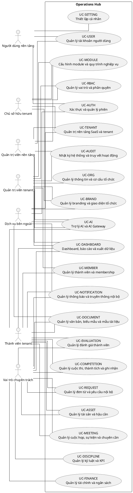

# USE CASE DIAGRAM TỔNG QUÁT — 21 NHÓM V4

Sơ đồ tổng quát chỉ thể hiện 21 **nhóm năng lực** để định vị phạm vi. Nghiệp vụ cụ thể và association actor–Use Case nằm trong từng tệp chi tiết.

```plantuml
@startuml
left to right direction
skinparam linetype ortho
actor "Người dùng nền tảng" as PU
actor "Thành viên tenant" as TM
actor "Quản trị viên tenant" as TA
actor "Chủ sở hữu tenant" as TO
actor "Quản trị viên nền tảng" as PA
actor "Vai trò chuyên trách" as MS
actor "Dịch vụ bên ngoài" as ES
rectangle "Operations Hub" {
  usecase "UC-TENANT\nQuản trị nền tảng SaaS và tenant" as G1
  usecase "UC-AUTH\nXác thực và quản lý phiên" as G2
  usecase "UC-USER\nQuản lý tài khoản người dùng" as G3
  usecase "UC-RBAC\nQuản lý vai trò và phân quyền" as G4
  usecase "UC-ORG\nQuản lý thông tin và cơ cấu tổ chức" as G5
  usecase "UC-BRAND\nQuản lý branding và giao diện tổ chức" as G6
  usecase "UC-MODULE\nCấu hình module và quy trình nghiệp vụ" as G7
  usecase "UC-SETTING\nThiết lập cá nhân" as G8
  usecase "UC-MEMBER\nQuản lý thành viên và membership" as G9
  usecase "UC-REQUEST\nQuản lý đơn từ và yêu cầu nội bộ" as G10
  usecase "UC-DOCUMENT\nQuản lý văn bản, biểu mẫu và mẫu tài liệu" as G11
  usecase "UC-FINANCE\nQuản lý tài chính và ngân sách" as G12
  usecase "UC-ASSET\nQuản lý tài sản và hậu cần" as G13
  usecase "UC-MEETING\nQuản lý cuộc họp, sự kiện và chuyên cần" as G14
  usecase "UC-DISCIPLINE\nQuản lý kỷ luật và KPI" as G15
  usecase "UC-EVALUATION\nQuản lý đánh giá thành viên" as G16
  usecase "UC-COMPETITION\nQuản lý cuộc thi, thành tích và ghi nhận" as G17
  usecase "UC-NOTIFICATION\nQuản lý thông báo và truyền thông nội bộ" as G18
  usecase "UC-DASHBOARD\nDashboard, báo cáo và xuất dữ liệu" as G19
  usecase "UC-AI\nTrợ lý AI và AI Gateway" as G20
  usecase "UC-AUDIT\nNhật ký hệ thống và truy vết hoạt động" as G21
}
PU -- G2
PU -- G3
PU -- G8
TM -- G9
TM -- G10
TM -- G11
TM -- G13
TM -- G14
TM -- G16
TM -- G17
TM -- G18
TM -- G19
TM -- G20
TA -- G4
TA -- G5
TA -- G6
TA -- G7
TA -- G9
TA -- G19
TA -- G20
TA -- G21
TO -- G1
TO -- G4
TO -- G6
TO -- G7
PA -- G1
PA -- G3
PA -- G7
PA -- G19
PA -- G20
PA -- G21
MS -- G10
MS -- G11
MS -- G12
MS -- G13
MS -- G14
MS -- G15
MS -- G16
MS -- G17
MS -- G18
MS -- G19
ES -- G1
ES -- G2
ES -- G6
ES -- G11
ES -- G18
ES -- G20
@enduml
```