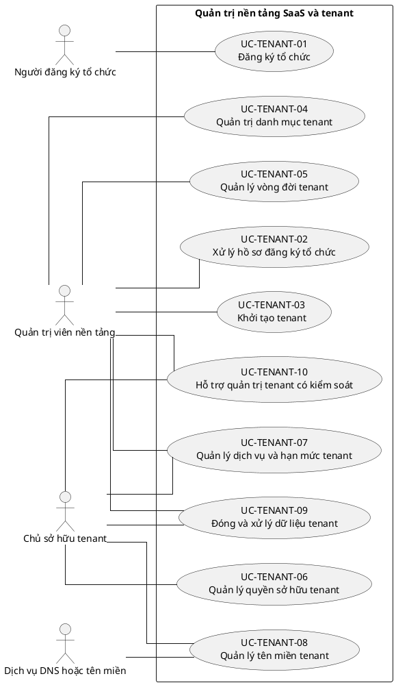

# UC-TENANT — Quản trị nền tảng SaaS và tenant

## 1. Thông tin tài liệu

| Thuộc tính | Nội dung |
|---|---|
| Mã nhóm Use Case | `UC-TENANT` |
| Miền nghiệp vụ | Nền tảng SaaS |
| Mức ưu tiên | Nền tảng bắt buộc |
| Phiên bản mô hình | V4 — tinh gọn theo mục tiêu actor |

## 2. Mục tiêu

Cho phép đăng ký, khởi tạo, quản trị vòng đời và bảo đảm ranh giới sở hữu của từng tổ chức sử dụng Operations Hub.

## 3. Nguyên tắc phân rã

> Mỗi Use Case dưới đây đại diện cho một mục tiêu nghiệp vụ có kết quả quan sát được. Các thao tác chi tiết được hợp nhất vào cột **Nội dung bao hàm**, luồng nghiệp vụ và quy tắc; không tiếp tục tách thành các Use Case nhỏ.

## 4. Danh mục Use Case chính

| Mã | Use Case | Actor chính/hỗ trợ | Kết quả nghiệp vụ | Nội dung bao hàm |
|---|---|---|---|---|
| `UC-TENANT-01` | **Đăng ký tổ chức** | `ACT-ORG-REGISTRANT` — Người đăng ký tổ chức | Hồ sơ đăng ký hợp lệ được gửi và có trạng thái theo dõi. | Bắt đầu đăng ký, lưu nháp, nhập thông tin tổ chức/người đại diện, tải minh chứng, xác minh liên hệ, chấp nhận điều khoản, bổ sung hoặc rút hồ sơ. |
| `UC-TENANT-02` | **Xử lý hồ sơ đăng ký tổ chức** | `ACT-PLATFORM-ADMIN` — Quản trị viên nền tảng | Hồ sơ được phê duyệt, từ chối hoặc yêu cầu bổ sung có lý do. | Tiếp nhận, phân công, thẩm định, yêu cầu bổ sung, phê duyệt hoặc từ chối. |
| `UC-TENANT-03` | **Khởi tạo tenant** | `ACT-PLATFORM-ADMIN` — Quản trị viên nền tảng | Tenant, membership Owner, role mặc định và cấu hình nền tảng được tạo nhất quán. | Tạo tenant, cấu hình mặc định, role/permission mặc định, Owner ban đầu, kích hoạt tenant và ghi audit. |
| `UC-TENANT-04` | **Quản trị danh mục tenant** | `ACT-PLATFORM-ADMIN` — Quản trị viên nền tảng | Quản trị viên nền tảng tra cứu và cập nhật thông tin quản trị tenant theo quyền. | Xem danh sách, tìm kiếm, lọc, xem chi tiết, cập nhật hồ sơ quản trị, xem lịch sử trạng thái. |
| `UC-TENANT-05` | **Quản lý vòng đời tenant** | `ACT-PLATFORM-ADMIN` — Quản trị viên nền tảng | Tenant chuyển trạng thái hợp lệ mà không làm mất dữ liệu trái chính sách. | Tạm khóa, khôi phục, lưu trữ, kích hoạt lại và kiểm soát chuyển trạng thái. |
| `UC-TENANT-06` | **Quản lý quyền sở hữu tenant** | `ACT-TENANT-OWNER` — Chủ sở hữu tenant | Quyền Owner được chuyển giao hoặc thay đổi mà tenant luôn còn ít nhất một Owner hợp lệ. | Chuyển quyền sở hữu, bổ nhiệm thêm Owner, thu hồi Owner không phải Owner cuối cùng. |
| `UC-TENANT-07` | **Quản lý dịch vụ và hạn mức tenant** | `ACT-TENANT-OWNER` — Chủ sở hữu tenant `ACT-PLATFORM-ADMIN` — Quản trị viên nền tảng | Gói dịch vụ, phạm vi sử dụng, liên hệ thanh toán và hạn mức được xác lập. | Chọn gói, cấu hình liên hệ dịch vụ/thanh toán, quản lý trạng thái dịch vụ và hạn mức. |
| `UC-TENANT-08` | **Quản lý tên miền tenant** | `ACT-TENANT-OWNER` — Chủ sở hữu tenant `ACT-DNS-SERVICE` — Dịch vụ DNS hoặc tên miền | Subdomain hoặc tên miền tùy chỉnh được cấu hình và xác minh. | Cấu hình subdomain, tên miền tùy chỉnh, xác minh quyền sở hữu và xử lý trạng thái DNS. |
| `UC-TENANT-09` | **Đóng và xử lý dữ liệu tenant** | `ACT-TENANT-OWNER` — Chủ sở hữu tenant `ACT-PLATFORM-ADMIN` — Quản trị viên nền tảng | Yêu cầu đóng tenant được xử lý theo thời gian chờ, lưu giữ, xuất và xóa/ẩn danh dữ liệu. | Xuất dữ liệu, yêu cầu/hủy đóng tenant, thời gian chờ xóa, khôi phục, lưu giữ, xóa hoặc ẩn danh. |
| `UC-TENANT-10` | **Hỗ trợ quản trị tenant có kiểm soát** | `ACT-PLATFORM-ADMIN` — Quản trị viên nền tảng `ACT-TENANT-OWNER` — Chủ sở hữu tenant | Hoạt động hỗ trợ đặc biệt có lý do, phạm vi, thời hạn và audit. | Yêu cầu hỗ trợ, cấp quyền hỗ trợ tạm thời, thao tác trong phạm vi được duyệt và kết thúc quyền hỗ trợ. |

## 5. Luồng nghiệp vụ cấp nhóm

1. Actor khởi phát một Use Case theo quyền và tenant context hiện hành.
2. Hệ thống kiểm tra xác thực, membership, permission, trạng thái tenant và module.
3. Hệ thống thực hiện luồng nghiệp vụ chính và các kiểm tra dữ liệu cần thiết.
4. Kết quả nghiệp vụ được lưu, thông báo cho bên liên quan và ghi audit khi thuộc danh mục bắt buộc.

## 6. Quy tắc nghiệp vụ cốt lõi

- Slug hoặc mã công khai tenant phải duy nhất sau chuẩn hóa.
- Tạo tenant, Owner và cấu hình mặc định phải là một giao dịch nghiệp vụ thống nhất.
- Tenant đang hoạt động phải có ít nhất một Owner đang hoạt động.
- Tạm khóa hoặc lưu trữ tenant không đồng nghĩa với xóa dữ liệu.
- Platform Admin không mặc nhiên có quyền nghiệp vụ nội bộ của tenant.

## 7. Quan hệ với nhóm Use Case khác

[`UC-AUTH`](./02_UC-AUTH.md), [`UC-USER`](./03_UC-USER.md), [`UC-RBAC`](./04_UC-RBAC.md), [`UC-ORG`](./05_UC-ORG.md), [`UC-MODULE`](./07_UC-MODULE.md), [`UC-AUDIT`](./21_UC-AUDIT.md)

## 8. Use Case Diagram

## 9. Ghi chú truy vết từ V3

Các phần tử chi tiết của V3 thuộc nhóm này được giữ làm nguồn phân tích nhưng đã được hợp nhất vào Use Case chính, luồng, quy tắc hoặc yêu cầu hệ thống. Không xem số lượng phần tử V3 là số lượng Use Case nghiệp vụ của V4.