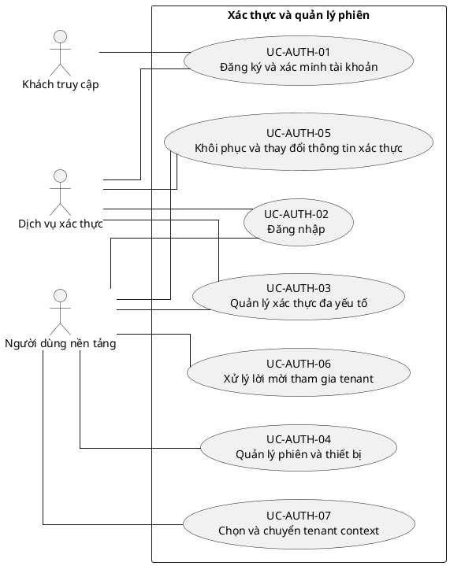

# UC-AUTH — Xác thực và quản lý phiên

## 1. Thông tin tài liệu

| Thuộc tính | Nội dung |
|---|---|
| Mã nhóm Use Case | `UC-AUTH` |
| Miền nghiệp vụ | Danh tính và truy cập |
| Mức ưu tiên | Nền tảng bắt buộc |
| Phiên bản mô hình | V4 — tinh gọn theo mục tiêu actor |

## 2. Mục tiêu

Xác thực người dùng, bảo vệ phiên và thiết lập tenant context trước khi truy cập nghiệp vụ.

## 3. Nguyên tắc phân rã

> Mỗi Use Case dưới đây đại diện cho một mục tiêu nghiệp vụ có kết quả quan sát được. Các thao tác chi tiết được hợp nhất vào cột **Nội dung bao hàm**, luồng nghiệp vụ và quy tắc; không tiếp tục tách thành các Use Case nhỏ.

## 4. Danh mục Use Case chính

| Mã | Use Case | Actor chính/hỗ trợ | Kết quả nghiệp vụ | Nội dung bao hàm |
|---|---|---|---|---|
| `UC-AUTH-01` | **Đăng ký và xác minh tài khoản** | `ACT-GUEST` — Khách truy cập `ACT-IDENTITY-SERVICE` — Dịch vụ xác thực | Tài khoản được tạo và xác minh theo chính sách. | Đăng ký bằng email/định danh, xác minh liên hệ, gửi lại xác minh và chống tự động hóa. |
| `UC-AUTH-02` | **Đăng nhập** | `ACT-PLATFORM-USER` — Người dùng nền tảng `ACT-IDENTITY-SERVICE` — Dịch vụ xác thực | Người dùng nhận phiên hợp lệ hoặc lỗi chuẩn hóa. | Đăng nhập bằng mật khẩu, SSO/OAuth hoặc liên kết dùng một lần; xử lý tài khoản chưa xác minh và giới hạn thất bại. |
| `UC-AUTH-03` | **Quản lý xác thực đa yếu tố** | `ACT-PLATFORM-USER` — Người dùng nền tảng `ACT-IDENTITY-SERVICE` — Dịch vụ xác thực | MFA được đăng ký, sử dụng, thay đổi hoặc khôi phục an toàn. | Đăng ký phương thức, xác minh mã, mã khôi phục, thay đổi/tắt MFA và xác thực tăng cường. |
| `UC-AUTH-04` | **Quản lý phiên và thiết bị** | `ACT-PLATFORM-USER` — Người dùng nền tảng | Người dùng xem và thu hồi phiên hoặc thiết bị tin cậy. | Làm mới phiên, xem phiên, đăng xuất hiện tại/tất cả thiết bị, thu hồi phiên, quản lý thiết bị tin cậy. |
| `UC-AUTH-05` | **Khôi phục và thay đổi thông tin xác thực** | `ACT-PLATFORM-USER` — Người dùng nền tảng `ACT-IDENTITY-SERVICE` — Dịch vụ xác thực | Mật khẩu được đổi hoặc đặt lại sau xác minh hợp lệ. | Quên mật khẩu, đặt lại, đổi mật khẩu, buộc đổi mật khẩu và mở khóa theo chính sách. |
| `UC-AUTH-06` | **Xử lý lời mời tham gia tenant** | `ACT-PLATFORM-USER` — Người dùng nền tảng | Lời mời được chấp nhận hoặc từ chối và membership cập nhật phù hợp. | Mở liên kết mời, xác minh danh tính, chấp nhận hoặc từ chối lời mời. |
| `UC-AUTH-07` | **Chọn và chuyển tenant context** | `ACT-PLATFORM-USER` — Người dùng nền tảng | Tenant context, quyền, menu và branding được chuyển đồng bộ. | Chọn tenant sau đăng nhập, chuyển tenant đang hoạt động và xử lý tenant/membership không còn hợp lệ. |

## 5. Luồng nghiệp vụ cấp nhóm

1. Actor khởi phát một Use Case theo quyền và tenant context hiện hành.
2. Hệ thống kiểm tra xác thực, membership, permission, trạng thái tenant và module.
3. Hệ thống thực hiện luồng nghiệp vụ chính và các kiểm tra dữ liệu cần thiết.
4. Kết quả nghiệp vụ được lưu, thông báo cho bên liên quan và ghi audit khi thuộc danh mục bắt buộc.

## 6. Quy tắc nghiệp vụ cốt lõi

- Backend phải kiểm tra xác thực cho mọi endpoint không công khai.
- Phiên phải bị vô hiệu hóa khi tài khoản, tenant hoặc membership không còn hợp lệ.
- Mật khẩu và secret không được lưu hoặc trả về dạng rõ.
- Tenant context phải được đối chiếu với membership, không tin cậy chỉ từ client.

## 7. Quan hệ với nhóm Use Case khác

[`UC-TENANT`](./01_UC-TENANT.md), [`UC-USER`](./03_UC-USER.md), [`UC-RBAC`](./04_UC-RBAC.md), [`UC-AUDIT`](./21_UC-AUDIT.md)

## 8. Use Case Diagram

## 9. Ghi chú truy vết từ V3

Các phần tử chi tiết của V3 thuộc nhóm này được giữ làm nguồn phân tích nhưng đã được hợp nhất vào Use Case chính, luồng, quy tắc hoặc yêu cầu hệ thống. Không xem số lượng phần tử V3 là số lượng Use Case nghiệp vụ của V4.