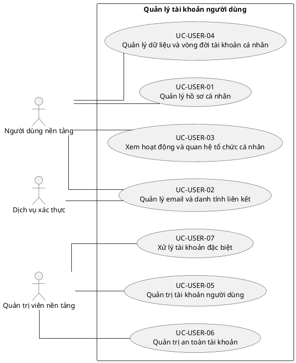

# UC-USER — Quản lý tài khoản người dùng

## 1. Thông tin tài liệu

| Thuộc tính | Nội dung |
|---|---|
| Mã nhóm Use Case | `UC-USER` |
| Miền nghiệp vụ | Danh tính người dùng |
| Mức ưu tiên | Nền tảng bắt buộc |
| Phiên bản mô hình | V4 — tinh gọn theo mục tiêu actor |

## 2. Mục tiêu

Quản lý hồ sơ và vòng đời tài khoản toàn nền tảng, tách biệt với membership trong từng tenant.

## 3. Nguyên tắc phân rã

> Mỗi Use Case dưới đây đại diện cho một mục tiêu nghiệp vụ có kết quả quan sát được. Các thao tác chi tiết được hợp nhất vào cột **Nội dung bao hàm**, luồng nghiệp vụ và quy tắc; không tiếp tục tách thành các Use Case nhỏ.

## 4. Danh mục Use Case chính

| Mã | Use Case | Actor chính/hỗ trợ | Kết quả nghiệp vụ | Nội dung bao hàm |
|---|---|---|---|---|
| `UC-USER-01` | **Quản lý hồ sơ cá nhân** | `ACT-PLATFORM-USER` — Người dùng nền tảng | Thông tin hồ sơ và ảnh đại diện được cập nhật trong phạm vi cho phép. | Xem hồ sơ, cập nhật họ tên/liên hệ/ảnh đại diện và xem trạng thái tài khoản. |
| `UC-USER-02` | **Quản lý email và danh tính liên kết** | `ACT-PLATFORM-USER` — Người dùng nền tảng `ACT-IDENTITY-SERVICE` — Dịch vụ xác thực | Email đăng nhập hoặc danh tính ngoài được thay đổi sau xác minh. | Thay đổi/xác minh email, đổi username theo chính sách, liên kết/gỡ liên kết danh tính bên ngoài. |
| `UC-USER-03` | **Xem hoạt động và quan hệ tổ chức cá nhân** | `ACT-PLATFORM-USER` — Người dùng nền tảng | Người dùng xem tenant đang tham gia và lịch sử hoạt động tài khoản. | Danh sách tenant, trạng thái membership tóm tắt và hoạt động cá nhân. |
| `UC-USER-04` | **Quản lý dữ liệu và vòng đời tài khoản cá nhân** | `ACT-PLATFORM-USER` — Người dùng nền tảng | Yêu cầu xuất, đóng, hủy đóng hoặc khôi phục tài khoản được xử lý theo chính sách. | Xuất dữ liệu, yêu cầu đóng, hủy/khôi phục trong thời gian chờ, quản lý đồng ý và điều khoản. |
| `UC-USER-05` | **Quản trị tài khoản người dùng** | `ACT-PLATFORM-ADMIN` — Quản trị viên nền tảng | Tài khoản được tra cứu, tạo và cập nhật trạng thái quản trị. | Danh sách/tìm kiếm/chi tiết, tạo tài khoản, kích hoạt, vô hiệu hóa, khôi phục. |
| `UC-USER-06` | **Quản trị an toàn tài khoản** | `ACT-PLATFORM-ADMIN` — Quản trị viên nền tảng | Tài khoản bị khóa/mở khóa hoặc reset thông tin xác thực có audit. | Khóa bảo mật, mở khóa, reset mật khẩu, buộc đổi mật khẩu. |
| `UC-USER-07` | **Xử lý tài khoản đặc biệt** | `ACT-PLATFORM-ADMIN` — Quản trị viên nền tảng | Tài khoản trùng, liên kết sai, ẩn danh hoặc platform role được xử lý có kiểm soát. | Hợp nhất/tách tài khoản, ẩn danh dữ liệu, quản lý platform role và trường hợp không còn membership. |

## 5. Luồng nghiệp vụ cấp nhóm

1. Actor khởi phát một Use Case theo quyền và tenant context hiện hành.
2. Hệ thống kiểm tra xác thực, membership, permission, trạng thái tenant và module.
3. Hệ thống thực hiện luồng nghiệp vụ chính và các kiểm tra dữ liệu cần thiết.
4. Kết quả nghiệp vụ được lưu, thông báo cho bên liên quan và ghi audit khi thuộc danh mục bắt buộc.

## 6. Quy tắc nghiệp vụ cốt lõi

- User là danh tính toàn cục; role tenant không được gán trực tiếp cho User.
- Vô hiệu hóa User toàn cục làm mất hiệu lực phiên ở mọi tenant.
- Đóng tài khoản không được phá vỡ lịch sử nghiệp vụ và audit.

## 7. Quan hệ với nhóm Use Case khác

[`UC-AUTH`](./02_UC-AUTH.md), [`UC-TENANT`](./01_UC-TENANT.md), [`UC-MEMBER`](./09_UC-MEMBER.md), [`UC-AUDIT`](./21_UC-AUDIT.md)

## 8. Use Case Diagram

## 9. Ghi chú truy vết từ V3

Các phần tử chi tiết của V3 thuộc nhóm này được giữ làm nguồn phân tích nhưng đã được hợp nhất vào Use Case chính, luồng, quy tắc hoặc yêu cầu hệ thống. Không xem số lượng phần tử V3 là số lượng Use Case nghiệp vụ của V4.