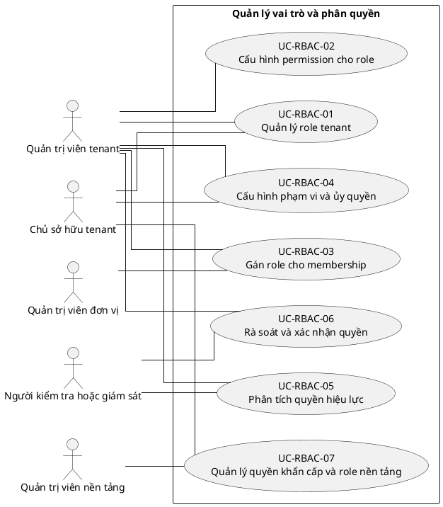

# UC-RBAC — Quản lý vai trò và phân quyền

## 1. Thông tin tài liệu

| Thuộc tính | Nội dung |
|---|---|
| Mã nhóm Use Case | `UC-RBAC` |
| Miền nghiệp vụ | Kiểm soát truy cập |
| Mức ưu tiên | Nền tảng bắt buộc |
| Phiên bản mô hình | V4 — tinh gọn theo mục tiêu actor |

## 2. Mục tiêu

Cấu hình role, permission và phạm vi quyền theo tenant, membership và đơn vị.

## 3. Nguyên tắc phân rã

> Mỗi Use Case dưới đây đại diện cho một mục tiêu nghiệp vụ có kết quả quan sát được. Các thao tác chi tiết được hợp nhất vào cột **Nội dung bao hàm**, luồng nghiệp vụ và quy tắc; không tiếp tục tách thành các Use Case nhỏ.

## 4. Danh mục Use Case chính

| Mã | Use Case | Actor chính/hỗ trợ | Kết quả nghiệp vụ | Nội dung bao hàm |
|---|---|---|---|---|
| `UC-RBAC-01` | **Quản lý role tenant** | `ACT-TENANT-ADMIN` — Quản trị viên tenant `ACT-TENANT-OWNER` — Chủ sở hữu tenant | Role mặc định và tùy chỉnh được tạo, cập nhật, sao chép, kích hoạt hoặc lưu trữ. | Xem role, tạo/sao chép, đổi tên/mô tả, kích hoạt/vô hiệu hóa/lưu trữ và xóa role chưa dùng. |
| `UC-RBAC-02` | **Cấu hình permission cho role** | `ACT-TENANT-ADMIN` — Quản trị viên tenant | Permission được gán hoặc thu hồi theo nhóm và có thể xuất/nhập ma trận. | Gán/thu hồi permission, nhóm permission, so sánh role, xuất/nhập ma trận. |
| `UC-RBAC-03` | **Gán role cho membership** | `ACT-TENANT-ADMIN` — Quản trị viên tenant `ACT-UNIT-ADMIN` — Quản trị viên đơn vị | Membership nhận role hợp lệ theo tenant và phạm vi được phép. | Gán/thu hồi role, gán hàng loạt, role có thời hạn và gia hạn. |
| `UC-RBAC-04` | **Cấu hình phạm vi và ủy quyền** | `ACT-TENANT-ADMIN` — Quản trị viên tenant `ACT-TENANT-OWNER` — Chủ sở hữu tenant | Quyền được giới hạn theo đơn vị, tài nguyên và phạm vi ủy quyền. | Role theo đơn vị, scope tài nguyên, kế thừa nếu cho phép, ngoại lệ từ chối và ủy quyền quản trị role. |
| `UC-RBAC-05` | **Phân tích quyền hiệu lực** | `ACT-TENANT-ADMIN` — Quản trị viên tenant `ACT-AUDITOR` — Người kiểm tra hoặc giám sát | Quyền của membership được mô phỏng và giải thích. | Mô phỏng quyền, giải thích nguồn quyền, kiểm tra xung đột và phân tách trách nhiệm. |
| `UC-RBAC-06` | **Rà soát và xác nhận quyền** | `ACT-TENANT-ADMIN` — Quản trị viên tenant `ACT-AUDITOR` — Người kiểm tra hoặc giám sát | Quyền được rà soát định kỳ, xác nhận lại hoặc thu hồi. | Chiến dịch rà soát, xác nhận quyền, thu hồi quyền không còn cần thiết và xem lịch sử. |
| `UC-RBAC-07` | **Quản lý quyền khẩn cấp và role nền tảng** | `ACT-PLATFORM-ADMIN` — Quản trị viên nền tảng `ACT-TENANT-OWNER` — Chủ sở hữu tenant | Quyền khẩn cấp có thời hạn và role nền tảng được tách biệt với role tenant. | Cấp/kết thúc quyền khẩn cấp, quản lý platform role và audit đầy đủ. |

## 5. Luồng nghiệp vụ cấp nhóm

1. Actor khởi phát một Use Case theo quyền và tenant context hiện hành.
2. Hệ thống kiểm tra xác thực, membership, permission, trạng thái tenant và module.
3. Hệ thống thực hiện luồng nghiệp vụ chính và các kiểm tra dữ liệu cần thiết.
4. Kết quả nghiệp vụ được lưu, thông báo cho bên liên quan và ghi audit khi thuộc danh mục bắt buộc.

## 6. Quy tắc nghiệp vụ cốt lõi

- Role tenant chỉ được gán cho membership cùng tenant.
- Người dùng không được tự nâng quyền hoặc ủy quyền vượt phạm vi.
- Ẩn nút trên frontend không thay thế kiểm tra permission tại backend.
- Quyền xem, tạo, cập nhật, phê duyệt, xuất và quản trị là các quyền độc lập.

## 7. Quan hệ với nhóm Use Case khác

[`UC-USER`](./03_UC-USER.md), [`UC-MEMBER`](./09_UC-MEMBER.md), [`UC-ORG`](./05_UC-ORG.md), [`UC-MODULE`](./07_UC-MODULE.md), [`UC-AUDIT`](./21_UC-AUDIT.md)

## 8. Use Case Diagram

## 9. Ghi chú truy vết từ V3

Các phần tử chi tiết của V3 thuộc nhóm này được giữ làm nguồn phân tích nhưng đã được hợp nhất vào Use Case chính, luồng, quy tắc hoặc yêu cầu hệ thống. Không xem số lượng phần tử V3 là số lượng Use Case nghiệp vụ của V4.