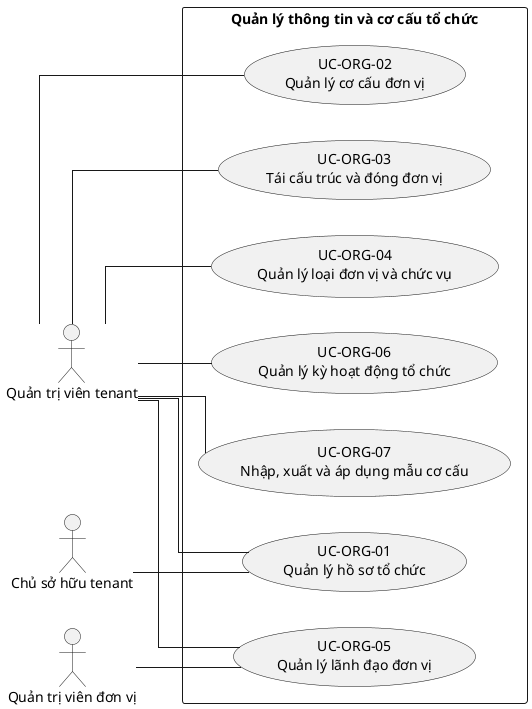

# UC-ORG — Quản lý thông tin và cơ cấu tổ chức

## 1. Thông tin tài liệu

| Thuộc tính | Nội dung |
|---|---|
| Mã nhóm Use Case | `UC-ORG` |
| Miền nghiệp vụ | Cơ cấu tổ chức |
| Mức ưu tiên | Nền tảng bắt buộc |
| Phiên bản mô hình | V4 — tinh gọn theo mục tiêu actor |

## 2. Mục tiêu

Quản lý hồ sơ, đơn vị, chức vụ, nhiệm kỳ và lịch sử cơ cấu theo tenant.

## 3. Nguyên tắc phân rã

> Mỗi Use Case dưới đây đại diện cho một mục tiêu nghiệp vụ có kết quả quan sát được. Các thao tác chi tiết được hợp nhất vào cột **Nội dung bao hàm**, luồng nghiệp vụ và quy tắc; không tiếp tục tách thành các Use Case nhỏ.

## 4. Danh mục Use Case chính

| Mã | Use Case | Actor chính/hỗ trợ | Kết quả nghiệp vụ | Nội dung bao hàm |
|---|---|---|---|---|
| `UC-ORG-01` | **Quản lý hồ sơ tổ chức** | `ACT-TENANT-ADMIN` — Quản trị viên tenant `ACT-TENANT-OWNER` — Chủ sở hữu tenant | Hồ sơ tổ chức và trường mở rộng được cập nhật trong tenant. | Tên, mô tả, liên hệ, định danh nội bộ/pháp lý và trường dữ liệu mở rộng. |
| `UC-ORG-02` | **Quản lý cơ cấu đơn vị** | `ACT-TENANT-ADMIN` — Quản trị viên tenant | Đơn vị trực thuộc được tạo, cập nhật, sắp xếp và gắn quan hệ cha-con hợp lệ. | Xem cơ cấu, tạo/sửa đơn vị, sắp xếp, di chuyển và kiểm tra vòng lặp. |
| `UC-ORG-03` | **Tái cấu trúc và đóng đơn vị** | `ACT-TENANT-ADMIN` — Quản trị viên tenant | Đơn vị được vô hiệu hóa, lưu trữ, hợp nhất hoặc tách mà vẫn giữ lịch sử. | Vô hiệu hóa/kích hoạt lại, lưu trữ, chuyển dữ liệu, hợp nhất và tách đơn vị. |
| `UC-ORG-04` | **Quản lý loại đơn vị và chức vụ** | `ACT-TENANT-ADMIN` — Quản trị viên tenant | Danh mục loại đơn vị, chức vụ và quy tắc mã được cấu hình. | Tạo/cập nhật/vô hiệu hóa chức vụ, loại đơn vị và quy tắc đặt mã. |
| `UC-ORG-05` | **Quản lý lãnh đạo đơn vị** | `ACT-TENANT-ADMIN` — Quản trị viên tenant `ACT-UNIT-ADMIN` — Quản trị viên đơn vị | Người quản lý đơn vị và nhiệm kỳ được ghi nhận. | Gán người quản lý, kết thúc nhiệm kỳ và lưu lịch sử. |
| `UC-ORG-06` | **Quản lý kỳ hoạt động tổ chức** | `ACT-TENANT-ADMIN` — Quản trị viên tenant | Nhiệm kỳ, năm học và kỳ hoạt động được cấu hình. | Tạo, cập nhật, kích hoạt, đóng và tra cứu kỳ hoạt động. |
| `UC-ORG-07` | **Nhập, xuất và áp dụng mẫu cơ cấu** | `ACT-TENANT-ADMIN` — Quản trị viên tenant | Cơ cấu được nhập/xuất hoặc tạo từ mẫu có kiểm tra toàn vẹn. | Nhập, xuất, sao chép mẫu nền tảng và xem lịch sử thay đổi cơ cấu. |

## 5. Luồng nghiệp vụ cấp nhóm

1. Actor khởi phát một Use Case theo quyền và tenant context hiện hành.
2. Hệ thống kiểm tra xác thực, membership, permission, trạng thái tenant và module.
3. Hệ thống thực hiện luồng nghiệp vụ chính và các kiểm tra dữ liệu cần thiết.
4. Kết quả nghiệp vụ được lưu, thông báo cho bên liên quan và ghi audit khi thuộc danh mục bắt buộc.

## 6. Quy tắc nghiệp vụ cốt lõi

- Mỗi đơn vị thuộc duy nhất một tenant.
- Đơn vị cha và con phải cùng tenant; không được tạo chu trình.
- Đơn vị có dữ liệu liên quan không được xóa vật lý trực tiếp.
- Tên ban và chức vụ riêng của MTEC không được mã hóa thành mặc định bắt buộc.

## 7. Quan hệ với nhóm Use Case khác

[`UC-TENANT`](./01_UC-TENANT.md), [`UC-MEMBER`](./09_UC-MEMBER.md), [`UC-RBAC`](./04_UC-RBAC.md), [`UC-AUDIT`](./21_UC-AUDIT.md)

## 8. Use Case Diagram

## 9. Ghi chú truy vết từ V3

Các phần tử chi tiết của V3 thuộc nhóm này được giữ làm nguồn phân tích nhưng đã được hợp nhất vào Use Case chính, luồng, quy tắc hoặc yêu cầu hệ thống. Không xem số lượng phần tử V3 là số lượng Use Case nghiệp vụ của V4.