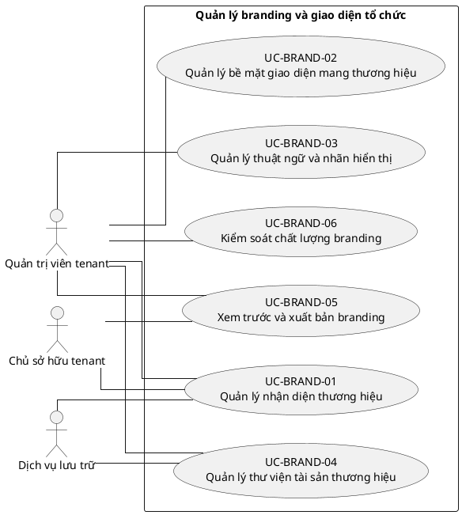

# UC-BRAND — Quản lý branding và giao diện tổ chức

## 1. Thông tin tài liệu

| Thuộc tính | Nội dung |
|---|---|
| Mã nhóm Use Case | `UC-BRAND` |
| Miền nghiệp vụ | Cấu hình tenant |
| Mức ưu tiên | Nền tảng bắt buộc |
| Phiên bản mô hình | V4 — tinh gọn theo mục tiêu actor |

## 2. Mục tiêu

Cho phép tenant tùy chỉnh nhận diện trong giới hạn bảo đảm nhất quán và khả năng sử dụng.

## 3. Nguyên tắc phân rã

> Mỗi Use Case dưới đây đại diện cho một mục tiêu nghiệp vụ có kết quả quan sát được. Các thao tác chi tiết được hợp nhất vào cột **Nội dung bao hàm**, luồng nghiệp vụ và quy tắc; không tiếp tục tách thành các Use Case nhỏ.

## 4. Danh mục Use Case chính

| Mã | Use Case | Actor chính/hỗ trợ | Kết quả nghiệp vụ | Nội dung bao hàm |
|---|---|---|---|---|
| `UC-BRAND-01` | **Quản lý nhận diện thương hiệu** | `ACT-TENANT-ADMIN` — Quản trị viên tenant `ACT-TENANT-OWNER` — Chủ sở hữu tenant `ACT-STORAGE-SERVICE` — Dịch vụ lưu trữ | Tên hiển thị, logo, favicon, màu sắc và kiểu chữ được cấu hình. | Logo chính/rút gọn, favicon, màu chủ/phụ, kiểu chữ, chế độ sáng/tối và ảnh nền. |
| `UC-BRAND-02` | **Quản lý bề mặt giao diện mang thương hiệu** | `ACT-TENANT-ADMIN` — Quản trị viên tenant | Branding được áp dụng cho đăng nhập, email, thông báo, tài liệu và bản xuất. | Trang đăng nhập, chân trang, email, thông báo, tài liệu và bản xuất. |
| `UC-BRAND-03` | **Quản lý thuật ngữ và nhãn hiển thị** | `ACT-TENANT-ADMIN` — Quản trị viên tenant | Thuật ngữ, nhãn menu và tên mô-đun phản ánh cách gọi của tổ chức. | Thuật ngữ tổ chức, nhãn menu, tên module và nội dung liên hệ. |
| `UC-BRAND-04` | **Quản lý thư viện tài sản thương hiệu** | `ACT-TENANT-ADMIN` — Quản trị viên tenant `ACT-STORAGE-SERVICE` — Dịch vụ lưu trữ | Tài sản thương hiệu được tải lên, thay thế, phân loại và lưu trữ. | Upload, thay thế, lưu trữ và tra cứu tài sản. |
| `UC-BRAND-05` | **Xem trước và xuất bản branding** | `ACT-TENANT-ADMIN` — Quản trị viên tenant `ACT-TENANT-OWNER` — Chủ sở hữu tenant | Branding được xem trước, xuất bản, lên lịch hoặc khôi phục phiên bản. | Bản nháp, preview, publish, schedule, version history và rollback. |
| `UC-BRAND-06` | **Kiểm soát chất lượng branding** | `ACT-TENANT-ADMIN` — Quản trị viên tenant | Tệp, độ tương phản và cấu hình fallback đáp ứng yêu cầu sử dụng. | Kiểm tra tệp, khả năng đọc, giới hạn tùy chỉnh và branding mặc định nền tảng. |

## 5. Luồng nghiệp vụ cấp nhóm

1. Actor khởi phát một Use Case theo quyền và tenant context hiện hành.
2. Hệ thống kiểm tra xác thực, membership, permission, trạng thái tenant và module.
3. Hệ thống thực hiện luồng nghiệp vụ chính và các kiểm tra dữ liệu cần thiết.
4. Kết quả nghiệp vụ được lưu, thông báo cho bên liên quan và ghi audit khi thuộc danh mục bắt buộc.

## 6. Quy tắc nghiệp vụ cốt lõi

- Branding chỉ có hiệu lực trong tenant sở hữu cấu hình.
- Branding không được thay đổi quyền hoặc logic nghiệp vụ.
- Màu sắc và nội dung tùy chỉnh không được che khuất cảnh báo bắt buộc.

## 7. Quan hệ với nhóm Use Case khác

[`UC-TENANT`](./01_UC-TENANT.md), [`UC-MODULE`](./07_UC-MODULE.md), [`UC-DOCUMENT`](./11_UC-DOCUMENT.md), [`UC-NOTIFICATION`](./18_UC-NOTIFICATION.md), [`UC-AUDIT`](./21_UC-AUDIT.md)

## 8. Use Case Diagram

## 9. Ghi chú truy vết từ V3

Các phần tử chi tiết của V3 thuộc nhóm này được giữ làm nguồn phân tích nhưng đã được hợp nhất vào Use Case chính, luồng, quy tắc hoặc yêu cầu hệ thống. Không xem số lượng phần tử V3 là số lượng Use Case nghiệp vụ của V4.