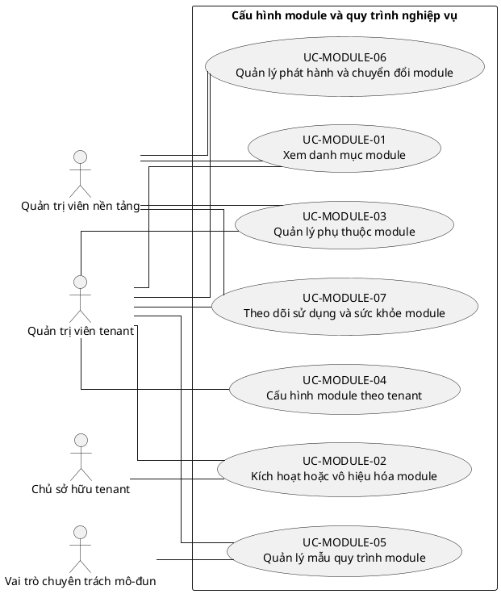

# UC-MODULE — Cấu hình module và quy trình nghiệp vụ

## 1. Thông tin tài liệu

| Thuộc tính | Nội dung |
|---|---|
| Mã nhóm Use Case | `UC-MODULE` |
| Miền nghiệp vụ | Nền tảng mô-đun |
| Mức ưu tiên | Nền tảng bắt buộc |
| Phiên bản mô hình | V4 — tinh gọn theo mục tiêu actor |

## 2. Mục tiêu

Quản lý module được hỗ trợ, trạng thái kích hoạt, phụ thuộc và cấu hình theo tenant.

## 3. Nguyên tắc phân rã

> Mỗi Use Case dưới đây đại diện cho một mục tiêu nghiệp vụ có kết quả quan sát được. Các thao tác chi tiết được hợp nhất vào cột **Nội dung bao hàm**, luồng nghiệp vụ và quy tắc; không tiếp tục tách thành các Use Case nhỏ.

## 4. Danh mục Use Case chính

| Mã | Use Case | Actor chính/hỗ trợ | Kết quả nghiệp vụ | Nội dung bao hàm |
|---|---|---|---|---|
| `UC-MODULE-01` | **Xem danh mục module** | `ACT-TENANT-ADMIN` — Quản trị viên tenant `ACT-PLATFORM-ADMIN` — Quản trị viên nền tảng | Người quản trị xem module, phiên bản, mô tả và phụ thuộc. | Danh mục module, trạng thái hỗ trợ và tài liệu cấu hình. |
| `UC-MODULE-02` | **Kích hoạt hoặc vô hiệu hóa module** | `ACT-TENANT-ADMIN` — Quản trị viên tenant `ACT-TENANT-OWNER` — Chủ sở hữu tenant | Module được bật/tắt riêng theo tenant sau kiểm tra điều kiện. | Bật/tắt module, xác nhận tác động và ghi audit. |
| `UC-MODULE-03` | **Quản lý phụ thuộc module** | `ACT-TENANT-ADMIN` — Quản trị viên tenant `ACT-PLATFORM-ADMIN` — Quản trị viên nền tảng | Phụ thuộc bắt buộc và xung đột module được kiểm soát. | Kiểm tra dependency, chặn cấu hình không hợp lệ và đề xuất thứ tự xử lý. |
| `UC-MODULE-04` | **Cấu hình module theo tenant** | `ACT-TENANT-ADMIN` — Quản trị viên tenant | Tham số, thuật ngữ và thiết lập module được lưu theo tenant. | Cấu hình chung, cấu hình đơn vị, chính sách module và giá trị mặc định. |
| `UC-MODULE-05` | **Quản lý mẫu quy trình module** | `ACT-TENANT-ADMIN` — Quản trị viên tenant `ACT-MODULE-SPECIALIST` — Vai trò chuyên trách mô-đun | Mẫu workflow được chọn, sao chép và tùy chỉnh trong giới hạn. | Áp dụng mẫu nền tảng, tùy chỉnh trạng thái/bước/phê duyệt và phiên bản hóa. |
| `UC-MODULE-06` | **Quản lý phát hành và chuyển đổi module** | `ACT-PLATFORM-ADMIN` — Quản trị viên nền tảng `ACT-TENANT-ADMIN` — Quản trị viên tenant | Thay đổi phiên bản hoặc rollout module được kiểm soát. | Lên lịch bật, thử nghiệm giới hạn, nâng cấp, migration và rollback. |
| `UC-MODULE-07` | **Theo dõi sử dụng và sức khỏe module** | `ACT-TENANT-ADMIN` — Quản trị viên tenant `ACT-PLATFORM-ADMIN` — Quản trị viên nền tảng | Trạng thái, lỗi, mức sử dụng và hạn mức module được giám sát. | Theo dõi sức khỏe, lỗi cấu hình, sử dụng và cảnh báo. |

## 5. Luồng nghiệp vụ cấp nhóm

1. Actor khởi phát một Use Case theo quyền và tenant context hiện hành.
2. Hệ thống kiểm tra xác thực, membership, permission, trạng thái tenant và module.
3. Hệ thống thực hiện luồng nghiệp vụ chính và các kiểm tra dữ liệu cần thiết.
4. Kết quả nghiệp vụ được lưu, thông báo cho bên liên quan và ghi audit khi thuộc danh mục bắt buộc.

## 6. Quy tắc nghiệp vụ cốt lõi

- Vô hiệu hóa module không được tự động xóa dữ liệu đã phát sinh.
- API module bị tắt phải bị backend từ chối, không chỉ ẩn menu.
- Không được tắt module nền khi module phụ thuộc còn hoạt động.

## 7. Quan hệ với nhóm Use Case khác

[`UC-TENANT`](./01_UC-TENANT.md), [`UC-RBAC`](./04_UC-RBAC.md), [`UC-BRAND`](./06_UC-BRAND.md), [`UC-AUDIT`](./21_UC-AUDIT.md)

## 8. Use Case Diagram

## 9. Ghi chú truy vết từ V3

Các phần tử chi tiết của V3 thuộc nhóm này được giữ làm nguồn phân tích nhưng đã được hợp nhất vào Use Case chính, luồng, quy tắc hoặc yêu cầu hệ thống. Không xem số lượng phần tử V3 là số lượng Use Case nghiệp vụ của V4.