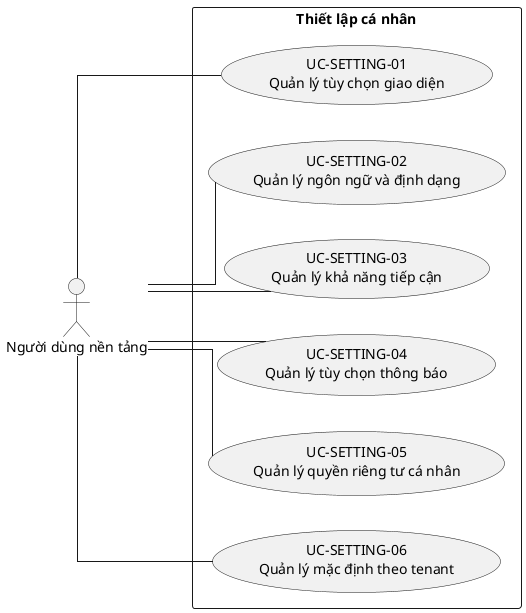

# UC-SETTING — Thiết lập cá nhân

## 1. Thông tin tài liệu

| Thuộc tính | Nội dung |
|---|---|
| Mã nhóm Use Case | `UC-SETTING` |
| Miền nghiệp vụ | Trải nghiệm người dùng |
| Mức ưu tiên | Nền tảng |
| Phiên bản mô hình | V4 — tinh gọn theo mục tiêu actor |

## 2. Mục tiêu

Cho phép người dùng quản lý tùy chọn cá nhân mà không thay đổi chính sách tenant.

## 3. Nguyên tắc phân rã

> Mỗi Use Case dưới đây đại diện cho một mục tiêu nghiệp vụ có kết quả quan sát được. Các thao tác chi tiết được hợp nhất vào cột **Nội dung bao hàm**, luồng nghiệp vụ và quy tắc; không tiếp tục tách thành các Use Case nhỏ.

## 4. Danh mục Use Case chính

| Mã | Use Case | Actor chính/hỗ trợ | Kết quả nghiệp vụ | Nội dung bao hàm |
|---|---|---|---|---|
| `UC-SETTING-01` | **Quản lý tùy chọn giao diện** | `ACT-PLATFORM-USER` — Người dùng nền tảng | Giao diện cá nhân được lưu theo người dùng. | Chủ đề sáng/tối, mật độ hiển thị, sidebar, trang mặc định và bố cục cá nhân. |
| `UC-SETTING-02` | **Quản lý ngôn ngữ và định dạng** | `ACT-PLATFORM-USER` — Người dùng nền tảng | Ngôn ngữ, múi giờ, ngày giờ và số được hiển thị theo tùy chọn. | Ngôn ngữ, locale, múi giờ, định dạng ngày/giờ/số. |
| `UC-SETTING-03` | **Quản lý khả năng tiếp cận** | `ACT-PLATFORM-USER` — Người dùng nền tảng | Tùy chọn accessibility được áp dụng. | Cỡ chữ, tương phản, giảm chuyển động, điều hướng bàn phím và hỗ trợ đọc. |
| `UC-SETTING-04` | **Quản lý tùy chọn thông báo** | `ACT-PLATFORM-USER` — Người dùng nền tảng | Kênh, tần suất và giờ yên lặng được lưu. | Email/push/in-app, digest, giờ yên lặng và loại thông báo. |
| `UC-SETTING-05` | **Quản lý quyền riêng tư cá nhân** | `ACT-PLATFORM-USER` — Người dùng nền tảng | Tùy chọn chia sẻ và hiển thị thông tin cá nhân được áp dụng trong phạm vi chính sách. | Mức hiển thị hồ sơ, dữ liệu phân tích, AI opt-in và lịch sử đồng ý. |
| `UC-SETTING-06` | **Quản lý mặc định theo tenant** | `ACT-PLATFORM-USER` — Người dùng nền tảng | Tenant mặc định và tùy chọn cá nhân theo từng tenant được lưu. | Tenant mặc định, đơn vị quan tâm, dashboard mặc định và lựa chọn module gần đây. |

## 5. Luồng nghiệp vụ cấp nhóm

1. Actor khởi phát một Use Case theo quyền và tenant context hiện hành.
2. Hệ thống kiểm tra xác thực, membership, permission, trạng thái tenant và module.
3. Hệ thống thực hiện luồng nghiệp vụ chính và các kiểm tra dữ liệu cần thiết.
4. Kết quả nghiệp vụ được lưu, thông báo cho bên liên quan và ghi audit khi thuộc danh mục bắt buộc.

## 6. Quy tắc nghiệp vụ cốt lõi

- Thiết lập cá nhân không được vượt qua chính sách bảo mật hoặc quyền tenant.
- Tùy chọn theo tenant phải tách biệt giữa các tenant.

## 7. Quan hệ với nhóm Use Case khác

[`UC-AUTH`](./02_UC-AUTH.md), [`UC-USER`](./03_UC-USER.md), [`UC-NOTIFICATION`](./18_UC-NOTIFICATION.md), [`UC-DASHBOARD`](./19_UC-DASHBOARD.md)

## 8. Use Case Diagram

## 9. Ghi chú truy vết từ V3

Các phần tử chi tiết của V3 thuộc nhóm này được giữ làm nguồn phân tích nhưng đã được hợp nhất vào Use Case chính, luồng, quy tắc hoặc yêu cầu hệ thống. Không xem số lượng phần tử V3 là số lượng Use Case nghiệp vụ của V4.