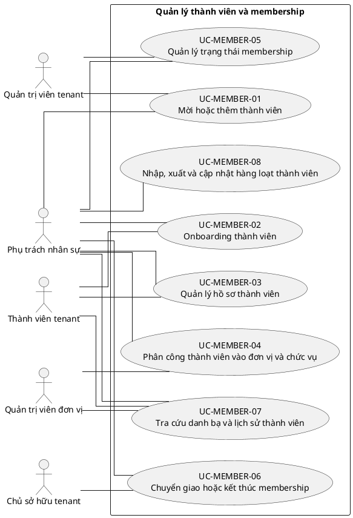

# UC-MEMBER — Quản lý thành viên và membership

## 1. Thông tin tài liệu

| Thuộc tính | Nội dung |
|---|---|
| Mã nhóm Use Case | `UC-MEMBER` |
| Miền nghiệp vụ | Nhân sự tổ chức |
| Mức ưu tiên | Nghiệp vụ lõi |
| Phiên bản mô hình | V4 — tinh gọn theo mục tiêu actor |

## 2. Mục tiêu

Quản lý quan hệ User–Tenant, hồ sơ thành viên, đơn vị, chức vụ và vòng đời tham gia.

## 3. Nguyên tắc phân rã

> Mỗi Use Case dưới đây đại diện cho một mục tiêu nghiệp vụ có kết quả quan sát được. Các thao tác chi tiết được hợp nhất vào cột **Nội dung bao hàm**, luồng nghiệp vụ và quy tắc; không tiếp tục tách thành các Use Case nhỏ.

## 4. Danh mục Use Case chính

| Mã | Use Case | Actor chính/hỗ trợ | Kết quả nghiệp vụ | Nội dung bao hàm |
|---|---|---|---|---|
| `UC-MEMBER-01` | **Mời hoặc thêm thành viên** | `ACT-HR-SPECIALIST` — Phụ trách nhân sự `ACT-TENANT-ADMIN` — Quản trị viên tenant | User được mời hoặc thêm vào tenant mà không tạo membership trùng. | Mời bằng email/liên kết, thêm user hiện có, tạo tài khoản theo quyền và gửi thông báo. |
| `UC-MEMBER-02` | **Onboarding thành viên** | `ACT-TENANT-MEMBER` — Thành viên tenant `ACT-HR-SPECIALIST` — Phụ trách nhân sự | Thành viên hoàn tất xác nhận, hồ sơ và điều kiện gia nhập. | Chấp nhận lời mời, bổ sung hồ sơ, xác nhận quy định và kích hoạt membership. |
| `UC-MEMBER-03` | **Quản lý hồ sơ thành viên** | `ACT-TENANT-MEMBER` — Thành viên tenant `ACT-HR-SPECIALIST` — Phụ trách nhân sự | Hồ sơ thành viên, kỹ năng và minh chứng được cập nhật theo quyền. | Thông tin cá nhân trong tổ chức, kỹ năng, kinh nghiệm, tài liệu và lịch sử. |
| `UC-MEMBER-04` | **Phân công thành viên vào đơn vị và chức vụ** | `ACT-HR-SPECIALIST` — Phụ trách nhân sự `ACT-UNIT-ADMIN` — Quản trị viên đơn vị | Thành viên được gán đơn vị, chức vụ và thời gian hiệu lực hợp lệ. | Gán/chuyển đơn vị, chức vụ, nhiều đơn vị, nhiệm kỳ và người quản lý. |
| `UC-MEMBER-05` | **Quản lý trạng thái membership** | `ACT-HR-SPECIALIST` — Phụ trách nhân sự `ACT-TENANT-ADMIN` — Quản trị viên tenant | Membership chuyển trạng thái hợp lệ và không làm mất lịch sử. | Pending/Active/Suspended/Ended, tái kích hoạt và ghi lý do. |
| `UC-MEMBER-06` | **Chuyển giao hoặc kết thúc membership** | `ACT-HR-SPECIALIST` — Phụ trách nhân sự `ACT-TENANT-OWNER` — Chủ sở hữu tenant | Việc rời tổ chức, chuyển giao trách nhiệm và kết thúc tư cách được kiểm soát. | Yêu cầu rời, phê duyệt kết thúc, chuyển tài sản/công việc/quyền và kiểm tra Owner cuối cùng. |
| `UC-MEMBER-07` | **Tra cứu danh bạ và lịch sử thành viên** | `ACT-TENANT-MEMBER` — Thành viên tenant `ACT-UNIT-ADMIN` — Quản trị viên đơn vị `ACT-HR-SPECIALIST` — Phụ trách nhân sự | Danh sách và chi tiết thành viên hiển thị theo phạm vi quyền. | Tìm kiếm, lọc, xem hồ sơ, lịch sử đơn vị/chức vụ và trạng thái. |
| `UC-MEMBER-08` | **Nhập, xuất và cập nhật hàng loạt thành viên** | `ACT-HR-SPECIALIST` — Phụ trách nhân sự | Dữ liệu thành viên được nhập/xuất hoặc cập nhật hàng loạt có kiểm tra lỗi. | Import CSV, mapping, preview, xử lý lỗi, export và bulk update. |

## 5. Luồng nghiệp vụ cấp nhóm

1. Actor khởi phát một Use Case theo quyền và tenant context hiện hành.
2. Hệ thống kiểm tra xác thực, membership, permission, trạng thái tenant và module.
3. Hệ thống thực hiện luồng nghiệp vụ chính và các kiểm tra dữ liệu cần thiết.
4. Kết quả nghiệp vụ được lưu, thông báo cho bên liên quan và ghi audit khi thuộc danh mục bắt buộc.

## 6. Quy tắc nghiệp vụ cốt lõi

- Mỗi cặp User–Tenant chỉ có một membership hiện hành.
- Chỉ membership Active được thực hiện nghiệp vụ tenant.
- Membership và đơn vị được gán phải cùng tenant.
- Không được kết thúc hoặc đình chỉ Owner cuối cùng trước khi có người thay thế.

## 7. Quan hệ với nhóm Use Case khác

[`UC-USER`](./03_UC-USER.md), [`UC-ORG`](./05_UC-ORG.md), [`UC-RBAC`](./04_UC-RBAC.md), [`UC-AUTH`](./02_UC-AUTH.md), [`UC-AUDIT`](./21_UC-AUDIT.md)

## 8. Use Case Diagram

## 9. Ghi chú truy vết từ V3

Các phần tử chi tiết của V3 thuộc nhóm này được giữ làm nguồn phân tích nhưng đã được hợp nhất vào Use Case chính, luồng, quy tắc hoặc yêu cầu hệ thống. Không xem số lượng phần tử V3 là số lượng Use Case nghiệp vụ của V4.