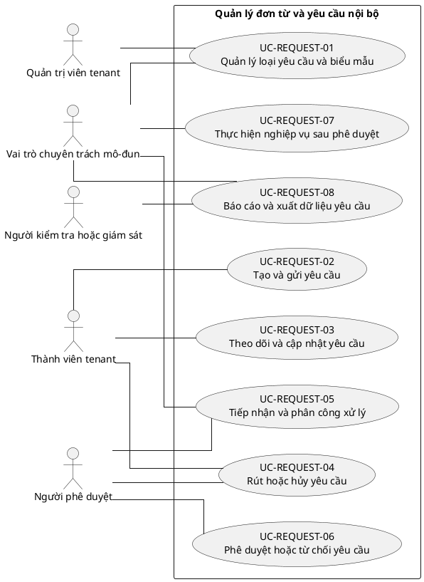

# UC-REQUEST — Quản lý đơn từ và yêu cầu nội bộ

## 1. Thông tin tài liệu

| Thuộc tính | Nội dung |
|---|---|
| Mã nhóm Use Case | `UC-REQUEST` |
| Miền nghiệp vụ | Workflow yêu cầu |
| Mức ưu tiên | Nghiệp vụ lõi |
| Phiên bản mô hình | V4 — tinh gọn theo mục tiêu actor |

## 2. Mục tiêu

Số hóa việc tạo, theo dõi, phê duyệt và liên kết yêu cầu nội bộ với nghiệp vụ phát sinh.

## 3. Nguyên tắc phân rã

> Mỗi Use Case dưới đây đại diện cho một mục tiêu nghiệp vụ có kết quả quan sát được. Các thao tác chi tiết được hợp nhất vào cột **Nội dung bao hàm**, luồng nghiệp vụ và quy tắc; không tiếp tục tách thành các Use Case nhỏ.

## 4. Danh mục Use Case chính

| Mã | Use Case | Actor chính/hỗ trợ | Kết quả nghiệp vụ | Nội dung bao hàm |
|---|---|---|---|---|
| `UC-REQUEST-01` | **Quản lý loại yêu cầu và biểu mẫu** | `ACT-TENANT-ADMIN` — Quản trị viên tenant `ACT-MODULE-SPECIALIST` — Vai trò chuyên trách mô-đun | Loại yêu cầu, trường dữ liệu, điều kiện và luồng phê duyệt được cấu hình. | Tạo/sửa loại, form, trạng thái, SLA, quy tắc phê duyệt và quyền. |
| `UC-REQUEST-02` | **Tạo và gửi yêu cầu** | `ACT-TENANT-MEMBER` — Thành viên tenant | Yêu cầu hợp lệ được gửi với dữ liệu và tệp đính kèm. | Lưu nháp, điền form, tải tệp, chọn người/đơn vị liên quan và gửi. |
| `UC-REQUEST-03` | **Theo dõi và cập nhật yêu cầu** | `ACT-TENANT-MEMBER` — Thành viên tenant | Người gửi xem trạng thái, trao đổi và bổ sung dữ liệu khi được phép. | Xem chi tiết/lịch sử, bình luận, bổ sung, sửa trước xử lý và nhận thông báo. |
| `UC-REQUEST-04` | **Rút hoặc hủy yêu cầu** | `ACT-TENANT-MEMBER` — Thành viên tenant `ACT-APPROVER` — Người phê duyệt | Yêu cầu được rút/hủy theo trạng thái và chính sách. | Rút trước duyệt, yêu cầu hủy sau duyệt và ghi lý do. |
| `UC-REQUEST-05` | **Tiếp nhận và phân công xử lý** | `ACT-MODULE-SPECIALIST` — Vai trò chuyên trách mô-đun `ACT-APPROVER` — Người phê duyệt | Yêu cầu được phân công đúng người, đơn vị và thời hạn. | Queue xử lý, phân công/chuyển giao, ưu tiên và SLA. |
| `UC-REQUEST-06` | **Phê duyệt hoặc từ chối yêu cầu** | `ACT-APPROVER` — Người phê duyệt | Yêu cầu được duyệt, từ chối hoặc yêu cầu bổ sung có lý do và audit. | Xem hồ sơ, xin bổ sung, duyệt/từ chối, phê duyệt nhiều cấp và phân tách trách nhiệm. |
| `UC-REQUEST-07` | **Thực hiện nghiệp vụ sau phê duyệt** | `ACT-MODULE-SPECIALIST` — Vai trò chuyên trách mô-đun | Yêu cầu được chuyển thành giao dịch, văn bản, nhiệm vụ hoặc thay đổi dữ liệu liên quan. | Sinh đối tượng nghiệp vụ, liên kết tài chính/tài liệu/thành viên và cập nhật kết quả. |
| `UC-REQUEST-08` | **Báo cáo và xuất dữ liệu yêu cầu** | `ACT-MODULE-SPECIALIST` — Vai trò chuyên trách mô-đun `ACT-AUDITOR` — Người kiểm tra hoặc giám sát | Yêu cầu được thống kê, lọc và xuất theo quyền. | Dashboard, SLA, tồn đọng, lịch sử phê duyệt và export. |

## 5. Luồng nghiệp vụ cấp nhóm

1. Actor khởi phát một Use Case theo quyền và tenant context hiện hành.
2. Hệ thống kiểm tra xác thực, membership, permission, trạng thái tenant và module.
3. Hệ thống thực hiện luồng nghiệp vụ chính và các kiểm tra dữ liệu cần thiết.
4. Kết quả nghiệp vụ được lưu, thông báo cho bên liên quan và ghi audit khi thuộc danh mục bắt buộc.

## 6. Quy tắc nghiệp vụ cốt lõi

- Không được duyệt lại yêu cầu đã kết thúc nếu không có quy trình mở lại.
- Người tạo không được tự phê duyệt khi chính sách phân tách trách nhiệm được bật.
- Yêu cầu và đối tượng phát sinh phải cùng tenant.

## 7. Quan hệ với nhóm Use Case khác

[`UC-MEMBER`](./09_UC-MEMBER.md), [`UC-RBAC`](./04_UC-RBAC.md), [`UC-DOCUMENT`](./11_UC-DOCUMENT.md), [`UC-FINANCE`](./12_UC-FINANCE.md), [`UC-NOTIFICATION`](./18_UC-NOTIFICATION.md), [`UC-AUDIT`](./21_UC-AUDIT.md)

## 8. Use Case Diagram

## 9. Ghi chú truy vết từ V3

Các phần tử chi tiết của V3 thuộc nhóm này được giữ làm nguồn phân tích nhưng đã được hợp nhất vào Use Case chính, luồng, quy tắc hoặc yêu cầu hệ thống. Không xem số lượng phần tử V3 là số lượng Use Case nghiệp vụ của V4.