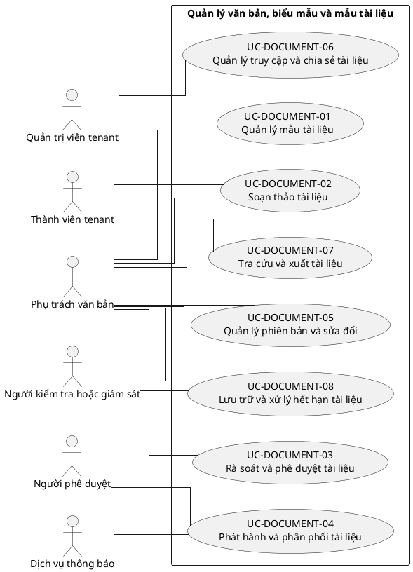

# UC-DOCUMENT — Quản lý văn bản, biểu mẫu và mẫu tài liệu

## 1. Thông tin tài liệu

| Thuộc tính | Nội dung |
|---|---|
| Mã nhóm Use Case | `UC-DOCUMENT` |
| Miền nghiệp vụ | Quản trị tài liệu |
| Mức ưu tiên | Nghiệp vụ lõi |
| Phiên bản mô hình | V4 — tinh gọn theo mục tiêu actor |

## 2. Mục tiêu

Quản lý vòng đời tài liệu từ mẫu, soạn thảo, phê duyệt, phát hành đến lưu trữ.

## 3. Nguyên tắc phân rã

> Mỗi Use Case dưới đây đại diện cho một mục tiêu nghiệp vụ có kết quả quan sát được. Các thao tác chi tiết được hợp nhất vào cột **Nội dung bao hàm**, luồng nghiệp vụ và quy tắc; không tiếp tục tách thành các Use Case nhỏ.

## 4. Danh mục Use Case chính

| Mã | Use Case | Actor chính/hỗ trợ | Kết quả nghiệp vụ | Nội dung bao hàm |
|---|---|---|---|---|
| `UC-DOCUMENT-01` | **Quản lý mẫu tài liệu** | `ACT-DOCUMENT-OFFICER` — Phụ trách văn bản `ACT-TENANT-ADMIN` — Quản trị viên tenant | Mẫu tài liệu được tạo, phiên bản hóa và áp dụng theo tenant. | Tạo/sửa mẫu, trường trộn dữ liệu, numbering, quyền dùng và mẫu nền tảng. |
| `UC-DOCUMENT-02` | **Soạn thảo tài liệu** | `ACT-DOCUMENT-OFFICER` — Phụ trách văn bản `ACT-TENANT-MEMBER` — Thành viên tenant | Tài liệu nháp được tạo thủ công hoặc từ mẫu với tệp liên quan. | Tạo nháp, điền dữ liệu, upload, liên kết nghiệp vụ và đồng tác giả. |
| `UC-DOCUMENT-03` | **Rà soát và phê duyệt tài liệu** | `ACT-DOCUMENT-OFFICER` — Phụ trách văn bản `ACT-APPROVER` — Người phê duyệt | Tài liệu được góp ý, chỉnh sửa và phê duyệt theo workflow. | Gửi duyệt, bình luận, yêu cầu sửa, phê duyệt/từ chối và nhiều cấp. |
| `UC-DOCUMENT-04` | **Phát hành và phân phối tài liệu** | `ACT-DOCUMENT-OFFICER` — Phụ trách văn bản `ACT-APPROVER` — Người phê duyệt `ACT-NOTIFICATION-SERVICE` — Dịch vụ thông báo | Tài liệu có số, ngày hiệu lực, đối tượng nhận và trạng thái phát hành. | Cấp số, ký/xác nhận, phát hành, công bố, gửi người nhận và thu hồi phát hành. |
| `UC-DOCUMENT-05` | **Quản lý phiên bản và sửa đổi** | `ACT-DOCUMENT-OFFICER` — Phụ trách văn bản | Lịch sử phiên bản, sửa đổi và văn bản thay thế được truy vết. | Tạo phiên bản mới, so sánh, thay thế, đính chính và khôi phục. |
| `UC-DOCUMENT-06` | **Quản lý truy cập và chia sẻ tài liệu** | `ACT-DOCUMENT-OFFICER` — Phụ trách văn bản `ACT-TENANT-ADMIN` — Quản trị viên tenant | Quyền xem, sửa, tải và chia sẻ tài liệu được kiểm soát. | Phân quyền, chia sẻ nội bộ, liên kết có thời hạn và hạn chế tải. |
| `UC-DOCUMENT-07` | **Tra cứu và xuất tài liệu** | `ACT-TENANT-MEMBER` — Thành viên tenant `ACT-DOCUMENT-OFFICER` — Phụ trách văn bản `ACT-AUDITOR` — Người kiểm tra hoặc giám sát | Tài liệu được tìm kiếm, xem, tải và xuất theo quyền. | Tìm kiếm metadata/full-text, bộ lọc, xem trước, tải và xuất danh mục. |
| `UC-DOCUMENT-08` | **Lưu trữ và xử lý hết hạn tài liệu** | `ACT-DOCUMENT-OFFICER` — Phụ trách văn bản `ACT-AUDITOR` — Người kiểm tra hoặc giám sát | Tài liệu được lưu trữ, giữ pháp lý hoặc tiêu hủy theo chính sách. | Archive, retention, legal hold, tiêu hủy và biên bản xử lý. |

## 5. Luồng nghiệp vụ cấp nhóm

1. Actor khởi phát một Use Case theo quyền và tenant context hiện hành.
2. Hệ thống kiểm tra xác thực, membership, permission, trạng thái tenant và module.
3. Hệ thống thực hiện luồng nghiệp vụ chính và các kiểm tra dữ liệu cần thiết.
4. Kết quả nghiệp vụ được lưu, thông báo cho bên liên quan và ghi audit khi thuộc danh mục bắt buộc.

## 6. Quy tắc nghiệp vụ cốt lõi

- Tài liệu phải thuộc một tenant và có version history khi sửa đổi sau phát hành.
- Tài liệu đã phát hành không được sửa trực tiếp; phải tạo phiên bản hoặc đính chính.
- Tệp phải được kiểm tra loại, kích thước và quyền truy cập.

## 7. Quan hệ với nhóm Use Case khác

[`UC-REQUEST`](./10_UC-REQUEST.md), [`UC-BRAND`](./06_UC-BRAND.md), [`UC-RBAC`](./04_UC-RBAC.md), [`UC-NOTIFICATION`](./18_UC-NOTIFICATION.md), [`UC-AUDIT`](./21_UC-AUDIT.md)

## 8. Use Case Diagram

## 9. Ghi chú truy vết từ V3

Các phần tử chi tiết của V3 thuộc nhóm này được giữ làm nguồn phân tích nhưng đã được hợp nhất vào Use Case chính, luồng, quy tắc hoặc yêu cầu hệ thống. Không xem số lượng phần tử V3 là số lượng Use Case nghiệp vụ của V4.