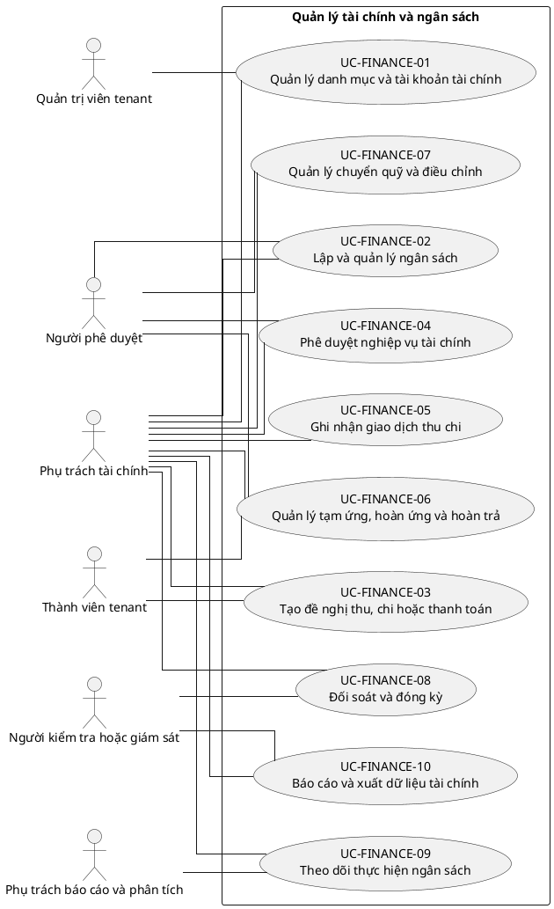

# UC-FINANCE — Quản lý tài chính và ngân sách

## 1. Thông tin tài liệu

| Thuộc tính | Nội dung |
|---|---|
| Mã nhóm Use Case | `UC-FINANCE` |
| Miền nghiệp vụ | Tài chính nội bộ |
| Mức ưu tiên | Nghiệp vụ lõi |
| Phiên bản mô hình | V4 — tinh gọn theo mục tiêu actor |

## 2. Mục tiêu

Quản lý ngân sách, giao dịch, phê duyệt, chứng từ và đối soát tài chính theo tenant.

## 3. Nguyên tắc phân rã

> Mỗi Use Case dưới đây đại diện cho một mục tiêu nghiệp vụ có kết quả quan sát được. Các thao tác chi tiết được hợp nhất vào cột **Nội dung bao hàm**, luồng nghiệp vụ và quy tắc; không tiếp tục tách thành các Use Case nhỏ.

## 4. Danh mục Use Case chính

| Mã | Use Case | Actor chính/hỗ trợ | Kết quả nghiệp vụ | Nội dung bao hàm |
|---|---|---|---|---|
| `UC-FINANCE-01` | **Quản lý danh mục và tài khoản tài chính** | `ACT-FINANCE-OFFICER` — Phụ trách tài chính `ACT-TENANT-ADMIN` — Quản trị viên tenant | Quỹ, tài khoản, danh mục, nguồn tiền và quy tắc được cấu hình. | Quỹ/tài khoản, danh mục thu chi, phương thức thanh toán và người phụ trách. |
| `UC-FINANCE-02` | **Lập và quản lý ngân sách** | `ACT-FINANCE-OFFICER` — Phụ trách tài chính `ACT-APPROVER` — Người phê duyệt | Ngân sách theo kỳ, đơn vị hoặc hoạt động được lập và phê duyệt. | Dự toán, phân bổ, điều chỉnh, phê duyệt và khóa ngân sách. |
| `UC-FINANCE-03` | **Tạo đề nghị thu, chi hoặc thanh toán** | `ACT-TENANT-MEMBER` — Thành viên tenant `ACT-FINANCE-OFFICER` — Phụ trách tài chính | Đề nghị tài chính hợp lệ được gửi kèm chứng từ. | Lưu nháp, nhập số tiền/danh mục, đính kèm, liên kết yêu cầu/sự kiện và gửi. |
| `UC-FINANCE-04` | **Phê duyệt nghiệp vụ tài chính** | `ACT-APPROVER` — Người phê duyệt `ACT-FINANCE-OFFICER` — Phụ trách tài chính | Đề nghị hoặc giao dịch được duyệt/từ chối theo thẩm quyền và hạn mức. | Phê duyệt nhiều cấp, yêu cầu bổ sung, kiểm tra ngân sách và phân tách trách nhiệm. |
| `UC-FINANCE-05` | **Ghi nhận giao dịch thu chi** | `ACT-FINANCE-OFFICER` — Phụ trách tài chính | Giao dịch được ghi nhận, cập nhật trạng thái và liên kết chứng từ. | Khoản thu/chi, ngày hạch toán, người phụ trách, trạng thái, soft delete và khôi phục. |
| `UC-FINANCE-06` | **Quản lý tạm ứng, hoàn ứng và hoàn trả** | `ACT-TENANT-MEMBER` — Thành viên tenant `ACT-FINANCE-OFFICER` — Phụ trách tài chính `ACT-APPROVER` — Người phê duyệt | Khoản tạm ứng được cấp, quyết toán hoặc hoàn trả có đối chiếu. | Tạo tạm ứng, giải ngân, nộp chứng từ, hoàn ứng, thu hồi dư và đóng hồ sơ. |
| `UC-FINANCE-07` | **Quản lý chuyển quỹ và điều chỉnh** | `ACT-FINANCE-OFFICER` — Phụ trách tài chính `ACT-APPROVER` — Người phê duyệt | Chuyển quỹ hoặc điều chỉnh giao dịch được phê duyệt và truy vết. | Chuyển giữa quỹ, bút toán điều chỉnh, hoàn giao dịch và lý do. |
| `UC-FINANCE-08` | **Đối soát và đóng kỳ** | `ACT-FINANCE-OFFICER` — Phụ trách tài chính `ACT-AUDITOR` — Người kiểm tra hoặc giám sát | Số dư, chứng từ và giao dịch được đối soát; kỳ được khóa có kiểm soát. | Đối soát, phát hiện chênh lệch, xử lý chênh lệch, khóa/mở kỳ theo quyền. |
| `UC-FINANCE-09` | **Theo dõi thực hiện ngân sách** | `ACT-FINANCE-OFFICER` — Phụ trách tài chính `ACT-REPORT-ANALYST` — Phụ trách báo cáo và phân tích | Mức sử dụng, cam kết và cảnh báo vượt ngân sách được hiển thị. | Theo dõi budget vs actual, cảnh báo hạn mức và dự báo. |
| `UC-FINANCE-10` | **Báo cáo và xuất dữ liệu tài chính** | `ACT-FINANCE-OFFICER` — Phụ trách tài chính `ACT-AUDITOR` — Người kiểm tra hoặc giám sát | Báo cáo thu chi, quỹ, ngân sách và chứng từ được xuất theo quyền. | Báo cáo kỳ, sổ quỹ, tổng hợp theo đơn vị/hoạt động và export. |

## 5. Luồng nghiệp vụ cấp nhóm

1. Actor khởi phát một Use Case theo quyền và tenant context hiện hành.
2. Hệ thống kiểm tra xác thực, membership, permission, trạng thái tenant và module.
3. Hệ thống thực hiện luồng nghiệp vụ chính và các kiểm tra dữ liệu cần thiết.
4. Kết quả nghiệp vụ được lưu, thông báo cho bên liên quan và ghi audit khi thuộc danh mục bắt buộc.

## 6. Quy tắc nghiệp vụ cốt lõi

- Số tiền giao dịch phải lớn hơn 0 và đúng đơn vị tiền tệ được hỗ trợ.
- Khoản chi phải tuân theo vai trò duyệt và hạn mức.
- Soft delete không được làm mất lịch sử đối soát và audit.
- Giao dịch, chứng từ, ngân sách và yêu cầu liên quan phải cùng tenant.

## 7. Quan hệ với nhóm Use Case khác

[`UC-REQUEST`](./10_UC-REQUEST.md), [`UC-DOCUMENT`](./11_UC-DOCUMENT.md), [`UC-RBAC`](./04_UC-RBAC.md), [`UC-DASHBOARD`](./19_UC-DASHBOARD.md), [`UC-AUDIT`](./21_UC-AUDIT.md)

## 8. Use Case Diagram

## 9. Ghi chú truy vết từ V3

Các phần tử chi tiết của V3 thuộc nhóm này được giữ làm nguồn phân tích nhưng đã được hợp nhất vào Use Case chính, luồng, quy tắc hoặc yêu cầu hệ thống. Không xem số lượng phần tử V3 là số lượng Use Case nghiệp vụ của V4.