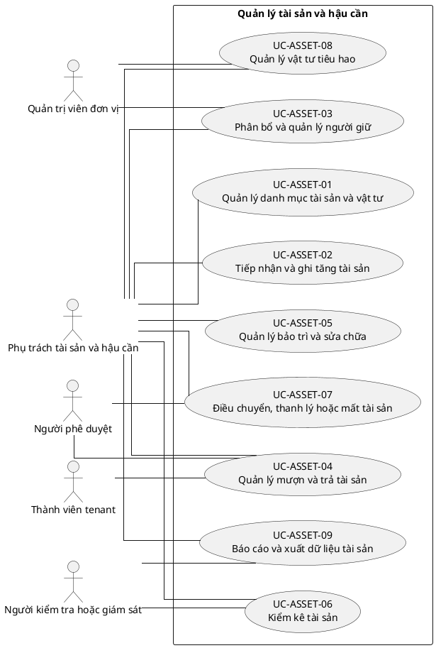

# UC-ASSET — Quản lý tài sản và hậu cần

## 1. Thông tin tài liệu

| Thuộc tính | Nội dung |
|---|---|
| Mã nhóm Use Case | `UC-ASSET` |
| Miền nghiệp vụ | Tài sản và vật tư |
| Mức ưu tiên | Nghiệp vụ |
| Phiên bản mô hình | V4 — tinh gọn theo mục tiêu actor |

## 2. Mục tiêu

Theo dõi tài sản, vật tư, người giữ, mượn trả, bảo trì và kiểm kê.

## 3. Nguyên tắc phân rã

> Mỗi Use Case dưới đây đại diện cho một mục tiêu nghiệp vụ có kết quả quan sát được. Các thao tác chi tiết được hợp nhất vào cột **Nội dung bao hàm**, luồng nghiệp vụ và quy tắc; không tiếp tục tách thành các Use Case nhỏ.

## 4. Danh mục Use Case chính

| Mã | Use Case | Actor chính/hỗ trợ | Kết quả nghiệp vụ | Nội dung bao hàm |
|---|---|---|---|---|
| `UC-ASSET-01` | **Quản lý danh mục tài sản và vật tư** | `ACT-LOGISTICS-OFFICER` — Phụ trách tài sản và hậu cần | Danh mục, loại, đơn vị tính, trạng thái và vị trí được cấu hình. | Loại tài sản, kho/vị trí, đơn vị tính, tình trạng và quy tắc mã. |
| `UC-ASSET-02` | **Tiếp nhận và ghi tăng tài sản** | `ACT-LOGISTICS-OFFICER` — Phụ trách tài sản và hậu cần | Tài sản mới được ghi nhận, gắn mã và chứng từ nguồn. | Nhập tài sản, số lượng/serial, QR/barcode, nguồn mua/tặng và hồ sơ. |
| `UC-ASSET-03` | **Phân bổ và quản lý người giữ** | `ACT-LOGISTICS-OFFICER` — Phụ trách tài sản và hậu cần `ACT-UNIT-ADMIN` — Quản trị viên đơn vị | Tài sản được bàn giao cho đơn vị hoặc người giữ có biên bản. | Phân bổ, bàn giao, đổi người giữ và xác nhận trách nhiệm. |
| `UC-ASSET-04` | **Quản lý mượn và trả tài sản** | `ACT-TENANT-MEMBER` — Thành viên tenant `ACT-LOGISTICS-OFFICER` — Phụ trách tài sản và hậu cần `ACT-APPROVER` — Người phê duyệt | Yêu cầu mượn được duyệt, giao và trả đúng trạng thái. | Đăng ký mượn, duyệt, bàn giao, gia hạn, trả, xử lý quá hạn/hư hỏng. |
| `UC-ASSET-05` | **Quản lý bảo trì và sửa chữa** | `ACT-LOGISTICS-OFFICER` — Phụ trách tài sản và hậu cần | Nhu cầu bảo trì được lập lịch, thực hiện và ghi chi phí/kết quả. | Báo hỏng, lập lịch, giao sửa, nghiệm thu và cập nhật tình trạng. |
| `UC-ASSET-06` | **Kiểm kê tài sản** | `ACT-LOGISTICS-OFFICER` — Phụ trách tài sản và hậu cần `ACT-AUDITOR` — Người kiểm tra hoặc giám sát | Đợt kiểm kê xác định chênh lệch và phương án xử lý. | Tạo đợt, quét/đếm, đối chiếu, xử lý thừa thiếu và khóa kết quả. |
| `UC-ASSET-07` | **Điều chuyển, thanh lý hoặc mất tài sản** | `ACT-LOGISTICS-OFFICER` — Phụ trách tài sản và hậu cần `ACT-APPROVER` — Người phê duyệt | Tài sản được chuyển, thanh lý, tiêu hủy hoặc ghi mất theo phê duyệt. | Điều chuyển kho/đơn vị, đề nghị thanh lý, phê duyệt và biên bản. |
| `UC-ASSET-08` | **Quản lý vật tư tiêu hao** | `ACT-LOGISTICS-OFFICER` — Phụ trách tài sản và hậu cần `ACT-UNIT-ADMIN` — Quản trị viên đơn vị | Nhập, xuất, tồn và định mức vật tư được theo dõi. | Nhập kho, cấp phát, hoàn trả, tồn tối thiểu và cảnh báo. |
| `UC-ASSET-09` | **Báo cáo và xuất dữ liệu tài sản** | `ACT-LOGISTICS-OFFICER` — Phụ trách tài sản và hậu cần `ACT-AUDITOR` — Người kiểm tra hoặc giám sát | Báo cáo tồn, tình trạng, mượn trả, bảo trì và kiểm kê được xuất. | Tra cứu, lọc, báo cáo và export. |

## 5. Luồng nghiệp vụ cấp nhóm

1. Actor khởi phát một Use Case theo quyền và tenant context hiện hành.
2. Hệ thống kiểm tra xác thực, membership, permission, trạng thái tenant và module.
3. Hệ thống thực hiện luồng nghiệp vụ chính và các kiểm tra dữ liệu cần thiết.
4. Kết quả nghiệp vụ được lưu, thông báo cho bên liên quan và ghi audit khi thuộc danh mục bắt buộc.

## 6. Quy tắc nghiệp vụ cốt lõi

- Mỗi tài sản thuộc một tenant và có trạng thái nhất quán.
- Không thể đồng thời bàn giao cùng một tài sản đơn chiếc cho nhiều người.
- Thanh lý hoặc xóa không được làm mất lịch sử custody và kiểm kê.

## 7. Quan hệ với nhóm Use Case khác

[`UC-MEMBER`](./09_UC-MEMBER.md), [`UC-ORG`](./05_UC-ORG.md), [`UC-REQUEST`](./10_UC-REQUEST.md), [`UC-FINANCE`](./12_UC-FINANCE.md), [`UC-AUDIT`](./21_UC-AUDIT.md)

## 8. Use Case Diagram

## 9. Ghi chú truy vết từ V3

Các phần tử chi tiết của V3 thuộc nhóm này được giữ làm nguồn phân tích nhưng đã được hợp nhất vào Use Case chính, luồng, quy tắc hoặc yêu cầu hệ thống. Không xem số lượng phần tử V3 là số lượng Use Case nghiệp vụ của V4.