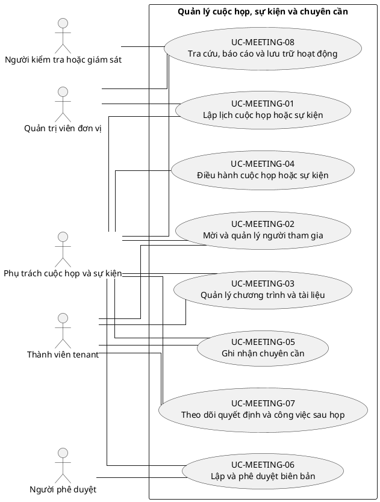

# UC-MEETING — Quản lý cuộc họp, sự kiện và chuyên cần

## 1. Thông tin tài liệu

| Thuộc tính | Nội dung |
|---|---|
| Mã nhóm Use Case | `UC-MEETING` |
| Miền nghiệp vụ | Hoạt động tổ chức |
| Mức ưu tiên | Nghiệp vụ |
| Phiên bản mô hình | V4 — tinh gọn theo mục tiêu actor |

## 2. Mục tiêu

Quản lý lịch, người tham gia, nội dung, chuyên cần, biên bản và công việc sau cuộc họp/sự kiện.

## 3. Nguyên tắc phân rã

> Mỗi Use Case dưới đây đại diện cho một mục tiêu nghiệp vụ có kết quả quan sát được. Các thao tác chi tiết được hợp nhất vào cột **Nội dung bao hàm**, luồng nghiệp vụ và quy tắc; không tiếp tục tách thành các Use Case nhỏ.

## 4. Danh mục Use Case chính

| Mã | Use Case | Actor chính/hỗ trợ | Kết quả nghiệp vụ | Nội dung bao hàm |
|---|---|---|---|---|
| `UC-MEETING-01` | **Lập lịch cuộc họp hoặc sự kiện** | `ACT-MEETING-COORDINATOR` — Phụ trách cuộc họp và sự kiện `ACT-UNIT-ADMIN` — Quản trị viên đơn vị | Hoạt động được tạo với thời gian, địa điểm, phạm vi và người phụ trách. | Tạo/sửa/lặp lịch, loại hoạt động, địa điểm/online, đơn vị tham gia và xung đột lịch. |
| `UC-MEETING-02` | **Mời và quản lý người tham gia** | `ACT-MEETING-COORDINATOR` — Phụ trách cuộc họp và sự kiện `ACT-TENANT-MEMBER` — Thành viên tenant | Danh sách mời và phản hồi tham dự được ghi nhận. | Mời theo đơn vị/role/người, RSVP, khách ngoài và nhắc lịch. |
| `UC-MEETING-03` | **Quản lý chương trình và tài liệu** | `ACT-MEETING-COORDINATOR` — Phụ trách cuộc họp và sự kiện `ACT-TENANT-MEMBER` — Thành viên tenant | Agenda, tài liệu và đề xuất nội dung được chuẩn bị. | Agenda, tài liệu, đề xuất mục, phân công trình bày và phiên bản. |
| `UC-MEETING-04` | **Điều hành cuộc họp hoặc sự kiện** | `ACT-MEETING-COORDINATOR` — Phụ trách cuộc họp và sự kiện | Trạng thái hoạt động, nội dung thực tế và thay đổi tại chỗ được ghi nhận. | Bắt đầu/kết thúc, cập nhật agenda, ghi chú nhanh và xử lý hủy/hoãn. |
| `UC-MEETING-05` | **Ghi nhận chuyên cần** | `ACT-MEETING-COORDINATOR` — Phụ trách cuộc họp và sự kiện `ACT-TENANT-MEMBER` — Thành viên tenant | Trạng thái tham dự được xác nhận theo thành viên. | Check-in QR/thủ công, đúng giờ/trễ/vắng/có phép, chỉnh sửa có lý do. |
| `UC-MEETING-06` | **Lập và phê duyệt biên bản** | `ACT-MEETING-COORDINATOR` — Phụ trách cuộc họp và sự kiện `ACT-APPROVER` — Người phê duyệt | Biên bản, quyết định và kết luận được phê duyệt/phát hành. | Soạn biên bản, xác nhận người tham dự, duyệt, phát hành và phiên bản. |
| `UC-MEETING-07` | **Theo dõi quyết định và công việc sau họp** | `ACT-MEETING-COORDINATOR` — Phụ trách cuộc họp và sự kiện `ACT-TENANT-MEMBER` — Thành viên tenant | Nhiệm vụ và quyết định được giao, theo dõi và đóng. | Tạo action item, người phụ trách, hạn, nhắc việc và cập nhật kết quả. |
| `UC-MEETING-08` | **Tra cứu, báo cáo và lưu trữ hoạt động** | `ACT-MEETING-COORDINATOR` — Phụ trách cuộc họp và sự kiện `ACT-UNIT-ADMIN` — Quản trị viên đơn vị `ACT-AUDITOR` — Người kiểm tra hoặc giám sát | Lịch sử họp, chuyên cần, biên bản và báo cáo được tra cứu. | Calendar/list, báo cáo chuyên cần, export và archive. |

## 5. Luồng nghiệp vụ cấp nhóm

1. Actor khởi phát một Use Case theo quyền và tenant context hiện hành.
2. Hệ thống kiểm tra xác thực, membership, permission, trạng thái tenant và module.
3. Hệ thống thực hiện luồng nghiệp vụ chính và các kiểm tra dữ liệu cần thiết.
4. Kết quả nghiệp vụ được lưu, thông báo cho bên liên quan và ghi audit khi thuộc danh mục bắt buộc.

## 6. Quy tắc nghiệp vụ cốt lõi

- Meeting, attendance và participant phải cùng tenant.
- Chỉnh sửa chuyên cần sau khi khóa phải có quyền và lý do.
- Biên bản phát hành phải có version history.

## 7. Quan hệ với nhóm Use Case khác

[`UC-MEMBER`](./09_UC-MEMBER.md), [`UC-ORG`](./05_UC-ORG.md), [`UC-DOCUMENT`](./11_UC-DOCUMENT.md), [`UC-NOTIFICATION`](./18_UC-NOTIFICATION.md), [`UC-DISCIPLINE`](./15_UC-DISCIPLINE.md), [`UC-AUDIT`](./21_UC-AUDIT.md)

## 8. Use Case Diagram

## 9. Ghi chú truy vết từ V3

Các phần tử chi tiết của V3 thuộc nhóm này được giữ làm nguồn phân tích nhưng đã được hợp nhất vào Use Case chính, luồng, quy tắc hoặc yêu cầu hệ thống. Không xem số lượng phần tử V3 là số lượng Use Case nghiệp vụ của V4.