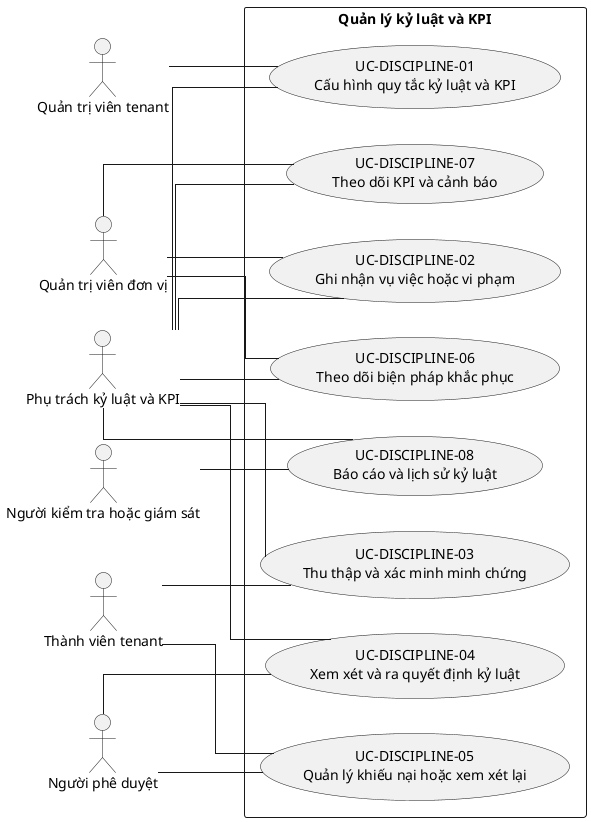

# UC-DISCIPLINE — Quản lý kỷ luật và KPI

## 1. Thông tin tài liệu

| Thuộc tính | Nội dung |
|---|---|
| Mã nhóm Use Case | `UC-DISCIPLINE` |
| Miền nghiệp vụ | Kỷ luật và tuân thủ |
| Mức ưu tiên | Nghiệp vụ |
| Phiên bản mô hình | V4 — tinh gọn theo mục tiêu actor |

## 2. Mục tiêu

Quản lý quy tắc, vụ việc, minh chứng, quyết định kỷ luật, khiếu nại và theo dõi khắc phục.

## 3. Nguyên tắc phân rã

> Mỗi Use Case dưới đây đại diện cho một mục tiêu nghiệp vụ có kết quả quan sát được. Các thao tác chi tiết được hợp nhất vào cột **Nội dung bao hàm**, luồng nghiệp vụ và quy tắc; không tiếp tục tách thành các Use Case nhỏ.

## 4. Danh mục Use Case chính

| Mã | Use Case | Actor chính/hỗ trợ | Kết quả nghiệp vụ | Nội dung bao hàm |
|---|---|---|---|---|
| `UC-DISCIPLINE-01` | **Cấu hình quy tắc kỷ luật và KPI** | `ACT-DISCIPLINE-OFFICER` — Phụ trách kỷ luật và KPI `ACT-TENANT-ADMIN` — Quản trị viên tenant | Loại vi phạm, ngưỡng, mức xử lý và quy trình được cấu hình. | Danh mục vi phạm, KPI, ngưỡng cảnh báo, mức kỷ luật và workflow. |
| `UC-DISCIPLINE-02` | **Ghi nhận vụ việc hoặc vi phạm** | `ACT-DISCIPLINE-OFFICER` — Phụ trách kỷ luật và KPI `ACT-UNIT-ADMIN` — Quản trị viên đơn vị | Vụ việc được tạo với đối tượng, thời gian, nguồn và mô tả. | Tạo hồ sơ, liên kết attendance/KPI/yêu cầu và thông báo tiếp nhận. |
| `UC-DISCIPLINE-03` | **Thu thập và xác minh minh chứng** | `ACT-DISCIPLINE-OFFICER` — Phụ trách kỷ luật và KPI `ACT-TENANT-MEMBER` — Thành viên tenant | Minh chứng và ý kiến giải trình được tập hợp có kiểm soát. | Tài liệu, người liên quan, giải trình, xác minh và bảo mật hồ sơ. |
| `UC-DISCIPLINE-04` | **Xem xét và ra quyết định kỷ luật** | `ACT-DISCIPLINE-OFFICER` — Phụ trách kỷ luật và KPI `ACT-APPROVER` — Người phê duyệt | Hồ sơ được kết luận, áp dụng hoặc bác bỏ biện pháp xử lý. | Đánh giá, họp xem xét, đề xuất, phê duyệt, quyết định và thông báo. |
| `UC-DISCIPLINE-05` | **Quản lý khiếu nại hoặc xem xét lại** | `ACT-TENANT-MEMBER` — Thành viên tenant `ACT-APPROVER` — Người phê duyệt | Khiếu nại được tiếp nhận, đánh giá và kết luận độc lập theo chính sách. | Gửi khiếu nại, bổ sung, phân công, quyết định giữ/sửa/hủy. |
| `UC-DISCIPLINE-06` | **Theo dõi biện pháp khắc phục** | `ACT-DISCIPLINE-OFFICER` — Phụ trách kỷ luật và KPI `ACT-UNIT-ADMIN` — Quản trị viên đơn vị | Nghĩa vụ khắc phục, thời hạn và kết quả được theo dõi. | Kế hoạch khắc phục, nhắc hạn, xác nhận hoàn thành và đóng vụ việc. |
| `UC-DISCIPLINE-07` | **Theo dõi KPI và cảnh báo** | `ACT-DISCIPLINE-OFFICER` — Phụ trách kỷ luật và KPI `ACT-UNIT-ADMIN` — Quản trị viên đơn vị | KPI, vắng mặt và ngưỡng cảnh báo được tổng hợp. | Đồng bộ dữ liệu, tính chỉ số, cảnh báo và xác minh ngoại lệ. |
| `UC-DISCIPLINE-08` | **Báo cáo và lịch sử kỷ luật** | `ACT-DISCIPLINE-OFFICER` — Phụ trách kỷ luật và KPI `ACT-AUDITOR` — Người kiểm tra hoặc giám sát | Báo cáo, lịch sử quyết định và số liệu tuân thủ được xuất theo quyền. | Tìm kiếm, thống kê, export, ẩn dữ liệu nhạy cảm và retention. |

## 5. Luồng nghiệp vụ cấp nhóm

1. Actor khởi phát một Use Case theo quyền và tenant context hiện hành.
2. Hệ thống kiểm tra xác thực, membership, permission, trạng thái tenant và module.
3. Hệ thống thực hiện luồng nghiệp vụ chính và các kiểm tra dữ liệu cần thiết.
4. Kết quả nghiệp vụ được lưu, thông báo cho bên liên quan và ghi audit khi thuộc danh mục bắt buộc.

## 6. Quy tắc nghiệp vụ cốt lõi

- Hồ sơ kỷ luật phải giới hạn quyền xem theo mức nhạy cảm.
- Người bị xem xét phải có quyền giải trình và khiếu nại theo chính sách.
- Quyết định đã ban hành không được sửa trực tiếp; phải có quyết định thay thế hoặc xem xét lại.

## 7. Quan hệ với nhóm Use Case khác

[`UC-MEMBER`](./09_UC-MEMBER.md), [`UC-MEETING`](./14_UC-MEETING.md), [`UC-EVALUATION`](./16_UC-EVALUATION.md), [`UC-DOCUMENT`](./11_UC-DOCUMENT.md), [`UC-AUDIT`](./21_UC-AUDIT.md)

## 8. Use Case Diagram

## 9. Ghi chú truy vết từ V3

Các phần tử chi tiết của V3 thuộc nhóm này được giữ làm nguồn phân tích nhưng đã được hợp nhất vào Use Case chính, luồng, quy tắc hoặc yêu cầu hệ thống. Không xem số lượng phần tử V3 là số lượng Use Case nghiệp vụ của V4.