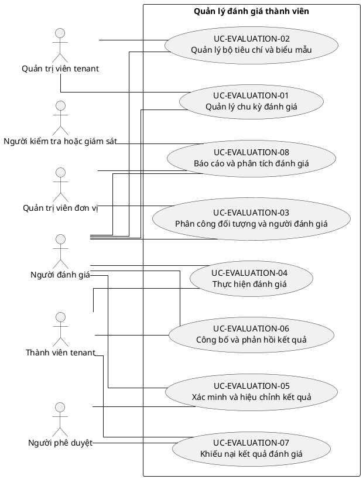

# UC-EVALUATION — Quản lý đánh giá thành viên

## 1. Thông tin tài liệu

| Thuộc tính | Nội dung |
|---|---|
| Mã nhóm Use Case | `UC-EVALUATION` |
| Miền nghiệp vụ | Đánh giá hiệu suất |
| Mức ưu tiên | Nghiệp vụ |
| Phiên bản mô hình | V4 — tinh gọn theo mục tiêu actor |

## 2. Mục tiêu

Quản lý chu kỳ, tiêu chí, phân công, chấm điểm, hiệu chỉnh, công bố và khiếu nại đánh giá.

## 3. Nguyên tắc phân rã

> Mỗi Use Case dưới đây đại diện cho một mục tiêu nghiệp vụ có kết quả quan sát được. Các thao tác chi tiết được hợp nhất vào cột **Nội dung bao hàm**, luồng nghiệp vụ và quy tắc; không tiếp tục tách thành các Use Case nhỏ.

## 4. Danh mục Use Case chính

| Mã | Use Case | Actor chính/hỗ trợ | Kết quả nghiệp vụ | Nội dung bao hàm |
|---|---|---|---|---|
| `UC-EVALUATION-01` | **Quản lý chu kỳ đánh giá** | `ACT-EVALUATOR` — Người đánh giá `ACT-TENANT-ADMIN` — Quản trị viên tenant | Chu kỳ đánh giá được tạo, kích hoạt, khóa và lưu trữ. | Loại chu kỳ, phạm vi, mốc thời gian, trạng thái và sao chép chu kỳ. |
| `UC-EVALUATION-02` | **Quản lý bộ tiêu chí và biểu mẫu** | `ACT-EVALUATOR` — Người đánh giá `ACT-TENANT-ADMIN` — Quản trị viên tenant | Tiêu chí, trọng số, thang điểm và yêu cầu minh chứng được cấu hình. | Tạo/sửa/version tiêu chí, nhóm cấu phần, công thức và form. |
| `UC-EVALUATION-03` | **Phân công đối tượng và người đánh giá** | `ACT-EVALUATOR` — Người đánh giá `ACT-UNIT-ADMIN` — Quản trị viên đơn vị | Người được đánh giá, evaluator và phạm vi đơn vị được phân công. | Danh sách đối tượng, tự đánh giá, cấp trên/đồng cấp, thay người và xung đột lợi ích. |
| `UC-EVALUATION-04` | **Thực hiện đánh giá** | `ACT-TENANT-MEMBER` — Thành viên tenant `ACT-EVALUATOR` — Người đánh giá | Phiếu đánh giá và minh chứng được lưu, gửi đúng hạn. | Tự đánh giá, đánh giá người khác, nhận xét, điểm, minh chứng, lưu nháp và gửi. |
| `UC-EVALUATION-05` | **Xác minh và hiệu chỉnh kết quả** | `ACT-EVALUATOR` — Người đánh giá `ACT-APPROVER` — Người phê duyệt | Điểm được kiểm tra, calibration và phê duyệt trước công bố. | Kiểm tra thiếu dữ liệu, moderation, hội đồng, điều chỉnh có lý do và khóa điểm. |
| `UC-EVALUATION-06` | **Công bố và phản hồi kết quả** | `ACT-EVALUATOR` — Người đánh giá `ACT-TENANT-MEMBER` — Thành viên tenant | Kết quả được công bố theo quyền và người được đánh giá phản hồi. | Công bố, xem chi tiết, xác nhận đã xem, kế hoạch phát triển và phản hồi. |
| `UC-EVALUATION-07` | **Khiếu nại kết quả đánh giá** | `ACT-TENANT-MEMBER` — Thành viên tenant `ACT-APPROVER` — Người phê duyệt | Khiếu nại được xem xét và kết quả cuối cùng được ghi nhận. | Gửi khiếu nại, bổ sung minh chứng, phân công, quyết định và cập nhật kết quả. |
| `UC-EVALUATION-08` | **Báo cáo và phân tích đánh giá** | `ACT-EVALUATOR` — Người đánh giá `ACT-UNIT-ADMIN` — Quản trị viên đơn vị `ACT-AUDITOR` — Người kiểm tra hoặc giám sát | Kết quả được tổng hợp theo kỳ, đơn vị và tiêu chí. | Báo cáo cá nhân/đơn vị, phân phối điểm, xu hướng, export và ẩn danh. |

## 5. Luồng nghiệp vụ cấp nhóm

1. Actor khởi phát một Use Case theo quyền và tenant context hiện hành.
2. Hệ thống kiểm tra xác thực, membership, permission, trạng thái tenant và module.
3. Hệ thống thực hiện luồng nghiệp vụ chính và các kiểm tra dữ liệu cần thiết.
4. Kết quả nghiệp vụ được lưu, thông báo cho bên liên quan và ghi audit khi thuộc danh mục bắt buộc.

## 6. Quy tắc nghiệp vụ cốt lõi

- Điểm phải truy vết được nguồn, người chấm, thời điểm và minh chứng.
- Người không có unit permission không được đánh giá hoặc xem kết quả ngoài phạm vi.
- Kết quả đã khóa chỉ được thay đổi qua quy trình hiệu chỉnh hoặc khiếu nại.

## 7. Quan hệ với nhóm Use Case khác

[`UC-MEMBER`](./09_UC-MEMBER.md), [`UC-ORG`](./05_UC-ORG.md), [`UC-RBAC`](./04_UC-RBAC.md), [`UC-DISCIPLINE`](./15_UC-DISCIPLINE.md), [`UC-AUDIT`](./21_UC-AUDIT.md)

## 8. Use Case Diagram

## 9. Ghi chú truy vết từ V3

Các phần tử chi tiết của V3 thuộc nhóm này được giữ làm nguồn phân tích nhưng đã được hợp nhất vào Use Case chính, luồng, quy tắc hoặc yêu cầu hệ thống. Không xem số lượng phần tử V3 là số lượng Use Case nghiệp vụ của V4.