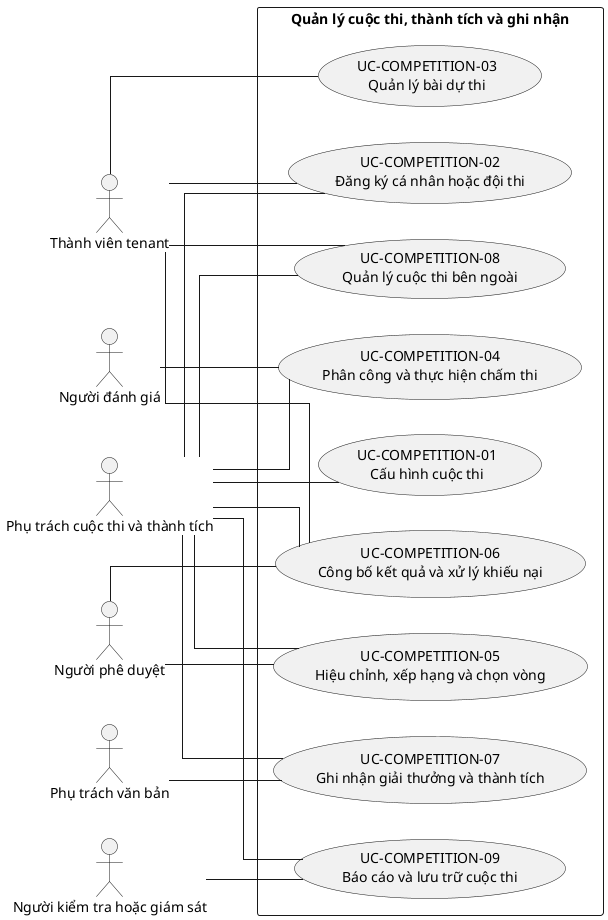

# UC-COMPETITION — Quản lý cuộc thi, thành tích và ghi nhận

## 1. Thông tin tài liệu

| Thuộc tính | Nội dung |
|---|---|
| Mã nhóm Use Case | `UC-COMPETITION` |
| Miền nghiệp vụ | Hoạt động và thành tích |
| Mức ưu tiên | Nghiệp vụ |
| Phiên bản mô hình | V4 — tinh gọn theo mục tiêu actor |

## 2. Mục tiêu

Quản lý cuộc thi nội bộ, tham gia, bài dự thi, chấm điểm, kết quả và thành tích.

## 3. Nguyên tắc phân rã

> Mỗi Use Case dưới đây đại diện cho một mục tiêu nghiệp vụ có kết quả quan sát được. Các thao tác chi tiết được hợp nhất vào cột **Nội dung bao hàm**, luồng nghiệp vụ và quy tắc; không tiếp tục tách thành các Use Case nhỏ.

## 4. Danh mục Use Case chính

| Mã | Use Case | Actor chính/hỗ trợ | Kết quả nghiệp vụ | Nội dung bao hàm |
|---|---|---|---|---|
| `UC-COMPETITION-01` | **Cấu hình cuộc thi** | `ACT-COMPETITION-MANAGER` — Phụ trách cuộc thi và thành tích | Cuộc thi, vòng thi, tiêu chí, điều kiện và thời gian được thiết lập. | Tạo/sửa, loại cuộc thi, vòng, tiêu chí, điều kiện, quyền và sao chép cấu hình. |
| `UC-COMPETITION-02` | **Đăng ký cá nhân hoặc đội thi** | `ACT-TENANT-MEMBER` — Thành viên tenant `ACT-COMPETITION-MANAGER` — Phụ trách cuộc thi và thành tích | Cá nhân/đội hợp lệ được đăng ký và quản lý thành viên. | Mở/đóng đăng ký, tạo đội, mời/chấp nhận thành viên và kiểm tra điều kiện. |
| `UC-COMPETITION-03` | **Quản lý bài dự thi** | `ACT-TENANT-MEMBER` — Thành viên tenant | Bài dự thi và sản phẩm được nộp, cập nhật hoặc rút trong thời hạn. | Nộp, sửa trước hạn, upload minh chứng/sản phẩm, kiểm tra đầy đủ và rút bài. |
| `UC-COMPETITION-04` | **Phân công và thực hiện chấm thi** | `ACT-COMPETITION-MANAGER` — Phụ trách cuộc thi và thành tích `ACT-EVALUATOR` — Người đánh giá | Giám khảo được phân công và ghi điểm/nhận xét theo tiêu chí. | Phân công, chấm, nhận xét, xung đột lợi ích và hoàn tất phiếu. |
| `UC-COMPETITION-05` | **Hiệu chỉnh, xếp hạng và chọn vòng** | `ACT-COMPETITION-MANAGER` — Phụ trách cuộc thi và thành tích `ACT-APPROVER` — Người phê duyệt | Điểm được moderation, xếp hạng và xác định người vào vòng tiếp theo. | Hiệu chỉnh, tổng hợp, tie-break, xếp hạng và duyệt danh sách. |
| `UC-COMPETITION-06` | **Công bố kết quả và xử lý khiếu nại** | `ACT-COMPETITION-MANAGER` — Phụ trách cuộc thi và thành tích `ACT-TENANT-MEMBER` — Thành viên tenant `ACT-APPROVER` — Người phê duyệt | Kết quả vòng/chung cuộc được công bố và khiếu nại được xử lý. | Công bố, gửi khiếu nại, xem xét và cập nhật kết quả cuối cùng. |
| `UC-COMPETITION-07` | **Ghi nhận giải thưởng và thành tích** | `ACT-COMPETITION-MANAGER` — Phụ trách cuộc thi và thành tích `ACT-DOCUMENT-OFFICER` — Phụ trách văn bản | Giải thưởng, chứng nhận và thành tích cá nhân/đơn vị được ghi nhận. | Giải thưởng, giấy chứng nhận, quyết định khen thưởng và hồ sơ thành tích. |
| `UC-COMPETITION-08` | **Quản lý cuộc thi bên ngoài** | `ACT-COMPETITION-MANAGER` — Phụ trách cuộc thi và thành tích `ACT-TENANT-MEMBER` — Thành viên tenant | Việc đề cử, tham gia và kết quả cuộc thi ngoài được theo dõi. | Đề cử, hồ sơ tham gia, trạng thái, chi phí/tài trợ và kết quả. |
| `UC-COMPETITION-09` | **Báo cáo và lưu trữ cuộc thi** | `ACT-COMPETITION-MANAGER` — Phụ trách cuộc thi và thành tích `ACT-AUDITOR` — Người kiểm tra hoặc giám sát | Danh sách, điểm, kết quả và minh chứng được xuất và lưu trữ. | Báo cáo, export, liên kết tài liệu/tài chính, quyền hình ảnh và archive. |

## 5. Luồng nghiệp vụ cấp nhóm

1. Actor khởi phát một Use Case theo quyền và tenant context hiện hành.
2. Hệ thống kiểm tra xác thực, membership, permission, trạng thái tenant và module.
3. Hệ thống thực hiện luồng nghiệp vụ chính và các kiểm tra dữ liệu cần thiết.
4. Kết quả nghiệp vụ được lưu, thông báo cho bên liên quan và ghi audit khi thuộc danh mục bắt buộc.

## 6. Quy tắc nghiệp vụ cốt lõi

- Bài dự thi sau hạn chỉ được thay đổi theo quyền ngoại lệ có audit.
- Giám khảo có xung đột lợi ích không được chấm đối tượng liên quan.
- Công bố kết quả phải sử dụng phiên bản điểm đã khóa/phê duyệt.

## 7. Quan hệ với nhóm Use Case khác

[`UC-MEMBER`](./09_UC-MEMBER.md), [`UC-EVALUATION`](./16_UC-EVALUATION.md), [`UC-DOCUMENT`](./11_UC-DOCUMENT.md), [`UC-FINANCE`](./12_UC-FINANCE.md), [`UC-AUDIT`](./21_UC-AUDIT.md)

## 8. Use Case Diagram

## 9. Ghi chú truy vết từ V3

Các phần tử chi tiết của V3 thuộc nhóm này được giữ làm nguồn phân tích nhưng đã được hợp nhất vào Use Case chính, luồng, quy tắc hoặc yêu cầu hệ thống. Không xem số lượng phần tử V3 là số lượng Use Case nghiệp vụ của V4.