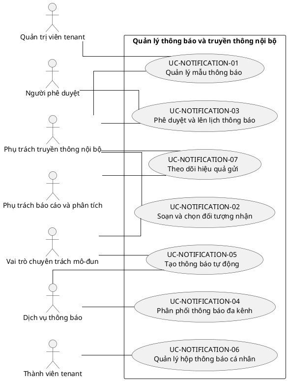

# UC-NOTIFICATION — Quản lý thông báo và truyền thông nội bộ

## 1. Thông tin tài liệu

| Thuộc tính | Nội dung |
|---|---|
| Mã nhóm Use Case | `UC-NOTIFICATION` |
| Miền nghiệp vụ | Truyền thông nội bộ |
| Mức ưu tiên | Nền tảng hỗ trợ |
| Phiên bản mô hình | V4 — tinh gọn theo mục tiêu actor |

## 2. Mục tiêu

Soạn, phê duyệt, phân phối và theo dõi thông báo đa kênh theo tenant và phạm vi người nhận.

## 3. Nguyên tắc phân rã

> Mỗi Use Case dưới đây đại diện cho một mục tiêu nghiệp vụ có kết quả quan sát được. Các thao tác chi tiết được hợp nhất vào cột **Nội dung bao hàm**, luồng nghiệp vụ và quy tắc; không tiếp tục tách thành các Use Case nhỏ.

## 4. Danh mục Use Case chính

| Mã | Use Case | Actor chính/hỗ trợ | Kết quả nghiệp vụ | Nội dung bao hàm |
|---|---|---|---|---|
| `UC-NOTIFICATION-01` | **Quản lý mẫu thông báo** | `ACT-COMMUNICATION-OFFICER` — Phụ trách truyền thông nội bộ `ACT-TENANT-ADMIN` — Quản trị viên tenant | Mẫu thông báo, biến dữ liệu, bản dịch và phiên bản được quản lý. | Tạo/sửa/version template, biến dữ liệu, preview và localization. |
| `UC-NOTIFICATION-02` | **Soạn và chọn đối tượng nhận** | `ACT-COMMUNICATION-OFFICER` — Phụ trách truyền thông nội bộ `ACT-MODULE-SPECIALIST` — Vai trò chuyên trách mô-đun | Thông báo nháp có nội dung, kênh và nhóm người nhận hợp lệ. | Soạn nháp, chọn tenant/đơn vị/role/người cụ thể, kênh và kiểm tra phạm vi. |
| `UC-NOTIFICATION-03` | **Phê duyệt và lên lịch thông báo** | `ACT-COMMUNICATION-OFFICER` — Phụ trách truyền thông nội bộ `ACT-APPROVER` — Người phê duyệt | Thông báo được duyệt, gửi ngay hoặc lên lịch. | Gửi duyệt, phê duyệt/từ chối, lịch gửi, sửa/hủy lịch và thông báo khẩn cấp. |
| `UC-NOTIFICATION-04` | **Phân phối thông báo đa kênh** | `ACT-NOTIFICATION-SERVICE` — Dịch vụ thông báo | Thông báo được gửi qua kênh đã cấu hình và có trạng thái gửi. | In-app, email, SMS, push, webhook, retry và xử lý bounce. |
| `UC-NOTIFICATION-05` | **Tạo thông báo tự động** | `ACT-MODULE-SPECIALIST` — Vai trò chuyên trách mô-đun `ACT-NOTIFICATION-SERVICE` — Dịch vụ thông báo | Sự kiện hệ thống tạo thông báo, nhắc việc, escalation hoặc digest. | Event-driven, reminder, escalation, digest định kỳ và chống trùng. |
| `UC-NOTIFICATION-06` | **Quản lý hộp thông báo cá nhân** | `ACT-TENANT-MEMBER` — Thành viên tenant | Người dùng tra cứu, đọc, xác nhận và lưu trữ thông báo. | Tìm kiếm/lọc, đánh dấu đọc, xác nhận đã hiểu, lưu trữ/xóa cá nhân. |
| `UC-NOTIFICATION-07` | **Theo dõi hiệu quả gửi** | `ACT-COMMUNICATION-OFFICER` — Phụ trách truyền thông nội bộ `ACT-REPORT-ANALYST` — Phụ trách báo cáo và phân tích | Trạng thái gửi, mở, xác nhận và lỗi được báo cáo. | Delivery status, open/ack rate, lỗi kênh, export và báo cáo. |

## 5. Luồng nghiệp vụ cấp nhóm

1. Actor khởi phát một Use Case theo quyền và tenant context hiện hành.
2. Hệ thống kiểm tra xác thực, membership, permission, trạng thái tenant và module.
3. Hệ thống thực hiện luồng nghiệp vụ chính và các kiểm tra dữ liệu cần thiết.
4. Kết quả nghiệp vụ được lưu, thông báo cho bên liên quan và ghi audit khi thuộc danh mục bắt buộc.

## 6. Quy tắc nghiệp vụ cốt lõi

- Người nhận phải thuộc đúng tenant và phạm vi quyền của người gửi.
- Hệ thống phải tôn trọng tùy chọn người dùng, giờ yên lặng và giới hạn chống spam, trừ thông báo khẩn cấp có quyền.
- Nội dung tự động không được gửi nếu sự kiện nguồn bị rollback.

## 7. Quan hệ với nhóm Use Case khác

[`UC-SETTING`](./08_UC-SETTING.md), [`UC-MEMBER`](./09_UC-MEMBER.md), [`UC-BRAND`](./06_UC-BRAND.md), [`UC-AUDIT`](./21_UC-AUDIT.md)

## 8. Use Case Diagram

## 9. Ghi chú truy vết từ V3

Các phần tử chi tiết của V3 thuộc nhóm này được giữ làm nguồn phân tích nhưng đã được hợp nhất vào Use Case chính, luồng, quy tắc hoặc yêu cầu hệ thống. Không xem số lượng phần tử V3 là số lượng Use Case nghiệp vụ của V4.