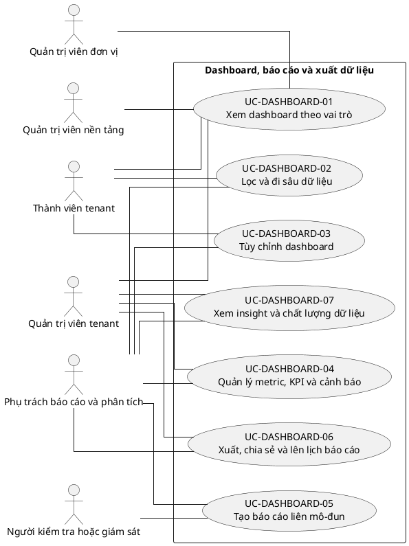

# UC-DASHBOARD — Dashboard, báo cáo và xuất dữ liệu

## 1. Thông tin tài liệu

| Thuộc tính | Nội dung |
|---|---|
| Mã nhóm Use Case | `UC-DASHBOARD` |
| Miền nghiệp vụ | Phân tích vận hành |
| Mức ưu tiên | Nền tảng hỗ trợ |
| Phiên bản mô hình | V4 — tinh gọn theo mục tiêu actor |

## 2. Mục tiêu

Cung cấp chỉ số, báo cáo, cảnh báo và khả năng drill-down theo quyền và tenant context.

## 3. Nguyên tắc phân rã

> Mỗi Use Case dưới đây đại diện cho một mục tiêu nghiệp vụ có kết quả quan sát được. Các thao tác chi tiết được hợp nhất vào cột **Nội dung bao hàm**, luồng nghiệp vụ và quy tắc; không tiếp tục tách thành các Use Case nhỏ.

## 4. Danh mục Use Case chính

| Mã | Use Case | Actor chính/hỗ trợ | Kết quả nghiệp vụ | Nội dung bao hàm |
|---|---|---|---|---|
| `UC-DASHBOARD-01` | **Xem dashboard theo vai trò** | `ACT-TENANT-MEMBER` — Thành viên tenant `ACT-UNIT-ADMIN` — Quản trị viên đơn vị `ACT-TENANT-ADMIN` — Quản trị viên tenant `ACT-PLATFORM-ADMIN` — Quản trị viên nền tảng | Dashboard cá nhân, đơn vị, tenant hoặc nền tảng hiển thị dữ liệu phù hợp quyền. | Chọn dashboard, chỉ số tổng hợp, xu hướng, cảnh báo và nguồn dữ liệu. |
| `UC-DASHBOARD-02` | **Lọc và đi sâu dữ liệu** | `ACT-TENANT-MEMBER` — Thành viên tenant `ACT-REPORT-ANALYST` — Phụ trách báo cáo và phân tích | Người dùng lọc theo thời gian/đơn vị/module/trạng thái và drill-down đến dữ liệu nguồn. | Bộ lọc, so sánh kỳ/đơn vị, drill-down, làm mới và độ mới dữ liệu. |
| `UC-DASHBOARD-03` | **Tùy chỉnh dashboard** | `ACT-TENANT-MEMBER` — Thành viên tenant `ACT-REPORT-ANALYST` — Phụ trách báo cáo và phân tích | Widget và chế độ xem cá nhân hoặc dùng chung được cấu hình. | Thêm/xóa/sắp xếp/resize widget, tham số, lưu/chia sẻ view và template. |
| `UC-DASHBOARD-04` | **Quản lý metric, KPI và cảnh báo** | `ACT-REPORT-ANALYST` — Phụ trách báo cáo và phân tích `ACT-TENANT-ADMIN` — Quản trị viên tenant | Metric, mục tiêu, ngưỡng và cảnh báo được cấu hình. | Danh mục metric, KPI target, threshold, cảnh báo và người nhận. |
| `UC-DASHBOARD-05` | **Tạo báo cáo liên mô-đun** | `ACT-REPORT-ANALYST` — Phụ trách báo cáo và phân tích `ACT-AUDITOR` — Người kiểm tra hoặc giám sát | Báo cáo tổng hợp từ nhiều module được tạo theo phạm vi dữ liệu. | Chọn dataset, cột, bộ lọc, nhóm, công thức và lưu báo cáo. |
| `UC-DASHBOARD-06` | **Xuất, chia sẻ và lên lịch báo cáo** | `ACT-REPORT-ANALYST` — Phụ trách báo cáo và phân tích `ACT-TENANT-ADMIN` — Quản trị viên tenant | Dashboard hoặc báo cáo được xuất/chia sẻ/gửi định kỳ theo quyền. | CSV/XLSX/PDF/image, share view, schedule delivery và audit export. |
| `UC-DASHBOARD-07` | **Xem insight và chất lượng dữ liệu** | `ACT-REPORT-ANALYST` — Phụ trách báo cáo và phân tích `ACT-TENANT-ADMIN` — Quản trị viên tenant | Bất thường, AI insight, dữ liệu thiếu và phản hồi người dùng được hiển thị. | Anomaly, AI insight, lỗi dữ liệu, lineage và feedback. |

## 5. Luồng nghiệp vụ cấp nhóm

1. Actor khởi phát một Use Case theo quyền và tenant context hiện hành.
2. Hệ thống kiểm tra xác thực, membership, permission, trạng thái tenant và module.
3. Hệ thống thực hiện luồng nghiệp vụ chính và các kiểm tra dữ liệu cần thiết.
4. Kết quả nghiệp vụ được lưu, thông báo cho bên liên quan và ghi audit khi thuộc danh mục bắt buộc.

## 6. Quy tắc nghiệp vụ cốt lõi

- Mọi widget và drill-down phải kiểm tra tenant và data permission.
- Báo cáo chia sẻ không được mở rộng quyền của người nhận.
- Chỉ số phải có định nghĩa, nguồn và thời điểm cập nhật.

## 7. Quan hệ với nhóm Use Case khác

[`UC-RBAC`](./04_UC-RBAC.md), [`UC-NOTIFICATION`](./18_UC-NOTIFICATION.md), [`UC-AI`](./20_UC-AI.md), [`UC-AUDIT`](./21_UC-AUDIT.md)

## 8. Use Case Diagram

## 9. Ghi chú truy vết từ V3

Các phần tử chi tiết của V3 thuộc nhóm này được giữ làm nguồn phân tích nhưng đã được hợp nhất vào Use Case chính, luồng, quy tắc hoặc yêu cầu hệ thống. Không xem số lượng phần tử V3 là số lượng Use Case nghiệp vụ của V4.